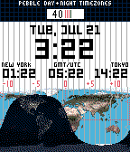

---
hide:
  - toc
---

<!-- Generated by scripts/update_app_directory.py: do not edit by hand -->
# Pebble Watchfaces: D

[← All Pebble Watchfaces](../watchfaces.md) · [A](a.md) · [B](b.md) · [C](c.md) · **D** · [E](e.md) · [F](f.md) · [G](g.md) · [H](h.md) · [I](i.md) · [J](j.md) · [K](k.md) · [L](l.md) · [M](m.md) · [N](n.md) · [O](o.md) · [P](p.md) · [Q](q.md) · [R](r.md) · [S](s.md) · [T](t.md) · [U](u.md) · [V](v.md) · [W](w.md) · [X](x.md) · [Y](y.md) · [Z](z.md) · [0–9 & other](other.md)

*137 watchfaces · Last updated 2026-10-06 · [About these lists](../about-app-lists.md)*

<h2 class="app-name" id="app-554bbc995fa04f0497000068"><a href="https://apps.repebble.com/554bbc995fa04f0497000068">Daily Routine</a></h2>
<a class="app-source" href="https://github.com/gedaiu/DailyRoutine" title="Source code" data-search-exclude>View source</a>

by <a href="https://apps.repebble.com/apps/dev/szabo-bogdan_5549266430d29cf83b00009d" title="More from this developer">Szabo Bogdan</a>

Not checked yet v1.1 Updated 2015-05-08

Runs on: Time 2, Pebble 2 Duo, Pebble 2, Time, Classic

A watch face that focuses on guiding you through your daily routine by suggesting activities instead of merely showing you the time

<h2 class="app-name" id="app-5833b4a000355a2f3a0001cf"><a href="https://apps.repebble.com/5833b4a000355a2f3a0001cf">Daily Stats</a></h2>
<a class="app-source" href="https://github.com/tylerherzog1/Pebble/blob" title="Source code" data-search-exclude>View source</a>

by <a href="https://apps.repebble.com/apps/dev/tylerherzog_52f01cc4af0eab12840004eb" title="More from this developer">tylerherzog</a>

Not checked yet v1.0 Updated 2017-04-22

Runs on: Time 2, Pebble 2 Duo, Pebble 2

Simple, efficient, and only the info you need. Designed as a project for my wife and her new Pebble2. Includes: Heart rate, step count, battery %, time, date, and bluetooth connection indicator…

<h2 class="app-name" id="app-57afcbd0f01b53329a00037f"><a href="https://apps.repebble.com/57afcbd0f01b53329a00037f">DailyRing</a></h2>
<a class="app-source" href="https://github.com/maxmoseley23/DailyRing1" title="Source code" data-search-exclude>View source</a>

by <a href="https://apps.repebble.com/apps/dev/maxwell-moseley_57afcb76bb85ed5f9b0003fc" title="More from this developer">Maxwell Moseley</a>

Not checked yet v1.6 Updated 2016-10-04

Runs on: Round 2, Time 2, Pebble 2 Duo, Pebble 2, Time Round, Time, Classic

See a full day pass with DailyRing! A full 24-hour day is expressed as a circle, while the hours, minutes, day of week, and date is expressed digitally. After 6PM, the dark theme is enabled for…

<h2 class="app-name" id="app-531c39d3edcc18d065000167"><a href="https://apps.repebble.com/531c39d3edcc18d065000167">Dali Clock</a></h2>
<a class="app-source" href="https://github.com/jwise/dalipebble" title="Source code" data-search-exclude>View source</a>

by <a href="https://apps.repebble.com/apps/dev/joshua-wise_531aa3fb7e49755eab000f7b" title="More from this developer">Joshua Wise</a>

Not checked yet v0.2 Updated 2014-03-12

Runs on: Time 2, Pebble 2 Duo, Pebble 2, Time, Classic

Dali Clock displays a digital clock; when a digit changes, it &quot;melts&quot; into its new shape. Bring a dose of surrealism to your wrist with this port of jwz&#x27;s famous xdaliclock. (Animation looks much…

<h2 class="app-name" id="app-55543f0864e9b738860000eb"><a href="https://apps.repebble.com/55543f0864e9b738860000eb">Dani</a></h2>
<a class="app-source" href="https://github.com/leovander/Dani/tree/master" title="Source code" data-search-exclude>View source</a>

by <a href="https://apps.repebble.com/apps/dev/leovander_54ef9c482e6a47d04c0000d3" title="More from this developer">leovander</a>

Not checked yet v1.8 Updated 2015-06-05

Runs on: Time 2, Pebble 2 Duo, Pebble 2, Time, Classic

- Added Config screen - Option to invert background and text (Will be adding color options for Time) - Option for larger text Suggestions? @theleovander Concept submitted by /u/danilouis on reddit.

<h2 class="app-name" id="app-52d63495f19630cbfb000005"><a href="https://apps.repebble.com/52d63495f19630cbfb000005">Dansk Tekst</a></h2>
<a class="app-source" href="https://github.com/trudslev/DanskTekst" title="Source code" data-search-exclude>View source</a>

by <a href="https://apps.repebble.com/apps/dev/sune-trudslev_52ca62f4d088ea10c600004e" title="More from this developer">Sune Trudslev</a>

Not checked yet v3.1 Updated 2015-05-20

Runs on: Time 2, Pebble 2 Duo, Pebble 2, Time, Classic

This is a watchface that uses natural danish language to display the time, using animation to change every minute, highlighting the hour.

<h2 class="app-name" id="app-9c5f123a606348c3aaa2932a"><a href="https://apps.repebble.com/9c5f123a606348c3aaa2932a">Dark Side</a></h2>
<a class="app-source" href="https://github.com/ygalanter/dark-side-pebble" title="Source code" data-search-exclude>View source</a>

by <a href="https://apps.repebble.com/apps/dev/comfortably-numb_52f547605101128b2200005a" title="More from this developer">Comfortably Numb</a>

Not checked yet v1.1.0 Updated 2026-07-05

Runs on: Time 2, Time

Digital time in form of familiar prism spectrum. Configurable colors for time, date, day of the week, and activity icon (set to black to hide). Colorful part of rainbow indicates completed fitness…

<h2 class="app-name" id="app-5313ed8043d960887200050c"><a href="https://apps.repebble.com/5313ed8043d960887200050c">Dark Side of the Moon</a></h2>
<a class="app-source" href="https://github.com/gretchycat/DarkSide" title="Source code" data-search-exclude>View source</a>

by <a href="https://apps.repebble.com/apps/dev/gretchycat_52bf60060136db31fb0000d3" title="More from this developer">Gretchycat</a>

Not checked yet v3.0 Updated 2015-10-19

Runs on: Time 2, Pebble 2 Duo, Pebble 2, Time, Classic

Features a 2 week calendar, and when you shake or tap, see a 5 day weather forecast. Tap again for sunrise, sunset and moon phase. Tap a third time for a compass! After 15 seconds, the screen will…

<h2 class="app-name" id="app-586071965de8509ab5000011"><a href="https://apps.rebble.io/en_US/application/586071965de8509ab5000011">Dark Souls Animated</a></h2>
<a class="app-source" href="http://pastebin.com/29Ucwkav" title="Source code" data-search-exclude>View source</a>

by <a href="https://apps.rebble.io/en_US/developer/585ea9a006e776c29e0002d9/1" title="More from this developer">InQ</a>

See source v1.2 Updated 2016-12-26 Rebble App Store

Runs on: Round 2, Time 2, Time Round, Time

I love Dark Souls pixel art GIFs, so I found cool to create watchface from it. I´m not owner of the GIF and font. All credits to: Eliot Truelove - font Zedotagger - GIF

<h2 class="app-name" id="app-562bf028e1455333640000c4"><a href="https://apps.repebble.com/562bf028e1455333640000c4">DataFace</a></h2>
<a class="app-source" href="http://github.com/musl/DataFace" title="Source code" data-search-exclude>View source</a>

by <a href="https://apps.repebble.com/apps/dev/mike-hix_55d89202dd77766ad6000008" title="More from this developer">Mike Hix</a>

No licence v0.6 Updated 2016-12-05

Runs on: Time 2, Time

A terse, no-foolin&#x27;, nerdy watchface for utilitarian types. You&#x27;ll need to plug in your OpenWeatherMap AppID after you install this. New in v0.6: Bug fixes and a nicer looking configuration page…

<h2 class="app-name" id="app-52b3ec30f60b55482b00000c"><a href="https://apps.repebble.com/52b3ec30f60b55482b00000c">Date Countdown</a></h2>
<a class="app-source" href="https://github.com/mcongrove/PebbleDateCountdown" title="Source code" data-search-exclude>View source</a>

by <a href="https://apps.repebble.com/apps/dev/mcongrove_52affc34e2187058f9000011" title="More from this developer">mcongrove</a>

Not checked yet v2.1 Updated 2014-01-19

Runs on: Time 2, Pebble 2 Duo, Pebble 2, Time, Classic

A Pebble watch app for counting down the number of days until an event. Colors can be inverted and the event date, time, and label can be set by accessing the settings in the Pebble application.

<h2 class="app-name" id="app-581dfbb39cbbaf50a50001c5"><a href="https://apps.repebble.com/581dfbb39cbbaf50a50001c5">datetime.sh</a></h2>
<a class="app-source" href="https://github.com/tsuharesu/codespaces-pebble/tree/main/datetime-sh" title="Source code" data-search-exclude>View source</a>

by <a href="https://apps.repebble.com/apps/dev/tsuharesu_54d74652513e9cab7d00008b" title="More from this developer">Tsuharesu</a>

Not checked yet v2.0 Updated 2025-11-21

Runs on: Time 2, Pebble 2 Duo, Pebble 2, Time, Classic

datetime.sh is a sleek, terminal-inspired watchface that brings retro command-line aesthetics to your Pebble smartwatch. Display real-time date, time, and weather information alongside your…

<h2 class="app-name" id="app-55b7a86cc156bdec1c00006e"><a href="https://apps.repebble.com/55b7a86cc156bdec1c00006e">Day &amp; Night Timezones</a></h2>
<a class="app-source" href="https://github.com/mereed/pebbleface-daynighttimezones" title="Source code" data-search-exclude>View source</a>

by <a href="https://apps.repebble.com/apps/dev/chops_52d76309bd61272345000001" title="More from this developer">chops</a>

Not checked yet v1.0 Updated 2015-07-28

Runs on: Time 2, Pebble 2 Duo, Pebble 2, Time, Classic

Here the code was entirely written by David Gianforte, then modified and shared by &#x27;Ben&#x27;. I&#x27;ve just modified the design and layout. The idea is to demonstrate the benefit and advantage of an…

<h2 class="app-name" id="app-530bd23d3add7beccc0001e3"><a href="https://apps.repebble.com/530bd23d3add7beccc0001e3">Day and Night Earth Watchface</a></h2>
<a class="app-source" href="https://github.com/rengianforte/pebble-day-night" title="Source code" data-search-exclude>View source</a>

by <a href="https://apps.repebble.com/apps/dev/ren-gianforte_53066f557f35761076000456" title="More from this developer">Ren Gianforte</a>

Not checked yet v1.7.0 Updated 2026-06-10

Runs on: Time 2, Pebble 2 Duo, Pebble 2, Time, Classic

This watchface shows a world map with the current sunlight coverage, along with the time and date. Watch daylight pass across the earth as the day goes by, and see how the sun hits the earth at…

<h2 class="app-name" id="app-567df476c247f817dd0003b9"><a href="https://apps.repebble.com/567df476c247f817dd0003b9">Day&amp;Night</a></h2>
<a class="app-source" href="https://github.com/zeaga/day-night" title="Source code" data-search-exclude>View source</a>

by <a href="https://apps.repebble.com/apps/dev/zeaga_567d8d0f07ac23306d00027c" title="More from this developer">Zeaga</a>

Not checked yet v1.0 Updated 2015-12-26

Runs on: Round 2, Time 2, Pebble 2 Duo, Pebble 2, Time Round, Time, Classic

A simple digital watchface made for practice. Changes color based on time or day!

<h2 class="app-name" id="app-52f7e1067847556b4c0004dd"><a href="https://apps.repebble.com/52f7e1067847556b4c0004dd">Day/Night City</a></h2>
<a class="app-source" href="https://github.com/dexif/DayNightCity" title="Source code" data-search-exclude>View source</a>

by <a href="https://apps.repebble.com/apps/dev/dexif_52cfaf52516669ee6b00003a" title="More from this developer">Dexif</a>

Not checked yet v1.0.1 Updated 2014-02-10

Runs on: Time 2, Pebble 2 Duo, Pebble 2, Time, Classic

At 6 am/pm starts Day/Night mode.

<h2 class="app-name" id="app-52f7fd2a14e54a5df20005a6"><a href="https://apps.repebble.com/52f7fd2a14e54a5df20005a6">Day/Night Minsk</a></h2>
<a class="app-source" href="https://github.com/dexif/DayNightCity" title="Source code" data-search-exclude>View source</a>

by <a href="https://apps.repebble.com/apps/dev/dexif_52cfaf52516669ee6b00003a" title="More from this developer">Dexif</a>

Not checked yet v1.0.1 Updated 2014-02-10

Runs on: Time 2, Pebble 2 Duo, Pebble 2, Time, Classic

At 6 am/pm starts Day/Night Minsk mode.

<h2 class="app-name" id="app-59c177830dfc32dd14001de1"><a href="https://apps.rebble.io/en_US/application/59c177830dfc32dd14001de1">DayDateSteps</a></h2>
<a class="app-source" href="https://pastebin.com/k21wFaGp" title="Source code" data-search-exclude>View source</a>

by <a href="https://apps.rebble.io/en_US/developer/578e4db484242884d6000091/1" title="More from this developer">Furfx</a>

Not checked yet v1.0 Updated 2017-09-19 Rebble App Store

Runs on: Time 2, Pebble 2 Duo, Pebble 2

Simple watchface made as a programming test. Shows the current date and steps.

<h2 class="app-name" id="app-56a008b742c3a13be8000065"><a href="https://apps.repebble.com/56a008b742c3a13be8000065">DayFace</a></h2>
<a class="app-source" href="https://github.com/willwoz/DayFace" title="Source code" data-search-exclude>View source</a>

by <a href="https://apps.repebble.com/apps/dev/willwoz_568f17b4056c38f65e00001f" title="More from this developer">willwoz</a>

Not checked yet v7 Updated 2016-10-09

Runs on: Round 2, Time 2, Pebble 2 Duo, Pebble 2, Time Round, Time, Classic

Simple, clean watch face that now has hands and digits, and counts days up or down, for anyone who needs to count days up or down. Configurable battery and connection alert, and background and…

<h2 class="app-name" id="app-52cdd4a72797163d1a000001"><a href="https://apps.repebble.com/52cdd4a72797163d1a000001">Daylight</a></h2>
<a class="app-source" href="https://github.com/mcongrove/PebbleDaylight" title="Source code" data-search-exclude>View source</a>

by <a href="https://apps.repebble.com/apps/dev/mcongrove_52affc34e2187058f9000011" title="More from this developer">mcongrove</a>

Not checked yet v1.1 Updated 2014-01-19

Runs on: Time 2, Pebble 2 Duo, Pebble 2, Time, Classic

A Pebble watch face that shows the daylight as it streaks across the globe. Land masses can be shown or hidden by accessing the settings in the Pebble application.

<h2 class="app-name" id="app-587352f85de8506635000363"><a href="https://apps.rebble.io/en_US/application/587352f85de8506635000363">DayNight Timezones 2</a></h2>
<a class="app-source" href="https://github.com/mereed/pebbleface-dntz" title="Source code" data-search-exclude>View source</a>

by <a href="https://apps.rebble.io/en_US/developer/52d76309bd61272345000001/1" title="More from this developer">chops</a>

Not checked yet v1.0 Updated 2017-01-09 Rebble App Store

Runs on: Round 2, Time 2, Pebble 2 Duo, Pebble 2, Time Round, Time, Classic

Here the code to calculate day/night on the map was written by David Gianforte, then modified and shared by &#x27;Ben’, then by me. I&#x27;ve modified the design and layout, and added a few different styles…

<h2 class="app-name" id="app-67c32b1fb7a02300092ba059"><a href="https://apps.repebble.com/67c32b1fb7a02300092ba059">Dayring</a></h2>
<a class="app-source" href="https://github.com/C-D-Lewis/pebble-dev" title="Source code" data-search-exclude>View source</a>

by <a href="https://apps.repebble.com/apps/dev/chris-lewis_5299cd30e627ce1147000099" title="More from this developer">Chris Lewis</a>

No licence v1.3 Updated 2025-12-28

Runs on: Round 2, Time 2, Pebble 2 Duo, Pebble 2, Time Round, Time, Classic

Port of the Fitbit watchface of the same name, showing a colorful ring of minutes through the hour in two colors, one for day and another for night. The progress is animated upon launch.

<h2 class="app-name" id="app-58c3fb980dfc32a52a000893"><a href="https://apps.rebble.io/en_US/application/58c3fb980dfc32a52a000893">days since / til</a></h2>
<a class="app-source" href="https://github.com/laDanz/days-since-til" title="Source code" data-search-exclude>View source</a>

by <a href="https://apps.rebble.io/en_US/developer/56a28b05956f0b4d4c000055/1" title="More from this developer">ChristianD</a>

Not checked yet v1.2 Updated 2017-03-16 Rebble App Store

Runs on: Time 2, Pebble 2 Duo, Pebble 2, Time, Classic

Showing the time, and the days since your personal special date and the days til your next anniversary. If date provided in settings is not in the future, your display switches every minute…

<h2 class="app-name" id="app-5459d6dbc3428c790100000f"><a href="https://apps.repebble.com/5459d6dbc3428c790100000f">DayWidget</a></h2>
<a class="app-source" href="https://github.com/RichardGG/DayWidget2" title="Source code" data-search-exclude>View source</a>

by <a href="https://apps.repebble.com/apps/dev/richardgg_52f050253be620a1910000b6" title="More from this developer">RichardGG</a>

No licence v1.0 Updated 2014-11-05

Runs on: Time 2, Pebble 2 Duo, Pebble 2, Time, Classic

A simple widget displaying the day, date and month. Handy if you use watchfaces without the date.

<h2 class="app-name" id="app-540888f892ecf49ebe000106"><a href="https://apps.repebble.com/540888f892ecf49ebe000106">DB 31</a></h2>
<a class="app-source" href="http://www.github.com/pjexposito/DB31" title="Source code" data-search-exclude>View source</a>

by <a href="https://apps.repebble.com/apps/dev/pedro_535907fa2acb26c7e50001b1" title="More from this developer">Pedro</a>

No licence v2.6 Updated 2016-11-07

Runs on: Time 2, Pebble 2 Duo, Pebble 2, Time, Classic

Watchface based on Casio Data Bank 31. All the watchface code (almost everything) is taken from 91 Dub watchface (maybe the best watchface on Pebble Store). So this is my little contribution. Now…

<h2 class="app-name" id="app-53f52c9e5586fb3a4d00002f"><a href="https://apps.repebble.com/53f52c9e5586fb3a4d00002f">DB 31 (español)</a></h2>
<a class="app-source" href="https://github.com/pjexposito/DB31-original" title="Source code" data-search-exclude>View source</a>

by <a href="https://apps.repebble.com/apps/dev/pedro_535907fa2acb26c7e50001b1" title="More from this developer">Pedro</a>

Not checked yet v1 Updated 2014-08-20

Runs on: Time 2, Pebble 2 Duo, Pebble 2, Time, Classic

Versión desactualizada. Se recomienda usar la versión DB 31 normal. Esta versión no tiene soporte y ha perdido funcionalidad. Esta nueva versión permite cambiar el idioma y varias cosas más. Por…

<h2 class="app-name" id="app-5817e11621032e184e000017"><a href="https://apps.rebble.io/en_US/application/5817e11621032e184e000017">DB Pendel Bahn</a></h2>
<a class="app-source" href="https://github.com/moerunner/DBPendelBahn" title="Source code" data-search-exclude>View source</a>

by <a href="https://apps.rebble.io/en_US/developer/56353c069ac02bf83300000e/1" title="More from this developer">Wiegand</a>

Not checked yet v1.13 Updated 2017-12-15 Rebble App Store

Runs on: Round 2, Time 2, Pebble 2 Duo, Pebble 2, Time Round, Time

public transportation watchface for germany / europe. webscraper for deutsche bahn website. Das Watchface überwacht eine Bahnverbindung inklusive Verspätung und ändert Mittags(konfigurierbar) die…

<h2 class="app-name" id="app-d5e9e846043c48b7b4d14367"><a href="https://apps.repebble.com/d5e9e846043c48b7b4d14367">DBZ Power Level Tracker</a></h2>
<a class="app-source" href="https://github.com/Julien1138/dbz-power-level-tracker" title="Source code" data-search-exclude>View source</a>

by <a href="https://apps.repebble.com/apps/dev/julien1138_9f1fd54dc8c8710b3d1187d7" title="More from this developer">Julien1138</a>

No licence v1.4.1 Updated 2026-05-08

Runs on: Round 2, Time 2, Pebble 2 Duo, Pebble 2, Time Round, Time, Classic

# DBZ Power Level Tracker A Dragon Ball Z-themed Pebble watchface that tracks your daily step count as a power level. Reach 7,000 steps and watch Goku transform into a Super Saiyan. ## Features …

<h2 class="app-name" id="app-5689593664bdb848c500000f"><a href="https://apps.repebble.com/5689593664bdb848c500000f">Deadpül</a></h2>
<a class="app-source" href="https://github.com/CMorooney/deadpool_pebble" title="Source code" data-search-exclude>View source</a>

by <a href="https://apps.repebble.com/apps/dev/cmorooney_563e2f83cb095e3386000050" title="More from this developer">CMorooney</a>

No licence v1.1 Updated 2016-06-20

Runs on: Round 2, Time 2, Time Round, Time

watchface to celebrate your love for deadpool

<h2 class="app-name" id="app-555d8cbdc6ea7e6d780000a1"><a href="https://apps.repebble.com/555d8cbdc6ea7e6d780000a1">Decelerate - Northern Hemisphere</a></h2>
<a class="app-source" href="https://github.com/OMerkel/pebble-samples" title="Source code" data-search-exclude>View source</a>

by <a href="https://apps.repebble.com/apps/dev/oliver-merkel_55592fc6b038d44f9e00003e" title="More from this developer">Oliver Merkel</a>

MIT v1.0 Updated 2016-03-26

Runs on: Time 2, Pebble 2 Duo, Pebble 2, Time, Classic

Decelerate your day with a less stressful time display. Exact time is shown by analog hour hand only. Additional feature is the display of the current Moon phase. The watchface shows a single hour…

<h2 class="app-name" id="app-5573b7db788211edc60000c2"><a href="https://apps.repebble.com/5573b7db788211edc60000c2">Decelerate - Southern Hemisphere</a></h2>
<a class="app-source" href="https://github.com/OMerkel/pebble-samples" title="Source code" data-search-exclude>View source</a>

by <a href="https://apps.repebble.com/apps/dev/oliver-merkel_55592fc6b038d44f9e00003e" title="More from this developer">Oliver Merkel</a>

MIT v1.0 Updated 2016-03-26

Runs on: Time 2, Pebble 2 Duo, Pebble 2, Time, Classic

Decelerate your day with a less stressful time display. Exact time is shown by analog hour hand only. Additional feature is the display of the current Moon phase. The watchface shows a single hour…

<h2 class="app-name" id="app-54a2d4325c486f01df0000f0"><a href="https://apps.repebble.com/54a2d4325c486f01df0000f0">Decimal.Time</a></h2>
<a class="app-source" href="https://github.com/dewguzzler/Decimal.time" title="Source code" data-search-exclude>View source</a>

by <a href="https://apps.repebble.com/apps/dev/jpdesigns_531a21865af660f5fd00034f" title="More from this developer">jpdesigns</a>

Not checked yet v1.0 Updated 2014-12-30

Runs on: Time 2, Pebble 2 Duo, Pebble 2, Time, Classic

Used during the French Revolution, Decimal time has 10 hours in a day, 100 minutes in an hour, and 100 seconds per minute. Since decimal time has no practical use other than being an oddity, in…

<h2 class="app-name" id="app-559fa334f6ecd1b150000014"><a href="https://apps.repebble.com/559fa334f6ecd1b150000014">Decor</a></h2>
<a class="app-source" href="https://github.com/tujensen/roboticon-watchface" title="Source code" data-search-exclude>View source</a>

by <a href="https://apps.repebble.com/apps/dev/roboticon_55145ae14a59e2b524000006" title="More from this developer">Roboticon</a>

Not checked yet v2.2 Updated 2016-07-14

Runs on: Round 2, Time 2, Pebble 2 Duo, Pebble 2, Time Round, Time, Classic

Decor is simple. Shows what range the seconds are in with a different color, cycles between colors and has a custom font.

<h2 class="app-name" id="app-55af6541f5227466c100004f"><a href="https://apps.repebble.com/55af6541f5227466c100004f">Decor Minutes</a></h2>
<a class="app-source" href="https://github.com/tujensen/decor_minutes" title="Source code" data-search-exclude>View source</a>

by <a href="https://apps.repebble.com/apps/dev/roboticon_55145ae14a59e2b524000006" title="More from this developer">Roboticon</a>

Not checked yet v1.0 Updated 2015-07-22

Runs on: Time 2, Time

Simple watchface displaying time as minutes and hours and seconds as an expanding rectangle.

<h2 class="app-name" id="app-67def87c122b40000904b4f0"><a href="https://apps.repebble.com/67def87c122b40000904b4f0">Deep Rock</a></h2>
<a class="app-source" href="https://github.com/C-D-Lewis/pebble-dev" title="Source code" data-search-exclude>View source</a>

by <a href="https://apps.repebble.com/apps/dev/chris-lewis_5299cd30e627ce1147000099" title="More from this developer">Chris Lewis</a>

No licence v1.3.0 Updated 2026-07-18

Runs on: Time 2, Pebble 2 Duo, Pebble 2, Time, Classic

Listen up, miners! Management has seen fit to outfit you with the latest device from R&amp;D - a wrist-mounted display. Apparently the standard mission timer wasn&#x27;t enough to keep you on time and on…

<h2 class="app-name" id="app-54558ae17871923078000014"><a href="https://apps.repebble.com/54558ae17871923078000014">Defaced</a></h2>
<a class="app-source" href="https://github.com/ben-hudson/defaced" title="Source code" data-search-exclude>View source</a>

by <a href="https://apps.repebble.com/apps/dev/ben-hudson_5321a477c854ef9df40000d2" title="More from this developer">Ben Hudson</a>

No licence v1.1 Updated 2014-11-22

Runs on: Time 2, Pebble 2 Duo, Pebble 2, Time, Classic

An infinitely customizable watchface.

<h2 class="app-name" id="app-531f27654d23447f150001ef"><a href="https://apps.repebble.com/531f27654d23447f150001ef">Default Watchface RU</a></h2>
<a class="app-source" href="http://www.bafoed.net/post/36194/" title="Source code" data-search-exclude>View source</a>

by <a href="https://apps.repebble.com/apps/dev/bafoed_530752f455bea2eedd000171" title="More from this developer">bafoed</a>

See source v1.0.0 Updated 2014-03-11

Runs on: Time 2, Pebble 2 Duo, Pebble 2, Time, Classic

Default pebble watchface with russian language.

<h2 class="app-name" id="app-6d8da4ce71164976855a854e"><a href="https://apps.repebble.com/6d8da4ce71164976855a854e">Demi</a></h2>
<a class="app-source" href="https://github.com/mrtruebeliever/pebble-demi" title="Source code" data-search-exclude>View source</a>

by <a href="https://apps.repebble.com/apps/dev/mrtruebeliever_5f8814a92a6f109602136f61" title="More from this developer">mrTrueBeliever</a>

Not checked yet v1.7.0 Updated 2026-08-13

Runs on: Time 2

A vector watchface that tracks whatever matters to you. Bold vector digits with progress bars for steps, daylight, battery or your own JSON stat - plus weather, sunrise/sunset and a light theme…

<h2 class="app-name" id="app-6829ee069844c10008ad576c"><a href="https://apps.repebble.com/6829ee069844c10008ad576c">Demonic Descent</a></h2>
<a class="app-source" href="https://github.com/HarrisonAllen/angels-and-demons" title="Source code" data-search-exclude>View source</a>

by <a href="https://apps.repebble.com/apps/dev/harrison-allen_5e28ea923dd3109f151c7e08" title="More from this developer">Harrison Allen</a>

No licence v1.0 Updated 2025-05-18

Runs on: Round 2, Time 2, Pebble 2 Duo, Pebble 2, Time Round, Time, Classic

Become enveloped by your inner demon with Demonic Descent, with the following features: * Time * Date * Weather * Temperature * Shown as a range from very cold (30F) to very hot(100F), with…

<h2 class="app-name" id="app-55804cecda869326a200003b"><a href="https://apps.repebble.com/55804cecda869326a200003b">DEVELOPERS ONLY - Day Night Map Color</a></h2>
<a class="app-source" href="https://github.com/pebbleben/PebbleWorldClockv2" title="Source code" data-search-exclude>View source</a>

by <a href="https://apps.repebble.com/apps/dev/ben_54f25b84bc88df9cfc0000e2" title="More from this developer">Ben</a>

Not checked yet v2 Updated 2015-06-16

Runs on: Time 2, Pebble 2 Duo, Pebble 2, Time, Classic

Welcome, this watchface is ONLY for developers as anyone else will be frustrated that you cannot change the time zones. If you follow this link you can download all the source code, choose…

<h2 class="app-name" id="app-5772d71fba2fe566a10003e2"><a href="https://apps.repebble.com/5772d71fba2fe566a10003e2">devRant unofficial</a></h2>
<a class="app-source" href="https://github.com/olpeh/pebble-devrant-watchface" title="Source code" data-search-exclude>View source</a>

by <a href="https://apps.repebble.com/apps/dev/olpe_57307f32283c49bbd0000015" title="More from this developer">Olpe</a>

Not checked yet v1.0 Updated 2016-06-28

Runs on: Round 2, Time 2, Pebble 2 Duo, Pebble 2, Time Round, Time, Classic

devRant unofficial watchface

<h2 class="app-name" id="app-5f682eb451c0ff2d3f0f28d8"><a href="https://apps.rebble.io/en_US/application/5f682eb451c0ff2d3f0f28d8">Dexcom Share CGM</a></h2>
<a class="app-source" href="https://github.com/pauleeeeee/pebble-dexcom-share-cgm" title="Source code" data-search-exclude>View source</a>

by <a href="https://apps.rebble.io/en_US/developer/5e65d05a3dd3108f341c08ea/1" title="More from this developer">swansswansswansswanssosoft</a>

Not checked yet v1.2 Updated 2021-12-10 Rebble App Store

Runs on: Round 2, Time 2, Pebble 2 Duo, Pebble 2, Time Round, Time, Classic

Updated Dexcom Share CGM watch face for the Pebble smart watch. Replaces Simple CGM which broke in September of 2020. This is a watch face that people with Type 1 Diabetes can use to monitor blood…

<h2 class="app-name" id="app-56512a8ba69d971f08000038"><a href="https://apps.repebble.com/56512a8ba69d971f08000038">Dial</a></h2>
<a class="app-source" href="https://github.com/ItsPriyesh/Dial" title="Source code" data-search-exclude>View source</a>

by <a href="https://apps.repebble.com/apps/dev/priyesh-patel_557effc2e512e387fd000038" title="More from this developer">Priyesh Patel</a>

No licence v1.1 Updated 2015-12-05

Runs on: Round 2, Time 2, Time Round, Time

A watchface. Shake to show the date.

<h2 class="app-name" id="app-56931746a45b56940a000017"><a href="https://apps.repebble.com/56931746a45b56940a000017">Diamond</a></h2>
<a class="app-source" href="https://github.com/bani/pebble-diamond" title="Source code" data-search-exclude>View source</a>

by <a href="https://apps.repebble.com/apps/dev/bani_5668b28f638b2661bc000069" title="More from this developer">Bani</a>

MIT v2.1 Updated 2016-02-14

Runs on: Round 2, Time Round

It&#x27;s time for smart jewellery. They say diamonds are a girl&#x27;s best friend, so now you can carry around this huge virtual diamond. Your Pebble Time Round will display this glorious 2cm of sparkling…

<h2 class="app-name" id="app-52e79fe4f6e72005f7000016"><a href="https://apps.rebble.io/en_US/application/52e79fe4f6e72005f7000016">Diary Face 2.0</a></h2>
<a class="app-source" href="https://github.com/JamesFowler42/diaryface20" title="Source code" data-search-exclude>View source</a>

by <a href="https://apps.rebble.io/en_US/developer/52b208abb70e1ced1f00004c/1" title="More from this developer">James Fowler</a>

No licence v2.7 Updated 2015-06-20 Rebble App Store

Runs on: Time 2, Pebble 2 Duo, Pebble 2, Time, Classic

Smartwatch Pro animated calendar watchface. Relative dates on events. 12/24 hr. Speeds up when you are moving, slows down to save battery when you are not. Watchface settings from inside…

<h2 class="app-name" id="app-61ab915a535326000935a5c3"><a href="https://apps.rebble.io/en_US/application/61ab915a535326000935a5c3">Diary Face 3.0</a></h2>
<a class="app-source" href="https://github.com/haikalfouzi/diaryface20" title="Source code" data-search-exclude>View source</a>

by <a href="https://apps.rebble.io/en_US/developer/5dd7dbf5651caf0001add4f6/1" title="More from this developer">Haikal Fouzi</a>

Not checked yet v2.8 Updated 2021-12-04 Rebble App Store

Runs on: Time 2, Pebble 2 Duo, Pebble 2, Time, Classic

Interactive watchface for busy people! - Animated calendar cycles up to 5 recent event. - Switch between 12 or 24 hour mode. - Battery saving feature: 5s interval for the calendar animation when…

<h2 class="app-name" id="app-5a12eafb0dfc321c12000c40"><a href="https://apps.rebble.io/en_US/application/5a12eafb0dfc321c12000c40">Dices</a></h2>
<a class="app-source" href="https://github.com/ZarsBranchkin/pebble-dices" title="Source code" data-search-exclude>View source</a>

by <a href="https://apps.rebble.io/en_US/developer/5523e483c190e0c27e00001d/1" title="More from this developer">Valts</a>

No licence v1.0 Updated 2017-11-20 Rebble App Store

Runs on: Time 2, Pebble 2 Duo, Pebble 2, Time, Classic

Simple and clean dice watchface. Currently black and white.

<h2 class="app-name" id="app-54789b6d6e0cd3c92300007f"><a href="https://apps.repebble.com/54789b6d6e0cd3c92300007f">Dickbutt</a></h2>
<a class="app-source" href="https://github.com/snare/dickbutt" title="Source code" data-search-exclude>View source</a>

by <a href="https://apps.repebble.com/apps/dev/snare_531f0a780f3ef78a3a00014c" title="More from this developer">snare</a>

Not checked yet v1.0 Updated 2014-11-28

Runs on: Time 2, Pebble 2 Duo, Pebble 2, Time, Classic

It&#x27;s always dickbutt time

<h2 class="app-name" id="app-57dc94602a6ea665510000f0"><a href="https://apps.repebble.com/57dc94602a6ea665510000f0">Diderot</a></h2>
<a class="app-source" href="https://github.com/ragesoss/diderot" title="Source code" data-search-exclude>View source</a>

by <a href="https://apps.repebble.com/apps/dev/sage-ross_57801d326c21044501000e1d" title="More from this developer">Sage Ross</a>

Not checked yet v1.3 Updated 2016-12-10

Runs on: Round 2, Time 2, Pebble 2 Duo, Pebble 2, Time Round, Time, Classic

Diderot shows you the nearest unphotographed Wikipedia article to you, along with the distance and direction. You&#x27;ll also get a notification whenever you&#x27;re near an unphotographed location that is…

<h2 class="app-name" id="app-52e019c0dbbbf9fbf4000143"><a href="https://apps.repebble.com/52e019c0dbbbf9fbf4000143">Digalog</a></h2>
<a class="app-source" href="https://github.com/Stopka/Digalog" title="Source code" data-search-exclude>View source</a>

by <a href="https://apps.repebble.com/apps/dev/stopka_52b3394dcd41836fcb000101" title="More from this developer">Stopka</a>

No licence v4.1 Updated 2014-12-10

Runs on: Time 2, Pebble 2 Duo, Pebble 2, Time, Classic

Simple and practical watchface showing week day, date and both digital and analog clock. On lost bluetooth connection it shows notification icon and vibes shortly. It shows also low pebble battery…

<h2 class="app-name" id="app-55997be0a3e668a6ea000063"><a href="https://apps.repebble.com/55997be0a3e668a6ea000063">Digilog</a></h2>
<a class="app-source" href="https://github.com/reini1305/digilog" title="Source code" data-search-exclude>View source</a>

by <a href="https://apps.repebble.com/apps/dev/christian-reinbacher_52d29655c44c044e9f00004f" title="More from this developer">Christian Reinbacher</a>

Not checked yet v2.1 Updated 2016-10-24

Runs on: Round 2, Time 2, Pebble 2 Duo, Pebble 2, Time Round, Time, Classic

Digilog is open source. If you like it, give it a heart and consider a donation (link is at the website linked down below). Simple combination of analog and digital watchface. The hours are shown…

<h2 class="app-name" id="app-56f9fa043c131b30f1000029"><a href="https://apps.repebble.com/56f9fa043c131b30f1000029">DigiMe</a></h2>
<a class="app-source" href="https://github.com/workinghard/DigiMe" title="Source code" data-search-exclude>View source</a>

by <a href="https://apps.repebble.com/apps/dev/nikolai-rinas_56ab240fd025c2abc5000015" title="More from this developer">Nikolai Rinas</a>

Not checked yet v1.7 Updated 2025-11-25

Runs on: Round 2, Time 2, Pebble 2 Duo, Pebble 2, Time Round, Time, Classic

Just a simple and fast watch face. Sun and moon will follow you through the day. Temperature is based on current location and http://openweathermap.org data. Small bars indicates the battery…

<h2 class="app-name" id="app-54ac997c32203e8f5c000016"><a href="https://apps.repebble.com/54ac997c32203e8f5c000016">Diginalog</a></h2>
<a class="app-source" href="https://github.com/ygalanter/diginalog_watchface" title="Source code" data-search-exclude>View source</a>

by <a href="https://apps.repebble.com/apps/dev/comfortably-numb_52f547605101128b2200005a" title="More from this developer">Comfortably Numb</a>

Not checked yet v2.5 Updated 2015-10-16

Runs on: Round 2, Time 2, Pebble 2 Duo, Pebble 2, Time Round, Time, Classic

Combination digital and analog watchface. Minute and hour hands bear minute and hour digital values respectfully. Number in the middle is day of the month. Also featuring: Day of the week, month…

<h2 class="app-name" id="app-551413fd369eea6b910000c5"><a href="https://apps.repebble.com/551413fd369eea6b910000c5">DigiRotate</a></h2>
<a class="app-source" href="https://github.com/czmanix/DigiRotate" title="Source code" data-search-exclude>View source</a>

by <a href="https://apps.repebble.com/apps/dev/tomhol_546bbedb71d611761800000f" title="More from this developer">TomHol</a>

Not checked yet v1.26 Updated 2015-03-31

Runs on: Time 2, Pebble 2 Duo, Pebble 2, Time, Classic

Rotating digital watch based on a Reddit request. Original mechanical watch is this: http://imgur.com/gallery/XdjPP7R

<h2 class="app-name" id="app-5415b1c4df02a24e5f00015b"><a href="https://apps.repebble.com/5415b1c4df02a24e5f00015b">Digital Live</a></h2>
<a class="app-source" href="https://github.com/noah95/DigitalLive" title="Source code" data-search-exclude>View source</a>

by <a href="https://apps.repebble.com/apps/dev/noah_5361452920d31c440e00020b" title="More from this developer">Noah</a>

Not checked yet v1.0 Updated 2014-09-14

Runs on: Time 2, Pebble 2 Duo, Pebble 2, Time, Classic

A simple, digital, retro and energy saving watchface for your pebble.

<h2 class="app-name" id="app-5547cb2a85905014430000a5"><a href="https://apps.repebble.com/5547cb2a85905014430000a5">Digital Power</a></h2>
<a class="app-source" href="https://github.com/rgarth/PebbleDigitalPower" title="Source code" data-search-exclude>View source</a>

by <a href="https://apps.repebble.com/apps/dev/rob-garth_52f1fc5b7247497b640000dc" title="More from this developer">Rob Garth</a>

Not checked yet v1.3 Updated 2017-11-14

Runs on: Time 2, Time

LCD/Alarm-Clock inspired watch-face. Color can either change depending on battery power (Green/Orange/Red), or it can be configured to any of the 64 colors available on the Pebble Time.

<h2 class="app-name" id="app-574008692b7d649524000004"><a href="https://apps.repebble.com/574008692b7d649524000004">Digitalin</a></h2>
<a class="app-source" href="https://github.com/remi-gelinas/digitalin" title="Source code" data-search-exclude>View source</a>

by <a href="https://apps.repebble.com/apps/dev/remi-gelinas_56fbf21ce673a954e800003b" title="More from this developer">Remi Gelinas</a>

Not checked yet v1.0 Updated 2016-05-21

Runs on: Time 2, Pebble 2 Duo, Pebble 2, Time, Classic

Digitalin is a heavily modified custom version of the stunningly elegant watchface Minimalin. Please report any issues through the Github repository issue tracker :D If you&#x27;re looking for a…

<h2 class="app-name" id="app-52e12757fae0b7603000023c"><a href="https://apps.repebble.com/52e12757fae0b7603000023c">Digitaltekst</a></h2>
<a class="app-source" href="http://github.com/brujoand/digitaltekst.git" title="Source code" data-search-exclude>View source</a>

by <a href="https://apps.repebble.com/apps/dev/brujoand_52a93e9b79c18f9ede00001d" title="More from this developer">brujoand</a>

No licence v1.0.0 Updated 2014-01-23

Runs on: Time 2, Pebble 2 Duo, Pebble 2, Time, Classic

A simple wathcface in norwegian that shows digital time in text. Go figure..

<h2 class="app-name" id="app-54ece483b5dab688970000b8"><a href="https://apps.repebble.com/54ece483b5dab688970000b8">Digits</a></h2>
<a class="app-source" href="https://github.com/UgoRaffaele/Digits-pebble" title="Source code" data-search-exclude>View source</a>

by <a href="https://apps.repebble.com/apps/dev/ugo-raffaele-piemontese_54a54a335d5a91a9d300005e" title="More from this developer">Ugo Raffaele Piemontese</a>

GPL-3.0 v1.0 Updated 2015-02-24

Runs on: Time 2, Pebble 2 Duo, Pebble 2, Time, Classic

Vaguely inspired by Pebble Time new watchfaces. The hour is highlighted by a simple, grey background, while white digits all around are randomly displayed all around. Credits: the &quot;Inversionz&quot;…

<h2 class="app-name" id="app-54a90952ae94cff8c600003f"><a href="https://apps.repebble.com/54a90952ae94cff8c600003f">digitZ</a></h2>
<a class="app-source" href="https://github.com/zecoj/digitZ" title="Source code" data-search-exclude>View source</a>

by <a href="https://apps.repebble.com/apps/dev/ben-nguyen_5481875759fcc2e9ef000148" title="More from this developer">Ben Nguyen</a>

Not checked yet v1.3 Updated 2015-01-06

Runs on: Time 2, Pebble 2 Duo, Pebble 2, Time, Classic

An improved clone of the famous DIGITTMM (by Albert Salamon) Improvements: - Much better memory usage (I have redrawn &amp; created ttf from scratch) - Shake to show battery, bluetooth connectivity…

<h2 class="app-name" id="app-6a9ac7065266090009437eac"><a href="https://apps.rebble.io/en_US/application/6a9ac7065266090009437eac">Digivice Watchface</a></h2>
<a class="app-source" href="https://github.com/crims0n/digivice-watchface" title="Source code" data-search-exclude>View source</a>

by <a href="https://apps.rebble.io/en_US/developer/68f926c8b2e4450009362a34/1" title="More from this developer">crims0n</a>

Not checked yet v1.0 Updated 2026-09-04 Rebble App Store

Runs on: Round 2, Time 2, Pebble 2 Duo, Pebble 2, Time Round, Time, Classic

A clean, retro watchface inspired by the classic Digimon Digivice virtual pet! Features: • Classic pixel-styled digital clock with persistent AM / PM indicator. • 5 animated chevron arrows…

<h2 class="app-name" id="app-5504e0338d3907b61e00004e"><a href="https://apps.repebble.com/5504e0338d3907b61e00004e">Dimension</a></h2>
<a class="app-source" href="https://github.com/richinfante/dimension-watchface" title="Source code" data-search-exclude>View source</a>

by <a href="https://apps.repebble.com/apps/dev/rich-infante_5473f270a7cd72aefe0000e1" title="More from this developer">Rich Infante</a>

Not checked yet v2.0 Updated 2025-02-18

Runs on: Round 2, Time 2, Pebble 2 Duo, Pebble 2, Time Round, Time, Classic

A simple watchface that displays the current time, in block letters. It updates the screen once a minute to save battery. It includes a configuration screen to customize the appearance of the…

<h2 class="app-name" id="app-63555cd1b9710000096ea5f8"><a href="https://apps.repebble.com/63555cd1b9710000096ea5f8">Din clean</a></h2>
<a class="app-source" href="https://github.com/Sichroteph/Din-Clean" title="Source code" data-search-exclude>View source</a>

by <a href="https://apps.repebble.com/apps/dev/christophe-jeannette_54edf0599e4ff7cbf60000a0" title="More from this developer">Christophe Jeannette</a>

No licence v1.60 Updated 2026-03-05

Runs on: Time 2, Pebble 2 Duo, Pebble 2, Time, Classic

A clean and elegant watchface for Pebble watches, designed for instant access to essential information with focus on readability and simplicity. Key features: Clear time display with large digits…

<h2 class="app-name" id="app-5530e1e17add4311280000c3"><a href="https://apps.repebble.com/5530e1e17add4311280000c3">disclock - Discordian Clock</a></h2>
<a class="app-source" href="https://github.com/plan44/disclock_pebble" title="Source code" data-search-exclude>View source</a>

by <a href="https://apps.repebble.com/apps/dev/plan44-ch_52b2a87b8c0815bb5e0000d5" title="More from this developer">plan44.ch</a>

Not checked yet v1.2 Updated 2015-10-24

Runs on: Round 2, Time 2, Pebble 2 Duo, Pebble 2, Time Round, Time, Classic

Pentagonal clock with discordian calendar display, including the 11 official holydays + Towel Day

<h2 class="app-name" id="app-56b175d810121e0f58000003"><a href="https://apps.repebble.com/56b175d810121e0f58000003">Disco</a></h2>
<a class="app-source" href="https://github.com/tripleplay369/pebble-disco" title="Source code" data-search-exclude>View source</a>

by <a href="https://apps.repebble.com/apps/dev/kelby_55b13e5fd53410746c000090" title="More from this developer">Kelby</a>

Not checked yet v1.01 Updated 2016-02-03

Runs on: Round 2, Time Round

Hybrid digital/analog watchface designed specifically for the Pebble Time Round. Let the beautiful patterns of rand() take you to another dimension.

<h2 class="app-name" id="app-52ae012503ad7a131b000016"><a href="https://apps.repebble.com/52ae012503ad7a131b000016">Discs</a></h2>
<a class="app-source" href="https://github.com/yanatan16/pebble-discs" title="Source code" data-search-exclude>View source</a>

by <a href="https://apps.repebble.com/apps/dev/jon-eisen_52a20923a38509c49e000044" title="More from this developer">Jon Eisen</a>

Not checked yet v1.0.1 Updated 2014-05-12

Runs on: Time 2, Pebble 2 Duo, Pebble 2, Time, Classic

Minimalist analog watchface using discs.

<h2 class="app-name" id="app-636f0be6fdf3e30009f6394b"><a href="https://apps.rebble.io/en_US/application/636f0be6fdf3e30009f6394b">Disintegration</a></h2>
<a class="app-source" href="https://github.com/johnspahr/pebbletemplate" title="Source code" data-search-exclude>View source</a>

by <a href="https://apps.rebble.io/en_US/developer/609801a58324660009e8a4db/1" title="More from this developer">John Spahr</a>

Not checked yet v1.1 Updated 2022-11-12 Rebble App Store

Runs on: Round 2, Time 2, Time Round, Time

Simple face based on the classic Disintegration album cover by The Cure.

<h2 class="app-name" id="app-5570e025fbe056218a000060"><a href="https://apps.repebble.com/5570e025fbe056218a000060">Divergence;Clock</a></h2>
<a class="app-source" href="https://Masamune_Shadow@bitbucket.org/Masamune_Shadow/steinsgatewatchface.git" title="Source code" data-search-exclude>View source</a>

by <a href="https://apps.repebble.com/apps/dev/spencer-johnson_52ac665331a5fa7c25000006" title="More from this developer">Spencer Johnson</a>

See source v3.0 Updated 2015-06-09

Runs on: Time 2, Time

An evolution of my Sideways Watchface for 2.x, but this time Inspired by Steins;Gate &amp; Nixie Clocks.

<h2 class="app-name" id="app-54ba785a05d4eef95600003e"><a href="https://apps.repebble.com/54ba785a05d4eef95600003e">Dizzy</a></h2>
<a class="app-source" href="https://github.com/AlexHedley/pebblewatchface_dizzy" title="Source code" data-search-exclude>View source</a>

by <a href="https://apps.repebble.com/apps/dev/alex-hedley_5485f0d2075d4c7cdc000097" title="More from this developer">Alex Hedley</a>

No licence v1.0 Updated 2015-01-17

Runs on: Time 2, Pebble 2 Duo, Pebble 2, Time, Classic

Dizzy is a member of the Yolkfolk created by the Oliver Twins

<h2 class="app-name" id="app-5674703f1caa146c2e000060"><a href="https://apps.repebble.com/5674703f1caa146c2e000060">DJ Khaled</a></h2>
<a class="app-source" href="https://github.com/VideahGams/khaled-watch" title="Source code" data-search-exclude>View source</a>

by <a href="https://apps.repebble.com/apps/dev/videahgams_5665d7cb4e130c2a7f000050" title="More from this developer">VideahGams</a>

MIT v1.0 Updated 2015-12-18

Runs on: Round 2, Time 2, Time Round, Time

You smart. You loyal. Make your pebble a real smartwatch, by having the living meme himself on your wrist.

<h2 class="app-name" id="app-52eea1c515f7074e50000002"><a href="https://apps.repebble.com/52eea1c515f7074e50000002">DobbsHead</a></h2>
<a class="app-source" href="https://github.com/lesliesbird/DobbsHead" title="Source code" data-search-exclude>View source</a>

by <a href="https://apps.repebble.com/apps/dev/lesliesbird_52ed13ae077dd4f458000033" title="More from this developer">lesliesbird</a>

Not checked yet v3.4 Updated 2016-11-29

Runs on: Round 2, Time 2, Pebble 2 Duo, Pebble 2, Time Round, Time, Classic

Remind yourself that it&#x27;s time for some Slack when you look down to see the smiling face of J.R. &quot;Bob&quot; Dobbs! As you watch, random images will flash on the watchface at random intervals. Or maybe…

<h2 class="app-name" id="app-52e4302a34ba660014000b9b"><a href="https://apps.repebble.com/52e4302a34ba660014000b9b">Doge</a></h2>
<a class="app-source" href="https://github.com/dtsbourg/Doge/tree/master" title="Source code" data-search-exclude>View source</a>

by <a href="https://apps.repebble.com/apps/dev/dylan-bourgeois_52c6eba430db18908f000088" title="More from this developer">Dylan Bourgeois</a>

Not checked yet v1.0.0 Updated 2014-01-26

Runs on: Time 2, Pebble 2 Duo, Pebble 2, Time, Classic

Wow. Such watch face. Many Pebble. To the moon !

<h2 class="app-name" id="app-530ec5272cd693ed9900012c"><a href="https://apps.repebble.com/530ec5272cd693ed9900012c">Dogecoin</a></h2>
<a class="app-source" href="https://github.com/JerrySievert/dogeface" title="Source code" data-search-exclude>View source</a>

by <a href="https://apps.repebble.com/apps/dev/legitimatesounding_52bb722bd4389301a1000069" title="More from this developer">LegitimateSounding</a>

MIT v1.0.1 Updated 2014-02-27

Runs on: Time 2, Pebble 2 Duo, Pebble 2, Time, Classic

A friendly view of Doge, including time and the current price in Satoshi&#x27;s. Please note, this watchface relies on the cryptsy API, which is frequently unavailable. Best effort is made to display…

<h2 class="app-name" id="app-5585dd229210596ce1000037"><a href="https://apps.repebble.com/5585dd229210596ce1000037">DOGEFACE</a></h2>
<a class="app-source" href="https://github.com/tristyb/PebbleDoge" title="Source code" data-search-exclude>View source</a>

by <a href="https://apps.repebble.com/apps/dev/tristan-brookes_5379eb1e675e818d3400002b" title="More from this developer">Tristan Brookes</a>

Not checked yet v1.2 Updated 2015-06-23

Runs on: Time 2, Pebble 2 Duo, Pebble 2, Time, Classic

A Doge watch face with a simple Doge vector and Comic Sans clock. Changes background colour every minute to a random selection from a choice of 3 colours.

<h2 class="app-name" id="app-5341ae4a57123caf29000411"><a href="https://apps.repebble.com/5341ae4a57123caf29000411">DogeWatch</a></h2>
<a class="app-source" href="https://github.com/tylerl0706/DogeWatch" title="Source code" data-search-exclude>View source</a>

by <a href="https://apps.repebble.com/apps/dev/ihardtdev_530d6aaac3208a834300012c" title="More from this developer">iHardtDev</a>

Not checked yet v1.0.2 Updated 2014-04-12

Runs on: Time 2, Pebble 2 Duo, Pebble 2, Time, Classic

Wow. Such watch. Very time. Displays: Time, Day of the Week, Date, battery level and a whole lot of Doge!

<h2 class="app-name" id="app-6814ecea39c746298a549282"><a href="https://apps.repebble.com/6814ecea39c746298a549282">dont-panic</a></h2>
<a class="app-source" href="https://github.com/C-D-Lewis/pebble-dev" title="Source code" data-search-exclude>View source</a>

by <a href="https://apps.repebble.com/apps/dev/chris-lewis_5299cd30e627ce1147000099" title="More from this developer">Chris Lewis</a>

No licence v1.1 Updated 2026-04-22

Runs on: Round 2, Time 2, Time Round, Time

If you don&#x27;t always know were your towel is, at least you can have this gentle reminder that in hitchhiking, the number one rule is DON&#x27;T PANIC. And also know the time as well. After all, it might…

<h2 class="app-name" id="app-5608a39ebcd03b90b2000018"><a href="https://apps.repebble.com/5608a39ebcd03b90b2000018">DOOM 2</a></h2>
<a class="app-source" href="https://github.com/PJayB/PebbleDoom2/" title="Source code" data-search-exclude>View source</a>

by <a href="https://apps.repebble.com/apps/dev/geekypanda_52c0f47dcf53857c89000034" title="More from this developer">GeekyPanda</a>

No licence v4.0 Updated 2015-10-26

Runs on: Time 2, Time

DOOM 2 watchface with battery indicator and bluetooth connection status light. Every minute, Doomguy will blow the zombie away. Tap your Pebble to fire manually! As your Pebble&#x27;s battery runs…

<h2 class="app-name" id="app-573dbd6d0d6148012f00000b"><a href="https://apps.repebble.com/573dbd6d0d6148012f00000b">Doom Guy</a></h2>
<a class="app-source" href="https://github.com/realguarroman/doomguy" title="Source code" data-search-exclude>View source</a>

by <a href="https://apps.repebble.com/apps/dev/matteo-piccina_52f10e8d3be6208c1f0020a5" title="More from this developer">Matteo Piccina</a>

Not checked yet v1.5 Updated 2016-11-09

Runs on: Round 2, Time 2, Time Round, Time

At last! Doomguy goes with you on your wrist! You can choose from two behaviors: - Doomguy health decreases as your Pebble&#x27;s battery runs out - Doomguy tracks your activity. If you don&#x27;t move Doom…

<h2 class="app-name" id="app-ecd9036b7d7d465fb9c6c701"><a href="https://apps.repebble.com/ecd9036b7d7d465fb9c6c701">Doom Iris</a></h2>
<a class="app-source" href="https://github.com/lukeslp/pebble-doom-iris" title="Source code" data-search-exclude>View source</a>

by <a href="https://apps.repebble.com/apps/dev/ambient-time_3a9986a63073f9f293be7e14" title="More from this developer">Ambient Time</a>

Not checked yet v1.5.3 Updated 2026-10-05

Runs on: Round 2, Time Round

A DOOM IRIS that opens over 24 hours, with which to INTIMIDATE YOUR ENEMIES

<h2 class="app-name" id="app-552b7f4978b9ce9bb40000db"><a href="https://apps.repebble.com/552b7f4978b9ce9bb40000db">DOS Terminal Watchface</a></h2>
<a class="app-source" href="https://github.com/ClusterM/pebble-dos" title="Source code" data-search-exclude>View source</a>

by <a href="https://apps.repebble.com/apps/dev/alexey-cluster_541d0dc59a11beda980000c8" title="More from this developer">Alexey Cluster</a>

No licence v1.2 Updated 2016-09-26

Runs on: Time 2, Pebble 2 Duo, Pebble 2, Time, Classic

Simple DOS command line style watchface. Just like &quot;CMD TIME&quot; by Chris Lewis but with &quot;terminal&quot; font.

<h2 class="app-name" id="app-c4baaf223a4542c5b985d048"><a href="https://apps.repebble.com/c4baaf223a4542c5b985d048">DOS VGA</a></h2>
<a class="app-source" href="https://github.com/manaksu/DOS-VGA" title="Source code" data-search-exclude>View source</a>

by <a href="https://apps.repebble.com/apps/dev/creative-manaks_504fe850dc7e97a445b0a10d" title="More from this developer">Creative Manaks</a>

Not checked yet v1.90 Updated 2026-05-30

Runs on: Time 2, Pebble 2 Duo, Pebble 2, Time

DOS-RPG Your wrist just rolled a NAT 20 on style. Forget clean. Forget minimal. This is your health data rendered in the glow of a CRT monitor, parsed through a dungeon crawler terminal, and…

<h2 class="app-name" id="app-554eb7485feb9d37f30000ab"><a href="https://apps.repebble.com/554eb7485feb9d37f30000ab">DOS Watchface</a></h2>
<a class="app-source" href="http://github.com/dallinac/pebbletutorial" title="Source code" data-search-exclude>View source</a>

by <a href="https://apps.repebble.com/apps/dev/raindrop_53f38fd01b9f925a1800000f" title="More from this developer">raindrop</a>

No licence v1.0 Updated 2015-05-10

Runs on: Time 2, Pebble 2 Duo, Pebble 2, Time, Classic

A simple DOS watchface (Made from the Pebble C SDK tutorial). More coming soon!

<h2 class="app-name" id="app-09ceb96d8a6f4d13a84ce1e8"><a href="https://apps.repebble.com/09ceb96d8a6f4d13a84ce1e8">Dot</a></h2>
<a class="app-source" href="https://github.com/sjmerel/dot" title="Source code" data-search-exclude>View source</a>

by <a href="https://apps.repebble.com/apps/dev/sjmerel_c3cfdea00bafd8896a186e03" title="More from this developer">sjmerel</a>

Not checked yet v1.0 Updated 2025-12-08

Runs on: Round 2, Time 2, Pebble 2 Duo, Pebble 2, Time Round, Time, Classic

Analog watchface, with... dots.

<h2 class="app-name" id="app-b08b5aae67e44880a3685e3d"><a href="https://apps.repebble.com/b08b5aae67e44880a3685e3d">Dot Face Weather</a></h2>
<a class="app-source" href="https://github.com/fumi6625/dotface-Orange" title="Source code" data-search-exclude>View source</a>

by <a href="https://apps.repebble.com/apps/dev/zefuru_6190e1008e31f0a6d6aba7af" title="More from this developer">zefuru</a>

Not checked yet v1.1.1 Updated 2026-08-02

Runs on: Time 2

Dot Face Weather When you launch the app, dots flow in from the left. We’ve released a major update. Just give your wrist a light shake, and the layout will slide to display the weather forecast…

<h2 class="app-name" id="app-53ffea0fc7bdc02853000057"><a href="https://apps.repebble.com/53ffea0fc7bdc02853000057">Dot Matrix Watchface #1</a></h2>
<a class="app-source" href="https://github.com/dse/watchface-dot-matrix-1" title="Source code" data-search-exclude>View source</a>

by <a href="https://apps.repebble.com/apps/dev/darren-embry_53fe39bc95b19192710000d4" title="More from this developer">Darren Embry</a>

Not checked yet v1.1 Updated 2014-09-14

Runs on: Time 2, Pebble 2 Duo, Pebble 2, Time, Classic

A nice, calm, serene dot matrix watchface that displays all the information you need (date and time) without all the fuss. This is one of the watchfaces that updates every second but that doesn&#x27;t…

<h2 class="app-name" id="app-5415d01196fc8005b200018d"><a href="https://apps.repebble.com/5415d01196fc8005b200018d">Dot Matrix Watchface #2</a></h2>
<a class="app-source" href="https://github.com/dse/watchface-dot-matrix-2" title="Source code" data-search-exclude>View source</a>

by <a href="https://apps.repebble.com/apps/dev/darren-embry_53fe39bc95b19192710000d4" title="More from this developer">Darren Embry</a>

Not checked yet v1.1 Updated 2014-11-02

Runs on: Time 2, Pebble 2 Duo, Pebble 2, Time, Classic

A different take on my Dot Matrix Watchface concept. Date and battery level are always visible but tiny. You can switch to a larger clock font with a cool phosphor effect, and can switch between…

<h2 class="app-name" id="app-55578d41809acd6f1a000008"><a href="https://apps.repebble.com/55578d41809acd6f1a000008">Dotface</a></h2>
<a class="app-source" href="http://github.com/magmastonealex/dotface" title="Source code" data-search-exclude>View source</a>

by <a href="https://apps.repebble.com/apps/dev/magmastone_52ee9e7ebf4b6279c500003f" title="More from this developer">MagmaStone</a>

Apache-2.0 v1.0 Updated 2015-05-16

Runs on: Time 2, Pebble 2 Duo, Pebble 2, Time, Classic

A minimalist face with just an hour dot and solid minute hand. Highly configurable, including hour markings, a face circle, and inversion. Designed by Reddit user /u/AchillesPDX!

<h2 class="app-name" id="app-4f27b20d89244f2d8f0ca9d5"><a href="https://apps.repebble.com/4f27b20d89244f2d8f0ca9d5">DotLine</a></h2>
<a class="app-source" href="https://github.com/delda/pebble-picto" title="Source code" data-search-exclude>View source</a>

by <a href="https://apps.repebble.com/apps/dev/davide-dell-erba_54c90ccd8359ae297b000054" title="More from this developer">Davide Dell&#x27;Erba</a>

Not checked yet v1.0.0 Updated 2026-10-02

Runs on: Round 2

It is a watch with a dot and a line: the dot indicates the hours and the line the minutes. Nothing could be simpler, nothing could be more functional!

<h2 class="app-name" id="app-f02345b95a5440cd9bc253df"><a href="https://apps.repebble.com/f02345b95a5440cd9bc253df">Dots</a></h2>
<a class="app-source" href="https://github.com/BaldurThor/pebble-dots" title="Source code" data-search-exclude>View source</a>

by <a href="https://apps.repebble.com/apps/dev/baldur-thor_f78f823a876e65b57bbe3f8a" title="More from this developer">Baldur Thor</a>

No licence v1.0.0 Updated 2026-06-23

Runs on: Time 2

A simple watchface based on dots. Shows time and date, with month and day name. Has a battery indicator, and a bt disconnect and quiet time indicator (the same one) also shows simple weather…

<h2 class="app-name" id="app-52d90af49f5788bcb000000d"><a href="https://apps.repebble.com/52d90af49f5788bcb000000d">Dots</a></h2>
<a class="app-source" href="http://github.com/smallstoneapps/dots/" title="Source code" data-search-exclude>View source</a>

by <a href="https://apps.repebble.com/apps/dev/matthew-tole_5283d2a9c0b0168bf6000001" title="More from this developer">Matthew Tole</a>

MIT v2.2 Updated 2015-05-20

Runs on: Time 2, Pebble 2 Duo, Pebble 2, Time, Classic

Show the time as a collection of dots, one for each hour, minute, and second in the day.

<h2 class="app-name" id="app-62479f8931bc3600098fec28"><a href="https://apps.rebble.io/en_US/application/62479f8931bc3600098fec28">Dots</a></h2>
<a class="app-source" href="https://github.com/not-phoeniix/dots" title="Source code" data-search-exclude>View source</a>

by <a href="https://apps.rebble.io/en_US/developer/6050f9b61342ae00755aeb46/1" title="More from this developer">Nikki</a>

Not checked yet v1.1 Updated 2022-09-15 Rebble App Store

Runs on: Round 2, Time 2, Pebble 2 Duo, Pebble 2, Time Round, Time, Classic

A watchface with dots! Features: Customizable colors, variable number of dots, and an optional pride flag!

<h2 class="app-name" id="app-54d802535e8d871a66000025"><a href="https://apps.repebble.com/54d802535e8d871a66000025">dots n squares</a></h2>
<a class="app-source" href="https://github.com/zecoj/dots-n-squares" title="Source code" data-search-exclude>View source</a>

by <a href="https://apps.repebble.com/apps/dev/ben-nguyen_5481875759fcc2e9ef000148" title="More from this developer">Ben Nguyen</a>

Not checked yet v1.5 Updated 2015-04-19

Runs on: Time 2, Pebble 2 Duo, Pebble 2, Time, Classic

&quot;Hand-dotted&quot; with love. Features: - Simple and elegant digital display (invertable). - Battery bar! See remaining battery at a glance. - Day of week and date. - Bluetooth connection warning. …

<h2 class="app-name" id="app-5748286daf58e2b00f000003"><a href="https://apps.repebble.com/5748286daf58e2b00f000003">dotted watchface</a></h2>
<a class="app-source" href="https://github.com/ksbckr/dotted-watchface" title="Source code" data-search-exclude>View source</a>

by <a href="https://apps.repebble.com/apps/dev/ksbckr_5735ffc79f823ce51b000015" title="More from this developer">ksbckr</a>

Not checked yet v1.0 Updated 2025-11-25

Runs on: Time 2, Pebble 2 Duo, Pebble 2, Time, Classic

Just a simple watchface, displaying the current time including seconds. You can change the text and background color in settings.

<h2 class="app-name" id="app-6935e82b0a850b0009acd5c6"><a href="https://apps.rebble.io/en_US/application/6935e82b0a850b0009acd5c6">Dotty</a></h2>
<a class="app-source" href="https://github.com/skooda/pebble-dotty-face" title="Source code" data-search-exclude>View source</a>

by <a href="https://apps.rebble.io/en_US/developer/6903ea5c69551c0009c36237/1" title="More from this developer">V3L</a>

Not checked yet v1.0 Updated 2025-12-07 Rebble App Store

Runs on: Round 2, Time 2, Pebble 2 Duo, Pebble 2, Time Round, Time

Minimalistic analog watch face celebrating dots.

<h2 class="app-name" id="app-685a4c0465207500093d5a83"><a href="https://apps.repebble.com/685a4c0465207500093d5a83">Double Dial</a></h2>
<a class="app-source" href="https://github.com/justinjhendrick/double_tap_pebble_watchface" title="Source code" data-search-exclude>View source</a>

by <a href="https://apps.repebble.com/apps/dev/justinjhendrick_67f68b8a23b7a90009c87db5" title="More from this developer">justinjhendrick</a>

Not checked yet v1.2 Updated 2025-06-28

Runs on: Round 2, Time 2, Pebble 2 Duo, Pebble 2, Time Round, Time, Classic

Cleverly using color to increase readability of the classic analog watch design. The inner (hour) dial has a consistent color which is distinct from the outer (minute) dial. Half hour ticks and…

<h2 class="app-name" id="app-54db89bbc8d2e9448500008e"><a href="https://apps.repebble.com/54db89bbc8d2e9448500008e">Double Lariat</a></h2>
<a class="app-source" href="https://github.com/josephkhawly/DoubleLariatWatchface" title="Source code" data-search-exclude>View source</a>

by <a href="https://apps.repebble.com/apps/dev/joseph-khawly_531e241ac89ab2d10900034c" title="More from this developer">Joseph Khawly</a>

Not checked yet v1.1 Updated 2015-05-02

Runs on: Time 2, Pebble 2 Duo, Pebble 2, Time, Classic

A watchface inspired by the music video for the song &quot;Double Lariat&quot; by Megurine Luka.

<h2 class="app-name" id="app-69a3e2aa7998990009c8fa2a"><a href="https://apps.repebble.com/69a3e2aa7998990009c8fa2a">Doug Fir</a></h2>
<a class="app-source" href="https://github.com/justinjhendrick/doug_fir_pebble_watchface" title="Source code" data-search-exclude>View source</a>

by <a href="https://apps.repebble.com/apps/dev/justinjhendrick_67f68b8a23b7a90009c87db5" title="More from this developer">justinjhendrick</a>

Not checked yet v1.1 Updated 2026-03-06

Runs on: Round 2, Time 2, Pebble 2 Duo, Pebble 2, Time Round, Time, Classic

Clearly show the time &amp; date. Primarily analog, with digital hints. For color displays, use a different color for hours vs minutes. Avoid overlapping when the hands are near each other by moving…

<h2 class="app-name" id="app-55b4b6b6138347ac64000049"><a href="https://apps.repebble.com/55b4b6b6138347ac64000049">Doughnut</a></h2>
<a class="app-source" href="https://github.com/Swapnull/Doughnut" title="Source code" data-search-exclude>View source</a>

by <a href="https://apps.repebble.com/apps/dev/swapnull_535e47543b591e694c00019e" title="More from this developer">Swapnull</a>

MIT v1.0 Updated 2015-07-26

Runs on: Time 2, Time

A simple watchface with three rings. Seconds is the outer (orange) ring, minutes is the middle (blue) ring and hours is the center (black) ring. The weather and date is also displayed in the…

<h2 class="app-name" id="app-56bd41f1a4f253c7b600004c"><a href="https://apps.repebble.com/56bd41f1a4f253c7b600004c">Dozenal watch and calendar</a></h2>
<a class="app-source" href="http://github.com/numerist/dozclockcal" title="Source code" data-search-exclude>View source</a>

by <a href="https://apps.repebble.com/apps/dev/numerist_5658ab4ac49ab77a5e00007f" title="More from this developer">Numerist</a>

No licence v1.0 Updated 2016-02-22

Runs on: Round 2, Time 2, Pebble 2 Duo, Pebble 2, Time Round, Time, Classic

This dozenal watch is set up as diurnal, giving the time in the dozenal number base (&quot;base twelve&quot;), dividing the day into successive powers of a dozen. The code includes the four simple changes…

<h2 class="app-name" id="app-6503faaa81ffd2007375874c"><a href="https://apps.repebble.com/6503faaa81ffd2007375874c">DQM Gamified Watchface</a></h2>
<a class="app-source" href="https://github.com/dscheinah/dqm-watchface" title="Source code" data-search-exclude>View source</a>

by <a href="https://apps.repebble.com/apps/dev/dscheinah_5bef203e74e2a60001cef482" title="More from this developer">Dscheinah</a>

Not checked yet v1.4 Updated 2023-12-30

Runs on: Round 2, Time 2, Pebble 2 Duo, Pebble 2, Time Round, Time, Classic

I recently replayed Dragon Quest Monsters (aka Dragon Warrior Monsters) and decided to need a watchface for this. So here it is. It shows various watch related information: time, date, day of…

<h2 class="app-name" id="app-68a5c7745cc7670008314341"><a href="https://apps.rebble.io/en_US/application/68a5c7745cc7670008314341">Dr.Pebble</a></h2>
<a class="app-source" href="https://github.com/random360-pebble/Dr.Pebble" title="Source code" data-search-exclude>View source</a>

by <a href="https://apps.rebble.io/en_US/developer/682a9387fcffa4000710b5e2/1" title="More from this developer">random360-pebble</a>

Not checked yet v1.0 Updated 2025-08-20 Rebble App Store

Runs on: Time 2, Time

A simple watchface with the Dr.pepper logo

<h2 class="app-name" id="app-6aa86ba0e3f5410009b75ae7"><a href="https://apps.rebble.io/en_US/application/6aa86ba0e3f5410009b75ae7">dragon</a></h2>
<a class="app-source" href="https://github.com/bartp5/pebble-dragon" title="Source code" data-search-exclude>View source</a>

by <a href="https://apps.rebble.io/en_US/developer/6aa8615fc8ad1b00099cb09b/1" title="More from this developer">bart</a>

Other v1.0.0 Updated 2026-09-14 Rebble App Store

Runs on: Time 2

A watchface for the Pebble Time 2 featuring dragon curves, intricate fractal shapes obtained by iteratively folding the curve. The watchface features: - Time in decorated glyphs - Battery…

<h2 class="app-name" id="app-5899600d6d34e335f300025d"><a href="https://apps.rebble.io/en_US/application/5899600d6d34e335f300025d">Dragon Attack</a></h2>
<a class="app-source" href="https://github.com/mereed/pebbleface-dragonattack" title="Source code" data-search-exclude>View source</a>

by <a href="https://apps.rebble.io/en_US/developer/52d76309bd61272345000001/1" title="More from this developer">chops</a>

Not checked yet v1.0 Updated 2017-02-07 Rebble App Store

Runs on: Round 2, Time 2, Time Round, Time

The dragon animates each minute - via settings select how many times it breathes fire - or disable the animation altogether. The small warrior, lower left, will disappear when BT is disconnected…

<h2 class="app-name" id="app-55de2dc8785abd1c3c000075"><a href="https://apps.repebble.com/55de2dc8785abd1c3c000075">Dragon Clock Reborn</a></h2>
<a class="app-source" href="https://github.com/schornT/watch-dragon" title="Source code" data-search-exclude>View source</a>

by <a href="https://apps.repebble.com/apps/dev/tristan-schorn_54136821ecb612dca700010a" title="More from this developer">Tristan Schorn</a>

Not checked yet v1.1 Updated 2015-09-08

Runs on: Time 2, Pebble 2 Duo, Pebble 2, Time, Classic

The mighty dragon guards its wealth. This is a remake of an old watchface by Bit Hangar. Original artwork and code by Bit Hangar, updated code and artwork by Tristan Schorn and Mitchel Matthews…

<h2 class="app-name" id="app-69f5bdbc8fdda50008c81da4"><a href="https://apps.repebble.com/69f5bdbc8fdda50008c81da4">Dragon Radar</a></h2>
<a class="app-source" href="https://github.com/eduardochiaro/dragon-radar-watchface" title="Source code" data-search-exclude>View source</a>

by <a href="https://apps.repebble.com/apps/dev/ec-apps_6818b3bd53899000082d25a4" title="More from this developer">EC Apps</a>

Not checked yet v1.1.0 Updated 2026-05-02

Runs on: Round 2, Time 2, Pebble 2 Duo, Pebble 2, Time Round, Time, Classic

A Pebble watchface inspired by Dragon Radar in Dragon Ball. Every minute the radar update showing a random position of the Dragon Balls 2 radar styles, choose one from configuration.

<h2 class="app-name" id="app-55496dbfd6f29a29b2000104"><a href="https://apps.repebble.com/55496dbfd6f29a29b2000104">Dress Watch</a></h2>
<a class="app-source" href="https://github.com/dse/watchface-dress-watch" title="Source code" data-search-exclude>View source</a>

by <a href="https://apps.repebble.com/apps/dev/darren-embry_53fe39bc95b19192710000d4" title="More from this developer">Darren Embry</a>

Not checked yet v2.0 Updated 2018-03-11

Runs on: Time 2, Pebble 2 Duo, Pebble 2, Time, Classic

A clean classic analog watchface. Based on my watchapp, Pilot Watch.

<h2 class="app-name" id="app-55a702de1f6362b73400008f"><a href="https://apps.repebble.com/55a702de1f6362b73400008f">Drew NS</a></h2>
<a class="app-source" href="http://github.com/kdisimone/cgm-pebble" title="Source code" data-search-exclude>View source</a>

by <a href="https://apps.repebble.com/apps/dev/testyk8_55514ddbcf532c2c780000a6" title="More from this developer">testyk8</a>

No licence v1.0 Updated 2015-07-16

Runs on: Time 2, Pebble 2 Duo, Pebble 2, Time, Classic

drew&#x27;s personalized NS watchface

<h2 class="app-name" id="app-69e29adc4a2e3d0009e2f3e1"><a href="https://apps.repebble.com/69e29adc4a2e3d0009e2f3e1">Drift</a></h2>
<a class="app-source" href="https://github.com/djeppers/drift_watchface" title="Source code" data-search-exclude>View source</a>

by <a href="https://apps.repebble.com/apps/dev/algorythm_69de42ea8f0b7e00099137f9" title="More from this developer">Algorythm</a>

Not checked yet v1.2.5 Updated 2026-05-12

Runs on: Round 2, Time 2, Pebble 2 Duo, Pebble 2, Time Round, Time, Classic

Inspired by Japanese wall clocks where the hands seem to hover above the face, casting soft shadows as they move. No numbers, no markers, no center point - just floating hands and a quiet red dot…

<h2 class="app-name" id="app-cec7e9de489b43c1a72e600e"><a href="https://apps.repebble.com/cec7e9de489b43c1a72e600e">Drifting Versatile Digits</a></h2>
<a class="app-source" href="https://github.com/Jceggbert5/pebble-drifting-versatile-digits" title="Source code" data-search-exclude>View source</a>

by <a href="https://apps.repebble.com/apps/dev/jceggbert5_509f9028f2dde489e19771fb" title="More from this developer">Jceggbert5</a>

MIT v1.0.1 Updated 2026-05-12

Runs on: Round 2, Time 2, Pebble 2 Duo, Pebble 2, Time Round, Time, Classic

Relive that classic bouncing screensaver, now on your wrist!

<h2 class="app-name" id="app-695f44b7ca04f20009aed6c2"><a href="https://apps.repebble.com/695f44b7ca04f20009aed6c2">Dromo GC</a></h2>
<a class="app-source" href="https://github.com/hnguyen094/pebble-dromo-gc" title="Source code" data-search-exclude>View source</a>

by <a href="https://apps.repebble.com/apps/dev/elucis_68dd8eeaf4fa0700090bb947" title="More from this developer">elucis</a>

Not checked yet v1.4 Updated 2026-02-14

Runs on: Round 2, Time 2, Pebble 2 Duo, Pebble 2, Time Round, Time, Classic

My first watchface inspired by the Autodromo Group C watch. Not affiliated with Autodromo in any way. Big Features: - Current/Forecasted Weather (temperature, precipitation %, wind speed) - Health…

<h2 class="app-name" id="app-52d8baa3aef8d5b107000026"><a href="https://apps.repebble.com/52d8baa3aef8d5b107000026">Drop Zone</a></h2>
<a class="app-source" href="https://github.com/pebble/pebble-sdk-examples/tree/master/watchfaces/drop_zone" title="Source code" data-search-exclude>View source</a>

by <a href="https://apps.repebble.com/apps/dev/pebble_52d8a44faef8d590d3000029" title="More from this developer">Pebble</a>

Not checked yet v2.0.0 Updated 2014-01-17

Runs on: Time 2, Pebble 2 Duo, Pebble 2, Time, Classic

Drop Zone Example Watchface

<h2 class="app-name" id="app-6980f66ae145ac00097cbaa4"><a href="https://apps.repebble.com/6980f66ae145ac00097cbaa4">Dual Arc</a></h2>
<a class="app-source" href="https://github.com/eduardochiaro/dual-arc" title="Source code" data-search-exclude>View source</a>

by <a href="https://apps.repebble.com/apps/dev/ec-apps_6818b3bd53899000082d25a4" title="More from this developer">EC Apps</a>

Not checked yet v1.1.0 Updated 2026-07-21

Runs on: Round 2, Time 2, Pebble 2 Duo, Pebble 2, Time Round, Time, Classic

A modern digital watchface combining style and functionality. Features include large split time display (hours/minutes), date with weekday, dual quarter-circle progress indicators for battery and…

<h2 class="app-name" id="app-578cb2e31e00a6c4b3000312"><a href="https://apps.repebble.com/578cb2e31e00a6c4b3000312">Dual Gauge</a></h2>
<a class="app-source" href="https://github.com/C-D-Lewis/dual-gauge" title="Source code" data-search-exclude>View source</a>

by <a href="https://apps.repebble.com/apps/dev/chris-lewis_5299cd30e627ce1147000099" title="More from this developer">Chris Lewis</a>

No licence v1.4 Updated 2016-10-15

Runs on: Round 2, Time 2, Pebble 2 Duo, Pebble 2, Time Round, Time, Classic

Demo watchface using the Dash API to show Android battery level without a bespoke Android companion app. https://github.com/C-D-Lewis/dash-api

<h2 class="app-name" id="app-7bd28835304b4ef1b638f44f"><a href="https://apps.repebble.com/7bd28835304b4ef1b638f44f">Dual Time</a></h2>
<a class="app-source" href="https://github.com/nyinyiz/Pebble-watchfaces" title="Source code" data-search-exclude>View source</a>

by <a href="https://apps.repebble.com/apps/dev/nyinyiz_f5e3748c0c0d40c0ef52a98a" title="More from this developer">nyinyiz</a>

Not checked yet v1.1.0 Updated 2026-08-22

Runs on: Round 2, Time 2, Pebble 2 Duo, Pebble 2, Time Round, Time, Classic

See two time zones at once. Your local time up top, your chosen city below — separated by a clean glowing line. Hold SELECT to pick from 271 world cities, A to Z. Works without a phone.

<h2 class="app-name" id="app-599935000dfc323e1100108c"><a href="https://apps.rebble.io/en_US/application/599935000dfc323e1100108c">Dual Time</a></h2>
<a class="app-source" href="https://github.com/chengpo/dual-time" title="Source code" data-search-exclude>View source</a>

by <a href="https://apps.rebble.io/en_US/developer/567466b9a81715a6ad000057/1" title="More from this developer">Po Cheng</a>

Not checked yet v1.1 Updated 2017-09-05 Rebble App Store

Runs on: Round 2, Time 2, Pebble 2 Duo, Pebble 2, Time Round, Time, Classic

A simple watchface which shows both local time and Chinese time on screen.

<h2 class="app-name" id="app-5674f44fa817159fc8000094"><a href="https://apps.rebble.io/en_US/application/5674f44fa817159fc8000094">Dual Time Zone</a></h2>
<a class="app-source" href="https://github.com/DHKaplan/DualTZ/blob/master/DualTZ-V4.3.zip" title="Source code" data-search-exclude>View source</a>

by <a href="https://apps.rebble.io/en_US/developer/52acd9c431a5fa984900002e/1" title="More from this developer">WA1OUI</a>

No licence v4.3 Updated 2016-11-18 Rebble App Store

Runs on: Round 2, Time 2, Pebble 2 Duo, Pebble 2, Time Round, Time, Classic

Dual Time Zone shows your local time, temperature and location on top, and a custom time zone on the bottom. All colors are configurable as is a Celsius or Fahrenheit temperature. The battery…

<h2 class="app-name" id="app-54f70cf69776f4557c000038"><a href="https://apps.repebble.com/54f70cf69776f4557c000038">DualTime</a></h2>
<a class="app-source" href="https://github.com/utopianmonk/DualTime" title="Source code" data-search-exclude>View source</a>

by <a href="https://apps.repebble.com/apps/dev/utopianmonk_531b6554eb7a77353300009d" title="More from this developer">utopianmonk</a>

Not checked yet v1.1 Updated 2016-10-16

Runs on: Time 2, Pebble 2 Duo, Pebble 2, Time, Classic

Fully configurable watch face to show time in two different timezones. Select your secondary clock location from settings. Supports all cities/timezones on Earth. Once set, watchface persists your…

<h2 class="app-name" id="app-52997ea6e627ce3e78000023"><a href="https://apps.repebble.com/52997ea6e627ce3e78000023">DualTZ</a></h2>
<a class="app-source" href="https://github.com/phardy/DualTZ" title="Source code" data-search-exclude>View source</a>

by <a href="https://apps.repebble.com/apps/dev/stibbons_529973e3e627cef4a800001f" title="More from this developer">stibbons</a>

Not checked yet v3.2 Updated 2025-11-25

Runs on: Time 2, Pebble 2 Duo, Pebble 2, Time, Classic

A watchface that shows the local time on the analogue face, and the time in a configurable timezone below.

<h2 class="app-name" id="app-55a8091fcf03f5d59e00004e"><a href="https://apps.repebble.com/55a8091fcf03f5d59e00004e">Duck Hunt GT</a></h2>
<a class="app-source" href="https://github.com/WinterWinter/DuckHunt" title="Source code" data-search-exclude>View source</a>

by <a href="https://apps.repebble.com/apps/dev/game-time_53b317a44f927e319f0000ae" title="More from this developer">Game Time</a>

No licence v1.5 Updated 2016-06-10

Runs on: Time 2, Time

Introducing Duck Hunt GT! Features include -Temperature (requires free API Key from Openweathermap.org) -Weather condition icons -Bluetooth Disconnection Indicator -Randomized characters each hour…

<h2 class="app-name" id="app-ed8f618edf134fa09f356a30"><a href="https://apps.repebble.com/ed8f618edf134fa09f356a30">Duel Of The Faces</a></h2>
<a class="app-source" href="https://github.com/ericmigi/lightsaber-duel" title="Source code" data-search-exclude>View source</a>

by <a href="https://apps.repebble.com/apps/dev/eric-migicovsky_cef3527f00d692f8c467ca17" title="More from this developer">Eric Migicovsky</a>

Not checked yet v1.0.1 Updated 2026-05-08

Runs on: Round 2, Time 2, Pebble 2 Duo

A Star Wars-inspired watch face. Luke and Darth Vader &#x27;face&#x27; o quote face off every minute or hour, depending on the configured setting. Sound effects match the animation but are not played during…

<h2 class="app-name" id="app-5521f7d1f99b2a0003000095"><a href="https://apps.repebble.com/5521f7d1f99b2a0003000095">Duke</a></h2>
<a class="app-source" href="https://github.com/ygalanter/duke" title="Source code" data-search-exclude>View source</a>

by <a href="https://apps.repebble.com/apps/dev/comfortably-numb_52f547605101128b2200005a" title="More from this developer">Comfortably Numb</a>

Not checked yet v1.5 Updated 2016-06-09

Runs on: Time 2, Pebble 2 Duo, Pebble 2, Time, Classic

A basic watchface demoing EffectLayer (https://github.com/ygalanter/EffectLayer) It doesn&#x27;t use bitmaps, just a normal text rotated 90°

<h2 class="app-name" id="app-1c985b1cf2dc4b35bb153231"><a href="https://apps.repebble.com/1c985b1cf2dc4b35bb153231">dune minimalist</a></h2>
<a class="app-source" href="https://github.com/discountdeadcats/Dune-watchface-c" title="Source code" data-search-exclude>View source</a>

by <a href="https://apps.repebble.com/apps/dev/discountdeadcats_49ab1dae0d8e9c27989a9260" title="More from this developer">discountdeadcats</a>

Not checked yet v1.0 Updated 2026-04-16

Runs on: Round 2, Time 2, Pebble 2 Duo, Pebble 2, Time Round, Time, Classic

DUNE style watch app that shows the time and date as well as battery Percent in the style of a sandworm

<h2 class="app-name" id="app-e7fce00841fe4486b16e9168"><a href="https://apps.repebble.com/e7fce00841fe4486b16e9168">Dunescape</a></h2>
<a class="app-source" href="https://github.com/wheelybird/dunescape" title="Source code" data-search-exclude>View source</a>

by <a href="https://apps.repebble.com/apps/dev/wheelybird_b0e47815365a66ccde5932a9" title="More from this developer">wheelybird</a>

Not checked yet v1.2 Updated 2026-08-14

Runs on: Round 2, Time 2, Pebble 2 Duo, Pebble 2, Time Round, Time, Classic

Dunescape — a living desert that follows the real sun and moon. The dunes are lit by the actual sun for your location. One face catches the light and the other falls into shadow, and through the…

<h2 class="app-name" id="app-564b5c88933de713f7000076"><a href="https://apps.repebble.com/564b5c88933de713f7000076">DuoClock</a></h2>
<a class="app-source" href="https://github.com/pafcu/duoclock" title="Source code" data-search-exclude>View source</a>

by <a href="https://apps.repebble.com/apps/dev/stefan-parviainen_56408a27500343c788000035" title="More from this developer">Stefan Parviainen</a>

Not checked yet v2.1 Updated 2015-12-29

Runs on: Round 2, Time 2, Pebble 2 Duo, Pebble 2, Time Round, Time, Classic

Duoclock tells you the time using words, instead of numbers, to help you learn a new language. If you are using Duolingo to learn a new language, you can also show a random word that you (should)…

<h2 class="app-name" id="app-56884eb081dd625edf000046"><a href="https://apps.repebble.com/56884eb081dd625edf000046">Dutch Crazy Time</a></h2>
<a class="app-source" href="https://github.com/phoxicle/DutchCrazyTime" title="Source code" data-search-exclude>View source</a>

by <a href="https://apps.repebble.com/apps/dev/christine-gerpheide_56615ee5c2c30dda9a000013" title="More from this developer">Christine Gerpheide</a>

Not checked yet v1.0 Updated 2017-03-18

Runs on: Round 2, Time 2, Time Round, Time

A watchface displaying the time written out in the craziness that is the Dutch system of telling time.

<h2 class="app-name" id="app-db9ec6dac81d483cab5d616d"><a href="https://apps.repebble.com/db9ec6dac81d483cab5d616d">Dutch Energy Watchface</a></h2>
<a class="app-source" href="https://github.com/in-dhr/pebble-apps" title="Source code" data-search-exclude>View source</a>

by <a href="https://apps.repebble.com/apps/dev/dhrme_069a96fda19388b2bd028bfa" title="More from this developer">dhrme</a>

Not checked yet v1.3.0 Updated 2026-06-26

Runs on: Time 2

Updates to watchface

<h2 class="app-name" id="app-52b981cd5dfb6ee25200007d"><a href="https://apps.repebble.com/52b981cd5dfb6ee25200007d">Dutch Fuzzy Time</a></h2>
<a class="app-source" href="http://github.com/MaikJoosten/DutchFuzzyTimeSource" title="Source code" data-search-exclude>View source</a>

by <a href="https://apps.repebble.com/apps/dev/maik-joosten_52b21995b70e1c762c000082" title="More from this developer">Maik Joosten</a>

No licence v2.0 Updated 2014-01-18

Runs on: Time 2, Pebble 2 Duo, Pebble 2, Time, Classic

For Dutchies who&#x27;d like a fuzzy and clean version of the Hoe Laat Is Het? watchface. A 1 pixel line at the bottom of the screen shows the -2, -1, 0, +1 or +2 minute offset from displayed fuzzy…

<h2 class="app-name" id="app-54d36afd3fe5e60e18000072"><a href="https://apps.repebble.com/54d36afd3fe5e60e18000072">Dutch time</a></h2>
<a class="app-source" href="https://github.com/tjeerdhans/PebbleDutchTime" title="Source code" data-search-exclude>View source</a>

by <a href="https://apps.repebble.com/apps/dev/tjeerd-hans_54d107b7699bce72d80000bb" title="More from this developer">Tjeerd Hans</a>

Not checked yet v1.2 Updated 2015-03-16

Runs on: Time 2, Pebble 2 Duo, Pebble 2, Time, Classic

Shows the approximate time in Dutch. Forked from Dutch Fuzzy Time (https://github.com/MaikJoosten/DutchFuzzyTimeSource) This version uses setpebble.com to save options. Currently, the only option…

<h2 class="app-name" id="app-55852578e4660aba35000095"><a href="https://apps.repebble.com/55852578e4660aba35000095">DutchWatch</a></h2>
<a class="app-source" href="https://github.com/qanqan/DutchWatch" title="Source code" data-search-exclude>View source</a>

by <a href="https://apps.repebble.com/apps/dev/gerald_55809731da8693a368000073" title="More from this developer">Gerald</a>

Not checked yet v2.4 Updated 2015-09-23

Runs on: Time 2, Time

Dit is een Nederlandse implementatie van de text watchface voor Pebble Time. Middels het configuratie scherm kunnen de kleuren van de tekst en achtergrond worden aangepast.

<h2 class="app-name" id="app-572cbdbd67e5f5a275000016"><a href="https://apps.repebble.com/572cbdbd67e5f5a275000016">DuterteCayetano Watchface</a></h2>
<a class="app-source" href="https://github.com/hyp3rs0nik/duterte_cayetano_peeble_watchface" title="Source code" data-search-exclude>View source</a>

by <a href="https://apps.repebble.com/apps/dev/roy-besiera_567985321606191a91000027" title="More from this developer">Roy Besiera</a>

Not checked yet v1.1 Updated 2016-05-06

Runs on: Round 2, Time 2, Time Round, Time

A simple watchface that shows the Duterte-Cayetano Logo

<h2 class="app-name" id="app-68faada2504cc500097101cf"><a href="https://apps.rebble.io/en_US/application/68faada2504cc500097101cf">DVD</a></h2>
<a class="app-source" href="https://github.com/breitburg/pebble-dvd" title="Source code" data-search-exclude>View source</a>

by <a href="https://apps.rebble.io/en_US/developer/5bf5720a24bed3000188e5cd/1" title="More from this developer">Ilia Breitburg</a>

No licence v1.0 Updated 2025-10-23 Rebble App Store

Runs on: Time 2, Pebble 2 Duo, Pebble 2

A Pebble watchface featuring a bouncing DVD screensaver-style time display with smart power-saving animation.

<h2 class="app-name" id="app-1a140e697b1741e6ab6dce5f"><a href="https://apps.repebble.com/1a140e697b1741e6ab6dce5f">DVD Time</a></h2>
<a class="app-source" href="https://github.com/mcstew/dvd-time" title="Source code" data-search-exclude>View source</a>

by <a href="https://apps.repebble.com/apps/dev/michael-stewart_8b863fbff5abc42502e4b419" title="More from this developer">Michael Stewart</a>

Not checked yet v0.1.0 Updated 2026-04-11

Runs on: Round 2, Time 2, Pebble 2 Duo, Pebble 2, Time Round, Time

# DVD Time A non-commercial parody / nostalgia watchface. Not affiliated with DVD FLLC. --- The iconic bouncing DVD Video logo, now on your wrist. The time sits quietly in the center while the…

<h2 class="app-name" id="app-d2a90024ac7e4010a1b5b949"><a href="https://apps.repebble.com/d2a90024ac7e4010a1b5b949">DWD Carbon</a></h2>
<a class="app-source" href="https://github.com/kaitimmer/dwd-carbon" title="Source code" data-search-exclude>View source</a>

by <a href="https://apps.repebble.com/apps/dev/kai-timmer_3d43f595fe37bc1757d7ffa7" title="More from this developer">Kai Timmer</a>

Not checked yet v1.0.1 Updated 2026-09-11

Runs on: Time 2, Pebble 2 Duo, Pebble 2, Time, Classic

A fork of Carbon, a weather-focused, highly readable-at-a-glance Pebble watchface for the day ahead. This fork defaults to the DWD (Deutscher Wetterdienst) weather source via Bright Sky, best for…

<h2 class="app-name" id="app-3e0e8d5a0a3c4bcfaeeb7b22"><a href="https://apps.repebble.com/3e0e8d5a0a3c4bcfaeeb7b22">Dygn</a></h2>
<a class="app-source" href="https://github.com/cfarvidson/pebble-dygn" title="Source code" data-search-exclude>View source</a>

by <a href="https://apps.repebble.com/apps/dev/carl-fredrik-arvidson_8030a3976177840c1696a0f5" title="More from this developer">Carl-Fredrik Arvidson</a>

Not checked yet v1.1.0 Updated 2026-09-24

Runs on: Time 2

24-hour watchface with a single hand for Pebble Time 2. One rotation per day: midnight (24) at the top, noon (12) at the bottom. Black dial, white numerals, minute dots, a red hand. Optional…

<h2 class="app-name" id="app-6d7f75de20c3406198a5abd6"><a href="https://apps.repebble.com/6d7f75de20c3406198a5abd6">Dymaxion</a></h2>
<a class="app-source" href="https://github.com/huntrontrakkr/dymaxion-watch-face" title="Source code" data-search-exclude>View source</a>

by <a href="https://apps.repebble.com/apps/dev/segfaultgolf_7b8611af506d76669d94d52b" title="More from this developer">Segfaultgolf</a>

Not checked yet v0.8.0 Updated 2026-10-04

Runs on: Time 2

A watch face built on Buckminster Fuller&#x27;s Dymaxion map, which unfolds the globe onto the twenty faces of an icosahedron without splitting a continent. Fuller called it a deck plan of Spaceship…

<h2 class="app-name" id="app-38662d10954f4a4798ee5288"><a href="https://apps.repebble.com/38662d10954f4a4798ee5288">dz7044</a></h2>
<a class="app-source" href="https://github.com/stepanovitaliy/MatrixDisplay" title="Source code" data-search-exclude>View source</a>

by <a href="https://apps.repebble.com/apps/dev/st-vitalique_07fcc2fa8015244c8b56e100" title="More from this developer">St_Vitalique</a>

Not checked yet v1.0 Updated 2026-08-16

Runs on: Time 2, Pebble 2 Duo, Pebble 2, Time, Classic

Многоклеточный дисплей удобный и красивый, большие часы и дата, секунды, День недели. Похож на те самые дизели. Енджой Теперь если потрясти - лого сменится процентами аккумулятора

<h2 class="app-name" id="app-57d5928effca4965f400027f"><a href="https://apps.repebble.com/57d5928effca4965f400027f">dzwatch</a></h2>
<a class="app-source" href="https://github.com/apotox/dzwatch" title="Source code" data-search-exclude>View source</a>

by <a href="https://apps.repebble.com/apps/dev/safi_5758bcda9bcb707d9c00000a" title="More from this developer">Safi</a>

MIT v1.0 Updated 2016-09-11

Runs on: Time 2, Time

Dzwatch a watchface with Algeria flag background

