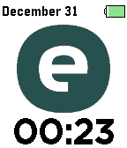

---
hide:
  - toc
---

<!-- Generated by scripts/update_app_directory.py: do not edit by hand -->
# Pebble Watchfaces: E

[← All Pebble Watchfaces](../watchfaces.md) · [A](a.md) · [B](b.md) · [C](c.md) · [D](d.md) · **E** · [F](f.md) · [G](g.md) · [H](h.md) · [I](i.md) · [J](j.md) · [K](k.md) · [L](l.md) · [M](m.md) · [N](n.md) · [O](o.md) · [P](p.md) · [Q](q.md) · [R](r.md) · [S](s.md) · [T](t.md) · [U](u.md) · [V](v.md) · [W](w.md) · [X](x.md) · [Y](y.md) · [Z](z.md) · [0–9 & other](other.md)

*58 watchfaces · Last updated 2026-10-06 · [About these lists](../about-app-lists.md)*

<h2 class="app-name" id="app-bc53387be05547889beabe73"><a href="https://apps.repebble.com/bc53387be05547889beabe73">E2EE Clock</a></h2>
<a class="app-source" href="https://github.com/jomapp/pebbleface-e2ee-clock" title="Source code" data-search-exclude>View source</a>

by <a href="https://apps.repebble.com/apps/dev/jomapp_49944f6d520b4d28b5720a05" title="More from this developer">jomapp</a>

Not checked yet v1.0.0 Updated 2026-04-06

Runs on: Round 2, Time 2

Simple watchface featuring an &quot;end-to-end encrypted&quot; (E2EE) style clock! Bold Aesthetic: Four striking digits rendered through a random ciphertext effect. 🔐 Smooth Motion: Easily configurable with…

<h2 class="app-name" id="app-f5aa8a5e6f9d457d848ee408"><a href="https://apps.repebble.com/f5aa8a5e6f9d457d848ee408">E2EE Clock (Old Pebbles)</a></h2>
<a class="app-source" href="https://github.com/jomapp/pebbleface-e2ee-clock" title="Source code" data-search-exclude>View source</a>

by <a href="https://apps.repebble.com/apps/dev/jomapp_49944f6d520b4d28b5720a05" title="More from this developer">jomapp</a>

Not checked yet v1.0.0 Updated 2026-04-06

Runs on: Time 2, Pebble 2 Duo, Pebble 2, Time, Classic

Simple watchface featuring an &quot;end-to-end encrypted&quot; (E2EE) style clock! Bold Aesthetic: Four striking digits rendered through a random ciphertext effect. 🔐 I created this watchface to raise…

<h2 class="app-name" id="app-52acf23c19ff50d903000024"><a href="https://apps.repebble.com/52acf23c19ff50d903000024">E8 Watchface</a></h2>
<a class="app-source" href="https://github.com/clementGdev/E8_pebble_watchface" title="Source code" data-search-exclude>View source</a>

by <a href="https://apps.repebble.com/apps/dev/clementg_52a9594cc0ca93c0b6000031" title="More from this developer">ClementG</a>

Not checked yet v2.6 Updated 2015-04-27

Runs on: Time 2, Pebble 2 Duo, Pebble 2, Time, Classic

Configurable : you can choose black or white, if you want to display the battery life... And squares are now Animated ! This watchface was inspired by the E8 watch from Lexon, originally designed…

<h2 class="app-name" id="app-765f2b6ef02b4cb6ac656d2e"><a href="https://apps.repebble.com/765f2b6ef02b4cb6ac656d2e">Earth</a></h2>
<a class="app-source" href="https://github.com/julpel8/solar-earth" title="Source code" data-search-exclude>View source</a>

by <a href="https://apps.repebble.com/apps/dev/julpel8_4832e5dc5bcac873d9cd9ff7" title="More from this developer">julpel8</a>

Not checked yet v0.3.2 Updated 2026-09-03

Runs on: Time 2

A living day/night Earth globe behind the time, with city lights after dark

<h2 class="app-name" id="app-534c852bf32d10439600002f"><a href="https://apps.repebble.com/534c852bf32d10439600002f">Earth Daylight Time</a></h2>
<a class="app-source" href="https://github.com/miloprice/pebblearth" title="Source code" data-search-exclude>View source</a>

by <a href="https://apps.repebble.com/apps/dev/milo-price_52f871506836e6d4d4000128" title="More from this developer">Milo Price</a>

Not checked yet v1.1.2 Updated 2014-07-11

Runs on: Time 2, Pebble 2 Duo, Pebble 2, Time, Classic

View the approximate location of daylight on Earth, updated hourly! Optional features: - Turn day/date on and off - Set time zone (default is PST)

<h2 class="app-name" id="app-5590eed6fd75124e5400001c"><a href="https://apps.repebble.com/5590eed6fd75124e5400001c">Earth Now</a></h2>
<a class="app-source" href="https://github.com/wzhd/watchface-now" title="Source code" data-search-exclude>View source</a>

by <a href="https://apps.repebble.com/apps/dev/wzhd_5504fc1ebe287a2c3c000051" title="More from this developer">wzhd</a>

Not checked yet v1.0 Updated 2015-07-01

Runs on: Time 2, Pebble 2 Duo, Pebble 2, Time, Classic

Show a world map that rotates roughly in sync with the day (assuming the Earth continues spinning). This is an unofficial port of the xkcd now comic. (https://xkcd.com/now)

<h2 class="app-name" id="app-56f6fa4191445b2baf000015"><a href="https://apps.repebble.com/56f6fa4191445b2baf000015">Easter Egg</a></h2>
<a class="app-source" href="https://github.com/groyoh/easter_egg" title="Source code" data-search-exclude>View source</a>

by <a href="https://apps.repebble.com/apps/dev/gringer-apps_560c4f952dd2f15e90000009" title="More from this developer">Gringer Apps</a>

Not checked yet v1.1 Updated 2016-03-27

Runs on: Round 2, Time 2, Time Round, Time

Celebrate Easter with this cute animated watchface (and some chocolate). Shake your wrist to wake up the little chick inside the egg. And… will you be able to find the hidden Easter egg? Designed…

<h2 class="app-name" id="app-559a583f393bdf0896000010"><a href="https://apps.repebble.com/559a583f393bdf0896000010">Easy Time</a></h2>
<a class="app-source" href="https://github.com/Toverbal/EasyTime" title="Source code" data-search-exclude>View source</a>

by <a href="https://apps.repebble.com/apps/dev/jori-seidel_5307823ea7b6bad6fc000059" title="More from this developer">Jori Seidel</a>

MIT v1.2 Updated 2015-07-07

Runs on: Time 2, Pebble 2 Duo, Pebble 2, Time, Classic

Easy Time is a watchface that lets you read the time with ease! How often does someone ask you the time and you look at your precious Pebble Time and you see 11:17 and have say eeh, it&#x27;s 11:15!?…

<h2 class="app-name" id="app-60be7c361342ae006e50f2da"><a href="https://apps.repebble.com/60be7c361342ae006e50f2da">eccentric</a></h2>
<a class="app-source" href="https://github.com/HarrisonAllen/eccentric" title="Source code" data-search-exclude>View source</a>

by <a href="https://apps.repebble.com/apps/dev/harrison-allen_5e28ea923dd3109f151c7e08" title="More from this developer">Harrison Allen</a>

MIT v2.0 Updated 2021-07-26

Runs on: Round 2, Time 2, Pebble 2 Duo, Pebble 2, Time Round, Time, Classic

Lightweight. Simple. Abstract. eccentric

<h2 class="app-name" id="app-4a385da6df4a40ff9cbb69e4"><a href="https://apps.repebble.com/4a385da6df4a40ff9cbb69e4">Echidna</a></h2>
<a class="app-source" href="https://github.com/HybridAU/echidna" title="Source code" data-search-exclude>View source</a>

by <a href="https://apps.repebble.com/apps/dev/michael-van-delft_2dc17aa9f131bb14557374fa" title="More from this developer">Michael Van Delft</a>

MIT v1.2.0 Updated 2026-06-20

Runs on: Time 2

A minimalist but highly configurable digital watch face written from scratch for the Pebble Time 2. Shows the day of the week, the month, time (24hr or 12hr), and the ISO date. Seconds can be…

<h2 class="app-name" id="app-54250a8d5394589fee0000d3"><a href="https://apps.rebble.io/en_US/application/54250a8d5394589fee0000d3">Ecliptic</a></h2>
<a class="app-source" href="https://github.com/konstantinbelyakov/ecliptic-pebble" title="Source code" data-search-exclude>View source</a>

by <a href="https://apps.rebble.io/en_US/developer/53e9cc82f4772adc670000ae/1" title="More from this developer">Konstantin Beliakov</a>

Not checked yet v3.1 Updated 2015-10-23 Rebble App Store

Runs on: Round 2, Time 2, Pebble 2 Duo, Pebble 2, Time Round, Time, Classic

Do you like astronomy or simply want an unusual watchface? Use Ecliptic - it displays positions of the Sun, the Moon, stars and five brightest planets of the solar system that are visible with the…

<h2 class="app-name" id="app-2433a070bb7d46b9b7f84e7f"><a href="https://apps.repebble.com/2433a070bb7d46b9b7f84e7f">Eclipz</a></h2>
<a class="app-source" href="https://github.com/zalewszczak/solar-eclipse-watch" title="Source code" data-search-exclude>View source</a>

by <a href="https://apps.repebble.com/apps/dev/ukasz-zalewski_5299dfb9129af7a225000093" title="More from this developer">Łukasz Zalewski</a>

Not checked yet v1.2.1 Updated 2026-09-28

Runs on: Time 2

What is a a watch? We&#x27;ve used them for decades without asking this basic question, what exactly does it do? You would think it just tells the time, but in reality it tracks the movement of…

<h2 class="app-name" id="app-5554094864e9b7248300009d"><a href="https://apps.repebble.com/5554094864e9b7248300009d">Ecolab</a></h2>
<a class="app-source" href="https://github.com/dmattia/ClashOfClansWatchFace" title="Source code" data-search-exclude>View source</a>

by <a href="https://apps.repebble.com/apps/dev/david_53768e138c2698c4b300005f" title="More from this developer">David</a>

Not checked yet v3.1 Updated 2015-07-21

Runs on: Time 2, Pebble 2 Duo, Pebble 2, Time, Classic

Stock value watchface for the company Ecolab with weather, time, and date along the bottom. Email me at dmattia@nd.edu if you would like to see a similar watchface for your company!

<h2 class="app-name" id="app-58c4e18b0dfc32d35b000eea"><a href="https://apps.rebble.io/en_US/application/58c4e18b0dfc32d35b000eea">Edifice EQB-500</a></h2>
<a class="app-source" href="https://github.com/mereed/pebbleface-edifice" title="Source code" data-search-exclude>View source</a>

by <a href="https://apps.rebble.io/en_US/developer/52d76309bd61272345000001/1" title="More from this developer">chops</a>

Not checked yet v1.8 Updated 2017-05-06 Rebble App Store

Runs on: Round 2, Time 2, Time Round, Time

v1.5: added a RECT background option (ps. the grey rings will overlap tics a bit, but you can turn them off if you want) ------- A variation of the Casio Edifice EQB-500DC-1A The initial idea for…

<h2 class="app-name" id="app-579914491482cd5d4b0000de"><a href="https://apps.repebble.com/579914491482cd5d4b0000de">Eight-frame</a></h2>
<a class="app-source" href="https://github.com/aemacleod/eight-frame" title="Source code" data-search-exclude>View source</a>

by <a href="https://apps.repebble.com/apps/dev/allan-macleod_572e4fcf2ddb7cd2dc000001" title="More from this developer">Allan MacLeod</a>

MIT v1.6 Updated 2016-10-17

Runs on: Round 2, Time 2, Pebble 2 Duo, Pebble 2, Time Round, Time, Classic

v1.6 Adds support for Pebble 2, updates how complications display on Pebble Time Round watches, fixes several bugs, and makes some improvements to save battery life. Eight-frame is a watchface…

<h2 class="app-name" id="app-205eaa19a4c145c39a62f383"><a href="https://apps.repebble.com/205eaa19a4c145c39a62f383">El número UNO</a></h2>
<a class="app-source" href="https://github.com/PableteFGA/UNO-watchface" title="Source code" data-search-exclude>View source</a>

by <a href="https://apps.repebble.com/apps/dev/pabletefga_57087d31acc9c8eda96c7f4c" title="More from this developer">PableteFGA</a>

No licence v1.1.0 Updated 2026-08-11

Runs on: Round 2, Time 2, Pebble 2 Duo, Pebble 2, Time, Classic

El Número Uno para Pebble El Número Uno lleva el icónico aspecto del primer reloj digital de Chile a tu Pebble, recreando su carátula, dial transparente y segmentos numéricos originales. Incluye…

<h2 class="app-name" id="app-185fd3518b98492a957c25d7"><a href="https://apps.repebble.com/185fd3518b98492a957c25d7">elbbep</a></h2>
<a class="app-source" href="https://gitlab.com/glejeune/elbbep" title="Source code" data-search-exclude>View source</a>

by <a href="https://apps.repebble.com/apps/dev/theyoung_1be61dccc9848d8be9f4a808" title="More from this developer">TheYoung</a>

Not checked yet v1.0 Updated 2026-04-12

Runs on: Round 2, Time 2, Pebble 2 Duo, Pebble 2, Time Round, Time, Classic

A clean analog watchface with a 24-hour dial running anti-clockwise.

<h2 class="app-name" id="app-577fe87166202a9b8d00041f"><a href="https://apps.repebble.com/577fe87166202a9b8d00041f">Elder Sign</a></h2>
<a class="app-source" href="https://github.com/revdrbrown/PebbleElderSign" title="Source code" data-search-exclude>View source</a>

by <a href="https://apps.repebble.com/apps/dev/dr-david-brown_55315ebd8763f8a6e5000043" title="More from this developer">Dr. David Brown</a>

Not checked yet v1.0 Updated 2016-07-10

Runs on: Round 2, Time 2, Pebble 2 Duo, Pebble 2, Time Round, Time, Classic

The Elder Sign watchface elements refer to the Cthulhu mythos. The main display shows the Elder Sign with the watch hands represented by a circle (seconds), triangle (minute) and square (hour)…

<h2 class="app-name" id="app-637aa531c6c24a000a815e9e"><a href="https://apps.repebble.com/637aa531c6c24a000a815e9e">Electric</a></h2>
<a class="app-source" href="https://github.com/StefanBauwens/Electric" title="Source code" data-search-exclude>View source</a>

by <a href="https://apps.repebble.com/apps/dev/stefan-bauwens_599dee8a461a8d18890012bc" title="More from this developer">Stefan Bauwens</a>

No licence v1.3 Updated 2023-04-12

Runs on: Time 2, Pebble 2 Duo, Pebble 2, Time, Classic

Electronic themed watchface with an interactive LED dot matrix display. Made for the Rebble Hackathon #001 Can now also be controlled via Tasker! Check the Github page for how to do this.

<h2 class="app-name" id="app-55ffd360421a442114000045"><a href="https://apps.repebble.com/55ffd360421a442114000045">Electric Component Watch</a></h2>
<a class="app-source" href="https://github.com/Akirakira/ResiWatch" title="Source code" data-search-exclude>View source</a>

by <a href="https://apps.repebble.com/apps/dev/akira_55b7f7c7c156bd8af600009e" title="More from this developer">Akira</a>

No licence v1.0 Updated 2015-09-21

Runs on: Time 2, Time

This watch face uses color code of electric resister.

<h2 class="app-name" id="app-56a27b5fd6753cffa800005d"><a href="https://apps.repebble.com/56a27b5fd6753cffa800005d">Elegant Text</a></h2>
<a class="app-source" href="https://github.com/jpoles1/ElegantText" title="Source code" data-search-exclude>View source</a>

by <a href="https://apps.repebble.com/apps/dev/jpoles1_5675a473d21898266b00003c" title="More from this developer">jpoles1</a>

Not checked yet v7.5 Updated 2016-05-03

Runs on: Round 2, Time 2, Pebble 2 Duo, Pebble 2, Time Round, Time, Classic

A text-based watchface for Pebble Time with Weather and Bluetooth Disconnect notifications.

<h2 class="app-name" id="app-54c41fc3a64480d5f50000c7"><a href="https://apps.repebble.com/54c41fc3a64480d5f50000c7">Elevator</a></h2>
<a class="app-source" href="https://github.com/stevmoli/Elevator" title="Source code" data-search-exclude>View source</a>

by <a href="https://apps.repebble.com/apps/dev/stevem_534b7d1751d58c5290000126" title="More from this developer">SteveM</a>

Not checked yet v2.2 Updated 2017-03-21

Runs on: Time 2, Pebble 2 Duo, Pebble 2, Time, Classic

This face displays the time in both 24hr and 12hr mode and uses vertical &quot;elevator&quot; animations to update the time. When multiple digits change at once, they&#x27;ll move in directions opposite those of…

<h2 class="app-name" id="app-62ee9320e595b3000a939a3e"><a href="https://apps.rebble.io/en_US/application/62ee9320e595b3000a939a3e">Elizabeth</a></h2>
<a class="app-source" href="https://github.com/astosia/Elizabeth" title="Source code" data-search-exclude>View source</a>

by <a href="https://apps.rebble.io/en_US/developer/58a635d30dfc320dc60003b4/1" title="More from this developer">astosia</a>

GPL-3.0 v6.5 Updated 2026-02-22 Rebble App Store

Runs on: Round 2, Time 2, Pebble 2 Duo, Pebble 2, Time Round, Time, Classic

Elizabeth is an easy to read pebble watchface with weather &amp; steps, using the Elizabeth Line font from the London Underground. Features: - Fully configurable colours - Toggle on configuration…

<h2 class="app-name" id="app-560e51b0038c388d30000079"><a href="https://apps.repebble.com/560e51b0038c388d30000079">Elliptical</a></h2>
<a class="app-source" href="https://github.com/vcsala/elliptical" title="Source code" data-search-exclude>View source</a>

by <a href="https://apps.repebble.com/apps/dev/viktor_546b743455e9392721000014" title="More from this developer">Viktor</a>

Not checked yet v1.1 Updated 2016-01-20

Runs on: Round 2, Time 2, Pebble 2 Duo, Pebble 2, Time Round, Time, Classic

Elliptical is a ellipse shaped watchface where the hands follow the same shape. The shape of the dial follows the resolution of the watch (the shape will be a circle on a square shaped screen…

<h2 class="app-name" id="app-401e8eb5432341dcb8ea111d"><a href="https://apps.repebble.com/401e8eb5432341dcb8ea111d">Emberline</a></h2>
<a class="app-source" href="https://github.com/thejambi/Sparkline_Faces" title="Source code" data-search-exclude>View source</a>

by <a href="https://apps.repebble.com/apps/dev/zach-burnham_939ce698485e86de8b11f7ae" title="More from this developer">Zach Burnham</a>

Not checked yet v1.4.3 Updated 2026-08-22

Runs on: Time 2, Pebble 2 Duo, Pebble 2, Time

Your hour drawn as landscape - and last night&#x27;s sleep, before you get up. The bottom of the screen is the last sixty minutes: one column a minute, standing on the very bottom edge, with a…

<h2 class="app-name" id="app-2a378472017a4c0098b0e7d9"><a href="https://apps.repebble.com/2a378472017a4c0098b0e7d9">emFace</a></h2>
<a class="app-source" href="https://github.com/paul-em/pebble-emFace" title="Source code" data-search-exclude>View source</a>

by <a href="https://apps.repebble.com/apps/dev/paul3m_27ef9d2ded8279c429fce882" title="More from this developer">paul3m</a>

Not checked yet v1.5.0 Updated 2026-09-02

Runs on: Round 2, Time 2, Pebble 2 Duo, Pebble 2, Time Round, Time, Classic

Watch face that shows information on 4 corners: Top left: Weather info with bar indicating the max/min temperature of the day and where we are in this range right now Top right: Date Bottom left…

<h2 class="app-name" id="app-429e6ee5ab3b4c9b9313058c"><a href="https://apps.repebble.com/429e6ee5ab3b4c9b9313058c">emFace</a></h2>
<a class="app-source" href="https://github.com/paul-em/pebble-emFace" title="Source code" data-search-exclude>View source</a>

by <a href="https://apps.repebble.com/apps/dev/paul3m_27ef9d2ded8279c429fce882" title="More from this developer">paul3m</a>

Not checked yet v1.2 Updated 2026-03-28

Runs on: Round 2, Time 2, Pebble 2 Duo, Pebble 2, Time Round, Time, Classic

Watch face that shows information on 4 corners: Top left: Weather info with bar indicating the max/min temperature of the day and where we are in this range right now Top right: Date Bottom left…

<h2 class="app-name" id="app-a34e76c10ab94a2a9235b6d8"><a href="https://apps.repebble.com/a34e76c10ab94a2a9235b6d8">emFace</a></h2>
<a class="app-source" href="https://github.com/paul-em/pebble-emFace" title="Source code" data-search-exclude>View source</a>

by <a href="https://apps.repebble.com/apps/dev/paul3m_27ef9d2ded8279c429fce882" title="More from this developer">paul3m</a>

Not checked yet v1.3 Updated 2026-03-29

Runs on: Round 2, Time 2, Pebble 2 Duo, Pebble 2, Time Round, Time, Classic

Watch face that shows information on 4 corners: Top left: Weather info with bar indicating the max/min temperature of the day and where we are in this range right now Top right: Date Bottom left…

<h2 class="app-name" id="app-57b078d7bb85eded8e00045c"><a href="https://apps.repebble.com/57b078d7bb85eded8e00045c">Emoji</a></h2>
<a class="app-source" href="https://github.com/mereed/pebbleface-emoji" title="Source code" data-search-exclude>View source</a>

by <a href="https://apps.repebble.com/apps/dev/chops_52d76309bd61272345000001" title="More from this developer">chops</a>

Not checked yet v1.1 Updated 2016-09-14

Runs on: Round 2, Time 2, Pebble 2 Duo, Pebble 2, Time Round, Time, Classic

This is a very simple watchface - the idea for this came from a picture I saw (unknown author) - and I thought I could easily turn it into a simple watchface. A new emoji face shows each time the…

<h2 class="app-name" id="app-dcc54a5bf69e4b6693702929"><a href="https://apps.repebble.com/dcc54a5bf69e4b6693702929">Enby</a></h2>
<a class="app-source" href="https://git.kescher.at/kescher/enby-watchface" title="Source code" data-search-exclude>View source</a>

by <a href="https://apps.repebble.com/apps/dev/navi_b3393bc4fd6cdfba84690531" title="More from this developer">Navi</a>

See source v1.7.0 Updated 2026-05-29

Runs on: Round 2, Time 2, Time Round, Time

This watchface helps you show your non-binary pride on your Pebble with a multi-color display. Features: - Non-binary flag - Show seconds on tap, switch back to hours and minutes only after 15…

<h2 class="app-name" id="app-55ff2456ed80fc148d000099"><a href="https://apps.repebble.com/55ff2456ed80fc148d000099">Engineering</a></h2>
<a class="app-source" href="https://github.com/nguyer/pebble-engineering" title="Source code" data-search-exclude>View source</a>

by <a href="https://apps.repebble.com/apps/dev/nicko-guyer_52f0ef2e61b752a5520029bc" title="More from this developer">Nicko Guyer</a>

Not checked yet v1.6 Updated 2016-01-19

Runs on: Round 2, Time 2, Pebble 2 Duo, Pebble 2, Time Round, Time, Classic

A precise, simple, and customizable analog watchface. Includes second hand, current day, and date, as well as current temperature (determined by GPS location). All labels can be turned on or off…

<h2 class="app-name" id="app-574f09f2ab673d743b00000d"><a href="https://apps.repebble.com/574f09f2ab673d743b00000d">Engineering-shadow</a></h2>
<a class="app-source" href="https://github.com/bateast/pebble-engineering" title="Source code" data-search-exclude>View source</a>

by <a href="https://apps.repebble.com/apps/dev/bateast_56c5a336468d577d71000003" title="More from this developer">bateast</a>

No licence v2.1 Updated 2016-12-22

Runs on: Round 2, Time 2, Time Round, Time

Engineering Watchface (nguyer works) + nice shadow from LibShadow

<h2 class="app-name" id="app-5591f56d981ce4e8510000ca"><a href="https://apps.repebble.com/5591f56d981ce4e8510000ca">Enigma+</a></h2>
<a class="app-source" href="https://github.com/sdneon/Enigma-plus" title="Source code" data-search-exclude>View source</a>

by <a href="https://apps.repebble.com/apps/dev/neon_5568037a1034b0abf70000a1" title="More from this developer">Neon</a>

Not checked yet v2.6 Updated 2015-09-09

Runs on: Time 2, Time

Enigma watch face variant with more information displayed. (Colour, Digital, for Pebble Time). Added info: - date (includes weekday name, date in ddmm format, and year or dual time in separate…

<h2 class="app-name" id="app-5591f845981ce4e8510000cd"><a href="https://apps.repebble.com/5591f845981ce4e8510000cd">Enigma+ Rosetta</a></h2>
<a class="app-source" href="https://github.com/sdneon/Enigma-Klingon" title="Source code" data-search-exclude>View source</a>

by <a href="https://apps.repebble.com/apps/dev/neon_5568037a1034b0abf70000a1" title="More from this developer">Neon</a>

Not checked yet v2.3 Updated 2015-08-08

Runs on: Time 2, Time

Enigma+ digital, colour watch face variant with choices of alien text for Sci-Fi fans. Optional hourly vibrations (configurable timings), and vibration (fading pulse) on Bluetooth disconnection…

<h2 class="app-name" id="app-a47c8da6501f43bb936edbfb"><a href="https://apps.repebble.com/a47c8da6501f43bb936edbfb">Enkel Svensk klocka</a></h2>
<a class="app-source" href="https://github.com/jole84/swe-watchface" title="Source code" data-search-exclude>View source</a>

by <a href="https://apps.repebble.com/apps/dev/jole84_36face5c2d9f7d232d52d02e" title="More from this developer">jole84</a>

Not checked yet v1.0.1 Updated 2026-07-01

Runs on: Round 2, Time 2

Swedish watchface for Pebble Time 2 and Round 2 written in javascript. Inspired by SweWeek from chrobe.

<h2 class="app-name" id="app-7beca89f985f493dbccbd9bd"><a href="https://apps.repebble.com/7beca89f985f493dbccbd9bd">Entity</a></h2>
<a class="app-source" href="https://github.com/kaineone/entity-watchface" title="Source code" data-search-exclude>View source</a>

by <a href="https://apps.repebble.com/apps/dev/erik-chevalier_a35d2d43d45b920efe05ec14" title="More from this developer">Erik Chevalier</a>

Not checked yet v26.2 Updated 2026-10-03

Runs on: Round 2, Time 2, Pebble 2 Duo, Time Round, Time

Entity is online. A simple, minimal watchface: the time in big block numbers, with a red scanner along the bottom, or around the edge on round watches. Totally free. No premium version, no…

<h2 class="app-name" id="app-583e7f5400355abe660008e8"><a href="https://apps.repebble.com/583e7f5400355abe660008e8">Ephemeris</a></h2>
<a class="app-source" href="https://github.com/BillSimpson/Ephemeris" title="Source code" data-search-exclude>View source</a>

by <a href="https://apps.repebble.com/apps/dev/bill-simpson_57a2bb641482cdecc700023e" title="More from this developer">Bill Simpson</a>

BSD-2-Clause v1.1 Updated 2016-12-31

Runs on: Round 2, Time 2, Pebble 2 Duo, Pebble 2, Time Round, Time, Classic

Ephemeris: 1) calculations giving the path of astronomical objects across the sky. 2) a watchface that displays the path of the sun and moon across the sky. Select your location (lat/lon) in…

<h2 class="app-name" id="app-53029cc99847d17bb600001a"><a href="https://apps.repebble.com/53029cc99847d17bb600001a">Epoch</a></h2>
<a class="app-source" href="https://github.com/jvbreen1/epoch_watchface" title="Source code" data-search-exclude>View source</a>

by <a href="https://apps.repebble.com/apps/dev/john-breen_52f955fba6f6c53f2a0004c4" title="More from this developer">John Breen</a>

Not checked yet v1.0.0 Updated 2014-02-17

Runs on: Time 2, Pebble 2 Duo, Pebble 2, Time, Classic

This watchface shows the number of seconds since the Unix Epoch (Jan 1, 1970 00:00:00)

<h2 class="app-name" id="app-558593636b9455d89e0000f0"><a href="https://apps.repebble.com/558593636b9455d89e0000f0">Equaliser</a></h2>
<a class="app-source" href="https://github.com/chrismwaite/equaliser" title="Source code" data-search-exclude>View source</a>

by <a href="https://apps.repebble.com/apps/dev/christopher-waite_5575e66ebea9cc922b000050" title="More from this developer">Christopher Waite</a>

Not checked yet v1.5 Updated 2015-07-01

Runs on: Time 2, Pebble 2 Duo, Pebble 2, Time, Classic

Equaliser is a new take on telling the time. It has the following features: - Battery level display - Day of the week and date - Bluetooth connectivity indicator (with vibrate on…

<h2 class="app-name" id="app-55d13e160f995067ae000065"><a href="https://apps.rebble.io/en_US/application/55d13e160f995067ae000065">Equalizer</a></h2>
<a class="app-source" href="https://edwinfinch.com/redirect/pebble-legacy-source" title="Source code" data-search-exclude>View source</a>

by <a href="https://apps.rebble.io/en_US/developer/5db6f59e385af50001ba25f9/1" title="More from this developer">Edwin Finch</a>

See source v2.6-rbl Updated 2021-06-17 Rebble App Store

Runs on: Time 2, Pebble 2 Duo, Pebble 2, Time, Classic

An old classic from our original collection from 2014-2016, now free &amp; open source!

<h2 class="app-name" id="app-69d66d18ebe0d800092cca90"><a href="https://apps.rebble.io/en_US/application/69d66d18ebe0d800092cca90">Eridani</a></h2>
<a class="app-source" href="https://github.com/LostQuasar/eridani" title="Source code" data-search-exclude>View source</a>

by <a href="https://apps.rebble.io/en_US/developer/5aee23cff3858853b8000896/1" title="More from this developer">LostQuasar</a>

MIT v1.1 Updated 2026-04-26 Rebble App Store

Runs on: Round 2, Time 2, Pebble 2 Duo, Pebble 2, Time Round, Time, Classic

Watchface inspired by project hail mary&#x27;s alien race from eridani

<h2 class="app-name" id="app-b7cbeaf2fd86467f976b7ca2"><a href="https://apps.repebble.com/b7cbeaf2fd86467f976b7ca2">EridianTime</a></h2>
<a class="app-source" href="https://github.com/Gibodean/EridianTime" title="Source code" data-search-exclude>View source</a>

by <a href="https://apps.repebble.com/apps/dev/adrian_9e41639dad4f43530bce9a4d" title="More from this developer">Adrian</a>

No licence v1.2 Updated 2026-06-07

Runs on: Time 2

Amaze! Timekeeping for Eridians Celebrate Andy Weir’s Project Hail Mary with a dynamic watchface that calculates the current time in pure Base-6. How to Read It: Just like Rocky, you decode the…

<h2 class="app-name" id="app-568456de5ce44a5516000052"><a href="https://apps.repebble.com/568456de5ce44a5516000052">esignatur</a></h2>
<a class="app-source" href="http://www.github.com/bschau" title="Source code" data-search-exclude>View source</a>

by <a href="https://apps.repebble.com/apps/dev/brian-schau_52bc98fc530bf4ed75000183" title="More from this developer">Brian Schau</a>

See source v2.0 Updated 2016-01-02

Runs on: Time 2, Pebble 2 Duo, Pebble 2, Time, Classic

This is a small watchface showing the esignatur (https://www.esignatur.dk) logo. You absolutely rock if you use this!

<h2 class="app-name" id="app-fbb7263a84a349ad8c45cbb9"><a href="https://apps.repebble.com/fbb7263a84a349ad8c45cbb9">Essence</a></h2>
<a class="app-source" href="https://github.com/realslimjd/pebble-essence" title="Source code" data-search-exclude>View source</a>

by <a href="https://apps.repebble.com/apps/dev/james-delvesco_45ad03d5bf2d276b8fb69cff" title="More from this developer">James DelVesco</a>

Not checked yet v1.0.1 Updated 2026-04-16

Runs on: Round 2

This is a watchface made in the style of the Ressence Type 3. It has indicators for minutes, hours, battery level, and the outside temperature.

<h2 class="app-name" id="app-56e706c3be2259f5c8000013"><a href="https://apps.repebble.com/56e706c3be2259f5c8000013">Essential Hindi</a></h2>
<a class="app-source" href="https://www.kiezelwatchfaces.com" title="Source code" data-search-exclude>View source</a>

by <a href="https://apps.repebble.com/apps/dev/kiezel_558e3fd4e3975e527b000055" title="More from this developer">Kiezel</a>

Not checked yet v1.1 Updated 2016-03-20

Runs on: Round 2, Time 2, Pebble 2 Duo, Pebble 2, Time Round, Time, Classic

Kiezel Watchfaces | Essential Hindi This is a paid watch-face. You can purchase this face individually for $0.99 or purchase our entire collection of 20+ faces for $5.99. You can purchase within…

<h2 class="app-name" id="app-57bf6c59f69d1d99580000c8"><a href="https://apps.repebble.com/57bf6c59f69d1d99580000c8">Essential WF</a></h2>
<a class="app-source" href="https://github.com/acrrd/pebble-essentialwf/" title="Source code" data-search-exclude>View source</a>

by <a href="https://apps.repebble.com/apps/dev/andrea-corradi_571a676207049b07bf00001c" title="More from this developer">Andrea Corradi</a>

No licence v1.1 Updated 2016-09-04

Runs on: Round 2, Time 2, Pebble 2 Duo, Pebble 2, Time Round, Time, Classic

A minimal, yet configurable, watchface: - time, both 12 and 24 hours clock - current date (format: yyyy/mm/dd, mm/dd/yyyy, dd/mm/yyyy) - name of the day in the current language (to the left or…

<h2 class="app-name" id="app-5840ee6fca30949f470004e9"><a href="https://apps.repebble.com/5840ee6fca30949f470004e9">Essentials</a></h2>
<a class="app-source" href="https://github.com/Plonq/Essentials" title="Source code" data-search-exclude>View source</a>

by <a href="https://apps.repebble.com/apps/dev/huon-imberger_5832618700355ad84800015a" title="More from this developer">Huon Imberger</a>

No licence v1.0 Updated 2016-12-16

Runs on: Time 2, Pebble 2 Duo, Pebble 2, Time

Nice big time, weather (DarkSky/forecast.io), battery, vibrate/icon on bluetooth disconnect. Configurable: DarkSky API key, Celcius/Fahrenheit, date format. Inspired by Clean &amp; Smart…

<h2 class="app-name" id="app-54f55168e8b907f688000017"><a href="https://apps.repebble.com/54f55168e8b907f688000017">Essentials</a></h2>
<a class="app-source" href="https://github.com/shivanshu3/PebbleEssentials" title="Source code" data-search-exclude>View source</a>

by <a href="https://apps.repebble.com/apps/dev/shivanshu-goyal_53b4d432ee5a60da4c000138" title="More from this developer">Shivanshu Goyal</a>

Not checked yet v1.0 Updated 2015-03-03

Runs on: Time 2, Pebble 2 Duo, Pebble 2, Time, Classic

A simple watch face that shows time and your Pebble&#x27;s battery level without any distractions.

<h2 class="app-name" id="app-570fee9de66231da72000020"><a href="https://apps.repebble.com/570fee9de66231da72000020">Essentials</a></h2>
<a class="app-source" href="https://github.com/simonra/pebble-watchface-essentials" title="Source code" data-search-exclude>View source</a>

by <a href="https://apps.repebble.com/apps/dev/simon_52bc8ee9530bf47e36000174" title="More from this developer">simon</a>

Not checked yet v1.2 Updated 2016-07-13

Runs on: Round 2, Time 2, Pebble 2 Duo, Pebble 2, Time Round, Time, Classic

A watch face showing the time (24H style), the weekday (full English), the current date (ISO8601, yyyy-mm-dd), the current week (ISO 8601 due to that being the standard in Norway), and the battery…

<h2 class="app-name" id="app-5e1409743dd3108e69a17718"><a href="https://apps.rebble.io/en_US/application/5e1409743dd3108e69a17718">Etude 4</a></h2>
<a class="app-source" href="https://github.com/dentonlt/pebble-etude4" title="Source code" data-search-exclude>View source</a>

by <a href="https://apps.rebble.io/en_US/developer/5e1409743dd3108e69a17716/1" title="More from this developer">dentonlt</a>

Not checked yet v0.8 Updated 2020-04-10 Rebble App Store

Runs on: Round 2, Time 2, Pebble 2 Duo, Pebble 2, Time Round, Time, Classic

Etude 4 is a minimal, balanced watchface for Pebble/Rebble. The main time header is displayed in 12h/24h format according to the user&#x27;s system preferences. The background and text colors are…

<h2 class="app-name" id="app-529ab1b6d17b5033ba000033"><a href="https://apps.repebble.com/529ab1b6d17b5033ba000033">EVA</a></h2>
<a class="app-source" href="https://github.com/exe44/pebble-eva" title="Source code" data-search-exclude>View source</a>

by <a href="https://apps.repebble.com/apps/dev/exe_5299a4c8e627ce050d000068" title="More from this developer">exe</a>

Not checked yet v2.0.0 Updated 2013-12-01

Runs on: Time 2, Pebble 2 Duo, Pebble 2, Time, Classic

Inspired by Japanese anime &quot;Neon Genesis Evangelion&quot; :D

<h2 class="app-name" id="app-579a076222f599d627000064"><a href="https://apps.repebble.com/579a076222f599d627000064">Eventful</a></h2>
<a class="app-source" href="https://github.com/C-D-Lewis/eventful" title="Source code" data-search-exclude>View source</a>

by <a href="https://apps.repebble.com/apps/dev/chris-lewis_5299cd30e627ce1147000099" title="More from this developer">Chris Lewis</a>

No licence v1.1 Updated 2016-07-28

Runs on: Round 2, Time 2, Pebble 2 Duo, Pebble 2, Time Round, Time, Classic

Example watchface for the Dash API that shows unread SMS count and the next Calendar event.

<h2 class="app-name" id="app-56a8516af58e6beebf000019"><a href="https://apps.repebble.com/56a8516af58e6beebf000019">EventPercent</a></h2>
<a class="app-source" href="https://github.com/centuryglass/eventwatch" title="Source code" data-search-exclude>View source</a>

by <a href="https://apps.repebble.com/apps/dev/centuryglass_5478fc07f94378516e000098" title="More from this developer">centuryglass</a>

Not checked yet v1.12 Updated 2016-03-06

Runs on: Round 2, Time 2, Pebble 2 Duo, Pebble 2, Time Round, Time, Classic

EventPercent watchface shows you what percent of your calendar event has already passed, or how long you have until future events start. Events are automatically fetched from calendars on your…

<h2 class="app-name" id="app-689f0ed1ad152a00098e1b77"><a href="https://apps.repebble.com/689f0ed1ad152a00098e1b77">Events</a></h2>
<a class="app-source" href="https://github.com/C-D-Lewis/pebble-dev" title="Source code" data-search-exclude>View source</a>

by <a href="https://apps.repebble.com/apps/dev/chris-lewis_5299cd30e627ce1147000099" title="More from this developer">Chris Lewis</a>

No licence v1.1 Updated 2025-08-15

Runs on: Time 2, Pebble 2 Duo, Pebble 2, Time, Classic

Simple watchface showing a scrolling list of SDK events

<h2 class="app-name" id="app-59724027461a8d9e490001f5"><a href="https://apps.rebble.io/en_US/application/59724027461a8d9e490001f5">Every moment again (On Your Wrist is the Universe)</a></h2>
<a class="app-source" href="https://github.com/zeitkunst/every_moment_again" title="Source code" data-search-exclude>View source</a>

by <a href="https://apps.rebble.io/en_US/developer/585045b977324b357a0004ae/1" title="More from this developer">Nicholas Knouf</a>

Not checked yet v0.1 Updated 2017-07-21 Rebble App Store

Runs on: Time 2, Pebble 2 Duo, Pebble 2, Time, Classic

Consider your role in the universe by understanding the relationship between light from stars afar and your own history and future. On Your Wrist is the Universe: Every moment again is a watchface…

<h2 class="app-name" id="app-57bb725cbb85ed5332000b9f"><a href="https://apps.repebble.com/57bb725cbb85ed5332000b9f">Everything Pedometer</a></h2>
<a class="app-source" href="https://github.com/bzhtapp/Pebble" title="Source code" data-search-exclude>View source</a>

by <a href="https://apps.repebble.com/apps/dev/brian-tran_57b9aec5f01b53901a0009b4" title="More from this developer">Brian Tran</a>

No licence v1.54 Updated 2016-08-28

Runs on: Time 2, Pebble 2 Duo, Pebble 2, Time, Classic

Pedometer, battery meter, bluetooth lost connection indicator, current weather, 4-hr forecast, next morning forecast, next evening forecast, and city of forecast (tells you what town you are in)…

<h2 class="app-name" id="app-5786fe5eff7be0c304000106"><a href="https://apps.repebble.com/5786fe5eff7be0c304000106">Expectancy</a></h2>
<a class="app-source" href="http://fieldwalking.jp/blog/watch-face_expectancy/" title="Source code" data-search-exclude>View source</a>

by <a href="https://apps.repebble.com/apps/dev/fieldwalking_52f88d452a8acf5cab00018f" title="More from this developer">fieldWalking</a>

See source v1.0 Updated 2016-07-14

Runs on: Round 2, Time 2, Time Round, Time

Lifetime calculation from setting and Display life expectancy. year:month:day hour:min:sec current time If it&#x27;s ok with you,please try my app. Don&#x27;t step the White Tile. http://goo.gl/DFYcFh

<h2 class="app-name" id="app-52b010d7e2187074f100001a"><a href="https://apps.repebble.com/52b010d7e2187074f100001a">Extra Normal</a></h2>
<a class="app-source" href="https://github.com/mcongrove/PebbleExtraNormal" title="Source code" data-search-exclude>View source</a>

by <a href="https://apps.repebble.com/apps/dev/mcongrove_52affc34e2187058f9000011" title="More from this developer">mcongrove</a>

Not checked yet v2.1 Updated 2014-01-19

Runs on: Time 2, Pebble 2 Duo, Pebble 2, Time, Classic

A Pebble watch face based on the Extra Normal watch face. Hour hands turn to reveal the current time as it passes overhead. Colors can be inverted by accessing the settings in the Pebble application.

