<!-- Generated by scripts/update_app_directory.py: do not edit by hand -->
# Watchfaces: E

[← About this list](../watchfaces.md) · [A](a.md) · [B](b.md) · [C](c.md) · [D](d.md) · **E** · [F](f.md) · [G](g.md) · [H](h.md) · [I](i.md) · [J](j.md) · [K](k.md) · [L](l.md) · [M](m.md) · [N](n.md) · [O](o.md) · [P](p.md) · [Q](q.md) · [R](r.md) · [S](s.md) · [T](t.md) · [U](u.md) · [V](v.md) · [W](w.md) · [X](x.md) · [Y](y.md) · [Z](z.md) · [0–9 & other](other.md)

*60 watchfaces · Last updated 2026-10-06*

| Screenshot | Name | Developer | Licence | Updated | Description |
|------------|------|-----------|---------|---------|-------------|
| 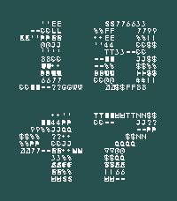{ loading=lazy width="72" } | [E2EE Clock](https://apps.repebble.com/bc53387be05547889beabe73) | [jomapp](https://github.com/jomapp/pebbleface-e2ee-clock) | <small>Not checked yet</small> | 2026-04-06 | Simple watchface featuring an "end-to-end encrypted" (E2EE) style clock! Bold Aesthetic: Four striking digits rendered through a random ciphertext effect. 🔐… |
| 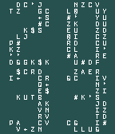{ loading=lazy width="72" } | [E2EE Clock (Old Pebbles)](https://apps.repebble.com/f5aa8a5e6f9d457d848ee408) | [jomapp](https://github.com/jomapp/pebbleface-e2ee-clock) | <small>Not checked yet</small> | 2026-04-06 | Simple watchface featuring an "end-to-end encrypted" (E2EE) style clock! Bold Aesthetic: Four striking digits rendered through a random ciphertext effect. 🔐… |
| 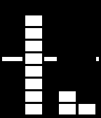{ loading=lazy width="72" } | [E8 Watchface](https://apps.rebble.io/en_US/application/52acf23c19ff50d903000024) <small>Rebble App Store</small> | [ClementG](https://github.com/clementGdev/E8_pebble_watchface) | <small>Not checked yet</small> | 2015-04-27 | Configurable : you can choose black or white, if you want to display the battery life... And squares are now Animated ! This watchface was inspired by the… |
| 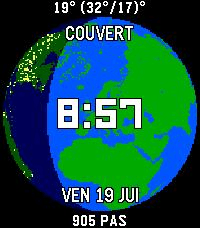{ loading=lazy width="72" } | [Earth](https://apps.repebble.com/765f2b6ef02b4cb6ac656d2e) | [julpel8](https://github.com/julpel8/solar-earth) | <small>Not checked yet</small> | 2026-09-03 | A living day/night Earth globe behind the time, with city lights after dark |
| { loading=lazy width="72" } | [Earth Daylight Time](https://apps.rebble.io/en_US/application/534c852bf32d10439600002f) <small>Rebble App Store</small> | [Milo Price](https://github.com/miloprice/pebblearth) | <small>Not checked yet</small> | 2014-07-11 | View the approximate location of daylight on Earth, updated hourly! Optional features: - Turn day/date on and off - Set time zone (default is PST) |
| 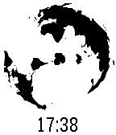{ loading=lazy width="72" } | [Earth Now](https://apps.rebble.io/en_US/application/5590eed6fd75124e5400001c) <small>Rebble App Store</small> | [wzhd](https://github.com/wzhd/watchface-now) | <small>Not checked yet</small> | 2015-07-01 | Show a world map that rotates roughly in sync with the day (assuming the Earth continues spinning). This is an unofficial port of the xkcd now comic… |
| { loading=lazy width="72" } | [Easter Egg](https://apps.repebble.com/56f6fa4191445b2baf000015) | [Gringer Apps](https://github.com/groyoh/easter_egg) | <small>Not checked yet</small> | 2016-03-27 | Celebrate Easter with this cute animated watchface (and some chocolate). Shake your wrist to wake up the little chick inside the egg. And… will you be able… |
| 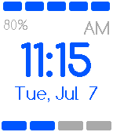{ loading=lazy width="72" } | [Easy Time](https://apps.rebble.io/en_US/application/559a583f393bdf0896000010) <small>Rebble App Store</small> | [Jori Seidel](https://github.com/Toverbal/EasyTime) | <small>Not checked yet</small> | 2015-07-07 | Easy Time is a watchface that lets you read the time with ease! How often does someone ask you the time and you look at your precious Pebble Time and you… |
| 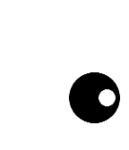{ loading=lazy width="72" } | [eccentric](https://apps.repebble.com/60be7c361342ae006e50f2da) | [Harrison Allen](https://github.com/HarrisonAllen/eccentric) | MIT | 2021-07-26 | Lightweight. Simple. Abstract. eccentric |
| 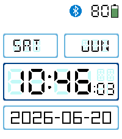{ loading=lazy width="72" } | [Echidna](https://apps.repebble.com/4a385da6df4a40ff9cbb69e4) | [Michael Van Delft](https://github.com/HybridAU/echidna) | MIT | 2026-06-20 | A minimalist but highly configurable digital watch face written from scratch for the Pebble Time 2. Shows the day of the week, the month, time (24hr or… |
| 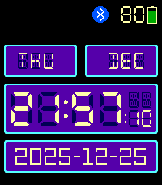{ loading=lazy width="72" } | [Echidna](https://apps.rebble.io/en_US/application/691120802ed54b00092c263e) <small>Rebble App Store</small> | [Michael Van Delft](https://github.com/HybridAU/echidna) | MIT | 2025-12-31 | A minimalist but highly configurable digital watch face written from scratch for the Pebble Time 2. Shows the day of the week, the month, time (24hr or… |
| 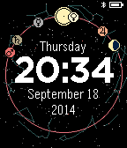{ loading=lazy width="72" } | [Ecliptic](https://apps.rebble.io/en_US/application/54250a8d5394589fee0000d3) <small>Rebble App Store</small> | [Konstantin Beliakov](https://github.com/konstantinbelyakov/ecliptic-pebble) | <small>Not checked yet</small> | 2015-10-23 | Do you like astronomy or simply want an unusual watchface? Use Ecliptic - it displays positions of the Sun, the Moon, stars and five brightest planets of… |
| 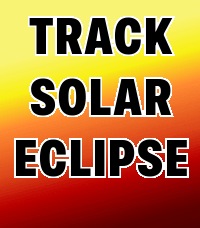{ loading=lazy width="72" } | [Eclipz](https://apps.repebble.com/2433a070bb7d46b9b7f84e7f) | [Łukasz Zalewski](https://github.com/zalewszczak/solar-eclipse-watch) | <small>Not checked yet</small> | 2026-09-28 | What is a a watch? We've used them for decades without asking this basic question, what exactly does it do? You would think it just tells the time, but in… |
| 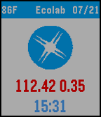{ loading=lazy width="72" } | [Ecolab](https://apps.rebble.io/en_US/application/5554094864e9b7248300009d) <small>Rebble App Store</small> | [David](https://github.com/dmattia/ClashOfClansWatchFace) | <small>Not checked yet</small> | 2015-07-21 | Stock value watchface for the company Ecolab with weather, time, and date along the bottom. Email me at dmattia@nd.edu if you would like to see a similar… |
| 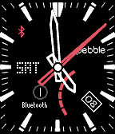{ loading=lazy width="72" } | [Edifice EQB-500](https://apps.rebble.io/en_US/application/58c4e18b0dfc32d35b000eea) <small>Rebble App Store</small> | [chops](https://github.com/mereed/pebbleface-edifice) | <small>Not checked yet</small> | 2017-05-06 | v1.5: added a RECT background option (ps. the grey rings will overlap tics a bit, but you can turn them off if you want) ------- A variation of the Casio… |
| 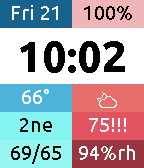{ loading=lazy width="72" } | [Eight-frame](https://apps.repebble.com/579914491482cd5d4b0000de) | [Allan MacLeod](https://github.com/aemacleod/eight-frame) | <small>Not checked yet</small> | 2016-10-17 | v1.6 Adds support for Pebble 2, updates how complications display on Pebble Time Round watches, fixes several bugs, and makes some improvements to save… |
| 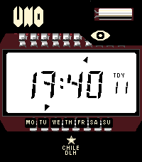{ loading=lazy width="72" } | [El número UNO](https://apps.repebble.com/205eaa19a4c145c39a62f383) | [PableteFGA](https://github.com/PableteFGA/UNO-watchface) | <small>Not checked yet</small> | 2026-08-11 | El Número Uno para Pebble El Número Uno lleva el icónico aspecto del primer reloj digital de Chile a tu Pebble, recreando su carátula, dial transparente y… |
| { loading=lazy width="72" } | [elbbep](https://apps.repebble.com/185fd3518b98492a957c25d7) | [TheYoung](https://gitlab.com/glejeune/elbbep) | <small>Not checked yet</small> | 2026-04-12 | A clean analog watchface with a 24-hour dial running anti-clockwise. |
| 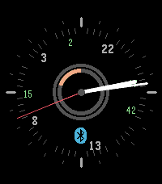{ loading=lazy width="72" } | [elbbep](https://apps.rebble.io/en_US/application/69db8dd6ebe0d80009e62a77) <small>Rebble App Store</small> | [TheYoung](https://gitlab.com/glejeune/elbbep) | <small>Not checked yet</small> | 2026-04-12 | A clean analog watchface with a 24-hour dial running anti-clockwise. |
| 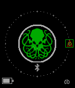{ loading=lazy width="72" } | [Elder Sign](https://apps.repebble.com/577fe87166202a9b8d00041f) | [Dr. David Brown](https://github.com/revdrbrown/PebbleElderSign) | <small>Not checked yet</small> | 2016-07-10 | The Elder Sign watchface elements refer to the Cthulhu mythos. The main display shows the Elder Sign with the watch hands represented by a circle (seconds)… |
| 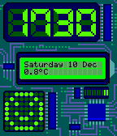{ loading=lazy width="72" } | [Electric](https://apps.repebble.com/637aa531c6c24a000a815e9e) | [Stefan Bauwens](https://github.com/StefanBauwens/Electric) | <small>Not checked yet</small> | 2023-04-12 | Electronic themed watchface with an interactive LED dot matrix display. Made for the Rebble Hackathon #001 Can now also be controlled via Tasker! Check the… |
| 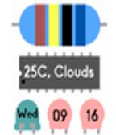{ loading=lazy width="72" } | [Electric Component Watch](https://apps.rebble.io/en_US/application/55ffd360421a442114000045) <small>Rebble App Store</small> | [Akira](https://github.com/Akirakira/ResiWatch) | <small>No licence</small> | 2015-09-21 | This watch face uses color code of electric resister. |
| 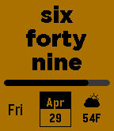{ loading=lazy width="72" } | [Elegant Text](https://apps.repebble.com/56a27b5fd6753cffa800005d) | [jpoles1](https://github.com/jpoles1/ElegantText) | <small>Not checked yet</small> | 2016-05-03 | A text-based watchface for Pebble Time with Weather and Bluetooth Disconnect notifications. |
| 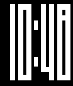{ loading=lazy width="72" } | [Elevator](https://apps.repebble.com/54c41fc3a64480d5f50000c7) | [SteveM](https://github.com/stevmoli/Elevator) | <small>Not checked yet</small> | 2017-03-21 | This face displays the time in both 24hr and 12hr mode and uses vertical "elevator" animations to update the time. When multiple digits change at once… |
| 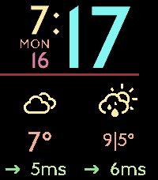{ loading=lazy width="72" } | [Elizabeth](https://apps.rebble.io/en_US/application/62ee9320e595b3000a939a3e) <small>Rebble App Store</small> | [astosia](https://github.com/astosia/Elizabeth) | <small>Not checked yet</small> | 2026-02-22 | Elizabeth is an easy to read pebble watchface with weather & steps, using the Elizabeth Line font from the London Underground. Features: - Fully… |
| 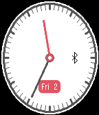{ loading=lazy width="72" } | [Elliptical](https://apps.rebble.io/en_US/application/560e51b0038c388d30000079) <small>Rebble App Store</small> | [Viktor](https://github.com/vcsala/elliptical) | <small>Not checked yet</small> | 2016-01-20 | Elliptical is a ellipse shaped watchface where the hands follow the same shape. The shape of the dial follows the resolution of the watch (the shape will be… |
| 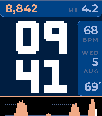{ loading=lazy width="72" } | [Emberline](https://apps.repebble.com/401e8eb5432341dcb8ea111d) | [Zach Burnham](https://github.com/thejambi/Sparkline_Faces) | <small>Not checked yet</small> | 2026-08-22 | Your hour drawn as landscape - and last night's sleep, before you get up. The bottom of the screen is the last sixty minutes: one column a minute, standing… |
| 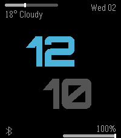{ loading=lazy width="72" } | [emFace](https://apps.repebble.com/2a378472017a4c0098b0e7d9) | [paul3m](https://github.com/paul-em/pebble-emFace) | <small>Not checked yet</small> | 2026-09-02 | Watch face that shows information on 4 corners: Top left: Weather info with bar indicating the max/min temperature of the day and where we are in this range… |
| 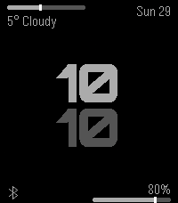{ loading=lazy width="72" } | [emFace](https://apps.repebble.com/a34e76c10ab94a2a9235b6d8) | [paul3m](https://github.com/paul-em/pebble-emFace) | <small>Not checked yet</small> | 2026-03-29 | Watch face that shows information on 4 corners: Top left: Weather info with bar indicating the max/min temperature of the day and where we are in this range… |
| 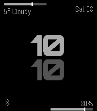{ loading=lazy width="72" } | [emFace](https://apps.repebble.com/429e6ee5ab3b4c9b9313058c) | [paul3m](https://github.com/paul-em/pebble-emFace) | <small>Not checked yet</small> | 2026-03-28 | Watch face that shows information on 4 corners: Top left: Weather info with bar indicating the max/min temperature of the day and where we are in this range… |
| 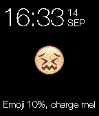{ loading=lazy width="72" } | [Emoji](https://apps.repebble.com/57b078d7bb85eded8e00045c) | [chops](https://github.com/mereed/pebbleface-emoji) | <small>Not checked yet</small> | 2016-09-14 | This is a very simple watchface - the idea for this came from a picture I saw (unknown author) - and I thought I could easily turn it into a simple… |
| { loading=lazy width="72" } | [Enby](https://apps.repebble.com/dcc54a5bf69e4b6693702929) | [Navi](https://git.kescher.at/kescher/enby-watchface) | <small>See source</small> | 2026-05-29 | This watchface helps you show your non-binary pride on your Pebble with a multi-color display. Features: - Non-binary flag - Show seconds on tap, switch… |
| 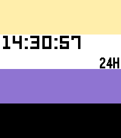{ loading=lazy width="72" } | [Enby](https://apps.rebble.io/en_US/application/68e27b2c8044c400097c777b) <small>Rebble App Store</small> | [Navi](https://git.kescher.at/kescher/enby-watchface) | <small>See source</small> | 2026-05-29 | This watchface helps you show your non-binary pride on your Pebble with a multi-color display. Features: - Non-binary flag - Shows AM/PM for 12-hour mode … |
| 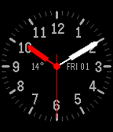{ loading=lazy width="72" } | [Engineering](https://apps.rebble.io/en_US/application/55ff2456ed80fc148d000099) <small>Rebble App Store</small> | [Nicko Guyer](https://github.com/nguyer/pebble-engineering) | <small>Not checked yet</small> | 2016-01-19 | A precise, simple, and customizable analog watchface. Includes second hand, current day, and date, as well as current temperature (determined by GPS… |
| 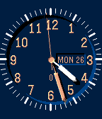{ loading=lazy width="72" } | [Engineering-shadow](https://apps.repebble.com/574f09f2ab673d743b00000d) | [bateast](https://github.com/bateast/pebble-engineering) | <small>Not checked yet</small> | 2016-12-22 | Engineering Watchface (nguyer works) + nice shadow from LibShadow |
| 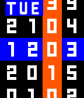{ loading=lazy width="72" } | [Enigma+](https://apps.rebble.io/en_US/application/5591f56d981ce4e8510000ca) <small>Rebble App Store</small> | [Neon](https://github.com/sdneon/Enigma-plus) | <small>Not checked yet</small> | 2015-09-09 | Enigma watch face variant with more information displayed. (Colour, Digital, for Pebble Time). Added info: - date (includes weekday name, date in ddmm… |
| 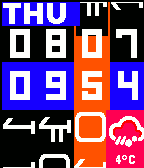{ loading=lazy width="72" } | [Enigma+ Rosetta](https://apps.rebble.io/en_US/application/5591f845981ce4e8510000cd) <small>Rebble App Store</small> | [Neon](https://github.com/sdneon/Enigma-Klingon) | <small>Not checked yet</small> | 2015-08-08 | Enigma+ digital, colour watch face variant with choices of alien text for Sci-Fi fans. Optional hourly vibrations (configurable timings), and vibration… |
| 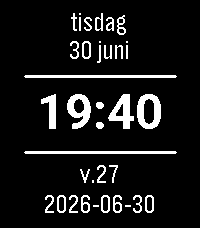{ loading=lazy width="72" } | [Enkel Svensk klocka](https://apps.repebble.com/a47c8da6501f43bb936edbfb) | [jole84](https://github.com/jole84/swe-watchface) | <small>Not checked yet</small> | 2026-07-01 | Swedish watchface for Pebble Time 2 and Round 2 written in javascript. Inspired by SweWeek from chrobe. |
| 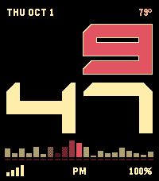{ loading=lazy width="72" } | [Entity](https://apps.repebble.com/7beca89f985f493dbccbd9bd) | [Erik Chevalier](https://github.com/kaineone/entity-watchface) | <small>Not checked yet</small> | 2026-10-03 | Entity is online. A simple, minimal watchface: the time in big block numbers, with a red scanner along the bottom, or around the edge on round watches… |
| 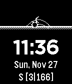{ loading=lazy width="72" } | [Ephemeris](https://apps.repebble.com/583e7f5400355abe660008e8) | [Bill Simpson](https://github.com/BillSimpson/Ephemeris) | BSD-2-Clause | 2016-12-31 | Ephemeris: 1) calculations giving the path of astronomical objects across the sky. 2) a watchface that displays the path of the sun and moon across the sky… |
| { loading=lazy width="72" } | [Epoch](https://apps.rebble.io/en_US/application/53029cc99847d17bb600001a) <small>Rebble App Store</small> | [John Breen](https://github.com/jvbreen1/epoch_watchface) | <small>Not checked yet</small> | 2014-02-17 | This watchface shows the number of seconds since the Unix Epoch (Jan 1, 1970 00:00:00) |
| 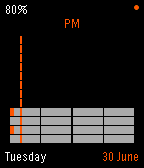{ loading=lazy width="72" } | [Equaliser](https://apps.rebble.io/en_US/application/558593636b9455d89e0000f0) <small>Rebble App Store</small> | [Christopher Waite](https://github.com/chrismwaite/equaliser) | <small>Not checked yet</small> | 2015-07-01 | Equaliser is a new take on telling the time. It has the following features: - Battery level display - Day of the week and date - Bluetooth connectivity… |
| 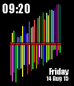{ loading=lazy width="72" } | [Equalizer](https://apps.rebble.io/en_US/application/55d13e160f995067ae000065) <small>Rebble App Store</small> | [Edwin Finch](https://edwinfinch.com/redirect/pebble-legacy-source) | <small>See source</small> | 2021-06-17 | An old classic from our original collection from 2014-2016, now free & open source! |
| 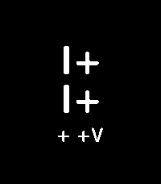{ loading=lazy width="72" } | [Eridani](https://apps.rebble.io/en_US/application/69d66d18ebe0d800092cca90) <small>Rebble App Store</small> | [LostQuasar](https://github.com/LostQuasar/eridani) | <small>Not checked yet</small> | 2026-04-26 | Watchface inspired by project hail mary's alien race from eridani |
| 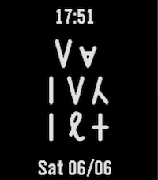{ loading=lazy width="72" } | [EridianTime](https://apps.repebble.com/b7cbeaf2fd86467f976b7ca2) | [Adrian](https://github.com/Gibodean/EridianTime) | <small>No licence</small> | 2026-06-07 | Amaze! Timekeeping for Eridians Celebrate Andy Weir’s Project Hail Mary with a dynamic watchface that calculates the current time in pure Base-6. How to… |
| 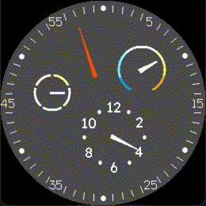{ loading=lazy width="72" } | [Essence](https://apps.repebble.com/fbb7263a84a349ad8c45cbb9) | [James DelVesco](https://github.com/realslimjd/pebble-essence) | <small>Not checked yet</small> | 2026-04-16 | This is a watchface made in the style of the Ressence Type 3. It has indicators for minutes, hours, battery level, and the outside temperature. |
| 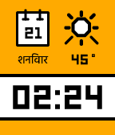{ loading=lazy width="72" } | [Essential Hindi](https://apps.repebble.com/56e706c3be2259f5c8000013) | [Kiezel](https://www.kiezelwatchfaces.com) | <small>Not checked yet</small> | 2016-03-20 | Kiezel Watchfaces \| Essential Hindi This is a paid watch-face. You can purchase this face individually for $0.99 or purchase our entire collection of 20+… |
| 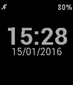{ loading=lazy width="72" } | [Essential WF](https://apps.repebble.com/57bf6c59f69d1d99580000c8) | [Andrea Corradi](https://github.com/acrrd/pebble-essentialwf/) | <small>Not checked yet</small> | 2016-09-04 | A minimal, yet configurable, watchface: - time, both 12 and 24 hours clock - current date (format: yyyy/mm/dd, mm/dd/yyyy, dd/mm/yyyy) - name of the day in… |
| 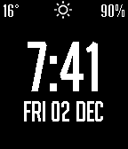{ loading=lazy width="72" } | [Essentials](https://apps.repebble.com/5840ee6fca30949f470004e9) | [Huon Imberger](https://github.com/Plonq/Essentials) | <small>Not checked yet</small> | 2016-12-16 | Nice big time, weather (DarkSky/forecast.io), battery, vibrate/icon on bluetooth disconnect. Configurable: DarkSky API key, Celcius/Fahrenheit, date format… |
| 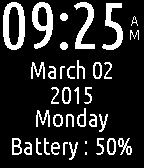{ loading=lazy width="72" } | [Essentials](https://apps.rebble.io/en_US/application/54f55168e8b907f688000017) <small>Rebble App Store</small> | [Shivanshu Goyal](https://github.com/shivanshu3/PebbleEssentials) | <small>Not checked yet</small> | 2015-03-03 | A simple watch face that shows time and your Pebble's battery level without any distractions. |
| 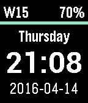{ loading=lazy width="72" } | [Essentials](https://apps.repebble.com/570fee9de66231da72000020) | [simon](https://github.com/simonra/pebble-watchface-essentials) | <small>Not checked yet</small> | 2016-07-13 | A watch face showing the time (24H style), the weekday (full English), the current date (ISO8601, yyyy-mm-dd), the current week (ISO 8601 due to that being… |
| 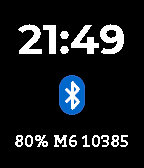{ loading=lazy width="72" } | [Etude 4](https://apps.rebble.io/en_US/application/5e1409743dd3108e69a17718) <small>Rebble App Store</small> | [dentonlt](https://github.com/dentonlt/pebble-etude4) | <small>Not checked yet</small> | 2020-04-10 | Etude 4 is a minimal, balanced watchface for Pebble/Rebble. The main time header is displayed in 12h/24h format according to the user's system preferences… |
| { loading=lazy width="72" } | [EVA](https://apps.rebble.io/en_US/application/529ab1b6d17b5033ba000033) <small>Rebble App Store</small> | [exe](https://github.com/exe44/pebble-eva) | <small>Not checked yet</small> | 2013-12-01 | Inspired by Japanese anime "Neon Genesis Evangelion" :D |
| 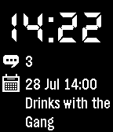{ loading=lazy width="72" } | [Eventful](https://apps.repebble.com/579a076222f599d627000064) | [Chris Lewis](https://github.com/C-D-Lewis/eventful) | <small>No licence</small> | 2016-07-28 | Example watchface for the Dash API that shows unread SMS count and the next Calendar event. |
| 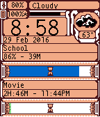{ loading=lazy width="72" } | [EventPercent](https://apps.repebble.com/56a8516af58e6beebf000019) | [centuryglass](https://github.com/centuryglass/eventwatch) | <small>Not checked yet</small> | 2016-03-06 | EventPercent watchface shows you what percent of your calendar event has already passed, or how long you have until future events start. Events are… |
| 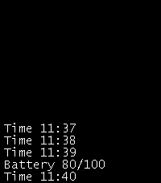{ loading=lazy width="72" } | [Events](https://apps.repebble.com/689f0ed1ad152a00098e1b77) | [Chris Lewis](https://github.com/C-D-Lewis/pebble-dev) | <small>No licence</small> | 2025-08-15 | Simple watchface showing a scrolling list of SDK events |
| { loading=lazy width="72" } | [Every moment again (On Your Wrist is the Universe)](https://apps.rebble.io/en_US/application/59724027461a8d9e490001f5) <small>Rebble App Store</small> | [Nicholas Knouf](https://github.com/zeitkunst/every_moment_again) | <small>Not checked yet</small> | 2017-07-21 | Consider your role in the universe by understanding the relationship between light from stars afar and your own history and future. On Your Wrist is the… |
| { loading=lazy width="72" } | [Everything Pedometer](https://apps.repebble.com/57bb725cbb85ed5332000b9f) | [Brian Tran](https://github.com/bzhtapp/Pebble) | <small>Not checked yet</small> | 2016-08-28 | Pedometer, battery meter, bluetooth lost connection indicator, current weather, 4-hr forecast, next morning forecast, next evening forecast, and city of… |
| { loading=lazy width="72" } | [Expectancy](https://apps.repebble.com/5786fe5eff7be0c304000106) | [fieldWalking](http://fieldwalking.jp/blog/watch-face_expectancy/) | <small>See source</small> | 2016-07-14 | Lifetime calculation from setting and Display life expectancy. year:month:day hour:min:sec current time If it's ok with you,please try my app. Don't step… |
| { loading=lazy width="72" } | [Extra Normal](https://apps.rebble.io/en_US/application/52b010d7e2187074f100001a) <small>Rebble App Store</small> | [mcongrove](https://github.com/mcongrove/PebbleExtraNormal) | <small>Not checked yet</small> | 2014-01-19 | A Pebble watch face based on the Extra Normal watch face. Hour hands turn to reveal the current time as it passes overhead. Colors can be inverted by… |
