---
hide:
  - toc
---

<!-- Generated by scripts/update_app_directory.py: do not edit by hand -->
# Pebble Watchfaces: F

[← All Pebble Watchfaces](../watchfaces.md) · [A](a.md) · [B](b.md) · [C](c.md) · [D](d.md) · [E](e.md) · **F** · [G](g.md) · [H](h.md) · [I](i.md) · [J](j.md) · [K](k.md) · [L](l.md) · [M](m.md) · [N](n.md) · [O](o.md) · [P](p.md) · [Q](q.md) · [R](r.md) · [S](s.md) · [T](t.md) · [U](u.md) · [V](v.md) · [W](w.md) · [X](x.md) · [Y](y.md) · [Z](z.md) · [0–9 & other](other.md)

*122 watchfaces · Last updated 2026-10-06 · [About these lists](../about-app-lists.md)*

<a class="app-shot" href="https://apps.repebble.com/4a2a52d2490b4e9a8fd66073" data-search-exclude>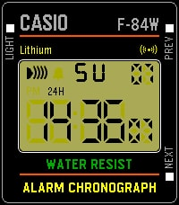</a>

<h2 class="app-name" id="app-4a2a52d2490b4e9a8fd66073"><a href="https://apps.repebble.com/4a2a52d2490b4e9a8fd66073">F-84W</a></h2>
<a class="app-source" href="https://github.com/chrislewicki/F-84W" title="Source code" data-search-exclude>View source</a>

by <a href="https://apps.repebble.com/apps/dev/chris-lewicki_53f25ba1e45d533568000139" title="More from this developer">Chris Lewicki</a>

Not checked yet v1.2 Updated 2026-06-07

Runs on: Time 2

A (mostly) faithful recreation of the Casio F-84W, the Japan-exclusive, and much better looking, older brother of the classic F-91W. Just like the real watch, it can chime at the top of every…

<a class="app-shot" href="https://apps.repebble.com/577051a7ba2fe5e1c80001eb" data-search-exclude>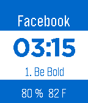</a>

<h2 class="app-name" id="app-577051a7ba2fe5e1c80001eb"><a href="https://apps.repebble.com/577051a7ba2fe5e1c80001eb">Facebook</a></h2>
<a class="app-source" href="https://github.com/tomstepp/facebookFace" title="Source code" data-search-exclude>View source</a>

by <a href="https://apps.repebble.com/apps/dev/tom-stepp_576c4c358d13727548000146" title="More from this developer">Tom Stepp</a>

Not checked yet v1.0 Updated 2016-06-26

Runs on: Round 2, Time 2, Pebble 2 Duo, Pebble 2, Time Round, Time, Classic

Displays a different Facebook value when the time changes.

<a class="app-shot" href="https://apps.repebble.com/836fe574006048dd84dacb5d" data-search-exclude>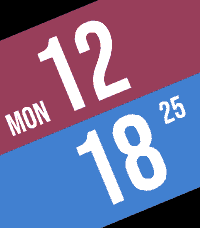</a>

<h2 class="app-name" id="app-836fe574006048dd84dacb5d"><a href="https://apps.repebble.com/836fe574006048dd84dacb5d">Faceoff</a></h2>
<a class="app-source" href="https://github.com/ollien/pebble-faceoff" title="Source code" data-search-exclude>View source</a>

by <a href="https://apps.repebble.com/apps/dev/ollien_ccb9291cdf771299703aa2ae" title="More from this developer">ollien</a>

Not checked yet v1.3 Updated 2026-05-26

Runs on: Round 2, Time 2, Time Round, Time

A Pebble watchface inspired by &quot;versus&quot; screens.

<h2 class="app-name" id="app-fe490689d3a84fe49f1cbb10"><a href="https://apps.repebble.com/fe490689d3a84fe49f1cbb10">Faceoff Remix</a></h2>
<a class="app-source" href="https://github.com/cvuorinen/pebble-faceoff" title="Source code" data-search-exclude>View source</a>

by <a href="https://apps.repebble.com/apps/dev/cvuorinen_e8e19b6fde1bd99a69e5c271" title="More from this developer">cvuorinen</a>

Not checked yet v1.1.0 Updated 2026-09-14

Runs on: Round 2, Time 2, Pebble 2 Duo, Pebble 2, Time Round, Time, Classic

A Pebble watchface that is a &quot;Remix&quot; of a watchface called &quot;Faceoff&quot; (inspired by &quot;versus&quot; screens) made by ollien. Credits to ollien for the original idea, and for releasing it as open source…

<h2 class="app-name" id="app-691cc106f5dd2700091a4fe2"><a href="https://apps.repebble.com/691cc106f5dd2700091a4fe2">facewatch</a></h2>
<a class="app-source" href="https://github.com/liza-uchaneva/facewatch_pebble" title="Source code" data-search-exclude>View source</a>

by <a href="https://apps.repebble.com/apps/dev/beathebird_5c79772ea83c740001810736" title="More from this developer">beathebird</a>

Not checked yet v1.0 Updated 2025-11-18

Runs on: Round 2, Time 2, Pebble 2 Duo, Pebble 2, Time Round, Time, Classic

Facewatch is an animated watchface that changes its expression based on how your steps compare to your usual activity. It also gives a cute little blink from time to time. A fun way to stay aware…

<a class="app-shot" href="https://apps.repebble.com/64ebc715c8c40c03a8180991" data-search-exclude>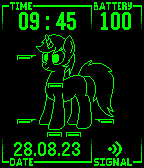</a>

<h2 class="app-name" id="app-64ebc715c8c40c03a8180991"><a href="https://apps.repebble.com/64ebc715c8c40c03a8180991">Fallout:Equestria PipBuck</a></h2>
<a class="app-source" href="https://github.com/wirelune/PipBuck" title="Source code" data-search-exclude>View source</a>

by <a href="https://apps.repebble.com/apps/dev/nyrikiri_63121c3a5e45c40008d0bc52" title="More from this developer">nyrikiri</a>

Not checked yet v1.0 Updated 2023-08-27

Runs on: Round 2, Time 2, Pebble 2 Duo, Pebble 2, Time Round, Time, Classic

For all FoE fans, a PipBuck watchface! It displays current time, battery charge, date and connection status. It also features Littlepip, main character of Fallout:Equestria fiction. Her health…

<a class="app-shot" href="https://apps.repebble.com/55f60597701b3486bd000025" data-search-exclude>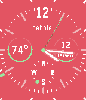</a>

<h2 class="app-name" id="app-55f60597701b3486bd000025"><a href="https://apps.repebble.com/55f60597701b3486bd000025">Fancy Face</a></h2>
<a class="app-source" href="https://github.com/johnmillage/FancyFace" title="Source code" data-search-exclude>View source</a>

by <a href="https://apps.repebble.com/apps/dev/jmillage_559f0fdb468257aee3000095" title="More from this developer">JMillage</a>

Not checked yet v1.5 Updated 2015-10-12

Runs on: Time 2, Pebble 2 Duo, Pebble 2, Time, Classic

A nice looking watchface. Shows time, date, battery life (right circle), compass direction, temperature, amount of cloud cover(left circle), and Bluetooth status (line under pebble emblem). Shake…

<a class="app-shot" href="https://apps.repebble.com/52ee5f6b94cc96ba1700001c" data-search-exclude>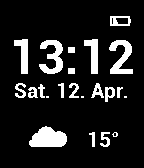</a>

<h2 class="app-name" id="app-52ee5f6b94cc96ba1700001c"><a href="https://apps.repebble.com/52ee5f6b94cc96ba1700001c">Fancy Watch</a></h2>
<a class="app-source" href="https://github.com/kasoki/pebble-fancywatch" title="Source code" data-search-exclude>View source</a>

by <a href="https://apps.repebble.com/apps/dev/kasoki_52d79b676712e67471000002" title="More from this developer">kasoki</a>

Not checked yet v0.3 Updated 2015-11-12

Runs on: Time 2, Pebble 2 Duo, Pebble 2, Time, Classic

Fancy watchface for your Pebble, with time, date, weather and battery status. Very energy efficient. Support for 12 and 24 hour format.

<h2 class="app-name" id="app-6a3adce9cd5237000932c8e2"><a href="https://apps.rebble.io/en_US/application/6a3adce9cd5237000932c8e2">Farsi Fuzzy</a></h2>
<a class="app-source" href="https://github.com/Seifollahi/farsi-fuzzy-watchface.git" title="Source code" data-search-exclude>View source</a>

by <a href="https://apps.rebble.io/en_US/developer/692e6ad1cc3ef800098d69ff/1" title="More from this developer">Mo</a>

No licence v3.0 Updated 2026-06-24 Rebble App Store

Runs on: Round 2, Time 2, Pebble 2 Duo, Pebble 2, Time Round, Time, Classic

Version 2.8.0 The Calligraphic &amp; Themes Update! Massive Redesign: Completely overhauled the typography, transitioning to a heavy, calligraphic interlocking Farsi font. Anti-Aliasing: Introduced…

<h2 class="app-name" id="app-598591e30dfc32dd140009ba"><a href="https://apps.rebble.io/en_US/application/598591e30dfc32dd140009ba">Farsi Time</a></h2>
<a class="app-source" href="https://github.com/mehradoo/big-time" title="Source code" data-search-exclude>View source</a>

by <a href="https://apps.rebble.io/en_US/developer/57dca89e2d0cc879db000178/1" title="More from this developer">Mehrad Sadegh</a>

Not checked yet v6.0 Updated 2017-08-05 Rebble App Store

Runs on: Time 2, Time

Minimalist digital watchface with Farsi digits for Pebble Time

<h2 class="app-name" id="app-ee9868f8875f4d2c81ebac42"><a href="https://apps.repebble.com/ee9868f8875f4d2c81ebac42">FCK_Gravity</a></h2>
<a class="app-source" href="https://github.com/marukitano/FCK_Gravity" title="Source code" data-search-exclude>View source</a>

by <a href="https://apps.repebble.com/apps/dev/marukitano_ff2831479c1011a82df1985d" title="More from this developer">marukitano</a>

Not checked yet v1.2.0 Updated 2026-07-29

Runs on: Time 2

##Deutsch ### Kurzbeschreibung Ein schwerkraftgesteuertes Vektor-Ziffernblatt für die Pebble Time 2. ### Beschreibung Gravity ist ein minimalistisches, schwerkraftgesteuertes Ziffernblatt für die…

<a class="app-shot" href="https://apps.repebble.com/0e2670c1adae469783030d49" data-search-exclude>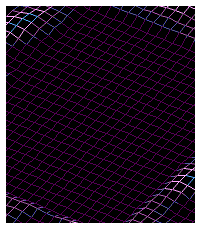</a>

<h2 class="app-name" id="app-0e2670c1adae469783030d49"><a href="https://apps.repebble.com/0e2670c1adae469783030d49">FdF Time</a></h2>
<a class="app-source" href="https://github.com/asebrech/fdf-time" title="Source code" data-search-exclude>View source</a>

by <a href="https://apps.repebble.com/apps/dev/alo_dcec9c74374783c7b3eb6164" title="More from this developer">Alo</a>

MIT v1.5.0 Updated 2026-08-21

Runs on: Round 2, Time 2, Pebble 2 Duo, Pebble 2, Time Round, Time, Classic

Every minute the digits melt back into the sea, and the new time rises out of it as a landscape of pure line. FdF is short for fil de fer, French for wireframe, and that is the whole of this…

<a class="app-shot" href="https://apps.repebble.com/56bbb1c1101f05555b000027" data-search-exclude>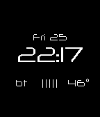</a>

<h2 class="app-name" id="app-56bbb1c1101f05555b000027"><a href="https://apps.repebble.com/56bbb1c1101f05555b000027">Feather</a></h2>
<a class="app-source" href="https://github.com/yocaba/pebble-watchface-feather" title="Source code" data-search-exclude>View source</a>

by <a href="https://apps.repebble.com/apps/dev/yocaba_5693e0e14633c854d9000051" title="More from this developer">Yocaba</a>

Not checked yet v1.4 Updated 2016-03-25

Runs on: Round 2, Time 2, Pebble 2 Duo, Pebble 2, Time Round, Time, Classic

Lightweight watchface. Time, date, battery charge level, phone connection, and temperature - everything at a glance.

<h2 class="app-name" id="app-54d05f9f0782b83773000087"><a href="https://apps.repebble.com/54d05f9f0782b83773000087">feel</a></h2>
<a class="app-source" href="https://github.com/garyduong/feel" title="Source code" data-search-exclude>View source</a>

by <a href="https://apps.repebble.com/apps/dev/gary-duong_54a4ea4db0e0bd083f000022" title="More from this developer">Gary Duong</a>

Not checked yet v1.0 Updated 2015-02-03

Runs on: Time 2, Pebble 2 Duo, Pebble 2, Time, Classic

feel is a simple weather-status watchface. Useful for active atheletes, meteorologists, weather nerds, and anyone who wants to know why the weather feels a certain way. The temperature is shown on…

<a class="app-shot" href="https://apps.repebble.com/69a625c649ab180008e537ab" data-search-exclude>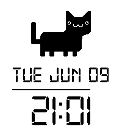</a>

<h2 class="app-name" id="app-69a625c649ab180008e537ab"><a href="https://apps.repebble.com/69a625c649ab180008e537ab">Fergus The Time Cat</a></h2>
<a class="app-source" href="https://github.com/AdamEdmondson/FergusTheTimeCat" title="Source code" data-search-exclude>View source</a>

by <a href="https://apps.repebble.com/apps/dev/adam-edmondson_6862f24053b131000870690a" title="More from this developer">Adam Edmondson</a>

No licence v1.6.0 Updated 2026-08-01

Runs on: Round 2, Time 2, Pebble 2 Duo, Pebble 2, Time Round, Time, Classic

Fergus The Time Cat need a home on your wrist! He gives you a little digital clock with the date and time along with a battery bar to tell you your battery. He tells you when your watch…

<a class="app-shot" href="https://apps.repebble.com/5299a7e6e627ce615300006f" data-search-exclude>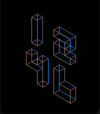</a>

<h2 class="app-name" id="app-5299a7e6e627ce615300006f"><a href="https://apps.repebble.com/5299a7e6e627ce615300006f">FEZ</a></h2>
<a class="app-source" href="https://github.com/exe44/pebble-fez" title="Source code" data-search-exclude>View source</a>

by <a href="https://apps.repebble.com/apps/dev/exe_5299a4c8e627ce050d000068" title="More from this developer">exe</a>

Not checked yet v3.1.0 Updated 2026-06-27

Runs on: Round 2, Time 2, Pebble 2 Duo, Pebble 2, Time Round, Time, Classic

Inspired by the logo of wonderful game &quot;FEZ&quot;!

<a class="app-shot" href="https://apps.repebble.com/5ff3b9811e6bb12f0bd8c9f8" data-search-exclude>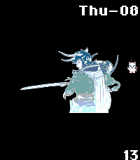</a>

<h2 class="app-name" id="app-5ff3b9811e6bb12f0bd8c9f8"><a href="https://apps.repebble.com/5ff3b9811e6bb12f0bd8c9f8">FFLogos</a></h2>
<a class="app-source" href="https://gitea.com/chimerafire/FFLogos-Pebble" title="Source code" data-search-exclude>View source</a>

by <a href="https://apps.repebble.com/apps/dev/chimerafire_5ff3b9811e6bb12f0bd8c9f6" title="More from this developer">ChimeraFire</a>

See source v1.1 Updated 2026-01-08

Runs on: Round 2, Time 2, Pebble 2 Duo, Pebble 2, Time Round, Time, Classic

A watch displaying Fairly Fantastic logos corresponding to the hour.

<a class="app-shot" href="https://apps.repebble.com/55bc955fa5c6f367f5000018" data-search-exclude>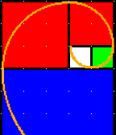</a>

<h2 class="app-name" id="app-55bc955fa5c6f367f5000018"><a href="https://apps.repebble.com/55bc955fa5c6f367f5000018">Fibonacci clock</a></h2>
<a class="app-source" href="https://github.com/steka/fibonacci_clock" title="Source code" data-search-exclude>View source</a>

by <a href="https://apps.repebble.com/apps/dev/stefan-blixten-karlsson_550c6068783f363ea1000023" title="More from this developer">Stefan &quot;Blixten&quot; Karlsson</a>

Not checked yet v0.13 Updated 2016-12-11

Runs on: Time 2, Time

The boxes in the clock has the side length as the first number of the Fibonacci series (1, 1, 2, 3, 5). Read the current time by adding the boxes side length together. Get the hours by adding the…

<a class="app-shot" href="https://apps.repebble.com/a11388c80b144c509072cd03" data-search-exclude>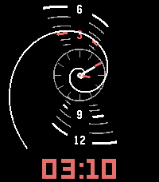</a>

<h2 class="app-name" id="app-a11388c80b144c509072cd03"><a href="https://apps.repebble.com/a11388c80b144c509072cd03">Fibonacci Spiral</a></h2>
<a class="app-source" href="https://gist.github.com/notnotrishi/a2af7aa2dcd1b301ea0332520c9d8207" title="Source code" data-search-exclude>View source</a>

by <a href="https://apps.repebble.com/apps/dev/notnotrishi_0448c3eef71293ee4cf35ca7" title="More from this developer">notnotrishi</a>

See source v1.0.0 Updated 2026-08-22

Runs on: Time 2

A watchface built around a Fibonacci golden spiral. The spiral turns through the day, and where it crosses the hour markers tells you the time — hours are spaced by the golden ratio rather than…

<h2 class="app-name" id="app-68a245345ffb456d8ec591ea"><a href="https://apps.repebble.com/68a245345ffb456d8ec591ea">Fields of Gold</a></h2>
<a class="app-source" href="https://github.com/ygalanter/fields-of-gold-pebble" title="Source code" data-search-exclude>View source</a>

by <a href="https://apps.repebble.com/apps/dev/comfortably-numb_52f547605101128b2200005a" title="More from this developer">Comfortably Numb</a>

Not checked yet v1.3.0 Updated 2026-07-18

Runs on: Round 2, Time 2, Time Round, Time

Digital clock with supersized digit size and image background. You can choose one out of six pre-selected images or select your own image Image opacity is also controlled so you can set how it is…

<a class="app-shot" href="https://apps.repebble.com/6912d087ad49bb00097251a0" data-search-exclude>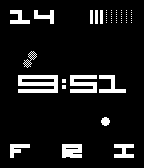</a>

<h2 class="app-name" id="app-6912d087ad49bb00097251a0"><a href="https://apps.repebble.com/6912d087ad49bb00097251a0">Fiftyeight</a></h2>
<a class="app-source" href="https://github.com/EuphoricPenguin/fiftyeight" title="Source code" data-search-exclude>View source</a>

by <a href="https://apps.repebble.com/apps/dev/euphoricpenguin_67f737a1653eea00086eedf9" title="More from this developer">EuphoricPenguin</a>

Other v2.3.0 Updated 2026-08-13

Runs on: Time 2, Pebble 2 Duo, Pebble 2, Time, Classic

Fiftyeight tells the time, but it doesn&#x27;t tell you what it should look like. Hate the analog clock? You can hide it. Figure the AM/PM indicator and date are useless? Replace them with a battery…

<h2 class="app-name" id="app-52a8bf5bc7faf7590f00000a"><a href="https://apps.repebble.com/52a8bf5bc7faf7590f00000a">Filipino Time</a></h2>
<a class="app-source" href="https://github.com/ihtnc/Pebble-FilipinoTime" title="Source code" data-search-exclude>View source</a>

by <a href="https://apps.repebble.com/apps/dev/ihtnc_529a3cd3e627ce820a000106" title="More from this developer">ihtnc</a>

Not checked yet v2.0 Updated 2025-12-01

Runs on: Time 2, Pebble 2 Duo, Pebble 2, Time, Classic

A text watch face for the Philippine&#x27;s national language -- Filipino. Some settings are configurable via the Pebble phone app.

<a class="app-shot" href="https://apps.repebble.com/547051c654f8241e18000054" data-search-exclude>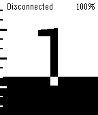</a>

<h2 class="app-name" id="app-547051c654f8241e18000054"><a href="https://apps.repebble.com/547051c654f8241e18000054">Fill &#x27;er up</a></h2>
<a class="app-source" href="http://github.com/danvolution/fillerup" title="Source code" data-search-exclude>View source</a>

by <a href="https://apps.repebble.com/apps/dev/dan-sherbeck_537139546afa9d7816000084" title="More from this developer">Dan Sherbeck</a>

No licence v1.3 Updated 2015-02-06

Runs on: Time 2, Pebble 2 Duo, Pebble 2, Time, Classic

*** What&#x27;s New (Feb 6) *** Settings range for hourly vibrate, charge status, and BT disconnected status. Minutes fill the screen from bottom to top. Configure for hourly vibrate and vibrate on…

<h2 class="app-name" id="app-52b45915f637b2b41f00001d"><a href="https://apps.repebble.com/52b45915f637b2b41f00001d">Filmplakat2</a></h2>
<a class="app-source" href="http://github.com/Shirk/Pebble-Filmplakat2" title="Source code" data-search-exclude>View source</a>

by <a href="https://apps.repebble.com/apps/dev/shirk_52b45695f637b2147b000019" title="More from this developer">Shirk</a>

No licence v1.2.3 Updated 2014-01-11

Runs on: Time 2, Pebble 2 Duo, Pebble 2, Time, Classic

A german watchface resembling a film poster. Inspired and based on &#x27;Filmplakat&#x27; for SDK 1.x. See http://vimeo.com/81829802 for a Demo.

<h2 class="app-name" id="app-67e3d4c37c483c000957c851"><a href="https://apps.rebble.io/en_US/application/67e3d4c37c483c000957c851">Fimally!</a></h2>
<a class="app-source" href="https://github.com/kjy00302/pebble-fimally" title="Source code" data-search-exclude>View source</a>

by <a href="https://apps.rebble.io/en_US/developer/5d8006bf831cc00001cfba22/1" title="More from this developer">kjy00302</a>

Not checked yet v1.1.0 Updated 2026-07-17 Rebble App Store

Runs on: Round 2, Time 2, Pebble 2 Duo, Pebble 2, Time Round, Time, Classic

A watchface based on Obvious Plant&#x27;s Pre-Cracked egg.

<a class="app-shot" href="https://apps.repebble.com/54d81627514b48833b000022" data-search-exclude>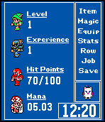</a>

<h2 class="app-name" id="app-54d81627514b48833b000022"><a href="https://apps.repebble.com/54d81627514b48833b000022">Final Fantasy GT</a></h2>
<a class="app-source" href="https://github.com/WinterWinter/finalfantasypebble" title="Source code" data-search-exclude>View source</a>

by <a href="https://apps.repebble.com/apps/dev/game-time_53b317a44f927e319f0000ae" title="More from this developer">Game Time</a>

No licence v1.7 Updated 2016-04-27

Runs on: Round 2, Time 2, Pebble 2 Duo, Pebble 2, Time Round, Time, Classic

Based off the Nintendo classic Final Fantasy 3. Features include: -Heroes- Choose what heroes you&#x27;d like to adventure with. -Levels- Levels are gained based on the difficulty mode you choose. Easy…

<a class="app-shot" href="https://apps.repebble.com/542a6a017352297c17000017" data-search-exclude>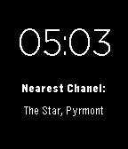</a>

<h2 class="app-name" id="app-542a6a017352297c17000017"><a href="https://apps.repebble.com/542a6a017352297c17000017">Find Me Anything</a></h2>
<a class="app-source" href="https://github.com/patcat/FindMeAnything" title="Source code" data-search-exclude>View source</a>

by <a href="https://apps.repebble.com/apps/dev/patrick-catanzariti_531cf3993d915c15f000041b" title="More from this developer">Patrick Catanzariti</a>

Not checked yet v1.0 Updated 2014-09-30

Runs on: Time 2, Pebble 2 Duo, Pebble 2, Time, Classic

A watchface that uses the Foursquare API and your Pebble&#x27;s location to let you know at all times where your nearest place of interest is. By default, it&#x27;ll tell you where the nearest Starbucks is…

<a class="app-shot" href="https://apps.repebble.com/574245e63545cd77f500001f" data-search-exclude>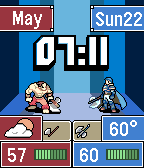</a>

<h2 class="app-name" id="app-574245e63545cd77f500001f"><a href="https://apps.repebble.com/574245e63545cd77f500001f">Fire Emblem GT</a></h2>
<a class="app-source" href="https://github.com/WinterWinter/FEGT" title="Source code" data-search-exclude>View source</a>

by <a href="https://apps.repebble.com/apps/dev/game-time_53b317a44f927e319f0000ae" title="More from this developer">Game Time</a>

No licence v1.1 Updated 2016-06-10

Runs on: Time 2, Time

Welcome to Fire Emblem GT! Based on Fire Emblem for the Gameboy Advance. Features: Animated Heroes - Choose between Eliwood, Lyn, and Hector and enjoy their critical hit animation each hour…

<a class="app-shot" href="https://apps.repebble.com/556e7b93751615c64c000085" data-search-exclude>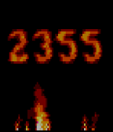</a>

<h2 class="app-name" id="app-556e7b93751615c64c000085"><a href="https://apps.repebble.com/556e7b93751615c64c000085">Fire Face</a></h2>
<a class="app-source" href="https://github.com/jmlaitpebble/fireface" title="Source code" data-search-exclude>View source</a>

by <a href="https://apps.repebble.com/apps/dev/jeff-lait_52bdec2db1ce8e14c10000e7" title="More from this developer">Jeff Lait</a>

Not checked yet v1.0 Updated 2015-06-03

Runs on: Time 2, Time

Displays the time as flames that rise and fade upwards. Yes, this will drain your battery.

<h2 class="app-name" id="app-5581da399e9090386400000b"><a href="https://apps.repebble.com/5581da399e9090386400000b">Fire!</a></h2>
<a class="app-source" href="https://github.com/Jnmattern/Fire" title="Source code" data-search-exclude>View source</a>

by <a href="https://apps.repebble.com/apps/dev/jnm_529994c0e627ce7ba1000050" title="More from this developer">Jnm</a>

No licence v1.0 Updated 2015-06-17

Runs on: Time 2, Time

Want to see how hot your Pebble Time can be? Install Fire! and contemplate your Pebble while it&#x27;s melting down! The developer is not responsible for 3rd-degree burns and empty batteries :)

<a class="app-shot" href="https://apps.rebble.io/en_US/application/5695fac8a3974593bf00001e" data-search-exclude>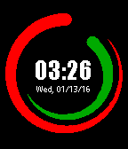</a>

<h2 class="app-name" id="app-5695fac8a3974593bf00001e"><a href="https://apps.rebble.io/en_US/application/5695fac8a3974593bf00001e">Fireball</a></h2>
<a class="app-source" href="https://edwinfinch.com/redirect/pebble-legacy-source" title="Source code" data-search-exclude>View source</a>

by <a href="https://apps.rebble.io/en_US/developer/5db6f59e385af50001ba25f9/1" title="More from this developer">Edwin Finch</a>

See source v2.5-rbl Updated 2021-06-17 Rebble App Store

Runs on: Round 2, Time 2, Time Round, Time

An old classic from our original collection from 2014-2016, now free &amp; open source!

<a class="app-shot" href="https://apps.repebble.com/52cb88a4e2dd02bd640000f6" data-search-exclude>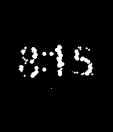</a>

<h2 class="app-name" id="app-52cb88a4e2dd02bd640000f6"><a href="https://apps.repebble.com/52cb88a4e2dd02bd640000f6">Fireflies</a></h2>
<a class="app-source" href="http://github.com/phardy/pebble-fireflies" title="Source code" data-search-exclude>View source</a>

by <a href="https://apps.repebble.com/apps/dev/stibbons_529973e3e627cef4a800001f" title="More from this developer">stibbons</a>

MIT v2.1.1 Updated 2014-01-19

Runs on: Time 2, Pebble 2 Duo, Pebble 2, Time, Classic

Join me on a magical forest adventure where monochrome fireflies dance on your wrist. Normally, they swarm and blink and dance, but every minute or so, they join together and do their best to show…

<h2 class="app-name" id="app-55becb1b505cd70307000096"><a href="https://apps.repebble.com/55becb1b505cd70307000096">FirefoxWatchface-Black</a></h2>
<a class="app-source" href="https://github.com/j796160836/FireFoxWatchFace-Pebble" title="Source code" data-search-exclude>View source</a>

by <a href="https://apps.repebble.com/apps/dev/johnnyworks_54a1f48e1bb58073c3000172" title="More from this developer">JohnnyWorks</a>

Not checked yet v1.1 Updated 2015-08-06

Runs on: Time 2, Pebble 2 Duo, Pebble 2, Time, Classic

Firefox style watchface. --- Mozilla produces many products such as the Firefox, Thunderbird, Firefox OS. (Photo sketched by Jon Hicks Nov.2007 concept logo) http://goo.gl/uJxgDU

<h2 class="app-name" id="app-55beb74d39209afe4800006c"><a href="https://apps.repebble.com/55beb74d39209afe4800006c">FirefoxWatchface-White</a></h2>
<a class="app-source" href="https://github.com/j796160836/FireFoxWatchFace-Pebble" title="Source code" data-search-exclude>View source</a>

by <a href="https://apps.repebble.com/apps/dev/johnnyworks_54a1f48e1bb58073c3000172" title="More from this developer">JohnnyWorks</a>

Not checked yet v1.2 Updated 2015-08-06

Runs on: Time 2, Pebble 2 Duo, Pebble 2, Time, Classic

Firefox style watchface. --- Mozilla produces many products such as the Firefox, Thunderbird, Firefox OS. (Photo sketched by Jon Hicks Nov.2007 concept logo) http://goo.gl/uJxgDU

<a class="app-shot" href="https://apps.repebble.com/55711594e0633d301c00006d" data-search-exclude>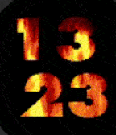</a>

<h2 class="app-name" id="app-55711594e0633d301c00006d"><a href="https://apps.repebble.com/55711594e0633d301c00006d">Fireplace</a></h2>
<a class="app-source" href="http://github.com/ygalanter/fireplace" title="Source code" data-search-exclude>View source</a>

by <a href="https://apps.repebble.com/apps/dev/comfortably-numb_52f547605101128b2200005a" title="More from this developer">Comfortably Numb</a>

MIT v1.7 Updated 2016-06-09

Runs on: Round 2, Time 2, Pebble 2 Duo, Pebble 2, Time Round, Time, Classic

- Imagine fireplace crackling on your Pebble Time - There&#x27;s a chance that it&#x27;s not battery-friendly.

<a class="app-shot" href="https://apps.repebble.com/e8e4fe569813472b8ff4ef4e" data-search-exclude>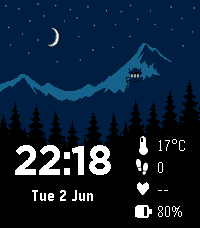</a>

<h2 class="app-name" id="app-e8e4fe569813472b8ff4ef4e"><a href="https://apps.repebble.com/e8e4fe569813472b8ff4ef4e">FireWatch Dynamic</a></h2>
<a class="app-source" href="https://github.com/satvikmaurya/FireWatchDynamic" title="Source code" data-search-exclude>View source</a>

by <a href="https://apps.repebble.com/apps/dev/pebbleenthusiastdev_4d66fd894faf184b246a34e3" title="More from this developer">PebbleEnthusiastDev</a>

Not checked yet v1.1.10 Updated 2026-06-20

Runs on: Time 2

A modified version of FireWatch that adds additional complications. Message me if you&#x27;d like to contribute, this was a very quick and dirty job.

<a class="app-shot" href="https://apps.repebble.com/5588e2fdef446dab8f000061" data-search-exclude>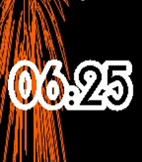</a>

<h2 class="app-name" id="app-5588e2fdef446dab8f000061"><a href="https://apps.repebble.com/5588e2fdef446dab8f000061">Fireworks</a></h2>
<a class="app-source" href="https://github.com/reini1305/fireworks" title="Source code" data-search-exclude>View source</a>

by <a href="https://apps.repebble.com/apps/dev/christian-reinbacher_52d29655c44c044e9f00004f" title="More from this developer">Christian Reinbacher</a>

Not checked yet v2.1 Updated 2016-10-24

Runs on: Round 2, Time 2, Pebble 2 Duo, Pebble 2, Time Round, Time, Classic

Fireworks on your Pebble every minute! Shake to firework! (Both configurable of course) It also features a &quot;nightstand mode&quot;. When you put the watch on it&#x27;s side, it just displays the time in the…

<a class="app-shot" href="https://apps.repebble.com/5592dc3e53d39fc50500006b" data-search-exclude>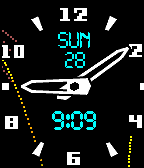</a>

<h2 class="app-name" id="app-5592dc3e53d39fc50500006b"><a href="https://apps.repebble.com/5592dc3e53d39fc50500006b">Fireworks (Particle Effects + Glancing)</a></h2>
<a class="app-source" href="https://github.com/mhungerford/pebble_fireworks" title="Source code" data-search-exclude>View source</a>

by <a href="https://apps.repebble.com/apps/dev/matthew-hungerford_52bca741d438930a650001b6" title="More from this developer">Matthew Hungerford</a>

Not checked yet v2.0 Updated 2015-10-05

Runs on: Round 2, Time 2, Time Round, Time

Fireworks Watchface featuring fireworks created using particle effects with random colors and trajectory and offscreen renderer allowing for composited trails and particle decay. Utilizes…

<a class="app-shot" href="https://apps.repebble.com/611d51e9c3e14675bfcefea5" data-search-exclude>No screenshot</a>

<h2 class="app-name" id="app-611d51e9c3e14675bfcefea5"><a href="https://apps.repebble.com/611d51e9c3e14675bfcefea5">first-face-js</a></h2>
<a class="app-source" href="https://github.com/DCouncilCSU/pebble" title="Source code" data-search-exclude>View source</a>

by <a href="https://apps.repebble.com/apps/dev/dcounc_04d93ace4230e85b4eaffb5a" title="More from this developer">DCounc</a>

No licence v0.0.1 Updated 2026-08-22

Runs on: Round 2, Time 2

First release for testing on PT2

<a class="app-shot" href="https://apps.rebble.io/en_US/application/585949725de850e8dc00039a" data-search-exclude>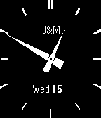</a>

<h2 class="app-name" id="app-585949725de850e8dc00039a"><a href="https://apps.rebble.io/en_US/application/585949725de850e8dc00039a">FirstNight</a></h2>
<a class="app-source" href="http://hg.subforge.org/firstnight" title="Source code" data-search-exclude>View source</a>

by <a href="https://apps.rebble.io/en_US/developer/52b88eac9efe5857ed000041/1" title="More from this developer">unexist</a>

See source v1.2 Updated 2016-12-23 Rebble App Store

Runs on: Time 2, Pebble 2 Duo, Pebble 2, Time, Classic

This is a watchface for a friend of mine: It shows exactly the same special date until you shake the watch and reveal the real time for 5s.

<a class="app-shot" href="https://apps.repebble.com/55562528078ad333250000bd" data-search-exclude>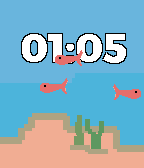</a>

<h2 class="app-name" id="app-55562528078ad333250000bd"><a href="https://apps.repebble.com/55562528078ad333250000bd">FishTank</a></h2>
<a class="app-source" href="https://github.com/coreyonfire/FishTank" title="Source code" data-search-exclude>View source</a>

by <a href="https://apps.repebble.com/apps/dev/coreyonfire_547b24d37351938b8f00002b" title="More from this developer">coreyonfire</a>

Not checked yet v1.1 Updated 2015-09-18

Runs on: Time 2, Time

Simple watchface that&#x27;s designed to look like a fishtank. You can configure the number of goldfish swimming around as well as how fast they swim.

<a class="app-shot" href="https://apps.repebble.com/5727f12b91da39ba7c000019" data-search-exclude>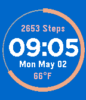</a>

<h2 class="app-name" id="app-5727f12b91da39ba7c000019"><a href="https://apps.repebble.com/5727f12b91da39ba7c000019">Fit Face</a></h2>
<a class="app-source" href="https://github.com/VeryFamousDroid/FitFace" title="Source code" data-search-exclude>View source</a>

by <a href="https://apps.repebble.com/apps/dev/ldscavo_547b79a720bfe2da7d00007b" title="More from this developer">ldscavo</a>

No licence v1.17 Updated 2016-05-23

Runs on: Round 2, Time 2, Pebble 2 Duo, Pebble 2, Time Round, Time, Classic

A minimalist watchface containing the date and temperature.

<a class="app-shot" href="https://apps.rebble.io/en_US/application/690e420aafb4ca00099364fe" data-search-exclude>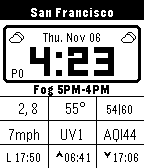</a>

<h2 class="app-name" id="app-690e420aafb4ca00099364fe"><a href="https://apps.rebble.io/en_US/application/690e420aafb4ca00099364fe">Fitzface</a></h2>
<a class="app-source" href="https://github.com/devindudeman/fitzface" title="Source code" data-search-exclude>View source</a>

by <a href="https://apps.rebble.io/en_US/developer/6864335b0c0ce600095a9437/1" title="More from this developer">Fitzsky Inc</a>

Not checked yet v1.0 Updated 2025-11-07 Rebble App Store

Runs on: Time 2, Pebble 2 Duo, Pebble 2, Time, Classic

FitzFace – High-Density Data Watchface A feature-packed Pebble watchface that brings weather, transit, and environmental data to your wrist in a compact, glanceable format. Displays current…

<h2 class="app-name" id="app-577f9b6266202a598b0003d9"><a href="https://apps.repebble.com/577f9b6266202a598b0003d9">Flav</a></h2>
<a class="app-source" href="http://hg.subforge.org/flav" title="Source code" data-search-exclude>View source</a>

by <a href="https://apps.repebble.com/apps/dev/unexist_52b88eac9efe5857ed000041" title="More from this developer">unexist</a>

See source v1.0 Updated 2016-07-11

Runs on: Time 2, Pebble 2 Duo, Pebble 2, Time, Classic

Just an idea based on a wallpaper I recently found. Basically shows a bunch of clocks with a bit of rotation.

<h2 class="app-name" id="app-5502d2d0458f26728e000016"><a href="https://apps.repebble.com/5502d2d0458f26728e000016">Flemish Fuzzy Time with Bluetooth status</a></h2>
<a class="app-source" href="https://github.com/kverpoorten/PebbleWatchface_FlemishFuzzyTime" title="Source code" data-search-exclude>View source</a>

by <a href="https://apps.repebble.com/apps/dev/kristof-verpoorten_533698eea1d9d0e548000030" title="More from this developer">Kristof Verpoorten</a>

Not checked yet v2.3 Updated 2015-03-17

Runs on: Time 2, Pebble 2 Duo, Pebble 2, Time, Classic

Vlaamse variant van de &quot;Dutch Fuzzy Time&quot;. De tijd wordt op een meer Vlaamse manier getoond in plaats van de Nederlandse manier. Zo zijn er de volgende verschillen: - In plaats van &quot;tien voor half…

<a class="app-shot" href="https://apps.repebble.com/562ebed2a3c5146008000012" data-search-exclude>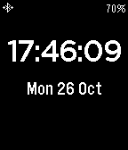</a>

<h2 class="app-name" id="app-562ebed2a3c5146008000012"><a href="https://apps.repebble.com/562ebed2a3c5146008000012">Flick Seconds</a></h2>
<a class="app-source" href="https://github.com/martinmcu/FlickSeconds" title="Source code" data-search-exclude>View source</a>

by <a href="https://apps.repebble.com/apps/dev/matt-martin_559e0ba2fbb136f3410000ab" title="More from this developer">Matt Martin</a>

Not checked yet v1.0 Updated 2015-10-27

Runs on: Time 2, Pebble 2 Duo, Pebble 2, Time, Classic

A simple watchface with the option to display seconds with a flick of the wrist! Seconds display is hidden after 15 seconds to save battery. Also shows battery status including charging, and…

<a class="app-shot" href="https://apps.repebble.com/52ff298cc7c81bc75c000122" data-search-exclude>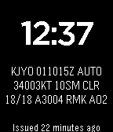</a>

<h2 class="app-name" id="app-52ff298cc7c81bc75c000122"><a href="https://apps.repebble.com/52ff298cc7c81bc75c000122">Flight Weather Pro</a></h2>
<a class="app-source" href="https://github.com/obeq/PebbleFlightWeather" title="Source code" data-search-exclude>View source</a>

by <a href="https://apps.repebble.com/apps/dev/olof-beckman_52dd224ef3be1cccd20000ac" title="More from this developer">Olof Beckman</a>

Not checked yet v1.4 Updated 2016-06-01

Runs on: Round 2, Time 2, Pebble 2 Duo, Pebble 2, Time Round, Time, Classic

Shows the latest METAR from the nearest airport in raw text for pilots. Alerts when Metar indicates possible IMC. Lack of alert does not guarantee VMC! I have only been able to test this app in…

<a class="app-shot" href="https://apps.repebble.com/d9b87c9f10a74d718db82b06" data-search-exclude>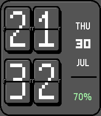</a>

<h2 class="app-name" id="app-d9b87c9f10a74d718db82b06"><a href="https://apps.repebble.com/d9b87c9f10a74d718db82b06">Flip Board</a></h2>
<a class="app-source" href="https://github.com/meded90/pebble-time-2-pixel-faces/tree/main/flip-board" title="Source code" data-search-exclude>View source</a>

by <a href="https://apps.repebble.com/apps/dev/analog-tick-tocker_eb6b6dc4dbd64c7c7ea32a94" title="More from this developer">Analog Tick-Tocker</a>

Not checked yet v1.2.1 Updated 2026-08-04

Runs on: Time 2

A mechanical-style pixel flip clock with animated digits, date and battery.

<a class="app-shot" href="https://apps.repebble.com/54a1169143ae82b64b000089" data-search-exclude>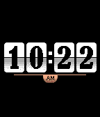</a>

<h2 class="app-name" id="app-54a1169143ae82b64b000089"><a href="https://apps.repebble.com/54a1169143ae82b64b000089">Flip Clock</a></h2>
<a class="app-source" href="https://github.com/lentyay/flip-watchface" title="Source code" data-search-exclude>View source</a>

by <a href="https://apps.repebble.com/apps/dev/lentyay_534679bcff5c0324d3000210" title="More from this developer">Lentyay</a>

Not checked yet v3.3 Updated 2016-08-31

Runs on: Round 2, Time 2, Pebble 2 Duo, Pebble 2, Time Round, Time, Classic

Fully adjustable double screen watchface with a little bit of Steampunk flavour, inspired by retro flip clock. Code based on tmnhy 7-segment watchface. Features: - Colored and Black&amp;White versions…

<a class="app-shot" href="https://apps.repebble.com/80bfb32c92eb4f86a91c941c" data-search-exclude>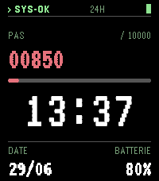</a>

<h2 class="app-name" id="app-80bfb32c92eb4f86a91c941c"><a href="https://apps.repebble.com/80bfb32c92eb4f86a91c941c">FlipBoard APOLLO</a></h2>
<a class="app-source" href="https://github.com/ldnpub/FlipBoard" title="Source code" data-search-exclude>View source</a>

by <a href="https://apps.repebble.com/apps/dev/ldnpub_9ad3573dde3f2712e9770839" title="More from this developer">ldnpub</a>

Not checked yet v0.4.1 Updated 2026-07-06

Runs on: Time 2

Aerospace console terminal watchface for Pebble Time 2. VT323 phosphor type: SYS-OK status line, step counter with goal progress bar, big mission-clock, date and battery readouts. Shake to toggle…

<a class="app-shot" href="https://apps.repebble.com/a3ff5397d9184a778cded553" data-search-exclude>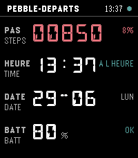</a>

<h2 class="app-name" id="app-a3ff5397d9184a778cded553"><a href="https://apps.repebble.com/a3ff5397d9184a778cded553">FlipBoard CONCOURSE</a></h2>
<a class="app-source" href="https://github.com/ldnpub/FlipBoard" title="Source code" data-search-exclude>View source</a>

by <a href="https://apps.repebble.com/apps/dev/ldnpub_9ad3573dde3f2712e9770839" title="More from this developer">ldnpub</a>

Not checked yet v0.4.1 Updated 2026-07-06

Runs on: Time 2

Bilingual departure-board watchface for Pebble Time 2. DSEG14 segment display in an airport grid: steps with goal percentage, time with ON TIME status, date with weekday, battery with health…

<a class="app-shot" href="https://apps.repebble.com/bdffc25bf0694de68ee6015c" data-search-exclude>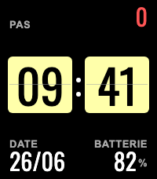</a>

<h2 class="app-name" id="app-bdffc25bf0694de68ee6015c"><a href="https://apps.repebble.com/bdffc25bf0694de68ee6015c">FlipBoard IVOIRE</a></h2>
<a class="app-source" href="https://github.com/ldnpub/FlipBoard" title="Source code" data-search-exclude>View source</a>

by <a href="https://apps.repebble.com/apps/dev/ldnpub_9ad3573dde3f2712e9770839" title="More from this developer">ldnpub</a>

Not checked yet v0.4.0 Updated 2026-06-29

Runs on: Time 2

Flip-clock watchface for Pebble Time 2. Two ivory split-flap tiles with bold Oswald digits on a dark field: steps with colour ramp, date and battery. Shake to toggle FR/EN labels. Part of the…

<a class="app-shot" href="https://apps.repebble.com/14d05b5cd0234f1d8e804887" data-search-exclude>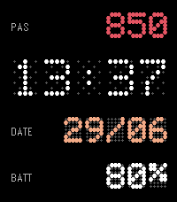</a>

<h2 class="app-name" id="app-14d05b5cd0234f1d8e804887"><a href="https://apps.repebble.com/14d05b5cd0234f1d8e804887">FlipBoard LUMEN</a></h2>
<a class="app-source" href="https://github.com/ldnpub/FlipBoard" title="Source code" data-search-exclude>View source</a>

by <a href="https://apps.repebble.com/apps/dev/ldnpub_9ad3573dde3f2712e9770839" title="More from this developer">ldnpub</a>

Not checked yet v0.4.1 Updated 2026-07-06

Runs on: Time 2

An LED dot-matrix departure board for the Pebble Time 2. Lit dots glow over a faint ghost grid; the time, your steps (colour-coded to your goal), the date and the battery sit in clean rows. Phone…

<a class="app-shot" href="https://apps.repebble.com/0a3d20f9c1574bc59142da32" data-search-exclude>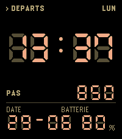</a>

<h2 class="app-name" id="app-0a3d20f9c1574bc59142da32"><a href="https://apps.repebble.com/0a3d20f9c1574bc59142da32">FlipBoard QUAI</a></h2>
<a class="app-source" href="https://github.com/ldnpub/FlipBoard" title="Source code" data-search-exclude>View source</a>

by <a href="https://apps.repebble.com/apps/dev/ldnpub_9ad3573dde3f2712e9770839" title="More from this developer">ldnpub</a>

Not checked yet v0.4.1 Updated 2026-07-06

Runs on: Time 2

Amber 7-segment platform display watchface for Pebble Time 2. DSEG7 LCD digits with authentic ghost segments: departures header with weekday, big station clock, steps with colour ramp, date and…

<a class="app-shot" href="https://apps.repebble.com/59d86b580d9b4071a1bf0c1f" data-search-exclude>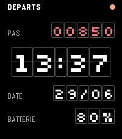</a>

<h2 class="app-name" id="app-59d86b580d9b4071a1bf0c1f"><a href="https://apps.repebble.com/59d86b580d9b4071a1bf0c1f">FlipBoard SOLARI</a></h2>
<a class="app-source" href="https://github.com/ldnpub/FlipBoard" title="Source code" data-search-exclude>View source</a>

by <a href="https://apps.repebble.com/apps/dev/ldnpub_9ad3573dde3f2712e9770839" title="More from this developer">ldnpub</a>

Not checked yet v0.4.0 Updated 2026-06-29

Runs on: Time 2

Split-flap airport board watchface for Pebble Time 2. Every character sits on its own mechanical flap tile with a fold seam, Silkscreen pixel type: departures header, steps with colour ramp, big…

<a class="app-shot" href="https://apps.repebble.com/106d7f75a81a4e8592ad7f51" data-search-exclude>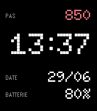</a>

<h2 class="app-name" id="app-106d7f75a81a4e8592ad7f51"><a href="https://apps.repebble.com/106d7f75a81a4e8592ad7f51">FlipBoard STIPPLE</a></h2>
<a class="app-source" href="https://github.com/ldnpub/FlipBoard" title="Source code" data-search-exclude>View source</a>

by <a href="https://apps.repebble.com/apps/dev/ldnpub_9ad3573dde3f2712e9770839" title="More from this developer">ldnpub</a>

Not checked yet v0.4.1 Updated 2026-07-06

Runs on: Time 2

Dot-matrix departure board watchface for Pebble Time 2. Doto pixel digits on a stippled e-paper field: steps with colour ramp, big clock, date and battery. Shake to toggle FR/EN labels. Part of…

<h2 class="app-name" id="app-5784dc246c2104f3ad0007ce"><a href="https://apps.repebble.com/5784dc246c2104f3ad0007ce">FlipClock 3D</a></h2>
<a class="app-source" href="https://github.com/reciprocum/Pebble-SDK4-WatchFace-FlipClock3D" title="Source code" data-search-exclude>View source</a>

by <a href="https://apps.repebble.com/apps/dev/afonso-santos_53c7f761e5c0719320000162" title="More from this developer">Afonso Santos</a>

Not checked yet v4.5 Updated 2017-01-27

Runs on: Round 2, Time 2, Pebble 2 Duo, Pebble 2, Time Round, Time

Gravity &amp; gesture aware interactive 3D flipping clock. STEADY mode: - TWIST : DYNAMIC mode DYNAMIC mode: - TWIST : spin up Will fallback to STEADY mode after 5s not spinning.

<a class="app-shot" href="https://apps.repebble.com/276ed3773d8548c09b372204" data-search-exclude>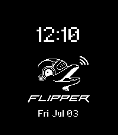</a>

<h2 class="app-name" id="app-276ed3773d8548c09b372204"><a href="https://apps.repebble.com/276ed3773d8548c09b372204">Flipper Zero</a></h2>
<a class="app-source" href="https://github.com/dnnsmnstrr/pebble-flipper" title="Source code" data-search-exclude>View source</a>

by <a href="https://apps.repebble.com/apps/dev/dennis-muensterer_53cc9927fd8ebf394ae021ca" title="More from this developer">Dennis Muensterer</a>

Not checked yet v1.1.1 Updated 2026-07-07

Runs on: Round 2, Time 2, Pebble 2 Duo, Pebble 2, Time Round, Time, Classic

A Flipper on your wrist

<a class="app-shot" href="https://apps.repebble.com/6968b1fe0bd3670009877828" data-search-exclude>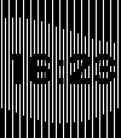</a>

<h2 class="app-name" id="app-6968b1fe0bd3670009877828"><a href="https://apps.repebble.com/6968b1fe0bd3670009877828">Flow</a></h2>
<a class="app-source" href="https://github.com/Yorks0n/pebble-watchface-flow" title="Source code" data-search-exclude>View source</a>

by <a href="https://apps.repebble.com/apps/dev/yorks0n_692a907686176a0009926c79" title="More from this developer">Yorks0n</a>

No licence v1.1 Updated 2026-01-16

Runs on: Round 2, Time 2, Pebble 2 Duo, Pebble 2, Time Round, Time, Classic

Let&#x27;s flow with pebble. With various themes available.

<h2 class="app-name" id="app-53f98c8625ab8a8f33000091"><a href="https://apps.repebble.com/53f98c8625ab8a8f33000091">Fluttershy</a></h2>
<a class="app-source" href="https://code.google.com/p/pebble-watchfaces/source/browse/" title="Source code" data-search-exclude>View source</a>

by <a href="https://apps.repebble.com/apps/dev/calamari-software_53cb0606f87b113d8700000d" title="More from this developer">calamari Software</a>

See source v1.0 Updated 2014-08-24

Runs on: Time 2, Pebble 2 Duo, Pebble 2, Time, Classic

Have the cutest pony tell you the time! Features the time, date (month and day), weekday, and battery level. The presence of her cutie mark indicates whether there is a bluetooth connection…

<a class="app-shot" href="https://apps.repebble.com/56251336851cda3643000057" data-search-exclude>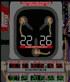</a>

<h2 class="app-name" id="app-56251336851cda3643000057"><a href="https://apps.repebble.com/56251336851cda3643000057">Flux Capacitor</a></h2>
<a class="app-source" href="https://github.com/rabits/flux-capacitor" title="Source code" data-search-exclude>View source</a>

by <a href="https://apps.repebble.com/apps/dev/rabit_54ceb8b6f2184c89ed00001d" title="More from this developer">Rabit</a>

Not checked yet v1.4 Updated 2015-10-29

Runs on: Time 2, Time

Compact version of Flux Capacitor from Back to the Future trilogy for your Pebble Time. This working version of time machine can help you to travel in time. October 21, 2015 already behind, but…

<h2 class="app-name" id="app-52cdd3b70b54db5fb900001b"><a href="https://apps.repebble.com/52cdd3b70b54db5fb900001b">Flying Blind</a></h2>
<a class="app-source" href="https://github.com/mcongrove/PebbleFlyingBlind" title="Source code" data-search-exclude>View source</a>

by <a href="https://apps.repebble.com/apps/dev/mcongrove_52affc34e2187058f9000011" title="More from this developer">mcongrove</a>

Not checked yet v1.1 Updated 2014-01-19

Runs on: Time 2, Pebble 2 Duo, Pebble 2, Time, Classic

A Pebble watch face that vibrates the time. Optionally vibrates every half or quarter-hour. Shake your wrist to briefly see the time. Colors can be inverted and vibration intervals can be set by…

<a class="app-shot" href="https://apps.repebble.com/5688372181dd62e19f00004b" data-search-exclude>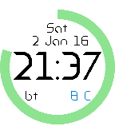</a>

<h2 class="app-name" id="app-5688372181dd62e19f00004b"><a href="https://apps.repebble.com/5688372181dd62e19f00004b">FMWatchFace</a></h2>
<a class="app-source" href="https://github.com/mafabio/FMWF" title="Source code" data-search-exclude>View source</a>

by <a href="https://apps.repebble.com/apps/dev/fmonline_5565c00f6ad391d01600003e" title="More from this developer">FMonline</a>

Not checked yet v1.0 Updated 2016-01-02

Runs on: Round 2, Time 2, Pebble 2 Duo, Pebble 2, Time Round, Time, Classic

Time, date, battery charge level, phone connection and temperature (from openweathermap.org). Very clean watchface. Everything on the screen. Always Thanks to Michael Moss for the Android Insomnia…

<h2 class="app-name" id="app-5361706f17c60e02d800020e"><a href="https://apps.repebble.com/5361706f17c60e02d800020e">ForeCal (Weather Forecast &amp; Calendar)</a></h2>
<a class="app-source" href="https://github.com/SeaPea/ForeCal" title="Source code" data-search-exclude>View source</a>

by <a href="https://apps.repebble.com/apps/dev/seapea-software_52f00ed07a772ced5d0000db" title="More from this developer">SeaPea Software</a>

MIT v4.0 Updated 2016-10-08

Runs on: Round 2, Time 2, Pebble 2 Duo, Pebble 2, Time Round, Time, Classic

Displays today&#x27;s/tomorrow&#x27;s forecast with a 3 week calendar always on screen. (No need to flick wrist or tap to get to another view) Now with color! - Current details: Time, date, Battery…

<a class="app-shot" href="https://apps.repebble.com/69386de69aa93e0009ba0011" data-search-exclude>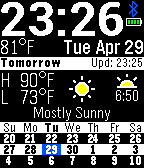</a>

<h2 class="app-name" id="app-69386de69aa93e0009ba0011"><a href="https://apps.repebble.com/69386de69aa93e0009ba0011">ForeCal Reloaded (Weather Forecast &amp; Calendar)</a></h2>
<a class="app-source" href="https://github.com/skylord123/ForeCal" title="Source code" data-search-exclude>View source</a>

by <a href="https://apps.repebble.com/apps/dev/skylar-sadlier_5d01f46b419d5a0001a47cfb" title="More from this developer">Skylar Sadlier</a>

Not checked yet v6.1 Updated 2026-08-30

Runs on: Round 2, Time 2, Pebble 2 Duo, Pebble 2, Time Round, Time, Classic

ForeCal Reloaded is a modern update of the original ForeCal watchface by SeaPea, rebuilt for today’s Pebble and Rebble ecosystem. It keeps the clean, glanceable design while fixing long-standing…

<a class="app-shot" href="https://apps.repebble.com/5dcdca6ac393f50cf6dbc264" data-search-exclude>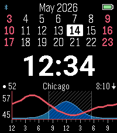</a>

<h2 class="app-name" id="app-5dcdca6ac393f50cf6dbc264"><a href="https://apps.repebble.com/5dcdca6ac393f50cf6dbc264">ForecasWatch 2</a></h2>
<a class="app-source" href="https://github.com/mattrossman/forecaswatch2" title="Source code" data-search-exclude>View source</a>

by <a href="https://apps.repebble.com/apps/dev/matt-rossman_5dcdca6ac393f50cf6dbc262" title="More from this developer">Matt Rossman</a>

Not checked yet v1.37.0 Updated 2026-09-20

Runs on: Time 2, Pebble 2 Duo, Pebble 2, Time, Classic

Open source revival of the beloved ForecasWatch watchface. This includes support for Weather Underground forecasts, which broke on the original ForecasWatch when the free API was shut down. Feel…

<a class="app-shot" href="https://apps.rebble.io/en_US/application/6a3d0e695961b6000961c58c" data-search-exclude>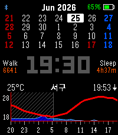</a>

<h2 class="app-name" id="app-6a3d0e695961b6000961c58c"><a href="https://apps.rebble.io/en_US/application/6a3d0e695961b6000961c58c">ForecasWatchface2-Kor</a></h2>
<a class="app-source" href="https://github.com/mackerel-kang/forecaswatch2" title="Source code" data-search-exclude>View source</a>

by <a href="https://apps.rebble.io/en_US/developer/5b7a6ad64ea12200016c0152/1" title="More from this developer">Mack Kang</a>

Not checked yet v1.0.0 Updated 2026-06-25 Rebble App Store

Runs on: Time 2, Pebble 2 Duo, Pebble 2, Time, Classic

FCW-K puts your day on one screen: an hourly weather forecast graph, a four-week calendar with Korean public holidays, and your key stats — time, battery, steps, and sleep. A Korean-localized fork…

<h2 class="app-name" id="app-557610f686a1e8eecd000082"><a href="https://apps.repebble.com/557610f686a1e8eecd000082">FORM</a></h2>
<a class="app-source" href="https://github.com/rebootsramblings/GBitmap-Colour-Palette-Manipulator" title="Source code" data-search-exclude>View source</a>

by <a href="https://apps.repebble.com/apps/dev/mathew-reiss_52f02483af0eab7af50006d3" title="More from this developer">Mathew Reiss</a>

Not checked yet v1.1 Updated 2015-06-09

Runs on: Time 2, Time

Reddit request - digital watchface in the same style as FORM for Android Wear (by Roman Nurik). All credit for design goes to Roman. If it proves popular, I&#x27;ll work on adding custom colors/themes!…

<h2 class="app-name" id="app-56088fcf364a06c221000009"><a href="https://apps.repebble.com/56088fcf364a06c221000009">FORM Watch Face</a></h2>
<a class="app-source" href="https://github.com/sunnygoyal/FORMWatchFace-pebble" title="Source code" data-search-exclude>View source</a>

by <a href="https://apps.repebble.com/apps/dev/painless-apps_5388039721fa15cb20000094" title="More from this developer">Painless Apps</a>

Not checked yet v1.2 Updated 2016-05-01

Runs on: Time 2, Pebble 2 Duo, Pebble 2, Time, Classic

This is a watch face for Pebble based on the typeface used for the FORM design conference (based on Form watch face for Android Wear)

<a class="app-shot" href="https://apps.repebble.com/56edf5a611c02b5bae00002d" data-search-exclude>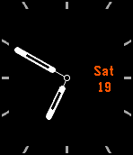</a>

<h2 class="app-name" id="app-56edf5a611c02b5bae00002d"><a href="https://apps.repebble.com/56edf5a611c02b5bae00002d">Formal</a></h2>
<a class="app-source" href="https://github.com/briwestervelt/formal_source" title="Source code" data-search-exclude>View source</a>

by <a href="https://apps.repebble.com/apps/dev/briwest_549f1c36ef9cfa34520001fb" title="More from this developer">BriWest</a>

No licence v1.0 Updated 2016-03-22

Runs on: Round 2, Time 2, Pebble 2 Duo, Pebble 2, Time Round, Time, Classic

Tired of your watch hands covering the date? Formal moves its date display to one of three positions so it&#x27;s never covered. Plus it looks... formal! The color of every element is configurable, as…

<h2 class="app-name" id="app-558ffa906dba2d11fe00005a"><a href="https://apps.repebble.com/558ffa906dba2d11fe00005a">Fortuna Watchface</a></h2>
<a class="app-source" href="https://github.com/DevHopps/pebble-fortuna" title="Source code" data-search-exclude>View source</a>

by <a href="https://apps.repebble.com/apps/dev/devhopps_5508790a7d3b94d00900004d" title="More from this developer">DevHopps</a>

MIT v2.0 Updated 2015-06-29

Runs on: Time 2, Time

A simple watchface just showing the logo of &quot;Fortuna Düsseldorf&quot; and the current time and date.

<a class="app-shot" href="https://apps.repebble.com/560d8701038c3881ac000037" data-search-exclude>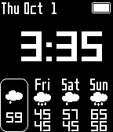</a>

<h2 class="app-name" id="app-560d8701038c3881ac000037"><a href="https://apps.repebble.com/560d8701038c3881ac000037">Fourcast</a></h2>
<a class="app-source" href="http://github.com/benkrejci/fourcast" title="Source code" data-search-exclude>View source</a>

by <a href="https://apps.repebble.com/apps/dev/benkrejci_559ef73814e579424000004b" title="More from this developer">benkrejci</a>

MIT v0.9 Updated 2015-11-21

Runs on: Time 2, Pebble 2 Duo, Pebble 2, Time, Classic

Simple digital face showing current weather, and the forecast for next 3 days. Configurable background and foreground colors, as well as temperature units. Weather info provided by…

<a class="app-shot" href="https://apps.repebble.com/5582a35a09d6f4112d000095" data-search-exclude>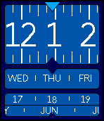</a>

<h2 class="app-name" id="app-5582a35a09d6f4112d000095"><a href="https://apps.repebble.com/5582a35a09d6f4112d000095">FourSliders</a></h2>
<a class="app-source" href="https://github.com/Juanvvc/FourSliders" title="Source code" data-search-exclude>View source</a>

by <a href="https://apps.repebble.com/apps/dev/juan-vera_5576ea0b691b9b6333000036" title="More from this developer">Juan Vera</a>

No licence v1.1 Updated 2015-06-20

Runs on: Time 2, Pebble 2 Duo, Pebble 2, Time, Classic

A watchface that shows the time using four sliders: hour, weekday, day and month.

<h2 class="app-name" id="app-5841886baf734898822e2899"><a href="https://apps.repebble.com/5841886baf734898822e2899">Fox Weather</a></h2>
<a class="app-source" href="https://github.com/levonn-dev/pebble-adventure-wf" title="Source code" data-search-exclude>View source</a>

by <a href="https://apps.repebble.com/apps/dev/levonn_f316bd30e30eb999711b5614" title="More from this developer">Levonn</a>

Not checked yet v1.0.0 Updated 2026-05-26

Runs on: Time 2, Pebble 2 Duo

A Pebble watchface where the sky follows your weather and a pixel fox keeps you company. The background changes with the current conditions, a fox sits (or walks) on the ground, and the time…

<h2 class="app-name" id="app-55bed9ed39209aec5f000083"><a href="https://apps.repebble.com/55bed9ed39209aec5f000083">Foxmosa Watchface (MozTW)</a></h2>
<a class="app-source" href="https://github.com/j796160836/FoxmosaWatchFace-Pebble" title="Source code" data-search-exclude>View source</a>

by <a href="https://apps.repebble.com/apps/dev/johnnyworks_54a1f48e1bb58073c3000172" title="More from this developer">JohnnyWorks</a>

Not checked yet v1.1 Updated 2015-08-04

Runs on: Time 2, Pebble 2 Duo, Pebble 2, Time, Classic

Foxmosa is mascot of Mozilla Taiwan Community. Mozilla produces many products such as the Firefox, Thunderbird, Firefox OS. Picture designed by ECBp + Tatit + Indigo + Irvin (cc:by-nc-sa) MozTW…

<h2 class="app-name" id="app-5b1d5c07fbaf9a36ee0001f3"><a href="https://apps.rebble.io/en_US/application/5b1d5c07fbaf9a36ee0001f3">Frankie G</a></h2>
<a class="app-source" href="https://github.com/kaypro4/frankieg" title="Source code" data-search-exclude>View source</a>

by <a href="https://apps.rebble.io/en_US/developer/5678b92c0ffe0467d6000075/1" title="More from this developer">Matt Pope</a>

Not checked yet v1.0 Updated 2018-06-10 Rebble App Store

Runs on: Round 2, Time Round

A Pebble Watchface app to replicate my beloved Frank Gehry Fossil watch on my Pebble. Tells time in a format like &quot;half past midnight&quot; and &quot;16 til 8&quot;.

<h2 class="app-name" id="app-5485be77c1f41bcadd00005b"><a href="https://apps.repebble.com/5485be77c1f41bcadd00005b">Fredsistance</a></h2>
<a class="app-source" href="https://github.com/dcarryer/fredsistance" title="Source code" data-search-exclude>View source</a>

by <a href="https://apps.repebble.com/apps/dev/david-carryer_5471353b0ad7b49f470000fa" title="More from this developer">David Carryer</a>

Not checked yet v1.0 Updated 2014-12-08

Runs on: Time 2, Pebble 2 Duo, Pebble 2, Time, Classic

Do you play Ingress? Are you a member of the Resistance? You should be. This simple watchface was developed to showcase the Fredericksburg Resistance, a group of dedicated agents centered in…

<h2 class="app-name" id="app-5507733bce75c1a18e000091"><a href="https://apps.repebble.com/5507733bce75c1a18e000091">Freedom</a></h2>
<a class="app-source" href="https://github.com/SexualRhinoceros/FREEDOM" title="Source code" data-search-exclude>View source</a>

by <a href="https://apps.repebble.com/apps/dev/sexualrhinoceros_54c84b188359aeff7a000003" title="More from this developer">SexualRhinoceros</a>

No licence v1.0 Updated 2015-03-17

Runs on: Time 2, Pebble 2 Duo, Pebble 2, Time, Classic

A beautiful waving flag in conjunction with a time that is wonderfully outlined to make it pop! Show those damned Commies what Freedom really means!

<h2 class="app-name" id="app-52f14342e21be494030000bf"><a href="https://apps.repebble.com/52f14342e21be494030000bf">French Weather</a></h2>
<a class="app-source" href="https://github.com/Allezxandre/french-futura-weather-sdk2.0/releases/" title="Source code" data-search-exclude>View source</a>

by <a href="https://apps.repebble.com/apps/dev/allezxandre_529a3945129af7ae7e0000c7" title="More from this developer">Allezxandre</a>

GPL-3.0 v3.3 Updated 2015-05-25

Runs on: Time 2, Pebble 2 Duo, Pebble 2, Time, Classic

Now supports - English, French, German and Spanish. — English International alternative to Futura Weather by Niknam. The Watchface will display date according to your Pebble&#x27;s language settings…

<h2 class="app-name" id="app-f747afcc10d24c91ad30d88c"><a href="https://apps.repebble.com/f747afcc10d24c91ad30d88c">Frequent Traveler</a></h2>
<a class="app-source" href="https://github.com/nateinaction/frequent-traveler-watchface" title="Source code" data-search-exclude>View source</a>

by <a href="https://apps.repebble.com/apps/dev/nate-gay_944ac793331e6c5243804ad2" title="More from this developer">Nate Gay</a>

Not checked yet v1.1.0 Updated 2026-09-07

Runs on: Time 2, Pebble 2 Duo, Time

A multi-timezone watch face for frequent travelers. Shows local time and up to five additional time zones. When local time matches a configured time zone, that row will be hidden. Rows have a…

<h2 class="app-name" id="app-6797522d3d3a4b93ad1526bd"><a href="https://apps.repebble.com/6797522d3d3a4b93ad1526bd">Fresco</a></h2>
<a class="app-source" href="https://github.com/KiserDesigns/Pebble_Fresco" title="Source code" data-search-exclude>View source</a>

by <a href="https://apps.repebble.com/apps/dev/noah-kiser_309e95d94e23b9be8fa889d9" title="More from this developer">Noah Kiser</a>

No licence v0.2.6 Updated 2026-08-13

Runs on: Round 2, Time 2, Pebble 2 Duo, Pebble 2, Time Round, Time, Classic

Settings Tests

<h2 class="app-name" id="app-d9fc15a8f87746b7ba01f6ca"><a href="https://apps.repebble.com/d9fc15a8f87746b7ba01f6ca">From Here</a></h2>
<a class="app-source" href="https://github.com/globe-and-atlas/from-here" title="Source code" data-search-exclude>View source</a>

by <a href="https://apps.repebble.com/apps/dev/daniel-bally_e8468a0ff28edd5791d1bced" title="More from this developer">Daniel Bally</a>

Not checked yet v0.2.0 Updated 2026-10-02

Runs on: Time 2

Your location is the start. At 10:42 you are 10 degrees 42 minutes away along the direction you chose; the face shows where that is on a map, names the place, and tells you which town comes next…

<h2 class="app-name" id="app-53666f0114acdb643000007f"><a href="https://apps.repebble.com/53666f0114acdb643000007f">Full Circle</a></h2>
<a class="app-source" href="https://github.com/dunamis/pebble/tree/master/watchfaces/fullcircle" title="Source code" data-search-exclude>View source</a>

by <a href="https://apps.repebble.com/apps/dev/chris_5325af5f8f1b377345000157" title="More from this developer">chris</a>

Not checked yet v1.0.1 Updated 2014-05-10

Runs on: Time 2, Pebble 2 Duo, Pebble 2, Time, Classic

A clean and intuitive watchface that shows the minutes as a progressing circle, with the hour in text in the center. Shake or tap your Pebble to view the date instead of the hour.

<h2 class="app-name" id="app-551ef17fff0156c596000069"><a href="https://apps.repebble.com/551ef17fff0156c596000069">Fullmetal Alchemist: Pocket Smartwatch</a></h2>
<a class="app-source" href="https://github.com/asardaes/pebble-fma" title="Source code" data-search-exclude>View source</a>

by <a href="https://apps.repebble.com/apps/dev/apestowesome_54f473e5975f691677000041" title="More from this developer">Apestowesome</a>

No licence v3.1 Updated 2016-04-28

Runs on: Time 2, Pebble 2 Duo, Pebble 2, Time, Classic

Watchface inspired by the anime Fullmetal Alchemist: Brotherhood. - Time gets transmuted every minute. - Battery percentage is shown on the upper right. While charging, a different symbol appears…

<h2 class="app-name" id="app-5659b0dc36f882e860000055"><a href="https://apps.repebble.com/5659b0dc36f882e860000055">Fun with flags</a></h2>
<a class="app-source" href="https://github.com/reini1305/funwithflags" title="Source code" data-search-exclude>View source</a>

by <a href="https://apps.repebble.com/apps/dev/christian-reinbacher_52d29655c44c044e9f00004f" title="More from this developer">Christian Reinbacher</a>

Not checked yet v2.2 Updated 2016-10-24

Runs on: Round 2, Time 2, Time Round, Time

Learn some new flags on the go! Every minute a new flag is shown. if you flick your wrist, your watch will tell you which country the flag belongs to. If you like it, give it a heart and consider…

<h2 class="app-name" id="app-67cd19afb7a023024b21460c"><a href="https://apps.rebble.io/en_US/application/67cd19afb7a023024b21460c">Functionalist</a></h2>
<a class="app-source" href="https://codeberg.org/mrp/functionalist" title="Source code" data-search-exclude>View source</a>

by <a href="https://apps.rebble.io/en_US/developer/67a619488923f30009dc055f/1" title="More from this developer">mrp</a>

See source v1.6 Updated 2026-08-01 Rebble App Store

Runs on: Round 2, Time 2, Pebble 2 Duo, Pebble 2, Time Round, Time, Classic

Form ever follows function. - large time in the center - day of the week and date - charge percentage, a doughnut chart of the battery charge level, and bluetooth connectivity indicator - when…

<h2 class="app-name" id="app-55b434ef46a407f58f000006"><a href="https://apps.repebble.com/55b434ef46a407f58f000006">FunTime AwesomeFace</a></h2>
<a class="app-source" href="https://github.com/noerjeffries/funtime-awesomeface" title="Source code" data-search-exclude>View source</a>

by <a href="https://apps.repebble.com/apps/dev/noah-jeffrey_55a159d26cd3608382000061" title="More from this developer">Noah Jeffrey</a>

Not checked yet v1.1 Updated 2015-11-10

Runs on: Time 2, Pebble 2 Duo, Pebble 2, Time, Classic

A basic watchface that clearly shows the time, date, and current weather conditions for your location. Plus, a fun little mushroom. :) Thanks to all who already downloaded and hearted! :D Heart…

<h2 class="app-name" id="app-54ed8ef50cd3c52fe2000005"><a href="https://apps.repebble.com/54ed8ef50cd3c52fe2000005">Futhark Watchface</a></h2>
<a class="app-source" href="https://github.com/rehaby/futharkWatchfacePebble2" title="Source code" data-search-exclude>View source</a>

by <a href="https://apps.repebble.com/apps/dev/rshamar_537c100089d74e2e85000082" title="More from this developer">þórshamar</a>

Not checked yet v1.0 Updated 2015-02-25

Runs on: Time 2, Pebble 2 Duo, Pebble 2, Time, Classic

Tell the time like a Viking!!!!!! (if they had watches) Shows the time in Old Norse using the younger Futhark runes. Also vibrates when your watch disconnects from phone. Time is in 12 hour…

<h2 class="app-name" id="app-52d313a912ea3dcf84000024"><a href="https://apps.repebble.com/52d313a912ea3dcf84000024">Futura Weather</a></h2>
<a class="app-source" href="https://github.com/Katharine/futura-weather-sdk2.0/tree/pebble-fixes" title="Source code" data-search-exclude>View source</a>

by <a href="https://apps.repebble.com/apps/dev/niknam-moslehi_5296f04b40d8a9a0ba000003" title="More from this developer">Niknam Moslehi</a>

No licence v2.1.0 Updated 2014-06-23

Runs on: Time 2, Pebble 2 Duo, Pebble 2, Time, Classic

Shows you the current weather conditions at a glance. Also keeps the weather information updated every 15 minutes, indicates if the weather information is stale, and gives you a heads-up if your…

<h2 class="app-name" id="app-556d94d2ab161f3ce10000bc"><a href="https://apps.repebble.com/556d94d2ab161f3ce10000bc">futura-gary</a></h2>
<a class="app-source" href="https://github.com/garysleet/futura-gary" title="Source code" data-search-exclude>View source</a>

by <a href="https://apps.repebble.com/apps/dev/gary-sleet_52f143208d40befc3a000105" title="More from this developer">Gary Sleet</a>

Not checked yet v3.4 Updated 2015-06-17

Runs on: Time 2, Pebble 2 Duo, Pebble 2, Time, Classic

Crammed as much information as I could onto the watch face, and added many power management features. The weather symbol next to the date is the current conditions. The 5 symbols along the bottom…

<h2 class="app-name" id="app-53cbbdf6ecd64e8f44000019"><a href="https://apps.repebble.com/53cbbdf6ecd64e8f44000019">Future And Past Watchface</a></h2>
<a class="app-source" href="https://github.com/minils/future-and-past-watchface" title="Source code" data-search-exclude>View source</a>

by <a href="https://apps.repebble.com/apps/dev/minils_52c444227567140b1100003b" title="More from this developer">minils</a>

Not checked yet v1.1 Updated 2014-07-20

Runs on: Time 2, Pebble 2 Duo, Pebble 2, Time, Classic

A watchface which is simply displaying the time.

<h2 class="app-name" id="app-56e04296320b573560000009"><a href="https://apps.repebble.com/56e04296320b573560000009">Future Time</a></h2>
<a class="app-source" href="https://github.com/ygalanter/priv-future-time" title="Source code" data-search-exclude>View source</a>

by <a href="https://apps.repebble.com/apps/dev/comfortably-numb_52f547605101128b2200005a" title="More from this developer">Comfortably Numb</a>

Not checked yet v2.0.0 Updated 2026-08-01

Runs on: Round 2, Time 2, Pebble 2 Duo, Pebble 2, Time Round, Time, Classic

This is the face of the future. Two faces actually - because you get both analog and digital face - and it&#x27;s up to you which one to use. You also get eight predefined color themes as well as…

<h2 class="app-name" id="app-541768c2d8eb58ee1a000003"><a href="https://apps.repebble.com/541768c2d8eb58ee1a000003">Fuzzier Fuzzy Text International</a></h2>
<a class="app-source" href="https://github.com/keithzg/Fuzzier-Fuzzy-Text-International" title="Source code" data-search-exclude>View source</a>

by <a href="https://apps.repebble.com/apps/dev/keithzg_52d9c139b82a9f04f2000024" title="More from this developer">keithzg</a>

Not checked yet v1.3 Updated 2014-09-15

Runs on: Time 2, Pebble 2 Duo, Pebble 2, Time, Classic

A dirty hack of Fuzzy Text International for folks like myself who felt all of the existing &quot;fuzzy&quot; watchfaces were still too specific. If you want to wake up and have your watch tell you it&#x27;s…

<h2 class="app-name" id="app-52d0c95a74a38edfd60000cd"><a href="https://apps.rebble.io/en_US/application/52d0c95a74a38edfd60000cd">Fuzzier Time</a></h2>
<a class="app-source" href="https://github.com/Atntias/FuzzierTimeEnglish" title="Source code" data-search-exclude>View source</a>

by <a href="https://apps.rebble.io/en_US/developer/52d0c45e74a38eb4a60000c8/1" title="More from this developer">Atntias</a>

No licence v1.0 Updated 2014-01-23 Rebble App Store

Runs on: Time 2, Pebble 2 Duo, Pebble 2, Time, Classic

The reason I got my pebble was I wanted a watch that show&#x27;s time the way I see it, fuzzy time was close but not quite it. Iv&#x27;e tried to capture the way I interpret time, and for those who say it&#x27;s…

<h2 class="app-name" id="app-52f2107ae21be4b82000117d"><a href="https://apps.repebble.com/52f2107ae21be4b82000117d">Fuzzy Analog</a></h2>
<a class="app-source" href="https://github.com/PanicMan/Pebble-FuzzyAnalog" title="Source code" data-search-exclude>View source</a>

by <a href="https://apps.repebble.com/apps/dev/jack-t_52ea054f156ab45eae00000f" title="More from this developer">Jack T.</a>

No licence v3.2 Updated 2016-10-25

Runs on: Round 2, Time 2, Pebble 2 Duo, Pebble 2, Time Round, Time, Classic

Pebble implementation of the following clock: http://i.imgur.com/Bf4C7nZ.gif Credits for the Idea goes to hop-picker ( http://hop-picker.tumblr.com ) as he first posted the concept of this kind of…

<h2 class="app-name" id="app-56a3faa9c242641e24000054"><a href="https://apps.repebble.com/56a3faa9c242641e24000054">Fuzzy Dk</a></h2>
<a class="app-source" href="https://github.com/bschau/FuzzyDk.git" title="Source code" data-search-exclude>View source</a>

by <a href="https://apps.repebble.com/apps/dev/brian-schau_52bc98fc530bf4ed75000183" title="More from this developer">Brian Schau</a>

No licence v1.2 Updated 2016-01-23

Runs on: Time 2, Pebble 2 Duo, Pebble 2, Time, Classic

Fuzzy Dk is a danish pebble watchface showing the time ... almost to the second ... :-) Shake the watch to get the date, time and battery status.

<h2 class="app-name" id="app-52b2177acd41831621000063"><a href="https://apps.repebble.com/52b2177acd41831621000063">Fuzzy French</a></h2>
<a class="app-source" href="https://github.com/mandlar/Pebble-Fuzzy-French-Plus" title="Source code" data-search-exclude>View source</a>

by <a href="https://apps.repebble.com/apps/dev/mandaria-software_52b2157a8c08157629000068" title="More from this developer">Mandaria Software</a>

Not checked yet v1.2 Updated 2014-12-15

Runs on: Time 2, Pebble 2 Duo, Pebble 2, Time, Classic

- Shows the current fuzzy time in French. Updates every five minutes - Shows the current date in French - Shows the current week and day number - Shows the current time. Updates every minute …

<h2 class="app-name" id="app-54c512a98e136b17c5000029"><a href="https://apps.repebble.com/54c512a98e136b17c5000029">Fuzzy French modern</a></h2>
<a class="app-source" href="https://github.com/iznogoud765/Pebble_Face_Fuzzy_FR_Modern" title="Source code" data-search-exclude>View source</a>

by <a href="https://apps.repebble.com/apps/dev/iznogoud_52d3ee67cba068af09000013" title="More from this developer">Iznogoud</a>

Not checked yet v2.0 Updated 2015-07-24

Runs on: Time 2, Pebble 2 Duo, Pebble 2, Time, Classic

Fuzzy time in French, updates every 5 minutes - Shows current time and date in french in the bottom part - Shows current battery level in left upper part, with charging indicator - Shows bluetooth…

<h2 class="app-name" id="app-54f5b09813cdff8597000036"><a href="https://apps.repebble.com/54f5b09813cdff8597000036">Fuzzy French modern Black</a></h2>
<a class="app-source" href="https://github.com/iznogoud765/Pebble_Face_Fuzzy_FR_Modern/tree/black" title="Source code" data-search-exclude>View source</a>

by <a href="https://apps.repebble.com/apps/dev/iznogoud_52d3ee67cba068af09000013" title="More from this developer">Iznogoud</a>

Not checked yet v2.0 Updated 2015-07-24

Runs on: Time 2, Pebble 2 Duo, Pebble 2, Time, Classic

Horloge à logique floue ! - heure à 5 minutes près, affichée en texte avec une police sympa. - animation à chaque modification ! - heure précise et date en bas d&#x27;écran - niveau de charge en haut à…

<h2 class="app-name" id="app-6977b6735cd4fc00092489cb"><a href="https://apps.repebble.com/6977b6735cd4fc00092489cb">Fuzzy Glucose</a></h2>
<a class="app-source" href="https://github.com/Apfelholz/Fuzzy-Glucose" title="Source code" data-search-exclude>View source</a>

by <a href="https://apps.repebble.com/apps/dev/jonathan-salomo_67a740be89529e0008dfd3da" title="More from this developer">Jonathan Salomo</a>

No licence v1.1 Updated 2026-01-28

Runs on: Time 2, Pebble 2 Duo, Pebble 2, Time, Classic

This version keeps the main fuzzy time display from the original and adds info layers at the top and bottom of the screen for additional information including for glucose data from the LibreLinkUp…

<h2 class="app-name" id="app-8715f42dc79e456aaa0fb91d"><a href="https://apps.repebble.com/8715f42dc79e456aaa0fb91d">Fuzzy Imperial Time</a></h2>
<a class="app-source" href="https://github.com/Sablednah/Imperial-Time" title="Source code" data-search-exclude>View source</a>

by <a href="https://apps.repebble.com/apps/dev/sablednah_7a50fe5f56940fd851d819d9" title="More from this developer">SableDnah</a>

No licence v1.0 Updated 2026-04-06

Runs on: Round 2, Time 2

Watch face with Fuzzy Time, analogue, digital, battery + connection status and weather. Also shows time using the Warhammer Imperial Dating System . e.g. 0 262 026.M21

<h2 class="app-name" id="app-7e85b47f63b2404ebd268006"><a href="https://apps.repebble.com/7e85b47f63b2404ebd268006">Fuzzy Imperial Time 2.0</a></h2>
<a class="app-source" href="https://github.com/Sablednah/Imperial-Time-2" title="Source code" data-search-exclude>View source</a>

by <a href="https://apps.repebble.com/apps/dev/sablednah_7a50fe5f56940fd851d819d9" title="More from this developer">SableDnah</a>

No licence v1.0.0 Updated 2026-06-01

Runs on: Round 2, Time 2

Watch face with Fuzzy Time, analog, digital, battery + connection status and weather. Now with inspirational quote, For the emperor! Also shows time using the Warhammer Imperial Dating System …

<h2 class="app-name" id="app-583231338c7ffffa9800011d"><a href="https://apps.repebble.com/583231338c7ffffa9800011d">Fuzzy Irish Time</a></h2>
<a class="app-source" href="https://github.com/liamf/fuzzytime" title="Source code" data-search-exclude>View source</a>

by <a href="https://apps.repebble.com/apps/dev/liam-friel_573f71028ca543f135000015" title="More from this developer">Liam Friel</a>

Not checked yet v1.2 Updated 2016-11-26

Runs on: Round 2, Time Round

Tells the time in Hiberno-English

<h2 class="app-name" id="app-551dc0c7cdee89e0f600007a"><a href="https://apps.repebble.com/551dc0c7cdee89e0f600007a">Fuzzy Modern</a></h2>
<a class="app-source" href="https://github.com/iznogoud765/Pebble_Face_Fuzzy_Modern_i18n" title="Source code" data-search-exclude>View source</a>

by <a href="https://apps.repebble.com/apps/dev/iznogoud_52d3ee67cba068af09000013" title="More from this developer">Iznogoud</a>

Not checked yet v3.01 Updated 2015-11-15

Runs on: Round 2, Time 2, Pebble 2 Duo, Pebble 2, Time Round, Time, Classic

Fuzzy Time with languages supported by Pebble : English, Spanish, German, French Also supports colors for Pebble Time. settings : - change background (dark or light) - text alignment - 12h/24h for…

<h2 class="app-name" id="app-55a66f880a1402bddb000022"><a href="https://apps.repebble.com/55a66f880a1402bddb000022">Fuzzy Plus</a></h2>
<a class="app-source" href="https://github.com/WJCFerguson/pebble_fuzzy_plus/tree/master" title="Source code" data-search-exclude>View source</a>

by <a href="https://apps.repebble.com/apps/dev/james-ferguson_5596f01af67e4a20bd00007f" title="More from this developer">James Ferguson</a>

GPL-2.0 v1.1 Updated 2015-07-16

Runs on: Time 2, Pebble 2 Duo, Pebble 2, Time, Classic

Fuzzy text watch face, that gives more accurate time detail when tapped/shaken. Fuzzy time is all based on the quarter-hours. Coming soon: * User settings for text will be added soon. * Basic…

<h2 class="app-name" id="app-52ef7ab0c503c88bdf00001a"><a href="https://apps.repebble.com/52ef7ab0c503c88bdf00001a">Fuzzy Text International</a></h2>
<a class="app-source" href="https://github.com/hallettj/Fuzzy-Text-International" title="Source code" data-search-exclude>View source</a>

by <a href="https://apps.repebble.com/apps/dev/jesse-hallett_52ef620628230698d9000026" title="More from this developer">Jesse Hallett</a>

Not checked yet v1.2.1 Updated 2014-02-24

Runs on: Time 2, Pebble 2 Duo, Pebble 2, Time, Classic

Fuzzy Text watchface with support for six languages. The elegance of the Text Watch with the natural language of Fuzzy Time. Supported languages: - English - French - German - Norwegian - Spanish…

<h2 class="app-name" id="app-30bf2c0381b64d3aaaec0291"><a href="https://apps.repebble.com/30bf2c0381b64d3aaaec0291">Fuzzy Text International 2</a></h2>
<a class="app-source" href="https://github.com/adamboutcher/Pebble-Fuzzy-Text-International-PT2" title="Source code" data-search-exclude>View source</a>

by <a href="https://apps.repebble.com/apps/dev/adam-boutcher_4109ee557dee33e0ebd84cfe" title="More from this developer">Adam Boutcher</a>

Other v2.3.0 Updated 2026-07-19

Runs on: Round 2, Time 2, Pebble 2 Duo, Pebble 2, Time Round, Time, Classic

Updated version of Fuzzy Text International (supports a number of languages) to support the higher resolution screens of the Duo and PT2. I am not the original developer.

<h2 class="app-name" id="app-52de476d6094ff6bf0000046"><a href="https://apps.repebble.com/52de476d6094ff6bf0000046">Fuzzy Text Plus</a></h2>
<a class="app-source" href="https://github.com/Sarastro72/Fuzzy-Text-Watch-Plus" title="Source code" data-search-exclude>View source</a>

by <a href="https://apps.repebble.com/apps/dev/mattias-b-cklund_52dcfdb9f3be1c381d0000a9" title="More from this developer">Mattias Bäcklund</a>

MIT v3.12 Updated 2017-10-12

Runs on: Round 2, Time 2, Pebble 2 Duo, Pebble 2, Time Round, Time, Classic

Supports: English, Swedish, Norwegian, Italian, Spanish, German and Dutch This watchface combines the easy to read fonts of Text Watch with the natural language of Fuzzy Time in several languages…

<h2 class="app-name" id="app-a77242a455c04f94a667dbdf"><a href="https://apps.repebble.com/a77242a455c04f94a667dbdf">Fuzzy Text Two</a></h2>
<a class="app-source" href="https://github.com/gloriousCode/fuzzy-text-international-time2" title="Source code" data-search-exclude>View source</a>

by <a href="https://apps.repebble.com/apps/dev/gloriouscode_11cfd2107e16a7ad902f758c" title="More from this developer">gloriousCode</a>

Not checked yet v1.5.0 Updated 2026-07-09

Runs on: Round 2, Time 2, Pebble 2 Duo, Pebble 2, Time Round, Time, Classic

An updated version of fuzzy text for new watches + colours!

<h2 class="app-name" id="app-a1aafb673792493195615f3c"><a href="https://apps.repebble.com/a1aafb673792493195615f3c">Fuzzy Text Watchface</a></h2>
<a class="app-source" href="https://github.com/asellitt/fuzzy-text-watchface" title="Source code" data-search-exclude>View source</a>

by <a href="https://apps.repebble.com/apps/dev/asellitt_653b676ad7e59b3f9aa038c3" title="More from this developer">asellitt</a>

No licence v1.2.1 Updated 2026-05-28

Runs on: Time 2

Displays the current time using fuzzy natural language. Also shows heart rate, calories burned, steps and battery level.

<h2 class="app-name" id="app-52d8bad9aef8d5b107000027"><a href="https://apps.repebble.com/52d8bad9aef8d5b107000027">Fuzzy Time</a></h2>
<a class="app-source" href="https://github.com/pebble/pebble-sdk-examples/tree/master/watchfaces/fuzzy_time" title="Source code" data-search-exclude>View source</a>

by <a href="https://apps.repebble.com/apps/dev/pebble_52d8a44faef8d590d3000029" title="More from this developer">Pebble</a>

Not checked yet v1.0.0 Updated 2014-01-17

Runs on: Time 2, Pebble 2 Duo, Pebble 2, Time, Classic

Fuzzy Time Example Watchface

<h2 class="app-name" id="app-52a634d79f74c6cb3c00000c"><a href="https://apps.repebble.com/52a634d79f74c6cb3c00000c">Fuzzy Time + v3</a></h2>
<a class="app-source" href="https://github.com/Belphemur/fuzzy_time_plus_v2" title="Source code" data-search-exclude>View source</a>

by <a href="https://apps.repebble.com/apps/dev/belphemur_529a46ed129af768b50000ea" title="More from this developer">Belphemur</a>

No licence v2.6.0 Updated 2014-01-11

Runs on: Time 2, Pebble 2 Duo, Pebble 2, Time, Classic

Inspired by Pebble&#x27;s Fuzzy Time. Included a top bar to display the day and date and a bottom bar to display the 24 hour time and the day of the year. Updated version of the original Fuzzy Time +…

<h2 class="app-name" id="app-532e820cd407118eb100012c"><a href="https://apps.repebble.com/532e820cd407118eb100012c">Fuzzy Time Croatian</a></h2>
<a class="app-source" href="https://github.com/kost/fuzzy_time_hr" title="Source code" data-search-exclude>View source</a>

by <a href="https://apps.repebble.com/apps/dev/kost_531f7675a302147538000072" title="More from this developer">kost</a>

Not checked yet v2.0.0 Updated 2014-03-23

Runs on: Time 2, Pebble 2 Duo, Pebble 2, Time, Classic

Fuzzy Time localized for Croatia. Source code available.

<h2 class="app-name" id="app-52de2bb181cae24943000054"><a href="https://apps.repebble.com/52de2bb181cae24943000054">Fuzzy Time FR</a></h2>
<a class="app-source" href="https://github.com/benoit2600/FuzzyTimeFR" title="Source code" data-search-exclude>View source</a>

by <a href="https://apps.repebble.com/apps/dev/fauque-benoit_52de29ede43bbade5900006c" title="More from this developer">fauque benoit</a>

No licence v2.4 Updated 2014-11-16

Runs on: Time 2, Pebble 2 Duo, Pebble 2, Time, Classic

This watchface is based on the Fuzzy French Plus watchface by mandla. The time is set fuzzy, you have time at 5 minutes near. The watchface is animated, and have configurable options

<h2 class="app-name" id="app-57711a746c2104f4b30001af"><a href="https://apps.repebble.com/57711a746c2104f4b30001af">Fuzzy Time Random</a></h2>
<a class="app-source" href="https://github.com/edward88/pebbletime-fuzzy" title="Source code" data-search-exclude>View source</a>

by <a href="https://apps.repebble.com/apps/dev/awesomeinred_573c6d97c1f35a222900000f" title="More from this developer">AwesomeInRed</a>

Not checked yet v1.1 Updated 2016-07-02

Runs on: Time 2, Pebble 2 Duo, Pebble 2, Time, Classic

Displays a random of three variations of &quot;fuzzy&quot; time with a minimalist style battery level display Feedback and suggestions are always welcome!

<h2 class="app-name" id="app-52f0e023a0cb6a3d150003e9"><a href="https://apps.repebble.com/52f0e023a0cb6a3d150003e9">Fuzzy Time UK</a></h2>
<a class="app-source" href="https://github.com/digitalraven/fuzzy_uk" title="Source code" data-search-exclude>View source</a>

by <a href="https://apps.repebble.com/apps/dev/stew-wilson_52f0ba86af0eab46cf002466" title="More from this developer">Stew Wilson</a>

Not checked yet v1.0.0 Updated 2014-02-04

Runs on: Time 2, Pebble 2 Duo, Pebble 2, Time, Classic

A combination of Fuzzy Time and Simplicity, using UK time descriptions (such as &quot;past&quot; rather than &quot;after&quot;). Based on the &quot;jps British&quot; watchface, converted to SDK 2.0

<h2 class="app-name" id="app-55855cb56b94559b530000c5"><a href="https://apps.repebble.com/55855cb56b94559b530000c5">Fuzzy Time&#x27;</a></h2>
<a class="app-source" href="https://github.com/szendo/pebble--fuzzy-time" title="Source code" data-search-exclude>View source</a>

by <a href="https://apps.repebble.com/apps/dev/szendo_5308904d8d051a758b000300" title="More from this developer">szendo</a>

Not checked yet v1.6.1 Updated 2026-08-22

Runs on: Round 2, Time 2, Time Round, Time

Based on the classic Sliding Text watchface. It uses antialiased Roboto Bold/Light fonts to display the time using fuzzy text.

<h2 class="app-name" id="app-54e9b12d0f0bb317e900004b"><a href="https://apps.repebble.com/54e9b12d0f0bb317e900004b">Fuzzy TT Edition</a></h2>
<a class="app-source" href="https://github.com/Roemke/Fuzzy-Text-International" title="Source code" data-search-exclude>View source</a>

by <a href="https://apps.repebble.com/apps/dev/karo_54da388a5f4f24af68000090" title="More from this developer">KaRo</a>

No licence v1.8 Updated 2016-01-02

Runs on: Time 2, Pebble 2 Duo, Pebble 2, Time, Classic

Fuzzy Time based on Fuzzy Text International with timetable extension. Shows battery status. Shows battery status of phone (Android 6, maybe 5, otherwise you need a small server on your phone…

<h2 class="app-name" id="app-538cf80fa9d6bee78100000a"><a href="https://apps.repebble.com/538cf80fa9d6bee78100000a">Fuzzy watchface, english</a></h2>
<a class="app-source" href="https://github.com/booski/fuzzyFace" title="Source code" data-search-exclude>View source</a>

by <a href="https://apps.repebble.com/apps/dev/booski_531e43763b2377d2fd0002f0" title="More from this developer">Booski</a>

No licence v2.20 Updated 2016-07-14

Runs on: Time 2, Pebble 2 Duo, Pebble 2, Time, Classic

A watchface showing fuzzy time, such as &quot;Ten to two.&quot; in complete sentences. It also shows the date in a similar manner. The time displayed is always approximate - the actual time is rounded up to…

<h2 class="app-name" id="app-531f82b601be40e42a0000c3"><a href="https://apps.repebble.com/531f82b601be40e42a0000c3">Fuzzy watchface, swedish</a></h2>
<a class="app-source" href="https://github.com/booski/fuzzyFace" title="Source code" data-search-exclude>View source</a>

by <a href="https://apps.repebble.com/apps/dev/booski_531e43763b2377d2fd0002f0" title="More from this developer">Booski</a>

No licence v2.2 Updated 2016-07-14

Runs on: Time 2, Pebble 2 Duo, Pebble 2, Time, Classic

A watchface showing fuzzy time, such as &quot;Ten to two.&quot; in complete sentences. It also shows the date in a similar manner. The time displayed is always approximate - the actual time is rounded up to…

<h2 class="app-name" id="app-53f85ecf36d7c0ae190000c9"><a href="https://apps.repebble.com/53f85ecf36d7c0ae190000c9">FuzzyTRwCal</a></h2>
<a class="app-source" href="https://github.com/ersindurna/FuzzyTurkishWithCalendarLoc" title="Source code" data-search-exclude>View source</a>

by <a href="https://apps.repebble.com/apps/dev/ersin-durna_530605ab21336c2d47000210" title="More from this developer">Ersin Durna</a>

Not checked yet v7.0 Updated 2015-11-01

Runs on: Time 2, Pebble 2 Duo, Pebble 2, Time, Classic

New Design with Location and Weather info PLUS Bluetooth connection status icon (if out ouf range vibration), Battery (both as a number and icon) and digital clock

<h2 class="app-name" id="app-52a9f946d78eb46e2c00000a"><a href="https://apps.repebble.com/52a9f946d78eb46e2c00000a">FuzzyZeit Zwei</a></h2>
<a class="app-source" href="https://github.com/planbnet/fuzzy_zeit" title="Source code" data-search-exclude>View source</a>

by <a href="https://apps.repebble.com/apps/dev/felix-rotthowe_52a97677c0ca93a631000058" title="More from this developer">Felix Rotthowe</a>

Not checked yet v1.0.1 Updated 2013-12-12

Runs on: Time 2, Pebble 2 Duo, Pebble 2, Time, Classic

German Fuzzy Time

