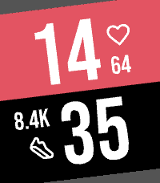

<!-- Generated by scripts/update_app_directory.py: do not edit by hand -->
# Watchfaces: F

[← About this list](../watchfaces.md) · [A](a.md) · [B](b.md) · [C](c.md) · [D](d.md) · [E](e.md) · **F** · [G](g.md) · [H](h.md) · [I](i.md) · [J](j.md) · [K](k.md) · [L](l.md) · [M](m.md) · [N](n.md) · [O](o.md) · [P](p.md) · [Q](q.md) · [R](r.md) · [S](s.md) · [T](t.md) · [U](u.md) · [V](v.md) · [W](w.md) · [X](x.md) · [Y](y.md) · [Z](z.md) · [0–9 & other](other.md)

*124 watchfaces · Last updated 2026-10-06*

| Screenshot | Name | Developer | Licence | Updated | Description |
|------------|------|-----------|---------|---------|-------------|
| { loading=lazy width="72" } | [F-84W](https://apps.repebble.com/4a2a52d2490b4e9a8fd66073) | [Chris Lewicki](https://github.com/chrislewicki/F-84W) | <small>Not checked yet</small> | 2026-06-07 | A (mostly) faithful recreation of the Casio F-84W, the Japan-exclusive, and much better looking, older brother of the classic F-91W. Just like the real… |
| { loading=lazy width="72" } | [Facebook](https://apps.repebble.com/577051a7ba2fe5e1c80001eb) | [Tom Stepp](https://github.com/tomstepp/facebookFace) | <small>Not checked yet</small> | 2016-06-26 | Displays a different Facebook value when the time changes. |
| { loading=lazy width="72" } | [Faceoff](https://apps.repebble.com/836fe574006048dd84dacb5d) | [ollien](https://github.com/ollien/pebble-faceoff) | <small>Not checked yet</small> | 2026-05-26 | A Pebble watchface inspired by "versus" screens. |
| { loading=lazy width="72" } | [Faceoff Remix](https://apps.repebble.com/fe490689d3a84fe49f1cbb10) | [cvuorinen](https://github.com/cvuorinen/pebble-faceoff) | <small>Not checked yet</small> | 2026-09-14 | A Pebble watchface that is a "Remix" of a watchface called "Faceoff" (inspired by "versus" screens) made by ollien. Credits to ollien for the original idea… |
| { loading=lazy width="72" } | [Faceoff Remix](https://apps.rebble.io/en_US/application/6aa6ac5e4d8b0600099bd10d) <small>Rebble App Store</small> | [cvuorinen](https://github.com/cvuorinen/pebble-faceoff) | <small>Not checked yet</small> | 2026-09-14 | A Pebble watchface that is a "Remix" of a watchface called "Faceoff" (inspired by "versus" screens) made by ollien. Credits to ollien for the original idea… |
| { loading=lazy width="72" } | [facewatch](https://apps.repebble.com/691cc106f5dd2700091a4fe2) | [beathebird](https://github.com/liza-uchaneva/facewatch_pebble) | <small>Not checked yet</small> | 2025-11-18 | Facewatch is an animated watchface that changes its expression based on how your steps compare to your usual activity. It also gives a cute little blink… |
| { loading=lazy width="72" } | [Fallout:Equestria PipBuck](https://apps.repebble.com/64ebc715c8c40c03a8180991) | [nyrikiri](https://github.com/wirelune/PipBuck) | <small>Not checked yet</small> | 2023-08-27 | For all FoE fans, a PipBuck watchface! It displays current time, battery charge, date and connection status. It also features Littlepip, main character of… |
| { loading=lazy width="72" } | [Fancy Face](https://apps.rebble.io/en_US/application/55f60597701b3486bd000025) <small>Rebble App Store</small> | [JMillage](https://github.com/johnmillage/FancyFace) | <small>Not checked yet</small> | 2015-10-12 | A nice looking watchface. Shows time, date, battery life (right circle), compass direction, temperature, amount of cloud cover(left circle), and Bluetooth… |
|  | [Fancy Watch](https://apps.rebble.io/en_US/application/52ee5f6b94cc96ba1700001c) <small>Rebble App Store</small> | [kasoki](https://github.com/kasoki/pebble-fancywatch) | <small>Not checked yet</small> | 2015-11-12 | Fancy watchface for your Pebble, with time, date, weather and battery status. Very energy efficient. Support for 12 and 24 hour format. |
| { loading=lazy width="72" } | [Farsi Fuzzy](https://apps.rebble.io/en_US/application/6a3adce9cd5237000932c8e2) <small>Rebble App Store</small> | [Mo](https://github.com/Seifollahi/farsi-fuzzy-watchface.git) | <small>Not checked yet</small> | 2026-06-24 | Version 2.8.0 The Calligraphic & Themes Update! Massive Redesign: Completely overhauled the typography, transitioning to a heavy, calligraphic interlocking… |
| { loading=lazy width="72" } | [Farsi Time](https://apps.rebble.io/en_US/application/598591e30dfc32dd140009ba) <small>Rebble App Store</small> | [Mehrad Sadegh](https://github.com/mehradoo/big-time) | <small>Not checked yet</small> | 2017-08-05 | Minimalist digital watchface with Farsi digits for Pebble Time |
| { loading=lazy width="72" } | [FCK_Gravity](https://apps.repebble.com/ee9868f8875f4d2c81ebac42) | [marukitano](https://github.com/marukitano/FCK_Gravity) | <small>Not checked yet</small> | 2026-07-29 | ##Deutsch ### Kurzbeschreibung Ein schwerkraftgesteuertes Vektor-Ziffernblatt für die Pebble Time 2. ### Beschreibung Gravity ist ein minimalistisches… |
| { loading=lazy width="72" } | [FdF Time](https://apps.repebble.com/0e2670c1adae469783030d49) | [Alo](https://github.com/asebrech/fdf-time) | <small>Not checked yet</small> | 2026-08-21 | Every minute the digits melt back into the sea, and the new time rises out of it as a landscape of pure line. FdF is short for fil de fer, French for… |
| { loading=lazy width="72" } | [FdF Time](https://apps.rebble.io/en_US/application/6a7dcbb1a2b290000911d59c) <small>Rebble App Store</small> | [alo](https://github.com/asebrech/fdf-time) | <small>Not checked yet</small> | 2026-08-21 | Every minute the digits melt back into the sea, and the new time rises out of it as a landscape of pure line. FdF is short for fil de fer, French for… |
| { loading=lazy width="72" } | [Feather](https://apps.repebble.com/56bbb1c1101f05555b000027) | [Yocaba](https://github.com/yocaba/pebble-watchface-feather) | <small>Not checked yet</small> | 2016-03-25 | Lightweight watchface. Time, date, battery charge level, phone connection, and temperature - everything at a glance. |
| { loading=lazy width="72" } | [feel](https://apps.rebble.io/en_US/application/54d05f9f0782b83773000087) <small>Rebble App Store</small> | [Gary Duong](https://github.com/garyduong/feel) | <small>Not checked yet</small> | 2015-02-03 | feel is a simple weather-status watchface. Useful for active atheletes, meteorologists, weather nerds, and anyone who wants to know why the weather feels a… |
| { loading=lazy width="72" } | [Fergus The Time Cat](https://apps.repebble.com/69a625c649ab180008e537ab) | [Adam Edmondson](https://github.com/AdamEdmondson/FergusTheTimeCat) | <small>No licence</small> | 2026-08-01 | Fergus The Time Cat need a home on your wrist! He gives you a little digital clock with the date and time along with a battery bar to tell you your battery… |
| { loading=lazy width="72" } | [FEZ](https://apps.repebble.com/5299a7e6e627ce615300006f) | [exe](https://github.com/exe44/pebble-fez) | <small>Not checked yet</small> | 2026-06-27 | Inspired by the logo of wonderful game "FEZ"! |
| { loading=lazy width="72" } | [FFLogos](https://apps.repebble.com/5ff3b9811e6bb12f0bd8c9f8) | [ChimeraFire](https://gitea.com/chimerafire/FFLogos-Pebble) | <small>See source</small> | 2026-01-08 | A watch displaying Fairly Fantastic logos corresponding to the hour. |
| { loading=lazy width="72" } | [Fibonacci clock](https://apps.rebble.io/en_US/application/55bc955fa5c6f367f5000018) <small>Rebble App Store</small> | [Stefan "Blixten" Karlsson](https://github.com/steka/fibonacci_clock) | <small>Not checked yet</small> | 2016-12-11 | The boxes in the clock has the side length as the first number of the Fibonacci series (1, 1, 2, 3, 5). Read the current time by adding the boxes side… |
| { loading=lazy width="72" } | [Fibonacci Spiral](https://apps.repebble.com/a11388c80b144c509072cd03) | [notnotrishi](https://gist.github.com/notnotrishi/a2af7aa2dcd1b301ea0332520c9d8207) | <small>See source</small> | 2026-08-22 | A watchface built around a Fibonacci golden spiral. The spiral turns through the day, and where it crosses the hour markers tells you the time — hours are… |
| { loading=lazy width="72" } | [Fields of Gold](https://apps.repebble.com/68a245345ffb456d8ec591ea) | [Comfortably Numb](https://github.com/ygalanter/fields-of-gold-pebble) | <small>Not checked yet</small> | 2026-07-18 | Digital clock with supersized digit size and image background. You can choose one out of six pre-selected images or select your own image Image opacity is… |
| { loading=lazy width="72" } | [Fields of Gold](https://apps.rebble.io/en_US/application/6a598e995118a30009bd367b) <small>Rebble App Store</small> | [Comfortably Numb](https://github.com/ygalanter/fields-of-gold-pebble) | <small>Not checked yet</small> | 2026-07-18 | Digital clock with supersized digit size and image background. You can choose one out of six pre-selected images or choose your own. Image opacity is also… |
| { loading=lazy width="72" } | [Fiftyeight](https://apps.repebble.com/6912d087ad49bb00097251a0) | [EuphoricPenguin](https://github.com/EuphoricPenguin/fiftyeight) | <small>Other</small> | 2026-08-13 | Fiftyeight tells the time, but it doesn't tell you what it should look like. Hate the analog clock? You can hide it. Figure the AM/PM indicator and date are… |
| { loading=lazy width="72" } | [Filipino Time](https://apps.rebble.io/en_US/application/52a8bf5bc7faf7590f00000a) <small>Rebble App Store</small> | [ihtnc](https://github.com/ihtnc/Pebble-FilipinoTime) | <small>Not checked yet</small> | 2025-12-01 | A text watch face for the Philippine's national language -- Filipino. Some settings are configurable via the Pebble phone app. |
| { loading=lazy width="72" } | [Fill 'er up](https://apps.rebble.io/en_US/application/547051c654f8241e18000054) <small>Rebble App Store</small> | [Dan Sherbeck](http://github.com/danvolution/fillerup) | <small>No licence</small> | 2015-02-06 | *** What's New (Feb 6) *** Settings range for hourly vibrate, charge status, and BT disconnected status. Minutes fill the screen from bottom to top… |
| { loading=lazy width="72" } | [Filmplakat2](https://apps.rebble.io/en_US/application/52b45915f637b2b41f00001d) <small>Rebble App Store</small> | [Shirk](http://github.com/Shirk/Pebble-Filmplakat2) | <small>No licence</small> | 2014-01-11 | A german watchface resembling a film poster. Inspired and based on 'Filmplakat' for SDK 1.x. See http://vimeo.com/81829802 for a Demo. |
| { loading=lazy width="72" } | [Fimally!](https://apps.rebble.io/en_US/application/67e3d4c37c483c000957c851) <small>Rebble App Store</small> | [kjy00302](https://github.com/kjy00302/pebble-fimally) | <small>Not checked yet</small> | 2026-07-17 | A watchface based on Obvious Plant's Pre-Cracked egg. |
| { loading=lazy width="72" } | [Final Fantasy GT](https://apps.repebble.com/54d81627514b48833b000022) | [Game Time](https://github.com/WinterWinter/finalfantasypebble) | <small>Not checked yet</small> | 2016-04-27 | Based off the Nintendo classic Final Fantasy 3. Features include: -Heroes- Choose what heroes you'd like to adventure with. -Levels- Levels are gained based… |
| { loading=lazy width="72" } | [Find Me Anything](https://apps.rebble.io/en_US/application/542a6a017352297c17000017) <small>Rebble App Store</small> | [Patrick Catanzariti](https://github.com/patcat/FindMeAnything) | <small>Not checked yet</small> | 2014-09-30 | A watchface that uses the Foursquare API and your Pebble's location to let you know at all times where your nearest place of interest is. By default, it'll… |
| { loading=lazy width="72" } | [Fire Emblem GT](https://apps.repebble.com/574245e63545cd77f500001f) | [Game Time](https://github.com/WinterWinter/FEGT) | <small>Not checked yet</small> | 2016-06-10 | Welcome to Fire Emblem GT! Based on Fire Emblem for the Gameboy Advance. Features: Animated Heroes - Choose between Eliwood, Lyn, and Hector and enjoy their… |
| { loading=lazy width="72" } | [Fire Face](https://apps.rebble.io/en_US/application/556e7b93751615c64c000085) <small>Rebble App Store</small> | [Jeff Lait](https://github.com/jmlaitpebble/fireface) | <small>Not checked yet</small> | 2015-06-03 | Displays the time as flames that rise and fade upwards. Yes, this will drain your battery. |
| { loading=lazy width="72" } | [Fire!](https://apps.rebble.io/en_US/application/5581da399e9090386400000b) <small>Rebble App Store</small> | [Jnm](https://github.com/Jnmattern/Fire) | <small>No licence</small> | 2015-06-17 | Want to see how hot your Pebble Time can be? Install Fire! and contemplate your Pebble while it's melting down! The developer is not responsible for… |
| { loading=lazy width="72" } | [Fireball](https://apps.rebble.io/en_US/application/5695fac8a3974593bf00001e) <small>Rebble App Store</small> | [Edwin Finch](https://edwinfinch.com/redirect/pebble-legacy-source) | <small>See source</small> | 2021-06-17 | An old classic from our original collection from 2014-2016, now free & open source! |
| { loading=lazy width="72" } | [Fireflies](https://apps.rebble.io/en_US/application/52cb88a4e2dd02bd640000f6) <small>Rebble App Store</small> | [stibbons](http://github.com/phardy/pebble-fireflies) | MIT | 2014-01-19 | Join me on a magical forest adventure where monochrome fireflies dance on your wrist. Normally, they swarm and blink and dance, but every minute or so, they… |
| { loading=lazy width="72" } | [FirefoxWatchface-Black](https://apps.rebble.io/en_US/application/55becb1b505cd70307000096) <small>Rebble App Store</small> | [JohnnyWorks](https://github.com/j796160836/FireFoxWatchFace-Pebble) | <small>Not checked yet</small> | 2015-08-06 | Firefox style watchface. --- Mozilla produces many products such as the Firefox, Thunderbird, Firefox OS. (Photo sketched by Jon Hicks Nov.2007 concept… |
| { loading=lazy width="72" } | [FirefoxWatchface-White](https://apps.rebble.io/en_US/application/55beb74d39209afe4800006c) <small>Rebble App Store</small> | [JohnnyWorks](https://github.com/j796160836/FireFoxWatchFace-Pebble) | <small>Not checked yet</small> | 2015-08-06 | Firefox style watchface. --- Mozilla produces many products such as the Firefox, Thunderbird, Firefox OS. (Photo sketched by Jon Hicks Nov.2007 concept… |
| { loading=lazy width="72" } | [Fireplace](https://apps.repebble.com/55711594e0633d301c00006d) | [Comfortably Numb](http://github.com/ygalanter/fireplace) | MIT | 2016-06-09 | - Imagine fireplace crackling on your Pebble Time - There's a chance that it's not battery-friendly. |
| { loading=lazy width="72" } | [FireWatch Dynamic](https://apps.repebble.com/e8e4fe569813472b8ff4ef4e) | [PebbleEnthusiastDev](https://github.com/satvikmaurya/FireWatchDynamic) | <small>Not checked yet</small> | 2026-06-20 | A modified version of FireWatch that adds additional complications. Message me if you'd like to contribute, this was a very quick and dirty job. |
| { loading=lazy width="72" } | [Fireworks](https://apps.repebble.com/5588e2fdef446dab8f000061) | [Christian Reinbacher](https://github.com/reini1305/fireworks) | <small>Not checked yet</small> | 2016-10-24 | Fireworks on your Pebble every minute! Shake to firework! (Both configurable of course) It also features a "nightstand mode". When you put the watch on it's… |
| { loading=lazy width="72" } | [Fireworks (Particle Effects + Glancing)](https://apps.rebble.io/en_US/application/5592dc3e53d39fc50500006b) <small>Rebble App Store</small> | [Matthew Hungerford](https://github.com/mhungerford/pebble_fireworks) | <small>Not checked yet</small> | 2015-10-05 | Fireworks Watchface featuring fireworks created using particle effects with random colors and trajectory and offscreen renderer allowing for composited… |
|  | [first-face-js](https://apps.repebble.com/611d51e9c3e14675bfcefea5) | [DCounc](https://github.com/DCouncilCSU/pebble) | <small>No licence</small> | 2026-08-22 | First release for testing on PT2 |
| { loading=lazy width="72" } | [FirstNight](https://apps.rebble.io/en_US/application/585949725de850e8dc00039a) <small>Rebble App Store</small> | [unexist](http://hg.subforge.org/firstnight) | <small>See source</small> | 2016-12-23 | This is a watchface for a friend of mine: It shows exactly the same special date until you shake the watch and reveal the real time for 5s. |
| { loading=lazy width="72" } | [FishTank](https://apps.rebble.io/en_US/application/55562528078ad333250000bd) <small>Rebble App Store</small> | [coreyonfire](https://github.com/coreyonfire/FishTank) | <small>Not checked yet</small> | 2015-09-18 | Simple watchface that's designed to look like a fishtank. You can configure the number of goldfish swimming around as well as how fast they swim. |
| { loading=lazy width="72" } | [Fit Face](https://apps.repebble.com/5727f12b91da39ba7c000019) | [ldscavo](https://github.com/VeryFamousDroid/FitFace) | <small>Not checked yet</small> | 2016-05-23 | A minimalist watchface containing the date and temperature. |
| { loading=lazy width="72" } | [Fitzface](https://apps.rebble.io/en_US/application/690e420aafb4ca00099364fe) <small>Rebble App Store</small> | [Fitzsky Inc](https://github.com/devindudeman/fitzface) | <small>Not checked yet</small> | 2025-11-07 | FitzFace – High-Density Data Watchface A feature-packed Pebble watchface that brings weather, transit, and environmental data to your wrist in a compact… |
| { loading=lazy width="72" } | [Flav](https://apps.repebble.com/577f9b6266202a598b0003d9) | [unexist](http://hg.subforge.org/flav) | <small>See source</small> | 2016-07-11 | Just an idea based on a wallpaper I recently found. Basically shows a bunch of clocks with a bit of rotation. |
| { loading=lazy width="72" } | [Flemish Fuzzy Time with Bluetooth status](https://apps.rebble.io/en_US/application/5502d2d0458f26728e000016) <small>Rebble App Store</small> | [Kristof Verpoorten](https://github.com/kverpoorten/PebbleWatchface_FlemishFuzzyTime) | <small>Not checked yet</small> | 2015-03-17 | Vlaamse variant van de "Dutch Fuzzy Time". De tijd wordt op een meer Vlaamse manier getoond in plaats van de Nederlandse manier. Zo zijn er de volgende… |
| { loading=lazy width="72" } | [Flick Seconds](https://apps.rebble.io/en_US/application/562ebed2a3c5146008000012) <small>Rebble App Store</small> | [Matt Martin](https://github.com/martinmcu/FlickSeconds) | <small>Not checked yet</small> | 2015-10-27 | A simple watchface with the option to display seconds with a flick of the wrist! Seconds display is hidden after 15 seconds to save battery. Also shows… |
| { loading=lazy width="72" } | [Flight Weather Pro](https://apps.repebble.com/52ff298cc7c81bc75c000122) | [Olof Beckman](https://github.com/obeq/PebbleFlightWeather) | <small>Not checked yet</small> | 2016-06-01 | Shows the latest METAR from the nearest airport in raw text for pilots. Alerts when Metar indicates possible IMC. Lack of alert does not guarantee VMC! I… |
| { loading=lazy width="72" } | [Flip Board](https://apps.repebble.com/d9b87c9f10a74d718db82b06) | [Analog Tick-Tocker](https://github.com/meded90/pebble-time-2-pixel-faces/tree/main/flip-board) | <small>Not checked yet</small> | 2026-08-04 | A mechanical-style pixel flip clock with animated digits, date and battery. |
| { loading=lazy width="72" } | [Flip Clock](https://apps.repebble.com/54a1169143ae82b64b000089) | [Lentyay](https://github.com/lentyay/flip-watchface) | <small>Not checked yet</small> | 2016-08-31 | Fully adjustable double screen watchface with a little bit of Steampunk flavour, inspired by retro flip clock. Code based on tmnhy 7-segment watchface… |
| { loading=lazy width="72" } | [FlipBoard APOLLO](https://apps.repebble.com/80bfb32c92eb4f86a91c941c) | [ldnpub](https://github.com/ldnpub/FlipBoard) | <small>Not checked yet</small> | 2026-07-06 | Aerospace console terminal watchface for Pebble Time 2. VT323 phosphor type: SYS-OK status line, step counter with goal progress bar, big mission-clock… |
| { loading=lazy width="72" } | [FlipBoard CONCOURSE](https://apps.repebble.com/a3ff5397d9184a778cded553) | [ldnpub](https://github.com/ldnpub/FlipBoard) | <small>Not checked yet</small> | 2026-07-06 | Bilingual departure-board watchface for Pebble Time 2. DSEG14 segment display in an airport grid: steps with goal percentage, time with ON TIME status, date… |
| { loading=lazy width="72" } | [FlipBoard IVOIRE](https://apps.repebble.com/bdffc25bf0694de68ee6015c) | [ldnpub](https://github.com/ldnpub/FlipBoard) | <small>Not checked yet</small> | 2026-06-29 | Flip-clock watchface for Pebble Time 2. Two ivory split-flap tiles with bold Oswald digits on a dark field: steps with colour ramp, date and battery. Shake… |
| { loading=lazy width="72" } | [FlipBoard LUMEN](https://apps.repebble.com/14d05b5cd0234f1d8e804887) | [ldnpub](https://github.com/ldnpub/FlipBoard) | <small>Not checked yet</small> | 2026-07-06 | An LED dot-matrix departure board for the Pebble Time 2. Lit dots glow over a faint ghost grid; the time, your steps (colour-coded to your goal), the date… |
| { loading=lazy width="72" } | [FlipBoard QUAI](https://apps.repebble.com/0a3d20f9c1574bc59142da32) | [ldnpub](https://github.com/ldnpub/FlipBoard) | <small>Not checked yet</small> | 2026-07-06 | Amber 7-segment platform display watchface for Pebble Time 2. DSEG7 LCD digits with authentic ghost segments: departures header with weekday, big station… |
| { loading=lazy width="72" } | [FlipBoard SOLARI](https://apps.repebble.com/59d86b580d9b4071a1bf0c1f) | [ldnpub](https://github.com/ldnpub/FlipBoard) | <small>Not checked yet</small> | 2026-06-29 | Split-flap airport board watchface for Pebble Time 2. Every character sits on its own mechanical flap tile with a fold seam, Silkscreen pixel type… |
| { loading=lazy width="72" } | [FlipBoard STIPPLE](https://apps.repebble.com/106d7f75a81a4e8592ad7f51) | [ldnpub](https://github.com/ldnpub/FlipBoard) | <small>Not checked yet</small> | 2026-07-06 | Dot-matrix departure board watchface for Pebble Time 2. Doto pixel digits on a stippled e-paper field: steps with colour ramp, big clock, date and battery… |
| { loading=lazy width="72" } | [FlipClock 3D](https://apps.repebble.com/5784dc246c2104f3ad0007ce) | [Afonso Santos](https://github.com/reciprocum/Pebble-SDK4-WatchFace-FlipClock3D) | <small>Not checked yet</small> | 2017-01-27 | Gravity & gesture aware interactive 3D flipping clock. STEADY mode: - TWIST : DYNAMIC mode DYNAMIC mode: - TWIST : spin up Will fallback to STEADY mode… |
| { loading=lazy width="72" } | [Flipper Zero](https://apps.repebble.com/276ed3773d8548c09b372204) | [Dennis Muensterer](https://github.com/dnnsmnstrr/pebble-flipper) | <small>Not checked yet</small> | 2026-07-07 | A Flipper on your wrist |
| { loading=lazy width="72" } | [Flow](https://apps.repebble.com/6968b1fe0bd3670009877828) | [Yorks0n](https://github.com/Yorks0n/pebble-watchface-flow) | <small>Not checked yet</small> | 2026-01-16 | Let's flow with pebble. With various themes available. |
| { loading=lazy width="72" } | [Fluttershy](https://apps.rebble.io/en_US/application/53f98c8625ab8a8f33000091) <small>Rebble App Store</small> | [calamari Software](https://code.google.com/p/pebble-watchfaces/source/browse/) | <small>See source</small> | 2014-08-24 | Have the cutest pony tell you the time! Features the time, date (month and day), weekday, and battery level. The presence of her cutie mark indicates… |
| { loading=lazy width="72" } | [Flux Capacitor](https://apps.rebble.io/en_US/application/56251336851cda3643000057) <small>Rebble App Store</small> | [Rabit](https://github.com/rabits/flux-capacitor) | <small>Not checked yet</small> | 2015-10-29 | Compact version of Flux Capacitor from Back to the Future trilogy for your Pebble Time. This working version of time machine can help you to travel in time… |
| { loading=lazy width="72" } | [Flying Blind](https://apps.rebble.io/en_US/application/52cdd3b70b54db5fb900001b) <small>Rebble App Store</small> | [mcongrove](https://github.com/mcongrove/PebbleFlyingBlind) | <small>Not checked yet</small> | 2014-01-19 | A Pebble watch face that vibrates the time. Optionally vibrates every half or quarter-hour. Shake your wrist to briefly see the time. Colors can be inverted… |
| { loading=lazy width="72" } | [FMWatchFace](https://apps.rebble.io/en_US/application/5688372181dd62e19f00004b) <small>Rebble App Store</small> | [FMonline](https://github.com/mafabio/FMWF) | <small>Not checked yet</small> | 2016-01-02 | Time, date, battery charge level, phone connection and temperature (from openweathermap.org). Very clean watchface. Everything on the screen. Always Thanks… |
| { loading=lazy width="72" } | [ForeCal (Weather Forecast & Calendar)](https://apps.repebble.com/5361706f17c60e02d800020e) | [SeaPea Software](https://github.com/SeaPea/ForeCal) | <small>Not checked yet</small> | 2016-10-08 | Displays today's/tomorrow's forecast with a 3 week calendar always on screen. (No need to flick wrist or tap to get to another view) Now with color! … |
| { loading=lazy width="72" } | [ForeCal Reloaded (Weather Forecast & Calendar)](https://apps.repebble.com/69386de69aa93e0009ba0011) | [Skylar Sadlier](https://github.com/skylord123/ForeCal) | <small>Not checked yet</small> | 2026-08-30 | ForeCal Reloaded is a modern update of the original ForeCal watchface by SeaPea, rebuilt for today’s Pebble and Rebble ecosystem. It keeps the clean… |
| { loading=lazy width="72" } | [ForecasWatch 2](https://apps.repebble.com/5dcdca6ac393f50cf6dbc264) | [Matt Rossman](https://github.com/mattrossman/forecaswatch2) | <small>Not checked yet</small> | 2026-09-20 | Open source revival of the beloved ForecasWatch watchface. This includes support for Weather Underground forecasts, which broke on the original ForecasWatch… |
| { loading=lazy width="72" } | [ForecasWatchface2-Kor](https://apps.rebble.io/en_US/application/6a3d0e695961b6000961c58c) <small>Rebble App Store</small> | [Mack Kang](https://github.com/mackerel-kang/forecaswatch2) | <small>Not checked yet</small> | 2026-06-25 | FCW-K puts your day on one screen: an hourly weather forecast graph, a four-week calendar with Korean public holidays, and your key stats — time, battery… |
| { loading=lazy width="72" } | [FORM](https://apps.rebble.io/en_US/application/557610f686a1e8eecd000082) <small>Rebble App Store</small> | [Mathew Reiss](https://github.com/rebootsramblings/GBitmap-Colour-Palette-Manipulator) | <small>Not checked yet</small> | 2015-06-09 | Reddit request - digital watchface in the same style as FORM for Android Wear (by Roman Nurik). All credit for design goes to Roman. If it proves popular… |
| { loading=lazy width="72" } | [FORM Watch Face](https://apps.repebble.com/56088fcf364a06c221000009) | [Painless Apps](https://github.com/sunnygoyal/FORMWatchFace-pebble) | <small>Not checked yet</small> | 2016-05-01 | This is a watch face for Pebble based on the typeface used for the FORM design conference (based on Form watch face for Android Wear) |
| { loading=lazy width="72" } | [Formal](https://apps.repebble.com/56edf5a611c02b5bae00002d) | [BriWest](https://github.com/briwestervelt/formal_source) | <small>Not checked yet</small> | 2016-03-22 | Tired of your watch hands covering the date? Formal moves its date display to one of three positions so it's never covered. Plus it looks... formal! The… |
| { loading=lazy width="72" } | [Fortuna Watchface](https://apps.rebble.io/en_US/application/558ffa906dba2d11fe00005a) <small>Rebble App Store</small> | [DevHopps](https://github.com/DevHopps/pebble-fortuna) | MIT | 2015-06-29 | A simple watchface just showing the logo of "Fortuna Düsseldorf" and the current time and date. |
| { loading=lazy width="72" } | [Fourcast](https://apps.rebble.io/en_US/application/560d8701038c3881ac000037) <small>Rebble App Store</small> | [benkrejci](http://github.com/benkrejci/fourcast) | MIT | 2015-11-21 | Simple digital face showing current weather, and the forecast for next 3 days. Configurable background and foreground colors, as well as temperature units… |
| { loading=lazy width="72" } | [FourSliders](https://apps.rebble.io/en_US/application/5582a35a09d6f4112d000095) <small>Rebble App Store</small> | [Juan Vera](https://github.com/Juanvvc/FourSliders) | <small>No licence</small> | 2015-06-20 | A watchface that shows the time using four sliders: hour, weekday, day and month. |
| { loading=lazy width="72" } | [Fox Weather](https://apps.repebble.com/5841886baf734898822e2899) | [Levonn](https://github.com/levonn-dev/pebble-adventure-wf) | <small>Not checked yet</small> | 2026-05-26 | A Pebble watchface where the sky follows your weather and a pixel fox keeps you company. The background changes with the current conditions, a fox sits (or… |
| { loading=lazy width="72" } | [Foxmosa Watchface (MozTW)](https://apps.rebble.io/en_US/application/55bed9ed39209aec5f000083) <small>Rebble App Store</small> | [JohnnyWorks](https://github.com/j796160836/FoxmosaWatchFace-Pebble) | <small>Not checked yet</small> | 2015-08-04 | Foxmosa is mascot of Mozilla Taiwan Community. Mozilla produces many products such as the Firefox, Thunderbird, Firefox OS. Picture designed by ECBp + Tatit… |
| { loading=lazy width="72" } | [Frankie G](https://apps.rebble.io/en_US/application/5b1d5c07fbaf9a36ee0001f3) <small>Rebble App Store</small> | [Matt Pope](https://github.com/kaypro4/frankieg) | <small>Not checked yet</small> | 2018-06-10 | A Pebble Watchface app to replicate my beloved Frank Gehry Fossil watch on my Pebble. Tells time in a format like "half past midnight" and "16 til 8". |
| { loading=lazy width="72" } | [Fredsistance](https://apps.rebble.io/en_US/application/5485be77c1f41bcadd00005b) <small>Rebble App Store</small> | [David Carryer](https://github.com/dcarryer/fredsistance) | <small>Not checked yet</small> | 2014-12-08 | Do you play Ingress? Are you a member of the Resistance? You should be. This simple watchface was developed to showcase the Fredericksburg Resistance, a… |
| { loading=lazy width="72" } | [Freedom](https://apps.rebble.io/en_US/application/5507733bce75c1a18e000091) <small>Rebble App Store</small> | [SexualRhinoceros](https://github.com/SexualRhinoceros/FREEDOM) | <small>Not checked yet</small> | 2015-03-17 | A beautiful waving flag in conjunction with a time that is wonderfully outlined to make it pop! Show those damned Commies what Freedom really means! |
| { loading=lazy width="72" } | [French Weather](https://apps.rebble.io/en_US/application/52f14342e21be494030000bf) <small>Rebble App Store</small> | [Allezxandre](https://github.com/Allezxandre/french-futura-weather-sdk2.0/releases/) | GPL-3.0 | 2015-05-25 | Now supports - English, French, German and Spanish. — English International alternative to Futura Weather by Niknam. The Watchface will display date… |
| { loading=lazy width="72" } | [Frequent Traveler](https://apps.repebble.com/f747afcc10d24c91ad30d88c) | [Nate Gay](https://github.com/nateinaction/frequent-traveler-watchface) | <small>Not checked yet</small> | 2026-09-07 | A multi-timezone watch face for frequent travelers. Shows local time and up to five additional time zones. When local time matches a configured time zone… |
| { loading=lazy width="72" } | [Fresco](https://apps.repebble.com/6797522d3d3a4b93ad1526bd) | [Noah Kiser](https://github.com/KiserDesigns/Pebble_Fresco) | <small>No licence</small> | 2026-08-13 | Settings Tests |
| { loading=lazy width="72" } | [From Here](https://apps.repebble.com/d9fc15a8f87746b7ba01f6ca) | [Daniel Bally](https://github.com/globe-and-atlas/from-here) | <small>Not checked yet</small> | 2026-10-02 | Your location is the start. At 10:42 you are 10 degrees 42 minutes away along the direction you chose; the face shows where that is on a map, names the… |
| { loading=lazy width="72" } | [Full Circle](https://apps.rebble.io/en_US/application/53666f0114acdb643000007f) <small>Rebble App Store</small> | [chris](https://github.com/dunamis/pebble/tree/master/watchfaces/fullcircle) | <small>Not checked yet</small> | 2014-05-10 | A clean and intuitive watchface that shows the minutes as a progressing circle, with the hour in text in the center. Shake or tap your Pebble to view the… |
| { loading=lazy width="72" } | [Fullmetal Alchemist: Pocket Smartwatch](https://apps.repebble.com/551ef17fff0156c596000069) | [Apestowesome](https://github.com/asardaes/pebble-fma) | <small>Not checked yet</small> | 2016-04-28 | Watchface inspired by the anime Fullmetal Alchemist: Brotherhood. - Time gets transmuted every minute. - Battery percentage is shown on the upper right… |
| { loading=lazy width="72" } | [Fun with flags](https://apps.repebble.com/5659b0dc36f882e860000055) | [Christian Reinbacher](https://github.com/reini1305/funwithflags) | <small>Not checked yet</small> | 2016-10-24 | Learn some new flags on the go! Every minute a new flag is shown. if you flick your wrist, your watch will tell you which country the flag belongs to. If… |
| { loading=lazy width="72" } | [Functionalist](https://apps.rebble.io/en_US/application/67cd19afb7a023024b21460c) <small>Rebble App Store</small> | [mrp](https://codeberg.org/mrp/functionalist) | <small>See source</small> | 2026-08-01 | Form ever follows function. - large time in the center - day of the week and date - charge percentage, a doughnut chart of the battery charge level, and… |
| { loading=lazy width="72" } | [FunTime AwesomeFace](https://apps.rebble.io/en_US/application/55b434ef46a407f58f000006) <small>Rebble App Store</small> | [Noah Jeffrey](https://github.com/noerjeffries/funtime-awesomeface) | <small>Not checked yet</small> | 2015-11-10 | A basic watchface that clearly shows the time, date, and current weather conditions for your location. Plus, a fun little mushroom. :) Thanks to all who… |
| { loading=lazy width="72" } | [Futhark Watchface](https://apps.rebble.io/en_US/application/54ed8ef50cd3c52fe2000005) <small>Rebble App Store</small> | [þórshamar](https://github.com/rehaby/futharkWatchfacePebble2) | <small>Not checked yet</small> | 2015-02-25 | Tell the time like a Viking!!!!!! (if they had watches) Shows the time in Old Norse using the younger Futhark runes. Also vibrates when your watch… |
| { loading=lazy width="72" } | [Futura Weather](https://apps.rebble.io/en_US/application/52d313a912ea3dcf84000024) <small>Rebble App Store</small> | [Niknam Moslehi](https://github.com/Katharine/futura-weather-sdk2.0/tree/pebble-fixes) | <small>No licence</small> | 2014-06-23 | Shows you the current weather conditions at a glance. Also keeps the weather information updated every 15 minutes, indicates if the weather information is… |
| { loading=lazy width="72" } | [futura-gary](https://apps.rebble.io/en_US/application/556d94d2ab161f3ce10000bc) <small>Rebble App Store</small> | [Gary Sleet](https://github.com/garysleet/futura-gary) | <small>Not checked yet</small> | 2015-06-17 | Crammed as much information as I could onto the watch face, and added many power management features. The weather symbol next to the date is the current… |
| { loading=lazy width="72" } | [Future And Past Watchface](https://apps.rebble.io/en_US/application/53cbbdf6ecd64e8f44000019) <small>Rebble App Store</small> | [minils](https://github.com/minils/future-and-past-watchface) | <small>Not checked yet</small> | 2014-07-20 | A watchface which is simply displaying the time. |
| { loading=lazy width="72" } | [Future Time](https://apps.repebble.com/56e04296320b573560000009) | [Comfortably Numb](https://github.com/ygalanter/priv-future-time) | <small>Not checked yet</small> | 2026-08-01 | This is the face of the future. Two faces actually - because you get both analog and digital face - and it's up to you which one to use. You also get eight… |
| { loading=lazy width="72" } | [Fuzzier Fuzzy Text International](https://apps.rebble.io/en_US/application/541768c2d8eb58ee1a000003) <small>Rebble App Store</small> | [keithzg](https://github.com/keithzg/Fuzzier-Fuzzy-Text-International) | <small>Not checked yet</small> | 2014-09-15 | A dirty hack of Fuzzy Text International for folks like myself who felt all of the existing "fuzzy" watchfaces were still too specific. If you want to wake… |
| { loading=lazy width="72" } | [Fuzzier Time](https://apps.rebble.io/en_US/application/52d0c95a74a38edfd60000cd) <small>Rebble App Store</small> | [Atntias](https://github.com/Atntias/FuzzierTimeEnglish) | <small>No licence</small> | 2014-01-23 | The reason I got my pebble was I wanted a watch that show's time the way I see it, fuzzy time was close but not quite it. Iv'e tried to capture the way I… |
| { loading=lazy width="72" } | [Fuzzy Analog](https://apps.repebble.com/52f2107ae21be4b82000117d) | [Jack T.](https://github.com/PanicMan/Pebble-FuzzyAnalog) | <small>Not checked yet</small> | 2016-10-25 | Pebble implementation of the following clock: http://i.imgur.com/Bf4C7nZ.gif Credits for the Idea goes to hop-picker ( http://hop-picker.tumblr.com ) as he… |
| { loading=lazy width="72" } | [Fuzzy French](https://apps.rebble.io/en_US/application/52b2177acd41831621000063) <small>Rebble App Store</small> | [Mandaria Software](https://github.com/mandlar/Pebble-Fuzzy-French-Plus) | <small>Not checked yet</small> | 2014-12-15 | - Shows the current fuzzy time in French. Updates every five minutes - Shows the current date in French - Shows the current week and day number - Shows the… |
| { loading=lazy width="72" } | [Fuzzy French modern](https://apps.rebble.io/en_US/application/54c512a98e136b17c5000029) <small>Rebble App Store</small> | [Iznogoud](https://github.com/iznogoud765/Pebble_Face_Fuzzy_FR_Modern) | <small>Not checked yet</small> | 2015-07-24 | Fuzzy time in French, updates every 5 minutes - Shows current time and date in french in the bottom part - Shows current battery level in left upper part… |
| { loading=lazy width="72" } | [Fuzzy French modern Black](https://apps.rebble.io/en_US/application/54f5b09813cdff8597000036) <small>Rebble App Store</small> | [Iznogoud](https://github.com/iznogoud765/Pebble_Face_Fuzzy_FR_Modern/tree/black) | <small>Not checked yet</small> | 2015-07-24 | Horloge à logique floue ! - heure à 5 minutes près, affichée en texte avec une police sympa. - animation à chaque modification ! - heure précise et date en… |
| { loading=lazy width="72" } | [Fuzzy Glucose](https://apps.repebble.com/6977b6735cd4fc00092489cb) | [Jonathan Salomo](https://github.com/Apfelholz/Fuzzy-Glucose) | <small>No licence</small> | 2026-01-28 | This version keeps the main fuzzy time display from the original and adds info layers at the top and bottom of the screen for additional information… |
| { loading=lazy width="72" } | [Fuzzy Imperial Time](https://apps.repebble.com/8715f42dc79e456aaa0fb91d) | [SableDnah](https://github.com/Sablednah/Imperial-Time) | <small>Not checked yet</small> | 2026-04-06 | Watch face with Fuzzy Time, analogue, digital, battery + connection status and weather. Also shows time using the Warhammer Imperial Dating System . e.g. 0… |
| { loading=lazy width="72" } | [Fuzzy Imperial Time 2.0](https://apps.repebble.com/7e85b47f63b2404ebd268006) | [SableDnah](https://github.com/Sablednah/Imperial-Time-2) | <small>Not checked yet</small> | 2026-06-01 | Watch face with Fuzzy Time, analog, digital, battery + connection status and weather. Now with inspirational quote, For the emperor! Also shows time using… |
| { loading=lazy width="72" } | [Fuzzy Irish Time](https://apps.repebble.com/583231338c7ffffa9800011d) | [Liam Friel](https://github.com/liamf/fuzzytime) | <small>Not checked yet</small> | 2016-11-26 | Tells the time in Hiberno-English |
|  | [Fuzzy Modern](https://apps.rebble.io/en_US/application/551dc0c7cdee89e0f600007a) <small>Rebble App Store</small> | [Iznogoud](https://github.com/iznogoud765/Pebble_Face_Fuzzy_Modern_i18n) | <small>Not checked yet</small> | 2015-11-15 | Fuzzy Time with languages supported by Pebble : English, Spanish, German, French Also supports colors for Pebble Time. settings : - change background (dark… |
| { loading=lazy width="72" } | [Fuzzy Plus](https://apps.rebble.io/en_US/application/55a66f880a1402bddb000022) <small>Rebble App Store</small> | [James Ferguson](https://github.com/WJCFerguson/pebble_fuzzy_plus/tree/master) | <small>Not checked yet</small> | 2015-07-16 | Fuzzy text watch face, that gives more accurate time detail when tapped/shaken. Fuzzy time is all based on the quarter-hours. Coming soon: * User settings… |
| { loading=lazy width="72" } | [Fuzzy Text International](https://apps.rebble.io/en_US/application/52ef7ab0c503c88bdf00001a) <small>Rebble App Store</small> | [Jesse Hallett](https://github.com/hallettj/Fuzzy-Text-International) | <small>Not checked yet</small> | 2014-02-24 | Fuzzy Text watchface with support for six languages. The elegance of the Text Watch with the natural language of Fuzzy Time. Supported languages: - English… |
| { loading=lazy width="72" } | [Fuzzy Text International 2](https://apps.repebble.com/30bf2c0381b64d3aaaec0291) | [Adam Boutcher](https://github.com/adamboutcher/Pebble-Fuzzy-Text-International-PT2) | <small>Not checked yet</small> | 2026-07-19 | Updated version of Fuzzy Text International (supports a number of languages) to support the higher resolution screens of the Duo and PT2. I am not the… |
| { loading=lazy width="72" } | [Fuzzy Text Plus](https://apps.repebble.com/52de476d6094ff6bf0000046) | [Mattias Bäcklund](https://github.com/Sarastro72/Fuzzy-Text-Watch-Plus) | <small>Not checked yet</small> | 2017-10-12 | Supports: English, Swedish, Norwegian, Italian, Spanish, German and Dutch This watchface combines the easy to read fonts of Text Watch with the natural… |
| { loading=lazy width="72" } | [Fuzzy Text Two](https://apps.repebble.com/a77242a455c04f94a667dbdf) | [gloriousCode](https://github.com/gloriousCode/fuzzy-text-international-time2) | <small>Not checked yet</small> | 2026-07-09 | An updated version of fuzzy text for new watches + colours! |
| { loading=lazy width="72" } | [Fuzzy Text Watchface](https://apps.repebble.com/a1aafb673792493195615f3c) | [asellitt](https://github.com/asellitt/fuzzy-text-watchface) | <small>Not checked yet</small> | 2026-05-28 | Displays the current time using fuzzy natural language. Also shows heart rate, calories burned, steps and battery level. |
| { loading=lazy width="72" } | [Fuzzy Time](https://apps.rebble.io/en_US/application/52d8bad9aef8d5b107000027) <small>Rebble App Store</small> | [Pebble](https://github.com/pebble/pebble-sdk-examples/tree/master/watchfaces/fuzzy_time) | <small>Not checked yet</small> | 2014-01-17 | Fuzzy Time Example Watchface |
| { loading=lazy width="72" } | [Fuzzy Time + v3](https://apps.rebble.io/en_US/application/52a634d79f74c6cb3c00000c) <small>Rebble App Store</small> | [Belphemur](https://github.com/Belphemur/fuzzy_time_plus_v2) | <small>No licence</small> | 2014-01-11 | Inspired by Pebble's Fuzzy Time. Included a top bar to display the day and date and a bottom bar to display the 24 hour time and the day of the year… |
| { loading=lazy width="72" } | [Fuzzy Time Croatian](https://apps.rebble.io/en_US/application/532e820cd407118eb100012c) <small>Rebble App Store</small> | [kost](https://github.com/kost/fuzzy_time_hr) | <small>Not checked yet</small> | 2014-03-23 | Fuzzy Time localized for Croatia. Source code available. |
| { loading=lazy width="72" } | [Fuzzy Time FR](https://apps.rebble.io/en_US/application/52de2bb181cae24943000054) <small>Rebble App Store</small> | [fauque benoit](https://github.com/benoit2600/FuzzyTimeFR) | <small>Not checked yet</small> | 2014-11-16 | This watchface is based on the Fuzzy French Plus watchface by mandla. The time is set fuzzy, you have time at 5 minutes near. The watchface is animated, and… |
| { loading=lazy width="72" } | [Fuzzy Time Random](https://apps.repebble.com/57711a746c2104f4b30001af) | [AwesomeInRed](https://github.com/edward88/pebbletime-fuzzy) | <small>Not checked yet</small> | 2016-07-02 | Displays a random of three variations of "fuzzy" time with a minimalist style battery level display Feedback and suggestions are always welcome! |
|  | [Fuzzy Time UK](https://apps.rebble.io/en_US/application/52f0e023a0cb6a3d150003e9) <small>Rebble App Store</small> | [Stew Wilson](https://github.com/digitalraven/fuzzy_uk) | <small>Not checked yet</small> | 2014-02-04 | A combination of Fuzzy Time and Simplicity, using UK time descriptions (such as "past" rather than "after"). Based on the "jps British" watchface, converted… |
| { loading=lazy width="72" } | [Fuzzy Time'](https://apps.repebble.com/55855cb56b94559b530000c5) | [szendo](https://github.com/szendo/pebble--fuzzy-time) | <small>Not checked yet</small> | 2026-08-22 | Based on the classic Sliding Text watchface. It uses antialiased Roboto Bold/Light fonts to display the time using fuzzy text. |
| { loading=lazy width="72" } | [Fuzzy TT Edition](https://apps.rebble.io/en_US/application/54e9b12d0f0bb317e900004b) <small>Rebble App Store</small> | [KaRo](https://github.com/Roemke/Fuzzy-Text-International) | <small>Not checked yet</small> | 2016-01-02 | Fuzzy Time based on Fuzzy Text International with timetable extension. Shows battery status. Shows battery status of phone (Android 6, maybe 5, otherwise… |
| { loading=lazy width="72" } | [Fuzzy watchface, english](https://apps.repebble.com/538cf80fa9d6bee78100000a) | [Booski](https://github.com/booski/fuzzyFace) | <small>Not checked yet</small> | 2016-07-14 | A watchface showing fuzzy time, such as "Ten to two." in complete sentences. It also shows the date in a similar manner. The time displayed is always… |
| { loading=lazy width="72" } | [Fuzzy watchface, swedish](https://apps.repebble.com/531f82b601be40e42a0000c3) | [Booski](https://github.com/booski/fuzzyFace) | <small>Not checked yet</small> | 2016-07-14 | A watchface showing fuzzy time, such as "Ten to two." in complete sentences. It also shows the date in a similar manner. The time displayed is always… |
| { loading=lazy width="72" } | [FuzzyTRwCal](https://apps.rebble.io/en_US/application/53f85ecf36d7c0ae190000c9) <small>Rebble App Store</small> | [Ersin Durna](https://github.com/ersindurna/FuzzyTurkishWithCalendarLoc) | <small>Not checked yet</small> | 2015-11-01 | New Design with Location and Weather info PLUS Bluetooth connection status icon (if out ouf range vibration), Battery (both as a number and icon) and… |
| { loading=lazy width="72" } | [FuzzyZeit Zwei](https://apps.rebble.io/en_US/application/52a9f946d78eb46e2c00000a) <small>Rebble App Store</small> | [Felix Rotthowe](https://github.com/planbnet/fuzzy_zeit) | <small>Not checked yet</small> | 2013-12-12 | German Fuzzy Time |
