<!-- Generated by scripts/update_app_directory.py: do not edit by hand -->
# Watchfaces: G

[← About this list](../watchfaces.md) · [A](a.md) · [B](b.md) · [C](c.md) · [D](d.md) · [E](e.md) · [F](f.md) · **G** · [H](h.md) · [I](i.md) · [J](j.md) · [K](k.md) · [L](l.md) · [M](m.md) · [N](n.md) · [O](o.md) · [P](p.md) · [Q](q.md) · [R](r.md) · [S](s.md) · [T](t.md) · [U](u.md) · [V](v.md) · [W](w.md) · [X](x.md) · [Y](y.md) · [Z](z.md) · [0–9 & other](other.md)

*70 watchfaces · Last updated 2026-10-06*

| Screenshot | Name | Developer | Licence | Updated | Description |
|------------|------|-----------|---------|---------|-------------|
| { loading=lazy width="72" } | [Galician Fuzzy Text watchface](https://apps.rebble.io/en_US/application/56844998ef4db5a762000054) <small>Rebble App Store</small> | [pfsq](https://github.com/pfsq/Galician-Fuzzy-Text-watch) | <small>Not checked yet</small> | 2016-01-17 | Based on Fuzzy Text International by Jesse Hallett, uses the galician language to display time. A hora en galego no teu Pebble ou Pebble Time; en tramos de… |
| 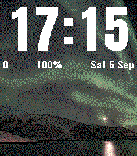{ loading=lazy width="72" } | [Galleria](https://apps.repebble.com/cdf80cc3bf6745b1a310e4c8) | [Rediro](https://github.com/Rediro-MC/galleria-da-polso) | <small>Not checked yet</small> | 2026-09-19 | Your photos as the watchface. Designed for Pebble Time 2 (colour display); also runs on Pebble 2 Duo. Crop them on the phone: up to 12 rotate on the watch… |
| { loading=lazy width="72" } | [Gallifrey Round](https://apps.rebble.io/en_US/application/5646877e96773d620400001c) <small>Rebble App Store</small> | [roparom](https://github.com/streeabarra/gallifreyan-watch-face) | <small>Not checked yet</small> | 2015-11-16 | Tell the time like a Time Lord with this Doctor Who themed watch-face for all Pebbles. For the rest of us humans, here's how to tell the time: Four digits… |
| { loading=lazy width="72" } | [Gallifrey Time](https://apps.rebble.io/en_US/application/544d9c63e7900e8606000009) <small>Rebble App Store</small> | [Streea](https://github.com/streeabarra/gallifreyan-watch-face) | <small>Not checked yet</small> | 2014-11-02 | Original watchface designed by SzathmaryDominik, code by Bobert Perry, edited by me. Cleaned up the watchface and added indicators more like the original. |
| 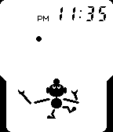{ loading=lazy width="72" } | [Game & Watch](https://apps.rebble.io/en_US/application/5931d6f50dfc326582000cd9) <small>Rebble App Store</small> | [Imanolea](https://github.com/Imanolea/watchface_gameandwatch) | MIT | 2017-06-02 | A watchface that pays homage to the Game & Watch series videogame Ball. |
| 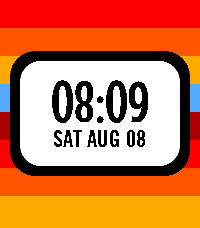{ loading=lazy width="72" } | [Game Changer](https://apps.repebble.com/89f998c3a4024920944ffd53) | [outadoc](https://github.com/outadoc/pebble-gamechanger) | <small>Not checked yet</small> | 2026-08-08 | Get ready for a Game Changer! This watchface is inspired by the title card of the popular Dropout show. |
| 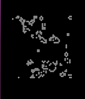{ loading=lazy width="72" } | [Game of Life](https://apps.rebble.io/en_US/application/55a98957c380d00fa1000018) <small>Rebble App Store</small> | [caleb smith](https://github.com/calebsmith/pebble-gol) | <small>Not checked yet</small> | 2015-07-17 | An implementation of Conway's Game of Life as a watchface. |
| 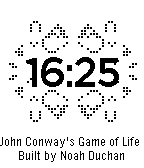{ loading=lazy width="72" } | [Game of Life](https://apps.rebble.io/en_US/application/54cbfac659d1df5b6a000028) <small>Rebble App Store</small> | [N-MAN](https://github.com/nduchan/Conway) | <small>Not checked yet</small> | 2015-01-30 | This watchface displays the time overlaid on a running simulation of John Conway's Game of Life. Shake the watch to reset the game to one of three initial… |
| 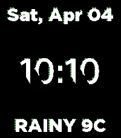{ loading=lazy width="72" } | [Game of life](https://apps.repebble.com/d56554adafa0412abf024454) | [pikaring](https://github.com/pikaring/ubiquitous-space-broccoli) | <small>Not checked yet</small> | 2026-04-04 | This is Game of Life watchface. |
| 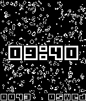{ loading=lazy width="72" } | [Game of Life](https://apps.repebble.com/e32338b6f4a24d72b71dcbbd) | [Tobias Westergaard Kjeldsen](https://gitlab.com/tobiaswkjeldsen/pebble-game-of-life) | <small>Not checked yet</small> | 2026-03-14 | The Game of Life, also known as Conway's Game of Life or simply Life, is a cellular automaton devised by the British mathematician John Horton Conway in… |
| { loading=lazy width="72" } | [Game of Life](https://apps.rebble.io/en_US/application/690a51265d2c0400085474e4) <small>Rebble App Store</small> | [Tobias Westergaard Kjeldsen / tobisen.me](https://gitlab.com/tobiaswkjeldsen/pebble-game-of-life) | <small>Not checked yet</small> | 2026-01-18 | The Game of Life, also known as Conway's Game of Life or simply Life, is a cellular automaton devised by the British mathematician John Horton Conway in… |
| 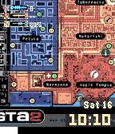{ loading=lazy width="72" } | [Game Watch](https://apps.repebble.com/da97e8d3d4a3400c87379cde) | [Creative Manaks](https://github.com/manaksu/GTA-2Watch) | <small>Not checked yet</small> | 2026-05-30 | Inspired by GTA2 Your Pebble Time is now running the GTA2 Industrial Sector. The iconic map fills the screen, authentic HUD bars track your steps, heart… |
| 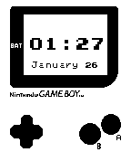{ loading=lazy width="72" } | [GameBoy for Pebble](https://apps.rebble.io/en_US/application/52e4ae94561013e64d000122) <small>Rebble App Store</small> | [Edwin Finch](https://github.com/edwinfinch/pebbleboy) | <small>Not checked yet</small> | 2014-11-02 | Make your pebble look like a GameBoy! Has 12/24 hour support, the date, and 3 animations. Open source :) |
| 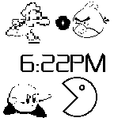{ loading=lazy width="72" } | [GameFace](https://apps.rebble.io/en_US/application/54a47f60317076975c000107) <small>Rebble App Store</small> | [UdaraW](https://github.com/Pavitheran/CartoonPebble) | <small>Not checked yet</small> | 2014-12-31 | Static watch face with iconic video game characters! |
| { loading=lazy width="72" } | [Gaptime](https://apps.rebble.io/en_US/application/5532489acb952bc305000107) <small>Rebble App Store</small> | [GeekJosh](https://github.com/GeekJosh/Pebble-Gaptime) | MIT | 2015-04-27 | A minimalist analogue watch face. Features: - Spherical face; gaps indicate current time - Show/hide current time as text - Optional invert - Choose your… |
| 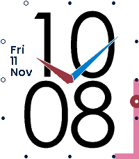{ loading=lazy width="72" } | [Gauge Geometry](https://apps.repebble.com/5fd419293dd3100155d398b8) | [szupie](https://github.com/szupie/gauge-geometry) | <small>Not checked yet</small> | 2026-10-05 | An analog-digital watch face designed for legibility and simplicity - Large digits and analog hands easy to read at a glance from wide angles - Day/date … |
| { loading=lazy width="72" } | [Gawr Gura - Hololive](https://apps.repebble.com/67b3078d4d435400094659b7) | [Harrison Allen](https://github.com/HarrisonAllen/pebble-community-watchfaces/tree/main/gawr_gura) | <small>No licence</small> | 2025-02-17 | Say hi to popular Hololive vtuber Gawr Gura! Made for MarnieFan89 on reddit. |
| 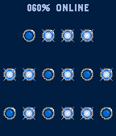{ loading=lazy width="72" } | [GBinary](https://apps.rebble.io/en_US/application/5694d958bc80b99927000042) <small>Rebble App Store</small> | [Yasuaki Gohko](https://bitbucket.org/ygohko/gbinary/) | <small>See source</small> | 2016-01-12 | GBinary is a simple binary watchface for Pebble Time. |
| 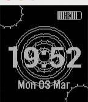{ loading=lazy width="72" } | [Gears of Time (Animated)](https://apps.repebble.com/67c5bd94b7a02300092ba0aa) | [AirCodum](https://github.com/priyankark/gears-of-time-pbw) | <small>Not checked yet</small> | 2025-03-03 | A clean and elegant watchface featuring smooth rotating spiral animations. Displays time, date, and battery level with a unique spiral theme, creating an… |
| 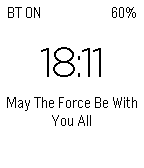{ loading=lazy width="72" } | [Geek The Time](https://apps.rebble.io/en_US/application/53ff4974c20483149c000152) <small>Rebble App Store</small> | [SferaDev](http://github.com/SferaDev/GeekDaTime) | GPL-2.0 | 2014-09-03 | Geek The Time is the ultimate geek WatchFace for your Pebble! - Check the time, bluetooth state, weather and battery! - Read random quotes or custom… |
| 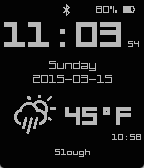{ loading=lazy width="72" } | [Geeky ISO Time](https://apps.rebble.io/en_US/application/54fc9295d7e6922aa500008e) <small>Rebble App Store</small> | [Andrew Hutchings](https://github.com/LinuxJedi/GeekyISOTime) | <small>Not checked yet</small> | 2015-03-15 | Originally a fork of Markas_K's GeekyTime which in addition shows seconds and ISO 8601 formatted date. Now taken on a life of its own. Features: * 12/24… |
| 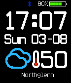{ loading=lazy width="72" } | [GeekyTime](https://apps.repebble.com/53d6b06c0433442454000172) | [Markas_K](https://github.com/marasm/GeekyTime) | <small>Not checked yet</small> | 2016-07-31 | A simple watch face showing all the essential information for a busy Pebbler. Included: -Time (12 or 24 hour format) -Current weather conditions for the… |
| 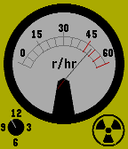{ loading=lazy width="72" } | [Geiger Counter](https://apps.rebble.io/en_US/application/64cfa8c1118fcc04241465cc) <small>Rebble App Store</small> | [Zahkc](https://github.com/Zahkc/Geiger-Watchface) | <small>Not checked yet</small> | 2023-08-06 | A watch face stylized like a Analogue Geiger Counter. Built for pebble time. |
| 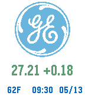{ loading=lazy width="72" } | [General Electric](https://apps.rebble.io/en_US/application/55540b9264e9b77d990000a9) <small>Rebble App Store</small> | [David](https://github.com/dmattia/General-Electric-Watchface) | <small>Not checked yet</small> | 2015-05-18 | Stock for General Electric watchface with real-time weather and date. Email me at dmattia@nd.edu if you would like a similar watchface for your company! |
| 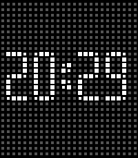{ loading=lazy width="72" } | [General Magic](https://apps.rebble.io/en_US/application/6914dc39a0d99d0009ff09f2) <small>Rebble App Store</small> | [Vladislav 'midlneedle' Iv](https://github.com/midlneedle-stack/General_Magic_pebble_watchface) | <small>Not checked yet</small> | 2026-03-02 | • Supports 12/24-hour time • Light and dark themes • Subtle artifact animation on launch • Optional hourly chime — a gentle nudge throughout the day Clean… |
| 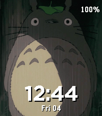{ loading=lazy width="72" } | [Ghibli Time](https://apps.repebble.com/fc26309e8f9a44f9b70fbc9d) | [Case](https://github.com/tomrav/pebble-image-faces) | <small>Not checked yet</small> | 2026-09-28 | Studio Ghibli's friends, films and paintings drift past your wrist. The collection: - 67 images: 44 characters, film posters, official key art - Choose what… |
| 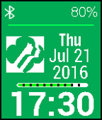{ loading=lazy width="72" } | [Girl Scout Logo](https://apps.rebble.io/en_US/application/57915144842428d20000028c) <small>Rebble App Store</small> | [WA1OUI](https://github.com/DHKaplan/Girl-Scouts/blob/master/Girl-Scouts-V2.2.zip) | <small>No licence</small> | 2016-10-18 | Here's the Girl Scout Logo. A Bluetooth indicator and battery percentage and a battery percentage bar (showing green for OK, Red for 20% or less, and blue… |
| 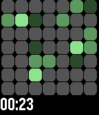{ loading=lazy width="72" } | [github-contributions](https://apps.repebble.com/67ce34d2b7a0230391426cbe) | [Jonathan Salomo](https://github.com/Apfelholz/github-contributions-watchface) | Apache-2.0 | 2025-03-27 | A Pebble watchface that dynamically changes its background color based on your GitHub contributions. |
| { loading=lazy width="72" } | [Glance](https://apps.rebble.io/en_US/application/531898f844e9361978000620) <small>Rebble App Store</small> | [nuthinking](https://github.com/nuthinking/PebbleWatchfaceGlance) | <small>Not checked yet</small> | 2014-03-07 | Glance divides the day equally in 3 parts (work, play and rest) and allows to quickly grasp in which stage of the day you are. Do you need sometimes more… |
| { loading=lazy width="72" } | [GLANCE](https://apps.rebble.io/en_US/application/53afc6dac3efcf867300009d) <small>Rebble App Store</small> | [Sam Mercier](https://github.com/samontea/glance) | <small>Not checked yet</small> | 2014-06-29 | It's everything you could ever need to know. |
| 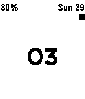{ loading=lazy width="72" } | [GLANCE INVERTED](https://apps.rebble.io/en_US/application/53afc61f9d1414688b0001b2) <small>Rebble App Store</small> | [Sam Mercier](https://github.com/samontea/glance-inverted) | <small>Not checked yet</small> | 2014-06-29 | It's glance, but inverted. It shows you everything you could ever need to know. |
| 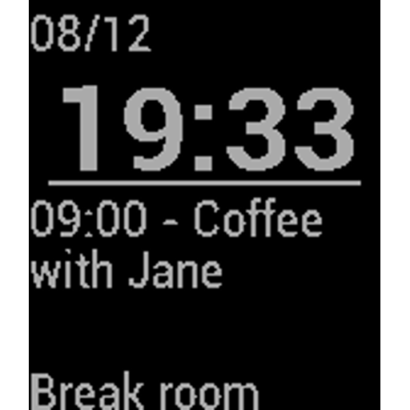{ loading=lazy width="72" } | [GlanceFace](https://apps.repebble.com/57ae8acdf01b53ee0c00025f) | [Qypea](https://github.com/qypea/GlanceFace) | <small>Not checked yet</small> | 2016-08-17 | Minimalist watchface which shows: Time, Date, next calendar event and its location. |
| 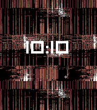{ loading=lazy width="72" } | [Glitch](https://apps.repebble.com/4a193890e40f406b8c5172a7) | [dabar](https://github.com/david-barrett/pebble_glitch) | <small>Not checked yet</small> | 2026-04-14 | Glitching watchface |
| 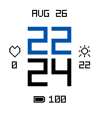{ loading=lazy width="72" } | [Glitch](https://apps.repebble.com/334f1266fd1c4c97bbd2e502) | [Suboptimal](https://github.com/JimmyMultani/pebble-watchfaces) | <small>No licence</small> | 2026-09-05 | A pixel-art watchface with dot-matrix digits and corner-bracket complications for weather, heart rate, steps, and battery. |
| 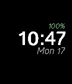{ loading=lazy width="72" } | [Glober Bold](https://apps.rebble.io/en_US/application/5510e098daf205460f000079) <small>Rebble App Store</small> | [Turner Vink](https://github.com/turnervink/globerbold) | <small>Not checked yet</small> | 2015-10-29 | A simple watchface using the beautiful font Glober. See the time, date, battery level, and weather. The battery level can be hidden, and the weather can… |
| 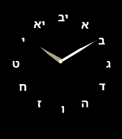{ loading=lazy width="72" } | [Glyph Dial](https://apps.repebble.com/ad3892194bf143ad8b4b63e0) | [Amit Kotlovski](https://github.com/amitkot/glyph-dial) | <small>Not checked yet</small> | 2026-04-16 | Glyph Dial is a minimalist Hebrew analog watchface for Pebble Time 2 and Pebble Round 2. Instead of standard numerals, the dial uses Hebrew markers in a… |
| 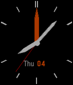{ loading=lazy width="72" } | [GMT Explorer](https://apps.rebble.io/en_US/application/5570e9d8ddc5cc1f95000053) <small>Rebble App Store</small> | [R McCoy](https://github.com/rmccoy777/gmt_explorer) | <small>Not checked yet</small> | 2015-06-06 | Based off of simple analog. White hands for local time, orange is GMT or UTC(zulu). Future I will add the option to pick timezones. |
| 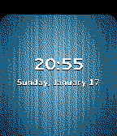{ loading=lazy width="72" } | [GNOME 3](https://apps.rebble.io/en_US/application/569c4e24d05afe97f1000075) <small>Rebble App Store</small> | [Christopher K. Horton](https://github.com/WarriorIng64/GNOME-3-Watchface) | <small>Not checked yet</small> | 2016-01-18 | This watchface is inspired by the lockscreen for the GNOME 3 desktop environment. You can make it look like you're running one of the most popular Linux… |
| { loading=lazy width="72" } | [GOAL](https://apps.rebble.io/en_US/application/53ac45dfe9ecad8c19000037) <small>Rebble App Store</small> | [John Gehl](https://github.com/iliketocode/GOAL) | <small>Not checked yet</small> | 2014-06-28 | A watchface inspired by the world cup. Every time the minute changes, then the soccer ball does a little animation and the time says GOAL. Also does the… |
| 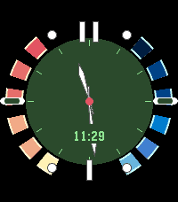{ loading=lazy width="72" } | [Goldeneye Time 2](https://apps.repebble.com/cc5b253a104742bbbbcc2c2e) | [gloriousCode](https://github.com/gloriousCode/fuzzy-text-two/tree/codex/gabbro-pebbleeye-hud) | <small>Not checked yet</small> | 2026-07-06 | GabbroEye HUD is a Pebble watchface branch that recreates the feel of the Nintendo 64-era spy watch interface for modern PebbleOS hardware, with the layout… |
| 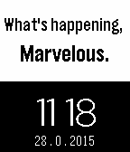{ loading=lazy width="72" } | [Good Morning](https://apps.rebble.io/en_US/application/54c8646d33a24bc96a000072) <small>Rebble App Store</small> | [EmersonGS](https://github.com/EmersonGGS/Good-Morning) | <small>No licence</small> | 2015-02-08 | A happy Watchface that gives you a nice confidence boost. |
| { loading=lazy width="72" } | [Good Night. Battery long life](https://apps.rebble.io/en_US/application/547b374bd9b3a91ca500002f) <small>Rebble App Store</small> | [BOOMik](https://github.com/BOOMik/GoodNightPebble) | BSD-2-Clause | 2014-11-30 | Battery saver for pebble. App do nothing. Run before you go to bed. |
| { loading=lazy width="72" } | [Goofster](https://apps.repebble.com/56599303db6c403ea523cb8a) | [LochieDoesStuff](https://github.com/LochieDoesStuff/Goofster) | <small>Not checked yet</small> | 2026-05-11 | It's Goofster! His left eye knows the hour, his right eye knows time. He is not sure what seconds are! Customise him! Adopt your own Goofster today! |
| { loading=lazy width="72" } | [Goofster](https://apps.rebble.io/en_US/application/6a020c117d641e0009c1b98f) <small>Rebble App Store</small> | [LochieDoesStuff](https://github.com/LochieDoesStuff/Goofster) | <small>Not checked yet</small> | 2026-05-11 | It's Goofster! His left eye knows the hour, his right eye knows minutes. He is not sure what seconds are! (DISCLAIMER: Since writing this description… |
| 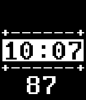{ loading=lazy width="72" } | [GPS Tester](https://apps.rebble.io/en_US/application/5531a1c65b5f5463d000007e) <small>Rebble App Store</small> | [Peter Summers](http://web.aanet.com.au/~summersfamily/gps_tester.zip) | <small>See source</small> | 2015-04-18 | Simple utility to test the age of GPS reads on your phone - runs once per minute and then displays the age in seconds of the GPS reading. This should be no… |
| 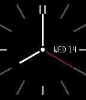{ loading=lazy width="72" } | [Grace](https://apps.rebble.io/en_US/application/59a6e780461a8d0b77001590) <small>Rebble App Store</small> | [David Morgan](https://github.com/Spitemare/grace) | <small>Not checked yet</small> | 2017-09-07 | Based on a design by /u/maqtanim on the Pebble subreddit. Grace is elegance simplified. Current temperature is also available via Yahoo!, OpenWeatherMap… |
| { loading=lazy width="72" } | [Granite](https://apps.rebble.io/en_US/application/554e9ea30136b07f42000087) <small>Rebble App Store</small> | [Furrtek](https://github.com/furrtek/Granite) | <small>Not checked yet</small> | 2015-05-10 | Time written in simili-3D animated rotating stone blocks, simple as that. Battery counscious and tap aware for added action. |
| 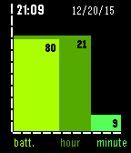{ loading=lazy width="72" } | [Graph](https://apps.rebble.io/en_US/application/5677521f00088cd53f00006e) <small>Rebble App Store</small> | [Edwin Finch](https://edwinfinch.com/redirect/pebble-legacy-source) | <small>See source</small> | 2021-06-17 | An old classic from our original collection from 2014-2016, now free & open source! |
| 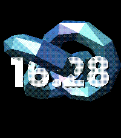{ loading=lazy width="72" } | [Graphics Gems](https://apps.repebble.com/da990f30581f4c9aaaa6fb6d) | [Ross Gardiner](https://github.com/rossng/pebble-watchfaces/tree/main/watchfaces/graphics-gems) | <small>Not checked yet</small> | 2026-06-28 | A native Pebble watchface that renders the classics of computer-graphics research — the Utah teapot, the Stanford bunny, an icosphere and a torus knot —… |
| 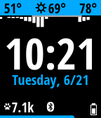{ loading=lazy width="72" } | [Graphite](https://apps.rebble.io/en_US/application/58a64c9c6ca3877261000466) <small>Rebble App Store</small> | [Stefan Heule](https://github.com/stefanheule/graphite) | <small>Not checked yet</small> | 2017-05-11 | Free and open source watchapp for the Pebble Time and Pebble Time Steel. It's simple, elegant and highly configurable. Features include: - 24h rain preview… |
| 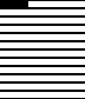{ loading=lazy width="72" } | [GraphWatch](https://apps.rebble.io/en_US/application/54a77ef0e8b7f578f1000017) <small>Rebble App Store</small> | [Charles Meyer](http://github.com/charles-meyer/loading_watch) | <small>No licence</small> | 2015-01-03 | Watch the bars progress as the day goes by! Each bar represents one hour (in 12 hour time) |
| 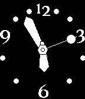{ loading=lazy width="72" } | [Gravity](https://apps.rebble.io/en_US/application/529d7ab96794728567000017) <small>Rebble App Store</small> | [stibbons](https://github.com/phardy/pebble-gravity) | <small>Not checked yet</small> | 2025-11-25 | This watchface has problems. The hands are far too heavy for the mechanism. They get pulled down by gravity, racing around the bottom of the watchface and… |
| 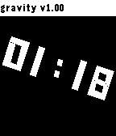{ loading=lazy width="72" } | [Gravity](https://apps.rebble.io/en_US/application/53f781ad94e7d303cb000266) <small>Rebble App Store</small> | [thyung](https://github.com/thyung/PebbleFace_gravity) | <small>Not checked yet</small> | 2014-08-22 | Rotate the time display with gravity |
| 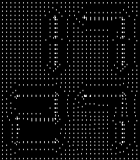{ loading=lazy width="72" } | [Gravity](https://apps.repebble.com/696f4db7e87ee700097955f6) | [Yorks0n](https://github.com/Yorks0n/pebble-watchface-Gravity) | <small>Not checked yet</small> | 2026-01-20 | A watchface composed of a dot matrix network and the forces of attraction. |
| 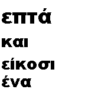{ loading=lazy width="72" } | [Greek Clock](https://apps.repebble.com/542989049013b6e10c0000ff) | [Panayotis Katsaloulis](https://github.com/teras/GreekClock) | <small>Not checked yet</small> | 2016-09-22 | Ελληνικό ρολόι που λέει την ώρα όπως και εμείς. Δεν χρειάζεται ελληνικό firmare. Η ώρα λέγεται όπως τη λέμε καθημερινά, δηλαδή «μία και τέταρτο», «οκτώ και… |
| { loading=lazy width="72" } | [Greek Fuzzy Time](https://apps.rebble.io/en_US/application/53b0b968206ae5e95a00005f) <small>Rebble App Store</small> | [theotox](https://dl.dropboxusercontent.com/u/36499947/fuzzy_time_gr.tgz) | <small>See source</small> | 2014-06-30 | Watchface που λέει την ώρα "ανθρώπινα" δηλ. δεν λέει "έξι και σαράντα τέσσερα", λέει "Επτά παρά τέταρτο". Η ένδειξη αλλάζει ανά πεντάλεπτο, 2 λεπτά πριν την… |
| 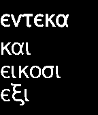{ loading=lazy width="72" } | [Greek Watch](https://apps.rebble.io/en_US/application/5370944873825a03f20000bd) <small>Rebble App Store</small> | [Pantelis Christofi](https://github.com/oranjepig/GreekFace) | <small>Not checked yet</small> | 2014-05-13 | Tells the time in Greek! A first attempt at a text watch working around the unicode limitations. Based on the default text watchface. This is the very first… |
| 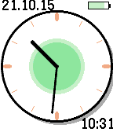{ loading=lazy width="72" } | [greenclock-face](https://apps.repebble.com/5589b1d545b5394350000005) | [Michael](https://github.com/ylno/greenclock-face) | <small>Not checked yet</small> | 2016-05-24 | Animated color Pebble watchface. Expands from a dot, sweeping the clock arms as it does so. There are two inner circles inside the clock face. One is… |
| 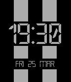{ loading=lazy width="72" } | [Grey Stripe](https://apps.repebble.com/56f5827caa40fc57f600000e) | [Ripster](https://github.com/Ripster81/g-stripe) | <small>Not checked yet</small> | 2016-03-25 | My first watchface to match NATO black&grey strap. |
| 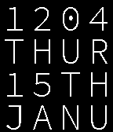{ loading=lazy width="72" } | [Grid Code](https://apps.rebble.io/en_US/application/54b7a043cba63609af000041) <small>Rebble App Store</small> | [degygii](https://github.com/degygii/gridcode) | <small>Not checked yet</small> | 2015-02-08 | Modified Version of the Grid Lite Watchface by Pebble Technology, with a different, lighter typeface. |
| 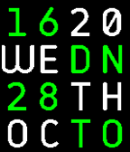{ loading=lazy width="72" } | [Grid Color](https://apps.repebble.com/5630dfd19c667e7a78000051) | [Gianluca Troiani](https://github.com/giatro/Grid-Color) | <small>Not checked yet</small> | 2025-11-25 | A colourful and customizable watchface based on Grid Lite, now with BT connection monitor. |
| { loading=lazy width="72" } | [Grid Father's Day Edition](https://apps.rebble.io/en_US/application/539b982ddf322d33870000ad) <small>Rebble App Store</small> | [Pebble](https://github.com/pebble-hacks/lukasz-projects/tree/master/griddad) | <small>Not checked yet</small> | 2014-06-14 | A special edition of the Grid Lite watchface to celebrate Father's Day. Shake the Pebble for the hidden message. Share the watchface with the Pebble dads in… |
| 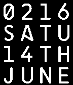{ loading=lazy width="72" } | [Grid Lite](https://apps.rebble.io/en_US/application/539b91cd199eae1e870000ab) <small>Rebble App Store</small> | [Pebble](https://github.com/pebble-hacks/lukasz-projects/tree/master/gridlite) | <small>Not checked yet</small> | 2014-06-14 | Grid style watchface |
| 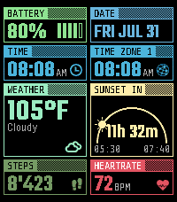{ loading=lazy width="72" } | [Gridlock](https://apps.repebble.com/cf60ff6cf2fa45868e4e8a6f) | [Null Syntax](https://github.com/AKlitbo/pebble-watchfaces) | AGPL-3.0 | 2026-09-27 | Gridlock is an experimental modular watchface for the Pebble Time 2. ⚠️ Beta Preview Gridlock is an active work in progress. Core functionality is already… |
| 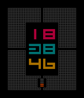{ loading=lazy width="72" } | [Grids](https://apps.rebble.io/en_US/application/55fe8e1ded80fc61a400005a) <small>Rebble App Store</small> | [Sam Carton](https://github.com/samcarton/Grids-Pebble-Time) | <small>Not checked yet</small> | 2015-09-28 | Grids - For Pebble Time. A watchface designed by Chimikyo. Includes battery charge level indicator. Built by request on /r/pebble |
| { loading=lazy width="72" } | [GridSpace](https://apps.repebble.com/694a99bbfb639a000a570b91) | [EC Apps](https://github.com/eduardochiaro/gridspace) | <small>Not checked yet</small> | 2026-07-25 | A minimalist Pebble watchface with a distinctive pixel-grid aesthetic. Time, Date, Step Tracker, Weather and Battery Indicator. Access settings through the… |
| { loading=lazy width="72" } | [Groundtrack](https://apps.repebble.com/4cb497d2805d4b0b87d70876) | [Segfaultgolf](https://github.com/huntrontrakkr/groundtrack-watch-face) | <small>Not checked yet</small> | 2026-10-04 | Groundtrack draws where the Sun, the Moon or a satellite is over the Earth, and where it goes next, on a flat chart with the time set along the route. Two… |
| { loading=lazy width="72" } | [Groundtrack Fuller](https://apps.repebble.com/7e96e11b99aa4f6fb3ba3928) | [Segfaultgolf](https://github.com/huntrontrakkr/groundtrack-watch-face) | <small>Not checked yet</small> | 2026-10-04 | Groundtrack Fuller draws where the Sun, the Moon or a satellite is over the Earth, and where it goes next, on Buckminster Fuller's unfolded globe with the… |
| { loading=lazy width="72" } | [Gundam and Mobile Suit SD Chibi](https://apps.repebble.com/db3f6e4f0a904e2894a4b1fa) | [Sapphire Second-Hand](https://github.com/shoepaladin/kiwi-cup/tree/main/pebble/gundam_wfm_static_wf) | <small>Not checked yet</small> | 2026-10-05 | Track time and step counts with Gundam Aerial, Calibarn, GPO2A, Qubeley, Xi, Byarlant, Zeta, Sazabi, and Crossbone. Steps are represented with filling in an… |
| { loading=lazy width="72" } | [Gwen NS](https://apps.rebble.io/en_US/application/55a6ad9b1f6362879b00004c) <small>Rebble App Store</small> | [testyk8](http://github.com/kdisimone/cgm-pebble) | <small>No licence</small> | 2015-07-15 | Gwyneth's personalized NS watchface |
