---
hide:
  - toc
---

<!-- Generated by scripts/update_app_directory.py: do not edit by hand -->
# Pebble Watchfaces: H

[← All Pebble Watchfaces](../watchfaces.md) · [A](a.md) · [B](b.md) · [C](c.md) · [D](d.md) · [E](e.md) · [F](f.md) · [G](g.md) · **H** · [I](i.md) · [J](j.md) · [K](k.md) · [L](l.md) · [M](m.md) · [N](n.md) · [O](o.md) · [P](p.md) · [Q](q.md) · [R](r.md) · [S](s.md) · [T](t.md) · [U](u.md) · [V](v.md) · [W](w.md) · [X](x.md) · [Y](y.md) · [Z](z.md) · [0–9 & other](other.md)

*113 watchfaces · Last updated 2026-10-06 · [About these lists](../about-app-lists.md)*

<h2 class="app-name" id="app-576783f03feaee4aa30002e0"><a href="https://apps.repebble.com/576783f03feaee4aa30002e0">Habitual</a></h2>
<a class="app-source" href="https://github.com/Antrikshy/Habitual-for-Pebble" title="Source code" data-search-exclude>View source</a>

by <a href="https://apps.repebble.com/apps/dev/antriksh-yadav_543d5da8a44ae19e94000015" title="More from this developer">Antriksh Yadav</a>

MIT v1.1 Updated 2025-11-25

Runs on: Round 2, Time 2, Pebble 2 Duo, Pebble 2, Time Round, Time, Classic

Habitual is a simple and smart-looking watchface that aims to help you pick up habits. Use the Pebble app to enter up to five lines of custom text, reminding yourself to drink water, to continue…

<a class="app-shot" href="https://apps.repebble.com/55ea94ef2ad21a16b40000a1" data-search-exclude>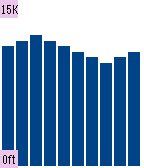</a>

<h2 class="app-name" id="app-55ea94ef2ad21a16b40000a1"><a href="https://apps.repebble.com/55ea94ef2ad21a16b40000a1">Hack Dads Altimeter Watchface (PRB Hackathon)</a></h2>
<a class="app-source" href="https://github.com/HackDads/Pebble-Altimeter-Watchface" title="Source code" data-search-exclude>View source</a>

by <a href="https://apps.repebble.com/apps/dev/ish-ot-jr_52f1ada1f216769cb90007ca" title="More from this developer">Ish Ot Jr.</a>

No licence v1.0 Updated 2015-09-06

Runs on: Time 2, Time

Hack Dads came to Pebble Rocks Boulder with the intention of making a fully functional Pebble Smartstrap that runs without the need for an external power supply. We have achieved this goal with…

<h2 class="app-name" id="app-5561ce01346c9c3db400006f"><a href="https://apps.repebble.com/5561ce01346c9c3db400006f">Hack meets Beer o&#x27;clock</a></h2>
<a class="app-source" href="https://github.com/flashback2k14/hackoclock" title="Source code" data-search-exclude>View source</a>

by <a href="https://apps.repebble.com/apps/dev/yeah-dev_531a3a5205c740cd0f000723" title="More from this developer">Yeah!Dev</a>

Not checked yet v1.1 Updated 2015-05-27

Runs on: Time 2, Pebble 2 Duo, Pebble 2, Time, Classic

HACK MEETS BEER O&#x27;CLOCK is a fully customisable watchface. With shaking your wrist you can show and hide the time (can you figure out how many times? :-)) From 9 to 5 show HACK O&#x27;CLOCK for the…

<h2 class="app-name" id="app-541cdf66eb344424e9000044"><a href="https://apps.repebble.com/541cdf66eb344424e9000044">Hack the North</a></h2>
<a class="app-source" href="https://github.com/pebble-hacks/hackathon-watchface/tree/hack-the-north" title="Source code" data-search-exclude>View source</a>

by <a href="https://apps.repebble.com/apps/dev/girlgrammer_5283d225b65d503c02000002" title="More from this developer">girlgrammer</a>

Not checked yet v1.0 Updated 2014-09-20

Runs on: Time 2, Pebble 2 Duo, Pebble 2, Time, Classic

Show off your hacker pride with this Hack the North watchface built entirely with Pebble.js

<h2 class="app-name" id="app-5675c1c88e4b8f6b9300003e"><a href="https://apps.repebble.com/5675c1c88e4b8f6b9300003e">Hackeriet Door</a></h2>
<a class="app-source" href="https://github.com/alexanderkjall/hackeriet-door" title="Source code" data-search-exclude>View source</a>

by <a href="https://apps.repebble.com/apps/dev/alexander-kj-ll_56716312da0e01239b000024" title="More from this developer">Alexander Kjäll</a>

GPL-3.0 v1.0 Updated 2015-12-19

Runs on: Round 2, Time Round

Shows either a green or red version of the Hackeriet logo, depending on if the hackspace Hackeriet is open or closed.

<a class="app-shot" href="https://apps.repebble.com/38c21e95638449e5a7eedb8d" data-search-exclude>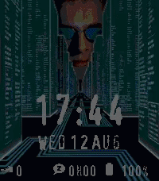</a>

<h2 class="app-name" id="app-38c21e95638449e5a7eedb8d"><a href="https://apps.repebble.com/38c21e95638449e5a7eedb8d">Hackers95</a></h2>
<a class="app-source" href="https://github.com/Moaske/PebbleHackers95" title="Source code" data-search-exclude>View source</a>

by <a href="https://apps.repebble.com/apps/dev/moaske_3f1bf0845ffec82a2a96f91c" title="More from this developer">Moaske</a>

No licence v1.5.1 Updated 2026-09-19

Runs on: Time 2

Hackers &#x27;95 fan watch face featuring nine wallpapers from the movie 😎💾 Hack the planet!! Clock and date follow localisation settings and at bottom: steps, sleep and battery. (Time 2 / Emery only)…

<a class="app-shot" href="https://apps.repebble.com/533ea3692804d179bb0002e8" data-search-exclude>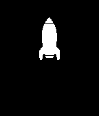</a>

<h2 class="app-name" id="app-533ea3692804d179bb0002e8"><a href="https://apps.repebble.com/533ea3692804d179bb0002e8">HackIllinois</a></h2>
<a class="app-source" href="https://github.com/nhandler/hackillinois" title="Source code" data-search-exclude>View source</a>

by <a href="https://apps.repebble.com/apps/dev/nathan-handler_530d1fe7d3b642ac1a000335" title="More from this developer">Nathan Handler</a>

Not checked yet v1.2.1 Updated 2014-04-08

Runs on: Time 2, Pebble 2 Duo, Pebble 2, Time, Classic

On April 11th, join several hundred hackers in fostering the creative spirit that’s changing the world. HackIllinois is about creating something you’re passionate about. Come spend 36 hours…

<h2 class="app-name" id="app-559408d6043f1bebb9000048"><a href="https://apps.repebble.com/559408d6043f1bebb9000048">Hacklab Turku</a></h2>
<a class="app-source" href="https://github.com/vurp0/HacklabPebble" title="Source code" data-search-exclude>View source</a>

by <a href="https://apps.repebble.com/apps/dev/max-sandholm_52f20960c41172fca7000e20" title="More from this developer">Max Sandholm</a>

Not checked yet v1.1 Updated 2015-07-01

Runs on: Time 2, Pebble 2 Duo, Pebble 2, Time, Classic

A simple analog watchface for Hacklab Turku, a hackerspace in Turku, Finland. IRC: #turku.hacklab.fi @ Freenode

<h2 class="app-name" id="app-54d2072b2a56ee21ec000092"><a href="https://apps.repebble.com/54d2072b2a56ee21ec000092">hackS1GN</a></h2>
<a class="app-source" href="https://github.com/UgoRaffaele/hackS1GN-pebble" title="Source code" data-search-exclude>View source</a>

by <a href="https://apps.repebble.com/apps/dev/ugo-raffaele-piemontese_54a54a335d5a91a9d300005e" title="More from this developer">Ugo Raffaele Piemontese</a>

GPL-3.0 v2.0 Updated 2015-02-13

Runs on: Time 2, Pebble 2 Duo, Pebble 2, Time, Classic

My watchface, created for fun. The date is in binary 24-hour format. Hour on column 1, minutes on column 2, day on column 3 and month on column 4, from top to bottom. 1st screenshot, 12:17 of…

<h2 class="app-name" id="app-54bb10e105d4ee74760000b2"><a href="https://apps.repebble.com/54bb10e105d4ee74760000b2">Hail Hydra</a></h2>
<a class="app-source" href="https://github.com/jessemillar/Pebbling/tree/master/Hail-Hydra" title="Source code" data-search-exclude>View source</a>

by <a href="https://apps.repebble.com/apps/dev/jesse-millar_54305df1a2f622febf0001cc" title="More from this developer">Jesse Millar</a>

Not checked yet v1.0 Updated 2015-01-18

Runs on: Time 2, Pebble 2 Duo, Pebble 2, Time, Classic

Support your favorite anti-bad-guy organization with this sporty watchface. Be warned though, things can get prickly when you shake your wrist. Hail Hydra? Hail, yeah!

<a class="app-shot" href="https://apps.repebble.com/67cb1c5fb7a02301b9a6e415" data-search-exclude>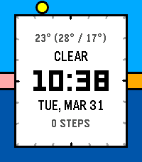</a>

<h2 class="app-name" id="app-67cb1c5fb7a02301b9a6e415"><a href="https://apps.repebble.com/67cb1c5fb7a02301b9a6e415">Halcyon</a></h2>
<a class="app-source" href="https://github.com/freakified/halcyon" title="Source code" data-search-exclude>View source</a>

by <a href="https://apps.repebble.com/apps/dev/freakified_534d74f861fcaa8033000263" title="More from this developer">Freakified</a>

Not checked yet v2.3.1 Updated 2026-07-06

Runs on: Round 2, Time 2, Pebble 2 Duo, Pebble 2, Time Round, Time, Classic

An analog-digital watchface featuring the solar day! Halcyon represents the 24 hours of the day as a ring around the edges of your watch, highlighting the sunrise, sunset, and the position of the…

<h2 class="app-name" id="app-54bc13d135ac298d8900007f"><a href="https://apps.repebble.com/54bc13d135ac298d8900007f">Half and Half</a></h2>
<a class="app-source" href="https://github.com/jessemillar/Pebbling/tree/master/Half-and-Half" title="Source code" data-search-exclude>View source</a>

by <a href="https://apps.repebble.com/apps/dev/jesse-millar_54305df1a2f622febf0001cc" title="More from this developer">Jesse Millar</a>

Not checked yet v1.0 Updated 2015-01-18

Runs on: Time 2, Pebble 2 Duo, Pebble 2, Time, Classic

Shows the time in an angular, simplistic way. The current hour is displayed in the center. Read current minutes as you would on an analogue clock. Shake to invert the color of the center digit.

<a class="app-shot" href="https://apps.repebble.com/698e41f7ea64380009df8ecc" data-search-exclude>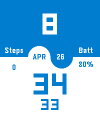</a>

<h2 class="app-name" id="app-698e41f7ea64380009df8ecc"><a href="https://apps.repebble.com/698e41f7ea64380009df8ecc">Half/Half</a></h2>
<a class="app-source" href="https://github.com/eduardochiaro/half-half" title="Source code" data-search-exclude>View source</a>

by <a href="https://apps.repebble.com/apps/dev/ec-apps_6818b3bd53899000082d25a4" title="More from this developer">EC Apps</a>

Not checked yet v1.6 Updated 2026-04-26

Runs on: Round 2, Time 2, Pebble 2 Duo, Pebble 2, Time Round, Time, Classic

A digital watchface for Pebble smartwatches with a minimalist split-screen design. Configs: - Top Color/Bottom Color - Override Text Color - Show Seconds - Show Leading Zero - Battery saving: hide…

<a class="app-shot" href="https://apps.repebble.com/48d7f4eab704414c8bc1fa7e" data-search-exclude>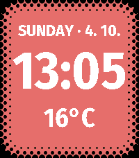</a>

<h2 class="app-name" id="app-48d7f4eab704414c8bc1fa7e"><a href="https://apps.repebble.com/48d7f4eab704414c8bc1fa7e">Halftone</a></h2>
<a class="app-source" href="https://github.com/xefensor/halftone-watchface" title="Source code" data-search-exclude>View source</a>

by <a href="https://apps.repebble.com/apps/dev/xefensor_d401482e372dff79d360c099" title="More from this developer">xefensor</a>

Not checked yet v1.0.0 Updated 2026-10-04

Runs on: Time 2

Halftone makes the color e-paper display feel like part of the Pebble Time 2 body. A precise halftone border grows out of the black bezel and curves around the screen with the same rounded shape…

<a class="app-shot" href="https://apps.repebble.com/2f229539bafd413d8659522e" data-search-exclude>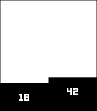</a>

<h2 class="app-name" id="app-2f229539bafd413d8659522e"><a href="https://apps.repebble.com/2f229539bafd413d8659522e">halfy</a></h2>
<a class="app-source" href="https://github.com/gebeto/pebble-watchfaces/tree/main/halfy" title="Source code" data-search-exclude>View source</a>

by <a href="https://apps.repebble.com/apps/dev/slavik-nychkalo_4e9c4462cbe1def15e9e48e8" title="More from this developer">slavik.nychkalo</a>

Not checked yet v1.0 Updated 2026-01-20

Runs on: Round 2, Time 2, Pebble 2 Duo, Pebble 2, Time Round, Time, Classic

Simple minimalistic watchface

<h2 class="app-name" id="app-545059ca1c9d3823c0000010"><a href="https://apps.repebble.com/545059ca1c9d3823c0000010">Halloween Time</a></h2>
<a class="app-source" href="https://github.com/mhungerford/pebble-halloween_time" title="Source code" data-search-exclude>View source</a>

by <a href="https://apps.repebble.com/apps/dev/matthew-hungerford_52bca741d438930a650001b6" title="More from this developer">Matthew Hungerford</a>

Not checked yet v1.0 Updated 2014-10-29

Runs on: Time 2, Pebble 2 Duo, Pebble 2, Time, Classic

Happy Halloween! Flick your wrist to flip through fun Halloween images. Grim Reaper &amp; Vampire images from clipartlord.com Zombie &amp; Frankenstein images CC-3.0 from Vladimir Zuñiga of Foca.tk…

<a class="app-shot" href="https://apps.repebble.com/533ffab3b8a7e587d2000322" data-search-exclude>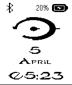</a>

<h2 class="app-name" id="app-533ffab3b8a7e587d2000322"><a href="https://apps.repebble.com/533ffab3b8a7e587d2000322">Halo</a></h2>
<a class="app-source" href="https://github.com/lmsierra/Halo-Watchface/tree/master" title="Source code" data-search-exclude>View source</a>

by <a href="https://apps.repebble.com/apps/dev/luis-miguel-sierra_532ec3204e66a6500300012d" title="More from this developer">Luis Miguel Sierra</a>

Not checked yet v1.1.1 Updated 2015-01-09

Runs on: Time 2, Pebble 2 Duo, Pebble 2, Time, Classic

Halo watchface (Halo logo and font) with bluetooth connection, battery state (image and percentage), time (24 hours), day and month. Bluetooth image not visible while it is not connected. Invert…

<h2 class="app-name" id="app-536d67268b248acb1700000d"><a href="https://apps.repebble.com/536d67268b248acb1700000d">Halo</a></h2>
<a class="app-source" href="https://github.com/mcclayton/Halo" title="Source code" data-search-exclude>View source</a>

by <a href="https://apps.repebble.com/apps/dev/michael-clayton_52f7e91dcbdf71c467000497" title="More from this developer">Michael Clayton</a>

Not checked yet v1.0.0 Updated 2014-05-09

Runs on: Time 2, Pebble 2 Duo, Pebble 2, Time, Classic

Halo is a delightfully sleek watchface with modern flair. Two rings arc around the hour to display the time. The inner ring displays the seconds — the outer displays the minutes.

<a class="app-shot" href="https://apps.repebble.com/dc3358b00af54f069f14d883" data-search-exclude>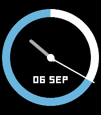</a>

<h2 class="app-name" id="app-dc3358b00af54f069f14d883"><a href="https://apps.repebble.com/dc3358b00af54f069f14d883">Halo Swipe</a></h2>
<a class="app-source" href="https://github.com/thementalgoose/pebble-halo-swipe" title="Source code" data-search-exclude>View source</a>

by <a href="https://apps.repebble.com/apps/dev/jordan-fisher_5d482ff5d76b0f00018300f2" title="More from this developer">Jordan Fisher</a>

Not checked yet v1.0.0 Updated 2026-09-26

Runs on: Round 2, Time 2, Pebble 2 Duo, Pebble 2, Time Round, Time, Classic

Simple watchface inspired by the watchface within the OG Kickstarter Pebble Time 2 video https://www.kickstarter.com/projects/getpebble/pebble-2-time-2-and-core-an-entirely-new-3g-ultra…

<a class="app-shot" href="https://apps.repebble.com/22ece92835ce4d6f9bb49696" data-search-exclude>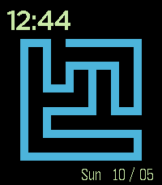</a>

<h2 class="app-name" id="app-22ece92835ce4d6f9bb49696"><a href="https://apps.repebble.com/22ece92835ce4d6f9bb49696">Hamiltonian path</a></h2>
<a class="app-source" href="https://github.com/nclisby/hp_pebble/" title="Source code" data-search-exclude>View source</a>

by <a href="https://apps.repebble.com/apps/dev/nathan-clisby_88e8beeb5488b9a79d9a262b" title="More from this developer">Nathan Clisby</a>

Not checked yet v1.0 Updated 2026-05-10

Runs on: Time 2

Displays a Hamiltonian path on a 6x6 grid, sampled via the so-called backbite algorithm.

<a class="app-shot" href="https://apps.repebble.com/540f1c77b8bd034c11000158" data-search-exclude>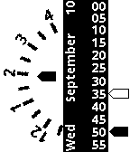</a>

<h2 class="app-name" id="app-540f1c77b8bd034c11000158"><a href="https://apps.repebble.com/540f1c77b8bd034c11000158">Hands</a></h2>
<a class="app-source" href="http://hg.subforge.org/hands/" title="Source code" data-search-exclude>View source</a>

by <a href="https://apps.repebble.com/apps/dev/unexist_52b88eac9efe5857ed000041" title="More from this developer">unexist</a>

See source v1.1 Updated 2014-09-10

Runs on: Time 2, Pebble 2 Duo, Pebble 2, Time, Classic

This is a just a weird concept watchface. It shows the current hour in a wheel and the current minutes and seconds with slider-like hands. The filled hand is for minutes, the outlined one for…

<h2 class="app-name" id="app-52fafe569ecfef5ec600009d"><a href="https://apps.repebble.com/52fafe569ecfef5ec600009d">Handwritten</a></h2>
<a class="app-source" href="https://github.com/etiennovski/Handwritten.git" title="Source code" data-search-exclude>View source</a>

by <a href="https://apps.repebble.com/apps/dev/etienne-pj_52e26e53b806fd567500073d" title="More from this developer">Etienne PJ</a>

Not checked yet v1.41 Updated 2015-02-14

Runs on: Time 2, Pebble 2 Duo, Pebble 2, Time, Classic

You asked for it: Handwritten is now open sourced! Help me in my quest against bug squashing. ---------------- A different pen stroke for each hour and minute of the day, this watchface looks just…

<a class="app-shot" href="https://apps.repebble.com/52ed9dc7a8030fa828000006" data-search-exclude>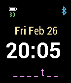</a>

<h2 class="app-name" id="app-52ed9dc7a8030fa828000006"><a href="https://apps.repebble.com/52ed9dc7a8030fa828000006">Hangout</a></h2>
<a class="app-source" href="https://github.com/antonioasaro/Antonio-Hangout_2.0.git" title="Source code" data-search-exclude>View source</a>

by <a href="https://apps.repebble.com/apps/dev/antonio-asaro_52cd5e150799b0643b00003c" title="More from this developer">Antonio Asaro</a>

No licence v2.2 Updated 2016-02-27

Runs on: Round 2, Time 2, Pebble 2 Duo, Pebble 2, Time Round, Time, Classic

Simple watchface with date, time, battery level, bluetooth status AND hangman puzzle. Every min, a random letter is exposed. Try to guess the word before it&#x27;s fully visible. Word lengths range…

<a class="app-shot" href="https://apps.repebble.com/5598b2766e86ef1b190000cd" data-search-exclude>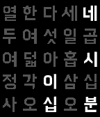</a>

<h2 class="app-name" id="app-5598b2766e86ef1b190000cd"><a href="https://apps.repebble.com/5598b2766e86ef1b190000cd">HannaClock</a></h2>
<a class="app-source" href="https://github.com/soomtong/HannaClock" title="Source code" data-search-exclude>View source</a>

by <a href="https://apps.repebble.com/apps/dev/soomtong_552d1af58215a22dc100000e" title="More from this developer">Soomtong</a>

Not checked yet v2.3 Updated 2015-12-26

Runs on: Round 2, Time 2, Pebble 2 Duo, Pebble 2, Time Round, Time, Classic

Simple Watchface using Hanna font for Pebble Time - Update Screen Every 5 min Original Designed by @suapapa Hanna Font Created &amp; Published by Woowahan.com

<h2 class="app-name" id="app-55dea9a5e9e4b6e7c1000007"><a href="https://apps.repebble.com/55dea9a5e9e4b6e7c1000007">Happy Watch</a></h2>
<a class="app-source" href="https://github.com/jonromero/happy_watch" title="Source code" data-search-exclude>View source</a>

by <a href="https://apps.repebble.com/apps/dev/jon-vlachogiannis_55d2c04aa2746403f2000082" title="More from this developer">Jon Vlachogiannis</a>

Not checked yet v1.1 Updated 2015-08-27

Runs on: Time 2, Pebble 2 Duo, Pebble 2, Time, Classic

Why care about seconds? Minutes? Even hours? Life is simple. Like that watch.

<a class="app-shot" href="https://apps.repebble.com/6ab08b4fc3174945bc89d239" data-search-exclude>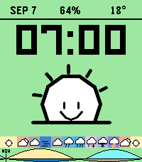</a>

<h2 class="app-name" id="app-6ab08b4fc3174945bc89d239"><a href="https://apps.repebble.com/6ab08b4fc3174945bc89d239">Happy Weather</a></h2>
<a class="app-source" href="https://github.com/romanimm/happy1" title="Source code" data-search-exclude>View source</a>

by <a href="https://apps.repebble.com/apps/dev/cosmic-tinkerer_1602b6d66a7992941d2ab9cb" title="More from this developer">Cosmic Tinkerer 🚀</a>

Not checked yet v2.0.47 Updated 2026-10-04

Runs on: Round 2, Time 2

A little sunshine. A little attitude. Happy Weather gives your Pebble Time 2 a face to match the forecast. Choose Happy for cheerful weather characters or Angry for scowling suns and grumpy…

<a class="app-shot" href="https://apps.repebble.com/6967772efe3ac20009ace348" data-search-exclude>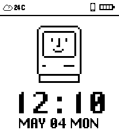</a>

<h2 class="app-name" id="app-6967772efe3ac20009ace348"><a href="https://apps.repebble.com/6967772efe3ac20009ace348">HappyMac</a></h2>
<a class="app-source" href="https://github.com/Yorks0n/HappyMac" title="Source code" data-search-exclude>View source</a>

by <a href="https://apps.repebble.com/apps/dev/yorks0n_692a907686176a0009926c79" title="More from this developer">Yorks0n</a>

No licence v1.3.0 Updated 2026-05-04

Runs on: Round 2, Time 2, Pebble 2 Duo, Pebble 2, Time Round, Time, Classic

A watchface inspired by Happy Mac on Macintosh. Available in Light, Dark, and Color themes. Wish you happy :)

<a class="app-shot" href="https://apps.repebble.com/12641b3cd36747d8bd8a617a" data-search-exclude>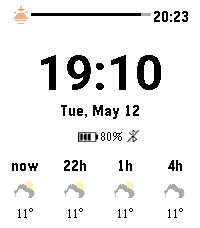</a>

<h2 class="app-name" id="app-12641b3cd36747d8bd8a617a"><a href="https://apps.repebble.com/12641b3cd36747d8bd8a617a">hassweather</a></h2>
<a class="app-source" href="https://github.com/vincentezw/hassweather-nua" title="Source code" data-search-exclude>View source</a>

by <a href="https://apps.repebble.com/apps/dev/vincent_997a3d2f0b60fba729f7aece" title="More from this developer">Vincent</a>

Not checked yet v3.2.0 Updated 2026-08-08

Runs on: Time 2, Pebble 2 Duo, Pebble 2, Time, Classic

Home Assistant weather forecast watchface with sunrise and sunset

<h2 class="app-name" id="app-67b7e94c0554c60009698bd8"><a href="https://apps.rebble.io/en_US/application/67b7e94c0554c60009698bd8">Hatsune Miku</a></h2>
<a class="app-source" href="https://github.com/denden1088/mikuwatch" title="Source code" data-search-exclude>View source</a>

by <a href="https://apps.rebble.io/en_US/developer/5b400ea41c219e0001225f49/1" title="More from this developer">denden1088</a>

Not checked yet v1.3 Updated 2025-02-24 Rebble App Store

Runs on: Time 2, Pebble 2 Duo, Pebble 2, Time, Classic

A basic Hatsune Miku watchface. Art is not by me.

<a class="app-shot" href="https://apps.repebble.com/b895216511fd47a5ba59c147" data-search-exclude>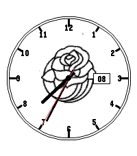</a>

<h2 class="app-name" id="app-b895216511fd47a5ba59c147"><a href="https://apps.repebble.com/b895216511fd47a5ba59c147">Hawkeye Rosebowl</a></h2>
<a class="app-source" href="https://github.com/jon-rebirtharmitage/pebble_rosebowl" title="Source code" data-search-exclude>View source</a>

by <a href="https://apps.repebble.com/apps/dev/cronin-technology_696e0fa985a6359578c5e48d" title="More from this developer">Cronin Technology</a>

Not checked yet v1.0.0 Updated 2026-05-09

Runs on: Round 2, Time 2

Hawkeye Rosebowl for my battle brother

<a class="app-shot" href="https://apps.repebble.com/574537f64b706803bc000002" data-search-exclude>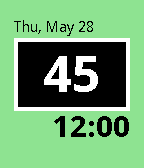</a>

<h2 class="app-name" id="app-574537f64b706803bc000002"><a href="https://apps.repebble.com/574537f64b706803bc000002">Hazy</a></h2>
<a class="app-source" href="https://github.com/bhdouglass/hazy" title="Source code" data-search-exclude>View source</a>

by <a href="https://apps.repebble.com/apps/dev/brian-douglass_5385e6abf60aaf4d9f0000c9" title="More from this developer">Brian Douglass</a>

GPL-3.0 v1.10 Updated 2016-10-11

Runs on: Round 2, Time 2, Pebble 2 Duo, Pebble 2, Time Round, Time, Classic

Check the air quality (AQI) right from your Pebble smartwatch, wherever you are in the world! Air quality data is provided by aqicn.org. The Hazy watchface and its author are not affiliated with…

<a class="app-shot" href="https://apps.repebble.com/69e1089397c2500009d7dfba" data-search-exclude>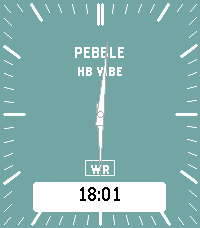</a>

<h2 class="app-name" id="app-69e1089397c2500009d7dfba"><a href="https://apps.repebble.com/69e1089397c2500009d7dfba">hb-vibe</a></h2>
<a class="app-source" href="https://github.com/alan-johnson/hb-vibe" title="Source code" data-search-exclude>View source</a>

by <a href="https://apps.repebble.com/apps/dev/alan-johnson_67a284c581c36f00092a6a3b" title="More from this developer">Alan Johnson</a>

No licence v1.0 Updated 2026-04-16

Runs on: Round 2, Time 2, Pebble 2 Duo, Pebble 2, Time Round, Time, Classic

Inspired by a watch face worn by Eric Migicovsky, hb-vibe has plenty of features in an easy to read design. Features include a rotating text display for date, battery charge percentage, current…

<a class="app-shot" href="https://apps.repebble.com/28a589e21b934ab6beac7b12" data-search-exclude>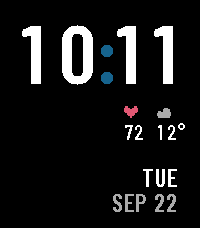</a>

<h2 class="app-name" id="app-28a589e21b934ab6beac7b12"><a href="https://apps.repebble.com/28a589e21b934ab6beac7b12">Headway</a></h2>
<a class="app-source" href="https://github.com/sybenx/headway" title="Source code" data-search-exclude>View source</a>

by <a href="https://apps.repebble.com/apps/dev/sybenx_d4c43f7b0132a46ff8340e8e" title="More from this developer">sybenx</a>

Not checked yet v1.25.2 Updated 2026-10-01

Runs on: Time 2, Pebble 2 Duo, Pebble 2, Time, Classic

A sleeve-aware transit watch: the time, heart rate, weather and date hang from the outer edge, the part a cuff uncovers first. Rain due within the hour shows on the face. Near Connect (Logan…

<a class="app-shot" href="https://apps.rebble.io/en_US/application/57caac70be5ad0a9cf000167" data-search-exclude>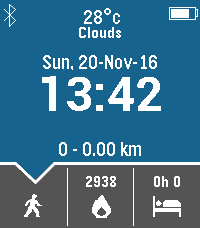</a>

<h2 class="app-name" id="app-57caac70be5ad0a9cf000167"><a href="https://apps.rebble.io/en_US/application/57caac70be5ad0a9cf000167">Healthify</a></h2>
<a class="app-source" href="https://github.com/prakashait09/Healthify" title="Source code" data-search-exclude>View source</a>

by <a href="https://apps.rebble.io/en_US/developer/570d9e418bf1c37e01000009/1" title="More from this developer">Prakash</a>

Not checked yet v3.6 Updated 2018-03-30 Rebble App Store

Runs on: Time 2, Pebble 2 Duo, Pebble 2, Time, Classic

A watchface with complete pebble health at a glance. Featurues : 1. Configurable Time format 2. Configurable Date format 3. Show/Hide Day of week 4. Configurable Bluetooth Connect/Disconnect…

<a class="app-shot" href="https://apps.repebble.com/5cb94375984146338231f3be" data-search-exclude>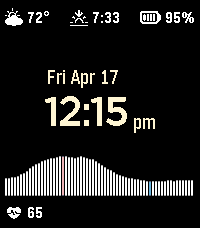</a>

<h2 class="app-name" id="app-5cb94375984146338231f3be"><a href="https://apps.repebble.com/5cb94375984146338231f3be">Heartburn</a></h2>
<a class="app-source" href="https://github.com/vsergeev/pebble-watchface-heartburn" title="Source code" data-search-exclude>View source</a>

by <a href="https://apps.repebble.com/apps/dev/vanya-sergeev_ca74c508355b155696b0a68b" title="More from this developer">Vanya Sergeev</a>

Not checked yet v1.3.0 Updated 2026-07-01

A Darkburn-esque watchface with a heart rate graph for the Pebble Time 2. Written in Zig using zig-pebble-sdk (https://github.com/vsergeev/zig-pebble-sdk). Features: * Weather conditions and…

<h2 class="app-name" id="app-566d8c5c51e7217e14000039"><a href="https://apps.repebble.com/566d8c5c51e7217e14000039">HeartClock</a></h2>
<a class="app-source" href="https://github.com/kendra-w/HeartClock" title="Source code" data-search-exclude>View source</a>

by <a href="https://apps.repebble.com/apps/dev/linearcircles_566d8849925d554c8400002d" title="More from this developer">linearcircles</a>

Not checked yet v1.0 Updated 2015-12-13

Runs on: Round 2, Time 2, Time Round, Time

This watchface displays the time, date, and a neat battery meter of heart lives, like in a video game. It&#x27;s compatible with Basalt (Time and Time Steel) or Chalk (Time Round).

<a class="app-shot" href="https://apps.repebble.com/55de1ab0785abd20ce000078" data-search-exclude>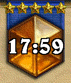</a>

<h2 class="app-name" id="app-55de1ab0785abd20ce000078"><a href="https://apps.repebble.com/55de1ab0785abd20ce000078">Hearthstone Legend</a></h2>
<a class="app-source" href="https://gitlab.com/n4ru/Hearthstone-Legend" title="Source code" data-search-exclude>View source</a>

by <a href="https://apps.repebble.com/apps/dev/n4ru_52c5a1cc0a89c8025a000049" title="More from this developer">n4ru</a>

Not checked yet v1.03 Updated 2015-08-27

Runs on: Time 2, Pebble 2 Duo, Pebble 2, Time, Classic

A simplistic Hearthstone watchface. Stars indicate battery status: 5 stars &gt; 90% 4 stars &gt; 70% 3 stars &gt; 50% 2 stars &gt; 30% 1 star &gt; 10% Add me on Hearthstone - Thirk#1334 !

<h2 class="app-name" id="app-54f6fb3c9776f44292000038"><a href="https://apps.repebble.com/54f6fb3c9776f44292000038">Hebrew Fuzzy</a></h2>
<a class="app-source" href="https://github.com/kaaspad/hebFuzzy" title="Source code" data-search-exclude>View source</a>

by <a href="https://apps.repebble.com/apps/dev/abu-jude_54e1c6370ed85b0031000059" title="More from this developer">Abu-Jude</a>

Not checked yet v1.0 Updated 2015-03-04

Runs on: Time 2, Pebble 2 Duo, Pebble 2, Time, Classic

Hebrew Fuzzy watch with Torah(Ashkenaz) font. This app is HEAVILY based on heb-text-pebble by Kalugny which was SDK 1.0 This version is SDK 2.0 and 3.0 compatible

<h2 class="app-name" id="app-581e94691c0888f046000259"><a href="https://apps.repebble.com/581e94691c0888f046000259">Hebrew Fuzzy Plus</a></h2>
<a class="app-source" href="https://github.com/flocsy/HebrewFuzzyPlus" title="Source code" data-search-exclude>View source</a>

by <a href="https://apps.repebble.com/apps/dev/gavriel-fleischer_57d89d0ca789e1fa550006e0" title="More from this developer">Gavriel Fleischer</a>

Not checked yet v1.0 Updated 2016-12-12

Runs on: Round 2, Time 2, Pebble 2 Duo, Pebble 2, Time Round, Time, Classic

Hebrew Fuzzy Plus Displays the time with Hebrew words. Features: - Settings to choose from 5 Jewish fonts: Simple, Handwriting, Tora Ashkenaz, Maccabi, Rashi. - Works on both the original and…

<a class="app-shot" href="https://apps.repebble.com/53307d6b508fcc814700026d" data-search-exclude>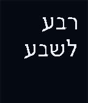</a>

<h2 class="app-name" id="app-53307d6b508fcc814700026d"><a href="https://apps.repebble.com/53307d6b508fcc814700026d">Hebrew Text Time Display</a></h2>
<a class="app-source" href="https://github.com/kalugny/heb-text-pebble" title="Source code" data-search-exclude>View source</a>

by <a href="https://apps.repebble.com/apps/dev/kaneti_5312152e6c80b1643c00030a" title="More from this developer">Kaneti</a>

Not checked yet v1.0.0 Updated 2014-03-25

Runs on: Time 2, Pebble 2 Duo, Pebble 2, Time, Classic

This is a simple text description of the time - in Hebrew. (for firmware 1.x - kalugny, adjustments for 2.x - kaneti)

<a class="app-shot" href="https://apps.repebble.com/5663225bfa1c04975d000072" data-search-exclude>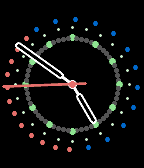</a>

<h2 class="app-name" id="app-5663225bfa1c04975d000072"><a href="https://apps.repebble.com/5663225bfa1c04975d000072">HebrewTime</a></h2>
<a class="app-source" href="https://github.com/wcerfgba/HebrewTime" title="Source code" data-search-exclude>View source</a>

by <a href="https://apps.repebble.com/apps/dev/john-preston_56534f1b28a791aea70000b8" title="More from this developer">John Preston</a>

Not checked yet v3.0 Updated 2015-12-12

Runs on: Round 2, Time 2, Time Round, Time

A Hebrew hour is defined as 1/12th of the time between sunset and sunrise, or 1/12th of the time between sunrise and sunset. This is a analogue watchface for Pebble smartwatches that shows the…

<h2 class="app-name" id="app-57846fef6c210401790007aa"><a href="https://apps.repebble.com/57846fef6c210401790007aa">Helium</a></h2>
<a class="app-source" href="https://github.com/westonkd/helium" title="Source code" data-search-exclude>View source</a>

by <a href="https://apps.repebble.com/apps/dev/weston-dransfield_56e4e91bb7a6015eae000044" title="More from this developer">Weston Dransfield</a>

Not checked yet v1.5 Updated 2016-07-14

Runs on: Round 2, Time 2, Pebble 2 Duo, Pebble 2, Time Round, Time, Classic

New in v1.5: battery meter, customize which ring shows the hour/minute, and a dropped connection notification! Helium is a simple and appealing layered watchface. Helium’s outer ring indicates the…

<a class="app-shot" href="https://apps.rebble.io/en_US/application/68ebe1952a50310009ee1b3e" data-search-exclude>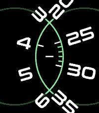</a>

<h2 class="app-name" id="app-68ebe1952a50310009ee1b3e"><a href="https://apps.rebble.io/en_US/application/68ebe1952a50310009ee1b3e">Helix</a></h2>
<a class="app-source" href="https://github.com/astosia/Helix" title="Source code" data-search-exclude>View source</a>

by <a href="https://apps.rebble.io/en_US/developer/58a635d30dfc320dc60003b4/1" title="More from this developer">astosia</a>

MIT v3.5 Updated 2026-03-16 Rebble App Store

Runs on: Round 2, Time 2, Pebble 2 Duo, Pebble 2, Time Round, Time, Classic

Dual Dial configurable watchface, with zoomed in hours &amp; minutes. Overlapping dials create a DNA-like helix Features: - Optional second timezone using timeapi.io, shows second timezone underneath…

<a class="app-shot" href="https://apps.rebble.io/en_US/application/6963bcb26da27100098f332d" data-search-exclude>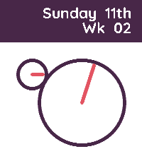</a>

<h2 class="app-name" id="app-6963bcb26da27100098f332d"><a href="https://apps.rebble.io/en_US/application/6963bcb26da27100098f332d">Helix-Analog</a></h2>
<a class="app-source" href="https://codeberg.org/tripplehelix/Helix-Pebble/src/branch/main/Helix-Analog" title="Source code" data-search-exclude>View source</a>

by <a href="https://apps.rebble.io/en_US/developer/687d60c735f0cc0009d17719/1" title="More from this developer">Tripplehelix</a>

See source v1.1 Updated 2026-01-11 Rebble App Store

Runs on: Time 2

A normal 12 hour clock, but the hands are split into their own faces. The hour hand &#x27;ticks&#x27; across the numbers for visibility, read the time as if it was a digital watch. Font: Quicksand (OFL)

<a class="app-shot" href="https://apps.rebble.io/en_US/application/690f681efa41010009584db6" data-search-exclude>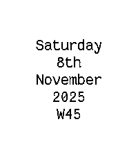</a>

<h2 class="app-name" id="app-690f681efa41010009584db6"><a href="https://apps.rebble.io/en_US/application/690f681efa41010009584db6">Helix-Business</a></h2>
<a class="app-source" href="https://codeberg.org/tripplehelix/Helix-Pebble/src/branch/main/Helix-Business" title="Source code" data-search-exclude>View source</a>

by <a href="https://apps.rebble.io/en_US/developer/687d60c735f0cc0009d17719/1" title="More from this developer">Tripplehelix</a>

See source v1.1 Updated 2025-11-08 Rebble App Store

Runs on: Round 2, Time 2, Pebble 2 Duo, Pebble 2, Time Round, Time, Classic

A very basic, very business, very low power face. Just shows the date and week number, updates daily. Apparently it can be better to not know the precise time, allowing you to be more present and…

<a class="app-shot" href="https://apps.rebble.io/en_US/application/68ebf4925536590009a4034f" data-search-exclude>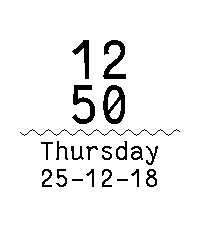</a>

<h2 class="app-name" id="app-68ebf4925536590009a4034f"><a href="https://apps.rebble.io/en_US/application/68ebf4925536590009a4034f">Helix-Clean</a></h2>
<a class="app-source" href="https://codeberg.org/tripplehelix/Helix-Pebble/src/branch/main/Helix-Clean" title="Source code" data-search-exclude>View source</a>

by <a href="https://apps.rebble.io/en_US/developer/687d60c735f0cc0009d17719/1" title="More from this developer">Tripplehelix</a>

See source v1.4 Updated 2025-12-18 Rebble App Store

Runs on: Time 2, Pebble 2 Duo, Pebble 2, Time, Classic

A clean and simple face, with the battery displayed as the wiggly line. Date is Y-M-D Fonts; FantasqueSansMono - SIL Open Font

<a class="app-shot" href="https://apps.rebble.io/en_US/application/69440a53ce101c0009f53014" data-search-exclude>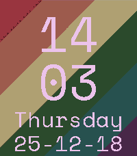</a>

<h2 class="app-name" id="app-69440a53ce101c0009f53014"><a href="https://apps.rebble.io/en_US/application/69440a53ce101c0009f53014">Helix-Gay</a></h2>
<a class="app-source" href="https://codeberg.org/tripplehelix/Helix-Pebble/src/branch/main/Helix-Gay" title="Source code" data-search-exclude>View source</a>

by <a href="https://apps.rebble.io/en_US/developer/687d60c735f0cc0009d17719/1" title="More from this developer">Tripplehelix</a>

See source v1.0 Updated 2025-12-18 Rebble App Store

Runs on: Time 2

A simple face to show off your gay! You also get a lovely surprise on the hour. Date is YY-MM-DD

<a class="app-shot" href="https://apps.rebble.io/en_US/application/68aa17632dfa4d0009a22828" data-search-exclude>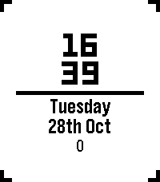</a>

<h2 class="app-name" id="app-68aa17632dfa4d0009a22828"><a href="https://apps.rebble.io/en_US/application/68aa17632dfa4d0009a22828">Helix-Simple</a></h2>
<a class="app-source" href="https://codeberg.org/tripplehelix/Helix-Pebble/src/branch/main/Helix-Simple" title="Source code" data-search-exclude>View source</a>

by <a href="https://apps.rebble.io/en_US/developer/687d60c735f0cc0009d17719/1" title="More from this developer">Tripplehelix</a>

See source v1.4 Updated 2025-11-08 Rebble App Store

Runs on: Round 2, Time 2, Pebble 2 Duo, Pebble 2, Time Round, Time, Classic

A simple watch face for simple people. The bar in the centre is your battery percentage and the numbers at the bottom are step count.

<h2 class="app-name" id="app-690c15d63e734c0009b9df2a"><a href="https://apps.repebble.com/690c15d63e734c0009b9df2a">Hellboy</a></h2>
<a class="app-source" href="https://github.com/innokentiyt/wf-hellboy" title="Source code" data-search-exclude>View source</a>

by <a href="https://apps.repebble.com/apps/dev/innokentiy-t_68f9c18dd3c6e4000885b8cb" title="More from this developer">innokentiy_t</a>

Not checked yet v1.2 Updated 2025-11-17

Runs on: Time 2, Pebble 2 Duo, Pebble 2, Time, Classic

A simple watchface for Pebble. Insipred by an illustration from &quot;Hellboy: The Lost Army&quot; novel. Features: - battery meter is a bottom thin line under ⚡ on HB&#x27;s right shoulder; - bt connection…

<a class="app-shot" href="https://apps.repebble.com/56d54890d8382294e5000004" data-search-exclude>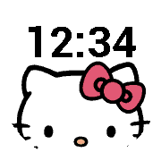</a>

<h2 class="app-name" id="app-56d54890d8382294e5000004"><a href="https://apps.repebble.com/56d54890d8382294e5000004">Hello Kitty</a></h2>
<a class="app-source" href="https://github.com/GGCrew/Pebble_Watchface-Hello_Kitty" title="Source code" data-search-exclude>View source</a>

by <a href="https://apps.repebble.com/apps/dev/gg-crew_52a0ff52a385090f1d000004" title="More from this developer">GG Crew</a>

No licence v1.0 Updated 2016-03-01

Runs on: Round 2, Time Round

A simple Hello Kitty watchface.

<h2 class="app-name" id="app-20150c025d28421197fabfd0"><a href="https://apps.repebble.com/20150c025d28421197fabfd0">Hello, Pebble</a></h2>
<a class="app-source" href="https://github.com/simmonsja/hello-pebble" title="Source code" data-search-exclude>View source</a>

by <a href="https://apps.repebble.com/apps/dev/joshua-simmons_d00b3d7bfcc7c0ee8fcb2bf3" title="More from this developer">Joshua Simmons</a>

Not checked yet v1.2 Updated 2026-05-12

Runs on: Round 2, Time 2, Time

A view of earth from space inspired by the blue marble and hello world images from Artemis and Apollo missions. Presents a fixed view of earth with a transition from day to night (approximate in…

<h2 class="app-name" id="app-53852972740f95161d000184"><a href="https://apps.repebble.com/53852972740f95161d000184">Helvetica Text</a></h2>
<a class="app-source" href="https://github.com/JasonPuglisi/helvetica-text" title="Source code" data-search-exclude>View source</a>

by <a href="https://apps.repebble.com/apps/dev/jason-puglisi_52f02757a0cb6a3454000877" title="More from this developer">Jason Puglisi</a>

MIT v2.0 Updated 2014-09-18

Runs on: Time 2, Pebble 2 Duo, Pebble 2, Time, Classic

Text Watch if it were made by a graphic designer.

<a class="app-shot" href="https://apps.repebble.com/4e2b7dc2d4044030b28149c7" data-search-exclude>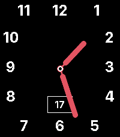</a>

<h2 class="app-name" id="app-4e2b7dc2d4044030b28149c7"><a href="https://apps.repebble.com/4e2b7dc2d4044030b28149c7">Hermit Remix</a></h2>
<a class="app-source" href="https://github.com/AlexisBallo2/pear-hermit-ca-pebble" title="Source code" data-search-exclude>View source</a>

by <a href="https://apps.repebble.com/apps/dev/alexis-ballo_c70905f6b73f09634878474c" title="More from this developer">Alexis Ballo</a>

No licence v1.0.2 Updated 2026-06-17

Runs on: Time 2

Just removed the activity tracking from townmath&#x27;s pear hermit face. https://github.com/townmath/pear-hermit-ca-pebble. All credit to them

<a class="app-shot" href="https://apps.repebble.com/54c6b3c8c5de00257c00006c" data-search-exclude>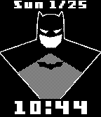</a>

<h2 class="app-name" id="app-54c6b3c8c5de00257c00006c"><a href="https://apps.repebble.com/54c6b3c8c5de00257c00006c">Hero Morph</a></h2>
<a class="app-source" href="https://github.com/mhungerford" title="Source code" data-search-exclude>View source</a>

by <a href="https://apps.repebble.com/apps/dev/matthew-hungerford_52bca741d438930a650001b6" title="More from this developer">Matthew Hungerford</a>

Not checked yet v1.1 Updated 2015-01-26

Runs on: Time 2, Pebble 2 Duo, Pebble 2, Time, Classic

See your favorite superheroes and supervillians morph into each other. Includes: Batman, Superman, Captain America, Wolverine, Iron man, Flash, Spiderman, Magneto, Hulk, Red Skull, Venom, Joker…

<h2 class="app-name" id="app-5878ed5f5de8509ab500099a"><a href="https://apps.rebble.io/en_US/application/5878ed5f5de8509ab500099a">Hex Analog</a></h2>
<a class="app-source" href="https://github.com/alekoz47/hex-analog" title="Source code" data-search-exclude>View source</a>

by <a href="https://apps.rebble.io/en_US/developer/567b3f6337e090549c000075/1" title="More from this developer">alekoz47</a>

GPL-3.0 v1.1 Updated 2017-01-27 Rebble App Store

Runs on: Round 2, Time 2, Time Round, Time

A configurable analog watchface that changes color based on a hexadecimal mapping of the hours and minutes of the day.

<h2 class="app-name" id="app-586dbe32e09e6366150004b5"><a href="https://apps.rebble.io/en_US/application/586dbe32e09e6366150004b5">Hex Color</a></h2>
<a class="app-source" href="https://github.com/alekoz47/hex-color" title="Source code" data-search-exclude>View source</a>

by <a href="https://apps.rebble.io/en_US/developer/567b3f6337e090549c000075/1" title="More from this developer">alekoz47</a>

GPL-3.0 v3.2 Updated 2017-01-09 Rebble App Store

Runs on: Round 2, Time 2, Time Round, Time

A digital watchface that changes color based on a hexadecimal mapping of the hours and minutes of the day.

<h2 class="app-name" id="app-54ed33460e47050022000017"><a href="https://apps.repebble.com/54ed33460e47050022000017">Hex Minutes</a></h2>
<a class="app-source" href="https://github.com/Alexanau/HexTime" title="Source code" data-search-exclude>View source</a>

by <a href="https://apps.repebble.com/apps/dev/austin-alexander_54ecdcc399a35d5cfc0000c9" title="More from this developer">Austin Alexander</a>

No licence v1.0 Updated 2015-02-25

Runs on: Time 2, Pebble 2 Duo, Pebble 2, Time, Classic

Displays the number of minutes in the day in hexadecimal.

<a class="app-shot" href="https://apps.repebble.com/5590679e66735def770000a1" data-search-exclude>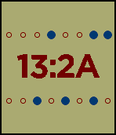</a>

<h2 class="app-name" id="app-5590679e66735def770000a1"><a href="https://apps.repebble.com/5590679e66735def770000a1">Hex Time</a></h2>
<a class="app-source" href="https://github.com/SingingBush/pebble-hextime" title="Source code" data-search-exclude>View source</a>

by <a href="https://apps.repebble.com/apps/dev/singingbush_559006da66735def77000063" title="More from this developer">singingbush</a>

No licence v2.0 Updated 2015-09-20

Runs on: Time 2, Pebble 2 Duo, Pebble 2, Time, Classic

Be an uber geek and read the time in hexadecimal! This 24 hour watchface displays hours and minutes in hex as well as rendering two rows of dots which help by indicating their binary…

<a class="app-shot" href="https://apps.repebble.com/558f03605dfd124c290000de" data-search-exclude>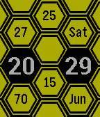</a>

<h2 class="app-name" id="app-558f03605dfd124c290000de"><a href="https://apps.repebble.com/558f03605dfd124c290000de">Hexagons</a></h2>
<a class="app-source" href="https://github.com/minimaxwell/pebble/tree/master/hexagons" title="Source code" data-search-exclude>View source</a>

by <a href="https://apps.repebble.com/apps/dev/maxime-chevallier_54fb0b77c2eca3ff1e000035" title="More from this developer">Maxime Chevallier</a>

Not checked yet v1.0 Updated 2015-06-27

Runs on: Time 2, Time

Display the time and battery status on an hexagonal grid, where colors changes every minute.

<a class="app-shot" href="https://apps.repebble.com/546c09e80b356e51bb000040" data-search-exclude>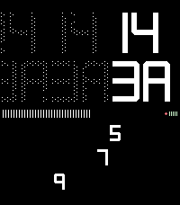</a>

<h2 class="app-name" id="app-546c09e80b356e51bb000040"><a href="https://apps.repebble.com/546c09e80b356e51bb000040">HexaTransit</a></h2>
<a class="app-source" href="https://github.com/maclyn/hexatransit" title="Source code" data-search-exclude>View source</a>

by <a href="https://apps.repebble.com/apps/dev/inipage-software_53a1e088d130a4d1cf000094" title="More from this developer">IniPage Software</a>

Not checked yet v2.0.1 Updated 2026-07-10

Runs on: Time 2, Pebble 2 Duo, Pebble 2, Time, Classic

A watchface with optional hexadecimal time presentation where the numbers move across the screen, leaving ghosts in their wake. Shows the date in hex as well, along with the seconds as lines…

<a class="app-shot" href="https://apps.repebble.com/5556f803ef1c15c24800008c" data-search-exclude>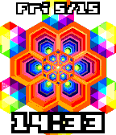</a>

<h2 class="app-name" id="app-5556f803ef1c15c24800008c"><a href="https://apps.repebble.com/5556f803ef1c15c24800008c">Hexeosis Time</a></h2>
<a class="app-source" href="https://github.com/mhungerford" title="Source code" data-search-exclude>View source</a>

by <a href="https://apps.repebble.com/apps/dev/matthew-hungerford_52bca741d438930a650001b6" title="More from this developer">Matthew Hungerford</a>

Not checked yet v1.1 Updated 2015-05-16

Runs on: Time 2, Time

Hexagon kaleidoscope of colors Animation created by hexeosis: http://hexeosis.tumblr.com

<a class="app-shot" href="https://apps.repebble.com/58109489836d3ce74f0001bb" data-search-exclude>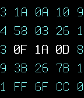</a>

<h2 class="app-name" id="app-58109489836d3ce74f0001bb"><a href="https://apps.repebble.com/58109489836d3ce74f0001bb">hexmatrix</a></h2>
<a class="app-source" href="https://github.com/nullbleed/pebble-hexmatrix" title="Source code" data-search-exclude>View source</a>

by <a href="https://apps.repebble.com/apps/dev/nullbleed_58109415836d3c918d0001c1" title="More from this developer">Nullbleed</a>

Not checked yet v1.2 Updated 2016-10-26

Runs on: Round 2, Time 2, Pebble 2 Duo, Pebble 2, Time Round, Time, Classic

A simple, customizable watchface which displays date, time and battery in its hexadecimal representation. Features: - date (first row) - weekday (second row in the middle in 24h mode, or first…

<a class="app-shot" href="https://apps.repebble.com/55f30234b3b7022bb60000ac" data-search-exclude>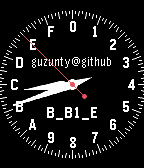</a>

<h2 class="app-name" id="app-55f30234b3b7022bb60000ac"><a href="https://apps.repebble.com/55f30234b3b7022bb60000ac">HexTime</a></h2>
<a class="app-source" href="https://github.com/Guzunty/Pebble.git" title="Source code" data-search-exclude>View source</a>

by <a href="https://apps.repebble.com/apps/dev/campbell_55ba7726d7e075209400007b" title="More from this developer">Campbell</a>

No licence v1.0 Updated 2015-09-11

Runs on: Time 2, Pebble 2 Duo, Pebble 2, Time, Classic

Hextime is a new way to tell the time. It divides the day into 16 hex hours, not 24. There are 256 hex minutes in a hex hour and 16 hex seconds in a hex minute. A hex hour is 1.5 normal hours, so…

<h2 class="app-name" id="app-55c636c96b4abea10400000d"><a href="https://apps.repebble.com/55c636c96b4abea10400000d">hextime</a></h2>
<a class="app-source" href="https://github.com/mcandre/pebble-hextime" title="Source code" data-search-exclude>View source</a>

by <a href="https://apps.repebble.com/apps/dev/yellosoft_55c565693948b6a0df00004c" title="More from this developer">YelloSoft</a>

Not checked yet v1.1 Updated 2015-08-08

Runs on: Time 2, Pebble 2 Duo, Pebble 2, Time, Classic

The current time, formatted as hexadecimal digits Source: https://github.com/mcandre/pebble-hextime

<a class="app-shot" href="https://apps.repebble.com/5334b6e1a5a8451ea24534d4" data-search-exclude>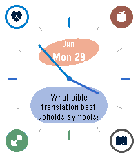</a>

<h2 class="app-name" id="app-5334b6e1a5a8451ea24534d4"><a href="https://apps.repebble.com/5334b6e1a5a8451ea24534d4">Hey Calendar</a></h2>
<a class="app-source" href="https://github.com/tuortheblessed/pebble-watchfaces" title="Source code" data-search-exclude>View source</a>

by <a href="https://apps.repebble.com/apps/dev/kyle_1182399db3efa5360c7687b1" title="More from this developer">Kyle</a>

Not checked yet v1.0.9 Updated 2026-06-30

Runs on: Time 2

Hey habits, todos, and calendar on your Pebble Time 2. Need to get an auth key from your Hey account via a computer terminal. Instructions in the watchface settings.

<a class="app-shot" href="https://apps.repebble.com/58a52d200dfc320dc6000330" data-search-exclude>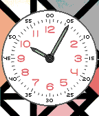</a>

<h2 class="app-name" id="app-58a52d200dfc320dc6000330"><a href="https://apps.repebble.com/58a52d200dfc320dc6000330">HfG-MaX</a></h2>
<a class="app-source" href="https://github.com/GreenHex/Pebble.HfG.MaX" title="Source code" data-search-exclude>View source</a>

by <a href="https://apps.repebble.com/apps/dev/the-resetter_5415133bbcd1cf9264000081" title="More from this developer">The Resetter</a>

No licence v1.2 Updated 2017-02-17

Runs on: Time 2, Time

A Max Bill tribute watchface.

<h2 class="app-name" id="app-1964d553c3b347d99040ca2a"><a href="https://apps.repebble.com/1964d553c3b347d99040ca2a">Hidden in Perspective</a></h2>
<a class="app-source" href="https://github.com/marukitano/Hidden_in_Perspective" title="Source code" data-search-exclude>View source</a>

by <a href="https://apps.repebble.com/apps/dev/marukitano_ff2831479c1011a82df1985d" title="More from this developer">marukitano</a>

Not checked yet v1.1.0 Updated 2026-07-29

Runs on: Time 2

Deutsch Perspective verwandelt deine Pebble Time 2 in ein kleines 3D-Display am Handgelenk. Die Uhrzeit besteht aus einer schwebenden Punktwolke, die sich mithilfe des Beschleunigungssensors…

<a class="app-shot" href="https://apps.rebble.io/en_US/application/59c65f1d0dfc321335001f78" data-search-exclude>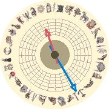</a>

<h2 class="app-name" id="app-59c65f1d0dfc321335001f78"><a href="https://apps.rebble.io/en_US/application/59c65f1d0dfc321335001f78">Hieroglyph</a></h2>
<a class="app-source" href="https://github.com/mereed/pebbleface-hieroglyph" title="Source code" data-search-exclude>View source</a>

by <a href="https://apps.rebble.io/en_US/developer/52d76309bd61272345000001/1" title="More from this developer">chops</a>

Not checked yet v1.0 Updated 2017-09-23 Rebble App Store

Runs on: Round 2, Time Round

PTR watchface only - via a reddit request from RESPEKTOR Change hand colours Change style - hieroglyphs only, with main numbers (roman numerals), or star signs.

<a class="app-shot" href="https://apps.repebble.com/56ed6ab21644b39a7700000f" data-search-exclude>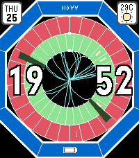</a>

<h2 class="app-name" id="app-56ed6ab21644b39a7700000f"><a href="https://apps.repebble.com/56ed6ab21644b39a7700000f">Higgs O&#x27;clock</a></h2>
<a class="app-source" href="https://github.com/timboe/ATLASWatch" title="Source code" data-search-exclude>View source</a>

by <a href="https://apps.repebble.com/apps/dev/tim-martin_552d83aa083523c826000080" title="More from this developer">Tim Martin</a>

Not checked yet v2.0.0 Updated 2026-06-27

Runs on: Round 2, Time 2, Pebble 2 Duo, Pebble 2, Time Round, Time, Classic

Higgs O&#x27;Clock simulates the decay of a new Higgs boson every minute and renders how the Higgs decay would appear in the ATLAS Detector, one of the four experiments on the Large Hadron Collider in…

<a class="app-shot" href="https://apps.repebble.com/5567c6b63c5595f7c4000095" data-search-exclude>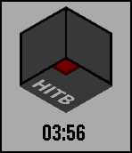</a>

<h2 class="app-name" id="app-5567c6b63c5595f7c4000095"><a href="https://apps.repebble.com/5567c6b63c5595f7c4000095">HITB</a></h2>
<a class="app-source" href="http://www.github.com/codemonkey9000/HITB" title="Source code" data-search-exclude>View source</a>

by <a href="https://apps.repebble.com/apps/dev/rishie_537ff1f561e8e220bb000006" title="More from this developer">Rishie</a>

No licence v1.1 Updated 2015-12-17

Runs on: Round 2, Time 2, Pebble 2 Duo, Pebble 2, Time Round, Time, Classic

Watchface made for the awesome folks at Hack in the Box.

<a class="app-shot" href="https://apps.repebble.com/6a87e21fbddf479bb8c14db9" data-search-exclude>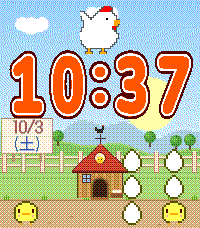</a>

<h2 class="app-name" id="app-6a87e21fbddf479bb8c14db9"><a href="https://apps.repebble.com/6a87e21fbddf479bb8c14db9">HIYOKO</a></h2>
<a class="app-source" href="https://github.com/fumi6625/pebble-face-HIYOKO" title="Source code" data-search-exclude>View source</a>

by <a href="https://apps.repebble.com/apps/dev/zefuru_6190e1008e31f0a6d6aba7af" title="More from this developer">zefuru</a>

Not checked yet v2.0.0 Updated 2026-10-03

Runs on: Time 2

This is a cute chick watch face that I designed with my daughter. It&#x27;s so cute.

<a class="app-shot" href="https://apps.repebble.com/5a04bbf40dfc323bd0002ff5" data-search-exclude>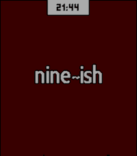</a>

<h2 class="app-name" id="app-5a04bbf40dfc323bd0002ff5"><a href="https://apps.repebble.com/5a04bbf40dfc323bd0002ff5">Hobbit Neue</a></h2>
<a class="app-source" href="https://github.com/Quistnix/Hobbit_Neue_Open" title="Source code" data-search-exclude>View source</a>

by <a href="https://apps.repebble.com/apps/dev/brain-in-a-bowl_56fa41f03f944de56b000023" title="More from this developer">Brain in a Bowl</a>

No licence v1.0 Updated 2017-11-09

Runs on: Round 2, Time 2, Pebble 2 Duo, Pebble 2, Time Round, Time, Classic

I loved the Hobbit Time watchface by Keelan C, but I needed to see the actual Human time as well. So I made this new version with his permission.

<h2 class="app-name" id="app-529ebd1ed7894b5946000028"><a href="https://apps.repebble.com/529ebd1ed7894b5946000028">Hobbit Time</a></h2>
<a class="app-source" href="https://github.com/keelanc/hobbit_time" title="Source code" data-search-exclude>View source</a>

by <a href="https://apps.repebble.com/apps/dev/keelan-c_529eb0fc1a66380531000038" title="More from this developer">Keelan C</a>

Not checked yet v1.0.3 Updated 2014-01-24

Runs on: Time 2, Pebble 2 Duo, Pebble 2, Time, Classic

I&#x27;d like to think hobbits tell time by the grumbling in their tummies. Starting at 5am (and &#x27;sleep&#x27; otherwise): almost breakfast, breakfast, seven-ish, almost second breakfast, second breakfast…

<a class="app-shot" href="https://apps.repebble.com/ca091b35fa40489e82b498c2" data-search-exclude>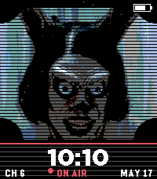</a>

<h2 class="app-name" id="app-ca091b35fa40489e82b498c2"><a href="https://apps.repebble.com/ca091b35fa40489e82b498c2">Hokum Fan Art</a></h2>
<a class="app-source" href="https://github.com/coredevices/pebble-watchface-agent-skill" title="Source code" data-search-exclude>View source</a>

by <a href="https://apps.repebble.com/apps/dev/aircodum_67bc77bf37d408000a74f7d3" title="More from this developer">AirCodum</a>

Not checked yet v1.0.1 Updated 2026-05-17

Runs on: Time 2

Vintage horror watchface — a creepy TV station ID with a sinister donkey mascot host, CRT scanlines, and ON AIR badge. Fan art inspired by the 2026 folk-horror film Hokum.

<a class="app-shot" href="https://apps.repebble.com/67a908217cb65800093e3c06" data-search-exclude>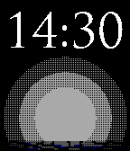</a>

<h2 class="app-name" id="app-67a908217cb65800093e3c06"><a href="https://apps.repebble.com/67a908217cb65800093e3c06">Hollow Knight</a></h2>
<a class="app-source" href="https://github.com/HarrisonAllen/pebble-hollow-knight-watchface" title="Source code" data-search-exclude>View source</a>

by <a href="https://apps.repebble.com/apps/dev/harrison-allen_5e28ea923dd3109f151c7e08" title="More from this developer">Harrison Allen</a>

No licence v1.0 Updated 2025-02-09

Runs on: Round 2, Time 2, Pebble 2 Duo, Pebble 2, Time Round, Time, Classic

Hollow Knight came out after Pebble met it&#x27;s end, so it never made an appearance on any watches... Until now. This simple watchface features a startup animation of the knight. Made using some…

<h2 class="app-name" id="app-67c5f245b7a02300092ba0b2"><a href="https://apps.repebble.com/67c5f245b7a02300092ba0b2">Hollywatch</a></h2>
<a class="app-source" href="https://github.com/C-D-Lewis/pebble-dev" title="Source code" data-search-exclude>View source</a>

by <a href="https://apps.repebble.com/apps/dev/chris-lewis_5299cd30e627ce1147000099" title="More from this developer">Chris Lewis</a>

No licence v1.1.0 Updated 2026-05-02

Runs on: Round 2, Time 2, Pebble 2 Duo, Pebble 2, Time Round, Time, Classic

Alright dudes? Timeless Holly in wrist-watch format is realised using 21st Century technology - way ahead of the futuristic original! Port of the Fitbit watchface of the same name.

<a class="app-shot" href="https://apps.repebble.com/576b22ab8d13726e0400004c" data-search-exclude>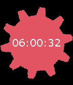</a>

<h2 class="app-name" id="app-576b22ab8d13726e0400004c"><a href="https://apps.repebble.com/576b22ab8d13726e0400004c">Homestuck Time</a></h2>
<a class="app-source" href="https://github.com/wendelscardua/pebble-hs-watch" title="Source code" data-search-exclude>View source</a>

by <a href="https://apps.repebble.com/apps/dev/wendel-scardua_531c2e602ef7d321e8000123" title="More from this developer">Wendel Scardua</a>

Not checked yet v1.2 Updated 2016-06-25

Runs on: Round 2, Time 2, Pebble 2 Duo, Pebble 2, Time Round, Time, Classic

Watchface based on Homestuck, more exactly the Time aspect as seen on &quot;[S] Wake&quot;

<h2 class="app-name" id="app-57b71f91bb85eddc98000883"><a href="https://apps.repebble.com/57b71f91bb85eddc98000883">Homestuck Watch of Time</a></h2>
<a class="app-source" href="https://github.com/gtg287y/GearWatch" title="Source code" data-search-exclude>View source</a>

by <a href="https://apps.repebble.com/apps/dev/jadedresearcher_531a60db2559afabd800088a" title="More from this developer">jadedResearcher</a>

Not checked yet v1.3 Updated 2016-10-04

Runs on: Round 2, Time 2, Time Round, Time

Homestuck Time Gear flashes and rotates once a second, on a dark red background. Time and date displayed using Dave Strider&#x27;s handwriting font, found here…

<h2 class="app-name" id="app-68a8eb5e2dfa4d0009a22820"><a href="https://apps.rebble.io/en_US/application/68a8eb5e2dfa4d0009a22820">Honda</a></h2>
<a class="app-source" href="https://github.com/random360-pebble/Honda" title="Source code" data-search-exclude>View source</a>

by <a href="https://apps.rebble.io/en_US/developer/682a9387fcffa4000710b5e2/1" title="More from this developer">random360-pebble</a>

Not checked yet v1.0 Updated 2025-08-22 Rebble App Store

Runs on: Time 2, Time

A simple Honda watchface

<h2 class="app-name" id="app-680b986073e45d0008e1074b"><a href="https://apps.repebble.com/680b986073e45d0008e1074b">Honey Comb</a></h2>
<a class="app-source" href="https://github.com/justinjhendrick/honey-comb-pebble-watchface" title="Source code" data-search-exclude>View source</a>

by <a href="https://apps.repebble.com/apps/dev/justinjhendrick_67f68b8a23b7a90009c87db5" title="More from this developer">justinjhendrick</a>

Not checked yet v1.2.0 Updated 2026-06-27

Runs on: Round 2, Time 2, Pebble 2 Duo, Pebble 2, Time Round, Time, Classic

A watchface with tessellating hexagons. The top left hexagon shows an analog hour dial. The bottom center hexagon shows a minute dial. The top right hexagon highlights the day of the week. On…

<h2 class="app-name" id="app-54310cabf1565e72f30000fc"><a href="https://apps.repebble.com/54310cabf1565e72f30000fc">Hong Kong Watchface</a></h2>
<a class="app-source" href="https://github.com/lvx3/hkface" title="Source code" data-search-exclude>View source</a>

by <a href="https://apps.repebble.com/apps/dev/lee-turner_53058c84b704cb5227000071" title="More from this developer">Lee Turner</a>

Not checked yet v1.1 Updated 2014-10-05

Runs on: Time 2, Pebble 2 Duo, Pebble 2, Time, Classic

Displays current weather warning, current air quality, current temperature for Hong Kong. Leave suggestions or bug reports in the source link! :-) I hope you find this watch face useful

<h2 class="app-name" id="app-52f1dd46e21be48688000ffb"><a href="https://apps.repebble.com/52f1dd46e21be48688000ffb">Hooves</a></h2>
<a class="app-source" href="https://github.com/nfearnley/Hooves" title="Source code" data-search-exclude>View source</a>

by <a href="https://apps.repebble.com/apps/dev/nathan-fearnley_52c5f95e9a92722dea000018" title="More from this developer">Nathan Fearnley</a>

Not checked yet v1.0.0 Updated 2014-02-05

Runs on: Time 2, Pebble 2 Duo, Pebble 2, Time, Classic

Pony-themed Pebble Watchface with custom watch hands The foreground hoof with the wrist watch is the hour hand The background hoof is the minute hand Thank you very much to Scott Beaudry…

<h2 class="app-name" id="app-52f2c9ddab54ff806f000088"><a href="https://apps.repebble.com/52f2c9ddab54ff806f000088">Hop Picker Watch</a></h2>
<a class="app-source" href="https://github.com/gregoiresage/hop-picker" title="Source code" data-search-exclude>View source</a>

by <a href="https://apps.repebble.com/apps/dev/gr-goire-sage_52b216cf05c04653a9000080" title="More from this developer">Grégoire Sage</a>

Not checked yet v3.16 Updated 2016-07-04

Runs on: Round 2, Time 2, Pebble 2 Duo, Pebble 2, Time Round, Time, Classic

Configurable watchface based on the concept of the designer Hop Picker Battery grade : A

<h2 class="app-name" id="app-e4c9a34638084e30a7e6fbac"><a href="https://apps.repebble.com/e4c9a34638084e30a7e6fbac">HoraAmbEstil</a></h2>
<a class="app-source" href="https://github.com/harpowned/TimeStylePebble" title="Source code" data-search-exclude>View source</a>

by <a href="https://apps.repebble.com/apps/dev/harpowned_0f798d5c75c6fd85aaeec666" title="More from this developer">Harpowned</a>

Not checked yet v7.11.0 Updated 2026-06-05

Runs on: Time 2

This is a fork of the TimeStyle Pebble Watchface, with a twist. The time is displayed in text, in catalan, instead of in numbers. The rest of the original features of the TimeStyle watchface are…

<h2 class="app-name" id="app-5616d36a6ddd7fea8800001f"><a href="https://apps.repebble.com/5616d36a6ddd7fea8800001f">Horizon</a></h2>
<a class="app-source" href="https://github.com/jrmobley/horizon-watchface" title="Source code" data-search-exclude>View source</a>

by <a href="https://apps.repebble.com/apps/dev/jr-mobley_532746324735a9341d000142" title="More from this developer">JR Mobley</a>

Not checked yet v2.0 Updated 2025-11-22

Runs on: Round 2, Time 2, Pebble 2 Duo, Pebble 2, Time Round, Time, Classic

That bit around the outside is a 24 hour dial that shows the position of the sun and the horizon line. It uses location services and the power of maths to adjust the horizon and solar noon angle…

<h2 class="app-name" id="app-ab47d1d5bb7d4ef0ba968d1d"><a href="https://apps.repebble.com/ab47d1d5bb7d4ef0ba968d1d">Horizon Forbidden West Machines</a></h2>
<a class="app-source" href="https://github.com/shoepaladin/kiwi-cup/tree/main/pebble/hzd-machines-wf" title="Source code" data-search-exclude>View source</a>

by <a href="https://apps.repebble.com/apps/dev/sapphire-second-hand_527b6cf8aa4310a44fe95d9d" title="More from this developer">Sapphire Second-Hand</a>

Not checked yet v1.1.5 Updated 2026-06-10

Runs on: Time 2, Pebble 2 Duo, Pebble 2, Time

Track the time, your steps, and battery with a machine from Horizon Forbidden West. The arrow grows as you take more steps, and the circles track battery. When Bluetooth disconnects, the colors…

<h2 class="app-name" id="app-0256c72e7ee746eb900679e7"><a href="https://apps.repebble.com/0256c72e7ee746eb900679e7">Horizons</a></h2>
<a class="app-source" href="https://pebble-site-ivory.vercel.app/index.html" title="Source code" data-search-exclude>View source</a>

by <a href="https://apps.repebble.com/apps/dev/timectrl_cbfbe38addd006b1222c5679" title="More from this developer">TimeCtrl</a>

Not checked yet v2.0 Updated 2026-04-26

Runs on: Round 2

A living mountain landscape that moves with the sun. Horizons turns your watch into a small window onto a changing landscape. Eight sky phases blend through the day with colour bands driven by the…

<h2 class="app-name" id="app-534921cc4586aa3484000241"><a href="https://apps.repebble.com/534921cc4586aa3484000241">Horlogo_d</a></h2>
<a class="app-source" href="https://github.com/ShaBP/Horlogo_d" title="Source code" data-search-exclude>View source</a>

by <a href="https://apps.repebble.com/apps/dev/shabp_52f018d9bb3423921000022d" title="More from this developer">ShaBP</a>

No licence v1.2.0 Updated 2014-04-13

Runs on: Time 2, Pebble 2 Duo, Pebble 2, Time, Classic

Esperanto version of the Text Watch. Based on: http://github.com/dearmash/PebbleTextWatchWithDate (My contribution is simple text translation from English to Esperanto) Ver 1.1.0 now with battery…

<h2 class="app-name" id="app-534b156a160bccb12800005a"><a href="https://apps.repebble.com/534b156a160bccb12800005a">Horlogo_d_w</a></h2>
<a class="app-source" href="https://github.com/ShaBP/Horlogo_d" title="Source code" data-search-exclude>View source</a>

by <a href="https://apps.repebble.com/apps/dev/shabp_52f018d9bb3423921000022d" title="More from this developer">ShaBP</a>

No licence v1.5.0 Updated 2014-04-13

Runs on: Time 2, Pebble 2 Duo, Pebble 2, Time, Classic

Esperanto version of the Text Watch, this one includes week number. Install this version if you&#x27;re a big corporate guy, who can&#x27;t forget what week of the year it is ;-) Other than that, same as…

<h2 class="app-name" id="app-874b3b2258ba42e688d42a6f"><a href="https://apps.repebble.com/874b3b2258ba42e688d42a6f">Hornet Watchface</a></h2>
<a class="app-source" href="https://github.com/emzpetros/HornetWatchface" title="Source code" data-search-exclude>View source</a>

by <a href="https://apps.repebble.com/apps/dev/emzpetros_f1f286753f1ef46928441f37" title="More from this developer">emzpetros</a>

Not checked yet v1.0 Updated 2026-04-05

Runs on: Round 2, Time 2, Pebble 2 Duo, Pebble 2, Time Round, Time, Classic

A Hollow Knight Silksong themed watchface featuring Hornet!

<h2 class="app-name" id="app-560bfdaf4bf0ac562000007d"><a href="https://apps.repebble.com/560bfdaf4bf0ac562000007d">Hot Dog Stand</a></h2>
<a class="app-source" href="https://github.com/jcs/pebble-hotdogstand" title="Source code" data-search-exclude>View source</a>

by <a href="https://apps.repebble.com/apps/dev/superblock_52f07759bb34233437001b7b" title="More from this developer">Superblock</a>

Not checked yet v1.5 Updated 2016-09-08

Runs on: Time 2, Pebble 2 Duo, Pebble 2, Time, Classic

An ode to the Windows 3.1 Hot Dog Stand theme.

<h2 class="app-name" id="app-581dfc519cbbaf5d820001cb"><a href="https://apps.repebble.com/581dfc519cbbaf5d820001cb">Hotline Miami Face</a></h2>
<a class="app-source" href="https://github.com/Averso/HotlineMiamiFace" title="Source code" data-search-exclude>View source</a>

by <a href="https://apps.repebble.com/apps/dev/averso_5812f6ad46041fb22f00005e" title="More from this developer">Averso</a>

No licence v1.6 Updated 2017-01-01

Runs on: Round 2, Time 2, Time Round, Time

Watchface based on Hotline Miami logo. Features: - Hiding base image background to set your own color - Two positions of clock - Show/hide date - Two date fonts - Color selector for date Fonts…

<h2 class="app-name" id="app-54fb4eebc2eca3c65900007b"><a href="https://apps.repebble.com/54fb4eebc2eca3c65900007b">Hourglass</a></h2>
<a class="app-source" href="https://github.com/TFL1337/Pebble_HourGlass" title="Source code" data-search-exclude>View source</a>

by <a href="https://apps.repebble.com/apps/dev/tfl_54ddc6e8a08a1486b1000074" title="More from this developer">TFL</a>

No licence v1.2 Updated 2015-07-29

Runs on: Time 2, Pebble 2 Duo, Pebble 2, Time, Classic

A nice watchface with an animated hourglass. It takes 10 minutes until the sand run through. The watchface looks like an old school soft computing simulation - similar to cellular automata or…

<h2 class="app-name" id="app-52b8925a9efe58d51c000046"><a href="https://apps.repebble.com/52b8925a9efe58d51c000046">Hourglass</a></h2>
<a class="app-source" href="http://hg.subforge.org/hourglass/" title="Source code" data-search-exclude>View source</a>

by <a href="https://apps.repebble.com/apps/dev/unexist_52b88eac9efe5857ed000041" title="More from this developer">unexist</a>

See source v1.2 Updated 2014-09-09

Runs on: Time 2, Pebble 2 Duo, Pebble 2, Time, Classic

This watchface just displays the outline of a custom font and fills it according to the current time - like a real hourglass. The three horizontal lines are dividers for quarter hours. Currently…

<h2 class="app-name" id="app-552900c3a4a25023f2000004"><a href="https://apps.repebble.com/552900c3a4a25023f2000004">Hourly forecast</a></h2>
<a class="app-source" href="https://github.com/billypchan/PebbleHourlyForecast" title="Source code" data-search-exclude>View source</a>

by <a href="https://apps.repebble.com/apps/dev/bill-chan_5506da34ed4085c4ab00000b" title="More from this developer">Bill Chan</a>

No licence v1.7 Updated 2015-04-28

Runs on: Time 2, Pebble 2 Duo, Pebble 2, Time, Classic

Hourly forecast is a watch face designed for daylong outdoor activities like Randonneuring! Features: Features: -Shows temperatures, conditions, wind speeds and directions in coming 6 hours…

<h2 class="app-name" id="app-5554ae1c96efc642cb000029"><a href="https://apps.repebble.com/5554ae1c96efc642cb000029">Hourly forecast 2</a></h2>
<a class="app-source" href="https://github.com/billypchan/PebbleHourlyForecast" title="Source code" data-search-exclude>View source</a>

by <a href="https://apps.repebble.com/apps/dev/bill-chan_5506da34ed4085c4ab00000b" title="More from this developer">Bill Chan</a>

No licence v2.92 Updated 2015-06-01

Runs on: Time 2, Pebble 2 Duo, Pebble 2, Time, Classic

Hourly forecast 2 is a UI remix from Hourly forecast! It is designed for daylong outdoor activities like Randonneuring! Features: -Shows temperatures, conditions, wind speeds and directions in…

<h2 class="app-name" id="app-5572e9367d6f3d9ad1000037"><a href="https://apps.repebble.com/5572e9367d6f3d9ad1000037">Hourly forecast 3</a></h2>
<a class="app-source" href="https://github.com/billypchan/PebbleHourlyForecast" title="Source code" data-search-exclude>View source</a>

by <a href="https://apps.repebble.com/apps/dev/bill-chan_5506da34ed4085c4ab00000b" title="More from this developer">Bill Chan</a>

No licence v3.106 Updated 2016-03-20

Runs on: Time 2, Pebble 2 Duo, Pebble 2, Time, Classic

Hourly forecast is a watch face designed for daylong outdoor activities like Randonneuring! Features: -Shows temperatures, conditions, wind speeds and directions in coming 6 hours. -Moon phrase…

<h2 class="app-name" id="app-555a16fbb038d475ea0000de"><a href="https://apps.repebble.com/555a16fbb038d475ea0000de">HourWindow</a></h2>
<a class="app-source" href="https://github.com/joravasal/HourWindowWF" title="Source code" data-search-exclude>View source</a>

by <a href="https://apps.repebble.com/apps/dev/joravasal_54f9046252794e6bd900009b" title="More from this developer">joravasal</a>

Not checked yet v1.4 Updated 2015-07-11

Runs on: Time 2, Pebble 2 Duo, Pebble 2, Time, Classic

A minimalistic analog watchface that will show only the actual hour and the minute hand. It can be fully customized, the options include: · Bluetooth status, it can be shown with an icon or by…

<h2 class="app-name" id="app-58f035360dfc32fe60001155"><a href="https://apps.rebble.io/en_US/application/58f035360dfc32fe60001155">HP 50g</a></h2>
<a class="app-source" href="http://github.com/FSXAC/Pebble50G" title="Source code" data-search-exclude>View source</a>

by <a href="https://apps.rebble.io/en_US/developer/558d95caead98907ea0000be/1" title="More from this developer">Muchen</a>

No licence v1.0 Updated 2017-04-14 Rebble App Store

Runs on: Time 2, Pebble 2 Duo, Pebble 2

Watchface that is inspired by HP 50G&#x27;s interface. Features authentic fonts and stack view.

<h2 class="app-name" id="app-55d5a3202ce83ce1e4000062"><a href="https://apps.repebble.com/55d5a3202ce83ce1e4000062">HPSTR</a></h2>
<a class="app-source" href="https://github.com/ElectronicsGeek/HPSTR" title="Source code" data-search-exclude>View source</a>

by <a href="https://apps.repebble.com/apps/dev/electronicsgeek_544012f9fd75f30c78000007" title="More from this developer">ElectronicsGeek</a>

MIT v2.0 Updated 2015-08-28

Runs on: Time 2, Pebble 2 Duo, Pebble 2, Time, Classic

Pebble watchface of distinction with ironic hipster imagery. NOW ON PEBBLE TIME! If you enjoy using this watchface as much as I did making it, please give it a like! FEATURES: - Displays the time…

<h2 class="app-name" id="app-696003739ce1960009022c70"><a href="https://apps.repebble.com/696003739ce1960009022c70">HRTminder</a></h2>
<a class="app-source" href="https://github.com/MayaTelLabs/HRTminder" title="Source code" data-search-exclude>View source</a>

by <a href="https://apps.repebble.com/apps/dev/mayatel-labs_690a8ca2694cb800081c65dd" title="More from this developer">MayaTel Labs</a>

No licence v1.3 Updated 2026-01-13

Runs on: Round 2, Time 2, Pebble 2 Duo, Pebble 2, Time Round, Time, Classic

HRTminder is a customizable watchface that is designed to be the answer to the most common pitfall of being a transgender person - the question of &quot;ah, shoot, when was the last time I took my…

<h2 class="app-name" id="app-555df17c4c222225560000a9"><a href="https://apps.repebble.com/555df17c4c222225560000a9">HTC Sense 6.3</a></h2>
<a class="app-source" href="https://github.com/PanicMan/Pebble-HTC-Sense-6.3" title="Source code" data-search-exclude>View source</a>

by <a href="https://apps.repebble.com/apps/dev/jack-t_52ea054f156ab45eae00000f" title="More from this developer">Jack T.</a>

No licence v1.14 Updated 2016-09-26

Runs on: Time 2, Time

Like HTC Sense on my old HTC Sensation. Miss it... :( Fully customizable, with Weather and forecast for 5 days on shake. An special city or auto location for weather. Automatic language for en…

<h2 class="app-name" id="app-55b6759e1ad0f44f2d000070"><a href="https://apps.repebble.com/55b6759e1ad0f44f2d000070">HTML5 Time</a></h2>
<a class="app-source" href="https://github.com/ireade/html5-time" title="Source code" data-search-exclude>View source</a>

by <a href="https://apps.repebble.com/apps/dev/ire_55b4a9558fde01307d00002e" title="More from this developer">Ire</a>

Not checked yet v1.0 Updated 2015-07-27

Runs on: Time 2, Pebble 2 Duo, Pebble 2, Time, Classic

A watchface inspired by HTML5

<h2 class="app-name" id="app-21e81244431f4889a7211035"><a href="https://apps.repebble.com/21e81244431f4889a7211035">hugenumbers</a></h2>
<a class="app-source" href="https://github.com/designerferro/hugenumbers" title="Source code" data-search-exclude>View source</a>

by <a href="https://apps.repebble.com/apps/dev/designerferro_53c71908165754dfa700004b" title="More from this developer">designerferro</a>

Not checked yet v1.0.4 Updated 2026-10-05

Runs on: Round 2, Time 2, Pebble 2 Duo, Pebble 2, Time Round, Time, Classic

A Flux-inspired Pebble watchface with oversized, independently deformed HH/MM numerals and a rising seconds colour field. This is an original implementation using open-source fonts, not Apple&#x27;s…

<h2 class="app-name" id="app-5551aaf4cf532cacf50000e4"><a href="https://apps.repebble.com/5551aaf4cf532cacf50000e4">Humble World Map</a></h2>
<a class="app-source" href="https://github.com/clemshubs/WorldMapWatchFace" title="Source code" data-search-exclude>View source</a>

by <a href="https://apps.repebble.com/apps/dev/cha_5501cf747ed24ab4f200005f" title="More from this developer">CHA</a>

Not checked yet v1.07 Updated 2016-01-29

Runs on: Round 2, Time 2, Pebble 2 Duo, Pebble 2, Time Round, Time, Classic

This watchface shows your position in realtime on the Earth. More to come : Night map, Real stars positions, Clouds maybe, Whatever you suggest and I can put in it !

<h2 class="app-name" id="app-549cc14214355efa5d00006c"><a href="https://apps.repebble.com/549cc14214355efa5d00006c">HungarianText</a></h2>
<a class="app-source" href="https://github.com/aattila/PebbleHunText" title="Source code" data-search-exclude>View source</a>

by <a href="https://apps.repebble.com/apps/dev/attila-antal_54731e10a3ce2ff2b4000056" title="More from this developer">Attila Antal</a>

No licence v1.0 Updated 2014-12-26

Runs on: Time 2, Pebble 2 Duo, Pebble 2, Time, Classic

This is a complete text format implementation in Hungarian.

<h2 class="app-name" id="app-69b5bf5df7b0f40009c93e68"><a href="https://apps.rebble.io/en_US/application/69b5bf5df7b0f40009c93e68">Hybrid</a></h2>
<a class="app-source" href="https://github.com/astosia/Hybrid" title="Source code" data-search-exclude>View source</a>

by <a href="https://apps.rebble.io/en_US/developer/58a635d30dfc320dc60003b4/1" title="More from this developer">astosia</a>

MIT v2.0 Updated 2026-03-22 Rebble App Store

Runs on: Round 2, Time 2, Pebble 2 Duo, Pebble 2, Time Round, Time, Classic

Hybrid watchface showing both analogue and digital time Features: - Change style from round to rectangular (not on round watches) - Fully configurable colours, with several presets - Vibe and icon…

<h2 class="app-name" id="app-5e463ef63dd31016ad6b17af"><a href="https://apps.rebble.io/en_US/application/5e463ef63dd31016ad6b17af">Hybrid</a></h2>
<a class="app-source" href="https://github.com/NgNority/Hybrid" title="Source code" data-search-exclude>View source</a>

by <a href="https://apps.rebble.io/en_US/developer/5e463ef53dd31016ad6b17ad/1" title="More from this developer">NgNority</a>

No licence v1.3 Updated 2020-02-22 Rebble App Store

Runs on: Round 2, Time 2, Pebble 2 Duo, Pebble 2, Time Round, Time, Classic

Minimalistic watch face made for the Pebble time(and steel), pebble time round, Pebble 2. Features: Minimalistic design Shows Date Has analog and digital built in Easy to read Has weather updates…

<h2 class="app-name" id="app-55601d34f372a071d800004d"><a href="https://apps.repebble.com/55601d34f372a071d800004d">Hybrid 12/60 white</a></h2>
<a class="app-source" href="https://cloudpebble.net/ide/project/188382#" title="Source code" data-search-exclude>View source</a>

by <a href="https://apps.repebble.com/apps/dev/sironeko_5555d62f44dad66e52000098" title="More from this developer">Sironeko</a>

See source v1.0 Updated 2015-05-23

Runs on: Time 2, Pebble 2 Duo, Pebble 2, Time, Classic

Easy to see analog clock with digital time, white background

<h2 class="app-name" id="app-4e657ee63bad434faffca284"><a href="https://apps.repebble.com/4e657ee63bad434faffca284">Hybrid Minimal</a></h2>
<a class="app-source" href="https://github.com/rafaelc007/hybrid-minimal" title="Source code" data-search-exclude>View source</a>

by <a href="https://apps.repebble.com/apps/dev/rafael-pereira_dd633264db7cf077fb225583" title="More from this developer">Rafael Pereira</a>

Not checked yet v1.1.5 Updated 2026-06-09

Runs on: Round 2, Time 2, Pebble 2 Duo, Pebble 2, Time Round, Time, Classic

Minimalistic Hybrid watchface. Numbers change color to change the currenet hour and progress bar shows current minutes.

<h2 class="app-name" id="app-5006a236677b4457a6f76364"><a href="https://apps.repebble.com/5006a236677b4457a6f76364">Hybrid Weather</a></h2>
<a class="app-source" href="https://github.com/astosia/Hybrid" title="Source code" data-search-exclude>View source</a>

by <a href="https://apps.repebble.com/apps/dev/astosia_58a635d30dfc320dc60003b4" title="More from this developer">astosia</a>

MIT v4.0.0 Updated 2026-10-05

Runs on: Round 2, Time 2, Pebble 2 Duo, Pebble 2, Time Round, Time, Classic

Hybrid watchface showing both analogue &amp; digital time and Weather Features: - Tap (and tap again) to see weather, with loads of info from Open-Meteo (no API key required) or OpenWeatherMap (API…

<h2 class="app-name" id="app-54b9a46242ea1d044d0000b4"><a href="https://apps.repebble.com/54b9a46242ea1d044d0000b4">Hypno</a></h2>
<a class="app-source" href="https://github.com/orviwan/HypnoAnim" title="Source code" data-search-exclude>View source</a>

by <a href="https://apps.repebble.com/apps/dev/orviwan_5299c96ae627ce3692000095" title="More from this developer">orviwan</a>

Not checked yet v1.0 Updated 2015-01-16

Runs on: Time 2, Pebble 2 Duo, Pebble 2, Time, Classic

Animated hypnotic digits. Thanks to Edwin Finch [http://edwinfinch.com]

<h2 class="app-name" id="app-5301e0799810e0a8940003dc"><a href="https://apps.repebble.com/5301e0799810e0a8940003dc">HypnoDots</a></h2>
<a class="app-source" href="https://github.com/Rillus/hypnodots" title="Source code" data-search-exclude>View source</a>

by <a href="https://apps.repebble.com/apps/dev/ding-digital_52f4c3bb54a41afa08000677" title="More from this developer">Ding Digital</a>

No licence v1.0.0 Updated 2014-02-17

Runs on: Time 2, Pebble 2 Duo, Pebble 2, Time, Classic

Watch as a stream of dots cascade down your Pebble and take on hypnotic patterns in response to every passing second.

