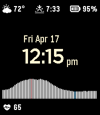

<!-- Generated by scripts/update_app_directory.py: do not edit by hand -->
# Watchfaces: H

[← About this list](../watchfaces.md) · [A](a.md) · [B](b.md) · [C](c.md) · [D](d.md) · [E](e.md) · [F](f.md) · [G](g.md) · **H** · [I](i.md) · [J](j.md) · [K](k.md) · [L](l.md) · [M](m.md) · [N](n.md) · [O](o.md) · [P](p.md) · [Q](q.md) · [R](r.md) · [S](s.md) · [T](t.md) · [U](u.md) · [V](v.md) · [W](w.md) · [X](x.md) · [Y](y.md) · [Z](z.md) · [0–9 & other](other.md)

*115 watchfaces · Last updated 2026-10-06*

| Screenshot | Name | Developer | Licence | Updated | Description |
|------------|------|-----------|---------|---------|-------------|
| { loading=lazy width="72" } | [Habitual](https://apps.repebble.com/576783f03feaee4aa30002e0) | [Antriksh Yadav](https://github.com/Antrikshy/Habitual-for-Pebble) | MIT | 2025-11-25 | Habitual is a simple and smart-looking watchface that aims to help you pick up habits. Use the Pebble app to enter up to five lines of custom text… |
| { loading=lazy width="72" } | [Hack Dads Altimeter Watchface (PRB Hackathon)](https://apps.rebble.io/en_US/application/55ea94ef2ad21a16b40000a1) <small>Rebble App Store</small> | [Ish Ot Jr.](https://github.com/HackDads/Pebble-Altimeter-Watchface) | <small>No licence</small> | 2015-09-06 | Hack Dads came to Pebble Rocks Boulder with the intention of making a fully functional Pebble Smartstrap that runs without the need for an external power… |
| { loading=lazy width="72" } | [Hack meets Beer o'clock](https://apps.rebble.io/en_US/application/5561ce01346c9c3db400006f) <small>Rebble App Store</small> | [Yeah!Dev](https://github.com/flashback2k14/hackoclock) | <small>Not checked yet</small> | 2015-05-27 | HACK MEETS BEER O'CLOCK is a fully customisable watchface. With shaking your wrist you can show and hide the time (can you figure out how many times? :-))… |
| { loading=lazy width="72" } | [Hack the North](https://apps.rebble.io/en_US/application/541cdf66eb344424e9000044) <small>Rebble App Store</small> | [girlgrammer](https://github.com/pebble-hacks/hackathon-watchface/tree/hack-the-north) | <small>Not checked yet</small> | 2014-09-20 | Show off your hacker pride with this Hack the North watchface built entirely with Pebble.js |
| { loading=lazy width="72" } | [Hackeriet Door](https://apps.rebble.io/en_US/application/5675c1c88e4b8f6b9300003e) <small>Rebble App Store</small> | [Alexander Kjäll](https://github.com/alexanderkjall/hackeriet-door) | <small>Not checked yet</small> | 2015-12-19 | Shows either a green or red version of the Hackeriet logo, depending on if the hackspace Hackeriet is open or closed. |
| { loading=lazy width="72" } | [Hackers95](https://apps.repebble.com/38c21e95638449e5a7eedb8d) | [Moaske](https://github.com/Moaske/PebbleHackers95) | <small>Not checked yet</small> | 2026-09-19 | Hackers '95 fan watch face featuring nine wallpapers from the movie 😎💾 Hack the planet!! Clock and date follow localisation settings and at bottom: steps… |
| { loading=lazy width="72" } | [HackIllinois](https://apps.rebble.io/en_US/application/533ea3692804d179bb0002e8) <small>Rebble App Store</small> | [Nathan Handler](https://github.com/nhandler/hackillinois) | <small>Not checked yet</small> | 2014-04-08 | On April 11th, join several hundred hackers in fostering the creative spirit that’s changing the world. HackIllinois is about creating something you’re… |
| { loading=lazy width="72" } | [Hacklab Turku](https://apps.rebble.io/en_US/application/559408d6043f1bebb9000048) <small>Rebble App Store</small> | [Max Sandholm](https://github.com/vurp0/HacklabPebble) | <small>Not checked yet</small> | 2015-07-01 | A simple analog watchface for Hacklab Turku, a hackerspace in Turku, Finland. IRC: #turku.hacklab.fi @ Freenode |
| { loading=lazy width="72" } | [hackS1GN](https://apps.rebble.io/en_US/application/54d2072b2a56ee21ec000092) <small>Rebble App Store</small> | [Ugo Raffaele Piemontese](https://github.com/UgoRaffaele/hackS1GN-pebble) | <small>Not checked yet</small> | 2015-02-13 | My watchface, created for fun. The date is in binary 24-hour format. Hour on column 1, minutes on column 2, day on column 3 and month on column 4, from top… |
| { loading=lazy width="72" } | [Hail Hydra](https://apps.rebble.io/en_US/application/54bb10e105d4ee74760000b2) <small>Rebble App Store</small> | [Jesse Millar](https://github.com/jessemillar/Pebbling/tree/master/Hail-Hydra) | <small>Not checked yet</small> | 2015-01-18 | Support your favorite anti-bad-guy organization with this sporty watchface. Be warned though, things can get prickly when you shake your wrist. Hail Hydra?… |
| { loading=lazy width="72" } | [Halcyon](https://apps.repebble.com/67cb1c5fb7a02301b9a6e415) | [Freakified](https://github.com/freakified/halcyon) | <small>Not checked yet</small> | 2026-07-06 | An analog-digital watchface featuring the solar day! Halcyon represents the 24 hours of the day as a ring around the edges of your watch, highlighting the… |
| { loading=lazy width="72" } | [Half and Half](https://apps.rebble.io/en_US/application/54bc13d135ac298d8900007f) <small>Rebble App Store</small> | [Jesse Millar](https://github.com/jessemillar/Pebbling/tree/master/Half-and-Half) | <small>Not checked yet</small> | 2015-01-18 | Shows the time in an angular, simplistic way. The current hour is displayed in the center. Read current minutes as you would on an analogue clock. Shake to… |
| { loading=lazy width="72" } | [Half/Half](https://apps.repebble.com/698e41f7ea64380009df8ecc) | [EC Apps](https://github.com/eduardochiaro/half-half) | <small>Not checked yet</small> | 2026-04-26 | A digital watchface for Pebble smartwatches with a minimalist split-screen design. Configs: - Top Color/Bottom Color - Override Text Color - Show Seconds … |
| { loading=lazy width="72" } | [Halftone](https://apps.repebble.com/48d7f4eab704414c8bc1fa7e) | [xefensor](https://github.com/xefensor/halftone-watchface) | <small>Not checked yet</small> | 2026-10-04 | Halftone makes the color e-paper display feel like part of the Pebble Time 2 body. A precise halftone border grows out of the black bezel and curves around… |
| { loading=lazy width="72" } | [halfy](https://apps.repebble.com/2f229539bafd413d8659522e) | [slavik.nychkalo](https://github.com/gebeto/pebble-watchfaces/tree/main/halfy) | <small>Not checked yet</small> | 2026-01-20 | Simple minimalistic watchface |
| { loading=lazy width="72" } | [Halloween Time](https://apps.rebble.io/en_US/application/545059ca1c9d3823c0000010) <small>Rebble App Store</small> | [Matthew Hungerford](https://github.com/mhungerford/pebble-halloween_time) | <small>Not checked yet</small> | 2014-10-29 | Happy Halloween! Flick your wrist to flip through fun Halloween images. Grim Reaper & Vampire images from clipartlord.com Zombie & Frankenstein images… |
| { loading=lazy width="72" } | [Halo](https://apps.rebble.io/en_US/application/533ffab3b8a7e587d2000322) <small>Rebble App Store</small> | [Luis Miguel Sierra](https://github.com/lmsierra/Halo-Watchface/tree/master) | <small>Not checked yet</small> | 2015-01-09 | Halo watchface (Halo logo and font) with bluetooth connection, battery state (image and percentage), time (24 hours), day and month. Bluetooth image not… |
| { loading=lazy width="72" } | [Halo](https://apps.rebble.io/en_US/application/536d67268b248acb1700000d) <small>Rebble App Store</small> | [Michael Clayton](https://github.com/mcclayton/Halo) | <small>Not checked yet</small> | 2014-05-09 | Halo is a delightfully sleek watchface with modern flair. Two rings arc around the hour to display the time. The inner ring displays the seconds — the outer… |
| { loading=lazy width="72" } | [Halo Swipe](https://apps.repebble.com/dc3358b00af54f069f14d883) | [Jordan Fisher](https://github.com/thementalgoose/pebble-halo-swipe) | <small>Not checked yet</small> | 2026-09-26 | Simple watchface inspired by the watchface within the OG Kickstarter Pebble Time 2 video… |
| { loading=lazy width="72" } | [Hamiltonian path](https://apps.repebble.com/22ece92835ce4d6f9bb49696) | [Nathan Clisby](https://github.com/nclisby/hp_pebble/) | <small>Not checked yet</small> | 2026-05-10 | Displays a Hamiltonian path on a 6x6 grid, sampled via the so-called backbite algorithm. |
| { loading=lazy width="72" } | [Hands](https://apps.rebble.io/en_US/application/540f1c77b8bd034c11000158) <small>Rebble App Store</small> | [unexist](http://hg.subforge.org/hands/) | <small>See source</small> | 2014-09-10 | This is a just a weird concept watchface. It shows the current hour in a wheel and the current minutes and seconds with slider-like hands. The filled hand… |
| { loading=lazy width="72" } | [Handwritten](https://apps.rebble.io/en_US/application/52fafe569ecfef5ec600009d) <small>Rebble App Store</small> | [Etienne PJ](https://github.com/etiennovski/Handwritten.git) | <small>Not checked yet</small> | 2015-02-14 | You asked for it: Handwritten is now open sourced! Help me in my quest against bug squashing. ---------------- A different pen stroke for each hour and… |
| { loading=lazy width="72" } | [Hangout](https://apps.repebble.com/52ed9dc7a8030fa828000006) | [Antonio Asaro](https://github.com/antonioasaro/Antonio-Hangout_2.0.git) | <small>Not checked yet</small> | 2016-02-27 | Simple watchface with date, time, battery level, bluetooth status AND hangman puzzle. Every min, a random letter is exposed. Try to guess the word before… |
| { loading=lazy width="72" } | [HannaClock](https://apps.rebble.io/en_US/application/5598b2766e86ef1b190000cd) <small>Rebble App Store</small> | [Soomtong](https://github.com/soomtong/HannaClock) | <small>Not checked yet</small> | 2015-12-26 | Simple Watchface using Hanna font for Pebble Time - Update Screen Every 5 min Original Designed by @suapapa Hanna Font Created & Published by Woowahan.com |
| { loading=lazy width="72" } | [Happy Watch](https://apps.rebble.io/en_US/application/55dea9a5e9e4b6e7c1000007) <small>Rebble App Store</small> | [Jon Vlachogiannis](https://github.com/jonromero/happy_watch) | <small>Not checked yet</small> | 2015-08-27 | Why care about seconds? Minutes? Even hours? Life is simple. Like that watch. |
| { loading=lazy width="72" } | [Happy Weather](https://apps.repebble.com/6ab08b4fc3174945bc89d239) | [Cosmic Tinkerer 🚀](https://github.com/romanimm/happy1) | <small>Not checked yet</small> | 2026-10-04 | A little sunshine. A little attitude. Happy Weather gives your Pebble Time 2 a face to match the forecast. Choose Happy for cheerful weather characters or… |
| { loading=lazy width="72" } | [HappyMac](https://apps.repebble.com/6967772efe3ac20009ace348) | [Yorks0n](https://github.com/Yorks0n/HappyMac) | <small>Not checked yet</small> | 2026-05-04 | A watchface inspired by Happy Mac on Macintosh. Available in Light, Dark, and Color themes. Wish you happy :) |
| { loading=lazy width="72" } | [hassweather](https://apps.repebble.com/12641b3cd36747d8bd8a617a) | [Vincent](https://github.com/vincentezw/hassweather-nua) | <small>Not checked yet</small> | 2026-08-08 | Home Assistant weather forecast watchface with sunrise and sunset |
| { loading=lazy width="72" } | [Hatsune Miku](https://apps.rebble.io/en_US/application/67b7e94c0554c60009698bd8) <small>Rebble App Store</small> | [denden1088](https://github.com/denden1088/mikuwatch) | <small>Not checked yet</small> | 2025-02-24 | A basic Hatsune Miku watchface. Art is not by me. |
| { loading=lazy width="72" } | [Hawkeye Rosebowl](https://apps.repebble.com/b895216511fd47a5ba59c147) | [Cronin Technology](https://github.com/jon-rebirtharmitage/pebble_rosebowl) | <small>Not checked yet</small> | 2026-05-09 | Hawkeye Rosebowl for my battle brother |
| { loading=lazy width="72" } | [Hazy](https://apps.repebble.com/574537f64b706803bc000002) | [Brian Douglass](https://github.com/bhdouglass/hazy) | <small>Not checked yet</small> | 2016-10-11 | Check the air quality (AQI) right from your Pebble smartwatch, wherever you are in the world! Air quality data is provided by aqicn.org. The Hazy watchface… |
| { loading=lazy width="72" } | [hb-vibe](https://apps.repebble.com/69e1089397c2500009d7dfba) | [Alan Johnson](https://github.com/alan-johnson/hb-vibe) | <small>Not checked yet</small> | 2026-04-16 | Inspired by a watch face worn by Eric Migicovsky, hb-vibe has plenty of features in an easy to read design. Features include a rotating text display for… |
| { loading=lazy width="72" } | [Headway](https://apps.repebble.com/28a589e21b934ab6beac7b12) | [sybenx](https://github.com/sybenx/headway) | <small>Not checked yet</small> | 2026-10-01 | A sleeve-aware transit watch: the time, heart rate, weather and date hang from the outer edge, the part a cuff uncovers first. Rain due within the hour… |
| { loading=lazy width="72" } | [Healthify](https://apps.rebble.io/en_US/application/57caac70be5ad0a9cf000167) <small>Rebble App Store</small> | [Prakash](https://github.com/prakashait09/Healthify) | <small>Not checked yet</small> | 2018-03-30 | A watchface with complete pebble health at a glance. Featurues : 1. Configurable Time format 2. Configurable Date format 3. Show/Hide Day of week 4… |
| { loading=lazy width="72" } | [Heartburn](https://apps.repebble.com/5cb94375984146338231f3be) | [Vanya Sergeev](https://github.com/vsergeev/pebble-watchface-heartburn) | <small>Not checked yet</small> | 2026-07-01 | A Darkburn-esque watchface with a heart rate graph for the Pebble Time 2. Written in Zig using zig-pebble-sdk (https://github.com/vsergeev/zig-pebble-sdk)… |
| { loading=lazy width="72" } | [Heartburn](https://apps.rebble.io/en_US/application/69e2c592fb8025000832dd37) <small>Rebble App Store</small> | [vsergeev](https://github.com/vsergeev/pebble-watchface-heartburn) | <small>Not checked yet</small> | 2026-07-01 | A Darkburn-esque watchface with a heart rate graph for the Pebble Time 2. Written in Zig using zig-pebble-sdk (https://github.com/vsergeev/zig-pebble-sdk)… |
| { loading=lazy width="72" } | [HeartClock](https://apps.rebble.io/en_US/application/566d8c5c51e7217e14000039) <small>Rebble App Store</small> | [linearcircles](https://github.com/kendra-w/HeartClock) | <small>Not checked yet</small> | 2015-12-13 | This watchface displays the time, date, and a neat battery meter of heart lives, like in a video game. It's compatible with Basalt (Time and Time Steel) or… |
| { loading=lazy width="72" } | [Hearthstone Legend](https://apps.rebble.io/en_US/application/55de1ab0785abd20ce000078) <small>Rebble App Store</small> | [n4ru](https://gitlab.com/n4ru/Hearthstone-Legend) | <small>Not checked yet</small> | 2015-08-27 | A simplistic Hearthstone watchface. Stars indicate battery status: 5 stars &gt; 90% 4 stars &gt; 70% 3 stars &gt; 50% 2 stars &gt; 30% 1 star &gt; 10% Add me on… |
| { loading=lazy width="72" } | [Hebrew Fuzzy](https://apps.rebble.io/en_US/application/54f6fb3c9776f44292000038) <small>Rebble App Store</small> | [Abu-Jude](https://github.com/kaaspad/hebFuzzy) | <small>Not checked yet</small> | 2015-03-04 | Hebrew Fuzzy watch with Torah(Ashkenaz) font. This app is HEAVILY based on heb-text-pebble by Kalugny which was SDK 1.0 This version is SDK 2.0 and 3.0… |
| { loading=lazy width="72" } | [Hebrew Fuzzy Plus](https://apps.repebble.com/581e94691c0888f046000259) | [Gavriel Fleischer](https://github.com/flocsy/HebrewFuzzyPlus) | <small>Not checked yet</small> | 2016-12-12 | Hebrew Fuzzy Plus Displays the time with Hebrew words. Features: - Settings to choose from 5 Jewish fonts: Simple, Handwriting, Tora Ashkenaz, Maccabi… |
| { loading=lazy width="72" } | [Hebrew Text Time Display](https://apps.rebble.io/en_US/application/53307d6b508fcc814700026d) <small>Rebble App Store</small> | [Kaneti](https://github.com/kalugny/heb-text-pebble) | <small>Not checked yet</small> | 2014-03-25 | This is a simple text description of the time - in Hebrew. (for firmware 1.x - kalugny, adjustments for 2.x - kaneti) |
| { loading=lazy width="72" } | [HebrewTime](https://apps.rebble.io/en_US/application/5663225bfa1c04975d000072) <small>Rebble App Store</small> | [John Preston](https://github.com/wcerfgba/HebrewTime) | <small>Not checked yet</small> | 2015-12-12 | A Hebrew hour is defined as 1/12th of the time between sunset and sunrise, or 1/12th of the time between sunrise and sunset. This is a analogue watchface… |
| { loading=lazy width="72" } | [Helium](https://apps.repebble.com/57846fef6c210401790007aa) | [Weston Dransfield](https://github.com/westonkd/helium) | <small>Not checked yet</small> | 2016-07-14 | New in v1.5: battery meter, customize which ring shows the hour/minute, and a dropped connection notification! Helium is a simple and appealing layered… |
| { loading=lazy width="72" } | [Helix](https://apps.rebble.io/en_US/application/68ebe1952a50310009ee1b3e) <small>Rebble App Store</small> | [astosia](https://github.com/astosia/Helix) | <small>Not checked yet</small> | 2026-03-16 | Dual Dial configurable watchface, with zoomed in hours & minutes. Overlapping dials create a DNA-like helix Features: - Optional second timezone using… |
| { loading=lazy width="72" } | [Helix-Analog](https://apps.rebble.io/en_US/application/6963bcb26da27100098f332d) <small>Rebble App Store</small> | [Tripplehelix](https://codeberg.org/tripplehelix/Helix-Pebble/src/branch/main/Helix-Analog) | <small>See source</small> | 2026-01-11 | A normal 12 hour clock, but the hands are split into their own faces. The hour hand 'ticks' across the numbers for visibility, read the time as if it was a… |
| { loading=lazy width="72" } | [Helix-Business](https://apps.rebble.io/en_US/application/690f681efa41010009584db6) <small>Rebble App Store</small> | [Tripplehelix](https://codeberg.org/tripplehelix/Helix-Pebble/src/branch/main/Helix-Business) | <small>See source</small> | 2025-11-08 | A very basic, very business, very low power face. Just shows the date and week number, updates daily. Apparently it can be better to not know the precise… |
| { loading=lazy width="72" } | [Helix-Clean](https://apps.rebble.io/en_US/application/68ebf4925536590009a4034f) <small>Rebble App Store</small> | [Tripplehelix](https://codeberg.org/tripplehelix/Helix-Pebble/src/branch/main/Helix-Clean) | <small>See source</small> | 2025-12-18 | A clean and simple face, with the battery displayed as the wiggly line. Date is Y-M-D Fonts; FantasqueSansMono - SIL Open Font |
| { loading=lazy width="72" } | [Helix-Gay](https://apps.rebble.io/en_US/application/69440a53ce101c0009f53014) <small>Rebble App Store</small> | [Tripplehelix](https://codeberg.org/tripplehelix/Helix-Pebble/src/branch/main/Helix-Gay) | <small>See source</small> | 2025-12-18 | A simple face to show off your gay! You also get a lovely surprise on the hour. Date is YY-MM-DD |
| { loading=lazy width="72" } | [Helix-Simple](https://apps.rebble.io/en_US/application/68aa17632dfa4d0009a22828) <small>Rebble App Store</small> | [Tripplehelix](https://codeberg.org/tripplehelix/Helix-Pebble/src/branch/main/Helix-Simple) | <small>See source</small> | 2025-11-08 | A simple watch face for simple people. The bar in the centre is your battery percentage and the numbers at the bottom are step count. |
| { loading=lazy width="72" } | [Hellboy](https://apps.repebble.com/690c15d63e734c0009b9df2a) | [innokentiy_t](https://github.com/innokentiyt/wf-hellboy) | <small>Not checked yet</small> | 2025-11-17 | A simple watchface for Pebble. Insipred by an illustration from "Hellboy: The Lost Army" novel. Features: - battery meter is a bottom thin line under ⚡ on… |
| { loading=lazy width="72" } | [Hello Kitty](https://apps.repebble.com/56d54890d8382294e5000004) | [GG Crew](https://github.com/GGCrew/Pebble_Watchface-Hello_Kitty) | <small>No licence</small> | 2016-03-01 | A simple Hello Kitty watchface. |
| { loading=lazy width="72" } | [Hello, Pebble](https://apps.repebble.com/20150c025d28421197fabfd0) | [Joshua Simmons](https://github.com/simmonsja/hello-pebble) | <small>Not checked yet</small> | 2026-05-12 | A view of earth from space inspired by the blue marble and hello world images from Artemis and Apollo missions. Presents a fixed view of earth with a… |
| { loading=lazy width="72" } | [Helvetica Text](https://apps.rebble.io/en_US/application/53852972740f95161d000184) <small>Rebble App Store</small> | [Jason Puglisi](https://github.com/JasonPuglisi/helvetica-text) | MIT | 2014-09-18 | Text Watch if it were made by a graphic designer. |
| { loading=lazy width="72" } | [Hermit Remix](https://apps.repebble.com/4e2b7dc2d4044030b28149c7) | [Alexis Ballo](https://github.com/AlexisBallo2/pear-hermit-ca-pebble) | <small>No licence</small> | 2026-06-17 | Just removed the activity tracking from townmath's pear hermit face. https://github.com/townmath/pear-hermit-ca-pebble. All credit to them |
| { loading=lazy width="72" } | [Hero Morph](https://apps.rebble.io/en_US/application/54c6b3c8c5de00257c00006c) <small>Rebble App Store</small> | [Matthew Hungerford](https://github.com/mhungerford) | <small>Not checked yet</small> | 2015-01-26 | See your favorite superheroes and supervillians morph into each other. Includes: Batman, Superman, Captain America, Wolverine, Iron man, Flash, Spiderman… |
| { loading=lazy width="72" } | [Hex Analog](https://apps.rebble.io/en_US/application/5878ed5f5de8509ab500099a) <small>Rebble App Store</small> | [alekoz47](https://github.com/alekoz47/hex-analog) | <small>Not checked yet</small> | 2017-01-27 | A configurable analog watchface that changes color based on a hexadecimal mapping of the hours and minutes of the day. |
| { loading=lazy width="72" } | [Hex Color](https://apps.rebble.io/en_US/application/586dbe32e09e6366150004b5) <small>Rebble App Store</small> | [alekoz47](https://github.com/alekoz47/hex-color) | <small>Not checked yet</small> | 2017-01-09 | A digital watchface that changes color based on a hexadecimal mapping of the hours and minutes of the day. |
| { loading=lazy width="72" } | [Hex Minutes](https://apps.rebble.io/en_US/application/54ed33460e47050022000017) <small>Rebble App Store</small> | [Austin Alexander](https://github.com/Alexanau/HexTime) | <small>No licence</small> | 2015-02-25 | Displays the number of minutes in the day in hexadecimal. |
| { loading=lazy width="72" } | [Hex Time](https://apps.rebble.io/en_US/application/5590679e66735def770000a1) <small>Rebble App Store</small> | [singingbush](https://github.com/SingingBush/pebble-hextime) | <small>Not checked yet</small> | 2015-09-20 | Be an uber geek and read the time in hexadecimal! This 24 hour watchface displays hours and minutes in hex as well as rendering two rows of dots which help… |
| { loading=lazy width="72" } | [Hexagons](https://apps.rebble.io/en_US/application/558f03605dfd124c290000de) <small>Rebble App Store</small> | [Maxime Chevallier](https://github.com/minimaxwell/pebble/tree/master/hexagons) | <small>Not checked yet</small> | 2015-06-27 | Display the time and battery status on an hexagonal grid, where colors changes every minute. |
| { loading=lazy width="72" } | [HexaTransit](https://apps.repebble.com/546c09e80b356e51bb000040) | [IniPage Software](https://github.com/maclyn/hexatransit) | <small>Not checked yet</small> | 2026-07-10 | A watchface with optional hexadecimal time presentation where the numbers move across the screen, leaving ghosts in their wake. Shows the date in hex as… |
| { loading=lazy width="72" } | [Hexeosis Time](https://apps.rebble.io/en_US/application/5556f803ef1c15c24800008c) <small>Rebble App Store</small> | [Matthew Hungerford](https://github.com/mhungerford) | <small>Not checked yet</small> | 2015-05-16 | Hexagon kaleidoscope of colors Animation created by hexeosis: http://hexeosis.tumblr.com |
| { loading=lazy width="72" } | [hexmatrix](https://apps.repebble.com/58109489836d3ce74f0001bb) | [Nullbleed](https://github.com/nullbleed/pebble-hexmatrix) | <small>Not checked yet</small> | 2016-10-26 | A simple, customizable watchface which displays date, time and battery in its hexadecimal representation. Features: - date (first row) - weekday (second row… |
| { loading=lazy width="72" } | [HexTime](https://apps.rebble.io/en_US/application/55f30234b3b7022bb60000ac) <small>Rebble App Store</small> | [Campbell](https://github.com/Guzunty/Pebble.git) | <small>No licence</small> | 2015-09-11 | Hextime is a new way to tell the time. It divides the day into 16 hex hours, not 24. There are 256 hex minutes in a hex hour and 16 hex seconds in a hex… |
| { loading=lazy width="72" } | [hextime](https://apps.rebble.io/en_US/application/55c636c96b4abea10400000d) <small>Rebble App Store</small> | [YelloSoft](https://github.com/mcandre/pebble-hextime) | <small>Not checked yet</small> | 2015-08-08 | The current time, formatted as hexadecimal digits Source: https://github.com/mcandre/pebble-hextime |
| { loading=lazy width="72" } | [Hey Calendar](https://apps.repebble.com/5334b6e1a5a8451ea24534d4) | [Kyle](https://github.com/tuortheblessed/pebble-watchfaces) | <small>Not checked yet</small> | 2026-06-30 | Hey habits, todos, and calendar on your Pebble Time 2. Need to get an auth key from your Hey account via a computer terminal. Instructions in the watchface… |
| { loading=lazy width="72" } | [HfG-MaX](https://apps.repebble.com/58a52d200dfc320dc6000330) | [The Resetter](https://github.com/GreenHex/Pebble.HfG.MaX) | <small>No licence</small> | 2017-02-17 | A Max Bill tribute watchface. |
| { loading=lazy width="72" } | [Hidden in Perspective](https://apps.repebble.com/1964d553c3b347d99040ca2a) | [marukitano](https://github.com/marukitano/Hidden_in_Perspective) | <small>Not checked yet</small> | 2026-07-29 | Deutsch Perspective verwandelt deine Pebble Time 2 in ein kleines 3D-Display am Handgelenk. Die Uhrzeit besteht aus einer schwebenden Punktwolke, die sich… |
| { loading=lazy width="72" } | [Hieroglyph](https://apps.rebble.io/en_US/application/59c65f1d0dfc321335001f78) <small>Rebble App Store</small> | [chops](https://github.com/mereed/pebbleface-hieroglyph) | <small>Not checked yet</small> | 2017-09-23 | PTR watchface only - via a reddit request from RESPEKTOR Change hand colours Change style - hieroglyphs only, with main numbers (roman numerals), or star signs. |
| { loading=lazy width="72" } | [Higgs O'clock](https://apps.repebble.com/56ed6ab21644b39a7700000f) | [Tim Martin](https://github.com/timboe/ATLASWatch) | <small>Not checked yet</small> | 2026-06-27 | Higgs O'Clock simulates the decay of a new Higgs boson every minute and renders how the Higgs decay would appear in the ATLAS Detector, one of the four… |
| { loading=lazy width="72" } | [HITB](https://apps.rebble.io/en_US/application/5567c6b63c5595f7c4000095) <small>Rebble App Store</small> | [Rishie](http://www.github.com/codemonkey9000/HITB) | <small>No licence</small> | 2015-12-17 | Watchface made for the awesome folks at Hack in the Box. |
| { loading=lazy width="72" } | [HIYOKO](https://apps.repebble.com/6a87e21fbddf479bb8c14db9) | [zefuru](https://github.com/fumi6625/pebble-face-HIYOKO) | <small>Not checked yet</small> | 2026-10-03 | This is a cute chick watch face that I designed with my daughter. It's so cute. |
| { loading=lazy width="72" } | [Hobbit Neue](https://apps.repebble.com/5a04bbf40dfc323bd0002ff5) | [Brain in a Bowl](https://github.com/Quistnix/Hobbit_Neue_Open) | <small>Not checked yet</small> | 2017-11-09 | I loved the Hobbit Time watchface by Keelan C, but I needed to see the actual Human time as well. So I made this new version with his permission. |
| { loading=lazy width="72" } | [Hobbit Time](https://apps.rebble.io/en_US/application/529ebd1ed7894b5946000028) <small>Rebble App Store</small> | [Keelan C](https://github.com/keelanc/hobbit_time) | <small>Not checked yet</small> | 2014-01-24 | I'd like to think hobbits tell time by the grumbling in their tummies. Starting at 5am (and 'sleep' otherwise): almost breakfast, breakfast, seven-ish… |
| { loading=lazy width="72" } | [Hokum Fan Art](https://apps.repebble.com/ca091b35fa40489e82b498c2) | [AirCodum](https://github.com/coredevices/pebble-watchface-agent-skill) | <small>Not checked yet</small> | 2026-05-17 | Vintage horror watchface — a creepy TV station ID with a sinister donkey mascot host, CRT scanlines, and ON AIR badge. Fan art inspired by the 2026… |
| { loading=lazy width="72" } | [Hollow Knight](https://apps.repebble.com/67a908217cb65800093e3c06) | [Harrison Allen](https://github.com/HarrisonAllen/pebble-hollow-knight-watchface) | <small>No licence</small> | 2025-02-09 | Hollow Knight came out after Pebble met it's end, so it never made an appearance on any watches... Until now. This simple watchface features a startup… |
| { loading=lazy width="72" } | [Hollywatch](https://apps.repebble.com/67c5f245b7a02300092ba0b2) | [Chris Lewis](https://github.com/C-D-Lewis/pebble-dev) | <small>No licence</small> | 2026-05-02 | Alright dudes? Timeless Holly in wrist-watch format is realised using 21st Century technology - way ahead of the futuristic original! Port of the Fitbit… |
| { loading=lazy width="72" } | [Homestuck Time](https://apps.repebble.com/576b22ab8d13726e0400004c) | [Wendel Scardua](https://github.com/wendelscardua/pebble-hs-watch) | <small>Not checked yet</small> | 2016-06-25 | Watchface based on Homestuck, more exactly the Time aspect as seen on "\[S\] Wake" |
| { loading=lazy width="72" } | [Homestuck Watch of Time](https://apps.repebble.com/57b71f91bb85eddc98000883) | [jadedResearcher](https://github.com/gtg287y/GearWatch) | <small>Not checked yet</small> | 2016-10-04 | Homestuck Time Gear flashes and rotates once a second, on a dark red background. Time and date displayed using Dave Strider's handwriting font, found here… |
| { loading=lazy width="72" } | [Honda](https://apps.rebble.io/en_US/application/68a8eb5e2dfa4d0009a22820) <small>Rebble App Store</small> | [random360-pebble](https://github.com/random360-pebble/Honda) | <small>Not checked yet</small> | 2025-08-22 | A simple Honda watchface |
| { loading=lazy width="72" } | [Honey Comb](https://apps.repebble.com/680b986073e45d0008e1074b) | [justinjhendrick](https://github.com/justinjhendrick/honey-comb-pebble-watchface) | <small>Not checked yet</small> | 2026-06-27 | A watchface with tessellating hexagons. The top left hexagon shows an analog hour dial. The bottom center hexagon shows a minute dial. The top right hexagon… |
| { loading=lazy width="72" } | [Hong Kong Watchface](https://apps.rebble.io/en_US/application/54310cabf1565e72f30000fc) <small>Rebble App Store</small> | [Lee Turner](https://github.com/lvx3/hkface) | <small>Not checked yet</small> | 2014-10-05 | Displays current weather warning, current air quality, current temperature for Hong Kong. Leave suggestions or bug reports in the source link! :-) I hope… |
| { loading=lazy width="72" } | [Hooves](https://apps.rebble.io/en_US/application/52f1dd46e21be48688000ffb) <small>Rebble App Store</small> | [Natalie Fearnley](https://github.com/nfearnley/Hooves) | <small>Not checked yet</small> | 2014-02-05 | Pony-themed Pebble Watchface with custom watch hands The foreground hoof with the wrist watch is the hour hand The background hoof is the minute hand Thank… |
| { loading=lazy width="72" } | [Hop Picker Watch](https://apps.repebble.com/52f2c9ddab54ff806f000088) | [Grégoire Sage](https://github.com/gregoiresage/hop-picker) | <small>Not checked yet</small> | 2016-07-04 | Configurable watchface based on the concept of the designer Hop Picker Battery grade : A |
| { loading=lazy width="72" } | [HoraAmbEstil](https://apps.repebble.com/e4c9a34638084e30a7e6fbac) | [Harpowned](https://github.com/harpowned/TimeStylePebble) | <small>Not checked yet</small> | 2026-06-05 | This is a fork of the TimeStyle Pebble Watchface, with a twist. The time is displayed in text, in catalan, instead of in numbers. The rest of the original… |
| { loading=lazy width="72" } | [Horizon](https://apps.repebble.com/5616d36a6ddd7fea8800001f) | [JR Mobley](https://github.com/jrmobley/horizon-watchface) | <small>Not checked yet</small> | 2025-11-22 | That bit around the outside is a 24 hour dial that shows the position of the sun and the horizon line. It uses location services and the power of maths to… |
| { loading=lazy width="72" } | [Horizon Forbidden West Machines](https://apps.repebble.com/ab47d1d5bb7d4ef0ba968d1d) | [Sapphire Second-Hand](https://github.com/shoepaladin/kiwi-cup/tree/main/pebble/hzd-machines-wf) | <small>Not checked yet</small> | 2026-06-10 | Track the time, your steps, and battery with a machine from Horizon Forbidden West. The arrow grows as you take more steps, and the circles track battery… |
| { loading=lazy width="72" } | [Horizons](https://apps.repebble.com/0256c72e7ee746eb900679e7) | [TimeCtrl](https://pebble-site-ivory.vercel.app/index.html) | <small>Not checked yet</small> | 2026-04-26 | A living mountain landscape that moves with the sun. Horizons turns your watch into a small window onto a changing landscape. Eight sky phases blend through… |
| { loading=lazy width="72" } | [Horlogo_d](https://apps.rebble.io/en_US/application/534921cc4586aa3484000241) <small>Rebble App Store</small> | [ShaBP](https://github.com/ShaBP/Horlogo_d) | <small>Not checked yet</small> | 2014-04-13 | Esperanto version of the Text Watch. Based on: http://github.com/dearmash/PebbleTextWatchWithDate (My contribution is simple text translation from English… |
| { loading=lazy width="72" } | [Horlogo_d_w](https://apps.rebble.io/en_US/application/534b156a160bccb12800005a) <small>Rebble App Store</small> | [ShaBP](https://github.com/ShaBP/Horlogo_d) | <small>Not checked yet</small> | 2014-04-13 | Esperanto version of the Text Watch, this one includes week number. Install this version if you're a big corporate guy, who can't forget what week of the… |
| { loading=lazy width="72" } | [Hornet Watchface](https://apps.repebble.com/874b3b2258ba42e688d42a6f) | [emzpetros](https://github.com/emzpetros/HornetWatchface) | <small>Not checked yet</small> | 2026-04-05 | A Hollow Knight Silksong themed watchface featuring Hornet! |
| { loading=lazy width="72" } | [Hot Dog Stand](https://apps.repebble.com/560bfdaf4bf0ac562000007d) | [Superblock](https://github.com/jcs/pebble-hotdogstand) | <small>Not checked yet</small> | 2016-09-08 | An ode to the Windows 3.1 Hot Dog Stand theme. |
| { loading=lazy width="72" } | [Hotline Miami Face](https://apps.repebble.com/581dfc519cbbaf5d820001cb) | [Averso](https://github.com/Averso/HotlineMiamiFace) | <small>No licence</small> | 2017-01-01 | Watchface based on Hotline Miami logo. Features: - Hiding base image background to set your own color - Two positions of clock - Show/hide date - Two date… |
| { loading=lazy width="72" } | [Hourglass](https://apps.rebble.io/en_US/application/54fb4eebc2eca3c65900007b) <small>Rebble App Store</small> | [TFL](https://github.com/TFL1337/Pebble_HourGlass) | <small>Not checked yet</small> | 2015-07-29 | A nice watchface with an animated hourglass. It takes 10 minutes until the sand run through. The watchface looks like an old school soft computing… |
| { loading=lazy width="72" } | [Hourglass](https://apps.rebble.io/en_US/application/52b8925a9efe58d51c000046) <small>Rebble App Store</small> | [unexist](http://hg.subforge.org/hourglass/) | <small>See source</small> | 2014-09-09 | This watchface just displays the outline of a custom font and fills it according to the current time - like a real hourglass. The three horizontal lines are… |
| { loading=lazy width="72" } | [Hourly forecast](https://apps.rebble.io/en_US/application/552900c3a4a25023f2000004) <small>Rebble App Store</small> | [Bill Chan](https://github.com/billypchan/PebbleHourlyForecast) | <small>Not checked yet</small> | 2015-04-28 | Hourly forecast is a watch face designed for daylong outdoor activities like Randonneuring! Features: Features: -Shows temperatures, conditions, wind speeds… |
| { loading=lazy width="72" } | [Hourly forecast 2](https://apps.rebble.io/en_US/application/5554ae1c96efc642cb000029) <small>Rebble App Store</small> | [Bill Chan](https://github.com/billypchan/PebbleHourlyForecast) | <small>Not checked yet</small> | 2015-06-01 | Hourly forecast 2 is a UI remix from Hourly forecast! It is designed for daylong outdoor activities like Randonneuring! Features: -Shows temperatures… |
| { loading=lazy width="72" } | [Hourly forecast 3](https://apps.repebble.com/5572e9367d6f3d9ad1000037) | [Bill Chan](https://github.com/billypchan/PebbleHourlyForecast) | <small>Not checked yet</small> | 2016-03-20 | Hourly forecast is a watch face designed for daylong outdoor activities like Randonneuring! Features: -Shows temperatures, conditions, wind speeds and… |
| { loading=lazy width="72" } | [HourWindow](https://apps.rebble.io/en_US/application/555a16fbb038d475ea0000de) <small>Rebble App Store</small> | [joravasal](https://github.com/joravasal/HourWindowWF) | <small>Not checked yet</small> | 2015-07-11 | A minimalistic analog watchface that will show only the actual hour and the minute hand. It can be fully customized, the options include: · Bluetooth… |
| { loading=lazy width="72" } | [HP 50g](https://apps.rebble.io/en_US/application/58f035360dfc32fe60001155) <small>Rebble App Store</small> | [Muchen](http://github.com/FSXAC/Pebble50G) | <small>No licence</small> | 2017-04-14 | Watchface that is inspired by HP 50G's interface. Features authentic fonts and stack view. |
| { loading=lazy width="72" } | [HPSTR](https://apps.rebble.io/en_US/application/55d5a3202ce83ce1e4000062) <small>Rebble App Store</small> | [ElectronicsGeek](https://github.com/ElectronicsGeek/HPSTR) | MIT | 2015-08-28 | Pebble watchface of distinction with ironic hipster imagery. NOW ON PEBBLE TIME! If you enjoy using this watchface as much as I did making it, please give… |
| { loading=lazy width="72" } | [HRTminder](https://apps.repebble.com/696003739ce1960009022c70) | [MayaTel Labs](https://github.com/MayaTelLabs/HRTminder) | <small>Not checked yet</small> | 2026-01-13 | HRTminder is a customizable watchface that is designed to be the answer to the most common pitfall of being a transgender person - the question of "ah… |
| { loading=lazy width="72" } | [HTC Sense 6.3](https://apps.repebble.com/555df17c4c222225560000a9) | [Jack T.](https://github.com/PanicMan/Pebble-HTC-Sense-6.3) | <small>Not checked yet</small> | 2016-09-26 | Like HTC Sense on my old HTC Sensation. Miss it... :( Fully customizable, with Weather and forecast for 5 days on shake. An special city or auto location… |
| { loading=lazy width="72" } | [HTML5 Time](https://apps.rebble.io/en_US/application/55b6759e1ad0f44f2d000070) <small>Rebble App Store</small> | [Ire](https://github.com/ireade/html5-time) | <small>Not checked yet</small> | 2015-07-27 | A watchface inspired by HTML5 |
| { loading=lazy width="72" } | [hugenumbers](https://apps.repebble.com/21e81244431f4889a7211035) | [designerferro](https://github.com/designerferro/hugenumbers) | <small>Not checked yet</small> | 2026-10-05 | A Flux-inspired Pebble watchface with oversized, independently deformed HH/MM numerals and a rising seconds colour field. This is an original implementation… |
| { loading=lazy width="72" } | [Humble World Map](https://apps.rebble.io/en_US/application/5551aaf4cf532cacf50000e4) <small>Rebble App Store</small> | [CHA](https://github.com/clemshubs/WorldMapWatchFace) | <small>Not checked yet</small> | 2016-01-29 | This watchface shows your position in realtime on the Earth. More to come : Night map, Real stars positions Whatever you suggest and I can put in it ! |
| { loading=lazy width="72" } | [HungarianText](https://apps.rebble.io/en_US/application/549cc14214355efa5d00006c) <small>Rebble App Store</small> | [Attila Antal](https://github.com/aattila/PebbleHunText) | <small>Not checked yet</small> | 2014-12-26 | This is a complete text format implementation in Hungarian. |
| { loading=lazy width="72" } | [Hybrid](https://apps.rebble.io/en_US/application/69b5bf5df7b0f40009c93e68) <small>Rebble App Store</small> | [astosia](https://github.com/astosia/Hybrid) | <small>Not checked yet</small> | 2026-03-22 | Hybrid watchface showing both analogue and digital time Features: - Change style from round to rectangular (not on round watches) - Fully configurable… |
| { loading=lazy width="72" } | [Hybrid](https://apps.rebble.io/en_US/application/5e463ef63dd31016ad6b17af) <small>Rebble App Store</small> | [NgNority](https://github.com/NgNority/Hybrid) | <small>Not checked yet</small> | 2020-02-22 | Minimalistic watch face made for the Pebble time(and steel), pebble time round, Pebble 2. Features: Minimalistic design Shows Date Has analog and digital… |
| { loading=lazy width="72" } | [Hybrid 12/60 white](https://apps.rebble.io/en_US/application/55601d34f372a071d800004d) <small>Rebble App Store</small> | [Sironeko](https://cloudpebble.net/ide/project/188382#) | <small>See source</small> | 2015-05-23 | Easy to see analog clock with digital time, white background |
| { loading=lazy width="72" } | [Hybrid Minimal](https://apps.repebble.com/4e657ee63bad434faffca284) | [Rafael Pereira](https://github.com/rafaelc007/hybrid-minimal) | <small>Not checked yet</small> | 2026-06-09 | Minimalistic Hybrid watchface. Numbers change color to change the currenet hour and progress bar shows current minutes. |
| { loading=lazy width="72" } | [Hybrid Weather](https://apps.repebble.com/5006a236677b4457a6f76364) | [astosia](https://github.com/astosia/Hybrid) | <small>Not checked yet</small> | 2026-10-05 | Hybrid watchface showing both analogue & digital time and Weather Features: - Tap (and tap again) to see weather, with loads of info from Open-Meteo (no API… |
| { loading=lazy width="72" } | [Hybrid Weather](https://apps.rebble.io/en_US/application/69f3a9c35704f00009b84b7c) <small>Rebble App Store</small> | [astosia](https://github.com/astosia/HybridWeather) | <small>Not checked yet</small> | 2026-10-05 | Hybrid analogue & digital time + Weather Features: - Tap for weather: Open-Meteo (no API key) or OpenWeatherMap (API key needed). Uses phone GPS location or… |
| { loading=lazy width="72" } | [Hypno](https://apps.rebble.io/en_US/application/54b9a46242ea1d044d0000b4) <small>Rebble App Store</small> | [orviwan](https://github.com/orviwan/HypnoAnim) | <small>Not checked yet</small> | 2015-01-16 | Animated hypnotic digits. Thanks to Edwin Finch \[http://edwinfinch.com\] |
| { loading=lazy width="72" } | [HypnoDots](https://apps.rebble.io/en_US/application/5301e0799810e0a8940003dc) <small>Rebble App Store</small> | [Ding Digital](https://github.com/Rillus/hypnodots) | <small>Not checked yet</small> | 2014-02-17 | Watch as a stream of dots cascade down your Pebble and take on hypnotic patterns in response to every passing second. |
