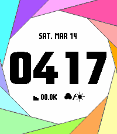

<!-- Generated by scripts/update_app_directory.py: do not edit by hand -->
# Watchfaces: I

[← About this list](../watchfaces.md) · [A](a.md) · [B](b.md) · [C](c.md) · [D](d.md) · [E](e.md) · [F](f.md) · [G](g.md) · [H](h.md) · **I** · [J](j.md) · [K](k.md) · [L](l.md) · [M](m.md) · [N](n.md) · [O](o.md) · [P](p.md) · [Q](q.md) · [R](r.md) · [S](s.md) · [T](t.md) · [U](u.md) · [V](v.md) · [W](w.md) · [X](x.md) · [Y](y.md) · [Z](z.md) · [0–9 & other](other.md)

*51 watchfaces · Last updated 2026-10-06*

| Screenshot | Name | Developer | Licence | Updated | Description |
|------------|------|-----------|---------|---------|-------------|
| { loading=lazy width="72" } | [Ice](https://apps.repebble.com/54b84f4e986a2267770000ca) | [Jonathan Wukitsch](https://github.com/insleep/IceWatchface-Pebble/) | <small>Not checked yet</small> | 2025-11-25 | A simple watchface that tells the time, date, battery percentage, and whether or not Bluetooth is connected. Supports 12 and 24hr time format. |
| { loading=lazy width="72" } | [IDE VSCode](https://apps.repebble.com/620f8b6abe64458caa59fdef) | [Null Syntax](https://github.com/AKlitbo/pebble-watchfaces) | AGPL-3.0 | 2026-09-27 | Features: • Six Editor Themes: Dark, Light, Terminal, Cyberpunk, Synthwave '84, and Mono (Black & White). • Editor Layout: A hero clock in the editor pane… |
| { loading=lazy width="72" } | [igi-anniversary](https://apps.repebble.com/6b5789aa944d4ae8b0d391e1) | [iginoc](https://github.com/iginoc/pebble-orologio) | <small>Not checked yet</small> | 2026-04-16 | A custom watchface for Pebble watches featuring a configurable countdown to specific events, date in Italian, and night mode. Features Digital Clock: Clear… |
| { loading=lazy width="72" } | [igiwatch](https://apps.repebble.com/541e8a0bf9834be6a17e6c19) | [iginoc](https://github.com/iginoc/igiwatch) | <small>Not checked yet</small> | 2026-03-08 | A dynamic and minimalist watchface for Pebble smartwatches that adapts to your viewing angle using the accelerometer. Features Smart Orientation: The time… |
| { loading=lazy width="72" } | [illusion3](https://apps.rebble.io/en_US/application/55f49e7a3cee5fe1dc00001b) <small>Rebble App Store</small> | [PALIANTech Ent.](https://github.com/dmnd/illudere) | <small>Not checked yet</small> | 2025-11-25 | Based off of illudere watch face, with configuration options available to choose different colors. The original illudere was one of the reasons I bought an… |
| { loading=lazy width="72" } | [imageWatch999](https://apps.rebble.io/en_US/application/55b91f5cd01005e8c600007d) <small>Rebble App Store</small> | [dezign999](https://github.com/gregoiresage/pebble-image-viewer) | <small>Not checked yet</small> | 2015-07-29 | #watchfacewednesday A simple watch face that will load your external jpg image onto your pebble. Use the settings page to add your image url, all image… |
| { loading=lazy width="72" } | [Imetay](https://apps.rebble.io/en_US/application/539d1d9ee1e6292061000150) <small>Rebble App Store</small> | [Calla](https://github.com/CallaJun/Imetay-Ebblepay-Atchway-Acefay) | <small>No licence</small> | 2014-06-17 | A watchface that tells time in Pig Latin |
| { loading=lazy width="72" } | [img999](https://apps.repebble.com/7e1631e7a96f478f8a9810fc) | [dezign999](https://github.com/dezign999/img999) | <small>Not checked yet</small> | 2026-04-12 | Customizable watch face for Pebble Time, Pebble 2 and Pebble Classic which uses your own images. This uses resources from: Gregoiresage's Image Viewer… |
| { loading=lazy width="72" } | [Impact](https://apps.repebble.com/57e222e263ae13bb79000011) | [Christophe Jeannette](https://github.com/Sichroteph/Impact) | <small>Not checked yet</small> | 2019-08-04 | A watchface that use the Impact font with detailed weather informations. Features : - Pebble battery - Phone battery (Android) - Immediate weather… |
| { loading=lazy width="72" } | [Imperial Time 3](https://apps.repebble.com/0031c6e0659b4355bb40bc37) | [SableDnah](https://github.com/Sablednah/Imperial-Time-3) | <small>Not checked yet</small> | 2026-06-24 | Imperial Date, Fuzzy time, with analog dial and weather. Rewritten in C for speed ant battery life. |
| { loading=lazy width="72" } | [Implant](https://apps.repebble.com/79af33b3bee04389846691c7) | [Bored Circuits](https://github.com/boredcircuits/implant) | <small>Not checked yet</small> | 2026-10-04 | We are the Borg. Lower your shields and surrender your Pebble. Your technological and biological distinctiveness will be added to our own. Resistance is… |
| { loading=lazy width="72" } | [Importance](https://apps.repebble.com/56cea301fd7a6b2c8a000016) | [Jack Vine](https://github.com/jackv24/Importance-Pebble-Watchface) | <small>Not checked yet</small> | 2016-04-12 | Importance is a watchface that displays the most basic and important information in an easy to read manner. Includes time, date, battery bar and a Bluetooth… |
| { loading=lazy width="72" } | [Imprécise](https://apps.rebble.io/en_US/application/52d636b301e1e3785d000005) <small>Rebble App Store</small> | [Lertsenem](https://github.com/Lertsenem/imprecise) | <small>Not checked yet</small> | 2014-01-15 | Imprécise is a french textual watchface, printing hour with a variable (im)precision. Date of the year is shown at the top of the screen. A line at the… |
| { loading=lazy width="72" } | [Index](https://apps.rebble.io/en_US/application/53ce4305b40eda738a00018d) <small>Rebble App Store</small> | [Chris Lewis](https://github.com/C-D-Lewis/index) | <small>No licence</small> | 2014-07-22 | Simple hour ^ minute index watchface. |
| { loading=lazy width="72" } | [IndigoPop](https://apps.rebble.io/en_US/application/5678bd5cbdb5f03021000067) <small>Rebble App Store</small> | [linearcircles](https://drive.google.com/folderview?id=0B8NGi9DsVuvpci1acXV0VEVBRDA&usp=sharing) | <small>See source</small> | 2015-12-22 | This watchface displays the digital time with a shadow to make it pop! Your watch's battery level is displayed above with a row of circles, and the date is… |
| { loading=lazy width="72" } | [Info Bar](https://apps.rebble.io/en_US/application/568309b2a7c9201e9e00006d) <small>Rebble App Store</small> | [Noah Scarbrough](https://www.dropbox.com/s/o4v243yrifqd88d/Info%20Bar%201.3%20source.zip?dl=0) | <small>Not checked yet</small> | 2016-01-12 | Info Bar is a basic digital watchface, but with a unique twist. A unified bar of important information spans across the middle of the watch. This is a… |
| { loading=lazy width="72" } | [Info Bar Onyx](https://apps.repebble.com/56bdf7a0c85a7ebc54000011) | [Noah Scarbrough](https://www.dropbox.com/s/cd6bqim7cwx8nfc/Info%20Bar%20Onyx%201.1%20source.zip?dl=0) | <small>Not checked yet</small> | 2016-03-09 | Better than the original in every way. More sleek, more readable, and more functional. Displays - Time - Seconds - AM/PM (hidden in 24h mode) - Date - Day… |
| { loading=lazy width="72" } | [Infoface](https://apps.repebble.com/1ea3cd25c8e94d1581b5c0d8) | [Florian Klug-Göri](https://github.com/flurl/infoface-watchface) | <small>Not checked yet</small> | 2026-07-17 | Calendar, weather, RSS/Atom feeds, and JSON — up to 4 rotating info panels on your watch face. Infoface turns your watch face into a small live dashboard… |
| { loading=lazy width="72" } | [Informative Lite](https://apps.rebble.io/en_US/application/52fe517b341556e6a00002ed) <small>Rebble App Store</small> | [dotar](https://github.com/dotar/InformativeLite2.0) | <small>Not checked yet</small> | 2014-02-19 | To be able to use this, you'll *need* the Smartwatch+ app available for *jailbroken* iOS devices through Cydia. The watchface displays: • Battery status… |
| { loading=lazy width="72" } | [InfoWatch](https://apps.repebble.com/574b3bb45810563b2400001c) | [jjv360](https://github.com/jjv360/InfoWatch) | <small>Not checked yet</small> | 2016-06-02 | A minimalist watchface that shows your next upcoming event. Currently supported event types: - Battery (low battery, charging, charge complete) - Bluetooth… |
| { loading=lazy width="72" } | [InfoWatch](https://apps.repebble.com/52ff653c57610081c7000088) | [Mobile to Go](https://github.com/MobiletoGo/Pebble-InfoWatch) | <small>Not checked yet</small> | 2026-09-28 | A smartwatch displaying a wealth of information from the internet or Pebble Health. It offers a notification service and displays the time, day of the week… |
| { loading=lazy width="72" } | [InfoWatch](https://apps.repebble.com/5e58f55f941e47b3bed54162) | [Unknown](https://github.com/maxharrison/infowatch) | <small>Not checked yet</small> | 2026-07-24 | private fork of ForecasWatch 2 |
| { loading=lazy width="72" } | [Ingress Community](https://apps.repebble.com/54ff98fcbab059510600006e) | [LachyTech](https://github.com/LachyTech/pebble-ingresscommunity) | <small>Not checked yet</small> | 2016-10-12 | Ingress Community is a customisable watchface for both Enlightened and Resistance factions. It allows you to display your local community's name and motto… |
| { loading=lazy width="72" } | [Ingress cycle time](https://apps.rebble.io/en_US/application/52f2c5e2ab54ff09ac000034) <small>Rebble App Store</small> | [brinky](https://github.com/brinky/pebbleIngressCycleTime) | <small>Not checked yet</small> | 2014-02-06 | Ingress cycle time countdown |
| { loading=lazy width="72" } | [Ingress Enlightened Cycle Time](https://apps.rebble.io/en_US/application/554a66b51c6fe71b79000073) <small>Rebble App Store</small> | [Timmins Technologies, LLC](https://github.com/PaulTimmins/pebbleEnlCycleTime.git) | <small>Not checked yet</small> | 2015-05-16 | The watchface displays (in color!): * The current septicycle * The current checkpoint out of 35 * A countdown to the next checkpoint * The current time (24h… |
| { loading=lazy width="72" } | [Ingress Resistance Cycle Time](https://apps.rebble.io/en_US/application/54ae1138f66371a06700003f) <small>Rebble App Store</small> | [Timmins Technologies, LLC](https://github.com/PaulTimmins/pebbleIngressCycleTime) | <small>Not checked yet</small> | 2015-12-24 | The watchface displays: * The current septicycle * The current checkpoint out of 35 * A countdown to the next checkpoint * The current time (24h format) *… |
| { loading=lazy width="72" } | [IngressFace](https://apps.repebble.com/568a50ad142c4f161a000048) | [lenku](https://github.com/lenku/IngressFace) | <small>Not checked yet</small> | 2018-05-18 | The Ingress-inspired watchface for the Pebble and Pebble Time. An agent's best friend! Always available on their wrist can be the most simple and essential… |
| { loading=lazy width="72" } | [initTick](https://apps.rebble.io/en_US/application/56235b40bdf1bf09b8000045) <small>Rebble App Store</small> | [Neil](https://github.com/initialneil/PebbleFace-initTick.git) | <small>Not checked yet</small> | 2015-11-28 | Elegant analog Watch Face time, date, location and weather - show panel with color background - show hour, minute and second - show month, date and weekday… |
| { loading=lazy width="72" } | [Inkblot](https://apps.rebble.io/en_US/application/54dd69ca99d4be95ef000049) <small>Rebble App Store</small> | [David Stosik](https://github.com/dstosik/pebblot) | <small>Not checked yet</small> | 2015-10-21 | A watch face inspired of the famous Rorschach test ink blots. The watch face gets its desired look by giving digits a fat, round font, mirroring them, then… |
| { loading=lazy width="72" } | [InkCorner Watch](https://apps.repebble.com/a50e74e276f04309ae80f0d3) | [Creative Manaks](https://github.com/manaksu/ink-corner) | <small>Not checked yet</small> | 2026-05-30 | In progress |
| { loading=lazy width="72" } | [Inner Circle](https://apps.repebble.com/56d32235eb3b97f4da000028) | [chrip](https://github.com/chrip/pebble_wachtfaces) | <small>Not checked yet</small> | 2016-03-25 | Just the time in circles. |
| { loading=lazy width="72" } | [inSquare](https://apps.rebble.io/en_US/application/54d9664963eb418376000045) <small>Rebble App Store</small> | [Theo](https://github.com/TheoBr/inSquare) | <small>Not checked yet</small> | 2015-03-30 | inSquare is a uniquely minimal watchface designed for the Pebble and Pebble Steel. A simple square with the numbered time inside, inSquare takes the… |
| { loading=lazy width="72" } | [Intentional](https://apps.repebble.com/a55fb07149164ef5a2ff4c5f) | [Maks](https://github.com/maks112v/Intentional) | <small>Not checked yet</small> | 2026-08-15 | Intentional is a configurable watch face that keeps the time clear while showing progress toward the things you care about. Choose from four layouts… |
| { loading=lazy width="72" } | [InvaClock](https://apps.repebble.com/549f4fcafefc1d9c39000262) | [XWolfOverride](https://github.com/XWolfOverride/InvaClock) | <small>Not checked yet</small> | 2017-07-13 | A Watchface inspired on the great game Space Invaders™ (Trademark of Taito japan). |
| { loading=lazy width="72" } | [Invert Face](https://apps.rebble.io/en_US/application/54254df335528a42410000b5) <small>Rebble App Store</small> | [aniri](https://github.com/aniri/pebble-inversewatchface) | <small>Not checked yet</small> | 2014-09-30 | Shows time, day of the week and date. The colors get inverted when the watch is connected/disconnected from the phone. |
| { loading=lazy width="72" } | [InvisibleTime](https://apps.repebble.com/578ec3b602f6d85f3d0000f4) | [flowerChild](https://github.com/DaviesH79/watchface_1) | <small>No licence</small> | 2016-07-20 | A pretty and mysterious watchface showing only you the time. |
| { loading=lazy width="72" } | [Iridium Flare Forecast](https://apps.rebble.io/en_US/application/55644a145818e0b381000044) <small>Rebble App Store</small> | [Nikita Komarov](https://github.com/winnukem/pebble-iridium) | <small>Not checked yet</small> | 2015-06-09 | Simple Iridium flare forecasting watchface, using data from heavens-above.com. Countdown starting 4 to 5 minutes before flare. Vibration alerts. Open source. |
| { loading=lazy width="72" } | [Iris](https://apps.repebble.com/0ee0abb8756342f58ac5f0a3) | [1987haaa](https://github.com/hag1987haaa/Iris-Public) | <small>Not checked yet</small> | 2026-04-06 | Meet Iris! 📸 Love cameras? Love big, readable numbers? "Iris" brings a mechanical camera shutter right to your wrist! The aperture dynamically opens and… |
| { loading=lazy width="72" } | [Iris](https://apps.rebble.io/en_US/application/69abbfb3a2c3e8000967b761) <small>Rebble App Store</small> | [1987haaa](https://github.com/hag1987haaa/Iris-Public) | <small>Not checked yet</small> | 2026-04-06 | Meet Iris: a watch face inspired by the beauty of a camera shutter. It brings digital and analog watches together on one watch face, letting you seamlessly… |
| { loading=lazy width="72" } | [IRIX](https://apps.repebble.com/610d9449224a440593180874) | [bcaluneo](https://github.com/bcaluneo/irix-watchface) | <small>Not checked yet</small> | 2026-05-18 | SGI IRIX-themed retro watchface that includes: digital & analog clock, hourly signal, and various health metrics. |
| { loading=lazy width="72" } | [Iron Man - ironman animated watchface](https://apps.rebble.io/en_US/application/53b8688ff92e8f527a00003f) <small>Rebble App Store</small> | [Matthew Hungerford](http://github.com/mhungerford) | <small>See source</small> | 2014-07-05 | Assemble Iron Man's armor by flicking your Pebble. Uses 77 frames to create the ~ 15 second animation. Original animation by z-studios on deviant art… |
| { loading=lazy width="72" } | [Islenskur Texti](https://apps.rebble.io/en_US/application/52d63db30af1f59810000001) <small>Rebble App Store</small> | [Sune Trudslev](https://github.com/trudslev/DanskTekst/) | <small>Not checked yet</small> | 2015-05-20 | This is a watchface that uses natural Icelandic language to display the time, using animation to change every minute, highlighting the hour. |
| { loading=lazy width="72" } | [Islet for AndroidAPS](https://apps.repebble.com/a5543813bd14472f90ff7542) | [petrepa](https://github.com/petrepa/islet-pebble) | <small>Not checked yet</small> | 2026-09-26 | Diabetes watchface for AndroidAPS (AAPS) users. Shows glucose, trend arrow, delta, time since reading and insulin on board (IOB) straight from AndroidAPS on… |
| { loading=lazy width="72" } | [Isotime](https://apps.repebble.com/554574943bbdc6c8560000bf) | [Chris Lewis](https://github.com/C-D-Lewis/pebble-dev) | <small>No licence</small> | 2026-04-17 | Large, sharp time shown using individual animated blocks drawn isometrically. Pick theme colours. Every time the minute changes, animates only the blocks… |
| { loading=lazy width="72" } | [Istanbul](https://apps.rebble.io/en_US/application/562cf0d66edde43084000091) <small>Rebble App Store</small> | [Gokmen Goksel](https://github.com/gokmen/istanbul) | <small>Not checked yet</small> | 2015-10-25 | Istanbul is a yet simple watch face which is mainly focused on the second hand animation to provide sweeping motion. To prevent battery drain it starts to… |
| { loading=lazy width="72" } | [IStandWithAhmed](https://apps.rebble.io/en_US/application/55f9b71775eb49df2e00008c) <small>Rebble App Store</small> | [Saurav Shrestha](https://github.com/sshrestha-navarts/istandwithahmed) | <small>Not checked yet</small> | 2015-09-16 | Tick tock |
| { loading=lazy width="72" } | [It's a Sony](https://apps.repebble.com/10fe23168dbe4573a7fe20cc) | [Knfn](https://github.com/Knucklesfan/pebble-watchfaces/tree/main/itsasony) | GPL-3.0 | 2026-06-03 | The classic Sony branding; on your wrist! It's like a wrist-based Walkman, basically. Has Weather, Time, Date, Steps, and Battery. |
| { loading=lazy width="72" } | [it's cool](https://apps.repebble.com/b271e5b38f5f49deb9e84fdf) | [Toshiaki1973](https://github.com/Toshiaki1973/pebble-its-cool) | <small>Not checked yet</small> | 2026-09-24 | スイス鉄道時計風のアナログ時計。先端が丸い秒針が毎秒動く。日付・バッテリー残量も表示。 |
| { loading=lazy width="72" } | [It's five o'clock somewhere](https://apps.repebble.com/c42b7312c12847609789a28c) | [Luit](https://github.com/Luit/five-somewhere) | <small>Not checked yet</small> | 2026-04-19 | A watchface that always shows five o'clock. |
| { loading=lazy width="72" } | [It's Nothing](https://apps.repebble.com/68190b36404fff0009e209bb) | [EC Apps](https://github.com/eduardochiaro/its-nothing) | <small>Not checked yet</small> | 2025-11-16 | This Pebble watchface, inspired by NothingOS by Nothing Technology Limited, is still in the construction phase. Feedback is highly appreciated. Users can… |
| { loading=lazy width="72" } | [IvyTick](https://apps.rebble.io/en_US/application/562498b7b3d1426740000034) <small>Rebble App Store</small> | [Neil](https://github.com/initialneil/PebbleFace-IvyTick.git) | <small>Not checked yet</small> | 2015-11-05 | Analog Watch Face from "http://wear.ustwo.com/". This is a free watch face for fun. - Month, date and weekday are shown - Weather and location are… |
