---
hide:
  - toc
---

<!-- Generated by scripts/update_app_directory.py: do not edit by hand -->
# Pebble Watchfaces: I

[← All Pebble Watchfaces](../watchfaces.md) · [A](a.md) · [B](b.md) · [C](c.md) · [D](d.md) · [E](e.md) · [F](f.md) · [G](g.md) · [H](h.md) · **I** · [J](j.md) · [K](k.md) · [L](l.md) · [M](m.md) · [N](n.md) · [O](o.md) · [P](p.md) · [Q](q.md) · [R](r.md) · [S](s.md) · [T](t.md) · [U](u.md) · [V](v.md) · [W](w.md) · [X](x.md) · [Y](y.md) · [Z](z.md) · [0–9 & other](other.md)

*50 watchfaces · Last updated 2026-10-06 · [About these lists](../about-app-lists.md)*

<a class="app-shot" href="https://apps.repebble.com/54b84f4e986a2267770000ca" data-search-exclude>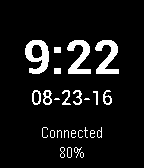</a>

<h2 class="app-name" id="app-54b84f4e986a2267770000ca"><a href="https://apps.repebble.com/54b84f4e986a2267770000ca">Ice</a></h2>
<a class="app-source" href="https://github.com/insleep/IceWatchface-Pebble/" title="Source code" data-search-exclude>View source</a>

by <a href="https://apps.repebble.com/apps/dev/jonathan-wukitsch_549df32c112793b38500040b" title="More from this developer">Jonathan Wukitsch</a>

Not checked yet v1.31 Updated 2025-11-25

Runs on: Round 2, Time 2, Pebble 2 Duo, Pebble 2, Time Round, Time, Classic

A simple watchface that tells the time, date, battery percentage, and whether or not Bluetooth is connected. Supports 12 and 24hr time format.

<a class="app-shot" href="https://apps.repebble.com/620f8b6abe64458caa59fdef" data-search-exclude>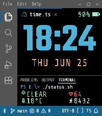</a>

<h2 class="app-name" id="app-620f8b6abe64458caa59fdef"><a href="https://apps.repebble.com/620f8b6abe64458caa59fdef">IDE VSCode</a></h2>
<a class="app-source" href="https://github.com/AKlitbo/pebble-watchfaces" title="Source code" data-search-exclude>View source</a>

by <a href="https://apps.repebble.com/apps/dev/null-syntax_089fa8f469578884846bff5a" title="More from this developer">Null Syntax</a>

AGPL-3.0 v1.5.2 Updated 2026-09-27

Runs on: Time 2

Features: • Six Editor Themes: Dark, Light, Terminal, Cyberpunk, Synthwave &#x27;84, and Mono (Black &amp; White). • Editor Layout: A hero clock in the editor pane with the date beneath it, plus a terminal…

<a class="app-shot" href="https://apps.repebble.com/6b5789aa944d4ae8b0d391e1" data-search-exclude>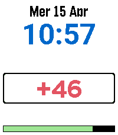</a>

<h2 class="app-name" id="app-6b5789aa944d4ae8b0d391e1"><a href="https://apps.repebble.com/6b5789aa944d4ae8b0d391e1">igi-anniversary</a></h2>
<a class="app-source" href="https://github.com/iginoc/pebble-orologio" title="Source code" data-search-exclude>View source</a>

by <a href="https://apps.repebble.com/apps/dev/iginoc_b831c2f23c283d5eb0ca1134" title="More from this developer">iginoc</a>

Not checked yet v1.3 Updated 2026-04-16

Runs on: Round 2, Time 2, Pebble 2 Duo, Pebble 2, Time Round, Time, Classic

A custom watchface for Pebble watches featuring a configurable countdown to specific events, date in Italian, and night mode. Features Digital Clock: Clear time display (supports 12h/24h formats)…

<h2 class="app-name" id="app-541e8a0bf9834be6a17e6c19"><a href="https://apps.repebble.com/541e8a0bf9834be6a17e6c19">igiwatch</a></h2>
<a class="app-source" href="https://github.com/iginoc/igiwatch" title="Source code" data-search-exclude>View source</a>

by <a href="https://apps.repebble.com/apps/dev/iginoc_b831c2f23c283d5eb0ca1134" title="More from this developer">iginoc</a>

Not checked yet v2.0 Updated 2026-03-08

Runs on: Round 2, Time 2, Pebble 2 Duo, Pebble 2, Time Round, Time, Classic

A dynamic and minimalist watchface for Pebble smartwatches that adapts to your viewing angle using the accelerometer. Features Smart Orientation: The time display rotates to remain readable…

<h2 class="app-name" id="app-55f49e7a3cee5fe1dc00001b"><a href="https://apps.repebble.com/55f49e7a3cee5fe1dc00001b">illusion3</a></h2>
<a class="app-source" href="https://github.com/dmnd/illudere" title="Source code" data-search-exclude>View source</a>

by <a href="https://apps.repebble.com/apps/dev/paliantech-ent_52f0139a2de9ffc2430000b7" title="More from this developer">PALIANTech Ent.</a>

Not checked yet v3.01 Updated 2025-11-25

Runs on: Time 2, Time

Based off of illudere watch face, with configuration options available to choose different colors. The original illudere was one of the reasons I bought an original Pebble and I wanted to see this…

<a class="app-shot" href="https://apps.repebble.com/55b91f5cd01005e8c600007d" data-search-exclude>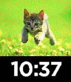</a>

<h2 class="app-name" id="app-55b91f5cd01005e8c600007d"><a href="https://apps.repebble.com/55b91f5cd01005e8c600007d">imageWatch999</a></h2>
<a class="app-source" href="https://github.com/gregoiresage/pebble-image-viewer" title="Source code" data-search-exclude>View source</a>

by <a href="https://apps.repebble.com/apps/dev/dezign999_52f03b26a0cb6a3454000dfb" title="More from this developer">dezign999</a>

Not checked yet v1.0 Updated 2015-07-29

Runs on: Time 2, Time

#watchfacewednesday A simple watch face that will load your external jpg image onto your pebble. Use the settings page to add your image url, all image conversion is done on your phone for added…

<h2 class="app-name" id="app-539d1d9ee1e6292061000150"><a href="https://apps.repebble.com/539d1d9ee1e6292061000150">Imetay</a></h2>
<a class="app-source" href="https://github.com/CallaJun/Imetay-Ebblepay-Atchway-Acefay" title="Source code" data-search-exclude>View source</a>

by <a href="https://apps.repebble.com/apps/dev/calla_53961aa12611438089000053" title="More from this developer">Calla</a>

No licence v1.0.1 Updated 2014-06-17

Runs on: Time 2, Pebble 2 Duo, Pebble 2, Time, Classic

A watchface that tells time in Pig Latin

<a class="app-shot" href="https://apps.repebble.com/7e1631e7a96f478f8a9810fc" data-search-exclude>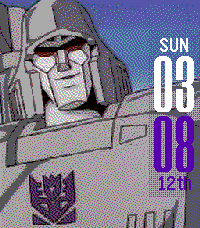</a>

<h2 class="app-name" id="app-7e1631e7a96f478f8a9810fc"><a href="https://apps.repebble.com/7e1631e7a96f478f8a9810fc">img999</a></h2>
<a class="app-source" href="https://github.com/dezign999/img999" title="Source code" data-search-exclude>View source</a>

by <a href="https://apps.repebble.com/apps/dev/dezign999_52f03b26a0cb6a3454000dfb" title="More from this developer">dezign999</a>

Not checked yet v2.0 Updated 2026-04-12

Runs on: Time 2, Pebble 2 Duo, Pebble 2, Time, Classic

Customizable watch face for Pebble Time, Pebble 2 and Pebble Classic which uses your own images. This uses resources from: Gregoiresage&#x27;s Image Viewer…

<a class="app-shot" href="https://apps.repebble.com/57e222e263ae13bb79000011" data-search-exclude>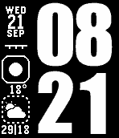</a>

<h2 class="app-name" id="app-57e222e263ae13bb79000011"><a href="https://apps.repebble.com/57e222e263ae13bb79000011">Impact</a></h2>
<a class="app-source" href="https://github.com/Sichroteph/Impact" title="Source code" data-search-exclude>View source</a>

by <a href="https://apps.repebble.com/apps/dev/christophe-jeannette_54edf0599e4ff7cbf60000a0" title="More from this developer">Christophe Jeannette</a>

No licence v1.12 Updated 2019-08-04

Runs on: Round 2, Time 2, Pebble 2 Duo, Pebble 2, Time Round, Time, Classic

A watchface that use the Impact font with detailed weather informations. Features : - Pebble battery - Phone battery (Android) - Immediate weather temperature and conditions - 6 Hours weather…

<a class="app-shot" href="https://apps.repebble.com/0031c6e0659b4355bb40bc37" data-search-exclude>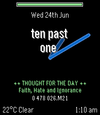</a>

<h2 class="app-name" id="app-0031c6e0659b4355bb40bc37"><a href="https://apps.repebble.com/0031c6e0659b4355bb40bc37">Imperial Time 3</a></h2>
<a class="app-source" href="https://github.com/Sablednah/Imperial-Time-3" title="Source code" data-search-exclude>View source</a>

by <a href="https://apps.repebble.com/apps/dev/sablednah_7a50fe5f56940fd851d819d9" title="More from this developer">SableDnah</a>

No licence v1.1.0 Updated 2026-06-24

Runs on: Time 2

Imperial Date, Fuzzy time, with analog dial and weather. Rewritten in C for speed ant battery life.

<a class="app-shot" href="https://apps.repebble.com/79af33b3bee04389846691c7" data-search-exclude>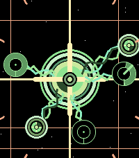</a>

<h2 class="app-name" id="app-79af33b3bee04389846691c7"><a href="https://apps.repebble.com/79af33b3bee04389846691c7">Implant</a></h2>
<a class="app-source" href="https://github.com/boredcircuits/implant" title="Source code" data-search-exclude>View source</a>

by <a href="https://apps.repebble.com/apps/dev/bored-circuits_8308cdcf0a562e5b408085dc" title="More from this developer">Bored Circuits</a>

No licence v1.0.0 Updated 2026-10-04

Runs on: Round 2, Time 2

We are the Borg. Lower your shields and surrender your Pebble. Your technological and biological distinctiveness will be added to our own. Resistance is futile. After assimilation, your implant…

<a class="app-shot" href="https://apps.repebble.com/56cea301fd7a6b2c8a000016" data-search-exclude>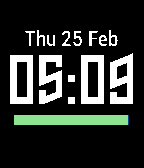</a>

<h2 class="app-name" id="app-56cea301fd7a6b2c8a000016"><a href="https://apps.repebble.com/56cea301fd7a6b2c8a000016">Importance</a></h2>
<a class="app-source" href="https://github.com/jackv24/Importance-Pebble-Watchface" title="Source code" data-search-exclude>View source</a>

by <a href="https://apps.repebble.com/apps/dev/jack-vine_56cd34fb86ce3b1043000008" title="More from this developer">Jack Vine</a>

Not checked yet v1.4 Updated 2016-04-12

Runs on: Round 2, Time 2, Pebble 2 Duo, Pebble 2, Time Round, Time, Classic

Importance is a watchface that displays the most basic and important information in an easy to read manner. Includes time, date, battery bar and a Bluetooth disconnection indicator. Seconds are…

<h2 class="app-name" id="app-52d636b301e1e3785d000005"><a href="https://apps.repebble.com/52d636b301e1e3785d000005">Imprécise</a></h2>
<a class="app-source" href="https://github.com/Lertsenem/imprecise" title="Source code" data-search-exclude>View source</a>

by <a href="https://apps.repebble.com/apps/dev/lertsenem_52bd5cfcfbe3f854a900006c" title="More from this developer">Lertsenem</a>

No licence v1.1.0 Updated 2014-01-15

Runs on: Time 2, Pebble 2 Duo, Pebble 2, Time, Classic

Imprécise is a french textual watchface, printing hour with a variable (im)precision. Date of the year is shown at the top of the screen. A line at the bottom shows the battery charge (the shorter…

<h2 class="app-name" id="app-53ce4305b40eda738a00018d"><a href="https://apps.repebble.com/53ce4305b40eda738a00018d">Index</a></h2>
<a class="app-source" href="https://github.com/C-D-Lewis/index" title="Source code" data-search-exclude>View source</a>

by <a href="https://apps.repebble.com/apps/dev/chris-lewis_5299cd30e627ce1147000099" title="More from this developer">Chris Lewis</a>

No licence v1.0.0 Updated 2014-07-22

Runs on: Time 2, Pebble 2 Duo, Pebble 2, Time, Classic

Simple hour ^ minute index watchface.

<a class="app-shot" href="https://apps.repebble.com/5678bd5cbdb5f03021000067" data-search-exclude>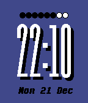</a>

<h2 class="app-name" id="app-5678bd5cbdb5f03021000067"><a href="https://apps.repebble.com/5678bd5cbdb5f03021000067">IndigoPop</a></h2>
<a class="app-source" href="https://drive.google.com/folderview?id=0B8NGi9DsVuvpci1acXV0VEVBRDA&amp;usp=sharing" title="Source code" data-search-exclude>View source</a>

by <a href="https://apps.repebble.com/apps/dev/linearcircles_566d8849925d554c8400002d" title="More from this developer">linearcircles</a>

See source v1.0 Updated 2015-12-22

Runs on: Round 2, Time 2, Time Round, Time

This watchface displays the digital time with a shadow to make it pop! Your watch&#x27;s battery level is displayed above with a row of circles, and the date is located below the time. Compatible with…

<a class="app-shot" href="https://apps.repebble.com/568309b2a7c9201e9e00006d" data-search-exclude>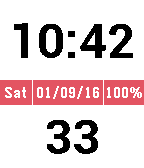</a>

<h2 class="app-name" id="app-568309b2a7c9201e9e00006d"><a href="https://apps.repebble.com/568309b2a7c9201e9e00006d">Info Bar</a></h2>
<a class="app-source" href="https://www.dropbox.com/s/o4v243yrifqd88d/Info%20Bar%201.3%20source.zip?dl=0" title="Source code" data-search-exclude>View source</a>

by <a href="https://apps.repebble.com/apps/dev/noah-scarbrough_567d73cfa2dee26dc00001a2" title="More from this developer">Noah Scarbrough</a>

Not checked yet v1.3 Updated 2016-01-12

Runs on: Round 2, Time 2, Pebble 2 Duo, Pebble 2, Time Round, Time, Classic

Info Bar is a basic digital watchface, but with a unique twist. A unified bar of important information spans across the middle of the watch. This is a useful design for looking at more than just…

<a class="app-shot" href="https://apps.repebble.com/56bdf7a0c85a7ebc54000011" data-search-exclude>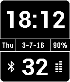</a>

<h2 class="app-name" id="app-56bdf7a0c85a7ebc54000011"><a href="https://apps.repebble.com/56bdf7a0c85a7ebc54000011">Info Bar Onyx</a></h2>
<a class="app-source" href="https://www.dropbox.com/s/cd6bqim7cwx8nfc/Info%20Bar%20Onyx%201.1%20source.zip?dl=0" title="Source code" data-search-exclude>View source</a>

by <a href="https://apps.repebble.com/apps/dev/noah-scarbrough_567d73cfa2dee26dc00001a2" title="More from this developer">Noah Scarbrough</a>

Not checked yet v1.1 Updated 2016-03-09

Runs on: Round 2, Time 2, Pebble 2 Duo, Pebble 2, Time Round, Time, Classic

Better than the original in every way. More sleek, more readable, and more functional. Displays - Time - Seconds - AM/PM (hidden in 24h mode) - Date - Day of the week - Battery percentage …

<a class="app-shot" href="https://apps.repebble.com/1ea3cd25c8e94d1581b5c0d8" data-search-exclude>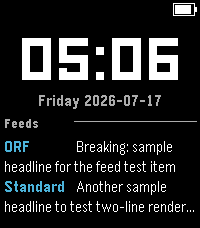</a>

<h2 class="app-name" id="app-1ea3cd25c8e94d1581b5c0d8"><a href="https://apps.repebble.com/1ea3cd25c8e94d1581b5c0d8">Infoface</a></h2>
<a class="app-source" href="https://github.com/flurl/infoface-watchface" title="Source code" data-search-exclude>View source</a>

by <a href="https://apps.repebble.com/apps/dev/florian-klug-g-ri_ae55f651e081074fcd7a66e2" title="More from this developer">Florian Klug-Göri</a>

Not checked yet v0.9.0 Updated 2026-07-17

Runs on: Round 2, Time 2, Pebble 2 Duo

Calendar, weather, RSS/Atom feeds, and JSON — up to 4 rotating info panels on your watch face. Infoface turns your watch face into a small live dashboard. Configure up to four independent info…

<a class="app-shot" href="https://apps.repebble.com/52fe517b341556e6a00002ed" data-search-exclude>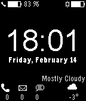</a>

<h2 class="app-name" id="app-52fe517b341556e6a00002ed"><a href="https://apps.repebble.com/52fe517b341556e6a00002ed">Informative Lite</a></h2>
<a class="app-source" href="https://github.com/dotar/InformativeLite2.0" title="Source code" data-search-exclude>View source</a>

by <a href="https://apps.repebble.com/apps/dev/dotar_528fdbd9a92e1f3bea000021" title="More from this developer">dotar</a>

Not checked yet v1.1.1 Updated 2014-02-19

Runs on: Time 2, Pebble 2 Duo, Pebble 2, Time, Classic

To be able to use this, you&#x27;ll *need* the Smartwatch+ app available for *jailbroken* iOS devices through Cydia. The watchface displays: • Battery status (iPhone/Pebble) • Time/Date • Missed calls…

<a class="app-shot" href="https://apps.repebble.com/574b3bb45810563b2400001c" data-search-exclude>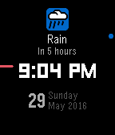</a>

<h2 class="app-name" id="app-574b3bb45810563b2400001c"><a href="https://apps.repebble.com/574b3bb45810563b2400001c">InfoWatch</a></h2>
<a class="app-source" href="https://github.com/jjv360/InfoWatch" title="Source code" data-search-exclude>View source</a>

by <a href="https://apps.repebble.com/apps/dev/jjv360_52e0dde67487e523520000da" title="More from this developer">jjv360</a>

Not checked yet v1.02 Updated 2016-06-02

Runs on: Round 2, Time 2, Pebble 2 Duo, Pebble 2, Time Round, Time, Classic

A minimalist watchface that shows your next upcoming event. Currently supported event types: - Battery (low battery, charging, charge complete) - Bluetooth connection (disconnected) - Weather…

<a class="app-shot" href="https://apps.repebble.com/52ff653c57610081c7000088" data-search-exclude>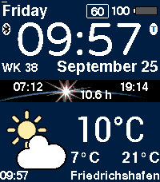</a>

<h2 class="app-name" id="app-52ff653c57610081c7000088"><a href="https://apps.repebble.com/52ff653c57610081c7000088">InfoWatch</a></h2>
<a class="app-source" href="https://github.com/MobiletoGo/Pebble-InfoWatch" title="Source code" data-search-exclude>View source</a>

by <a href="https://apps.repebble.com/apps/dev/mobile-to-go_52caa21ed088ea211600005f" title="More from this developer">Mobile to Go</a>

GPL-3.0 v7.0 Updated 2026-09-28

Runs on: Round 2, Time 2, Pebble 2 Duo, Pebble 2, Time Round, Time, Classic

A smartwatch displaying a wealth of information from the internet or Pebble Health. It offers a notification service and displays the time, day of the week, calendar and date (in almost any…

<a class="app-shot" href="https://apps.repebble.com/5e58f55f941e47b3bed54162" data-search-exclude>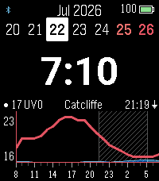</a>

<h2 class="app-name" id="app-5e58f55f941e47b3bed54162"><a href="https://apps.repebble.com/5e58f55f941e47b3bed54162">InfoWatch</a></h2>
<a class="app-source" href="https://github.com/maxharrison/infowatch" title="Source code" data-search-exclude>View source</a>

by <a href="https://apps.repebble.com/apps/dev/unknown_620c8d1cdbd8fa4ccafc0dde" title="More from this developer">Unknown</a>

Not checked yet v11.0.0 Updated 2026-07-24

Runs on: Time 2

private fork of ForecasWatch 2

<h2 class="app-name" id="app-54ff98fcbab059510600006e"><a href="https://apps.repebble.com/54ff98fcbab059510600006e">Ingress Community</a></h2>
<a class="app-source" href="https://github.com/LachyTech/pebble-ingresscommunity" title="Source code" data-search-exclude>View source</a>

by <a href="https://apps.repebble.com/apps/dev/lachytech_531ab7754969a2e31000112c" title="More from this developer">LachyTech</a>

No licence v1.4 Updated 2016-10-12

Runs on: Time 2, Pebble 2 Duo, Pebble 2, Time, Classic

Ingress Community is a customisable watchface for both Enlightened and Resistance factions. It allows you to display your local community&#x27;s name and motto on your wrist. Due to limited display…

<a class="app-shot" href="https://apps.repebble.com/52f2c5e2ab54ff09ac000034" data-search-exclude>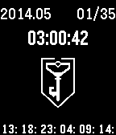</a>

<h2 class="app-name" id="app-52f2c5e2ab54ff09ac000034"><a href="https://apps.repebble.com/52f2c5e2ab54ff09ac000034">Ingress cycle time</a></h2>
<a class="app-source" href="https://github.com/brinky/pebbleIngressCycleTime" title="Source code" data-search-exclude>View source</a>

by <a href="https://apps.repebble.com/apps/dev/brinky_52f224908d40be65f80002ce" title="More from this developer">brinky</a>

Apache-2.0 v0.2 Updated 2014-02-06

Runs on: Time 2, Pebble 2 Duo, Pebble 2, Time, Classic

Ingress cycle time countdown

<a class="app-shot" href="https://apps.repebble.com/554a66b51c6fe71b79000073" data-search-exclude>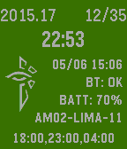</a>

<h2 class="app-name" id="app-554a66b51c6fe71b79000073"><a href="https://apps.repebble.com/554a66b51c6fe71b79000073">Ingress Enlightened Cycle Time</a></h2>
<a class="app-source" href="https://github.com/PaulTimmins/pebbleEnlCycleTime.git" title="Source code" data-search-exclude>View source</a>

by <a href="https://apps.repebble.com/apps/dev/timmins-technologies-llc_531a88327e49755eab000db5" title="More from this developer">Timmins Technologies, LLC</a>

Apache-2.0 v2.1 Updated 2015-05-16

Runs on: Time 2, Pebble 2 Duo, Pebble 2, Time, Classic

The watchface displays (in color!): * The current septicycle * The current checkpoint out of 35 * A countdown to the next checkpoint * The current time (24h format) * Bluetooth status * Watch…

<a class="app-shot" href="https://apps.repebble.com/54ae1138f66371a06700003f" data-search-exclude>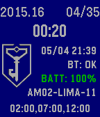</a>

<h2 class="app-name" id="app-54ae1138f66371a06700003f"><a href="https://apps.repebble.com/54ae1138f66371a06700003f">Ingress Resistance Cycle Time</a></h2>
<a class="app-source" href="https://github.com/PaulTimmins/pebbleIngressCycleTime" title="Source code" data-search-exclude>View source</a>

by <a href="https://apps.repebble.com/apps/dev/timmins-technologies-llc_531a88327e49755eab000db5" title="More from this developer">Timmins Technologies, LLC</a>

Apache-2.0 v2.6 Updated 2015-12-24

Runs on: Time 2, Pebble 2 Duo, Pebble 2, Time, Classic

The watchface displays: * The current septicycle * The current checkpoint out of 35 * A countdown to the next checkpoint * The current time (24h format) * Bluetooth status * Watch Battery Level…

<a class="app-shot" href="https://apps.repebble.com/568a50ad142c4f161a000048" data-search-exclude>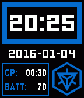</a>

<h2 class="app-name" id="app-568a50ad142c4f161a000048"><a href="https://apps.repebble.com/568a50ad142c4f161a000048">IngressFace</a></h2>
<a class="app-source" href="https://github.com/lenku/IngressFace" title="Source code" data-search-exclude>View source</a>

by <a href="https://apps.repebble.com/apps/dev/lenku_55d85c3b6f697eced30000b7" title="More from this developer">lenku</a>

Not checked yet v2.11 Updated 2018-05-18

Runs on: Time 2, Pebble 2 Duo, Pebble 2, Time, Classic

The Ingress-inspired watchface for the Pebble and Pebble Time. An agent&#x27;s best friend! Always available on their wrist can be the most simple and essential of information one might need when going…

<a class="app-shot" href="https://apps.repebble.com/56235b40bdf1bf09b8000045" data-search-exclude>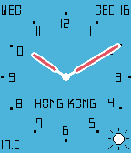</a>

<h2 class="app-name" id="app-56235b40bdf1bf09b8000045"><a href="https://apps.repebble.com/56235b40bdf1bf09b8000045">initTick</a></h2>
<a class="app-source" href="https://github.com/initialneil/PebbleFace-initTick.git" title="Source code" data-search-exclude>View source</a>

by <a href="https://apps.repebble.com/apps/dev/neil_5613340e042ac2e922000052" title="More from this developer">Neil</a>

Not checked yet v1.33 Updated 2015-11-28

Runs on: Round 2, Time 2, Time Round, Time

Elegant analog Watch Face time, date, location and weather - show panel with color background - show hour, minute and second - show month, date and weekday - show weather and location - color…

<h2 class="app-name" id="app-54dd69ca99d4be95ef000049"><a href="https://apps.repebble.com/54dd69ca99d4be95ef000049">Inkblot</a></h2>
<a class="app-source" href="https://github.com/dstosik/pebblot" title="Source code" data-search-exclude>View source</a>

by <a href="https://apps.repebble.com/apps/dev/david-stosik_535657c3c822ffc62800014f" title="More from this developer">David Stosik</a>

Not checked yet v2.1 Updated 2015-10-21

Runs on: Time 2, Pebble 2 Duo, Pebble 2, Time, Classic

A watch face inspired of the famous Rorschach test ink blots. The watch face gets its desired look by giving digits a fat, round font, mirroring them, then melting them together. When idle, hours…

<a class="app-shot" href="https://apps.repebble.com/a50e74e276f04309ae80f0d3" data-search-exclude>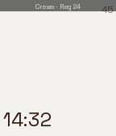</a>

<h2 class="app-name" id="app-a50e74e276f04309ae80f0d3"><a href="https://apps.repebble.com/a50e74e276f04309ae80f0d3">InkCorner Watch</a></h2>
<a class="app-source" href="https://github.com/manaksu/ink-corner" title="Source code" data-search-exclude>View source</a>

by <a href="https://apps.repebble.com/apps/dev/creative-manaks_504fe850dc7e97a445b0a10d" title="More from this developer">Creative Manaks</a>

Not checked yet v1.35 Updated 2026-05-30

Runs on: Time 2, Pebble 2 Duo, Pebble 2, Time

In progress

<a class="app-shot" href="https://apps.repebble.com/56d32235eb3b97f4da000028" data-search-exclude>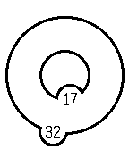</a>

<h2 class="app-name" id="app-56d32235eb3b97f4da000028"><a href="https://apps.repebble.com/56d32235eb3b97f4da000028">Inner Circle</a></h2>
<a class="app-source" href="https://github.com/chrip/pebble_wachtfaces" title="Source code" data-search-exclude>View source</a>

by <a href="https://apps.repebble.com/apps/dev/chrip_569eb89fa1ebd0d5a9000005" title="More from this developer">chrip</a>

Not checked yet v0.2 Updated 2016-03-25

Runs on: Round 2, Time 2, Pebble 2 Duo, Pebble 2, Time Round, Time, Classic

Just the time in circles.

<h2 class="app-name" id="app-54d9664963eb418376000045"><a href="https://apps.repebble.com/54d9664963eb418376000045">inSquare</a></h2>
<a class="app-source" href="https://github.com/TheoBr/inSquare" title="Source code" data-search-exclude>View source</a>

by <a href="https://apps.repebble.com/apps/dev/theo_547e4bc9bca84bcc6d0000be" title="More from this developer">Theo</a>

GPL-2.0 v1.0 Updated 2015-03-30

Runs on: Time 2, Pebble 2 Duo, Pebble 2, Time, Classic

inSquare is a uniquely minimal watchface designed for the Pebble and Pebble Steel. A simple square with the numbered time inside, inSquare takes the minimalist digital concept and makes it…

<a class="app-shot" href="https://apps.repebble.com/a55fb07149164ef5a2ff4c5f" data-search-exclude>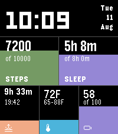</a>

<h2 class="app-name" id="app-a55fb07149164ef5a2ff4c5f"><a href="https://apps.repebble.com/a55fb07149164ef5a2ff4c5f">Intentional</a></h2>
<a class="app-source" href="https://github.com/maks112v/Intentional" title="Source code" data-search-exclude>View source</a>

by <a href="https://apps.repebble.com/apps/dev/maks_70a4bdd1c32fe473b02726b7" title="More from this developer">Maks</a>

Not checked yet v1.0.3 Updated 2026-08-15

Runs on: Time 2

Intentional is a configurable watch face that keeps the time clear while showing progress toward the things you care about. Choose from four layouts, multiple color themes, and up to five widgets…

<a class="app-shot" href="https://apps.repebble.com/549f4fcafefc1d9c39000262" data-search-exclude>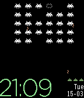</a>

<h2 class="app-name" id="app-549f4fcafefc1d9c39000262"><a href="https://apps.repebble.com/549f4fcafefc1d9c39000262">InvaClock</a></h2>
<a class="app-source" href="https://github.com/XWolfOverride/InvaClock" title="Source code" data-search-exclude>View source</a>

by <a href="https://apps.repebble.com/apps/dev/xwolfoverride_54469025c952a3161f00007d" title="More from this developer">XWolfOverride</a>

MIT v1.3 Updated 2017-07-13

Runs on: Round 2, Time 2, Pebble 2 Duo, Pebble 2, Time Round, Time, Classic

A Watchface inspired on the great game Space Invaders™ (Trademark of Taito japan).

<a class="app-shot" href="https://apps.repebble.com/54254df335528a42410000b5" data-search-exclude>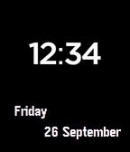</a>

<h2 class="app-name" id="app-54254df335528a42410000b5"><a href="https://apps.repebble.com/54254df335528a42410000b5">Invert Face</a></h2>
<a class="app-source" href="https://github.com/aniri/pebble-inversewatchface" title="Source code" data-search-exclude>View source</a>

by <a href="https://apps.repebble.com/apps/dev/aniri_531a2eec4969a21eb50005a3" title="More from this developer">aniri</a>

No licence v1.1 Updated 2014-09-30

Runs on: Time 2, Pebble 2 Duo, Pebble 2, Time, Classic

Shows time, day of the week and date. The colors get inverted when the watch is connected/disconnected from the phone.

<h2 class="app-name" id="app-578ec3b602f6d85f3d0000f4"><a href="https://apps.repebble.com/578ec3b602f6d85f3d0000f4">InvisibleTime</a></h2>
<a class="app-source" href="https://github.com/DaviesH79/watchface_1" title="Source code" data-search-exclude>View source</a>

by <a href="https://apps.repebble.com/apps/dev/flowerchild_55048ccd1744586d5d000090" title="More from this developer">flowerChild</a>

No licence v1.0 Updated 2016-07-20

Runs on: Round 2, Time 2, Pebble 2 Duo, Pebble 2, Time Round, Time, Classic

A pretty and mysterious watchface showing only you the time.

<a class="app-shot" href="https://apps.repebble.com/55644a145818e0b381000044" data-search-exclude>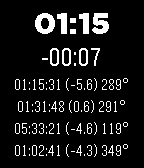</a>

<h2 class="app-name" id="app-55644a145818e0b381000044"><a href="https://apps.repebble.com/55644a145818e0b381000044">Iridium Flare Forecast</a></h2>
<a class="app-source" href="https://github.com/winnukem/pebble-iridium" title="Source code" data-search-exclude>View source</a>

by <a href="https://apps.repebble.com/apps/dev/nikita-komarov_5470bbbb32fb2d8608000096" title="More from this developer">Nikita Komarov</a>

Not checked yet v0.2 Updated 2015-06-09

Runs on: Time 2, Pebble 2 Duo, Pebble 2, Time, Classic

Simple Iridium flare forecasting watchface, using data from heavens-above.com. Countdown starting 4 to 5 minutes before flare. Vibration alerts. Open source.

<h2 class="app-name" id="app-0ee0abb8756342f58ac5f0a3"><a href="https://apps.repebble.com/0ee0abb8756342f58ac5f0a3">Iris</a></h2>
<a class="app-source" href="https://github.com/hag1987haaa/Iris-Public" title="Source code" data-search-exclude>View source</a>

by <a href="https://apps.repebble.com/apps/dev/1987haaa_4f73b53120792bffd3b3c1b4" title="More from this developer">1987haaa</a>

Not checked yet v2.1 Updated 2026-04-06

Runs on: Round 2, Time 2, Pebble 2 Duo, Pebble 2, Time Round, Time, Classic

Meet Iris! 📸 Love cameras? Love big, readable numbers? &quot;Iris&quot; brings a mechanical camera shutter right to your wrist! The aperture dynamically opens and closes, revealing the time in a layout…

<a class="app-shot" href="https://apps.repebble.com/610d9449224a440593180874" data-search-exclude>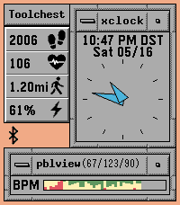</a>

<h2 class="app-name" id="app-610d9449224a440593180874"><a href="https://apps.repebble.com/610d9449224a440593180874">IRIX</a></h2>
<a class="app-source" href="https://github.com/bcaluneo/irix-watchface" title="Source code" data-search-exclude>View source</a>

by <a href="https://apps.repebble.com/apps/dev/bcaluneo_5186b220f8c918a5630f9cf2" title="More from this developer">bcaluneo</a>

No licence v1.4.0 Updated 2026-05-18

Runs on: Time 2

SGI IRIX-themed retro watchface that includes: digital &amp; analog clock, hourly signal, and various health metrics.

<h2 class="app-name" id="app-53b8688ff92e8f527a00003f"><a href="https://apps.repebble.com/53b8688ff92e8f527a00003f">Iron Man - ironman animated watchface</a></h2>
<a class="app-source" href="http://github.com/mhungerford" title="Source code" data-search-exclude>View source</a>

by <a href="https://apps.repebble.com/apps/dev/matthew-hungerford_52bca741d438930a650001b6" title="More from this developer">Matthew Hungerford</a>

See source v1.0.0 Updated 2014-07-05

Runs on: Time 2, Pebble 2 Duo, Pebble 2, Time, Classic

Assemble Iron Man&#x27;s armor by flicking your Pebble. Uses 77 frames to create the ~ 15 second animation. Original animation by z-studios on deviant art…

<h2 class="app-name" id="app-52d63db30af1f59810000001"><a href="https://apps.repebble.com/52d63db30af1f59810000001">Islenskur Texti</a></h2>
<a class="app-source" href="https://github.com/trudslev/DanskTekst/" title="Source code" data-search-exclude>View source</a>

by <a href="https://apps.repebble.com/apps/dev/sune-trudslev_52ca62f4d088ea10c600004e" title="More from this developer">Sune Trudslev</a>

Not checked yet v3.1 Updated 2015-05-20

Runs on: Time 2, Pebble 2 Duo, Pebble 2, Time, Classic

This is a watchface that uses natural Icelandic language to display the time, using animation to change every minute, highlighting the hour.

<a class="app-shot" href="https://apps.repebble.com/a5543813bd14472f90ff7542" data-search-exclude>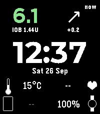</a>

<h2 class="app-name" id="app-a5543813bd14472f90ff7542"><a href="https://apps.repebble.com/a5543813bd14472f90ff7542">Islet for AndroidAPS</a></h2>
<a class="app-source" href="https://github.com/petrepa/islet-pebble" title="Source code" data-search-exclude>View source</a>

by <a href="https://apps.repebble.com/apps/dev/petrepa_6444ceb8513eb4512ac26246" title="More from this developer">petrepa</a>

Not checked yet v1.0.1 Updated 2026-09-26

Runs on: Time 2

Diabetes watchface for AndroidAPS (AAPS) users. Shows glucose, trend arrow, delta, time since reading and insulin on board (IOB) straight from AndroidAPS on your phone. No Nightscout, xDrip+ or…

<h2 class="app-name" id="app-554574943bbdc6c8560000bf"><a href="https://apps.repebble.com/554574943bbdc6c8560000bf">Isotime</a></h2>
<a class="app-source" href="https://github.com/C-D-Lewis/pebble-dev" title="Source code" data-search-exclude>View source</a>

by <a href="https://apps.repebble.com/apps/dev/chris-lewis_5299cd30e627ce1147000099" title="More from this developer">Chris Lewis</a>

No licence v1.17 Updated 2026-04-17

Runs on: Round 2, Time 2, Pebble 2 Duo, Pebble 2, Time Round, Time, Classic

Large, sharp time shown using individual animated blocks drawn isometrically. Pick theme colours. Every time the minute changes, animates only the blocks that need changing. Digits go grey when BT…

<a class="app-shot" href="https://apps.repebble.com/562cf0d66edde43084000091" data-search-exclude>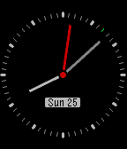</a>

<h2 class="app-name" id="app-562cf0d66edde43084000091"><a href="https://apps.repebble.com/562cf0d66edde43084000091">Istanbul</a></h2>
<a class="app-source" href="https://github.com/gokmen/istanbul" title="Source code" data-search-exclude>View source</a>

by <a href="https://apps.repebble.com/apps/dev/gokmen-goksel_5596ea5a2205f0de5000007f" title="More from this developer">Gokmen Goksel</a>

Not checked yet v1.0 Updated 2015-10-25

Runs on: Round 2, Time 2, Time Round, Time

Istanbul is a yet simple watch face which is mainly focused on the second hand animation to provide sweeping motion. To prevent battery drain it starts to animate for a minute then returns back to…

<h2 class="app-name" id="app-55f9b71775eb49df2e00008c"><a href="https://apps.repebble.com/55f9b71775eb49df2e00008c">IStandWithAhmed</a></h2>
<a class="app-source" href="https://github.com/sshrestha-navarts/istandwithahmed" title="Source code" data-search-exclude>View source</a>

by <a href="https://apps.repebble.com/apps/dev/saurav-shrestha_549e520afefc1df95d0000b2" title="More from this developer">Saurav Shrestha</a>

Not checked yet v1.0 Updated 2015-09-16

Runs on: Time 2, Pebble 2 Duo, Pebble 2, Time, Classic

Tick tock

<a class="app-shot" href="https://apps.repebble.com/10fe23168dbe4573a7fe20cc" data-search-exclude>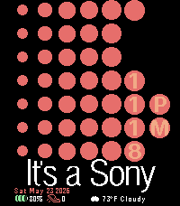</a>

<h2 class="app-name" id="app-10fe23168dbe4573a7fe20cc"><a href="https://apps.repebble.com/10fe23168dbe4573a7fe20cc">It&#x27;s a Sony</a></h2>
<a class="app-source" href="https://github.com/Knucklesfan/pebble-watchfaces/tree/main/itsasony" title="Source code" data-search-exclude>View source</a>

by <a href="https://apps.repebble.com/apps/dev/knfn_0db81fab88481ed6a3fe7381" title="More from this developer">Knfn</a>

GPL-3.0 v2.0.1 Updated 2026-06-03

Runs on: Time 2

The classic Sony branding; on your wrist! It&#x27;s like a wrist-based Walkman, basically. Has Weather, Time, Date, Steps, and Battery.

<a class="app-shot" href="https://apps.repebble.com/b271e5b38f5f49deb9e84fdf" data-search-exclude>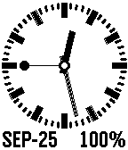</a>

<h2 class="app-name" id="app-b271e5b38f5f49deb9e84fdf"><a href="https://apps.repebble.com/b271e5b38f5f49deb9e84fdf">it&#x27;s cool</a></h2>
<a class="app-source" href="https://github.com/Toshiaki1973/pebble-its-cool" title="Source code" data-search-exclude>View source</a>

by <a href="https://apps.repebble.com/apps/dev/toshiaki1973_3d1c3936fafe6c3ee52664f7" title="More from this developer">Toshiaki1973</a>

Other v1.0.1 Updated 2026-09-24

Runs on: Pebble 2 Duo

スイス鉄道時計風のアナログ時計。先端が丸い秒針が毎秒動く。日付・バッテリー残量も表示。

<a class="app-shot" href="https://apps.repebble.com/c42b7312c12847609789a28c" data-search-exclude>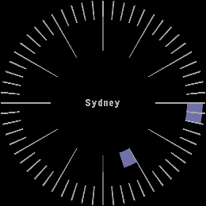</a>

<h2 class="app-name" id="app-c42b7312c12847609789a28c"><a href="https://apps.repebble.com/c42b7312c12847609789a28c">It&#x27;s five o&#x27;clock somewhere</a></h2>
<a class="app-source" href="https://github.com/Luit/five-somewhere" title="Source code" data-search-exclude>View source</a>

by <a href="https://apps.repebble.com/apps/dev/luit_b2364dbffae18922dc4ab29d" title="More from this developer">Luit</a>

No licence v0.1 Updated 2026-04-19

Runs on: Round 2

A watchface that always shows five o&#x27;clock.

<a class="app-shot" href="https://apps.repebble.com/68190b36404fff0009e209bb" data-search-exclude>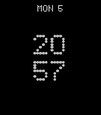</a>

<h2 class="app-name" id="app-68190b36404fff0009e209bb"><a href="https://apps.repebble.com/68190b36404fff0009e209bb">It&#x27;s Nothing</a></h2>
<a class="app-source" href="https://github.com/eduardochiaro/its-nothing" title="Source code" data-search-exclude>View source</a>

by <a href="https://apps.repebble.com/apps/dev/ec-apps_6818b3bd53899000082d25a4" title="More from this developer">EC Apps</a>

Not checked yet v2.6 Updated 2025-11-16

Runs on: Round 2, Time 2, Pebble 2 Duo, Pebble 2, Time Round, Time, Classic

This Pebble watchface, inspired by NothingOS by Nothing Technology Limited, is still in the construction phase. Feedback is highly appreciated. Users can modify the following settings: - Modules …

<a class="app-shot" href="https://apps.repebble.com/562498b7b3d1426740000034" data-search-exclude>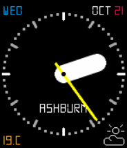</a>

<h2 class="app-name" id="app-562498b7b3d1426740000034"><a href="https://apps.repebble.com/562498b7b3d1426740000034">IvyTick</a></h2>
<a class="app-source" href="https://github.com/initialneil/PebbleFace-IvyTick.git" title="Source code" data-search-exclude>View source</a>

by <a href="https://apps.repebble.com/apps/dev/neil_5613340e042ac2e922000052" title="More from this developer">Neil</a>

Not checked yet v1.36 Updated 2015-11-05

Runs on: Round 2, Time 2, Time Round, Time

Analog Watch Face from &quot;http://wear.ustwo.com/&quot;. This is a free watch face for fun. - Month, date and weekday are shown - Weather and location are configurable - Configuration page is based on…

