---
hide:
  - toc
---

<!-- Generated by scripts/update_app_directory.py: do not edit by hand -->
# Pebble Watchfaces: J

[← All Pebble Watchfaces](../watchfaces.md) · [A](a.md) · [B](b.md) · [C](c.md) · [D](d.md) · [E](e.md) · [F](f.md) · [G](g.md) · [H](h.md) · [I](i.md) · **J** · [K](k.md) · [L](l.md) · [M](m.md) · [N](n.md) · [O](o.md) · [P](p.md) · [Q](q.md) · [R](r.md) · [S](s.md) · [T](t.md) · [U](u.md) · [V](v.md) · [W](w.md) · [X](x.md) · [Y](y.md) · [Z](z.md) · [0–9 & other](other.md)

*28 watchfaces · Last updated 2026-10-06 · [About these lists](../about-app-lists.md)*

<a class="app-shot" href="https://apps.repebble.com/5812657346041f5ec5000007" data-search-exclude>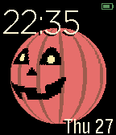</a>

<h2 class="app-name" id="app-5812657346041f5ec5000007"><a href="https://apps.repebble.com/5812657346041f5ec5000007">JackO</a></h2>
<a class="app-source" href="https://github.com/gitvestman/PebbleGlobe/tree/halloween" title="Source code" data-search-exclude>View source</a>

by <a href="https://apps.repebble.com/apps/dev/vestman_553ea9dd435307fdce000089" title="More from this developer">Vestman</a>

Not checked yet v1.0 Updated 2016-10-27

Runs on: Round 2, Time 2, Pebble 2 Duo, Pebble 2, Time Round, Time, Classic

Spinning Jack-o&#x27;-lantern for halloween

<h2 class="app-name" id="app-5609b3bf1e0926ab1b00009d"><a href="https://apps.repebble.com/5609b3bf1e0926ab1b00009d">Jade Rabbit</a></h2>
<a class="app-source" href="https://github.com/phatsk/pebble-jade-rabbit" title="Source code" data-search-exclude>View source</a>

by <a href="https://apps.repebble.com/apps/dev/phatskat_54f9e935cf9458157f000067" title="More from this developer">phatskat</a>

Not checked yet v1.0 Updated 2015-09-28

Runs on: Time 2, Pebble 2 Duo, Pebble 2, Time, Classic

A simple black and white watchface with the Jade Rabbit emblem from Destiny

<h2 class="app-name" id="app-54bd317d54845b5000000043"><a href="https://apps.repebble.com/54bd317d54845b5000000043">Jake the Dog</a></h2>
<a class="app-source" href="https://github.com/jessemillar/Pebbling/tree/master/Jake-the-Dog" title="Source code" data-search-exclude>View source</a>

by <a href="https://apps.repebble.com/apps/dev/jesse-millar_54305df1a2f622febf0001cc" title="More from this developer">Jesse Millar</a>

Not checked yet v1.0 Updated 2015-01-19

Runs on: Time 2, Pebble 2 Duo, Pebble 2, Time, Classic

A simple Adventure Time watchface because Jake&#x27;s the best!

<h2 class="app-name" id="app-b3891d1ba0164c1bb552d780"><a href="https://apps.repebble.com/b3891d1ba0164c1bb552d780">jane doe</a></h2>
<a class="app-source" href="https://codeberg.org/joshlau/jane-doe-watchface" title="Source code" data-search-exclude>View source</a>

by <a href="https://apps.repebble.com/apps/dev/josh-lau_7c2f9385ca73b9a97da1a9be" title="More from this developer">Josh Lau</a>

See source v0.8.0 Updated 2026-08-04

Runs on: Time 2

&quot;Me too. I like the country mouse too.&quot;

<a class="app-shot" href="https://apps.repebble.com/97bc032c51614549b3c33200" data-search-exclude>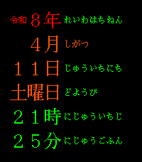</a>

<h2 class="app-name" id="app-97bc032c51614549b3c33200"><a href="https://apps.repebble.com/97bc032c51614549b3c33200">Japanese Date &amp; Time Practice</a></h2>
<a class="app-source" href="https://github.com/freakified/japanese-date-time-practice" title="Source code" data-search-exclude>View source</a>

by <a href="https://apps.repebble.com/apps/dev/freakified_534d74f861fcaa8033000263" title="More from this developer">Freakified</a>

Not checked yet v1.1 Updated 2026-04-13

Runs on: Round 2, Time 2, Pebble 2 Duo, Pebble 2, Time Round, Time, Classic

Inspired by JR&#x27;s Platform Signage, you can use this watchface to learn the proper way to pronounce dates and times in Japanese! No language pack required! Japanese Time &amp; Date Practice is a Pebble…

<h2 class="app-name" id="app-531cd697357b23b15e000272"><a href="https://apps.repebble.com/531cd697357b23b15e000272">Japanese Text Watch (Romanji)</a></h2>
<a class="app-source" href="https://github.com/AlexanderPico/PebbleTextWatch/tree/japanese" title="Source code" data-search-exclude>View source</a>

by <a href="https://apps.repebble.com/apps/dev/alexanderpico_531ca79f46b8f200dd00028b" title="More from this developer">AlexanderPico</a>

No licence v2.0.0 Updated 2014-03-09

Runs on: Time 2, Pebble 2 Duo, Pebble 2, Time, Classic

The Japanese (Romanji) version of the Pebble Text Watch project. This version shows hours (ji) and minutes (fun) in romanji text, just as you would speak it in Japanese. \(^u^ )/ emoji says, &quot;This…

<h2 class="app-name" id="app-3d0b528d14fd447792535689"><a href="https://apps.repebble.com/3d0b528d14fd447792535689">JapaneseKanjiWatchface</a></h2>
<a class="app-source" href="https://github.com/ping840907/jpkanjiwatchface" title="Source code" data-search-exclude>View source</a>

by <a href="https://apps.repebble.com/apps/dev/sloth8497_68c4a750647ef000080f0b2d" title="More from this developer">Sloth8497</a>

Not checked yet v1.0 Updated 2026-04-04

Runs on: Time 2, Pebble 2 Duo, Pebble 2, Time, Classic

A watch face that uses pixelated Japanese kanji to display the time and date, similar to my previous work, but with localized design.

<a class="app-shot" href="https://apps.rebble.io/en_US/application/693d606ec098f80009210c9f" data-search-exclude>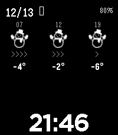</a>

<h2 class="app-name" id="app-693d606ec098f80009210c9f"><a href="https://apps.rebble.io/en_US/application/693d606ec098f80009210c9f">JapanWeather2025</a></h2>
<a class="app-source" href="https://github.com/akihirokawanami/JapanWeather2025" title="Source code" data-search-exclude>View source</a>

by <a href="https://apps.rebble.io/en_US/developer/690c97353426e30009c601ee/1" title="More from this developer">AkihiroKawanami</a>

MIT v1.1 Updated 2025-12-13 Rebble App Store

Runs on: Round 2, Time 2, Pebble 2 Duo, Pebble 2, Time Round, Time, Classic

いくつかウォッチフェイスを試したが、天気APIサービス自体がなくなっていたりして取得できなかったので、2025年に使えるものを作りました。 1日3回（7時、12時、19時）の予報として、 天気アイコン 風速レベル（1～5段階で「&gt;」を表示） 風速の下に気温 を表示します。 日本国内で精度の高い JMA Seamless モデルの予報を使用。 2025年12月時点、動作しています。…

<h2 class="app-name" id="app-544f8cc6dc21b70fe9000056"><a href="https://apps.repebble.com/544f8cc6dc21b70fe9000056">jarl</a></h2>
<a class="app-source" href="https://github.com/cipi1965/Jarl-Pebble" title="Source code" data-search-exclude>View source</a>

by <a href="https://apps.repebble.com/apps/dev/matteo-piccina_52f10e8d3be6208c1f0020a5" title="More from this developer">Matteo Piccina</a>

Not checked yet v2.6 Updated 2026-04-15

Runs on: Time 2, Pebble 2 Duo, Pebble 2, Time, Classic

jarl (the name of the watchface) is a tribute to spanish comedian Chiquito de la Calzada You can see the date, temperature and weather conditions shaking your wrist. This watchface doesn&#x27;t use any…

<a class="app-shot" href="https://apps.repebble.com/5685bba15bcfd88ec900007f" data-search-exclude>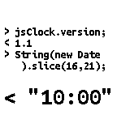</a>

<h2 class="app-name" id="app-5685bba15bcfd88ec900007f"><a href="https://apps.repebble.com/5685bba15bcfd88ec900007f">javaScriptClock</a></h2>
<a class="app-source" href="https://github.com/ryanpcmcquen/PEBBLE--javaScriptClock" title="Source code" data-search-exclude>View source</a>

by <a href="https://apps.repebble.com/apps/dev/ryanpcmcquen_567c70738dba1f775c0000c2" title="More from this developer">ryanpcmcquen</a>

Not checked yet v1.1 Updated 2016-01-01

Runs on: Time 2, Pebble 2 Duo, Pebble 2, Time, Classic

Time for JavaScript hackers. Written in pure C, because #perfMatters.

<a class="app-shot" href="https://apps.rebble.io/en_US/application/69514fb711ece50009816c83" data-search-exclude>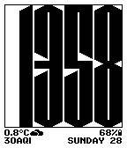</a>

<h2 class="app-name" id="app-69514fb711ece50009816c83"><a href="https://apps.rebble.io/en_US/application/69514fb711ece50009816c83">Jealous</a></h2>
<a class="app-source" href="https://github.com/ir33k/jealous" title="Source code" data-search-exclude>View source</a>

by <a href="https://apps.rebble.io/en_US/developer/636763090587050008d091aa/1" title="More from this developer">irek</a>

Not checked yet v1.0 Updated 2025-12-28 Rebble App Store

Runs on: Time 2, Pebble 2 Duo, Pebble 2, Time, Classic

My take on watchface with tall font and weather. - Digital time 24/12h with optional seconds - Up to 8 lines of text on left and right side with date, time, health, icons, weather and more - Quick…

<h2 class="app-name" id="app-581f83d89cbbaf5d7200030c"><a href="https://apps.repebble.com/581f83d89cbbaf5d7200030c">Jeep Time</a></h2>
<a class="app-source" href="https://github.com/xcsrz/pebble-jeep-watchface" title="Source code" data-search-exclude>View source</a>

by <a href="https://apps.repebble.com/apps/dev/xcsrz_581f83651c0888f0460002d3" title="More from this developer">xcsrz</a>

Not checked yet v1.2 Updated 2016-11-16

Runs on: Time 2, Time

A Pebble Time watchface themed for jeep folk. Currently there is only one model (1941 MB), but more are coming. Configurable options include: - full customized color for body, time and background…

<h2 class="app-name" id="app-55330397ac0751099d00008a"><a href="https://apps.repebble.com/55330397ac0751099d00008a">JFD TextFrench</a></h2>
<a class="app-source" href="https://github.com/jfdesrochers/TextFrench" title="Source code" data-search-exclude>View source</a>

by <a href="https://apps.repebble.com/apps/dev/jean-francois-desrochers_552d8a338215a2d91a000065" title="More from this developer">Jean-Francois Desrochers</a>

Not checked yet v3.0 Updated 2015-04-19

Runs on: Time 2, Pebble 2 Duo, Pebble 2, Time, Classic

The ultimate french translation of the Pebble TextWatch! Based on TextWatch by Work in Progress and borrows ideas from Dots and Squares by Ben Nguyen. Featuring: - A beautiful and clean user…

<a class="app-shot" href="https://apps.repebble.com/5562b6a4fd9c4b314600001e" data-search-exclude>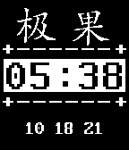</a>

<h2 class="app-name" id="app-5562b6a4fd9c4b314600001e"><a href="https://apps.repebble.com/5562b6a4fd9c4b314600001e">jiguo</a></h2>
<a class="app-source" href="http://jiguo.com" title="Source code" data-search-exclude>View source</a>

by <a href="https://apps.repebble.com/apps/dev/rexiyz_5542263e80f0adc044000055" title="More from this developer">rexiyz</a>

See source v1.0 Updated 2015-05-25

Runs on: Time 2, Pebble 2 Duo, Pebble 2, Time, Classic

最下面三个数字为主页主推产品试用倒计时的天、小时、分钟。

<a class="app-shot" href="https://apps.repebble.com/5482df1b571fcff354000053" data-search-exclude>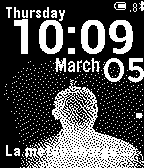</a>

<h2 class="app-name" id="app-5482df1b571fcff354000053"><a href="https://apps.repebble.com/5482df1b571fcff354000053">JMuWatchface</a></h2>
<a class="app-source" href="https://github.com/jmuredubois/JMuWatchface" title="Source code" data-search-exclude>View source</a>

by <a href="https://apps.repebble.com/apps/dev/james-mure-dubois_546601d69c66283579000046" title="More from this developer">James Mure-Dubois</a>

Not checked yet v1.3 Updated 2015-01-01

Runs on: Time 2, Pebble 2 Duo, Pebble 2, Time, Classic

My watchface with TOF photograph of myself, along with weather info display

<h2 class="app-name" id="app-e0674b14bb264d18a7d48374"><a href="https://apps.repebble.com/e0674b14bb264d18a7d48374">Journeys</a></h2>
<a class="app-source" href="https://github.com/Maxahoy/pebble-journeys" title="Source code" data-search-exclude>View source</a>

by <a href="https://apps.repebble.com/apps/dev/maxwell-williams_3133fe86efb8421bc2a5ef48" title="More from this developer">Maxwell Williams</a>

No licence v1.0.2 Updated 2026-06-18

Runs on: Round 2, Time 2

A road trip companion watchface for Pebble Time 2. Tracks daily leg and overall trip progress automatically via GPS. Shows current and destination weather along the way. Shake your wrist to update…

<a class="app-shot" href="https://apps.rebble.io/en_US/application/6a27a3ef519e960009bb8258" data-search-exclude>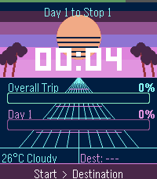</a>

<h2 class="app-name" id="app-6a27a3ef519e960009bb8258"><a href="https://apps.rebble.io/en_US/application/6a27a3ef519e960009bb8258">Journeys - Road Trip Tracker</a></h2>
<a class="app-source" href="https://github.com/Maxahoy/pebble-journeys/tree/main" title="Source code" data-search-exclude>View source</a>

by <a href="https://apps.rebble.io/en_US/developer/698c8f81f8082b0008b5aab8/1" title="More from this developer">Maxahoy</a>

No licence v1.0.2 Updated 2026-06-18 Rebble App Store

Runs on: Round 2, Time 2

A road trip companion watchface for Pebble Time 2. Tracks daily leg and overall trip progress automatically via GPS. Shows current and destination weather along the way. Shake your wrist to update…

<a class="app-shot" href="https://apps.repebble.com/a1df9a2e91944d208b5313a4" data-search-exclude>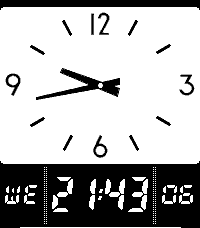</a>

<h2 class="app-name" id="app-a1df9a2e91944d208b5313a4"><a href="https://apps.repebble.com/a1df9a2e91944d208b5313a4">JPN STA CLK</a></h2>
<a class="app-source" href="https://github.com/tc5206/pebble_JPN_STA_CLK" title="Source code" data-search-exclude>View source</a>

by <a href="https://apps.repebble.com/apps/dev/tc5206_f10b6e35701081a6841ded3d" title="More from this developer">tc5206</a>

Not checked yet v1.3 Updated 2026-05-28

Runs on: Round 2, Time 2, Pebble 2 Duo, Pebble 2, Time Round, Time, Classic

A Japanese station-style clock for your wrist. - 30-second interval hand movement. - Realistic overshoot animation. - Partial color customization for Time/Time 2 and Round/Round 2. - Built with…

<a class="app-shot" href="https://apps.repebble.com/562334aebdf1bf8d58000036" data-search-exclude>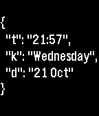</a>

<h2 class="app-name" id="app-562334aebdf1bf8d58000036"><a href="https://apps.repebble.com/562334aebdf1bf8d58000036">jsonface</a></h2>
<a class="app-source" href="https://github.com/ejball/jsonface" title="Source code" data-search-exclude>View source</a>

by <a href="https://apps.repebble.com/apps/dev/ejball_55f4ee863cee5fdb7700004c" title="More from this developer">ejball</a>

Not checked yet v1.1 Updated 2015-10-22

Runs on: Round 2, Time 2, Pebble 2 Duo, Pebble 2, Time Round, Time, Classic

A geeky watchface that looks like a JSON document.

<a class="app-shot" href="https://apps.repebble.com/5573a3ad7d6f3ddaae0000c3" data-search-exclude>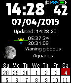</a>

<h2 class="app-name" id="app-5573a3ad7d6f3ddaae0000c3"><a href="https://apps.repebble.com/5573a3ad7d6f3ddaae0000c3">Jupiter</a></h2>
<a class="app-source" href="https://github.com/gretchycat/DarkSide" title="Source code" data-search-exclude>View source</a>

by <a href="https://apps.repebble.com/apps/dev/gretchycat_52bf60060136db31fb0000d3" title="More from this developer">Gretchycat</a>

Not checked yet v3.0 Updated 2015-10-19

Runs on: Time 2, Pebble 2 Duo, Pebble 2, Time, Classic

The majestic 5th planet from our sun, Jupiter! Features a 2 week calendar, and when you shake or tap, see a 5 day weather forecast. Tap again for sunrise, sunset and moon phase. Tap a third time…

<a class="app-shot" href="https://apps.repebble.com/556a4727da4c418e7800006f" data-search-exclude>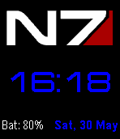</a>

<h2 class="app-name" id="app-556a4727da4c418e7800006f"><a href="https://apps.repebble.com/556a4727da4c418e7800006f">Jupiter Mass</a></h2>
<a class="app-source" href="https://github.com/clach04/watchface_JupiterMass" title="Source code" data-search-exclude>View source</a>

by <a href="https://apps.repebble.com/apps/dev/clach04_5524604a9de9550a3300007a" title="More from this developer">clach04</a>

Not checked yet v0.4 Updated 2015-09-26

Runs on: Time 2, Pebble 2 Duo, Pebble 2, Time, Classic

Note see new watchface Jupter Mass Xen, which has a slightly bigger font for time. Simple digital watchface that updates once a minute. For Basalt (Time) and Aplite (Pebble). Includes battery…

<h2 class="app-name" id="app-5606177b1ba070a986000032"><a href="https://apps.repebble.com/5606177b1ba070a986000032">Jupiter Mass Xen</a></h2>
<a class="app-source" href="https://github.com/clach04/watchface_JupiterMass/" title="Source code" data-search-exclude>View source</a>

by <a href="https://apps.repebble.com/apps/dev/clach04_5524604a9de9550a3300007a" title="More from this developer">clach04</a>

Not checked yet v0.7 Updated 2016-06-18

Runs on: Round 2, Time 2, Pebble 2 Duo, Pebble 2, Time Round, Time, Classic

Basic digital watch face for the Pebble smartwatch. Features: * Updates once per minute * Includes battery status * Supports Aplite (original Pebble), Basalt (Pebble Time), and Chalk (Pebble Time…

<h2 class="app-name" id="app-570e3904bf385ce8dc00001e"><a href="https://apps.repebble.com/570e3904bf385ce8dc00001e">Jurassic Park</a></h2>
<a class="app-source" href="https://bitbucket.org/leandrobalan/jpark_watchface" title="Source code" data-search-exclude>View source</a>

by <a href="https://apps.repebble.com/apps/dev/leo-balan_5705aeca0819fbba3600000e" title="More from this developer">Leo Balan</a>

See source v1.0 Updated 2016-04-13

Runs on: Round 2, Time Round

A simple Jurassic Park themed watchface for the Pebble Time Round.

<a class="app-shot" href="https://apps.repebble.com/53e57bdaff0b419da92e8385" data-search-exclude>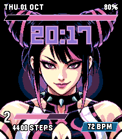</a>

<h2 class="app-name" id="app-53e57bdaff0b419da92e8385"><a href="https://apps.repebble.com/53e57bdaff0b419da92e8385">Juri</a></h2>
<a class="app-source" href="https://codeberg.org/Chaurunda/Juri-Watchface" title="Source code" data-search-exclude>View source</a>

by <a href="https://apps.repebble.com/apps/dev/chaurunda_787bccce6f0ac6c851392638" title="More from this developer">Chaurunda</a>

See source v1.2.2 Updated 2026-10-05

Runs on: Time 2

Pixel-art watchface for Pebble Time 2 inspired by the Street Fighter 6 HUD: battery as the health bar, time as the round timer, steps as the Super Art gauge.

<h2 class="app-name" id="app-52d8bb0faef8d590d300002f"><a href="https://apps.repebble.com/52d8bb0faef8d590d300002f">Just a Bit</a></h2>
<a class="app-source" href="https://github.com/pebble/pebble-sdk-examples/tree/master/watchfaces/just_a_bit" title="Source code" data-search-exclude>View source</a>

by <a href="https://apps.repebble.com/apps/dev/pebble_52d8a44faef8d590d3000029" title="More from this developer">Pebble</a>

Not checked yet v4.0.0 Updated 2014-01-17

Runs on: Time 2, Pebble 2 Duo, Pebble 2, Time, Classic

Just a Bit Example Watchface

<h2 class="app-name" id="app-532b28d8e8829439f200039e"><a href="https://apps.repebble.com/532b28d8e8829439f200039e">Just a Bit More</a></h2>
<a class="app-source" href="https://github.com/dudyk/peble-jabm" title="Source code" data-search-exclude>View source</a>

by <a href="https://apps.repebble.com/apps/dev/david-kohen_531e040114708b520a00009e" title="More from this developer">David Kohen</a>

Not checked yet v2.0.0 Updated 2014-03-20

Runs on: Time 2, Pebble 2 Duo, Pebble 2, Time, Classic

Based on the sample binary watchface, this version is fully binary (and not binary decimal), accepts the 24h/12h setting and includes a date.

<a class="app-shot" href="https://apps.rebble.io/en_US/application/69034d22d004720008412cf1" data-search-exclude>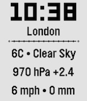</a>

<h2 class="app-name" id="app-69034d22d004720008412cf1"><a href="https://apps.rebble.io/en_US/application/69034d22d004720008412cf1">Just Weather</a></h2>
<a class="app-source" href="https://github.com/digitalurban/just-weather-pebble-watchface" title="Source code" data-search-exclude>View source</a>

by <a href="https://apps.rebble.io/en_US/developer/68e3f6cf0fd0b500086cea51/1" title="More from this developer">digitalurban</a>

Not checked yet v3.4 Updated 2026-01-19 Rebble App Store

Runs on: Time 2, Pebble 2 Duo, Pebble 2, Time

Shows the Time, Location, Pressure (with Trend), Temperature, Conditions, Wind Gust and Rainfall amount from Open Meteo. Units can be configured, and it has an optional &#x27;Vibrate on the Hour&#x27;…

<a class="app-shot" href="https://apps.repebble.com/50bdea7ee3ff48308157c046" data-search-exclude>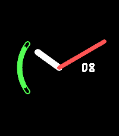</a>

<h2 class="app-name" id="app-50bdea7ee3ff48308157c046"><a href="https://apps.repebble.com/50bdea7ee3ff48308157c046">JustTheTime</a></h2>
<a class="app-source" href="https://github.com/KiserDesigns/Pebble_JustTheTime" title="Source code" data-search-exclude>View source</a>

by <a href="https://apps.repebble.com/apps/dev/noah-kiser_309e95d94e23b9be8fa889d9" title="More from this developer">Noah Kiser</a>

No licence v1.2 Updated 2026-04-08

Runs on: Round 2, Time 2, Pebble 2 Duo, Pebble 2, Time Round, Time, Classic

An analog clock with day-of-month window and battery meter arc. Colors and sizes of all elements are configurable.

