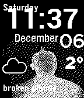

<!-- Generated by scripts/update_app_directory.py: do not edit by hand -->
# Watchfaces: J

[← About this list](../watchfaces.md) · [A](a.md) · [B](b.md) · [C](c.md) · [D](d.md) · [E](e.md) · [F](f.md) · [G](g.md) · [H](h.md) · [I](i.md) · **J** · [K](k.md) · [L](l.md) · [M](m.md) · [N](n.md) · [O](o.md) · [P](p.md) · [Q](q.md) · [R](r.md) · [S](s.md) · [T](t.md) · [U](u.md) · [V](v.md) · [W](w.md) · [X](x.md) · [Y](y.md) · [Z](z.md) · [0–9 & other](other.md)

*29 watchfaces · Last updated 2026-10-06*

| Screenshot | Name | Developer | Licence | Updated | Description |
|------------|------|-----------|---------|---------|-------------|
| { loading=lazy width="72" } | [JackO](https://apps.repebble.com/5812657346041f5ec5000007) | [Vestman](https://github.com/gitvestman/PebbleGlobe/tree/halloween) | <small>Not checked yet</small> | 2016-10-27 | Spinning Jack-o'-lantern for halloween |
| { loading=lazy width="72" } | [Jade Rabbit](https://apps.rebble.io/en_US/application/5609b3bf1e0926ab1b00009d) <small>Rebble App Store</small> | [phatskat](https://github.com/phatsk/pebble-jade-rabbit) | <small>Not checked yet</small> | 2015-09-28 | A simple black and white watchface with the Jade Rabbit emblem from Destiny |
| { loading=lazy width="72" } | [Jake the Dog](https://apps.rebble.io/en_US/application/54bd317d54845b5000000043) <small>Rebble App Store</small> | [Jesse Millar](https://github.com/jessemillar/Pebbling/tree/master/Jake-the-Dog) | <small>Not checked yet</small> | 2015-01-19 | A simple Adventure Time watchface because Jake's the best! |
| { loading=lazy width="72" } | [jane doe](https://apps.repebble.com/b3891d1ba0164c1bb552d780) | [Josh Lau](https://codeberg.org/joshlau/jane-doe-watchface) | <small>See source</small> | 2026-08-04 | "Me too. I like the country mouse too." |
| { loading=lazy width="72" } | [Japanese Date & Time Practice](https://apps.repebble.com/97bc032c51614549b3c33200) | [Freakified](https://github.com/freakified/japanese-date-time-practice) | <small>Not checked yet</small> | 2026-04-13 | Inspired by JR's Platform Signage, you can use this watchface to learn the proper way to pronounce dates and times in Japanese! No language pack required!… |
| { loading=lazy width="72" } | [Japanese Date & Time Practice](https://apps.rebble.io/en_US/application/69dc09d0a6ffe60009c5912a) <small>Rebble App Store</small> | [Freakified](https://github.com/freakified/japanese-date-time-practice) | <small>Not checked yet</small> | 2026-04-13 | Inspired by JR's Platform Signage, you can use this watchface to learn the proper way to pronounce dates and times in Japanese! No language pack required!… |
| { loading=lazy width="72" } | [Japanese Text Watch (Romanji)](https://apps.rebble.io/en_US/application/531cd697357b23b15e000272) <small>Rebble App Store</small> | [AlexanderPico](https://github.com/AlexanderPico/PebbleTextWatch/tree/japanese) | <small>No licence</small> | 2014-03-09 | The Japanese (Romanji) version of the Pebble Text Watch project. This version shows hours (ji) and minutes (fun) in romanji text, just as you would speak it… |
| { loading=lazy width="72" } | [JapaneseKanjiWatchface](https://apps.repebble.com/3d0b528d14fd447792535689) | [Sloth8497](https://github.com/ping840907/jpkanjiwatchface) | <small>Not checked yet</small> | 2026-04-04 | A watch face that uses pixelated Japanese kanji to display the time and date, similar to my previous work, but with localized design. |
| { loading=lazy width="72" } | [JapanWeather2025](https://apps.rebble.io/en_US/application/693d606ec098f80009210c9f) <small>Rebble App Store</small> | [AkihiroKawanami](https://github.com/akihirokawanami/JapanWeather2025) | <small>Not checked yet</small> | 2025-12-13 | いくつかウォッチフェイスを試したが、天気APIサービス自体がなくなっていたりして取得できなかったので、2025年に使えるものを作りました。 1日3回（7時、12時、19時）の予報として、 天気アイコン 風速レベル（1～5段階で「&gt;」を表示） 風速の下に気温 を表示します。 日本国内で精度の高い JMA… |
| { loading=lazy width="72" } | [jarl](https://apps.repebble.com/544f8cc6dc21b70fe9000056) | [Matteo Piccina](https://github.com/cipi1965/Jarl-Pebble) | <small>Not checked yet</small> | 2026-04-15 | jarl (the name of the watchface) is a tribute to spanish comedian Chiquito de la Calzada You can see the date, temperature and weather conditions shaking… |
| { loading=lazy width="72" } | [javaScriptClock](https://apps.rebble.io/en_US/application/5685bba15bcfd88ec900007f) <small>Rebble App Store</small> | [ryanpcmcquen](https://github.com/ryanpcmcquen/PEBBLE--javaScriptClock) | <small>Not checked yet</small> | 2016-01-01 | Time for JavaScript hackers. Written in pure C, because #perfMatters. |
| { loading=lazy width="72" } | [Jealous](https://apps.rebble.io/en_US/application/69514fb711ece50009816c83) <small>Rebble App Store</small> | [irek](https://github.com/ir33k/jealous) | <small>Not checked yet</small> | 2025-12-28 | My take on watchface with tall font and weather. - Digital time 24/12h with optional seconds - Up to 8 lines of text on left and right side with date, time… |
| { loading=lazy width="72" } | [Jeep Time](https://apps.repebble.com/581f83d89cbbaf5d7200030c) | [xcsrz](https://github.com/xcsrz/pebble-jeep-watchface) | <small>Not checked yet</small> | 2016-11-16 | A Pebble Time watchface themed for jeep folk. Currently there is only one model (1941 MB), but more are coming. Configurable options include: - full… |
| { loading=lazy width="72" } | [JFD TextFrench](https://apps.rebble.io/en_US/application/55330397ac0751099d00008a) <small>Rebble App Store</small> | [Jean-Francois Desrochers](https://github.com/jfdesrochers/TextFrench) | <small>Not checked yet</small> | 2015-04-19 | The ultimate french translation of the Pebble TextWatch! Based on TextWatch by Work in Progress and borrows ideas from Dots and Squares by Ben Nguyen… |
| { loading=lazy width="72" } | [jiguo](https://apps.rebble.io/en_US/application/5562b6a4fd9c4b314600001e) <small>Rebble App Store</small> | [rexiyz](http://jiguo.com) | <small>See source</small> | 2015-05-25 | 最下面三个数字为主页主推产品试用倒计时的天、小时、分钟。 |
| { loading=lazy width="72" } | [JMuWatchface](https://apps.rebble.io/en_US/application/5482df1b571fcff354000053) <small>Rebble App Store</small> | [James Mure-Dubois](https://github.com/jmuredubois/JMuWatchface) | <small>Not checked yet</small> | 2015-01-01 | My watchface with TOF photograph of myself, along with weather info display |
| { loading=lazy width="72" } | [Journeys](https://apps.repebble.com/e0674b14bb264d18a7d48374) | [Maxwell Williams](https://github.com/Maxahoy/pebble-journeys) | <small>Not checked yet</small> | 2026-06-18 | A road trip companion watchface for Pebble Time 2. Tracks daily leg and overall trip progress automatically via GPS. Shows current and destination weather… |
| { loading=lazy width="72" } | [Journeys - Road Trip Tracker](https://apps.rebble.io/en_US/application/6a27a3ef519e960009bb8258) <small>Rebble App Store</small> | [Maxahoy](https://github.com/Maxahoy/pebble-journeys/tree/main) | <small>Not checked yet</small> | 2026-06-18 | A road trip companion watchface for Pebble Time 2. Tracks daily leg and overall trip progress automatically via GPS. Shows current and destination weather… |
| { loading=lazy width="72" } | [JPN STA CLK](https://apps.repebble.com/a1df9a2e91944d208b5313a4) | [tc5206](https://github.com/tc5206/pebble_JPN_STA_CLK) | <small>Not checked yet</small> | 2026-05-28 | A Japanese station-style clock for your wrist. - 30-second interval hand movement. - Realistic overshoot animation. - Partial color customization for… |
| { loading=lazy width="72" } | [jsonface](https://apps.rebble.io/en_US/application/562334aebdf1bf8d58000036) <small>Rebble App Store</small> | [ejball](https://github.com/ejball/jsonface) | <small>Not checked yet</small> | 2015-10-22 | A geeky watchface that looks like a JSON document. |
| { loading=lazy width="72" } | [Jupiter](https://apps.rebble.io/en_US/application/5573a3ad7d6f3ddaae0000c3) <small>Rebble App Store</small> | [Gretchycat](https://github.com/gretchycat/DarkSide) | <small>Not checked yet</small> | 2015-10-19 | The majestic 5th planet from our sun, Jupiter! Features a 2 week calendar, and when you shake or tap, see a 5 day weather forecast. Tap again for sunrise… |
| { loading=lazy width="72" } | [Jupiter Mass](https://apps.rebble.io/en_US/application/556a4727da4c418e7800006f) <small>Rebble App Store</small> | [clach04](https://github.com/clach04/watchface_JupiterMass) | <small>Not checked yet</small> | 2015-09-26 | Note see new watchface Jupter Mass Xen, which has a slightly bigger font for time. Simple digital watchface that updates once a minute. For Basalt (Time)… |
| { loading=lazy width="72" } | [Jupiter Mass Xen](https://apps.repebble.com/5606177b1ba070a986000032) | [clach04](https://github.com/clach04/watchface_JupiterMass/) | <small>Not checked yet</small> | 2016-06-18 | Basic digital watch face for the Pebble smartwatch. Features: * Updates once per minute * Includes battery status * Supports Aplite (original Pebble)… |
| { loading=lazy width="72" } | [Jurassic Park](https://apps.repebble.com/570e3904bf385ce8dc00001e) | [Leo Balan](https://bitbucket.org/leandrobalan/jpark_watchface) | <small>See source</small> | 2016-04-13 | A simple Jurassic Park themed watchface for the Pebble Time Round. |
| { loading=lazy width="72" } | [Juri](https://apps.repebble.com/53e57bdaff0b419da92e8385) | [Chaurunda](https://codeberg.org/Chaurunda/Juri-Watchface) | <small>See source</small> | 2026-10-05 | Pixel-art watchface for Pebble Time 2 inspired by the Street Fighter 6 HUD: battery as the health bar, time as the round timer, steps as the Super Art gauge. |
| { loading=lazy width="72" } | [Just a Bit](https://apps.rebble.io/en_US/application/52d8bb0faef8d590d300002f) <small>Rebble App Store</small> | [Pebble](https://github.com/pebble/pebble-sdk-examples/tree/master/watchfaces/just_a_bit) | <small>Not checked yet</small> | 2014-01-17 | Just a Bit Example Watchface |
| { loading=lazy width="72" } | [Just a Bit More](https://apps.rebble.io/en_US/application/532b28d8e8829439f200039e) <small>Rebble App Store</small> | [David Kohen](https://github.com/dudyk/peble-jabm) | <small>Not checked yet</small> | 2014-03-20 | Based on the sample binary watchface, this version is fully binary (and not binary decimal), accepts the 24h/12h setting and includes a date. |
| { loading=lazy width="72" } | [Just Weather](https://apps.rebble.io/en_US/application/69034d22d004720008412cf1) <small>Rebble App Store</small> | [digitalurban](https://github.com/digitalurban/just-weather-pebble-watchface) | <small>Not checked yet</small> | 2026-01-19 | Shows the Time, Location, Pressure (with Trend), Temperature, Conditions, Wind Gust and Rainfall amount from Open Meteo. Units can be configured, and it has… |
| { loading=lazy width="72" } | [JustTheTime](https://apps.repebble.com/50bdea7ee3ff48308157c046) | [Noah Kiser](https://github.com/KiserDesigns/Pebble_JustTheTime) | <small>No licence</small> | 2026-04-08 | An analog clock with day-of-month window and battery meter arc. Colors and sizes of all elements are configurable. |
