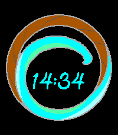

<!-- Generated by scripts/update_app_directory.py: do not edit by hand -->
# Watchfaces: K

[← About this list](../watchfaces.md) · [A](a.md) · [B](b.md) · [C](c.md) · [D](d.md) · [E](e.md) · [F](f.md) · [G](g.md) · [H](h.md) · [I](i.md) · [J](j.md) · **K** · [L](l.md) · [M](m.md) · [N](n.md) · [O](o.md) · [P](p.md) · [Q](q.md) · [R](r.md) · [S](s.md) · [T](t.md) · [U](u.md) · [V](v.md) · [W](w.md) · [X](x.md) · [Y](y.md) · [Z](z.md) · [0–9 & other](other.md)

*36 watchfaces · Last updated 2026-10-06*

| Screenshot | Name | Developer | Licence | Updated | Description |
|------------|------|-----------|---------|---------|-------------|
| { loading=lazy width="72" } | [Kagi Doggo](https://apps.rebble.io/en_US/application/68361a83a9c183000a8f714a) <small>Rebble App Store</small> | [James Downs](https://github.com/CometDog/pebble-kagi-doggo) | <small>No licence</small> | 2025-11-05 | Displays the time with the Kagi Doggo's toes as the hour hand chasing the ball as the minute hand. Please note, I am not affiliated with Kagi, I am just a… |
| { loading=lazy width="72" } | [Kaleido](https://apps.repebble.com/6b19f2170a6b45c288df46af) | [bastooky](https://github.com/bastooky/kaleido) | <small>Not checked yet</small> | 2026-07-12 | A kaleidoscope for your wrist. The whole screen is a flowing mosaic driven by Perlin-style noise, with giant digits woven directly into the grid. A new… |
| { loading=lazy width="72" } | [Kamots Time](https://apps.repebble.com/55948917327b5a1a0d0000a0) | [kamotswind](http://github.com/theforest/Kamots-Time) | <small>Other</small> | 2016-04-03 | This is a simple low battery utilization watchface with fully customizable colors, battery monitoring and toggle-able Bluetooth status display among other… |
| { loading=lazy width="72" } | [Kasane Teto Analog Baguette](https://apps.repebble.com/ed9c321605604b67b54d621a) | [Chris Eilander.nl](https://github.com/chriseilander/TetoAnalogBaguette) | <small>Not checked yet</small> | 2026-08-09 | A Kasane Teto watchface featuring her favorite food as minute and hour hands. Perfect for round screens. This watchface might be a bit heavy on the RAM side. |
| { loading=lazy width="72" } | [Kasane Teto Analog Baguette](https://apps.rebble.io/en_US/application/6a78ae24aab301000ae2c717) <small>Rebble App Store</small> | [Chris Eilander.nl](https://github.com/chriseilander/TetoAnalogBaguette) | <small>Not checked yet</small> | 2026-08-09 | A Kasane Teto watchface featuring her favorite food as minute and hour hands. Perfect for round screens. This watchface might be a bit heavy on the RAM… |
| { loading=lazy width="72" } | [Kaven](https://apps.repebble.com/589a81211985caf4dd0002b7) | [The Resetter](https://github.com/GreenHex/Pebble.Kaven) | <small>No licence</small> | 2017-02-13 | Watchface to teach my son to tell time. "Prelude" typeface is from Palm webOS. |
| { loading=lazy width="72" } | [Kearsarge Time](https://apps.repebble.com/54932ab374e207c3a9000112) | [Spooner](https://github.com/cmspooner/krhs-time) | <small>Not checked yet</small> | 2016-09-14 | Watchface that displays the current period at Kearsarge Regional High School in color. |
| { loading=lazy width="72" } | [Keep An Eye](https://apps.repebble.com/568aeef96c44e7df0f00000c) | [Mobilpadde](https://github.com/Mobilpadde/Keep-An-Eye) | <small>Not checked yet</small> | 2016-02-23 | Keep an eye on the time. The black part of the eye is the hours and the white shine in the cornea is the minutes. |
| { loading=lazy width="72" } | [Keep it Green](https://apps.repebble.com/f732c3f3661048c0916600af) | [_ArtCoded](https://github.com/art-coded/pebble-keepitgreen) | <small>Not checked yet</small> | 2026-04-15 | Keep it Green is digital/analogic watchface giving you hour and date. Keep control on your daily steps target as well as your heart rate. Setting page let… |
| { loading=lazy width="72" } | [Kemo](https://apps.repebble.com/575c35e2e9dd76b280000018) | [Kamal heib](https://github.com/Kamalheib/KemoPebbleFace) | <small>No licence</small> | 2016-06-11 | Kemo Watchface |
| { loading=lazy width="72" } | [KemoPebble](https://apps.repebble.com/637aa7cbc6c24a000a815ea4) | [CosmicTacoCat](https://github.com/COZMIKDX/KemoPebble) | <small>No licence</small> | 2022-11-20 | A fluffy watchface. Still a work in progress. It will eventually change the animal displayed every hour. Currently only for Pebble Time. I'll work on a… |
| { loading=lazy width="72" } | [Kevinimal](https://apps.repebble.com/a4d962baee314d20819879fe) | [dhrme](https://github.com/dhrme/pebble-apps/tree/main/kevinimal) | <small>Not checked yet</small> | 2026-06-25 | A stripped-back watchface for Pebble Time 2. The time floats large in the centre; everything else tucks into a corner — day + DD/MM top-left, a three-block… |
| { loading=lazy width="72" } | [kface](https://apps.rebble.io/en_US/application/5a36b58b461a8dfe42001479) <small>Rebble App Store</small> | [James Woo](https://github.com/koredev/kface) | <small>Not checked yet</small> | 2017-12-17 | Get time, date, weather, battery, and step information |
| { loading=lazy width="72" } | [kface](https://apps.repebble.com/da0dc9441cf34e9dba801da6) | [kPebble](https://github.com/kooscode/kface) | <small>Not checked yet</small> | 2026-08-28 | kface — A clean, minimal watchface for Pebble Time 2. Time and date up top, a battery meter, live weather (temp, condition, and city — pulled via your… |
| { loading=lazy width="72" } | [Kiddie](https://apps.repebble.com/5831abcb8c7fff66e10000c9) | [The Resetter](https://github.com/GreenHex/Pebble.Woozy) | MIT | 2017-02-13 | Don't take your eyes off the kids! Now with day and date display. |
| { loading=lazy width="72" } | [KinetiCast](https://apps.repebble.com/7f9c89453f7548e1ac494236) | [Eric McCormick](https://github.com/ericlmccormick/Pebble_Health_and_Weather) | <small>Not checked yet</small> | 2026-07-31 | Current weather on top (high/low temp, current condition, current temp), date and time in the middle, health data(heart rate, steps, calories) on the bottom |
| { loading=lazy width="72" } | [Kingfisher](https://apps.repebble.com/7a9d24751b8a49319ec1f6e7) | [justinjhendrick](https://github.com/justinjhendrick/pebble-watchface-digilog) | <small>Not checked yet</small> | 2026-10-03 | Kingfisher is a colorful digital watchface with the sun moving through the day, night, and twilight arcs. Features: * Great battery life * Uses phone… |
| { loading=lazy width="72" } | [Kirby](https://apps.repebble.com/68a395ae8722670009a23809) | [Ongion](https://github.com/Ongion/KirbyWatchface/) | <small>Not checked yet</small> | 2026-05-19 | He's small, he's pink, he's shaped like a friend, and now he's on your Pebble! It's Kirby! Features - Animations - Kirby has 9+ animations! He changes… |
| { loading=lazy width="72" } | [Kirby Black](https://apps.rebble.io/en_US/application/5482ee118f806fbe68000055) <small>Rebble App Store</small> | [metakirby5](https://github.com/metakirby5/pebble-watchface-kirby) | <small>Not checked yet</small> | 2014-12-06 | My first watchface! When Kirby swallows two enemies with abilities at once, he gets the "mix" ability, which allows him to select an ability from a very… |
| { loading=lazy width="72" } | [Kirby Day/Night](https://apps.rebble.io/en_US/application/5482f502571fcff35400005f) <small>Rebble App Store</small> | [metakirby5](https://github.com/metakirby5/pebble-watchface-kirby-daynight) | <small>Not checked yet</small> | 2014-12-08 | When Kirby swallows two enemies with abilities at once, he gets the "mix" ability, which allows him to select an ability from a very fast roulette. This is… |
| { loading=lazy width="72" } | [Kirby GT](https://apps.repebble.com/571abdc769f1bd2fac000013) | [Game Time](https://github.com/WinterWinter/KirbyGT) | <small>Not checked yet</small> | 2016-06-10 | The pink ball of fun has made it to the Pebble smartwatch! Based on the GBA title Kirby Nightmare in Dreamland. Features --Animated Kirby-- 6 Animations… |
| { loading=lazy width="72" } | [Kirby White](https://apps.rebble.io/en_US/application/5482eca6571fcf3114000051) <small>Rebble App Store</small> | [metakirby5](https://github.com/metakirby5/pebble-watchface-kirby) | <small>Not checked yet</small> | 2014-12-06 | My first watchface! When Kirby swallows two enemies with abilities at once, he gets the "mix" ability, which allows him to select an ability from a very… |
| { loading=lazy width="72" } | [Kitsune Clock](https://apps.rebble.io/en_US/application/549ce6991580e3d8cd000106) <small>Rebble App Store</small> | [Kitsune Gaming](https://github.com/KitsuneGaming/KitsuneFace) | <small>No licence</small> | 2014-12-26 | Watchface that has a kitsune (fox) as a background. The current time becomes the eyes. |
| { loading=lazy width="72" } | [Klingon Q'onoS Chrono](https://apps.rebble.io/en_US/application/5378ea1fa43479b74f0001d8) <small>Rebble App Store</small> | [Dan Winker](https://github.com/dwinker/pebble-klingon) | <small>Not checked yet</small> | 2014-05-18 | Watchface used on Q'onoS (Kronos), the Klingon home world. This watchface is 24 hour format because there would be no honor in using 12 hour format. |
| { loading=lazy width="72" } | [KlK](https://apps.repebble.com/536cd1d83b79b3800e0001de) | [exe](https://github.com/exe44/pebble-klk) | <small>Not checked yet</small> | 2016-04-11 | Inspired by the insane anime "KILL la KILL"! |
| { loading=lazy width="72" } | [KnightsFace](https://apps.rebble.io/en_US/application/5a183f5a0dfc323bd000344e) <small>Rebble App Store</small> | [Thomas Stoeckert](https://github.com/thomasstoeckert/KnightsFace) | <small>Not checked yet</small> | 2017-11-26 | Show your Knight Pride with this watchface, with both analog and digital time display. It also has several different icons to fit your mood. |
| { loading=lazy width="72" } | [Kode Dot](https://apps.repebble.com/0b8f41cdbba6456298c9821a) | [Dennis Muensterer](https://github.com/dnnsmnstrr/kode-dot-watchface) | <small>Not checked yet</small> | 2026-07-15 | Wear the new mascot for Kode Dot on your wrist while waiting for the actual device |
| { loading=lazy width="72" } | [Koee watch](https://apps.rebble.io/en_US/application/53b322fce3dd45a937000096) <small>Rebble App Store</small> | [allGreenup](http://andesapp.com/) | <small>See source</small> | 2014-07-01 | Koee watch is real!! Join us and save the planet with Koee!! www.allgreenup.com |
| { loading=lazy width="72" } | [Kona Wave](https://apps.repebble.com/82b2092b5bbd4cc89f5642d0) | [Harrison Allen](https://github.com/HarrisonAllen/kona-wave-watchface) | <small>No licence</small> | 2026-04-04 | A watchface to match some of my real-world accessories! |
| { loading=lazy width="72" } | [Kona Wave](https://apps.rebble.io/en_US/application/69d15c372834b100092b8705) <small>Rebble App Store</small> | [Harrison Allen](https://github.com/HarrisonAllen/kona-wave-watchface) | <small>No licence</small> | 2026-04-04 | A watchface to match some of my real-world accessories! |
| { loading=lazy width="72" } | [Korean Watchface](https://apps.repebble.com/56267426c7810a62a100007d) | [David Wen](https://github.com/Dawenster/korean_watchface) | <small>No licence</small> | 2016-08-05 | Korean watchface on a dark background. Hour, minutes, day of week, month, and day of month. Time in bold. Useful for learning Korean or just telling the… |
| { loading=lazy width="72" } | [krangface](https://apps.rebble.io/en_US/application/56bd18ce54c35f9107000039) <small>Rebble App Store</small> | [j2ko](https://github.com/j2ko/pebble-krangface) | <small>Not checked yet</small> | 2016-02-11 | Simple and unique watchface. Hold evil mind on your wrist. |
| { loading=lazy width="72" } | [KS moded](https://apps.rebble.io/en_US/application/55835eac2f3e32222b00002c) <small>Rebble App Store</small> | [mephissto](https://github.com/mephissto/ks-clock-face/) | <small>Not checked yet</small> | 2016-01-27 | Simple watchface based on KS Original |
| { loading=lazy width="72" } | [Kurisu](https://apps.rebble.io/en_US/application/55b40c2bdeeaa32565000093) <small>Rebble App Store</small> | [Remon](https://gitlab.com/Remon/kurisu_watch_face) | <small>Not checked yet</small> | 2015-07-25 | A Kurisu watchface This is a first attempt watchface. |
| { loading=lazy width="72" } | [kurz vor acht](https://apps.repebble.com/4151feede8864a94905355d0) | [MalteJoe](https://github.com/MalteJoe/kurz-vor-acht) | <small>Not checked yet</small> | 2026-08-22 | This is is a watchface for the Pebble smartwatch that shows the current time in German. Based on the watchface for the original pebbles… |
| { loading=lazy width="72" } | [Kyokusen JS](https://apps.rebble.io/en_US/application/554960c92cfbfca8a20000eb) <small>Rebble App Store</small> | [leovander](https://github.com/leovander/Kyokusen-JS) | <small>Not checked yet</small> | 2015-05-06 | Watchface inspired by Tokyoflash Japan's Kyokusen Watch. Be wary, made with PebbleJS not knowing C is preferred. May fail after awhile but you can refresh… |
