---
hide:
  - toc
---

<!-- Generated by scripts/update_app_directory.py: do not edit by hand -->
# Pebble Watchfaces: K

[← All Pebble Watchfaces](../watchfaces.md) · [A](a.md) · [B](b.md) · [C](c.md) · [D](d.md) · [E](e.md) · [F](f.md) · [G](g.md) · [H](h.md) · [I](i.md) · [J](j.md) · **K** · [L](l.md) · [M](m.md) · [N](n.md) · [O](o.md) · [P](p.md) · [Q](q.md) · [R](r.md) · [S](s.md) · [T](t.md) · [U](u.md) · [V](v.md) · [W](w.md) · [X](x.md) · [Y](y.md) · [Z](z.md) · [0–9 & other](other.md)

*34 watchfaces · Last updated 2026-10-06 · [About these lists](../about-app-lists.md)*

<a class="app-shot" href="https://apps.rebble.io/en_US/application/68361a83a9c183000a8f714a" data-search-exclude>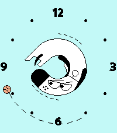</a>

<h2 class="app-name" id="app-68361a83a9c183000a8f714a"><a href="https://apps.rebble.io/en_US/application/68361a83a9c183000a8f714a">Kagi Doggo</a></h2>
<a class="app-source" href="https://github.com/CometDog/pebble-kagi-doggo" title="Source code" data-search-exclude>View source</a>

by <a href="https://apps.rebble.io/en_US/developer/5308eabf92c45e5f39000503/1" title="More from this developer">James Downs</a>

No licence v1.4 Updated 2025-11-05 Rebble App Store

Runs on: Round 2, Time 2, Pebble 2 Duo, Pebble 2, Time Round, Time, Classic

Displays the time with the Kagi Doggo&#x27;s toes as the hour hand chasing the ball as the minute hand. Please note, I am not affiliated with Kagi, I am just a user. More information about Kagi can be…

<a class="app-shot" href="https://apps.repebble.com/6b19f2170a6b45c288df46af" data-search-exclude>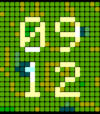</a>

<h2 class="app-name" id="app-6b19f2170a6b45c288df46af"><a href="https://apps.repebble.com/6b19f2170a6b45c288df46af">Kaleido</a></h2>
<a class="app-source" href="https://github.com/bastooky/kaleido" title="Source code" data-search-exclude>View source</a>

by <a href="https://apps.repebble.com/apps/dev/bastooky_3b951b20cb4bdb2b556ec7f1" title="More from this developer">bastooky</a>

No licence v1.0.0 Updated 2026-07-12

Runs on: Time 2, Time

A kaleidoscope for your wrist. The whole screen is a flowing mosaic driven by Perlin-style noise, with giant digits woven directly into the grid. A new pattern blooms every minute — and every time…

<a class="app-shot" href="https://apps.repebble.com/55948917327b5a1a0d0000a0" data-search-exclude>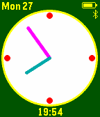</a>

<h2 class="app-name" id="app-55948917327b5a1a0d0000a0"><a href="https://apps.repebble.com/55948917327b5a1a0d0000a0">Kamots Time</a></h2>
<a class="app-source" href="http://github.com/theforest/Kamots-Time" title="Source code" data-search-exclude>View source</a>

by <a href="https://apps.repebble.com/apps/dev/kamotswind_55754e7a315505af78000003" title="More from this developer">kamotswind</a>

Other v4.0 Updated 2016-04-03

Runs on: Time 2, Pebble 2 Duo, Pebble 2, Time, Classic

This is a simple low battery utilization watchface with fully customizable colors, battery monitoring and toggle-able Bluetooth status display among other options. Also has a toggle-able weather…

<h2 class="app-name" id="app-ed9c321605604b67b54d621a"><a href="https://apps.repebble.com/ed9c321605604b67b54d621a">Kasane Teto Analog Baguette</a></h2>
<a class="app-source" href="https://github.com/chriseilander/TetoAnalogBaguette" title="Source code" data-search-exclude>View source</a>

by <a href="https://apps.repebble.com/apps/dev/chris-eilander-nl_546da3e6e2a84b10b200006a" title="More from this developer">Chris Eilander.nl</a>

Not checked yet v1.0.0 Updated 2026-08-09

Runs on: Round 2, Time 2, Time Round, Time

A Kasane Teto watchface featuring her favorite food as minute and hour hands. Perfect for round screens. This watchface might be a bit heavy on the RAM side.

<a class="app-shot" href="https://apps.repebble.com/589a81211985caf4dd0002b7" data-search-exclude>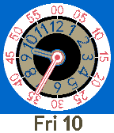</a>

<h2 class="app-name" id="app-589a81211985caf4dd0002b7"><a href="https://apps.repebble.com/589a81211985caf4dd0002b7">Kaven</a></h2>
<a class="app-source" href="https://github.com/GreenHex/Pebble.Kaven" title="Source code" data-search-exclude>View source</a>

by <a href="https://apps.repebble.com/apps/dev/the-resetter_5415133bbcd1cf9264000081" title="More from this developer">The Resetter</a>

No licence v1.7 Updated 2017-02-13

Runs on: Time 2, Time

Watchface to teach my son to tell time. &quot;Prelude&quot; typeface is from Palm webOS.

<a class="app-shot" href="https://apps.repebble.com/54932ab374e207c3a9000112" data-search-exclude>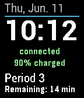</a>

<h2 class="app-name" id="app-54932ab374e207c3a9000112"><a href="https://apps.repebble.com/54932ab374e207c3a9000112">Kearsarge Time</a></h2>
<a class="app-source" href="https://github.com/cmspooner/krhs-time" title="Source code" data-search-exclude>View source</a>

by <a href="https://apps.repebble.com/apps/dev/spooner_5337603457418e3bd60000d6" title="More from this developer">Spooner</a>

Not checked yet v3.5 Updated 2016-09-14

Runs on: Round 2, Time 2, Pebble 2 Duo, Pebble 2, Time Round, Time, Classic

Watchface that displays the current period at Kearsarge Regional High School in color.

<h2 class="app-name" id="app-568aeef96c44e7df0f00000c"><a href="https://apps.repebble.com/568aeef96c44e7df0f00000c">Keep An Eye</a></h2>
<a class="app-source" href="https://github.com/Mobilpadde/Keep-An-Eye" title="Source code" data-search-exclude>View source</a>

by <a href="https://apps.repebble.com/apps/dev/mobilpadde_531b31bd2a95cc1a1b00045c" title="More from this developer">Mobilpadde</a>

MIT v0.5 Updated 2016-02-23

Runs on: Round 2, Time 2, Pebble 2 Duo, Pebble 2, Time Round, Time, Classic

Keep an eye on the time. The black part of the eye is the hours and the white shine in the cornea is the minutes.

<a class="app-shot" href="https://apps.repebble.com/f732c3f3661048c0916600af" data-search-exclude>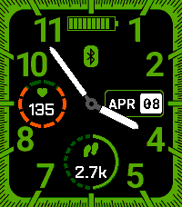</a>

<h2 class="app-name" id="app-f732c3f3661048c0916600af"><a href="https://apps.repebble.com/f732c3f3661048c0916600af">Keep it Green</a></h2>
<a class="app-source" href="https://github.com/art-coded/pebble-keepitgreen" title="Source code" data-search-exclude>View source</a>

by <a href="https://apps.repebble.com/apps/dev/artcoded_2e1c2aef27997fd7e0a7b956" title="More from this developer">_ArtCoded</a>

GPL-3.0 v1.0.2 Updated 2026-04-15

Runs on: Time 2

Keep it Green is digital/analogic watchface giving you hour and date. Keep control on your daily steps target as well as your heart rate. Setting page let you (de)activate both monitors and…

<a class="app-shot" href="https://apps.repebble.com/575c35e2e9dd76b280000018" data-search-exclude>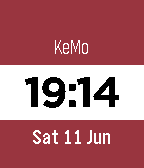</a>

<h2 class="app-name" id="app-575c35e2e9dd76b280000018"><a href="https://apps.repebble.com/575c35e2e9dd76b280000018">Kemo</a></h2>
<a class="app-source" href="https://github.com/Kamalheib/KemoPebbleFace" title="Source code" data-search-exclude>View source</a>

by <a href="https://apps.repebble.com/apps/dev/kamal-heib_5692b419363e8dbfb4000067" title="More from this developer">Kamal heib</a>

No licence v1.0 Updated 2016-06-11

Runs on: Round 2, Time 2, Pebble 2 Duo, Pebble 2, Time Round, Time, Classic

Kemo Watchface

<h2 class="app-name" id="app-637aa7cbc6c24a000a815ea4"><a href="https://apps.repebble.com/637aa7cbc6c24a000a815ea4">KemoPebble</a></h2>
<a class="app-source" href="https://github.com/COZMIKDX/KemoPebble" title="Source code" data-search-exclude>View source</a>

by <a href="https://apps.repebble.com/apps/dev/cosmictacocat_5f6e8a1b51c0ff9f8ecc2504" title="More from this developer">CosmicTacoCat</a>

No licence v1.0 Updated 2022-11-20

Runs on: Time 2, Time

A fluffy watchface. Still a work in progress. It will eventually change the animal displayed every hour. Currently only for Pebble Time. I&#x27;ll work on a monochrome version once this one is done.

<a class="app-shot" href="https://apps.repebble.com/a4d962baee314d20819879fe" data-search-exclude>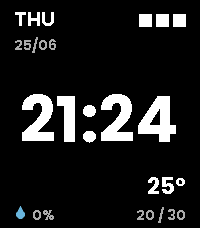</a>

<h2 class="app-name" id="app-a4d962baee314d20819879fe"><a href="https://apps.repebble.com/a4d962baee314d20819879fe">Kevinimal</a></h2>
<a class="app-source" href="https://github.com/dhrme/pebble-apps/tree/main/kevinimal" title="Source code" data-search-exclude>View source</a>

by <a href="https://apps.repebble.com/apps/dev/dhrme_069a96fda19388b2bd028bfa" title="More from this developer">dhrme</a>

Not checked yet v1.1.0 Updated 2026-06-25

Runs on: Time 2

A stripped-back watchface for Pebble Time 2. The time floats large in the centre; everything else tucks into a corner — day + DD/MM top-left, a three-block battery gauge top-right, chance-of-rain…

<a class="app-shot" href="https://apps.rebble.io/en_US/application/5a36b58b461a8dfe42001479" data-search-exclude>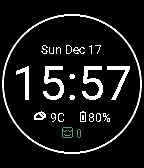</a>

<h2 class="app-name" id="app-5a36b58b461a8dfe42001479"><a href="https://apps.rebble.io/en_US/application/5a36b58b461a8dfe42001479">kface</a></h2>
<a class="app-source" href="https://github.com/koredev/kface" title="Source code" data-search-exclude>View source</a>

by <a href="https://apps.rebble.io/en_US/developer/5a31b9ec0dfc32dba00012da/1" title="More from this developer">James Woo</a>

Not checked yet v1.2 Updated 2017-12-17 Rebble App Store

Runs on: Round 2, Time 2, Pebble 2 Duo, Pebble 2, Time Round, Time, Classic

Get time, date, weather, battery, and step information

<a class="app-shot" href="https://apps.repebble.com/da0dc9441cf34e9dba801da6" data-search-exclude>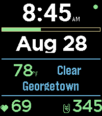</a>

<h2 class="app-name" id="app-da0dc9441cf34e9dba801da6"><a href="https://apps.repebble.com/da0dc9441cf34e9dba801da6">kface</a></h2>
<a class="app-source" href="https://github.com/kooscode/kface" title="Source code" data-search-exclude>View source</a>

by <a href="https://apps.repebble.com/apps/dev/kpebble_4fb2188be2d93da972cfc9ae" title="More from this developer">kPebble</a>

Not checked yet v1.0.2 Updated 2026-08-28

Runs on: Time 2

kface — A clean, minimal watchface for Pebble Time 2. Time and date up top, a battery meter, live weather (temp, condition, and city — pulled via your phone&#x27;s location and Open-Meteo), your heart…

<a class="app-shot" href="https://apps.repebble.com/5831abcb8c7fff66e10000c9" data-search-exclude>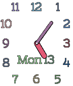</a>

<h2 class="app-name" id="app-5831abcb8c7fff66e10000c9"><a href="https://apps.repebble.com/5831abcb8c7fff66e10000c9">Kiddie</a></h2>
<a class="app-source" href="https://github.com/GreenHex/Pebble.Woozy" title="Source code" data-search-exclude>View source</a>

by <a href="https://apps.repebble.com/apps/dev/the-resetter_5415133bbcd1cf9264000081" title="More from this developer">The Resetter</a>

MIT v1.28 Updated 2017-02-13

Runs on: Time 2, Pebble 2 Duo, Pebble 2, Time, Classic

Don&#x27;t take your eyes off the kids! Now with day and date display.

<a class="app-shot" href="https://apps.repebble.com/7f9c89453f7548e1ac494236" data-search-exclude>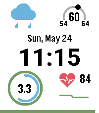</a>

<h2 class="app-name" id="app-7f9c89453f7548e1ac494236"><a href="https://apps.repebble.com/7f9c89453f7548e1ac494236">KinetiCast</a></h2>
<a class="app-source" href="https://github.com/ericlmccormick/Pebble_Health_and_Weather" title="Source code" data-search-exclude>View source</a>

by <a href="https://apps.repebble.com/apps/dev/eric-mccormick_7c70eafc41fc666a529a8f07" title="More from this developer">Eric McCormick</a>

Not checked yet v2.2.1 Updated 2026-07-31

Runs on: Time 2

Current weather on top (high/low temp, current condition, current temp), date and time in the middle, health data(heart rate, steps, calories) on the bottom

<a class="app-shot" href="https://apps.repebble.com/7a9d24751b8a49319ec1f6e7" data-search-exclude>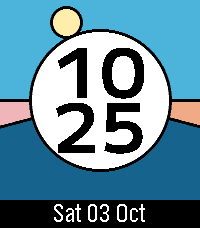</a>

<h2 class="app-name" id="app-7a9d24751b8a49319ec1f6e7"><a href="https://apps.repebble.com/7a9d24751b8a49319ec1f6e7">Kingfisher</a></h2>
<a class="app-source" href="https://github.com/justinjhendrick/pebble-watchface-digilog" title="Source code" data-search-exclude>View source</a>

by <a href="https://apps.repebble.com/apps/dev/justinjhendrick_67f68b8a23b7a90009c87db5" title="More from this developer">justinjhendrick</a>

Not checked yet v1.0.0 Updated 2026-10-03

Runs on: Round 2, Time 2

Kingfisher is a colorful digital watchface with the sun moving through the day, night, and twilight arcs. Features: * Great battery life * Uses phone location for sunrise/sunset with a fallback to…

<h2 class="app-name" id="app-68a395ae8722670009a23809"><a href="https://apps.repebble.com/68a395ae8722670009a23809">Kirby</a></h2>
<a class="app-source" href="https://github.com/Ongion/KirbyWatchface/" title="Source code" data-search-exclude>View source</a>

by <a href="https://apps.repebble.com/apps/dev/ongion_68812a0735f0cc0009d17723" title="More from this developer">Ongion</a>

No licence v2.11.0 Updated 2026-05-19

Runs on: Round 2, Time 2, Time Round, Time

He&#x27;s small, he&#x27;s pink, he&#x27;s shaped like a friend, and now he&#x27;s on your Pebble! It&#x27;s Kirby! Features - Animations - Kirby has 9+ animations! He changes abilities each hour, and animates when you…

<h2 class="app-name" id="app-5482ee118f806fbe68000055"><a href="https://apps.repebble.com/5482ee118f806fbe68000055">Kirby Black</a></h2>
<a class="app-source" href="https://github.com/metakirby5/pebble-watchface-kirby" title="Source code" data-search-exclude>View source</a>

by <a href="https://apps.repebble.com/apps/dev/metakirby5_54821dc0f9821f8829000017" title="More from this developer">metakirby5</a>

Not checked yet v2.1 Updated 2014-12-06

Runs on: Time 2, Pebble 2 Duo, Pebble 2, Time, Classic

My first watchface! When Kirby swallows two enemies with abilities at once, he gets the &quot;mix&quot; ability, which allows him to select an ability from a very fast roulette. This is meant to pay homage…

<a class="app-shot" href="https://apps.repebble.com/5482f502571fcff35400005f" data-search-exclude>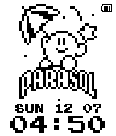</a>

<h2 class="app-name" id="app-5482f502571fcff35400005f"><a href="https://apps.repebble.com/5482f502571fcff35400005f">Kirby Day/Night</a></h2>
<a class="app-source" href="https://github.com/metakirby5/pebble-watchface-kirby-daynight" title="Source code" data-search-exclude>View source</a>

by <a href="https://apps.repebble.com/apps/dev/metakirby5_54821dc0f9821f8829000017" title="More from this developer">metakirby5</a>

Not checked yet v2.7 Updated 2014-12-08

Runs on: Time 2, Pebble 2 Duo, Pebble 2, Time, Classic

When Kirby swallows two enemies with abilities at once, he gets the &quot;mix&quot; ability, which allows him to select an ability from a very fast roulette. This is meant to pay homage to that :) FEATURES…

<a class="app-shot" href="https://apps.repebble.com/571abdc769f1bd2fac000013" data-search-exclude>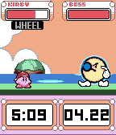</a>

<h2 class="app-name" id="app-571abdc769f1bd2fac000013"><a href="https://apps.repebble.com/571abdc769f1bd2fac000013">Kirby GT</a></h2>
<a class="app-source" href="https://github.com/WinterWinter/KirbyGT" title="Source code" data-search-exclude>View source</a>

by <a href="https://apps.repebble.com/apps/dev/game-time_53b317a44f927e319f0000ae" title="More from this developer">Game Time</a>

No licence v1.2 Updated 2016-06-10

Runs on: Round 2, Time 2, Time Round, Time

The pink ball of fun has made it to the Pebble smartwatch! Based on the GBA title Kirby Nightmare in Dreamland. Features --Animated Kirby-- 6 Animations, Randomly selected and plays each hour…

<h2 class="app-name" id="app-5482eca6571fcf3114000051"><a href="https://apps.repebble.com/5482eca6571fcf3114000051">Kirby White</a></h2>
<a class="app-source" href="https://github.com/metakirby5/pebble-watchface-kirby" title="Source code" data-search-exclude>View source</a>

by <a href="https://apps.repebble.com/apps/dev/metakirby5_54821dc0f9821f8829000017" title="More from this developer">metakirby5</a>

Not checked yet v2.1 Updated 2014-12-06

Runs on: Time 2, Pebble 2 Duo, Pebble 2, Time, Classic

My first watchface! When Kirby swallows two enemies with abilities at once, he gets the &quot;mix&quot; ability, which allows him to select an ability from a very fast roulette. This is meant to pay homage…

<h2 class="app-name" id="app-549ce6991580e3d8cd000106"><a href="https://apps.repebble.com/549ce6991580e3d8cd000106">Kitsune Clock</a></h2>
<a class="app-source" href="https://github.com/KitsuneGaming/KitsuneFace" title="Source code" data-search-exclude>View source</a>

by <a href="https://apps.repebble.com/apps/dev/kitsune-gaming_549c8afa05447249780008c6" title="More from this developer">Kitsune Gaming</a>

No licence v2.0 Updated 2014-12-26

Runs on: Time 2, Pebble 2 Duo, Pebble 2, Time, Classic

Watchface that has a kitsune (fox) as a background. The current time becomes the eyes.

<h2 class="app-name" id="app-5378ea1fa43479b74f0001d8"><a href="https://apps.repebble.com/5378ea1fa43479b74f0001d8">Klingon Q&#x27;onoS Chrono</a></h2>
<a class="app-source" href="https://github.com/dwinker/pebble-klingon" title="Source code" data-search-exclude>View source</a>

by <a href="https://apps.repebble.com/apps/dev/dan-winker_533190ca42aca092d0000075" title="More from this developer">Dan Winker</a>

Not checked yet v1.0.0 Updated 2014-05-18

Runs on: Time 2, Pebble 2 Duo, Pebble 2, Time, Classic

Watchface used on Q&#x27;onoS (Kronos), the Klingon home world. This watchface is 24 hour format because there would be no honor in using 12 hour format.

<h2 class="app-name" id="app-536cd1d83b79b3800e0001de"><a href="https://apps.repebble.com/536cd1d83b79b3800e0001de">KlK</a></h2>
<a class="app-source" href="https://github.com/exe44/pebble-klk" title="Source code" data-search-exclude>View source</a>

by <a href="https://apps.repebble.com/apps/dev/exe_5299a4c8e627ce050d000068" title="More from this developer">exe</a>

Not checked yet v3.0 Updated 2016-04-11

Runs on: Round 2, Time 2, Pebble 2 Duo, Pebble 2, Time Round, Time, Classic

Inspired by the insane anime &quot;KILL la KILL&quot;!

<a class="app-shot" href="https://apps.rebble.io/en_US/application/5a183f5a0dfc323bd000344e" data-search-exclude>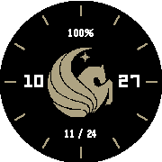</a>

<h2 class="app-name" id="app-5a183f5a0dfc323bd000344e"><a href="https://apps.rebble.io/en_US/application/5a183f5a0dfc323bd000344e">KnightsFace</a></h2>
<a class="app-source" href="https://github.com/thomasstoeckert/KnightsFace" title="Source code" data-search-exclude>View source</a>

by <a href="https://apps.rebble.io/en_US/developer/55e827430a081ae5f9000009/1" title="More from this developer">Thomas Stoeckert</a>

Not checked yet v1.1 Updated 2017-11-26 Rebble App Store

Runs on: Round 2, Time Round

Show your Knight Pride with this watchface, with both analog and digital time display. It also has several different icons to fit your mood.

<a class="app-shot" href="https://apps.repebble.com/0b8f41cdbba6456298c9821a" data-search-exclude>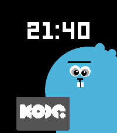</a>

<h2 class="app-name" id="app-0b8f41cdbba6456298c9821a"><a href="https://apps.repebble.com/0b8f41cdbba6456298c9821a">Kode Dot</a></h2>
<a class="app-source" href="https://github.com/dnnsmnstrr/kode-dot-watchface" title="Source code" data-search-exclude>View source</a>

by <a href="https://apps.repebble.com/apps/dev/dennis-muensterer_53cc9927fd8ebf394ae021ca" title="More from this developer">Dennis Muensterer</a>

Not checked yet v1.0.1 Updated 2026-07-15

Runs on: Round 2, Time 2, Pebble 2 Duo, Pebble 2, Time Round, Time, Classic

Wear the new mascot for Kode Dot on your wrist while waiting for the actual device

<h2 class="app-name" id="app-53b322fce3dd45a937000096"><a href="https://apps.repebble.com/53b322fce3dd45a937000096">Koee watch</a></h2>
<a class="app-source" href="http://andesapp.com/" title="Source code" data-search-exclude>View source</a>

by <a href="https://apps.repebble.com/apps/dev/allgreenup_53b320a2977c65a22100002f" title="More from this developer">allGreenup</a>

See source v3.0 Updated 2014-07-01

Runs on: Time 2, Pebble 2 Duo, Pebble 2, Time, Classic

Koee watch is real!! Join us and save the planet with Koee!! www.allgreenup.com

<h2 class="app-name" id="app-82b2092b5bbd4cc89f5642d0"><a href="https://apps.repebble.com/82b2092b5bbd4cc89f5642d0">Kona Wave</a></h2>
<a class="app-source" href="https://github.com/HarrisonAllen/kona-wave-watchface" title="Source code" data-search-exclude>View source</a>

by <a href="https://apps.repebble.com/apps/dev/harrison-allen_5e28ea923dd3109f151c7e08" title="More from this developer">Harrison Allen</a>

No licence v1.0 Updated 2026-04-04

Runs on: Round 2, Time 2, Pebble 2 Duo, Pebble 2, Time Round, Time, Classic

A watchface to match some of my real-world accessories!

<a class="app-shot" href="https://apps.repebble.com/56267426c7810a62a100007d" data-search-exclude>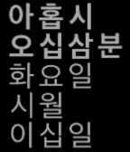</a>

<h2 class="app-name" id="app-56267426c7810a62a100007d"><a href="https://apps.repebble.com/56267426c7810a62a100007d">Korean Watchface</a></h2>
<a class="app-source" href="https://github.com/Dawenster/korean_watchface" title="Source code" data-search-exclude>View source</a>

by <a href="https://apps.repebble.com/apps/dev/david-wen_538caa144a22b572c30000b3" title="More from this developer">David Wen</a>

No licence v1.3 Updated 2016-08-05

Runs on: Time 2, Pebble 2 Duo, Pebble 2, Time, Classic

Korean watchface on a dark background. Hour, minutes, day of week, month, and day of month. Time in bold. Useful for learning Korean or just telling the time in Korean!

<a class="app-shot" href="https://apps.repebble.com/56bd18ce54c35f9107000039" data-search-exclude>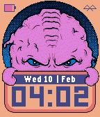</a>

<h2 class="app-name" id="app-56bd18ce54c35f9107000039"><a href="https://apps.repebble.com/56bd18ce54c35f9107000039">krangface</a></h2>
<a class="app-source" href="https://github.com/j2ko/pebble-krangface" title="Source code" data-search-exclude>View source</a>

by <a href="https://apps.repebble.com/apps/dev/j2ko_560aceb97756380b2500004e" title="More from this developer">j2ko</a>

Not checked yet v1.0 Updated 2016-02-11

Runs on: Time 2, Time

Simple and unique watchface. Hold evil mind on your wrist.

<a class="app-shot" href="https://apps.repebble.com/55835eac2f3e32222b00002c" data-search-exclude>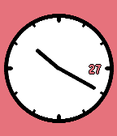</a>

<h2 class="app-name" id="app-55835eac2f3e32222b00002c"><a href="https://apps.repebble.com/55835eac2f3e32222b00002c">KS moded</a></h2>
<a class="app-source" href="https://github.com/mephissto/ks-clock-face/" title="Source code" data-search-exclude>View source</a>

by <a href="https://apps.repebble.com/apps/dev/mephissto_5362a57dc2a5e4f05c000021" title="More from this developer">mephissto</a>

Not checked yet v1.1 Updated 2016-01-27

Runs on: Time 2, Time

Simple watchface based on KS Original

<h2 class="app-name" id="app-55b40c2bdeeaa32565000093"><a href="https://apps.repebble.com/55b40c2bdeeaa32565000093">Kurisu</a></h2>
<a class="app-source" href="https://gitlab.com/Remon/kurisu_watch_face" title="Source code" data-search-exclude>View source</a>

by <a href="https://apps.repebble.com/apps/dev/remon_54e61de68948118a4d00008e" title="More from this developer">Remon</a>

Not checked yet v1.0 Updated 2015-07-25

Runs on: Time 2, Time

A Kurisu watchface This is a first attempt watchface.

<h2 class="app-name" id="app-4151feede8864a94905355d0"><a href="https://apps.repebble.com/4151feede8864a94905355d0">kurz vor acht</a></h2>
<a class="app-source" href="https://github.com/MalteJoe/kurz-vor-acht" title="Source code" data-search-exclude>View source</a>

by <a href="https://apps.repebble.com/apps/dev/maltejoe_d48f29c9da8eaa6ce25e2f89" title="More from this developer">MalteJoe</a>

No licence v4.0.4 Updated 2026-08-22

Runs on: Round 2, Time 2, Pebble 2 Duo, Pebble 2, Time Round, Time, Classic

This is is a watchface for the Pebble smartwatch that shows the current time in German. Based on the watchface for the original pebbles n3v3erstextone/Deutsch. The time is shown in colloquial…

<a class="app-shot" href="https://apps.repebble.com/554960c92cfbfca8a20000eb" data-search-exclude>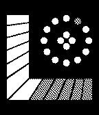</a>

<h2 class="app-name" id="app-554960c92cfbfca8a20000eb"><a href="https://apps.repebble.com/554960c92cfbfca8a20000eb">Kyokusen JS</a></h2>
<a class="app-source" href="https://github.com/leovander/Kyokusen-JS" title="Source code" data-search-exclude>View source</a>

by <a href="https://apps.repebble.com/apps/dev/leovander_54ef9c482e6a47d04c0000d3" title="More from this developer">leovander</a>

Not checked yet v0.1 Updated 2015-05-06

Runs on: Time 2, Pebble 2 Duo, Pebble 2, Time, Classic

Watchface inspired by Tokyoflash Japan&#x27;s Kyokusen Watch. Be wary, made with PebbleJS not knowing C is preferred. May fail after awhile but you can refresh the face.

