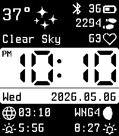
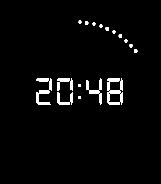
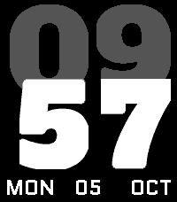
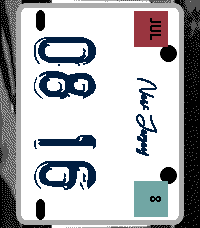
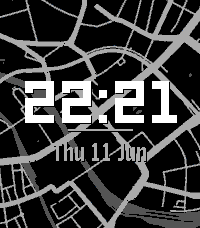

<!-- Generated by scripts/update_app_directory.py: do not edit by hand -->
# Watchfaces: L

[← About this list](../watchfaces.md) · [A](a.md) · [B](b.md) · [C](c.md) · [D](d.md) · [E](e.md) · [F](f.md) · [G](g.md) · [H](h.md) · [I](i.md) · [J](j.md) · [K](k.md) · **L** · [M](m.md) · [N](n.md) · [O](o.md) · [P](p.md) · [Q](q.md) · [R](r.md) · [S](s.md) · [T](t.md) · [U](u.md) · [V](v.md) · [W](w.md) · [X](x.md) · [Y](y.md) · [Z](z.md) · [0–9 & other](other.md)

*80 watchfaces · Last updated 2026-10-06*

| Screenshot | Name | Developer | Licence | Updated | Description |
|------------|------|-----------|---------|---------|-------------|
| { loading=lazy width="72" } | [L'hora en català](https://apps.rebble.io/en_US/application/52f79494a374ba53ea000288) <small>Rebble App Store</small> | [Grimborg](https://bitbucket.org/grimborg/horacat) | <small>See source</small> | 2014-02-09 | The time in Catalan. This is a free watchface released under the GPLv3. |
| { loading=lazy width="72" } | [L.gant](https://apps.rebble.io/en_US/application/549f4edeef9cfa3452000278) <small>Rebble App Store</small> | [XWolfOverride](https://github.com/XWolfOverride/L.GANT) | <small>Not checked yet</small> | 2014-12-28 | A simply and elegant watchface. |
| { loading=lazy width="72" } | [Lake Sammamish](https://apps.repebble.com/66469b18edac433e82715659) | [AirCodum](https://github.com/coredevices/pebble-watchface-agent-skill) | <small>Not checked yet</small> | 2026-07-12 | A living Lake Sammamish scene that changes with the time of day — dawn, midday, golden sunset, and a starry moonlit night. The sun and moon arc across the… |
| { loading=lazy width="72" } | [Langdon](https://apps.repebble.com/fe6b9da4d64249fd800c779c) | [AirCodum](https://github.com/coredevices/pebble-watchface-agent-skill) | <small>Not checked yet</small> | 2026-04-16 | ▎ A classic Mickey Mouse analog watchface inspired by Professor Robert Langdon ▎ — the Harvard symbologist from Dan Brown's bestselling novels The Da Vinci… |
| { loading=lazy width="72" } | [LapTime - F1 Track Watchface](https://apps.repebble.com/765f0c27d5b042e7a6205422) | [Electronic Esoterica](https://github.com/jimbruges/pebble-f1-watchface) | <small>Not checked yet</small> | 2026-07-05 | 160 real Formula 1 circuit tracks with cars racing around the track following the time. Features animated race laps, health data cars, analog hands, and a… |
| { loading=lazy width="72" } | [Laptopman Face (Classic)](https://apps.rebble.io/en_US/application/626b1ef27ca61400094ed7e4) <small>Rebble App Store</small> | [John Spahr](https://github.com/JohnSpahr/LaptopmanFace) | CC0-1.0 | 2022-05-22 | Good news! I've released an updated version of this face with a couple of new features. However, I'll be keeping this one around if you prefer the old… |
| { loading=lazy width="72" } | [Laptopman Face 2.0](https://apps.rebble.io/en_US/application/6293cf9e98768d00095a945f) <small>Rebble App Store</small> | [John Spahr](https://github.com/johnspahr/laptopmanface) | <small>Not checked yet</small> | 2022-11-22 | Meet the new (and improved) Laptopman Face, a watchface featuring a guy with laptop for a head! This updated version introduces a more readable font and a… |
|  | [Large font watchface](https://apps.repebble.com/3f606f4c262f4112b1058308) | [Unknown](https://github.com/jimpriest/pebble-large-font) | <small>Not checked yet</small> | 2026-04-07 | Simple, large font watchface for old folks :) |
| { loading=lazy width="72" } | [Last Time](https://apps.repebble.com/1f224e24fc2a4938a84d7f70) | [mgerb](https://github.com/mgerb/last_time) | <small>Not checked yet</small> | 2026-09-02 | A multifunctional Pebble watchface. Source: https://github.com/mgerb/last_time Features - Time, date, day of week - Weather (Open-Meteo) - Text description… |
| { loading=lazy width="72" } | [Last Time](https://apps.rebble.io/en_US/application/6953664f91ea9d0009ebd734) <small>Rebble App Store</small> | [mgerb](https://github.com/mgerb/last_time) | <small>Not checked yet</small> | 2026-09-02 | A multifunctional Pebble watchface. Source: https://github.com/mgerb/last_time Features - Time, date, day of week - Weather (Open-Meteo) - Text description… |
| { loading=lazy width="72" } | [Laughing Man](https://apps.rebble.io/en_US/application/5342beed623a497d30000022) <small>Rebble App Store</small> | [docsmooth](https://github.com/docsmooth/laughingman) | <small>Not checked yet</small> | 2014-12-02 | The Laughing Man logo from Ghost in the Shell (GitS), analog watchface. The spinning words are the minute hand, and the ballcap is the hour hand. Copyright… |
| { loading=lazy width="72" } | [Lavalamp](https://apps.repebble.com/fafbbd65c0a14e07b37c71ea) | [marukitano](https://github.com/marukitano/Lavalamp) | <small>Not checked yet</small> | 2026-07-29 | English Lavalamp is a binary watchface that displays the current time using animated, organic blobs. The upper blobs represent the hours, while the lower… |
| { loading=lazy width="72" } | [LCARS Stardate](https://apps.repebble.com/69139dc57a004424b6109c20) | [Null Syntax](https://github.com/AKlitbo/pebble-watchface-lcars) | <small>Other</small> | 2026-09-27 | LCARS Stardate is an LCARS-inspired digital watchface designed for the Pebble Time 2. 🧩 Panels - Four pickable panels under the clock and stardate banner… |
| { loading=lazy width="72" } | [LCARS v2](https://apps.rebble.io/en_US/application/52e3b15b34ba6696e0000553) <small>Rebble App Store</small> | [slayer1551](https://github.com/slayer1551/LCARS-1-SDK-2.0) | <small>Not checked yet</small> | 2014-01-25 | Based on the computer system LCARS from the Star Trek series. The numbers under the current time "1701" will show the time in UNIX timestamp. The bars at… |
| { loading=lazy width="72" } | [LCARS v3 Colored](https://apps.rebble.io/en_US/application/56bedba7f65c491cd4000068) <small>Rebble App Store</small> | [keithzg](https://github.com/keithzg/LCARS-1-SDK-3.0-colored) | <small>Not checked yet</small> | 2016-02-15 | LCARS watchface, updated for Time with some colors |
| { loading=lazy width="72" } | [LCARS WATCH](https://apps.rebble.io/en_US/application/55fd1816f1f7eae3c600003c) <small>Rebble App Store</small> | [marfoo](https://github.com/marfoo-amagramer/PebbleLcarsWatch) | <small>Not checked yet</small> | 2015-10-26 | First Version |
| { loading=lazy width="72" } | [LCD](https://apps.repebble.com/56fa97f969581df9ba000044) | [Brian Schau](https://www.github.com/bschau/LCD) | <small>Not checked yet</small> | 2016-08-03 | Show time in LCD font. Features: - Large time display. - Seconds in dots. - Color of watchface can be changed. - Double-flick your wrist to show date and… |
| { loading=lazy width="72" } | [LCD](https://apps.rebble.io/en_US/application/58f7b1200dfc32464a00013d) <small>Rebble App Store</small> | [Brian Schau](https://github.com/bschau/Portfolio/tree/main/pebble/LCD) | <small>Not checked yet</small> | 2017-04-19 | Big LCD numbers and seconds as dots. Configurable wrt. animations, colors and so forth. |
| { loading=lazy width="72" } | [LCD 221](https://apps.repebble.com/6abd2f9a6dd84d000954e892) | [Kicou](https://github.com/ChocolatineDigitale/PT2-LCD221) | MIT | 2026-10-03 | A Pebble Time 2 watch face that recreates the look of the Casio W-221H: a crisp LCD with slanted 7-segment digits, faint unlit segments, a dot-matrix… |
| { loading=lazy width="72" } | [LCD Hourglass](https://apps.rebble.io/en_US/application/52a940f8c0ca93a0d1000017) <small>Rebble App Store</small> | [Ben McCanny](https://github.com/benmccanny) | <small>Not checked yet</small> | 2013-12-23 | The simplicity of knowing the exact time of day, without worrying if it's 11:37 or 11:38. LCD Hourglass is a minimalist watchface that depicts minutes as a… |
| { loading=lazy width="72" } | [LCD Worldtime](https://apps.repebble.com/8202d29e6aea4d93ab507208) | [Hoyt Labs](https://github.com/michaellunzer/pebble-lcd-worldtime) | <small>Not checked yet</small> | 2026-07-27 | LCD Worldtime A Casio-flavored LCD watchface with a live day/night world map. Watch the sun's terminator sweep across the globe in real time, with a marker… |
| { loading=lazy width="72" } | [LCHF](https://apps.rebble.io/en_US/application/55961d9a70f2c35e6400000a) <small>Rebble App Store</small> | [testyk8](https://github.com/Kdisimone/cgm-pebble.git) | <small>No licence</small> | 2015-08-03 | NS watch face customized with ability to set lower HIGH BG alert settings. |
| { loading=lazy width="72" } | [Lebanese Time](https://apps.rebble.io/en_US/application/5318948044e93656d00005e6) <small>Rebble App Store</small> | [Raja Baz](https://github.com/raja-baz/pebble-watchfaces) | <small>Not checked yet</small> | 2014-03-06 | Displays the time in Lebanese sms-speak |
| { loading=lazy width="72" } | [LECO Style](https://apps.repebble.com/57f5ce20637410db7b000054) | [dickle](https://github.com/oxogglant/LECO_STYLE) | <small>Not checked yet</small> | 2016-10-06 | Inspired by LECO by TheAggieProject, but with some modifications. Features an unabbreviated date and day, subtle battery bar, and an obvious and unambiguous… |
| { loading=lazy width="72" } | [Legend of Zelda: Gate of Time](https://apps.repebble.com/55038e971d839c3065000009) | [Apestowesome](https://github.com/asardaes/pebble-zgot) | <small>Not checked yet</small> | 2016-05-13 | Watchface inspired by the Gate of Time that appears on the game The Legend of Zelda: Skyward Sword. The amount of details is limited due to resolution… |
| { loading=lazy width="72" } | [Legere](https://apps.repebble.com/1631a5d9ebbf4d22b5d4cd0d) | [ModusApps](https://github.com/gordonbazeley/legere) | <small>Not checked yet</small> | 2026-10-05 | Legere is a minimal watchface built around two ideas: 1. Minimal battery drain. It redraws once a minute, shows only the time and date, and has no… |
| { loading=lazy width="72" } | [Legere](https://apps.rebble.io/en_US/application/6ac3bd8b9128520009c7ad7f) <small>Rebble App Store</small> | [ModusApps](https://github.com/gordonbazeley/legere) | <small>Not checked yet</small> | 2026-10-05 | Legere is a minimal watchface built around two ideas: 1. Minimal battery drain. It redraws once a minute, shows only the time and date, and has no… |
| { loading=lazy width="72" } | [Lemming Brothers](https://apps.repebble.com/78297d14b6bd426799b7d759) | [trishtzy](https://github.com/trishtzy/pebble) | <small>Not checked yet</small> | 2026-08-29 | The Lemming Brothers bank is open for business — and time is money. A tiny analog clock is set into the facade of the venerable Lemming Brothers bank… |
| { loading=lazy width="72" } | [Less is More](https://apps.repebble.com/36e32a26a469451d97322d8d) | [Tom Barrasso](https://github.com/Tombarr/less-is-more) | <small>Not checked yet</small> | 2026-04-06 | Dieter Rams' Braun Less-is-More inspired watchface |
| { loading=lazy width="72" } | [Letters:Numbers](https://apps.rebble.io/en_US/application/555501d719e56a9a6f000027) <small>Rebble App Store</small> | [davidjoho](https://github.com/dweinberger/letter-number) | <small>Not checked yet</small> | 2015-06-14 | The hour is a word. The minutes are a number. The date and battery percent. That's it. |
| { loading=lazy width="72" } | [Lexiclock](https://apps.repebble.com/6951f2e5828bd90009267488) | [fish](https://github.com/sockeye-d/pebble-lexiclock/tree/main) | <small>Not checked yet</small> | 2026-01-28 | A word clock for Basalt and Emery |
| { loading=lazy width="72" } | [lexiclock₂](https://apps.repebble.com/aaea8be3e7084043a53e0b89) | [me](https://github.com/sockeye-d/pebble-lexiclock/) | <small>Not checked yet</small> | 2026-04-19 | Display time in words! A revamped version of my old watchface 'lexiclock', this should consume less power, be more configurable, not crash so much on… |
| { loading=lazy width="72" } | [lexuge](https://apps.rebble.io/en_US/application/590431830dfc328c360006ce) <small>Rebble App Store</small> | [LEXUGE](https://github.com/LEXUGE/lexuge-face) | <small>Not checked yet</small> | 2017-05-04 | A LEXUGE's opensource watchface Simple and modern watchface. See the time as digital. See the battery bar as the line. The source code on… |
| { loading=lazy width="72" } | [License Plate](https://apps.repebble.com/16a26261425f4be090bd9e18) | [Comfortably Numb](https://github.com/ygalanter/license-plate-pebble) | <small>Not checked yet</small> | 2026-07-09 | License Plate is a digital clock in form of a car license plate. 🎨 Fully customizable colors 📍 Automatically detects and shows your location on the license… |
| { loading=lazy width="72" } | [License Plate](https://apps.rebble.io/en_US/application/6a4ef0470e86980009bc546b) <small>Rebble App Store</small> | [Comfortably Numb](https://github.com/ygalanter/license-plate-pebble) | <small>Not checked yet</small> | 2026-07-09 | License Plate is a digital clock in form of a car license plate. 🎨 Fully customizable colors 📍 Automatically detects and shows your location on the license… |
| { loading=lazy width="72" } | [Life Timer](https://apps.repebble.com/56cbe864dba61e0fb600000d) | [Rick Lewis](https://github.com/kid-c-plus/LifeTimer) | <small>Not checked yet</small> | 2016-02-23 | Most of the times I check my watch, I don't really want to know the time. I just want to know how long it's been since the last time I checked my watch… |
| { loading=lazy width="72" } | [LIFT](https://apps.repebble.com/56f1a4021fd1e75549000017) | [WuerfelDev](https://github.com/WuerfelDev/LIFT/) | <small>Not checked yet</small> | 2025-03-04 | This watchface is simply beautiful. You can choose between 12h and 24h clock in the pebble settings. While one hour pass, the red panel which shows the… |
| { loading=lazy width="72" } | [Lightbox](https://apps.rebble.io/en_US/application/52db1ba8889f5dade50002d8) <small>Rebble App Store</small> | [BobTheMadCow](http://github.com/BobTheMadCow/LightBox) | <small>No licence</small> | 2015-03-03 | Tells the time by lighting up words from behind. Animated on launch and when changing which words are lit. |
| { loading=lazy width="72" } | [LightBox 2](https://apps.rebble.io/en_US/application/54f5aeb6adc8643c64000041) <small>Rebble App Store</small> | [BobTheMadCow](https://github.com/BobTheMadCow/Lightbox2) | <small>No licence</small> | 2015-03-03 | Tells the time by lighting up words from behind. Animated on launch and every minute when changing which words are lit. |
| { loading=lazy width="72" } | [Lighthaul Watchface](https://apps.repebble.com/a5874b2f337249e58d31353d) | [Zach Burnham](https://github.com/thejambi/Lighthaul-Watchface) | <small>Not checked yet</small> | 2026-07-29 | The Lighthaul star map as a watchface - and your ship flies itself. Every day a new procedurally-generated cluster arrives, seeded by the date: every pilot… |
| { loading=lazy width="72" } | [Lighthouse](https://apps.repebble.com/60a0da706ece4c9884f5b631) | [Unknown](https://github.com/DangerBlack/lighthouse) | <small>No licence</small> | 2026-05-18 | Lighthouse is a moody animated watchface that brings a lighthouse scene to life every time you glance at your wrist. Watch the beam sweep across the dark… |
| { loading=lazy width="72" } | [Limb](https://apps.repebble.com/6b9efe0bec8746bfba20ad7e) | [Kieselleger](https://github.com/ProggroP/Limb) | <small>Not checked yet</small> | 2026-05-19 | Limb reimagines the classic clock face by placing its centre beyond the screen edge. Only the limb of the dial is visible — a gently curved arc carrying two… |
| { loading=lazy width="72" } | [Lime](https://apps.rebble.io/en_US/application/594cbf8ab67f9f9e8100137c) <small>Rebble App Store</small> | [chops](https://github.com/mereed/pebbleface-lime) | <small>Not checked yet</small> | 2017-09-17 | This simple watchface is based on some of the promotional images for the Charcoal/Lime Pebble2, with some extra stuff added, and it works on all rectangular… |
| { loading=lazy width="72" } | [Line and Dot](https://apps.repebble.com/003f0ed2b7c84ecfa57bca1a) | [Midnight Oscillator](https://github.com/coredevices/pebble-watchface-agent-skill) | <small>Not checked yet</small> | 2026-04-08 | Minimalist analog watchface with a white hour hand and red dot orbiting the dial edge. Colors are fully customizable via settings. |
| { loading=lazy width="72" } | [Line Dash](https://apps.repebble.com/6a69d2c781cc78000918bee2) | [pagnotta](https://github.com/pagnotta/pebble-line-dash/) | <small>Not checked yet</small> | 2026-07-31 | A stylish, minimalist one-hand analog watchface for the Pebble Time 2 and Round 2. Designed for intuitive timekeeping, Line Dash features curated typography… |
| { loading=lazy width="72" } | [Lines](https://apps.rebble.io/en_US/application/5588410449c1d102cd000114) <small>Rebble App Store</small> | [Edwin Finch](https://edwinfinch.com/redirect/pebble-legacy-source) | <small>See source</small> | 2021-06-17 | An old classic from our original collection from 2014-2016, now free & open source! |
| { loading=lazy width="72" } | [Lines (Enhanced)](https://apps.repebble.com/57be4d805e3c3d0bfc000021) | [antgiant](https://github.com/antgiant/pebble-LinesWatch) | <small>Not checked yet</small> | 2016-11-15 | Lines (Enhanced) is a minimalist digital watch face with beautifully animated transitions. Once you see the numbers you will always be able to read it at a… |
| { loading=lazy width="72" } | [LinesWatch](https://apps.rebble.io/en_US/application/53203b50e271dff124000086) <small>Rebble App Store</small> | [Tito](https://github.com/Tito1337/pebble-LinesWatch) | <small>Not checked yet</small> | 2014-03-12 | A simplistic and beatiful watchface with simple animation at time changes |
| { loading=lazy width="72" } | [Link to the Present](https://apps.rebble.io/en_US/application/67e3409cd0d80200091471ed) <small>Rebble App Store</small> | [Naomi](https://github.com/dkabot/link-to-the-present) | <small>Not checked yet</small> | 2025-03-25 | A watchface themed after The Legend of Zelda for the NES. Every minute, Link will move to a new screen, where the bushes will burn away to reveal the time!… |
| { loading=lazy width="72" } | [Liquid](https://apps.rebble.io/en_US/application/5306f7a255bea29178000251) <small>Rebble App Store</small> | [Cameron MacFarland](https://github.com/distantcam/Watchface-Inversion) | <small>Not checked yet</small> | 2014-03-09 | Shows the hour as a number, and the minutes as a liquid filling up the screen. |
| { loading=lazy width="72" } | [Live Space Missions](https://apps.repebble.com/99764668bf564d0fb5e50d2f) | [Adrien0](https://github.com/adrienthiery/space-mission-watchface) | <small>Not checked yet</small> | 2026-06-22 | Track every crewed spacecraft in real time — ISS, Tiangong, lunar missions, and more — right on your wrist. |
| { loading=lazy width="72" } | [LiveDigits0](https://apps.rebble.io/en_US/application/54d215cd2a56eec013000077) <small>Rebble App Store</small> | [Cley Faye](https://github.com/CleyFaye/Pebble-LiveDigits0) | MIT | 2015-02-24 | Display time with nicely animated digits. Feature a handful of customizable options: different layout, different element shown (seconds, date, watch battery… |
| { loading=lazy width="72" } | [Liverpool FC Liverbird Watchface](https://apps.repebble.com/69c856b70c9231000961ffd8) | [efbo](https://github.com/efboli/codespaces-pebble/tree/main/Liverbird%20face) | <small>Not checked yet</small> | 2026-03-28 | A face featuring a Liverbird and the time in LFC Serif, the font used by Liverpool FC in their graphics, website, and around Anfield. Compatible with all… |
| { loading=lazy width="72" } | [Loading Cat](https://apps.repebble.com/0b5a545c44b04a3a9fa4ff65) | [Bowen Zhou](https://github.com/zbzbw/loadingcat-pebble) | <small>Not checked yet</small> | 2026-04-04 | Yeah, loading... |
| { loading=lazy width="72" } | [Loading Cat - Orange Edition](https://apps.repebble.com/ac26ba2c1d084f72b9181302) | [Ian Littman](https://github.com/iansltx/loadingcat-pebble/tree/orange) | <small>Not checked yet</small> | 2026-05-13 | A reskin of https://github.com/zbzbw/loadingcat-pebble with 100% more orange cat, calibrated for the Time 2 screen. You definitely don't want this on a B&W… |
| { loading=lazy width="72" } | [Loading Cat Digital](https://apps.repebble.com/6f5289e6cd7f4ae7b666cb7f) | [yerex](https://github.com/jerechinsky/loadingcat-digital) | <small>Not checked yet</small> | 2026-09-10 | A digital variant of "loading cat" by zbw / zbzbw. Really like the original, just wanted a digital clock too. Thanks to zbw for the watchface and cat… |
| { loading=lazy width="72" } | [Local Sidereal Time Watchface](https://apps.repebble.com/561ae9444f81efef81000022) | [RooneyWorks](http://github.com/NanoExplorer/siderealPebble) | <small>No licence</small> | 2016-03-01 | A watchface that displays the local sidereal time! Sidereal time is used by astronomers to determine the positions of the stars in the sky at the current… |
| { loading=lazy width="72" } | [Locus](https://apps.repebble.com/0fe5ed7ed11f4ccc8cb53216) | [Sloth8497](https://github.com/ping840907/Locus) | <small>Not checked yet</small> | 2026-08-31 | Locus turns your smartwatch into a live map. Inspired by the beautiful Places watchface from the Looks collection by ustwo, this app reimagines that… |
| { loading=lazy width="72" } | [Locus](https://apps.rebble.io/en_US/application/6a2ac973e43ea40009cec30f) <small>Rebble App Store</small> | [Sloth8497](https://github.com/ping840907/Locus) | <small>Not checked yet</small> | 2026-08-31 | Locus turns your smartwatch into a live map. Inspired by the beautiful Places watchface from the Looks collection by ustwo, this app reimagines that… |
| { loading=lazy width="72" } | [Lofi Watch](https://apps.repebble.com/8ddf0a68bd2a4251b4eab414) | [Creative Manaks](https://github.com/manaksu/cozy-day) | <small>Not checked yet</small> | 2026-05-30 | New App |
| { loading=lazy width="72" } | [Log Clock](https://apps.rebble.io/en_US/application/5539019ca893513ec2000081) <small>Rebble App Store</small> | [Simon Jackson](https://github.com/jackokring/pebble-sdk-examples/tree/master/watchfaces/log_clock) | <small>Not checked yet</small> | 2015-10-21 | Displays: 1. Location (also infers BT connectivity) 2. Reverse tan and exp gradients both div 10 3. Current X (charge+)Battery 4. Arc tan 1 @ 45 degree = 1… |
| { loading=lazy width="72" } | [LOL Time](https://apps.repebble.com/5605531db66bdf6b2f000069) | [marwan](https://github.com/mzogheib/LOL-Time) | <small>Not checked yet</small> | 2016-11-19 | A LOL every minute. |
| { loading=lazy width="72" } | [Lond's Color Polar Clock](https://apps.rebble.io/en_US/application/55c61d58205929bf98000016) <small>Rebble App Store</small> | [Renato "Lond" Cerqueira](https://github.com/renatolond/pebble-color-polar-clock) | <small>Not checked yet</small> | 2015-08-09 | Lond's Polar Clock is a watchface that shows the hour and minutes using a polar representation that changes the color according to the time. Inspired by… |
| { loading=lazy width="72" } | [London Underground Clock](https://apps.repebble.com/06e7836c4f704cf5bd8c987f) | [Marian Kleineberg](https://github.com/marian42/pebble-london-clock) | <small>Not checked yet</small> | 2026-04-09 | Inspired by a design of LCD clocks that can be found on some London Underground stations. The same design is also one of the available clocks in Nothing OS. |
| { loading=lazy width="72" } | [Long Shadow](https://apps.repebble.com/553adb3b375961a6080000c7) | [Comfortably Numb](https://github.com/ygalanter/Color_Shadow) | <small>Not checked yet</small> | 2026-07-12 | - Featuring large time with long shadows - Date and day of the week - Battery info - User-adjustable shadow direction (Made with EffectLayer… |
| { loading=lazy width="72" } | [Love Live! School Idol Watchface](https://apps.repebble.com/574a15f197cebc2b9100001c) | [Watson Tungjunyatham](https://github.com/starrodkirby86/llsiw/) | <small>Not checked yet</small> | 2016-05-28 | If we want to protect our beloved school, we need to do what we can? We need to become idols! Love Live! School Idol Watchface is a watchface based on the… |
| { loading=lazy width="72" } | [Low Poly](https://apps.repebble.com/5707646961753a9caa00001b) | [ECandB](https://github.com/ethancbarnes/Pebble-LowPolyFace) | <small>Not checked yet</small> | 2016-04-08 | Inspired by the minimalism and simplicity of low poly art, this watchface has three different background colors to choose. The time is clearly displayed in… |
| { loading=lazy width="72" } | [Low Power](https://apps.repebble.com/696e6bda80fc2700096190f6) | [pbr0ck3r](https://github.com/pbr0ck3r/low-power) | <small>Not checked yet</small> | 2026-05-06 | This fuss-free digital watch keeps things simple. With a clear display and easy-to-read digits, it shows you the time and date at a glance. Want to… |
| { loading=lazy width="72" } | [Lowcarb sky](https://apps.rebble.io/en_US/application/565b7b11cb722e33cf0000bd) <small>Rebble App Store</small> | [testyk8](https://github.com/Kdisimone/PebbleSkyCgm/tree/lowcarb) | <small>No licence</small> | 2025-11-25 | This watchface modifies the CGM in the Cloud Sky watchface to allow lower "high blood glucose alert levels" in the settings. |
| { loading=lazy width="72" } | [LowViz](https://apps.repebble.com/57aca152bb85ed22da0001bf) | [Zealotree](https://github.com/zealotree/LowViz) | <small>Not checked yet</small> | 2016-08-11 | LowViz is an analogue watchface that emphasises readability for low vision users. It displays the Date (Day of Month), Time (Hours, Minutes, Seconds). It… |
| { loading=lazy width="72" } | [LowViz Dark](https://apps.repebble.com/57acad61f01b53ce0c000154) | [Zealotree](https://github.com/zealotree/LowViz/tree/dark) | <small>Not checked yet</small> | 2016-08-11 | LowViz Dark is an analogue watchface that emphasises readability for low vision users. It displays the Date (Day of Month), Time (Hours, Minutes, Seconds)… |
| { loading=lazy width="72" } | [Lucid Timing](https://apps.repebble.com/57ec63973095e34b9e000245) | [Ariana Dziedzic](https://github.com/arianadziedzic/lucid_dream_watch_face) | <small>Not checked yet</small> | 2016-09-29 | A simple watchface for those who lucid dream! Inspired and dedicated to my fiancé Joey, who is always there through thick and thin. |
| { loading=lazy width="72" } | [Lucky Watchface](https://apps.repebble.com/65566a19b32b42efb5200f31) | [sylvain.migaud](https://github.com/Gnu-Bricoleur/PebbleLucky) | <small>No licence</small> | 2026-04-12 | A lucky watchface based on an old superstition that displays a four leaf clover for good luck each mirror hour (HH==MM) and optionnally vibrate. |
| { loading=lazy width="72" } | [Luminosity](https://apps.rebble.io/en_US/application/5876c275e09e6393ec000771) <small>Rebble App Store</small> | [Casey Doran](http://github.com/elementc/luminosity/) | MIT | 2017-07-23 | Digital or analog watchface that shows an eminently glanceable 24 hour weather forecast. Steps and bluetooth connection alerts, too! The outer ring is a 24… |
| { loading=lazy width="72" } | [Lumon Face](https://apps.repebble.com/5d2b5d60f2a74181bb02dac4) | [Blake Winton](https://github.com/bwinton/lumon-face) | <small>Not checked yet</small> | 2026-06-23 | A watchface for severed folks. |
| { loading=lazy width="72" } | [LumonTime](https://apps.repebble.com/87e9be27ecf34f248efa8235) | [Nick Pappas](https://github.com/radicand/pebble-lumon) | <small>Not checked yet</small> | 2026-06-28 | LUMONTIME™ — TEMPORAL INTERFACE SYSTEM A Lumon Industries Productivity Enhancement™ The LumonTime™ Temporal Interface represents the next generation in… |
| { loading=lazy width="72" } | [Luna](https://apps.rebble.io/en_US/application/53fc529ff4342c6ea60000c0) <small>Rebble App Store</small> | [Eli Spiro](https://github.com/espire/Luna) | <small>Not checked yet</small> | 2014-08-26 | Luna is a fledgeling opensource Watchface that shows you the current phase of the moon, using almost the entire screen to display the moon. The time and… |
| { loading=lazy width="72" } | [Lunar Digital](https://apps.rebble.io/en_US/application/54f13420150dd1956d000009) <small>Rebble App Store</small> | [Jacob Buck](https://github.com/jacobbuck/lunar-digital-watchface) | <small>Not checked yet</small> | 2015-05-10 | Clean thin geometric lines. |
| { loading=lazy width="72" } | [Lunar Phase](https://apps.repebble.com/5af360e35f5041998f9aa823) | [Brooman Inks](https://github.com/brooks2564/Pebble-Lunar-Phase) | <small>Not checked yet</small> | 2026-04-20 | Lunar Phase |
| { loading=lazy width="72" } | [Lunatic](https://apps.repebble.com/64d4fbb3118fcc0569f570ef) | [nyrikiri](https://github.com/wirelune/Lunatic) | <small>Not checked yet</small> | 2023-08-17 | !!!Highly Experimental! Expect fast battery drain and instability!!! A watchface for Pebble Time featuring Princess Luna, a character from My Little Pony… |
