---
hide:
  - toc
---

<!-- Generated by scripts/update_app_directory.py: do not edit by hand -->
# Pebble Watchfaces: L

[← All Pebble Watchfaces](../watchfaces.md) · [A](a.md) · [B](b.md) · [C](c.md) · [D](d.md) · [E](e.md) · [F](f.md) · [G](g.md) · [H](h.md) · [I](i.md) · [J](j.md) · [K](k.md) · **L** · [M](m.md) · [N](n.md) · [O](o.md) · [P](p.md) · [Q](q.md) · [R](r.md) · [S](s.md) · [T](t.md) · [U](u.md) · [V](v.md) · [W](w.md) · [X](x.md) · [Y](y.md) · [Z](z.md) · [0–9 & other](other.md)

*76 watchfaces · Last updated 2026-10-06 · [About these lists](../about-app-lists.md)*

<h2 class="app-name" id="app-52f79494a374ba53ea000288"><a href="https://apps.repebble.com/52f79494a374ba53ea000288">L&#x27;hora en català</a></h2>
<a class="app-source" href="https://bitbucket.org/grimborg/horacat" title="Source code" data-search-exclude>View source</a>

by <a href="https://apps.repebble.com/apps/dev/grimborg_52c70e3b5ce57118c100000a" title="More from this developer">Grimborg</a>

See source v1.0.1 Updated 2014-02-09

Runs on: Time 2, Pebble 2 Duo, Pebble 2, Time, Classic

The time in Catalan. This is a free watchface released under the GPLv3.

<a class="app-shot" href="https://apps.repebble.com/549f4edeef9cfa3452000278" data-search-exclude>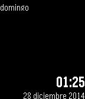</a>

<h2 class="app-name" id="app-549f4edeef9cfa3452000278"><a href="https://apps.repebble.com/549f4edeef9cfa3452000278">L.gant</a></h2>
<a class="app-source" href="https://github.com/XWolfOverride/L.GANT" title="Source code" data-search-exclude>View source</a>

by <a href="https://apps.repebble.com/apps/dev/xwolfoverride_54469025c952a3161f00007d" title="More from this developer">XWolfOverride</a>

MIT v1.0 Updated 2014-12-28

Runs on: Time 2, Pebble 2 Duo, Pebble 2, Time, Classic

A simply and elegant watchface.

<a class="app-shot" href="https://apps.repebble.com/66469b18edac433e82715659" data-search-exclude>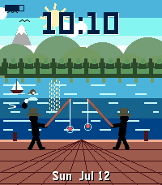</a>

<h2 class="app-name" id="app-66469b18edac433e82715659"><a href="https://apps.repebble.com/66469b18edac433e82715659">Lake Sammamish</a></h2>
<a class="app-source" href="https://github.com/coredevices/pebble-watchface-agent-skill" title="Source code" data-search-exclude>View source</a>

by <a href="https://apps.repebble.com/apps/dev/aircodum_67bc77bf37d408000a74f7d3" title="More from this developer">AirCodum</a>

Not checked yet v1.0.0 Updated 2026-07-12

Runs on: Time 2

A living Lake Sammamish scene that changes with the time of day — dawn, midday, golden sunset, and a starry moonlit night. The sun and moon arc across the sky, the forested Issaquah-Alps foothills…

<a class="app-shot" href="https://apps.repebble.com/fe6b9da4d64249fd800c779c" data-search-exclude>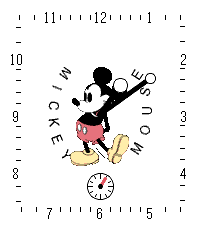</a>

<h2 class="app-name" id="app-fe6b9da4d64249fd800c779c"><a href="https://apps.repebble.com/fe6b9da4d64249fd800c779c">Langdon</a></h2>
<a class="app-source" href="https://github.com/coredevices/pebble-watchface-agent-skill" title="Source code" data-search-exclude>View source</a>

by <a href="https://apps.repebble.com/apps/dev/aircodum_67bc77bf37d408000a74f7d3" title="More from this developer">AirCodum</a>

Not checked yet v1.1.2 Updated 2026-04-16

Runs on: Round 2, Time 2, Time Round

▎ A classic Mickey Mouse analog watchface inspired by Professor Robert Langdon ▎ — the Harvard symbologist from Dan Brown&#x27;s bestselling novels The Da Vinci ▎ Code, Angels &amp; Demons, Inferno, The…

<a class="app-shot" href="https://apps.repebble.com/765f0c27d5b042e7a6205422" data-search-exclude>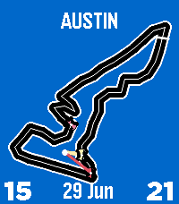</a>

<h2 class="app-name" id="app-765f0c27d5b042e7a6205422"><a href="https://apps.repebble.com/765f0c27d5b042e7a6205422">LapTime - F1 Track Watchface</a></h2>
<a class="app-source" href="https://github.com/jimbruges/pebble-f1-watchface" title="Source code" data-search-exclude>View source</a>

by <a href="https://apps.repebble.com/apps/dev/electronic-esoterica_a7debaf5ee7f795688f3e475" title="More from this developer">Electronic Esoterica</a>

Not checked yet v1.0.7 Updated 2026-07-05

Runs on: Time 2, Pebble 2 Duo, Pebble 2, Time

160 real Formula 1 circuit tracks with cars racing around the track following the time. Features animated race laps, health data cars, analog hands, and a full 2026 F1 race calendar with…

<a class="app-shot" href="https://apps.rebble.io/en_US/application/626b1ef27ca61400094ed7e4" data-search-exclude>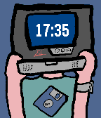</a>

<h2 class="app-name" id="app-626b1ef27ca61400094ed7e4"><a href="https://apps.rebble.io/en_US/application/626b1ef27ca61400094ed7e4">Laptopman Face (Classic)</a></h2>
<a class="app-source" href="https://github.com/JohnSpahr/LaptopmanFace" title="Source code" data-search-exclude>View source</a>

by <a href="https://apps.rebble.io/en_US/developer/609801a58324660009e8a4db/1" title="More from this developer">John Spahr</a>

CC0-1.0 v1.4 Updated 2022-05-22 Rebble App Store

Runs on: Time 2, Pebble 2 Duo, Pebble 2, Time, Classic

Good news! I&#x27;ve released an updated version of this face with a couple of new features. However, I&#x27;ll be keeping this one around if you prefer the old style. Meet the Laptopman, a simple Pebble…

<a class="app-shot" href="https://apps.rebble.io/en_US/application/6293cf9e98768d00095a945f" data-search-exclude>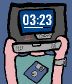</a>

<h2 class="app-name" id="app-6293cf9e98768d00095a945f"><a href="https://apps.rebble.io/en_US/application/6293cf9e98768d00095a945f">Laptopman Face 2.0</a></h2>
<a class="app-source" href="https://github.com/johnspahr/laptopmanface" title="Source code" data-search-exclude>View source</a>

by <a href="https://apps.rebble.io/en_US/developer/609801a58324660009e8a4db/1" title="More from this developer">John Spahr</a>

Not checked yet v2.2 Updated 2022-11-22 Rebble App Store

Runs on: Round 2, Time 2, Pebble 2 Duo, Pebble 2, Time Round, Time, Classic

Meet the new (and improved) Laptopman Face, a watchface featuring a guy with laptop for a head! This updated version introduces a more readable font and a battery meter. Be careful, though, as…

<a class="app-shot" href="https://apps.repebble.com/3f606f4c262f4112b1058308" data-search-exclude>No screenshot</a>

<h2 class="app-name" id="app-3f606f4c262f4112b1058308"><a href="https://apps.repebble.com/3f606f4c262f4112b1058308">Large font watchface</a></h2>
<a class="app-source" href="https://github.com/jimpriest/pebble-large-font" title="Source code" data-search-exclude>View source</a>

by <a href="https://apps.repebble.com/apps/dev/unknown_351569775d80d46f9fc0a7df" title="More from this developer">Unknown</a>

Not checked yet v1.0 Updated 2026-04-07

Runs on: Pebble 2 Duo

Simple, large font watchface for old folks :)

<a class="app-shot" href="https://apps.repebble.com/1f224e24fc2a4938a84d7f70" data-search-exclude>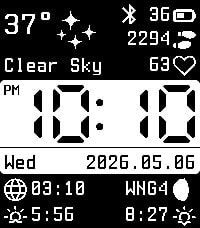</a>

<h2 class="app-name" id="app-1f224e24fc2a4938a84d7f70"><a href="https://apps.repebble.com/1f224e24fc2a4938a84d7f70">Last Time</a></h2>
<a class="app-source" href="https://github.com/mgerb/last_time" title="Source code" data-search-exclude>View source</a>

by <a href="https://apps.repebble.com/apps/dev/mgerb_695363f585e41100095685ab" title="More from this developer">mgerb</a>

Not checked yet v1.8.0 Updated 2026-09-02

Runs on: Time 2, Pebble 2 Duo, Pebble 2, Time, Classic

A multifunctional Pebble watchface. Source: https://github.com/mgerb/last_time Features - Time, date, day of week - Weather (Open-Meteo) - Text description - Weather icons (day/night) …

<h2 class="app-name" id="app-5342beed623a497d30000022"><a href="https://apps.repebble.com/5342beed623a497d30000022">Laughing Man</a></h2>
<a class="app-source" href="https://github.com/docsmooth/laughingman" title="Source code" data-search-exclude>View source</a>

by <a href="https://apps.repebble.com/apps/dev/docsmooth_52f2582fc41172eebc00151d" title="More from this developer">docsmooth</a>

Not checked yet v2.12 Updated 2014-12-02

Runs on: Time 2, Pebble 2 Duo, Pebble 2, Time, Classic

The Laughing Man logo from Ghost in the Shell (GitS), analog watchface. The spinning words are the minute hand, and the ballcap is the hour hand. Copyright owned by ProductionIG permits personal…

<a class="app-shot" href="https://apps.repebble.com/fafbbd65c0a14e07b37c71ea" data-search-exclude>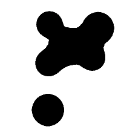</a>

<h2 class="app-name" id="app-fafbbd65c0a14e07b37c71ea"><a href="https://apps.repebble.com/fafbbd65c0a14e07b37c71ea">Lavalamp</a></h2>
<a class="app-source" href="https://github.com/marukitano/Lavalamp" title="Source code" data-search-exclude>View source</a>

by <a href="https://apps.repebble.com/apps/dev/marukitano_ff2831479c1011a82df1985d" title="More from this developer">marukitano</a>

Not checked yet v1.2.1 Updated 2026-07-29

Runs on: Time 2, Pebble 2 Duo, Pebble 2, Time, Classic

English Lavalamp is a binary watchface that displays the current time using animated, organic blobs. The upper blobs represent the hours, while the lower blobs represent the minutes. Each position…

<a class="app-shot" href="https://apps.repebble.com/69139dc57a004424b6109c20" data-search-exclude>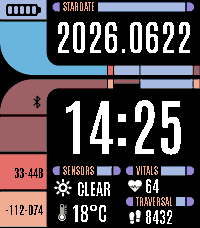</a>

<h2 class="app-name" id="app-69139dc57a004424b6109c20"><a href="https://apps.repebble.com/69139dc57a004424b6109c20">LCARS Stardate</a></h2>
<a class="app-source" href="https://github.com/AKlitbo/pebble-watchface-lcars" title="Source code" data-search-exclude>View source</a>

by <a href="https://apps.repebble.com/apps/dev/null-syntax_089fa8f469578884846bff5a" title="More from this developer">Null Syntax</a>

Other v1.13.0 Updated 2026-09-27

Runs on: Time 2

LCARS Stardate is an LCARS-inspired digital watchface designed for the Pebble Time 2. 🧩 Panels - Four pickable panels under the clock and stardate banner, two per column. Any of the 26 readouts…

<a class="app-shot" href="https://apps.repebble.com/52e3b15b34ba6696e0000553" data-search-exclude>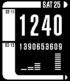</a>

<h2 class="app-name" id="app-52e3b15b34ba6696e0000553"><a href="https://apps.repebble.com/52e3b15b34ba6696e0000553">LCARS v2</a></h2>
<a class="app-source" href="https://github.com/slayer1551/LCARS-1-SDK-2.0" title="Source code" data-search-exclude>View source</a>

by <a href="https://apps.repebble.com/apps/dev/slayer1551_52a857b8c7faf78a64000004" title="More from this developer">slayer1551</a>

Not checked yet v3.0.0 Updated 2014-01-25

Runs on: Time 2, Pebble 2 Duo, Pebble 2, Time, Classic

Based on the computer system LCARS from the Star Trek series. The numbers under the current time &quot;1701&quot; will show the time in UNIX timestamp. The bars at the bottom will show the time like &#x27;Times…

<a class="app-shot" href="https://apps.repebble.com/56bedba7f65c491cd4000068" data-search-exclude>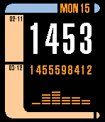</a>

<h2 class="app-name" id="app-56bedba7f65c491cd4000068"><a href="https://apps.repebble.com/56bedba7f65c491cd4000068">LCARS v3 Colored</a></h2>
<a class="app-source" href="https://github.com/keithzg/LCARS-1-SDK-3.0-colored" title="Source code" data-search-exclude>View source</a>

by <a href="https://apps.repebble.com/apps/dev/keithzg_52d9c139b82a9f04f2000024" title="More from this developer">keithzg</a>

Not checked yet v3.1 Updated 2016-02-15

Runs on: Time 2, Time

LCARS watchface, updated for Time with some colors

<a class="app-shot" href="https://apps.repebble.com/55fd1816f1f7eae3c600003c" data-search-exclude>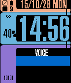</a>

<h2 class="app-name" id="app-55fd1816f1f7eae3c600003c"><a href="https://apps.repebble.com/55fd1816f1f7eae3c600003c">LCARS WATCH</a></h2>
<a class="app-source" href="https://github.com/marfoo-amagramer/PebbleLcarsWatch" title="Source code" data-search-exclude>View source</a>

by <a href="https://apps.repebble.com/apps/dev/marfoo_52cceaccd4686c07f2000044" title="More from this developer">marfoo</a>

Not checked yet v1.0 Updated 2015-10-26

Runs on: Time 2, Time

First Version

<a class="app-shot" href="https://apps.repebble.com/56fa97f969581df9ba000044" data-search-exclude>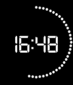</a>

<h2 class="app-name" id="app-56fa97f969581df9ba000044"><a href="https://apps.repebble.com/56fa97f969581df9ba000044">LCD</a></h2>
<a class="app-source" href="https://www.github.com/bschau/LCD" title="Source code" data-search-exclude>View source</a>

by <a href="https://apps.repebble.com/apps/dev/brian-schau_52bc98fc530bf4ed75000183" title="More from this developer">Brian Schau</a>

Not checked yet v3.3 Updated 2016-08-03

Runs on: Round 2, Time 2, Pebble 2 Duo, Pebble 2, Time Round, Time, Classic

Show time in LCD font. Features: - Large time display. - Seconds in dots. - Color of watchface can be changed. - Double-flick your wrist to show date and battery status.

<a class="app-shot" href="https://apps.repebble.com/6abd2f9a6dd84d000954e892" data-search-exclude>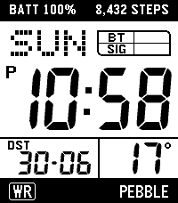</a>

<h2 class="app-name" id="app-6abd2f9a6dd84d000954e892"><a href="https://apps.repebble.com/6abd2f9a6dd84d000954e892">LCD 221</a></h2>
<a class="app-source" href="https://github.com/ChocolatineDigitale/PT2-LCD221" title="Source code" data-search-exclude>View source</a>

by <a href="https://apps.repebble.com/apps/dev/kicou_6abd2deace9b620009d48d5b" title="More from this developer">Kicou</a>

MIT v1.2.2 Updated 2026-10-03

Runs on: Time 2

A Pebble Time 2 watch face that recreates the look of the Casio W-221H: a crisp LCD with slanted 7-segment digits, faint unlit segments, a dot-matrix weekday and a BT / CHG / SIG / MUTE indicator…

<h2 class="app-name" id="app-52a940f8c0ca93a0d1000017"><a href="https://apps.repebble.com/52a940f8c0ca93a0d1000017">LCD Hourglass</a></h2>
<a class="app-source" href="https://github.com/benmccanny" title="Source code" data-search-exclude>View source</a>

by <a href="https://apps.repebble.com/apps/dev/ben-mccanny_52a92edc79c18f0e08000011" title="More from this developer">Ben McCanny</a>

See source v0.2.0 Updated 2013-12-23

Runs on: Time 2, Pebble 2 Duo, Pebble 2, Time, Classic

The simplicity of knowing the exact time of day, without worrying if it&#x27;s 11:37 or 11:38. LCD Hourglass is a minimalist watchface that depicts minutes as a giant vertical progress bar. Inching…

<a class="app-shot" href="https://apps.repebble.com/8202d29e6aea4d93ab507208" data-search-exclude>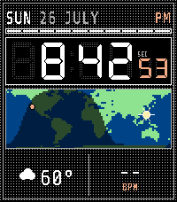</a>

<h2 class="app-name" id="app-8202d29e6aea4d93ab507208"><a href="https://apps.repebble.com/8202d29e6aea4d93ab507208">LCD Worldtime</a></h2>
<a class="app-source" href="https://github.com/michaellunzer/pebble-lcd-worldtime" title="Source code" data-search-exclude>View source</a>

by <a href="https://apps.repebble.com/apps/dev/hoyt-labs_2c7cc63cb80aec6744597cfb" title="More from this developer">Hoyt Labs</a>

Not checked yet v1.1.0 Updated 2026-07-27

Runs on: Time 2

LCD Worldtime A Casio-flavored LCD watchface with a live day/night world map. Watch the sun&#x27;s terminator sweep across the globe in real time, with a marker on your home city and the subsolar point…

<h2 class="app-name" id="app-55961d9a70f2c35e6400000a"><a href="https://apps.repebble.com/55961d9a70f2c35e6400000a">LCHF</a></h2>
<a class="app-source" href="https://github.com/Kdisimone/cgm-pebble.git" title="Source code" data-search-exclude>View source</a>

by <a href="https://apps.repebble.com/apps/dev/testyk8_55514ddbcf532c2c780000a6" title="More from this developer">testyk8</a>

No licence v1.2 Updated 2015-08-03

Runs on: Time 2, Pebble 2 Duo, Pebble 2, Time, Classic

NS watch face customized with ability to set lower HIGH BG alert settings.

<h2 class="app-name" id="app-5318948044e93656d00005e6"><a href="https://apps.repebble.com/5318948044e93656d00005e6">Lebanese Time</a></h2>
<a class="app-source" href="https://github.com/raja-baz/pebble-watchfaces" title="Source code" data-search-exclude>View source</a>

by <a href="https://apps.repebble.com/apps/dev/raja-baz_53188dea44e93619780005f1" title="More from this developer">Raja Baz</a>

Not checked yet v1.0.2 Updated 2014-03-06

Runs on: Time 2, Pebble 2 Duo, Pebble 2, Time, Classic

Displays the time in Lebanese sms-speak

<a class="app-shot" href="https://apps.repebble.com/57f5ce20637410db7b000054" data-search-exclude>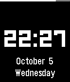</a>

<h2 class="app-name" id="app-57f5ce20637410db7b000054"><a href="https://apps.repebble.com/57f5ce20637410db7b000054">LECO Style</a></h2>
<a class="app-source" href="https://github.com/oxogglant/LECO_STYLE" title="Source code" data-search-exclude>View source</a>

by <a href="https://apps.repebble.com/apps/dev/dickle_55c004676c5ba08654000069" title="More from this developer">dickle</a>

Not checked yet v1.1 Updated 2016-10-06

Runs on: Time 2, Pebble 2 Duo, Pebble 2, Time, Classic

Inspired by LECO by TheAggieProject, but with some modifications. Features an unabbreviated date and day, subtle battery bar, and an obvious and unambiguous bluetooth disconnect indicator. Goal…

<a class="app-shot" href="https://apps.repebble.com/55038e971d839c3065000009" data-search-exclude>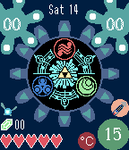</a>

<h2 class="app-name" id="app-55038e971d839c3065000009"><a href="https://apps.repebble.com/55038e971d839c3065000009">Legend of Zelda: Gate of Time</a></h2>
<a class="app-source" href="https://github.com/asardaes/pebble-zgot" title="Source code" data-search-exclude>View source</a>

by <a href="https://apps.repebble.com/apps/dev/apestowesome_54f473e5975f691677000041" title="More from this developer">Apestowesome</a>

No licence v4.0 Updated 2016-05-13

Runs on: Round 2, Time 2, Pebble 2 Duo, Pebble 2, Time Round, Time, Classic

Watchface inspired by the Gate of Time that appears on the game The Legend of Zelda: Skyward Sword. The amount of details is limited due to resolution restrictions. - You can configure how often…

<h2 class="app-name" id="app-1631a5d9ebbf4d22b5d4cd0d"><a href="https://apps.repebble.com/1631a5d9ebbf4d22b5d4cd0d">Legere</a></h2>
<a class="app-source" href="https://github.com/gordonbazeley/legere" title="Source code" data-search-exclude>View source</a>

by <a href="https://apps.repebble.com/apps/dev/modusapps_57f55e314529f5b84f00003f" title="More from this developer">ModusApps</a>

Not checked yet v1.0.0 Updated 2026-10-05

Runs on: Round 2, Time 2

Legere is a minimal watchface built around two ideas: 1. Minimal battery drain. It redraws once a minute, shows only the time and date, and has no complications or animation. 2. What you need to…

<h2 class="app-name" id="app-78297d14b6bd426799b7d759"><a href="https://apps.repebble.com/78297d14b6bd426799b7d759">Lemming Brothers</a></h2>
<a class="app-source" href="https://github.com/trishtzy/pebble" title="Source code" data-search-exclude>View source</a>

by <a href="https://apps.repebble.com/apps/dev/trishtzy_7f804afab74d6b22653f0e98" title="More from this developer">trishtzy</a>

Not checked yet v1.0.0 Updated 2026-08-29

Runs on: Time 2, Pebble 2 Duo, Pebble 2, Time

The Lemming Brothers bank is open for business — and time is money. A tiny analog clock is set into the facade of the venerable Lemming Brothers bank, keeping the hours with proper hands on a…

<a class="app-shot" href="https://apps.repebble.com/36e32a26a469451d97322d8d" data-search-exclude>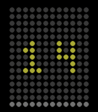</a>

<h2 class="app-name" id="app-36e32a26a469451d97322d8d"><a href="https://apps.repebble.com/36e32a26a469451d97322d8d">Less is More</a></h2>
<a class="app-source" href="https://github.com/Tombarr/less-is-more" title="Source code" data-search-exclude>View source</a>

by <a href="https://apps.repebble.com/apps/dev/tom-barrasso_fbc733e607111c40a710b20a" title="More from this developer">Tom Barrasso</a>

Apache-2.0 v1.1 Updated 2026-04-06

Runs on: Round 2, Time 2, Pebble 2 Duo, Pebble 2, Time Round, Time, Classic

Dieter Rams&#x27; Braun Less-is-More inspired watchface

<a class="app-shot" href="https://apps.repebble.com/555501d719e56a9a6f000027" data-search-exclude>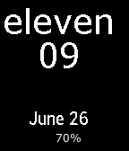</a>

<h2 class="app-name" id="app-555501d719e56a9a6f000027"><a href="https://apps.repebble.com/555501d719e56a9a6f000027">Letters:Numbers</a></h2>
<a class="app-source" href="https://github.com/dweinberger/letter-number" title="Source code" data-search-exclude>View source</a>

by <a href="https://apps.repebble.com/apps/dev/davidjoho_534d84d47670329d05000255" title="More from this developer">davidjoho</a>

Not checked yet v1.1 Updated 2015-06-14

Runs on: Time 2, Pebble 2 Duo, Pebble 2, Time, Classic

The hour is a word. The minutes are a number. The date and battery percent. That&#x27;s it.

<a class="app-shot" href="https://apps.repebble.com/6951f2e5828bd90009267488" data-search-exclude>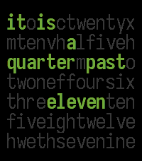</a>

<h2 class="app-name" id="app-6951f2e5828bd90009267488"><a href="https://apps.repebble.com/6951f2e5828bd90009267488">Lexiclock</a></h2>
<a class="app-source" href="https://github.com/sockeye-d/pebble-lexiclock/tree/main" title="Source code" data-search-exclude>View source</a>

by <a href="https://apps.repebble.com/apps/dev/fish_682b987ec15d300009637d7d" title="More from this developer">fish</a>

Not checked yet v1.6 Updated 2026-01-28

Runs on: Time 2, Pebble 2 Duo, Pebble 2, Time, Classic

A word clock for Basalt and Emery

<a class="app-shot" href="https://apps.repebble.com/aaea8be3e7084043a53e0b89" data-search-exclude>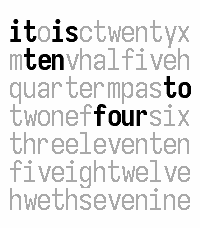</a>

<h2 class="app-name" id="app-aaea8be3e7084043a53e0b89"><a href="https://apps.repebble.com/aaea8be3e7084043a53e0b89">lexiclock₂</a></h2>
<a class="app-source" href="https://github.com/sockeye-d/pebble-lexiclock/" title="Source code" data-search-exclude>View source</a>

by <a href="https://apps.repebble.com/apps/dev/me_e00894edb61959a4a3c7d0d4" title="More from this developer">me</a>

Not checked yet v1.0 Updated 2026-04-19

Runs on: Time 2, Pebble 2 Duo, Pebble 2, Time, Classic

Display time in words! A revamped version of my old watchface &#x27;lexiclock&#x27;, this should consume less power, be more configurable, not crash so much on Aplite, and have a more stylish date display…

<a class="app-shot" href="https://apps.rebble.io/en_US/application/590431830dfc328c360006ce" data-search-exclude>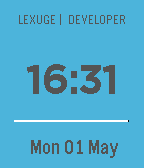</a>

<h2 class="app-name" id="app-590431830dfc328c360006ce"><a href="https://apps.rebble.io/en_US/application/590431830dfc328c360006ce">lexuge</a></h2>
<a class="app-source" href="https://github.com/LEXUGE/lexuge-face" title="Source code" data-search-exclude>View source</a>

by <a href="https://apps.rebble.io/en_US/developer/59040cbb6ca387f83d000242/1" title="More from this developer">LEXUGE</a>

GPL-3.0 v1.3 Updated 2017-05-04 Rebble App Store

Runs on: Round 2, Time 2, Pebble 2 Duo, Pebble 2, Time Round, Time, Classic

A LEXUGE&#x27;s opensource watchface Simple and modern watchface. See the time as digital. See the battery bar as the line. The source code on github:https://github.com/LEXUGE/lexuge-face

<h2 class="app-name" id="app-16a26261425f4be090bd9e18"><a href="https://apps.repebble.com/16a26261425f4be090bd9e18">License Plate</a></h2>
<a class="app-source" href="https://github.com/ygalanter/license-plate-pebble" title="Source code" data-search-exclude>View source</a>

by <a href="https://apps.repebble.com/apps/dev/comfortably-numb_52f547605101128b2200005a" title="More from this developer">Comfortably Numb</a>

Not checked yet v1.1.0 Updated 2026-07-09

Runs on: Time 2, Time

License Plate is a digital clock in form of a car license plate. 🎨 Fully customizable colors 📍 Automatically detects and shows your location on the license plate Shaking watch cycles thru: 📍…

<a class="app-shot" href="https://apps.repebble.com/56cbe864dba61e0fb600000d" data-search-exclude>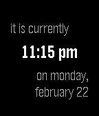</a>

<h2 class="app-name" id="app-56cbe864dba61e0fb600000d"><a href="https://apps.repebble.com/56cbe864dba61e0fb600000d">Life Timer</a></h2>
<a class="app-source" href="https://github.com/kid-c-plus/LifeTimer" title="Source code" data-search-exclude>View source</a>

by <a href="https://apps.repebble.com/apps/dev/rick-lewis_5541bb8d25cbe39ea900003e" title="More from this developer">Rick Lewis</a>

Not checked yet v1.0 Updated 2016-02-23

Runs on: Round 2, Time 2, Pebble 2 Duo, Pebble 2, Time Round, Time, Classic

Most of the times I check my watch, I don&#x27;t really want to know the time. I just want to know how long it&#x27;s been since the last time I checked my watch. This watchface helps with that. The default…

<h2 class="app-name" id="app-56f1a4021fd1e75549000017"><a href="https://apps.repebble.com/56f1a4021fd1e75549000017">LIFT</a></h2>
<a class="app-source" href="https://github.com/WuerfelDev/LIFT/" title="Source code" data-search-exclude>View source</a>

by <a href="https://apps.repebble.com/apps/dev/wuerfeldev_56dab64f59ab332abd00000b" title="More from this developer">WuerfelDev</a>

MIT v1.4 Updated 2025-03-04

Runs on: Round 2, Time 2, Pebble 2 Duo, Pebble 2, Time Round, Time, Classic

This watchface is simply beautiful. You can choose between 12h and 24h clock in the pebble settings. While one hour pass, the red panel which shows the time, slides from the top (when the hour…

<a class="app-shot" href="https://apps.repebble.com/52db1ba8889f5dade50002d8" data-search-exclude>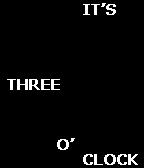</a>

<h2 class="app-name" id="app-52db1ba8889f5dade50002d8"><a href="https://apps.repebble.com/52db1ba8889f5dade50002d8">Lightbox</a></h2>
<a class="app-source" href="http://github.com/BobTheMadCow/LightBox" title="Source code" data-search-exclude>View source</a>

by <a href="https://apps.repebble.com/apps/dev/bobthemadcow_52ce95e067e4945a42000033" title="More from this developer">BobTheMadCow</a>

No licence v2.0 Updated 2015-03-03

Runs on: Time 2, Pebble 2 Duo, Pebble 2, Time, Classic

Tells the time by lighting up words from behind. Animated on launch and when changing which words are lit.

<h2 class="app-name" id="app-54f5aeb6adc8643c64000041"><a href="https://apps.repebble.com/54f5aeb6adc8643c64000041">LightBox 2</a></h2>
<a class="app-source" href="https://github.com/BobTheMadCow/Lightbox2" title="Source code" data-search-exclude>View source</a>

by <a href="https://apps.repebble.com/apps/dev/bobthemadcow_52ce95e067e4945a42000033" title="More from this developer">BobTheMadCow</a>

No licence v1.0 Updated 2015-03-03

Runs on: Time 2, Pebble 2 Duo, Pebble 2, Time, Classic

Tells the time by lighting up words from behind. Animated on launch and every minute when changing which words are lit.

<a class="app-shot" href="https://apps.repebble.com/a5874b2f337249e58d31353d" data-search-exclude>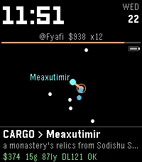</a>

<h2 class="app-name" id="app-a5874b2f337249e58d31353d"><a href="https://apps.repebble.com/a5874b2f337249e58d31353d">Lighthaul Watchface</a></h2>
<a class="app-source" href="https://github.com/thejambi/Lighthaul-Watchface" title="Source code" data-search-exclude>View source</a>

by <a href="https://apps.repebble.com/apps/dev/zach-burnham_939ce698485e86de8b11f7ae" title="More from this developer">Zach Burnham</a>

Not checked yet v1.4.0 Updated 2026-07-29

Runs on: Round 2, Time 2, Pebble 2 Duo, Pebble 2, Time Round, Time

The Lighthaul star map as a watchface - and your ship flies itself. Every day a new procedurally-generated cluster arrives, seeded by the date: every pilot wearing this face flies the same galaxy…

<a class="app-shot" href="https://apps.repebble.com/60a0da706ece4c9884f5b631" data-search-exclude>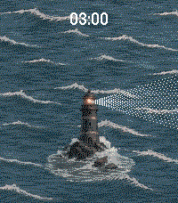</a>

<h2 class="app-name" id="app-60a0da706ece4c9884f5b631"><a href="https://apps.repebble.com/60a0da706ece4c9884f5b631">Lighthouse</a></h2>
<a class="app-source" href="https://github.com/DangerBlack/lighthouse" title="Source code" data-search-exclude>View source</a>

by <a href="https://apps.repebble.com/apps/dev/unknown_1136a16c6801902ec13640e9" title="More from this developer">Unknown</a>

No licence v1.0.0 Updated 2026-05-18

Runs on: Round 2, Time 2

Lighthouse is a moody animated watchface that brings a lighthouse scene to life every time you glance at your wrist. Watch the beam sweep across the dark water as the lighthouse stands tall…

<a class="app-shot" href="https://apps.repebble.com/56a146bd5b1314785400006d" data-search-exclude>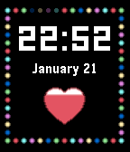</a>

<h2 class="app-name" id="app-56a146bd5b1314785400006d"><a href="https://apps.repebble.com/56a146bd5b1314785400006d">Lights</a></h2>
<a class="app-source" href="https://github.com/bschau/Lights.git" title="Source code" data-search-exclude>View source</a>

by <a href="https://apps.repebble.com/apps/dev/brian-schau_52bc98fc530bf4ed75000183" title="More from this developer">Brian Schau</a>

No licence v1.1 Updated 2016-01-30

Runs on: Time 2, Time

Lights - shows time and battery status and each seconds turns on a lightbulb.

<a class="app-shot" href="https://apps.repebble.com/6b9efe0bec8746bfba20ad7e" data-search-exclude>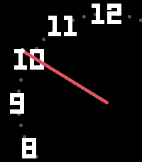</a>

<h2 class="app-name" id="app-6b9efe0bec8746bfba20ad7e"><a href="https://apps.repebble.com/6b9efe0bec8746bfba20ad7e">Limb</a></h2>
<a class="app-source" href="https://github.com/ProggroP/Limb" title="Source code" data-search-exclude>View source</a>

by <a href="https://apps.repebble.com/apps/dev/kieselleger_56f70d3fe58879cfd4000013" title="More from this developer">Kieselleger</a>

No licence v1.0 Updated 2026-05-19

Runs on: Round 2, Time 2, Pebble 2 Duo, Pebble 2, Time Round, Time, Classic

Limb reimagines the classic clock face by placing its centre beyond the screen edge. Only the limb of the dial is visible — a gently curved arc carrying two or three hour numerals, a bold minute…

<a class="app-shot" href="https://apps.rebble.io/en_US/application/594cbf8ab67f9f9e8100137c" data-search-exclude>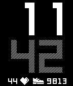</a>

<h2 class="app-name" id="app-594cbf8ab67f9f9e8100137c"><a href="https://apps.rebble.io/en_US/application/594cbf8ab67f9f9e8100137c">Lime</a></h2>
<a class="app-source" href="https://github.com/mereed/pebbleface-lime" title="Source code" data-search-exclude>View source</a>

by <a href="https://apps.rebble.io/en_US/developer/52d76309bd61272345000001/1" title="More from this developer">chops</a>

Not checked yet v1.5 Updated 2017-09-17 Rebble App Store

Runs on: Time 2, Pebble 2 Duo, Pebble 2, Time, Classic

This simple watchface is based on some of the promotional images for the Charcoal/Lime Pebble2, with some extra stuff added, and it works on all rectangular watches. Down the left side (top down)…

<a class="app-shot" href="https://apps.repebble.com/003f0ed2b7c84ecfa57bca1a" data-search-exclude>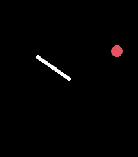</a>

<h2 class="app-name" id="app-003f0ed2b7c84ecfa57bca1a"><a href="https://apps.repebble.com/003f0ed2b7c84ecfa57bca1a">Line and Dot</a></h2>
<a class="app-source" href="https://github.com/coredevices/pebble-watchface-agent-skill" title="Source code" data-search-exclude>View source</a>

by <a href="https://apps.repebble.com/apps/dev/midnight-oscillator_f337572cef4e9221cecbab5c" title="More from this developer">Midnight Oscillator</a>

Not checked yet v1.1.0 Updated 2026-04-08

Runs on: Round 2, Time 2

Minimalist analog watchface with a white hour hand and red dot orbiting the dial edge. Colors are fully customizable via settings.

<a class="app-shot" href="https://apps.repebble.com/6a69d2c781cc78000918bee2" data-search-exclude>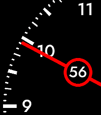</a>

<h2 class="app-name" id="app-6a69d2c781cc78000918bee2"><a href="https://apps.repebble.com/6a69d2c781cc78000918bee2">Line Dash</a></h2>
<a class="app-source" href="https://github.com/pagnotta/pebble-line-dash/" title="Source code" data-search-exclude>View source</a>

by <a href="https://apps.repebble.com/apps/dev/pagnotta_6a69c949c214270009ada581" title="More from this developer">pagnotta</a>

Not checked yet v1.0.2 Updated 2026-07-31

Runs on: Round 2, Time 2

A stylish, minimalist one-hand analog watchface for the Pebble Time 2 and Round 2. Designed for intuitive timekeeping, Line Dash features curated typography and a strictly functional, clutter-free…

<a class="app-shot" href="https://apps.rebble.io/en_US/application/5588410449c1d102cd000114" data-search-exclude>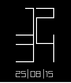</a>

<h2 class="app-name" id="app-5588410449c1d102cd000114"><a href="https://apps.rebble.io/en_US/application/5588410449c1d102cd000114">Lines</a></h2>
<a class="app-source" href="https://edwinfinch.com/redirect/pebble-legacy-source" title="Source code" data-search-exclude>View source</a>

by <a href="https://apps.rebble.io/en_US/developer/5db6f59e385af50001ba25f9/1" title="More from this developer">Edwin Finch</a>

See source v2.2-rbl Updated 2021-06-17 Rebble App Store

Runs on: Time 2, Pebble 2 Duo, Pebble 2, Time, Classic

An old classic from our original collection from 2014-2016, now free &amp; open source!

<a class="app-shot" href="https://apps.repebble.com/57be4d805e3c3d0bfc000021" data-search-exclude>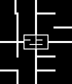</a>

<h2 class="app-name" id="app-57be4d805e3c3d0bfc000021"><a href="https://apps.repebble.com/57be4d805e3c3d0bfc000021">Lines (Enhanced)</a></h2>
<a class="app-source" href="https://github.com/antgiant/pebble-LinesWatch" title="Source code" data-search-exclude>View source</a>

by <a href="https://apps.repebble.com/apps/dev/antgiant_52f58a5736a500c6cf000223" title="More from this developer">antgiant</a>

No licence v4.4 Updated 2016-11-15

Runs on: Round 2, Time 2, Pebble 2 Duo, Pebble 2, Time Round, Time, Classic

Lines (Enhanced) is a minimalist digital watch face with beautifully animated transitions. Once you see the numbers you will always be able to read it at a glance. This watch face is fully…

<h2 class="app-name" id="app-53203b50e271dff124000086"><a href="https://apps.repebble.com/53203b50e271dff124000086">LinesWatch</a></h2>
<a class="app-source" href="https://github.com/Tito1337/pebble-LinesWatch" title="Source code" data-search-exclude>View source</a>

by <a href="https://apps.repebble.com/apps/dev/tito_532034f6138eb909f6000091" title="More from this developer">Tito</a>

No licence v2.1.0 Updated 2014-03-12

Runs on: Time 2, Pebble 2 Duo, Pebble 2, Time, Classic

A simplistic and beatiful watchface with simple animation at time changes

<a class="app-shot" href="https://apps.rebble.io/en_US/application/67e3409cd0d80200091471ed" data-search-exclude>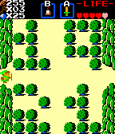</a>

<h2 class="app-name" id="app-67e3409cd0d80200091471ed"><a href="https://apps.rebble.io/en_US/application/67e3409cd0d80200091471ed">Link to the Present</a></h2>
<a class="app-source" href="https://github.com/dkabot/link-to-the-present" title="Source code" data-search-exclude>View source</a>

by <a href="https://apps.rebble.io/en_US/developer/62881e9d49602f000bbad3bc/1" title="More from this developer">Naomi</a>

Not checked yet v1.0 Updated 2025-03-25 Rebble App Store

Runs on: Time 2, Pebble 2 Duo, Pebble 2, Time, Classic

A watchface themed after The Legend of Zelda for the NES. Every minute, Link will move to a new screen, where the bushes will burn away to reveal the time! Also displays the bluetooth connection…

<h2 class="app-name" id="app-5306f7a255bea29178000251"><a href="https://apps.repebble.com/5306f7a255bea29178000251">Liquid</a></h2>
<a class="app-source" href="https://github.com/distantcam/Watchface-Inversion" title="Source code" data-search-exclude>View source</a>

by <a href="https://apps.repebble.com/apps/dev/cameron-macfarland_5305728d7c1a9d6ce000011c" title="More from this developer">Cameron MacFarland</a>

Not checked yet v1.0 Updated 2014-03-09

Runs on: Time 2, Pebble 2 Duo, Pebble 2, Time, Classic

Shows the hour as a number, and the minutes as a liquid filling up the screen.

<a class="app-shot" href="https://apps.repebble.com/99764668bf564d0fb5e50d2f" data-search-exclude>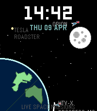</a>

<h2 class="app-name" id="app-99764668bf564d0fb5e50d2f"><a href="https://apps.repebble.com/99764668bf564d0fb5e50d2f">Live Space Missions</a></h2>
<a class="app-source" href="https://github.com/adrienthiery/space-mission-watchface" title="Source code" data-search-exclude>View source</a>

by <a href="https://apps.repebble.com/apps/dev/adrien0_b1f8a46227bc6b3950864489" title="More from this developer">Adrien0</a>

No licence v1.0.5 Updated 2026-06-22

Runs on: Round 2, Time 2, Pebble 2 Duo, Pebble 2, Time Round, Time, Classic

Track every crewed spacecraft in real time — ISS, Tiangong, lunar missions, and more — right on your wrist.

<a class="app-shot" href="https://apps.repebble.com/54d215cd2a56eec013000077" data-search-exclude>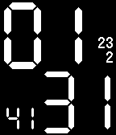</a>

<h2 class="app-name" id="app-54d215cd2a56eec013000077"><a href="https://apps.repebble.com/54d215cd2a56eec013000077">LiveDigits0</a></h2>
<a class="app-source" href="https://github.com/CleyFaye/Pebble-LiveDigits0" title="Source code" data-search-exclude>View source</a>

by <a href="https://apps.repebble.com/apps/dev/cley-faye_531bcf7fc5f2c59932000a6e" title="More from this developer">Cley Faye</a>

MIT v1.4 Updated 2015-02-24

Runs on: Time 2, Pebble 2 Duo, Pebble 2, Time, Classic

Display time with nicely animated digits. Feature a handful of customizable options: different layout, different element shown (seconds, date, watch battery state, bluetooth connectivity state)…

<a class="app-shot" href="https://apps.repebble.com/69c856b70c9231000961ffd8" data-search-exclude>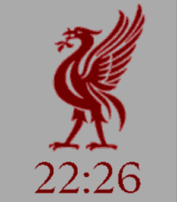</a>

<h2 class="app-name" id="app-69c856b70c9231000961ffd8"><a href="https://apps.repebble.com/69c856b70c9231000961ffd8">Liverpool FC Liverbird Watchface</a></h2>
<a class="app-source" href="https://github.com/efboli/codespaces-pebble/tree/main/Liverbird%20face" title="Source code" data-search-exclude>View source</a>

by <a href="https://apps.repebble.com/apps/dev/efbo_52f14ee1e21be4b82000025d" title="More from this developer">efbo</a>

Not checked yet v1.0 Updated 2026-03-28

Runs on: Time 2, Pebble 2 Duo, Pebble 2, Time, Classic

A face featuring a Liverbird and the time in LFC Serif, the font used by Liverpool FC in their graphics, website, and around Anfield. Compatible with all Classic Pebbles, Time, Time Steel and Time…

<h2 class="app-name" id="app-0b5a545c44b04a3a9fa4ff65"><a href="https://apps.repebble.com/0b5a545c44b04a3a9fa4ff65">Loading Cat</a></h2>
<a class="app-source" href="https://github.com/zbzbw/loadingcat-pebble" title="Source code" data-search-exclude>View source</a>

by <a href="https://apps.repebble.com/apps/dev/bowen-zhou_063d3f629c1de112b0282d9b" title="More from this developer">Bowen Zhou</a>

Not checked yet v1.1 Updated 2026-04-04

Runs on: Round 2, Time 2, Pebble 2 Duo, Pebble 2, Time Round, Time, Classic

Yeah, loading...

<a class="app-shot" href="https://apps.repebble.com/ac26ba2c1d084f72b9181302" data-search-exclude>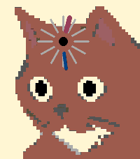</a>

<h2 class="app-name" id="app-ac26ba2c1d084f72b9181302"><a href="https://apps.repebble.com/ac26ba2c1d084f72b9181302">Loading Cat - Orange Edition</a></h2>
<a class="app-source" href="https://github.com/iansltx/loadingcat-pebble/tree/orange" title="Source code" data-search-exclude>View source</a>

by <a href="https://apps.repebble.com/apps/dev/ian-littman_deed3c179606a6a97c66e5ae" title="More from this developer">Ian Littman</a>

Not checked yet v1.0.1 Updated 2026-05-13

Runs on: Round 2, Time 2, Pebble 2 Duo, Pebble 2, Time Round, Time, Classic

A reskin of https://github.com/zbzbw/loadingcat-pebble with 100% more orange cat, calibrated for the Time 2 screen. You definitely don&#x27;t want this on a B&amp;W watch.

<a class="app-shot" href="https://apps.repebble.com/6f5289e6cd7f4ae7b666cb7f" data-search-exclude>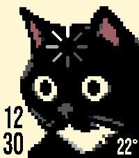</a>

<h2 class="app-name" id="app-6f5289e6cd7f4ae7b666cb7f"><a href="https://apps.repebble.com/6f5289e6cd7f4ae7b666cb7f">Loading Cat Digital</a></h2>
<a class="app-source" href="https://github.com/jerechinsky/loadingcat-digital" title="Source code" data-search-exclude>View source</a>

by <a href="https://apps.repebble.com/apps/dev/yerex_a69848ff9a9f1b9aa6b78ef5" title="More from this developer">yerex</a>

Not checked yet v1.6.5 Updated 2026-09-10

Runs on: Round 2, Time 2, Pebble 2 Duo, Pebble 2, Time Round, Time, Classic

A digital variant of &quot;loading cat&quot; by zbw / zbzbw. Really like the original, just wanted a digital clock too. Thanks to zbw for the watchface and cat artwork! - stacked hours and minutes, with…

<a class="app-shot" href="https://apps.repebble.com/561ae9444f81efef81000022" data-search-exclude>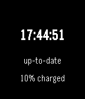</a>

<h2 class="app-name" id="app-561ae9444f81efef81000022"><a href="https://apps.repebble.com/561ae9444f81efef81000022">Local Sidereal Time Watchface</a></h2>
<a class="app-source" href="http://github.com/NanoExplorer/siderealPebble" title="Source code" data-search-exclude>View source</a>

by <a href="https://apps.repebble.com/apps/dev/rooneyworks_52f3d06322d1e070e2000369" title="More from this developer">RooneyWorks</a>

No licence v1.2 Updated 2016-03-01

Runs on: Time 2, Pebble 2 Duo, Pebble 2, Time, Classic

A watchface that displays the local sidereal time! Sidereal time is used by astronomers to determine the positions of the stars in the sky at the current time. A sidereal day is four minutes…

<h2 class="app-name" id="app-0fe5ed7ed11f4ccc8cb53216"><a href="https://apps.repebble.com/0fe5ed7ed11f4ccc8cb53216">Locus</a></h2>
<a class="app-source" href="https://github.com/ping840907/Locus" title="Source code" data-search-exclude>View source</a>

by <a href="https://apps.repebble.com/apps/dev/sloth8497_68c4a750647ef000080f0b2d" title="More from this developer">Sloth8497</a>

Not checked yet v1.0.4 Updated 2026-08-31

Runs on: Round 2, Time 2, Pebble 2 Duo, Pebble 2, Time Round, Time, Classic

Locus turns your smartwatch into a live map. Inspired by the beautiful Places watchface from the Looks collection by ustwo, this app reimagines that brilliant concept specifically for Pebble. It…

<h2 class="app-name" id="app-8ddf0a68bd2a4251b4eab414"><a href="https://apps.repebble.com/8ddf0a68bd2a4251b4eab414">Lofi Watch</a></h2>
<a class="app-source" href="https://github.com/manaksu/cozy-day" title="Source code" data-search-exclude>View source</a>

by <a href="https://apps.repebble.com/apps/dev/creative-manaks_504fe850dc7e97a445b0a10d" title="More from this developer">Creative Manaks</a>

Not checked yet v1.80 Updated 2026-05-30

Runs on: Time 2, Pebble 2 Duo, Pebble 2, Time

New App

<a class="app-shot" href="https://apps.repebble.com/5539019ca893513ec2000081" data-search-exclude>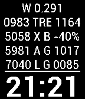</a>

<h2 class="app-name" id="app-5539019ca893513ec2000081"><a href="https://apps.repebble.com/5539019ca893513ec2000081">Log Clock</a></h2>
<a class="app-source" href="https://github.com/jackokring/pebble-sdk-examples/tree/master/watchfaces/log_clock" title="Source code" data-search-exclude>View source</a>

by <a href="https://apps.repebble.com/apps/dev/simon-jackson_53b089fdb9bff86310000009" title="More from this developer">Simon Jackson</a>

Not checked yet v2.4 Updated 2015-10-21

Runs on: Time 2, Pebble 2 Duo, Pebble 2, Time, Classic

Displays: 1. Location (also infers BT connectivity) 2. Reverse tan and exp gradients both div 10 3. Current X (charge+)Battery 4. Arc tan 1 @ 45 degree = 1 and gradient div 10 5. Log10 and…

<a class="app-shot" href="https://apps.repebble.com/5605531db66bdf6b2f000069" data-search-exclude>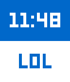</a>

<h2 class="app-name" id="app-5605531db66bdf6b2f000069"><a href="https://apps.repebble.com/5605531db66bdf6b2f000069">LOL Time</a></h2>
<a class="app-source" href="https://github.com/mzogheib/LOL-Time" title="Source code" data-search-exclude>View source</a>

by <a href="https://apps.repebble.com/apps/dev/marwan_52f0ce543be6208c1f001842" title="More from this developer">marwan</a>

Not checked yet v1.4 Updated 2016-11-19

Runs on: Time 2, Pebble 2 Duo, Pebble 2, Time, Classic

A LOL every minute.

<a class="app-shot" href="https://apps.repebble.com/55c61d58205929bf98000016" data-search-exclude>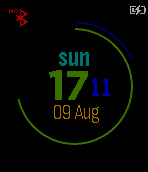</a>

<h2 class="app-name" id="app-55c61d58205929bf98000016"><a href="https://apps.repebble.com/55c61d58205929bf98000016">Lond&#x27;s Color Polar Clock</a></h2>
<a class="app-source" href="https://github.com/renatolond/pebble-color-polar-clock" title="Source code" data-search-exclude>View source</a>

by <a href="https://apps.repebble.com/apps/dev/renato-lond-cerqueira_531cf0b25c082c77a800042b" title="More from this developer">Renato &quot;Lond&quot; Cerqueira</a>

Not checked yet v1.2 Updated 2015-08-09

Runs on: Time 2, Pebble 2 Duo, Pebble 2, Time, Classic

Lond&#x27;s Polar Clock is a watchface that shows the hour and minutes using a polar representation that changes the color according to the time. Inspired by pixelbreaker&#x27;s polarclock, nirajsanghvi&#x27;s…

<a class="app-shot" href="https://apps.repebble.com/06e7836c4f704cf5bd8c987f" data-search-exclude>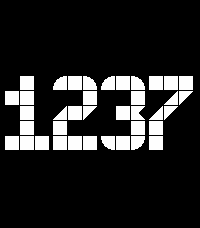</a>

<h2 class="app-name" id="app-06e7836c4f704cf5bd8c987f"><a href="https://apps.repebble.com/06e7836c4f704cf5bd8c987f">London Underground Clock</a></h2>
<a class="app-source" href="https://github.com/marian42/pebble-london-clock" title="Source code" data-search-exclude>View source</a>

by <a href="https://apps.repebble.com/apps/dev/marian-kleineberg_baf010dd9e5a56929a4b069a" title="More from this developer">Marian Kleineberg</a>

Not checked yet v1.0.1 Updated 2026-04-09

Runs on: Round 2, Time 2, Pebble 2 Duo, Pebble 2, Time Round, Time, Classic

Inspired by a design of LCD clocks that can be found on some London Underground stations. The same design is also one of the available clocks in Nothing OS.

<a class="app-shot" href="https://apps.repebble.com/553adb3b375961a6080000c7" data-search-exclude>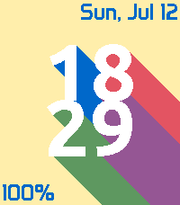</a>

<h2 class="app-name" id="app-553adb3b375961a6080000c7"><a href="https://apps.repebble.com/553adb3b375961a6080000c7">Long Shadow</a></h2>
<a class="app-source" href="https://github.com/ygalanter/Color_Shadow" title="Source code" data-search-exclude>View source</a>

by <a href="https://apps.repebble.com/apps/dev/comfortably-numb_52f547605101128b2200005a" title="More from this developer">Comfortably Numb</a>

Not checked yet v3.1.0 Updated 2026-07-12

Runs on: Round 2, Time 2, Pebble 2 Duo, Pebble 2, Time Round, Time, Classic

- Featuring large time with long shadows - Date and day of the week - Battery info - User-adjustable shadow direction (Made with EffectLayer https://github.com/ygalanter/EffectLayer)

<a class="app-shot" href="https://apps.repebble.com/574a15f197cebc2b9100001c" data-search-exclude>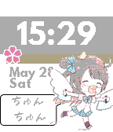</a>

<h2 class="app-name" id="app-574a15f197cebc2b9100001c"><a href="https://apps.repebble.com/574a15f197cebc2b9100001c">Love Live! School Idol Watchface</a></h2>
<a class="app-source" href="https://github.com/starrodkirby86/llsiw/" title="Source code" data-search-exclude>View source</a>

by <a href="https://apps.repebble.com/apps/dev/watson-tungjunyatham_5520e10a51d74384870000da" title="More from this developer">Watson Tungjunyatham</a>

Not checked yet v1.0 Updated 2016-05-28

Runs on: Round 2, Time 2, Pebble 2 Duo, Pebble 2, Time Round, Time, Classic

If we want to protect our beloved school, we need to do what we can? We need to become idols! Love Live! School Idol Watchface is a watchface based on the popular anime franchise, Love Live! Using…

<a class="app-shot" href="https://apps.repebble.com/5707646961753a9caa00001b" data-search-exclude>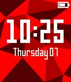</a>

<h2 class="app-name" id="app-5707646961753a9caa00001b"><a href="https://apps.repebble.com/5707646961753a9caa00001b">Low Poly</a></h2>
<a class="app-source" href="https://github.com/ethancbarnes/Pebble-LowPolyFace" title="Source code" data-search-exclude>View source</a>

by <a href="https://apps.repebble.com/apps/dev/ecandb_5466cba8b3358634ef00001b" title="More from this developer">ECandB</a>

Not checked yet v1.0 Updated 2016-04-08

Runs on: Round 2, Time 2, Time Round, Time

Inspired by the minimalism and simplicity of low poly art, this watchface has three different background colors to choose. The time is clearly displayed in digital format with different options in…

<a class="app-shot" href="https://apps.repebble.com/696e6bda80fc2700096190f6" data-search-exclude>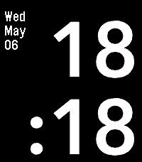</a>

<h2 class="app-name" id="app-696e6bda80fc2700096190f6"><a href="https://apps.repebble.com/696e6bda80fc2700096190f6">Low Power</a></h2>
<a class="app-source" href="https://github.com/pbr0ck3r/low-power" title="Source code" data-search-exclude>View source</a>

by <a href="https://apps.repebble.com/apps/dev/pbr0ck3r_530fd6884e19d22b070005da" title="More from this developer">pbr0ck3r</a>

Not checked yet v1.1.3 Updated 2026-05-06

Runs on: Round 2, Time 2, Pebble 2 Duo, Pebble 2, Time Round, Time, Classic

This fuss-free digital watch keeps things simple. With a clear display and easy-to-read digits, it shows you the time and date at a glance. Want to personalize your look? Choose from a variety of…

<a class="app-shot" href="https://apps.repebble.com/565b7b11cb722e33cf0000bd" data-search-exclude>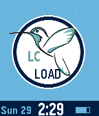</a>

<h2 class="app-name" id="app-565b7b11cb722e33cf0000bd"><a href="https://apps.repebble.com/565b7b11cb722e33cf0000bd">Lowcarb sky</a></h2>
<a class="app-source" href="https://github.com/Kdisimone/PebbleSkyCgm/tree/lowcarb" title="Source code" data-search-exclude>View source</a>

by <a href="https://apps.repebble.com/apps/dev/testyk8_55514ddbcf532c2c780000a6" title="More from this developer">testyk8</a>

No licence v1.0 Updated 2025-11-25

Runs on: Round 2, Time 2, Time Round, Time

This watchface modifies the CGM in the Cloud Sky watchface to allow lower &quot;high blood glucose alert levels&quot; in the settings.

<a class="app-shot" href="https://apps.repebble.com/57aca152bb85ed22da0001bf" data-search-exclude>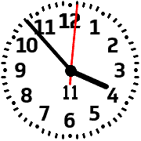</a>

<h2 class="app-name" id="app-57aca152bb85ed22da0001bf"><a href="https://apps.repebble.com/57aca152bb85ed22da0001bf">LowViz</a></h2>
<a class="app-source" href="https://github.com/zealotree/LowViz" title="Source code" data-search-exclude>View source</a>

by <a href="https://apps.repebble.com/apps/dev/zealotree_5722b3d1db5a405aa4000023" title="More from this developer">Zealotree</a>

Not checked yet v1.2 Updated 2016-08-11

Runs on: Round 2, Time Round

LowViz is an analogue watchface that emphasises readability for low vision users. It displays the Date (Day of Month), Time (Hours, Minutes, Seconds). It vibrates when disconnected from Bluetooth…

<h2 class="app-name" id="app-57acad61f01b53ce0c000154"><a href="https://apps.repebble.com/57acad61f01b53ce0c000154">LowViz Dark</a></h2>
<a class="app-source" href="https://github.com/zealotree/LowViz/tree/dark" title="Source code" data-search-exclude>View source</a>

by <a href="https://apps.repebble.com/apps/dev/zealotree_5722b3d1db5a405aa4000023" title="More from this developer">Zealotree</a>

Not checked yet v1.1 Updated 2016-08-11

Runs on: Round 2, Time Round

LowViz Dark is an analogue watchface that emphasises readability for low vision users. It displays the Date (Day of Month), Time (Hours, Minutes, Seconds). It vibrates when disconnected from…

<h2 class="app-name" id="app-57ec63973095e34b9e000245"><a href="https://apps.repebble.com/57ec63973095e34b9e000245">Lucid Timing</a></h2>
<a class="app-source" href="https://github.com/arianadziedzic/lucid_dream_watch_face" title="Source code" data-search-exclude>View source</a>

by <a href="https://apps.repebble.com/apps/dev/ariana-dziedzic_559d0a6d541f0c8b70000014" title="More from this developer">Ariana Dziedzic</a>

No licence v1.0 Updated 2016-09-29

Runs on: Time 2, Time

A simple watchface for those who lucid dream! Inspired and dedicated to my fiancé Joey, who is always there through thick and thin.

<h2 class="app-name" id="app-65566a19b32b42efb5200f31"><a href="https://apps.repebble.com/65566a19b32b42efb5200f31">Lucky Watchface</a></h2>
<a class="app-source" href="https://github.com/Gnu-Bricoleur/PebbleLucky" title="Source code" data-search-exclude>View source</a>

by <a href="https://apps.repebble.com/apps/dev/sylvain-migaud_d2179982e504a6bd1815727f" title="More from this developer">sylvain.migaud</a>

No licence v1.0 Updated 2026-04-12

Runs on: Round 2, Time 2

A lucky watchface based on an old superstition that displays a four leaf clover for good luck each mirror hour (HH==MM) and optionnally vibrate.

<h2 class="app-name" id="app-5876c275e09e6393ec000771"><a href="https://apps.rebble.io/en_US/application/5876c275e09e6393ec000771">Luminosity</a></h2>
<a class="app-source" href="http://github.com/elementc/luminosity/" title="Source code" data-search-exclude>View source</a>

by <a href="https://apps.rebble.io/en_US/developer/531c84c4e05b79fac800010b/1" title="More from this developer">Casey Doran</a>

MIT v3.2 Updated 2017-07-23 Rebble App Store

Runs on: Round 2, Time 2, Pebble 2 Duo, Pebble 2, Time Round, Time, Classic

Digital or analog watchface that shows an eminently glanceable 24 hour weather forecast. Steps and bluetooth connection alerts, too! The outer ring is a 24 hour timeline. The red tick indicates…

<h2 class="app-name" id="app-5d2b5d60f2a74181bb02dac4"><a href="https://apps.repebble.com/5d2b5d60f2a74181bb02dac4">Lumon Face</a></h2>
<a class="app-source" href="https://github.com/bwinton/lumon-face" title="Source code" data-search-exclude>View source</a>

by <a href="https://apps.repebble.com/apps/dev/blake-winton_47b62fcfd059bba2bf969f49" title="More from this developer">Blake Winton</a>

No licence v1.0.0 Updated 2026-06-23

Runs on: Round 2, Time 2, Pebble 2 Duo, Pebble 2, Time Round, Time, Classic

A watchface for severed folks.

<h2 class="app-name" id="app-87e9be27ecf34f248efa8235"><a href="https://apps.repebble.com/87e9be27ecf34f248efa8235">LumonTime</a></h2>
<a class="app-source" href="https://github.com/radicand/pebble-lumon" title="Source code" data-search-exclude>View source</a>

by <a href="https://apps.repebble.com/apps/dev/nick-pappas_55079df5febe68ca0b0000a2" title="More from this developer">Nick Pappas</a>

Not checked yet v1.2.0 Updated 2026-06-28

Runs on: Time 2

LUMONTIME™ — TEMPORAL INTERFACE SYSTEM A Lumon Industries Productivity Enhancement™ The LumonTime™ Temporal Interface represents the next generation in personal efficiency monitoring. Seamlessly…

<h2 class="app-name" id="app-53fc529ff4342c6ea60000c0"><a href="https://apps.repebble.com/53fc529ff4342c6ea60000c0">Luna</a></h2>
<a class="app-source" href="https://github.com/espire/Luna" title="Source code" data-search-exclude>View source</a>

by <a href="https://apps.repebble.com/apps/dev/eli-spiro_52e6722f92c527f41a000030" title="More from this developer">Eli Spiro</a>

Not checked yet v1.1 Updated 2014-08-26

Runs on: Time 2, Pebble 2 Duo, Pebble 2, Time, Classic

Luna is a fledgeling opensource Watchface that shows you the current phase of the moon, using almost the entire screen to display the moon. The time and date are also shown below.

<h2 class="app-name" id="app-54f13420150dd1956d000009"><a href="https://apps.repebble.com/54f13420150dd1956d000009">Lunar Digital</a></h2>
<a class="app-source" href="https://github.com/jacobbuck/lunar-digital-watchface" title="Source code" data-search-exclude>View source</a>

by <a href="https://apps.repebble.com/apps/dev/jacob-buck_53d035b7df2cc60d8900004f" title="More from this developer">Jacob Buck</a>

Not checked yet v1.3 Updated 2015-05-10

Runs on: Time 2, Pebble 2 Duo, Pebble 2, Time, Classic

Clean thin geometric lines.

<h2 class="app-name" id="app-5af360e35f5041998f9aa823"><a href="https://apps.repebble.com/5af360e35f5041998f9aa823">Lunar Phase</a></h2>
<a class="app-source" href="https://github.com/brooks2564/Pebble-Lunar-Phase" title="Source code" data-search-exclude>View source</a>

by <a href="https://apps.repebble.com/apps/dev/brooman-inks_44b97418cf47663c00fb67bc" title="More from this developer">Brooman Inks</a>

No licence v2.0 Updated 2026-04-20

Runs on: Round 2, Time 2

Lunar Phase

<h2 class="app-name" id="app-64d4fbb3118fcc0569f570ef"><a href="https://apps.repebble.com/64d4fbb3118fcc0569f570ef">Lunatic</a></h2>
<a class="app-source" href="https://github.com/wirelune/Lunatic" title="Source code" data-search-exclude>View source</a>

by <a href="https://apps.repebble.com/apps/dev/nyrikiri_63121c3a5e45c40008d0bc52" title="More from this developer">nyrikiri</a>

Not checked yet v1.4 Updated 2023-08-17

Runs on: Round 2, Time 2, Time Round, Time

!!!Highly Experimental! Expect fast battery drain and instability!!! A watchface for Pebble Time featuring Princess Luna, a character from My Little Pony: Friendship is magic. She rests at morning…

