<!-- Generated by scripts/update_app_directory.py: do not edit by hand -->
# Watchfaces: M

[← About this list](../watchfaces.md) · [A](a.md) · [B](b.md) · [C](c.md) · [D](d.md) · [E](e.md) · [F](f.md) · [G](g.md) · [H](h.md) · [I](i.md) · [J](j.md) · [K](k.md) · [L](l.md) · **M** · [N](n.md) · [O](o.md) · [P](p.md) · [Q](q.md) · [R](r.md) · [S](s.md) · [T](t.md) · [U](u.md) · [V](v.md) · [W](w.md) · [X](x.md) · [Y](y.md) · [Z](z.md) · [0–9 & other](other.md)

*195 watchfaces · Last updated 2026-10-06*

| Screenshot | Name | Developer | Licence | Updated | Description |
|------------|------|-----------|---------|---------|-------------|
| 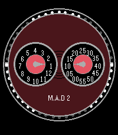{ loading=lazy width="72" } | [M.A.D edition 2 watchface](https://apps.repebble.com/21086d4ccce74bbbbaedd11a) | [Unknown](https://github.com/profweini/pebble-mad-watchface) | <small>Not checked yet</small> | 2026-07-21 | Mimicks the M.A.D. edition 2 by MB&F. Including: - Jumping hours, smooth minutes - Spinning rotator It works on my Time 2 (2026), Steel (2015), and Classic… |
| 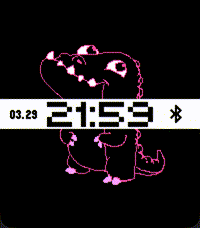{ loading=lazy width="72" } | [Maan On My Wrist XL](https://apps.repebble.com/69c990b93406d0000832e53b) | [RandyTheSilly](https://git.wetfence.xyz/RandyTheSilly/Maan-On-My-Wrist-XL) | <small>See source</small> | 2026-04-05 | This is an unofficial and greatly expanded port of the "Maan On My Wrist" watchface to all color Pebbles, including the new Pebble Time 2/Round 2. Every… |
| 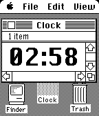{ loading=lazy width="72" } | [Mac System 3](https://apps.rebble.io/en_US/application/67ebc0028b96250009ecfab7) <small>Rebble App Store</small> | [bimbodhisattva](https://github.com/bimbodhisattva/mac-system-3-for-pebble) | <small>Not checked yet</small> | 2025-04-01 | Displays the current time in iconic Chicago font. Inspired by David Lancaster. Functional updates to come! :) |
| 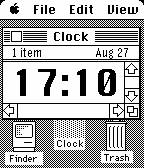{ loading=lazy width="72" } | [Mac System 3](https://apps.repebble.com/57c1b0525e3c3d0bfc000201) | [Mr.Foxhead](https://github.com/MrFoxhead/Mac-System-3-Watchface) | <small>Not checked yet</small> | 2016-08-27 | Ever wanted a Macintosh on your wrist? Well, that's a blast from the past! Featuring almost the same aesthetics of old Apple computers! Made with ❤️ by your… |
| 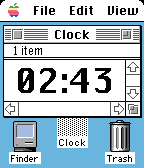{ loading=lazy width="72" } | [Mac System 7](https://apps.rebble.io/en_US/application/67dfaf43122b40000904b4fa) <small>Rebble App Store</small> | [bimbodhisattva](https://github.com/bimbodhisattva/mac-system-7-for-pebble-time) | <small>Not checked yet</small> | 2025-04-01 | For Pebble Time. Displays the current time in iconic Chicago font. Inspired by David Lancaster. Functional updates to come! :) |
| 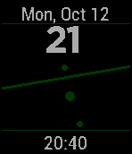{ loading=lazy width="72" } | [Macro Clock](https://apps.repebble.com/5536b17b9c0e141f270000b2) | [shamHu](https://github.com/shamHu/PebbleMacroClock) | <small>Not checked yet</small> | 2016-04-01 | Customizable, minimal watchface featuring a roaming zoomed-in clock face effect. Features: * Customizable background, number, dot, and hand colors * 12 hour… |
| { loading=lazy width="72" } | [Macro Clock](https://apps.repebble.com/c28d55850fee42f3a80d66cc) | [Swantzter](https://github.com/swantzter/PebbleMacroClock) | <small>Not checked yet</small> | 2026-06-03 | A version of shamHu's Macro Clock that works on the new core devices app and the newer watches' larger screens. This clock features a zoomed in clock face… |
| 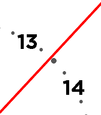{ loading=lazy width="72" } | [Macro Clock](https://apps.rebble.io/en_US/application/6a20123119ebfd00090aeebf) <small>Rebble App Store</small> | [Swantzter](https://github.com/swantzter/PebbleMacroClock) | <small>Not checked yet</small> | 2026-06-03 | A version of shamHu's Macro Clock that works on the new core devices app and the newer watches' larger screens. This clock features a zoomed in clock face… |
| { loading=lazy width="72" } | [Maestro and MRPG Mina Watchface](https://apps.repebble.com/d86fadd4a2d64e368a264b8c) | [HeyItsMina](https://studio.pebbleface.com/) | <small>Not checked yet</small> | 2026-08-28 | A little watchface with my characters on it! Made with Pebble Face Studio. PS - this watchface was only tested on one of the new Pebble Time 2s, you have… |
| 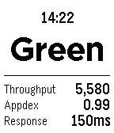{ loading=lazy width="72" } | [Magellan Server Monitoring](https://apps.rebble.io/en_US/application/54703777762f64feae000039) <small>Rebble App Store</small> | [Soutaro Matsumoto](https://github.com/soutaro/magellan) | <small>Not checked yet</small> | 2014-11-30 | This Watchface helps you to keep monitoring your web app's status through New Relic API. |
| 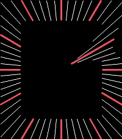{ loading=lazy width="72" } | [Magnetism](https://apps.repebble.com/6999fb27f7e14b1986ebd366) | [Chris Mondok](https://github.com/ChrisMondok/magnetism) | <small>No licence</small> | 2026-06-28 | A Pebble watchface with no hands. The graduations tell the time. |
| 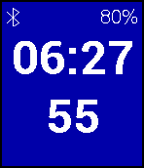{ loading=lazy width="72" } | [Mainly Seconds](https://apps.rebble.io/en_US/application/5880a4a595ce5bbf140000bd) <small>Rebble App Store</small> | [WA1OUI](https://github.com/DHKaplan/Mainly_Seconds/blob/master/Mainly_Seconds-V1.0.zip) | <small>No licence</small> | 2017-01-19 | Mainly seconds shows... well mainly seconds. There is a battery indicator, BT indicator and the hours and minutes, but the seconds are front and center. Be… |
| { loading=lazy width="72" } | [Maji de Watashi ni Koishinasai! W (Majikoi! W)](https://apps.rebble.io/en_US/application/55b9146d4b7d02669800006e) <small>Rebble App Store</small> | [Watson Tungjunyatham](https://github.com/starrodkirby86/Majikoi-Watchface) | <small>Not checked yet</small> | 2015-07-29 | Love me, seriously! This is a Maji de Watashi ni Koishinasai! (Majikoi) themed watchface, with a few other features as well! This watchface includes 5… |
| 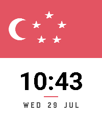{ loading=lazy width="72" } | [Majulah SG](https://apps.repebble.com/7c8d451e7cf148988d11cd11) | [Zhang Qichuan](https://github.com/qichuan/pebble-watchface-singapore) | <small>Not checked yet</small> | 2026-08-02 | Majulah Singapura! The Singapore flag on your wrist. Works on every Pebble — round or square, colour or black-and-white. Install it and celebrate 9 August… |
| 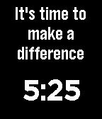{ loading=lazy width="72" } | [Make a Difference](https://apps.rebble.io/en_US/application/53f30852abe2e701b700020c) <small>Rebble App Store</small> | [Boom](https://github.com/jake-waratahs/difference) | <small>Not checked yet</small> | 2014-08-20 | A little motivational watch face that encourages you to make a difference with your time on this earth. It tells the time, too. |
| 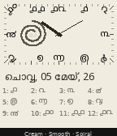{ loading=lazy width="72" } | [Malayalam Clock](https://apps.repebble.com/c0b16641ab934e11b3e57751) | [Creative Manaks](https://github.com/manaksu/MalayalamWatch) | <small>Not checked yet</small> | 2026-05-30 | Malayalam Clock brings the Malayalam script to your Pebble Time Steel — twelve hand-rendered Malayalam numerals arranged around a clean, cream analog clock… |
| { loading=lazy width="72" } | [Maneki Neko Watch](https://apps.repebble.com/52996cdc129af72b9d00002b) | [King Pi](https://github.com/pi-king/manekineko) | <small>Not checked yet</small> | 2016-12-02 | Cute maneki neko(lucky cat) on your watch and bring good luck to you:) Beckoning and move mouth every minute. Through configuration page, user can - set… |
| 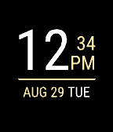{ loading=lazy width="72" } | [maqtanim](https://apps.rebble.io/en_US/application/59a5967c461a8d34f6001568) <small>Rebble App Store</small> | [David Morgan](https://github.com/Spitemare/maqtanim) | <small>Not checked yet</small> | 2017-08-29 | Based on a design by /u/maqtanim on the Pebble subreddit. |
| 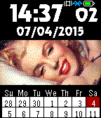{ loading=lazy width="72" } | [Marilyn](https://apps.rebble.io/en_US/application/552723331c36ea4680000093) <small>Rebble App Store</small> | [Gretchycat](https://github.com/gretchycat/DarkSide) | <small>Not checked yet</small> | 2015-10-19 | a very sexy Marilyn Monroe watchface Features a 2 week calendar, and when you shake or tap, see a 5 day weather forecast. Tap again for sunrise, sunset and… |
| 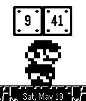{ loading=lazy width="72" } | [Mario](https://apps.rebble.io/en_US/application/52d4239b9260fee2a200002a) <small>Rebble App Store</small> | [Denis Dzyubenko](https://github.com/shadone/pebble-mario) | <small>Not checked yet</small> | 2014-01-29 | A jumping Mario |
| 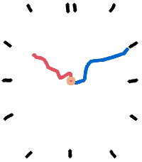{ loading=lazy width="72" } | [Marker](https://apps.repebble.com/9b9126db9e4343b08773fa76) | [soxfox42](https://github.com/soxfox42/pebble-marker/) | <small>Not checked yet</small> | 2026-04-13 | An analog clock that looks as though someone scribbled it on a whiteboard, featuring a short animation every time it changes! |
| 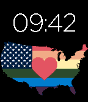{ loading=lazy width="72" } | [Marriage Equality all the Things!](https://apps.rebble.io/en_US/application/558ed3975dfd12a7a6000097) <small>Rebble App Store</small> | [Greg Medding](https://github.com/gregmedd/pebble_all_the_things) | <small>Not checked yet</small> | 2015-06-27 | Celebrate LGBT pride and marriage equality for all 50 US states with this watchface! The heart beats while bluetooth is connected. |
| 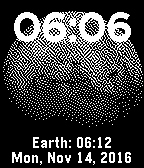{ loading=lazy width="72" } | [Mars Time](https://apps.repebble.com/582a6fa48c7fff9edf0001fa) | [Rossmallow](https://github.com/Rossmallow/Mars-Time-Watchface) | <small>Not checked yet</small> | 2016-11-15 | Each second on Mars is about half of a second on Earth. This watchface simulates time passing on Mars by incrementing time by about 32 seconds per minute… |
| 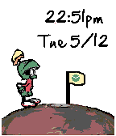{ loading=lazy width="72" } | [Marvin Colour](https://apps.rebble.io/en_US/application/5552c1411ba177287d0000b2) <small>Rebble App Store</small> | [Antonio Asaro](https://github.com/antonioasaro/Antonio-Marvin_2.0.colour) | <small>Not checked yet</small> | 2015-12-15 | Everyone's favourite Martian - now in colour. Blasts time/date on the minute |
| 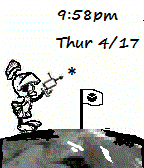{ loading=lazy width="72" } | [Marvin the Martian](https://apps.rebble.io/en_US/application/52cd63ac9505d1780b00005b) <small>Rebble App Store</small> | [Antonio Asaro](https://github.com/antonioasaro/Antonio-Marvin_2.0.git) | <small>Not checked yet</small> | 2014-02-05 | Marvin fires his integrator/disintegrator weapon at the date/time |
| 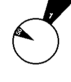{ loading=lazy width="72" } | [Mask](https://apps.rebble.io/en_US/application/52affd2e4002497d9e00000a) <small>Rebble App Store</small> | [mcongrove](https://github.com/mcongrove/PebbleMask) | <small>Not checked yet</small> | 2014-01-19 | A Pebble watch face based on the Mask watch by Filip Slovacek. Each triangle turns to reveal the current time; hour on the outer, minute on the inner. The… |
| 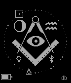{ loading=lazy width="72" } | [Masonic](https://apps.repebble.com/56beb07c3e48f5697a000024) | [Dr. David Brown](https://github.com/revdrbrown/PebbleMasonic) | <small>Not checked yet</small> | 2016-07-10 | Watchface for Master Masons featuring a background of a square and compass enclosing the letter G. The analog watchface marks the hour with a square, the… |
| 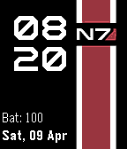{ loading=lazy width="72" } | [Mass Effect V2 (Time Only)](https://apps.repebble.com/5709ba2faf95a45063000018) | [ThatOneRoadie](https://github.com/ThatOneRoadie/watchface_mev2/) | <small>Not checked yet</small> | 2016-04-10 | A Fork and Reorganization of clach04's fantastic Jupiter Mass Xen watchface, rebuilt for vertical striping and reorganized. |
| 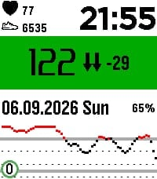{ loading=lazy width="72" } | [Master-Plexus-CGM-NG](https://apps.repebble.com/e53dd73e9ead4df297762948) | [Masterplexus](https://github.com/MasterPlexus/masterplexus-cgm-ng) | <small>Not checked yet</small> | 2026-09-19 | initial. Tested on Pebble time two. Basis from urchin-cgm, all honors to him. Anyhow to know: this Watchface is made for having Blood measurements visible… |
| 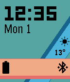{ loading=lazy width="72" } | [Material Ribbon](https://apps.repebble.com/56afc52e3076f5d16e000050) | [Turner Vink](https://github.com/turnervink/materialribbon) | <small>Not checked yet</small> | 2016-03-16 | If you enjoy Material Ribbon, give it a heart or consider making a donation through the settings page! Inspired by Material Design, Material Ribbon gives… |
| 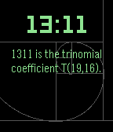{ loading=lazy width="72" } | [Math Facts Watchface](https://apps.rebble.io/en_US/application/5a2421aa0dfc32823d0036e7) <small>Rebble App Store</small> | [Muniba Khan](https://github.com/kmuniba98/math-facts-watchface) | <small>Not checked yet</small> | 2017-12-03 | A Pebble watch-face displaying math and trivia facts associated with the current time. |
| 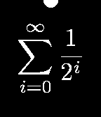{ loading=lazy width="72" } | [Math Geek](https://apps.rebble.io/en_US/application/5309427924c4582908000046) <small>Rebble App Store</small> | [Steven Schmatz](https://github.com/stevenschmatz/math-geek-pebble-watchface) | <small>Not checked yet</small> | 2014-02-24 | For those with a need to embrace their inner geek. Minimalistic watchface that shows the hour in a LaTeX rendered mathematical expression, with a semicircle… |
| 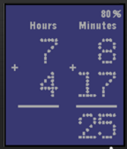{ loading=lazy width="72" } | [MathTime](https://apps.rebble.io/en_US/application/556a9c7ad2d833200f000099) <small>Rebble App Store</small> | [NewAndy](https://github.com/NewAndy/MathTime) | <small>Not checked yet</small> | 2015-06-07 | MathTime watchface with basic math operations. Bluetooth connection check. Battery usage icon. |
| 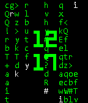{ loading=lazy width="72" } | [Matrix](https://apps.rebble.io/en_US/application/55ad3d946749cded0f000098) <small>Rebble App Store</small> | [Marcelo Lazaroni](https://github.com/lazaronijunior/Matrix-Watchface) | <small>Not checked yet</small> | 2015-07-21 | Have the Matrix on your wrist. Every time you flick your wrist you will see matrix's code rain on your watch. Aaaand it's open source! You can learn from… |
| 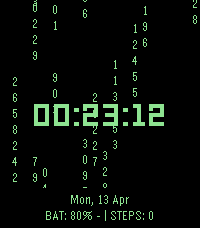{ loading=lazy width="72" } | [Matrix](https://apps.repebble.com/cb425279b1f849afaf23f476) | [nyinyiz](https://github.com/nyinyiz/Pebble-watchfaces) | <small>Not checked yet</small> | 2026-08-22 | Experience the iconic movie's visual aesthetic on your wrist with this premium, high-performance Pebble watchface. "Matrix Digital Rain" features a… |
| 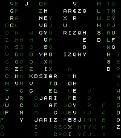{ loading=lazy width="72" } | [Matrix01](https://apps.repebble.com/6979c159323ecb00092c53f9) | [Yorks0n](https://github.com/Yorks0n/pebble-watchface-Matrix01) | <small>Not checked yet</small> | 2026-01-28 | A digital rain effect watchface inspired by the movie "The Matrix". It rains when time changes or shaken. |
| 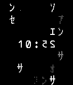{ loading=lazy width="72" } | [MatrixCode 2.0](https://apps.rebble.io/en_US/application/5311af3492295d8d8800003b) <small>Rebble App Store</small> | [Jnm](https://github.com/Jnmattern/MatrixCode_2.0) | <small>No licence</small> | 2014-03-01 | Matrix inspired watchface. Settings allow to configure the use of straight or reversed digits and blinking colon. |
| { loading=lazy width="72" } | [Matt FaceWatch](https://apps.rebble.io/en_US/application/55b36a567d33ce968800004c) <small>Rebble App Store</small> | [Braiba](https://github.com/braiba/MattWatch) | <small>Not checked yet</small> | 2015-07-25 | Watchface based on a running image from @Jam_sponge's twitter feed |
| 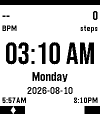{ loading=lazy width="72" } | [Max's minimalist watchface](https://apps.repebble.com/aea24cf36e484878ae9c806e) | [Unknown](https://github.com/Max-q-rockets/MinimalistPebbleTime2Face) | <small>Not checked yet</small> | 2026-08-26 | Minimalist watchface displaying battery, heart rate and step count, as well as sunrise and sunset time. |
| 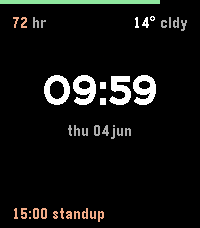{ loading=lazy width="72" } | [Max's Watchface](https://apps.repebble.com/f439f879e2484bfca6959309) | [Unknown](https://github.com/maxharrison/watchface) | <small>Not checked yet</small> | 2026-06-09 | My minimal Pebble watchface. |
|  | [max-infowatch](https://apps.repebble.com/46984ddb0fbf4d84982863d3) | [Unknown](https://github.com/maxharrison/infowatch) | <small>Not checked yet</small> | 2026-07-21 | just a personal fork of ForcasWatch 2 |
|  | [max-infowatch](https://apps.repebble.com/4d975333927945509bebe83f) | [Unknown](https://github.com/maxharrison/infowatch) | <small>Not checked yet</small> | 2026-07-21 | just a personal fork of ForcasWatch 2 |
| 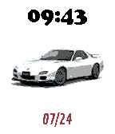{ loading=lazy width="72" } | [Mazda RX7](https://apps.rebble.io/en_US/application/62ddf692bcc333000908d28d) <small>Rebble App Store</small> | [John Spahr](https://github.com/johnspahr/mazdarx7face) | <small>Not checked yet</small> | 2022-07-25 | Pebble Time watch face that randomly displays a few different pictures of a Mazda RX7, the date, and the time. Watchface requested by Twebe Bebe of… |
| 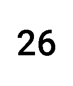{ loading=lazy width="72" } | [Meeting mode](https://apps.rebble.io/en_US/application/5519dd51248d68e33700001d) <small>Rebble App Store</small> | [adamnfish](https://github.com/adamnfish/pebble-meeting-mode) | <small>Not checked yet</small> | 2015-10-13 | A Pebble watchface designed for office meetings. Keep track of the time that has passed without having to look at your wrist! Meeting subtly vibrates every… |
| 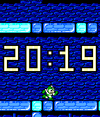{ loading=lazy width="72" } | [Mega Man 2 - Retro Series](https://apps.repebble.com/64a4bb81a474e20087825242) | [Harrison Allen](https://github.com/HarrisonAllen/retro-watchfaces/tree/main/Mega%20Man/Mega%20Man%202) | <small>No licence</small> | 2023-07-05 | Mega Man 2 - Retro Series Take a trip back in time to 1988 with this Mega Man 2 watchface. Part of the Retro Series, this watchface travels through each of… |
| 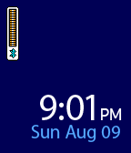{ loading=lazy width="72" } | [Mega Watchface](https://apps.rebble.io/en_US/application/55c8ef366aeaee8c9c000020) <small>Rebble App Store</small> | [Matthew Klundt](https://github.com/mattfox12/mega_watchface) | <small>Not checked yet</small> | 2015-08-11 | Watchface in the style of Mega Man X. Shows Bluetooth connection and battery life as the life meter. |
| 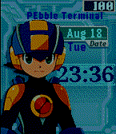{ loading=lazy width="72" } | [Megaman PET](https://apps.rebble.io/en_US/application/55821fac09d6f4b1ee000034) <small>Rebble App Store</small> | [BOBdotEXE](https://github.com/BOBdotEXE/NaviEngine) | GPL-2.0 | 2017-04-28 | Your very own NetNavi! With multiple animations, Blinking, 'jack out' when you return to the main screen, collapsing clock too! This watch face show the… |
| 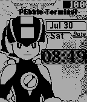{ loading=lazy width="72" } | [Megaman PET](https://apps.repebble.com/579d5b851482cd673b0003c9) | [P1X3L](https://github.com/BOBdotEXE/NaviEngine.git) | GPL-2.0 | 2016-08-09 | Your own Megaman NetNavi! This watchface is inspired and built of BOBdotEXE's NetNavi watchface! I made a black and white version. The battery meter is at… |
| 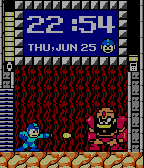{ loading=lazy width="72" } | [Megaman Time](https://apps.rebble.io/en_US/application/558cb4fcdf1af0306e000044) <small>Rebble App Store</small> | [Hedgehogs265](https://github.com/sethruji/MegamanTime) | <small>Not checked yet</small> | 2015-06-26 | *Currently there is a bug that causes the face to not properly stay at the selected boss and power up. I will get to this issue as soon as I have the chance… |
| { loading=lazy width="72" } | [MegaWatch](https://apps.rebble.io/en_US/application/569490b44ccd6c997d000051) <small>Rebble App Store</small> | [MrDrake](https://github.com/MrDrake/megawatch) | <small>Not checked yet</small> | 2016-01-12 | Have you ever wanted to mega-evolve your Pokémon with your Pebble Time Round? Well now you can, with the MegaWatch, with in-built Key Stone! This watch has… |
| { loading=lazy width="72" } | [MegaWatch](https://apps.rebble.io/en_US/application/569365c2ead187bb8f000043) <small>Rebble App Store</small> | [MrDrake](https://github.com/MrDrake/megawatch) | <small>Not checked yet</small> | 2016-01-11 | Have you ever wanted to mega-evolve your Pokémon with your Pebble Time Round? Well now you can, with the MegaWatch, with in-built Key Stone! This watch has… |
| 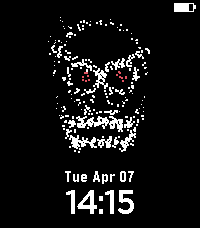{ loading=lazy width="72" } | [Memento Mori](https://apps.repebble.com/7865e440b1bc45749db1b0e9) | [AirCodum](https://github.com/priyankark/pebble-wf-agent-skill) | <small>Not checked yet</small> | 2026-04-07 | A particle-dust skull with glowing red eyes that watches over your wrist. |
| 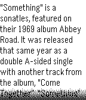{ loading=lazy width="72" } | [Memoface](https://apps.rebble.io/en_US/application/52cf0183bed07f7d3a000070) <small>Rebble App Store</small> | [Jorge Izquierdo](https://github.com/izqui/Memoface) | <small>Not checked yet</small> | 2014-01-09 | Memoface allows you to have a note in your watch face always you want, just in case you want to remember. It works with the accelerometer. |
| 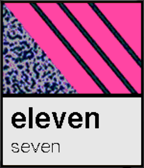{ loading=lazy width="72" } | [MEMPHIS](https://apps.rebble.io/en_US/application/55edba885aaf6b33cd00002f) <small>Rebble App Store</small> | [AdobeEditor](https://github.com/AdobeEditor/MEMPHIS) | MIT | 2015-09-22 | Inspired by the Memphis design movement of the 1980's, this collection of watchfaces embodies the quirkiness of the antidesign aesthetic. |
| 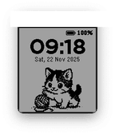{ loading=lazy width="72" } | [Meow O'Clock](https://apps.repebble.com/9d2ad00e3f5f439a9396316c) | [trishtzy](https://github.com/trishtzy/pebble) | <small>Not checked yet</small> | 2026-08-29 | A playful watchface featuring an animated kitten that switches between playtime and sleeping mode based on the time of day, with clean time and date… |
| 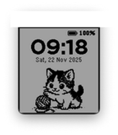{ loading=lazy width="72" } | [Meow O'Clock](https://apps.rebble.io/en_US/application/6921cddc9bce47000981552d) <small>Rebble App Store</small> | [trishtzy](https://github.com/trishtzy/pebble) | <small>Not checked yet</small> | 2026-08-27 | A playful watchface featuring an animated kitten that switches between playtime and sleeping mode based on the time of day, with clean time and date… |
| 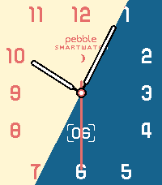{ loading=lazy width="72" } | [Mercury](https://apps.rebble.io/en_US/application/67cdf003b7a023034a3395bc) <small>Rebble App Store</small> | [Javier Rizzo](https://github.com/JavierRizzoA/Pebble-Mercury/) | GPL-3.0 | 2026-01-05 | The background gradient follows the minutes hand. Inspired by the Hermes watchface for the Apple Watch. Fonts provided by NiVZ (check his other cool… |
| 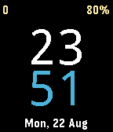{ loading=lazy width="72" } | [Mere](https://apps.repebble.com/57bb76c7bb85ed1b790005c9) | [Manuel Pedrero](https://github.com/mpedrero/pebble-mere) | <small>Not checked yet</small> | 2016-08-22 | A watchface with simplicity and legibility in mind. Inspired in Nucleus. Features: + Big and legible time (12/24 hour) + Date + Steps (upper left) + Battery… |
| 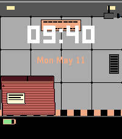{ loading=lazy width="72" } | [Metal Gear Cardboard Box Watchface](https://apps.repebble.com/de5b5b388f8b4adea2857f14) | [Sapphire Second-Hand](https://github.com/shoepaladin/kiwi-cup/tree/main/pebble/metalgear_cbox_wf) | <small>Not checked yet</small> | 2026-06-25 | See Snake sneak across your watch! Featuring a Shadow Moses inspired dark mode. When BT disconnects, see "FISSION MAILED" displayed across the screen… |
| { loading=lazy width="72" } | [Metal Gear GT](https://apps.repebble.com/549a3101a0bb06472700003e) | [Game Time](https://github.com/WinterWinter/metalgearpebble) | <small>Not checked yet</small> | 2016-09-22 | Based off the Gameboy classic Metal Gear: Ghost Babel Features Include: -Bluetooth connection notification. -Random character portraits each hour. -Battery… |
| { loading=lazy width="72" } | [Metal Gear Solid](https://apps.repebble.com/5f6e8a1c51c0ff9f8ecc2506) | [CosmicTacoCat](https://github.com/CosmicTacoCat/MGS_Pebble) | <small>No licence</small> | 2020-09-26 | This is my Pebble Time version of preman_pasar's Amazfit Metal Gear Solid watch face. The signal strength indicator is used to display the Pebble's battery… |
| { loading=lazy width="72" } | [Metar 7 Segment for Pilots](https://apps.repebble.com/55d1f737718c7d376900000a) | [FG](https://github.com/cfg1/pebble-m7s-wf-metar) | <small>Not checked yet</small> | 2016-10-08 | This watchface is a branch of Multifunctional 7 Segment which uses METAR weather data from AVWX and openweathermap.org simultanously. It is made mainly for… |
| { loading=lazy width="72" } | [METAR Minimal](https://apps.rebble.io/en_US/application/54f934651358a963ac0000e3) <small>Rebble App Store</small> | [Michael duPont](https://github.com/flyinactor91/METAR-Watchface) | <small>Not checked yet</small> | 2016-01-21 | Need to know the time? We got that. Need to know if your favorite airport is VFR, MVFR, IFR, or LIFR? We got that too...and that's it! At-a-glance aviation… |
| { loading=lazy width="72" } | [METAR Watchface](https://apps.repebble.com/54effd7ea53e22c57700001f) | [Michael duPont](https://github.com/flyinactor91/METAR-Watchface) | <small>Not checked yet</small> | 2016-11-01 | At-a-glance aviation weather on your wrist made by a pilot for pilots. This open-source watchface organizes and displays the METAR report for your favorite… |
| { loading=lazy width="72" } | [Meter](https://apps.rebble.io/en_US/application/52a94ae079c18ff6e2000024) <small>Rebble App Store</small> | [Brent Fitzgerald](https://github.com/burnto/pebble/tree/master/meter) | <small>Not checked yet</small> | 2013-12-12 | Simple, easy to read at a glance, open source. |
| { loading=lazy width="72" } | [MethactonSchedule](https://apps.rebble.io/en_US/application/54761b8905bfc8c32a00008d) <small>Rebble App Store</small> | [Achyut Reddy](https://github.com/achyutreddy24/MethactonSchedulePebble) | <small>Not checked yet</small> | 2014-11-26 | A watchface that counts in a 6 day cycle. |
| { loading=lazy width="72" } | [Metro](https://apps.rebble.io/en_US/application/55c5e92f3948b666a2000089) <small>Rebble App Store</small> | [Poren Chiang](https://github.com/rschiang/pebble-metro) | <small>Not checked yet</small> | 2015-08-09 | Metro is a Taipei Metro-inspired watchface for Pebble. It's clean, elegant, and free as in freedom -- just like what you would expect on subway system… |
| { loading=lazy width="72" } | [Metro Analog](https://apps.repebble.com/7bec989c6c01406e98acfcd2) | [Max](https://github.com/max-tet/pebble-metro-analog) | <small>Not checked yet</small> | 2026-09-27 | A Metro tile grid for the Pebble Time 2. An analog clock with all twelve numerals fills the top left, and the remaining tiles carry the ISO date with week… |
| { loading=lazy width="72" } | [Metro Madrid L6](https://apps.repebble.com/e4f1579b2a0946c996eaab4e) | [acmc](https://github.com/ACMCMC/pebble-madrid-metro-watchface) | <small>No licence</small> | 2026-08-29 | "A Line 6 loop an hour... keeps the boredom away" |
| { loading=lazy width="72" } | [Metro Madrid L6](https://apps.rebble.io/en_US/application/6a927de8784eb400088eaa40) <small>Rebble App Store</small> | [acmc](https://github.com/ACMCMC/pebble-madrid-metro-watchface) | <small>No licence</small> | 2026-08-29 | "A Line 6 loop an hour... keeps the boredom away" |
| { loading=lazy width="72" } | [Metro Watch](https://apps.rebble.io/en_US/application/5303d8bc7097ac4d3e000359) <small>Rebble App Store</small> | [Marc Ferrándiz Borràs](https://github.com/marcferrandiz/MetroWatch) | <small>Not checked yet</small> | 2014-12-22 | Metro Watch is a awesome new skin watch for all the Pebble family. The big point is the simplicity and minimalism style for an elegant person. 24h or 12h… |
| { loading=lazy width="72" } | [Metro WP8](https://apps.repebble.com/b406d87ebcd144ff9cd278a3) | [Moaske](https://github.com/Moaske/PebbleMetroWP8) | <small>Not checked yet</small> | 2026-09-30 | Retro Windows Phone 8 watchface with the original Metro WP8 tiles design! 📱 NEW! Selectable Live Tiles! --- Supports Basalt (Time/Time Steel) and Emery… |
| { loading=lazy width="72" } | [Metro+](https://apps.rebble.io/en_US/application/60ba1ac61342ae021731a3e0) <small>Rebble App Store</small> | [Nikki](https://github.com/not-phoeniix/metro-plus) | <small>Not checked yet</small> | 2022-03-28 | Extension of other metro watchfaces on the Pebble store with features like: - customizable colors - animated date - pride flag background :) Heavily… |
| { loading=lazy width="72" } | [MetroTile](https://apps.repebble.com/1491156b8f6f46b1b305ec7c) | [changing-k-tanaka](https://github.com/changing-k-tanaka/pebble-watchface-MetroTile) | <small>Not checked yet</small> | 2026-06-20 | This watch face is inspired by the Windows Metro UI. You can freely customize the display items, text color, and background color for the six tiles. Display… |
| { loading=lazy width="72" } | [MetroWatch Color](https://apps.rebble.io/en_US/application/55809a58fc670b738a000062) <small>Rebble App Store</small> | [mephissto](https://github.com/mephissto/MetroWatch) | <small>Not checked yet</small> | 2015-06-16 | Based on Metro Watch by Marc Ferrándiz Borràs |
| { loading=lazy width="72" } | [MetroWatch Green](https://apps.rebble.io/en_US/application/569e9ec480b0d26c48000035) <small>Rebble App Store</small> | [mephissto](https://github.com/mephissto/MetroWatch/tree/green) | <small>Not checked yet</small> | 2016-01-19 | Green version of MetroWatch Color watchface. |
| { loading=lazy width="72" } | [MetroWatch Inverted](https://apps.rebble.io/en_US/application/5597062a70f2c3e2ea00008b) <small>Rebble App Store</small> | [BracketDevs](https://github.com/BracketDevs/MetroWatchInverted) | <small>No licence</small> | 2015-07-03 | MetroWatch Inverted, based on MetroWatch by Marc Ferrandiz Borras |
| { loading=lazy width="72" } | [MetroWatch Purple](https://apps.rebble.io/en_US/application/569e9da6099696e83d00005b) <small>Rebble App Store</small> | [mephissto](https://github.com/mephissto/MetroWatch/tree/purple) | <small>Not checked yet</small> | 2016-01-19 | Purple version of metrowatch color |
| { loading=lazy width="72" } | [MetroWatch Red](https://apps.rebble.io/en_US/application/569e9c94099696ec1500003f) <small>Rebble App Store</small> | [mephissto](https://github.com/mephissto/MetroWatch/tree/red) | <small>Not checked yet</small> | 2016-01-19 | Red version of MetroWatch color |
| { loading=lazy width="72" } | [MetroWeather](https://apps.rebble.io/en_US/application/54e202b1cf66dc54e300008b) <small>Rebble App Store</small> | [oku](https://github.com/okukun/MetroWeather) | <small>Not checked yet</small> | 2016-01-27 | MetroWeather watchface displays time, date and weather information in a nice and clean metro design. Features: - Automatic Localization for English, French… |
| { loading=lazy width="72" } | [Meyer Objects](https://apps.repebble.com/54b5d6a97e6bae43f10000d5) | [Comfortably Numb](https://github.com/ygalanter/nazar_frames) | <small>Not checked yet</small> | 2026-07-15 | Frame Clock. Minimalistic watchface, just two wire frames bearing minute an hour hand. Shake or tap the watch to briefly see digital time, date and status… |
| { loading=lazy width="72" } | [MGS Codec v2](https://apps.repebble.com/5f4578f8a174464397220dcd) | [Crabmeat](https://github.com/Yesnaught/MGSCodecv2) | <small>Not checked yet</small> | 2026-08-29 | Assorted updates to FouzR's work in https://apps.repebble.com/5eb5c96eb62346b3b041ca37 - if you like the general layout and how clean it looks, that's all him. |
| { loading=lazy width="72" } | [mgs-codec](https://apps.repebble.com/5eb5c96eb62346b3b041ca37) | [FouzR](https://github.com/FouzR/mgs-codec-pebble) | <small>No licence</small> | 2026-08-03 | MGS Codec inspired watchface Features - Sunrise/Sunset times on the top left corner - Long date on the top right corner( Mon 10 2026) - Steps on the bottom… |
| { loading=lazy width="72" } | [MGS-Codec](https://apps.rebble.io/en_US/application/69dd39f17fe9ea0009fa1c4d) <small>Rebble App Store</small> | [FouzR](https://github.com/FouzR/mgs-codec-pebble) | <small>No licence</small> | 2026-08-03 | MGS Codec inspired watchface, as a bussin commission for qualideecontnet from discord Features - Sunrise/Sunset times on the top left corner - Long date on… |
| { loading=lazy width="72" } | [Miami Nights](https://apps.repebble.com/55f56b96c2f17edbde000077) | [Sam Carton](https://github.com/samcarton/miami-nights-pebble) | <small>Not checked yet</small> | 2016-10-31 | A simple yet striking large-font colored watchface for Pebble Time. Large font is True Lies by Jonathan S. Harris. - Date format configurable to display… |
| { loading=lazy width="72" } | [Miami Nights Extra](https://apps.repebble.com/57ee926944581e90d40000d5) | [VN Pebble Dev](https://github.com/samcarton/miami-nights-pebble) | <small>Not checked yet</small> | 2016-10-01 | A simple yet striking large-font colored watchface for Pebble Time. Original by Miami Nights watchface of Sam Carton. Large font is True Lies by Jonathan S… |
| { loading=lazy width="72" } | [MicroRavez Watchface](https://apps.rebble.io/en_US/application/55bb0551e54d9fc375000018) <small>Rebble App Store</small> | [GrimbiXcode](https://github.com/GrimbixCode/Pebble_MicroRavezWatchface.git) | GPL-2.0 | 2015-11-09 | This is the official Watchface of the Swiss Jump & Shuffle Dance-Crew MicroRavez. Enjoy the Time with our smart Logo! Visit us on our Homepage. |
| { loading=lazy width="72" } | [Midwest.js](https://apps.rebble.io/en_US/application/55cabdadce49c2fe6c00002e) <small>Rebble App Store</small> | [willywos](https://github.com/willywos/midwestjs-pebble-watchface) | <small>Not checked yet</small> | 2015-08-12 | Displays the cool midwest.js logo for the conference and the current time. |
| { loading=lazy width="72" } | [mimikko](https://apps.repebble.com/0ded87a9da8841db85b20176) | [Toshiaki1973](https://github.com/Toshiaki1973/pebble-mimikko) | <small>Not checked yet</small> | 2026-09-23 | 関西弁でひとことつぶやく、常時装着型の一方通行ペット時計。日付・時計・バッテリー残量も表示。 |
| { loading=lazy width="72" } | [Mineclock](https://apps.repebble.com/568aa41c6518afe93f000012) | [Makoto Kawasaki](https://github.com/makotokw/pebble-mineclock) | <small>Not checked yet</small> | 2026-05-04 | Analog/Digital watch that looks like a Minecraft clock. |
| { loading=lazy width="72" } | [Minecraft](https://apps.rebble.io/en_US/application/5599dec9e47bb350f4000081) <small>Rebble App Store</small> | [Gretchycat](https://github.com/gretchycat/DarkSide) | <small>Not checked yet</small> | 2015-10-19 | Features a 2 week calendar, and when you shake or tap, see a 5 day weather forecast. Tap again for sunrise, sunset and moon phase. Tap a third time for a… |
| { loading=lazy width="72" } | [Minecraft Clock](https://apps.repebble.com/02b3679008fc47c5b37ef8f8) | [Knfn](https://github.com/Knucklesfan/pebble-watchfaces/tree/main/mcclock) | GPL-3.0 | 2026-06-10 | The clock from Minecraft! Has Date, Time, automatically updating clock like in game, Steps, Weather and Battery indicators! Alongside this, it is fully… |
| { loading=lazy width="72" } | [Mini Watch](https://apps.repebble.com/57b6b991f01b53ee0c00074e) | [Austin Li](https://github.com/Austinite800/mini-watch) | <small>No licence</small> | 2016-08-23 | Enjoy this highly customizable watchface with the new pebble-clay configuration settings page! Choose from digital and analog clock types, and accurate… |
| { loading=lazy width="72" } | [Minimal](https://apps.rebble.io/en_US/application/56827ebce08e48f8ed0000c6) <small>Rebble App Store</small> | [Amos Tan](https://github.com/AlphaTRL/pebble-watchface-minimal) | MIT | 2016-11-07 | A minimal watch face design. Shows you the date, time and battery. Leave a ❤️ if you like the watch face &lt;3 |
| { loading=lazy width="72" } | [minimal](https://apps.rebble.io/en_US/application/54a654be0cd9360e3d000038) <small>Rebble App Store</small> | [corefault](https://github.com/corefault/minimal-pebble) | <small>Not checked yet</small> | 2015-01-03 | Display the current time as a sentence in german. Resolution is five minutes. Remaining minutes displayed as dots on the bottom. |
| { loading=lazy width="72" } | [minimal](https://apps.rebble.io/en_US/application/558ee0ee1b715219970000a4) <small>Rebble App Store</small> | [Llamasoft](https://github.com/an-ox/minimal) | <small>Not checked yet</small> | 2015-06-27 | Here's a minimal one from me. It's designed to be very battery friendly (once per minute update) and to combine digital and analogue style reading in one… |
| { loading=lazy width="72" } | [Minimal](https://apps.rebble.io/en_US/application/53e911811f0b5142030000f1) <small>Rebble App Store</small> | [Vaibhav Viswanathan](https://github.com/vaibhavviswanathan/minimal) | <small>Not checked yet</small> | 2014-09-14 | Now with QuickTap Plus! This is a minimal watchface design. Shows the 24 hour time and the date in a light font. It notifies you when the Bluetooth is… |
| { loading=lazy width="72" } | [Minimal Analog 2](https://apps.repebble.com/57ad24eaf01b53532400019b) | [Keith Harp](https://github.com/keithharp/minimalanalog) | <small>Not checked yet</small> | 2016-09-07 | A simple analog watchface that includes - weather (Yahoo or OpenWeather), - bluetooth disconnect notification (optional) - seconds hand (always on, always… |
| { loading=lazy width="72" } | [Minimal Analog3](https://apps.rebble.io/en_US/application/62ecee85e595b3000a939a36) <small>Rebble App Store</small> | [Daktak](https://github.com/daktak/MinimalAnalog) | <small>Not checked yet</small> | 2022-08-05 | A simple analog watchface that includes - weather - cryptocurrency price - bluetooth disconnect notification (optional) - seconds hand (configurable) - low… |
| { loading=lazy width="72" } | [Minimal Binary](https://apps.repebble.com/57b64b73f01b53901a00079c) | [Hauke Neitzel](http://github.com/theHawke/PebbleBinary) | <small>No licence</small> | 2016-08-19 | A simple watchface with only hours and minutes in binary. |
| { loading=lazy width="72" } | [Minimal Black](https://apps.rebble.io/en_US/application/597b8f670dfc32af61001d35) <small>Rebble App Store</small> | [Jake Zimmerman](https://github.com/jez/pebble-minimal-black) | <small>Not checked yet</small> | 2017-07-28 | Time, battery indicator, and simple date indicator. Also shows "no bluetooth" icon when disconnected. |
| { loading=lazy width="72" } | [Minimal Clean](https://apps.rebble.io/en_US/application/557eb7fcbb3773ef7d000008) <small>Rebble App Store</small> | [Kunalpod](https://github.com/Kunalpod/minimalclean) | <small>No licence</small> | 2015-06-16 | New watch-face. As minimal as possible. Please do contact me for any feedback. |
| { loading=lazy width="72" } | [Minimal Clean Revisited](https://apps.rebble.io/en_US/application/559cd56a9bd78df768000005) <small>Rebble App Store</small> | [The Device](http://github.com/sbrenna/minimalclean) | <small>No licence</small> | 2015-10-19 | Inspired by "Minimal Clean" by Kunal Gautam (Link : pebble://appstore/557eb7fcbb3773ef7d000008). Added bluetooth status (with vibration on disconnect)… |
| { loading=lazy width="72" } | [Minimal Colours](https://apps.repebble.com/575dc7dc5c714404bb000001) | [ChrisWissmach](https://github.com/ChrisWissmach/MinimalColours) | <small>No licence</small> | 2016-06-15 | A minimal watchface where the background colour changes every minute. |
| { loading=lazy width="72" } | [Minimal Weather](https://apps.repebble.com/9494651f596145d78d5250dc) | [Sofus](https://github.com/SofusA/minimal-weather) | <small>Not checked yet</small> | 2026-02-18 | Simple open source pebble watch face with weather data from YR.no. Features: - Battery warning icon when below 25% - UV index warning when index is above 3… |
| { loading=lazy width="72" } | [minimal weather](https://apps.rebble.io/en_US/application/69b16c503936280009fe8b32) <small>Rebble App Store</small> | [sofusa](https://github.com/SofusA/minimal-weather) | <small>Not checked yet</small> | 2026-03-11 | Simple pebble watch face with weather data from YR.no. It shows a battery warning when below 25%, a UV index warning when index is above 3, and a rain… |
| { loading=lazy width="72" } | [minimal x](https://apps.rebble.io/en_US/application/558fe9a96dba2d7820000039) <small>Rebble App Store</small> | [Llamasoft](https://github.com/an-ox/minimal-x) | <small>Not checked yet</small> | 2015-06-28 | This is a slightly extended version of my Minimal face. I added a single indicator at the bottom that shows both battery level and BT status (if the… |
| { loading=lazy width="72" } | [Minimalin](https://apps.repebble.com/56f93a5361a01637e5000036) | [Gringer Apps](https://github.com/groyoh/minimalin) | <small>Not checked yet</small> | 2016-11-18 | Minimalin is a fully customizable watchface that blends analog and digital for a simple, modern and elegant look. Minimalin is an open source project. If… |
| { loading=lazy width="72" } | [Minimalin Again](https://apps.rebble.io/en_US/application/68013ba9ef119e0009664826) <small>Rebble App Store</small> | [Vrabbers](https://github.com/Vrabbers/minimalin-again) | <small>Not checked yet</small> | 2025-04-24 | Minimalin Again is a fully customizable watchface that blends analog and digital for a simple, modern and elegant look, based on the original Minimalin… |
| { loading=lazy width="72" } | [Minimalin Reborn](https://apps.repebble.com/63792649c6c24a000a815e70) | [vorsk](https://github.com/lanrat/minimalin-reborn) | <small>Not checked yet</small> | 2026-09-17 | Minimalin is a fully customizable watchface that blends analog and digital for a modern and elegant look.Minimalin uses Nupe, a custom font with numbers and… |
| { loading=lazy width="72" } | [Minimalist 2.0](https://apps.rebble.io/en_US/application/52e0f32a7487e58289000182) <small>Rebble App Store</small> | [Jnm](https://github.com/Jnmattern/Minimalist_2.0) | <small>No licence</small> | 2014-02-11 | Minimalist display combining analog and digital time. Configuration screen allows to choose between minutes at the hour hand position, hours at the minute… |
| { loading=lazy width="72" } | [Minimalist Analog](https://apps.repebble.com/5736153f9f823cb89300000f) | [Tommy S-Andreassen](https://github.com/snymainn/minimalist-pebble) | <small>Not checked yet</small> | 2016-05-17 | Simple analog watchface with battery and connection status. The hands and markings are cloned from Engineering watchface by @nguyer. I have added a large… |
| { loading=lazy width="72" } | [Minimalist Text Watchface](https://apps.rebble.io/en_US/application/542d22099e034a9542000193) <small>Rebble App Store</small> | [Nicoplv](https://github.com/nicoplv/minimalist-text-watch) | <small>Not checked yet</small> | 2014-10-10 | A minimalist text watchface with time, date and battery display |
| { loading=lazy width="72" } | [Ministry of Silly Watches](https://apps.rebble.io/en_US/application/54a290f347214249db00007f) <small>Rebble App Store</small> | [Olivier Mehani](http://scm.narf.ssji.net/git/MinistryOfSillyWatches/) | <small>See source</small> | 2014-12-30 | Inspired by the Monty Python's Ministry of Silly Walks sketch, this watchface uses the actual steps of John Cleese's gait to show the time. Though reordered… |
| { loading=lazy width="72" } | [Minitrix](https://apps.rebble.io/en_US/application/5dcf62c8c393f5706985a9cd) <small>Rebble App Store</small> | [lavendork](https://github.com/lavglaab/MinitrixPebble) | <small>Not checked yet</small> | 2021-04-26 | A watch face inspired by the Omnitrix from Ben 10, with modes inspired by the classic series and Omniverse. Features analog and digital time, vibrate on… |
| { loading=lazy width="72" } | [Minitrix2](https://apps.rebble.io/en_US/application/6617645c46ea9f09c2b1558c) <small>Rebble App Store</small> | [lavendork](https://github.com/lavglaab/minitrix2-pebble/) | <small>Not checked yet</small> | 2026-07-25 | The ultimate Ben 10 watch face for Pebble! A successor to my first Pebble watch face, with even cooler looks. Features: - Light changes color for Recharge… |
| { loading=lazy width="72" } | [Minute Blocks](https://apps.rebble.io/en_US/application/6a432c036b3a67000985d355) <small>Rebble App Store</small> | [cmore consulting](https://github.com/cmore-zz/pebble-minute-blocks) | <small>Not checked yet</small> | 2026-07-01 | A blocky digital watchface with minute-by-minute geometry, pixel text, and configurable corner "complications" on rectangular Pebble watches, and centered… |
| { loading=lazy width="72" } | [Minute Train](https://apps.repebble.com/8b4cba2c5cfe4c9ea4a38258) | [PizzaMan](https://ndiesslin.com) | <small>Not checked yet</small> | 2026-08-23 | Minute Train is a playful, glanceable digital Pebble watchface. A different train travels through the scene as the day moves from city commute to mountain… |
| { loading=lazy width="72" } | [Minute TZ](https://apps.rebble.io/en_US/application/59c57619461a8dbd6500037b) <small>Rebble App Store</small> | [clach04](https://github.com/clach04/pebble_tz) | <small>Not checked yet</small> | 2017-11-05 | Pebble Watchface For Multiple Timezones * Display time, updating once per minute, using system font * Display Battery power * Display notice when Bluetooth… |
| { loading=lazy width="72" } | [Mirrors Edge](https://apps.rebble.io/en_US/application/5596c2bd7e24d11080000063) <small>Rebble App Store</small> | [cdunham](https://cloudpebble.net/ide/project/213832#) | <small>See source</small> | 2015-07-03 | Watchface with the Mirrors Edge logo |
| { loading=lazy width="72" } | [MistServer](https://apps.repebble.com/f9fe0bbddadd40a9a9836673) | [Jaron Viëtor](https://github.com/Thulinma/MistServer-Pebble-Watchface) | <small>Not checked yet</small> | 2026-04-24 | Watchface for MistServer fans and/or team members (a surprisingly large percentage has Pebbles). |
| { loading=lazy width="72" } | [Mixup](https://apps.rebble.io/en_US/application/545d7e8cf17b0f08ca000001) <small>Rebble App Store</small> | [chops](https://github.com/mereed/pebbleface-mixup) | <small>Not checked yet</small> | 2014-11-19 | \[now includes ability to display normal or mixed text. also has invert, bluetooth vibe on/off, hourly vibe on/off - via settings page\] Has text hours (with… |
| { loading=lazy width="72" } | [MLB Live Face](https://apps.repebble.com/559d4a07d106c8dc08000056) | [Chris Schlitt](https://github.com/chrisschlitt/MLB-Live-Face) | <small>Not checked yet</small> | 2016-09-22 | All new for the 2016 season: -Support for Pebble Time Round -Shake to Show Broadcast Information -Improved Battery Life -New Bases Display With MLB live… |
| { loading=lazy width="72" } | [mobiGlas](https://apps.repebble.com/e0270f35ea0b418589fa0866) | [Rorist](https://github.com/rorist/sc-mobiglas) | <small>Not checked yet</small> | 2026-10-04 | A fan-made opensource watchface inspired by Star Citizen's holographic mobiGlas interface, a space simulation game in development ;) Time (12h/24h), live… |
| { loading=lazy width="72" } | [Modern Calendar](https://apps.rebble.io/en_US/application/56850e365ce44af3590000aa) <small>Rebble App Store</small> | [Max Bäumle](https://github.com/JamesFowler42/moderncalendar) | <small>No licence</small> | 2015-12-31 | Calendar alert watchface for Smartwatch Pro |
| { loading=lazy width="72" } | [Modern Chaser](https://apps.rebble.io/en_US/application/55a2e7632965f287c3000070) <small>Rebble App Store</small> | [Vadim Zaliva](https://github.com/vzaliva/ModernChaser) | <small>Not checked yet</small> | 2015-07-13 | A variant of Modern watchface where date, bluetooth and battery status windows are never obscured by watch hands. They move around to unobscured position. |
| { loading=lazy width="72" } | [Modern Color Bars](https://apps.repebble.com/67b4b7e7af9f4f9893dda506) | [MK Tech Designers](https://github.com/MKTechDesigners/moderncolorbars) | <small>Not checked yet</small> | 2026-06-23 | A Pebble Time 2 watch face for people who want to see modern, HDR compatible color bars on their watch. Inspired by: "Video Geek… |
| { loading=lazy width="72" } | [Modern PT2](https://apps.repebble.com/5124bacb5baf4657be29a073) | [Flecmart](https://github.com/flecmart/modern_pt2) | <small>Not checked yet</small> | 2026-06-22 | Modern PT2 - Modernized port of the classic "Modern" watchface by Zalew, rebuilt for Pebble SDK 4.x - Native 200×228 layout for Pebble Time 2 (Emery) - 3… |
| { loading=lazy width="72" } | [Modern Step](https://apps.rebble.io/en_US/application/545b1efcf2e6f767da00002f) <small>Rebble App Store</small> | [Thorsten Stark](https://github.com/thorstenstark/modern_step) | <small>Not checked yet</small> | 2014-11-06 | A Watchface with step counter, battery level (image + number), date and digital time based on Modern extra with digital time by edwinfinch. Step counting… |
| { loading=lazy width="72" } | [ModernAnalogWatch](https://apps.repebble.com/6a57546ab6d159000924963b) | [EladDvash](https://github.com/EladDv/ModernAnalog) | Apache-2.0 | 2026-07-17 | Modern Analog is a configurable hybrid digital watchface for Pebble Time 2. It keeps the visual rhythm of a classic clock face without using hands: the… |
| { loading=lazy width="72" } | [ModernCal+](https://apps.rebble.io/en_US/application/535191fda00471ecd5000340) <small>Rebble App Store</small> | [ShaBP](https://github.com/ShaBP/ModernCalendarPlus) | <small>Not checked yet</small> | 2014-11-03 | Modern Calendar Plus combines ModernMinimal (by JWay5929) with ModernCalendar (by Fowler/Baeumle). The best iPhone companion, if you love clean design… |
| { loading=lazy width="72" } | [Moderne](https://apps.repebble.com/47976912ba4c4d42b127b368) | [Mark Johnson](https://github.com/marmarjohnson/moderne) | <small>Not checked yet</small> | 2026-08-31 | Moderne is an elegant, highly configurable watchface for the Pebble Round 2, built on a clean Art Deco-inspired numeral face (Poiret One) with… |
| { loading=lazy width="72" } | [Modernesque](https://apps.repebble.com/57bb39b7bb85edbc76000ac8) | [Erik Brinkman](https://github.com/erikbrinkman/modernesque) | <small>Not checked yet</small> | 2016-09-03 | A simple modern watch face heavily inspired by "Modern Classic 2". |
| { loading=lazy width="72" } | [Moderno Analogo](https://apps.rebble.io/en_US/application/52a9a27679c18f04c000005b) <small>Rebble App Store</small> | [Nosagadu](https://www.dropbox.com/sh/spdq0jw6ypw2z0l/ulfOmBnQkp) | <small>Not checked yet</small> | 2013-12-12 | Watchface basado en Modern Extra pero en Español. - Despliega el estado de la conexión Bluetooth. - Se visualiza el estado de la batería del Pebble. … |
| { loading=lazy width="72" } | [ModernSwiss](https://apps.repebble.com/638e4d5832de4b16885ab825) | [Maartje Eyskens](https://github.com/meyskens/ModernSwiss) | <small>Not checked yet</small> | 2026-05-29 | Inspired by the simple design of Official Swiss Railways Watch. |
| { loading=lazy width="72" } | [ModernSwiss](https://apps.rebble.io/en_US/application/6a183074d579fd000a507aa7) <small>Rebble App Store</small> | [Maartje Eyskens](https://github.com/meyskens/ModernSwiss/) | <small>Not checked yet</small> | 2026-05-28 | Inspired by the simple design of Official Swiss Railways Watch. This project took my favorite watch face "Swiss Square" and brought it 10 years into the… |
| { loading=lazy width="72" } | [ModernTri](https://apps.rebble.io/en_US/application/5633537887f22705b9000056) <small>Rebble App Store</small> | [Irongeek](https://github.com/mriscott/ModernTri) | <small>Not checked yet</small> | 2016-02-05 | Clean, triathlon-themed watchface, based on the well-known Modern face |
| { loading=lazy width="72" } | [Modest](https://apps.rebble.io/en_US/application/5549b618740833c08d000008) <small>Rebble App Store</small> | [Ben Chapman-Kish](https://github.com/AwesomeBen1/ModestWatchface) | <small>No licence</small> | 2015-05-09 | A modest watchface featuring pleasing colours, a simple design, and smooth animations. Note: I'm figuring out how to create watchface settings pages, so… |
|  | [ModGrid](https://apps.repebble.com/9a1f87da1669493f9c2d7775) | [pwrs](https://github.com/ConniptionFit/modgrid) | <small>No licence</small> | 2026-06-16 | A simple, grid-based watchface emphasizing glance value. Disclaimer: This face was made with Cursor. |
| { loading=lazy width="72" } | [Modules](https://apps.repebble.com/692cac43ef41e0000886ac3a) | [Click_Calick_Click](https://github.com/ClickCalickClick/modules-watchface) | <small>No licence</small> | 2025-11-30 | Modules is a feature-rich watchface designed for Pebble smartwatches that puts you in control. Unlike traditional watchfaces that lock you into a fixed… |
| { loading=lazy width="72" } | [Modulus](https://apps.repebble.com/67cb26bdb7a02301b9a6e426) | [lamasters](https://github.com/lamasters/modulus-watchface) | <small>Not checked yet</small> | 2026-06-24 | A simple face with weather and fitness tracking. Customize it to match your colours! Inspired by the Apple Watch Modular face. Support my work… |
| { loading=lazy width="72" } | [MoHa : +1s For Haha](https://apps.rebble.io/en_US/application/5a4b9bfc0dfc329496001b60) <small>Rebble App Store</small> | [Reboot Yang](https://github.com/yulingtianxia/Pebble-MoHa) | <small>Not checked yet</small> | 2018-01-06 | MoHa is a simple and young watchface for you! Keep every second! Excited! |
| { loading=lazy width="72" } | [Molniya](https://apps.repebble.com/bf2f17288a0840a5a0308976) | [justinjhendrick](https://github.com/justinjhendrick/molniya-pebble-watchface/) | <small>Not checked yet</small> | 2026-07-24 | A minimalist watchface with both digital numbers and analog movement for the minutes. Very large fonts make it easy to read. |
| { loading=lazy width="72" } | [Momentous](https://apps.repebble.com/62b4e87511724b988c0a8b02) | [Neema](https://github.com/leeja328/momentous) | <small>Not checked yet</small> | 2026-10-06 | This watch face was inspired by Moment, created by Luke Harris. I love the block style that gives excellent readability and contrast, but I was sad that its… |
| { loading=lazy width="72" } | [Mondaine](https://apps.rebble.io/en_US/application/55864b36661134ee5700008c) <small>Rebble App Store</small> | [limjohnny88](https://github.com/limjohnny88/MondainePebbleWatchFace) | <small>Not checked yet</small> | 2015-08-10 | Mondaine watch face for Pebble. This is the third release of the Mondaine watch face for Pebble. If you really like this watch face and would like to… |
| { loading=lazy width="72" } | [Mondrian](https://apps.rebble.io/en_US/application/554f9bc04e604b446200006d) <small>Rebble App Store</small> | [Owen B](https://github.com/obitoo/PebbleMondrian) | <small>Not checked yet</small> | 2015-09-18 | Release 1.2: Added Bluetooth disconnect icon A nerdy little colour watchface. Hours are Blue, Minutes are Yellow, and Red for Both. Can you figure out how… |
| { loading=lazy width="72" } | [Mongo Time](https://apps.rebble.io/en_US/application/554e66885feb9d07b300008f) <small>Rebble App Store</small> | [JavaCowboy](https://github.com/JKCowboy/big-time.git) | <small>No licence</small> | 2015-05-09 | Mongo Time is a watch face with really big numbers and features animations as the time changes. Each digit will slide out when it needs changing and with… |
| { loading=lazy width="72" } | [Mongol Tsag](https://apps.rebble.io/en_US/application/59eb79ad461a8d72e800037c) <small>Rebble App Store</small> | [lmo0731](https://github.com/lmo0731/PebbleMongolTsag) | <small>Not checked yet</small> | 2017-10-21 | Shows clock as mongolian |
| { loading=lazy width="72" } | [Monolith](https://apps.repebble.com/6aad8bd5d8f3d60008ca0b99) | [astosia](https://github.com/astosia/monolith) | <small>Not checked yet</small> | 2026-09-21 | Simple watchface with really large easy to read digits, and configurable layout and colours. Live preview in Settings page Features: - Show or hide battery… |
| { loading=lazy width="72" } | [monologue](https://apps.repebble.com/69ee8a7097500300095a4ac2) | [astosia](https://github.com/astosia/monologue) | <small>Not checked yet</small> | 2026-08-24 | Watchface inspired by the Skagen Mono watch: has a single analogue minute hand, and digital hours Features: - V2 adds ability to swap minutes and hours, and… |
| { loading=lazy width="72" } | [Monstera](https://apps.repebble.com/8990b26e518841329f7ced41) | [Sopko](https://github.com/sopko/monstera-watchface) | <small>Not checked yet</small> | 2026-09-18 | A botanical watchface for the Pebble Time 2, pairing bold pixel numerals with forest-green monstera leaves and a muted gray-ivory background. - Live time… |
| { loading=lazy width="72" } | [MonthGrid Watchface](https://apps.repebble.com/865c44435a054e288357979f) | [OkGoDoIt](https://github.com/OkGoDoIt/pebble-monthgrid) | <small>Not checked yet</small> | 2026-09-02 | A full month calendar watchface with tons of customizability. The time up top, a full month calendar below, and a status line with customizable info… |
| { loading=lazy width="72" } | [MonthGrid Watchface](https://apps.rebble.io/en_US/application/6a94c275784eb40009a8abdd) <small>Rebble App Store</small> | [OkGoDoIt](https://github.com/OkGoDoIt/pebble-monthgrid) | <small>Not checked yet</small> | 2026-09-02 | A full month calendar watchface with tons of customizability. The time up top, a full month calendar below, and a status line with customizable info… |
| { loading=lazy width="72" } | [Moogle Time SDK2](https://apps.rebble.io/en_US/application/551048a45c415c61c400000c) <small>Rebble App Store</small> | [Allan175](https://github.com/allan175/moogle_time_sdk2) | <small>Not checked yet</small> | 2015-03-23 | Update of Moogle Time for SDK2. |
| { loading=lazy width="72" } | [Moon for Northern Hemisphere](https://apps.repebble.com/558c86d9a2deec56ce00001a) | [Oliver Merkel](https://github.com/OMerkel/pebble-samples) | <small>Not checked yet</small> | 2016-03-26 | * Moon for Northern Hemisphere is a watchface derived from Decelerate Northern Hemisphere watchface * Main display is showing the current Moon Phase nearly… |
| { loading=lazy width="72" } | [Moon Phase Watchface](https://apps.rebble.io/en_US/application/55916f52981ce4e960000069) <small>Rebble App Store</small> | [husobee apps](https://github.com/husobee/pebble-moonphase) | <small>Not checked yet</small> | 2015-07-02 | A watchface that will show you the current phase of the moon, as well as the current date and time. |
| { loading=lazy width="72" } | [Moon Phase Watchface UK](https://apps.repebble.com/57654b610cc8f579730000a9) | [husobee apps](https://github.com/husobee/pebble-moonphase-uk) | <small>Not checked yet</small> | 2016-06-18 | This watchface is a slight modification of this: https://apps.getpebble.com/en_US/application/55916f52981ce4e960000069 The only difference is the date… |
| { loading=lazy width="72" } | [Moon, Health, Location and Weather Watch](https://apps.repebble.com/5495e3173b132d5fae000004) | [Peter Summers](http://web.aanet.com.au/~summersfamily/moon_health_location_and_weather_watch_(7.8).zip) | <small>See source</small> | 2019-07-24 | This watch face displays the following: - time zone - phase of the moon (0-29 days, 0=new, 14=full), - location of the moon (0-99 x ~15-minute intervals)… |
| { loading=lazy width="72" } | [MoonFace](https://apps.repebble.com/7650810547de4df2a41991e7) | [Kieselleger](https://github.com/ProggroP/MoonFace) | <small>Not checked yet</small> | 2026-06-02 | A real moon on your wrist. Moonface shows the current lunar phase as a soft shadow over a full-disk moon, turned to match how the Moon actually appears in… |
| { loading=lazy width="72" } | [Moonlit](https://apps.repebble.com/962806faa9fb4eb4a211acbd) | [changing-k-tanaka](https://github.com/changing-k-tanaka/pebble-watchface-moonlit) | <small>Not checked yet</small> | 2026-06-07 | This watch face depicts a moonlit night and a daytime view from the moon. Shooting stars and comets may appear in the night sky. You can select and display… |
| { loading=lazy width="72" } | [Moonphase](https://apps.repebble.com/3973ba5aa4a04256a384422d) | [trishtzy](https://github.com/trishtzy/pebble) | <small>Not checked yet</small> | 2026-08-29 | An analog watchface with day/night mode: a blue sky with clouds and sun by day, a starry sky with a live moon phase subdial by night. |
| { loading=lazy width="72" } | [Moontiles](https://apps.repebble.com/52d0d8b01d006df8f90000b9) | [Akrs](https://github.com/akrs/moontiles/) | <small>Not checked yet</small> | 2016-08-29 | A simple watchface that displays the time, date and moon phase. For the moon phase, an icon for one of 14 phases of the moon is displayed with a different… |
| { loading=lazy width="72" } | [MorbidMeter](https://apps.repebble.com/560da843481905afcc000047) | [EP Studios](https://github.com/mannd/MorbidMeterPebble) | <small>Not checked yet</small> | 2016-08-15 | MorbidMeter for Pebble is a countdown (or count up!) watchface, but more entertaining than most such beasts. Set start and end dates and times, and then… |
| { loading=lazy width="72" } | [More Than Meets the Eye](https://apps.rebble.io/en_US/application/52ccf7370ede80ad36000009) <small>Rebble App Store</small> | [Pythe](https://github.com/pythe/more-than-meets-the-eye) | <small>Not checked yet</small> | 2015-05-29 | For those who want to display their allegiance to a faction of robots in disguise - and change it at the flick of the wrist. |
| { loading=lazy width="72" } | [Morndas](https://apps.repebble.com/67c86c9db7a02300092ba0d4) | [Chris Lewis](https://github.com/C-D-Lewis/pebble-dev) | <small>No licence</small> | 2026-01-02 | Inspired by Skyrim, with a focus on readability |
| { loading=lazy width="72" } | [Morse Code Clock](https://apps.repebble.com/53136626bb31cf87cd0002e5) | [niss](https://github.com/KimSeungKyu/MorseCodeClock) | <small>No licence</small> | 2025-11-25 | This is morse code viberate clock. If you want to know now time to shake your pebble. |
| { loading=lazy width="72" } | [Morten's Glucose](https://apps.repebble.com/b785c22984c843299e95bba0) | [Morten F. Amundsen](https://github.com/mortenfyhn/pebble-glucose-watchface) | <small>Not checked yet</small> | 2026-08-24 | This is my blood glucose watchface. It can work with any glucose data source. COMPANION APP This watchface uses a generic Pebble Glucose Protocol, and can… |
| { loading=lazy width="72" } | [Mosaic](https://apps.repebble.com/7eb74e91c4a1462782a203ff) | [Creative Manaks](https://github.com/manaksu/Vangogh) | <small>Not checked yet</small> | 2026-05-30 | Van Gogh Watch |
| { loading=lazy width="72" } | [Mosaic Grid](https://apps.repebble.com/d2ccde5d2187490085b44f8e) | [Analog Tick-Tocker](https://github.com/meded90/pebble-time-2-pixel-faces) | <small>Not checked yet</small> | 2026-09-09 | Mosaic Grid turns the Pebble Time 2 display into a compact modernist poster. A smooth launch animation builds the grid from a red canvas: the time panel… |
| { loading=lazy width="72" } | [Motivation](https://apps.repebble.com/57029498fe92545c22000034) | [Anthony Cerruti](http://www.github.com/firestar115/Motivation) | <small>No licence</small> | 2016-04-04 | Shows time and motivational quote. |
| { loading=lazy width="72" } | [Moto Maker](https://apps.rebble.io/en_US/application/5e9e37043dd3101b10109a01) <small>Rebble App Store</small> | [lavendork](https://github.com/lavglaab/MotoMakerFace) | <small>Not checked yet</small> | 2026-03-02 | A customizable analog watch face based on the look of the Moto 360, with plenty of color options. |
| { loading=lazy width="72" } | [Motornyy Bad](https://apps.rebble.io/en_US/application/548d64806bfc313060000095) <small>Rebble App Store</small> | [Maksym Motornyy](https://github.com/mmotorny/motornyy-bad) | <small>Not checked yet</small> | 2014-12-14 | A Breaking Bad poster reimagined as a watchface. |
| { loading=lazy width="72" } | [Motornyy Progress](https://apps.rebble.io/en_US/application/54853108075d4ce85f00001a) <small>Rebble App Store</small> | [Maksym Motornyy](https://github.com/mmotorny/motornyy-progress) | <small>Not checked yet</small> | 2014-12-22 | A minimalistic digital watchface enhanced by analog intuition: numbers move from left to right as they increase. |
| { loading=lazy width="72" } | [Motornyy Purist](https://apps.rebble.io/en_US/application/54c48bc9f77738e4530000c6) <small>Rebble App Store</small> | [Maksym Motornyy](https://github.com/mmotorny/motornyy-purist) | <small>Not checked yet</small> | 2015-05-24 | A clean and feature-rich analog watchface. Now supports Pebble Time. Date and time: - day of week; - day of month; - seconds hand (configurable). Weather: … |
| { loading=lazy width="72" } | [Mountain Moon](https://apps.repebble.com/c00e658c460d44b4a11a94eb) | [zefuru](https://github.com/fumi6625/pebble-watch-face-moon-faces) | <small>Not checked yet</small> | 2026-10-03 | Mountain Moon A landscape watch face. Features ・Automatic day/night switching — Detects sunrise and sunset times. Transitions from sunrise → daytime →… |
| { loading=lazy width="72" } | [Mouseketeer](https://apps.rebble.io/en_US/application/55592159b038d48f6e000040) <small>Rebble App Store</small> | [Rob Garth](https://github.com/rgarth/PebbleMouse) | <small>Not checked yet</small> | 2015-05-28 | A color Mickey Mouse watch-face |
| { loading=lazy width="72" } | [Move](https://apps.rebble.io/en_US/application/53814de284608675b3000017) <small>Rebble App Store</small> | [Kyle Stewart](http://github.com/kylestew/move) | <small>No licence</small> | 2014-05-25 | Move helps you break out of the bad habit of sitting for too long by reminding you to take a break and move around every 40 minutes. When the watch face is… |
| { loading=lazy width="72" } | [MoveIt!](https://apps.rebble.io/en_US/application/559a4261393bdf202d00000c) <small>Rebble App Store</small> | [Serge](http://www.github.com/sergem56/PebbleMoveIt) | <small>No licence</small> | 2016-02-12 | Watch face with steps and activity monitor inspired by Garmin and 91 DUB V3.0. Shows your daily goal, steps counter and inactive minutes. Top activity bar… |
| { loading=lazy width="72" } | [Movers and Shakers](https://apps.repebble.com/77027484591b482ba8922068) | [AirCodum](https://github.com/coredevices/pebble-watchface-agent-skill) | <small>Not checked yet</small> | 2026-04-04 | Dancers on your wrist! Shake to trigger 12 cultural dances from around the world — Irish Tap, Bharatanatyam, Flamenco, Hula, Ballet, Samba, Cossack… |
| { loading=lazy width="72" } | [Mr Robot](https://apps.rebble.io/en_US/application/55d126a38e4ef54ef0000059) <small>Rebble App Store</small> | [Thomas Neptune](https://github.com/CTNeptune/Mr-Robot-Watchface) | <small>No licence</small> | 2015-08-19 | A Mr Robot watchface. Shows time, date, and day. |
| { loading=lazy width="72" } | [Multi Timezone](https://apps.rebble.io/en_US/application/53657b1314acdb101d000074) <small>Rebble App Store</small> | [Weilong Zhang](https://github.com/wz2218/multiTZ) | <small>Not checked yet</small> | 2025-12-01 | A simple multi-timezone watchface. Names and UTC offsets for time zones are configurable. |
| { loading=lazy width="72" } | [Multi Timezone with Date](https://apps.repebble.com/6a06095a576d4f000996eb3e) | [David Macias](https://github.com/david-macias/Multi-Timezone-with-Date-Pebble-Watchface/releases/download/v1.0.7/Multi.Timezone.with.Date.Pebble.Watchface.pbw) | <small>Not checked yet</small> | 2026-05-14 | A Pebble watchface by David Macias, inspired by World Watch by Seaware. Adds two small things on top of the original idea: - MM/DD date in the top-right… |
| { loading=lazy width="72" } | [Multi-zone Earth](https://apps.rebble.io/en_US/application/58fb80db6ca387c7c2001fb5) <small>Rebble App Store</small> | [aliner](https://github.com/alin256/pebble-multi-zone) | <small>Not checked yet</small> | 2017-05-26 | This watchface is perfect while travelling. It allows to keep any 2 time-zones visible while showing their position on the world map and the offset from… |
| { loading=lazy width="72" } | [Multicolor Sliding](https://apps.rebble.io/en_US/application/55a44d21789ea3f97700006f) <small>Rebble App Store</small> | [David Yang](https://github.com/dsryang/multicolor-sliding) | <small>Not checked yet</small> | 2015-08-19 | A simple watchface that shows the date and time, with a total of 8 possible color combinations that change every day. |
| { loading=lazy width="72" } | [Multifunctional 7 Segment](https://apps.repebble.com/5569c2084bebd0b90400000e) | [FG](https://github.com/cfg1/pebble-mss) | <small>Not checked yet</small> | 2026-08-15 | Seven Segment watchface which displays the follwing additional info: - time including seconds (sec. can be disabled or displayed on shaking) - weather… |
| { loading=lazy width="72" } | [Multifunctional 7 Segment Reborn](https://apps.repebble.com/24eb98026beb41acbc57b15b) | [djda9l](https://github.com/PingPongLee/pebble-mss) | <small>Not checked yet</small> | 2026-06-24 | (NOTE: Still being tested, so bugs might occour) Based on the original Multifunctional 7 Segment watchface by FG. * Fixes config page * Upscaled graphics… |
| { loading=lazy width="72" } | [Multifunctional 7 Segment Reborn](https://apps.rebble.io/en_US/application/698cdfbd451cac0009f17f8c) <small>Rebble App Store</small> | [djda9l](https://github.com/PingPongLee/pebble-mss) | <small>Not checked yet</small> | 2026-06-24 | Based on the original Multifunctional 7 Segment watchface by FG. * Fixes config page * Upscaled graphics for Pebble Time 2 * New theme option, that lets you… |
| { loading=lazy width="72" } | [my favorite image](https://apps.rebble.io/en_US/application/5666e7897201eebdcc00002c) <small>Rebble App Store</small> | [yakou850](https://github.com/yakou850/pebble-my_favorite_image) | <small>Not checked yet</small> | 2015-12-16 | Is your watch face your favorite image? This watch face is support download image view (to set URL) Specs PNG Image Support, Up to about 10KB How to make… |
| { loading=lazy width="72" } | [MY Haze Watch](https://apps.rebble.io/en_US/application/55fe6929722ec5f56800003c) <small>Rebble App Store</small> | [Chang Sau Sheong](https://github.com/sausheong/myhaze) | <small>Not checked yet</small> | 2015-09-20 | Simple watchface plus Malaysia Air Pollution Index (API) information from Malaysia Haze Watch (http://hazewatchapp.com). Top line is the nearest monitoring… |
| { loading=lazy width="72" } | [My Simple Watch](https://apps.repebble.com/557e39c6d8339afb160000aa) | [Jean-Noel Goumain](https://github.com/jnoelg/Pebble-MySimpleWatch) | <small>Not checked yet</small> | 2016-12-08 | Simple watch, with anti-aliased time text, color based battery level indicator (100-80: Green, 70-50: Blue, 40-30: Yellow, 20-0: Red) and disconnection… |
| { loading=lazy width="72" } | [My TicToc](https://apps.repebble.com/56c48fe5a5d04988fb000039) | [James Fowler](https://github.com/JamesFowler42/MyTicToc) | <small>Other</small> | 2016-02-17 | I love the standard Pebble Tic-Toc watchface with all the nice animations, but I wanted to know bluetooth and battery status without spoiling the… |
| { loading=lazy width="72" } | [My Train (Yandex Расписания)](https://apps.rebble.io/en_US/application/561f6873bcb7ac528f000044) <small>Rebble App Store</small> | [murmilad](http://github.com/murmilad/pebble-face-TrainWatches) | <small>No licence</small> | 2015-10-30 | Приложение определяет ваше местонахождение. Находит ЖД станции в радиусе одного километра используя данные Yandex. Находит ближайший поезд до станции… |
| { loading=lazy width="72" } | [MyFace](https://apps.rebble.io/en_US/application/56648db89be95ea6d5000069) <small>Rebble App Store</small> | [skeldoy](https://github.com/skeldoy/myFace) | <small>Not checked yet</small> | 2015-12-09 | Old-school Hercules-graphics terminal style watchface. Gives you date, week number, day, time (sans seconds), day of the year, battery stats and bluetooth… |
| { loading=lazy width="72" } | [MySimplicity](https://apps.rebble.io/en_US/application/5323d4b0b26341e467000146) <small>Rebble App Store</small> | [manki](https://github.com/manki/mysimplicity) | <small>Not checked yet</small> | 2014-03-15 | Based on sample watchface 'Simplicity'. Adds day of week, battery status and India time to Simplicity watchface. |
| { loading=lazy width="72" } | [MyStyle](https://apps.rebble.io/en_US/application/549bf479dc930364d8000251) <small>Rebble App Store</small> | [chops](https://github.com/mereed/pebbleface-mystyle) | <small>Not checked yet</small> | 2015-07-09 | 26 mar: ability to turn off weather desc. Many thanks to those who helped with testing! ---------------------- Set your own style. A very simple watchface… |
