---
hide:
  - toc
---

<!-- Generated by scripts/update_app_directory.py: do not edit by hand -->
# Pebble Watchfaces: N

[← All Pebble Watchfaces](../watchfaces.md) · [A](a.md) · [B](b.md) · [C](c.md) · [D](d.md) · [E](e.md) · [F](f.md) · [G](g.md) · [H](h.md) · [I](i.md) · [J](j.md) · [K](k.md) · [L](l.md) · [M](m.md) · **N** · [O](o.md) · [P](p.md) · [Q](q.md) · [R](r.md) · [S](s.md) · [T](t.md) · [U](u.md) · [V](v.md) · [W](w.md) · [X](x.md) · [Y](y.md) · [Z](z.md) · [0–9 & other](other.md)

*80 watchfaces · Last updated 2026-10-06 · [About these lists](../about-app-lists.md)*

<a class="app-shot" href="https://apps.repebble.com/57f8a6fa56fda5acf1000094" data-search-exclude>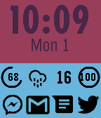</a>

<h2 class="app-name" id="app-57f8a6fa56fda5acf1000094"><a href="https://apps.repebble.com/57f8a6fa56fda5acf1000094">N2W</a></h2>
<a class="app-source" href="https://github.com/RodgerLeblanc/N2W" title="Source code" data-search-exclude>View source</a>

by <a href="https://apps.repebble.com/apps/dev/roger-leblanc_52b59af6d2b97a3c0a000016" title="More from this developer">Roger Leblanc</a>

MIT v1.21 Updated 2017-01-10

Runs on: Round 2, Time 2, Pebble 2 Duo, Pebble 2, Time Round, Time, Classic

Get your notification icons on your Pebble and stop glancing at your phone every 2 minutes to see if you have unread notifications. Supports all major social apps and many popular apps. Must be…

<a class="app-shot" href="https://apps.rebble.io/en_US/application/5351c91c27e150b0b300003a" data-search-exclude>No screenshot</a>

<h2 class="app-name" id="app-5351c91c27e150b0b300003a"><a href="https://apps.rebble.io/en_US/application/5351c91c27e150b0b300003a">N88KA</a></h2>
<a class="app-source" href="http://github.com/spangborn/pebble-n8" title="Source code" data-search-exclude>View source</a>

by <a href="https://apps.rebble.io/en_US/developer/529a3a33129af7f5b00000cc/1" title="More from this developer">Sawyer Pangborn</a>

No licence v1.1.0 Updated 2025-12-01 Rebble App Store

Runs on: Time 2, Pebble 2 Duo, Pebble 2, Time, Classic

N88KA watchface.

<a class="app-shot" href="https://apps.repebble.com/53298e8c73a31ab04d0003a3" data-search-exclude>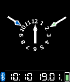</a>

<h2 class="app-name" id="app-53298e8c73a31ab04d0003a3"><a href="https://apps.repebble.com/53298e8c73a31ab04d0003a3">Nadir</a></h2>
<a class="app-source" href="https://github.com/PanicMan/Pebble-Nadir" title="Source code" data-search-exclude>View source</a>

by <a href="https://apps.repebble.com/apps/dev/jack-t_52ea054f156ab45eae00000f" title="More from this developer">Jack T.</a>

No licence v2.0 Updated 2016-01-19

Runs on: Round 2, Time 2, Pebble 2 Duo, Pebble 2, Time Round, Time, Classic

As requested here an Watchface Clone of an Nadir Watch. This is the Original: http://projectswatches.com/shop/nadir/#prettyPhoto Here the Request…

<a class="app-shot" href="https://apps.rebble.io/en_US/application/69469023828bd90009075f2d" data-search-exclude>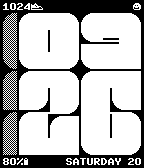</a>

<h2 class="app-name" id="app-69469023828bd90009075f2d"><a href="https://apps.rebble.io/en_US/application/69469023828bd90009075f2d">Naive</a></h2>
<a class="app-source" href="https://github.com/ir33k/naive" title="Source code" data-search-exclude>View source</a>

by <a href="https://apps.rebble.io/en_US/developer/636763090587050008d091aa/1" title="More from this developer">irek</a>

Not checked yet v1.1 Updated 2025-12-20 Rebble App Store

Runs on: Time 2, Pebble 2 Duo, Pebble 2, Time, Classic

Big abstract looking numbers with rounded features and 4 lines of customizable text. In comparison to Brutal (my previous watchface) this tries to take itself less seriously, look artistic and…

<a class="app-shot" href="https://apps.repebble.com/834e091d4fea4f5387e7e117" data-search-exclude>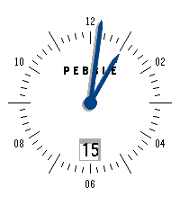</a>

<h2 class="app-name" id="app-834e091d4fea4f5387e7e117"><a href="https://apps.repebble.com/834e091d4fea4f5387e7e117">Naos</a></h2>
<a class="app-source" href="https://github.com/MVogge/pebble-naos-watchface" title="Source code" data-search-exclude>View source</a>

by <a href="https://apps.repebble.com/apps/dev/mxvi_403defbc56a5cb161ca1c702" title="More from this developer">MXVI</a>

No licence v1.0.1 Updated 2026-04-14

Runs on: Round 2, Time 2

A clean, minimalist analog watchface inspired by the iconic Sternglas Naos timepiece. Features different color themes, optional date display, and optional seconds hand (which increases battery…

<a class="app-shot" href="https://apps.rebble.io/en_US/application/5a3acf170dfc32dba00014d2" data-search-exclude>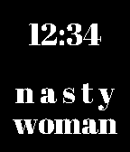</a>

<h2 class="app-name" id="app-5a3acf170dfc32dba00014d2"><a href="https://apps.rebble.io/en_US/application/5a3acf170dfc32dba00014d2">Nasty Woman</a></h2>
<a class="app-source" href="https://github.com/Spitemare/nasty-woman" title="Source code" data-search-exclude>View source</a>

by <a href="https://apps.rebble.io/en_US/developer/564924e14f9b2989ec000014/1" title="More from this developer">David Morgan</a>

ISC v1.0 Updated 2017-12-20 Rebble App Store

Runs on: Round 2, Time 2, Pebble 2 Duo, Pebble 2, Time Round, Time, Classic

Such a nasty woman.

<a class="app-shot" href="https://apps.repebble.com/53e92b66d145e76860000069" data-search-exclude>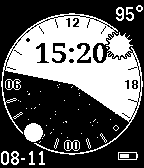</a>

<h2 class="app-name" id="app-53e92b66d145e76860000069"><a href="https://apps.repebble.com/53e92b66d145e76860000069">Natural</a></h2>
<a class="app-source" href="https://github.com/tomhettinger/natural" title="Source code" data-search-exclude>View source</a>

by <a href="https://apps.repebble.com/apps/dev/tom-hettinger_530cbe1ee3375428fa0003c8" title="More from this developer">Tom Hettinger</a>

Not checked yet v1.1 Updated 2015-11-01

Runs on: Time 2, Pebble 2 Duo, Pebble 2, Time, Classic

Displays day/night cycle, phases, and positions using a natural &quot;horizon&quot; style 24-hour analog face. • Sunrise / Sunset times from OpenWeatherMap.org • Calculated lunar phases • Approximates the…

<a class="app-shot" href="https://apps.repebble.com/565b94b54f2675185500000a" data-search-exclude>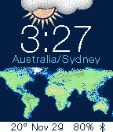</a>

<h2 class="app-name" id="app-565b94b54f2675185500000a"><a href="https://apps.repebble.com/565b94b54f2675185500000a">Natural Earth</a></h2>
<a class="app-source" href="https://github.com/mereed/pebbleface-naturalearth" title="Source code" data-search-exclude>View source</a>

by <a href="https://apps.repebble.com/apps/dev/chops_52d76309bd61272345000001" title="More from this developer">chops</a>

Not checked yet v1.3 Updated 2016-07-28

Runs on: Round 2, Time 2, Pebble 2 Duo, Pebble 2, Time Round, Time, Classic

The original idea for this simple watchface came from another project i&#x27;m working on - creating a world map (in three parts, each about 2m high x 1.5m wide). So this is obviously a much much…

<a class="app-shot" href="https://apps.repebble.com/f117fb3ec20e45f3b03781a2" data-search-exclude>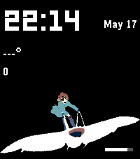</a>

<h2 class="app-name" id="app-f117fb3ec20e45f3b03781a2"><a href="https://apps.repebble.com/f117fb3ec20e45f3b03781a2">Nausicaa Glider</a></h2>
<a class="app-source" href="https://github.com/shoepaladin/kiwi-cup/tree/main/pebble/nausicaa-glider-m-wf" title="Source code" data-search-exclude>View source</a>

by <a href="https://apps.repebble.com/apps/dev/sapphire-second-hand_527b6cf8aa4310a44fe95d9d" title="More from this developer">Sapphire Second-Hand</a>

Not checked yet v1.0.45 Updated 2026-05-19

Runs on: Round 2, Time 2, Pebble 2 Duo, Pebble 2, Time Round

Track the time, weather, steps, and battery with Nausicaa. Colors invert when BT disconnects. Image credit to Umineko97: https://www.deviantart.com/umineko97/gallery

<a class="app-shot" href="https://apps.rebble.io/en_US/application/61a966430b40e40009c75fd3" data-search-exclude>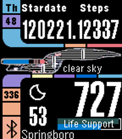</a>

<h2 class="app-name" id="app-61a966430b40e40009c75fd3"><a href="https://apps.rebble.io/en_US/application/61a966430b40e40009c75fd3">NCC-1701D LCARS TOM</a></h2>
<a class="app-source" href="https://github.com/franc6/Pebble1701LCARS" title="Source code" data-search-exclude>View source</a>

by <a href="https://apps.rebble.io/en_US/developer/5c3269933a448e0001af238f/1" title="More from this developer">TOM</a>

Not checked yet v2.20 Updated 2021-12-03 Rebble App Store

Runs on: Time 2, Pebble 2 Duo, Pebble 2, Time

This is a derivative of NCC-1701D LCARS, with support for Yahoo Weather, Quiet Time status, day of year, corrected 12-hour display, and some other bug fixes.

<a class="app-shot" href="https://apps.repebble.com/57adf202bb85edbc76000241" data-search-exclude>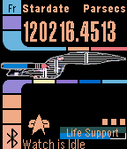</a>

<h2 class="app-name" id="app-57adf202bb85edbc76000241"><a href="https://apps.repebble.com/57adf202bb85edbc76000241">NCC-1701D LCARS v1</a></h2>
<a class="app-source" href="https://github.com/ddwatson/Pebble1701LCARS" title="Source code" data-search-exclude>View source</a>

by <a href="https://apps.repebble.com/apps/dev/david-watson_564ba91d0fa9d91476000004" title="More from this developer">David Watson</a>

Not checked yet v2.4 Updated 2017-05-17

Runs on: Time 2, Time

Everyone: Idle and Sleep are now fixed and respond to the settings The captain has assigned the task of implementing an effective display for his wrist based ship status device, it has been many…

<a class="app-shot" href="https://apps.repebble.com/69128a83b3a19d000827a950" data-search-exclude>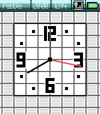</a>

<h2 class="app-name" id="app-69128a83b3a19d000827a950"><a href="https://apps.repebble.com/69128a83b3a19d000827a950">NDS Pebble</a></h2>
<a class="app-source" href="https://github.com/Arenovas/nds-pebble" title="Source code" data-search-exclude>View source</a>

by <a href="https://apps.repebble.com/apps/dev/arenovas_68e92c7c1069ae00086f683a" title="More from this developer">Arenovas</a>

MIT v1.7 Updated 2026-02-25

Runs on: Round 2, Time 2, Pebble 2 Duo, Pebble 2, Time Round, Time, Classic

A recreation of the NDS BIOS clock screen, featuring time, date, bluetooth icon, and battery life.

<a class="app-shot" href="https://apps.repebble.com/ec086ce0bfe44c8abc0fed57" data-search-exclude>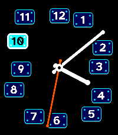</a>

<h2 class="app-name" id="app-ec086ce0bfe44c8abc0fed57"><a href="https://apps.repebble.com/ec086ce0bfe44c8abc0fed57">Nearly Time</a></h2>
<a class="app-source" href="https://github.com/lukeslp/pebble-anti-grid" title="Source code" data-search-exclude>View source</a>

by <a href="https://apps.repebble.com/apps/dev/ambient-time_3a9986a63073f9f293be7e14" title="More from this developer">Ambient Time</a>

Not checked yet v1.5.1 Updated 2026-10-05

Runs on: Round 2, Time 2, Pebble 2 Duo, Pebble 2, Time Round, Time

The hands are correct, the markers are sloppy. It&#x27;s irritating! And configurable. Configurably irritating! lukesteuber.com

<a class="app-shot" href="https://apps.repebble.com/c5f6128ec517404e8f9fde66" data-search-exclude>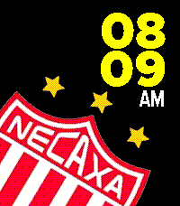</a>

<h2 class="app-name" id="app-c5f6128ec517404e8f9fde66"><a href="https://apps.repebble.com/c5f6128ec517404e8f9fde66">Necaxa</a></h2>
<a class="app-source" href="https://github.com/GeoPebbleMx/necaxa-watchface-config" title="Source code" data-search-exclude>View source</a>

by <a href="https://apps.repebble.com/apps/dev/geodevmx_66796279091eda36119d9c4e" title="More from this developer">GeoDevMx</a>

No licence v1.0.0 Updated 2026-07-23

Runs on: Time 2

Me di cuenta que el glorioso Club Necaxa de México no tenía presencia en ninguna appstore (para smartwatches) del mundo, así que decidí cambiar eso. Tiene tres temas disponibles: Clásico, Necaxa e…

<a class="app-shot" href="https://apps.repebble.com/4c25df439af543d19c98630a" data-search-exclude>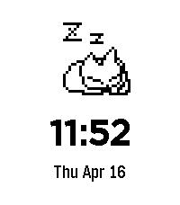</a>

<h2 class="app-name" id="app-4c25df439af543d19c98630a"><a href="https://apps.repebble.com/4c25df439af543d19c98630a">Neko Wristmate</a></h2>
<a class="app-source" href="https://github.com/coconauts/pebble-neko-watchface" title="Source code" data-search-exclude>View source</a>

by <a href="https://apps.repebble.com/apps/dev/coconauts_1e79b46fb4a32ceee9259940" title="More from this developer">Coconauts</a>

Not checked yet v1.1 Updated 2026-04-17

Runs on: Round 2, Time 2, Pebble 2 Duo

Neko, the iconic screenmate mascot from the 90s, now in your wrist! An animated neko will play around in your watch. After a while, it will grow tired and go to sleep. It will wake up with a tap.

<a class="app-shot" href="https://apps.rebble.io/en_US/application/5a4c169c0dfc323bd000428c" data-search-exclude>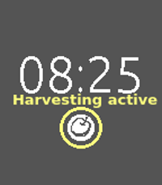</a>

<h2 class="app-name" id="app-5a4c169c0dfc323bd000428c"><a href="https://apps.rebble.io/en_US/application/5a4c169c0dfc323bd000428c">NEM_HARVESTING_WATCHER</a></h2>
<a class="app-source" href="https://github.com/mijinc0/PebbleNEM" title="Source code" data-search-exclude>View source</a>

by <a href="https://apps.rebble.io/en_US/developer/59f2d2270dfc323bd0002c12/1" title="More from this developer">mincoshi</a>

Not checked yet v0.1 Updated 2018-01-06 Rebble App Store

Runs on: Round 2, Time 2, Pebble 2 Duo, Pebble 2, Time Round, Time, Classic

NEMのハーベスティングの状態を監視できる簡単なWatchFaceです。スマホの設定画面でセットしたNEMアドレスの委任ハーベストの状態(active,inactive)を監視できます。このアプリが正常に動作するためにはbluetoothによりpebbleとスマホを接続し、スマホはインターネットに接続されている必要があります。表示が &quot;?&quot;…

<a class="app-shot" href="https://apps.repebble.com/3d68f2f6e539487f98d58540" data-search-exclude>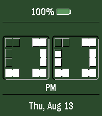</a>

<h2 class="app-name" id="app-3d68f2f6e539487f98d58540"><a href="https://apps.repebble.com/3d68f2f6e539487f98d58540">Neo Morph</a></h2>
<a class="app-source" href="https://github.com/parizeaujj/neo-morph" title="Source code" data-search-exclude>View source</a>

by <a href="https://apps.repebble.com/apps/dev/unknown_032087392acdc1478509066d" title="More from this developer">Unknown</a>

Not checked yet v1.0.0 Updated 2026-08-14

Runs on: Round 2, Time 2

A neumorphic watchface with two bevel-frame tiles that fill clockwise to show the time. Configurable top and bottom rows display battery, date, or live health stats — steps, heart rate, sleep…

<h2 class="app-name" id="app-55e2f0fa4af009458900001e"><a href="https://apps.repebble.com/55e2f0fa4af009458900001e">Neolog Watchface</a></h2>
<a class="app-source" href="https://svn.ralph-schuster.eu/svn/OSS/neolog" title="Source code" data-search-exclude>View source</a>

by <a href="https://apps.repebble.com/apps/dev/technicalguru_55c3458b269c827fe000007a" title="More from this developer">TechnicalGuru</a>

Not checked yet v2.1 Updated 2015-09-30

Runs on: Time 2, Pebble 2 Duo, Pebble 2, Time, Classic

Adds the wonderful Neolog watch to Pebble Time. The watch face displays time as collections. Just count the bars in each pile. The time shown at the screenshots are 1:47 and 11:48. Version 2 adds…

<a class="app-shot" href="https://apps.repebble.com/8e797a6fa67645d49c14d62d" data-search-exclude>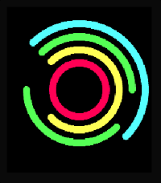</a>

<h2 class="app-name" id="app-8e797a6fa67645d49c14d62d"><a href="https://apps.repebble.com/8e797a6fa67645d49c14d62d">Neon IO X Eclipse</a></h2>
<a class="app-source" href="https://github.com/msteinhoefel/NeonIOXEclipse" title="Source code" data-search-exclude>View source</a>

by <a href="https://apps.repebble.com/apps/dev/beathoven_3258bdad5543670134a5be03" title="More from this developer">Beathoven</a>

Not checked yet v1.0 Updated 2026-07-31

Runs on: Round 2, Time 2, Time Round, Time

The old neon tube classic, but even more abstract. Like my other watchface, Neon IO X Reborn, this is, in essence, a remake of Sam Jerichow&#x27;s popular Neon IO X. But unlike those two, this one is…

<a class="app-shot" href="https://apps.repebble.com/12874117325c4b84b85f31f8" data-search-exclude>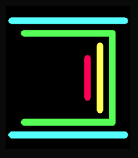</a>

<h2 class="app-name" id="app-12874117325c4b84b85f31f8"><a href="https://apps.repebble.com/12874117325c4b84b85f31f8">Neon IO X Reborn</a></h2>
<a class="app-source" href="https://github.com/msteinhoefel/NeonIOXReborn" title="Source code" data-search-exclude>View source</a>

by <a href="https://apps.repebble.com/apps/dev/beathoven_3258bdad5543670134a5be03" title="More from this developer">Beathoven</a>

Not checked yet v1.1 Updated 2026-07-30

Runs on: Round 2, Time 2, Time Round, Time

The popular neon tube classic - now fully customizable! The original Neon IO X by Sam Jerichow is my favorite watch face by far. Unfortunately, I didn&#x27;t quite like how it looked on the bigger…

<a class="app-shot" href="https://apps.repebble.com/68df20e3a6f9880008c5ff5f" data-search-exclude>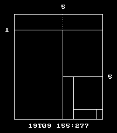</a>

<h2 class="app-name" id="app-68df20e3a6f9880008c5ff5f"><a href="https://apps.repebble.com/68df20e3a6f9880008c5ff5f">Neralie</a></h2>
<a class="app-source" href="https://git.sr.ht/~angelwood/uxn-pebble/" title="Source code" data-search-exclude>View source</a>

by <a href="https://apps.repebble.com/apps/dev/chloe-greene_68a9aafeb2d66b00083939f8" title="More from this developer">Chloe Greene</a>

See source v2.1 Updated 2026-01-04

Runs on: Round 2, Time 2, Pebble 2 Duo, Pebble 2, Time Round, Time, Classic

The Neralie clock has two groups of 3 digits, called the beat &amp; the pulse. A beat contains 1000 pulses, and equivalent to 86.4 seconds. A day is 1000 beats, or a million pulses. A pomodoro of 20…

<a class="app-shot" href="https://apps.rebble.io/en_US/application/603fc6611342ae01e302d010" data-search-exclude>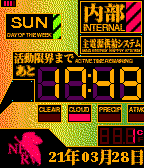</a>

<h2 class="app-name" id="app-603fc6611342ae01e302d010"><a href="https://apps.rebble.io/en_US/application/603fc6611342ae01e302d010">NERV</a></h2>
<a class="app-source" href="https://github.com/mistyhands/pebble-nerv/" title="Source code" data-search-exclude>View source</a>

by <a href="https://apps.rebble.io/en_US/developer/6035842a1342ae0057ecf1aa/1" title="More from this developer">prayerie</a>

Not checked yet v1.5 Updated 2021-06-27 Rebble App Store

Runs on: Round 2, Time 2, Pebble 2 Duo, Pebble 2, Time Round, Time, Classic

A Neon Genesis Evangelion themed watchface. Battery is in the top-left and shown in four bars. The weather status is shown via a red indicator and categorised as follows - CLEAR (clear sky) CLOUD…

<h2 class="app-name" id="app-d824a71853744a26b726ffb1"><a href="https://apps.repebble.com/d824a71853744a26b726ffb1">NestedNumbers</a></h2>
<a class="app-source" href="https://github.com/peerdavid/pebble-nested-numbers" title="Source code" data-search-exclude>View source</a>

by <a href="https://apps.repebble.com/apps/dev/david-peer_68fb6df5d3c6e4000885b8f5" title="More from this developer">David Peer</a>

Not checked yet v2.22 Updated 2026-03-23

Runs on: Time 2, Pebble 2 Duo, Pebble 2, Time, Classic

A simple watch face with large numbers. The numbers are nested so always read from left to right and inside to the outside. It also implements a menu that you can circle with flick (double flöick…

<a class="app-shot" href="https://apps.repebble.com/6959d36624ba4b0008d50149" data-search-exclude>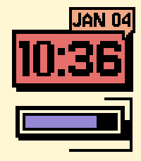</a>

<h2 class="app-name" id="app-6959d36624ba4b0008d50149"><a href="https://apps.repebble.com/6959d36624ba4b0008d50149">Neubrutalism</a></h2>
<a class="app-source" href="https://github.com/Yorks0n/neubrutalism" title="Source code" data-search-exclude>View source</a>

by <a href="https://apps.repebble.com/apps/dev/yorks0n_692a907686176a0009926c79" title="More from this developer">Yorks0n</a>

MIT v1.2.0 Updated 2026-08-03

Runs on: Time 2, Pebble 2 Duo, Pebble 2, Time, Classic

A watchface inspired by neubrutalism design aesthetic.

<a class="app-shot" href="https://apps.repebble.com/6cb18ef9886442ffb67b4d5b" data-search-exclude>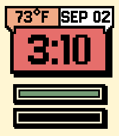</a>

<h2 class="app-name" id="app-6cb18ef9886442ffb67b4d5b"><a href="https://apps.repebble.com/6cb18ef9886442ffb67b4d5b">Neubrutalism+</a></h2>
<a class="app-source" href="https://github.com/aliofye/pebble-neubrutalism" title="Source code" data-search-exclude>View source</a>

by <a href="https://apps.repebble.com/apps/dev/aliofye_f532e07424ca50f379ea0a0a" title="More from this developer">aliofye</a>

MIT v1.1.1 Updated 2026-09-11

Runs on: Time 2, Pebble 2 Duo, Pebble 2, Time, Classic

Neubrutalism+ A bold, chunky watchface that brings the neubrutalism design aesthetic to your wrist: thick black outlines, hard color blocks, and a pixel-style Jersey font. Features - Pixel-art…

<a class="app-shot" href="https://apps.rebble.io/en_US/application/5b01e946461a8d22e3000ec9" data-search-exclude>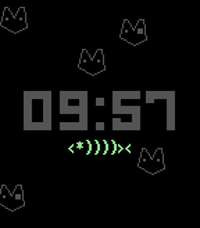</a>

<h2 class="app-name" id="app-5b01e946461a8d22e3000ec9"><a href="https://apps.rebble.io/en_US/application/5b01e946461a8d22e3000ec9">Never Trust Fish</a></h2>
<a class="app-source" href="https://github.com/canerakdas/Fishface" title="Source code" data-search-exclude>View source</a>

by <a href="https://apps.rebble.io/en_US/developer/599a49ea461a8d1889001186/1" title="More from this developer">cakdas</a>

Not checked yet v1.0 Updated 2018-05-22 Rebble App Store

Runs on: Round 2, Time 2, Pebble 2 Duo, Pebble 2, Time Round, Time

Simple watchface

<a class="app-shot" href="https://apps.repebble.com/52dab3b1889f5dc9eb0001a3" data-search-exclude>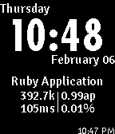</a>

<h2 class="app-name" id="app-52dab3b1889f5dc9eb0001a3"><a href="https://apps.repebble.com/52dab3b1889f5dc9eb0001a3">New Relic Watchface</a></h2>
<a class="app-source" href="http://github.com/ChrisRegado/newrelic-watch" title="Source code" data-search-exclude>View source</a>

by <a href="https://apps.repebble.com/apps/dev/chris-regado_52d0b5ff3364776b9300009b" title="More from this developer">Chris Regado</a>

MIT v2.0.0 Updated 2014-02-07

Runs on: Time 2, Pebble 2 Duo, Pebble 2, Time, Classic

The New Relic Watchface puts key performance metrics from your New Relic-monitored web app on your wrist. It will automatically update at a regular interval so you always know how your site is doing.

<a class="app-shot" href="https://apps.repebble.com/53f5ea07e0122978f0000172" data-search-exclude>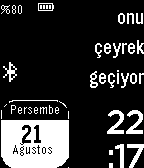</a>

<h2 class="app-name" id="app-53f5ea07e0122978f0000172"><a href="https://apps.repebble.com/53f5ea07e0122978f0000172">NewFuzzyClckwCalTR</a></h2>
<a class="app-source" href="https://github.com/ersindurna/FuzzyTurkishWithCalendar" title="Source code" data-search-exclude>View source</a>

by <a href="https://apps.repebble.com/apps/dev/ersin-durna_530605ab21336c2d47000210" title="More from this developer">Ersin Durna</a>

Not checked yet v5.0 Updated 2014-08-21

Runs on: Time 2, Pebble 2 Duo, Pebble 2, Time, Classic

Turkish Fuzzy Watchface with calendar, Bluetooth connection status icon (if out ouf range vibration), Battery (both as a number and icon) and digital clock

<a class="app-shot" href="https://apps.repebble.com/52cb23ccb138287fc8000050" data-search-exclude>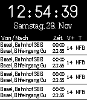</a>

<h2 class="app-name" id="app-52cb23ccb138287fc8000050"><a href="https://apps.repebble.com/52cb23ccb138287fc8000050">NextTrain</a></h2>
<a class="app-source" href="https://github.com/kije/NextTrain" title="Source code" data-search-exclude>View source</a>

by <a href="https://apps.repebble.com/apps/dev/kije-dev_52b953e7fd4763c452000066" title="More from this developer">kije-dev</a>

Not checked yet v1 Updated 2014-05-11

Runs on: Time 2, Pebble 2 Duo, Pebble 2, Time, Classic

A Pebble watchface, that shows you the next public transportations (bus, tram, train, etc...) departing from or nearby your current location. It will also notify you about delays and cancelations…

<h2 class="app-name" id="app-6c0eeeaeb5484d4f99a1f030"><a href="https://apps.repebble.com/6c0eeeaeb5484d4f99a1f030">NFL Live Scores</a></h2>
<a class="app-source" href="https://github.com/brooks2564/Pebble-NFL-Live" title="Source code" data-search-exclude>View source</a>

by <a href="https://apps.repebble.com/apps/dev/brooman-inks_44b97418cf47663c00fb67bc" title="More from this developer">Brooman Inks</a>

No licence v1.0.0 Updated 2026-09-14

Runs on: Time 2, Pebble 2 Duo, Pebble 2, Time, Classic

NFL Live Scores for Pebble Stuck in a meeting? Can&#x27;t watch the game? Don&#x27;t worry - keep the score on your wrist. NFL Live Scores updates every minute straight from ESPN&#x27;s public scoreboard API, so…

<a class="app-shot" href="https://apps.repebble.com/43c6b549267b48e5abd78dca" data-search-exclude>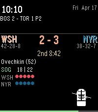</a>

<h2 class="app-name" id="app-43c6b549267b48e5abd78dca"><a href="https://apps.repebble.com/43c6b549267b48e5abd78dca">NHL Live Scores</a></h2>
<a class="app-source" href="https://github.com/brooks2564/Pebble-NHL-Live" title="Source code" data-search-exclude>View source</a>

by <a href="https://apps.repebble.com/apps/dev/brooman-inks_44b97418cf47663c00fb67bc" title="More from this developer">Brooman Inks</a>

No licence v1.2.0 Updated 2026-10-03

Runs on: Time 2, Pebble 2 Duo, Pebble 2, Time, Classic

NHL Scores

<a class="app-shot" href="https://apps.repebble.com/2b5413279c4b429f803e8098" data-search-exclude>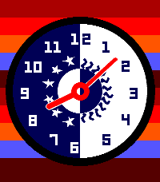</a>

<h2 class="app-name" id="app-2b5413279c4b429f803e8098"><a href="https://apps.repebble.com/2b5413279c4b429f803e8098">Night Shift</a></h2>
<a class="app-source" href="https://github.com/bwinton/night-shift" title="Source code" data-search-exclude>View source</a>

by <a href="https://apps.repebble.com/apps/dev/blake-winton_47b62fcfd059bba2bf969f49" title="More from this developer">Blake Winton</a>

MPL-2.0 v1.0.0 Updated 2026-06-28

Runs on: Round 2, Time 2, Pebble 2 Duo, Pebble 2, Time Round, Time, Classic

A pebble watchface for fans of Game Changer S08E03.

<a class="app-shot" href="https://apps.repebble.com/562c5bd49e0d460340000050" data-search-exclude>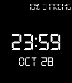</a>

<h2 class="app-name" id="app-562c5bd49e0d460340000050"><a href="https://apps.repebble.com/562c5bd49e0d460340000050">Night Stand</a></h2>
<a class="app-source" href="https://github.com/trevordavies095/NightStand" title="Source code" data-search-exclude>View source</a>

by <a href="https://apps.repebble.com/apps/dev/l-trevor-davies_52f008e5a0cb6a2298000028" title="More from this developer">L Trevor Davies</a>

Not checked yet v1.4 Updated 2016-08-08

Runs on: Time 2, Pebble 2 Duo, Pebble 2, Time, Classic

Simple clean watch face with a classic digital clock feel. FEATURES: Backlight always on if the watch is charging so you can actually use it as a night stand.

<a class="app-shot" href="https://apps.repebble.com/550ef6e8e0b81de83c00000c" data-search-exclude>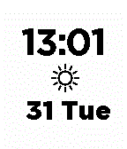</a>

<h2 class="app-name" id="app-550ef6e8e0b81de83c00000c"><a href="https://apps.repebble.com/550ef6e8e0b81de83c00000c">Night Switch</a></h2>
<a class="app-source" href="https://github.com/snacsnoc/nightswitch-pebble" title="Source code" data-search-exclude>View source</a>

by <a href="https://apps.repebble.com/apps/dev/easton_54e976960f0bb3f669000025" title="More from this developer">Easton</a>

Not checked yet v1.31 Updated 2015-07-14

Runs on: Time 2, Pebble 2 Duo, Pebble 2, Time, Classic

A watch face that inverts at night and in the morning. At night the watch face shows white text and black background for easier reading, then inverts the colours in the morning. Also a cute sun…

<h2 class="app-name" id="app-56f9e26f69581dad78000025"><a href="https://apps.repebble.com/56f9e26f69581dad78000025">NightFace</a></h2>
<a class="app-source" href="https://github.com/gaetawoo/Pebble_NightFace" title="Source code" data-search-exclude>View source</a>

by <a href="https://apps.repebble.com/apps/dev/gaetawoo_52b2903ab70e1c4cea0000d2" title="More from this developer">GaetaWoo</a>

Not checked yet v1.3 Updated 2016-06-21

Runs on: Round 2, Time 2, Pebble 2 Duo, Pebble 2, Time Round, Time, Classic

The PERFECT watchface for sleeping humans! Since you don&#x27;t need to know the time, or have Pebble update the time, whilst you sleep... NightFace keeps the CPU asleep until you shake the watch for…

<a class="app-shot" href="https://apps.repebble.com/543bfbbcecc29baad0000007" data-search-exclude>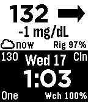</a>

<h2 class="app-name" id="app-543bfbbcecc29baad0000007"><a href="https://apps.repebble.com/543bfbbcecc29baad0000007">Nightscout</a></h2>
<a class="app-source" href="https://github.com/nightscout/cgm-pebble" title="Source code" data-search-exclude>View source</a>

by <a href="https://apps.repebble.com/apps/dev/nightscout-contributors_53810824528fbe7c5f000187" title="More from this developer">Nightscout contributors</a>

Not checked yet v7.4 Updated 2015-11-23

Runs on: Time 2, Pebble 2 Duo, Pebble 2, Time, Classic

Display Nightscout data on your pebble watch. Support for mg/dL and mmol units.

<a class="app-shot" href="https://apps.rebble.io/en_US/application/5e7449b43dd3109103feea94" data-search-exclude>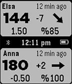</a>

<h2 class="app-name" id="app-5e7449b43dd3109103feea94"><a href="https://apps.rebble.io/en_US/application/5e7449b43dd3109103feea94">Nightscout Double Vision</a></h2>
<a class="app-source" href="https://github.com/pauleeeeee/nightscout-double-vision" title="Source code" data-search-exclude>View source</a>

by <a href="https://apps.rebble.io/en_US/developer/5e65d05a3dd3108f341c08ea/1" title="More from this developer">swansswansswansswanssosoft</a>

Not checked yet v1.8 Updated 2021-01-05 Rebble App Store

Runs on: Time 2, Pebble 2 Duo, Pebble 2, Time, Classic

Nightscout Double Vision allows you to track two people with Type-1 Diabetes (T1D) and display their Nightscout information on one Pebble watchface. Double Vision was originally modeled after the…

<a class="app-shot" href="https://apps.repebble.com/68c5e8d5474b97000932ae2c" data-search-exclude>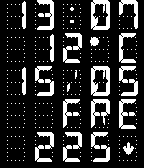</a>

<h2 class="app-name" id="app-68c5e8d5474b97000932ae2c"><a href="https://apps.repebble.com/68c5e8d5474b97000932ae2c">Nightscout Supercgm</a></h2>
<a class="app-source" href="https://github.com/sgitaize/Nightscout-supercgm" title="Source code" data-search-exclude>View source</a>

by <a href="https://apps.repebble.com/apps/dev/sgitaize_67c0d9b131804900097db57a" title="More from this developer">sgitaize</a>

Not checked yet v2.6 Updated 2026-09-28

Runs on: Round 2, Time 2, Pebble 2 Duo, Pebble 2, Time Round, Time, Classic

The ultimate Nightscout watchface for every Pebble. Five fully configurable rows — each independently set to any data source you need, in your color. ROWS (pick any per slot) • Nightscout BG —…

<a class="app-shot" href="https://apps.repebble.com/c7673ccc115f4cea9c5194d8" data-search-exclude>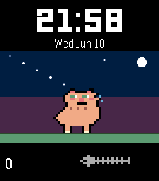</a>

<h2 class="app-name" id="app-c7673ccc115f4cea9c5194d8"><a href="https://apps.repebble.com/c7673ccc115f4cea9c5194d8">NineLives</a></h2>
<a class="app-source" href="https://github.com/mnadev/ninelives" title="Source code" data-search-exclude>View source</a>

by <a href="https://apps.repebble.com/apps/dev/mohammad-nadeem_16c160e1b9ed917af4fc90cc" title="More from this developer">Mohammad Nadeem</a>

Not checked yet v1.1.0 Updated 2026-06-12

Runs on: Round 2, Time 2, Pebble 2 Duo, Pebble 2, Time Round, Time

Step or Ded is a Pebble watchface that turns your daily steps into a virtual pet survival game. Your cat lives on your wrist — and it only survives if you keep moving. Each day, your cat reacts to…

<a class="app-shot" href="https://apps.repebble.com/53f128610a696f60d7000165" data-search-exclude>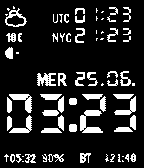</a>

<h2 class="app-name" id="app-53f128610a696f60d7000165"><a href="https://apps.repebble.com/53f128610a696f60d7000165">Ninety Fank</a></h2>
<a class="app-source" href="http://www.mypebblefaces.com/apps/25276/11200/" title="Source code" data-search-exclude>View source</a>

by <a href="https://apps.repebble.com/apps/dev/fa_52fc0fab68878a15ec0000d2" title="More from this developer">Fa</a>

See source v2.1 Updated 2014-08-17

Runs on: Time 2, Pebble 2 Duo, Pebble 2, Time, Classic

Derived from ninety hank 2 (available on github) from hank, but: * no week number (dev note: the code is still there, commented out) * smaller and simpler moonphase (icon and &quot;+&quot; for growing, &quot;-&quot;…

<a class="app-shot" href="https://apps.repebble.com/52bc497d7e4312a758000149" data-search-exclude>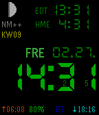</a>

<h2 class="app-name" id="app-52bc497d7e4312a758000149"><a href="https://apps.repebble.com/52bc497d7e4312a758000149">Ninety Hank (Original)</a></h2>
<a class="app-source" href="https://github.com/pebl-hank/ninety_hank_2" title="Source code" data-search-exclude>View source</a>

by <a href="https://apps.repebble.com/apps/dev/hank_529a4512129af7851e0000e9" title="More from this developer">Hank</a>

Not checked yet v4.2 Updated 2016-11-16

Runs on: Round 2, Time 2, Pebble 2 Duo, Pebble 2, Time Round, Time, Classic

Please give me your HEART if you like the Watchface. That is essential to bring it to the wide public. Pebble Time support with COLORS Now with full configuration page. Use the watchface in…

<a class="app-shot" href="https://apps.repebble.com/539a6507ae2277e49f00005f" data-search-exclude>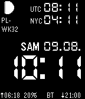</a>

<h2 class="app-name" id="app-539a6507ae2277e49f00005f"><a href="https://apps.repebble.com/539a6507ae2277e49f00005f">NINETY HANK FRENCH</a></h2>
<a class="app-source" href="https://github.com/dersie/ninety_hank_fr" title="Source code" data-search-exclude>View source</a>

by <a href="https://apps.repebble.com/apps/dev/dersie_52eda1449755252f26000007" title="More from this developer">Dersie</a>

Not checked yet v2.0 Updated 2014-06-13

Runs on: Time 2, Pebble 2 Duo, Pebble 2, Time, Classic

Ninety_Hank french version from original Ninety_Hank by Hank based on official 91 Dub TimeZone UTC and New York Coordinates EST France See Universal version with configuration for TimeZone…

<a class="app-shot" href="https://apps.repebble.com/53d28f9c15466c6e5e000053" data-search-exclude>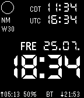</a>

<h2 class="app-name" id="app-53d28f9c15466c6e5e000053"><a href="https://apps.repebble.com/53d28f9c15466c6e5e000053">Ninety_Hank_DK</a></h2>
<a class="app-source" href="https://github.com/HBTeicher/Ninety_Hank_DK" title="Source code" data-search-exclude>View source</a>

by <a href="https://apps.repebble.com/apps/dev/hbteicher_52f009f13be62018d800009b" title="More from this developer">HBTeicher</a>

No licence v2.0 Updated 2014-07-25

Runs on: Time 2, Pebble 2 Duo, Pebble 2, Time, Classic

Danish version of Ninety_Hank by Hank, based on 91 Dub. Useful for planning my morning/evening runs before darkness falls! -Sunrise/set for 56.7° N, 8.2° E (Thyborøn) -Moonphase -BT/battery…

<a class="app-shot" href="https://apps.repebble.com/52ce401057174411a5200265" data-search-exclude>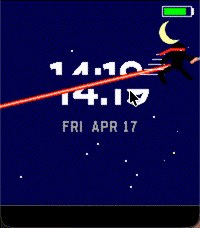</a>

<h2 class="app-name" id="app-52ce401057174411a5200265"><a href="https://apps.repebble.com/52ce401057174411a5200265">Ninja Strike</a></h2>
<a class="app-source" href="https://github.com/coredevices/pebble-watchface-agent-skill" title="Source code" data-search-exclude>View source</a>

by <a href="https://apps.repebble.com/apps/dev/aircodum_67bc77bf37d408000a74f7d3" title="More from this developer">AirCodum</a>

Not checked yet v1.0.0 Updated 2026-04-17

Runs on: Time 2

A fruit-ninja style watchface. Every minute a ninja dashes across the time, katana trailing neon, slicing it in half before the pieces snap back together. Five different slash patterns …

<a class="app-shot" href="https://apps.repebble.com/67c648a1b7a02300092ba0c8" data-search-exclude>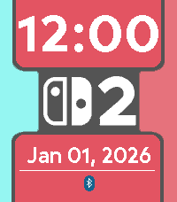</a>

<h2 class="app-name" id="app-67c648a1b7a02300092ba0c8"><a href="https://apps.repebble.com/67c648a1b7a02300092ba0c8">Nintendo Switch 2</a></h2>
<a class="app-source" href="https://github.com/robinfire110/switch-2-watchface" title="Source code" data-search-exclude>View source</a>

by <a href="https://apps.repebble.com/apps/dev/robinfire110_5ba43f96fb18c4000121d57b" title="More from this developer">robinfire110</a>

Not checked yet v1.4.0 Updated 2026-07-19

Runs on: Round 2, Time 2, Pebble 2 Duo, Pebble 2, Time Round, Time, Classic

Made in celebration of the 8 year anniversary of the Nintendo Switch for the Rebble Hackathon #002. Originally, a watchface to count down to the system&#x27;s release, it has been updated to just be a…

<a class="app-shot" href="https://apps.repebble.com/54974cada8c1257044000023" data-search-exclude>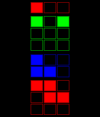</a>

<h2 class="app-name" id="app-54974cada8c1257044000023"><a href="https://apps.repebble.com/54974cada8c1257044000023">Nix</a></h2>
<a class="app-source" href="https://github.com/cscott/pebble-nix" title="Source code" data-search-exclude>View source</a>

by <a href="https://apps.repebble.com/apps/dev/cscott_53b76b01d773ce09420000e4" title="More from this developer">cscott</a>

Not checked yet v1.3 Updated 2015-06-24

Runs on: Time 2, Pebble 2 Duo, Pebble 2, Time, Classic

A &quot;nix&quot; style watchface for pebble. The number of filled squares in each group gives the digits in the current time. Hours are at the top. The pattern of filled squares changes every three seconds.

<a class="app-shot" href="https://apps.repebble.com/554a5efc93cc44482d0000ac" data-search-exclude>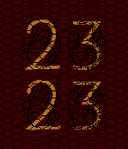</a>

<h2 class="app-name" id="app-554a5efc93cc44482d0000ac"><a href="https://apps.repebble.com/554a5efc93cc44482d0000ac">Nixed</a></h2>
<a class="app-source" href="https://github.com/oniony/Nixed" title="Source code" data-search-exclude>View source</a>

by <a href="https://apps.repebble.com/apps/dev/paul-ruane_54edfe489e4ff7103f000095" title="More from this developer">Paul Ruane</a>

Not checked yet v1.1 Updated 2015-05-08

Runs on: Time 2, Pebble 2 Duo, Pebble 2, Time, Classic

A watchface inspired by the soft, neon-orange glow of the precursor to the modern LCD.

<a class="app-shot" href="https://apps.repebble.com/57d2abadffca49e6d100007f" data-search-exclude>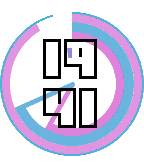</a>

<h2 class="app-name" id="app-57d2abadffca49e6d100007f"><a href="https://apps.repebble.com/57d2abadffca49e6d100007f">Nixi</a></h2>
<a class="app-source" href="https://github.com/0merlin/pebble_watch" title="Source code" data-search-exclude>View source</a>

by <a href="https://apps.repebble.com/apps/dev/merlin_57bedd68f69d1d9958000064" title="More from this developer">Merlin</a>

No licence v2.1 Updated 2016-11-11

Runs on: Time 2, Time

This watchface displays the following information: * Current time * Current date * Current day * Battery percentage * Phone Battery Percentage * Bluetooth connectivity * Steps taken * How many…

<a class="app-shot" href="https://apps.repebble.com/571bf97f19c7adbfc5000017" data-search-exclude>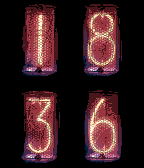</a>

<h2 class="app-name" id="app-571bf97f19c7adbfc5000017"><a href="https://apps.repebble.com/571bf97f19c7adbfc5000017">Nixie Watch</a></h2>
<a class="app-source" href="https://github.com/nmittu/Nixie-Watch" title="Source code" data-search-exclude>View source</a>

by <a href="https://apps.repebble.com/apps/dev/mittudev_5659e669c1b6ceb64b000081" title="More from this developer">MittuDev</a>

Not checked yet v2.2 Updated 2016-04-25

Runs on: Round 2, Time 2, Pebble 2 Duo, Pebble 2, Time Round, Time, Classic

Nixie watchface for the pebble. You can make the watchface vibrate after a certain amount of time in the config page. Includes a connection indicator, battery indicator, and step counter…

<a class="app-shot" href="https://apps.repebble.com/52dda2b481cae254ac000005" data-search-exclude>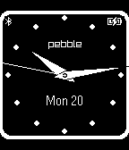</a>

<h2 class="app-name" id="app-52dda2b481cae254ac000005"><a href="https://apps.repebble.com/52dda2b481cae254ac000005">No Fuss</a></h2>
<a class="app-source" href="https://github.com/JamesFowler42/nofuss" title="Source code" data-search-exclude>View source</a>

by <a href="https://apps.repebble.com/apps/dev/james-fowler_52b208abb70e1ced1f00004c" title="More from this developer">James Fowler</a>

No licence v1.0.0 Updated 2014-01-20

Runs on: Time 2, Pebble 2 Duo, Pebble 2, Time, Classic

Simple no fuss watch face. Flashing bluetooth indicator on disconnection. Battery state when less than 20% or on charge.

<a class="app-shot" href="https://apps.repebble.com/5591fa14981ce42c590000c9" data-search-exclude>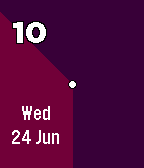</a>

<h2 class="app-name" id="app-5591fa14981ce42c590000c9"><a href="https://apps.repebble.com/5591fa14981ce42c590000c9">No Hands (has weather)</a></h2>
<a class="app-source" href="https://github.com/sdneon/NoHands" title="Source code" data-search-exclude>View source</a>

by <a href="https://apps.repebble.com/apps/dev/neon_5568037a1034b0abf70000a1" title="More from this developer">Neon</a>

Not checked yet v1.5 Updated 2015-07-26

Runs on: Time 2, Time

Simple analogue watch with coloured sectors and hour hint. (Colour, Analogue, for Pebble Time). Now with optional vibrations and weather. Sample times in screenshots are: 10:30PM, 8:34AM, 10:25AM…

<a class="app-shot" href="https://apps.repebble.com/565e4d60df5955cf1d00008a" data-search-exclude>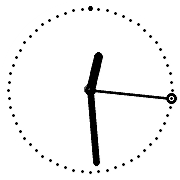</a>

<h2 class="app-name" id="app-565e4d60df5955cf1d00008a"><a href="https://apps.repebble.com/565e4d60df5955cf1d00008a">No.1.1</a></h2>
<a class="app-source" href="https://github.com/aarmea/No.1.1-pebble" title="Source code" data-search-exclude>View source</a>

by <a href="https://apps.repebble.com/apps/dev/albert-armea_52d9d5f65b0d1b5ef8000002" title="More from this developer">Albert Armea</a>

MIT v0.3 Updated 2016-03-12

Runs on: Round 2, Time Round

An unofficial implementation of the TID No.1 watch as a Pebble Time Round watchface, chosen because it complements the numbers on certain PTR models.

<a class="app-shot" href="https://apps.repebble.com/2029ab9c84f946e1b125f8e0" data-search-exclude>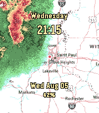</a>

<h2 class="app-name" id="app-2029ab9c84f946e1b125f8e0"><a href="https://apps.repebble.com/2029ab9c84f946e1b125f8e0">NOAA US Weather Radar</a></h2>
<a class="app-source" href="https://github.com/leoherzog/pebble-noaa-radar-watchface" title="Source code" data-search-exclude>View source</a>

by <a href="https://apps.repebble.com/apps/dev/xd1936_7108e8441ce1f288017120ec" title="More from this developer">xd1936</a>

Not checked yet v1.2.1 Updated 2026-10-04

Runs on: Round 2, Time 2, Time Round, Time

Live NOAA base reflectivity radar on top of a USGS topographic map, centered on your location or a specified location. Customize with time, date, health stats, and/or National Weather Service…

<a class="app-shot" href="https://apps.repebble.com/05a9473410184f44bead9383" data-search-exclude>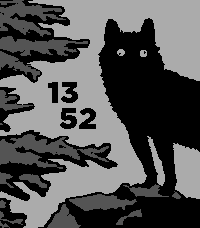</a>

<h2 class="app-name" id="app-05a9473410184f44bead9383"><a href="https://apps.repebble.com/05a9473410184f44bead9383">Nocturnal Thing</a></h2>
<a class="app-source" href="https://github.com/sevonj/pbl-nocturnal-thing" title="Source code" data-search-exclude>View source</a>

by <a href="https://apps.repebble.com/apps/dev/sevonj_672d1117136b8b075ec492c0" title="More from this developer">Sevonj</a>

Not checked yet v0.0.2 Updated 2026-07-12

Runs on: Round 2, Time 2

A nightly creature. I ordered a Round 2 and tried building my own watchface while waiting for it. It&#x27;s minimal, native, and updates the screen once a minute, so hopefully it&#x27;ll eat very little…

<a class="app-shot" href="https://apps.rebble.io/en_US/application/5a627fb80dfc322b45002073" data-search-exclude>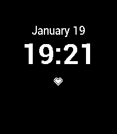</a>

<h2 class="app-name" id="app-5a627fb80dfc322b45002073"><a href="https://apps.rebble.io/en_US/application/5a627fb80dfc322b45002073">NoLostPhone</a></h2>
<a class="app-source" href="https://github.com/krtonga/NoLostPhone" title="Source code" data-search-exclude>View source</a>

by <a href="https://apps.rebble.io/en_US/developer/5448ff0897cb85037b000081/1" title="More from this developer">krtonga</a>

Not checked yet v1.2 Updated 2018-02-01 Rebble App Store

Runs on: Round 2, Time 2, Pebble 2 Duo, Pebble 2, Time Round, Time, Classic

This watchface was inspired by my absent minded tendency to leave my phone behind when I&#x27;m in a hurry. I wanted to be informed when bluetooth disconnects, so I can turn around immediately and go…

<h2 class="app-name" id="app-6959fce216fdf50009c6a89f"><a href="https://apps.rebble.io/en_US/application/6959fce216fdf50009c6a89f">Nomai</a></h2>
<a class="app-source" href="https://github.com/flynnD273/pebble-nomai" title="Source code" data-search-exclude>View source</a>

by <a href="https://apps.rebble.io/en_US/developer/67bd48a737d408000a74f7d7/1" title="More from this developer">Flynn Duniho</a>

Not checked yet v2.02.2 Updated 2026-07-10 Rebble App Store

Runs on: Round 2, Time 2, Pebble 2 Duo, Pebble 2, Time Round, Time, Classic

Inspired by Outer Wilds, this displays a Nomai mask when idle, and shows the time, date, and battery level upon shaking.

<h2 class="app-name" id="app-561ee5ea27d473398a000006"><a href="https://apps.repebble.com/561ee5ea27d473398a000006">Noon at the top 24h</a></h2>
<a class="app-source" href="https://github.com/KoFish/pebble-nat24h" title="Source code" data-search-exclude>View source</a>

by <a href="https://apps.repebble.com/apps/dev/krister-svanlund_56161dbb9227ff852d000061" title="More from this developer">Krister Svanlund</a>

MIT v1.1 Updated 2015-10-15

Runs on: Time 2, Time

A very simple 24h watchface with noon at the top as it should be.

<h2 class="app-name" id="app-5357a79853dfbf163300004d"><a href="https://apps.repebble.com/5357a79853dfbf163300004d">noondaymoon</a></h2>
<a class="app-source" href="https://github.com/noondaymoon/watchface" title="Source code" data-search-exclude>View source</a>

by <a href="https://apps.repebble.com/apps/dev/noondaymoon_52edfc75ffcd25e2ca000001" title="More from this developer">noondaymoon</a>

Not checked yet v2.2 Updated 2015-11-08

Runs on: Round 2, Time 2, Pebble 2 Duo, Pebble 2, Time Round, Time, Classic

It&#x27;s simple watchface. displays time, date, battery, and bluetooth.

<h2 class="app-name" id="app-54177f619c8c02562f00003c"><a href="https://apps.repebble.com/54177f619c8c02562f00003c">Norsk</a></h2>
<a class="app-source" href="https://github.com/AndrewJazbec/pebble-norsk" title="Source code" data-search-exclude>View source</a>

by <a href="https://apps.repebble.com/apps/dev/andrew-jazbec_5381121461e8e27727000175" title="More from this developer">Andrew Jazbec</a>

No licence v3.0 Updated 2014-09-16

Runs on: Time 2, Pebble 2 Duo, Pebble 2, Time, Classic

Originally created by asbkar Modified by request of /u/remsters or reddit

<h2 class="app-name" id="app-52eacc5feaff130525000013"><a href="https://apps.repebble.com/52eacc5feaff130525000013">Norsk</a></h2>
<a class="app-source" href="https://github.com/asbkar/pebble-norsk" title="Source code" data-search-exclude>View source</a>

by <a href="https://apps.repebble.com/apps/dev/asbkar_52eac69c916facc2b2000021" title="More from this developer">asbkar</a>

No licence v2.5 Updated 2015-05-02

Runs on: Time 2, Pebble 2 Duo, Pebble 2, Time, Classic

Norwegian pebble watchface. Writes the current time and date in plain norwegian. Based on the fuzzy time example watch app from Pebble, but without fuzzying the time.

<h2 class="app-name" id="app-541c282048a6575dbf00008e"><a href="https://apps.repebble.com/541c282048a6575dbf00008e">North Analog</a></h2>
<a class="app-source" href="https://github.com/pebble-hacks/north-analog" title="Source code" data-search-exclude>View source</a>

by <a href="https://apps.repebble.com/apps/dev/ron64_52cf94eff726c8d1d5000038" title="More from this developer">Ron64</a>

Not checked yet v2.0 Updated 2016-09-30

Runs on: Round 2, Time 2, Pebble 2 Duo, Pebble 2, Time Round, Time, Classic

North Analog

<h2 class="app-name" id="app-52e11faafae0b7603000021c"><a href="https://apps.repebble.com/52e11faafae0b7603000021c">Nortid</a></h2>
<a class="app-source" href="http://github.com/brujoand/nortid" title="Source code" data-search-exclude>View source</a>

by <a href="https://apps.repebble.com/apps/dev/brujoand_52a93e9b79c18f9ede00001d" title="More from this developer">brujoand</a>

No licence v6.17.0 Updated 2026-07-14

Runs on: Round 2, Time 2, Pebble 2 Duo, Pebble 2, Time Round, Time, Classic

This watchface shows the time in norwegian text, and has a date. Nice and simple

<h2 class="app-name" id="app-d19443a35c6240ccaca492f5"><a href="https://apps.repebble.com/d19443a35c6240ccaca492f5">Nostalgic Commander</a></h2>
<a class="app-source" href="https://github.com/bemyak/nostalgic_commander" title="Source code" data-search-exclude>View source</a>

by <a href="https://apps.repebble.com/apps/dev/bemyak_9256eb89addd27c58ee5b339" title="More from this developer">bemyak</a>

Other v1.9.0 Updated 2026-08-30

Runs on: Time 2

Your watch, circa 1992. Nostalgic Commander turns your Pebble Time 2 into a DOS-era panel: cyan frames over Norton blue, an IBM VGA bitmap font, caption-titled status bars, solid block-glyph…

<h2 class="app-name" id="app-54168166247a034d440000be"><a href="https://apps.repebble.com/54168166247a034d440000be">Not Sure if AM or PM</a></h2>
<a class="app-source" href="https://github.com/nicktendo64/not-sure-if/" title="Source code" data-search-exclude>View source</a>

by <a href="https://apps.repebble.com/apps/dev/nicholas-currault_52c908c66025fc11fa00003a" title="More from this developer">Nicholas Currault</a>

Not checked yet v2.2 Updated 2015-12-16

Runs on: Round 2, Time 2, Pebble 2 Duo, Pebble 2, Time Round, Time, Classic

This watchface is based on the &quot;not sure if&quot; Internet meme, which is in turn based on the TV series Futurama. Inspired by a reddit post: http://redd.it/2g6igt Made with CloudPebble.

<h2 class="app-name" id="app-52ed2a68281749bdca000036"><a href="https://apps.repebble.com/52ed2a68281749bdca000036">Note to Self</a></h2>
<a class="app-source" href="https://github.com/VGraupera/note-to-self-watchface" title="Source code" data-search-exclude>View source</a>

by <a href="https://apps.repebble.com/apps/dev/vidal-graupera_52cd5df49505d12f12000056" title="More from this developer">Vidal Graupera</a>

MIT v1.0.1 Updated 2014-02-02

Runs on: Time 2, Pebble 2 Duo, Pebble 2, Time, Classic

Add a note to yourself that will be shown along with the date and time. Useful to keep track of goals, reminders, etc.

<h2 class="app-name" id="app-52de1abfe43bba3355000041"><a href="https://apps.repebble.com/52de1abfe43bba3355000041">Notification Face</a></h2>
<a class="app-source" href="https://github.com/retro486/notification_face" title="Source code" data-search-exclude>View source</a>

by <a href="https://apps.repebble.com/apps/dev/russ-bernhardt_52de195981cae2494300004e" title="More from this developer">Russ Bernhardt</a>

Not checked yet v1.0.0 Updated 2014-01-21

Runs on: Time 2, Pebble 2 Duo, Pebble 2, Time, Classic

Notification Face is a Pebble 2.0 Watchface. It requires my PebbleNotifier Android app and the Pebble 2.0 beta firmware in order to work.

<h2 class="app-name" id="app-54f9ef5ecf94589617000071"><a href="https://apps.repebble.com/54f9ef5ecf94589617000071">Notre Dame Watchface</a></h2>
<a class="app-source" href="https://github.com/dmattia/NDPebbleWatchFace" title="Source code" data-search-exclude>View source</a>

by <a href="https://apps.repebble.com/apps/dev/david_53768e138c2698c4b300005f" title="More from this developer">David</a>

Not checked yet v1.0 Updated 2015-03-06

Runs on: Time 2, Pebble 2 Duo, Pebble 2, Time, Classic

A watchface for Notre Dame fans featuring an outline of the golden dome.

<h2 class="app-name" id="app-89815d6e72344d768f32376d"><a href="https://apps.repebble.com/89815d6e72344d768f32376d">now</a></h2>
<a class="app-source" href="https://github.com/vladcoretchi/pebble-watchface-now" title="Source code" data-search-exclude>View source</a>

by <a href="https://apps.repebble.com/apps/dev/vlad_502b2e5a040090c92bce7adf" title="More from this developer">Vlad</a>

Not checked yet v1.0.0 Updated 2026-08-21

Runs on: Round 2, Time 2, Pebble 2 Duo, Pebble 2, Time Round, Time, Classic

The only watchface that has never once been wrong. It says &quot;now&quot;. It&#x27;s always now, so it&#x27;s always right - no syncing, no drift, no leap seconds, no arguing with the atomic clock. You can pick a…

<h2 class="app-name" id="app-56d7347ec2d302cc61000026"><a href="https://apps.repebble.com/56d7347ec2d302cc61000026">Now Watchface</a></h2>
<a class="app-source" href="https://github.com/unneuron/now-watchface" title="Source code" data-search-exclude>View source</a>

by <a href="https://apps.repebble.com/apps/dev/david-emanuel-oprea_566090920ea7f7ba9f00005b" title="More from this developer">David Emanuel Oprea</a>

Not checked yet v1.5 Updated 2016-03-08

Runs on: Time 2, Pebble 2 Duo, Pebble 2, Time, Classic

Simple watchface that displays a text instead of time. You may customize it to have your own text, or even motivational small phrases. However, if you want to see the time, just shake your hand.

<h2 class="app-name" id="app-5f697808141542259ee82241"><a href="https://apps.repebble.com/5f697808141542259ee82241">Now: Time</a></h2>
<a class="app-source" href="https://github.com/atomlabor/Now-Time" title="Source code" data-search-exclude>View source</a>

by <a href="https://apps.repebble.com/apps/dev/atomlabor_5c1e0bc226259d0001915df5" title="More from this developer">atomlabor</a>

No licence v1.0 Updated 2026-04-09

Runs on: Round 2, Time 2, Pebble 2 Duo, Pebble 2, Time Round, Time, Classic

NOW: Time - The Retro MP3 Watchface Turn your Pebble into a classic digital music player. NOW: Time combines pure early-2000s nostalgia with modern smartwatch features, bringing your current…

<h2 class="app-name" id="app-52b1f48205c046f90f000011"><a href="https://apps.repebble.com/52b1f48205c046f90f000011">Nubis Watchapp</a></h2>
<a class="app-source" href="https://github.com/nubisonline/pebble-watchapp" title="Source code" data-search-exclude>View source</a>

by <a href="https://apps.repebble.com/apps/dev/nubis_52b1f333cd4183748a00000f" title="More from this developer">Nubis</a>

Not checked yet v2.0.0 Updated 2013-12-18

Runs on: Time 2, Pebble 2 Duo, Pebble 2, Time, Classic

Pretty useless, but pretty.

<h2 class="app-name" id="app-54d67f6ec9b17face100000d"><a href="https://apps.repebble.com/54d67f6ec9b17face100000d">NUMBERS</a></h2>
<a class="app-source" href="http://synchronar.blogspot.jp/p/store.html" title="Source code" data-search-exclude>View source</a>

by <a href="https://apps.repebble.com/apps/dev/utdesign_52e4c32a8af579004f0001d6" title="More from this developer">UTDESIGN</a>

See source v1.0 Updated 2015-02-07

Runs on: Time 2, Pebble 2 Duo, Pebble 2, Time, Classic

216 numbers design watchface. The screen shot shows 00:00,04:40,18:18,21:48. CAUTION : This watchface is 24-hour mode only.

<h2 class="app-name" id="app-619d52d0535326000935a5be"><a href="https://apps.rebble.io/en_US/application/619d52d0535326000935a5be">Nume-rebble</a></h2>
<a class="app-source" href="https://github.com/kvark85/nume-rebble_watchface" title="Source code" data-search-exclude>View source</a>

by <a href="https://apps.rebble.io/en_US/developer/5d3164fa299bf40001a6fa58/1" title="More from this developer">Kvark85</a>

Not checked yet v1.1 Updated 2021-11-28 Rebble App Store

Runs on: Round 2, Time 2, Pebble 2 Duo, Pebble 2, Time Round, Time, Classic

Watchface with big wonderful numbers

<h2 class="app-name" id="app-576123f90c185a4063000030"><a href="https://apps.repebble.com/576123f90c185a4063000030">Nursewatch</a></h2>
<a class="app-source" href="https://github.com/Quistnix/Pebble-nurse" title="Source code" data-search-exclude>View source</a>

by <a href="https://apps.repebble.com/apps/dev/brain-in-a-bowl_56fa41f03f944de56b000023" title="More from this developer">Brain in a Bowl</a>

No licence v1.1 Updated 2016-06-15

Runs on: Round 2, Time 2, Pebble 2 Duo, Pebble 2, Time Round, Time, Classic

Made on request, with a focus on functionality over looks. Features: - both 24 and 12 hour display - seconds - current date - battery indicator

<h2 class="app-name" id="app-55fc96d20a54828cc7000014"><a href="https://apps.repebble.com/55fc96d20a54828cc7000014">NW Schedule</a></h2>
<a class="app-source" href="https://github.com/Rossmallow/NW-Schedule-Watchface/blob/master/src/main.c" title="Source code" data-search-exclude>View source</a>

by <a href="https://apps.repebble.com/apps/dev/rossmallow_55515dcbe979af62610000a1" title="More from this developer">Rossmallow</a>

No licence v1.0 Updated 2015-09-20

Runs on: Time 2, Pebble 2 Duo, Pebble 2, Time, Classic

A watch face that displays the current period and when it ends on the regular bell schedule at Niles West High School. User Guide: &quot;Period&quot;, along with stating numbers that correspond with the…

<h2 class="app-name" id="app-549ccec5cf9f60b79e0000e9"><a href="https://apps.repebble.com/549ccec5cf9f60b79e0000e9">NWeather Face</a></h2>
<a class="app-source" href="https://github.com/c1phr/NWeatherFace" title="Source code" data-search-exclude>View source</a>

by <a href="https://apps.repebble.com/apps/dev/c1phr_546a947ee05288340800003e" title="More from this developer">c1phr</a>

Not checked yet v2.0 Updated 2015-05-02

Runs on: Time 2, Pebble 2 Duo, Pebble 2, Time, Classic

Simple watch face with weather data taken from the National Oceanic and Atmospheric Administration (NOAA). Location data is taken by GPS only.

<h2 class="app-name" id="app-55566afbef1c155748000039"><a href="https://apps.repebble.com/55566afbef1c155748000039">Nyan Cat</a></h2>
<a class="app-source" href="https://github.com/mhungerford" title="Source code" data-search-exclude>View source</a>

by <a href="https://apps.repebble.com/apps/dev/matthew-hungerford_52bca741d438930a650001b6" title="More from this developer">Matthew Hungerford</a>

Not checked yet v1.0 Updated 2015-05-15

Runs on: Time 2, Time

Nyan Cat for Pebble Animates on Flick visit http://www.nyan.cat

<h2 class="app-name" id="app-5936d5e70dfc326f9c000ea5"><a href="https://apps.rebble.io/en_US/application/5936d5e70dfc326f9c000ea5">NYCTA Map Face</a></h2>
<a class="app-source" href="https://github.com/djlevine/NYCTA_watchface" title="Source code" data-search-exclude>View source</a>

by <a href="https://apps.rebble.io/en_US/developer/54106f95816f735f200001ba/1" title="More from this developer">DLevine.us</a>

Not checked yet v1.2 Updated 2017-08-02 Rebble App Store

Runs on: Round 2, Time 2, Pebble 2 Duo, Pebble 2, Time Round, Time, Classic

Watch face based on the Vignelli style NYC Subway map. - The 6th Avenue line (vertical lines) display the time - The Shuttle line (top horizontal) displays AM or PM Screenshot with back light on…

<h2 class="app-name" id="app-58dac0a90dfc32fe6000073f"><a href="https://apps.rebble.io/en_US/application/58dac0a90dfc32fe6000073f">NYCTime</a></h2>
<a class="app-source" href="https://github.com/djlevine/NYCTimeColor" title="Source code" data-search-exclude>View source</a>

by <a href="https://apps.rebble.io/en_US/developer/54106f95816f735f200001ba/1" title="More from this developer">DLevine.us</a>

Not checked yet v3.31 Updated 2017-06-07 Rebble App Store

Runs on: Round 2, Time 2, Pebble 2 Duo, Pebble 2, Time Round, Time, Classic

New York Subway Watchface - Design inspired by NYCT platform signage - Time displayed in transit inspired colors - The upper text cycles through popular stop names as displayed on the platform…

<h2 class="app-name" id="app-60a7dd07a44f475998f61c31"><a href="https://apps.repebble.com/60a7dd07a44f475998f61c31">Nyquist</a></h2>
<a class="app-source" href="https://github.com/truhanen/pebble-nyquist-watchface" title="Source code" data-search-exclude>View source</a>

by <a href="https://apps.repebble.com/apps/dev/tuukka-ruhanen_2a1ec999749817a461025038" title="More from this developer">Tuukka Ruhanen</a>

Not checked yet v1.3.0 Updated 2026-07-02

Runs on: Round 2, Time 2

Readable analog watchface with bold hands, weather, battery, and date. Configuration options - Show/hide corner elements (Pebble Time 2 only) - Invert black/white colors - Time format 24h/12h

