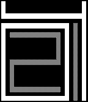
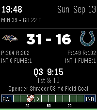
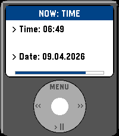

<!-- Generated by scripts/update_app_directory.py: do not edit by hand -->
# Watchfaces: N

[← About this list](../watchfaces.md) · [A](a.md) · [B](b.md) · [C](c.md) · [D](d.md) · [E](e.md) · [F](f.md) · [G](g.md) · [H](h.md) · [I](i.md) · [J](j.md) · [K](k.md) · [L](l.md) · [M](m.md) · **N** · [O](o.md) · [P](p.md) · [Q](q.md) · [R](r.md) · [S](s.md) · [T](t.md) · [U](u.md) · [V](v.md) · [W](w.md) · [X](x.md) · [Y](y.md) · [Z](z.md) · [0–9 & other](other.md)

*84 watchfaces · Last updated 2026-10-06*

| Screenshot | Name | Developer | Licence | Updated | Description |
|------------|------|-----------|---------|---------|-------------|
| { loading=lazy width="72" } | [N2W](https://apps.repebble.com/57f8a6fa56fda5acf1000094) | [Roger Leblanc](https://github.com/RodgerLeblanc/N2W) | <small>Not checked yet</small> | 2017-01-10 | Get your notification icons on your Pebble and stop glancing at your phone every 2 minutes to see if you have unread notifications. Supports all major… |
|  | [N88KA](https://apps.rebble.io/en_US/application/5351c91c27e150b0b300003a) <small>Rebble App Store</small> | [Sawyer Pangborn](http://github.com/spangborn/pebble-n8) | <small>No licence</small> | 2025-12-01 | N88KA watchface. |
| { loading=lazy width="72" } | [Nadir](https://apps.rebble.io/en_US/application/53298e8c73a31ab04d0003a3) <small>Rebble App Store</small> | [Jack T.](https://github.com/PanicMan/Pebble-Nadir) | <small>Not checked yet</small> | 2016-01-19 | As requested here an Watchface Clone of an Nadir Watch. This is the Original: http://projectswatches.com/shop/nadir/#prettyPhoto Here the Request… |
| { loading=lazy width="72" } | [Naive](https://apps.rebble.io/en_US/application/69469023828bd90009075f2d) <small>Rebble App Store</small> | [irek](https://github.com/ir33k/naive) | <small>Not checked yet</small> | 2025-12-20 | Big abstract looking numbers with rounded features and 4 lines of customizable text. In comparison to Brutal (my previous watchface) this tries to take… |
| { loading=lazy width="72" } | [Naos](https://apps.repebble.com/834e091d4fea4f5387e7e117) | [MXVI](https://github.com/MVogge/pebble-naos-watchface) | <small>Not checked yet</small> | 2026-04-14 | A clean, minimalist analog watchface inspired by the iconic Sternglas Naos timepiece. Features different color themes, optional date display, and optional… |
| { loading=lazy width="72" } | [Nasty Woman](https://apps.rebble.io/en_US/application/5a3acf170dfc32dba00014d2) <small>Rebble App Store</small> | [David Morgan](https://github.com/Spitemare/nasty-woman) | <small>Not checked yet</small> | 2017-12-20 | Such a nasty woman. |
| { loading=lazy width="72" } | [Natural](https://apps.rebble.io/en_US/application/53e92b66d145e76860000069) <small>Rebble App Store</small> | [Tom Hettinger](https://github.com/tomhettinger/natural) | <small>Not checked yet</small> | 2015-11-01 | Displays day/night cycle, phases, and positions using a natural "horizon" style 24-hour analog face. • Sunrise / Sunset times from OpenWeatherMap.org •… |
| { loading=lazy width="72" } | [Natural Earth](https://apps.repebble.com/565b94b54f2675185500000a) | [chops](https://github.com/mereed/pebbleface-naturalearth) | <small>Not checked yet</small> | 2016-07-28 | The original idea for this simple watchface came from another project i'm working on - creating a world map (in three parts, each about 2m high x 1.5m… |
| { loading=lazy width="72" } | [Nausicaa Glider](https://apps.repebble.com/f117fb3ec20e45f3b03781a2) | [Sapphire Second-Hand](https://github.com/shoepaladin/kiwi-cup/tree/main/pebble/nausicaa-glider-m-wf) | <small>Not checked yet</small> | 2026-05-19 | Track the time, weather, steps, and battery with Nausicaa. Colors invert when BT disconnects. Image credit to Umineko97… |
| { loading=lazy width="72" } | [NCC-1701D LCARS TOM](https://apps.rebble.io/en_US/application/61a966430b40e40009c75fd3) <small>Rebble App Store</small> | [TOM](https://github.com/franc6/Pebble1701LCARS) | <small>Not checked yet</small> | 2021-12-03 | This is a derivative of NCC-1701D LCARS, with support for Yahoo Weather, Quiet Time status, day of year, corrected 12-hour display, and some other bug fixes. |
| { loading=lazy width="72" } | [NCC-1701D LCARS v1](https://apps.repebble.com/57adf202bb85edbc76000241) | [David Watson](https://github.com/ddwatson/Pebble1701LCARS) | <small>Not checked yet</small> | 2017-05-17 | Everyone: Idle and Sleep are now fixed and respond to the settings The captain has assigned the task of implementing an effective display for his wrist… |
| { loading=lazy width="72" } | [NDS Pebble](https://apps.repebble.com/69128a83b3a19d000827a950) | [Arenovas](https://github.com/Arenovas/nds-pebble) | MIT | 2026-02-25 | A recreation of the NDS BIOS clock screen, featuring time, date, bluetooth icon, and battery life. |
| { loading=lazy width="72" } | [Nearly Time](https://apps.repebble.com/ec086ce0bfe44c8abc0fed57) | [Ambient Time](https://github.com/lukeslp/pebble-anti-grid) | <small>Not checked yet</small> | 2026-10-05 | The hands are correct, the markers are sloppy. It's irritating! And configurable. Configurably irritating! lukesteuber.com |
| { loading=lazy width="72" } | [Necaxa](https://apps.repebble.com/c5f6128ec517404e8f9fde66) | [GeoDevMx](https://github.com/GeoPebbleMx/necaxa-watchface-config) | <small>No licence</small> | 2026-07-23 | Me di cuenta que el glorioso Club Necaxa de México no tenía presencia en ninguna appstore (para smartwatches) del mundo, así que decidí cambiar eso. Tiene… |
| { loading=lazy width="72" } | [Neko Wristmate](https://apps.repebble.com/4c25df439af543d19c98630a) | [Coconauts](https://github.com/coconauts/pebble-neko-watchface) | <small>Not checked yet</small> | 2026-04-17 | Neko, the iconic screenmate mascot from the 90s, now in your wrist! An animated neko will play around in your watch. After a while, it will grow tired and… |
| { loading=lazy width="72" } | [NEM_HARVESTING_WATCHER](https://apps.rebble.io/en_US/application/5a4c169c0dfc323bd000428c) <small>Rebble App Store</small> | [mincoshi](https://github.com/mijinc0/PebbleNEM) | <small>Not checked yet</small> | 2018-01-06 | NEMのハーベスティングの状態を監視できる簡単なWatchFaceです。スマホの設定画面でセットしたNEMアドレスの委任ハーベストの状態(active,inactive)を監視できます。このアプリが正常に動作するためにはbluetoothによりpebbleとスマホを接続し、スマホはインターネットに接続されている必… |
| { loading=lazy width="72" } | [Neo Morph](https://apps.repebble.com/3d68f2f6e539487f98d58540) | [Unknown](https://github.com/parizeaujj/neo-morph) | <small>Not checked yet</small> | 2026-08-14 | A neumorphic watchface with two bevel-frame tiles that fill clockwise to show the time. Configurable top and bottom rows display battery, date, or live… |
| { loading=lazy width="72" } | [Neolog Watchface](https://apps.rebble.io/en_US/application/55e2f0fa4af009458900001e) <small>Rebble App Store</small> | [TechnicalGuru](https://svn.ralph-schuster.eu/svn/OSS/neolog) | <small>Not checked yet</small> | 2015-09-30 | Adds the wonderful Neolog watch to Pebble Time. The watch face displays time as collections. Just count the bars in each pile. The time shown at the… |
| { loading=lazy width="72" } | [Neon IO X Eclipse](https://apps.repebble.com/8e797a6fa67645d49c14d62d) | [Beathoven](https://github.com/msteinhoefel/NeonIOXEclipse) | <small>Not checked yet</small> | 2026-07-31 | The old neon tube classic, but even more abstract. Like my other watchface, Neon IO X Reborn, this is, in essence, a remake of Sam Jerichow's popular Neon… |
| { loading=lazy width="72" } | [Neon IO X Reborn](https://apps.repebble.com/12874117325c4b84b85f31f8) | [Beathoven](https://github.com/msteinhoefel/NeonIOXReborn) | <small>Not checked yet</small> | 2026-07-30 | The popular neon tube classic - now fully customizable! The original Neon IO X by Sam Jerichow is my favorite watch face by far. Unfortunately, I didn't… |
| { loading=lazy width="72" } | [Neralie](https://apps.repebble.com/68df20e3a6f9880008c5ff5f) | [Chloe Greene](https://git.sr.ht/~angelwood/uxn-pebble/) | <small>See source</small> | 2026-01-04 | The Neralie clock has two groups of 3 digits, called the beat & the pulse. A beat contains 1000 pulses, and equivalent to 86.4 seconds. A day is 1000 beats… |
| { loading=lazy width="72" } | [NERV](https://apps.rebble.io/en_US/application/603fc6611342ae01e302d010) <small>Rebble App Store</small> | [prayerie](https://github.com/mistyhands/pebble-nerv/) | <small>Not checked yet</small> | 2021-06-27 | A Neon Genesis Evangelion themed watchface. Battery is in the top-left and shown in four bars. The weather status is shown via a red indicator and… |
| { loading=lazy width="72" } | [Nested Numbers](https://apps.rebble.io/en_US/application/6914d0347cdf9d000998324d) <small>Rebble App Store</small> | [David Peer](https://github.com/peerdavid/pebble-nested-numbers) | <small>Not checked yet</small> | 2026-03-23 | A simple watch face with large numbers. The numbers are nested so always read from left to right and inside to the outside. It also implements a menu that… |
| { loading=lazy width="72" } | [NestedNumbers](https://apps.repebble.com/d824a71853744a26b726ffb1) | [David Peer](https://github.com/peerdavid/pebble-nested-numbers) | <small>Not checked yet</small> | 2026-03-23 | A simple watch face with large numbers. The numbers are nested so always read from left to right and inside to the outside. It also implements a menu that… |
| { loading=lazy width="72" } | [Neubrutalism](https://apps.repebble.com/6959d36624ba4b0008d50149) | [Yorks0n](https://github.com/Yorks0n/neubrutalism) | <small>Not checked yet</small> | 2026-08-03 | A watchface inspired by neubrutalism design aesthetic. |
| { loading=lazy width="72" } | [Neubrutalism+](https://apps.repebble.com/6cb18ef9886442ffb67b4d5b) | [aliofye](https://github.com/aliofye/pebble-neubrutalism) | <small>Not checked yet</small> | 2026-09-11 | Neubrutalism+ A bold, chunky watchface that brings the neubrutalism design aesthetic to your wrist: thick black outlines, hard color blocks, and a… |
| { loading=lazy width="72" } | [Never Trust Fish](https://apps.rebble.io/en_US/application/5b01e946461a8d22e3000ec9) <small>Rebble App Store</small> | [cakdas](https://github.com/canerakdas/Fishface) | <small>Not checked yet</small> | 2018-05-22 | Simple watchface |
| { loading=lazy width="72" } | [New Relic Watchface](https://apps.rebble.io/en_US/application/52dab3b1889f5dc9eb0001a3) <small>Rebble App Store</small> | [Chris Regado](http://github.com/ChrisRegado/newrelic-watch) | MIT | 2014-02-07 | The New Relic Watchface puts key performance metrics from your New Relic-monitored web app on your wrist. It will automatically update at a regular interval… |
| { loading=lazy width="72" } | [NewFuzzyClckwCalTR](https://apps.rebble.io/en_US/application/53f5ea07e0122978f0000172) <small>Rebble App Store</small> | [Ersin Durna](https://github.com/ersindurna/FuzzyTurkishWithCalendar) | <small>Not checked yet</small> | 2014-08-21 | Turkish Fuzzy Watchface with calendar, Bluetooth connection status icon (if out ouf range vibration), Battery (both as a number and icon) and digital clock |
| { loading=lazy width="72" } | [NextTrain](https://apps.rebble.io/en_US/application/52cb23ccb138287fc8000050) <small>Rebble App Store</small> | [kije-dev](https://github.com/kije/NextTrain) | <small>Not checked yet</small> | 2014-05-11 | A Pebble watchface, that shows you the next public transportations (bus, tram, train, etc...) departing from or nearby your current location. It will also… |
| { loading=lazy width="72" } | [NFL Live Scores](https://apps.repebble.com/6c0eeeaeb5484d4f99a1f030) | [Brooman Inks](https://github.com/brooks2564/Pebble-NFL-Live) | <small>Not checked yet</small> | 2026-09-14 | NFL Live Scores for Pebble Stuck in a meeting? Can't watch the game? Don't worry - keep the score on your wrist. NFL Live Scores updates every minute… |
| { loading=lazy width="72" } | [NFL Live Scores](https://apps.rebble.io/en_US/application/6aa74d38e3f541000995a8df) <small>Rebble App Store</small> | [Brooman Inks](https://github.com/brooks2564/Pebble-NFL-Live) | <small>Not checked yet</small> | 2026-09-14 | NFL Live Scores for Pebble Stuck in a meeting? Can't watch the game? Don't worry - keep the score on your wrist. NFL Live Scores updates every minute… |
| { loading=lazy width="72" } | [NHL Live Scores](https://apps.repebble.com/43c6b549267b48e5abd78dca) | [Brooman Inks](https://github.com/brooks2564/Pebble-NHL-Live) | <small>Not checked yet</small> | 2026-10-03 | NHL Scores |
| { loading=lazy width="72" } | [Night Shift](https://apps.repebble.com/2b5413279c4b429f803e8098) | [Blake Winton](https://github.com/bwinton/night-shift) | <small>Not checked yet</small> | 2026-06-28 | A pebble watchface for fans of Game Changer S08E03. |
| { loading=lazy width="72" } | [Night Stand](https://apps.repebble.com/562c5bd49e0d460340000050) | [L Trevor Davies](https://github.com/trevordavies095/NightStand) | <small>Not checked yet</small> | 2016-08-08 | Simple clean watch face with a classic digital clock feel. FEATURES: Backlight always on if the watch is charging so you can actually use it as a night stand. |
| { loading=lazy width="72" } | [Night Switch](https://apps.rebble.io/en_US/application/550ef6e8e0b81de83c00000c) <small>Rebble App Store</small> | [Easton](https://github.com/snacsnoc/nightswitch-pebble) | <small>Not checked yet</small> | 2015-07-14 | A watch face that inverts at night and in the morning. At night the watch face shows white text and black background for easier reading, then inverts the… |
| { loading=lazy width="72" } | [NightFace](https://apps.repebble.com/56f9e26f69581dad78000025) | [GaetaWoo](https://github.com/gaetawoo/Pebble_NightFace) | <small>Not checked yet</small> | 2016-06-21 | The PERFECT watchface for sleeping humans! Since you don't need to know the time, or have Pebble update the time, whilst you sleep... NightFace keeps the… |
| { loading=lazy width="72" } | [Nightscout](https://apps.rebble.io/en_US/application/543bfbbcecc29baad0000007) <small>Rebble App Store</small> | [Nightscout contributors](https://github.com/nightscout/cgm-pebble) | <small>Not checked yet</small> | 2015-11-23 | Display Nightscout data on your pebble watch. Support for mg/dL and mmol units. |
| { loading=lazy width="72" } | [Nightscout Double Vision](https://apps.rebble.io/en_US/application/5e7449b43dd3109103feea94) <small>Rebble App Store</small> | [swansswansswansswanssosoft](https://github.com/pauleeeeee/nightscout-double-vision) | <small>Not checked yet</small> | 2021-01-05 | Nightscout Double Vision allows you to track two people with Type-1 Diabetes (T1D) and display their Nightscout information on one Pebble watchface. Double… |
| { loading=lazy width="72" } | [Nightscout Supercgm](https://apps.repebble.com/68c5e8d5474b97000932ae2c) | [sgitaize](https://github.com/sgitaize/Nightscout-supercgm) | <small>Not checked yet</small> | 2026-09-28 | The ultimate Nightscout watchface for every Pebble. Five fully configurable rows — each independently set to any data source you need, in your color. ROWS… |
| { loading=lazy width="72" } | [NineLives](https://apps.repebble.com/c7673ccc115f4cea9c5194d8) | [Mohammad Nadeem](https://github.com/mnadev/ninelives) | <small>Not checked yet</small> | 2026-06-12 | Step or Ded is a Pebble watchface that turns your daily steps into a virtual pet survival game. Your cat lives on your wrist — and it only survives if you… |
| { loading=lazy width="72" } | [Ninety Fank](https://apps.rebble.io/en_US/application/53f128610a696f60d7000165) <small>Rebble App Store</small> | [Fa](http://www.mypebblefaces.com/apps/25276/11200/) | <small>See source</small> | 2014-08-17 | Derived from ninety hank 2 (available on github) from hank, but: * no week number (dev note: the code is still there, commented out) * smaller and simpler… |
| { loading=lazy width="72" } | [Ninety Hank (Original)](https://apps.repebble.com/52bc497d7e4312a758000149) | [Hank](https://github.com/pebl-hank/ninety_hank_2) | <small>Not checked yet</small> | 2016-11-16 | Please give me your HEART if you like the Watchface. That is essential to bring it to the wide public. Pebble Time support with COLORS Now with full… |
| { loading=lazy width="72" } | [NINETY HANK FRENCH](https://apps.rebble.io/en_US/application/539a6507ae2277e49f00005f) <small>Rebble App Store</small> | [Dersie](https://github.com/dersie/ninety_hank_fr) | <small>Not checked yet</small> | 2014-06-13 | Ninety_Hank french version from original Ninety_Hank by Hank based on official 91 Dub TimeZone UTC and New York Coordinates EST France See Universal version… |
| { loading=lazy width="72" } | [Ninety_Hank_DK](https://apps.rebble.io/en_US/application/53d28f9c15466c6e5e000053) <small>Rebble App Store</small> | [HBTeicher](https://github.com/HBTeicher/Ninety_Hank_DK) | <small>No licence</small> | 2014-07-25 | Danish version of Ninety_Hank by Hank, based on 91 Dub. Useful for planning my morning/evening runs before darkness falls! -Sunrise/set for 56.7° N, 8.2° E… |
| { loading=lazy width="72" } | [Ninja Strike](https://apps.repebble.com/52ce401057174411a5200265) | [AirCodum](https://github.com/coredevices/pebble-watchface-agent-skill) | <small>Not checked yet</small> | 2026-04-17 | A fruit-ninja style watchface. Every minute a ninja dashes across the time, katana trailing neon, slicing it in half before the pieces snap back together… |
| { loading=lazy width="72" } | [Nintendo Switch 2](https://apps.repebble.com/67c648a1b7a02300092ba0c8) | [robinfire110](https://github.com/robinfire110/switch-2-watchface) | <small>Not checked yet</small> | 2026-07-19 | Made in celebration of the 8 year anniversary of the Nintendo Switch for the Rebble Hackathon #002. Originally, a watchface to count down to the system's… |
| { loading=lazy width="72" } | [Nix](https://apps.rebble.io/en_US/application/54974cada8c1257044000023) <small>Rebble App Store</small> | [cscott](https://github.com/cscott/pebble-nix) | <small>Not checked yet</small> | 2015-06-24 | A "nix" style watchface for pebble. The number of filled squares in each group gives the digits in the current time. Hours are at the top. The pattern of… |
| { loading=lazy width="72" } | [Nixed](https://apps.rebble.io/en_US/application/554a5efc93cc44482d0000ac) <small>Rebble App Store</small> | [Paul Ruane](https://github.com/oniony/Nixed) | <small>Not checked yet</small> | 2015-05-08 | A watchface inspired by the soft, neon-orange glow of the precursor to the modern LCD. |
| { loading=lazy width="72" } | [Nixi](https://apps.repebble.com/57d2abadffca49e6d100007f) | [Merlin](https://github.com/0merlin/pebble_watch) | <small>No licence</small> | 2016-11-11 | This watchface displays the following information: * Current time * Current date * Current day * Battery percentage * Phone Battery Percentage * Bluetooth… |
| { loading=lazy width="72" } | [Nixie Watch](https://apps.repebble.com/571bf97f19c7adbfc5000017) | [MittuDev](https://github.com/nmittu/Nixie-Watch) | <small>Not checked yet</small> | 2016-04-25 | Nixie watchface for the pebble. You can make the watchface vibrate after a certain amount of time in the config page. Includes a connection indicator… |
| { loading=lazy width="72" } | [No Fuss](https://apps.rebble.io/en_US/application/52dda2b481cae254ac000005) <small>Rebble App Store</small> | [James Fowler](https://github.com/JamesFowler42/nofuss) | <small>No licence</small> | 2014-01-20 | Simple no fuss watch face. Flashing bluetooth indicator on disconnection. Battery state when less than 20% or on charge. |
| { loading=lazy width="72" } | [No Hands (has weather)](https://apps.rebble.io/en_US/application/5591fa14981ce42c590000c9) <small>Rebble App Store</small> | [Neon](https://github.com/sdneon/NoHands) | <small>Not checked yet</small> | 2015-07-26 | Simple analogue watch with coloured sectors and hour hint. (Colour, Analogue, for Pebble Time). Now with optional vibrations and weather. Sample times in… |
| { loading=lazy width="72" } | [No.1.1](https://apps.repebble.com/565e4d60df5955cf1d00008a) | [Albert Armea](https://github.com/aarmea/No.1.1-pebble) | <small>Not checked yet</small> | 2016-03-12 | An unofficial implementation of the TID No.1 watch as a Pebble Time Round watchface, chosen because it complements the numbers on certain PTR models. |
| { loading=lazy width="72" } | [NOAA US Weather Radar](https://apps.repebble.com/2029ab9c84f946e1b125f8e0) | [xd1936](https://github.com/leoherzog/pebble-noaa-radar-watchface) | <small>Not checked yet</small> | 2026-10-04 | Live NOAA base reflectivity radar on top of a USGS topographic map, centered on your location or a specified location. Customize with time, date, health… |
| { loading=lazy width="72" } | [Nocturnal Thing](https://apps.repebble.com/05a9473410184f44bead9383) | [Sevonj](https://github.com/sevonj/pbl-nocturnal-thing) | <small>Not checked yet</small> | 2026-07-12 | A nightly creature. I ordered a Round 2 and tried building my own watchface while waiting for it. It's minimal, native, and updates the screen once a… |
| { loading=lazy width="72" } | [NoLostPhone](https://apps.rebble.io/en_US/application/5a627fb80dfc322b45002073) <small>Rebble App Store</small> | [krtonga](https://github.com/krtonga/NoLostPhone) | <small>Not checked yet</small> | 2018-02-01 | This watchface was inspired by my absent minded tendency to leave my phone behind when I'm in a hurry. I wanted to be informed when bluetooth disconnects… |
| { loading=lazy width="72" } | [Nomai](https://apps.rebble.io/en_US/application/6959fce216fdf50009c6a89f) <small>Rebble App Store</small> | [Flynn Duniho](https://github.com/flynnD273/pebble-nomai) | <small>Not checked yet</small> | 2026-07-10 | Inspired by Outer Wilds, this displays a Nomai mask when idle, and shows the time, date, and battery level upon shaking. |
| { loading=lazy width="72" } | [Noon at the top 24h](https://apps.rebble.io/en_US/application/561ee5ea27d473398a000006) <small>Rebble App Store</small> | [Krister Svanlund](https://github.com/KoFish/pebble-nat24h) | MIT | 2015-10-15 | A very simple 24h watchface with noon at the top as it should be. |
| { loading=lazy width="72" } | [noondaymoon](https://apps.rebble.io/en_US/application/5357a79853dfbf163300004d) <small>Rebble App Store</small> | [noondaymoon](https://github.com/noondaymoon/watchface) | <small>Not checked yet</small> | 2015-11-08 | It's simple watchface. displays time, date, battery, and bluetooth. |
| { loading=lazy width="72" } | [Norsk](https://apps.rebble.io/en_US/application/54177f619c8c02562f00003c) <small>Rebble App Store</small> | [Andrew Jazbec](https://github.com/AndrewJazbec/pebble-norsk) | <small>No licence</small> | 2014-09-16 | Originally created by asbkar Modified by request of /u/remsters or reddit |
| { loading=lazy width="72" } | [Norsk](https://apps.rebble.io/en_US/application/52eacc5feaff130525000013) <small>Rebble App Store</small> | [asbkar](https://github.com/asbkar/pebble-norsk) | <small>Not checked yet</small> | 2015-05-02 | Norwegian pebble watchface. Writes the current time and date in plain norwegian. Based on the fuzzy time example watch app from Pebble, but without fuzzying… |
| { loading=lazy width="72" } | [North Analog](https://apps.repebble.com/541c282048a6575dbf00008e) | [Ron64](https://github.com/pebble-hacks/north-analog) | <small>Not checked yet</small> | 2016-09-30 | North Analog |
| { loading=lazy width="72" } | [Nortid](https://apps.repebble.com/52e11faafae0b7603000021c) | [brujoand](http://github.com/brujoand/nortid) | <small>No licence</small> | 2026-07-14 | This watchface shows the time in norwegian text, and has a date. Nice and simple |
| { loading=lazy width="72" } | [Nostalgic Commander](https://apps.repebble.com/d19443a35c6240ccaca492f5) | [bemyak](https://github.com/bemyak/nostalgic_commander) | <small>Not checked yet</small> | 2026-08-30 | Your watch, circa 1992. Nostalgic Commander turns your Pebble Time 2 into a DOS-era panel: cyan frames over Norton blue, an IBM VGA bitmap font… |
| { loading=lazy width="72" } | [Nostalgic Commander](https://apps.rebble.io/en_US/application/6a6b75fc6637210009832084) <small>Rebble App Store</small> | [bemyak](https://github.com/bemyak/nostalgic_commander) | <small>Not checked yet</small> | 2026-08-30 | Your watch, circa 1992. Nostalgic Commander turns your Pebble Time 2 into a DOS-era panel: cyan frames over Norton blue, an IBM VGA bitmap font… |
| { loading=lazy width="72" } | [Not Sure if AM or PM](https://apps.rebble.io/en_US/application/54168166247a034d440000be) <small>Rebble App Store</small> | [Nicholas Currault](https://github.com/nicktendo64/not-sure-if/) | <small>Not checked yet</small> | 2015-12-16 | This watchface is based on the "not sure if" Internet meme, which is in turn based on the TV series Futurama. Inspired by a reddit post… |
| { loading=lazy width="72" } | [Note to Self](https://apps.rebble.io/en_US/application/52ed2a68281749bdca000036) <small>Rebble App Store</small> | [Vidal Graupera](https://github.com/VGraupera/note-to-self-watchface) | <small>Not checked yet</small> | 2014-02-02 | Add a note to yourself that will be shown along with the date and time. Useful to keep track of goals, reminders, etc. |
| { loading=lazy width="72" } | [Notification Face](https://apps.rebble.io/en_US/application/52de1abfe43bba3355000041) <small>Rebble App Store</small> | [Russ Bernhardt](https://github.com/retro486/notification_face) | <small>Not checked yet</small> | 2014-01-21 | Notification Face is a Pebble 2.0 Watchface. It requires my PebbleNotifier Android app and the Pebble 2.0 beta firmware in order to work. |
| { loading=lazy width="72" } | [Notre Dame Watchface](https://apps.rebble.io/en_US/application/54f9ef5ecf94589617000071) <small>Rebble App Store</small> | [David](https://github.com/dmattia/NDPebbleWatchFace) | <small>Not checked yet</small> | 2015-03-06 | A watchface for Notre Dame fans featuring an outline of the golden dome. |
| { loading=lazy width="72" } | [now](https://apps.repebble.com/89815d6e72344d768f32376d) | [Vlad](https://github.com/vladcoretchi/pebble-watchface-now) | <small>Not checked yet</small> | 2026-08-21 | The only watchface that has never once been wrong. It says "now". It's always now, so it's always right - no syncing, no drift, no leap seconds, no arguing… |
| { loading=lazy width="72" } | [Now Watchface](https://apps.repebble.com/56d7347ec2d302cc61000026) | [David Emanuel Oprea](https://github.com/unneuron/now-watchface) | <small>Not checked yet</small> | 2016-03-08 | Simple watchface that displays a text instead of time. You may customize it to have your own text, or even motivational small phrases. However, if you want… |
| { loading=lazy width="72" } | [Now: Time](https://apps.repebble.com/5f697808141542259ee82241) | [atomlabor](https://github.com/atomlabor/Now-Time) | <small>Not checked yet</small> | 2026-04-09 | NOW: Time - The Retro MP3 Watchface Turn your Pebble into a classic digital music player. NOW: Time combines pure early-2000s nostalgia with modern… |
| { loading=lazy width="72" } | [Now: Time](https://apps.rebble.io/en_US/application/69d778ff28147d000a78b6e4) <small>Rebble App Store</small> | [atomlabor](https://github.com/atomlabor/Now-Time) | <small>Not checked yet</small> | 2026-04-09 | NOW: Time \| The Classic iPod Watchface with last fm Turn your Pebble into a classic digital music player. NOW: Time combines pure early-2000s nostalgia with… |
| { loading=lazy width="72" } | [Nubis Watchapp](https://apps.rebble.io/en_US/application/52b1f48205c046f90f000011) <small>Rebble App Store</small> | [Nubis](https://github.com/nubisonline/pebble-watchapp) | <small>Not checked yet</small> | 2013-12-18 | Pretty useless, but pretty. |
| { loading=lazy width="72" } | [NUMBERS](https://apps.rebble.io/en_US/application/54d67f6ec9b17face100000d) <small>Rebble App Store</small> | [UTDESIGN](http://synchronar.blogspot.jp/p/store.html) | <small>See source</small> | 2015-02-07 | 216 numbers design watchface. The screen shot shows 00:00,04:40,18:18,21:48. CAUTION : This watchface is 24-hour mode only. |
| { loading=lazy width="72" } | [Nume-rebble](https://apps.rebble.io/en_US/application/619d52d0535326000935a5be) <small>Rebble App Store</small> | [Kvark85](https://github.com/kvark85/nume-rebble_watchface) | <small>Not checked yet</small> | 2021-11-28 | Watchface with big wonderful numbers |
| { loading=lazy width="72" } | [Nursewatch](https://apps.repebble.com/576123f90c185a4063000030) | [Brain in a Bowl](https://github.com/Quistnix/Pebble-nurse) | <small>Not checked yet</small> | 2016-06-15 | Made on request, with a focus on functionality over looks. Features: - both 24 and 12 hour display - seconds - current date - battery indicator |
| { loading=lazy width="72" } | [NW Schedule](https://apps.rebble.io/en_US/application/55fc96d20a54828cc7000014) <small>Rebble App Store</small> | [Rossmallow](https://github.com/Rossmallow/NW-Schedule-Watchface/blob/master/src/main.c) | <small>Not checked yet</small> | 2015-09-20 | A watch face that displays the current period and when it ends on the regular bell schedule at Niles West High School. User Guide: "Period", along with… |
| { loading=lazy width="72" } | [NWeather Face](https://apps.rebble.io/en_US/application/549ccec5cf9f60b79e0000e9) <small>Rebble App Store</small> | [c1phr](https://github.com/c1phr/NWeatherFace) | <small>Not checked yet</small> | 2015-05-02 | Simple watch face with weather data taken from the National Oceanic and Atmospheric Administration (NOAA). Location data is taken by GPS only. |
| { loading=lazy width="72" } | [Nyan Cat](https://apps.rebble.io/en_US/application/55566afbef1c155748000039) <small>Rebble App Store</small> | [Matthew Hungerford](https://github.com/mhungerford) | <small>Not checked yet</small> | 2015-05-15 | Nyan Cat for Pebble Animates on Flick visit http://www.nyan.cat |
| { loading=lazy width="72" } | [NYCTA Map Face](https://apps.rebble.io/en_US/application/5936d5e70dfc326f9c000ea5) <small>Rebble App Store</small> | [DLevine.us](https://github.com/djlevine/NYCTA_watchface) | <small>Not checked yet</small> | 2017-08-02 | Watch face based on the Vignelli style NYC Subway map. - The 6th Avenue line (vertical lines) display the time - The Shuttle line (top horizontal) displays… |
| { loading=lazy width="72" } | [NYCTime](https://apps.rebble.io/en_US/application/58dac0a90dfc32fe6000073f) <small>Rebble App Store</small> | [DLevine.us](https://github.com/djlevine/NYCTimeColor) | <small>Not checked yet</small> | 2017-06-07 | New York Subway Watchface - Design inspired by NYCT platform signage - Time displayed in transit inspired colors - The upper text cycles through popular… |
| { loading=lazy width="72" } | [Nyquist](https://apps.repebble.com/60a7dd07a44f475998f61c31) | [Tuukka Ruhanen](https://github.com/truhanen/pebble-nyquist-watchface) | <small>Not checked yet</small> | 2026-07-02 | Readable analog watchface with bold hands, weather, battery, and date. Configuration options - Show/hide corner elements (Pebble Time 2 only) - Invert… |
