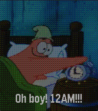
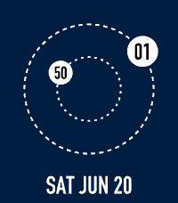
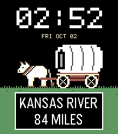

<!-- Generated by scripts/update_app_directory.py: do not edit by hand -->
# Watchfaces: O

[← About this list](../watchfaces.md) · [A](a.md) · [B](b.md) · [C](c.md) · [D](d.md) · [E](e.md) · [F](f.md) · [G](g.md) · [H](h.md) · [I](i.md) · [J](j.md) · [K](k.md) · [L](l.md) · [M](m.md) · [N](n.md) · **O** · [P](p.md) · [Q](q.md) · [R](r.md) · [S](s.md) · [T](t.md) · [U](u.md) · [V](v.md) · [W](w.md) · [X](x.md) · [Y](y.md) · [Z](z.md) · [0–9 & other](other.md)

*43 watchfaces · Last updated 2026-10-06*

| Screenshot | Name | Developer | Licence | Updated | Description |
|------------|------|-----------|---------|---------|-------------|
| { loading=lazy width="72" } | [O'Harean](https://apps.rebble.io/en_US/application/6048c8191342ae005770a0c5) <small>Rebble App Store</small> | [Avii](https://github.com/AviiNL/oharean-watchface) | <small>No licence</small> | 2021-03-10 | O'Harean calander based watchface Tap or shake to switch between O'Harean and Regular clocks. Make sure to select your timezone in the settings. |
| { loading=lazy width="72" } | [Oblique Strategies](https://apps.rebble.io/en_US/application/562cba73b56e5d005400008f) <small>Rebble App Store</small> | [David Konsumer](https://github.com/konsumer/obliqe_strategies_pebble) | <small>Not checked yet</small> | 2016-01-10 | This adds the 3rd edition of Oblique Strategies by Brian Eno and Peter Schmidt to your Pebble watch. It can be used to break a deadlock or dilemma… |
| { loading=lazy width="72" } | [Oblique Time](https://apps.rebble.io/en_US/application/53748c80f10c2e484b0000be) <small>Rebble App Store</small> | [TTV69](https://github.com/TTV/ObliqueTime) | <small>Not checked yet</small> | 2014-05-15 | A fuzzy, textual watchface with a hidden trick... Shake your Pebble to display an "Oblique Strategy". These are statements designed to help us think about… |
| { loading=lazy width="72" } | [Obsidian](https://apps.repebble.com/55ee57da2b0b31132c00008b) | [Stefan Heule](https://github.com/stefanheule/obsidian) | <small>Not checked yet</small> | 2017-02-17 | This is a usable and elegant analog watchface for the Pebble Time. It's designed such that the watch hands never cover the date or weather information. It's… |
| { loading=lazy width="72" } | [Obsidian](https://apps.repebble.com/574456d819ef0ca0a300000d) | [yoosee](https://github.com/yoosee/PebbleWatchObsidian/) | <small>Not checked yet</small> | 2018-02-09 | Analog Clock watchface with Date, Weather and Health Steps, Bluetooth indicator. All Color configurable. Because of Weather provider inaccuracy, now it uses… |
| { loading=lazy width="72" } | [Ocean Pulse](https://apps.repebble.com/880921bc8e06479ba7788cee) | [Karl](https://github.com/KarlKl/Pebble-OceanPulse) | <small>No licence</small> | 2026-05-31 | Your watch. Your beach. Your vibes. Every minute, a wave rolls in from the horizon and washes the old time off the sand — then retreats to reveal the new… |
| { loading=lazy width="72" } | [Octant](https://apps.repebble.com/576835410cc8f53b430003a5) | [Christopher Frost](https://github.com/cgfrost/octant) | <small>Not checked yet</small> | 2016-10-17 | Simple watch face that uses Jolla style font and icons. |
| { loading=lazy width="72" } | [OctoPrint Monitor](https://apps.rebble.io/en_US/application/58a1671e6ca3876977000242) <small>Rebble App Store</small> | [Victor Noordhoek](https://github.com/dieki-n/OctoprinterPebble) | <small>Not checked yet</small> | 2017-02-13 | Monitor your Octoprint-controlled 3D printer from your watch! Shows print time remaining, progress, and bed/nozzle temperature. |
| { loading=lazy width="72" } | [Oh Boy! 3 AM!](https://apps.rebble.io/en_US/application/6a4de43bc5fa78000916b02f) <small>Rebble App Store</small> | [Josh](https://codeberg.org/joshlau/three-am-watchface) | <small>See source</small> | 2026-07-08 | "That's a stupid idea. Who wants a Krabby Patty at three in the morning?" A simple watchface that cycles through four images of Patrick Star each hour. The… |
| { loading=lazy width="72" } | [Oh Boy! 3 AM!](https://apps.repebble.com/5f93b9aeb9e6440bac2d093b) | [Josh Lau](https://codeberg.org/joshlau/three-am-watchface) | <small>See source</small> | 2026-05-17 | "That's a stupid idea. Who wants a Krabby Patty at three in the morning?" A simple watchface that cycles through four images of Patrick Star each hour. The… |
| { loading=lazy width="72" } | [Oh dear! Oh dear! I shall be too late!](https://apps.rebble.io/en_US/application/55959120308fd7e738000072) <small>Rebble App Store</small> | [Oliver Merkel](https://github.com/OMerkel/pebble-samples) | <small>Not checked yet</small> | 2015-07-08 | "DOWN THE RABBIT-HOLE. ... when suddenly a white rabbit with pink eyes ran close by her. There was nothing so very remarkable in that; nor did Alice think… |
| { loading=lazy width="72" } | [Ohio Bobcats Watchface](https://apps.rebble.io/en_US/application/5921c1810dfc323a3f0013fb) <small>Rebble App Store</small> | [Logan Reich](https://github.com/sumdudelr/bobcat-watchface) | <small>Not checked yet</small> | 2017-05-21 | An unofficial pebble watchface for OU fans. Shows the date, time, daily steps, and your average daily steps through the current time. |
| { loading=lazy width="72" } | [Old Fogies Can't See Worth S***](https://apps.repebble.com/558782c83ae5e507fc000081) | [m3tropolis](https://github.com/tdsbtoes/OldFogies) | <small>Not checked yet</small> | 2017-02-27 | Idea influenced from "ChromaTick", and modified from the "KS Clock Face" code. As my eyesight is getting steadily worse, I wanted a watch face I could… |
| { loading=lazy width="72" } | [OldLedStyle](https://apps.rebble.io/en_US/application/551086ca5c415cf80700002c) <small>Rebble App Store</small> | [Andrea Ottaviani](https://github.com/aotta/OLDLED) | <small>Not checked yet</small> | 2015-03-27 | A simple old led watch 80's style |
| { loading=lazy width="72" } | [On the Button](https://apps.rebble.io/en_US/application/52d8bb781acbf3738d00002f) <small>Rebble App Store</small> | [Pebble](https://github.com/pebble/pebble-sdk-examples/tree/master/watchfaces/onthebutton) | <small>Not checked yet</small> | 2014-01-17 | On the Button Example Watchface |
| { loading=lazy width="72" } | [On the Edge](https://apps.rebble.io/en_US/application/5873df118006df065c000104) <small>Rebble App Store</small> | [David Morgan](https://github.com/Spitemare/ote) | <small>Not checked yet</small> | 2017-01-09 | A simple analog watchface that sets the hour ticks on the edge of the screen. Current hour is highlighted. When Bluetooth connection is lost center circle… |
| { loading=lazy width="72" } | [On11](https://apps.rebble.io/en_US/application/52cb5f5f6e5f7079c80000c6) <small>Rebble App Store</small> | [Qian He](https://github.com/heqian/On11) | <small>Not checked yet</small> | 2025-11-25 | On11 is an activity tracker app that can monitor your physical activity 24 × 7. It tells you how much time you spent on sitting, walking, jogging, and… |
| { loading=lazy width="72" } | [On11 Time](https://apps.rebble.io/en_US/application/55a89c4b0dc1ce64e5000060) <small>Rebble App Store</small> | [Qian He](https://github.com/heqian/On11) | <small>Not checked yet</small> | 2025-11-25 | Reborn from one of the most famous and earliest activity tracking watchfaces for the original Pebble, On11. On11 Time monitors your physical activity 24/7… |
| { loading=lazy width="72" } | [ONE](https://apps.rebble.io/en_US/application/52bca8bb87e209ebc9000005) <small>Rebble App Store</small> | [Bert Freudenberg](https://github.com/bertfreudenberg/PebbleONE/) | <small>Not checked yet</small> | 2016-01-21 | A simple and highly readable analog watch, with a large day and date that will never be obscured by the hands, plus optional battery and bluetooth… |
| { loading=lazy width="72" } | [One Minute Hand](https://apps.repebble.com/67f68f5cc6733d0009b2916d) | [justinjhendrick](https://github.com/justinjhendrick/pebble-one-handed-minute/) | <small>Not checked yet</small> | 2026-09-24 | A minimalist watchface with a digital hour number and an analog minute hand. Features: * Configurable color scheme * Great battery life (update once per… |
| { loading=lazy width="72" } | [OneShot: The World Machine](https://apps.repebble.com/de6ae671c22b4fe7aa72b57b) | [DEVELARPER](https://github.com/GuruGitHubTheG/TWM) | <small>No licence</small> | 2026-10-05 | Tell the time. But remember, You only have One Shot. View the time with a strange computer operating system, The World Machine. It has the same additions… |
| { loading=lazy width="72" } | [OnlyTRFuzzy](https://apps.rebble.io/en_US/application/53f5ecd07fb85ba7730000e4) <small>Rebble App Store</small> | [Ersin Durna](https://github.com/ersindurna/OnlyTRFuzzy) | <small>Not checked yet</small> | 2014-08-21 | Fuzzy Watchface in Turkish with Calendar at the top and Digital clock at he bottom Left, Battery percentage in numbers at Bottom Right. Needs some touch for… |
| { loading=lazy width="72" } | [Open Sauce](https://apps.repebble.com/d29e710ebd744a8b945f427c) | [castawait](https://github.com/castawait/pebble-sauce) | <small>Not checked yet</small> | 2026-07-02 | Turn your Pebble into the Open Sauce machine — the boxy robot head with antenna sparks, dial eyes and a speaker grille — where the OPEN / SAUCE wordmark is… |
| { loading=lazy width="72" } | [Open Sauce](https://apps.rebble.io/en_US/application/6a45c6ab6b3a670009d50749) <small>Rebble App Store</small> | [castawait](https://github.com/castawait/pebble-sauce) | <small>Not checked yet</small> | 2026-07-02 | Countdown to Open Sauce |
| { loading=lazy width="72" } | [OpenGameArt.org](https://apps.rebble.io/en_US/application/5349f76e085291de2e0000fa) <small>Rebble App Store</small> | [Matthew Hungerford](https://github.com/mhungerford/pebble-OpenGameArt.org) | <small>Not checked yet</small> | 2014-05-19 | Flick your wrist to flip through 11 images from OpenGameArt.org. OpenGameArt.org is a site providing art licensed under Creative-Commons. Outline Font is… |
| { loading=lazy width="72" } | [OpenLibreLinkUp](https://apps.repebble.com/02a27e35c0a9494a9208e70f) | [marukitano](https://github.com/marukitano/OpenLibreLinkUp) | <small>Not checked yet</small> | 2026-08-20 | English OpenLibreLinkUp is a glucose-monitoring watchface for the Pebble Time 2. It displays current FreeStyle Libre readings through the unofficial… |
| { loading=lazy width="72" } | [OphillusClock](https://apps.repebble.com/6923ef9a4b7e4bac9fddd64e) | [PeaceKeepingClock](https://github.com/blissfulbloom/OphillusClock) | <small>Not checked yet</small> | 2026-07-13 | 0-24 hour clock, with 0-7 days, 0-12 months lunar calendar. |
| { loading=lazy width="72" } | [Orange Kid](https://apps.rebble.io/en_US/application/529a3ff3e627ce021a00010c) <small>Rebble App Store</small> | [ihtnc](https://github.com/ihtnc/Pebble-OrangeKid) | <small>Not checked yet</small> | 2025-12-01 | A modified A Conversation with Orange Kid watch face (by Ice2097) to support animations. Some settings are configurable via the Pebble phone app. |
| { loading=lazy width="72" } | [Orbit](https://apps.rebble.io/en_US/application/67c5071bb7a02300092ba08c) <small>Rebble App Store</small> | [Flynn Duniho](https://github.com/flynnD273/orbit) | <small>Not checked yet</small> | 2026-03-03 | A space-themed watchface where the positions of the celestial bodies represent the time. The large orbit also serves as a battery level indicator. |
| { loading=lazy width="72" } | [Orbit](https://apps.rebble.io/en_US/application/55d78179276b202cc500002a) <small>Rebble App Store</small> | [Owen Platt](http://github.com/ojhp/orbit) | <small>No licence</small> | 2015-08-23 | Moving planet "hands" orbit a digital time display. |
| { loading=lazy width="72" } | [ORBIT](https://apps.rebble.io/en_US/application/584dfc2f77324baac00003de) <small>Rebble App Store</small> | [stark-dev](https://github.com/stark-dev/ORBIT-WF) | <small>Not checked yet</small> | 2016-12-12 | Simple watchface, shows date, battery status, bluetooth and quiet mode. Hands are similar to planets Hours: red; Minutes: white; Bluetooth dot is blue when… |
| { loading=lazy width="72" } | [Orbit 2.0 - TJHSST Schedule](https://apps.repebble.com/57dd89262d0cc8922f0002ed) | [KeeganLanz](https://github.com/cptspck/Orbit2) | <small>Not checked yet</small> | 2016-10-03 | Orbit is a simple watchface with the hands represented by bodies orbiting each other (the hour hand orbits the center, and the minute hand orbits the hour… |
| { loading=lazy width="72" } | [Orbit Dash](https://apps.repebble.com/34d08447e48e40f0be36d5d7) | [gamingrobot](https://github.com/gamingrobot/orbit-dash-watchface) | <small>Not checked yet</small> | 2026-06-20 | Orbit watchface inspired by Kvaesitso's Orbit Clock You can customize the background color, clock color, digit color, and show/hide date. |
| { loading=lazy width="72" } | [Orbit Dash](https://apps.rebble.io/en_US/application/6a349e53e24af400095f5738) <small>Rebble App Store</small> | [gamingrobot](https://github.com/gamingrobot/orbit-dash-watchface) | <small>Not checked yet</small> | 2026-06-20 | Orbit watchface inspired by Kvaesitso's Orbit Clock You can customize the background color, clock color, digit color, show/hide seconds, and show/hide date. |
| { loading=lazy width="72" } | [Orbital RE](https://apps.rebble.io/en_US/application/67ca03d5b7a023018e36ffb0) <small>Rebble App Store</small> | [m1k](https://github.com/less-ly/orbital_re) | <small>Not checked yet</small> | 2025-03-08 | Reverse engineered from Orbital watchface by Software Logix LLC. Original description: " An elegant watch face featuring planets orbiting as the watch… |
| { loading=lazy width="72" } | [Orbitron D](https://apps.rebble.io/en_US/application/53243430dbe04d33770001e8) <small>Rebble App Store</small> | [Oliver Bowe](https://github.com/thunderchild7/orbitron-d) | <small>Not checked yet</small> | 2014-07-19 | A simple digital watch face using the Orbitron font. Includes the day of the week and date. and optional display of seconds. The display can be inverted and… |
| { loading=lazy width="72" } | [Orbitron W](https://apps.repebble.com/54cdf6c22f1205fe86000090) | [Yasar Senturk](https://github.com/yasarix/OrbitronW) | <small>Not checked yet</small> | 2016-03-19 | A watchface with weather information. Based on look & feel of Orbitron D watchface. |
| { loading=lazy width="72" } | [Oregon Ho!](https://apps.repebble.com/5956db8bf1aa4474af893ed3) | [Ben Combee (@unwiredben)](https://github.com/unwiredben/oregon-ho-for-pebble) | <small>Not checked yet</small> | 2026-10-02 | Inspired by Oregon Trail, watch your wagon move across the US while your party encounters windfalls and trails. |
| { loading=lazy width="72" } | [Oregon Ho!](https://apps.rebble.io/en_US/application/6abdbcff37b378000961da86) <small>Rebble App Store</small> | [Ben Combee (@unwiredben)](https://github.com/unwiredben/oregon-ho-for-pebble) | <small>Not checked yet</small> | 2026-10-03 | Inspired by Oregon Trail, watch your wagon move across the US while your party encounters windfalls and trails. |
| { loading=lazy width="72" } | [Oregon Owl](https://apps.rebble.io/en_US/application/56590d7bdaf7fffed3000039) <small>Rebble App Store</small> | [clach04](https://github.com/clach04/watchface_oregon_owl) | <small>Not checked yet</small> | 2015-11-28 | Oregon hat snatching owl |
| { loading=lazy width="72" } | [Orgoglio del sud](https://apps.repebble.com/57efda6605e4b17e1c0001bf) | [Vincenzo Di Lorenzo](https://github.com/vincenzodilorenzo/PebbleWatchFaceOrgoglioDelSud) | <small>Not checked yet</small> | 2016-10-01 | Una WatchFace semplice con lo stemma borbonico. Per ricordare ciò che eravamo... senza nostalgia ma con consapevolezza. |
| { loading=lazy width="72" } | [Oswald Vertical](https://apps.rebble.io/en_US/application/5dcdcbc9c393f52a5b8fa510) <small>Rebble App Store</small> | [astosia](https://github.com/astosia/oswald) | <small>Not checked yet</small> | 2026-02-15 | Homage to the excellent watsface. This version adds configurable colours, 12h/24h option, and works on every type of pebble (including Pebble Time 2)… |
| { loading=lazy width="72" } | [Owl Cave Watch](https://apps.rebble.io/en_US/application/594b1d660dfc32acc7000133) <small>Rebble App Store</small> | [cr0ybot](https://github.com/cr0ybot/owl-cave-watchface) | <small>Not checked yet</small> | 2017-06-22 | Inspired by Twin Peaks and the Owl Cave Ring. Currently it does nothing except tell the time, though I am not responsible for any strange things that may… |
