---
hide:
  - toc
---

<!-- Generated by scripts/update_app_directory.py: do not edit by hand -->
# Pebble Watchfaces: O

[← All Pebble Watchfaces](../watchfaces.md) · [A](a.md) · [B](b.md) · [C](c.md) · [D](d.md) · [E](e.md) · [F](f.md) · [G](g.md) · [H](h.md) · [I](i.md) · [J](j.md) · [K](k.md) · [L](l.md) · [M](m.md) · [N](n.md) · **O** · [P](p.md) · [Q](q.md) · [R](r.md) · [S](s.md) · [T](t.md) · [U](u.md) · [V](v.md) · [W](w.md) · [X](x.md) · [Y](y.md) · [Z](z.md) · [0–9 & other](other.md)

*40 watchfaces · Last updated 2026-10-06 · [About these lists](../about-app-lists.md)*

<a class="app-shot" href="https://apps.rebble.io/en_US/application/6048c8191342ae005770a0c5" data-search-exclude>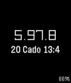</a>

<h2 class="app-name" id="app-6048c8191342ae005770a0c5"><a href="https://apps.rebble.io/en_US/application/6048c8191342ae005770a0c5">O&#x27;Harean</a></h2>
<a class="app-source" href="https://github.com/AviiNL/oharean-watchface" title="Source code" data-search-exclude>View source</a>

by <a href="https://apps.rebble.io/en_US/developer/6048c8181342ae005770a0c3/1" title="More from this developer">Avii</a>

No licence v1.0 Updated 2021-03-10 Rebble App Store

Runs on: Round 2, Time 2, Pebble 2 Duo, Pebble 2, Time Round, Time, Classic

O&#x27;Harean calander based watchface Tap or shake to switch between O&#x27;Harean and Regular clocks. Make sure to select your timezone in the settings.

<h2 class="app-name" id="app-562cba73b56e5d005400008f"><a href="https://apps.repebble.com/562cba73b56e5d005400008f">Oblique Strategies</a></h2>
<a class="app-source" href="https://github.com/konsumer/obliqe_strategies_pebble" title="Source code" data-search-exclude>View source</a>

by <a href="https://apps.repebble.com/apps/dev/david-konsumer_52bcf29983ed912283000028" title="More from this developer">David Konsumer</a>

Not checked yet v1.2 Updated 2016-01-10

Runs on: Round 2, Time 2, Pebble 2 Duo, Pebble 2, Time Round, Time, Classic

This adds the 3rd edition of Oblique Strategies by Brian Eno and Peter Schmidt to your Pebble watch. It can be used to break a deadlock or dilemma situation. Shake to get a new strategy. Shake…

<a class="app-shot" href="https://apps.repebble.com/53748c80f10c2e484b0000be" data-search-exclude>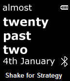</a>

<h2 class="app-name" id="app-53748c80f10c2e484b0000be"><a href="https://apps.repebble.com/53748c80f10c2e484b0000be">Oblique Time</a></h2>
<a class="app-source" href="https://github.com/TTV/ObliqueTime" title="Source code" data-search-exclude>View source</a>

by <a href="https://apps.repebble.com/apps/dev/ttv69_52bc7111db1360a630000154" title="More from this developer">TTV69</a>

No licence v1.0.1 Updated 2014-05-15

Runs on: Time 2, Pebble 2 Duo, Pebble 2, Time, Classic

A fuzzy, textual watchface with a hidden trick... Shake your Pebble to display an &quot;Oblique Strategy&quot;. These are statements designed to help us think about things in an alternative way. For more…

<a class="app-shot" href="https://apps.repebble.com/538b828673742659360000a1" data-search-exclude>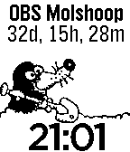</a>

<h2 class="app-name" id="app-538b828673742659360000a1"><a href="https://apps.repebble.com/538b828673742659360000a1">OBS de Molshoop</a></h2>
<a class="app-source" href="https://github.com/pieterjm/Pebble-Molshoop" title="Source code" data-search-exclude>View source</a>

by <a href="https://apps.repebble.com/apps/dev/pieter-meulenhoff_52c4808fb496f12574000052" title="More from this developer">Pieter Meulenhoff</a>

Not checked yet v1.1 Updated 2014-06-12

Runs on: Time 2, Pebble 2 Duo, Pebble 2, Time, Classic

Watchface met een afteltimer voor het aantal dagen dat OBS de Molshoop, openbare basischool in Noordhorn, nog bestaat.

<a class="app-shot" href="https://apps.repebble.com/55ee57da2b0b31132c00008b" data-search-exclude>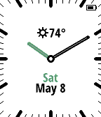</a>

<h2 class="app-name" id="app-55ee57da2b0b31132c00008b"><a href="https://apps.repebble.com/55ee57da2b0b31132c00008b">Obsidian</a></h2>
<a class="app-source" href="https://github.com/stefanheule/obsidian" title="Source code" data-search-exclude>View source</a>

by <a href="https://apps.repebble.com/apps/dev/stefan-heule_55ab3ca04f0cf8279e00003c" title="More from this developer">Stefan Heule</a>

Not checked yet v3.3 Updated 2017-02-17

Runs on: Round 2, Time 2, Pebble 2 Duo, Pebble 2, Time Round, Time, Classic

This is a usable and elegant analog watchface for the Pebble Time. It&#x27;s designed such that the watch hands never cover the date or weather information. It&#x27;s main features are: - High contrast…

<a class="app-shot" href="https://apps.repebble.com/574456d819ef0ca0a300000d" data-search-exclude>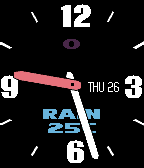</a>

<h2 class="app-name" id="app-574456d819ef0ca0a300000d"><a href="https://apps.repebble.com/574456d819ef0ca0a300000d">Obsidian</a></h2>
<a class="app-source" href="https://github.com/yoosee/PebbleWatchObsidian/" title="Source code" data-search-exclude>View source</a>

by <a href="https://apps.repebble.com/apps/dev/yoosee_56fc1d81085b3d583f000043" title="More from this developer">yoosee</a>

Not checked yet v1.5 Updated 2018-02-09

Runs on: Round 2, Time 2, Pebble 2 Duo, Pebble 2, Time Round, Time

Analog Clock watchface with Date, Weather and Health Steps, Bluetooth indicator. All Color configurable. Because of Weather provider inaccuracy, now it uses Weather.gov as a default provider, then…

<a class="app-shot" href="https://apps.repebble.com/880921bc8e06479ba7788cee" data-search-exclude>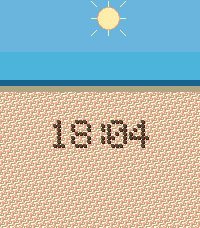</a>

<h2 class="app-name" id="app-880921bc8e06479ba7788cee"><a href="https://apps.repebble.com/880921bc8e06479ba7788cee">Ocean Pulse</a></h2>
<a class="app-source" href="https://github.com/KarlKl/Pebble-OceanPulse" title="Source code" data-search-exclude>View source</a>

by <a href="https://apps.repebble.com/apps/dev/karl_0e91d84045d24bb5497e1700" title="More from this developer">Karl</a>

No licence v1.0.0 Updated 2026-05-31

Runs on: Round 2, Time 2, Time Round, Time

Your watch. Your beach. Your vibes. Every minute, a wave rolls in from the horizon and washes the old time off the sand — then retreats to reveal the new time, freshly scratched in by some…

<a class="app-shot" href="https://apps.repebble.com/576835410cc8f53b430003a5" data-search-exclude>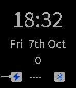</a>

<h2 class="app-name" id="app-576835410cc8f53b430003a5"><a href="https://apps.repebble.com/576835410cc8f53b430003a5">Octant</a></h2>
<a class="app-source" href="https://github.com/cgfrost/octant" title="Source code" data-search-exclude>View source</a>

by <a href="https://apps.repebble.com/apps/dev/christopher-frost_550ab580abca23f36800010b" title="More from this developer">Christopher Frost</a>

Not checked yet v1.4 Updated 2016-10-17

Runs on: Round 2, Time 2, Pebble 2 Duo, Pebble 2, Time Round, Time

Simple watch face that uses Jolla style font and icons.

<a class="app-shot" href="https://apps.rebble.io/en_US/application/58a1671e6ca3876977000242" data-search-exclude>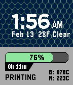</a>

<h2 class="app-name" id="app-58a1671e6ca3876977000242"><a href="https://apps.rebble.io/en_US/application/58a1671e6ca3876977000242">OctoPrint Monitor</a></h2>
<a class="app-source" href="https://github.com/dieki-n/OctoprinterPebble" title="Source code" data-search-exclude>View source</a>

by <a href="https://apps.rebble.io/en_US/developer/57b8e2faf01b53bccc00097b/1" title="More from this developer">Victor Noordhoek</a>

Not checked yet v1.1 Updated 2017-02-13 Rebble App Store

Runs on: Time 2, Time

Monitor your Octoprint-controlled 3D printer from your watch! Shows print time remaining, progress, and bed/nozzle temperature.

<a class="app-shot" href="https://apps.repebble.com/5f93b9aeb9e6440bac2d093b" data-search-exclude>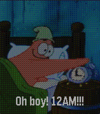</a>

<h2 class="app-name" id="app-5f93b9aeb9e6440bac2d093b"><a href="https://apps.repebble.com/5f93b9aeb9e6440bac2d093b">Oh Boy! 3 AM!</a></h2>
<a class="app-source" href="https://codeberg.org/joshlau/three-am-watchface" title="Source code" data-search-exclude>View source</a>

by <a href="https://apps.repebble.com/apps/dev/josh-lau_7c2f9385ca73b9a97da1a9be" title="More from this developer">Josh Lau</a>

See source v1.1.3 Updated 2026-05-17

Runs on: Round 2, Time 2, Pebble 2 Duo, Pebble 2, Time Round, Time, Classic

&quot;That&#x27;s a stupid idea. Who wants a Krabby Patty at three in the morning?&quot; A simple watchface that cycles through four images of Patrick Star each hour. The text at the bottom shows the hour, but…

<a class="app-shot" href="https://apps.repebble.com/55959120308fd7e738000072" data-search-exclude>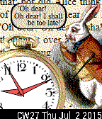</a>

<h2 class="app-name" id="app-55959120308fd7e738000072"><a href="https://apps.repebble.com/55959120308fd7e738000072">Oh dear! Oh dear! I shall be too late!</a></h2>
<a class="app-source" href="https://github.com/OMerkel/pebble-samples" title="Source code" data-search-exclude>View source</a>

by <a href="https://apps.repebble.com/apps/dev/oliver-merkel_55592fc6b038d44f9e00003e" title="More from this developer">Oliver Merkel</a>

MIT v1.1 Updated 2015-07-08

Runs on: Time 2, Pebble 2 Duo, Pebble 2, Time, Classic

&quot;DOWN THE RABBIT-HOLE. ... when suddenly a white rabbit with pink eyes ran close by her. There was nothing so very remarkable in that; nor did Alice think it so very much out of the way to hear…

<a class="app-shot" href="https://apps.rebble.io/en_US/application/5921c1810dfc323a3f0013fb" data-search-exclude>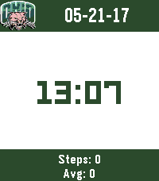</a>

<h2 class="app-name" id="app-5921c1810dfc323a3f0013fb"><a href="https://apps.rebble.io/en_US/application/5921c1810dfc323a3f0013fb">Ohio Bobcats Watchface</a></h2>
<a class="app-source" href="https://github.com/sumdudelr/bobcat-watchface" title="Source code" data-search-exclude>View source</a>

by <a href="https://apps.rebble.io/en_US/developer/567d6020c247f825a900011c/1" title="More from this developer">Logan Reich</a>

Not checked yet v1.0 Updated 2017-05-21 Rebble App Store

Runs on: Time 2, Pebble 2 Duo, Pebble 2, Time, Classic

An unofficial pebble watchface for OU fans. Shows the date, time, daily steps, and your average daily steps through the current time.

<a class="app-shot" href="https://apps.repebble.com/558782c83ae5e507fc000081" data-search-exclude>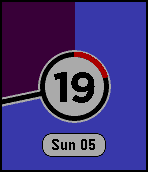</a>

<h2 class="app-name" id="app-558782c83ae5e507fc000081"><a href="https://apps.repebble.com/558782c83ae5e507fc000081">Old Fogies Can&#x27;t See Worth S***</a></h2>
<a class="app-source" href="https://github.com/tdsbtoes/OldFogies" title="Source code" data-search-exclude>View source</a>

by <a href="https://apps.repebble.com/apps/dev/m3tropolis_52e9b4164703a74a67000039" title="More from this developer">m3tropolis</a>

Not checked yet v1.91 Updated 2017-02-27

Runs on: Round 2, Time 2, Time Round, Time

Idea influenced from &quot;ChromaTick&quot;, and modified from the &quot;KS Clock Face&quot; code. As my eyesight is getting steadily worse, I wanted a watch face I could easily read. A big digital readout would be…

<a class="app-shot" href="https://apps.repebble.com/551086ca5c415cf80700002c" data-search-exclude>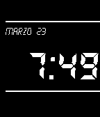</a>

<h2 class="app-name" id="app-551086ca5c415cf80700002c"><a href="https://apps.repebble.com/551086ca5c415cf80700002c">OldLedStyle</a></h2>
<a class="app-source" href="https://github.com/aotta/OLDLED" title="Source code" data-search-exclude>View source</a>

by <a href="https://apps.repebble.com/apps/dev/andrea-ottaviani_54f6bfc5feb37e1bc000001c" title="More from this developer">Andrea Ottaviani</a>

No licence v0.3 Updated 2015-03-27

Runs on: Time 2, Pebble 2 Duo, Pebble 2, Time, Classic

A simple old led watch 80&#x27;s style

<a class="app-shot" href="https://apps.repebble.com/52d8bb781acbf3738d00002f" data-search-exclude>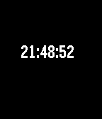</a>

<h2 class="app-name" id="app-52d8bb781acbf3738d00002f"><a href="https://apps.repebble.com/52d8bb781acbf3738d00002f">On the Button</a></h2>
<a class="app-source" href="https://github.com/pebble/pebble-sdk-examples/tree/master/watchfaces/onthebutton" title="Source code" data-search-exclude>View source</a>

by <a href="https://apps.repebble.com/apps/dev/pebble_52d8a44faef8d590d3000029" title="More from this developer">Pebble</a>

Not checked yet v3.0 Updated 2014-01-17

Runs on: Time 2, Pebble 2 Duo, Pebble 2, Time, Classic

On the Button Example Watchface

<a class="app-shot" href="https://apps.rebble.io/en_US/application/5873df118006df065c000104" data-search-exclude>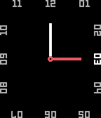</a>

<h2 class="app-name" id="app-5873df118006df065c000104"><a href="https://apps.rebble.io/en_US/application/5873df118006df065c000104">On the Edge</a></h2>
<a class="app-source" href="https://github.com/Spitemare/ote" title="Source code" data-search-exclude>View source</a>

by <a href="https://apps.rebble.io/en_US/developer/564924e14f9b2989ec000014/1" title="More from this developer">David Morgan</a>

MIT v1.0 Updated 2017-01-09 Rebble App Store

Runs on: Round 2, Time 2, Pebble 2 Duo, Pebble 2, Time Round, Time, Classic

A simple analog watchface that sets the hour ticks on the edge of the screen. Current hour is highlighted. When Bluetooth connection is lost center circle changes size. Features: - Configurable…

<a class="app-shot" href="https://apps.repebble.com/52cb5f5f6e5f7079c80000c6" data-search-exclude>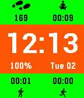</a>

<h2 class="app-name" id="app-52cb5f5f6e5f7079c80000c6"><a href="https://apps.repebble.com/52cb5f5f6e5f7079c80000c6">On11</a></h2>
<a class="app-source" href="https://github.com/heqian/On11" title="Source code" data-search-exclude>View source</a>

by <a href="https://apps.repebble.com/apps/dev/qian-he_52b8bd23c066cad7a600000e" title="More from this developer">Qian He</a>

Not checked yet v4.1 Updated 2025-11-25

Runs on: Time 2, Pebble 2 Duo, Pebble 2, Time, Classic

On11 is an activity tracker app that can monitor your physical activity 24 × 7. It tells you how much time you spent on sitting, walking, jogging, and sleeping. It also works as a pedometer just…

<a class="app-shot" href="https://apps.repebble.com/55a89c4b0dc1ce64e5000060" data-search-exclude>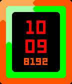</a>

<h2 class="app-name" id="app-55a89c4b0dc1ce64e5000060"><a href="https://apps.repebble.com/55a89c4b0dc1ce64e5000060">On11 Time</a></h2>
<a class="app-source" href="https://github.com/heqian/On11" title="Source code" data-search-exclude>View source</a>

by <a href="https://apps.repebble.com/apps/dev/qian-he_52b8bd23c066cad7a600000e" title="More from this developer">Qian He</a>

Not checked yet v1.3 Updated 2025-11-25

Runs on: Time 2, Time

Reborn from one of the most famous and earliest activity tracking watchfaces for the original Pebble, On11. On11 Time monitors your physical activity 24/7. It tells you how many steps you took and…

<a class="app-shot" href="https://apps.repebble.com/52bca8bb87e209ebc9000005" data-search-exclude>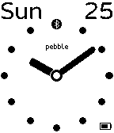</a>

<h2 class="app-name" id="app-52bca8bb87e209ebc9000005"><a href="https://apps.repebble.com/52bca8bb87e209ebc9000005">ONE</a></h2>
<a class="app-source" href="https://github.com/bertfreudenberg/PebbleONE/" title="Source code" data-search-exclude>View source</a>

by <a href="https://apps.repebble.com/apps/dev/bert-freudenberg_52ab4e1db8f6c202d9000025" title="More from this developer">Bert Freudenberg</a>

No licence v3.1 Updated 2016-01-21

Runs on: Round 2, Time 2, Pebble 2 Duo, Pebble 2, Time Round, Time, Classic

A simple and highly readable analog watch, with a large day and date that will never be obscured by the hands, plus optional battery and bluetooth indicators. It can even warn you when you forgot…

<a class="app-shot" href="https://apps.repebble.com/67f68f5cc6733d0009b2916d" data-search-exclude>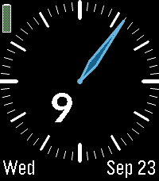</a>

<h2 class="app-name" id="app-67f68f5cc6733d0009b2916d"><a href="https://apps.repebble.com/67f68f5cc6733d0009b2916d">One Minute Hand</a></h2>
<a class="app-source" href="https://github.com/justinjhendrick/pebble-one-handed-minute/" title="Source code" data-search-exclude>View source</a>

by <a href="https://apps.repebble.com/apps/dev/justinjhendrick_67f68b8a23b7a90009c87db5" title="More from this developer">justinjhendrick</a>

Not checked yet v1.5.0 Updated 2026-09-24

Runs on: Round 2, Time 2, Pebble 2 Duo, Pebble 2, Time Round, Time, Classic

A minimalist watchface with a digital hour number and an analog minute hand. Features: * Configurable color scheme * Great battery life (update once per minute) * Support 12h or 24h for hour…

<a class="app-shot" href="https://apps.repebble.com/de6ae671c22b4fe7aa72b57b" data-search-exclude>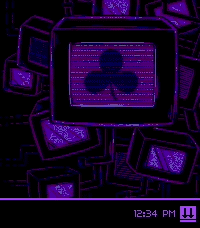</a>

<h2 class="app-name" id="app-de6ae671c22b4fe7aa72b57b"><a href="https://apps.repebble.com/de6ae671c22b4fe7aa72b57b">OneShot: The World Machine</a></h2>
<a class="app-source" href="https://github.com/GuruGitHubTheG/TWM" title="Source code" data-search-exclude>View source</a>

by <a href="https://apps.repebble.com/apps/dev/develarper_3e9db43ff8d760635172598e" title="More from this developer">DEVELARPER</a>

No licence v2.1.2 Updated 2026-10-05

Runs on: Round 2, Time 2, Pebble 2 Duo, Pebble 2, Time Round, Time, Classic

Tell the time. But remember, You only have One Shot. View the time with a strange computer operating system, The World Machine. It has the same additions that OneShot: World Machine Edition…

<a class="app-shot" href="https://apps.repebble.com/53f5ecd07fb85ba7730000e4" data-search-exclude>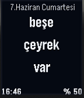</a>

<h2 class="app-name" id="app-53f5ecd07fb85ba7730000e4"><a href="https://apps.repebble.com/53f5ecd07fb85ba7730000e4">OnlyTRFuzzy</a></h2>
<a class="app-source" href="https://github.com/ersindurna/OnlyTRFuzzy" title="Source code" data-search-exclude>View source</a>

by <a href="https://apps.repebble.com/apps/dev/ersin-durna_530605ab21336c2d47000210" title="More from this developer">Ersin Durna</a>

Not checked yet v1.0 Updated 2014-08-21

Runs on: Time 2, Pebble 2 Duo, Pebble 2, Time, Classic

Fuzzy Watchface in Turkish with Calendar at the top and Digital clock at he bottom Left, Battery percentage in numbers at Bottom Right. Needs some touch for the battery hog. But no memory issues...

<h2 class="app-name" id="app-d29e710ebd744a8b945f427c"><a href="https://apps.repebble.com/d29e710ebd744a8b945f427c">Open Sauce</a></h2>
<a class="app-source" href="https://github.com/castawait/pebble-sauce" title="Source code" data-search-exclude>View source</a>

by <a href="https://apps.repebble.com/apps/dev/castawait_e893d73b2d8dc7bc8c8764cc" title="More from this developer">castawait</a>

Not checked yet v1.0.0 Updated 2026-07-02

Runs on: Round 2, Time 2, Time Round, Time

Turn your Pebble into the Open Sauce machine — the boxy robot head with antenna sparks, dial eyes and a speaker grille — where the OPEN / SAUCE wordmark is replaced by the time and a live…

<h2 class="app-name" id="app-5349f76e085291de2e0000fa"><a href="https://apps.repebble.com/5349f76e085291de2e0000fa">OpenGameArt.org</a></h2>
<a class="app-source" href="https://github.com/mhungerford/pebble-OpenGameArt.org" title="Source code" data-search-exclude>View source</a>

by <a href="https://apps.repebble.com/apps/dev/matthew-hungerford_52bca741d438930a650001b6" title="More from this developer">Matthew Hungerford</a>

Not checked yet v1.1 Updated 2014-05-19

Runs on: Time 2, Pebble 2 Duo, Pebble 2, Time, Classic

Flick your wrist to flip through 11 images from OpenGameArt.org. OpenGameArt.org is a site providing art licensed under Creative-Commons. Outline Font is based on the Boxy font also found on…

<a class="app-shot" href="https://apps.repebble.com/02a27e35c0a9494a9208e70f" data-search-exclude>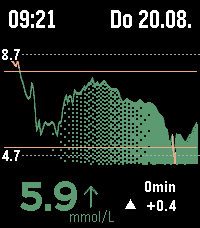</a>

<h2 class="app-name" id="app-02a27e35c0a9494a9208e70f"><a href="https://apps.repebble.com/02a27e35c0a9494a9208e70f">OpenLibreLinkUp</a></h2>
<a class="app-source" href="https://github.com/marukitano/OpenLibreLinkUp" title="Source code" data-search-exclude>View source</a>

by <a href="https://apps.repebble.com/apps/dev/marukitano_ff2831479c1011a82df1985d" title="More from this developer">marukitano</a>

Not checked yet v1.3.5 Updated 2026-08-20

Runs on: Time 2

English OpenLibreLinkUp is a glucose-monitoring watchface for the Pebble Time 2. It displays current FreeStyle Libre readings through the unofficial LibreLinkUp API, including glucose value, trend…

<a class="app-shot" href="https://apps.repebble.com/6923ef9a4b7e4bac9fddd64e" data-search-exclude>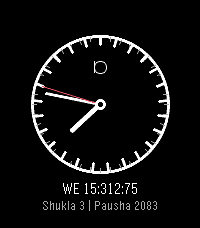</a>

<h2 class="app-name" id="app-6923ef9a4b7e4bac9fddd64e"><a href="https://apps.repebble.com/6923ef9a4b7e4bac9fddd64e">OphillusClock</a></h2>
<a class="app-source" href="https://github.com/blissfulbloom/OphillusClock" title="Source code" data-search-exclude>View source</a>

by <a href="https://apps.repebble.com/apps/dev/peacekeepingclock_2c0cc1dcc9ca8dbc3e50e2d8" title="More from this developer">PeaceKeepingClock</a>

No licence v1.0.0 Updated 2026-07-13

Runs on: Round 2, Time 2, Pebble 2 Duo, Pebble 2, Time Round, Time, Classic

0-24 hour clock, with 0-7 days, 0-12 months lunar calendar.

<a class="app-shot" href="https://apps.repebble.com/529a3ff3e627ce021a00010c" data-search-exclude>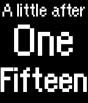</a>

<h2 class="app-name" id="app-529a3ff3e627ce021a00010c"><a href="https://apps.repebble.com/529a3ff3e627ce021a00010c">Orange Kid</a></h2>
<a class="app-source" href="https://github.com/ihtnc/Pebble-OrangeKid" title="Source code" data-search-exclude>View source</a>

by <a href="https://apps.repebble.com/apps/dev/ihtnc_529a3cd3e627ce820a000106" title="More from this developer">ihtnc</a>

Not checked yet v2.0 Updated 2025-12-01

Runs on: Time 2, Pebble 2 Duo, Pebble 2, Time, Classic

A modified A Conversation with Orange Kid watch face (by Ice2097) to support animations. Some settings are configurable via the Pebble phone app.

<a class="app-shot" href="https://apps.rebble.io/en_US/application/67c5071bb7a02300092ba08c" data-search-exclude>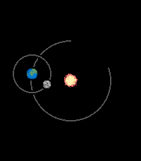</a>

<h2 class="app-name" id="app-67c5071bb7a02300092ba08c"><a href="https://apps.rebble.io/en_US/application/67c5071bb7a02300092ba08c">Orbit</a></h2>
<a class="app-source" href="https://github.com/flynnD273/orbit" title="Source code" data-search-exclude>View source</a>

by <a href="https://apps.rebble.io/en_US/developer/67bd48a737d408000a74f7d7/1" title="More from this developer">Flynn Duniho</a>

Not checked yet v1.10 Updated 2026-03-03 Rebble App Store

Runs on: Round 2, Time 2, Pebble 2 Duo, Pebble 2, Time Round, Time, Classic

A space-themed watchface where the positions of the celestial bodies represent the time. The large orbit also serves as a battery level indicator.

<a class="app-shot" href="https://apps.repebble.com/55d78179276b202cc500002a" data-search-exclude>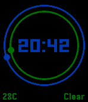</a>

<h2 class="app-name" id="app-55d78179276b202cc500002a"><a href="https://apps.repebble.com/55d78179276b202cc500002a">Orbit</a></h2>
<a class="app-source" href="http://github.com/ojhp/orbit" title="Source code" data-search-exclude>View source</a>

by <a href="https://apps.repebble.com/apps/dev/owen-platt_55d24288aedac714d0000039" title="More from this developer">Owen Platt</a>

No licence v1.1 Updated 2015-08-23

Runs on: Time 2, Pebble 2 Duo, Pebble 2, Time, Classic

Moving planet &quot;hands&quot; orbit a digital time display.

<a class="app-shot" href="https://apps.rebble.io/en_US/application/584dfc2f77324baac00003de" data-search-exclude>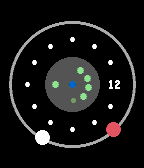</a>

<h2 class="app-name" id="app-584dfc2f77324baac00003de"><a href="https://apps.rebble.io/en_US/application/584dfc2f77324baac00003de">ORBIT</a></h2>
<a class="app-source" href="https://github.com/stark-dev/ORBIT-WF" title="Source code" data-search-exclude>View source</a>

by <a href="https://apps.rebble.io/en_US/developer/583d7ae300355a2f3a00056e/1" title="More from this developer">stark-dev</a>

Not checked yet v0.3 Updated 2016-12-12 Rebble App Store

Runs on: Round 2, Time 2, Time Round, Time

Simple watchface, shows date, battery status, bluetooth and quiet mode. Hands are similar to planets Hours: red; Minutes: white; Bluetooth dot is blue when connected, red when disconnected. The…

<a class="app-shot" href="https://apps.repebble.com/57dd89262d0cc8922f0002ed" data-search-exclude>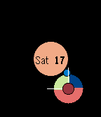</a>

<h2 class="app-name" id="app-57dd89262d0cc8922f0002ed"><a href="https://apps.repebble.com/57dd89262d0cc8922f0002ed">Orbit 2.0 - TJHSST Schedule</a></h2>
<a class="app-source" href="https://github.com/cptspck/Orbit2" title="Source code" data-search-exclude>View source</a>

by <a href="https://apps.repebble.com/apps/dev/keeganlanz_559af5bb393bdfb3ae000067" title="More from this developer">KeeganLanz</a>

Not checked yet v2.1 Updated 2016-10-03

Runs on: Round 2, Time 2, Pebble 2 Duo, Pebble 2, Time Round, Time, Classic

Orbit is a simple watchface with the hands represented by bodies orbiting each other (the hour hand orbits the center, and the minute hand orbits the hour hand). Version 2 includes getting the…

<h2 class="app-name" id="app-34d08447e48e40f0be36d5d7"><a href="https://apps.repebble.com/34d08447e48e40f0be36d5d7">Orbit Dash</a></h2>
<a class="app-source" href="https://github.com/gamingrobot/orbit-dash-watchface" title="Source code" data-search-exclude>View source</a>

by <a href="https://apps.repebble.com/apps/dev/gamingrobot_75f5b2304cfeec5252a13325" title="More from this developer">gamingrobot</a>

Not checked yet v1.1.0 Updated 2026-06-20

Runs on: Round 2, Time 2, Pebble 2 Duo, Pebble 2, Time Round, Time, Classic

Orbit watchface inspired by Kvaesitso&#x27;s Orbit Clock You can customize the background color, clock color, digit color, and show/hide date.

<a class="app-shot" href="https://apps.rebble.io/en_US/application/67ca03d5b7a023018e36ffb0" data-search-exclude>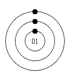</a>

<h2 class="app-name" id="app-67ca03d5b7a023018e36ffb0"><a href="https://apps.rebble.io/en_US/application/67ca03d5b7a023018e36ffb0">Orbital RE</a></h2>
<a class="app-source" href="https://github.com/less-ly/orbital_re" title="Source code" data-search-exclude>View source</a>

by <a href="https://apps.rebble.io/en_US/developer/67c9fbda899ef10009ea6864/1" title="More from this developer">m1k</a>

Not checked yet v1.2 Updated 2025-03-08 Rebble App Store

Runs on: Round 2, Time 2, Time Round, Time

Reverse engineered from Orbital watchface by Software Logix LLC. Original description: &quot; An elegant watch face featuring planets orbiting as the watch hands. The outer planet is represents to…

<a class="app-shot" href="https://apps.repebble.com/53243430dbe04d33770001e8" data-search-exclude>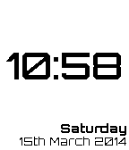</a>

<h2 class="app-name" id="app-53243430dbe04d33770001e8"><a href="https://apps.repebble.com/53243430dbe04d33770001e8">Orbitron D</a></h2>
<a class="app-source" href="https://github.com/thunderchild7/orbitron-d" title="Source code" data-search-exclude>View source</a>

by <a href="https://apps.repebble.com/apps/dev/oliver-bowe_52cdaf6f0b54dbbe46000001" title="More from this developer">Oliver Bowe</a>

Not checked yet v1.3.6 Updated 2014-07-19

Runs on: Time 2, Pebble 2 Duo, Pebble 2, Time, Classic

A simple digital watch face using the Orbitron font. Includes the day of the week and date. and optional display of seconds. The display can be inverted and can vibrate in 5 minutes intervals up…

<a class="app-shot" href="https://apps.repebble.com/54cdf6c22f1205fe86000090" data-search-exclude>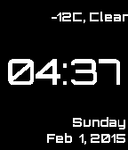</a>

<h2 class="app-name" id="app-54cdf6c22f1205fe86000090"><a href="https://apps.repebble.com/54cdf6c22f1205fe86000090">Orbitron W</a></h2>
<a class="app-source" href="https://github.com/yasarix/OrbitronW" title="Source code" data-search-exclude>View source</a>

by <a href="https://apps.repebble.com/apps/dev/yasar-senturk_5464bcf1cb448785fc000039" title="More from this developer">Yasar Senturk</a>

Not checked yet v1.4 Updated 2016-03-19

Runs on: Time 2, Pebble 2 Duo, Pebble 2, Time, Classic

A watchface with weather information. Based on look &amp; feel of Orbitron D watchface.

<h2 class="app-name" id="app-5956db8bf1aa4474af893ed3"><a href="https://apps.repebble.com/5956db8bf1aa4474af893ed3">Oregon Ho!</a></h2>
<a class="app-source" href="https://github.com/unwiredben/oregon-ho-for-pebble" title="Source code" data-search-exclude>View source</a>

by <a href="https://apps.repebble.com/apps/dev/ben-combee-unwiredben_551338e88630986002000039" title="More from this developer">Ben Combee (@unwiredben)</a>

Not checked yet v1.2.0 Updated 2026-10-02

Runs on: Round 2, Time 2, Time Round, Time

Inspired by Oregon Trail, watch your wagon move across the US while your party encounters windfalls and trails.

<a class="app-shot" href="https://apps.repebble.com/56590d7bdaf7fffed3000039" data-search-exclude>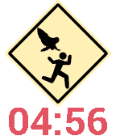</a>

<h2 class="app-name" id="app-56590d7bdaf7fffed3000039"><a href="https://apps.repebble.com/56590d7bdaf7fffed3000039">Oregon Owl</a></h2>
<a class="app-source" href="https://github.com/clach04/watchface_oregon_owl" title="Source code" data-search-exclude>View source</a>

by <a href="https://apps.repebble.com/apps/dev/clach04_5524604a9de9550a3300007a" title="More from this developer">clach04</a>

Not checked yet v0.4 Updated 2015-11-28

Runs on: Round 2, Time 2, Pebble 2 Duo, Pebble 2, Time Round, Time, Classic

Oregon hat snatching owl

<h2 class="app-name" id="app-57efda6605e4b17e1c0001bf"><a href="https://apps.repebble.com/57efda6605e4b17e1c0001bf">Orgoglio del sud</a></h2>
<a class="app-source" href="https://github.com/vincenzodilorenzo/PebbleWatchFaceOrgoglioDelSud" title="Source code" data-search-exclude>View source</a>

by <a href="https://apps.repebble.com/apps/dev/vincenzo-di-lorenzo_573f434ac12e854ea1000010" title="More from this developer">Vincenzo Di Lorenzo</a>

Not checked yet v1.0 Updated 2016-10-01

Runs on: Time 2, Time

Una WatchFace semplice con lo stemma borbonico. Per ricordare ciò che eravamo... senza nostalgia ma con consapevolezza.

<a class="app-shot" href="https://apps.rebble.io/en_US/application/5dcdcbc9c393f52a5b8fa510" data-search-exclude>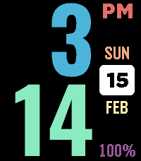</a>

<h2 class="app-name" id="app-5dcdcbc9c393f52a5b8fa510"><a href="https://apps.rebble.io/en_US/application/5dcdcbc9c393f52a5b8fa510">Oswald Vertical</a></h2>
<a class="app-source" href="https://github.com/astosia/oswald" title="Source code" data-search-exclude>View source</a>

by <a href="https://apps.rebble.io/en_US/developer/58a635d30dfc320dc60003b4/1" title="More from this developer">astosia</a>

No licence v2.0 Updated 2026-02-15 Rebble App Store

Runs on: Round 2, Time 2, Pebble 2 Duo, Pebble 2, Time Round, Time, Classic

Homage to the excellent watsface. This version adds configurable colours, 12h/24h option, and works on every type of pebble (including Pebble Time 2). Vibrates on disconnect (not during quiet…

<a class="app-shot" href="https://apps.rebble.io/en_US/application/594b1d660dfc32acc7000133" data-search-exclude>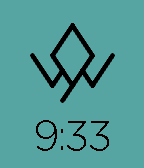</a>

<h2 class="app-name" id="app-594b1d660dfc32acc7000133"><a href="https://apps.rebble.io/en_US/application/594b1d660dfc32acc7000133">Owl Cave Watch</a></h2>
<a class="app-source" href="https://github.com/cr0ybot/owl-cave-watchface" title="Source code" data-search-exclude>View source</a>

by <a href="https://apps.rebble.io/en_US/developer/531a8d36eb7a7763e50005ae/1" title="More from this developer">cr0ybot</a>

Not checked yet v1.0 Updated 2017-06-22 Rebble App Store

Runs on: Round 2, Time 2, Pebble 2 Duo, Pebble 2, Time Round, Time, Classic

Inspired by Twin Peaks and the Owl Cave Ring. Currently it does nothing except tell the time, though I am not responsible for any strange things that may happen to you while wearing it.

