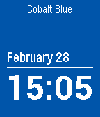

<!-- Generated by scripts/update_app_directory.py: do not edit by hand -->
# Watchfaces: 0–9 & other

[← About this list](../watchfaces.md) · [A](a.md) · [B](b.md) · [C](c.md) · [D](d.md) · [E](e.md) · [F](f.md) · [G](g.md) · [H](h.md) · [I](i.md) · [J](j.md) · [K](k.md) · [L](l.md) · [M](m.md) · [N](n.md) · [O](o.md) · [P](p.md) · [Q](q.md) · [R](r.md) · [S](s.md) · [T](t.md) · [U](u.md) · [V](v.md) · [W](w.md) · [X](x.md) · [Y](y.md) · [Z](z.md) · **0–9 & other**

*61 watchfaces · Last updated 2026-10-06*

| Screenshot | Name | Developer | Licence | Updated | Description |
|------------|------|-----------|---------|---------|-------------|
| { loading=lazy width="72" } | ['O rilorgio napulitano](https://apps.repebble.com/5750750f6e28770cde00000c) | [Vincenzo Di Lorenzo](https://github.com/vincenzodilorenzo/PebbleWatchFaceORilogio) | <small>Not checked yet</small> | 2016-06-02 | Simple napolitan watchface. It displays current time and day in napolitan language. Jamme ja... |
| { loading=lazy width="72" } | [*nixTime](https://apps.repebble.com/56e26f1326f50d3de200004d) | [James Brown](https://github.com/Roguelazer/nixTime) | <small>Not checked yet</small> | 2016-03-17 | Really simple Pebble watchface which displays the current time, the current date, and the current Unix Timestamp ("epoch time"). Unlike every other epoch… |
| { loading=lazy width="72" } | [*YRO'UE](https://apps.repebble.com/68fee3cea0599b0008f65a1f) | [solunareclipse1](https://codeberg.org/solunareclipse1/yroue-pebble) | <small>See source</small> | 2026-09-27 | A goofy, esoteric watchface for Pebble. Based off a funny image. How to read the watchface: There are twelve "hours" in a day, and 120 minutes per "hour"… |
| { loading=lazy width="72" } | [./Hacked](https://apps.rebble.io/en_US/application/54bd32a23e504409d5000054) <small>Rebble App Store</small> | [Jesse Millar](https://github.com/jessemillar/Pebbling/tree/master/Hacked) | <small>Not checked yet</small> | 2015-01-19 | A hacked-looking watchface kinda themed after the Watchdogs videogame. 'Nuff said. |
| { loading=lazy width="72" } | [//GRID](https://apps.repebble.com/30b3c97f46be4699859706c0) | [gerbert](https://github.com/gerbert/grid) | <small>Not checked yet</small> | 2026-09-08 | //GRID is a minimalist watchface for Pebble Time 2 and Pebble 2 Duo, inspired by the visual language of the TRON universe - a black background, neon… |
| { loading=lazy width="72" } | [0101](https://apps.rebble.io/en_US/application/55bcb9af28d7388fe3000035) <small>Rebble App Store</small> | [Marcin Zawiejski](https://github.com/dragmz/pebble-binclk) | <small>Not checked yet</small> | 2015-08-01 | Binary time display |
| { loading=lazy width="72" } | [0x539](https://apps.rebble.io/en_US/application/52c0ff5c2be6d8ecad000034) <small>Rebble App Store</small> | [GeekyPanda](https://github.com/PJayB/0x539_watch_face) | <small>Not checked yet</small> | 2014-05-10 | Binary watch with Month/Day and Hour/Minute. |
| { loading=lazy width="72" } | [0xFACE](https://apps.rebble.io/en_US/application/550e467ead788c03ba0000b7) <small>Rebble App Store</small> | [Andrew Codispoti](https://github.com/andrew749/0xFACE) | <small>Not checked yet</small> | 2015-03-22 | A simple watch face which displays the time as a hexadecimal value. |
| { loading=lazy width="72" } | [100 Blocks a Day](https://apps.rebble.io/en_US/application/5844c28e00355aeb3d000980) <small>Rebble App Store</small> | [Nicholas Edwards](https://github.com/edwardsnjd/100BlocksADayFace) | <small>Not checked yet</small> | 2016-12-05 | A simple 10x10 grid of blocks showing how many 10 minute blocks you've used today! Inspired by Tim Urban's Wait but Why post, "100 Blocks a Day". |
| { loading=lazy width="72" } | [11 weeks](https://apps.repebble.com/5659ab0bc3a3a5e072000081) | [programus](https://github.com/programus/pebble-watchface-11weeks) | <small>Not checked yet</small> | 2025-11-25 | 11 weeks merged an 11 weeks calendar into a digital time watch face. It could tell you date, time, battery, bluetooth and even phone battery information if… |
| { loading=lazy width="72" } | [11 Weeks Calendar](https://apps.rebble.io/en_US/application/6903d9978e00390009cf73d9) <small>Rebble App Store</small> | [realjavajim](https://github.com/TensorChris/pebble-11weeks-config) | <small>Not checked yet</small> | 2025-11-01 | 11 weeks merged an 11 weeks calendar into a digital time watch face. Features: - 11-week calendar view showing past and future weeks - Digital time display… |
| { loading=lazy width="72" } | [13:12](https://apps.repebble.com/dbd21c5dd0614bef879e9ace) | [phntxx](https://git.phntxx.com/bastian/pebble-watchface-1312) | <small>See source</small> | 2026-08-25 | The only watchface that always tells the correct time! The time on this watchface does not update. It's always 13:12 ("1312" being "ACAB", "All Cops Are… |
| { loading=lazy width="72" } | [1440](https://apps.repebble.com/58237be0b62cefad1500001b) | [b123400](https://github.com/b123400/1440-watchface) | <small>Not checked yet</small> | 2025-05-22 | 1 grid, 1 day. Every dot represents 10 minutes. This is a watchface inspired by the ttmm series (http://ttmm.eu). |
| { loading=lazy width="72" } | [180degrees](https://apps.rebble.io/en_US/application/5359f131e03d48ecbf000101) <small>Rebble App Store</small> | [chops](https://github.com/mereed/pebbleface-180degC) | <small>Not checked yet</small> | 2016-02-17 | '90degC' rotated for those who wear their watch on the right arm. ps. the previous version can be downloaded from my website. |
| { loading=lazy width="72" } | [2001: Space Watch](https://apps.rebble.io/en_US/application/54591fe85a7e52bd8b00007c) <small>Rebble App Store</small> | [P1X](https://github.com/w84death/2001-space-watch) | <small>Not checked yet</small> | 2014-11-10 | *** Your own unique cosmos *** Practically infinite number of rich and fantastic backgrounds at each hour. You will never seen two identical backgrounds!… |
| { loading=lazy width="72" } | [2001: Wachface](https://apps.rebble.io/en_US/application/5415e8ce39b1c787430000b2) <small>Rebble App Store</small> | [P1X](https://github.com/w84death/2001-Watchface) | <small>Not checked yet</small> | 2014-09-19 | Watchface promoting upcoming "2001: A Space Shooter" game for Pebble. Features: - neat pixel art - battery status - day of the year - full date Designed &… |
| { loading=lazy width="72" } | [2077](https://apps.rebble.io/en_US/application/6917ca9d966c150009f9bfaa) <small>Rebble App Store</small> | [Jeremy Payne](https://github.com/moddedBear/pebble-2077) | <small>Not checked yet</small> | 2025-11-15 | A futuristic watchface inspired by Cyberpunk 2077. Features: - Battery bar - Step counter - Current weather - Fully customizable top text - Hourly vibration… |
| { loading=lazy width="72" } | [24 Hours of Color](https://apps.repebble.com/57018c2e83140d0ed700000c) | [James Brown](https://github.com/Roguelazer/24hOfColor) | <small>Not checked yet</small> | 2016-04-03 | Simple 24-hour watchface (with midnight at the bottom and noon at the top) that wanders through random (hopefully attractive color combinations). |
| { loading=lazy width="72" } | [24h analog clock](https://apps.rebble.io/en_US/application/5416684eef530490a20000f3) <small>Rebble App Store</small> | [Austin David](https://github.com/jaustindavid/pebble-24h-analog) | <small>Not checked yet</small> | 2014-09-21 | a single hand, 24h dial w/ midnight @ top. Tickmarks at :30 intervals. Based from the "simple analog" example code, which incidentally didn't work correctly. |
| { loading=lazy width="72" } | [24h watchface](https://apps.rebble.io/en_US/application/58471a9900355abe66000ddf) <small>Rebble App Store</small> | [Bruno Lourenço](https://github.com/brunnolou/24h-pebble-watchface) | <small>Not checked yet</small> | 2016-12-06 | Why the analog watches have two hands? Why show only 12h if we have 24h each day? Why should we care about all the other numbers if we only want to see the… |
| { loading=lazy width="72" } | [25 Hour Day](https://apps.repebble.com/e06a6b84092b469390bd6d6d) | [Thomas Cherry](https://github.com/jceaser/pebble-hour25) | <small>Not checked yet</small> | 2026-04-15 | Need more time? Tired of other watches shorting your day? Try our 25 Hour Watch, now with an extra hour! Get more done, have more personal time, enjoy life… |
| { loading=lazy width="72" } | [25 o'clock](https://apps.rebble.io/en_US/application/585572685de850e8dc00017c) <small>Rebble App Store</small> | [Gianluca Troiani](https://github.com/giatro/25OCLOCK) | <small>Not checked yet</small> | 2025-11-25 | 5x5 text grid watchface. You can set function for each line from: - Time (12:34) - Day date (SUN01) - Month date (DEC01) - Month (DECEM) - Year (Y2016) … |
| { loading=lazy width="72" } | [28 Hour Day](https://apps.rebble.io/en_US/application/54cadfd211e375bdc5000048) <small>Rebble App Store</small> | [rileyjshaw](https://github.com/rileyjshaw/28-hour-day-pebble) | <small>Not checked yet</small> | 2015-01-30 | Wake up early on weekdays. Stay up late on weekends. Sleep 9 hours a night and fit an extra 3 hours into each day. This watchface divides the week into six… |
| { loading=lazy width="72" } | [2B WATCH](https://apps.rebble.io/en_US/application/561e1d0cf07f67be11000051) <small>Rebble App Store</small> | [Rejča](https://github.com/rejca/2B-WATCH) | <small>Not checked yet</small> | 2025-11-25 | Beautiful stylish pixelart watchface. Two colors of numbers - white (black) and gray. Two styles - white or black. Two fonts - normal or light. Three… |
| { loading=lazy width="72" } | [36 Hour Clock](https://apps.repebble.com/7ff21e904edc4b3bbd5e0b5e) | [Lallander](https://github.com/Lallander/36-Hour-Clock-PR2/) | <small>Not checked yet</small> | 2026-05-31 | A simple watch face for the Pebble Round 2 that shows 36 hour time alongside standard 24/12 hour time. Heximal Metric Time. |
| { loading=lazy width="72" } | [3ANGLE](https://apps.repebble.com/559be5f63eff7a601800003e) | [Tom Medley](https://github.com/fredley/3ANGLE) | <small>Not checked yet</small> | 2026-06-04 | 3Angle displays the time using a triangle connecting the hour, minute and second. A unique and stylish way to show off your Pebble! Inspired by a design by… |
| { loading=lazy width="72" } | [3D Pixel](https://apps.rebble.io/en_US/application/54d078730782b816bf000069) <small>Rebble App Store</small> | [Donovon Bacon](https://github.com/Donovon/Pebble3DPixel) | <small>No licence</small> | 2015-02-03 | A simple 3D Pixel watchface. Font used is 3D Thirteen Pixel Fonts by Florian Contreras. |
| { loading=lazy width="72" } | [3D Printer](https://apps.repebble.com/40a625e429a74c9c87df0150) | [Eric Migicovsky](https://github.com/ericmigi/iso-printer) | <small>Not checked yet</small> | 2026-08-24 | My son is obsessed with 3d printing and came up with the idea for this watchface! One other cool thing - it uses your current location and time of year to… |
| { loading=lazy width="72" } | [3D Wedge](https://apps.rebble.io/en_US/application/5477d51f67c622aab70000ee) <small>Rebble App Store</small> | [Comfortably Numb](https://github.com/ygalanter/3D_Wedge) | <small>Not checked yet</small> | 2015-10-15 | - Large time in 3D Wedge effect - AM/PM indicator (for 12h mode) - Date, day of the week - Battery percentage - Bluetooth disconnect notification |
| { loading=lazy width="72" } | [4pop](https://apps.rebble.io/en_US/application/55a23c67c6cca772db000007) <small>Rebble App Store</small> | [frogamic](https://github.com/frogamic/4pop) | <small>Not checked yet</small> | 2015-07-18 | A colourful Andy Warhol inspired pop-art face. This 4-up face lets you set the colour of each background, ring and set of hands so you can customise it to… |
| { loading=lazy width="72" } | [5 O'Clock](https://apps.rebble.io/en_US/application/540590bd8b09eed09f000199) <small>Rebble App Store</small> | [Gregoire Lejeune](https://github.com/glejeune/5-o-clock) | <small>Not checked yet</small> | 2014-09-02 | A very simple watchface for humans that think that it's quarter past three and not 3:17. So, it give you the time with a 5 minutes precision. There is also… |
| { loading=lazy width="72" } | [50 States](https://apps.repebble.com/1a4930111a134151813ca2bf) | [Nick Bachicha](https://github.com/nicksterx/states-watchface) | <small>Not checked yet</small> | 2026-08-21 | Learn about the 50 states from your watch face. Each minute represents when the state joined the union. For example :01 is Delaware and :50 is Hawaii. Other… |
| { loading=lazy width="72" } | [59 dub](https://apps.rebble.io/en_US/application/52cb5ae045ffdd5c5e0000b3) <small>Rebble App Store</small> | [Leigh Murray](https://github.com/leighmurray/Fifty-Nine-Dub) | <small>Not checked yet</small> | 2014-02-11 | This classic watch-face features an easy to read display with all your time and date information at a glance. - Vibrate every hour (optional in settings) … |
| { loading=lazy width="72" } | [6-bit Homebrew Binary Watchface](https://apps.rebble.io/en_US/application/5577640011de61b39f00006b) <small>Rebble App Store</small> | [Rob of the Sky People](https://github.com/RobOfTheSkyPeople/PblHomebrew6bitBinary) | <small>Not checked yet</small> | 2015-06-12 | 6-bit binary watchface in homebrew colors derived from MyNameIsKir's Binary Watch face. |
| { loading=lazy width="72" } | [6-Bit Homebrew Binary Watchface with Date](https://apps.rebble.io/en_US/application/557b67179362832c2e000088) <small>Rebble App Store</small> | [Rob of the Sky People](https://github.com/RobOfTheSkyPeople/PblHomebrew6bitBinaryWithDate) | <small>Not checked yet</small> | 2015-06-12 | This is my first working modification of MyNameIsKir's Binary Watch watchface for the Pebble Smart Watch… |
| { loading=lazy width="72" } | [60 Shades of Time](https://apps.rebble.io/en_US/application/54f007fa380aa6e5fa00003e) <small>Rebble App Store</small> | [David Stosik](https://github.com/dstosik/60-shades-of-time) | <small>Not checked yet</small> | 2015-10-21 | The Pebble Time version is now available in the store! You don't need to get it from the source link anymore. Now compatible with 1-st generation Pebble… |
| { loading=lazy width="72" } | [64 Cores](https://apps.repebble.com/225be1940e88497c83f73e44) | [Christoph Bartschat](https://github.com/cmbartschat/pebble-64cores) | <small>Not checked yet</small> | 2026-06-27 | Check up on your 64 Cores game directly from your wrist Start a new game at https://64cor.es |
| { loading=lazy width="72" } | [7 Seg](https://apps.rebble.io/en_US/application/549077e0cd117d6d720000f5) <small>Rebble App Store</small> | [Staffan Thomen](http://mercurial.shangtai.net/repo/7-seg/) | <small>See source</small> | 2017-08-10 | Shows the time in 7-segment retro style. Day (using the new pebble localized strings), date, battery level and bluetooth status in 14-segment text… |
| { loading=lazy width="72" } | [7 timezones](https://apps.rebble.io/en_US/application/693defeac098f800098a8394) <small>Rebble App Store</small> | [clach04](https://github.com/clach04/pebble_tz/) | <small>Not checked yet</small> | 2026-03-02 | Newer version of Minute TZ - with 7 (seven) Time Zones Pebble Watchface For Multiple Timezones * Display time, updating once per minute, using system font *… |
| { loading=lazy width="72" } | [7-Segment #1](https://apps.rebble.io/en_US/application/543615e8705eaaed670001f6) <small>Rebble App Store</small> | [Darren Embry](https://github.com/dse/watchface-7-segment-1) | <small>Not checked yet</small> | 2014-10-09 | It's... a seven-segment LCD style watchface. Switch to another watchface and back to this one to switch to inverse video. Repeat to switch back to normal. |
| { loading=lazy width="72" } | [7dots](https://apps.repebble.com/e7546ae4120f414d9c7014b0) | [mdlt7z](https://github.com/mdlt7z/7dots) | <small>Not checked yet</small> | 2026-04-18 | Minimalist information display using 7 dots ;) ## Dot Features - 📅 Day of the week - 👟 Step goal progress - ☁️ Weather forecast - ☀️ Sunrise/Sunset - 🔋… |
| { loading=lazy width="72" } | [7egment](https://apps.rebble.io/en_US/application/591ead370dfc32aacf000204) <small>Rebble App Store</small> | [dieghernan](https://github.com/dieghernan/7egment) | <small>Not checked yet</small> | 2017-06-13 | 7egment is a customizable watchface based on the classic 7-segment display that adds your location and the current weather information in the language used… |
| { loading=lazy width="72" } | [8 Ball Fortune Teller](https://apps.rebble.io/en_US/application/52a9b0eac0ca93166a000070) <small>Rebble App Store</small> | [Rich Wareham](https://github.com/rjw57/8ball-pebble-face) | <small>Not checked yet</small> | 2013-12-13 | A watch face which works in a similar way as the fortune telling toy. Normally the time and date are shown on your wrist but a single flick will transform… |
| { loading=lazy width="72" } | [90degrees A](https://apps.rebble.io/en_US/application/53567bdf3a327510d600016e) <small>Rebble App Store</small> | [chops](https://github.com/mereed/pebbleface-90degA) | <small>Not checked yet</small> | 2017-01-02 | everything is rotated 90 degrees for sideways reading. found it quite useful since i spend most of my time in a wheelchair with my left arm on the armrest… |
| { loading=lazy width="72" } | [90° DIN](https://apps.rebble.io/en_US/application/5aecbeebf38588a252000834) <small>Rebble App Store</small> | [astosia](https://github.com/astosia/din-90) | <small>Not checked yet</small> | 2018-05-12 | 90° DIN is a customizable watchface that shows current weather information (temperature, conditions and wind speed in knots) at 90 degrees vertically… |
| { loading=lazy width="72" } | [91 Dub CGM](https://apps.repebble.com/49c4f560ff4141548025f29f) | [sgitaize](https://github.com/sgitaize/dubv4cgm) | <small>Not checked yet</small> | 2026-09-28 | The classic 91 Dub look for Pebble Time 2 – now with live Nightscout CGM (blood glucose). As a diabetic you want a cool watchface too. - Glucose value with… |
| { loading=lazy width="72" } | [91 DUB PRO](https://apps.rebble.io/en_US/application/5410c258047a6dc4e0000289) <small>Rebble App Store</small> | [ShaBP](https://github.com/ShaBP/91DubPro) | <small>Not checked yet</small> | 2015-01-15 | The best iPhone companion if you like classic digital watch design. All the info you need at a glimpse, including steps count measured on iPhone 5s/6/6+… |
| { loading=lazy width="72" } | [91 Dub v2.0](https://apps.rebble.io/en_US/application/554e08d40136b0e6e200001b) <small>Rebble App Store</small> | [orviwan](https://github.com/orviwan/91-Dub-v2.0) | <small>Not checked yet</small> | 2015-05-09 | The original and best fairly classic watch face, optimised and updated for Pebble 2.0. If you love it as much as I do, give it a LIKE. This watch face has… |
| { loading=lazy width="72" } | [91 Dub v5](https://apps.repebble.com/9c38203a46aa4feebba82648) | [lightrush](https://codeberg.org/lightrush/91-dub-v5) | <small>See source</small> | 2026-07-08 | 91 Dub v5 A fork of the great \[91 Dub v4.0\](https://github.com/orviwan/91-dub-4.0) watchface by Orviwan, rebuilt for the Pebble Time 2 (Emery). - Optimized… |
| { loading=lazy width="72" } | [91 Dub v5](https://apps.rebble.io/en_US/application/6a2f8126146477000a7c46be) <small>Rebble App Store</small> | [lightrush](https://codeberg.org/lightrush/91-dub-v5) | <small>See source</small> | 2026-06-15 | 91 Dub v5 A fork of the great 91 Dub v4.0 watchface by Orviwan\[1\], rebuilt for the Pebble Time 2. If you wanted 91 Dub v4.0 on your Pebble Time 2, you… |
| { loading=lazy width="72" } | [91 Dub v5 plus](https://apps.repebble.com/faedd501f8994eb3ba771475) | [dflo](https://codeberg.org/dflo/91-dub-v5-plus) | <small>See source</small> | 2026-09-17 | 91 Dub v5 plus A fork of 91 Dub v5 by lightrush\[2\] ( which is A fork of the great 91 Dub v4.0 watchface by Orviwan\[1\], rebuilt for the Pebble Time 2. )… |
| { loading=lazy width="72" } | [91 Dub Weather](https://apps.rebble.io/en_US/application/56f2f298065dfd86a800000c) <small>Rebble App Store</small> | [singleserveapps](https://github.com/singleserveapps/91-Dub-v2.0) | <small>Not checked yet</small> | 2016-10-14 | A version of 91 Dub (originally by orviwan) with added weather information. - Select how often OpenWeatherMap.org weather information is updated - Retrieve… |
| { loading=lazy width="72" } | [91 Steps & Heart Rate](https://apps.repebble.com/5936a75cb67f9f88a6000ae4) | [Kieselleger](https://github.com/ProggroP/91StepsHeart) | <small>Not checked yet</small> | 2026-06-28 | Inspired by and partly based on 91 Dub (thanks for the great watchface!), this watchface displays real-time sensor data. The configuration includes a daily… |
| { loading=lazy width="72" } | [91 Weather Moon Names SK](https://apps.rebble.io/en_US/application/52cf86f58fdab5f51e000040) <small>Rebble App Store</small> | [mc1100](https://github.com/mc1100/ninety_weather_moon_names_sk/tree/sdk_2.0) | <small>Not checked yet</small> | 2014-01-20 | A digital watchface which displays current weather, temperature, moon phase, sunrise, sunset and Slovak nameday. |
| { loading=lazy width="72" } | [9292 ov](https://apps.rebble.io/en_US/application/559e5a5be2b45aea6e000016) <small>Rebble App Store</small> | [svlentink](http://github.com/svlentink/9292) | <small>No licence</small> | 2015-07-09 | Navigation watchface for the Netherlands. This app uses the api from 9292.nl. It uses the location from your phone as starting location and your defined… |
| { loading=lazy width="72" } | [9dan](https://apps.repebble.com/e2bfdd0a808541ef8492a930) | [gabethebando-dot-cc](https://github.com/galbacarys/9dan) | <small>Not checked yet</small> | 2026-09-15 | Practice tsumego (Go puzzles) on the go! Each flick of the wrist advances the board by one move - the optimal move is shown highlighted in red. 2,416 built… |
| { loading=lazy width="72" } | [@beats](https://apps.rebble.io/en_US/application/557b16c5936283feeb000053) <small>Rebble App Store</small> | [Adrián Pérez](https://github.com/aperezdc/pebble-beats/) | <small>Not checked yet</small> | 2016-01-11 | Simple watchface which just shows the @beats Swatch Internet Time, alongside a traditional HH:MM display and a battery meter. The traditional display… |
| { loading=lazy width="72" } | [@WATCH](https://apps.rebble.io/en_US/application/5589df9efb51554a7e000025) <small>Rebble App Store</small> | [KENZ](https://github.com/kenz-gelsoft/atWATCH.git) | <small>Not checked yet</small> | 2015-07-26 | Watchface inspired by Apple's one. You can watch time, calendar, battery and weather at a glance. By shaking your watch you can look at current time easily. |
| { loading=lazy width="72" } | [Дембель Watchface](https://apps.rebble.io/en_US/application/552b8b6bd6905f47ba0000df) <small>Rebble App Store</small> | [Alexey 'Cluster' Avdyukhin](https://github.com/ClusterM/pebble-dembel) | <small>No licence</small> | 2015-11-15 | Watchface for russian army. Для служащих в армии, показывает время оставшееся до дембеля. Обязательна прошивка с русскими шрифтами. |
| { loading=lazy width="72" } | [Русский Календарь](https://apps.rebble.io/en_US/application/5591cc2fd0d3f3e7ea00009b) <small>Rebble App Store</small> | [Alexey Gusev](https://github.com/MAD-GooZe/pebble-russian-calendar-watchface) | <small>Not checked yet</small> | 2015-08-03 | Watchface с русcкоязычным календарем на текущий месяц с неделей, начинающейся с понедельника. Для работы необходима прошивка часов с русскими символами. |
| { loading=lazy width="72" } | [한글 Time, Korean Watchface](https://apps.rebble.io/en_US/application/5414a201b661902c6600007b) <small>Rebble App Store</small> | [deoryp](http://github.com/deoryp/pebble-korean) | <small>No licence</small> | 2014-09-15 | 지금 몇 시지? This app helps with reading the time in Korean 한글. The time is written out rather than using number symbols. Practice reading the time in Korean!… |
