---
hide:
  - toc
---

<!-- Generated by scripts/update_app_directory.py: do not edit by hand -->
# Pebble Watchfaces: 0–9 & other

[← All Pebble Watchfaces](../watchfaces.md) · [A](a.md) · [B](b.md) · [C](c.md) · [D](d.md) · [E](e.md) · [F](f.md) · [G](g.md) · [H](h.md) · [I](i.md) · [J](j.md) · [K](k.md) · [L](l.md) · [M](m.md) · [N](n.md) · [O](o.md) · [P](p.md) · [Q](q.md) · [R](r.md) · [S](s.md) · [T](t.md) · [U](u.md) · [V](v.md) · [W](w.md) · [X](x.md) · [Y](y.md) · [Z](z.md) · **0–9 & other**

*60 watchfaces · Last updated 2026-10-06 · [About these lists](../about-app-lists.md)*

<h2 class="app-name" id="app-5750750f6e28770cde00000c"><a href="https://apps.repebble.com/5750750f6e28770cde00000c">&#x27;O rilorgio napulitano</a></h2>
<a class="app-source" href="https://github.com/vincenzodilorenzo/PebbleWatchFaceORilogio" title="Source code" data-search-exclude>View source</a>

by <a href="https://apps.repebble.com/apps/dev/vincenzo-di-lorenzo_573f434ac12e854ea1000010" title="More from this developer">Vincenzo Di Lorenzo</a>

Not checked yet v1.0 Updated 2016-06-02

Runs on: Round 2, Time 2, Time Round, Time

Simple napolitan watchface. It displays current time and day in napolitan language. Jamme ja...

<a class="app-shot" href="https://apps.repebble.com/56e26f1326f50d3de200004d" data-search-exclude>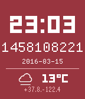</a>

<h2 class="app-name" id="app-56e26f1326f50d3de200004d"><a href="https://apps.repebble.com/56e26f1326f50d3de200004d">*nixTime</a></h2>
<a class="app-source" href="https://github.com/Roguelazer/nixTime" title="Source code" data-search-exclude>View source</a>

by <a href="https://apps.repebble.com/apps/dev/james-brown_52f009f94ae3630fc1000085" title="More from this developer">James Brown</a>

ISC v1.7 Updated 2016-03-17

Runs on: Round 2, Time 2, Pebble 2 Duo, Pebble 2, Time Round, Time, Classic

Really simple Pebble watchface which displays the current time, the current date, and the current Unix Timestamp (&quot;epoch time&quot;). Unlike every other epoch time watchface I could find, it only…

<h2 class="app-name" id="app-68fee3cea0599b0008f65a1f"><a href="https://apps.repebble.com/68fee3cea0599b0008f65a1f">*YRO&#x27;UE</a></h2>
<a class="app-source" href="https://codeberg.org/solunareclipse1/yroue-pebble" title="Source code" data-search-exclude>View source</a>

by <a href="https://apps.repebble.com/apps/dev/solunareclipse1_66993dda99ef950007b711b9" title="More from this developer">solunareclipse1</a>

See source v2.0.1 Updated 2026-09-27

Runs on: Round 2, Time 2, Pebble 2 Duo, Pebble 2, Time Round, Time, Classic

A goofy, esoteric watchface for Pebble. Based off a funny image. How to read the watchface: There are twelve &quot;hours&quot; in a day, and 120 minutes per &quot;hour&quot;, so each &quot;hour&quot; is actually two hours…

<h2 class="app-name" id="app-54bd32a23e504409d5000054"><a href="https://apps.repebble.com/54bd32a23e504409d5000054">./Hacked</a></h2>
<a class="app-source" href="https://github.com/jessemillar/Pebbling/tree/master/Hacked" title="Source code" data-search-exclude>View source</a>

by <a href="https://apps.repebble.com/apps/dev/jesse-millar_54305df1a2f622febf0001cc" title="More from this developer">Jesse Millar</a>

Not checked yet v1.0 Updated 2015-01-19

Runs on: Time 2, Pebble 2 Duo, Pebble 2, Time, Classic

A hacked-looking watchface kinda themed after the Watchdogs videogame. &#x27;Nuff said.

<a class="app-shot" href="https://apps.repebble.com/30b3c97f46be4699859706c0" data-search-exclude>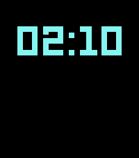</a>

<h2 class="app-name" id="app-30b3c97f46be4699859706c0"><a href="https://apps.repebble.com/30b3c97f46be4699859706c0">//GRID</a></h2>
<a class="app-source" href="https://github.com/gerbert/grid" title="Source code" data-search-exclude>View source</a>

by <a href="https://apps.repebble.com/apps/dev/gerbert_448ca3d91c5aed37ba166e4c" title="More from this developer">gerbert</a>

Not checked yet v2.7.3 Updated 2026-09-08

Runs on: Time 2, Pebble 2 Duo

//GRID is a minimalist watchface for Pebble Time 2 and Pebble 2 Duo, inspired by the visual language of the TRON universe - a black background, neon geometry, scanline details, and LCD-style…

<a class="app-shot" href="https://apps.repebble.com/55bcb9af28d7388fe3000035" data-search-exclude>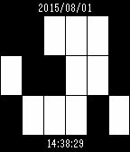</a>

<h2 class="app-name" id="app-55bcb9af28d7388fe3000035"><a href="https://apps.repebble.com/55bcb9af28d7388fe3000035">0101</a></h2>
<a class="app-source" href="https://github.com/dragmz/pebble-binclk" title="Source code" data-search-exclude>View source</a>

by <a href="https://apps.repebble.com/apps/dev/marcin-zawiejski_55bbe4e6b837f1abc4000086" title="More from this developer">Marcin Zawiejski</a>

Not checked yet v1.0 Updated 2015-08-01

Runs on: Time 2, Time

Binary time display

<a class="app-shot" href="https://apps.rebble.io/en_US/application/52c0ff5c2be6d8ecad000034" data-search-exclude>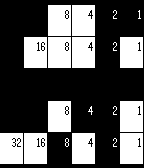</a>

<h2 class="app-name" id="app-52c0ff5c2be6d8ecad000034"><a href="https://apps.rebble.io/en_US/application/52c0ff5c2be6d8ecad000034">0x539</a></h2>
<a class="app-source" href="https://github.com/PJayB/0x539_watch_face" title="Source code" data-search-exclude>View source</a>

by <a href="https://apps.rebble.io/en_US/developer/52c0f47dcf53857c89000034/1" title="More from this developer">GeekyPanda</a>

No licence v1.0 Updated 2014-05-10 Rebble App Store

Runs on: Time 2, Pebble 2 Duo, Pebble 2, Time, Classic

Binary watch with Month/Day and Hour/Minute.

<a class="app-shot" href="https://apps.repebble.com/550e467ead788c03ba0000b7" data-search-exclude>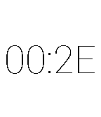</a>

<h2 class="app-name" id="app-550e467ead788c03ba0000b7"><a href="https://apps.repebble.com/550e467ead788c03ba0000b7">0xFACE</a></h2>
<a class="app-source" href="https://github.com/andrew749/0xFACE" title="Source code" data-search-exclude>View source</a>

by <a href="https://apps.repebble.com/apps/dev/andrew-codispoti_52f0480b1ac79491190011f1" title="More from this developer">Andrew Codispoti</a>

No licence v1.0 Updated 2015-03-22

Runs on: Time 2, Pebble 2 Duo, Pebble 2, Time, Classic

A simple watch face which displays the time as a hexadecimal value.

<a class="app-shot" href="https://apps.rebble.io/en_US/application/5844c28e00355aeb3d000980" data-search-exclude>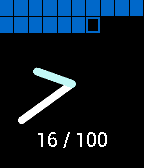</a>

<h2 class="app-name" id="app-5844c28e00355aeb3d000980"><a href="https://apps.rebble.io/en_US/application/5844c28e00355aeb3d000980">100 Blocks a Day</a></h2>
<a class="app-source" href="https://github.com/edwardsnjd/100BlocksADayFace" title="Source code" data-search-exclude>View source</a>

by <a href="https://apps.rebble.io/en_US/developer/56234efcd2a8ff4d8a000027/1" title="More from this developer">Nicholas Edwards</a>

Not checked yet v0.1 Updated 2016-12-05 Rebble App Store

Runs on: Round 2, Time 2, Time Round, Time

A simple 10x10 grid of blocks showing how many 10 minute blocks you&#x27;ve used today! Inspired by Tim Urban&#x27;s Wait but Why post, &quot;100 Blocks a Day&quot;.

<a class="app-shot" href="https://apps.repebble.com/5659ab0bc3a3a5e072000081" data-search-exclude>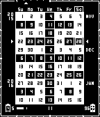</a>

<h2 class="app-name" id="app-5659ab0bc3a3a5e072000081"><a href="https://apps.repebble.com/5659ab0bc3a3a5e072000081">11 weeks</a></h2>
<a class="app-source" href="https://github.com/programus/pebble-watchface-11weeks" title="Source code" data-search-exclude>View source</a>

by <a href="https://apps.repebble.com/apps/dev/programus_555de42b7a947b3b690000ac" title="More from this developer">programus</a>

Not checked yet v2.0 Updated 2025-11-25

Runs on: Time 2, Pebble 2 Duo, Pebble 2, Time, Classic

11 weeks merged an 11 weeks calendar into a digital time watch face. It could tell you date, time, battery, bluetooth and even phone battery information if phone browser support. For weather…

<a class="app-shot" href="https://apps.rebble.io/en_US/application/6903d9978e00390009cf73d9" data-search-exclude>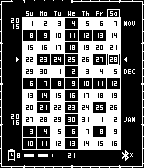</a>

<h2 class="app-name" id="app-6903d9978e00390009cf73d9"><a href="https://apps.rebble.io/en_US/application/6903d9978e00390009cf73d9">11 Weeks Calendar</a></h2>
<a class="app-source" href="https://github.com/TensorChris/pebble-11weeks-config" title="Source code" data-search-exclude>View source</a>

by <a href="https://apps.rebble.io/en_US/developer/6903d4d0856ddb000912d39e/1" title="More from this developer">realjavajim</a>

No licence v2.8 Updated 2025-11-01 Rebble App Store

Runs on: Time 2, Pebble 2 Duo, Pebble 2, Time, Classic

11 weeks merged an 11 weeks calendar into a digital time watch face. Features: - 11-week calendar view showing past and future weeks - Digital time display with customizable components - Date…

<a class="app-shot" href="https://apps.repebble.com/dbd21c5dd0614bef879e9ace" data-search-exclude>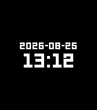</a>

<h2 class="app-name" id="app-dbd21c5dd0614bef879e9ace"><a href="https://apps.repebble.com/dbd21c5dd0614bef879e9ace">13:12</a></h2>
<a class="app-source" href="https://git.phntxx.com/bastian/pebble-watchface-1312" title="Source code" data-search-exclude>View source</a>

by <a href="https://apps.repebble.com/apps/dev/phntxx_541c14dad813567f3c0003c2" title="More from this developer">phntxx</a>

See source v1.0.0 Updated 2026-08-25

Runs on: Round 2, Time 2, Pebble 2 Duo, Pebble 2, Time Round, Time, Classic

The only watchface that always tells the correct time! The time on this watchface does not update. It&#x27;s always 13:12 (&quot;1312&quot; being &quot;ACAB&quot;, &quot;All Cops Are Bastards&quot;, encoded by the position of each…

<a class="app-shot" href="https://apps.repebble.com/58237be0b62cefad1500001b" data-search-exclude>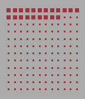</a>

<h2 class="app-name" id="app-58237be0b62cefad1500001b"><a href="https://apps.repebble.com/58237be0b62cefad1500001b">1440</a></h2>
<a class="app-source" href="https://github.com/b123400/1440-watchface" title="Source code" data-search-exclude>View source</a>

by <a href="https://apps.repebble.com/apps/dev/b123400_52f044741ac79491190010f0" title="More from this developer">b123400</a>

GPL-3.0 v1.0 Updated 2025-05-22

Runs on: Time 2, Pebble 2 Duo, Pebble 2, Time, Classic

1 grid, 1 day. Every dot represents 10 minutes. This is a watchface inspired by the ttmm series (http://ttmm.eu).

<a class="app-shot" href="https://apps.repebble.com/5359f131e03d48ecbf000101" data-search-exclude>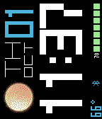</a>

<h2 class="app-name" id="app-5359f131e03d48ecbf000101"><a href="https://apps.repebble.com/5359f131e03d48ecbf000101">180degrees</a></h2>
<a class="app-source" href="https://github.com/mereed/pebbleface-180degC" title="Source code" data-search-exclude>View source</a>

by <a href="https://apps.repebble.com/apps/dev/chops_52d76309bd61272345000001" title="More from this developer">chops</a>

Not checked yet v2.1 Updated 2016-02-17

Runs on: Time 2, Pebble 2 Duo, Pebble 2, Time, Classic

&#x27;90degC&#x27; rotated for those who wear their watch on the right arm. ps. the previous version can be downloaded from my website.

<a class="app-shot" href="https://apps.repebble.com/54591fe85a7e52bd8b00007c" data-search-exclude>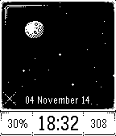</a>

<h2 class="app-name" id="app-54591fe85a7e52bd8b00007c"><a href="https://apps.repebble.com/54591fe85a7e52bd8b00007c">2001: Space Watch</a></h2>
<a class="app-source" href="https://github.com/w84death/2001-space-watch" title="Source code" data-search-exclude>View source</a>

by <a href="https://apps.repebble.com/apps/dev/p1x_5410171466e853e34100010f" title="More from this developer">P1X</a>

Not checked yet v1.13 Updated 2014-11-10

Runs on: Time 2, Pebble 2 Duo, Pebble 2, Time, Classic

*** Your own unique cosmos *** Practically infinite number of rich and fantastic backgrounds at each hour. You will never seen two identical backgrounds! Yes, that&#x27;s the power of procedural…

<a class="app-shot" href="https://apps.repebble.com/5415e8ce39b1c787430000b2" data-search-exclude>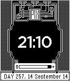</a>

<h2 class="app-name" id="app-5415e8ce39b1c787430000b2"><a href="https://apps.repebble.com/5415e8ce39b1c787430000b2">2001: Wachface</a></h2>
<a class="app-source" href="https://github.com/w84death/2001-Watchface" title="Source code" data-search-exclude>View source</a>

by <a href="https://apps.repebble.com/apps/dev/p1x_5410171466e853e34100010f" title="More from this developer">P1X</a>

Not checked yet v1.2 Updated 2014-09-19

Runs on: Time 2, Pebble 2 Duo, Pebble 2, Time, Classic

Watchface promoting upcoming &quot;2001: A Space Shooter&quot; game for Pebble. Features: - neat pixel art - battery status - day of the year - full date Designed &amp; developed by P1X Indie Gamedev Studio…

<a class="app-shot" href="https://apps.rebble.io/en_US/application/6917ca9d966c150009f9bfaa" data-search-exclude>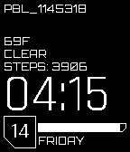</a>

<h2 class="app-name" id="app-6917ca9d966c150009f9bfaa"><a href="https://apps.rebble.io/en_US/application/6917ca9d966c150009f9bfaa">2077</a></h2>
<a class="app-source" href="https://github.com/moddedBear/pebble-2077" title="Source code" data-search-exclude>View source</a>

by <a href="https://apps.rebble.io/en_US/developer/68ec6fc70709b7000797e3f8/1" title="More from this developer">Jeremy Payne</a>

Not checked yet v1.0 Updated 2025-11-15 Rebble App Store

Runs on: Time 2, Pebble 2 Duo, Pebble 2, Time, Classic

A futuristic watchface inspired by Cyberpunk 2077. Features: - Battery bar - Step counter - Current weather - Fully customizable top text - Hourly vibration alert - Bluetooth disconnect alert

<a class="app-shot" href="https://apps.repebble.com/57018c2e83140d0ed700000c" data-search-exclude>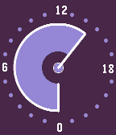</a>

<h2 class="app-name" id="app-57018c2e83140d0ed700000c"><a href="https://apps.repebble.com/57018c2e83140d0ed700000c">24 Hours of Color</a></h2>
<a class="app-source" href="https://github.com/Roguelazer/24hOfColor" title="Source code" data-search-exclude>View source</a>

by <a href="https://apps.repebble.com/apps/dev/james-brown_52f009f94ae3630fc1000085" title="More from this developer">James Brown</a>

No licence v0.1 Updated 2016-04-03

Runs on: Round 2, Time 2, Pebble 2 Duo, Pebble 2, Time Round, Time, Classic

Simple 24-hour watchface (with midnight at the bottom and noon at the top) that wanders through random (hopefully attractive color combinations).

<a class="app-shot" href="https://apps.repebble.com/5416684eef530490a20000f3" data-search-exclude>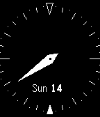</a>

<h2 class="app-name" id="app-5416684eef530490a20000f3"><a href="https://apps.repebble.com/5416684eef530490a20000f3">24h analog clock</a></h2>
<a class="app-source" href="https://github.com/jaustindavid/pebble-24h-analog" title="Source code" data-search-exclude>View source</a>

by <a href="https://apps.repebble.com/apps/dev/austin-david_54133ced614337422b00019d" title="More from this developer">Austin David</a>

Not checked yet v1.1 Updated 2014-09-21

Runs on: Time 2, Pebble 2 Duo, Pebble 2, Time, Classic

a single hand, 24h dial w/ midnight @ top. Tickmarks at :30 intervals. Based from the &quot;simple analog&quot; example code, which incidentally didn&#x27;t work correctly.

<a class="app-shot" href="https://apps.rebble.io/en_US/application/58471a9900355abe66000ddf" data-search-exclude>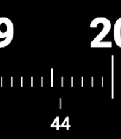</a>

<h2 class="app-name" id="app-58471a9900355abe66000ddf"><a href="https://apps.rebble.io/en_US/application/58471a9900355abe66000ddf">24h watchface</a></h2>
<a class="app-source" href="https://github.com/brunnolou/24h-pebble-watchface" title="Source code" data-search-exclude>View source</a>

by <a href="https://apps.rebble.io/en_US/developer/5846c8c800355a8e27000df3/1" title="More from this developer">Bruno Lourenço</a>

GPL-3.0 v0.0 Updated 2016-12-06 Rebble App Store

Runs on: Round 2, Time 2, Pebble 2 Duo, Pebble 2, Time Round, Time

Why the analog watches have two hands? Why show only 12h if we have 24h each day? Why should we care about all the other numbers if we only want to see the current hour and minute? Well, a digital…

<a class="app-shot" href="https://apps.repebble.com/e06a6b84092b469390bd6d6d" data-search-exclude>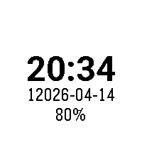</a>

<h2 class="app-name" id="app-e06a6b84092b469390bd6d6d"><a href="https://apps.repebble.com/e06a6b84092b469390bd6d6d">25 Hour Day</a></h2>
<a class="app-source" href="https://github.com/jceaser/pebble-hour25" title="Source code" data-search-exclude>View source</a>

by <a href="https://apps.repebble.com/apps/dev/thomas-cherry_e17c5c02c0004112d037771d" title="More from this developer">Thomas Cherry</a>

Not checked yet v0.1 Updated 2026-04-15

Runs on: Round 2, Time 2, Pebble 2 Duo, Pebble 2, Time Round, Time

Need more time? Tired of other watches shorting your day? Try our 25 Hour Watch, now with an extra hour! Get more done, have more personal time, enjoy life for once! With our patented time…

<a class="app-shot" href="https://apps.rebble.io/en_US/application/585572685de850e8dc00017c" data-search-exclude>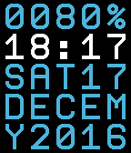</a>

<h2 class="app-name" id="app-585572685de850e8dc00017c"><a href="https://apps.rebble.io/en_US/application/585572685de850e8dc00017c">25 o&#x27;clock</a></h2>
<a class="app-source" href="https://github.com/giatro/25OCLOCK" title="Source code" data-search-exclude>View source</a>

by <a href="https://apps.rebble.io/en_US/developer/56162132ef230bb954000073/1" title="More from this developer">Gianluca Troiani</a>

Not checked yet v1.1 Updated 2025-11-25 Rebble App Store

Runs on: Time 2, Pebble 2 Duo, Pebble 2, Time, Classic

5x5 text grid watchface. You can set function for each line from: - Time (12:34) - Day date (SUN01) - Month date (DEC01) - Month (DECEM) - Year (Y2016) - Battery - Steps You can set font and…

<a class="app-shot" href="https://apps.repebble.com/54cadfd211e375bdc5000048" data-search-exclude>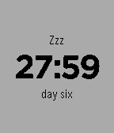</a>

<h2 class="app-name" id="app-54cadfd211e375bdc5000048"><a href="https://apps.repebble.com/54cadfd211e375bdc5000048">28 Hour Day</a></h2>
<a class="app-source" href="https://github.com/rileyjshaw/28-hour-day-pebble" title="Source code" data-search-exclude>View source</a>

by <a href="https://apps.repebble.com/apps/dev/rileyjshaw_52f0ac2aaf0eab128400242c" title="More from this developer">rileyjshaw</a>

Not checked yet v1.0 Updated 2015-01-30

Runs on: Time 2, Pebble 2 Duo, Pebble 2, Time, Classic

Wake up early on weekdays. Stay up late on weekends. Sleep 9 hours a night and fit an extra 3 hours into each day. This watchface divides the week into six 28-hour days instead of the standard…

<a class="app-shot" href="https://apps.repebble.com/561e1d0cf07f67be11000051" data-search-exclude>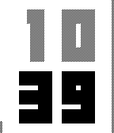</a>

<h2 class="app-name" id="app-561e1d0cf07f67be11000051"><a href="https://apps.repebble.com/561e1d0cf07f67be11000051">2B WATCH</a></h2>
<a class="app-source" href="https://github.com/rejca/2B-WATCH" title="Source code" data-search-exclude>View source</a>

by <a href="https://apps.repebble.com/apps/dev/rej-a_5600024c421a44c09400004a" title="More from this developer">Rejča</a>

Not checked yet v1.2 Updated 2025-11-25

Runs on: Time 2, Pebble 2 Duo, Pebble 2, Time, Classic

Beautiful stylish pixelart watchface. Two colors of numbers - white (black) and gray. Two styles - white or black. Two fonts - normal or light. Three options of display minutes - bottom, right…

<a class="app-shot" href="https://apps.repebble.com/7ff21e904edc4b3bbd5e0b5e" data-search-exclude>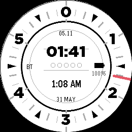</a>

<h2 class="app-name" id="app-7ff21e904edc4b3bbd5e0b5e"><a href="https://apps.repebble.com/7ff21e904edc4b3bbd5e0b5e">36 Hour Clock</a></h2>
<a class="app-source" href="https://github.com/Lallander/36-Hour-Clock-PR2/" title="Source code" data-search-exclude>View source</a>

by <a href="https://apps.repebble.com/apps/dev/lallander_39e74a1e1cc9556461815155" title="More from this developer">Lallander</a>

MIT v1.0.1 Updated 2026-05-31

Runs on: Round 2

A simple watch face for the Pebble Round 2 that shows 36 hour time alongside standard 24/12 hour time. Heximal Metric Time.

<a class="app-shot" href="https://apps.repebble.com/559be5f63eff7a601800003e" data-search-exclude>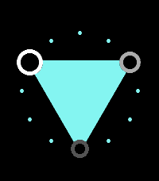</a>

<h2 class="app-name" id="app-559be5f63eff7a601800003e"><a href="https://apps.repebble.com/559be5f63eff7a601800003e">3ANGLE</a></h2>
<a class="app-source" href="https://github.com/fredley/3ANGLE" title="Source code" data-search-exclude>View source</a>

by <a href="https://apps.repebble.com/apps/dev/tom-medley_53206910deec0c9bdd0001ab" title="More from this developer">Tom Medley</a>

Not checked yet v2.0.1 Updated 2026-06-04

Runs on: Round 2, Time 2, Pebble 2 Duo, Pebble 2, Time Round, Time, Classic

3Angle displays the time using a triangle connecting the hour, minute and second. A unique and stylish way to show off your Pebble! Inspired by a design by Rasam Rostami on Behance.

<a class="app-shot" href="https://apps.repebble.com/54d078730782b816bf000069" data-search-exclude>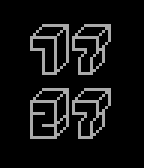</a>

<h2 class="app-name" id="app-54d078730782b816bf000069"><a href="https://apps.repebble.com/54d078730782b816bf000069">3D Pixel</a></h2>
<a class="app-source" href="https://github.com/Donovon/Pebble3DPixel" title="Source code" data-search-exclude>View source</a>

by <a href="https://apps.repebble.com/apps/dev/donovon-bacon_53560f53ee307c359d0000bd" title="More from this developer">Donovon Bacon</a>

No licence v1.0 Updated 2015-02-03

Runs on: Time 2, Pebble 2 Duo, Pebble 2, Time, Classic

A simple 3D Pixel watchface. Font used is 3D Thirteen Pixel Fonts by Florian Contreras.

<a class="app-shot" href="https://apps.repebble.com/40a625e429a74c9c87df0150" data-search-exclude>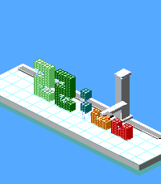</a>

<h2 class="app-name" id="app-40a625e429a74c9c87df0150"><a href="https://apps.repebble.com/40a625e429a74c9c87df0150">3D Printer</a></h2>
<a class="app-source" href="https://github.com/ericmigi/iso-printer" title="Source code" data-search-exclude>View source</a>

by <a href="https://apps.repebble.com/apps/dev/eric-migicovsky_cef3527f00d692f8c467ca17" title="More from this developer">Eric Migicovsky</a>

Not checked yet v1.0.1 Updated 2026-08-24

Runs on: Round 2, Time 2

My son is obsessed with 3d printing and came up with the idea for this watchface! One other cool thing - it uses your current location and time of year to accurately paint shadows.

<h2 class="app-name" id="app-5477d51f67c622aab70000ee"><a href="https://apps.repebble.com/5477d51f67c622aab70000ee">3D Wedge</a></h2>
<a class="app-source" href="https://github.com/ygalanter/3D_Wedge" title="Source code" data-search-exclude>View source</a>

by <a href="https://apps.repebble.com/apps/dev/comfortably-numb_52f547605101128b2200005a" title="More from this developer">Comfortably Numb</a>

Not checked yet v2.5 Updated 2015-10-15

Runs on: Round 2, Time 2, Pebble 2 Duo, Pebble 2, Time Round, Time, Classic

- Large time in 3D Wedge effect - AM/PM indicator (for 12h mode) - Date, day of the week - Battery percentage - Bluetooth disconnect notification

<a class="app-shot" href="https://apps.repebble.com/55a23c67c6cca772db000007" data-search-exclude>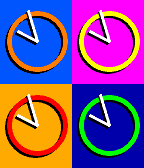</a>

<h2 class="app-name" id="app-55a23c67c6cca772db000007"><a href="https://apps.repebble.com/55a23c67c6cca772db000007">4pop</a></h2>
<a class="app-source" href="https://github.com/frogamic/4pop" title="Source code" data-search-exclude>View source</a>

by <a href="https://apps.repebble.com/apps/dev/frogamic_55015e7e7ed24a01d400000c" title="More from this developer">frogamic</a>

Not checked yet v1.0 Updated 2015-07-18

Runs on: Time 2, Time

A colourful Andy Warhol inspired pop-art face. This 4-up face lets you set the colour of each background, ring and set of hands so you can customise it to your heart&#x27;s content. Background or ring…

<h2 class="app-name" id="app-540590bd8b09eed09f000199"><a href="https://apps.repebble.com/540590bd8b09eed09f000199">5 O&#x27;Clock</a></h2>
<a class="app-source" href="https://github.com/glejeune/5-o-clock" title="Source code" data-search-exclude>View source</a>

by <a href="https://apps.repebble.com/apps/dev/gregoire-lejeune_539870d2a2108aa1d6000009" title="More from this developer">Gregoire Lejeune</a>

Not checked yet v1.0 Updated 2014-09-02

Runs on: Time 2, Pebble 2 Duo, Pebble 2, Time, Classic

A very simple watchface for humans that think that it&#x27;s quarter past three and not 3:17. So, it give you the time with a 5 minutes precision. There is also a dot showing you the seconds. This one…

<h2 class="app-name" id="app-1a4930111a134151813ca2bf"><a href="https://apps.repebble.com/1a4930111a134151813ca2bf">50 States</a></h2>
<a class="app-source" href="https://github.com/nicksterx/states-watchface" title="Source code" data-search-exclude>View source</a>

by <a href="https://apps.repebble.com/apps/dev/nick-bachicha_1020315d951b0c0f1b22addb" title="More from this developer">Nick Bachicha</a>

Not checked yet v1.3 Updated 2026-08-21

Runs on: Round 2, Time 2, Pebble 2 Duo, Pebble 2, Time Round, Time, Classic

Learn about the 50 states from your watch face. Each minute represents when the state joined the union. For example :01 is Delaware and :50 is Hawaii. Other territories and fun facts for minutes…

<a class="app-shot" href="https://apps.repebble.com/52cb5ae045ffdd5c5e0000b3" data-search-exclude>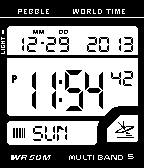</a>

<h2 class="app-name" id="app-52cb5ae045ffdd5c5e0000b3"><a href="https://apps.repebble.com/52cb5ae045ffdd5c5e0000b3">59 dub</a></h2>
<a class="app-source" href="https://github.com/leighmurray/Fifty-Nine-Dub" title="Source code" data-search-exclude>View source</a>

by <a href="https://apps.repebble.com/apps/dev/leigh-murray_52c8e4112b59ec92d2000034" title="More from this developer">Leigh Murray</a>

Not checked yet v1.2 Updated 2014-02-11

Runs on: Time 2, Pebble 2 Duo, Pebble 2, Time, Classic

This classic watch-face features an easy to read display with all your time and date information at a glance. - Vibrate every hour (optional in settings) - Year, Month, Date, Day, Hour, Minute…

<a class="app-shot" href="https://apps.repebble.com/5577640011de61b39f00006b" data-search-exclude>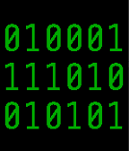</a>

<h2 class="app-name" id="app-5577640011de61b39f00006b"><a href="https://apps.repebble.com/5577640011de61b39f00006b">6-bit Homebrew Binary Watchface</a></h2>
<a class="app-source" href="https://github.com/RobOfTheSkyPeople/PblHomebrew6bitBinary" title="Source code" data-search-exclude>View source</a>

by <a href="https://apps.repebble.com/apps/dev/precision-craftsman_542860e869f2895d7d000092" title="More from this developer">Precision Craftsman</a>

No licence v1.0 Updated 2015-06-12

Runs on: Time 2, Time

6-bit binary watchface in homebrew colors derived from MyNameIsKir&#x27;s Binary Watch face.

<a class="app-shot" href="https://apps.repebble.com/557b67179362832c2e000088" data-search-exclude>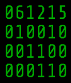</a>

<h2 class="app-name" id="app-557b67179362832c2e000088"><a href="https://apps.repebble.com/557b67179362832c2e000088">6-Bit Homebrew Binary Watchface with Date</a></h2>
<a class="app-source" href="https://github.com/RobOfTheSkyPeople/PblHomebrew6bitBinaryWithDate" title="Source code" data-search-exclude>View source</a>

by <a href="https://apps.repebble.com/apps/dev/precision-craftsman_542860e869f2895d7d000092" title="More from this developer">Precision Craftsman</a>

No licence v1.0 Updated 2015-06-12

Runs on: Time 2, Time

This is my first working modification of MyNameIsKir&#x27;s Binary Watch watchface for the Pebble Smart Watch (https://github.com/MyNameIsKir/Pebble-Binary-Watch-C). Most of the code is hers; I just…

<h2 class="app-name" id="app-54f007fa380aa6e5fa00003e"><a href="https://apps.repebble.com/54f007fa380aa6e5fa00003e">60 Shades of Time</a></h2>
<a class="app-source" href="https://github.com/dstosik/60-shades-of-time" title="Source code" data-search-exclude>View source</a>

by <a href="https://apps.repebble.com/apps/dev/david-stosik_535657c3c822ffc62800014f" title="More from this developer">David Stosik</a>

Not checked yet v1.5 Updated 2015-10-21

Runs on: Round 2, Time 2, Pebble 2 Duo, Pebble 2, Time Round, Time, Classic

The Pebble Time version is now available in the store! You don&#x27;t need to get it from the source link anymore. Now compatible with 1-st generation Pebble watches and the latest Pebble Time Round!…

<a class="app-shot" href="https://apps.repebble.com/225be1940e88497c83f73e44" data-search-exclude>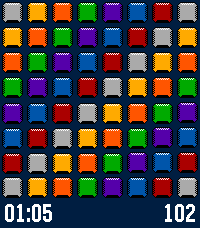</a>

<h2 class="app-name" id="app-225be1940e88497c83f73e44"><a href="https://apps.repebble.com/225be1940e88497c83f73e44">64 Cores</a></h2>
<a class="app-source" href="https://github.com/cmbartschat/pebble-64cores" title="Source code" data-search-exclude>View source</a>

by <a href="https://apps.repebble.com/apps/dev/christoph-bartschat_6b0fa772f962342b8f5dd140" title="More from this developer">Christoph Bartschat</a>

Not checked yet v1.0.3 Updated 2026-06-27

Runs on: Time 2

Check up on your 64 Cores game directly from your wrist Start a new game at https://64cor.es

<a class="app-shot" href="https://apps.repebble.com/549077e0cd117d6d720000f5" data-search-exclude>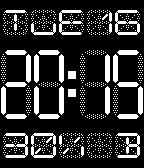</a>

<h2 class="app-name" id="app-549077e0cd117d6d720000f5"><a href="https://apps.repebble.com/549077e0cd117d6d720000f5">7 Seg</a></h2>
<a class="app-source" href="http://mercurial.shangtai.net/repo/7-seg/" title="Source code" data-search-exclude>View source</a>

by <a href="https://apps.repebble.com/apps/dev/staffan-thomen_531b2c732a95cc1a1b000410" title="More from this developer">Staffan Thomen</a>

See source v1.8 Updated 2017-08-10

Runs on: Time 2, Pebble 2 Duo, Pebble 2, Time, Classic

Shows the time in 7-segment retro style. Day (using the new pebble localized strings), date, battery level and bluetooth status in 14-segment text. Optionally invert the screen, remove the…

<a class="app-shot" href="https://apps.rebble.io/en_US/application/693defeac098f800098a8394" data-search-exclude>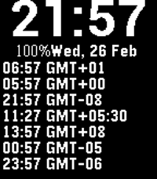</a>

<h2 class="app-name" id="app-693defeac098f800098a8394"><a href="https://apps.rebble.io/en_US/application/693defeac098f800098a8394">7 timezones</a></h2>
<a class="app-source" href="https://github.com/clach04/pebble_tz/" title="Source code" data-search-exclude>View source</a>

by <a href="https://apps.rebble.io/en_US/developer/5524604a9de9550a3300007a/1" title="More from this developer">clach04</a>

Not checked yet v1.7 Updated 2026-03-02 Rebble App Store

Runs on: Round 2, Time 2, Pebble 2 Duo, Pebble 2, Time Round, Time, Classic

Newer version of Minute TZ - with 7 (seven) Time Zones Pebble Watchface For Multiple Timezones * Display time, updating once per minute, using system font * Display Battery power * Display notice…

<a class="app-shot" href="https://apps.repebble.com/543615e8705eaaed670001f6" data-search-exclude>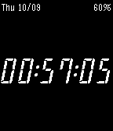</a>

<h2 class="app-name" id="app-543615e8705eaaed670001f6"><a href="https://apps.repebble.com/543615e8705eaaed670001f6">7-Segment #1</a></h2>
<a class="app-source" href="https://github.com/dse/watchface-7-segment-1" title="Source code" data-search-exclude>View source</a>

by <a href="https://apps.repebble.com/apps/dev/darren-embry_53fe39bc95b19192710000d4" title="More from this developer">Darren Embry</a>

Not checked yet v1.1 Updated 2014-10-09

Runs on: Time 2, Pebble 2 Duo, Pebble 2, Time, Classic

It&#x27;s... a seven-segment LCD style watchface. Switch to another watchface and back to this one to switch to inverse video. Repeat to switch back to normal.

<a class="app-shot" href="https://apps.repebble.com/e7546ae4120f414d9c7014b0" data-search-exclude>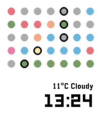</a>

<h2 class="app-name" id="app-e7546ae4120f414d9c7014b0"><a href="https://apps.repebble.com/e7546ae4120f414d9c7014b0">7dots</a></h2>
<a class="app-source" href="https://github.com/mdlt7z/7dots" title="Source code" data-search-exclude>View source</a>

by <a href="https://apps.repebble.com/apps/dev/mdlt7z_dd1c5ad7d92a5dd3acb1e367" title="More from this developer">mdlt7z</a>

Not checked yet v1.0 Updated 2026-04-18

Runs on: Round 2, Time 2, Time Round, Time

Minimalist information display using 7 dots ;) ## Dot Features - 📅 Day of the week - 👟 Step goal progress - ☁️ Weather forecast - ☀️ Sunrise/Sunset - 🔋 Battery The colors give you a &quot;feel&quot; for…

<a class="app-shot" href="https://apps.rebble.io/en_US/application/591ead370dfc32aacf000204" data-search-exclude>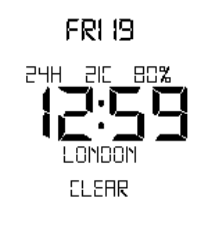</a>

<h2 class="app-name" id="app-591ead370dfc32aacf000204"><a href="https://apps.rebble.io/en_US/application/591ead370dfc32aacf000204">7egment</a></h2>
<a class="app-source" href="https://github.com/dieghernan/7egment" title="Source code" data-search-exclude>View source</a>

by <a href="https://apps.rebble.io/en_US/developer/52f15b6dc41172eebc0004dc/1" title="More from this developer">dieghernan</a>

Not checked yet v1.3 Updated 2017-06-13 Rebble App Store

Runs on: Round 2, Time 2, Pebble 2 Duo, Pebble 2, Time Round, Time, Classic

7egment is a customizable watchface based on the classic 7-segment display that adds your location and the current weather information in the language used on your watch and smartphone. Features …

<h2 class="app-name" id="app-52a9b0eac0ca93166a000070"><a href="https://apps.repebble.com/52a9b0eac0ca93166a000070">8 Ball Fortune Teller</a></h2>
<a class="app-source" href="https://github.com/rjw57/8ball-pebble-face" title="Source code" data-search-exclude>View source</a>

by <a href="https://apps.repebble.com/apps/dev/rich-wareham_52a9af1ec0ca93438b00006d" title="More from this developer">Rich Wareham</a>

Not checked yet v1.0.1 Updated 2013-12-13

Runs on: Time 2, Pebble 2 Duo, Pebble 2, Time, Classic

A watch face which works in a similar way as the fortune telling toy. Normally the time and date are shown on your wrist but a single flick will transform it into one of the famous answers.

<a class="app-shot" href="https://apps.repebble.com/53567bdf3a327510d600016e" data-search-exclude>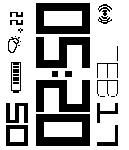</a>

<h2 class="app-name" id="app-53567bdf3a327510d600016e"><a href="https://apps.repebble.com/53567bdf3a327510d600016e">90degrees A</a></h2>
<a class="app-source" href="https://github.com/mereed/pebbleface-90degA" title="Source code" data-search-exclude>View source</a>

by <a href="https://apps.repebble.com/apps/dev/chops_52d76309bd61272345000001" title="More from this developer">chops</a>

Not checked yet v1.9 Updated 2017-01-02

Runs on: Time 2, Pebble 2 Duo, Pebble 2, Time, Classic

feb 17: supports aplite/basalt platforms, added wether temp number, fixed weather api issue everything is rotated 90 degrees for sideways reading. found it quite useful since i spend most of my…

<a class="app-shot" href="https://apps.rebble.io/en_US/application/5aecbeebf38588a252000834" data-search-exclude>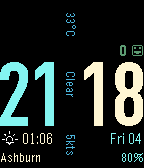</a>

<h2 class="app-name" id="app-5aecbeebf38588a252000834"><a href="https://apps.rebble.io/en_US/application/5aecbeebf38588a252000834">90° DIN</a></h2>
<a class="app-source" href="https://github.com/astosia/din-90" title="Source code" data-search-exclude>View source</a>

by <a href="https://apps.rebble.io/en_US/developer/58a635d30dfc320dc60003b4/1" title="More from this developer">astosia</a>

No licence v1.3 Updated 2018-05-12 Rebble App Store

Runs on: Round 2, Time 2, Pebble 2 Duo, Pebble 2, Time Round, Time, Classic

90° DIN is a customizable watchface that shows current weather information (temperature, conditions and wind speed in knots) at 90 degrees vertically through the centre of the watchface. Also…

<a class="app-shot" href="https://apps.repebble.com/49c4f560ff4141548025f29f" data-search-exclude>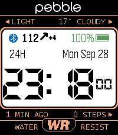</a>

<h2 class="app-name" id="app-49c4f560ff4141548025f29f"><a href="https://apps.repebble.com/49c4f560ff4141548025f29f">91 Dub CGM</a></h2>
<a class="app-source" href="https://github.com/sgitaize/dubv4cgm" title="Source code" data-search-exclude>View source</a>

by <a href="https://apps.repebble.com/apps/dev/sgitaize_67c0d9b131804900097db57a" title="More from this developer">sgitaize</a>

Not checked yet v1.1.0 Updated 2026-09-28

Runs on: Time 2

The classic 91 Dub look for Pebble Time 2 – now with live Nightscout CGM (blood glucose). As a diabetic you want a cool watchface too. - Glucose value with trend arrow and delta in the panel…

<a class="app-shot" href="https://apps.rebble.io/en_US/application/5410c258047a6dc4e0000289" data-search-exclude>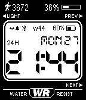</a>

<h2 class="app-name" id="app-5410c258047a6dc4e0000289"><a href="https://apps.rebble.io/en_US/application/5410c258047a6dc4e0000289">91 DUB PRO</a></h2>
<a class="app-source" href="https://github.com/ShaBP/91DubPro" title="Source code" data-search-exclude>View source</a>

by <a href="https://apps.rebble.io/en_US/developer/52f018d9bb3423921000022d/1" title="More from this developer">ShaBP</a>

No licence v2.1 Updated 2015-01-15 Rebble App Store

Runs on: Time 2, Pebble 2 Duo, Pebble 2, Time, Classic

The best iPhone companion if you like classic digital watch design. All the info you need at a glimpse, including steps count measured on iPhone 5s/6/6+. Set target steps on Smartwatch Pro…

<a class="app-shot" href="https://apps.repebble.com/554e08d40136b0e6e200001b" data-search-exclude>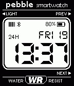</a>

<h2 class="app-name" id="app-554e08d40136b0e6e200001b"><a href="https://apps.repebble.com/554e08d40136b0e6e200001b">91 Dub v2.0</a></h2>
<a class="app-source" href="https://github.com/orviwan/91-Dub-v2.0" title="Source code" data-search-exclude>View source</a>

by <a href="https://apps.repebble.com/apps/dev/orviwan_5299c96ae627ce3692000095" title="More from this developer">orviwan</a>

Not checked yet v2.9 Updated 2015-05-09

Runs on: Time 2, Pebble 2 Duo, Pebble 2, Time, Classic

The original and best fairly classic watch face, optimised and updated for Pebble 2.0. If you love it as much as I do, give it a LIKE. This watch face has been superseded by v3.0, this version has…

<a class="app-shot" href="https://apps.repebble.com/9c38203a46aa4feebba82648" data-search-exclude>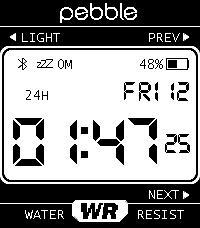</a>

<h2 class="app-name" id="app-9c38203a46aa4feebba82648"><a href="https://apps.repebble.com/9c38203a46aa4feebba82648">91 Dub v5</a></h2>
<a class="app-source" href="https://codeberg.org/lightrush/91-dub-v5" title="Source code" data-search-exclude>View source</a>

by <a href="https://apps.repebble.com/apps/dev/lightrush_a629091196f5c43f3bece7ef" title="More from this developer">lightrush</a>

See source v5.5.4 Updated 2026-07-08

Runs on: Time 2

91 Dub v5 A fork of the great [91 Dub v4.0](https://github.com/orviwan/91-dub-4.0) watchface by Orviwan, rebuilt for the Pebble Time 2 (Emery). - Optimized for the new PT2 display resolution with…

<a class="app-shot" href="https://apps.repebble.com/faedd501f8994eb3ba771475" data-search-exclude>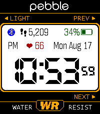</a>

<h2 class="app-name" id="app-faedd501f8994eb3ba771475"><a href="https://apps.repebble.com/faedd501f8994eb3ba771475">91 Dub v5 plus</a></h2>
<a class="app-source" href="https://codeberg.org/dflo/91-dub-v5-plus" title="Source code" data-search-exclude>View source</a>

by <a href="https://apps.repebble.com/apps/dev/dflo_b8221aa0c9a8dfb3f3a9ab91" title="More from this developer">dflo</a>

See source v6.0.21 Updated 2026-09-17

Runs on: Time 2

91 Dub v5 plus A fork of 91 Dub v5 by lightrush[2] ( which is A fork of the great 91 Dub v4.0 watchface by Orviwan[1], rebuilt for the Pebble Time 2. ) Fully configurable colors New in v5 plus: …

<a class="app-shot" href="https://apps.rebble.io/en_US/application/56f2f298065dfd86a800000c" data-search-exclude>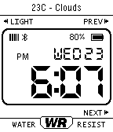</a>

<h2 class="app-name" id="app-56f2f298065dfd86a800000c"><a href="https://apps.rebble.io/en_US/application/56f2f298065dfd86a800000c">91 Dub Weather</a></h2>
<a class="app-source" href="https://github.com/singleserveapps/91-Dub-v2.0" title="Source code" data-search-exclude>View source</a>

by <a href="https://apps.rebble.io/en_US/developer/542eeb101df24a56960001bd/1" title="More from this developer">singleserveapps</a>

Not checked yet v1.5 Updated 2016-10-14 Rebble App Store

Runs on: Time 2, Pebble 2 Duo, Pebble 2, Time, Classic

A version of 91 Dub (originally by orviwan) with added weather information. - Select how often OpenWeatherMap.org weather information is updated - Retrieve weather information using GPS or by…

<a class="app-shot" href="https://apps.repebble.com/5936a75cb67f9f88a6000ae4" data-search-exclude>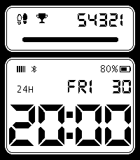</a>

<h2 class="app-name" id="app-5936a75cb67f9f88a6000ae4"><a href="https://apps.repebble.com/5936a75cb67f9f88a6000ae4">91 Steps &amp; Heart Rate</a></h2>
<a class="app-source" href="https://github.com/ProggroP/91StepsHeart" title="Source code" data-search-exclude>View source</a>

by <a href="https://apps.repebble.com/apps/dev/kieselleger_56f70d3fe58879cfd4000013" title="More from this developer">Kieselleger</a>

Other v2.8.0 Updated 2026-06-28

Runs on: Round 2, Time 2, Pebble 2 Duo, Pebble 2, Time Round, Time, Classic

Inspired by and partly based on 91 Dub (thanks for the great watchface!), this watchface displays real-time sensor data. The configuration includes a daily step goal, a 12-hour format option, and…

<a class="app-shot" href="https://apps.repebble.com/52cf86f58fdab5f51e000040" data-search-exclude>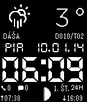</a>

<h2 class="app-name" id="app-52cf86f58fdab5f51e000040"><a href="https://apps.repebble.com/52cf86f58fdab5f51e000040">91 Weather Moon Names SK</a></h2>
<a class="app-source" href="https://github.com/mc1100/ninety_weather_moon_names_sk/tree/sdk_2.0" title="Source code" data-search-exclude>View source</a>

by <a href="https://apps.repebble.com/apps/dev/mc1100_5299fcee129af7ea5f0000a1" title="More from this developer">mc1100</a>

Not checked yet v2.0.1 Updated 2014-01-20

Runs on: Time 2, Pebble 2 Duo, Pebble 2, Time, Classic

A digital watchface which displays current weather, temperature, moon phase, sunrise, sunset and Slovak nameday.

<h2 class="app-name" id="app-559e5a5be2b45aea6e000016"><a href="https://apps.repebble.com/559e5a5be2b45aea6e000016">9292 ov</a></h2>
<a class="app-source" href="http://github.com/svlentink/9292" title="Source code" data-search-exclude>View source</a>

by <a href="https://apps.repebble.com/apps/dev/svlentink_54d10a20dec337d37b0000a1" title="More from this developer">svlentink</a>

No licence v0.1 Updated 2015-07-09

Runs on: Time 2, Pebble 2 Duo, Pebble 2, Time, Classic

Navigation watchface for the Netherlands. This app uses the api from 9292.nl. It uses the location from your phone as starting location and your defined destination as finish. How it works. You…

<a class="app-shot" href="https://apps.repebble.com/e2bfdd0a808541ef8492a930" data-search-exclude>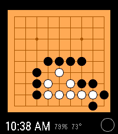</a>

<h2 class="app-name" id="app-e2bfdd0a808541ef8492a930"><a href="https://apps.repebble.com/e2bfdd0a808541ef8492a930">9dan</a></h2>
<a class="app-source" href="https://github.com/galbacarys/9dan" title="Source code" data-search-exclude>View source</a>

by <a href="https://apps.repebble.com/apps/dev/gabethebando-dot-cc_c11a157e4b4bcfabedd58139" title="More from this developer">gabethebando-dot-cc</a>

Not checked yet v1.0.1 Updated 2026-09-15

Runs on: Round 2, Time 2

Practice tsumego (Go puzzles) on the go! Each flick of the wrist advances the board by one move - the optimal move is shown highlighted in red. 2,416 built in problems in 3 sets (easy…

<a class="app-shot" href="https://apps.repebble.com/557b16c5936283feeb000053" data-search-exclude>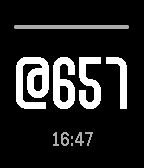</a>

<h2 class="app-name" id="app-557b16c5936283feeb000053"><a href="https://apps.repebble.com/557b16c5936283feeb000053">@beats</a></h2>
<a class="app-source" href="https://github.com/aperezdc/pebble-beats/" title="Source code" data-search-exclude>View source</a>

by <a href="https://apps.repebble.com/apps/dev/adri-n-p-rez_54f4673184bffcaa4c00004b" title="More from this developer">Adrián Pérez</a>

No licence v1.5 Updated 2016-01-11

Runs on: Round 2, Time 2, Pebble 2 Duo, Pebble 2, Time Round, Time, Classic

Simple watchface which just shows the @beats Swatch Internet Time, alongside a traditional HH:MM display and a battery meter. The traditional display respects the 24h/12h time format setting…

<a class="app-shot" href="https://apps.repebble.com/5589df9efb51554a7e000025" data-search-exclude>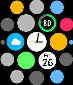</a>

<h2 class="app-name" id="app-5589df9efb51554a7e000025"><a href="https://apps.repebble.com/5589df9efb51554a7e000025">@WATCH</a></h2>
<a class="app-source" href="https://github.com/kenz-gelsoft/atWATCH.git" title="Source code" data-search-exclude>View source</a>

by <a href="https://apps.repebble.com/apps/dev/kenz_5575c40abea9ccece200004e" title="More from this developer">KENZ</a>

Not checked yet v1.9 Updated 2015-07-26

Runs on: Time 2, Pebble 2 Duo, Pebble 2, Time, Classic

Watchface inspired by Apple&#x27;s one. You can watch time, calendar, battery and weather at a glance. By shaking your watch you can look at current time easily.

<a class="app-shot" href="https://apps.rebble.io/en_US/application/552b8b6bd6905f47ba0000df" data-search-exclude>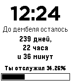</a>

<h2 class="app-name" id="app-552b8b6bd6905f47ba0000df"><a href="https://apps.rebble.io/en_US/application/552b8b6bd6905f47ba0000df">Дембель Watchface</a></h2>
<a class="app-source" href="https://github.com/ClusterM/pebble-dembel" title="Source code" data-search-exclude>View source</a>

by <a href="https://apps.rebble.io/en_US/developer/541d0dc59a11beda980000c8/1" title="More from this developer">Alexey &#x27;Cluster&#x27; Avdyukhin</a>

No licence v1.1 Updated 2015-11-15 Rebble App Store

Runs on: Time 2, Pebble 2 Duo, Pebble 2, Time, Classic

Watchface for russian army. Для служащих в армии, показывает время оставшееся до дембеля. Обязательна прошивка с русскими шрифтами.

<a class="app-shot" href="https://apps.repebble.com/5591cc2fd0d3f3e7ea00009b" data-search-exclude>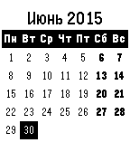</a>

<h2 class="app-name" id="app-5591cc2fd0d3f3e7ea00009b"><a href="https://apps.repebble.com/5591cc2fd0d3f3e7ea00009b">Русский Календарь</a></h2>
<a class="app-source" href="https://github.com/MAD-GooZe/pebble-russian-calendar-watchface" title="Source code" data-search-exclude>View source</a>

by <a href="https://apps.repebble.com/apps/dev/alexey-gusev_558bcdb2295a7dc170000080" title="More from this developer">Alexey Gusev</a>

Apache-2.0 v1.1 Updated 2015-08-03

Runs on: Time 2, Pebble 2 Duo, Pebble 2, Time, Classic

Watchface с русcкоязычным календарем на текущий месяц с неделей, начинающейся с понедельника. Для работы необходима прошивка часов с русскими символами.

<h2 class="app-name" id="app-5414a201b661902c6600007b"><a href="https://apps.repebble.com/5414a201b661902c6600007b">한글 Time, Korean Watchface</a></h2>
<a class="app-source" href="http://github.com/deoryp/pebble-korean" title="Source code" data-search-exclude>View source</a>

by <a href="https://apps.repebble.com/apps/dev/deoryp_5335a2f9c06059364f0001f4" title="More from this developer">deoryp</a>

No licence v2.2 Updated 2014-09-15

Runs on: Time 2, Pebble 2 Duo, Pebble 2, Time, Classic

지금 몇 시지? This app helps with reading the time in Korean 한글. The time is written out rather than using number symbols. Practice reading the time in Korean! Top line is AM/PM, left justified Second…

