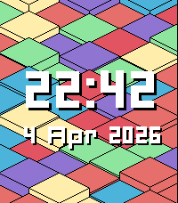
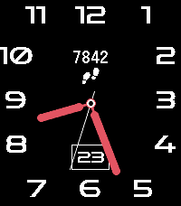
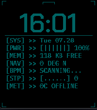
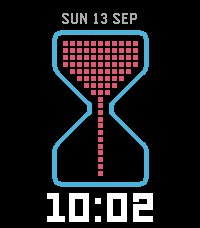
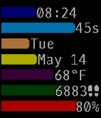

<!-- Generated by scripts/update_app_directory.py: do not edit by hand -->
# Watchfaces: P

[← About this list](../watchfaces.md) · [A](a.md) · [B](b.md) · [C](c.md) · [D](d.md) · [E](e.md) · [F](f.md) · [G](g.md) · [H](h.md) · [I](i.md) · [J](j.md) · [K](k.md) · [L](l.md) · [M](m.md) · [N](n.md) · [O](o.md) · **P** · [Q](q.md) · [R](r.md) · [S](s.md) · [T](t.md) · [U](u.md) · [V](v.md) · [W](w.md) · [X](x.md) · [Y](y.md) · [Z](z.md) · [0–9 & other](other.md)

*237 watchfaces · Last updated 2026-10-06*

| Screenshot | Name | Developer | Licence | Updated | Description |
|------------|------|-----------|---------|---------|-------------|
| { loading=lazy width="72" } | [P-SHOCK](https://apps.repebble.com/57199918de07db7b15000030) | [Akemori Oda](https://github.com/bake-san/ANALOG-P-SHOCK.git) | <small>Not checked yet</small> | 2016-04-22 | The sample source to the original has been modifications to the reference to the analog clock of CASIO. サンプルソースを元にCASIOのアナログ時計を参考に修正をしました。 Ver1.1 was… |
| { loading=lazy width="72" } | [P-Time](https://apps.rebble.io/en_US/application/5500d5d0b5bebe8eba00007b) <small>Rebble App Store</small> | [Rob Garth](http://github.com/rgarth/PebbleP-Time) | MIT | 2015-04-20 | Another watch-face that simply shows the time and Pebble's current battery level. |
| { loading=lazy width="72" } | [Paddy's Day](https://apps.repebble.com/56e98f4e3b537ac5fc00001b) | [Gringer Apps](https://github.com/groyoh/paddys_day) | <small>Not checked yet</small> | 2016-03-26 | Celebrate Saint Patrick’s day with a dancing Irish leprechaun! See him dance every fifth minute or at the flick of your wrist. Designed by @AlessioLaiso and… |
| { loading=lazy width="72" } | [Pagan](https://apps.repebble.com/5692db642845db3380000079) | [Dr. David Brown](https://github.com/revdrbrown/PebblePagan) | <small>Not checked yet</small> | 2016-11-09 | Displays date, time, current astrological sun sign, a graphical depiction of the lunar phase and the planet-based day of the week. On solstices, equinoxes… |
| { loading=lazy width="72" } | [Paint 95](https://apps.rebble.io/en_US/application/67ebcf1c696da700090e5dd4) <small>Rebble App Store</small> | [bimbodhisattva](https://github.com/bimbodhisattva/paint-95-for-pebble-time) | <small>Not checked yet</small> | 2025-04-01 | For Pebble Time. Based on Windows 95. |
| { loading=lazy width="72" } | [palette](https://apps.rebble.io/en_US/application/5587ded03ae5e5b0de0000b6) <small>Rebble App Store</small> | [plan44.ch](https://github.com/plan44/palette_pebble) | <small>Not checked yet</small> | 2015-10-24 | To celebrate the 64 colors of the new Pebble Time display, here's a simple colorful watchface using 60 of them (excluding black, white and gray). Hint for… |
| { loading=lazy width="72" } | [Palm Trees](https://apps.rebble.io/en_US/application/559f0f11479e45928f000080) <small>Rebble App Store</small> | [Starscreams Ghost](https://cloudpebble.net/ide/project/209035) | <small>See source</small> | 2015-07-10 | Watchface features 2 palm trees with the current time and temperature based on location. |
| { loading=lazy width="72" } | [Pangaea Drift](https://apps.repebble.com/490fd055aa9b485c8deced5e) | [Daniel Bally](https://github.com/globe-and-atlas/pangaea-watch) | <small>Not checked yet</small> | 2026-10-03 | A deep-time cartographic watchface for Pebble Time 2 (Emery). Midnight is 252 million years ago at the Triassic dawn; 23:59 marks the Cretaceous-Paleogene… |
| { loading=lazy width="72" } | [Panoramic](https://apps.rebble.io/en_US/application/54df3ccc91a09e4790000087) <small>Rebble App Store</small> | [degygii](https://github.com/degygii/Panoramic) | <small>Not checked yet</small> | 2015-02-18 | A mountain inspired watchface If you want a version without the seconds animation, check out my other watchface, Panoramic lite. A beautiful (imho) and… |
| { loading=lazy width="72" } | [Parabola](https://apps.repebble.com/70abca87163d49debbf6cbc5) | [jonny](https://github.com/JonnyKreng/PebbleParabolaWatchface) | MIT | 2026-06-05 | Just a little watchface, i build for fun. For the Time 2, on older watches it does not look great. |
| { loading=lazy width="72" } | [Parabolic Eye](https://apps.rebble.io/en_US/application/52e675f414a5c92ca2000032) <small>Rebble App Store</small> | [Marcus Gotling](https://github.com/GotlingSystem/Parabolic-Eye) | <small>No licence</small> | 2014-02-12 | Displays the time as an eye using lines to form parabolic curves and a circle. Time of screenshots 1: 04:30:30 2: 14:15:42 3: 20:45:16 Setting for inverse… |
| { loading=lazy width="72" } | [Paradroid Watchface](https://apps.rebble.io/en_US/application/6a2fbc2f72de6e00088d251b) <small>Rebble App Store</small> | [Daktak](https://github.com/daktak/pebble_paradroid_2000_watchface) | <small>Not checked yet</small> | 2026-06-15 | Display Paradroid bots Images from https://www.freedroid.org/ |
| { loading=lazy width="72" } | [Paragade](https://apps.rebble.io/en_US/application/55d0e5b635a72bac4a000030) <small>Rebble App Store</small> | [clach04](https://github.com/clach04/watchface_Paragade/) | <small>Not checked yet</small> | 2015-09-26 | Paragade/Renegon, Paragon or Renegade? Basic digital watch face for the Pebble smartwatch. Features: * Updates once per minute * Includes battery status *… |
| { loading=lazy width="72" } | [Parallax Weather](https://apps.repebble.com/6abc2c15139b70000a509eb9) | [OmgSlayKween](https://github.com/hornofabraxas/parallax-weather) | <small>Not checked yet</small> | 2026-10-02 | Big, visible numbers - and configurable live weather backgrounds that move as you tilt your wrist (during backlight only, to save battery). Also includes a… |
| { loading=lazy width="72" } | [Paris](https://apps.rebble.io/en_US/application/567f2cec4c02107532000131) <small>Rebble App Store</small> | [Martin Simoneau](https://github.com/msimoneau/paris) | <small>Not checked yet</small> | 2025-11-25 | Remembering Paris 2015. |
| { loading=lazy width="72" } | [Paris Metro - SIEL](https://apps.repebble.com/7616fe1322de4db787898c2c) | [Moustiluigi Random](https://codeberg.org/moustilu/pebble-siel-watchface) | <small>See source</small> | 2026-06-20 | Inspired by Paris' metro old information systems showing when the next train arrives. Reproduces the classic LED-based display on your watch. Not affiliated… |
| { loading=lazy width="72" } | [Parking](https://apps.rebble.io/en_US/application/539a8a88ae22775ca6000068) <small>Rebble App Store</small> | [Pythe](https://github.com/pythe/pebble-parking) | <small>Not checked yet</small> | 2015-05-28 | An edit of Simplicity that includes nth week of the month text like "3rd Wed" for quick reference while attempting street-side parking. |
| { loading=lazy width="72" } | [Partial](https://apps.rebble.io/en_US/application/5a9c1fb20dfc3214f2000040) <small>Rebble App Store</small> | [b123400](https://github.com/b123400/pebble-partial) | <small>Not checked yet</small> | 2026-06-28 | The angle of the half circle indicate the hour. The percentage of the half circle filling up indicate how much time is passed in this hour. Keep in mind… |
| { loading=lazy width="72" } | [Particle Sim](https://apps.repebble.com/9549cdc291824a589a78d81d) | [Dmitry Demenchuk](https://github.com/mrded/pb-particle-simulation) | <small>Not checked yet</small> | 2026-05-02 | A watchface that simulates colored particles responding to gravity in real time. WARNING: heavy computation, this will drain your battery. I'm looking for… |
| { loading=lazy width="72" } | [Party time!](https://apps.rebble.io/en_US/application/54177f240ba7a964af000020) <small>Rebble App Store</small> | [Nicholas Currault](https://github.com/nicktendo64/party-time) | <small>Not checked yet</small> | 2014-09-16 | This watchface flashes once per second and contains both the current time and the text "Party Time!". |
| { loading=lazy width="72" } | [Passing Breeze Round](https://apps.rebble.io/en_US/application/67bd83c5691e55000aa48ce2) <small>Rebble App Store</small> | [Harrison Allen](https://github.com/HarrisonAllen/pebble-community-watchfaces/tree/main/outrun_port) | <small>No licence</small> | 2025-02-25 | Passing Breeze (an OutRun inspired watchface) has finally come to the Time Round! This is a port of the original watchface by MicroByte. This watchface was… |
| { loading=lazy width="72" } | [Passing Trains](https://apps.repebble.com/828038d2a34d45eb8b3daa37) | [Ross Gardiner](https://github.com/rossng/pebble-watchfaces) | <small>Not checked yet</small> | 2026-06-18 | A native Pebble C watchface that slowly pans along a random Dutch (NS) train, minute by minute, scaled to fill the screen. A subtle type label floats above… |
| { loading=lazy width="72" } | [Past - Present - Future](https://apps.rebble.io/en_US/application/53795d5062e09fef83000077) <small>Rebble App Store</small> | [Chris Lewis](https://github.com/C-D-Lewis/past-present-future) | <small>No licence</small> | 2014-05-19 | Based on the analogue watch. |
| { loading=lazy width="72" } | [Past - Present - Future Extended](https://apps.rebble.io/en_US/application/537e6531ac5075447a00020f) <small>Rebble App Store</small> | [Chris Lewis](https://github.com/C-D-Lewis/past-present-future-extended) | <small>No licence</small> | 2014-07-25 | The Past Present Future watchface with short date and location-aware temperate display. |
| { loading=lazy width="72" } | [Past-Present-Future](https://apps.repebble.com/fa33ca96a9e1480890a251c2) | [marukitano](https://github.com/marukitano/past-present-future) | <small>Not checked yet</small> | 2026-08-02 | English The original design was created by Chris Lewis. With his permission, I adapted and rebuilt it for the new Pebble Time 2, added new animations… |
| { loading=lazy width="72" } | [patchwork](https://apps.repebble.com/4b5cfd6f43024c438591c2c7) | [Chris Lewis](https://github.com/C-D-Lewis/pebble-dev/tree/master/watchfaces/patchwork) | <small>No licence</small> | 2026-06-23 | Patchwork uses isometric rendering to show randomized blocks at various heights and colors in your chosen color palette, overlaid with the time and date in… |
| { loading=lazy width="72" } | [Patchwork](https://apps.rebble.io/en_US/application/69d18858b11d33000967c5b7) <small>Rebble App Store</small> | [Chris Lewis](https://github.com/C-D-Lewis/pebble-dev) | <small>No licence</small> | 2026-06-23 | Patchwork uses isometric rendering to show randomized blocks at various heights and colors in your chosen color palette, overlaid with the time and date in… |
| { loading=lazy width="72" } | [Path Reborn](https://apps.rebble.io/en_US/application/55a96f5427eb8ded4c000006) <small>Rebble App Store</small> | [Kenny Chen](https://github.com/kenny-chen/pebble-path-reborn) | <small>Not checked yet</small> | 2015-09-17 | A modified version of the Path watch face by corefault for the Pebble Time, with the seconds bar as a battery bar instead, the minutes moved to the side for… |
| { loading=lazy width="72" } | [Patris Watch](https://apps.rebble.io/en_US/application/561a73451a1d8994a700007e) <small>Rebble App Store</small> | [Fabien](https://github.com/Fabien-Chouteau/Ada_Time) | <small>No licence</small> | 2015-11-04 | Falling blocks telling you what time is it. See more at http://blog.adacore.com/make-with-ada-formal-proof-on-my-wrist |
| { loading=lazy width="72" } | [Pattern Time](https://apps.rebble.io/en_US/application/55de498e785abd2bac000078) <small>Rebble App Store</small> | [Jack Dalton](http://github.com/jackdalton/patterntime) | <small>No licence</small> | 2015-08-26 | A patterned watch face including the date, time, and hourly vibrations. |
| { loading=lazy width="72" } | [pbl-index](https://apps.rebble.io/en_US/application/5299a381e627ce36ec000063) <small>Rebble App Store</small> | [Edward Patel](https://github.com/epatel/pblindex) | <small>Not checked yet</small> | 2014-01-11 | This app shows some market indexes. It updates them when the watchface is presented. Created as a watch face for quick usage, and no automatically updating… |
| { loading=lazy width="72" } | [PCB Binary](https://apps.rebble.io/en_US/application/52dfff6c011368e7f800014b) <small>Rebble App Store</small> | [8a22a](https://github.com/8a22a/PCBbinary) | <small>No licence</small> | 2014-01-22 | Binary watchface with PCB background design. |
| { loading=lazy width="72" } | [Pear Hermit](https://apps.repebble.com/4989ba26b1ec4de7b757b1d0) | [Comfortably Numb](https://github.com/ygalanter/pear-hermit-pebble) | <small>Not checked yet</small> | 2026-05-24 | Analog clock with familiar look, shows date and activity tracking: Shake the watch to switch betwen - step counter, - distance walked - calories burned, … |
| { loading=lazy width="72" } | [Pear Hermit](https://apps.rebble.io/en_US/application/6a12491bced0bb000bbc43cf) <small>Rebble App Store</small> | [Comfortably Numb](https://github.com/ygalanter/pear-hermit-pebble) | <small>Not checked yet</small> | 2026-05-24 | Analog clock with familiar look, shows date and activity tracking: Shake the watch to switch betwen - step counter, - distance walked - calories burned, … |
| { loading=lazy width="72" } | [Pear Hermit California](https://apps.repebble.com/9573b80665544b23a3382ab5) | [Alexis Ballo](https://github.com/AlexisBallo2/pear-hermit-ca-pebble) | <small>No licence</small> | 2026-06-17 | Just removed the activity tracking from townmath's pear hermit face. https://github.com/townmath/pear-hermit-ca-pebble. All credit to them |
| { loading=lazy width="72" } | [Pear Hermit California](https://apps.repebble.com/ff769e6cc50848f589dade12) | [townmath](https://github.com/townmath/pear-hermit-ca-pebble) | <small>Not checked yet</small> | 2026-06-03 | Analog watch face with configurable colors and activity display. |
| { loading=lazy width="72" } | [Pebble Air Quality Indicator](https://apps.rebble.io/en_US/application/5511d9b7c8d9d1bcd700003d) <small>Rebble App Store</small> | [Denis Trailin](https://github.com/hiyou102/PebbleEco) | <small>Not checked yet</small> | 2015-03-24 | Watchface that shows the air quality in the nearest city within 50 miles. US only for now |
| { loading=lazy width="72" } | [Pebble Digital Classic](https://apps.repebble.com/0ca1204c486849f7aaed36aa) | [dtoth](https://github.com/dantoth24/watchface-digital-classic) | <small>Not checked yet</small> | 2026-07-17 | A retro tribute to the iconic 80s digital sport watch, faithfully redrawn for Pebble Round 2. Features: Authentic LCD-style bitmap digits for hours and… |
| { loading=lazy width="72" } | [Pebble Drive](https://apps.repebble.com/ed184324553e4ce2aa6be736) | [MacBoy__Pro](https://github.com/MacBoyPro98/DriveV2) | <small>Not checked yet</small> | 2026-04-07 | Basic watch face with time, date, battery percentage and temperature displayed. |
| { loading=lazy width="72" } | [Pebble Drive](https://apps.rebble.io/en_US/application/536b1e7362917afde20000ed) <small>Rebble App Store</small> | [MacBoy__Pro](https://github.com/MacBoyPro98/Pebble_Drive.git) | <small>Not checked yet</small> | 2015-10-26 | Basic Watchface with weather, date, time, and weather. If you have any suggestions or things I could do differently feel free to contact me with your ideas… |
| { loading=lazy width="72" } | [Pebble Float](https://apps.rebble.io/en_US/application/60b941551342ae00a7b63a93) <small>Rebble App Store</small> | [Justin Sunseri](https://github.com/jmsunseri/pebble-float) | <small>Not checked yet</small> | 2021-06-03 | Clean watch face displaying time, steps, distance, current temp, date with day of week, and battery bar at the top |
| { loading=lazy width="72" } | [Pebble Like Time](https://apps.repebble.com/24899b140df14a9b88915204) | [MrReSc](https://github.com/MrReSc/pebble-like-time) | <small>Not checked yet</small> | 2026-09-05 | A crisp clock with battery, date, Health stats and locally calculated sun times. |
| { loading=lazy width="72" } | [Pebble Mars](https://apps.rebble.io/en_US/application/52cfaf1ef726c833ac000049) <small>Rebble App Store</small> | [Dan Isla](https://github.com/witoff/PebbleMars) | <small>Not checked yet</small> | 2014-01-10 | Streaming images from the Curiosity rover on Mars straight to your watch! The latest images returned through the Deep Space Network are made available on… |
| { loading=lazy width="72" } | [Pebble Mesh](https://apps.repebble.com/20546b1dc76e4eb0aa4cbc1f) | [David Peer](https://github.com/peerdavid/pebble-mesh) | <small>Not checked yet</small> | 2026-09-02 | Pebble Mesh is an open-source, retro-digital watch face designed for maximum clarity and essential stats. This face features a signature dot-matrix grid… |
| { loading=lazy width="72" } | [Pebble Mesh](https://apps.rebble.io/en_US/application/68ffb91854ffd600097bbb73) <small>Rebble App Store</small> | [David Peer](https://github.com/peerdavid/pebble-mesh) | <small>Not checked yet</small> | 2026-09-02 | Pebble Mesh is an open-source, retro-digital watch face designed for maximum clarity and essential stats. This face features a signature dot-matrix grid… |
| { loading=lazy width="72" } | [Pebble Particles (Animated)](https://apps.repebble.com/67c3d858d2acb30009a3c7cf) | [AirCodum](https://github.com/priyankark/pebble-particles-pbw) | <small>Not checked yet</small> | 2025-03-02 | Experience time in a mesmerizing new way with Pebble Particles! This elegant watchface transforms your Pebble into a dynamic particle system where time… |
| { loading=lazy width="72" } | [Pebble Peek](https://apps.rebble.io/en_US/application/54457ded2a5191123d00012b) <small>Rebble App Store</small> | [Philipp Stadler](https://github.com/ansysic/Peek) | <small>Not checked yet</small> | 2014-10-20 | This watchface is intended to only show notification icons from your phone and not the actual messasge. It's an alpha version and still work in progress... |
| { loading=lazy width="72" } | [Pebble Sat](https://apps.rebble.io/en_US/application/52d396683e2e256b6c00001e) <small>Rebble App Store</small> | [sarfata](https://github.com/sarfata/pbsat) | <small>Not checked yet</small> | 2014-07-18 | Never miss a chance to catch the ISS station when it flies above your head with this watchface! |
| { loading=lazy width="72" } | [Pebble Term Watch](https://apps.rebble.io/en_US/application/534856abc440279cfe000045) <small>Rebble App Store</small> | [polygon](https://github.com/polygonplanet/PebbleTermWatch) | <small>Not checked yet</small> | 2014-05-16 | Pebble watchface like terminal typing with a simple RSS feed reader. - Battery level indicator - Bluetooth connection icon - Bluetooth disconnect vibration… |
|  | [Pebble Terminal](https://apps.rebble.io/en_US/application/53608b842d33b45e5900009f) <small>Rebble App Store</small> | [Vidia](https://github.com/vidia/Pebble-Shell) | <small>Not checked yet</small> | 2014-05-14 | The Pebble Terminal turns your watch into a Linux terminal and uses the `date` command to print the time and day. Features: Larger time and date text than… |
| { loading=lazy width="72" } | [Pebble Timely](https://apps.repebble.com/916e2f28a998413f8390fb08) | [Alan Johnson](https://github.com/alan-johnson/PebbleTimely) | <small>Not checked yet</small> | 2026-05-25 | Based on the original Timely watchface by Martin Norland &lt;cyn@cyn.org&gt;, original source: https://github.com/cynorg/PebbleTimely. This is a Watchface for the… |
| { loading=lazy width="72" } | [pebble-day-night-pix](https://apps.rebble.io/en_US/application/607dad8e1342ae005a8a9b2c) <small>Rebble App Store</small> | [fork from David Gianforte](https://github.com/zhcong/pebble-day-night-pix) | <small>Not checked yet</small> | 2021-04-19 | fork from watchface pebble-day-night, this is a day-night map pix edition for you! And DIY this watchface by github source code. |
| { loading=lazy width="72" } | [pebble_deck](https://apps.repebble.com/648bfbf405594a0b99b99445) | [Keatr0n](https://github.com/Keatr0n/pebble_deck) | <small>No licence</small> | 2026-09-03 | pebble_deck is designed to emulate a terminal interface with 8 customizable complication slots. You can pick from any of the following: - Date - Battery … |
| { loading=lazy width="72" } | [pebble_deck](https://apps.rebble.io/en_US/application/6a6846896637210009c9e8d7) <small>Rebble App Store</small> | [keatr0n](https://github.com/Keatr0n/pebble_deck) | <small>No licence</small> | 2026-07-28 | pebble_deck is designed to emulate a terminal interface with 7 customizable complication slots. You can pick from any of the following: - Date - Battery … |
| { loading=lazy width="72" } | [pebble_deck Bigface](https://apps.rebble.io/en_US/application/6aa1b542c73fab0009866df1) <small>Rebble App Store</small> | [futur3gentleman](https://github.com/futur3gentleman/pebble_deck_bigface/tree/bigface) | <small>Not checked yet</small> | 2026-09-09 | Display 3 pieces of information with a large font. Ideal if you use the Pebble as a second watch. This is a fork of the pebble_deck watchface. |
| { loading=lazy width="72" } | [PebbleAAPS](https://apps.repebble.com/a5f73770a25f46d5a4b9a090) | [Soopaloop](https://github.com/ssuppe/PebbleAAPS) | <small>Not checked yet</small> | 2026-08-16 | PebbleAAPS is a lightweight, high-contrast Pebble watchface that displays real-time status data broadcast from AndroidAPS (AAPS), including glucose… |
| { loading=lazy width="72" } | [Pebblecast Weather](https://apps.repebble.com/ec67f88d800e46b7bc65e873) | [Constantin Matheis](https://github.com/ConstantinMatheis/pebblecast-weather) | GPL-3.0 | 2026-06-07 | A watch face that visualizes the weather for the next 12 hours. Notable Features ------------------ - Light and dark themes - Celsius and Fahrenheit support… |
| { loading=lazy width="72" } | [pebbleCat](https://apps.repebble.com/bc5427b437d44ced90b7f851) | [Laz](https://github.com/Lazken/pebble-catppuccin) | <small>Not checked yet</small> | 2026-08-19 | Simple watchface using Catppuccin color palettes. Different Flavours can be chosen in settings. - Latte - Frappe - Macchiato - Mocha Font used is Caskaydia… |
| { loading=lazy width="72" } | [PebbleChat](https://apps.repebble.com/1d034effa03a4d10b41b6556) | [Brandon Coupal](https://github.com/bscoup01/PebbleChat) | <small>Not checked yet</small> | 2026-09-02 | A watchface for the Pebble Time 2 inspired by Pictochat on the Nintendo DS! |
| { loading=lazy width="72" } | [PebbleGlobe](https://apps.repebble.com/555eb6999dd059f8fc000026) | [Vestman](http://github.com/gitvestman/PebbleGlobe) | <small>No licence</small> | 2016-10-26 | Watchface with a view of earth as a spinning globe. featuring smooth animations of the rotating globe. Follows the sun around earth. Spin the globe with a… |
| { loading=lazy width="72" } | [Pebblemon Time](https://apps.repebble.com/60eff8e81342ae009770ca32) | [Harrison Allen](https://github.com/HarrisonAllen/pebblemon-watchface) | <small>No licence</small> | 2021-07-27 | Pebblemon Time! Explore the Pokémon world of Pebblemon, but with a twist: the watchface does all the exploring for you! Every minute, your character will… |
| { loading=lazy width="72" } | [Pebblemous](https://apps.rebble.io/en_US/application/52dc36aa75436b22120000f4) <small>Rebble App Store</small> | [Dexif](https://github.com/dexif/Pebblemous) | <small>Not checked yet</small> | 2014-02-04 | Pebble Anonymous watchface |
| { loading=lazy width="72" } | [PebblePebble24](https://apps.repebble.com/adef02297c584fe7929b31ac) | [Tom Barrasso](https://github.com/Tombarr/PebblePebble24) | <small>Not checked yet</small> | 2026-04-16 | Animated watch face inspires by ClockClock24 from Humans Since 1982 |
| { loading=lazy width="72" } | [PebbleSky](https://apps.repebble.com/66ca3d63cb8a471b888d776b) | [Dave Bortz](https://github.com/dbortz/PebbleSky) | <small>Not checked yet</small> | 2026-06-05 | A weather watchface with a hyperlocal 2-hour precipitation nowcast and a live rain countdown. |
| { loading=lazy width="72" } | [PebbleTextWatch-tr](https://apps.rebble.io/en_US/application/5363e86d35a540019f0000c0) <small>Rebble App Store</small> | [Gülşah Köse](https://github.com/pebble-tr/PebbleTextWatch-tr) | <small>Not checked yet</small> | 2014-05-29 | TextWatch watchface'in Türkçeye uyarlanmış halidir. Sonradan eklenen özellikler: * Pebble'ın pil durumu * Blutooth bağlantısı koptuğunda titrşimle uyarı The… |
| { loading=lazy width="72" } | [Penumbra](https://apps.repebble.com/cbd7840a45424bae97f459ec) | [NetNoise](https://github.com/GeoffAtLarge/pebble-gradient-watchface) | <small>No licence</small> | 2026-10-05 | Penumbra tells the time with light and shadow. Each hand is a soft gradient disc that starts solid at the hand and fades away around the dial. Read the hour… |
| { loading=lazy width="72" } | [Percentage](https://apps.rebble.io/en_US/application/55ad34495ce176822500008c) <small>Rebble App Store</small> | [Marcelo Lazaroni](https://github.com/lazaronijunior/Percentage-Watchface) | <small>Not checked yet</small> | 2015-07-22 | See the time in a different way. Seeing time as a percentage you can be more aware of how much of your time you are dedicating to each thing. The background… |
| { loading=lazy width="72" } | [Percival](https://apps.repebble.com/2799cd581c2a4bbbade7f3da) | [Andrew Ford](https://github.com/barefootford/Percival) | <small>Not checked yet</small> | 2026-04-24 | A clean watchface with rich customizable complications. Primary complications: - Current weather with city and temperature - Daily high/low temps - Sunrise… |
| { loading=lazy width="72" } | [Perfect Analog](https://apps.repebble.com/581d4b599cbbaf2ef200015d) | [Jakerusch](https://github.com/jakerusch/DIAL_V4) | <small>Not checked yet</small> | 2017-05-22 | This is Perfect Analog in Fahrenheit (look for Perfect Analog Celsius if you want the Celsius version). It provides temperature, weather conditions… |
| { loading=lazy width="72" } | [Perfect Analog Celsuius](https://apps.repebble.com/581fb098e7785b8942000001) | [Jakerusch](https://www.github.com/jakerusch/DIAL_V4) | <small>Not checked yet</small> | 2016-11-30 | This is Perfect Analog Celsius (look for Perfect Analog if you want the Fahrenheit version). It provides temperature, weather conditions, weekday, day of… |
| { loading=lazy width="72" } | [Periodic Color](https://apps.repebble.com/577f4d98fdfb41c3a8267fab) | [keshavpratap](https://github.com/KeshavPratap-K/Periodic-Color) | <small>No licence</small> | 2026-09-18 | This is a color updated version of classic Periodic watchface. Have your watch show the time in periodic entries with the Periodic watchface! The hour and… |
| { loading=lazy width="72" } | [Periodic Time](https://apps.rebble.io/en_US/application/55893f04050a7f31090000b3) <small>Rebble App Store</small> | [aspyct](https://github.com/aspyct/periodictime) | <small>Not checked yet</small> | 2015-07-01 | Here, have this atomic watchface! For each minute, one of the 118 known elements is displayed, in order. Elements #0 and #119 are replaced with a small grid… |
| { loading=lazy width="72" } | [Perlin](https://apps.repebble.com/55aa599e27eb8dd245000090) | [chops](https://github.com/mereed/pebbleface-perlin) | <small>Not checked yet</small> | 2016-09-19 | 19 Sept: update for sdk 4 quick view. Also replaced all images, and a new (clay) settings page. ----- This is a watchface developed to showcase the stunning… |
| { loading=lazy width="72" } | [perlin forked v2](https://apps.repebble.com/3ee5889ee7764faaac9a5476) | [Sapphire Second-Hand](https://github.com/shoepaladin/pebbleface-perlin) | <small>Not checked yet</small> | 2026-06-11 | This is a fork of the original Perlin watchface (https://apps.repebble.com/55aa599e27eb8dd245000090?section=watchfaces). You can configure: 1. Date 2… |
| { loading=lazy width="72" } | [Perlin Grid](https://apps.rebble.io/en_US/application/6a4eca251eb8590009825e40) <small>Rebble App Store</small> | [Intrinseca](https://gitlab.com/intrinseca/perlin-grid) | <small>Not checked yet</small> | 2026-07-08 | Inspired by Triangles and Perlin, uses Perlin Noise to generate a random grid of colourful triangles as the watchface background. |
| { loading=lazy width="72" } | [Perpetual](https://apps.repebble.com/579181dd84242800800002e1) | [Zealotree](https://github.com/zealotree/Perpetual) | <small>Not checked yet</small> | 2016-10-08 | Perpetual is a watchface that displays the time, date, month and the weekday in an analogue fashion. The hour hand is red, and the minute hand is white. The… |
| { loading=lazy width="72" } | [Persian Watchface](https://apps.rebble.io/en_US/application/53ed2eebaec98734e500000c) <small>Rebble App Store</small> | [Pooya Khaloo](https://github.com/poooyak/persianPebbleWatchface) | <small>Not checked yet</small> | 2014-08-14 | This is the first watchface that has persian calendar. It also show geogorian calendar and battery status. |
| { loading=lazy width="72" } | [Persona 3](https://apps.rebble.io/en_US/application/56d93fd1b8a67df531000005) <small>Rebble App Store</small> | [Sean Srock](https://github.com/SuperRiderTH/Persona3Pebble) | <small>Not checked yet</small> | 2016-03-04 | Inspired by the HUD of Persona 3, this watchface changes with the time of day. Supports 12/24 hr time, vibrates and changes on loss of phone connection. |
| { loading=lazy width="72" } | [Persona 4: THE GOLDEN](https://apps.rebble.io/en_US/application/52ac89e219ff500f7000000d) <small>Rebble App Store</small> | [Spencer Johnson](https://bitbucket.org/Masamune_Shadow/pebsona-4-the-golden/src/12f6c04737b3?at=master) | <small>See source</small> | 2015-06-18 | Inspired by the HUD used in Persona 4, this watchface is a labor of love-style tribute that also provides real world functionality. Featuring: 12/24 hr… |
| { loading=lazy width="72" } | [Persona 4: ULTIMAX Ultra Suplex Hold](https://apps.rebble.io/en_US/application/5570e001fbe0560f11000053) <small>Rebble App Store</small> | [Spencer Johnson](https://Masamune_Shadow@bitbucket.org/Masamune_Shadow/pebsona-4-the-ultimax-ultra-suplex-hold.git) | <small>See source</small> | 2015-06-19 | Inspired by the HUD used in Persona 4, this watchface is a labor of love-style tribute that also provides real world functionality. Featuring: 12/24 hr… |
| { loading=lazy width="72" } | [Persona 5](https://apps.repebble.com/86a7ca488b8848c4b9053ddf) | [A.C.3](https://github.com/AC3Productions/persona5-watchface/) | <small>No licence</small> | 2026-07-29 | A Watchface inspired by the UI of Persona 5. Features: - Calendar display from the game using local weather conditions - Calling Card-style font for time … |
| { loading=lazy width="72" } | [Personal](https://apps.rebble.io/en_US/application/55c05b70718511a83a00000b) <small>Rebble App Store</small> | [Edwin Finch](https://edwinfinch.com/redirect/pebble-legacy-source) | <small>See source</small> | 2021-06-17 | An old classic from our original collection from 2014-2016, now free & open source! |
| { loading=lazy width="72" } | [Personalize!](https://apps.rebble.io/en_US/application/5561bf9634f3a5374b000058) <small>Rebble App Store</small> | [WA1OUI](https://github.com/DHKaplan/Personalize/blob/master/Personalize-V5.2.zip) | <small>No licence</small> | 2016-10-18 | Personalize! Lets you add a line of text (up to 11 characters long) with a configuration page to your watchface to show the world what's important to you… |
| { loading=lazy width="72" } | [Perspective](https://apps.rebble.io/en_US/application/52da8234227cbe482b000120) <small>Rebble App Store</small> | [Jnm](https://github.com/Jnmattern/Perspective) | <small>No licence</small> | 2014-06-28 | The time is displayed using small dots in a 3D fashion. The screen refreshes 10 times per second depending on the accelerometer. Yes, this is surely a… |
| { loading=lazy width="72" } | [Pet Sounds](https://apps.rebble.io/en_US/application/62d07e79635baa0009d782b9) <small>Rebble App Store</small> | [John Spahr](https://github.com/johnspahr/petsoundsface) | <small>Not checked yet</small> | 2022-07-25 | A simple watch face based on the album cover of The Beach Boys' "Pet Sounds." This face was requested by fellow Pebbler Twebe Bebe on Discord. Anyway, enjoy! |
| { loading=lazy width="72" } | [PFD](https://apps.repebble.com/fed3349de367448b92ca4f2a) | [Kieselleger](https://github.com/ProggroP/PFD) | <small>Not checked yet</small> | 2026-06-13 | coming soon |
| { loading=lazy width="72" } | [Phalaenopsis](https://apps.repebble.com/dc62766ac0894868b49e62c8) | [Sevonj](https://github.com/sevonj/pbl-orkidea) | <small>Not checked yet</small> | 2026-08-04 | Shows coarse battery state when relevant. |
| { loading=lazy width="72" } | [PHD](https://apps.repebble.com/561b188c3493944b11000039) | [phdesign](https://github.com/phdesign/pebble-phd) | <small>Not checked yet</small> | 2016-04-03 | A minimalistic digital watchface for pebble with date display and weather. Weather is disabled by default, use the configuration screen to set your… |
| { loading=lazy width="72" } | [phoenix](https://apps.rebble.io/en_US/application/5af60dbb461a8d6035003bc7) <small>Rebble App Store</small> | [astosia](https://github.com/astosia/phoenix) | <small>Not checked yet</small> | 2024-11-24 | Phoenix is a customizable watchface showing current weather information (temperature, conditions and wind speed) through the centre of the watchface. Also… |
| { loading=lazy width="72" } | [phoenix 270°](https://apps.rebble.io/en_US/application/5af6ef78f38588a1370009b5) <small>Rebble App Store</small> | [astosia](https://github.com/astosia/phoenix-90-or-270) | <small>Not checked yet</small> | 2024-11-24 | Phoenix is a rotated watchface showing current weather information (temperature, conditions and wind speed) through the centre of the watchface. Also shows… |
| { loading=lazy width="72" } | [Phoenix Big](https://apps.rebble.io/en_US/application/5dcdcb71c393f521d8965ad5) <small>Rebble App Store</small> | [astosia](https://github.com/astosia/phoenix_big) | <small>Not checked yet</small> | 2025-12-31 | Phoenix Big is a customisable, easy to read, large font watchface using the Steelfish font. Shows optional weather, sunset/sunrise and steps Features: … |
| { loading=lazy width="72" } | [phoenix rotated](https://apps.repebble.com/5af6e195461a8d22e3000cc4) | [astosia](https://github.com/astosia/phoenix-90-or-270) | <small>Not checked yet</small> | 2026-08-31 | Phoenix is a rotated watchface showing current weather information (temperature, conditions and wind speed) through the centre of the watchface. V4 adds… |
| { loading=lazy width="72" } | [phoenix too](https://apps.rebble.io/en_US/application/5b185daef38588775f000f54) <small>Rebble App Store</small> | [astosia](https://github.com/astosia/Phoenix_vertical) | <small>Not checked yet</small> | 2024-11-24 | Phoenix Vertical is a customizable, easy to read, large font watchface using the Steelfish font. Works on all types of pebble. Features: - Auto-detection of… |
| { loading=lazy width="72" } | [Photo Face](https://apps.repebble.com/c1609136e0a3430bb1bf52b1) | [Case](https://github.com/tomrav/pebble-image-faces) | <small>Not checked yet</small> | 2026-09-28 | Photo Face turns your Pebble Time 2 into a photo frame with a clock, filled with your own photos. Your photos: - Add as many as you like from the settings… |
| { loading=lazy width="72" } | [PhotoWatch](https://apps.repebble.com/b1ebccd7b52d49e0aff30b44) | [TomHol](https://github.com/czmanix/tomhol-configs/tree/main/photowatch) | <small>Not checked yet</small> | 2026-07-27 | A watchface that lets you use any photo you want and gives you all the tools to make it look perfect on the Pebble's e-paper display. Use Any Image: Upload… |
| { loading=lazy width="72" } | [Pi Time](https://apps.repebble.com/55062961afe7fb3d80000094) | [PyroPenguin](https://github.com/pyropenguin/PiTime.git) | <small>Not checked yet</small> | 2016-03-13 | Simple watchface that counts down to the next Pi time, on the next Pi day. Pi Time is on March 14 at 1:59:26 PM. |
| { loading=lazy width="72" } | [Piano](https://apps.rebble.io/en_US/application/5ac4c075f38588510f00014b) <small>Rebble App Store</small> | [stosem](https://github.com/stosem/pebble-wf-Piano) | <small>Not checked yet</small> | 2018-04-11 | What is the sound of Time? Now you can see it. The first piano row is for showing hour. Bottom - minutes. Black keys - for the first digit of number (ten… |
| { loading=lazy width="72" } | [Pie](https://apps.repebble.com/5dc34c6bc393f52a76417112) | [Wolfram Rösler](https://gitlab.com/wolframroesler/pie) | <small>Not checked yet</small> | 2026-08-23 | Minimalistic watchface that displays the hour as a pie segment. The background is a pie segment that goes from from 12:00 to where the hour hand of a… |
| { loading=lazy width="72" } | [Piet](https://apps.repebble.com/82f82f04a6434f4bbcfdc178) | [sjmerel](https://github.com/sjmerel/piet) | <small>Not checked yet</small> | 2025-12-09 | A Mondrian-inspired watchface. Give your wrist a quick twist to show the date and battery level. A bluetooth icon is displayed when disconnected. |
| { loading=lazy width="72" } | [Piet](https://apps.rebble.io/en_US/application/55c219f7b8a297d2ca000038) <small>Rebble App Store</small> | [Steve Merel](https://github.com/sjmerel/piet) | <small>Not checked yet</small> | 2015-08-31 | A Mondrian-inspired watchface. Give your wrist a quick twist to show the date and battery level. A bluetooth icon is displayed when disconnected. |
| { loading=lazy width="72" } | [piffle!](https://apps.repebble.com/1f658b6279ff4e07bd21e2d4) | [manwithpowers](https://github.com/manwithpowers/piffle-pebble) | <small>Not checked yet</small> | 2026-04-19 | a watch face for the podcast 'piffle!', which hasn't produced a new episode in over 10 years 🤷‍♂️ |
| { loading=lazy width="72" } | [PiggyShake](https://apps.rebble.io/en_US/application/55d04c38b784735b870000b3) <small>Rebble App Store</small> | [BrickFacts](https://github.com/PiggyShake) | <small>Not checked yet</small> | 2015-08-16 | An interactive and social watch face with a cute dancing pig. |
| { loading=lazy width="72" } | [Pikachu face](https://apps.rebble.io/en_US/application/6a6d3e8b8043640009866d21) <small>Rebble App Store</small> | [piotreknow02](https://github.com/piotreknow02/pikachu-face-pebble-watchface) | <small>Not checked yet</small> | 2026-08-01 | Surprised Pikachu meme as a pebble watchface |
| { loading=lazy width="72" } | [Pilot](https://apps.repebble.com/ddd33ce12ca54656b9925559) | [TimeCtrl](https://pebble-site-ivory.vercel.app/index.html) | <small>Not checked yet</small> | 2026-04-25 | Pilot is a modern analog watchface designed for Pebble Round 2. It combines a framed date window, optional complications like battery, step information… |
| { loading=lazy width="72" } | [Pilot - Attitude Indicator](https://apps.repebble.com/57c2e7955e3c3de160000300) | [KCK](https://github.com/mknarciso/PebbleWatchFace-Pilot) | <small>Not checked yet</small> | 2016-08-29 | Attitude Indicator (Artificial Horizon) Watchface The ROLL indicates the hour in 12 hour format. The PITCH indicates the minutes: From 0 to 30 min… |
| { loading=lazy width="72" } | [Pilot's Zulu Time](https://apps.repebble.com/540758e6451ee9acdf000187) | [Jon](http://www.jonrussell.xyz/projects/Pebble/watchface/ZuluTime/) | <small>See source</small> | 2016-08-22 | A simple text watchface that shows local and Zulu/GMT time. Features -Local Time -Zulu Time -Decimal Time (Optional to display) -Date -Day/Night Coloring… |
| { loading=lazy width="72" } | [Pimpin Ain't Easy](https://apps.rebble.io/en_US/application/5850abcfce45dc224e00002f) <small>Rebble App Store</small> | [Sonny_Jim](https://github.com/SonnyJim/PebblePimp) | <small>Not checked yet</small> | 2016-12-14 | Watchface based on the Tokyoflash "Pimpin Aint Easy" watch. Shake to switch between time and date. Instructions on how to read the watchface here… |
| { loading=lazy width="72" } | [PingChrong](https://apps.rebble.io/en_US/application/52d428519260fe10be00002d) <small>Rebble App Store</small> | [rexmac](https://github.com/rexmac/pebble-pingchrong) | <small>Not checked yet</small> | 2014-01-13 | Displays a game of ping-pong between two AI opponents. The score is shown at the top of the screen. Although they play 24/7, the AI players are quite good… |
| { loading=lazy width="72" } | [Pink Floyd Watch](https://apps.repebble.com/bc1aca03d4f74a079f0b039a) | [Creative Manaks](https://github.com/manaksu/PinkFloyd) | <small>Not checked yet</small> | 2026-05-30 | "And then one day you find, ten years have got behind you." Time told through the words of Pink Floyd. Every minute, a lyric from the catalogue fills your… |
| { loading=lazy width="72" } | [Pinwheel](https://apps.rebble.io/en_US/application/55e267e83ea1fbe87b0000ea) <small>Rebble App Store</small> | [WA1OUI](https://github.com/DHKaplan/Pinwheel/blob/master/Pinwheel-V3.1.zip) | <small>No licence</small> | 2016-10-18 | Pinwheel is a colorful watch face that changes every minute. Day of the month is in the center circle, which is red if Bluetooth is lost. Battery level on a… |
| { loading=lazy width="72" } | [Pinwheel-II](https://apps.rebble.io/en_US/application/56119a271cdcfc9faa000030) <small>Rebble App Store</small> | [WA1OUI](https://github.com/DHKaplan/Pinwheel-II/blob/master/Pinwheel-II-V3.1.zip) | <small>No licence</small> | 2016-10-18 | Pinwheel-II is a colorful watch face that changes every minute, but a bit different than it's older brother, Pinwheel. Day of the month is in the center… |
| { loading=lazy width="72" } | [PiP-Boy](https://apps.repebble.com/57886f83ff7be078ab00028f) | [fieldWalking](http://fieldwalking.jp/blog/watch-face_pip-boy/) | <small>See source</small> | 2016-07-28 | Weather forecast with Pip-Boy! if the remaining the battery is less.animation speed slower rate. if location enable,weather is displayed in its place. else… |
| { loading=lazy width="72" } | [Pip-Boy 3000](https://apps.repebble.com/5833903a00355a9f11000228) | [Averso](https://github.com/Averso/PipBoyFace) | <small>No licence</small> | 2017-01-01 | I made this watchface to get close to Pip-Boy 3000 feeling with having clear view on time and date. Features: - 4 colors variants as in Fallout 3/NV games … |
| { loading=lazy width="72" } | [Pipboy](https://apps.repebble.com/582ef52736ac5aa1be00026c) | [unexist](http://hg.subforge.org/pipboy) | <small>See source</small> | 2016-11-18 | Another watchface that resembles the interface of the famous Pipboy™. Everything is really glued together: -HP gauge is just battery -Ammo a random value of… |
| { loading=lazy width="72" } | [Pipe Dreams](https://apps.rebble.io/en_US/application/557efe0f71b570913a00003a) <small>Rebble App Store</small> | [dezign999](http://www.watchismo.com/mr-jones-sun-and-moon-miyamoto.aspx) | <small>See source</small> | 2015-06-15 | An analog watch face inspired by Mr. Jones Sun and Moon by Crispin Jones. The landscape gradually progresses throughout the day. Turns from day to night and… |
| { loading=lazy width="72" } | [Pittsburgh Steelers](https://apps.repebble.com/56e426c6da71e3ffb9000006) | [Daniel Watkins](https://github.com/OddBloke/steelers-pebble-face) | <small>Not checked yet</small> | 2016-03-13 | Let's go Steelers! |
| { loading=lazy width="72" } | [Pix](https://apps.rebble.io/en_US/application/52f07bb23fbdbae612000961) <small>Rebble App Store</small> | [Ice2097](https://github.com/ice2097/Pix2) | <small>Not checked yet</small> | 2014-02-04 | Clean and easy to read. Has month, day and day of the week at the bottom in a matching font. |
| { loading=lazy width="72" } | [Pixel](https://apps.rebble.io/en_US/application/52ee60fcbf4b62f27e000021) <small>Rebble App Store</small> | [José Manuel Díez](http://github.com/jdiez17/pebble-pixel) | <small>No licence</small> | 2014-06-09 | Pixel is a minimalistic watchface. |
| { loading=lazy width="72" } | [Pixel](https://apps.rebble.io/en_US/application/637ad305fdf3e30009f639a7) <small>Rebble App Store</small> | [Nikki](https://github.com/not-phoeniix/pixel) | <small>Not checked yet</small> | 2023-01-22 | Pixelated watchface for the Rebble Hackathon #001! Features: - Several background options - Several middle bar options - Full color customization (fg, bg… |
| { loading=lazy width="72" } | [Pixel Billboard](https://apps.rebble.io/en_US/application/55665903f1a1c775170000d2) <small>Rebble App Store</small> | [Freakified](https://github.com/freakified/PebblePixelBillboard) | <small>Not checked yet</small> | 2015-07-19 | Watch the sky change color throughout the day in real time! • 6 different times of day, showcasing the pretty colors your fancy new Pebble Time can display… |
| { loading=lazy width="72" } | [Pixel Grass](https://apps.rebble.io/en_US/application/55e2ec06c18b95fd44000019) <small>Rebble App Store</small> | [Florencia Tarditti](https://github.com/formap/pebble-pixel-grass) | <small>Not checked yet</small> | 2015-10-07 | A pebble watchface featuring a Fez inspired pixel art background. Supports weather in both celsius and fahrenheit and can be configured to emit hourly… |
| { loading=lazy width="72" } | [Pixel Hourglass](https://apps.repebble.com/28e40b7f9f7e43bdb257f421) | [Greenteyn](https://github.com/Greenteyn/pixel-hourglass) | MIT | 2026-09-25 | A watchface that shows a stretch of time you choose — from a minute to a whole day — as an hourglass that turns over when it empties. The date sits above… |
| { loading=lazy width="72" } | [Pixel Hourglass](https://apps.rebble.io/en_US/application/6ab945bb829a21000aada864) <small>Rebble App Store</small> | [Greenteyn](https://github.com/Greenteyn/pixel-hourglass) | MIT | 2026-09-27 | A watchface that shows a stretch of time you choose — from a minute to a whole day — as an hourglass that turns over when it empties. The date sits above… |
| { loading=lazy width="72" } | [Pixel Miku - VOCALENDAR](https://apps.rebble.io/en_US/application/55e3445a4af009db9f00003b) <small>Rebble App Store</small> | [HMML](https://osdn.jp/users/hmml/pf/pebble_miku_vocalendar/) | <small>Not checked yet</small> | 2015-11-05 | Pixel Miku - VOCALENDAR is a simple watchface. The pixel arts are provided by VOCALENDAR project(*1). Pixel Miku - VOCALENDAR はドット絵ミクさんを表示するシンプルな watchface… |
| { loading=lazy width="72" } | [Pixel Panel](https://apps.repebble.com/5817c2e22044706d47000006) | [jturcotte](https://github.com/jturcotte/pixel-panel-watchface) | <small>Not checked yet</small> | 2016-11-29 | Displays Pebble Health information on a pixelated font panel. Available metrics: - Battery - Active time - Step count - Distance (km) - Sleep time … |
| { loading=lazy width="72" } | [Pixel Pastures](https://apps.rebble.io/en_US/application/69d28981b11d33000a28cc13) <small>Rebble App Store</small> | [James Downs](https://github.com/CometDog/pebble-pixel-pastures-face) | GPL-3.0 | 2026-07-10 | Bring the cozy farm clock to your wrist This watchface recreates the look and feel of the beloved farming game with Pebble-ready pixel art inspired by the… |
| { loading=lazy width="72" } | [Pixel Style w. Calendar](https://apps.repebble.com/95e29b8577814a36a22799ef) | [jashyotes](https://github.com/jashyotes/simple-pixel-style) | <small>Not checked yet</small> | 2026-09-03 | Initial Pebble Time 2 / emery release. - Pixel-watch-style black-and-white watchface structure. - Watch battery, Bluetooth status, date, AM/PM, time, steps… |
| { loading=lazy width="72" } | [Pixel Town](https://apps.repebble.com/2cd6eda817c142dd8467a9c8) | [Keynes](https://github.com/lordkeynes/Pixel_town) | <small>Not checked yet</small> | 2026-09-05 | A pixel-art small-downtown watchface for Pebble, a full-screen scene whose sky, sun/moon arc, stars and weather all react to the time of day, real… |
| { loading=lazy width="72" } | [Pixel TS](https://apps.rebble.io/en_US/application/557edb29352692214000001a) <small>Rebble App Store</small> | [Mathew Reiss](https://github.com/MathewReiss/pixel_time_steel/blob/master/src/main.c) | <small>Not checked yet</small> | 2015-06-16 | I couldn't find the watchface in the Pebble Time Steel pictures, so I made it! Enjoy: Pixel TS. Configurable colors include: Red, Purple, Blue, Green… |
| { loading=lazy width="72" } | [Pixel8](https://apps.repebble.com/90a5c4131c6444bf9d5def66) | [nihplod](https://github.com/molekylspektroskopi/pixel8) | <small>Not checked yet</small> | 2026-09-08 | Pixel8 is a feature-rich watchface for every Pebble: Pebble Time 2, Pebble Time / Time Steel, Pebble Time Round, Pebble 2, the original Pebble / Pebble… |
| { loading=lazy width="72" } | [PixelRev](https://apps.rebble.io/en_US/application/5331556cc84e3226110001b2) <small>Rebble App Store</small> | [Göran Gustafsson](https://github.com/ggustafsson/PixelRev) | <small>Not checked yet</small> | 2014-03-25 | A pixelated version of the Revolution watchface. |
| { loading=lazy width="72" } | [PixelTid Dark](https://apps.repebble.com/7b37290a7c6a4308a63fd59c) | [David Larose](https://github.com/9tf48t8hyx-hash/pebble-watchfaces) | <small>No licence</small> | 2026-03-11 | IKEA OBEGRANSAD LED clock on your wrist. 16x16 pixel matrix with chenillard border animation tracing seconds. Bitmap digits from a real ESP32 IKEA LED panel… |
| { loading=lazy width="72" } | [Pixely](https://apps.rebble.io/en_US/application/59cf8379461a8da6ca0021f9) <small>Rebble App Store</small> | [chops](https://github.com/mereed/pebbleface-pixely) | <small>Not checked yet</small> | 2017-10-01 | This watchface is sort of a new version of the watchface "PixelSeconds" first published back in May 2014. It's quite simple - just date and time, with BT… |
| { loading=lazy width="72" } | [PKMN BATTLE](https://apps.rebble.io/en_US/application/554d0edf9285710c04000059) <small>Rebble App Store</small> | [Miro](http://www.miroppb.com/code/pkmn.c) | <small>See source</small> | 2015-06-22 | Simple Watchface of a Pokemon Battle. Displays the time, day of the week, day of the month, month, the percentage of battery (+ if charging), smiling and… |
| { loading=lazy width="72" } | [Placidial](https://apps.repebble.com/571375688e6befad4b000012) | [JacksCan](https://github.com/jackscan/placidial) | <small>Not checked yet</small> | 2016-11-29 | A simple analog watchface for Pebble Time and Pebble Time Round with configurable colors and hand sizes. |
| { loading=lazy width="72" } | [Plain Watch](https://apps.rebble.io/en_US/application/5348f65af22259c6a80001bc) <small>Rebble App Store</small> | [alexsah](https://github.com/alexsah/PlainWatch) | <small>Not checked yet</small> | 2014-04-12 | This is just a very plain watchface - there's nothing fancy - it was built with low power consumption and simplicity in mind. I have tried to minimise… |
| { loading=lazy width="72" } | [Plain watch with date](https://apps.rebble.io/en_US/application/5348ec8c7a176d12690001a4) <small>Rebble App Store</small> | [alexsah](https://github.com/alexsah/ishclock) | <small>Not checked yet</small> | 2014-04-12 | This is just a very plain watchface - there's nothing fancy - it was built with low power consumption and simplicity in mind. I have tried to minimise… |
| { loading=lazy width="72" } | [Plain Weather](https://apps.rebble.io/en_US/application/563448e6396cf48af1000055) <small>Rebble App Store</small> | [Edwin Finch](https://edwinfinch.com/redirect/pebble-legacy-source) | <small>See source</small> | 2021-06-17 | An old classic from our original collection from 2014-2016, now free & open source! |
| { loading=lazy width="72" } | [Planet](https://apps.rebble.io/en_US/application/594a34140dfc32b63e00135b) <small>Rebble App Store</small> | [佐伯楽](https://github.com/SaekiRaku/pebble-planet) | <small>Not checked yet</small> | 2017-06-21 | A simple watchface, hope you like it. |
| { loading=lazy width="72" } | [Planetarium](https://apps.rebble.io/en_US/application/5308a86a92c45e81df00026b) <small>Rebble App Store</small> | [Jack T.](https://github.com/PanicMan/Pebble-Planetarium) | <small>Not checked yet</small> | 2016-01-19 | Lean on the Watch of Van Cleef & Arpels: Midnight Planetarium, this WatchFace shows the current state of our Solar System. To deal better with the small… |
| { loading=lazy width="72" } | [Planetary Society Logo](https://apps.rebble.io/en_US/application/5587362f49c1d163e2000050) <small>Rebble App Store</small> | [WA1OUI](https://github.com/DHKaplan/Planetary/blob/master/Planetary-V4.2.zip) | <small>No licence</small> | 2016-10-18 | Here's the Planetary Society Logo. A Bluetooth indicator (and optional vibration when connectivity is lost) as well as battery percentage and a battery… |
| { loading=lazy width="72" } | [Planets](https://apps.rebble.io/en_US/application/58711a922ee431238100057a) <small>Rebble App Store</small> | [Alex Karantza](https://github.com/karantza/Planets_PebbleFace) | <small>Not checked yet</small> | 2017-01-09 | A digital or analog watchface to see what planets are in the sky. Includes a 24-hour weather forecast from Dark Sky, and step count, too. |
| { loading=lazy width="72" } | [Plasma Numerals](https://apps.repebble.com/7db473f43c6c4bd7b309a0de) | [Akiva](https://github.com/akivaatwood/pebble-plasma-numerals-watchface) | <small>Not checked yet</small> | 2026-08-07 | Plasma effect numerals |
| { loading=lazy width="72" } | [Plasma Watchface](https://apps.repebble.com/c08f678bfbf946c39abbe702) | [Akiva](https://github.com/akivaatwood/pebble-plasma-watchface) | <small>Not checked yet</small> | 2026-08-07 | Plasma effect watch face |
| { loading=lazy width="72" } | [Player 456](https://apps.repebble.com/67bd32a7691e55000aa48cde) | [AirCodum](https://github.com/priyankark/squidgames-pbw-1) | <small>Not checked yet</small> | 2025-02-25 | Transform your Pebble into an iconic Squid Game guard with this striking watchface. Featuring the distinctive guard mask with its signature white triangle… |
| { loading=lazy width="72" } | [Playtime](https://apps.repebble.com/d2e8cdffa67e43a985d3ddf7) | [CATEIN](https://github.com/CATEIN/playtime-pebble) | MIT | 2026-09-28 | Tell the time with a stack of 3D toy blocks — lazily stacked, randomly colored, always playful. The hour sits on top, the minutes on the bottom, one stencil… |
| { loading=lazy width="72" } | [PMD Friend Areas](https://apps.repebble.com/9b477c7754894b6ca9d1854a) | [chc4](https://github.com/chc4/PebbleFriendArea) | <small>Not checked yet</small> | 2026-10-05 | Displays a random Friend Area from Pokemon Mystery Dungeon, including a random Pokemon that wanders around in response to shakes. The background will cycle… |
| { loading=lazy width="72" } | [PNOOKA](https://apps.repebble.com/138a60b65bfb41948e2de233) | [Ryan Cady](https://github.com/ryan-cady/pnooka) | <small>Not checked yet</small> | 2026-06-03 | A minimal dot-matrix watchface inspired by Nooka's abstract time aesthetic. Hours are shown as a 4×3 grid of dots — they fill column by column as the day… |
| { loading=lazy width="72" } | [Pocket Garden](https://apps.repebble.com/696bde8afd11fd00098d82e8) | [AirCodum](https://github.com/priyankark/pebble-wf-agent-skill) | <small>Not checked yet</small> | 2026-01-17 | Grow a virtual plant on your wrist - with wrist exercises! Pocket Garden is an interactive watchface where you nurture a virtual plant throughout the day… |
| { loading=lazy width="72" } | [Poddle](https://apps.repebble.com/94f77dc0f1a64d2da7c9bc3e) | [River Wang](https://github.com/urfdvw/poddle) | <small>Not checked yet</small> | 2026-10-03 | The watch face that takes you back to 2004. The progress bar can display: - Progress through the current hour - Progress through the current minute … |
| { loading=lazy width="72" } | [Poddle](https://apps.rebble.io/en_US/application/6abed45c6dd84d000bfbae3c) <small>Rebble App Store</small> | [River Wang](https://github.com/urfdvw/poddle) | <small>Not checked yet</small> | 2026-10-03 | The watch face that takes you back to 2004. The progress bar can display: - Progress through the current hour - Progress through the current minute … |
| { loading=lazy width="72" } | [Pokeball](https://apps.repebble.com/5824dfdbb62cefe9a70000e0) | [Vestman](https://github.com/gitvestman/PebbleGlobe) | <small>Not checked yet</small> | 2016-12-04 | Spinning pokeball on your wrist with health metrics. The ball spins when you shake your wrist. |
| { loading=lazy width="72" } | [PokeBattle](https://apps.repebble.com/5390676b9e48a5d169000004) | [derfreimann](https://github.com/derfreimann/pokebattle) | <small>Not checked yet</small> | 2016-04-05 | Random battles, changing every hour! \[30+ different Pokemons\] ♥ guaranteed crash free :D - 12h&24h mode - lower HP-bar = Pebble's battery - SLP status while… |
| { loading=lazy width="72" } | [PokeBattle Color for Pebble Time](https://apps.repebble.com/560d6208038c38e6a6000016) | [Matt Herron](https://github.com/Nannoises/PokeBattleColor) | <small>Not checked yet</small> | 2025-12-01 | This is a watchface inspired by the awesome PokeBattle watchface. I wanted to make something similar for the pebble time, that took advantage of color. Ally… |
| { loading=lazy width="72" } | [PokeBattle Custom](https://apps.repebble.com/5798fc871482cd61240000cd) | [Matt Herron](https://github.com/Nannoises/PokeBattleColor/tree/StaticConfigurable) | <small>Not checked yet</small> | 2018-04-27 | From the creator of PokeBattle Color comes PokeBattle Custom! Customize your PokeBattle watchface with whatever Pokémon you like. Features: -Customizable… |
| { loading=lazy width="72" } | [Pokedex](https://apps.rebble.io/en_US/application/536ceec849d07fe9b600016b) <small>Rebble App Store</small> | [Gold Software](https://github.com/jgoldst/pebble-watchface-pokedex) | <small>Not checked yet</small> | 2014-05-09 | Watchface will cycle through the entirety of the Kalos Pokedex choosing a different Pokemon at random every seconds, watch out for surprises. |
| { loading=lazy width="72" } | [Pokemon Gen 1 - Retro Series](https://apps.repebble.com/64b302471b3bd800327302c2) | [Harrison Allen](https://github.com/HarrisonAllen/retro-watchfaces/tree/main/Pokemon/Gen1) | <small>No licence</small> | 2023-07-16 | Choose your Pokemon! This animated watchface lets you travel in the Kanto region with up to 3 Pokemon by your side. Featuring all 151 of the first… |
| { loading=lazy width="72" } | [Pokemon Gen 2 - Retro Series](https://apps.repebble.com/64b6c9e21b3bd802ce74bee2) | [Harrison Allen](https://github.com/HarrisonAllen/retro-watchfaces/tree/main/Pokemon/Gen2) | <small>No licence</small> | 2023-07-18 | Choose your Pokemon! This animated watchface lets you travel in the Johto region with up to 3 Pokemon by your side. Featuring the second generation of… |
| { loading=lazy width="72" } | [Pokemon Go Gengar](https://apps.repebble.com/581a8b2c44d606a9a4000076) | [Leathal Tech](https://github.com/Harrisoncolts/Pokemon-GO-Watchface) | <small>No licence</small> | 2016-11-06 | Because who doesn't love the new Pokemon Go loading screen? Here is a watchface with just that! *More features to be implemented |
| { loading=lazy width="72" } | [Pokemon GT](https://apps.rebble.io/en_US/application/552efb7f96029b71a7000075) <small>Rebble App Store</small> | [Game Time](https://github.com/WinterWinter/pokemonpebble) | <small>Not checked yet</small> | 2015-05-30 | Enjoy your choice of a large variety of Pokemon including Squirtle, Bulbsaur, Charmander, Pikachu and much more! Features include: Digital Time (with option… |
| { loading=lazy width="72" } | [Pokemon Watch](https://apps.rebble.io/en_US/application/54d7bf9c513e9c66e10000b4) <small>Rebble App Store</small> | [Dan Tasse](https://github.com/dantasse/PokemonWatch) | <small>Not checked yet</small> | 2015-02-08 | Displays a Pokemon instead of the time. Pokemon 0-59 are shown, one per minute. There's no hour hand. |
| { loading=lazy width="72" } | [Pokemon: Eevee appeared!](https://apps.repebble.com/57cacdb5f69d1d366100018d) | [J03bot](https://github.com/J03bot/pkmnPebbleFace) | <small>No licence</small> | 2016-09-04 | A watchface for the pebble and pebble time. Choose your pokemon from the configuration screen, and watch it evolve as your battery discharges! (Each… |
| { loading=lazy width="72" } | [Poker Face](https://apps.rebble.io/en_US/application/52e6652aa12c554b9b00001d) <small>Rebble App Store</small> | [8a22a](https://github.com/8a22a/PokerFace) | <small>No licence</small> | 2014-01-27 | The time and date represented by playing cards and poker chips. Time is in 24h format with A=1 and Q=0. |
| { loading=lazy width="72" } | [Poketech DX](https://apps.rebble.io/en_US/application/6a64eac20e86980009060ac6) <small>Rebble App Store</small> | [16 Bit Virtual Studios](https://codeberg.org/the16bitgamer/poketech-dx) | <small>See source</small> | 2026-09-21 | This is a recreation of the watch of the same name from DPP. With added customization for date, bluetooth, and palettes |
| { loading=lazy width="72" } | [PokeWatch](https://apps.repebble.com/5796959aa40d829e7b00001e) | [Joey Tuong](https://github.com/tetrapus/PoGoPebble) | <small>Not checked yet</small> | 2016-08-01 | Hunt nearby Pokemon and show off your team colours! Check out the settings page to set your team and customise alerts. PokeWatch will vibrate when a new… |
| { loading=lazy width="72" } | [Poké Ball](https://apps.rebble.io/en_US/application/59f673bd461a8d8cae00060a) <small>Rebble App Store</small> | [cheeseisdisgusting](https://github.com/cheeseisdisgusting/poke-ball-watchface) | <small>Not checked yet</small> | 2018-05-05 | Gotta catch 'em all! With this watchface, you're sure to become the Poké Master in no time - flick your wrist and switch between any of the 27 canonical… |
| { loading=lazy width="72" } | [Pokéball WatchFace](https://apps.rebble.io/en_US/application/5665ee1d2369a71e6c00007a) <small>Rebble App Store</small> | [Ishan Taparia](https://github.com/ITaparia/Pebble-Development/tree/Pokeball_Watchface) | <small>No licence</small> | 2015-12-09 | This is a watch face designed for Pokémon fans for all ages! Features include: *Time *Date *Full color shoutout to: Breity, Keshav, Justin, and Piyush |
| { loading=lazy width="72" } | [Pokémon Gamified Watchface](https://apps.repebble.com/620187963ea70300099815fa) | [Dscheinah](https://github.com/dscheinah/pkmn-watchface) | <small>Not checked yet</small> | 2026-08-12 | This is a fan art inspired by Pokémon. The watch uses the battlefield to render date, time and various health statistics: - Enemy level increases with sleep… |
| { loading=lazy width="72" } | [Pokétch Digital](https://apps.rebble.io/en_US/application/54974a19754bc1c593000024) <small>Rebble App Store</small> | [Inferno986return](https://github.com/inferno986return/poketch-digital) | <small>Not checked yet</small> | 2014-12-23 | Pokétch Digital is a Pebble watchface designed to emulate the digital watchface used on the Pokétch watch in Pokémon Diamond/Pearl/Platinum. Currently at… |
| { loading=lazy width="72" } | [Pokétch DX](https://apps.repebble.com/ae8e3a693a90459bba914b8c) | [16 Bit Virtual Studios](https://codeberg.org/the16bitgamer/poketech-dx) | <small>See source</small> | 2026-09-21 | Inspired by the watch of the same name in Pokemon DPP. This watch face lets you customize the palette, date and week fields. |
| { loading=lazy width="72" } | [Pokétch+](https://apps.rebble.io/en_US/application/54d779a1aa0287d88100008d) <small>Rebble App Store</small> | [metakirby5](https://github.com/metakirby5/pebble-watchface-poketch-plus) | <small>Not checked yet</small> | 2015-12-10 | Pokétch+ Pokétch+ is a fork of Pokétch Digital - a Pebble watchface designed to emulate the digital watchface used on the Pokétch watch in Pokémon… |
| { loading=lazy width="72" } | [Pokétch+ Updated](https://apps.repebble.com/35cdbc13265648f39324c4ef) | [Poky](https://github.com/pokemonrocks9/pebble-watchface-poketch-plus) | <small>Not checked yet</small> | 2026-06-30 | An updated version of the Poketch + Watchface by metakirby 5. This version fixes a bug that started on Pebble watchfaces made for the Pebble Time that had… |
| { loading=lazy width="72" } | [Pokétch++](https://apps.rebble.io/en_US/application/5a917af20dfc32115b0003b7) <small>Rebble App Store</small> | [MiniMax](https://github.com/maximehuran/pebble-watchface-poketch-plus) | <small>Not checked yet</small> | 2018-03-02 | # Pokétch++ Pokétch++ is a fork of metakirby5 Pokétch+ ## Last release features : - Add configuration for bluetooth vibration ## Features: - Pebble Round… |
| { loading=lazy width="72" } | [Polar Clock 2.0](https://apps.rebble.io/en_US/application/52cfa6a14680afc56f00004b) <small>Rebble App Store</small> | [Niraj Sanghvi](https://github.com/op12/PolarClock2.0) | <small>Not checked yet</small> | 2014-01-15 | A polar clock that displays the time using rings to represent the hour, minute, and second with optional digital time and date display (for less battery… |
| { loading=lazy width="72" } | [Polar Clock Lite 2.0](https://apps.rebble.io/en_US/application/52cfa8e44680afff3300004e) <small>Rebble App Store</small> | [Niraj Sanghvi](https://github.com/op12/PolarClockLite2.0) | <small>Not checked yet</small> | 2014-01-15 | A polar clock that displays the time using rings to represent the hour and minute with optional digital time and date display (see Polar Clock for the… |
| { loading=lazy width="72" } | [Polar UTC](https://apps.rebble.io/en_US/application/56bb47a3c0d1547f7e00000f) <small>Rebble App Store</small> | [Xander Dumaine](https://github.com/xdumaine/pebble-polar-utc) | <small>Not checked yet</small> | 2016-02-10 | The watchface shows the local time hour in large text, followed by the current date, followed by the UTC hour. Minutes are represented by the arc around the… |
| { loading=lazy width="72" } | [polarClock](https://apps.rebble.io/en_US/application/52cc8bc8d76e99d5dd000052) <small>Rebble App Store</small> | [benOxley](https://github.com/ben-oxley/polarClock) | <small>Not checked yet</small> | 2014-01-12 | So Polar, Much Clock 24-hour rotating thing with second hands! Wow. |
| { loading=lazy width="72" } | [Polarity](https://apps.repebble.com/57b32777bb85ed1b790000a4) | [David Morgan](https://github.com/Spitemare/polarity) | <small>Not checked yet</small> | 2016-08-16 | Yet another polar watchface. Building off of Concentricity, Polarity adds configurable colors, step count, and battery level. To read the watchface, start… |
| { loading=lazy width="72" } | [PolarMap 2.0](https://apps.rebble.io/en_US/application/52e0f023d8561d30c5000120) <small>Rebble App Store</small> | [Jnm](https://github.com/Jnmattern/PolarMap_2.0) | <small>No licence</small> | 2014-01-23 | Watchface displaying a rotating earth polar map. Original 1.x version by Hudson. |
| { loading=lazy width="72" } | [Polish checkerboard PJSX](https://apps.repebble.com/575f252ee1d0457e82000005) | [Marek Będkowski](https://pjsx.pl/checkerboard.html) | <small>Not checked yet</small> | 2016-06-20 | This watchface is based on polish heraldic symbol - checkerboard. It's present on Polish air vessels: https://pjsx.pl/checkerboard.html |
| { loading=lazy width="72" } | [Poly Numbers One](https://apps.repebble.com/5bf51e42121c464ebd50192a) | [Dominik Hauser](https://github.com/dasdom/Pebble_PolyNumbersOne_Watchface) | <small>Not checked yet</small> | 2026-04-23 | - Support for 12/24 hours - Nice numbers |
| { loading=lazy width="72" } | [PolyClock](https://apps.rebble.io/en_US/application/5456d507f245fe7c9e0000e4) <small>Rebble App Store</small> | [stilvoid](https://github.com/stilvoid/polyclock) | <small>Not checked yet</small> | 2014-11-03 | A simple watchface that draws a polygon by joining the dots of the hour, minute, and second hands. |
| { loading=lazy width="72" } | [Pomni's Insanity](https://apps.repebble.com/664baa6233d042d1a2fbc22d) | [Halfdan L.](https://github.com/Axicongamer/Pomni-s-Insanity-Pebble-Watchface) | <small>No licence</small> | 2026-08-10 | Pomni's Insanity, as seen in The Amazing Digital Circus from episode 1. Her eye's scribbles have turned into the time due to Caine's tomfoolery or… |
| { loading=lazy width="72" } | [Pomni's Insanity](https://apps.rebble.io/en_US/application/6a6b758731631e00092aa299) <small>Rebble App Store</small> | [Halfdan L.](https://github.com/Axicongamer/Pomni-s-Insanity-Pebble-Watchface) | <small>No licence</small> | 2026-08-10 | Pomni's Insanity, as seen in The Amazing Digital Circus from episode 1. Her eye's scribbles have turned into the time due to Caine's tomfoolery or… |
| { loading=lazy width="72" } | [Pond](https://apps.repebble.com/9101f10632be4625b5db4655) | [monocursive](https://github.com/monocursive/pond) | <small>Not checked yet</small> | 2026-09-07 | I had a Pebble Time years ago. Now I have a Time 2, and I wanted to make a little something for the community that brought these watches back. So I made… |
| { loading=lazy width="72" } | [Ponies](https://apps.repebble.com/55955f6449b3c8ed50000051) | [Ren Gianforte](https://github.com/rengianforte/pebble-ponies) | <small>Not checked yet</small> | 2016-07-04 | A random pony image out of 30 is displayed per minute; along with the time, date, and a battery meter. |
| { loading=lazy width="72" } | [Poochie](https://apps.repebble.com/548911f55db45ef203000053) | [Comfortably Numb](https://github.com/ygalanter/POOCHIE) | <small>Not checked yet</small> | 2026-07-15 | Inspired by Gucci digital watch. Shows local time as well as time in a secondary configurable timezone. Background color and time color can also be set in… |
| { loading=lazy width="72" } | [Popeye G&W Clock](https://apps.repebble.com/8e8e130581e7467d9d7b0138) | [Edward](https://github.com/ewijaya/popeye-gw) | <small>Not checked yet</small> | 2026-10-06 | Old-school charm. Right on time. Popeye G&W Clock is a nostalgic LCD watchface with an active harbour scene. Olive Oyl throws, Popeye moves and catches, and… |
| { loading=lazy width="72" } | [Portal Sign](https://apps.rebble.io/en_US/application/556382a65c83e51dbb000091) <small>Rebble App Store</small> | [degygii](https://github.com/degygii/portal_watchface) | <small>Not checked yet</small> | 2015-05-25 | A Portal themed Watchface, made to look like the posters in the beginning of the level. It displays time, date and the remaining charge as the progress… |
| { loading=lazy width="72" } | [Portal Sign (Alloy)](https://apps.repebble.com/66efa9769c3343808eefed19) | [JPlexer](https://github.com/jplexer/portal-sign-alloy) | <small>Not checked yet</small> | 2026-03-28 | Rewrite of Portal Sign, written in Alloy for Pebble Time 2 |
| { loading=lazy width="72" } | [Portal Sign +💟](https://apps.repebble.com/5832c17200355a8634000185) | [Noiob](https://github.com/noiob/portal_watchface) | <small>Not checked yet</small> | 2016-11-21 | \[portal sign plus health\] Original can be found at https://apps.getpebble.com/en_US/application/556382a65c83e51dbb000091 A version of degygii's Portal… |
| { loading=lazy width="72" } | [Portal TC Sign](https://apps.rebble.io/en_US/application/552b1f979c306bbcab000090) <small>Rebble App Store</small> | [TeamSpen210](https://github.com/TeamSpen210/PortalFace) | <small>Not checked yet</small> | 2015-10-21 | A watchface which replicates the appearance of the Test Chamber signs in Portal 1 and 2. Plays authentic powerup animation on startup and when shaken… |
| { loading=lazy width="72" } | [Portal Test Chamber](https://apps.repebble.com/4e59818904134ba485cd636e) | [Jordan Fisher](https://github.com/thementalgoose/pebble-testchamber) | <small>Not checked yet</small> | 2026-04-14 | A watchface, inspired by the Portal game test chambers that you are seen at the start of levels Inspired by… |
| { loading=lazy width="72" } | [Postcard](https://apps.repebble.com/ffe77f70fb6e44fe80c90cb6) | [Zac West](https://github.com/zacwest/postcard-watchface) | <small>Not checked yet</small> | 2026-05-12 | Three bands of date, a big time, and configurable complications. --- - Weather by Open-Mateo https://open-meteo.com - JetBrains Mono ExtraBold (OFL 1.1)… |
| { loading=lazy width="72" } | [Potential Divider](https://apps.repebble.com/533b2b90f9fe92524e00006a) | [Chris Lewis](https://github.com/C-D-Lewis/pebble-dev) | <small>No licence</small> | 2025-08-25 | Shows a potential divider circuit with hours, minutes as R1 and R2, day of the month as input voltage, and real simulated output voltage. An animated… |
| { loading=lazy width="72" } | [Potential Divider: Large](https://apps.rebble.io/en_US/application/533b2ccf45188eb18200003c) <small>Rebble App Store</small> | [Chris Lewis](https://github.com/C-D-Lewis/divider-large-2) | <small>No licence</small> | 2014-04-01 | The Potential Divider watchface, but with a larger font. For space reasons, the output voltage is now limited to one digit. |
| { loading=lazy width="72" } | [Potsdam](https://apps.repebble.com/56d55085fed1235a18000009) | [Jan Ehrhardt](https://github.com/jehrhardt/potsdam-watchface-pebble) | <small>Not checked yet</small> | 2016-03-10 | A simple and elegant analog watchface for Pebble Time. It just shows the current minute, hour and date. It is much better readable than the Pebble Time's… |
| { loading=lazy width="72" } | [PouparMelhor.com](https://apps.repebble.com/56a3b156eaa02c6a87000033) | [designerferro](https://github.com/designerferro/PouparMelhor-pebble-face) | <small>Not checked yet</small> | 2026-04-12 | This is a watchface for our site PouparMelhor.com. It's just an adaptation of the Developer tutorials into some logo from our site for now. Still needs some… |
|  | [pr0bble](https://apps.rebble.io/en_US/application/55f452992eb1c844890000a0) <small>Rebble App Store</small> | [W0rscht](https://github.com/W0rscht/pr0bble) | <small>Not checked yet</small> | 2015-09-12 | A pebble watchface showing the username and benis of a configured pr0gramm.com account. |
| { loading=lazy width="72" } | [pRebble](https://apps.rebble.io/en_US/application/637aa98bfdf3e30009f6398f) <small>Rebble App Store</small> | [irek](https://github.com/ir33k/prebble) | <small>Not checked yet</small> | 2025-03-03 | Watchface inspired by Rebble logo and Pebble UI design. Created during Rebble Hackathon #001. - Digital and analog - Time 24h/12h - Date - Compatible with… |
| { loading=lazy width="72" } | [Pride](https://apps.rebble.io/en_US/application/5edddefb3dd310579b98b31e) <small>Rebble App Store</small> | [Franz Bender](https://franz-bender.de) | <small>See source</small> | 2020-06-08 | Another colorful watch face to celebrate pride month! Smack it to see the awesome wobble effect. |
| { loading=lazy width="72" } | [Pride](https://apps.repebble.com/5952a9850dfc32acc70003dd) | [Turner Vink](https://github.com/turnervink/prideface) | <small>Not checked yet</small> | 2017-06-27 | Wear your pride on your sleeve with this watchface! Features configurable pride flags. Don't see your flag? Use the contact developer button to request one! |
| { loading=lazy width="72" } | [Pride Time](https://apps.rebble.io/en_US/application/6050f9b61342ae00755aeb47) <small>Rebble App Store</small> | [Nikki](https://github.com/not-phoeniix/pride-time) | <small>Not checked yet</small> | 2022-03-28 | An LGBTQ+ pride watchface that has a bunch of different flags and a handful of customization options! Show off your pride :) - 16 different flags!! - custom… |
| { loading=lazy width="72" } | [Prime](https://apps.repebble.com/5764b04b3feaee913e000030) | [andornaut](https://github.com/andornaut/pebble-prime) | <small>Not checked yet</small> | 2016-06-26 | A minimal and easy to read watchface. - 12 or 24 hour time + day of the week + day of the month - Background color indicates connection status - Border size… |
| { loading=lazy width="72" } | [PrimeTime](https://apps.rebble.io/en_US/application/53713631e5768ed34f000032) <small>Rebble App Store</small> | [Brain Dance Designs](https://github.com/krnrnee/pebble-primetime) | <small>Not checked yet</small> | 2025-11-25 | Latest update now available on IOS! Analog watch face using only prime numbers on the dial. If you look closely you will see that the numbers form an… |
| { loading=lazy width="72" } | [Primitives 01](https://apps.repebble.com/92e7a4f55adf4a4dbbe3e9b1) | [Joshua Seigler](https://git.apps.seigler.net/joshua/pebble-primitives-01) | <small>See source</small> | 2026-09-17 | Inspired by Nev Rawlins' TokyoFlash based abstract watches, this is the first of a series of original abstract watchfaces using simple shapes to cryptically… |
| { loading=lazy width="72" } | [Primitives 01](https://apps.rebble.io/en_US/application/6aac210c20d2d00008ecee63) <small>Rebble App Store</small> | [seigler](https://git.apps.seigler.net/joshua/pebble-primitives-01) | <small>See source</small> | 2026-09-17 | Inspired by Nev Rawlins' TokyoFlash based abstract watches, this is the first of a series of original abstract watchfaces using simple shapes to cryptically… |
| { loading=lazy width="72" } | [Primitives 02](https://apps.repebble.com/d931249bc31b493b95bcad59) | [Joshua Seigler](https://git.apps.seigler.net/joshua/pebble-primitives-02) | <small>See source</small> | 2026-09-20 | Inspired by Nev Rawlins' TokyoFlash based abstract watches, this is the second of a series of original abstract watchfaces using simple shapes to… |
| { loading=lazy width="72" } | [Primitives 03](https://apps.repebble.com/071bef7a639e414393e4c524) | [Joshua Seigler](https://git.apps.seigler.net/joshua/pebble-primitives-03) | <small>See source</small> | 2026-09-25 | Inspired by Nev Rawlins' TokyoFlash based abstract watches, this is the third of a series of original abstract watchfaces using simple shapes to cryptically… |
| { loading=lazy width="72" } | [Primitives 04](https://apps.repebble.com/f846ff6600d8417c9c6235a4) | [Joshua Seigler](https://git.apps.seigler.net/joshua/pebble-primitives-04) | <small>See source</small> | 2026-09-29 | Inspired by Nev Rawlins' TokyoFlash based abstract watches, this is the fourth of a series of original abstract watchfaces using simple shapes to… |
| { loading=lazy width="72" } | [PrismClock](https://apps.repebble.com/53affa29a3fce736d4000151) | [chops](https://github.com/mereed/pebbleface-prismclock) | <small>Not checked yet</small> | 2016-10-17 | update 17 oct: new settings page, new colours, other small graphic changes The watchface just shows time - with a colourful background for all pebble time… |
| { loading=lazy width="72" } | [Profanity](https://apps.rebble.io/en_US/application/565c5ba2eae744f018000040) <small>Rebble App Store</small> | [natvision](https://github.com/natvision25/Profanity) | <small>Not checked yet</small> | 2015-11-30 | A watchface with a dirty mouth. |
| { loading=lazy width="72" } | [Professor Layton - Mini London](https://apps.repebble.com/63ed5e8319ed6a00090984a1) | [robinfire110](https://github.com/robinfire110/layton-watchface) | <small>Not checked yet</small> | 2026-07-19 | Professor Layton – Mini London brings the world of Professor Layton to your wrist! Set on the streets of London, choose from more than 20 characters across… |
| { loading=lazy width="72" } | [ProgBars](https://apps.repebble.com/d44c90538b684e119ca84204) | [DougyD](https://github.com/dougyd92/ProgBars) | <small>Not checked yet</small> | 2026-06-04 | ProgBars is a super-customizable watchface that displays all the information you would ever need on a watch in a compact, vibrant, easy to read fashion… |
| { loading=lazy width="72" } | [ProgBars](https://apps.rebble.io/en_US/application/58ce72e56ca3876a5e001569) <small>Rebble App Store</small> | [DougyD](https://github.com/dougyd92/ProgBars) | <small>Not checked yet</small> | 2017-05-14 | ProgBars is a super-customizable watchface that displays all the information you would ever need on a watch in a compact, vibrant, easy to read fashion… |
| { loading=lazy width="72" } | [progres](https://apps.repebble.com/ec87b11cd1e04425a42d9177) | [Arnav Jain](https://github.com/myNameArnav/pebble-progress) | <small>Not checked yet</small> | 2026-04-04 | Four progress bars showing how far through each time unit you are |
| { loading=lazy width="72" } | [Progress](https://apps.repebble.com/76cc105b9c6f498083b3af83) | [Mykhailo Drachuk](https://github.com/mdrachuk/peblife) | <small>Not checked yet</small> | 2026-07-24 | Day, week, season and lifetime progress bars at a glance. |
| { loading=lazy width="72" } | [Progress Watch](https://apps.rebble.io/en_US/application/5309dc6bd419b30bfe0002b5) <small>Rebble App Store</small> | [jawshuwah](https://github.com/jawshuwah/progress-watch/tree/alternative) | <small>Not checked yet</small> | 2014-03-14 | Igorfv's progress bar watch, updated to work on the 2.0 firmware. I just found this design particularly nice and it was one of the few things I really… |
| { loading=lazy width="72" } | [Progression](https://apps.repebble.com/a44ae65fc0834d5b82c02f39) | [notnotrishi](https://gist.github.com/notnotrishi/ce69e1802d382ea96522f4ba67303e02) | <small>See source</small> | 2026-07-10 | A minimalist watchface with four progress bars for day, week, month, and year. Each bar fills from the bottom up to show how much of that period has… |
| { loading=lazy width="72" } | [Progressor](https://apps.rebble.io/en_US/application/52e6ddc429970ff37c000044) <small>Rebble App Store</small> | [acymbalski](https://github.com/acymbalski/Progressor) | <small>Not checked yet</small> | 2014-02-03 | Displays time as progress bars showing progression through the hour, day, week, month, and year. |
| { loading=lazy width="72" } | [Progressor Color](https://apps.rebble.io/en_US/application/564a540f5a5002181e000003) <small>Rebble App Store</small> | [mephissto](https://github.com/mephissto/Progressor) | <small>Not checked yet</small> | 2015-11-16 | First release |
| { loading=lazy width="72" } | [Progresssor 2](https://apps.rebble.io/en_US/application/5327544ad92b90517300048f) <small>Rebble App Store</small> | [acymbalski](https://github.com/acymbalski/Progressor/tree/revised) | <small>Not checked yet</small> | 2014-03-30 | A cleaner, more readable version of the original Progressor app. Displays date, month, time, weekday, and year as a progress bar that updates once a minute… |
| { loading=lazy width="72" } | [Project One](https://apps.rebble.io/en_US/application/53e13fb83c91651fb900005c) <small>Rebble App Store</small> | [Pottkopp](https://github.com/pottkopp/ProjectONEWatchface) | <small>Not checked yet</small> | 2016-01-26 | My first watchface! Have fun with it! It shows: - hours - minutes - date: DD.MM. - name of the day (shortcut) - battery bar - inverted screen when charging… |
| { loading=lazy width="72" } | [ProTime Watchface](https://apps.repebble.com/732b47b6dd6d4c4d85d14726) | [Maartje Eyskens](https://github.com/meyskens/ProTime) | <small>Not checked yet</small> | 2026-05-29 | Beste Reizigers, het is 16:26 en u bevind zich op de readme van de ProTime Watchface voor Pebble. |
| { loading=lazy width="72" } | [Protirus](https://apps.rebble.io/en_US/application/550e8233617bbc158c0000d7) <small>Rebble App Store</small> | [Alex Hedley](https://github.com/AlexHedley/Protirus-Pebble-Watchface) | <small>No licence</small> | 2015-03-27 | A Protirus WatchFace |
| { loading=lazy width="72" } | [Pseudotime](https://apps.repebble.com/67c47f3ad2acb30009a3c7d4) | [Chris Lewis](https://github.com/C-D-Lewis/pebble-dev) | <small>No licence</small> | 2026-04-05 | Port of the Fitbit watchface of the same name. A simple watchface that shows the time with expanding colored bars, one for hours, minutes, and seconds… |
| { loading=lazy width="72" } | [Psychedelia](https://apps.rebble.io/en_US/application/558862daedfc5aa9f4000009) <small>Rebble App Store</small> | [Llamasoft](https://github.com/an-ox/Psychedelia-watchface) | <small>Not checked yet</small> | 2015-06-22 | Runs the C64 "Psychedelia" lightsynth on a Pebble Time. |
| { loading=lazy width="72" } | [Public Radio Finder](https://apps.rebble.io/en_US/application/5382a37b110a591b98000005) <small>Rebble App Store</small> | [Jared Biehler](https://github.com/jaredbiehler/public-radio-finder) | <small>Not checked yet</small> | 2014-05-27 | Find a local NPR station no matter where you are. This watchface uses GPS to find and display the NPR stations closest to you. Every 15 minutes, this… |
| { loading=lazy width="72" } | [Pulfrich Time](https://apps.repebble.com/8e385b4474424c4396850292) | [Ryphon](https://git.dragonfruit.dev/ryphon/pulfrichtime) | <small>See source</small> | 2026-04-15 | Heavily inspired by work from Branta Games (https://www.youtube.com/@brantagames). Branta put out some really cool videos about an effect they were working… |
| { loading=lazy width="72" } | [Pulsar 1970](https://apps.repebble.com/6a8937de8c7604000985e6e2) | [Torabaasu](https://github.com/tmcinerney/pebble-pulsar) | <small>Not checked yet</small> | 2026-08-24 | The original 1972 Hamilton Pulsar "Time Computer" was the world’s first all-electronic digital wristwatch. Pulsar 1970 brings this horological icon to… |
| { loading=lazy width="72" } | [Pulse.fm](https://apps.repebble.com/a7b43d586c1942aea6681a5b) | [elionaz](https://github.com/elionaz/pulse-fm) | <small>Not checked yet</small> | 2026-04-29 | Last.fm watchface This watchface will display the cover of the record that is showed on your last.fm profile, this needs an API Key I made this with the… |
| { loading=lazy width="72" } | [Purple](https://apps.repebble.com/6f06beee0a71423dba3bf84d) | [EdBo](https://github.com/beatles1/PebblePurple) | <small>Not checked yet</small> | 2026-04-14 | Simple digital watchface with: - Temperature from Open Meteo - Bar showing battery level at bottom of screen - Customsable colours (despite the name) as… |
| { loading=lazy width="72" } | [Purr](https://apps.rebble.io/en_US/application/52ee6c79e75bd2ab45000025) <small>Rebble App Store</small> | [James Brooks](http://github.com/jbrooksuk/Purr) | <small>No licence</small> | 2014-02-04 | Return to your senses… Purr is the watch face that pulls you back into the now. Purr doesn't display the time, it just vibrates every five minutes to remind… |
| { loading=lazy width="72" } | [Purrbble](https://apps.rebble.io/en_US/application/544b0614d68d8f3a9b000029) <small>Rebble App Store</small> | [Ben Hudson](https://github.com/ben-hudson/purrbble) | <small>Not checked yet</small> | 2015-11-04 | Cats. Every time you flick your wrist. |
| { loading=lazy width="72" } | [PW-DOS Command Line Watchface](https://apps.repebble.com/550f2f3a46cb79c9bc000044) | [Ish Ot Jr.](https://github.com/ishotjr/pw-dos) | <small>Not checked yet</small> | 2016-11-27 | PW-DOS is a silly watchface for that small niche of individuals who enjoy modern wearable devices yet pine for the days of staring at a blinking command… |
| { loading=lazy width="72" } | [PyramidWatch](https://apps.repebble.com/3ec735136ee54ed7b9cf4de6) | [Creative Manaks](https://github.com/manaksu/Pyramid) | <small>Not checked yet</small> | 2026-05-31 | new |
| { loading=lazy width="72" } | [Pébble Walker](https://apps.rebble.io/en_US/application/56b25ac4bbe212ebff000030) <small>Rebble App Store</small> | [MrDrake](https://github.com/MrDrake/pebblewalker) | <small>Not checked yet</small> | 2016-02-06 | The first Pokéwalker watchface that displays your step count! A classic look, with multiple Pokémon and routes to choose from. Battery charge icon, and 12… |
