---
hide:
  - toc
---

<!-- Generated by scripts/update_app_directory.py: do not edit by hand -->
# Pebble Watchfaces: P

[← All Pebble Watchfaces](../watchfaces.md) · [A](a.md) · [B](b.md) · [C](c.md) · [D](d.md) · [E](e.md) · [F](f.md) · [G](g.md) · [H](h.md) · [I](i.md) · [J](j.md) · [K](k.md) · [L](l.md) · [M](m.md) · [N](n.md) · [O](o.md) · **P** · [Q](q.md) · [R](r.md) · [S](s.md) · [T](t.md) · [U](u.md) · [V](v.md) · [W](w.md) · [X](x.md) · [Y](y.md) · [Z](z.md) · [0–9 & other](other.md)

*228 watchfaces · Last updated 2026-10-06 · [About these lists](../about-app-lists.md)*

<a class="app-shot" href="https://apps.repebble.com/57199918de07db7b15000030" data-search-exclude>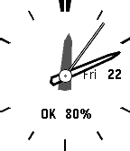</a>

<h2 class="app-name" id="app-57199918de07db7b15000030"><a href="https://apps.repebble.com/57199918de07db7b15000030">P-SHOCK</a></h2>
<a class="app-source" href="https://github.com/bake-san/ANALOG-P-SHOCK.git" title="Source code" data-search-exclude>View source</a>

by <a href="https://apps.repebble.com/apps/dev/akemori-oda_56c1c9c5919c5acb8c000002" title="More from this developer">Akemori Oda</a>

No licence v1.3 Updated 2016-04-22

Runs on: Round 2, Time 2, Pebble 2 Duo, Pebble 2, Time Round, Time, Classic

The sample source to the original has been modifications to the reference to the analog clock of CASIO. サンプルソースを元にCASIOのアナログ時計を参考に修正をしました。 Ver1.1 was thinner second hand . Ver1.1 秒針を細くした。 Ver1.2…

<a class="app-shot" href="https://apps.rebble.io/en_US/application/5500d5d0b5bebe8eba00007b" data-search-exclude>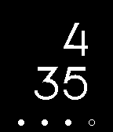</a>

<h2 class="app-name" id="app-5500d5d0b5bebe8eba00007b"><a href="https://apps.rebble.io/en_US/application/5500d5d0b5bebe8eba00007b">P-Time</a></h2>
<a class="app-source" href="http://github.com/rgarth/PebbleP-Time" title="Source code" data-search-exclude>View source</a>

by <a href="https://apps.rebble.io/en_US/developer/52f1fc5b7247497b640000dc/1" title="More from this developer">Rob Garth</a>

MIT v1.2 Updated 2015-04-20 Rebble App Store

Runs on: Time 2, Pebble 2 Duo, Pebble 2, Time, Classic

Another watch-face that simply shows the time and Pebble&#x27;s current battery level.

<a class="app-shot" href="https://apps.repebble.com/56e98f4e3b537ac5fc00001b" data-search-exclude>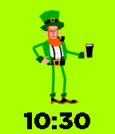</a>

<h2 class="app-name" id="app-56e98f4e3b537ac5fc00001b"><a href="https://apps.repebble.com/56e98f4e3b537ac5fc00001b">Paddy&#x27;s Day</a></h2>
<a class="app-source" href="https://github.com/groyoh/paddys_day" title="Source code" data-search-exclude>View source</a>

by <a href="https://apps.repebble.com/apps/dev/gringer-apps_560c4f952dd2f15e90000009" title="More from this developer">Gringer Apps</a>

Not checked yet v1.2 Updated 2016-03-26

Runs on: Round 2, Time 2, Time Round, Time

Celebrate Saint Patrick’s day with a dancing Irish leprechaun! See him dance every fifth minute or at the flick of your wrist. Designed by @AlessioLaiso and @Theresa_Phelan. Animated by…

<a class="app-shot" href="https://apps.repebble.com/5692db642845db3380000079" data-search-exclude>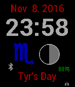</a>

<h2 class="app-name" id="app-5692db642845db3380000079"><a href="https://apps.repebble.com/5692db642845db3380000079">Pagan</a></h2>
<a class="app-source" href="https://github.com/revdrbrown/PebblePagan" title="Source code" data-search-exclude>View source</a>

by <a href="https://apps.repebble.com/apps/dev/dr-david-brown_55315ebd8763f8a6e5000043" title="More from this developer">Dr. David Brown</a>

Not checked yet v2.0 Updated 2016-11-09

Runs on: Round 2, Time 2, Pebble 2 Duo, Pebble 2, Time Round, Time, Classic

Displays date, time, current astrological sun sign, a graphical depiction of the lunar phase and the planet-based day of the week. On solstices, equinoxes and cross-quarter days, the planetary day…

<a class="app-shot" href="https://apps.rebble.io/en_US/application/67ebcf1c696da700090e5dd4" data-search-exclude>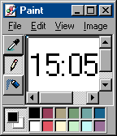</a>

<h2 class="app-name" id="app-67ebcf1c696da700090e5dd4"><a href="https://apps.rebble.io/en_US/application/67ebcf1c696da700090e5dd4">Paint 95</a></h2>
<a class="app-source" href="https://github.com/bimbodhisattva/paint-95-for-pebble-time" title="Source code" data-search-exclude>View source</a>

by <a href="https://apps.rebble.io/en_US/developer/5b6c74294752980001e1a0a8/1" title="More from this developer">bimbodhisattva</a>

No licence v1.1 Updated 2025-04-01 Rebble App Store

Runs on: Time 2, Time

For Pebble Time. Based on Windows 95.

<a class="app-shot" href="https://apps.repebble.com/5587ded03ae5e5b0de0000b6" data-search-exclude>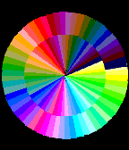</a>

<h2 class="app-name" id="app-5587ded03ae5e5b0de0000b6"><a href="https://apps.repebble.com/5587ded03ae5e5b0de0000b6">palette</a></h2>
<a class="app-source" href="https://github.com/plan44/palette_pebble" title="Source code" data-search-exclude>View source</a>

by <a href="https://apps.repebble.com/apps/dev/plan44-ch_52b2a87b8c0815bb5e0000d5" title="More from this developer">plan44.ch</a>

Not checked yet v1.2 Updated 2015-10-24

Runs on: Round 2, Time 2, Time Round, Time

To celebrate the 64 colors of the new Pebble Time display, here&#x27;s a simple colorful watchface using 60 of them (excluding black, white and gray). Hint for reading the time: sharpest contrast…

<a class="app-shot" href="https://apps.repebble.com/559f0f11479e45928f000080" data-search-exclude>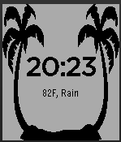</a>

<h2 class="app-name" id="app-559f0f11479e45928f000080"><a href="https://apps.repebble.com/559f0f11479e45928f000080">Palm Trees</a></h2>
<a class="app-source" href="https://cloudpebble.net/ide/project/209035" title="Source code" data-search-exclude>View source</a>

by <a href="https://apps.repebble.com/apps/dev/starscreams-ghost_549c6114ad219e8b11000718" title="More from this developer">Starscreams Ghost</a>

See source v1.0 Updated 2015-07-10

Runs on: Time 2, Pebble 2 Duo, Pebble 2, Time, Classic

Watchface features 2 palm trees with the current time and temperature based on location.

<a class="app-shot" href="https://apps.repebble.com/490fd055aa9b485c8deced5e" data-search-exclude>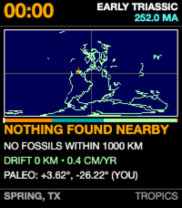</a>

<h2 class="app-name" id="app-490fd055aa9b485c8deced5e"><a href="https://apps.repebble.com/490fd055aa9b485c8deced5e">Pangaea Drift</a></h2>
<a class="app-source" href="https://github.com/globe-and-atlas/pangaea-watch" title="Source code" data-search-exclude>View source</a>

by <a href="https://apps.repebble.com/apps/dev/daniel-bally_e8468a0ff28edd5791d1bced" title="More from this developer">Daniel Bally</a>

Not checked yet v1.0.1 Updated 2026-10-03

Runs on: Time 2

A deep-time cartographic watchface for Pebble Time 2 (Emery). Midnight is 252 million years ago at the Triassic dawn; 23:59 marks the Cretaceous-Paleogene asteroid impact (66 Ma); and the final 60…

<a class="app-shot" href="https://apps.repebble.com/54df3ccc91a09e4790000087" data-search-exclude>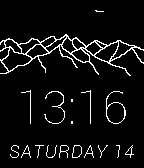</a>

<h2 class="app-name" id="app-54df3ccc91a09e4790000087"><a href="https://apps.repebble.com/54df3ccc91a09e4790000087">Panoramic</a></h2>
<a class="app-source" href="https://github.com/degygii/Panoramic" title="Source code" data-search-exclude>View source</a>

by <a href="https://apps.repebble.com/apps/dev/degygii_5499d00473268f31cd000104" title="More from this developer">degygii</a>

Not checked yet v1.4 Updated 2015-02-18

Runs on: Time 2, Pebble 2 Duo, Pebble 2, Time, Classic

A mountain inspired watchface If you want a version without the seconds animation, check out my other watchface, Panoramic lite. A beautiful (imho) and functional watchface, showing a panoramic…

<a class="app-shot" href="https://apps.repebble.com/70abca87163d49debbf6cbc5" data-search-exclude>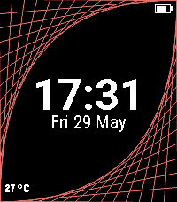</a>

<h2 class="app-name" id="app-70abca87163d49debbf6cbc5"><a href="https://apps.repebble.com/70abca87163d49debbf6cbc5">Parabola</a></h2>
<a class="app-source" href="https://github.com/JonnyKreng/PebbleParabolaWatchface" title="Source code" data-search-exclude>View source</a>

by <a href="https://apps.repebble.com/apps/dev/jonny_5d5ba1411aa8f6110d6f9c64" title="More from this developer">jonny</a>

MIT v1.0.7 Updated 2026-06-05

Runs on: Round 2, Time 2, Pebble 2 Duo

Just a little watchface, i build for fun. For the Time 2, on older watches it does not look great.

<h2 class="app-name" id="app-52e675f414a5c92ca2000032"><a href="https://apps.repebble.com/52e675f414a5c92ca2000032">Parabolic Eye</a></h2>
<a class="app-source" href="https://github.com/GotlingSystem/Parabolic-Eye" title="Source code" data-search-exclude>View source</a>

by <a href="https://apps.repebble.com/apps/dev/marcus-gotling_52d1bfcb2fb6950b8200006c" title="More from this developer">Marcus Gotling</a>

No licence v1.1.0 Updated 2014-02-12

Runs on: Time 2, Pebble 2 Duo, Pebble 2, Time, Classic

Displays the time as an eye using lines to form parabolic curves and a circle. Time of screenshots 1: 04:30:30 2: 14:15:42 3: 20:45:16 Setting for inverse colors. Updates every second so most…

<a class="app-shot" href="https://apps.rebble.io/en_US/application/6a2fbc2f72de6e00088d251b" data-search-exclude>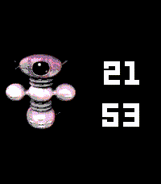</a>

<h2 class="app-name" id="app-6a2fbc2f72de6e00088d251b"><a href="https://apps.rebble.io/en_US/application/6a2fbc2f72de6e00088d251b">Paradroid Watchface</a></h2>
<a class="app-source" href="https://github.com/daktak/pebble_paradroid_2000_watchface" title="Source code" data-search-exclude>View source</a>

by <a href="https://apps.rebble.io/en_US/developer/56e681d026fa04b2d900006c/1" title="More from this developer">Daktak</a>

Not checked yet v1.0.0 Updated 2026-06-15 Rebble App Store

Runs on: Time 2, Pebble 2 Duo, Pebble 2, Time, Classic

Display Paradroid bots Images from https://www.freedroid.org/

<a class="app-shot" href="https://apps.repebble.com/55d0e5b635a72bac4a000030" data-search-exclude>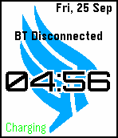</a>

<h2 class="app-name" id="app-55d0e5b635a72bac4a000030"><a href="https://apps.repebble.com/55d0e5b635a72bac4a000030">Paragade</a></h2>
<a class="app-source" href="https://github.com/clach04/watchface_Paragade/" title="Source code" data-search-exclude>View source</a>

by <a href="https://apps.repebble.com/apps/dev/clach04_5524604a9de9550a3300007a" title="More from this developer">clach04</a>

Not checked yet v0.5 Updated 2015-09-26

Runs on: Time 2, Pebble 2 Duo, Pebble 2, Time, Classic

Paragade/Renegon, Paragon or Renegade? Basic digital watch face for the Pebble smartwatch. Features: * Updates once per minute * Includes battery status * Supports Aplite (original Pebble) and…

<a class="app-shot" href="https://apps.repebble.com/6abc2c15139b70000a509eb9" data-search-exclude>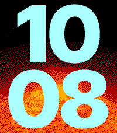</a>

<h2 class="app-name" id="app-6abc2c15139b70000a509eb9"><a href="https://apps.repebble.com/6abc2c15139b70000a509eb9">Parallax Weather</a></h2>
<a class="app-source" href="https://github.com/hornofabraxas/parallax-weather" title="Source code" data-search-exclude>View source</a>

by <a href="https://apps.repebble.com/apps/dev/omgslaykween_6a8876179a73d00009ee3f1a" title="More from this developer">OmgSlayKween</a>

Not checked yet v1.1 Updated 2026-10-02

Runs on: Round 2, Time 2

Big, visible numbers - and configurable live weather backgrounds that move as you tilt your wrist (during backlight only, to save battery). Also includes a live moonphase background and several…

<a class="app-shot" href="https://apps.repebble.com/567f2cec4c02107532000131" data-search-exclude>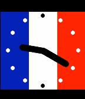</a>

<h2 class="app-name" id="app-567f2cec4c02107532000131"><a href="https://apps.repebble.com/567f2cec4c02107532000131">Paris</a></h2>
<a class="app-source" href="https://github.com/msimoneau/paris" title="Source code" data-search-exclude>View source</a>

by <a href="https://apps.repebble.com/apps/dev/martin-simoneau_564f055471fb6163e200003a" title="More from this developer">Martin Simoneau</a>

Not checked yet v1.01 Updated 2025-11-25

Runs on: Round 2, Time 2, Pebble 2 Duo, Pebble 2, Time Round, Time, Classic

Remembering Paris 2015.

<a class="app-shot" href="https://apps.repebble.com/7616fe1322de4db787898c2c" data-search-exclude>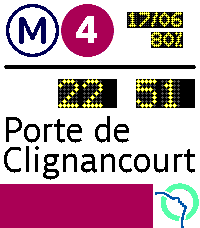</a>

<h2 class="app-name" id="app-7616fe1322de4db787898c2c"><a href="https://apps.repebble.com/7616fe1322de4db787898c2c">Paris Metro - SIEL</a></h2>
<a class="app-source" href="https://codeberg.org/moustilu/pebble-siel-watchface" title="Source code" data-search-exclude>View source</a>

by <a href="https://apps.repebble.com/apps/dev/moustiluigi-random_b920996ce22e744517051f3c" title="More from this developer">Moustiluigi Random</a>

See source v0.0.3 Updated 2026-06-20

Runs on: Time 2

Inspired by Paris&#x27; metro old information systems showing when the next train arrives. Reproduces the classic LED-based display on your watch. Not affiliated to RATP or IDFM! Includes the classic…

<a class="app-shot" href="https://apps.repebble.com/539a8a88ae22775ca6000068" data-search-exclude>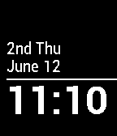</a>

<h2 class="app-name" id="app-539a8a88ae22775ca6000068"><a href="https://apps.repebble.com/539a8a88ae22775ca6000068">Parking</a></h2>
<a class="app-source" href="https://github.com/pythe/pebble-parking" title="Source code" data-search-exclude>View source</a>

by <a href="https://apps.repebble.com/apps/dev/pythe_52bdb902fbe3f888af0000b8" title="More from this developer">Pythe</a>

Not checked yet v1.2 Updated 2015-05-28

Runs on: Time 2, Pebble 2 Duo, Pebble 2, Time, Classic

An edit of Simplicity that includes nth week of the month text like &quot;3rd Wed&quot; for quick reference while attempting street-side parking.

<h2 class="app-name" id="app-5a9c1fb20dfc3214f2000040"><a href="https://apps.rebble.io/en_US/application/5a9c1fb20dfc3214f2000040">Partial</a></h2>
<a class="app-source" href="https://github.com/b123400/pebble-partial" title="Source code" data-search-exclude>View source</a>

by <a href="https://apps.rebble.io/en_US/developer/52f044741ac79491190010f0/1" title="More from this developer">b123400</a>

GPL-3.0 v1.2.0 Updated 2026-06-28 Rebble App Store

Runs on: Round 2, Time 2, Pebble 2 Duo, Pebble 2, Time Round, Time, Classic

The angle of the half circle indicate the hour. The percentage of the half circle filling up indicate how much time is passed in this hour. Keep in mind that it&#x27;s filling up the area instead of a…

<a class="app-shot" href="https://apps.repebble.com/9549cdc291824a589a78d81d" data-search-exclude>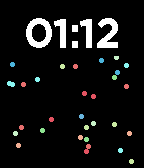</a>

<h2 class="app-name" id="app-9549cdc291824a589a78d81d"><a href="https://apps.repebble.com/9549cdc291824a589a78d81d">Particle Sim</a></h2>
<a class="app-source" href="https://github.com/mrded/pb-particle-simulation" title="Source code" data-search-exclude>View source</a>

by <a href="https://apps.repebble.com/apps/dev/dmitry-demenchuk_0f3801096b0ef6f37fa8ed87" title="More from this developer">Dmitry Demenchuk</a>

Not checked yet v1.0.3 Updated 2026-05-02

Runs on: Time 2, Time

A watchface that simulates colored particles responding to gravity in real time. WARNING: heavy computation, this will drain your battery. I&#x27;m looking for ways to optimise it.

<a class="app-shot" href="https://apps.repebble.com/54177f240ba7a964af000020" data-search-exclude>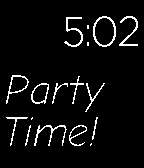</a>

<h2 class="app-name" id="app-54177f240ba7a964af000020"><a href="https://apps.repebble.com/54177f240ba7a964af000020">Party time!</a></h2>
<a class="app-source" href="https://github.com/nicktendo64/party-time" title="Source code" data-search-exclude>View source</a>

by <a href="https://apps.repebble.com/apps/dev/nicholas-currault_52c908c66025fc11fa00003a" title="More from this developer">Nicholas Currault</a>

Not checked yet v1.0 Updated 2014-09-16

Runs on: Time 2, Pebble 2 Duo, Pebble 2, Time, Classic

This watchface flashes once per second and contains both the current time and the text &quot;Party Time!&quot;.

<a class="app-shot" href="https://apps.rebble.io/en_US/application/67bd83c5691e55000aa48ce2" data-search-exclude>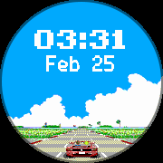</a>

<h2 class="app-name" id="app-67bd83c5691e55000aa48ce2"><a href="https://apps.rebble.io/en_US/application/67bd83c5691e55000aa48ce2">Passing Breeze Round</a></h2>
<a class="app-source" href="https://github.com/HarrisonAllen/pebble-community-watchfaces/tree/main/outrun_port" title="Source code" data-search-exclude>View source</a>

by <a href="https://apps.rebble.io/en_US/developer/5e28ea923dd3109f151c7e08/1" title="More from this developer">Harrison Allen</a>

No licence v1.0 Updated 2025-02-25 Rebble App Store

Runs on: Round 2, Time Round

Passing Breeze (an OutRun inspired watchface) has finally come to the Time Round! This is a port of the original watchface by MicroByte. This watchface was requested by Twebe Bebe on the Rebble…

<a class="app-shot" href="https://apps.repebble.com/828038d2a34d45eb8b3daa37" data-search-exclude>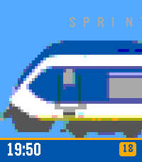</a>

<h2 class="app-name" id="app-828038d2a34d45eb8b3daa37"><a href="https://apps.repebble.com/828038d2a34d45eb8b3daa37">Passing Trains</a></h2>
<a class="app-source" href="https://github.com/rossng/pebble-watchfaces" title="Source code" data-search-exclude>View source</a>

by <a href="https://apps.repebble.com/apps/dev/ross-gardiner_c9373569fe7360f24a6b1a70" title="More from this developer">Ross Gardiner</a>

Not checked yet v1.0.0 Updated 2026-06-18

Runs on: Round 2, Time 2

A native Pebble C watchface that slowly pans along a random Dutch (NS) train, minute by minute, scaled to fill the screen. A subtle type label floats above each train; the time sits in a bottom…

<a class="app-shot" href="https://apps.repebble.com/53795d5062e09fef83000077" data-search-exclude>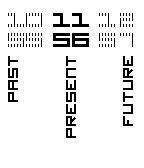</a>

<h2 class="app-name" id="app-53795d5062e09fef83000077"><a href="https://apps.repebble.com/53795d5062e09fef83000077">Past - Present - Future</a></h2>
<a class="app-source" href="https://github.com/C-D-Lewis/past-present-future" title="Source code" data-search-exclude>View source</a>

by <a href="https://apps.repebble.com/apps/dev/chris-lewis_5299cd30e627ce1147000099" title="More from this developer">Chris Lewis</a>

No licence v1.1.0 Updated 2014-05-19

Runs on: Time 2, Pebble 2 Duo, Pebble 2, Time, Classic

Based on the analogue watch.

<a class="app-shot" href="https://apps.repebble.com/537e6531ac5075447a00020f" data-search-exclude>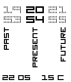</a>

<h2 class="app-name" id="app-537e6531ac5075447a00020f"><a href="https://apps.repebble.com/537e6531ac5075447a00020f">Past - Present - Future Extended</a></h2>
<a class="app-source" href="https://github.com/C-D-Lewis/past-present-future-extended" title="Source code" data-search-exclude>View source</a>

by <a href="https://apps.repebble.com/apps/dev/chris-lewis_5299cd30e627ce1147000099" title="More from this developer">Chris Lewis</a>

No licence v1.1.0 Updated 2014-07-25

Runs on: Time 2, Pebble 2 Duo, Pebble 2, Time, Classic

The Past Present Future watchface with short date and location-aware temperate display.

<a class="app-shot" href="https://apps.repebble.com/fa33ca96a9e1480890a251c2" data-search-exclude>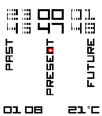</a>

<h2 class="app-name" id="app-fa33ca96a9e1480890a251c2"><a href="https://apps.repebble.com/fa33ca96a9e1480890a251c2">Past-Present-Future</a></h2>
<a class="app-source" href="https://github.com/marukitano/past-present-future" title="Source code" data-search-exclude>View source</a>

by <a href="https://apps.repebble.com/apps/dev/marukitano_ff2831479c1011a82df1985d" title="More from this developer">marukitano</a>

Not checked yet v1.0.2 Updated 2026-08-02

Runs on: Time 2

English The original design was created by Chris Lewis. With his permission, I adapted and rebuilt it for the new Pebble Time 2, added new animations, themes, weather, configuration options and a…

<h2 class="app-name" id="app-4b5cfd6f43024c438591c2c7"><a href="https://apps.repebble.com/4b5cfd6f43024c438591c2c7">patchwork</a></h2>
<a class="app-source" href="https://github.com/C-D-Lewis/pebble-dev/tree/master/watchfaces/patchwork" title="Source code" data-search-exclude>View source</a>

by <a href="https://apps.repebble.com/apps/dev/chris-lewis_5299cd30e627ce1147000099" title="More from this developer">Chris Lewis</a>

No licence v1.3.0 Updated 2026-06-23

Runs on: Round 2, Time 2, Time Round, Time

Patchwork uses isometric rendering to show randomized blocks at various heights and colors in your chosen color palette, overlaid with the time and date in a clean edged font. Choose your color…

<a class="app-shot" href="https://apps.repebble.com/55a96f5427eb8ded4c000006" data-search-exclude>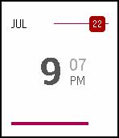</a>

<h2 class="app-name" id="app-55a96f5427eb8ded4c000006"><a href="https://apps.repebble.com/55a96f5427eb8ded4c000006">Path Reborn</a></h2>
<a class="app-source" href="https://github.com/kenny-chen/pebble-path-reborn" title="Source code" data-search-exclude>View source</a>

by <a href="https://apps.repebble.com/apps/dev/kenny-chen_530c50a87cd17ca525000271" title="More from this developer">Kenny Chen</a>

Not checked yet v1.4 Updated 2015-09-17

Runs on: Time 2, Pebble 2 Duo, Pebble 2, Time, Classic

A modified version of the Path watch face by corefault for the Pebble Time, with the seconds bar as a battery bar instead, the minutes moved to the side for easier reading, and a slight increase…

<a class="app-shot" href="https://apps.repebble.com/561a73451a1d8994a700007e" data-search-exclude>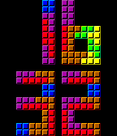</a>

<h2 class="app-name" id="app-561a73451a1d8994a700007e"><a href="https://apps.repebble.com/561a73451a1d8994a700007e">Patris Watch</a></h2>
<a class="app-source" href="https://github.com/Fabien-Chouteau/Ada_Time" title="Source code" data-search-exclude>View source</a>

by <a href="https://apps.repebble.com/apps/dev/fabien_5504bcb38d390726a800002d" title="More from this developer">Fabien</a>

No licence v1.1 Updated 2015-11-04

Runs on: Time 2, Time

Falling blocks telling you what time is it. See more at http://blog.adacore.com/make-with-ada-formal-proof-on-my-wrist

<a class="app-shot" href="https://apps.repebble.com/55de498e785abd2bac000078" data-search-exclude>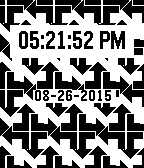</a>

<h2 class="app-name" id="app-55de498e785abd2bac000078"><a href="https://apps.repebble.com/55de498e785abd2bac000078">Pattern Time</a></h2>
<a class="app-source" href="http://github.com/jackdalton/patterntime" title="Source code" data-search-exclude>View source</a>

by <a href="https://apps.repebble.com/apps/dev/jack-dalton_5539664da7c657c72100004f" title="More from this developer">Jack Dalton</a>

No licence v1.0 Updated 2015-08-26

Runs on: Time 2, Pebble 2 Duo, Pebble 2, Time, Classic

A patterned watch face including the date, time, and hourly vibrations.

<a class="app-shot" href="https://apps.repebble.com/5299a381e627ce36ec000063" data-search-exclude>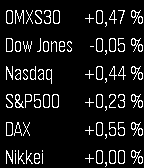</a>

<h2 class="app-name" id="app-5299a381e627ce36ec000063"><a href="https://apps.repebble.com/5299a381e627ce36ec000063">pbl-index</a></h2>
<a class="app-source" href="https://github.com/epatel/pblindex" title="Source code" data-search-exclude>View source</a>

by <a href="https://apps.repebble.com/apps/dev/edward-patel_5299a186129af71434000057" title="More from this developer">Edward Patel</a>

Not checked yet v2.3.0 Updated 2014-01-11

Runs on: Time 2, Pebble 2 Duo, Pebble 2, Time, Classic

This app shows some market indexes. It updates them when the watchface is presented. Created as a watch face for quick usage, and no automatically updating for low battery usage.

<a class="app-shot" href="https://apps.repebble.com/52dfff6c011368e7f800014b" data-search-exclude>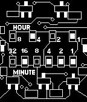</a>

<h2 class="app-name" id="app-52dfff6c011368e7f800014b"><a href="https://apps.repebble.com/52dfff6c011368e7f800014b">PCB Binary</a></h2>
<a class="app-source" href="https://github.com/8a22a/PCBbinary" title="Source code" data-search-exclude>View source</a>

by <a href="https://apps.repebble.com/apps/dev/8a22a_529c6b5bf7997434c1000021" title="More from this developer">8a22a</a>

No licence v2.0 Updated 2014-01-22

Runs on: Time 2, Pebble 2 Duo, Pebble 2, Time, Classic

Binary watchface with PCB background design.

<h2 class="app-name" id="app-4989ba26b1ec4de7b757b1d0"><a href="https://apps.repebble.com/4989ba26b1ec4de7b757b1d0">Pear Hermit</a></h2>
<a class="app-source" href="https://github.com/ygalanter/pear-hermit-pebble" title="Source code" data-search-exclude>View source</a>

by <a href="https://apps.repebble.com/apps/dev/comfortably-numb_52f547605101128b2200005a" title="More from this developer">Comfortably Numb</a>

Not checked yet v1.0.0 Updated 2026-05-24

Runs on: Time 2

Analog clock with familiar look, shows date and activity tracking: Shake the watch to switch betwen - step counter, - distance walked - calories burned, - time active - heart-rate - or battery…

<a class="app-shot" href="https://apps.repebble.com/9573b80665544b23a3382ab5" data-search-exclude>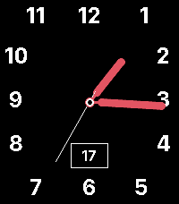</a>

<h2 class="app-name" id="app-9573b80665544b23a3382ab5"><a href="https://apps.repebble.com/9573b80665544b23a3382ab5">Pear Hermit California</a></h2>
<a class="app-source" href="https://github.com/AlexisBallo2/pear-hermit-ca-pebble" title="Source code" data-search-exclude>View source</a>

by <a href="https://apps.repebble.com/apps/dev/alexis-ballo_c70905f6b73f09634878474c" title="More from this developer">Alexis Ballo</a>

No licence v1.0.1 Updated 2026-06-17

Runs on: Time 2

Just removed the activity tracking from townmath&#x27;s pear hermit face. https://github.com/townmath/pear-hermit-ca-pebble. All credit to them

<a class="app-shot" href="https://apps.repebble.com/ff769e6cc50848f589dade12" data-search-exclude>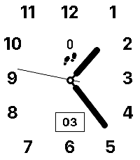</a>

<h2 class="app-name" id="app-ff769e6cc50848f589dade12"><a href="https://apps.repebble.com/ff769e6cc50848f589dade12">Pear Hermit California</a></h2>
<a class="app-source" href="https://github.com/townmath/pear-hermit-ca-pebble" title="Source code" data-search-exclude>View source</a>

by <a href="https://apps.repebble.com/apps/dev/townmath_56df90d4774abcde2800003d" title="More from this developer">townmath</a>

Not checked yet v1.0.2 Updated 2026-06-03

Runs on: Time 2

Analog watch face with configurable colors and activity display.

<a class="app-shot" href="https://apps.repebble.com/5511d9b7c8d9d1bcd700003d" data-search-exclude>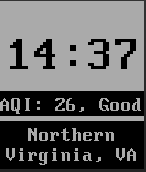</a>

<h2 class="app-name" id="app-5511d9b7c8d9d1bcd700003d"><a href="https://apps.repebble.com/5511d9b7c8d9d1bcd700003d">Pebble Air Quality Indicator</a></h2>
<a class="app-source" href="https://github.com/hiyou102/PebbleEco" title="Source code" data-search-exclude>View source</a>

by <a href="https://apps.repebble.com/apps/dev/denis-trailin_53acb47a4adcb28ecf0000b8" title="More from this developer">Denis Trailin</a>

Not checked yet v1.0 Updated 2015-03-24

Runs on: Time 2, Pebble 2 Duo, Pebble 2, Time, Classic

Watchface that shows the air quality in the nearest city within 50 miles. US only for now

<a class="app-shot" href="https://apps.repebble.com/0ca1204c486849f7aaed36aa" data-search-exclude>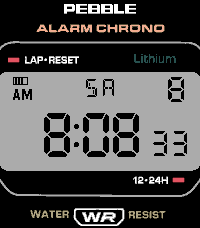</a>

<h2 class="app-name" id="app-0ca1204c486849f7aaed36aa"><a href="https://apps.repebble.com/0ca1204c486849f7aaed36aa">Pebble Digital Classic</a></h2>
<a class="app-source" href="https://github.com/dantoth24/watchface-digital-classic" title="Source code" data-search-exclude>View source</a>

by <a href="https://apps.repebble.com/apps/dev/dtoth_b855fb454106c7a9a8d5f6f5" title="More from this developer">dtoth</a>

Not checked yet v1.4.6 Updated 2026-07-17

Runs on: Round 2, Time 2

A retro tribute to the iconic 80s digital sport watch, faithfully redrawn for Pebble Round 2. Features: Authentic LCD-style bitmap digits for hours and minutes Live seconds display Day-of-week…

<a class="app-shot" href="https://apps.repebble.com/536b1e7362917afde20000ed" data-search-exclude>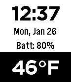</a>

<h2 class="app-name" id="app-536b1e7362917afde20000ed"><a href="https://apps.repebble.com/536b1e7362917afde20000ed">Pebble Drive</a></h2>
<a class="app-source" href="https://github.com/MacBoyPro98/Pebble.git" title="Source code" data-search-exclude>View source</a>

by <a href="https://apps.repebble.com/apps/dev/macboy-pro_52f00c508f27d1d394000088" title="More from this developer">MacBoy__Pro</a>

No licence v1.18 Updated 2015-10-26

Runs on: Time 2, Pebble 2 Duo, Pebble 2, Time, Classic

Basic Watchface with weather, date, time, and location displayed easily. If you have any suggestions or things I could do differently feel free to contact me with your ideas. With my app on iPhone…

<a class="app-shot" href="https://apps.repebble.com/ed184324553e4ce2aa6be736" data-search-exclude>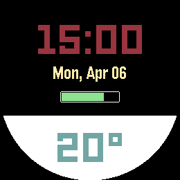</a>

<h2 class="app-name" id="app-ed184324553e4ce2aa6be736"><a href="https://apps.repebble.com/ed184324553e4ce2aa6be736">Pebble Drive</a></h2>
<a class="app-source" href="https://github.com/MacBoyPro98/DriveV2" title="Source code" data-search-exclude>View source</a>

by <a href="https://apps.repebble.com/apps/dev/macboy-pro_324802dade0f07d315ed355c" title="More from this developer">MacBoy__Pro</a>

No licence v1.6 Updated 2026-04-07

Runs on: Round 2, Time 2, Pebble 2 Duo, Pebble 2, Time Round, Time, Classic

Basic watch face with time, date, battery percentage and temperature displayed.

<a class="app-shot" href="https://apps.rebble.io/en_US/application/60b941551342ae00a7b63a93" data-search-exclude>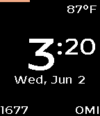</a>

<h2 class="app-name" id="app-60b941551342ae00a7b63a93"><a href="https://apps.rebble.io/en_US/application/60b941551342ae00a7b63a93">Pebble Float</a></h2>
<a class="app-source" href="https://github.com/jmsunseri/pebble-float" title="Source code" data-search-exclude>View source</a>

by <a href="https://apps.rebble.io/en_US/developer/60b941541342ae00a7b63a91/1" title="More from this developer">Justin Sunseri</a>

Not checked yet v1.0 Updated 2021-06-03 Rebble App Store

Runs on: Time 2, Pebble 2 Duo, Pebble 2, Time, Classic

Clean watch face displaying time, steps, distance, current temp, date with day of week, and battery bar at the top

<a class="app-shot" href="https://apps.repebble.com/24899b140df14a9b88915204" data-search-exclude>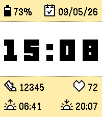</a>

<h2 class="app-name" id="app-24899b140df14a9b88915204"><a href="https://apps.repebble.com/24899b140df14a9b88915204">Pebble Like Time</a></h2>
<a class="app-source" href="https://github.com/MrReSc/pebble-like-time" title="Source code" data-search-exclude>View source</a>

by <a href="https://apps.repebble.com/apps/dev/mrresc_edb16e1f846c567204ba5552" title="More from this developer">MrReSc</a>

Apache-2.0 v1.0.1 Updated 2026-09-05

Runs on: Time 2

A crisp clock with battery, date, Health stats and locally calculated sun times.

<a class="app-shot" href="https://apps.repebble.com/52cfaf1ef726c833ac000049" data-search-exclude>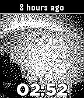</a>

<h2 class="app-name" id="app-52cfaf1ef726c833ac000049"><a href="https://apps.repebble.com/52cfaf1ef726c833ac000049">Pebble Mars</a></h2>
<a class="app-source" href="https://github.com/witoff/PebbleMars" title="Source code" data-search-exclude>View source</a>

by <a href="https://apps.repebble.com/apps/dev/dan-isla_52cfabaf4680afb3c4000053" title="More from this developer">Dan Isla</a>

Not checked yet v1.2.1 Updated 2014-01-10

Runs on: Time 2, Pebble 2 Duo, Pebble 2, Time, Classic

Streaming images from the Curiosity rover on Mars straight to your watch! The latest images returned through the Deep Space Network are made available on public servers immediately after arrival…

<a class="app-shot" href="https://apps.repebble.com/20546b1dc76e4eb0aa4cbc1f" data-search-exclude>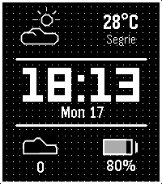</a>

<h2 class="app-name" id="app-20546b1dc76e4eb0aa4cbc1f"><a href="https://apps.repebble.com/20546b1dc76e4eb0aa4cbc1f">Pebble Mesh</a></h2>
<a class="app-source" href="https://github.com/peerdavid/pebble-mesh" title="Source code" data-search-exclude>View source</a>

by <a href="https://apps.repebble.com/apps/dev/david-peer_68fb6df5d3c6e4000885b8f5" title="More from this developer">David Peer</a>

Not checked yet v1.66 Updated 2026-09-02

Runs on: Time 2, Pebble 2 Duo, Pebble 2, Time

Pebble Mesh is an open-source, retro-digital watch face designed for maximum clarity and essential stats. This face features a signature dot-matrix grid background that gives it a crisp…

<a class="app-shot" href="https://apps.repebble.com/67c3d858d2acb30009a3c7cf" data-search-exclude>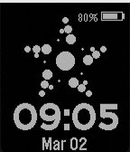</a>

<h2 class="app-name" id="app-67c3d858d2acb30009a3c7cf"><a href="https://apps.repebble.com/67c3d858d2acb30009a3c7cf">Pebble Particles (Animated)</a></h2>
<a class="app-source" href="https://github.com/priyankark/pebble-particles-pbw" title="Source code" data-search-exclude>View source</a>

by <a href="https://apps.repebble.com/apps/dev/aircodum_67bc77bf37d408000a74f7d3" title="More from this developer">AirCodum</a>

Not checked yet v1.0 Updated 2025-03-02

Runs on: Round 2, Time 2, Pebble 2 Duo, Pebble 2, Time Round, Time, Classic

Experience time in a mesmerizing new way with Pebble Particles! This elegant watchface transforms your Pebble into a dynamic particle system where time flows through beautiful animated particles…

<a class="app-shot" href="https://apps.repebble.com/54457ded2a5191123d00012b" data-search-exclude>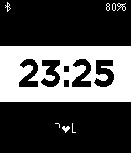</a>

<h2 class="app-name" id="app-54457ded2a5191123d00012b"><a href="https://apps.repebble.com/54457ded2a5191123d00012b">Pebble Peek</a></h2>
<a class="app-source" href="https://github.com/ansysic/Peek" title="Source code" data-search-exclude>View source</a>

by <a href="https://apps.repebble.com/apps/dev/philipp-stadler_52f0fc73a0cb6a3d150007d9" title="More from this developer">Philipp Stadler</a>

No licence v1.0 Updated 2014-10-20

Runs on: Time 2, Pebble 2 Duo, Pebble 2, Time, Classic

This watchface is intended to only show notification icons from your phone and not the actual messasge. It&#x27;s an alpha version and still work in progress...

<a class="app-shot" href="https://apps.repebble.com/52d396683e2e256b6c00001e" data-search-exclude>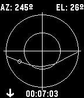</a>

<h2 class="app-name" id="app-52d396683e2e256b6c00001e"><a href="https://apps.repebble.com/52d396683e2e256b6c00001e">Pebble Sat</a></h2>
<a class="app-source" href="https://github.com/sarfata/pbsat" title="Source code" data-search-exclude>View source</a>

by <a href="https://apps.repebble.com/apps/dev/sarfata_5286a448fbdd0d1e96000019" title="More from this developer">sarfata</a>

Not checked yet v1.0.6 Updated 2014-07-18

Runs on: Time 2, Pebble 2 Duo, Pebble 2, Time, Classic

Never miss a chance to catch the ISS station when it flies above your head with this watchface!

<a class="app-shot" href="https://apps.repebble.com/534856abc440279cfe000045" data-search-exclude>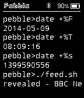</a>

<h2 class="app-name" id="app-534856abc440279cfe000045"><a href="https://apps.repebble.com/534856abc440279cfe000045">Pebble Term Watch</a></h2>
<a class="app-source" href="https://github.com/polygonplanet/PebbleTermWatch" title="Source code" data-search-exclude>View source</a>

by <a href="https://apps.repebble.com/apps/dev/polygon_534076abf1edc8e76a0002a3" title="More from this developer">polygon</a>

Not checked yet v1.0.9 Updated 2014-05-16

Runs on: Time 2, Pebble 2 Duo, Pebble 2, Time, Classic

Pebble watchface like terminal typing with a simple RSS feed reader. - Battery level indicator - Bluetooth connection icon - Bluetooth disconnect vibration (on/off) - Unix epoch time - Minutely…

<a class="app-shot" href="https://apps.repebble.com/53608b842d33b45e5900009f" data-search-exclude>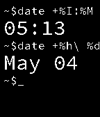</a>

<h2 class="app-name" id="app-53608b842d33b45e5900009f"><a href="https://apps.repebble.com/53608b842d33b45e5900009f">Pebble Terminal</a></h2>
<a class="app-source" href="https://github.com/vidia/Pebble-Shell" title="Source code" data-search-exclude>View source</a>

by <a href="https://apps.repebble.com/apps/dev/vidia_532614caaff3368e8d000358" title="More from this developer">Vidia</a>

Not checked yet v1.2.2 Updated 2014-05-14

Runs on: Time 2, Pebble 2 Duo, Pebble 2, Time, Classic

The Pebble Terminal turns your watch into a Linux terminal and uses the `date` command to print the time and day. Features: Larger time and date text than the competition! Familiar Linux syntax…

<a class="app-shot" href="https://apps.repebble.com/916e2f28a998413f8390fb08" data-search-exclude>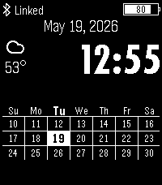</a>

<h2 class="app-name" id="app-916e2f28a998413f8390fb08"><a href="https://apps.repebble.com/916e2f28a998413f8390fb08">Pebble Timely</a></h2>
<a class="app-source" href="https://github.com/alan-johnson/PebbleTimely" title="Source code" data-search-exclude>View source</a>

by <a href="https://apps.repebble.com/apps/dev/alan-johnson_67a284c581c36f00092a6a3b" title="More from this developer">Alan Johnson</a>

GPL-3.0 v3.3.0 Updated 2026-05-25

Runs on: Time 2, Pebble 2 Duo, Pebble 2, Time, Classic

Based on the original Timely watchface by Martin Norland &lt;cyn@cyn.org&gt;, original source: https://github.com/cynorg/PebbleTimely. This is a Watchface for the Pebble Watch. It shows the current date…

<h2 class="app-name" id="app-607dad8e1342ae005a8a9b2c"><a href="https://apps.rebble.io/en_US/application/607dad8e1342ae005a8a9b2c">pebble-day-night-pix</a></h2>
<a class="app-source" href="https://github.com/zhcong/pebble-day-night-pix" title="Source code" data-search-exclude>View source</a>

by <a href="https://apps.rebble.io/en_US/developer/607dad8b1342ae005a8a9b2a/1" title="More from this developer">fork from David Gianforte</a>

Not checked yet v1.6 Updated 2021-04-19 Rebble App Store

Runs on: Time 2, Pebble 2 Duo, Pebble 2, Time, Classic

fork from watchface pebble-day-night, this is a day-night map pix edition for you! And DIY this watchface by github source code.

<a class="app-shot" href="https://apps.repebble.com/648bfbf405594a0b99b99445" data-search-exclude>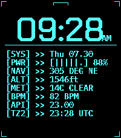</a>

<h2 class="app-name" id="app-648bfbf405594a0b99b99445"><a href="https://apps.repebble.com/648bfbf405594a0b99b99445">pebble_deck</a></h2>
<a class="app-source" href="https://github.com/Keatr0n/pebble_deck" title="Source code" data-search-exclude>View source</a>

by <a href="https://apps.repebble.com/apps/dev/keatr0n_2a36dcefb2ef947e811561d5" title="More from this developer">Keatr0n</a>

No licence v1.2.0 Updated 2026-09-03

Runs on: Time 2

pebble_deck is designed to emulate a terminal interface with 8 customizable complication slots. You can pick from any of the following: - Date - Battery - Free heap memory - Compass (only updates…

<a class="app-shot" href="https://apps.rebble.io/en_US/application/6aa1b542c73fab0009866df1" data-search-exclude>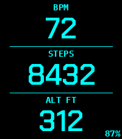</a>

<h2 class="app-name" id="app-6aa1b542c73fab0009866df1"><a href="https://apps.rebble.io/en_US/application/6aa1b542c73fab0009866df1">pebble_deck Bigface</a></h2>
<a class="app-source" href="https://github.com/futur3gentleman/pebble_deck_bigface/tree/bigface" title="Source code" data-search-exclude>View source</a>

by <a href="https://apps.rebble.io/en_US/developer/6aa1b33922335f0009c19eaa/1" title="More from this developer">futur3gentleman</a>

Not checked yet v1.2.0 Updated 2026-09-09 Rebble App Store

Runs on: Time 2

Display 3 pieces of information with a large font. Ideal if you use the Pebble as a second watch. This is a fork of the pebble_deck watchface.

<a class="app-shot" href="https://apps.repebble.com/a5f73770a25f46d5a4b9a090" data-search-exclude>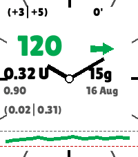</a>

<h2 class="app-name" id="app-a5f73770a25f46d5a4b9a090"><a href="https://apps.repebble.com/a5f73770a25f46d5a4b9a090">PebbleAAPS</a></h2>
<a class="app-source" href="https://github.com/ssuppe/PebbleAAPS" title="Source code" data-search-exclude>View source</a>

by <a href="https://apps.repebble.com/apps/dev/soopaloop_5f77fb329ed47a89ea649fff" title="More from this developer">Soopaloop</a>

Not checked yet v1.0.0 Updated 2026-08-16

Runs on: Round 2, Time 2, Pebble 2 Duo, Pebble 2, Time Round, Time

PebbleAAPS is a lightweight, high-contrast Pebble watchface that displays real-time status data broadcast from AndroidAPS (AAPS), including glucose readings, trend arrows, active insulin/carbs…

<a class="app-shot" href="https://apps.repebble.com/ec67f88d800e46b7bc65e873" data-search-exclude>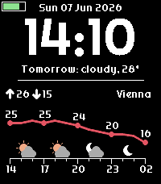</a>

<h2 class="app-name" id="app-ec67f88d800e46b7bc65e873"><a href="https://apps.repebble.com/ec67f88d800e46b7bc65e873">Pebblecast Weather</a></h2>
<a class="app-source" href="https://github.com/ConstantinMatheis/pebblecast-weather" title="Source code" data-search-exclude>View source</a>

by <a href="https://apps.repebble.com/apps/dev/constantin-matheis_5c638b7cc2f9d5f32c07b725" title="More from this developer">Constantin Matheis</a>

GPL-3.0 v1.0.0 Updated 2026-06-07

Runs on: Time 2, Pebble 2 Duo, Pebble 2, Time, Classic

A watch face that visualizes the weather for the next 12 hours. Notable Features ------------------ - Light and dark themes - Celsius and Fahrenheit support - Short summary of tomorrow&#x27;s weather…

<a class="app-shot" href="https://apps.repebble.com/bc5427b437d44ced90b7f851" data-search-exclude>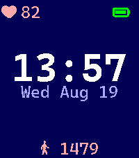</a>

<h2 class="app-name" id="app-bc5427b437d44ced90b7f851"><a href="https://apps.repebble.com/bc5427b437d44ced90b7f851">pebbleCat</a></h2>
<a class="app-source" href="https://github.com/Lazken/pebble-catppuccin" title="Source code" data-search-exclude>View source</a>

by <a href="https://apps.repebble.com/apps/dev/laz_eeb16e199e809e04052f6723" title="More from this developer">Laz</a>

No licence v1.0.1 Updated 2026-08-19

Runs on: Time 2

Simple watchface using Catppuccin color palettes. Different Flavours can be chosen in settings. - Latte - Frappe - Macchiato - Mocha Font used is Caskaydia Cove Nerd Font. Heartrate and steps…

<a class="app-shot" href="https://apps.repebble.com/1d034effa03a4d10b41b6556" data-search-exclude>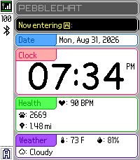</a>

<h2 class="app-name" id="app-1d034effa03a4d10b41b6556"><a href="https://apps.repebble.com/1d034effa03a4d10b41b6556">PebbleChat</a></h2>
<a class="app-source" href="https://github.com/bscoup01/PebbleChat" title="Source code" data-search-exclude>View source</a>

by <a href="https://apps.repebble.com/apps/dev/brandon-coupal_0db1e0062a42c30823b3ab72" title="More from this developer">Brandon Coupal</a>

MIT v1.0.1 Updated 2026-09-02

Runs on: Time 2

A watchface for the Pebble Time 2 inspired by Pictochat on the Nintendo DS!

<h2 class="app-name" id="app-555eb6999dd059f8fc000026"><a href="https://apps.repebble.com/555eb6999dd059f8fc000026">PebbleGlobe</a></h2>
<a class="app-source" href="http://github.com/gitvestman/PebbleGlobe" title="Source code" data-search-exclude>View source</a>

by <a href="https://apps.repebble.com/apps/dev/vestman_553ea9dd435307fdce000089" title="More from this developer">Vestman</a>

No licence v1.17 Updated 2016-10-26

Runs on: Round 2, Time 2, Pebble 2 Duo, Pebble 2, Time Round, Time, Classic

Watchface with a view of earth as a spinning globe. featuring smooth animations of the rotating globe. Follows the sun around earth. Spin the globe with a flick of the wrist. The direction of the…

<h2 class="app-name" id="app-60eff8e81342ae009770ca32"><a href="https://apps.repebble.com/60eff8e81342ae009770ca32">Pebblemon Time</a></h2>
<a class="app-source" href="https://github.com/HarrisonAllen/pebblemon-watchface" title="Source code" data-search-exclude>View source</a>

by <a href="https://apps.repebble.com/apps/dev/harrison-allen_5e28ea923dd3109f151c7e08" title="More from this developer">Harrison Allen</a>

No licence v2.0 Updated 2021-07-27

Runs on: Round 2, Time 2, Pebble 2 Duo, Pebble 2, Time Round, Time, Classic

Pebblemon Time! Explore the Pokémon world of Pebblemon, but with a twist: the watchface does all the exploring for you! Every minute, your character will take another step forward through the…

<h2 class="app-name" id="app-52dc36aa75436b22120000f4"><a href="https://apps.repebble.com/52dc36aa75436b22120000f4">Pebblemous</a></h2>
<a class="app-source" href="https://github.com/dexif/Pebblemous" title="Source code" data-search-exclude>View source</a>

by <a href="https://apps.repebble.com/apps/dev/dexif_52cfaf52516669ee6b00003a" title="More from this developer">Dexif</a>

Not checked yet v1.3 Updated 2014-02-04

Runs on: Time 2, Pebble 2 Duo, Pebble 2, Time, Classic

Pebble Anonymous watchface

<h2 class="app-name" id="app-adef02297c584fe7929b31ac"><a href="https://apps.repebble.com/adef02297c584fe7929b31ac">PebblePebble24</a></h2>
<a class="app-source" href="https://github.com/Tombarr/PebblePebble24" title="Source code" data-search-exclude>View source</a>

by <a href="https://apps.repebble.com/apps/dev/tom-barrasso_fbc733e607111c40a710b20a" title="More from this developer">Tom Barrasso</a>

Apache-2.0 v1.1 Updated 2026-04-16

Runs on: Round 2, Time 2, Pebble 2 Duo, Pebble 2, Time Round, Time, Classic

Animated watch face inspires by ClockClock24 from Humans Since 1982

<h2 class="app-name" id="app-66ca3d63cb8a471b888d776b"><a href="https://apps.repebble.com/66ca3d63cb8a471b888d776b">PebbleSky</a></h2>
<a class="app-source" href="https://github.com/dbortz/PebbleSky" title="Source code" data-search-exclude>View source</a>

by <a href="https://apps.repebble.com/apps/dev/dave-bortz_a5ed2ca64fa47426fc50360e" title="More from this developer">Dave Bortz</a>

Not checked yet v1.1.0 Updated 2026-06-05

Runs on: Time 2

A weather watchface with a hyperlocal 2-hour precipitation nowcast and a live rain countdown.

<h2 class="app-name" id="app-5363e86d35a540019f0000c0"><a href="https://apps.repebble.com/5363e86d35a540019f0000c0">PebbleTextWatch-tr</a></h2>
<a class="app-source" href="https://github.com/pebble-tr/PebbleTextWatch-tr" title="Source code" data-search-exclude>View source</a>

by <a href="https://apps.repebble.com/apps/dev/g-l-ah-k-se-ayb-ke-zdemir_52f953f020ab1e6703000543" title="More from this developer">Gülşah Köse-Aybüke Özdemir</a>

Not checked yet v2.1.1 Updated 2014-05-29

Runs on: Time 2, Pebble 2 Duo, Pebble 2, Time, Classic

TextWatch watchface&#x27;in Türkçeye uyarlanmış halidir. Sonradan eklenen özellikler: * Pebble&#x27;ın pil durumu * Blutooth bağlantısı koptuğunda titrşimle uyarı The famous TextWatch watchface but in…

<h2 class="app-name" id="app-cbd7840a45424bae97f459ec"><a href="https://apps.repebble.com/cbd7840a45424bae97f459ec">Penumbra</a></h2>
<a class="app-source" href="https://github.com/GeoffAtLarge/pebble-gradient-watchface" title="Source code" data-search-exclude>View source</a>

by <a href="https://apps.repebble.com/apps/dev/netnoise_164926ef742b9ab422a9bacb" title="More from this developer">NetNoise</a>

No licence v1.0.0 Updated 2026-10-05

Runs on: Round 2, Time 2, Time Round, Time

Penumbra tells the time with light and shadow. Each hand is a soft gradient disc that starts solid at the hand and fades away around the dial. Read the hour and minute from where the fades begin…

<h2 class="app-name" id="app-55ad34495ce176822500008c"><a href="https://apps.repebble.com/55ad34495ce176822500008c">Percentage</a></h2>
<a class="app-source" href="https://github.com/lazaronijunior/Percentage-Watchface" title="Source code" data-search-exclude>View source</a>

by <a href="https://apps.repebble.com/apps/dev/marcelo-lazaroni_5565fcb808c37657f1000080" title="More from this developer">Marcelo Lazaroni</a>

Not checked yet v1.0 Updated 2015-07-22

Runs on: Time 2, Time

See the time in a different way. Seeing time as a percentage you can be more aware of how much of your time you are dedicating to each thing. The background colour changes from green to red as the…

<h2 class="app-name" id="app-2799cd581c2a4bbbade7f3da"><a href="https://apps.repebble.com/2799cd581c2a4bbbade7f3da">Percival</a></h2>
<a class="app-source" href="https://github.com/barefootford/Percival" title="Source code" data-search-exclude>View source</a>

by <a href="https://apps.repebble.com/apps/dev/andrew-ford_0719eed4ae8890bb0271f34b" title="More from this developer">Andrew Ford</a>

MIT v1.3.0 Updated 2026-04-24

Runs on: Time 2

A clean watchface with rich customizable complications. Primary complications: - Current weather with city and temperature - Daily high/low temps - Sunrise or sunset time - Step count Accent…

<h2 class="app-name" id="app-581d4b599cbbaf2ef200015d"><a href="https://apps.repebble.com/581d4b599cbbaf2ef200015d">Perfect Analog</a></h2>
<a class="app-source" href="https://github.com/jakerusch/DIAL_V4" title="Source code" data-search-exclude>View source</a>

by <a href="https://apps.repebble.com/apps/dev/jakerusch_5744715f00693fd87600000b" title="More from this developer">Jakerusch</a>

Not checked yet v1.8 Updated 2017-05-22

Runs on: Round 2, Time 2, Pebble 2 Duo, Pebble 2, Time Round, Time, Classic

This is Perfect Analog in Fahrenheit (look for Perfect Analog Celsius if you want the Celsius version). It provides temperature, weather conditions, weekday, day of month, health, and battery…

<h2 class="app-name" id="app-581fb098e7785b8942000001"><a href="https://apps.repebble.com/581fb098e7785b8942000001">Perfect Analog Celsuius</a></h2>
<a class="app-source" href="https://www.github.com/jakerusch/DIAL_V4" title="Source code" data-search-exclude>View source</a>

by <a href="https://apps.repebble.com/apps/dev/jakerusch_5744715f00693fd87600000b" title="More from this developer">Jakerusch</a>

Not checked yet v1.6 Updated 2016-11-30

Runs on: Round 2, Time 2, Pebble 2 Duo, Pebble 2, Time Round, Time, Classic

This is Perfect Analog Celsius (look for Perfect Analog if you want the Fahrenheit version). It provides temperature, weather conditions, weekday, day of month, health, and battery status. Weather…

<h2 class="app-name" id="app-577f4d98fdfb41c3a8267fab"><a href="https://apps.repebble.com/577f4d98fdfb41c3a8267fab">Periodic Color</a></h2>
<a class="app-source" href="https://github.com/KeshavPratap-K/Periodic-Color" title="Source code" data-search-exclude>View source</a>

by <a href="https://apps.repebble.com/apps/dev/keshavpratap_e0bc7ee30a038907b7d48939" title="More from this developer">keshavpratap</a>

No licence v1.5.0 Updated 2026-09-18

Runs on: Time 2, Pebble 2 Duo, Pebble 2, Time, Classic

This is a color updated version of classic Periodic watchface. Have your watch show the time in periodic entries with the Periodic watchface! The hour and time is displayed with the chemical…

<h2 class="app-name" id="app-55893f04050a7f31090000b3"><a href="https://apps.repebble.com/55893f04050a7f31090000b3">Periodic Time</a></h2>
<a class="app-source" href="https://github.com/aspyct/periodictime" title="Source code" data-search-exclude>View source</a>

by <a href="https://apps.repebble.com/apps/dev/aspyct_53103d2d1191416b3e00018c" title="More from this developer">aspyct</a>

No licence v1.2 Updated 2015-07-01

Runs on: Time 2, Pebble 2 Duo, Pebble 2, Time, Classic

Here, have this atomic watchface! For each minute, one of the 118 known elements is displayed, in order. Elements #0 and #119 are replaced with a small grid of the periodic table. Terrific for…

<h2 class="app-name" id="app-55aa599e27eb8dd245000090"><a href="https://apps.repebble.com/55aa599e27eb8dd245000090">Perlin</a></h2>
<a class="app-source" href="https://github.com/mereed/pebbleface-perlin" title="Source code" data-search-exclude>View source</a>

by <a href="https://apps.repebble.com/apps/dev/chops_52d76309bd61272345000001" title="More from this developer">chops</a>

Not checked yet v2.0 Updated 2016-09-19

Runs on: Round 2, Time 2, Time Round, Time

19 Sept: update for sdk 4 quick view. Also replaced all images, and a new (clay) settings page. ----- This is a watchface developed to showcase the stunning digital artwork of Laurens Lapre - see…

<h2 class="app-name" id="app-3ee5889ee7764faaac9a5476"><a href="https://apps.repebble.com/3ee5889ee7764faaac9a5476">perlin forked v2</a></h2>
<a class="app-source" href="https://github.com/shoepaladin/pebbleface-perlin" title="Source code" data-search-exclude>View source</a>

by <a href="https://apps.repebble.com/apps/dev/sapphire-second-hand_527b6cf8aa4310a44fe95d9d" title="More from this developer">Sapphire Second-Hand</a>

Not checked yet v1.5.1 Updated 2026-06-11

Runs on: Round 2, Time 2, Time Round, Time

This is a fork of the original Perlin watchface (https://apps.repebble.com/55aa599e27eb8dd245000090?section=watchfaces). You can configure: 1. Date 2. Battery percentage at the top 3. Steps…

<h2 class="app-name" id="app-6a4eca251eb8590009825e40"><a href="https://apps.rebble.io/en_US/application/6a4eca251eb8590009825e40">Perlin Grid</a></h2>
<a class="app-source" href="https://gitlab.com/intrinseca/perlin-grid" title="Source code" data-search-exclude>View source</a>

by <a href="https://apps.rebble.io/en_US/developer/5663f3ccf7c6e0dd41000006/1" title="More from this developer">Intrinseca</a>

Not checked yet v1.0.0 Updated 2026-07-08 Rebble App Store

Runs on: Time 2

Inspired by Triangles and Perlin, uses Perlin Noise to generate a random grid of colourful triangles as the watchface background.

<h2 class="app-name" id="app-579181dd84242800800002e1"><a href="https://apps.repebble.com/579181dd84242800800002e1">Perpetual</a></h2>
<a class="app-source" href="https://github.com/zealotree/Perpetual" title="Source code" data-search-exclude>View source</a>

by <a href="https://apps.repebble.com/apps/dev/zealotree_5722b3d1db5a405aa4000023" title="More from this developer">Zealotree</a>

Not checked yet v2.1 Updated 2016-10-08

Runs on: Round 2, Time 2, Time Round, Time

Perpetual is a watchface that displays the time, date, month and the weekday in an analogue fashion. The hour hand is red, and the minute hand is white. The 6 markers are ten minute markers. In…

<h2 class="app-name" id="app-53ed2eebaec98734e500000c"><a href="https://apps.repebble.com/53ed2eebaec98734e500000c">Persian Watchface</a></h2>
<a class="app-source" href="https://github.com/poooyak/persianPebbleWatchface" title="Source code" data-search-exclude>View source</a>

by <a href="https://apps.repebble.com/apps/dev/pooya-khaloo_53ccd5189c44a4591800016b" title="More from this developer">Pooya Khaloo</a>

Not checked yet v1.0 Updated 2014-08-14

Runs on: Time 2, Pebble 2 Duo, Pebble 2, Time, Classic

This is the first watchface that has persian calendar. It also show geogorian calendar and battery status.

<h2 class="app-name" id="app-56d93fd1b8a67df531000005"><a href="https://apps.rebble.io/en_US/application/56d93fd1b8a67df531000005">Persona 3</a></h2>
<a class="app-source" href="https://github.com/SuperRiderTH/Persona3Pebble" title="Source code" data-search-exclude>View source</a>

by <a href="https://apps.rebble.io/en_US/developer/53e9248bacfbaade51000109/1" title="More from this developer">Sean Srock</a>

No licence v1.0 Updated 2016-03-04 Rebble App Store

Runs on: Round 2, Time 2, Pebble 2 Duo, Pebble 2, Time Round, Time, Classic

Inspired by the HUD of Persona 3, this watchface changes with the time of day. Supports 12/24 hr time, vibrates and changes on loss of phone connection.

<h2 class="app-name" id="app-52ac89e219ff500f7000000d"><a href="https://apps.repebble.com/52ac89e219ff500f7000000d">Persona 4: THE GOLDEN</a></h2>
<a class="app-source" href="https://bitbucket.org/Masamune_Shadow/pebsona-4-the-golden/src/12f6c04737b3?at=master" title="Source code" data-search-exclude>View source</a>

by <a href="https://apps.repebble.com/apps/dev/spencer-johnson_52ac665331a5fa7c25000006" title="More from this developer">Spencer Johnson</a>

See source v3.3 Updated 2015-06-18

Runs on: Time 2, Pebble 2 Duo, Pebble 2, Time, Classic

Inspired by the HUD used in Persona 4, this watchface is a labor of love-style tribute that also provides real world functionality. Featuring: 12/24 hr time, hourly weather updates via geo…

<h2 class="app-name" id="app-5570e001fbe0560f11000053"><a href="https://apps.repebble.com/5570e001fbe0560f11000053">Persona 4: ULTIMAX Ultra Suplex Hold</a></h2>
<a class="app-source" href="https://Masamune_Shadow@bitbucket.org/Masamune_Shadow/pebsona-4-the-ultimax-ultra-suplex-hold.git" title="Source code" data-search-exclude>View source</a>

by <a href="https://apps.repebble.com/apps/dev/spencer-johnson_52ac665331a5fa7c25000006" title="More from this developer">Spencer Johnson</a>

See source v4.1 Updated 2015-06-19

Runs on: Time 2, Time

Inspired by the HUD used in Persona 4, this watchface is a labor of love-style tribute that also provides real world functionality. Featuring: 12/24 hr time, hourly weather updates via geo…

<h2 class="app-name" id="app-86a7ca488b8848c4b9053ddf"><a href="https://apps.repebble.com/86a7ca488b8848c4b9053ddf">Persona 5</a></h2>
<a class="app-source" href="https://github.com/AC3Productions/persona5-watchface/" title="Source code" data-search-exclude>View source</a>

by <a href="https://apps.repebble.com/apps/dev/a-c-3_fbba2962004e15952989eb15" title="More from this developer">A.C.3</a>

No licence v1.0.0 Updated 2026-07-29

Runs on: Time 2

A Watchface inspired by the UI of Persona 5. Features: - Calendar display from the game using local weather conditions - Calling Card-style font for time - Dynamic Background (switches between day…

<h2 class="app-name" id="app-55c05b70718511a83a00000b"><a href="https://apps.rebble.io/en_US/application/55c05b70718511a83a00000b">Personal</a></h2>
<a class="app-source" href="https://edwinfinch.com/redirect/pebble-legacy-source" title="Source code" data-search-exclude>View source</a>

by <a href="https://apps.rebble.io/en_US/developer/5db6f59e385af50001ba25f9/1" title="More from this developer">Edwin Finch</a>

See source v2.4-rbl Updated 2021-06-17 Rebble App Store

Runs on: Time 2, Pebble 2 Duo, Pebble 2, Time, Classic

An old classic from our original collection from 2014-2016, now free &amp; open source!

<h2 class="app-name" id="app-5561bf9634f3a5374b000058"><a href="https://apps.rebble.io/en_US/application/5561bf9634f3a5374b000058">Personalize!</a></h2>
<a class="app-source" href="https://github.com/DHKaplan/Personalize/blob/master/Personalize-V5.2.zip" title="Source code" data-search-exclude>View source</a>

by <a href="https://apps.rebble.io/en_US/developer/52acd9c431a5fa984900002e/1" title="More from this developer">WA1OUI</a>

No licence v5.2 Updated 2016-10-18 Rebble App Store

Runs on: Round 2, Time 2, Pebble 2 Duo, Pebble 2, Time Round, Time, Classic

Personalize! Lets you add a line of text (up to 11 characters long) with a configuration page to your watchface to show the world what&#x27;s important to you. It can be the name of someone or…

<h2 class="app-name" id="app-52da8234227cbe482b000120"><a href="https://apps.repebble.com/52da8234227cbe482b000120">Perspective</a></h2>
<a class="app-source" href="https://github.com/Jnmattern/Perspective" title="Source code" data-search-exclude>View source</a>

by <a href="https://apps.repebble.com/apps/dev/jnm_529994c0e627ce7ba1000050" title="More from this developer">Jnm</a>

No licence v1.1.3 Updated 2014-06-28

Runs on: Time 2, Pebble 2 Duo, Pebble 2, Time, Classic

The time is displayed using small dots in a 3D fashion. The screen refreshes 10 times per second depending on the accelerometer. Yes, this is surely a battery-sucker! Configuration screen allows…

<h2 class="app-name" id="app-62d07e79635baa0009d782b9"><a href="https://apps.rebble.io/en_US/application/62d07e79635baa0009d782b9">Pet Sounds</a></h2>
<a class="app-source" href="https://github.com/johnspahr/petsoundsface" title="Source code" data-search-exclude>View source</a>

by <a href="https://apps.rebble.io/en_US/developer/609801a58324660009e8a4db/1" title="More from this developer">John Spahr</a>

Not checked yet v1.3 Updated 2022-07-25 Rebble App Store

Runs on: Round 2, Time 2, Time Round, Time

A simple watch face based on the album cover of The Beach Boys&#x27; &quot;Pet Sounds.&quot; This face was requested by fellow Pebbler Twebe Bebe on Discord. Anyway, enjoy!

<h2 class="app-name" id="app-fed3349de367448b92ca4f2a"><a href="https://apps.repebble.com/fed3349de367448b92ca4f2a">PFD</a></h2>
<a class="app-source" href="https://github.com/ProggroP/PFD" title="Source code" data-search-exclude>View source</a>

by <a href="https://apps.repebble.com/apps/dev/kieselleger_56f70d3fe58879cfd4000013" title="More from this developer">Kieselleger</a>

No licence v1.1.1 Updated 2026-06-13

Runs on: Round 2, Time 2, Pebble 2 Duo, Pebble 2, Time Round, Time, Classic

coming soon

<h2 class="app-name" id="app-dc62766ac0894868b49e62c8"><a href="https://apps.repebble.com/dc62766ac0894868b49e62c8">Phalaenopsis</a></h2>
<a class="app-source" href="https://github.com/sevonj/pbl-orkidea" title="Source code" data-search-exclude>View source</a>

by <a href="https://apps.repebble.com/apps/dev/sevonj_672d1117136b8b075ec492c0" title="More from this developer">Sevonj</a>

Not checked yet v0.0.4 Updated 2026-08-04

Runs on: Round 2, Time 2

Shows coarse battery state when relevant.

<h2 class="app-name" id="app-561b188c3493944b11000039"><a href="https://apps.repebble.com/561b188c3493944b11000039">PHD</a></h2>
<a class="app-source" href="https://github.com/phdesign/pebble-phd" title="Source code" data-search-exclude>View source</a>

by <a href="https://apps.repebble.com/apps/dev/phdesign_56162c1e09fdf59f66000070" title="More from this developer">phdesign</a>

Not checked yet v1.4 Updated 2016-04-03

Runs on: Time 2, Pebble 2 Duo, Pebble 2, Time, Classic

A minimalistic digital watchface for pebble with date display and weather. Weather is disabled by default, use the configuration screen to set your preferred provider (Yahoo Weather, Open Weather…

<h2 class="app-name" id="app-5af60dbb461a8d6035003bc7"><a href="https://apps.rebble.io/en_US/application/5af60dbb461a8d6035003bc7">phoenix</a></h2>
<a class="app-source" href="https://github.com/astosia/phoenix" title="Source code" data-search-exclude>View source</a>

by <a href="https://apps.rebble.io/en_US/developer/58a635d30dfc320dc60003b4/1" title="More from this developer">astosia</a>

No licence v3.0 Updated 2024-11-24 Rebble App Store

Runs on: Round 2, Time 2, Pebble 2 Duo, Pebble 2, Time Round, Time, Classic

Phoenix is a customizable watchface showing current weather information (temperature, conditions and wind speed) through the centre of the watchface. Also shows steps (for Pebble Time and Pebble…

<h2 class="app-name" id="app-5af6ef78f38588a1370009b5"><a href="https://apps.rebble.io/en_US/application/5af6ef78f38588a1370009b5">phoenix 270°</a></h2>
<a class="app-source" href="https://github.com/astosia/phoenix-90-or-270" title="Source code" data-search-exclude>View source</a>

by <a href="https://apps.rebble.io/en_US/developer/58a635d30dfc320dc60003b4/1" title="More from this developer">astosia</a>

No licence v3.0 Updated 2024-11-24 Rebble App Store

Runs on: Round 2, Time 2, Pebble 2 Duo, Pebble 2, Time Round, Time, Classic

Phoenix is a rotated watchface showing current weather information (temperature, conditions and wind speed) through the centre of the watchface. Also shows steps (for Pebble Time and Pebble 2)…

<h2 class="app-name" id="app-5dcdcb71c393f521d8965ad5"><a href="https://apps.rebble.io/en_US/application/5dcdcb71c393f521d8965ad5">Phoenix Big</a></h2>
<a class="app-source" href="https://github.com/astosia/phoenix_big" title="Source code" data-search-exclude>View source</a>

by <a href="https://apps.rebble.io/en_US/developer/58a635d30dfc320dc60003b4/1" title="More from this developer">astosia</a>

No licence v4.2 Updated 2025-12-31 Rebble App Store

Runs on: Round 2, Time 2, Pebble 2 Duo, Pebble 2, Time Round, Time, Classic

Phoenix Big is a customisable, easy to read, large font watchface using the Steelfish font. Shows optional weather, sunset/sunrise and steps Features: - Auto-detection of 12h/24h based on your…

<h2 class="app-name" id="app-5af6e195461a8d22e3000cc4"><a href="https://apps.repebble.com/5af6e195461a8d22e3000cc4">phoenix rotated</a></h2>
<a class="app-source" href="https://github.com/astosia/phoenix-90-or-270" title="Source code" data-search-exclude>View source</a>

by <a href="https://apps.repebble.com/apps/dev/astosia_58a635d30dfc320dc60003b4" title="More from this developer">astosia</a>

No licence v4.0.0 Updated 2026-08-31

Runs on: Round 2, Time 2, Pebble 2 Duo, Pebble 2, Time Round, Time, Classic

Phoenix is a rotated watchface showing current weather information (temperature, conditions and wind speed) through the centre of the watchface. V4 adds Emery Pebble Time 2 support, and the…

<h2 class="app-name" id="app-5b185daef38588775f000f54"><a href="https://apps.rebble.io/en_US/application/5b185daef38588775f000f54">phoenix too</a></h2>
<a class="app-source" href="https://github.com/astosia/Phoenix_vertical" title="Source code" data-search-exclude>View source</a>

by <a href="https://apps.rebble.io/en_US/developer/58a635d30dfc320dc60003b4/1" title="More from this developer">astosia</a>

No licence v2.0 Updated 2024-11-24 Rebble App Store

Runs on: Round 2, Time 2, Pebble 2 Duo, Pebble 2, Time Round, Time, Classic

Phoenix Vertical is a customizable, easy to read, large font watchface using the Steelfish font. Works on all types of pebble. Features: - Auto-detection of 12h/24h based on your watch settings …

<h2 class="app-name" id="app-c1609136e0a3430bb1bf52b1"><a href="https://apps.repebble.com/c1609136e0a3430bb1bf52b1">Photo Face</a></h2>
<a class="app-source" href="https://github.com/tomrav/pebble-image-faces" title="Source code" data-search-exclude>View source</a>

by <a href="https://apps.repebble.com/apps/dev/case_e47ae62c235d9214790daedc" title="More from this developer">Case</a>

Not checked yet v1.1.8 Updated 2026-09-28

Runs on: Time 2

Photo Face turns your Pebble Time 2 into a photo frame with a clock, filled with your own photos. Your photos: - Add as many as you like from the settings page and arrange them into galleries you…

<h2 class="app-name" id="app-b1ebccd7b52d49e0aff30b44"><a href="https://apps.repebble.com/b1ebccd7b52d49e0aff30b44">PhotoWatch</a></h2>
<a class="app-source" href="https://github.com/czmanix/tomhol-configs/tree/main/photowatch" title="Source code" data-search-exclude>View source</a>

by <a href="https://apps.repebble.com/apps/dev/tomhol_546bbedb71d611761800000f" title="More from this developer">TomHol</a>

Not checked yet v1.0.6 Updated 2026-07-27

Runs on: Round 2, Time 2

A watchface that lets you use any photo you want and gives you all the tools to make it look perfect on the Pebble&#x27;s e-paper display. Use Any Image: Upload a photo from your phone or paste a URL…

<h2 class="app-name" id="app-55062961afe7fb3d80000094"><a href="https://apps.repebble.com/55062961afe7fb3d80000094">Pi Time</a></h2>
<a class="app-source" href="https://github.com/pyropenguin/PiTime.git" title="Source code" data-search-exclude>View source</a>

by <a href="https://apps.repebble.com/apps/dev/pyropenguin_52a93a1e79c18f597c000019" title="More from this developer">PyroPenguin</a>

Not checked yet v1.2 Updated 2016-03-13

Runs on: Round 2, Time 2, Pebble 2 Duo, Pebble 2, Time Round, Time, Classic

Simple watchface that counts down to the next Pi time, on the next Pi day. Pi Time is on March 14 at 1:59:26 PM.

<h2 class="app-name" id="app-5ac4c075f38588510f00014b"><a href="https://apps.rebble.io/en_US/application/5ac4c075f38588510f00014b">Piano</a></h2>
<a class="app-source" href="https://github.com/stosem/pebble-wf-Piano" title="Source code" data-search-exclude>View source</a>

by <a href="https://apps.rebble.io/en_US/developer/5a2a0e690dfc329d17001135/1" title="More from this developer">stosem</a>

Not checked yet v2.0 Updated 2018-04-11 Rebble App Store

Runs on: Round 2, Time 2, Pebble 2 Duo, Pebble 2, Time Round, Time, Classic

What is the sound of Time? Now you can see it. The first piano row is for showing hour. Bottom - minutes. Black keys - for the first digit of number (ten, twenty,...). White keys - second digit…

<h2 class="app-name" id="app-5dc34c6bc393f52a76417112"><a href="https://apps.repebble.com/5dc34c6bc393f52a76417112">Pie</a></h2>
<a class="app-source" href="https://gitlab.com/wolframroesler/pie" title="Source code" data-search-exclude>View source</a>

by <a href="https://apps.repebble.com/apps/dev/wolfram-r-sler_5dc34c6ac393f52a76417110" title="More from this developer">Wolfram Rösler</a>

Not checked yet v1.2.0 Updated 2026-08-23

Runs on: Round 2, Time 2, Pebble 2 Duo, Pebble 2, Time Round, Time, Classic

Minimalistic watchface that displays the hour as a pie segment. The background is a pie segment that goes from from 12:00 to where the hour hand of a regular watch would be. The pie segment is…

<h2 class="app-name" id="app-82f82f04a6434f4bbcfdc178"><a href="https://apps.repebble.com/82f82f04a6434f4bbcfdc178">Piet</a></h2>
<a class="app-source" href="https://github.com/sjmerel/piet" title="Source code" data-search-exclude>View source</a>

by <a href="https://apps.repebble.com/apps/dev/sjmerel_c3cfdea00bafd8896a186e03" title="More from this developer">sjmerel</a>

Not checked yet v1.1 Updated 2025-12-09

Runs on: Time 2, Pebble 2 Duo, Pebble 2, Time, Classic

A Mondrian-inspired watchface. Give your wrist a quick twist to show the date and battery level. A bluetooth icon is displayed when disconnected.

<h2 class="app-name" id="app-55c219f7b8a297d2ca000038"><a href="https://apps.repebble.com/55c219f7b8a297d2ca000038">Piet</a></h2>
<a class="app-source" href="https://github.com/sjmerel/piet" title="Source code" data-search-exclude>View source</a>

by <a href="https://apps.repebble.com/apps/dev/steve-merel_544878c497cb858c1100005c" title="More from this developer">Steve Merel</a>

Not checked yet v1.1 Updated 2015-08-31

Runs on: Time 2, Time

A Mondrian-inspired watchface. Give your wrist a quick twist to show the date and battery level. A bluetooth icon is displayed when disconnected.

<h2 class="app-name" id="app-1f658b6279ff4e07bd21e2d4"><a href="https://apps.repebble.com/1f658b6279ff4e07bd21e2d4">piffle!</a></h2>
<a class="app-source" href="https://github.com/manwithpowers/piffle-pebble" title="Source code" data-search-exclude>View source</a>

by <a href="https://apps.repebble.com/apps/dev/manwithpowers_531accce7e49755caf00007b" title="More from this developer">manwithpowers</a>

Not checked yet v1.3 Updated 2026-04-19

Runs on: Time 2, Pebble 2 Duo, Pebble 2, Time, Classic

a watch face for the podcast &#x27;piffle!&#x27;, which hasn&#x27;t produced a new episode in over 10 years 🤷‍♂️

<h2 class="app-name" id="app-55d04c38b784735b870000b3"><a href="https://apps.repebble.com/55d04c38b784735b870000b3">PiggyShake</a></h2>
<a class="app-source" href="https://github.com/PiggyShake" title="Source code" data-search-exclude>View source</a>

by <a href="https://apps.repebble.com/apps/dev/brickfacts_5378643143e90add3c00005d" title="More from this developer">BrickFacts</a>

See source v2.0 Updated 2015-08-16

Runs on: Time 2, Time

An interactive and social watch face with a cute dancing pig.

<h2 class="app-name" id="app-6a6d3e8b8043640009866d21"><a href="https://apps.rebble.io/en_US/application/6a6d3e8b8043640009866d21">Pikachu face</a></h2>
<a class="app-source" href="https://github.com/piotreknow02/pikachu-face-pebble-watchface" title="Source code" data-search-exclude>View source</a>

by <a href="https://apps.rebble.io/en_US/developer/6a6d3651901cc50007556dff/1" title="More from this developer">piotreknow02</a>

Not checked yet v1.1 Updated 2026-08-01 Rebble App Store

Runs on: Time 2, Pebble 2 Duo, Pebble 2, Time, Classic

Surprised Pikachu meme as a pebble watchface

<h2 class="app-name" id="app-ddd33ce12ca54656b9925559"><a href="https://apps.repebble.com/ddd33ce12ca54656b9925559">Pilot</a></h2>
<a class="app-source" href="https://pebble-site-ivory.vercel.app/index.html" title="Source code" data-search-exclude>View source</a>

by <a href="https://apps.repebble.com/apps/dev/timectrl_cbfbe38addd006b1222c5679" title="More from this developer">TimeCtrl</a>

Not checked yet v1.7 Updated 2026-04-25

Runs on: Round 2

Pilot is a modern analog watchface designed for Pebble Round 2. It combines a framed date window, optional complications like battery, step information, temperature (C/F), and a restrained marker…

<h2 class="app-name" id="app-57c2e7955e3c3de160000300"><a href="https://apps.repebble.com/57c2e7955e3c3de160000300">Pilot - Attitude Indicator</a></h2>
<a class="app-source" href="https://github.com/mknarciso/PebbleWatchFace-Pilot" title="Source code" data-search-exclude>View source</a>

by <a href="https://apps.repebble.com/apps/dev/kck_57422e52bf249269f6000010" title="More from this developer">KCK</a>

Not checked yet v1.1 Updated 2016-08-29

Runs on: Round 2, Time Round

Attitude Indicator (Artificial Horizon) Watchface The ROLL indicates the hour in 12 hour format. The PITCH indicates the minutes: From 0 to 30 min: Pitch-up! From 31 to 59 min: Pitch-down! (and…

<h2 class="app-name" id="app-540758e6451ee9acdf000187"><a href="https://apps.repebble.com/540758e6451ee9acdf000187">Pilot&#x27;s Zulu Time</a></h2>
<a class="app-source" href="http://www.jonrussell.xyz/projects/Pebble/watchface/ZuluTime/" title="Source code" data-search-exclude>View source</a>

by <a href="https://apps.repebble.com/apps/dev/jon_539b2cf9a394e6ef7800002f" title="More from this developer">Jon</a>

See source v0.69 Updated 2016-08-22

Runs on: Time 2, Pebble 2 Duo, Pebble 2, Time, Classic

A simple text watchface that shows local and Zulu/GMT time. Features -Local Time -Zulu Time -Decimal Time (Optional to display) -Date -Day/Night Coloring -Bluetooth Connection Status -Battery %…

<h2 class="app-name" id="app-5850abcfce45dc224e00002f"><a href="https://apps.rebble.io/en_US/application/5850abcfce45dc224e00002f">Pimpin Ain&#x27;t Easy</a></h2>
<a class="app-source" href="https://github.com/SonnyJim/PebblePimp" title="Source code" data-search-exclude>View source</a>

by <a href="https://apps.rebble.io/en_US/developer/58458092ca3094c66f000772/1" title="More from this developer">Sonny_Jim</a>

No licence v1.0 Updated 2016-12-14 Rebble App Store

Runs on: Time 2, Pebble 2 Duo, Pebble 2, Time, Classic

Watchface based on the Tokyoflash &quot;Pimpin Aint Easy&quot; watch. Shake to switch between time and date. Instructions on how to read the watchface here: http://www.tokyoflash.com/pages/000019/000019.pdf

<h2 class="app-name" id="app-52d428519260fe10be00002d"><a href="https://apps.repebble.com/52d428519260fe10be00002d">PingChrong</a></h2>
<a class="app-source" href="https://github.com/rexmac/pebble-pingchrong" title="Source code" data-search-exclude>View source</a>

by <a href="https://apps.repebble.com/apps/dev/rexmac_52ce189483a666f6f9000017" title="More from this developer">rexmac</a>

Not checked yet v2.0.0 Updated 2014-01-13

Runs on: Time 2, Pebble 2 Duo, Pebble 2, Time, Classic

Displays a game of ping-pong between two AI opponents. The score is shown at the top of the screen. Although they play 24/7, the AI players are quite good. So good in fact, that the player on the…

<h2 class="app-name" id="app-bc1aca03d4f74a079f0b039a"><a href="https://apps.repebble.com/bc1aca03d4f74a079f0b039a">Pink Floyd Watch</a></h2>
<a class="app-source" href="https://github.com/manaksu/PinkFloyd" title="Source code" data-search-exclude>View source</a>

by <a href="https://apps.repebble.com/apps/dev/creative-manaks_504fe850dc7e97a445b0a10d" title="More from this developer">Creative Manaks</a>

Not checked yet v1.90 Updated 2026-05-30

Runs on: Time 2, Pebble 2 Duo, Pebble 2, Time

&quot;And then one day you find, ten years have got behind you.&quot; Time told through the words of Pink Floyd. Every minute, a lyric from the catalogue fills your screen — and somewhere in those words…

<h2 class="app-name" id="app-55e267e83ea1fbe87b0000ea"><a href="https://apps.rebble.io/en_US/application/55e267e83ea1fbe87b0000ea">Pinwheel</a></h2>
<a class="app-source" href="https://github.com/DHKaplan/Pinwheel/blob/master/Pinwheel-V3.1.zip" title="Source code" data-search-exclude>View source</a>

by <a href="https://apps.rebble.io/en_US/developer/52acd9c431a5fa984900002e/1" title="More from this developer">WA1OUI</a>

No licence v3.1 Updated 2016-10-18 Rebble App Store

Runs on: Round 2, Time 2, Time Round, Time

Pinwheel is a colorful watch face that changes every minute. Day of the month is in the center circle, which is red if Bluetooth is lost. Battery level on a bottom graph shows red when 20% or…

<h2 class="app-name" id="app-56119a271cdcfc9faa000030"><a href="https://apps.rebble.io/en_US/application/56119a271cdcfc9faa000030">Pinwheel-II</a></h2>
<a class="app-source" href="https://github.com/DHKaplan/Pinwheel-II/blob/master/Pinwheel-II-V3.1.zip" title="Source code" data-search-exclude>View source</a>

by <a href="https://apps.rebble.io/en_US/developer/52acd9c431a5fa984900002e/1" title="More from this developer">WA1OUI</a>

No licence v3.1 Updated 2016-10-18 Rebble App Store

Runs on: Round 2, Time 2, Time Round, Time

Pinwheel-II is a colorful watch face that changes every minute, but a bit different than it&#x27;s older brother, Pinwheel. Day of the month is in the center circle, which is red if Bluetooth is lost…

<h2 class="app-name" id="app-57886f83ff7be078ab00028f"><a href="https://apps.repebble.com/57886f83ff7be078ab00028f">PiP-Boy</a></h2>
<a class="app-source" href="http://fieldwalking.jp/blog/watch-face_pip-boy/" title="Source code" data-search-exclude>View source</a>

by <a href="https://apps.repebble.com/apps/dev/fieldwalking_52f88d452a8acf5cab00018f" title="More from this developer">fieldWalking</a>

See source v1.3 Updated 2016-07-28

Runs on: Round 2, Time 2, Time Round, Time

Weather forecast with Pip-Boy! if the remaining the battery is less.animation speed slower rate. if location enable,weather is displayed in its place. else if input city id at setting,weather is…

<h2 class="app-name" id="app-5833903a00355a9f11000228"><a href="https://apps.repebble.com/5833903a00355a9f11000228">Pip-Boy 3000</a></h2>
<a class="app-source" href="https://github.com/Averso/PipBoyFace" title="Source code" data-search-exclude>View source</a>

by <a href="https://apps.repebble.com/apps/dev/averso_5812f6ad46041fb22f00005e" title="More from this developer">Averso</a>

No licence v1.3 Updated 2017-01-01

Runs on: Round 2, Time 2, Pebble 2 Duo, Pebble 2, Time Round, Time

I made this watchface to get close to Pip-Boy 3000 feeling with having clear view on time and date. Features: - 4 colors variants as in Fallout 3/NV games - 3 Vault Boy images representing battery…

<h2 class="app-name" id="app-582ef52736ac5aa1be00026c"><a href="https://apps.repebble.com/582ef52736ac5aa1be00026c">Pipboy</a></h2>
<a class="app-source" href="http://hg.subforge.org/pipboy" title="Source code" data-search-exclude>View source</a>

by <a href="https://apps.repebble.com/apps/dev/unexist_52b88eac9efe5857ed000041" title="More from this developer">unexist</a>

See source v1.1 Updated 2016-11-18

Runs on: Time 2, Pebble 2 Duo, Pebble 2, Time, Classic

Another watchface that resembles the interface of the famous Pipboy™. Everything is really glued together: -HP gauge is just battery -Ammo a random value of 0-50 when connected to a phone…

<h2 class="app-name" id="app-557efe0f71b570913a00003a"><a href="https://apps.repebble.com/557efe0f71b570913a00003a">Pipe Dreams</a></h2>
<a class="app-source" href="http://www.watchismo.com/mr-jones-sun-and-moon-miyamoto.aspx" title="Source code" data-search-exclude>View source</a>

by <a href="https://apps.repebble.com/apps/dev/dezign999_52f03b26a0cb6a3454000dfb" title="More from this developer">dezign999</a>

See source v1.5 Updated 2015-06-15

Runs on: Time 2, Time

An analog watch face inspired by Mr. Jones Sun and Moon by Crispin Jones. The landscape gradually progresses throughout the day. Turns from day to night and back based on the current time. This is…

<h2 class="app-name" id="app-56e426c6da71e3ffb9000006"><a href="https://apps.repebble.com/56e426c6da71e3ffb9000006">Pittsburgh Steelers</a></h2>
<a class="app-source" href="https://github.com/OddBloke/steelers-pebble-face" title="Source code" data-search-exclude>View source</a>

by <a href="https://apps.repebble.com/apps/dev/daniel-watkins_5564cc765818e001230000b4" title="More from this developer">Daniel Watkins</a>

No licence v3.3 Updated 2016-03-13

Runs on: Round 2, Time 2, Time Round, Time

Let&#x27;s go Steelers!

<h2 class="app-name" id="app-52f07bb23fbdbae612000961"><a href="https://apps.repebble.com/52f07bb23fbdbae612000961">Pix</a></h2>
<a class="app-source" href="https://github.com/ice2097/Pix2" title="Source code" data-search-exclude>View source</a>

by <a href="https://apps.repebble.com/apps/dev/ice2097_52f060be61b75250fb0016d1" title="More from this developer">Ice2097</a>

Not checked yet v2.0.0 Updated 2014-02-04

Runs on: Time 2, Pebble 2 Duo, Pebble 2, Time, Classic

Clean and easy to read. Has month, day and day of the week at the bottom in a matching font.

<h2 class="app-name" id="app-52ee60fcbf4b62f27e000021"><a href="https://apps.repebble.com/52ee60fcbf4b62f27e000021">Pixel</a></h2>
<a class="app-source" href="http://github.com/jdiez17/pebble-pixel" title="Source code" data-search-exclude>View source</a>

by <a href="https://apps.repebble.com/apps/dev/jos-manuel-d-ez_52d1623fc6abd2b880000028" title="More from this developer">José Manuel Díez</a>

No licence v1.0.2 Updated 2014-06-09

Runs on: Time 2, Pebble 2 Duo, Pebble 2, Time, Classic

Pixel is a minimalistic watchface.

<h2 class="app-name" id="app-637ad305fdf3e30009f639a7"><a href="https://apps.rebble.io/en_US/application/637ad305fdf3e30009f639a7">Pixel</a></h2>
<a class="app-source" href="https://github.com/not-phoeniix/pixel" title="Source code" data-search-exclude>View source</a>

by <a href="https://apps.rebble.io/en_US/developer/6050f9b61342ae00755aeb46/1" title="More from this developer">Nikki</a>

Not checked yet v2.0 Updated 2023-01-22 Rebble App Store

Runs on: Round 2, Time 2, Pebble 2 Duo, Pebble 2, Time Round, Time, Classic

Pixelated watchface for the Rebble Hackathon #001! Features: - Several background options - Several middle bar options - Full color customization (fg, bg, shadow, and 2 accents!) - Pride background :)

<h2 class="app-name" id="app-55665903f1a1c775170000d2"><a href="https://apps.repebble.com/55665903f1a1c775170000d2">Pixel Billboard</a></h2>
<a class="app-source" href="https://github.com/freakified/PebblePixelBillboard" title="Source code" data-search-exclude>View source</a>

by <a href="https://apps.repebble.com/apps/dev/freakified_534d74f861fcaa8033000263" title="More from this developer">Freakified</a>

Not checked yet v1.1 Updated 2015-07-19

Runs on: Time 2, Pebble 2 Duo, Pebble 2, Time, Classic

Watch the day pass by on the Pixel Billboard! • 3 different times of day • Sky changes update in real time using sunrise and sunset • Works in airplane mode: as long as the watchface has…

<h2 class="app-name" id="app-55e2ec06c18b95fd44000019"><a href="https://apps.repebble.com/55e2ec06c18b95fd44000019">Pixel Grass</a></h2>
<a class="app-source" href="https://github.com/formap/pebble-pixel-grass" title="Source code" data-search-exclude>View source</a>

by <a href="https://apps.repebble.com/apps/dev/florencia-tarditti_55e2ea2fe1fe97a55c00001c" title="More from this developer">Florencia Tarditti</a>

Not checked yet v3.0 Updated 2015-10-07

Runs on: Time 2, Pebble 2 Duo, Pebble 2, Time, Classic

A pebble watchface featuring a Fez inspired pixel art background. Supports weather in both celsius and fahrenheit and can be configured to emit hourly vibrations. For issues or requests, you can…

<h2 class="app-name" id="app-28e40b7f9f7e43bdb257f421"><a href="https://apps.repebble.com/28e40b7f9f7e43bdb257f421">Pixel Hourglass</a></h2>
<a class="app-source" href="https://github.com/Greenteyn/pixel-hourglass" title="Source code" data-search-exclude>View source</a>

by <a href="https://apps.repebble.com/apps/dev/greenteyn_2e30445a303d4cff7ad4c5df" title="More from this developer">Greenteyn</a>

MIT v1.1.0 Updated 2026-09-25

Runs on: Round 2, Time 2

A watchface that shows a stretch of time you choose — from a minute to a whole day — as an hourglass that turns over when it empties. The date sits above the glass, the time in large digits below…

<h2 class="app-name" id="app-55e3445a4af009db9f00003b"><a href="https://apps.repebble.com/55e3445a4af009db9f00003b">Pixel Miku - VOCALENDAR</a></h2>
<a class="app-source" href="https://osdn.jp/users/hmml/pf/pebble_miku_vocalendar/" title="Source code" data-search-exclude>View source</a>

by <a href="https://apps.repebble.com/apps/dev/hmml_55d0883c35a72bb4d5000001" title="More from this developer">HMML</a>

Not checked yet v1.1 Updated 2015-11-05

Runs on: Time 2, Time

Pixel Miku - VOCALENDAR is a simple watchface. The pixel arts are provided by VOCALENDAR project(*1). Pixel Miku - VOCALENDAR はドット絵ミクさんを表示するシンプルな watchface です。 ドット絵は VOCALRNDAR…

<h2 class="app-name" id="app-5817c2e22044706d47000006"><a href="https://apps.repebble.com/5817c2e22044706d47000006">Pixel Panel</a></h2>
<a class="app-source" href="https://github.com/jturcotte/pixel-panel-watchface" title="Source code" data-search-exclude>View source</a>

by <a href="https://apps.repebble.com/apps/dev/jturcotte_5813952f204470a1150000f8" title="More from this developer">jturcotte</a>

Not checked yet v2.1 Updated 2016-11-29

Runs on: Time 2, Pebble 2 Duo, Pebble 2, Time

Displays Pebble Health information on a pixelated font panel. Available metrics: - Battery - Active time - Step count - Distance (km) - Sleep time - Calories - Heart rate (BPM) Up to four metrics…

<h2 class="app-name" id="app-69d28981b11d33000a28cc13"><a href="https://apps.rebble.io/en_US/application/69d28981b11d33000a28cc13">Pixel Pastures</a></h2>
<a class="app-source" href="https://github.com/CometDog/pebble-pixel-pastures-face" title="Source code" data-search-exclude>View source</a>

by <a href="https://apps.rebble.io/en_US/developer/5308eabf92c45e5f39000503/1" title="More from this developer">James Downs</a>

GPL-3.0 v1.10.0 Updated 2026-07-10 Rebble App Store

Runs on: Round 2, Time 2, Pebble 2 Duo, Pebble 2, Time Round, Time, Classic

Bring the cozy farm clock to your wrist This watchface recreates the look and feel of the beloved farming game with Pebble-ready pixel art inspired by the original. How to use: - Configure showing…

<h2 class="app-name" id="app-95e29b8577814a36a22799ef"><a href="https://apps.repebble.com/95e29b8577814a36a22799ef">Pixel Style w. Calendar</a></h2>
<a class="app-source" href="https://github.com/jashyotes/simple-pixel-style" title="Source code" data-search-exclude>View source</a>

by <a href="https://apps.repebble.com/apps/dev/jashyotes_ef13c80cb0a9403c1736ae5c" title="More from this developer">jashyotes</a>

Not checked yet v1.54 Updated 2026-09-03

Runs on: Round 2, Time 2

Initial Pebble Time 2 / emery release. - Pixel-watch-style black-and-white watchface structure. - Watch battery, Bluetooth status, date, AM/PM, time, steps, BPM, and reserved weather/rain/event…

<h2 class="app-name" id="app-2cd6eda817c142dd8467a9c8"><a href="https://apps.repebble.com/2cd6eda817c142dd8467a9c8">Pixel Town</a></h2>
<a class="app-source" href="https://github.com/lordkeynes/Pixel_town" title="Source code" data-search-exclude>View source</a>

by <a href="https://apps.repebble.com/apps/dev/keynes_b9f6a0b2865903bff0747a2b" title="More from this developer">Keynes</a>

Not checked yet v1.4.0 Updated 2026-09-05

Runs on: Round 2, Time 2, Time

A pixel-art small-downtown watchface for Pebble, a full-screen scene whose sky, sun/moon arc, stars and weather all react to the time of day, real sunrise/sunset from Open-Meteo, and current…

<h2 class="app-name" id="app-557edb29352692214000001a"><a href="https://apps.repebble.com/557edb29352692214000001a">Pixel TS</a></h2>
<a class="app-source" href="https://github.com/MathewReiss/pixel_time_steel/blob/master/src/main.c" title="Source code" data-search-exclude>View source</a>

by <a href="https://apps.repebble.com/apps/dev/mathew-reiss_52f02483af0eab7af50006d3" title="More from this developer">Mathew Reiss</a>

No licence v1.3 Updated 2015-06-16

Runs on: Time 2, Time

I couldn&#x27;t find the watchface in the Pebble Time Steel pictures, so I made it! Enjoy: Pixel TS. Configurable colors include: Red, Purple, Blue, Green, Orange, Brown, and Rainbow!

<h2 class="app-name" id="app-90a5c4131c6444bf9d5def66"><a href="https://apps.repebble.com/90a5c4131c6444bf9d5def66">Pixel8</a></h2>
<a class="app-source" href="https://github.com/molekylspektroskopi/pixel8" title="Source code" data-search-exclude>View source</a>

by <a href="https://apps.repebble.com/apps/dev/nihplod_6ad4562907bc2e45c8fc747d" title="More from this developer">nihplod</a>

Not checked yet v3.26.0 Updated 2026-09-08

Runs on: Round 2, Time 2, Pebble 2 Duo, Pebble 2, Time Round, Time, Classic

Pixel8 is a feature-rich watchface for every Pebble: Pebble Time 2, Pebble Time / Time Steel, Pebble Time Round, Pebble 2, the original Pebble / Pebble Steel, and the newer Rebble-made flint and…

<h2 class="app-name" id="app-5331556cc84e3226110001b2"><a href="https://apps.repebble.com/5331556cc84e3226110001b2">PixelRev</a></h2>
<a class="app-source" href="https://github.com/ggustafsson/PixelRev" title="Source code" data-search-exclude>View source</a>

by <a href="https://apps.repebble.com/apps/dev/g-ran-gustafsson_531cb04d357b23bc2a0001bb" title="More from this developer">Göran Gustafsson</a>

Not checked yet v1.0 Updated 2014-03-25

Runs on: Time 2, Pebble 2 Duo, Pebble 2, Time, Classic

A pixelated version of the Revolution watchface.

<h2 class="app-name" id="app-7b37290a7c6a4308a63fd59c"><a href="https://apps.repebble.com/7b37290a7c6a4308a63fd59c">PixelTid Dark</a></h2>
<a class="app-source" href="https://github.com/9tf48t8hyx-hash/pebble-watchfaces" title="Source code" data-search-exclude>View source</a>

by <a href="https://apps.repebble.com/apps/dev/david-larose_e1c274d2585a48d6f86a6e56" title="More from this developer">David Larose</a>

No licence v1.0.0 Updated 2026-03-11

Runs on: Round 2, Time 2, Pebble 2 Duo, Pebble 2, Time Round, Time, Classic

IKEA OBEGRANSAD LED clock on your wrist. 16x16 pixel matrix with chenillard border animation tracing seconds. Bitmap digits from a real ESP32 IKEA LED panel project. Minimalist, hypnotic, Swedish.

<h2 class="app-name" id="app-59cf8379461a8da6ca0021f9"><a href="https://apps.rebble.io/en_US/application/59cf8379461a8da6ca0021f9">Pixely</a></h2>
<a class="app-source" href="https://github.com/mereed/pebbleface-pixely" title="Source code" data-search-exclude>View source</a>

by <a href="https://apps.rebble.io/en_US/developer/52d76309bd61272345000001/1" title="More from this developer">chops</a>

Not checked yet v1.0 Updated 2017-10-01 Rebble App Store

Runs on: Round 2, Time 2, Pebble 2 Duo, Pebble 2, Time Round, Time, Classic

This watchface is sort of a new version of the watchface &quot;PixelSeconds&quot; first published back in May 2014. It&#x27;s quite simple - just date and time, with BT status and battery level. On a PTR, the…

<h2 class="app-name" id="app-554d0edf9285710c04000059"><a href="https://apps.repebble.com/554d0edf9285710c04000059">PKMN BATTLE</a></h2>
<a class="app-source" href="http://www.miroppb.com/code/pkmn.c" title="Source code" data-search-exclude>View source</a>

by <a href="https://apps.repebble.com/apps/dev/miro_544c31cdf1ebd0f934000001" title="More from this developer">Miro</a>

See source v1.4 Updated 2015-06-22

Runs on: Time 2, Pebble 2 Duo, Pebble 2, Time, Classic

Simple Watchface of a Pokemon Battle. Displays the time, day of the week, day of the month, month, the percentage of battery (+ if charging), smiling and sad faces for when the watch is connected…

<h2 class="app-name" id="app-571375688e6befad4b000012"><a href="https://apps.repebble.com/571375688e6befad4b000012">Placidial</a></h2>
<a class="app-source" href="https://github.com/jackscan/placidial" title="Source code" data-search-exclude>View source</a>

by <a href="https://apps.repebble.com/apps/dev/jackscan_5517e96941e7e0ceff000097" title="More from this developer">JacksCan</a>

Not checked yet v1.8 Updated 2016-11-29

Runs on: Round 2, Time 2, Time Round, Time

A simple analog watchface for Pebble Time and Pebble Time Round with configurable colors and hand sizes.

<h2 class="app-name" id="app-5348f65af22259c6a80001bc"><a href="https://apps.repebble.com/5348f65af22259c6a80001bc">Plain Watch</a></h2>
<a class="app-source" href="https://github.com/alexsah/PlainWatch" title="Source code" data-search-exclude>View source</a>

by <a href="https://apps.repebble.com/apps/dev/alexsah_533ce4f4daaf1c686900022e" title="More from this developer">alexsah</a>

Apache-2.0 v1.0 Updated 2014-04-12

Runs on: Time 2, Pebble 2 Duo, Pebble 2, Time, Classic

This is just a very plain watchface - there&#x27;s nothing fancy - it was built with low power consumption and simplicity in mind. I have tried to minimise resources and memory consumption by using as…

<h2 class="app-name" id="app-5348ec8c7a176d12690001a4"><a href="https://apps.repebble.com/5348ec8c7a176d12690001a4">Plain watch with date</a></h2>
<a class="app-source" href="https://github.com/alexsah/ishclock" title="Source code" data-search-exclude>View source</a>

by <a href="https://apps.repebble.com/apps/dev/alexsah_533ce4f4daaf1c686900022e" title="More from this developer">alexsah</a>

No licence v0.1 Updated 2014-04-12

Runs on: Time 2, Pebble 2 Duo, Pebble 2, Time, Classic

This is just a very plain watchface - there&#x27;s nothing fancy - it was built with low power consumption and simplicity in mind. I have tried to minimise resources and memory consumption by using as…

<h2 class="app-name" id="app-563448e6396cf48af1000055"><a href="https://apps.rebble.io/en_US/application/563448e6396cf48af1000055">Plain Weather</a></h2>
<a class="app-source" href="https://edwinfinch.com/redirect/pebble-legacy-source" title="Source code" data-search-exclude>View source</a>

by <a href="https://apps.rebble.io/en_US/developer/5db6f59e385af50001ba25f9/1" title="More from this developer">Edwin Finch</a>

See source v2.12-rbl Updated 2021-06-17 Rebble App Store

Runs on: Round 2, Time 2, Pebble 2 Duo, Pebble 2, Time Round, Time, Classic

An old classic from our original collection from 2014-2016, now free &amp; open source!

<h2 class="app-name" id="app-594a34140dfc32b63e00135b"><a href="https://apps.rebble.io/en_US/application/594a34140dfc32b63e00135b">Planet</a></h2>
<a class="app-source" href="https://github.com/SaekiRaku/pebble-planet" title="Source code" data-search-exclude>View source</a>

by <a href="https://apps.rebble.io/en_US/developer/57df171b4fac5c6d30000005/1" title="More from this developer">佐伯楽</a>

No licence v1.0 Updated 2017-06-21 Rebble App Store

Runs on: Round 2, Time Round

A simple watchface, hope you like it.

<h2 class="app-name" id="app-5308a86a92c45e81df00026b"><a href="https://apps.repebble.com/5308a86a92c45e81df00026b">Planetarium</a></h2>
<a class="app-source" href="https://github.com/PanicMan/Pebble-Planetarium" title="Source code" data-search-exclude>View source</a>

by <a href="https://apps.repebble.com/apps/dev/jack-t_52ea054f156ab45eae00000f" title="More from this developer">Jack T.</a>

No licence v3.0 Updated 2016-01-19

Runs on: Round 2, Time 2, Pebble 2 Duo, Pebble 2, Time Round, Time, Classic

Lean on the Watch of Van Cleef &amp; Arpels: Midnight Planetarium, this WatchFace shows the current state of our Solar System. To deal better with the small resolution, the screen show only a part of…

<h2 class="app-name" id="app-5587362f49c1d163e2000050"><a href="https://apps.rebble.io/en_US/application/5587362f49c1d163e2000050">Planetary Society Logo</a></h2>
<a class="app-source" href="https://github.com/DHKaplan/Planetary/blob/master/Planetary-V4.2.zip" title="Source code" data-search-exclude>View source</a>

by <a href="https://apps.rebble.io/en_US/developer/52acd9c431a5fa984900002e/1" title="More from this developer">WA1OUI</a>

No licence v4.2 Updated 2016-10-18 Rebble App Store

Runs on: Round 2, Time 2, Pebble 2 Duo, Pebble 2, Time Round, Time, Classic

Here&#x27;s the Planetary Society Logo. A Bluetooth indicator (and optional vibration when connectivity is lost) as well as battery percentage and a battery percentage bar (showing green for OK, Red…

<h2 class="app-name" id="app-58711a922ee431238100057a"><a href="https://apps.rebble.io/en_US/application/58711a922ee431238100057a">Planets</a></h2>
<a class="app-source" href="https://github.com/karantza/Planets_PebbleFace" title="Source code" data-search-exclude>View source</a>

by <a href="https://apps.rebble.io/en_US/developer/584c2477ce45dc59d0000129/1" title="More from this developer">Alex Karantza</a>

Not checked yet v1.1 Updated 2017-01-09 Rebble App Store

Runs on: Time 2, Time

A digital or analog watchface to see what planets are in the sky. Includes a 24-hour weather forecast from Dark Sky, and step count, too.

<h2 class="app-name" id="app-7db473f43c6c4bd7b309a0de"><a href="https://apps.repebble.com/7db473f43c6c4bd7b309a0de">Plasma Numerals</a></h2>
<a class="app-source" href="https://github.com/akivaatwood/pebble-plasma-numerals-watchface" title="Source code" data-search-exclude>View source</a>

by <a href="https://apps.repebble.com/apps/dev/akiva_55c12ae1282aa3bdf31c76ea" title="More from this developer">Akiva</a>

No licence v1.3.0 Updated 2026-08-07

Runs on: Round 2, Time 2, Pebble 2 Duo, Pebble 2, Time Round, Time, Classic

Plasma effect numerals

<h2 class="app-name" id="app-c08f678bfbf946c39abbe702"><a href="https://apps.repebble.com/c08f678bfbf946c39abbe702">Plasma Watchface</a></h2>
<a class="app-source" href="https://github.com/akivaatwood/pebble-plasma-watchface" title="Source code" data-search-exclude>View source</a>

by <a href="https://apps.repebble.com/apps/dev/akiva_55c12ae1282aa3bdf31c76ea" title="More from this developer">Akiva</a>

No licence v1.8.1 Updated 2026-08-07

Runs on: Round 2, Time 2, Pebble 2 Duo, Pebble 2, Time Round, Time, Classic

Plasma effect watch face

<h2 class="app-name" id="app-67bd32a7691e55000aa48cde"><a href="https://apps.repebble.com/67bd32a7691e55000aa48cde">Player 456</a></h2>
<a class="app-source" href="https://github.com/priyankark/squidgames-pbw-1" title="Source code" data-search-exclude>View source</a>

by <a href="https://apps.repebble.com/apps/dev/aircodum_67bc77bf37d408000a74f7d3" title="More from this developer">AirCodum</a>

Not checked yet v1.0 Updated 2025-02-25

Runs on: Time 2, Pebble 2 Duo, Pebble 2, Time, Classic

Transform your Pebble into an iconic Squid Game guard with this striking watchface. Featuring the distinctive guard mask with its signature white triangle symbol, this watchface brings the intense…

<h2 class="app-name" id="app-d2e8cdffa67e43a985d3ddf7"><a href="https://apps.repebble.com/d2e8cdffa67e43a985d3ddf7">Playtime</a></h2>
<a class="app-source" href="https://github.com/CATEIN/playtime-pebble" title="Source code" data-search-exclude>View source</a>

by <a href="https://apps.repebble.com/apps/dev/catein_5451ddc920d58674e460e802" title="More from this developer">CATEIN</a>

MIT v1.2.0 Updated 2026-09-28

Runs on: Round 2, Time 2, Pebble 2 Duo, Pebble 2, Time Round, Time, Classic

Tell the time with a stack of 3D toy blocks — lazily stacked, randomly colored, always playful. The hour sits on top, the minutes on the bottom, one stencil number per block. SHUFFLE IT UP (all on…

<h2 class="app-name" id="app-9b477c7754894b6ca9d1854a"><a href="https://apps.repebble.com/9b477c7754894b6ca9d1854a">PMD Friend Areas</a></h2>
<a class="app-source" href="https://github.com/chc4/PebbleFriendArea" title="Source code" data-search-exclude>View source</a>

by <a href="https://apps.repebble.com/apps/dev/chc4_17896860c21e789f1c14004b" title="More from this developer">chc4</a>

Not checked yet v1.2.0 Updated 2026-10-05

Runs on: Time 2

Displays a random Friend Area from Pokemon Mystery Dungeon, including a random Pokemon that wanders around in response to shakes. The background will cycle every 6 hours, but can be manually…

<h2 class="app-name" id="app-138a60b65bfb41948e2de233"><a href="https://apps.repebble.com/138a60b65bfb41948e2de233">PNOOKA</a></h2>
<a class="app-source" href="https://github.com/ryan-cady/pnooka" title="Source code" data-search-exclude>View source</a>

by <a href="https://apps.repebble.com/apps/dev/ryan-cady_6b36b1b6a4cad298e6639bbc" title="More from this developer">Ryan Cady</a>

Not checked yet v1.2.4 Updated 2026-06-03

Runs on: Time 2, Pebble 2 Duo, Pebble 2, Time, Classic

A minimal dot-matrix watchface inspired by Nooka&#x27;s abstract time aesthetic. Hours are shown as a 4×3 grid of dots — they fill column by column as the day progresses. A 60-segment bar below counts…

<h2 class="app-name" id="app-696bde8afd11fd00098d82e8"><a href="https://apps.repebble.com/696bde8afd11fd00098d82e8">Pocket Garden</a></h2>
<a class="app-source" href="https://github.com/priyankark/pebble-wf-agent-skill" title="Source code" data-search-exclude>View source</a>

by <a href="https://apps.repebble.com/apps/dev/aircodum_67bc77bf37d408000a74f7d3" title="More from this developer">AirCodum</a>

Not checked yet v1.0 Updated 2026-01-17

Runs on: Round 2, Time 2, Pebble 2 Duo, Pebble 2, Time Round, Time, Classic

Grow a virtual plant on your wrist - with wrist exercises! Pocket Garden is an interactive watchface where you nurture a virtual plant throughout the day. Your plant grows from a tiny seed to a…

<h2 class="app-name" id="app-94f77dc0f1a64d2da7c9bc3e"><a href="https://apps.repebble.com/94f77dc0f1a64d2da7c9bc3e">Poddle</a></h2>
<a class="app-source" href="https://github.com/urfdvw/poddle" title="Source code" data-search-exclude>View source</a>

by <a href="https://apps.repebble.com/apps/dev/river-wang_497c545198436388c9960e44" title="More from this developer">River Wang</a>

Not checked yet v1.0.4 Updated 2026-10-03

Runs on: Time 2, Pebble 2 Duo, Pebble 2, Time, Classic

The watch face that takes you back to 2004. The progress bar can display: - Progress through the current hour - Progress through the current minute - Progress through a custom time period - Daily…

<h2 class="app-name" id="app-5824dfdbb62cefe9a70000e0"><a href="https://apps.repebble.com/5824dfdbb62cefe9a70000e0">Pokeball</a></h2>
<a class="app-source" href="https://github.com/gitvestman/PebbleGlobe" title="Source code" data-search-exclude>View source</a>

by <a href="https://apps.repebble.com/apps/dev/vestman_553ea9dd435307fdce000089" title="More from this developer">Vestman</a>

Not checked yet v1.0 Updated 2016-12-04

Runs on: Round 2, Time 2, Pebble 2 Duo, Pebble 2, Time Round, Time, Classic

Spinning pokeball on your wrist with health metrics. The ball spins when you shake your wrist.

<h2 class="app-name" id="app-5390676b9e48a5d169000004"><a href="https://apps.repebble.com/5390676b9e48a5d169000004">PokeBattle</a></h2>
<a class="app-source" href="https://github.com/derfreimann/pokebattle" title="Source code" data-search-exclude>View source</a>

by <a href="https://apps.repebble.com/apps/dev/derfreimann_52dea28d81cae24943000082" title="More from this developer">derfreimann</a>

Not checked yet v3.3 Updated 2016-04-05

Runs on: Time 2, Pebble 2 Duo, Pebble 2, Time, Classic

Random battles, changing every hour! [30+ different Pokemons] ♥ guaranteed crash free :D - 12h&amp;24h mode - lower HP-bar = Pebble&#x27;s battery - SLP status while disconnected - level up with each…

<h2 class="app-name" id="app-560d6208038c38e6a6000016"><a href="https://apps.repebble.com/560d6208038c38e6a6000016">PokeBattle Color for Pebble Time</a></h2>
<a class="app-source" href="https://github.com/Nannoises/PokeBattleColor" title="Source code" data-search-exclude>View source</a>

by <a href="https://apps.repebble.com/apps/dev/matt-herron_531a0f834969a222eb0001ac" title="More from this developer">Matt Herron</a>

No licence v2.3 Updated 2025-12-01

Runs on: Time 2, Time

This is a watchface inspired by the awesome PokeBattle watchface. I wanted to make something similar for the pebble time, that took advantage of color. Ally Poke&#x27;mon level now uses Pebble Health…

<h2 class="app-name" id="app-5798fc871482cd61240000cd"><a href="https://apps.repebble.com/5798fc871482cd61240000cd">PokeBattle Custom</a></h2>
<a class="app-source" href="https://github.com/Nannoises/PokeBattleColor/tree/StaticConfigurable" title="Source code" data-search-exclude>View source</a>

by <a href="https://apps.repebble.com/apps/dev/matt-herron_531a0f834969a222eb0001ac" title="More from this developer">Matt Herron</a>

No licence v1.2 Updated 2018-04-27

Runs on: Round 2, Time 2, Time Round, Time

From the creator of PokeBattle Color comes PokeBattle Custom! Customize your PokeBattle watchface with whatever Pokémon you like. Features: -Customizable Pokémon sprites and names. -Pick 3…

<h2 class="app-name" id="app-536ceec849d07fe9b600016b"><a href="https://apps.repebble.com/536ceec849d07fe9b600016b">Pokedex</a></h2>
<a class="app-source" href="https://github.com/jgoldst/pebble-watchface-pokedex" title="Source code" data-search-exclude>View source</a>

by <a href="https://apps.repebble.com/apps/dev/gold-software_5355d92ff35dc9c167000264" title="More from this developer">Gold Software</a>

Not checked yet v1.0.0 Updated 2014-05-09

Runs on: Time 2, Pebble 2 Duo, Pebble 2, Time, Classic

Watchface will cycle through the entirety of the Kalos Pokedex choosing a different Pokemon at random every seconds, watch out for surprises.

<h2 class="app-name" id="app-64b302471b3bd800327302c2"><a href="https://apps.repebble.com/64b302471b3bd800327302c2">Pokemon Gen 1 - Retro Series</a></h2>
<a class="app-source" href="https://github.com/HarrisonAllen/retro-watchfaces/tree/main/Pokemon/Gen1" title="Source code" data-search-exclude>View source</a>

by <a href="https://apps.repebble.com/apps/dev/harrison-allen_5e28ea923dd3109f151c7e08" title="More from this developer">Harrison Allen</a>

No licence v1.2 Updated 2023-07-16

Runs on: Round 2, Time 2, Pebble 2 Duo, Pebble 2, Time Round, Time

Choose your Pokemon! This animated watchface lets you travel in the Kanto region with up to 3 Pokemon by your side. Featuring all 151 of the first generation of Pokemon, this watchface pays homage…

<h2 class="app-name" id="app-64b6c9e21b3bd802ce74bee2"><a href="https://apps.repebble.com/64b6c9e21b3bd802ce74bee2">Pokemon Gen 2 - Retro Series</a></h2>
<a class="app-source" href="https://github.com/HarrisonAllen/retro-watchfaces/tree/main/Pokemon/Gen2" title="Source code" data-search-exclude>View source</a>

by <a href="https://apps.repebble.com/apps/dev/harrison-allen_5e28ea923dd3109f151c7e08" title="More from this developer">Harrison Allen</a>

No licence v1.0 Updated 2023-07-18

Runs on: Round 2, Time 2, Pebble 2 Duo, Pebble 2, Time Round, Time

Choose your Pokemon! This animated watchface lets you travel in the Johto region with up to 3 Pokemon by your side. Featuring the second generation of Pokemon, this watchface pays homage to the…

<h2 class="app-name" id="app-581a8b2c44d606a9a4000076"><a href="https://apps.repebble.com/581a8b2c44d606a9a4000076">Pokemon Go Gengar</a></h2>
<a class="app-source" href="https://github.com/Harrisoncolts/Pokemon-GO-Watchface" title="Source code" data-search-exclude>View source</a>

by <a href="https://apps.repebble.com/apps/dev/leathal-tech_536fd9e2ff45c4735f00021f" title="More from this developer">Leathal Tech</a>

No licence v1.1 Updated 2016-11-06

Runs on: Round 2, Time 2, Pebble 2 Duo, Pebble 2, Time Round, Time, Classic

Because who doesn&#x27;t love the new Pokemon Go loading screen? Here is a watchface with just that! *More features to be implemented

<h2 class="app-name" id="app-552efb7f96029b71a7000075"><a href="https://apps.repebble.com/552efb7f96029b71a7000075">Pokemon GT</a></h2>
<a class="app-source" href="https://github.com/WinterWinter/pokemonpebble" title="Source code" data-search-exclude>View source</a>

by <a href="https://apps.repebble.com/apps/dev/game-time_53b317a44f927e319f0000ae" title="More from this developer">Game Time</a>

No licence v1.6 Updated 2015-05-30

Runs on: Time 2, Pebble 2 Duo, Pebble 2, Time, Classic

Enjoy your choice of a large variety of Pokemon including Squirtle, Bulbsaur, Charmander, Pikachu and much more! Features include: Digital Time (with option to remove analog hands) Random Pokemon…

<h2 class="app-name" id="app-54d7bf9c513e9c66e10000b4"><a href="https://apps.repebble.com/54d7bf9c513e9c66e10000b4">Pokemon Watch</a></h2>
<a class="app-source" href="https://github.com/dantasse/PokemonWatch" title="Source code" data-search-exclude>View source</a>

by <a href="https://apps.repebble.com/apps/dev/dan-tasse_531b0c3f6b9bbebb750001e1" title="More from this developer">Dan Tasse</a>

Not checked yet v1.0 Updated 2015-02-08

Runs on: Time 2, Pebble 2 Duo, Pebble 2, Time, Classic

Displays a Pokemon instead of the time. Pokemon 0-59 are shown, one per minute. There&#x27;s no hour hand.

<h2 class="app-name" id="app-57cacdb5f69d1d366100018d"><a href="https://apps.repebble.com/57cacdb5f69d1d366100018d">Pokemon: Eevee appeared!</a></h2>
<a class="app-source" href="https://github.com/J03bot/pkmnPebbleFace" title="Source code" data-search-exclude>View source</a>

by <a href="https://apps.repebble.com/apps/dev/j03bot_531a09fd05c7401a3500018c" title="More from this developer">J03bot</a>

No licence v1.0 Updated 2016-09-04

Runs on: Time 2, Pebble 2 Duo, Pebble 2, Time, Classic

A watchface for the pebble and pebble time. Choose your pokemon from the configuration screen, and watch it evolve as your battery discharges! (Each evolution covers about 1/3 of the battery life…

<h2 class="app-name" id="app-52e6652aa12c554b9b00001d"><a href="https://apps.repebble.com/52e6652aa12c554b9b00001d">Poker Face</a></h2>
<a class="app-source" href="https://github.com/8a22a/PokerFace" title="Source code" data-search-exclude>View source</a>

by <a href="https://apps.repebble.com/apps/dev/8a22a_529c6b5bf7997434c1000021" title="More from this developer">8a22a</a>

No licence v2.0 Updated 2014-01-27

Runs on: Time 2, Pebble 2 Duo, Pebble 2, Time, Classic

The time and date represented by playing cards and poker chips. Time is in 24h format with A=1 and Q=0.

<h2 class="app-name" id="app-6a64eac20e86980009060ac6"><a href="https://apps.rebble.io/en_US/application/6a64eac20e86980009060ac6">Poketech DX</a></h2>
<a class="app-source" href="https://codeberg.org/the16bitgamer/poketech-dx" title="Source code" data-search-exclude>View source</a>

by <a href="https://apps.rebble.io/en_US/developer/5b80a72c09bc1d00018a3824/1" title="More from this developer">16 Bit Virtual Studios</a>

See source v1.1.2 Updated 2026-09-21 Rebble App Store

Runs on: Round 2, Time 2, Pebble 2 Duo, Pebble 2, Time Round, Time, Classic

This is a recreation of the watch of the same name from DPP. With added customization for date, bluetooth, and palettes

<h2 class="app-name" id="app-5796959aa40d829e7b00001e"><a href="https://apps.repebble.com/5796959aa40d829e7b00001e">PokeWatch</a></h2>
<a class="app-source" href="https://github.com/tetrapus/PoGoPebble" title="Source code" data-search-exclude>View source</a>

by <a href="https://apps.repebble.com/apps/dev/joey-tuong_558210aa389bccce8500003b" title="More from this developer">Joey Tuong</a>

Not checked yet v1.4 Updated 2016-08-01

Runs on: Time 2, Time

Hunt nearby Pokemon and show off your team colours! Check out the settings page to set your team and customise alerts. PokeWatch will vibrate when a new pokemon appears and show nearby pokemon…

<h2 class="app-name" id="app-59f673bd461a8d8cae00060a"><a href="https://apps.rebble.io/en_US/application/59f673bd461a8d8cae00060a">Poké Ball</a></h2>
<a class="app-source" href="https://github.com/cheeseisdisgusting/poke-ball-watchface" title="Source code" data-search-exclude>View source</a>

by <a href="https://apps.rebble.io/en_US/developer/55fcc1f028dd98074e000037/1" title="More from this developer">cheeseisdisgusting</a>

Not checked yet v1.3 Updated 2018-05-05 Rebble App Store

Runs on: Round 2, Time 2, Time Round, Time

Gotta catch &#x27;em all! With this watchface, you&#x27;re sure to become the Poké Master in no time - flick your wrist and switch between any of the 27 canonical Poké Balls. View weather, steps, date, and…

<h2 class="app-name" id="app-5665ee1d2369a71e6c00007a"><a href="https://apps.repebble.com/5665ee1d2369a71e6c00007a">Pokéball WatchFace</a></h2>
<a class="app-source" href="https://github.com/ITaparia/Pebble-Development/tree/Pokeball_Watchface" title="Source code" data-search-exclude>View source</a>

by <a href="https://apps.repebble.com/apps/dev/ishan-taparia_547eb4213688a2a318000167" title="More from this developer">Ishan Taparia</a>

No licence v1.0 Updated 2015-12-09

Runs on: Round 2, Time Round

This is a watch face designed for Pokémon fans for all ages! Features include: *Time *Date *Full color shoutout to: Breity, Keshav, Justin, and Piyush

<h2 class="app-name" id="app-620187963ea70300099815fa"><a href="https://apps.repebble.com/620187963ea70300099815fa">Pokémon Gamified Watchface</a></h2>
<a class="app-source" href="https://github.com/dscheinah/pkmn-watchface" title="Source code" data-search-exclude>View source</a>

by <a href="https://apps.repebble.com/apps/dev/dscheinah_5bef203e74e2a60001cef482" title="More from this developer">Dscheinah</a>

Not checked yet v5.9 Updated 2026-08-12

Runs on: Round 2, Time 2, Pebble 2 Duo, Pebble 2, Time Round, Time, Classic

This is a fan art inspired by Pokémon. The watch uses the battlefield to render date, time and various health statistics: - Enemy level increases with sleep time. - Own level increases with steps…

<h2 class="app-name" id="app-54974a19754bc1c593000024"><a href="https://apps.repebble.com/54974a19754bc1c593000024">Pokétch Digital</a></h2>
<a class="app-source" href="https://github.com/inferno986return/poketch-digital" title="Source code" data-search-exclude>View source</a>

by <a href="https://apps.repebble.com/apps/dev/inferno986return_52f35c04d6907855b2000111" title="More from this developer">Inferno986return</a>

Not checked yet v1.0 Updated 2014-12-23

Runs on: Time 2, Pebble 2 Duo, Pebble 2, Time, Classic

Pokétch Digital is a Pebble watchface designed to emulate the digital watchface used on the Pokétch watch in Pokémon Diamond/Pearl/Platinum. Currently at V1.0, it displays similarly to the Poketch…

<h2 class="app-name" id="app-ae8e3a693a90459bba914b8c"><a href="https://apps.repebble.com/ae8e3a693a90459bba914b8c">Pokétch DX</a></h2>
<a class="app-source" href="https://codeberg.org/the16bitgamer/poketech-dx" title="Source code" data-search-exclude>View source</a>

by <a href="https://apps.repebble.com/apps/dev/16-bit-virtual-studios_6d44abb96ffddb74f2e9b268" title="More from this developer">16 Bit Virtual Studios</a>

See source v1.1.2 Updated 2026-09-21

Runs on: Round 2, Time 2, Pebble 2 Duo, Pebble 2, Time Round, Time, Classic

Inspired by the watch of the same name in Pokemon DPP. This watch face lets you customize the palette, date and week fields.

<h2 class="app-name" id="app-54d779a1aa0287d88100008d"><a href="https://apps.repebble.com/54d779a1aa0287d88100008d">Pokétch+</a></h2>
<a class="app-source" href="https://github.com/metakirby5/pebble-watchface-poketch-plus" title="Source code" data-search-exclude>View source</a>

by <a href="https://apps.repebble.com/apps/dev/metakirby5_54821dc0f9821f8829000017" title="More from this developer">metakirby5</a>

Not checked yet v3.0 Updated 2015-12-10

Runs on: Round 2, Time 2, Pebble 2 Duo, Pebble 2, Time Round, Time, Classic

Pokétch+ Pokétch+ is a fork of Pokétch Digital - a Pebble watchface designed to emulate the digital watchface used on the Pokétch watch in Pokémon Diamond/Pearl/Platinum. Added Features: - Pebble…

<h2 class="app-name" id="app-35cdbc13265648f39324c4ef"><a href="https://apps.repebble.com/35cdbc13265648f39324c4ef">Pokétch+ Updated</a></h2>
<a class="app-source" href="https://github.com/pokemonrocks9/pebble-watchface-poketch-plus" title="Source code" data-search-exclude>View source</a>

by <a href="https://apps.repebble.com/apps/dev/poky_af85a82856b5e15002a15c95" title="More from this developer">Poky</a>

Not checked yet v3.2 Updated 2026-06-30

Runs on: Round 2, Time 2, Pebble 2 Duo, Pebble 2, Time Round, Time, Classic

An updated version of the Poketch + Watchface by metakirby 5. This version fixes a bug that started on Pebble watchfaces made for the Pebble Time that had not been converted to work on the Pebble…

<h2 class="app-name" id="app-5a917af20dfc32115b0003b7"><a href="https://apps.rebble.io/en_US/application/5a917af20dfc32115b0003b7">Pokétch++</a></h2>
<a class="app-source" href="https://github.com/maximehuran/pebble-watchface-poketch-plus" title="Source code" data-search-exclude>View source</a>

by <a href="https://apps.rebble.io/en_US/developer/552ed38c06bedc52c4000050/1" title="More from this developer">MiniMax</a>

Not checked yet v1.1 Updated 2018-03-02 Rebble App Store

Runs on: Round 2, Time 2, Pebble 2 Duo, Pebble 2, Time Round, Time, Classic

# Pokétch++ Pokétch++ is a fork of metakirby5 Pokétch+ ## Last release features : - Add configuration for bluetooth vibration ## Features: - Pebble Round support - Pebble Time color support …

<h2 class="app-name" id="app-52cfa6a14680afc56f00004b"><a href="https://apps.repebble.com/52cfa6a14680afc56f00004b">Polar Clock 2.0</a></h2>
<a class="app-source" href="https://github.com/op12/PolarClock2.0" title="Source code" data-search-exclude>View source</a>

by <a href="https://apps.repebble.com/apps/dev/niraj-sanghvi_52cfa400f726c8a19f00003d" title="More from this developer">Niraj Sanghvi</a>

Not checked yet v2.1.1 Updated 2014-01-15

Runs on: Time 2, Pebble 2 Duo, Pebble 2, Time, Classic

A polar clock that displays the time using rings to represent the hour, minute, and second with optional digital time and date display (for less battery drain/animation, use Polar Clock Lite which…

<h2 class="app-name" id="app-52cfa8e44680afff3300004e"><a href="https://apps.repebble.com/52cfa8e44680afff3300004e">Polar Clock Lite 2.0</a></h2>
<a class="app-source" href="https://github.com/op12/PolarClockLite2.0" title="Source code" data-search-exclude>View source</a>

by <a href="https://apps.repebble.com/apps/dev/niraj-sanghvi_52cfa400f726c8a19f00003d" title="More from this developer">Niraj Sanghvi</a>

Not checked yet v2.1.1 Updated 2014-01-15

Runs on: Time 2, Pebble 2 Duo, Pebble 2, Time, Classic

A polar clock that displays the time using rings to represent the hour and minute with optional digital time and date display (see Polar Clock for the version of this with animated seconds..this…

<h2 class="app-name" id="app-56bb47a3c0d1547f7e00000f"><a href="https://apps.repebble.com/56bb47a3c0d1547f7e00000f">Polar UTC</a></h2>
<a class="app-source" href="https://github.com/xdumaine/pebble-polar-utc" title="Source code" data-search-exclude>View source</a>

by <a href="https://apps.repebble.com/apps/dev/xander-dumaine_550e2f975a64e7320c000087" title="More from this developer">Xander Dumaine</a>

Not checked yet v1.0 Updated 2016-02-10

Runs on: Time 2, Time

The watchface shows the local time hour in large text, followed by the current date, followed by the UTC hour. Minutes are represented by the arc around the outside. Every 5 minutes, the arc…

<h2 class="app-name" id="app-52cc8bc8d76e99d5dd000052"><a href="https://apps.repebble.com/52cc8bc8d76e99d5dd000052">polarClock</a></h2>
<a class="app-source" href="https://github.com/ben-oxley/polarClock" title="Source code" data-search-exclude>View source</a>

by <a href="https://apps.repebble.com/apps/dev/benoxley_52b9b8fea1d2dff9e9000098" title="More from this developer">benOxley</a>

No licence v1.0.1 Updated 2014-01-12

Runs on: Time 2, Pebble 2 Duo, Pebble 2, Time, Classic

So Polar, Much Clock 24-hour rotating thing with second hands! Wow.

<h2 class="app-name" id="app-57b32777bb85ed1b790000a4"><a href="https://apps.repebble.com/57b32777bb85ed1b790000a4">Polarity</a></h2>
<a class="app-source" href="https://github.com/Spitemare/polarity" title="Source code" data-search-exclude>View source</a>

by <a href="https://apps.repebble.com/apps/dev/david-morgan_564924e14f9b2989ec000014" title="More from this developer">David Morgan</a>

ISC v1.0 Updated 2016-08-16

Runs on: Round 2, Time 2, Pebble 2 Duo, Pebble 2, Time Round, Time, Classic

Yet another polar watchface. Building off of Concentricity, Polarity adds configurable colors, step count, and battery level. To read the watchface, start with the outer ring: * Minutes * Hours *…

<h2 class="app-name" id="app-52e0f023d8561d30c5000120"><a href="https://apps.repebble.com/52e0f023d8561d30c5000120">PolarMap 2.0</a></h2>
<a class="app-source" href="https://github.com/Jnmattern/PolarMap_2.0" title="Source code" data-search-exclude>View source</a>

by <a href="https://apps.repebble.com/apps/dev/jnm_529994c0e627ce7ba1000050" title="More from this developer">Jnm</a>

No licence v1.0.0 Updated 2014-01-23

Runs on: Time 2, Pebble 2 Duo, Pebble 2, Time, Classic

Watchface displaying a rotating earth polar map. Original 1.x version by Hudson.

<h2 class="app-name" id="app-575f252ee1d0457e82000005"><a href="https://apps.repebble.com/575f252ee1d0457e82000005">Polish checkerboard PJSX</a></h2>
<a class="app-source" href="https://pjsx.pl/checkerboard.html" title="Source code" data-search-exclude>View source</a>

by <a href="https://apps.repebble.com/apps/dev/marek-b-dkowski_56e11726022c05e46c000048" title="More from this developer">Marek Będkowski</a>

Not checked yet v1.1 Updated 2016-06-20

Runs on: Round 2, Time 2, Time Round, Time

This watchface is based on polish heraldic symbol - checkerboard. It&#x27;s present on Polish air vessels: https://pjsx.pl/checkerboard.html

<h2 class="app-name" id="app-5bf51e42121c464ebd50192a"><a href="https://apps.repebble.com/5bf51e42121c464ebd50192a">Poly Numbers One</a></h2>
<a class="app-source" href="https://github.com/dasdom/Pebble_PolyNumbersOne_Watchface" title="Source code" data-search-exclude>View source</a>

by <a href="https://apps.repebble.com/apps/dev/dominik-hauser_ab6e7e563a14ef03bb88d9a6" title="More from this developer">Dominik Hauser</a>

Not checked yet v1.0 Updated 2026-04-23

Runs on: Round 2, Time 2, Pebble 2 Duo, Pebble 2, Time Round, Time, Classic

- Support for 12/24 hours - Nice numbers

<h2 class="app-name" id="app-5456d507f245fe7c9e0000e4"><a href="https://apps.repebble.com/5456d507f245fe7c9e0000e4">PolyClock</a></h2>
<a class="app-source" href="https://github.com/stilvoid/polyclock" title="Source code" data-search-exclude>View source</a>

by <a href="https://apps.repebble.com/apps/dev/stilvoid_543bccf0495b34c5a8000192" title="More from this developer">stilvoid</a>

Not checked yet v0.3 Updated 2014-11-03

Runs on: Time 2, Pebble 2 Duo, Pebble 2, Time, Classic

A simple watchface that draws a polygon by joining the dots of the hour, minute, and second hands.

<h2 class="app-name" id="app-664baa6233d042d1a2fbc22d"><a href="https://apps.repebble.com/664baa6233d042d1a2fbc22d">Pomni&#x27;s Insanity</a></h2>
<a class="app-source" href="https://github.com/Axicongamer/Pomni-s-Insanity-Pebble-Watchface" title="Source code" data-search-exclude>View source</a>

by <a href="https://apps.repebble.com/apps/dev/halfdan-l_b3139aa295b3ac609add0b88" title="More from this developer">Halfdan L.</a>

No licence v2.3.1 Updated 2026-08-10

Runs on: Round 2, Time 2, Pebble 2 Duo, Pebble 2, Time Round, Time, Classic

Pomni&#x27;s Insanity, as seen in The Amazing Digital Circus from episode 1. Her eye&#x27;s scribbles have turned into the time due to Caine&#x27;s tomfoolery or something. This watchface exists because I wanted…

<h2 class="app-name" id="app-9101f10632be4625b5db4655"><a href="https://apps.repebble.com/9101f10632be4625b5db4655">Pond</a></h2>
<a class="app-source" href="https://github.com/monocursive/pond" title="Source code" data-search-exclude>View source</a>

by <a href="https://apps.repebble.com/apps/dev/monocursive_01645bfab8089ddfbae5abb0" title="More from this developer">monocursive</a>

Not checked yet v0.1.4 Updated 2026-09-07

Runs on: Round 2, Time 2, Pebble 2 Duo, Pebble 2, Time Round, Time, Classic

I had a Pebble Time years ago. Now I have a Time 2, and I wanted to make a little something for the community that brought these watches back. So I made Pond. It’s a watchface with a smiling stone…

<h2 class="app-name" id="app-55955f6449b3c8ed50000051"><a href="https://apps.repebble.com/55955f6449b3c8ed50000051">Ponies</a></h2>
<a class="app-source" href="https://github.com/rengianforte/pebble-ponies" title="Source code" data-search-exclude>View source</a>

by <a href="https://apps.repebble.com/apps/dev/ren-gianforte_53066f557f35761076000456" title="More from this developer">Ren Gianforte</a>

Not checked yet v1.3 Updated 2016-07-04

Runs on: Time 2, Pebble 2 Duo, Pebble 2, Time, Classic

A random pony image out of 30 is displayed per minute; along with the time, date, and a battery meter.

<h2 class="app-name" id="app-548911f55db45ef203000053"><a href="https://apps.repebble.com/548911f55db45ef203000053">Poochie</a></h2>
<a class="app-source" href="https://github.com/ygalanter/POOCHIE" title="Source code" data-search-exclude>View source</a>

by <a href="https://apps.repebble.com/apps/dev/comfortably-numb_52f547605101128b2200005a" title="More from this developer">Comfortably Numb</a>

Not checked yet v3.0.0 Updated 2026-07-15

Runs on: Round 2, Time 2, Pebble 2 Duo, Pebble 2, Time Round, Time, Classic

Inspired by Gucci digital watch. Shows local time as well as time in a secondary configurable timezone. Background color and time color can also be set in settings.

<h2 class="app-name" id="app-8e8e130581e7467d9d7b0138"><a href="https://apps.repebble.com/8e8e130581e7467d9d7b0138">Popeye G&amp;W Clock</a></h2>
<a class="app-source" href="https://github.com/ewijaya/popeye-gw" title="Source code" data-search-exclude>View source</a>

by <a href="https://apps.repebble.com/apps/dev/edward_c476f03f63cabb0964fbce2e" title="More from this developer">Edward</a>

Not checked yet v1.0.0 Updated 2026-10-06

Runs on: Time 2

Old-school charm. Right on time. Popeye G&amp;W Clock is a nostalgic LCD watchface with an active harbour scene. Olive Oyl throws, Popeye moves and catches, and Brutus joins the action in crisp…

<h2 class="app-name" id="app-556382a65c83e51dbb000091"><a href="https://apps.repebble.com/556382a65c83e51dbb000091">Portal Sign</a></h2>
<a class="app-source" href="https://github.com/degygii/portal_watchface" title="Source code" data-search-exclude>View source</a>

by <a href="https://apps.repebble.com/apps/dev/degygii_5499d00473268f31cd000104" title="More from this developer">degygii</a>

Not checked yet v1.1 Updated 2015-05-25

Runs on: Time 2, Pebble 2 Duo, Pebble 2, Time, Classic

A Portal themed Watchface, made to look like the posters in the beginning of the level. It displays time, date and the remaining charge as the progress graph. The face contains twenty tiles which…

<h2 class="app-name" id="app-66efa9769c3343808eefed19"><a href="https://apps.repebble.com/66efa9769c3343808eefed19">Portal Sign (Alloy)</a></h2>
<a class="app-source" href="https://github.com/jplexer/portal-sign-alloy" title="Source code" data-search-exclude>View source</a>

by <a href="https://apps.repebble.com/apps/dev/jplexer_66d9e31d281f8a000981862f" title="More from this developer">JPlexer</a>

Not checked yet v1.0 Updated 2026-03-28

Runs on: Time 2

Rewrite of Portal Sign, written in Alloy for Pebble Time 2

<h2 class="app-name" id="app-5832c17200355a8634000185"><a href="https://apps.repebble.com/5832c17200355a8634000185">Portal Sign +💟</a></h2>
<a class="app-source" href="https://github.com/noiob/portal_watchface" title="Source code" data-search-exclude>View source</a>

by <a href="https://apps.repebble.com/apps/dev/noiob_57743b6bba2fe5d0c60004ad" title="More from this developer">Noiob</a>

Not checked yet v1.2 Updated 2016-11-21

Runs on: Time 2, Pebble 2 Duo, Pebble 2, Time

[portal sign plus health] Original can be found at https://apps.getpebble.com/en_US/application/556382a65c83e51dbb000091 A version of degygii&#x27;s Portal themed Watchface, which is made to look like…

<h2 class="app-name" id="app-552b1f979c306bbcab000090"><a href="https://apps.repebble.com/552b1f979c306bbcab000090">Portal TC Sign</a></h2>
<a class="app-source" href="https://github.com/TeamSpen210/PortalFace" title="Source code" data-search-exclude>View source</a>

by <a href="https://apps.repebble.com/apps/dev/teamspen210_52f13e16724749045200002e" title="More from this developer">TeamSpen210</a>

No licence v2.0 Updated 2015-10-21

Runs on: Time 2, Pebble 2 Duo, Pebble 2, Time, Classic

A watchface which replicates the appearance of the Test Chamber signs in Portal 1 and 2. Plays authentic powerup animation on startup and when shaken. Vibrates when bluetooth disconnected and the…

<h2 class="app-name" id="app-4e59818904134ba485cd636e"><a href="https://apps.repebble.com/4e59818904134ba485cd636e">Portal Test Chamber</a></h2>
<a class="app-source" href="https://github.com/thementalgoose/pebble-testchamber" title="Source code" data-search-exclude>View source</a>

by <a href="https://apps.repebble.com/apps/dev/jordan-fisher_5d482ff5d76b0f00018300f2" title="More from this developer">Jordan Fisher</a>

Not checked yet v1.3 Updated 2026-04-14

Runs on: Round 2, Time 2, Pebble 2 Duo, Pebble 2, Time Round, Time, Classic

A watchface, inspired by the Portal game test chambers that you are seen at the start of levels Inspired by https://apps.repebble.com/portal-sign_5832c17200355a8634000185, but supporting all watch…

<h2 class="app-name" id="app-ffe77f70fb6e44fe80c90cb6"><a href="https://apps.repebble.com/ffe77f70fb6e44fe80c90cb6">Postcard</a></h2>
<a class="app-source" href="https://github.com/zacwest/postcard-watchface" title="Source code" data-search-exclude>View source</a>

by <a href="https://apps.repebble.com/apps/dev/zac-west_0ab393df5c2cc212f1c9c320" title="More from this developer">Zac West</a>

Not checked yet v0.1.0 Updated 2026-05-12

Runs on: Time 2, Pebble 2 Duo

Three bands of date, a big time, and configurable complications. --- - Weather by Open-Mateo https://open-meteo.com - JetBrains Mono ExtraBold (OFL 1.1): https://www.jetbrains.com/lp/mono/ …

<h2 class="app-name" id="app-533b2b90f9fe92524e00006a"><a href="https://apps.repebble.com/533b2b90f9fe92524e00006a">Potential Divider</a></h2>
<a class="app-source" href="https://github.com/C-D-Lewis/pebble-dev" title="Source code" data-search-exclude>View source</a>

by <a href="https://apps.repebble.com/apps/dev/chris-lewis_5299cd30e627ce1147000099" title="More from this developer">Chris Lewis</a>

No licence v1.1 Updated 2025-08-25

Runs on: Time 2, Pebble 2 Duo, Pebble 2, Time, Classic

Shows a potential divider circuit with hours, minutes as R1 and R2, day of the month as input voltage, and real simulated output voltage. An animated &#x27;electron&#x27; moves around to show seconds.

<h2 class="app-name" id="app-533b2ccf45188eb18200003c"><a href="https://apps.repebble.com/533b2ccf45188eb18200003c">Potential Divider: Large</a></h2>
<a class="app-source" href="https://github.com/C-D-Lewis/divider-large-2" title="Source code" data-search-exclude>View source</a>

by <a href="https://apps.repebble.com/apps/dev/chris-lewis_5299cd30e627ce1147000099" title="More from this developer">Chris Lewis</a>

No licence v1.0.0 Updated 2014-04-01

Runs on: Time 2, Pebble 2 Duo, Pebble 2, Time, Classic

The Potential Divider watchface, but with a larger font. For space reasons, the output voltage is now limited to one digit.

<h2 class="app-name" id="app-56d55085fed1235a18000009"><a href="https://apps.repebble.com/56d55085fed1235a18000009">Potsdam</a></h2>
<a class="app-source" href="https://github.com/jehrhardt/potsdam-watchface-pebble" title="Source code" data-search-exclude>View source</a>

by <a href="https://apps.repebble.com/apps/dev/jan-ehrhardt_55f9a58675eb49b7a500008d" title="More from this developer">Jan Ehrhardt</a>

Not checked yet v2.0 Updated 2016-03-10

Runs on: Time 2, Time

A simple and elegant analog watchface for Pebble Time. It just shows the current minute, hour and date. It is much better readable than the Pebble Time&#x27;s default watchface Tictoc due to its tiny…

<h2 class="app-name" id="app-56a3b156eaa02c6a87000033"><a href="https://apps.repebble.com/56a3b156eaa02c6a87000033">PouparMelhor.com</a></h2>
<a class="app-source" href="https://github.com/designerferro/PouparMelhor-pebble-face" title="Source code" data-search-exclude>View source</a>

by <a href="https://apps.repebble.com/apps/dev/designerferro_53c71908165754dfa700004b" title="More from this developer">designerferro</a>

Not checked yet v1.1 Updated 2026-04-12

Runs on: Round 2, Time 2, Pebble 2 Duo, Pebble 2, Time Round, Time, Classic

This is a watchface for our site PouparMelhor.com. It&#x27;s just an adaptation of the Developer tutorials into some logo from our site for now. Still needs some polishing on the new bigger screens…

<h2 class="app-name" id="app-55f452992eb1c844890000a0"><a href="https://apps.repebble.com/55f452992eb1c844890000a0">pr0bble</a></h2>
<a class="app-source" href="https://github.com/W0rscht/pr0bble" title="Source code" data-search-exclude>View source</a>

by <a href="https://apps.repebble.com/apps/dev/w0rscht_55f450f5021cb976a2000088" title="More from this developer">W0rscht</a>

No licence v1.0 Updated 2015-09-12

Runs on: Time 2, Pebble 2 Duo, Pebble 2, Time, Classic

A pebble watchface showing the username and benis of a configured pr0gramm.com account.

<h2 class="app-name" id="app-637aa98bfdf3e30009f6398f"><a href="https://apps.rebble.io/en_US/application/637aa98bfdf3e30009f6398f">pRebble</a></h2>
<a class="app-source" href="https://github.com/ir33k/prebble" title="Source code" data-search-exclude>View source</a>

by <a href="https://apps.rebble.io/en_US/developer/636763090587050008d091aa/1" title="More from this developer">irek</a>

Not checked yet v3.1 Updated 2025-03-03 Rebble App Store

Runs on: Round 2, Time 2, Pebble 2 Duo, Pebble 2, Time Round, Time, Classic

Watchface inspired by Rebble logo and Pebble UI design. Created during Rebble Hackathon #001. - Digital and analog - Time 24h/12h - Date - Compatible with Quick View - Quick animation after each…

<h2 class="app-name" id="app-5edddefb3dd310579b98b31e"><a href="https://apps.rebble.io/en_US/application/5edddefb3dd310579b98b31e">Pride</a></h2>
<a class="app-source" href="https://franz-bender.de" title="Source code" data-search-exclude>View source</a>

by <a href="https://apps.rebble.io/en_US/developer/5eddde1f3dd3102760a948bc/1" title="More from this developer">Franz Bender</a>

See source v1.0 Updated 2020-06-08 Rebble App Store

Runs on: Time 2, Time

Another colorful watch face to celebrate pride month! Smack it to see the awesome wobble effect.

<h2 class="app-name" id="app-5952a9850dfc32acc70003dd"><a href="https://apps.repebble.com/5952a9850dfc32acc70003dd">Pride</a></h2>
<a class="app-source" href="https://github.com/turnervink/prideface" title="Source code" data-search-exclude>View source</a>

by <a href="https://apps.repebble.com/apps/dev/turner-vink_54a871aadf4908b0410000f1" title="More from this developer">Turner Vink</a>

Not checked yet v1.0 Updated 2017-06-27

Runs on: Round 2, Time 2, Time Round, Time

Wear your pride on your sleeve with this watchface! Features configurable pride flags. Don&#x27;t see your flag? Use the contact developer button to request one!

<h2 class="app-name" id="app-6050f9b61342ae00755aeb47"><a href="https://apps.rebble.io/en_US/application/6050f9b61342ae00755aeb47">Pride Time</a></h2>
<a class="app-source" href="https://github.com/not-phoeniix/pride-time" title="Source code" data-search-exclude>View source</a>

by <a href="https://apps.rebble.io/en_US/developer/6050f9b61342ae00755aeb46/1" title="More from this developer">Nikki</a>

Not checked yet v1.4 Updated 2022-03-28 Rebble App Store

Runs on: Round 2, Time 2, Time Round, Time

An LGBTQ+ pride watchface that has a bunch of different flags and a handful of customization options! Show off your pride :) - 16 different flags!! - custom background color (no flag) - custom…

<h2 class="app-name" id="app-5764b04b3feaee913e000030"><a href="https://apps.repebble.com/5764b04b3feaee913e000030">Prime</a></h2>
<a class="app-source" href="https://github.com/andornaut/pebble-prime" title="Source code" data-search-exclude>View source</a>

by <a href="https://apps.repebble.com/apps/dev/andornaut_5764b0123feaeea10e00003c" title="More from this developer">andornaut</a>

MIT v1.3 Updated 2016-06-26

Runs on: Time 2, Pebble 2 Duo, Pebble 2, Time, Classic

A minimal and easy to read watchface. - 12 or 24 hour time + day of the week + day of the month - Background color indicates connection status - Border size indicates battery level

<h2 class="app-name" id="app-53713631e5768ed34f000032"><a href="https://apps.repebble.com/53713631e5768ed34f000032">PrimeTime</a></h2>
<a class="app-source" href="https://github.com/krnrnee/pebble-primetime" title="Source code" data-search-exclude>View source</a>

by <a href="https://apps.repebble.com/apps/dev/brain-dance-designs_53664d5e93215eaec70001ad" title="More from this developer">Brain Dance Designs</a>

Not checked yet v1.4 Updated 2025-11-25

Runs on: Time 2, Pebble 2 Duo, Pebble 2, Time, Classic

Latest update now available on IOS! Analog watch face using only prime numbers on the dial. If you look closely you will see that the numbers form an interesting pattern on the dial. Features …

<h2 class="app-name" id="app-92e7a4f55adf4a4dbbe3e9b1"><a href="https://apps.repebble.com/92e7a4f55adf4a4dbbe3e9b1">Primitives 01</a></h2>
<a class="app-source" href="https://git.apps.seigler.net/joshua/pebble-primitives-01" title="Source code" data-search-exclude>View source</a>

by <a href="https://apps.repebble.com/apps/dev/joshua-seigler_d4e1ec90f7b8c03dc2346c14" title="More from this developer">Joshua Seigler</a>

See source v1.1.0 Updated 2026-09-17

Runs on: Round 2, Time 2

Inspired by Nev Rawlins&#x27; TokyoFlash based abstract watches, this is the first of a series of original abstract watchfaces using simple shapes to cryptically tell time. Times shown after gif: 1:29…

<h2 class="app-name" id="app-d931249bc31b493b95bcad59"><a href="https://apps.repebble.com/d931249bc31b493b95bcad59">Primitives 02</a></h2>
<a class="app-source" href="https://git.apps.seigler.net/joshua/pebble-primitives-02" title="Source code" data-search-exclude>View source</a>

by <a href="https://apps.repebble.com/apps/dev/joshua-seigler_d4e1ec90f7b8c03dc2346c14" title="More from this developer">Joshua Seigler</a>

See source v1.0.1 Updated 2026-09-20

Runs on: Round 2, Time 2

Inspired by Nev Rawlins&#x27; TokyoFlash based abstract watches, this is the second of a series of original abstract watchfaces using simple shapes to cryptically tell time. Times shown after the GIF…

<h2 class="app-name" id="app-071bef7a639e414393e4c524"><a href="https://apps.repebble.com/071bef7a639e414393e4c524">Primitives 03</a></h2>
<a class="app-source" href="https://git.apps.seigler.net/joshua/pebble-primitives-03" title="Source code" data-search-exclude>View source</a>

by <a href="https://apps.repebble.com/apps/dev/joshua-seigler_d4e1ec90f7b8c03dc2346c14" title="More from this developer">Joshua Seigler</a>

See source v1.2.0 Updated 2026-09-25

Runs on: Time 2

Inspired by Nev Rawlins&#x27; TokyoFlash based abstract watches, this is the third of a series of original abstract watchfaces using simple shapes to cryptically tell time. Times shown: (first two)…

<h2 class="app-name" id="app-f846ff6600d8417c9c6235a4"><a href="https://apps.repebble.com/f846ff6600d8417c9c6235a4">Primitives 04</a></h2>
<a class="app-source" href="https://git.apps.seigler.net/joshua/pebble-primitives-04" title="Source code" data-search-exclude>View source</a>

by <a href="https://apps.repebble.com/apps/dev/joshua-seigler_d4e1ec90f7b8c03dc2346c14" title="More from this developer">Joshua Seigler</a>

See source v1.0.0 Updated 2026-09-29

Runs on: Time 2

Inspired by Nev Rawlins&#x27; TokyoFlash based abstract watches, this is the fourth of a series of original abstract watchfaces using simple shapes to cryptically tell time. Times shown: Sept 29th at…

<h2 class="app-name" id="app-53affa29a3fce736d4000151"><a href="https://apps.repebble.com/53affa29a3fce736d4000151">PrismClock</a></h2>
<a class="app-source" href="https://github.com/mereed/pebbleface-prismclock" title="Source code" data-search-exclude>View source</a>

by <a href="https://apps.repebble.com/apps/dev/chops_52d76309bd61272345000001" title="More from this developer">chops</a>

Not checked yet v4.0 Updated 2016-10-17

Runs on: Round 2, Time 2, Pebble 2 Duo, Pebble 2, Time Round, Time, Classic

update 17 oct: new settings page, new colours, other small graphic changes The watchface just shows time - with a colourful background for all pebble time watches. Extra Info (day/date/bt/batt)…

<h2 class="app-name" id="app-565c5ba2eae744f018000040"><a href="https://apps.repebble.com/565c5ba2eae744f018000040">Profanity</a></h2>
<a class="app-source" href="https://github.com/natvision25/Profanity" title="Source code" data-search-exclude>View source</a>

by <a href="https://apps.repebble.com/apps/dev/natvision_556247972605a53fe70000cb" title="More from this developer">natvision</a>

Not checked yet v1.0 Updated 2015-11-30

Runs on: Time 2, Pebble 2 Duo, Pebble 2, Time, Classic

A watchface with a dirty mouth.

<h2 class="app-name" id="app-63ed5e8319ed6a00090984a1"><a href="https://apps.repebble.com/63ed5e8319ed6a00090984a1">Professor Layton - Mini London</a></h2>
<a class="app-source" href="https://github.com/robinfire110/layton-watchface" title="Source code" data-search-exclude>View source</a>

by <a href="https://apps.repebble.com/apps/dev/robinfire110_5ba43f96fb18c4000121d57b" title="More from this developer">robinfire110</a>

Not checked yet v1.5.0 Updated 2026-07-19

Runs on: Round 2, Time 2, Pebble 2 Duo, Pebble 2, Time Round, Time

Professor Layton – Mini London brings the world of Professor Layton to your wrist! Set on the streets of London, choose from more than 20 characters across the Professor Layton series to appear…

<h2 class="app-name" id="app-d44c90538b684e119ca84204"><a href="https://apps.repebble.com/d44c90538b684e119ca84204">ProgBars</a></h2>
<a class="app-source" href="https://github.com/dougyd92/ProgBars" title="Source code" data-search-exclude>View source</a>

by <a href="https://apps.repebble.com/apps/dev/dougyd_9127420ceb55fdf6e4ab249c" title="More from this developer">DougyD</a>

Not checked yet v2.0.2 Updated 2026-06-04

Runs on: Time 2, Pebble 2 Duo, Pebble 2, Time, Classic

ProgBars is a super-customizable watchface that displays all the information you would ever need on a watch in a compact, vibrant, easy to read fashion. Choose different bars to show time, date…

<h2 class="app-name" id="app-ec87b11cd1e04425a42d9177"><a href="https://apps.repebble.com/ec87b11cd1e04425a42d9177">progres</a></h2>
<a class="app-source" href="https://github.com/myNameArnav/pebble-progress" title="Source code" data-search-exclude>View source</a>

by <a href="https://apps.repebble.com/apps/dev/arnav-jain_44e6162034646a1055b6b6fd" title="More from this developer">Arnav Jain</a>

Not checked yet v1.0 Updated 2026-04-04

Runs on: Round 2, Time 2, Pebble 2 Duo, Pebble 2, Time Round, Time, Classic

Four progress bars showing how far through each time unit you are

<h2 class="app-name" id="app-76cc105b9c6f498083b3af83"><a href="https://apps.repebble.com/76cc105b9c6f498083b3af83">Progress</a></h2>
<a class="app-source" href="https://github.com/mdrachuk/peblife" title="Source code" data-search-exclude>View source</a>

by <a href="https://apps.repebble.com/apps/dev/mykhailo-drachuk_9e3d305635159ade03431f7c" title="More from this developer">Mykhailo Drachuk</a>

Not checked yet v1.3.0 Updated 2026-07-24

Runs on: Time 2, Pebble 2 Duo, Pebble 2, Time, Classic

Day, week, season and lifetime progress bars at a glance.

<h2 class="app-name" id="app-5309dc6bd419b30bfe0002b5"><a href="https://apps.repebble.com/5309dc6bd419b30bfe0002b5">Progress Watch</a></h2>
<a class="app-source" href="https://github.com/jawshuwah/progress-watch/tree/alternative" title="Source code" data-search-exclude>View source</a>

by <a href="https://apps.repebble.com/apps/dev/jawshuwah_52f018a6bb34231cf300026b" title="More from this developer">jawshuwah</a>

Not checked yet v1.2 Updated 2014-03-14

Runs on: Time 2, Pebble 2 Duo, Pebble 2, Time, Classic

Igorfv&#x27;s progress bar watch, updated to work on the 2.0 firmware. I just found this design particularly nice and it was one of the few things I really missed from before the update. I did this…

<h2 class="app-name" id="app-a44ae65fc0834d5b82c02f39"><a href="https://apps.repebble.com/a44ae65fc0834d5b82c02f39">Progression</a></h2>
<a class="app-source" href="https://gist.github.com/notnotrishi/ce69e1802d382ea96522f4ba67303e02" title="Source code" data-search-exclude>View source</a>

by <a href="https://apps.repebble.com/apps/dev/notnotrishi_0448c3eef71293ee4cf35ca7" title="More from this developer">notnotrishi</a>

See source v1.1.0 Updated 2026-07-10

Runs on: Time 2

A minimalist watchface with four progress bars for day, week, month, and year. Each bar fills from the bottom up to show how much of that period has elapsed, a full bar (100% of screen height)…

<h2 class="app-name" id="app-52e6ddc429970ff37c000044"><a href="https://apps.repebble.com/52e6ddc429970ff37c000044">Progressor</a></h2>
<a class="app-source" href="https://github.com/acymbalski/Progressor" title="Source code" data-search-exclude>View source</a>

by <a href="https://apps.repebble.com/apps/dev/acymbalski_52e00e3bf3bd58ee11000154" title="More from this developer">acymbalski</a>

No licence v1.1.0 Updated 2014-02-03

Runs on: Time 2, Pebble 2 Duo, Pebble 2, Time, Classic

Displays time as progress bars showing progression through the hour, day, week, month, and year.

<h2 class="app-name" id="app-564a540f5a5002181e000003"><a href="https://apps.repebble.com/564a540f5a5002181e000003">Progressor Color</a></h2>
<a class="app-source" href="https://github.com/mephissto/Progressor" title="Source code" data-search-exclude>View source</a>

by <a href="https://apps.repebble.com/apps/dev/mephissto_5362a57dc2a5e4f05c000021" title="More from this developer">mephissto</a>

Not checked yet v1.0 Updated 2015-11-16

Runs on: Time 2, Time

First release

<h2 class="app-name" id="app-5327544ad92b90517300048f"><a href="https://apps.repebble.com/5327544ad92b90517300048f">Progresssor 2</a></h2>
<a class="app-source" href="https://github.com/acymbalski/Progressor/tree/revised" title="Source code" data-search-exclude>View source</a>

by <a href="https://apps.repebble.com/apps/dev/acymbalski_52e00e3bf3bd58ee11000154" title="More from this developer">acymbalski</a>

No licence v1.1.1 Updated 2014-03-30

Runs on: Time 2, Pebble 2 Duo, Pebble 2, Time, Classic

A cleaner, more readable version of the original Progressor app. Displays date, month, time, weekday, and year as a progress bar that updates once a minute. New as of 1.1.1: -am/pm indicator now…

<h2 class="app-name" id="app-53e13fb83c91651fb900005c"><a href="https://apps.repebble.com/53e13fb83c91651fb900005c">Project One</a></h2>
<a class="app-source" href="https://github.com/pottkopp/ProjectONEWatchface" title="Source code" data-search-exclude>View source</a>

by <a href="https://apps.repebble.com/apps/dev/pottkopp_53dbbaf1943bdc90a00000e4" title="More from this developer">Pottkopp</a>

Not checked yet v1.10 Updated 2016-01-26

Runs on: Time 2, Pebble 2 Duo, Pebble 2, Time, Classic

My first watchface! Have fun with it! It shows: - hours - minutes - date: DD.MM. - name of the day (shortcut) - battery bar - inverted screen when charging ___ Fonts: Black Metal Sans by Jonathan…

<h2 class="app-name" id="app-732b47b6dd6d4c4d85d14726"><a href="https://apps.repebble.com/732b47b6dd6d4c4d85d14726">ProTime Watchface</a></h2>
<a class="app-source" href="https://github.com/meyskens/ProTime" title="Source code" data-search-exclude>View source</a>

by <a href="https://apps.repebble.com/apps/dev/maartje-eyskens_34c02825342440b7eebba982" title="More from this developer">Maartje Eyskens</a>

Not checked yet v1.0.4 Updated 2026-05-29

Runs on: Round 2, Time 2, Pebble 2 Duo, Pebble 2, Time Round, Time, Classic

Beste Reizigers, het is 16:26 en u bevind zich op de readme van de ProTime Watchface voor Pebble.

<h2 class="app-name" id="app-550e8233617bbc158c0000d7"><a href="https://apps.repebble.com/550e8233617bbc158c0000d7">Protirus</a></h2>
<a class="app-source" href="https://github.com/AlexHedley/Protirus-Pebble-Watchface" title="Source code" data-search-exclude>View source</a>

by <a href="https://apps.repebble.com/apps/dev/alex-hedley_5485f0d2075d4c7cdc000097" title="More from this developer">Alex Hedley</a>

No licence v1.0 Updated 2015-03-27

Runs on: Time 2, Pebble 2 Duo, Pebble 2, Time, Classic

A Protirus WatchFace

<h2 class="app-name" id="app-67c47f3ad2acb30009a3c7d4"><a href="https://apps.repebble.com/67c47f3ad2acb30009a3c7d4">Pseudotime</a></h2>
<a class="app-source" href="https://github.com/C-D-Lewis/pebble-dev" title="Source code" data-search-exclude>View source</a>

by <a href="https://apps.repebble.com/apps/dev/chris-lewis_5299cd30e627ce1147000099" title="More from this developer">Chris Lewis</a>

No licence v1.3 Updated 2026-04-05

Runs on: Round 2, Time 2, Pebble 2 Duo, Pebble 2, Time Round, Time, Classic

Port of the Fitbit watchface of the same name. A simple watchface that shows the time with expanding colored bars, one for hours, minutes, and seconds, throughout the day. For when you don&#x27;t quite…

<h2 class="app-name" id="app-558862daedfc5aa9f4000009"><a href="https://apps.repebble.com/558862daedfc5aa9f4000009">Psychedelia</a></h2>
<a class="app-source" href="https://github.com/an-ox/Psychedelia-watchface" title="Source code" data-search-exclude>View source</a>

by <a href="https://apps.repebble.com/apps/dev/llamasoft_5587e2694fa1ea20620000ba" title="More from this developer">Llamasoft</a>

No licence v1.0 Updated 2015-06-22

Runs on: Time 2, Time

Runs the C64 &quot;Psychedelia&quot; lightsynth on a Pebble Time.

<h2 class="app-name" id="app-5382a37b110a591b98000005"><a href="https://apps.repebble.com/5382a37b110a591b98000005">Public Radio Finder</a></h2>
<a class="app-source" href="https://github.com/jaredbiehler/public-radio-finder" title="Source code" data-search-exclude>View source</a>

by <a href="https://apps.repebble.com/apps/dev/jared-biehler_531f646301be406e7b0003b4" title="More from this developer">Jared Biehler</a>

Not checked yet v1.0.1 Updated 2014-05-27

Runs on: Time 2, Pebble 2 Duo, Pebble 2, Time, Classic

Find a local NPR station no matter where you are. This watchface uses GPS to find and display the NPR stations closest to you. Every 15 minutes, this watchface updates itself with the current…

<h2 class="app-name" id="app-8e385b4474424c4396850292"><a href="https://apps.repebble.com/8e385b4474424c4396850292">Pulfrich Time</a></h2>
<a class="app-source" href="https://git.dragonfruit.dev/ryphon/pulfrichtime" title="Source code" data-search-exclude>View source</a>

by <a href="https://apps.repebble.com/apps/dev/ryphon_5b55fe4fca1d16000148cff3" title="More from this developer">Ryphon</a>

See source v1.0 Updated 2026-04-15

Runs on: Round 2, Time 2

Heavily inspired by work from Branta Games (https://www.youtube.com/@brantagames). Branta put out some really cool videos about an effect they were working on where the pixels would move in…

<h2 class="app-name" id="app-6a8937de8c7604000985e6e2"><a href="https://apps.repebble.com/6a8937de8c7604000985e6e2">Pulsar 1970</a></h2>
<a class="app-source" href="https://github.com/tmcinerney/pebble-pulsar" title="Source code" data-search-exclude>View source</a>

by <a href="https://apps.repebble.com/apps/dev/torabaasu_6a88b50c4b542c00088bca2f" title="More from this developer">Torabaasu</a>

Not checked yet v2.2.0 Updated 2026-08-24

Runs on: Time 2, Pebble 2 Duo, Pebble 2, Time, Classic

The original 1972 Hamilton Pulsar &quot;Time Computer&quot; was the world’s first all-electronic digital wristwatch. Pulsar 1970 brings this horological icon to Pebble with exacting historical fidelity. ⚡…

<h2 class="app-name" id="app-a7b43d586c1942aea6681a5b"><a href="https://apps.repebble.com/a7b43d586c1942aea6681a5b">Pulse.fm</a></h2>
<a class="app-source" href="https://github.com/elionaz/pulse-fm" title="Source code" data-search-exclude>View source</a>

by <a href="https://apps.repebble.com/apps/dev/elionaz_788e308d3feb9c022684d3b9" title="More from this developer">elionaz</a>

Not checked yet v0.7 Updated 2026-04-29

Runs on: Time 2

Last.fm watchface This watchface will display the cover of the record that is showed on your last.fm profile, this needs an API Key I made this with the indirect help from @alex523ap and his…

<h2 class="app-name" id="app-6f06beee0a71423dba3bf84d"><a href="https://apps.repebble.com/6f06beee0a71423dba3bf84d">Purple</a></h2>
<a class="app-source" href="https://github.com/beatles1/PebblePurple" title="Source code" data-search-exclude>View source</a>

by <a href="https://apps.repebble.com/apps/dev/edbo_691362a12d597b00093f3a48" title="More from this developer">EdBo</a>

No licence v0.2 Updated 2026-04-14

Runs on: Time 2

Simple digital watchface with: - Temperature from Open Meteo - Bar showing battery level at bottom of screen - Customsable colours (despite the name) as well as settings to disable temperature and…

<h2 class="app-name" id="app-52ee6c79e75bd2ab45000025"><a href="https://apps.repebble.com/52ee6c79e75bd2ab45000025">Purr</a></h2>
<a class="app-source" href="http://github.com/jbrooksuk/Purr" title="Source code" data-search-exclude>View source</a>

by <a href="https://apps.repebble.com/apps/dev/james-brooks_52eaca97c2f26399ce00001b" title="More from this developer">James Brooks</a>

No licence v1.3.0 Updated 2014-02-04

Runs on: Time 2, Pebble 2 Duo, Pebble 2, Time, Classic

Return to your senses… Purr is the watch face that pulls you back into the now. Purr doesn&#x27;t display the time, it just vibrates every five minutes to remind you of where you are.

<h2 class="app-name" id="app-544b0614d68d8f3a9b000029"><a href="https://apps.repebble.com/544b0614d68d8f3a9b000029">Purrbble</a></h2>
<a class="app-source" href="https://github.com/ben-hudson/purrbble" title="Source code" data-search-exclude>View source</a>

by <a href="https://apps.repebble.com/apps/dev/ben-hudson_5321a477c854ef9df40000d2" title="More from this developer">Ben Hudson</a>

No licence v2.0 Updated 2015-11-04

Runs on: Time 2, Time

Cats. Every time you flick your wrist.

<h2 class="app-name" id="app-550f2f3a46cb79c9bc000044"><a href="https://apps.repebble.com/550f2f3a46cb79c9bc000044">PW-DOS Command Line Watchface</a></h2>
<a class="app-source" href="https://github.com/ishotjr/pw-dos" title="Source code" data-search-exclude>View source</a>

by <a href="https://apps.repebble.com/apps/dev/ish-ot-jr_52f1ada1f216769cb90007ca" title="More from this developer">Ish Ot Jr.</a>

Not checked yet v2.1 Updated 2016-11-27

Runs on: Time 2, Pebble 2 Duo, Pebble 2, Time, Classic

PW-DOS is a silly watchface for that small niche of individuals who enjoy modern wearable devices yet pine for the days of staring at a blinking command prompt. Day and month are reflected in…

<h2 class="app-name" id="app-3ec735136ee54ed7b9cf4de6"><a href="https://apps.repebble.com/3ec735136ee54ed7b9cf4de6">PyramidWatch</a></h2>
<a class="app-source" href="https://github.com/manaksu/Pyramid" title="Source code" data-search-exclude>View source</a>

by <a href="https://apps.repebble.com/apps/dev/creative-manaks_504fe850dc7e97a445b0a10d" title="More from this developer">Creative Manaks</a>

Not checked yet v2.0 Updated 2026-05-31

Runs on: Time 2, Time

new

<h2 class="app-name" id="app-56b25ac4bbe212ebff000030"><a href="https://apps.repebble.com/56b25ac4bbe212ebff000030">Pébble Walker</a></h2>
<a class="app-source" href="https://github.com/MrDrake/pebblewalker" title="Source code" data-search-exclude>View source</a>

by <a href="https://apps.repebble.com/apps/dev/mrdrake_568f42fc40353f81d5000036" title="More from this developer">MrDrake</a>

GPL-2.0 v1.1 Updated 2016-02-06

Runs on: Round 2, Time 2, Time Round, Time

The first Pokéwalker watchface that displays your step count! A classic look, with multiple Pokémon and routes to choose from. Battery charge icon, and 12 or 24 hour display. Watch out for updates!

