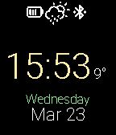
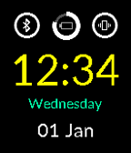
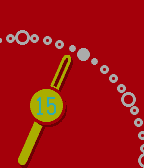
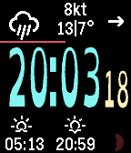
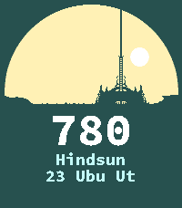

---
hide:
  - toc
---

<!-- Generated by scripts/update_app_directory.py: do not edit by hand -->
# Pebble Watchfaces: Q

[← All Pebble Watchfaces](../watchfaces.md) · [A](a.md) · [B](b.md) · [C](c.md) · [D](d.md) · [E](e.md) · [F](f.md) · [G](g.md) · [H](h.md) · [I](i.md) · [J](j.md) · [K](k.md) · [L](l.md) · [M](m.md) · [N](n.md) · [O](o.md) · [P](p.md) · **Q** · [R](r.md) · [S](s.md) · [T](t.md) · [U](u.md) · [V](v.md) · [W](w.md) · [X](x.md) · [Y](y.md) · [Z](z.md) · [0–9 & other](other.md)

*6 watchfaces · Last updated 2026-10-06 · [About these lists](../about-app-lists.md)*

<h2 class="app-name" id="app-56f2ad3de4a859e04d000006"><a href="https://apps.repebble.com/56f2ad3de4a859e04d000006">Q Face</a></h2>
<a class="app-source" href="https://github.com/jonaslej/pebble-qwatchface" title="Source code" data-search-exclude>View source</a>

by <a href="https://apps.repebble.com/apps/dev/jonas-l_531c672fe05b7940d500028c" title="More from this developer">Jonas L</a>

Not checked yet v1.3 Updated 2016-03-25

Runs on: Round 2, Time 2, Pebble 2 Duo, Pebble 2, Time Round, Time, Classic

A watch face based on the watch face of the Fossil Q.

<h2 class="app-name" id="app-58d56b610dfc3252f4000500"><a href="https://apps.rebble.io/en_US/application/58d56b610dfc3252f4000500">Q-Time</a></h2>
<a class="app-source" href="https://github.com/stark-dev/Q-Time" title="Source code" data-search-exclude>View source</a>

by <a href="https://apps.rebble.io/en_US/developer/583d7ae300355a2f3a00056e/1" title="More from this developer">stark-dev</a>

Not checked yet v1.1 Updated 2017-05-05 Rebble App Store

Runs on: Time 2, Time

Simple and clean watchface, inspired by Fossil Q style smartwatch. It shows date and weekday, battery status, quiet mode and bluetooth connection status. UPDATE: Version 1.1 allows to set colours…

<h2 class="app-name" id="app-52bf607ff31c3205260000c4"><a href="https://apps.repebble.com/52bf607ff31c3205260000c4">qrwatch</a></h2>
<a class="app-source" href="https://github.com/TrueJournals/pebble-qrwatch" title="Source code" data-search-exclude>View source</a>

by <a href="https://apps.repebble.com/apps/dev/bobby-graese_52b1ea1d6ba9272267000028" title="More from this developer">Bobby Graese</a>

No licence v1.0.0 Updated 2013-12-28

Runs on: Time 2, Pebble 2 Duo, Pebble 2, Time, Classic

Displays the current time and date in a QR code, centered on your watch. Now you&#x27;ll just need your phone...

<h2 class="app-name" id="app-5513c6bb6f2fce780900008b"><a href="https://apps.repebble.com/5513c6bb6f2fce780900008b">Quarter Analogue Watch</a></h2>
<a class="app-source" href="https://github.com/sakisakira/PebbleQuarterWatch" title="Source code" data-search-exclude>View source</a>

by <a href="https://apps.repebble.com/apps/dev/sakira_55102d35e0b81d20390000e3" title="More from this developer">SAkira</a>

Not checked yet v1.5 Updated 2015-10-29

Runs on: Round 2, Time 2, Pebble 2 Duo, Pebble 2, Time Round, Time, Classic

A simple zoomed analogue watch. Oct30: ver.1.5 released Oct23: ver.1.4 released (1st release for color)

<h2 class="app-name" id="app-60a4db6a1342ae00af2195e0"><a href="https://apps.rebble.io/en_US/application/60a4db6a1342ae00af2195e0">Quartzite</a></h2>
<a class="app-source" href="https://github.com/astosia/Quartzite" title="Source code" data-search-exclude>View source</a>

by <a href="https://apps.rebble.io/en_US/developer/58a635d30dfc320dc60003b4/1" title="More from this developer">astosia</a>

GPL-3.0 v3.5 Updated 2025-05-11 Rebble App Store

Runs on: Round 2, Time 2, Pebble 2 Duo, Pebble 2, Time Round, Time, Classic

Quartzite is an easy to read watchface with weather, steps and multiple time font choices*. Features: - Fully configurable colours - Toggle on configuration screen to turn off pebble health (turns…

<h2 class="app-name" id="app-6a11c012ced0bb000bbc43ca"><a href="https://apps.rebble.io/en_US/application/6a11c012ced0bb000bbc43ca">Qud</a></h2>
<a class="app-source" href="https://codeberg.org/persimmon/qud-pebble" title="Source code" data-search-exclude>View source</a>

by <a href="https://apps.rebble.io/en_US/developer/6a11be96caa0420008c3ebc5/1" title="More from this developer">Persimmon</a>

See source v1.0.0 Updated 2026-05-23 Rebble App Store

Runs on: Round 2, Time 2

A watchface based on the timekeeping and interface of Caves of Qud. Chronometric Cuff [Chem Cell (Fresh) &lt;AC1&gt;] &lt;BD24&gt; ---- Electric tides permeate quartz too quickly to see, aliasing into pale…

