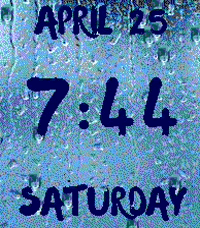
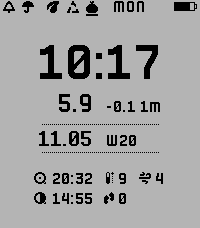
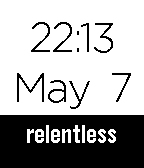
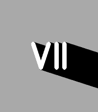
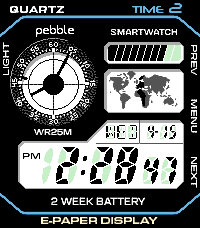

<!-- Generated by scripts/update_app_directory.py: do not edit by hand -->
# Watchfaces: R

[← About this list](../watchfaces.md) · [A](a.md) · [B](b.md) · [C](c.md) · [D](d.md) · [E](e.md) · [F](f.md) · [G](g.md) · [H](h.md) · [I](i.md) · [J](j.md) · [K](k.md) · [L](l.md) · [M](m.md) · [N](n.md) · [O](o.md) · [P](p.md) · [Q](q.md) · **R** · [S](s.md) · [T](t.md) · [U](u.md) · [V](v.md) · [W](w.md) · [X](x.md) · [Y](y.md) · [Z](z.md) · [0–9 & other](other.md)

*107 watchfaces · Last updated 2026-10-06*

| Screenshot | Name | Developer | Licence | Updated | Description |
|------------|------|-----------|---------|---------|-------------|
| { loading=lazy width="72" } | [Rabbit Tree](https://apps.repebble.com/5718c9eba86f0f661200001f) | [teshi04](https://github.com/teshi04/RabbitTree-PebbleWatchFace) | <small>Not checked yet</small> | 2016-04-22 | This is RabbitTree. Created by teshi04. RabbitTree will change facial expression depending on the time. teshi04作のウサ木(うさぎ)というキャラクターです。 時間によって表情が変わります。 |
| { loading=lazy width="72" } | [Radar Array](https://apps.repebble.com/fdd46e97c301494889bc72d2) | [Null Syntax](https://github.com/AKlitbo/pebble-watchfaces) | AGPL-3.0 | 2026-09-27 | Radar Array is a tactical radar-inspired digital watchface designed for the Pebble Time 2. Features: • Six Radar Themes: Default, Crimson, Neon, Phosphor… |
| { loading=lazy width="72" } | [Radio 4 Time](https://apps.rebble.io/en_US/application/52cbe3a66e5f70f0c700012c) <small>Rebble App Store</small> | [TTV69](https://github.com/TTV/radio4time) | <small>Not checked yet</small> | 2014-03-12 | A textual (semi-fuzzy) watchface using British expressions similar to those used on Radio 4 programs such as @BBCr4today and @BBCPM. Also display the date… |
| { loading=lazy width="72" } | [Radios Appear](https://apps.repebble.com/58133b7946041f64b0000084) | [craige](https://git.mcwhirter.io/craige/RadiosAppear) | <small>See source</small> | 2016-11-16 | Radio Birdman themed Pebble watchface. Currently Supports: * Digital time * Bluetooth status (vibrate and icon) * Battery status icon (when &lt; 30%) Next: *… |
| { loading=lazy width="72" } | [Radium 2 (Radial Bar Graph)](https://apps.repebble.com/69a6531826cc4f0009c65926) | [Sterling Ely](https://github.com/SterlingEly/Radium2) | <small>Not checked yet</small> | 2026-05-24 | A radial bar graph watchface. Time and energy flowing around your wrist — hours and minutes as arcs, with battery & steps or sunrise & sunset on the outer… |
| { loading=lazy width="72" } | [Rails](https://apps.repebble.com/9866ad086aed4791ae4a5cf4) | [Pocket Gearwright](https://github.com/superm1/rails-pebble) | <small>Not checked yet</small> | 2026-06-13 | A watch face with rails to show your progress in daily goals (steps, calories, distance). The display is very rich and can show up to 6 data fields. All… |
| { loading=lazy width="72" } | [Rainpower](https://apps.repebble.com/58915f4895ce5bfaf80007d0) | [Stuart P. Bentley](https://github.com/stuartpb/rainpower-watchface) | <small>Not checked yet</small> | 2017-02-01 | This is a simple watchface that includes watch battery level, phone battery level (if your phone's browser JavaScript run environment exposes it), a… |
| { loading=lazy width="72" } | [Rainy Day](https://apps.repebble.com/b195ac35bbaa438da49c4d45) | [Comfortably Numb](https://github.com/ygalanter/rainy-day-pebble) | <small>Not checked yet</small> | 2026-04-25 | It's like looking out of the window on rainy day - relax watching the raindrops while checking time or you fitness stats. Shaking the watch cycles thru Day… |
| { loading=lazy width="72" } | [Rainy Day](https://apps.rebble.io/en_US/application/69ecb31a6aaf9400091ccc13) <small>Rebble App Store</small> | [Comfortably Numb](https://github.com/ygalanter/rainy-day-pebble) | <small>Not checked yet</small> | 2026-04-25 | It's like looking out of the window on rainy day - relax watching the raindrops while checking time or you fitness stats. Shaking the watch cycles thru Day… |
| { loading=lazy width="72" } | [rainy face](https://apps.repebble.com/bb2375458f8a4f259ed563a8) | [volksen](https://github.com/volksen/c_rainy_face) | <small>Not checked yet</small> | 2026-08-06 | a simple watchface with weather and rain data from openmeteo |
| { loading=lazy width="72" } | [rainy phoenix](https://apps.repebble.com/bf5a0ce2cf624ec7af26b3a4) | [volksen](https://github.com/volksen/rainy-phoenix) | <small>Not checked yet</small> | 2026-08-09 | Fork of the awesome phoenix big by astosia with rain amount and probability instead of steps and battery. I also removed many options, which i did not need… |
| { loading=lazy width="72" } | [Ram](https://apps.rebble.io/en_US/application/5550e275095d4f2155000058) <small>Rebble App Store</small> | [Aborgh](https://github.com/Aborgh/RAM) | <small>No licence</small> | 2015-06-01 | One of my two first watchfaces I have ever made. It is suppose to be clean design that is easy to read and nice to look at. :) More configuration coming soon |
| { loading=lazy width="72" } | [RandomNumbers](https://apps.rebble.io/en_US/application/5350acebb542511a780000f5) <small>Rebble App Store</small> | [Zzzzzane](https://github.com/zzzzzane/RandomNumbers) | <small>Not checked yet</small> | 2014-04-28 | Displays a screen of mostly random numbers with the Time and Date "hidden"--the uppermost left value is the hour, uppermost right is the minutes, lower left… |
| { loading=lazy width="72" } | [Rat Scout](https://apps.repebble.com/bfecfeaed9de40ef9d929b66) | [Sergei Likharev](https://github.com/mollyjester/rat_scout) | <small>Not checked yet</small> | 2026-05-11 | A Pebble watchface that displays real-time Dexcom CGM blood glucose readings alongside weather, astronomy, step count, and garbage collection schedule —… |
| { loading=lazy width="72" } | [Rat Scout](https://apps.rebble.io/en_US/application/69924ebeb8c85e00096f4920) <small>Rebble App Store</small> | [Sergei Likharev](https://github.com/mollyjester/rat_scout) | <small>Not checked yet</small> | 2026-05-11 | Rat Scout puts your Dexcom glucose readings front and center on your Pebble watch, surrounded by useful at-a-glance information: Blood Glucose — Current… |
| { loading=lazy width="72" } | [Re:NightFace](https://apps.rebble.io/en_US/application/5b0cf87bf38588a252000e30) <small>Rebble App Store</small> | [Masa](https://github.com/masakoodaa/Re-NightFace) | <small>Not checked yet</small> | 2018-05-29 | A clean room re-implementation of NightFace Pebble watchface (https://apps.getpebble.com/en_US/application/56f9e26f69581dad78000025) with a twist: instead… |
| { loading=lazy width="72" } | [ReadyToRead](https://apps.repebble.com/d3caf8be543e4cb084c48509) | [ringmaster.dev](https://github.com/ringmaster-dev/ReadyToRead) | <small>Not checked yet</small> | 2026-06-10 | Watchface designed for easy readability. |
| { loading=lazy width="72" } | [Real Salt Lake](https://apps.rebble.io/en_US/application/54ecccffd9c53be7db0000ad) <small>Rebble App Store</small> | [Sawyer Pangborn](http://github.com/spangborn/pebble-realsaltlake) | <small>No licence</small> | 2015-02-24 | Are you RSLTID? Then you need the Real Salt Lake watchface |
| { loading=lazy width="72" } | [Rebblatro](https://apps.rebble.io/en_US/application/67d5931aa15bc400098c821e) <small>Rebble App Store</small> | [LostQuasar](https://github.com/lostquasar/rebblatro) | <small>Not checked yet</small> | 2025-03-15 | A Balatro Themed Watchface so you never have to leave home without balatro |
| { loading=lazy width="72" } | [Rect Watch](https://apps.repebble.com/4301ead109fe41f5b73ef4a0) | [Creative Manaks](https://github.com/manaksu/rectwatch) | <small>Not checked yet</small> | 2026-05-30 | RectWatch A clean, minimal analog watchface for Pebble Time Steel. Built around a precise rectangular clock face with a cream e-paper texture, RectWatch… |
| { loading=lazy width="72" } | [Red Fuji Binary](https://apps.repebble.com/8a5a974138f44bffb13dc056) | [Unknown](https://github.com/somlaigabor/red_fuji.git) | <small>Not checked yet</small> | 2026-08-14 | Fine Wind, Clear Morning |
| { loading=lazy width="72" } | [Red Sox Logo](https://apps.rebble.io/en_US/application/53445351a5524e5091000384) <small>Rebble App Store</small> | [WA1OUI](https://github.com/DHKaplan/Red-Sox/blob/master/Red-Sox-V7.2.zip) | <small>No licence</small> | 2016-10-18 | Here's the Boston Red Sox Logo. A Bluetooth indicator (and optional vibration when connectivity is lost) as well as battery percentage and a battery… |
| { loading=lazy width="72" } | [Red, White, and Blue Watchface](https://apps.rebble.io/en_US/application/559818b96e32ca91bb00004d) <small>Rebble App Store</small> | [joeratt](https://github.com/joeratt/RedWhiteBluePebbleTime) | <small>Not checked yet</small> | 2015-07-04 | Use this Watchface to show off your support for the Red, White, and Blue. Note: This watchface uses a 24-hour clock. |
| { loading=lazy width="72" } | [ReelTime](https://apps.repebble.com/3f592db18dac4817949a2d64) | [Electronic Esoterica](https://github.com/jimbruges/pebble-reeltime) | <small>Not checked yet</small> | 2026-10-04 | A Pebble watchface that draws a new procedurally generated fish on your wrist. |
| { loading=lazy width="72" } | [Rehoboam](https://apps.rebble.io/en_US/application/5ec99be43dd31061b1c0d9e0) <small>Rebble App Store</small> | [astosia](https://github.com/astosia/Rehoboam) | <small>Not checked yet</small> | 2020-05-23 | Westworld inspired watchface, based on Serac's watch. Features: - Auto-detection of 12h/24h based on your watch settings - Date.Month.Battery complication… |
| { loading=lazy width="72" } | [relativezeit](https://apps.repebble.com/57b411daf01b53bdc600060b) | [Arne Wichmann](https://github.com/arnew/relativezeit) | <small>Not checked yet</small> | 2016-08-18 | The watchface displays time in adaptive precision, depending on the user activity detected on the watch. The precision is calculated using weights on an… |
| { loading=lazy width="72" } | [Relentless](https://apps.rebble.io/en_US/application/554c46565fa04f617500011b) <small>Rebble App Store</small> | [Anthony Seo](https://github.com/anthonyseo/relentless) | <small>Not checked yet</small> | 2015-05-08 | A simple watch face with a powerful reminder to be "relentless." |
| { loading=lazy width="72" } | [RellotgeCatala](https://apps.rebble.io/en_US/application/557c76a35f5eb86ef8000058) <small>Rebble App Store</small> | [Juan Vera](https://github.com/Juanvvc/RellotgeCatala) | <small>No licence</small> | 2015-06-26 | Un rellotge que mostra l'hora amb quarts, el format tradicional català. |
| { loading=lazy width="72" } | [Remember Me](https://apps.repebble.com/6f211f5a1ba9407db5a2cb88) | [atomlabor](https://github.com/atomlabor/remember-me) | <small>Not checked yet</small> | 2026-04-14 | Subconscious Focus. On the Run. Remember Me is not just another task manager or a sticky note on your wrist—it is a cognitive tool designed to keep your… |
| { loading=lazy width="72" } | [Requisite](https://apps.rebble.io/en_US/application/55f7928ca0c71be4de000039) <small>Rebble App Store</small> | [Neal Enssle](https://github.com/nealenssle/pebble-requisite) | <small>Not checked yet</small> | 2015-10-19 | A simple, basic, minimalist watch face with time and date in Helvetica Neue font. The watch face includes a battery indicator and now shows current… |
| { loading=lazy width="72" } | [Rescued by Pebble](https://apps.rebble.io/en_US/application/54eccb83732a680613000007) <small>Rebble App Store</small> | [alexchiri](https://github.com/alexchiri/rescued-by-pebble) | <small>Not checked yet</small> | 2015-03-01 | Pebble Rescue shows your productivity level based on the data retrieved from RescueTime*. * You need a RescueTime account in order to use this watchface |
| { loading=lazy width="72" } | [ReSimplicity](https://apps.rebble.io/en_US/application/6a3382f39d979d0009ccecd2) <small>Rebble App Store</small> | [Joshua Wise](https://github.com/jwise/resimplicity) | <small>Not checked yet</small> | 2026-06-18 | The classic built-in watchface for Pebble and Pebble Steel, now available for Pebble Time, Pebble Time Steel and Pebble Time Round, and with a native… |
| { loading=lazy width="72" } | [Resistor Time](https://apps.repebble.com/55561ff444dad6e1470000df) | [Ben Combee (@unwiredben)](https://github.com/unwiredben/resistor-time) | <small>Not checked yet</small> | 2020-05-23 | Are you an electrical engineer or a electronics hobbyist? Need some training in recognizing resistor color codes? Resistor Time is the answer, showing the… |
| { loading=lazy width="72" } | [Retro Centro](https://apps.repebble.com/eee4716c565f45fe9fb6a39e) | [AirDroidz](https://github.com/Airdroidz/Retro-Centro) | <small>No licence</small> | 2026-07-19 | Take a stroll through the Historic Center of San Salvador every time you check the time. Retro Centro captures the beauty of El Salvador's architectural… |
| { loading=lazy width="72" } | [Retro Clock](https://apps.rebble.io/en_US/application/52cb29b36e5f7044c7000065) <small>Rebble App Store</small> | [lingen.me](https://bitbucket.org/lingen/retroclock-pebble) | <small>See source</small> | 2014-01-26 | Pebble watchface based on my popular Retro Clock widget for Android. It provides a clean display of time and date. The date format can be changed in the… |
| { loading=lazy width="72" } | [Retro Scheme](https://apps.repebble.com/4a1f0dd1c59145fb940f76b2) | [Baldur Thor](https://github.com/BaldurThor/WatchFace) | <small>No licence</small> | 2026-06-14 | A retro looking watchface with weather, hr, steps, compass and more! Heavily based of Last Time by mgerb I just wanted to see how hard it was to make one |
| { loading=lazy width="72" } | [Retro Time](https://apps.rebble.io/en_US/application/52a14584a3850902a8000016) <small>Rebble App Store</small> | [jonwgeorge](http://github.com/jonwgeorge/Retro-Time/) | <small>Other</small> | 2013-12-06 | A watch face with a nostalgic retro gaming look. Features: - Battery life displayed as 4 hearts on top left, in 4 quarters of percentage (100%, 75%, 50%… |
| { loading=lazy width="72" } | [retro-metro](https://apps.repebble.com/689a45ff352b7f0009c4aba8) | [hextheplanet](https://forgejo.hexthepla.net/hextheplanet/retro-metro) | <small>See source</small> | 2026-08-14 | A simple watchface for a timeless logo. This is an analog clock surrounding the vintage Metro Transit (now King County Metro) logo from the 1970s and 80s… |
| { loading=lazy width="72" } | [Retro-Time C](https://apps.repebble.com/5721b9b159439e6020000022) | [André Bonhôte](https://github.com/abonhote/Retro-Time) | <small>Not checked yet</small> | 2016-05-06 | Watchface based on Jon George's Retro Time. Basically the same, just with some color ;) |
| { loading=lazy width="72" } | [RetroFight](https://apps.rebble.io/en_US/application/5556eaf92696c74d06000084) <small>Rebble App Store</small> | [Matthew Hungerford](https://github.com/mhungerford) | <small>Not checked yet</small> | 2015-05-16 | Animated sword fight with retro graphics. Animates on flick (to conserve power). created using animation from opengameart.org… |
| { loading=lazy width="72" } | [RetroFuture](https://apps.repebble.com/6a71da9449abe20009934ba7) | [Ceri Thomas](https://github.com/thosworth/retrofuture-pebble-watchface) | <small>Not checked yet</small> | 2026-08-17 | “We may now be earthbound here in the 1970s, but by the year 2000 many humans will be living and working in moon cities, and our multi-functional… |
| { loading=lazy width="72" } | [Retrograde](https://apps.repebble.com/968b7e2ad0a4495ba4b0f50f) | [ollien](https://github.com/ollien/pebble-retrograde) | <small>Not checked yet</small> | 2026-05-25 | Watchface heavily inspired by the Xeric Timeline Retrograde |
| { loading=lazy width="72" } | [Retroscope Jump Hour](https://apps.repebble.com/41c511043e0745108f3e2696) | [vision9074](https://github.com/Vision9074/pebble-watchface-retroscope) | <small>Not checked yet</small> | 2026-08-15 | Inspired by the Xeric Retrograde Jump Hour watches. Has predefined color options from their watches. Supports all rectangular Pebble watches! |
| { loading=lazy width="72" } | [Reverble](https://apps.repebble.com/f4040223d6df4dd7b1d6456f) | [peroumal1](https://github.com/peroumal1/reverble-watchface) | <small>Not checked yet</small> | 2026-09-12 | A minimalist rectangular analog watchface with a textured dial, railway-style minute track, and a running-seconds subdial. Includes a color-invert mode that… |
| { loading=lazy width="72" } | [Revolution](https://apps.rebble.io/en_US/application/52b1e8b2c8363d5ecd000012) <small>Rebble App Store</small> | [Douwe Maan](https://github.com/DouweM/PebbleRevolution) | <small>Other</small> | 2014-01-12 | Beautifully animated watchface that shows the time including seconds, as well as the date and day of the week. Versions that format the date as DD-MM or… |
| { loading=lazy width="72" } | [Revolution in Italiano](https://apps.repebble.com/57043011bb288ca362000008) | [Fabio Gandini](https://github.com/FabioGandini/revolution_senza_secondi) | <small>No licence</small> | 2016-04-05 | Revolution tradotta in Italiano e senza l'indicazione dei secondi |
| { loading=lazy width="72" } | [Revolution Mod](https://apps.repebble.com/57598fffcbd52b3f8300001c) | [Paul Fung](https://github.com/paulfung/PebbleRevolution) | <small>Not checked yet</small> | 2016-06-09 | Revolution Mod is derived from the Revolution watchface. The SECONDS feature is removed to conserve the watch battery life. |
| { loading=lazy width="72" } | [Revolution Russian](https://apps.rebble.io/en_US/application/54aa8254bda8735745000044) <small>Rebble App Store</small> | [Alex Ky](https://github.com/Taran2ul/RevolutionRussian) | <small>Not checked yet</small> | 2015-01-05 | This is a variation from a reputable Pebble watchface Douwe Maan. Envisioned as a watchface by Jean-Noël Mattern (Jnm), who posted it in the "Watch-face… |
| { loading=lazy width="72" } | [Revolution Steel](https://apps.repebble.com/6552038de46ef100098b1e06) | [Christophe Jeannette](https://github.com/Sichroteph/Another_Revolution/tree/Pebble__steel) | <small>Not checked yet</small> | 2023-11-13 | This version of the Revolution watch face is a straightforward modification where the time and date switch places, and the seconds are replaced with the… |
| { loading=lazy width="72" } | [Revolution Year](https://apps.rebble.io/en_US/application/53be0955ff771647fe0000f1) <small>Rebble App Store</small> | [adcurtin](https://github.com/adcurtin/PebbleRevolution) | <small>Not checked yet</small> | 2014-10-12 | Modified version of Revolution by Douwe Maan. I made the watchface display the year instead of seconds to improve battery life, updating the display and… |
| { loading=lazy width="72" } | [Revolved](https://apps.rebble.io/en_US/application/637a906bfdf3e30009f63971) <small>Rebble App Store</small> | [Gonzalo Muñoz](https://github.com/zamuz/revolved) | <small>Not checked yet</small> | 2024-01-11 | An update of the classic Revolver watchface for the Pebble round, now for all Pebbles! Including color and font customization, date display. Release for the… |
| { loading=lazy width="72" } | [Revolver+](https://apps.repebble.com/56e8e85d6214185de8000038) | [nodu](https://github.com/nodu/pebbleFaceR) | <small>Not checked yet</small> | 2016-03-16 | Pebble Time Round Only (for now!) Upgraded version of Pebble's Revolver watchface. -Removed animations and screen updates for better battery savings. -Added… |
| { loading=lazy width="72" } | [Rice University Logo](https://apps.rebble.io/en_US/application/52ace5c831a5fa0719000037) <small>Rebble App Store</small> | [WA1OUI](https://github.com/DHKaplan/RICE/blob/master/Rice-V7.2.zip) | <small>No licence</small> | 2016-10-18 | Here's the Rice University Logo. A Bluetooth indicator (and optional vibration when connectivity is lost) as well as battery percentage and a battery… |
| { loading=lazy width="72" } | [Ridgeline](https://apps.repebble.com/ca5c8919370b4a24a4b41c92) | [Null Syntax](https://github.com/AKlitbo/pebble-watchfaces) | AGPL-3.0 | 2026-09-27 | - |
| { loading=lazy width="72" } | [RightHand](https://apps.repebble.com/5798d3771482cd61240000ab) | [Wistonia](https://github.com/wistonia/RightHand) | <small>Not checked yet</small> | 2016-07-27 | A battery efficient watch face with an easy to read display. Double tap to display seconds. |
| { loading=lazy width="72" } | [Rilakkuma](https://apps.rebble.io/en_US/application/5320e1897b666302bb0000fc) <small>Rebble App Store</small> | [Martin](http://www.martingreffe.com/rilakkuma.zip) | <small>See source</small> | 2014-03-19 | Inspired by the Japanese character Rilakkuma. Displays hours and minutes. |
| { loading=lazy width="72" } | [Rings](https://apps.rebble.io/en_US/application/5679e58c1606190b07000046) <small>Rebble App Store</small> | [Edwin Finch](https://edwinfinch.com/redirect/pebble-legacy-source) | <small>See source</small> | 2021-06-17 | An old classic from our original collection from 2014-2016, now free & open source! |
| { loading=lazy width="72" } | [Rings by Sean Rice](https://apps.rebble.io/en_US/application/58707c952ee43116390005ac) <small>Rebble App Store</small> | [Sean Rice](https://github.com/seanriceaz/pebble-rings) | <small>Not checked yet</small> | 2017-01-07 | Inspired by tree rings, this configurable watch face traces one concentric circle per hour. Change colors, line thickness, and starting point (outside or… |
| { loading=lazy width="72" } | [RIP](https://apps.rebble.io/en_US/application/584b570977324b2b290001b5) <small>Rebble App Store</small> | [Bengalbot](https://github.com/carledwards/rip-pebble) | <small>Not checked yet</small> | 2016-12-10 | Put your obsolete Pebble to good use! This watchface cycles through a few pictures so you can hang your Pebble on the wall for years to come. Bonus Feature… |
| { loading=lazy width="72" } | [Riverwatch](https://apps.repebble.com/5827a80e8c7fff9edf000099) | [SurfnKen](https://github.com/paddlebike/RiverWatch) | <small>Not checked yet</small> | 2016-11-16 | Watchface for monitoring your favorite USGS stream gauge. - Color coded local air and stream (if available) temperatures in either celsius or fahrenheit. … |
| { loading=lazy width="72" } | [RLM Simple Colour Watch](https://apps.repebble.com/57172b59c88396d123000002) | [Andy McDade](https://github.com/redlegoman/Colour-RLM-Simple-Watch-w-Config) | <small>Not checked yet</small> | 2025-11-26 | A simple digital watch face with a nice big font, a battery percentage and seconds ticking away in the corner. Everything I need with a little splash of… |
| { loading=lazy width="72" } | [RLM Simple Watch](https://apps.repebble.com/541eb5e46cd005ba4b000108) | [Andy McDade](https://github.com/redlegoman/RLM-SIMPLE-WATCH) | <small>Not checked yet</small> | 2016-04-22 | Simple watch face, nothing fancy. Nice big time, with the day and date at jaunty alignments. Also has the battery percentage (should I put it on charge… |
| { loading=lazy width="72" } | [Robi](https://apps.repebble.com/cae23bbd464541c2b5c787f3) | [oguzy](https://github.com/oguzy/robi) | <small>Not checked yet</small> | 2026-09-08 | Robi is a robot companion that lives on your wrist. It walks and runs along with you, reads a book, works at a laptop, grabs a snack, hops on a bike… |
| { loading=lazy width="72" } | [Robostangs Team 548](https://apps.repebble.com/56f7132991445bb86d000018) | [Owen D'Aprile](https://github.com/teddyfrozevelt/robostangs-team-548) | <small>Not checked yet</small> | 2016-04-29 | A watchface dedicated to the FRC Team, the Robostangs, Team 548. It is my first watchface. |
| { loading=lazy width="72" } | [Robot Toy](https://apps.rebble.io/en_US/application/55f32252f4177d2e6c000009) <small>Rebble App Store</small> | [Code Hydra](https://github.com/amoshydra/PebbleRobotToy) | <small>Not checked yet</small> | 2017-07-08 | Robot Toy head on your Pebble Time watch! It comes with a different combination of colors every half an hour. |
| { loading=lazy width="72" } | [Roboto](https://apps.rebble.io/en_US/application/529e8194d7894b439800000c) <small>Rebble App Store</small> | [Bob Hauck](https://github.com/bobhwasatch/roboto) | <small>Not checked yet</small> | 2013-12-04 | In the style of the clock from Android 4.2. Orignal concept by cassidyjames. |
| { loading=lazy width="72" } | [Roboto2 Weather](https://apps.rebble.io/en_US/application/52d747286ecba94ad800000d) <small>Rebble App Store</small> | [Chetan](https://github.com/chetant/pebble-robotoweather/tree/pebble2_custom) | <small>Not checked yet</small> | 2025-12-01 | Shows weather in Celcius/Fahrenheit for a given location. Configurable location and units. 2.0 rewrite of older Roboto Weather watch face (with the… |
| { loading=lazy width="72" } | [Roby](https://apps.rebble.io/en_US/application/558afab8b5799abef40000e9) <small>Rebble App Store</small> | [Llamasoft](https://github.com/an-ox/roby) | <small>Not checked yet</small> | 2015-06-24 | Watchface based on the Robotron arcade game |
| { loading=lazy width="72" } | [Rokkenjima](https://apps.repebble.com/5816884a46041f64b000026a) | [jyntran](https://github.com/jyntran/pebble-rokkenjima) | <small>Not checked yet</small> | 2017-02-17 | Analog watchface inspired by the clock from When Seagulls Cry (うみねこのなく頃に, Umineko no Naku Koro Ni). Clay configuration is available: - Background colour … |
| { loading=lazy width="72" } | [RolexMultiFace](https://apps.rebble.io/en_US/application/58de41a00dfc3225f200091c) <small>Rebble App Store</small> | [chops](https://github.com/mereed/pebbleface-emojirolexmultiface) | <small>Not checked yet</small> | 2017-03-31 | Which Rolex today... Yet another Rolex clone. This watchface contains 6 styles (faces) to choose from. Original request by Martin Claptrap. Settings… |
| { loading=lazy width="72" } | [Roman Digital](https://apps.rebble.io/en_US/application/52ec23e2e9b4c3b2be000026) <small>Rebble App Store</small> | [namedfork](https://github.com/zydeco/pebble_roman_digital) | <small>Not checked yet</small> | 2014-01-31 | Date and time in roman numerals |
| { loading=lazy width="72" } | [Rombra](https://apps.repebble.com/680f5c9070e24f878e237b78) | [Noah Kiser](https://github.com/KiserDesigns/Pebble_RomanShadow) | <small>No licence</small> | 2026-07-06 | Roman Umbra, where sundial meets clockface. The umbra (shadow) direction is the minute, with Roman numerals for the hour. Colors of the numeral (hour)… |
| { loading=lazy width="72" } | [Rombra](https://apps.rebble.io/en_US/application/6a4bbf7e5cf4bd000904184b) <small>Rebble App Store</small> | [Noah Kiser](https://github.com/KiserDesigns/Pebble_RomanShadow) | <small>No licence</small> | 2026-07-06 | Roman Umbra, where sundial meets clockface. **No AI was used to develop this watchface** How to read the time: The umbra (shadow) direction is the minute… |
| { loading=lazy width="72" } | [Ronin Kata](https://apps.repebble.com/16369ce3ed5248e696f698fa) | [AirCodum](https://github.com/coredevices/pebble-watchface-agent-skill) | <small>Not checked yet</small> | 2026-06-24 | A straw-hatted ronin stands before a rising sun. Shake your wrist to unleash a martial-arts kata of single- and dual-sword (nito-ryu) strikes drawn from his… |
| { loading=lazy width="72" } | [Rorschach by IGotAKnife](https://apps.rebble.io/en_US/application/54dd307eadaf1d9f0c000029) <small>Rebble App Store</small> | [orviwan](https://github.com/orviwan/Rorschach_for_Pebble) | <small>Not checked yet</small> | 2015-02-12 | Initial release, animated on the second. Plenty of improvements could be made. Let me know! |
| { loading=lazy width="72" } | [Rosewright A](https://apps.repebble.com/52997231129af73409000033) | [drwrose](https://github.com/drwrose/rosewright.git) | <small>Not checked yet</small> | 2026-05-12 | An elegant analog watchface, with intricate hands made to resemble a classic grandfather clock. Like all Rosewright faces, it is extensively configurable… |
| { loading=lazy width="72" } | [Rosewright B](https://apps.repebble.com/5299743a129af7a144000037) | [drwrose](https://github.com/drwrose/rosewright.git) | <small>Not checked yet</small> | 2026-05-19 | A clean and elegant analog watch. Like all Rosewright faces, it is extensively configurable including multiple face options, second hand, hour alert… |
| { loading=lazy width="72" } | [Rosewright C](https://apps.repebble.com/57d7678cffca49beb50003c1) | [drwrose](https://github.com/drwrose/rosewright.git) | <small>Not checked yet</small> | 2026-05-19 | This is a watchface version of Rosewright Chronograph. Please install Rosewright Chronograph (listed among the apps) if you are looking for a functional… |
| { loading=lazy width="72" } | [Rosewright D](https://apps.repebble.com/5299958de627ce91ae000053) | [drwrose](https://github.com/drwrose/rosewright.git) | <small>Not checked yet</small> | 2026-05-19 | A straightforward analog watchface with clean, white hands on a gray background. Like all Rosewright faces, it is extensively configurable including… |
| { loading=lazy width="72" } | [Rosewright E](https://apps.repebble.com/52999691129af7543000004c) | [drwrose](https://github.com/drwrose/rosewright.git) | <small>Not checked yet</small> | 2026-05-20 | A particularly excellent imitation of a real, physical watchface. Like all Rosewright faces, it is extensively configurable including multiple face options… |
| { loading=lazy width="72" } | [Rota Minute](https://apps.repebble.com/57cdf8c0a789e1e0b800000d) | [clach04](https://github.com/clach04/watchface_rota_minute/) | <small>Not checked yet</small> | 2026-02-22 | Supports Pebble versions from Pebble 2 (Diorite) to Aplite with quick view support. * Handles Quick Event view * Display time, updating once per minute *… |
| { loading=lazy width="72" } | [Rotary](https://apps.rebble.io/en_US/application/55e84d7520f24c0f45000029) <small>Rebble App Store</small> | [Gapp](http://www.github.com/Graham-Bryan/pebble-rotary) | <small>No licence</small> | 2015-09-28 | Simple rotating watch face, flick to reveal date. Background color changes each hour. Supports 12 and 24hr. |
| { loading=lazy width="72" } | [Rotating Lines](https://apps.repebble.com/64e3eda4cba941fbaf0be5df) | [jazzabeanie](https://github.com/jazzabeanie/rotating-lines) | <small>Not checked yet</small> | 2026-04-19 | Highly configurable analog style watch with rotating lines instead of hands |
| { loading=lazy width="72" } | [Rotomotion](https://apps.repebble.com/575c6255b2bc47ab15000021) | [Brain in a Bowl](https://github.com/Quistnix/Pebble-Rotomotion-Public/) | <small>Not checked yet</small> | 2017-01-10 | New, improved, prettier and customizable. |
| { loading=lazy width="72" } | [Round](https://apps.rebble.io/en_US/application/598bbf7d0dfc322fe0000c42) <small>Rebble App Store</small> | [佐伯楽](https://github.com/SaekiRaku/pebble-round) | <small>Not checked yet</small> | 2017-08-10 | A simple watch face, hope you'd like it. The black & colorful circle is mean minutes and hours. (I'm not good at English, you can just pass the Description ;-) |
| { loading=lazy width="72" } | [round-nightscout](https://apps.repebble.com/273afcf8d8fe48629f136b43) | [Fossy](https://codeberg.org/fossy/pebble-round-nightscout/src/branch/main) | <small>See source</small> | 2026-09-11 | It shows a round clockface with your blood sugar from nightscout together with the last values as line in the background. |
| { loading=lazy width="72" } | [Roundabout](https://apps.rebble.io/en_US/application/560a0bccad97404a6900001e) <small>Rebble App Store</small> | [Christopher Ciufo](http://github.com/christopherciufo/roundabout) | MIT | 2015-09-29 | A simple pebble watchface which features the digital hour in the center, with a 5-minute interval dial around the outside. |
| { loading=lazy width="72" } | [Roundy](https://apps.repebble.com/5562f61cd4c5a8c7cb00004a) | [Mango Lazi](https://github.com/mangolazi/RoundyPebble) | <small>Not checked yet</small> | 2016-02-26 | A simple analog clock inspired by a radar screen, now with color! Weather data loaded from Openweathermap at 1 hour intervals. Icons from TimeStyle by… |
| { loading=lazy width="72" } | [Royale](https://apps.repebble.com/ae80da4fd2d54efc9e907b11) | [Evie Finch](https://github.com/qt-dork/zig-pebble-face) | <small>Not checked yet</small> | 2026-04-16 | Finally, a watch for the 80s! Royale is a watchface emulating the look of the Casio AE-1200 built with the Pebble Time 2 in mind, with support for other… |
| { loading=lazy width="72" } | [Royale](https://apps.rebble.io/en_US/application/69e00cd14a2e3d00095c7d5c) <small>Rebble App Store</small> | [Evie Finch](https://github.com/qt-dork/zig-pebble-face) | <small>Not checked yet</small> | 2026-04-16 | Finally, a watch for the 80s! Royale is a watchface emulating the look of the Casio AE-1200 built with the Pebble Time 2 in mind, with support for other… |
| { loading=lazy width="72" } | [RPM](https://apps.repebble.com/55b560732eb28fb1260000b2) | [Mike Austin](https://github.com/mikeaustin/watchface-rpm) | <small>Not checked yet</small> | 2016-07-17 | UPDATE - Version 1.2 with these features: * Added support for Pebble Time Round * Added option to display two hands, which works more like a regular clock… |
| { loading=lazy width="72" } | [RS-RandomBG](https://apps.repebble.com/3222bf0e72eb49819acdb7ff) | [Analog Escapement](https://github.com/ianhckr/RandomBG) | <small>Not checked yet</small> | 2026-09-19 | A watchface with a rotating slideshow of images. Short date, battery meter, and BT status. Open source and welcome to feedback and improvements. |
| { loading=lazy width="72" } | [RT 42 Time](https://apps.rebble.io/en_US/application/55a12e796cd360c621000036) <small>Rebble App Store</small> | [Sebastian Thiems](https://github.com/Thiedze/CWRT42Time) | <small>Not checked yet</small> | 2015-07-12 | RT 42 time. A time to base 42. All signs are 0, 1, 2, 3, 4, 5, 6, 7, 8, 9, A, B, C, D, E, F, G, H, I, J, K, L, M, N, O, P, Q, R, S, T, U, V, W, X, Y, Z, ∮ … |
| { loading=lazy width="72" } | [Ruler](https://apps.repebble.com/5784cdc366202a9b8d0007f9) | [fieldWalking](http://fieldwalking.jp/blog/watch-face_ruler/) | <small>See source</small> | 2016-07-12 | In order from the top minute,hour,second. If it's ok with you,please try my app. Don't step the White Tile. http://goo.gl/DFYcFh |
| { loading=lazy width="72" } | [Ruler Watch Reloaded](https://apps.repebble.com/52da7ee9889f5dade50000fc) | [Jnm](https://github.com/Jnmattern/RulerWatchReloaded) | <small>No licence</small> | 2026-09-29 | Time is displayed using a ruler that scrolls as time goes by. Configuration Screen allows to invert colors & enable/disable vibration on hour. Time is… |
| { loading=lazy width="72" } | [Ruler Weather](https://apps.repebble.com/56a55e2511d0acce1000006a) | [Christophe Jeannette](https://github.com/Sichroteph/Ruler-Weather2) | <small>Not checked yet</small> | 2026-07-28 | An very detailed weather access on your wrist, with an original way of telling the time. Battery efficient (Pebble gave the A-grade rating) and a tons of… |
| { loading=lazy width="72" } | [Ruler white](https://apps.repebble.com/5835c69eca309421610000a7) | [fieldWalking](http://fieldwalking.jp/blog/watch-face_ruler/) | <small>See source</small> | 2016-11-23 | In order from the top minute,hour,second. If it's ok with you,please try my app. Don't step the White Tile. http://goo.gl/DFYcFh |
| { loading=lazy width="72" } | [rulezDate](https://apps.rebble.io/en_US/application/55f920b3708b83194f000060) <small>Rebble App Store</small> | [Dmitry Demenchuk](https://github.com/mrded/rulezDate) | <small>Not checked yet</small> | 2015-10-20 | Календарь необычных праздников. Для работы необходима русская прошивка. |
| { loading=lazy width="72" } | [Rumble Time](https://apps.rebble.io/en_US/application/52d8bbb0aef8d5c2cd00003d) <small>Rebble App Store</small> | [Pebble](https://github.com/pebble/pebble-sdk-examples/tree/master/watchfaces/rumbletime) | <small>Not checked yet</small> | 2014-01-17 | Rumble Time Example Watchface |
| { loading=lazy width="72" } | [RunCat for Pebble](https://apps.repebble.com/836a679deee247d19d4bd4e4) | [zunda](https://github.com/zunda-pixel/runcat-for-pebble) | <small>Not checked yet</small> | 2026-09-21 | RunCat for Pebble A playful watchface where the official RunCat runs faster as your heart rate rises. ## Features - Animated RunCat running in place … |
| { loading=lazy width="72" } | [RUNNER // MONITOR](https://apps.repebble.com/bba7d202634a4bb2bab52b85) | [Rosaaen.DEV](https://github.com/InsanityOnABun/RunnerMonitor) | <small>No licence</small> | 2026-08-23 | Based on the UI and design style of the 2026 Bungie game, Marathon. Follows system 12h/24h option, and indicates bluetooth disconnection, quiet mode, and… |
| { loading=lazy width="72" } | [RunningFace](https://apps.repebble.com/56f430f6acd3890dde000006) | [townmath](https://github.com/townmath/RunningFace) | <small>Not checked yet</small> | 2016-03-27 | Shows time and approximate distance traveled in miles. |
| { loading=lazy width="72" } | [Rush Hour](https://apps.repebble.com/57836f4e66202aae400006cb) | [fieldWalking](http://fieldwalking.jp/blog/pebble-watchface_rushhour/) | <small>See source</small> | 2016-07-12 | Hurry ! Hurry to company. Clock hand will be quickly move between 7 to 9. If it's ok with you,please try my app. Don't step the White Tile. http://goo.gl/DFYcFh |
| { loading=lazy width="72" } | [Rush R40](https://apps.rebble.io/en_US/application/55832b4a5160206007000008) <small>Rebble App Store</small> | [Gretchycat](https://github.com/gretchycat/DarkSide) | <small>Not checked yet</small> | 2015-10-19 | Rush R40 watchface! Features a 2 week calendar, and when you shake or tap, see a 5 day weather forecast. Tap again for sunrise, sunset and moon phase. Tap a… |
| { loading=lazy width="72" } | [Rush Starman](https://apps.rebble.io/en_US/application/5526f8c31c36ea7cc2000086) <small>Rebble App Store</small> | [Gretchycat](https://github.com/gretchycat/DarkSide) | <small>Not checked yet</small> | 2015-10-19 | A great watchface featuring the Rush StarMan from 2112 Features a 2 week calendar, and when you shake or tap, see a 5 day weather forecast. Tap again for… |
| { loading=lazy width="72" } | [Rustic Slider](https://apps.repebble.com/5515a8a75ca749ee33000010) | [Comfortably Numb](https://github.com/ygalanter/COLOR_SLIDER) | <small>Not checked yet</small> | 2026-07-14 | - Date and time in blocky rustic design. - 12/24 hour format support (based on watch setting) - Time tiles appear with sliding effect - User-configurable… |
| { loading=lazy width="72" } | [RWBY Qrow Emblem](https://apps.rebble.io/en_US/application/56736a551a9a82d6e800006c) <small>Rebble App Store</small> | [Devin Corrigall](https://github.com/devinc13/PebbleRWBYQrowWatchface) | <small>Not checked yet</small> | 2018-05-27 | Watchface based on Qrow's emblem from RWBY. Watchface settings allow to select a black or white background by inverting the watchface. Includes battery… |
