---
hide:
  - toc
---

<!-- Generated by scripts/update_app_directory.py: do not edit by hand -->
# Pebble Watchfaces: R

[← All Pebble Watchfaces](../watchfaces.md) · [A](a.md) · [B](b.md) · [C](c.md) · [D](d.md) · [E](e.md) · [F](f.md) · [G](g.md) · [H](h.md) · [I](i.md) · [J](j.md) · [K](k.md) · [L](l.md) · [M](m.md) · [N](n.md) · [O](o.md) · [P](p.md) · [Q](q.md) · **R** · [S](s.md) · [T](t.md) · [U](u.md) · [V](v.md) · [W](w.md) · [X](x.md) · [Y](y.md) · [Z](z.md) · [0–9 & other](other.md)

*104 watchfaces · Last updated 2026-10-06 · [About these lists](../about-app-lists.md)*

<a class="app-shot" href="https://apps.repebble.com/5718c9eba86f0f661200001f" data-search-exclude>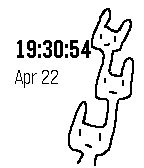</a>

<h2 class="app-name" id="app-5718c9eba86f0f661200001f"><a href="https://apps.repebble.com/5718c9eba86f0f661200001f">Rabbit Tree</a></h2>
<a class="app-source" href="https://github.com/teshi04/RabbitTree-PebbleWatchFace" title="Source code" data-search-exclude>View source</a>

by <a href="https://apps.repebble.com/apps/dev/teshi04_56aae08e022206f841000011" title="More from this developer">teshi04</a>

Not checked yet v1.1 Updated 2016-04-22

Runs on: Round 2, Time 2, Pebble 2 Duo, Pebble 2, Time Round, Time, Classic

This is RabbitTree. Created by teshi04. RabbitTree will change facial expression depending on the time. teshi04作のウサ木(うさぎ)というキャラクターです。 時間によって表情が変わります。

<a class="app-shot" href="https://apps.repebble.com/fdd46e97c301494889bc72d2" data-search-exclude>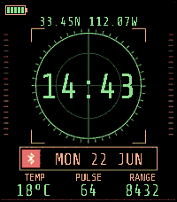</a>

<h2 class="app-name" id="app-fdd46e97c301494889bc72d2"><a href="https://apps.repebble.com/fdd46e97c301494889bc72d2">Radar Array</a></h2>
<a class="app-source" href="https://github.com/AKlitbo/pebble-watchfaces" title="Source code" data-search-exclude>View source</a>

by <a href="https://apps.repebble.com/apps/dev/null-syntax_089fa8f469578884846bff5a" title="More from this developer">Null Syntax</a>

AGPL-3.0 v1.6.2 Updated 2026-09-27

Runs on: Time 2

Radar Array is a tactical radar-inspired digital watchface designed for the Pebble Time 2. Features: • Six Radar Themes: Default, Crimson, Neon, Phosphor, Rescue, and Stealth. • Time &amp; Date…

<a class="app-shot" href="https://apps.repebble.com/52cbe3a66e5f70f0c700012c" data-search-exclude>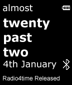</a>

<h2 class="app-name" id="app-52cbe3a66e5f70f0c700012c"><a href="https://apps.repebble.com/52cbe3a66e5f70f0c700012c">Radio 4 Time</a></h2>
<a class="app-source" href="https://github.com/TTV/radio4time" title="Source code" data-search-exclude>View source</a>

by <a href="https://apps.repebble.com/apps/dev/ttv69_52bc7111db1360a630000154" title="More from this developer">TTV69</a>

No licence v3.0.1 Updated 2014-03-12

Runs on: Time 2, Pebble 2 Duo, Pebble 2, Time, Classic

A textual (semi-fuzzy) watchface using British expressions similar to those used on Radio 4 programs such as @BBCr4today and @BBCPM. Also display the date (UK format), battery status (graphical)…

<h2 class="app-name" id="app-58133b7946041f64b0000084"><a href="https://apps.repebble.com/58133b7946041f64b0000084">Radios Appear</a></h2>
<a class="app-source" href="https://git.mcwhirter.io/craige/RadiosAppear" title="Source code" data-search-exclude>View source</a>

by <a href="https://apps.repebble.com/apps/dev/craige_5615be06c902b60a66000033" title="More from this developer">craige</a>

See source v1.5 Updated 2016-11-16

Runs on: Round 2, Time 2, Pebble 2 Duo, Pebble 2, Time Round, Time, Classic

Radio Birdman themed Pebble watchface. Currently Supports: * Digital time * Bluetooth status (vibrate and icon) * Battery status icon (when &lt; 30%) Next: * Configurable alternate colour scheme. *…

<a class="app-shot" href="https://apps.repebble.com/69a6531826cc4f0009c65926" data-search-exclude>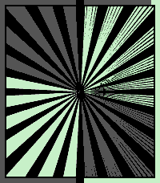</a>

<h2 class="app-name" id="app-69a6531826cc4f0009c65926"><a href="https://apps.repebble.com/69a6531826cc4f0009c65926">Radium 2 (Radial Bar Graph)</a></h2>
<a class="app-source" href="https://github.com/SterlingEly/Radium2" title="Source code" data-search-exclude>View source</a>

by <a href="https://apps.repebble.com/apps/dev/sterling-ely_52f01309f27a483dd1000171" title="More from this developer">Sterling Ely</a>

No licence v2.3.1 Updated 2026-05-24

Runs on: Round 2, Time 2, Pebble 2 Duo, Pebble 2, Time Round, Time, Classic

A radial bar graph watchface. Time and energy flowing around your wrist — hours and minutes as arcs, with battery &amp; steps or sunrise &amp; sunset on the outer ring. The left half of the face fills…

<a class="app-shot" href="https://apps.repebble.com/9866ad086aed4791ae4a5cf4" data-search-exclude>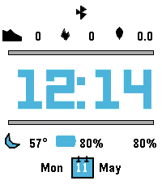</a>

<h2 class="app-name" id="app-9866ad086aed4791ae4a5cf4"><a href="https://apps.repebble.com/9866ad086aed4791ae4a5cf4">Rails</a></h2>
<a class="app-source" href="https://github.com/superm1/rails-pebble" title="Source code" data-search-exclude>View source</a>

by <a href="https://apps.repebble.com/apps/dev/pocket-gearwright_d28a6585342f0da8228ca76f" title="More from this developer">Pocket Gearwright</a>

Not checked yet v0.0.5 Updated 2026-06-13

Runs on: Time 2

A watch face with rails to show your progress in daily goals (steps, calories, distance). The display is very rich and can show up to 6 data fields. All fields are configurable and can be swapped…

<a class="app-shot" href="https://apps.repebble.com/58915f4895ce5bfaf80007d0" data-search-exclude>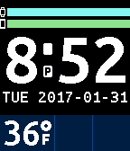</a>

<h2 class="app-name" id="app-58915f4895ce5bfaf80007d0"><a href="https://apps.repebble.com/58915f4895ce5bfaf80007d0">Rainpower</a></h2>
<a class="app-source" href="https://github.com/stuartpb/rainpower-watchface" title="Source code" data-search-exclude>View source</a>

by <a href="https://apps.repebble.com/apps/dev/stuart-p-bentley_58508f51ce45dc5d1d000025" title="More from this developer">Stuart P. Bentley</a>

Not checked yet v1.0 Updated 2017-02-01

Runs on: Time 2, Time

This is a simple watchface that includes watch battery level, phone battery level (if your phone&#x27;s browser JavaScript run environment exposes it), a single-digit hour when in 12-hour mode (X, E…

<h2 class="app-name" id="app-b195ac35bbaa438da49c4d45"><a href="https://apps.repebble.com/b195ac35bbaa438da49c4d45">Rainy Day</a></h2>
<a class="app-source" href="https://github.com/ygalanter/rainy-day-pebble" title="Source code" data-search-exclude>View source</a>

by <a href="https://apps.repebble.com/apps/dev/comfortably-numb_52f547605101128b2200005a" title="More from this developer">Comfortably Numb</a>

Not checked yet v1.0 Updated 2026-04-25

Runs on: Time 2

It&#x27;s like looking out of the window on rainy day - relax watching the raindrops while checking time or you fitness stats. Shaking the watch cycles thru Day of the week 📆 Steps count 👟 Calories…

<a class="app-shot" href="https://apps.repebble.com/bb2375458f8a4f259ed563a8" data-search-exclude>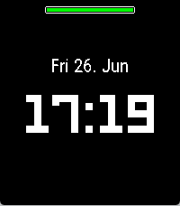</a>

<h2 class="app-name" id="app-bb2375458f8a4f259ed563a8"><a href="https://apps.repebble.com/bb2375458f8a4f259ed563a8">rainy face</a></h2>
<a class="app-source" href="https://github.com/volksen/c_rainy_face" title="Source code" data-search-exclude>View source</a>

by <a href="https://apps.repebble.com/apps/dev/volksen_2d30d3eefc7e77d201cb94ca" title="More from this developer">volksen</a>

Not checked yet v0.8.0 Updated 2026-08-06

Runs on: Round 2, Time 2

a simple watchface with weather and rain data from openmeteo

<a class="app-shot" href="https://apps.repebble.com/bf5a0ce2cf624ec7af26b3a4" data-search-exclude>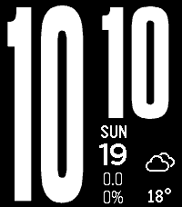</a>

<h2 class="app-name" id="app-bf5a0ce2cf624ec7af26b3a4"><a href="https://apps.repebble.com/bf5a0ce2cf624ec7af26b3a4">rainy phoenix</a></h2>
<a class="app-source" href="https://github.com/volksen/rainy-phoenix" title="Source code" data-search-exclude>View source</a>

by <a href="https://apps.repebble.com/apps/dev/volksen_2d30d3eefc7e77d201cb94ca" title="More from this developer">volksen</a>

Not checked yet v0.2.0 Updated 2026-08-09

Runs on: Round 2, Time 2, Pebble 2 Duo, Pebble 2, Time Round, Time, Classic

Fork of the awesome phoenix big by astosia with rain amount and probability instead of steps and battery. I also removed many options, which i did not need. The watchface is still BETA!

<h2 class="app-name" id="app-5550e275095d4f2155000058"><a href="https://apps.repebble.com/5550e275095d4f2155000058">Ram</a></h2>
<a class="app-source" href="https://github.com/Aborgh/RAM" title="Source code" data-search-exclude>View source</a>

by <a href="https://apps.repebble.com/apps/dev/aborgh_535e766476f4f69ca60001e4" title="More from this developer">Aborgh</a>

No licence v2.01 Updated 2015-06-01

Runs on: Time 2, Pebble 2 Duo, Pebble 2, Time, Classic

One of my two first watchfaces I have ever made. It is suppose to be clean design that is easy to read and nice to look at. :) More configuration coming soon

<a class="app-shot" href="https://apps.repebble.com/5350acebb542511a780000f5" data-search-exclude>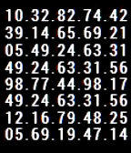</a>

<h2 class="app-name" id="app-5350acebb542511a780000f5"><a href="https://apps.repebble.com/5350acebb542511a780000f5">RandomNumbers</a></h2>
<a class="app-source" href="https://github.com/zzzzzane/RandomNumbers" title="Source code" data-search-exclude>View source</a>

by <a href="https://apps.repebble.com/apps/dev/zzzzzane_52f0171f8cbe654b5900010f" title="More from this developer">Zzzzzane</a>

Not checked yet v2.0 Updated 2014-04-28

Runs on: Time 2, Pebble 2 Duo, Pebble 2, Time, Classic

Displays a screen of mostly random numbers with the Time and Date &quot;hidden&quot;--the uppermost left value is the hour, uppermost right is the minutes, lower left is the month, lower right is the day…

<h2 class="app-name" id="app-bfecfeaed9de40ef9d929b66"><a href="https://apps.repebble.com/bfecfeaed9de40ef9d929b66">Rat Scout</a></h2>
<a class="app-source" href="https://github.com/mollyjester/rat_scout" title="Source code" data-search-exclude>View source</a>

by <a href="https://apps.repebble.com/apps/dev/sergei-likharev_6d5f94cbf98c1a1627ff2fab" title="More from this developer">Sergei Likharev</a>

Not checked yet v1.8.0 Updated 2026-05-11

Runs on: Time 2, Pebble 2 Duo

A Pebble watchface that displays real-time Dexcom CGM blood glucose readings alongside weather, astronomy, step count, and garbage collection schedule — with configurable vibration and sound…

<a class="app-shot" href="https://apps.repebble.com/569e9ea391e2563bdd000051" data-search-exclude>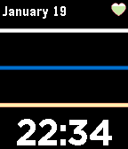</a>

<h2 class="app-name" id="app-569e9ea391e2563bdd000051"><a href="https://apps.repebble.com/569e9ea391e2563bdd000051">Ray</a></h2>
<a class="app-source" href="https://github.com/bschau/Ray.git" title="Source code" data-search-exclude>View source</a>

by <a href="https://apps.repebble.com/apps/dev/brian-schau_52bc98fc530bf4ed75000183" title="More from this developer">Brian Schau</a>

No licence v1.0 Updated 2016-01-19

Runs on: Time 2, Time

Shows some rays and every minute a heartbeat. Sounded good during design time - implementation ... well, technically good, but visuals aren&#x27;t that good. :-)

<h2 class="app-name" id="app-5b0cf87bf38588a252000e30"><a href="https://apps.rebble.io/en_US/application/5b0cf87bf38588a252000e30">Re:NightFace</a></h2>
<a class="app-source" href="https://github.com/masakoodaa/Re-NightFace" title="Source code" data-search-exclude>View source</a>

by <a href="https://apps.rebble.io/en_US/developer/5b0cf83c461a8d22e30010bf/1" title="More from this developer">Masa</a>

Not checked yet v1.0 Updated 2018-05-29 Rebble App Store

Runs on: Round 2, Time 2, Pebble 2 Duo, Pebble 2, Time Round, Time, Classic

A clean room re-implementation of NightFace Pebble watchface (https://apps.getpebble.com/en_US/application/56f9e26f69581dad78000025) with a twist: instead of showing the time when tapped, it shows…

<a class="app-shot" href="https://apps.repebble.com/d3caf8be543e4cb084c48509" data-search-exclude>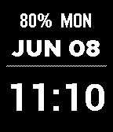</a>

<h2 class="app-name" id="app-d3caf8be543e4cb084c48509"><a href="https://apps.repebble.com/d3caf8be543e4cb084c48509">ReadyToRead</a></h2>
<a class="app-source" href="https://github.com/ringmaster-dev/ReadyToRead" title="Source code" data-search-exclude>View source</a>

by <a href="https://apps.repebble.com/apps/dev/ringmaster-dev_0f5402df104c29e3eafaf06a" title="More from this developer">ringmaster.dev</a>

Not checked yet v1.0.1 Updated 2026-06-10

Runs on: Round 2, Time 2, Pebble 2 Duo, Pebble 2, Time Round, Time, Classic

Watchface designed for easy readability.

<a class="app-shot" href="https://apps.repebble.com/54ecccffd9c53be7db0000ad" data-search-exclude>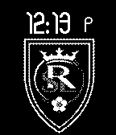</a>

<h2 class="app-name" id="app-54ecccffd9c53be7db0000ad"><a href="https://apps.repebble.com/54ecccffd9c53be7db0000ad">Real Salt Lake</a></h2>
<a class="app-source" href="http://github.com/spangborn/pebble-realsaltlake" title="Source code" data-search-exclude>View source</a>

by <a href="https://apps.repebble.com/apps/dev/sawyer-pangborn_529a3a33129af7f5b00000cc" title="More from this developer">Sawyer Pangborn</a>

No licence v2.0 Updated 2015-02-24

Runs on: Time 2, Pebble 2 Duo, Pebble 2, Time, Classic

Are you RSLTID? Then you need the Real Salt Lake watchface

<h2 class="app-name" id="app-67d5931aa15bc400098c821e"><a href="https://apps.rebble.io/en_US/application/67d5931aa15bc400098c821e">Rebblatro</a></h2>
<a class="app-source" href="https://github.com/lostquasar/rebblatro" title="Source code" data-search-exclude>View source</a>

by <a href="https://apps.rebble.io/en_US/developer/5aee23cff3858853b8000896/1" title="More from this developer">LostQuasar</a>

Not checked yet v1.0 Updated 2025-03-15 Rebble App Store

Runs on: Round 2, Time 2, Time Round, Time

A Balatro Themed Watchface so you never have to leave home without balatro

<a class="app-shot" href="https://apps.repebble.com/4301ead109fe41f5b73ef4a0" data-search-exclude>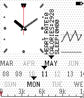</a>

<h2 class="app-name" id="app-4301ead109fe41f5b73ef4a0"><a href="https://apps.repebble.com/4301ead109fe41f5b73ef4a0">Rect Watch</a></h2>
<a class="app-source" href="https://github.com/manaksu/rectwatch" title="Source code" data-search-exclude>View source</a>

by <a href="https://apps.repebble.com/apps/dev/creative-manaks_504fe850dc7e97a445b0a10d" title="More from this developer">Creative Manaks</a>

Not checked yet v3.0 Updated 2026-05-30

Runs on: Time 2, Pebble 2 Duo, Pebble 2, Time

RectWatch A clean, minimal analog watchface for Pebble Time Steel. Built around a precise rectangular clock face with a cream e-paper texture, RectWatch pairs classic watchmaking with modern data…

<h2 class="app-name" id="app-8a5a974138f44bffb13dc056"><a href="https://apps.repebble.com/8a5a974138f44bffb13dc056">Red Fuji Binary</a></h2>
<a class="app-source" href="https://github.com/somlaigabor/red_fuji.git" title="Source code" data-search-exclude>View source</a>

by <a href="https://apps.repebble.com/apps/dev/unknown_ea5ecce7c082e34723a09652" title="More from this developer">Unknown</a>

Not checked yet v1.0.0 Updated 2026-08-14

Runs on: Time 2, Pebble 2 Duo, Pebble 2, Time

Fine Wind, Clear Morning

<a class="app-shot" href="https://apps.rebble.io/en_US/application/53445351a5524e5091000384" data-search-exclude>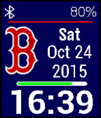</a>

<h2 class="app-name" id="app-53445351a5524e5091000384"><a href="https://apps.rebble.io/en_US/application/53445351a5524e5091000384">Red Sox Logo</a></h2>
<a class="app-source" href="https://github.com/DHKaplan/Red-Sox/blob/master/Red-Sox-V7.2.zip" title="Source code" data-search-exclude>View source</a>

by <a href="https://apps.rebble.io/en_US/developer/52acd9c431a5fa984900002e/1" title="More from this developer">WA1OUI</a>

No licence v7.2 Updated 2016-10-18 Rebble App Store

Runs on: Round 2, Time 2, Pebble 2 Duo, Pebble 2, Time Round, Time, Classic

Here&#x27;s the Boston Red Sox Logo. A Bluetooth indicator (and optional vibration when connectivity is lost) as well as battery percentage and a battery percentage bar (showing green for OK, Red for…

<a class="app-shot" href="https://apps.repebble.com/559818b96e32ca91bb00004d" data-search-exclude>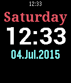</a>

<h2 class="app-name" id="app-559818b96e32ca91bb00004d"><a href="https://apps.repebble.com/559818b96e32ca91bb00004d">Red, White, and Blue Watchface</a></h2>
<a class="app-source" href="https://github.com/joeratt/RedWhiteBluePebbleTime" title="Source code" data-search-exclude>View source</a>

by <a href="https://apps.repebble.com/apps/dev/joeratt_52b2529fcd418312ba0000a4" title="More from this developer">joeratt</a>

Not checked yet v1.0 Updated 2015-07-04

Runs on: Time 2, Pebble 2 Duo, Pebble 2, Time, Classic

Use this Watchface to show off your support for the Red, White, and Blue. Note: This watchface uses a 24-hour clock.

<a class="app-shot" href="https://apps.repebble.com/3f592db18dac4817949a2d64" data-search-exclude>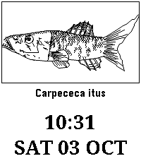</a>

<h2 class="app-name" id="app-3f592db18dac4817949a2d64"><a href="https://apps.repebble.com/3f592db18dac4817949a2d64">ReelTime</a></h2>
<a class="app-source" href="https://github.com/jimbruges/pebble-reeltime" title="Source code" data-search-exclude>View source</a>

by <a href="https://apps.repebble.com/apps/dev/electronic-esoterica_a7debaf5ee7f795688f3e475" title="More from this developer">Electronic Esoterica</a>

Not checked yet v1.0.2 Updated 2026-10-04

Runs on: Time 2

A Pebble watchface that draws a new procedurally generated fish on your wrist.

<a class="app-shot" href="https://apps.rebble.io/en_US/application/5ec99be43dd31061b1c0d9e0" data-search-exclude>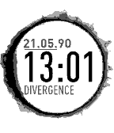</a>

<h2 class="app-name" id="app-5ec99be43dd31061b1c0d9e0"><a href="https://apps.rebble.io/en_US/application/5ec99be43dd31061b1c0d9e0">Rehoboam</a></h2>
<a class="app-source" href="https://github.com/astosia/Rehoboam" title="Source code" data-search-exclude>View source</a>

by <a href="https://apps.rebble.io/en_US/developer/58a635d30dfc320dc60003b4/1" title="More from this developer">astosia</a>

No licence v1.0 Updated 2020-05-23 Rebble App Store

Runs on: Round 2, Time 2, Pebble 2 Duo, Pebble 2, Time Round, Time, Classic

Westworld inspired watchface, based on Serac&#x27;s watch. Features: - Auto-detection of 12h/24h based on your watch settings - Date.Month.Battery complication Options: - Choose background and text…

<a class="app-shot" href="https://apps.repebble.com/57b411daf01b53bdc600060b" data-search-exclude>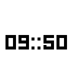</a>

<h2 class="app-name" id="app-57b411daf01b53bdc600060b"><a href="https://apps.repebble.com/57b411daf01b53bdc600060b">relativezeit</a></h2>
<a class="app-source" href="https://github.com/arnew/relativezeit" title="Source code" data-search-exclude>View source</a>

by <a href="https://apps.repebble.com/apps/dev/arne-wichmann_54e62c480dc7cbe18d0000b0" title="More from this developer">Arne Wichmann</a>

No licence v1.3 Updated 2016-08-18

Runs on: Round 2, Time 2, Pebble 2 Duo, Pebble 2, Time Round, Time, Classic

The watchface displays time in adaptive precision, depending on the user activity detected on the watch. The precision is calculated using weights on an activity log over the last minute, hour…

<a class="app-shot" href="https://apps.repebble.com/554c46565fa04f617500011b" data-search-exclude>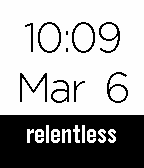</a>

<h2 class="app-name" id="app-554c46565fa04f617500011b"><a href="https://apps.repebble.com/554c46565fa04f617500011b">Relentless</a></h2>
<a class="app-source" href="https://github.com/anthonyseo/relentless" title="Source code" data-search-exclude>View source</a>

by <a href="https://apps.repebble.com/apps/dev/anthony-seo_5478b602f9437860120000c1" title="More from this developer">Anthony Seo</a>

No licence v1.0 Updated 2015-05-08

Runs on: Time 2, Pebble 2 Duo, Pebble 2, Time, Classic

A simple watch face with a powerful reminder to be &quot;relentless.&quot;

<a class="app-shot" href="https://apps.repebble.com/557c76a35f5eb86ef8000058" data-search-exclude>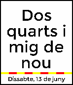</a>

<h2 class="app-name" id="app-557c76a35f5eb86ef8000058"><a href="https://apps.repebble.com/557c76a35f5eb86ef8000058">RellotgeCatala</a></h2>
<a class="app-source" href="https://github.com/Juanvvc/RellotgeCatala" title="Source code" data-search-exclude>View source</a>

by <a href="https://apps.repebble.com/apps/dev/juan-vera_5576ea0b691b9b6333000036" title="More from this developer">Juan Vera</a>

No licence v1.8 Updated 2015-06-26

Runs on: Time 2, Pebble 2 Duo, Pebble 2, Time, Classic

Un rellotge que mostra l&#x27;hora amb quarts, el format tradicional català.

<a class="app-shot" href="https://apps.repebble.com/6f211f5a1ba9407db5a2cb88" data-search-exclude>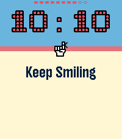</a>

<h2 class="app-name" id="app-6f211f5a1ba9407db5a2cb88"><a href="https://apps.repebble.com/6f211f5a1ba9407db5a2cb88">Remember Me</a></h2>
<a class="app-source" href="https://github.com/atomlabor/remember-me" title="Source code" data-search-exclude>View source</a>

by <a href="https://apps.repebble.com/apps/dev/atomlabor_5c1e0bc226259d0001915df5" title="More from this developer">atomlabor</a>

No licence v1.2 Updated 2026-04-14

Runs on: Round 2, Time 2, Pebble 2 Duo, Pebble 2, Time Round, Time, Classic

Subconscious Focus. On the Run. Remember Me is not just another task manager or a sticky note on your wrist—it is a cognitive tool designed to keep your most important intentions where they…

<a class="app-shot" href="https://apps.repebble.com/55f7928ca0c71be4de000039" data-search-exclude>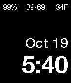</a>

<h2 class="app-name" id="app-55f7928ca0c71be4de000039"><a href="https://apps.repebble.com/55f7928ca0c71be4de000039">Requisite</a></h2>
<a class="app-source" href="https://github.com/nealenssle/pebble-requisite" title="Source code" data-search-exclude>View source</a>

by <a href="https://apps.repebble.com/apps/dev/neal-enssle_55ea329d2ad21a07c7000062" title="More from this developer">Neal Enssle</a>

Not checked yet v1.5 Updated 2015-10-19

Runs on: Time 2, Pebble 2 Duo, Pebble 2, Time, Classic

A simple, basic, minimalist watch face with time and date in Helvetica Neue font. The watch face includes a battery indicator and now shows current temperature and low-high temperature with data…

<a class="app-shot" href="https://apps.repebble.com/54eccb83732a680613000007" data-search-exclude>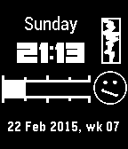</a>

<h2 class="app-name" id="app-54eccb83732a680613000007"><a href="https://apps.repebble.com/54eccb83732a680613000007">Rescued by Pebble</a></h2>
<a class="app-source" href="https://github.com/alexchiri/rescued-by-pebble" title="Source code" data-search-exclude>View source</a>

by <a href="https://apps.repebble.com/apps/dev/alexchiri_53634798ce68f7b7ba00016b" title="More from this developer">alexchiri</a>

MIT v1.4 Updated 2015-03-01

Runs on: Time 2, Pebble 2 Duo, Pebble 2, Time, Classic

Pebble Rescue shows your productivity level based on the data retrieved from RescueTime*. * You need a RescueTime account in order to use this watchface

<a class="app-shot" href="https://apps.rebble.io/en_US/application/6a3382f39d979d0009ccecd2" data-search-exclude>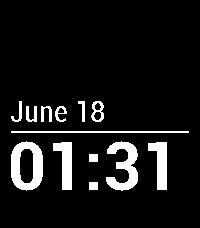</a>

<h2 class="app-name" id="app-6a3382f39d979d0009ccecd2"><a href="https://apps.rebble.io/en_US/application/6a3382f39d979d0009ccecd2">ReSimplicity</a></h2>
<a class="app-source" href="https://github.com/jwise/resimplicity" title="Source code" data-search-exclude>View source</a>

by <a href="https://apps.rebble.io/en_US/developer/531aa3fb7e49755eab000f7b/1" title="More from this developer">Joshua Wise</a>

Not checked yet v4.0.0 Updated 2026-06-18 Rebble App Store

Runs on: Round 2, Time 2, Pebble 2 Duo, Pebble 2, Time Round, Time, Classic

The classic built-in watchface for Pebble and Pebble Steel, now available for Pebble Time, Pebble Time Steel and Pebble Time Round, and with a native upscale for Core Time 2.

<a class="app-shot" href="https://apps.repebble.com/55561ff444dad6e1470000df" data-search-exclude>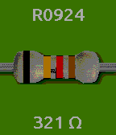</a>

<h2 class="app-name" id="app-55561ff444dad6e1470000df"><a href="https://apps.repebble.com/55561ff444dad6e1470000df">Resistor Time</a></h2>
<a class="app-source" href="https://github.com/unwiredben/resistor-time" title="Source code" data-search-exclude>View source</a>

by <a href="https://apps.repebble.com/apps/dev/ben-combee-unwiredben_551338e88630986002000039" title="More from this developer">Ben Combee (@unwiredben)</a>

Not checked yet v2.3 Updated 2020-05-23

Runs on: Round 2, Time 2, Time Round, Time

Are you an electrical engineer or a electronics hobbyist? Need some training in recognizing resistor color codes? Resistor Time is the answer, showing the current time and date via the magic of…

<a class="app-shot" href="https://apps.repebble.com/eee4716c565f45fe9fb6a39e" data-search-exclude>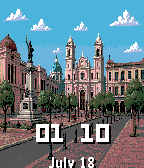</a>

<h2 class="app-name" id="app-eee4716c565f45fe9fb6a39e"><a href="https://apps.repebble.com/eee4716c565f45fe9fb6a39e">Retro Centro</a></h2>
<a class="app-source" href="https://github.com/Airdroidz/Retro-Centro" title="Source code" data-search-exclude>View source</a>

by <a href="https://apps.repebble.com/apps/dev/airdroidz_ab3948b10f35feb606d84146" title="More from this developer">AirDroidz</a>

No licence v1.0 Updated 2026-07-19

Runs on: Time 2, Time

Take a stroll through the Historic Center of San Salvador every time you check the time. Retro Centro captures the beauty of El Salvador&#x27;s architectural heritage in vibrant pixel art, blending…

<a class="app-shot" href="https://apps.repebble.com/52cb29b36e5f7044c7000065" data-search-exclude>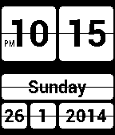</a>

<h2 class="app-name" id="app-52cb29b36e5f7044c7000065"><a href="https://apps.repebble.com/52cb29b36e5f7044c7000065">Retro Clock</a></h2>
<a class="app-source" href="https://bitbucket.org/lingen/retroclock-pebble" title="Source code" data-search-exclude>View source</a>

by <a href="https://apps.repebble.com/apps/dev/lingen-me_52cb28766e5f70c11500005f" title="More from this developer">lingen.me</a>

See source v2.0.1 Updated 2014-01-26

Runs on: Time 2, Pebble 2 Duo, Pebble 2, Time, Classic

Pebble watchface based on my popular Retro Clock widget for Android. It provides a clean display of time and date. The date format can be changed in the settings. Special thanks to Max Bäumle for…

<a class="app-shot" href="https://apps.repebble.com/4a1f0dd1c59145fb940f76b2" data-search-exclude>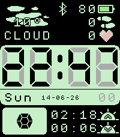</a>

<h2 class="app-name" id="app-4a1f0dd1c59145fb940f76b2"><a href="https://apps.repebble.com/4a1f0dd1c59145fb940f76b2">Retro Scheme</a></h2>
<a class="app-source" href="https://github.com/BaldurThor/WatchFace" title="Source code" data-search-exclude>View source</a>

by <a href="https://apps.repebble.com/apps/dev/baldur-thor_f78f823a876e65b57bbe3f8a" title="More from this developer">Baldur Thor</a>

No licence v1.0.0 Updated 2026-06-14

Runs on: Time 2

A retro looking watchface with weather, hr, steps, compass and more! Heavily based of Last Time by mgerb I just wanted to see how hard it was to make one

<a class="app-shot" href="https://apps.repebble.com/52a14584a3850902a8000016" data-search-exclude>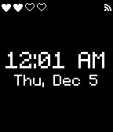</a>

<h2 class="app-name" id="app-52a14584a3850902a8000016"><a href="https://apps.repebble.com/52a14584a3850902a8000016">Retro Time</a></h2>
<a class="app-source" href="http://github.com/jonwgeorge/Retro-Time/" title="Source code" data-search-exclude>View source</a>

by <a href="https://apps.repebble.com/apps/dev/jonwgeorge_52a14394a385099e62000012" title="More from this developer">jonwgeorge</a>

Other v1.0.2 Updated 2013-12-06

Runs on: Time 2, Pebble 2 Duo, Pebble 2, Time, Classic

A watch face with a nostalgic retro gaming look. Features: - Battery life displayed as 4 hearts on top left, in 4 quarters of percentage (100%, 75%, 50%, 25%). Also shows charging status. …

<h2 class="app-name" id="app-689a45ff352b7f0009c4aba8"><a href="https://apps.repebble.com/689a45ff352b7f0009c4aba8">retro-metro</a></h2>
<a class="app-source" href="https://forgejo.hexthepla.net/hextheplanet/retro-metro" title="Source code" data-search-exclude>View source</a>

by <a href="https://apps.repebble.com/apps/dev/hextheplanet_689a190cdb7192000874f473" title="More from this developer">hextheplanet</a>

See source v1.1 Updated 2026-08-14

Runs on: Round 2, Time 2, Pebble 2 Duo, Pebble 2, Time Round, Time, Classic

A simple watchface for a timeless logo. This is an analog clock surrounding the vintage Metro Transit (now King County Metro) logo from the 1970s and 80s. Try setting the Bus Headway for a fun…

<a class="app-shot" href="https://apps.repebble.com/5721b9b159439e6020000022" data-search-exclude>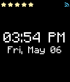</a>

<h2 class="app-name" id="app-5721b9b159439e6020000022"><a href="https://apps.repebble.com/5721b9b159439e6020000022">Retro-Time C</a></h2>
<a class="app-source" href="https://github.com/abonhote/Retro-Time" title="Source code" data-search-exclude>View source</a>

by <a href="https://apps.repebble.com/apps/dev/andr-bonh-te_52dcd16bf6af49dd3d00000c" title="More from this developer">André Bonhôte</a>

Other v1.3 Updated 2016-05-06

Runs on: Time 2, Pebble 2 Duo, Pebble 2, Time, Classic

Watchface based on Jon George&#x27;s Retro Time. Basically the same, just with some color ;)

<a class="app-shot" href="https://apps.repebble.com/5556eaf92696c74d06000084" data-search-exclude>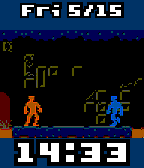</a>

<h2 class="app-name" id="app-5556eaf92696c74d06000084"><a href="https://apps.repebble.com/5556eaf92696c74d06000084">RetroFight</a></h2>
<a class="app-source" href="https://github.com/mhungerford" title="Source code" data-search-exclude>View source</a>

by <a href="https://apps.repebble.com/apps/dev/matthew-hungerford_52bca741d438930a650001b6" title="More from this developer">Matthew Hungerford</a>

Not checked yet v1.0 Updated 2015-05-16

Runs on: Time 2, Time

Animated sword fight with retro graphics. Animates on flick (to conserve power). created using animation from opengameart.org…

<a class="app-shot" href="https://apps.repebble.com/6a71da9449abe20009934ba7" data-search-exclude>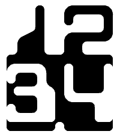</a>

<h2 class="app-name" id="app-6a71da9449abe20009934ba7"><a href="https://apps.repebble.com/6a71da9449abe20009934ba7">RetroFuture</a></h2>
<a class="app-source" href="https://github.com/thosworth/retrofuture-pebble-watchface" title="Source code" data-search-exclude>View source</a>

by <a href="https://apps.repebble.com/apps/dev/ceri-thomas_6a71b1de901cc50007556e13" title="More from this developer">Ceri Thomas</a>

Not checked yet v1.0.5 Updated 2026-08-17

Runs on: Time 2

“We may now be earthbound here in the 1970s, but by the year 2000 many humans will be living and working in moon cities, and our multi-functional wristwatches will look like this.” This design is…

<a class="app-shot" href="https://apps.repebble.com/968b7e2ad0a4495ba4b0f50f" data-search-exclude>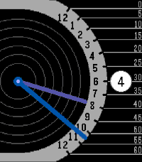</a>

<h2 class="app-name" id="app-968b7e2ad0a4495ba4b0f50f"><a href="https://apps.repebble.com/968b7e2ad0a4495ba4b0f50f">Retrograde</a></h2>
<a class="app-source" href="https://github.com/ollien/pebble-retrograde" title="Source code" data-search-exclude>View source</a>

by <a href="https://apps.repebble.com/apps/dev/ollien_ccb9291cdf771299703aa2ae" title="More from this developer">ollien</a>

Not checked yet v1.3 Updated 2026-05-25

Runs on: Time 2

Watchface heavily inspired by the Xeric Timeline Retrograde

<a class="app-shot" href="https://apps.repebble.com/41c511043e0745108f3e2696" data-search-exclude>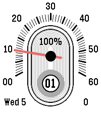</a>

<h2 class="app-name" id="app-41c511043e0745108f3e2696"><a href="https://apps.repebble.com/41c511043e0745108f3e2696">Retroscope Jump Hour</a></h2>
<a class="app-source" href="https://github.com/Vision9074/pebble-watchface-retroscope" title="Source code" data-search-exclude>View source</a>

by <a href="https://apps.repebble.com/apps/dev/vision9074_e7a26c7cc7610e75672e26e7" title="More from this developer">vision9074</a>

No licence v1.1.0 Updated 2026-08-15

Runs on: Time 2, Pebble 2 Duo, Pebble 2, Time, Classic

Inspired by the Xeric Retrograde Jump Hour watches. Has predefined color options from their watches. Supports all rectangular Pebble watches!

<a class="app-shot" href="https://apps.repebble.com/f4040223d6df4dd7b1d6456f" data-search-exclude>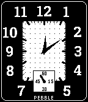</a>

<h2 class="app-name" id="app-f4040223d6df4dd7b1d6456f"><a href="https://apps.repebble.com/f4040223d6df4dd7b1d6456f">Reverble</a></h2>
<a class="app-source" href="https://github.com/peroumal1/reverble-watchface" title="Source code" data-search-exclude>View source</a>

by <a href="https://apps.repebble.com/apps/dev/peroumal1_a32710a0e38325e24c3b7e69" title="More from this developer">peroumal1</a>

Not checked yet v1.0.1 Updated 2026-09-12

Runs on: Pebble 2 Duo

A minimalist rectangular analog watchface with a textured dial, railway-style minute track, and a running-seconds subdial. Includes a color-invert mode that flips black and white across the whole…

<h2 class="app-name" id="app-52b1e8b2c8363d5ecd000012"><a href="https://apps.repebble.com/52b1e8b2c8363d5ecd000012">Revolution</a></h2>
<a class="app-source" href="https://github.com/DouweM/PebbleRevolution" title="Source code" data-search-exclude>View source</a>

by <a href="https://apps.repebble.com/apps/dev/douwe-maan_52b1e818c8363d6d8d00000d" title="More from this developer">Douwe Maan</a>

Other v2.0.1 Updated 2014-01-12

Runs on: Time 2, Pebble 2 Duo, Pebble 2, Time, Classic

Beautifully animated watchface that shows the time including seconds, as well as the date and day of the week. Versions that format the date as DD-MM or vibrate on the hour are available from the…

<a class="app-shot" href="https://apps.repebble.com/57043011bb288ca362000008" data-search-exclude>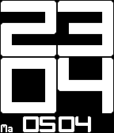</a>

<h2 class="app-name" id="app-57043011bb288ca362000008"><a href="https://apps.repebble.com/57043011bb288ca362000008">Revolution in Italiano</a></h2>
<a class="app-source" href="https://github.com/FabioGandini/revolution_senza_secondi" title="Source code" data-search-exclude>View source</a>

by <a href="https://apps.repebble.com/apps/dev/fabio-gandini_5681bf143161b3bc35000079" title="More from this developer">Fabio Gandini</a>

No licence v2 Updated 2016-04-05

Runs on: Time 2, Pebble 2 Duo, Pebble 2, Time, Classic

Revolution tradotta in Italiano e senza l&#x27;indicazione dei secondi

<h2 class="app-name" id="app-57598fffcbd52b3f8300001c"><a href="https://apps.repebble.com/57598fffcbd52b3f8300001c">Revolution Mod</a></h2>
<a class="app-source" href="https://github.com/paulfung/PebbleRevolution" title="Source code" data-search-exclude>View source</a>

by <a href="https://apps.repebble.com/apps/dev/paul-fung_5648411b82267d30ce000055" title="More from this developer">Paul Fung</a>

Not checked yet v1.0 Updated 2016-06-09

Runs on: Time 2, Pebble 2 Duo, Pebble 2, Time, Classic

Revolution Mod is derived from the Revolution watchface. The SECONDS feature is removed to conserve the watch battery life.

<a class="app-shot" href="https://apps.repebble.com/54aa8254bda8735745000044" data-search-exclude>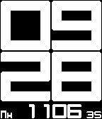</a>

<h2 class="app-name" id="app-54aa8254bda8735745000044"><a href="https://apps.repebble.com/54aa8254bda8735745000044">Revolution Russian</a></h2>
<a class="app-source" href="https://github.com/Taran2ul/RevolutionRussian" title="Source code" data-search-exclude>View source</a>

by <a href="https://apps.repebble.com/apps/dev/alex-ky_54775bfdb64bc9acc0000064" title="More from this developer">Alex Ky</a>

Other v1 Updated 2015-01-05

Runs on: Time 2, Pebble 2 Duo, Pebble 2, Time, Classic

This is a variation from a reputable Pebble watchface Douwe Maan. Envisioned as a watchface by Jean-Noël Mattern (Jnm), who posted it in the &quot;Watch-face ideas&quot; thread on the Pebble forums. Based…

<a class="app-shot" href="https://apps.repebble.com/6552038de46ef100098b1e06" data-search-exclude>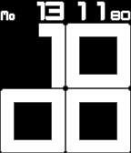</a>

<h2 class="app-name" id="app-6552038de46ef100098b1e06"><a href="https://apps.repebble.com/6552038de46ef100098b1e06">Revolution Steel</a></h2>
<a class="app-source" href="https://github.com/Sichroteph/Another_Revolution/tree/Pebble__steel" title="Source code" data-search-exclude>View source</a>

by <a href="https://apps.repebble.com/apps/dev/christophe-jeannette_54edf0599e4ff7cbf60000a0" title="More from this developer">Christophe Jeannette</a>

No licence v4.0 Updated 2023-11-13

Runs on: Time 2, Pebble 2 Duo, Pebble 2, Time, Classic

This version of the Revolution watch face is a straightforward modification where the time and date switch places, and the seconds are replaced with the battery percentage.

<h2 class="app-name" id="app-53be0955ff771647fe0000f1"><a href="https://apps.repebble.com/53be0955ff771647fe0000f1">Revolution Year</a></h2>
<a class="app-source" href="https://github.com/adcurtin/PebbleRevolution" title="Source code" data-search-exclude>View source</a>

by <a href="https://apps.repebble.com/apps/dev/adcurtin_531a551c5ef1cba9c000029c" title="More from this developer">adcurtin</a>

Other v1.1 Updated 2014-10-12

Runs on: Time 2, Pebble 2 Duo, Pebble 2, Time, Classic

Modified version of Revolution by Douwe Maan. I made the watchface display the year instead of seconds to improve battery life, updating the display and processing only once per minute, instead of…

<a class="app-shot" href="https://apps.rebble.io/en_US/application/637a906bfdf3e30009f63971" data-search-exclude>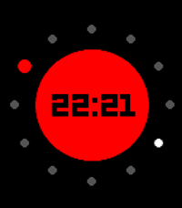</a>

<h2 class="app-name" id="app-637a906bfdf3e30009f63971"><a href="https://apps.rebble.io/en_US/application/637a906bfdf3e30009f63971">Revolved</a></h2>
<a class="app-source" href="https://github.com/zamuz/revolved" title="Source code" data-search-exclude>View source</a>

by <a href="https://apps.rebble.io/en_US/developer/609457438a44a400535e6933/1" title="More from this developer">Gonzalo Muñoz</a>

Not checked yet v1.3 Updated 2024-01-11 Rebble App Store

Runs on: Round 2, Time 2, Pebble 2 Duo, Pebble 2, Time Round, Time, Classic

An update of the classic Revolver watchface for the Pebble round, now for all Pebbles! Including color and font customization, date display. Release for the Rebble Hackathon #001.

<a class="app-shot" href="https://apps.repebble.com/56e8e85d6214185de8000038" data-search-exclude>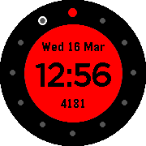</a>

<h2 class="app-name" id="app-56e8e85d6214185de8000038"><a href="https://apps.repebble.com/56e8e85d6214185de8000038">Revolver+</a></h2>
<a class="app-source" href="https://github.com/nodu/pebbleFaceR" title="Source code" data-search-exclude>View source</a>

by <a href="https://apps.repebble.com/apps/dev/nodu_531be62ac5f2c58d3f000a27" title="More from this developer">nodu</a>

Not checked yet v1.0 Updated 2016-03-16

Runs on: Round 2, Time Round

Pebble Time Round Only (for now!) Upgraded version of Pebble&#x27;s Revolver watchface. -Removed animations and screen updates for better battery savings. -Added step tracker that refreshes every…

<a class="app-shot" href="https://apps.rebble.io/en_US/application/52ace5c831a5fa0719000037" data-search-exclude>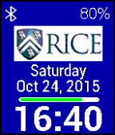</a>

<h2 class="app-name" id="app-52ace5c831a5fa0719000037"><a href="https://apps.rebble.io/en_US/application/52ace5c831a5fa0719000037">Rice University Logo</a></h2>
<a class="app-source" href="https://github.com/DHKaplan/RICE/blob/master/Rice-V7.2.zip" title="Source code" data-search-exclude>View source</a>

by <a href="https://apps.rebble.io/en_US/developer/52acd9c431a5fa984900002e/1" title="More from this developer">WA1OUI</a>

No licence v7.2 Updated 2016-10-18 Rebble App Store

Runs on: Round 2, Time 2, Pebble 2 Duo, Pebble 2, Time Round, Time, Classic

Here&#x27;s the Rice University Logo. A Bluetooth indicator (and optional vibration when connectivity is lost) as well as battery percentage and a battery percentage bar (showing green for OK, Red for…

<a class="app-shot" href="https://apps.repebble.com/ca5c8919370b4a24a4b41c92" data-search-exclude>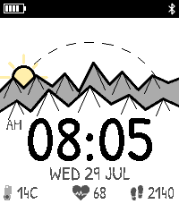</a>

<h2 class="app-name" id="app-ca5c8919370b4a24a4b41c92"><a href="https://apps.repebble.com/ca5c8919370b4a24a4b41c92">Ridgeline</a></h2>
<a class="app-source" href="https://github.com/AKlitbo/pebble-watchfaces" title="Source code" data-search-exclude>View source</a>

by <a href="https://apps.repebble.com/apps/dev/null-syntax_089fa8f469578884846bff5a" title="More from this developer">Null Syntax</a>

AGPL-3.0 v1.4.2 Updated 2026-09-27

Runs on: Round 2, Time 2

-

<a class="app-shot" href="https://apps.repebble.com/5798d3771482cd61240000ab" data-search-exclude>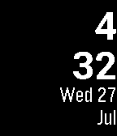</a>

<h2 class="app-name" id="app-5798d3771482cd61240000ab"><a href="https://apps.repebble.com/5798d3771482cd61240000ab">RightHand</a></h2>
<a class="app-source" href="https://github.com/wistonia/RightHand" title="Source code" data-search-exclude>View source</a>

by <a href="https://apps.repebble.com/apps/dev/wistonia_557371cf78821154910000ac" title="More from this developer">Wistonia</a>

Not checked yet v1.0 Updated 2016-07-27

Runs on: Time 2, Pebble 2 Duo, Pebble 2, Time, Classic

A battery efficient watch face with an easy to read display. Double tap to display seconds.

<h2 class="app-name" id="app-5320e1897b666302bb0000fc"><a href="https://apps.repebble.com/5320e1897b666302bb0000fc">Rilakkuma</a></h2>
<a class="app-source" href="http://www.martingreffe.com/rilakkuma.zip" title="Source code" data-search-exclude>View source</a>

by <a href="https://apps.repebble.com/apps/dev/martin_53150ee91b1a0e1232000290" title="More from this developer">Martin</a>

See source v1.1 Updated 2014-03-19

Runs on: Time 2, Pebble 2 Duo, Pebble 2, Time, Classic

Inspired by the Japanese character Rilakkuma. Displays hours and minutes.

<a class="app-shot" href="https://apps.rebble.io/en_US/application/5679e58c1606190b07000046" data-search-exclude>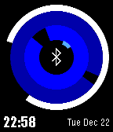</a>

<h2 class="app-name" id="app-5679e58c1606190b07000046"><a href="https://apps.rebble.io/en_US/application/5679e58c1606190b07000046">Rings</a></h2>
<a class="app-source" href="https://edwinfinch.com/redirect/pebble-legacy-source" title="Source code" data-search-exclude>View source</a>

by <a href="https://apps.rebble.io/en_US/developer/5db6f59e385af50001ba25f9/1" title="More from this developer">Edwin Finch</a>

See source v2.3-rbl Updated 2021-06-17 Rebble App Store

Runs on: Round 2, Time 2, Pebble 2 Duo, Pebble 2, Time Round, Time, Classic

An old classic from our original collection from 2014-2016, now free &amp; open source!

<a class="app-shot" href="https://apps.rebble.io/en_US/application/58707c952ee43116390005ac" data-search-exclude>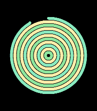</a>

<h2 class="app-name" id="app-58707c952ee43116390005ac"><a href="https://apps.rebble.io/en_US/application/58707c952ee43116390005ac">Rings by Sean Rice</a></h2>
<a class="app-source" href="https://github.com/seanriceaz/pebble-rings" title="Source code" data-search-exclude>View source</a>

by <a href="https://apps.rebble.io/en_US/developer/584a2ecf77324b357a0000ff/1" title="More from this developer">Sean Rice</a>

Not checked yet v1.0 Updated 2017-01-07 Rebble App Store

Runs on: Round 2, Time 2, Pebble 2 Duo, Pebble 2, Time Round, Time

Inspired by tree rings, this configurable watch face traces one concentric circle per hour. Change colors, line thickness, and starting point (outside or inside) from the settings screen.

<h2 class="app-name" id="app-584b570977324b2b290001b5"><a href="https://apps.rebble.io/en_US/application/584b570977324b2b290001b5">RIP</a></h2>
<a class="app-source" href="https://github.com/carledwards/rip-pebble" title="Source code" data-search-exclude>View source</a>

by <a href="https://apps.rebble.io/en_US/developer/52de8fae5d0e57da26000076/1" title="More from this developer">Bengalbot</a>

Not checked yet v2.0 Updated 2016-12-10 Rebble App Store

Runs on: Round 2, Time 2, Pebble 2 Duo, Pebble 2, Time Round, Time, Classic

Put your obsolete Pebble to good use! This watchface cycles through a few pictures so you can hang your Pebble on the wall for years to come. Bonus Feature: backlight stays &#x27;on&#x27; when the watch is…

<a class="app-shot" href="https://apps.repebble.com/5827a80e8c7fff9edf000099" data-search-exclude>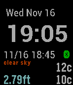</a>

<h2 class="app-name" id="app-5827a80e8c7fff9edf000099"><a href="https://apps.repebble.com/5827a80e8c7fff9edf000099">Riverwatch</a></h2>
<a class="app-source" href="https://github.com/paddlebike/RiverWatch" title="Source code" data-search-exclude>View source</a>

by <a href="https://apps.repebble.com/apps/dev/surfnken_52f16fc6e21be466e70001c1" title="More from this developer">SurfnKen</a>

Not checked yet v0.5 Updated 2016-11-16

Runs on: Time 2, Pebble 2 Duo, Pebble 2, Time, Classic

Watchface for monitoring your favorite USGS stream gauge. - Color coded local air and stream (if available) temperatures in either celsius or fahrenheit. - Stream level in either height or flow…

<a class="app-shot" href="https://apps.repebble.com/57172b59c88396d123000002" data-search-exclude>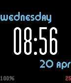</a>

<h2 class="app-name" id="app-57172b59c88396d123000002"><a href="https://apps.repebble.com/57172b59c88396d123000002">RLM Simple Colour Watch</a></h2>
<a class="app-source" href="https://github.com/redlegoman/Colour-RLM-Simple-Watch-w-Config" title="Source code" data-search-exclude>View source</a>

by <a href="https://apps.repebble.com/apps/dev/andy-mcdade_52fe01639afd98fbae00015a" title="More from this developer">Andy McDade</a>

Not checked yet v1.111 Updated 2025-11-26

Runs on: Time 2, Time

A simple digital watch face with a nice big font, a battery percentage and seconds ticking away in the corner. Everything I need with a little splash of colour. You can now choose the colours for…

<a class="app-shot" href="https://apps.repebble.com/541eb5e46cd005ba4b000108" data-search-exclude>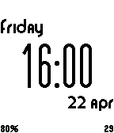</a>

<h2 class="app-name" id="app-541eb5e46cd005ba4b000108"><a href="https://apps.repebble.com/541eb5e46cd005ba4b000108">RLM Simple Watch</a></h2>
<a class="app-source" href="https://github.com/redlegoman/RLM-SIMPLE-WATCH" title="Source code" data-search-exclude>View source</a>

by <a href="https://apps.repebble.com/apps/dev/andy-mcdade_52fe01639afd98fbae00015a" title="More from this developer">Andy McDade</a>

Not checked yet v1.101 Updated 2016-04-22

Runs on: Time 2, Pebble 2 Duo, Pebble 2, Time, Classic

Simple watch face, nothing fancy. Nice big time, with the day and date at jaunty alignments. Also has the battery percentage (should I put it on charge tonight?) and the seconds ticking away in…

<a class="app-shot" href="https://apps.repebble.com/cae23bbd464541c2b5c787f3" data-search-exclude>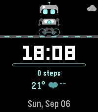</a>

<h2 class="app-name" id="app-cae23bbd464541c2b5c787f3"><a href="https://apps.repebble.com/cae23bbd464541c2b5c787f3">Robi</a></h2>
<a class="app-source" href="https://github.com/oguzy/robi" title="Source code" data-search-exclude>View source</a>

by <a href="https://apps.repebble.com/apps/dev/oguzy_cd87d6c5246e03b91419d43d" title="More from this developer">oguzy</a>

Not checked yet v1.13.0 Updated 2026-09-08

Runs on: Time 2

Robi is a robot companion that lives on your wrist. It walks and runs along with you, reads a book, works at a laptop, grabs a snack, hops on a bike, wanders around, and sometimes wanders…

<h2 class="app-name" id="app-56f7132991445bb86d000018"><a href="https://apps.repebble.com/56f7132991445bb86d000018">Robostangs Team 548</a></h2>
<a class="app-source" href="https://github.com/teddyfrozevelt/robostangs-team-548" title="Source code" data-search-exclude>View source</a>

by <a href="https://apps.repebble.com/apps/dev/owen-d-aprile_56b7b8c0ff77465cf7000035" title="More from this developer">Owen D&#x27;Aprile</a>

Not checked yet v1.3 Updated 2016-04-29

Runs on: Round 2, Time 2, Pebble 2 Duo, Pebble 2, Time Round, Time, Classic

A watchface dedicated to the FRC Team, the Robostangs, Team 548. It is my first watchface.

<a class="app-shot" href="https://apps.repebble.com/55f32252f4177d2e6c000009" data-search-exclude>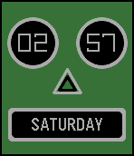</a>

<h2 class="app-name" id="app-55f32252f4177d2e6c000009"><a href="https://apps.repebble.com/55f32252f4177d2e6c000009">Robot Toy</a></h2>
<a class="app-source" href="https://github.com/amoshydra/PebbleRobotToy" title="Source code" data-search-exclude>View source</a>

by <a href="https://apps.repebble.com/apps/dev/code-hydra_5325cd736e4b3590e300018a" title="More from this developer">Code Hydra</a>

No licence v1.02 Updated 2017-07-08

Runs on: Time 2, Pebble 2 Duo, Pebble 2, Time, Classic

Robot Toy head on your Pebble Time watch! It comes with a different combination of colors every half an hour.

<h2 class="app-name" id="app-529e8194d7894b439800000c"><a href="https://apps.repebble.com/529e8194d7894b439800000c">Roboto</a></h2>
<a class="app-source" href="https://github.com/bobhwasatch/roboto" title="Source code" data-search-exclude>View source</a>

by <a href="https://apps.repebble.com/apps/dev/bob-hauck_529e79aa1a6638031c000015" title="More from this developer">Bob Hauck</a>

No licence v2.0.0 Updated 2013-12-04

Runs on: Time 2, Pebble 2 Duo, Pebble 2, Time, Classic

In the style of the clock from Android 4.2. Orignal concept by cassidyjames.

<h2 class="app-name" id="app-52d747286ecba94ad800000d"><a href="https://apps.repebble.com/52d747286ecba94ad800000d">Roboto2 Weather</a></h2>
<a class="app-source" href="https://github.com/chetant/pebble-robotoweather/tree/pebble2_custom" title="Source code" data-search-exclude>View source</a>

by <a href="https://apps.repebble.com/apps/dev/chetan_52c09748101f1a8ff700007e" title="More from this developer">Chetan</a>

Not checked yet v2.0.1 Updated 2025-12-01

Runs on: Time 2, Pebble 2 Duo, Pebble 2, Time, Classic

Shows weather in Celcius/Fahrenheit for a given location. Configurable location and units. 2.0 rewrite of older Roboto Weather watch face (with the temperature range bug fixed)

<h2 class="app-name" id="app-558afab8b5799abef40000e9"><a href="https://apps.repebble.com/558afab8b5799abef40000e9">Roby</a></h2>
<a class="app-source" href="https://github.com/an-ox/roby" title="Source code" data-search-exclude>View source</a>

by <a href="https://apps.repebble.com/apps/dev/llamasoft_5587e2694fa1ea20620000ba" title="More from this developer">Llamasoft</a>

No licence v1.0 Updated 2015-06-24

Runs on: Time 2, Time

Watchface based on the Robotron arcade game

<h2 class="app-name" id="app-5816884a46041f64b000026a"><a href="https://apps.repebble.com/5816884a46041f64b000026a">Rokkenjima</a></h2>
<a class="app-source" href="https://github.com/jyntran/pebble-rokkenjima" title="Source code" data-search-exclude>View source</a>

by <a href="https://apps.repebble.com/apps/dev/jyntran_57d0604f4a6ad94b2b0001bd" title="More from this developer">jyntran</a>

Not checked yet v2.2 Updated 2017-02-17

Runs on: Round 2, Time 2, Pebble 2 Duo, Pebble 2, Time Round, Time, Classic

Analog watchface inspired by the clock from When Seagulls Cry (うみねこのなく頃に, Umineko no Naku Koro Ni). Clay configuration is available: - Background colour - Clock colour - Show/hide clock pattern …

<h2 class="app-name" id="app-58de41a00dfc3225f200091c"><a href="https://apps.rebble.io/en_US/application/58de41a00dfc3225f200091c">RolexMultiFace</a></h2>
<a class="app-source" href="https://github.com/mereed/pebbleface-emojirolexmultiface" title="Source code" data-search-exclude>View source</a>

by <a href="https://apps.rebble.io/en_US/developer/52d76309bd61272345000001/1" title="More from this developer">chops</a>

Not checked yet v1.0 Updated 2017-03-31 Rebble App Store

Runs on: Round 2, Time 2, Time Round, Time

Which Rolex today... Yet another Rolex clone. This watchface contains 6 styles (faces) to choose from. Original request by Martin Claptrap. Settings include, Turn date/on/off Turn battery number…

<h2 class="app-name" id="app-52ec23e2e9b4c3b2be000026"><a href="https://apps.repebble.com/52ec23e2e9b4c3b2be000026">Roman Digital</a></h2>
<a class="app-source" href="https://github.com/zydeco/pebble_roman_digital" title="Source code" data-search-exclude>View source</a>

by <a href="https://apps.repebble.com/apps/dev/namedfork_52ebd847aca3aef5b2000045" title="More from this developer">namedfork</a>

Not checked yet v2.0.0 Updated 2014-01-31

Runs on: Time 2, Pebble 2 Duo, Pebble 2, Time, Classic

Date and time in roman numerals

<h2 class="app-name" id="app-680f5c9070e24f878e237b78"><a href="https://apps.repebble.com/680f5c9070e24f878e237b78">Rombra</a></h2>
<a class="app-source" href="https://github.com/KiserDesigns/Pebble_RomanShadow" title="Source code" data-search-exclude>View source</a>

by <a href="https://apps.repebble.com/apps/dev/noah-kiser_309e95d94e23b9be8fa889d9" title="More from this developer">Noah Kiser</a>

No licence v2.2.0 Updated 2026-07-06

Runs on: Round 2, Time 2, Pebble 2 Duo, Pebble 2, Time Round, Time, Classic

Roman Umbra, where sundial meets clockface. The umbra (shadow) direction is the minute, with Roman numerals for the hour. Colors of the numeral (hour), umbra (minute), and background are fully…

<h2 class="app-name" id="app-16369ce3ed5248e696f698fa"><a href="https://apps.repebble.com/16369ce3ed5248e696f698fa">Ronin Kata</a></h2>
<a class="app-source" href="https://github.com/coredevices/pebble-watchface-agent-skill" title="Source code" data-search-exclude>View source</a>

by <a href="https://apps.repebble.com/apps/dev/aircodum_67bc77bf37d408000a74f7d3" title="More from this developer">AirCodum</a>

Not checked yet v1.0.0 Updated 2026-06-24

Runs on: Time 2

A straw-hatted ronin stands before a rising sun. Shake your wrist to unleash a martial-arts kata of single- and dual-sword (nito-ryu) strikes drawn from his hip scabbard, then he freezes in a…

<h2 class="app-name" id="app-54dd307eadaf1d9f0c000029"><a href="https://apps.repebble.com/54dd307eadaf1d9f0c000029">Rorschach by IGotAKnife</a></h2>
<a class="app-source" href="https://github.com/orviwan/Rorschach_for_Pebble" title="Source code" data-search-exclude>View source</a>

by <a href="https://apps.repebble.com/apps/dev/orviwan_5299c96ae627ce3692000095" title="More from this developer">orviwan</a>

Not checked yet v1.0 Updated 2015-02-12

Runs on: Time 2, Pebble 2 Duo, Pebble 2, Time, Classic

Initial release, animated on the second. Plenty of improvements could be made. Let me know!

<h2 class="app-name" id="app-52997231129af73409000033"><a href="https://apps.repebble.com/52997231129af73409000033">Rosewright A</a></h2>
<a class="app-source" href="https://github.com/drwrose/rosewright.git" title="Source code" data-search-exclude>View source</a>

by <a href="https://apps.repebble.com/apps/dev/drwrose_52995888e627ce1aff000009" title="More from this developer">drwrose</a>

Not checked yet v5.1.0 Updated 2026-05-12

Runs on: Round 2, Time 2, Pebble 2 Duo, Pebble 2, Time Round, Time, Classic

An elegant analog watchface, with intricate hands made to resemble a classic grandfather clock. Like all Rosewright faces, it is extensively configurable including multiple face options, second…

<h2 class="app-name" id="app-5299743a129af7a144000037"><a href="https://apps.repebble.com/5299743a129af7a144000037">Rosewright B</a></h2>
<a class="app-source" href="https://github.com/drwrose/rosewright.git" title="Source code" data-search-exclude>View source</a>

by <a href="https://apps.repebble.com/apps/dev/drwrose_52995888e627ce1aff000009" title="More from this developer">drwrose</a>

Not checked yet v5.1.0 Updated 2026-05-19

Runs on: Round 2, Time 2, Pebble 2 Duo, Pebble 2, Time Round, Time, Classic

A clean and elegant analog watch. Like all Rosewright faces, it is extensively configurable including multiple face options, second hand, hour alert, bluetooth, battery, and day/date/month etc. in…

<h2 class="app-name" id="app-57d7678cffca49beb50003c1"><a href="https://apps.repebble.com/57d7678cffca49beb50003c1">Rosewright C</a></h2>
<a class="app-source" href="https://github.com/drwrose/rosewright.git" title="Source code" data-search-exclude>View source</a>

by <a href="https://apps.repebble.com/apps/dev/drwrose_52995888e627ce1aff000009" title="More from this developer">drwrose</a>

Not checked yet v5.1.0 Updated 2026-05-19

Runs on: Round 2, Time 2, Pebble 2 Duo, Pebble 2, Time Round, Time, Classic

This is a watchface version of Rosewright Chronograph. Please install Rosewright Chronograph (listed among the apps) if you are looking for a functional chonograph watch. Rosewright C is a…

<h2 class="app-name" id="app-5299958de627ce91ae000053"><a href="https://apps.repebble.com/5299958de627ce91ae000053">Rosewright D</a></h2>
<a class="app-source" href="https://github.com/drwrose/rosewright.git" title="Source code" data-search-exclude>View source</a>

by <a href="https://apps.repebble.com/apps/dev/drwrose_52995888e627ce1aff000009" title="More from this developer">drwrose</a>

Not checked yet v5.1.0 Updated 2026-05-19

Runs on: Round 2, Time 2, Pebble 2 Duo, Pebble 2, Time Round, Time, Classic

A straightforward analog watchface with clean, white hands on a gray background. Like all Rosewright faces, it is extensively configurable including multiple face options, second hand, hour alert…

<h2 class="app-name" id="app-52999691129af7543000004c"><a href="https://apps.repebble.com/52999691129af7543000004c">Rosewright E</a></h2>
<a class="app-source" href="https://github.com/drwrose/rosewright.git" title="Source code" data-search-exclude>View source</a>

by <a href="https://apps.repebble.com/apps/dev/drwrose_52995888e627ce1aff000009" title="More from this developer">drwrose</a>

Not checked yet v5.1.0 Updated 2026-05-20

Runs on: Round 2, Time 2, Pebble 2 Duo, Pebble 2, Time Round, Time, Classic

A particularly excellent imitation of a real, physical watchface. Like all Rosewright faces, it is extensively configurable including multiple face options, second hand, hour alert, bluetooth…

<h2 class="app-name" id="app-57cdf8c0a789e1e0b800000d"><a href="https://apps.repebble.com/57cdf8c0a789e1e0b800000d">Rota Minute</a></h2>
<a class="app-source" href="https://github.com/clach04/watchface_rota_minute/" title="Source code" data-search-exclude>View source</a>

by <a href="https://apps.repebble.com/apps/dev/clach04_5524604a9de9550a3300007a" title="More from this developer">clach04</a>

Not checked yet v1.4 Updated 2026-02-22

Runs on: Round 2, Time 2, Pebble 2 Duo, Pebble 2, Time Round, Time, Classic

Supports Pebble versions from Pebble 2 (Diorite) to Aplite with quick view support. * Handles Quick Event view * Display time, updating once per minute * 12/14 hour display * Date * Display…

<h2 class="app-name" id="app-55e84d7520f24c0f45000029"><a href="https://apps.repebble.com/55e84d7520f24c0f45000029">Rotary</a></h2>
<a class="app-source" href="http://www.github.com/Graham-Bryan/pebble-rotary" title="Source code" data-search-exclude>View source</a>

by <a href="https://apps.repebble.com/apps/dev/gapp_558811793ae5e5c38b0000cb" title="More from this developer">Gapp</a>

No licence v1.1 Updated 2015-09-28

Runs on: Time 2, Pebble 2 Duo, Pebble 2, Time, Classic

Simple rotating watch face, flick to reveal date. Background color changes each hour. Supports 12 and 24hr.

<h2 class="app-name" id="app-64e3eda4cba941fbaf0be5df"><a href="https://apps.repebble.com/64e3eda4cba941fbaf0be5df">Rotating Lines</a></h2>
<a class="app-source" href="https://github.com/jazzabeanie/rotating-lines" title="Source code" data-search-exclude>View source</a>

by <a href="https://apps.repebble.com/apps/dev/jazzabeanie_2f99953f4c8baa21eba9b4ef" title="More from this developer">jazzabeanie</a>

Not checked yet v1.2 Updated 2026-04-19

Runs on: Round 2, Time 2, Pebble 2 Duo, Pebble 2, Time Round, Time, Classic

Highly configurable analog style watch with rotating lines instead of hands

<h2 class="app-name" id="app-575c6255b2bc47ab15000021"><a href="https://apps.repebble.com/575c6255b2bc47ab15000021">Rotomotion</a></h2>
<a class="app-source" href="https://github.com/Quistnix/Pebble-Rotomotion-Public/" title="Source code" data-search-exclude>View source</a>

by <a href="https://apps.repebble.com/apps/dev/brain-in-a-bowl_56fa41f03f944de56b000023" title="More from this developer">Brain in a Bowl</a>

GPL-3.0 v2.2 Updated 2017-01-10

Runs on: Round 2, Time 2, Pebble 2 Duo, Pebble 2, Time Round, Time, Classic

New, improved, prettier and customizable.

<h2 class="app-name" id="app-598bbf7d0dfc322fe0000c42"><a href="https://apps.rebble.io/en_US/application/598bbf7d0dfc322fe0000c42">Round</a></h2>
<a class="app-source" href="https://github.com/SaekiRaku/pebble-round" title="Source code" data-search-exclude>View source</a>

by <a href="https://apps.rebble.io/en_US/developer/57df171b4fac5c6d30000005/1" title="More from this developer">佐伯楽</a>

MIT v1.0 Updated 2017-08-10 Rebble App Store

Runs on: Round 2, Time Round

A simple watch face, hope you&#x27;d like it. The black &amp; colorful circle is mean minutes and hours. (I&#x27;m not good at English, you can just pass the Description ;-)

<h2 class="app-name" id="app-273afcf8d8fe48629f136b43"><a href="https://apps.repebble.com/273afcf8d8fe48629f136b43">round-nightscout</a></h2>
<a class="app-source" href="https://codeberg.org/fossy/pebble-round-nightscout/src/branch/main" title="Source code" data-search-exclude>View source</a>

by <a href="https://apps.repebble.com/apps/dev/fossy_23c0d59ca1804bc25afb73aa" title="More from this developer">Fossy</a>

See source v1.2.0 Updated 2026-09-11

Runs on: Round 2, Time 2, Pebble 2 Duo, Pebble 2, Time Round, Time, Classic

It shows a round clockface with your blood sugar from nightscout together with the last values as line in the background.

<h2 class="app-name" id="app-560a0bccad97404a6900001e"><a href="https://apps.repebble.com/560a0bccad97404a6900001e">Roundabout</a></h2>
<a class="app-source" href="http://github.com/christopherciufo/roundabout" title="Source code" data-search-exclude>View source</a>

by <a href="https://apps.repebble.com/apps/dev/christopher-ciufo_55f36c73b557f03c5d000031" title="More from this developer">Christopher Ciufo</a>

MIT v1.0 Updated 2015-09-29

Runs on: Time 2, Time

A simple pebble watchface which features the digital hour in the center, with a 5-minute interval dial around the outside.

<h2 class="app-name" id="app-5562f61cd4c5a8c7cb00004a"><a href="https://apps.repebble.com/5562f61cd4c5a8c7cb00004a">Roundy</a></h2>
<a class="app-source" href="https://github.com/mangolazi/RoundyPebble" title="Source code" data-search-exclude>View source</a>

by <a href="https://apps.repebble.com/apps/dev/mango-lazi_54b62295a9708ae7e500002a" title="More from this developer">Mango Lazi</a>

Not checked yet v2.5 Updated 2016-02-26

Runs on: Round 2, Time 2, Pebble 2 Duo, Pebble 2, Time Round, Time, Classic

A simple analog clock inspired by a radar screen, now with color! Weather data loaded from Openweathermap at 1 hour intervals. Icons from TimeStyle by freakified, many thanks. Info: - battery…

<h2 class="app-name" id="app-ae80da4fd2d54efc9e907b11"><a href="https://apps.repebble.com/ae80da4fd2d54efc9e907b11">Royale</a></h2>
<a class="app-source" href="https://github.com/qt-dork/zig-pebble-face" title="Source code" data-search-exclude>View source</a>

by <a href="https://apps.repebble.com/apps/dev/evie-finch_9d5d9f7fccc8a26da37fdbd6" title="More from this developer">Evie Finch</a>

Not checked yet v1.2.0 Updated 2026-04-16

Runs on: Time 2

Finally, a watch for the 80s! Royale is a watchface emulating the look of the Casio AE-1200 built with the Pebble Time 2 in mind, with support for other Pebbles coming soon. It features beautiful…

<h2 class="app-name" id="app-55b560732eb28fb1260000b2"><a href="https://apps.repebble.com/55b560732eb28fb1260000b2">RPM</a></h2>
<a class="app-source" href="https://github.com/mikeaustin/watchface-rpm" title="Source code" data-search-exclude>View source</a>

by <a href="https://apps.repebble.com/apps/dev/mike-austin_55886cedb0fe059bbb000016" title="More from this developer">Mike Austin</a>

Not checked yet v1.2 Updated 2016-07-17

Runs on: Round 2, Time 2, Time Round, Time

UPDATE - Version 1.2 with these features: * Added support for Pebble Time Round * Added option to display two hands, which works more like a regular clock UPDATE - Version 1.1 with these features…

<h2 class="app-name" id="app-3222bf0e72eb49819acdb7ff"><a href="https://apps.repebble.com/3222bf0e72eb49819acdb7ff">RS-RandomBG</a></h2>
<a class="app-source" href="https://github.com/ianhckr/RandomBG" title="Source code" data-search-exclude>View source</a>

by <a href="https://apps.repebble.com/apps/dev/analog-escapement_3f393e5013f4edfcb04e2902" title="More from this developer">Analog Escapement</a>

Not checked yet v1.0.1 Updated 2026-09-19

Runs on: Time 2

A watchface with a rotating slideshow of images. Short date, battery meter, and BT status. Open source and welcome to feedback and improvements.

<h2 class="app-name" id="app-55a12e796cd360c621000036"><a href="https://apps.repebble.com/55a12e796cd360c621000036">RT 42 Time</a></h2>
<a class="app-source" href="https://github.com/Thiedze/CWRT42Time" title="Source code" data-search-exclude>View source</a>

by <a href="https://apps.repebble.com/apps/dev/sebastian-thiems_55748f21f5c3140cae000059" title="More from this developer">Sebastian Thiems</a>

No licence v1.1 Updated 2015-07-12

Runs on: Time 2, Pebble 2 Duo, Pebble 2, Time, Classic

RT 42 time. A time to base 42. All signs are 0, 1, 2, 3, 4, 5, 6, 7, 8, 9, A, B, C, D, E, F, G, H, I, J, K, L, M, N, O, P, Q, R, S, T, U, V, W, X, Y, Z, ∮ , Ä, Ö, Ü, ß, @

<h2 class="app-name" id="app-5784cdc366202a9b8d0007f9"><a href="https://apps.repebble.com/5784cdc366202a9b8d0007f9">Ruler</a></h2>
<a class="app-source" href="http://fieldwalking.jp/blog/watch-face_ruler/" title="Source code" data-search-exclude>View source</a>

by <a href="https://apps.repebble.com/apps/dev/fieldwalking_52f88d452a8acf5cab00018f" title="More from this developer">fieldWalking</a>

See source v1.0 Updated 2016-07-12

Runs on: Round 2, Time 2, Time Round, Time

In order from the top minute,hour,second. If it&#x27;s ok with you,please try my app. Don&#x27;t step the White Tile. http://goo.gl/DFYcFh

<h2 class="app-name" id="app-52da7ee9889f5dade50000fc"><a href="https://apps.repebble.com/52da7ee9889f5dade50000fc">Ruler Watch Reloaded</a></h2>
<a class="app-source" href="https://github.com/Jnmattern/RulerWatchReloaded" title="Source code" data-search-exclude>View source</a>

by <a href="https://apps.repebble.com/apps/dev/jnm_529994c0e627ce7ba1000050" title="More from this developer">Jnm</a>

No licence v3.16 Updated 2026-09-29

Runs on: Round 2, Time 2, Pebble 2 Duo, Pebble 2, Time Round, Time, Classic

Time is displayed using a ruler that scrolls as time goes by. Configuration Screen allows to invert colors &amp; enable/disable vibration on hour. Time is displayed using a ruler that scrolls as time…

<h2 class="app-name" id="app-56a55e2511d0acce1000006a"><a href="https://apps.repebble.com/56a55e2511d0acce1000006a">Ruler Weather</a></h2>
<a class="app-source" href="https://github.com/Sichroteph/Ruler-Weather2" title="Source code" data-search-exclude>View source</a>

by <a href="https://apps.repebble.com/apps/dev/christophe-jeannette_54edf0599e4ff7cbf60000a0" title="More from this developer">Christophe Jeannette</a>

No licence v6.35 Updated 2026-07-28

Runs on: Round 2, Time 2, Pebble 2 Duo, Pebble 2, Time Round, Time, Classic

An very detailed weather access on your wrist, with an original way of telling the time. Battery efficient (Pebble gave the A-grade rating) and a tons of customisation ! Automatic 12/24h, 4…

<h2 class="app-name" id="app-5835c69eca309421610000a7"><a href="https://apps.repebble.com/5835c69eca309421610000a7">Ruler white</a></h2>
<a class="app-source" href="http://fieldwalking.jp/blog/watch-face_ruler/" title="Source code" data-search-exclude>View source</a>

by <a href="https://apps.repebble.com/apps/dev/fieldwalking_52f88d452a8acf5cab00018f" title="More from this developer">fieldWalking</a>

See source v1.0 Updated 2016-11-23

Runs on: Round 2, Time 2, Time Round, Time

In order from the top minute,hour,second. If it&#x27;s ok with you,please try my app. Don&#x27;t step the White Tile. http://goo.gl/DFYcFh

<h2 class="app-name" id="app-55f920b3708b83194f000060"><a href="https://apps.repebble.com/55f920b3708b83194f000060">rulezDate</a></h2>
<a class="app-source" href="https://github.com/mrded/rulezDate" title="Source code" data-search-exclude>View source</a>

by <a href="https://apps.repebble.com/apps/dev/dmitry-demenchuk_0f3801096b0ef6f37fa8ed87" title="More from this developer">Dmitry Demenchuk</a>

Not checked yet v1.1 Updated 2015-10-20

Runs on: Time 2, Pebble 2 Duo, Pebble 2, Time, Classic

Календарь необычных праздников. Для работы необходима русская прошивка.

<h2 class="app-name" id="app-52d8bbb0aef8d5c2cd00003d"><a href="https://apps.repebble.com/52d8bbb0aef8d5c2cd00003d">Rumble Time</a></h2>
<a class="app-source" href="https://github.com/pebble/pebble-sdk-examples/tree/master/watchfaces/rumbletime" title="Source code" data-search-exclude>View source</a>

by <a href="https://apps.repebble.com/apps/dev/pebble_52d8a44faef8d590d3000029" title="More from this developer">Pebble</a>

Not checked yet v2.0.0 Updated 2014-01-17

Runs on: Time 2, Pebble 2 Duo, Pebble 2, Time, Classic

Rumble Time Example Watchface

<h2 class="app-name" id="app-836a679deee247d19d4bd4e4"><a href="https://apps.repebble.com/836a679deee247d19d4bd4e4">RunCat for Pebble</a></h2>
<a class="app-source" href="https://github.com/zunda-pixel/runcat-for-pebble" title="Source code" data-search-exclude>View source</a>

by <a href="https://apps.repebble.com/apps/dev/zunda_669dbd4a49087f5ce51c5e89" title="More from this developer">zunda</a>

Not checked yet v1.0.5 Updated 2026-09-21

Runs on: Round 2, Time 2, Pebble 2 Duo, Pebble 2, Time Round, Time

RunCat for Pebble A playful watchface where the official RunCat runs faster as your heart rate rises. ## Features - Animated RunCat running in place - Animation speed changes with your heart rate…

<h2 class="app-name" id="app-bba7d202634a4bb2bab52b85"><a href="https://apps.repebble.com/bba7d202634a4bb2bab52b85">RUNNER // MONITOR</a></h2>
<a class="app-source" href="https://github.com/InsanityOnABun/RunnerMonitor" title="Source code" data-search-exclude>View source</a>

by <a href="https://apps.repebble.com/apps/dev/rosaaen-dev_483499bd55b325bb5eb807ec" title="More from this developer">Rosaaen.DEV</a>

No licence v1.0.5 Updated 2026-08-23

Runs on: Round 2, Time 2

Based on the UI and design style of the 2026 Bungie game, Marathon. Follows system 12h/24h option, and indicates bluetooth disconnection, quiet mode, and charging status. Color is as close to…

<h2 class="app-name" id="app-56f430f6acd3890dde000006"><a href="https://apps.repebble.com/56f430f6acd3890dde000006">RunningFace</a></h2>
<a class="app-source" href="https://github.com/townmath/RunningFace" title="Source code" data-search-exclude>View source</a>

by <a href="https://apps.repebble.com/apps/dev/townmath_56df90d4774abcde2800003d" title="More from this developer">townmath</a>

Not checked yet v1.4 Updated 2016-03-27

Runs on: Round 2, Time 2, Pebble 2 Duo, Pebble 2, Time Round, Time, Classic

Shows time and approximate distance traveled in miles.

<h2 class="app-name" id="app-57836f4e66202aae400006cb"><a href="https://apps.repebble.com/57836f4e66202aae400006cb">Rush Hour</a></h2>
<a class="app-source" href="http://fieldwalking.jp/blog/pebble-watchface_rushhour/" title="Source code" data-search-exclude>View source</a>

by <a href="https://apps.repebble.com/apps/dev/fieldwalking_52f88d452a8acf5cab00018f" title="More from this developer">fieldWalking</a>

See source v1.1 Updated 2016-07-12

Runs on: Round 2, Time 2, Time Round, Time

Hurry ! Hurry to company. Clock hand will be quickly move between 7 to 9. If it&#x27;s ok with you,please try my app. Don&#x27;t step the White Tile. http://goo.gl/DFYcFh

<h2 class="app-name" id="app-55832b4a5160206007000008"><a href="https://apps.repebble.com/55832b4a5160206007000008">Rush R40</a></h2>
<a class="app-source" href="https://github.com/gretchycat/DarkSide" title="Source code" data-search-exclude>View source</a>

by <a href="https://apps.repebble.com/apps/dev/gretchycat_52bf60060136db31fb0000d3" title="More from this developer">Gretchycat</a>

Not checked yet v3.0 Updated 2015-10-19

Runs on: Time 2, Pebble 2 Duo, Pebble 2, Time, Classic

Rush R40 watchface! Features a 2 week calendar, and when you shake or tap, see a 5 day weather forecast. Tap again for sunrise, sunset and moon phase. Tap a third time for a compass! After 15…

<h2 class="app-name" id="app-5526f8c31c36ea7cc2000086"><a href="https://apps.repebble.com/5526f8c31c36ea7cc2000086">Rush Starman</a></h2>
<a class="app-source" href="https://github.com/gretchycat/DarkSide" title="Source code" data-search-exclude>View source</a>

by <a href="https://apps.repebble.com/apps/dev/gretchycat_52bf60060136db31fb0000d3" title="More from this developer">Gretchycat</a>

Not checked yet v3.0 Updated 2015-10-19

Runs on: Time 2, Pebble 2 Duo, Pebble 2, Time, Classic

A great watchface featuring the Rush StarMan from 2112 Features a 2 week calendar, and when you shake or tap, see a 5 day weather forecast. Tap again for sunrise, sunset and moon phase. Tap a…

<h2 class="app-name" id="app-5515a8a75ca749ee33000010"><a href="https://apps.repebble.com/5515a8a75ca749ee33000010">Rustic Slider</a></h2>
<a class="app-source" href="https://github.com/ygalanter/COLOR_SLIDER" title="Source code" data-search-exclude>View source</a>

by <a href="https://apps.repebble.com/apps/dev/comfortably-numb_52f547605101128b2200005a" title="More from this developer">Comfortably Numb</a>

Not checked yet v3.1.0 Updated 2026-07-14

Runs on: Round 2, Time 2, Pebble 2 Duo, Pebble 2, Time Round, Time, Classic

- Date and time in blocky rustic design. - 12/24 hour format support (based on watch setting) - Time tiles appear with sliding effect - User-configurable tile slide direction

<h2 class="app-name" id="app-56736a551a9a82d6e800006c"><a href="https://apps.repebble.com/56736a551a9a82d6e800006c">RWBY Qrow Emblem</a></h2>
<a class="app-source" href="https://github.com/devinc13/PebbleRWBYQrowWatchface" title="Source code" data-search-exclude>View source</a>

by <a href="https://apps.repebble.com/apps/dev/devin-corrigall_5656627d884da00953000098" title="More from this developer">Devin Corrigall</a>

Not checked yet v1.0 Updated 2018-05-27

Runs on: Round 2, Time 2, Pebble 2 Duo, Pebble 2, Time Round, Time, Classic

Watchface based on Qrow&#x27;s emblem from RWBY. Watchface settings allow to select a black or white background by inverting the watchface. Includes battery level indicator, charging indicator, and…

