<!-- Generated by scripts/update_app_directory.py: do not edit by hand -->
# Watchfaces: S

[← About this list](../watchfaces.md) · [A](a.md) · [B](b.md) · [C](c.md) · [D](d.md) · [E](e.md) · [F](f.md) · [G](g.md) · [H](h.md) · [I](i.md) · [J](j.md) · [K](k.md) · [L](l.md) · [M](m.md) · [N](n.md) · [O](o.md) · [P](p.md) · [Q](q.md) · [R](r.md) · **S** · [T](t.md) · [U](u.md) · [V](v.md) · [W](w.md) · [X](x.md) · [Y](y.md) · [Z](z.md) · [0–9 & other](other.md)

*327 watchfaces · Last updated 2026-10-06*

| Screenshot | Name | Developer | Licence | Updated | Description |
|------------|------|-----------|---------|---------|-------------|
| 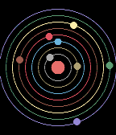{ loading=lazy width="72" } | [S4W](https://apps.rebble.io/en_US/application/67cd0e8ed2acb302d5ba821f) <small>Rebble App Store</small> | [m1k](https://github.com/less-ly/s4w) | <small>Not checked yet</small> | 2025-03-09 | Simple Solar System Simulation Watchface. Heliocentric and persistent. The simulation that runs, if you so choose, locally on your smartwatch is updated on… |
| 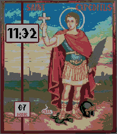{ loading=lazy width="72" } | [Saint Expeditus](https://apps.repebble.com/7bd38b308b9d4aa0b7e8b209) | [Bayport](https://github.com/b-bayport/pebble_saint-expeditus) | <small>Not checked yet</small> | 2026-06-08 | Saint Expeditus. You who are a Holy warrior. You who are the Saint of the afflicted. You who are the Saint of the desperate, you who are the Saint of urgent… |
| 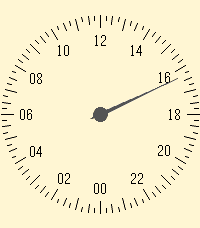{ loading=lazy width="72" } | [Sakta](https://apps.repebble.com/0bd92532c7a04f1fadba71a1) | [Carl-Fredrik Arvidson](https://github.com/cfarvidson/pebble-sakta) | <small>Not checked yet</small> | 2026-09-24 | 24-hour watchface with a single hand for Pebble Time 2, inspired by the slow Jo 17 and slow Mo 02. One rotation per day: noon at the top, midnight at the… |
| 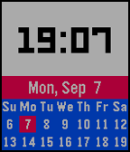{ loading=lazy width="72" } | [Sakuya](https://apps.rebble.io/en_US/application/55ee43ca2b0b31d03c000083) <small>Rebble App Store</small> | [Kenny](https://github.com/kennydo/sakuya-watchface) | <small>Not checked yet</small> | 2015-09-08 | A simple watchface that shows you the time, the date, and a small calendar. |
| { loading=lazy width="72" } | [salad fingers](https://apps.rebble.io/en_US/application/5656c00d7ffb06349d00005a) <small>Rebble App Store</small> | [rgarcia](https://github.com/rafagarciag/pebble-saladfingers) | <small>Not checked yet</small> | 2015-11-26 | Salad fingers and his friends, also the current time, on your wrist |
| { loading=lazy width="72" } | [Saltire](https://apps.rebble.io/en_US/application/53e63c5340d3d35e2700009a) <small>Rebble App Store</small> | [Lee Turner](https://github.com/lvx3/pebble-saltire) | <small>Not checked yet</small> | 2014-08-09 | Scotland's national flag, on your wrist. |
| { loading=lazy width="72" } | [Sam](https://apps.rebble.io/en_US/application/682ea4a4956ef60009734fa8) <small>Rebble App Store</small> | [b123400](https://github.com/b123400/sam) | <small>Not checked yet</small> | 2026-06-28 | An abstract watch face. Hours is indicated by the upper shapes, the total number of edge = the current hour. e.g. triangle (3) + square(4) = 7 o'clock… |
| { loading=lazy width="72" } | [sandglass](https://apps.rebble.io/en_US/application/52e4ce3a8af579436a000259) <small>Rebble App Store</small> | [zinziroge](https://github.com/zinziroge/sandglass_watchface) | <small>Not checked yet</small> | 2014-01-26 | Sandglass Watchface - No time text. - Sand finish flowing down every an hour. - There is some gimmic. When you tap the Pebble, bottom sand become flat. … |
| 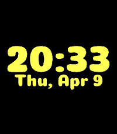{ loading=lazy width="72" } | [Sands of Time](https://apps.rebble.io/en_US/application/69d08546afd8430009d9a1ef) <small>Rebble App Store</small> | [Flynn Duniho](https://github.com/FlynnD273/pebble-sands-of-time) | <small>No licence</small> | 2026-04-10 | Combines a sand simulator with a simple watchface. |
| { loading=lazy width="72" } | [SAO2](https://apps.rebble.io/en_US/application/53554676c55d5a399e000058) <small>Rebble App Store</small> | [Ted Presley](https://github.com/tapresle/SAO2Face) | <small>Not checked yet</small> | 2014-04-25 | My second watch face featuring artwork from Sword Art Online. Enjoy! |
| { loading=lazy width="72" } | [Satanik](https://apps.rebble.io/en_US/application/56be88abc85a7ed9b4000033) <small>Rebble App Store</small> | [weaversway](https://cloudpebble.net/ide/project/301920#) | <small>See source</small> | 2016-02-13 | Hail Satan |
| { loading=lazy width="72" } | [Satellite Poems (On Your Wrist is the Universe)](https://apps.rebble.io/en_US/application/593448abb67f9f814d0009c5) <small>Rebble App Store</small> | [Nicholas Knouf](https://github.com/zeitkunst/satpoems-watchface) | <small>Not checked yet</small> | 2017-06-04 | (Follow \| Feel \| Know \| Watch \| Understand) the satellites above through computer-generated poetry. On Your Wrist is the Universe: Satellite Poems is a… |
| 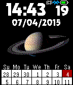{ loading=lazy width="72" } | [Saturn](https://apps.rebble.io/en_US/application/557395787d6f3d41a00000d6) <small>Rebble App Store</small> | [Gretchycat](https://github.com/gretchycat/DarkSide) | <small>Not checked yet</small> | 2015-10-19 | Featuring the magnificence of our 6th planet, Saturn! Features a 2 week calendar, and when you shake or tap, see a 5 day weather forecast. Tap again for… |
| 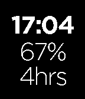{ loading=lazy width="72" } | [Save Time](https://apps.repebble.com/5739ed4cc7050e9150000013) | [Nick Tikhonov](https://github.com/nicktikhonov/pebble-save-time) | <small>Not checked yet</small> | 2016-05-16 | Unofficial RescueTime watchface for your Pebble Time and Time Steel. Keep track of your productivity score and total work time from your wrist! |
| { loading=lazy width="72" } | [scallop](https://apps.repebble.com/67cce507d2acb302d5ba8203) | [hiddej2](https://github.com/hiddej2/scallop) | <small>Not checked yet</small> | 2025-03-22 | Android Clock Scallop Widget inspired - customizable watchface. (shows the seconds - not battery life friendly!) |
| 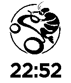{ loading=lazy width="72" } | [Scampi Watch](https://apps.rebble.io/en_US/application/5419a9ecd7eda443fb0001dd) <small>Rebble App Store</small> | [David Wang](https://github.com/david0932/MyPebbleFace/blob/master/main.c) | <small>Not checked yet</small> | 2014-09-17 | This is a bike team mark. |
| 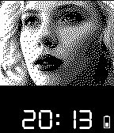{ loading=lazy width="72" } | [Scarlett Johansson](https://apps.rebble.io/en_US/application/5348115ae311a6ddb4000076) <small>Rebble App Store</small> | [Oliver Bowe](https://github.com/thunderchild7/ScarJo) | <small>Not checked yet</small> | 2014-04-12 | Basic Scarlett Johansson watchface, digital time display, a light tap will briefly show the date, and a battery status indicator. |
| 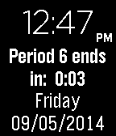{ loading=lazy width="72" } | [School Schedule](https://apps.rebble.io/en_US/application/540a3b12c7980ced84000021) <small>Rebble App Store</small> | [RHuffy](https://github.com/rhuffy/School-Schedule/) | <small>Not checked yet</small> | 2014-09-05 | This watchface allows you to enter in your daily schedule, and it displays how much time is remaining in the current time block. A quick glance at your… |
| 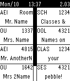{ loading=lazy width="72" } | [School Schedule for Pebble](https://apps.rebble.io/en_US/application/54f07932f44e0d1c1d00005b) <small>Rebble App Store</small> | [Stubenhocker](https://github.com/Stubenhocker1399/school-schedule-for-pebble) | <small>Not checked yet</small> | 2015-02-27 | This watchface shows your classes for today (left side) and tomorrow (right side), changing between even and uneven weeks. It currently has no settings, so… |
| 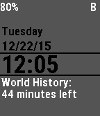{ loading=lazy width="72" } | [School Time](https://apps.rebble.io/en_US/application/52f5396da991ccfb8b0009e4) <small>Rebble App Store</small> | [Ben624](https://github.com/Ben624/SchoolTime) | <small>No licence</small> | 2015-12-21 | SchoolTime allows you to see the time left in each period. The configuration page allows you to change: - Class Names - All Colors - Bluetooth/Battery… |
| { loading=lazy width="72" } | [Schwitzerdütsch](https://apps.rebble.io/en_US/application/54bbbc364de4630b5300002e) <small>Rebble App Store</small> | [Robin Glauser](https://github.com/nahakiole/schwitzerduetsch) | <small>Not checked yet</small> | 2015-01-26 | A watchface with swiss german (bernisch) words to show the time. |
| { loading=lazy width="72" } | [Schwitzerdütsch 3.0](https://apps.repebble.com/585014b577324b357a000483) | [Robin Glauser](https://github.com/nahakiole/schwitzerduetsch) | <small>Not checked yet</small> | 2016-12-13 | A watchface which display the time in swissgerman (Schwitzerdütsch). New in Version 3.0 is a more accurate and precise minute timing. Instead of displaying… |
| { loading=lazy width="72" } | [Scott Pilgrim Colour](https://apps.repebble.com/5803a5e19392ff5e5b000070) | [Stanivision Inc.](https://github.com/TerttyCurlyfries/SCOTT-PILGRIM-Colour) | <small>Not checked yet</small> | 2016-12-21 | Every pilgrim's journey comes to an end... ------------------------------------------- Based on the hit watchface by Jon Tilton, Scott Pilgrim, SCOTT… |
| 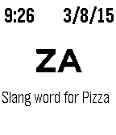{ loading=lazy width="72" } | [Scrabble Two Letters](https://apps.rebble.io/en_US/application/54fbc30de62469551c0000ea) <small>Rebble App Store</small> | [Dan Tasse](https://github.com/dantasse/scrabble_two_letters) | <small>Not checked yet</small> | 2015-03-09 | Shows two-letter words, one per minute, so you can learn them for playing word games. Contains all 105 two-letter words that are legal in the Official… |
| 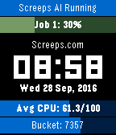{ loading=lazy width="72" } | [ScreepsTime](https://apps.repebble.com/57ebe9ca8eaf90fc03000090) | [Brian Haase](https://github.com/bthaase/ScreepsTime) | <small>Not checked yet</small> | 2016-10-07 | WARNING - This Watchface is designed specifically for use with Screeps.com, an online programming MMORTS. If you do not have a game account, this watchface… |
| { loading=lazy width="72" } | [SDF Fuzzy Text](https://apps.rebble.io/en_US/application/6ab94fee3a48fe0009c46220) <small>Rebble App Store</small> | [Uli T](https://github.com/utessel/SDF-Fuzzy-Text) | <small>Not checked yet</small> | 2026-10-03 | Fuzzy Text with nice large fonts using Signed Distance Fields and animated transitions |
| 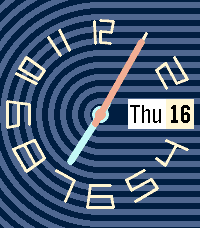{ loading=lazy width="72" } | [Sea Lines](https://apps.repebble.com/68354a1892baf2000a22be0f) | [justinjhendrick](https://github.com/justinjhendrick/sea-lines-pebble-watchface) | <small>Not checked yet</small> | 2026-06-06 | A colorful analog watchface inspired by the Swatch "Trendy Lines At Night" |
| 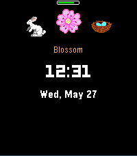{ loading=lazy width="72" } | [Seasonal Hours Clock](https://apps.repebble.com/90864dbd74a34d2890e11e99) | [Gergely Polonkai](https://gitea.polonkai.eu/gergely/pebble-seasonal-clock) | <small>See source</small> | 2026-06-19 | Watchface to display the Seasonal Hours (https://seasonalclock.org/) |
| 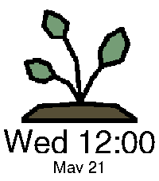{ loading=lazy width="72" } | [Seasons clock](https://apps.rebble.io/en_US/application/694851d4ce101c0009b63345) <small>Rebble App Store</small> | [Meep Apps](https://github.com/only-meeps/Seasons-Clock-Pebble) | <small>Not checked yet</small> | 2025-12-22 | A simple clock to show the different seasons! Uses a simple Meeus algorithm that runs once a year to get the times of the different seasons! Credit to… |
| 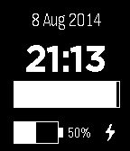{ loading=lazy width="72" } | [Second Progress](https://apps.rebble.io/en_US/application/53e53089ca9f07e53c000166) <small>Rebble App Store</small> | [Tim Emanuel](https://drive.google.com/file/d/0B8uA5rnPu1hmNnZYOFdqbkExaG8/edit?usp=sharing) | <small>See source</small> | 2014-08-08 | A simple face I did just to learn development, but it works so I thought I'd make it available. It's got date, time, a progress bar for seconds, battery… |
| { loading=lazy width="72" } | [sector](https://apps.rebble.io/en_US/application/52f23c6ce21be4b82000138e) <small>Rebble App Store</small> | [Eric BERGELIN](https://cloudpebble.net/ide/project/22031#) | <small>See source</small> | 2014-02-16 | Plain and obvious sector watch, time is displayed by a sector between hour and minute hand. Polar or pie clock, originally way to wear time. |
| 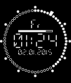{ loading=lazy width="72" } | [segcirc](https://apps.rebble.io/en_US/application/55a01d53afd08e8cd5000058) <small>Rebble App Store</small> | [FSMaxB](https://github.com/FSMaxB/segcirc) | GPL-3.0 | 2015-07-10 | Circular watchface inspired by studioclock. It uses the german date and weekday format. Known Bug: The digits 3 and 7 get displayed incorrectly in the date. |
| 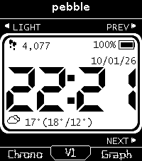{ loading=lazy width="72" } | [Segment](https://apps.rebble.io/en_US/application/6abf42344412b30009377a5f) <small>Rebble App Store</small> | [cmalec](https://github.com/cmalec/segment-watchface) | <small>Not checked yet</small> | 2026-10-02 | Segment is a seven-segment digital watchface for the Pebble Time 2, in the spirit of the classic 91 Dub. The clock is a large seven-segment readout with an… |
| { loading=lazy width="72" } | [Segment](https://apps.repebble.com/560ae4754d43a36393000001) | [Keegan](https://github.com/keegan-lillo/segment) | <small>Not checked yet</small> | 2018-02-10 | Hours are the shown as a number filling the whole display. Minutes are shown behind the hour in the middle Fully customizable colors with 6 presets ready to… |
| { loading=lazy width="72" } | [Segment Six](https://apps.rebble.io/en_US/application/52d8bbeb1acbf3738d000030) <small>Rebble App Store</small> | [Pebble](https://github.com/pebble/pebble-sdk-examples/tree/master/watchfaces/segment_six) | <small>Not checked yet</small> | 2014-01-17 | Segment Six Example Watchface |
| 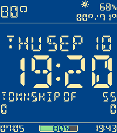{ loading=lazy width="72" } | [Segmented Info](https://apps.repebble.com/7bd156396b3649bc9612992d) | [clbwhazzup](https://github.com/clbwhazzup/the-pebble-watchface) | <small>Not checked yet</small> | 2026-09-10 | A Very Informative Watchface * Toggle / options for every display element (except time) * Temperature, high/low, humidity, precipitation %, conditions icon… |
| { loading=lazy width="72" } | [Segmented Info](https://apps.rebble.io/en_US/application/69b831e7cb95f20009559059) <small>Rebble App Store</small> | [clbwhazzup](https://github.com/clbwhazzup/the-pebble-watchface) | <small>Not checked yet</small> | 2026-09-10 | A Very Informative Watchface * Toggle / options for every display element (except time) * Temperature, high/low, humidity, precipitation %, conditions icon… |
| { loading=lazy width="72" } | [Segments](https://apps.rebble.io/en_US/application/55dd71ef4374cb4eb300000f) <small>Rebble App Store</small> | [Steven Schmatz](https://github.com/stevenschmatz/segments) | <small>Not checked yet</small> | 2015-08-26 | Segments is a simple watchface that counts the day down in 6 minute blocks. There are 240 of these blocks in a day – an easily number to comprehend. Better… |
| 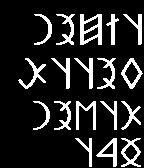{ loading=lazy width="72" } | [SeklerHungarianScript](https://apps.rebble.io/en_US/application/549da9eb112793a2d40002e9) <small>Rebble App Store</small> | [Attila Antal](https://github.com/aattila/PebbleSeklerHunSript) | <small>Not checked yet</small> | 2014-12-26 | Old Sekler-Hungarian script watchface. |
| 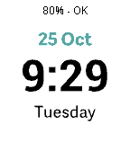{ loading=lazy width="72" } | [Selina Int](https://apps.repebble.com/57f4043e3c754a8b010000d7) | [Maxwell Moseley](https://github.com/maxmoseley23/Selina1) | <small>Not checked yet</small> | 2016-10-26 | A watchface I made for my Sister. Bare essentials only - time, date, weekday, battery, and connection state. The Watch will vibrate upon disconnection and… |
| 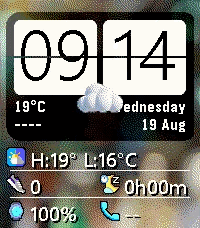{ loading=lazy width="72" } | [Sense Time](https://apps.repebble.com/9b7ac780780d485ba043c9d0) | [Moaske](https://github.com/Moaske/PebbleSenseTime) | <small>Not checked yet</small> | 2026-08-22 | HTC Sense watchface with that legendary Flip Clock widget of the good old days when you could find this on both Android and Windows Mobile phones 🤖🪟 (For… |
| 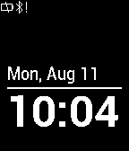{ loading=lazy width="72" } | [Sensible](https://apps.rebble.io/en_US/application/53e8dec01f0b519ff80000d0) <small>Rebble App Store</small> | [Anthony Biondo](https://github.com/tonyb486/sensible) | <small>Not checked yet</small> | 2014-08-11 | A simple watchface based on Simplicity. It adds the day of the week, and icons that only appear when needed to indicate low battery or disconnected bluetooth. |
| 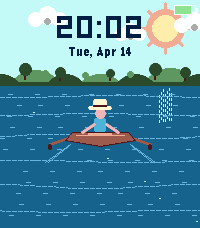{ loading=lazy width="72" } | [Serene Boater](https://apps.repebble.com/625a9f4780fa4c5aadee223f) | [AirCodum](https://github.com/coredevices/pebble-watchface-agent-skill) | <small>Not checked yet</small> | 2026-04-14 | A serene watchface featuring a boater with a straw hat rowing calmly on open water. Distant hills and trees on the horizon, shimmering water with ripples… |
| 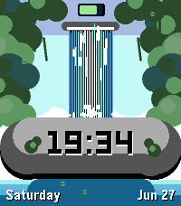{ loading=lazy width="72" } | [Serene Waterfall](https://apps.repebble.com/9657a1fd4a6c46119e295779) | [AirCodum](https://github.com/coredevices/pebble-watchface-agent-skill) | <small>Not checked yet</small> | 2026-06-27 | A serene animated waterfall cascades through lush jungle and breaks over a mossy boulder with the time carved into it. Shows the day, date and battery, with… |
| 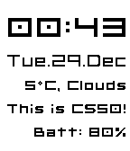{ loading=lazy width="72" } | [sfclock for Pebble](https://apps.repebble.com/5681b745e08e4838ac00008b) | [Bogdan Orzea](https://github.com/bogdanorzea/sfclock) | <small>Not checked yet</small> | 2016-03-14 | A simple and customisable watchface that supports: - 12-H / 24-H time format; - date display; - weather information from OpenWeatherMap; - custom text… |
| 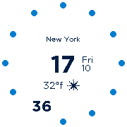{ loading=lazy width="72" } | [Sfera](https://apps.rebble.io/en_US/application/58c2f7110dfc32a52a00081f) <small>Rebble App Store</small> | [dieghernan](https://github.com/dieghernan/Sfera) | <small>Not checked yet</small> | 2018-03-13 | * Consider ♥ if you enjoy this watchface * Sfera is a highly customizable watchface that gets the most of the smartwatch capabilities: Settings - Clock… |
| 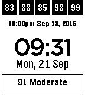{ loading=lazy width="72" } | [SG Haze Watch](https://apps.rebble.io/en_US/application/55fbe95c5150be7a9a00005c) <small>Rebble App Store</small> | [Chang Sau Sheong](https://github.com/sausheong/sghaze) | <small>Not checked yet</small> | 2015-09-21 | Simple watchface plus real-time Singapore PSI (Pollution Standard Index) numbers as provided by NEA. Top line represents the hourly PSI numbers in the… |
| 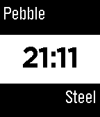{ loading=lazy width="72" } | [SG Steel](https://apps.rebble.io/en_US/application/554fca829d1dd78858000091) <small>Rebble App Store</small> | [Stevegroves123](https://github.com/stevegroves123/Steel_words) | <small>Not checked yet</small> | 2015-05-10 | Simple watch face created to show the time |
| { loading=lazy width="72" } | [Shadow Analog](https://apps.repebble.com/55d633b089b39e1008000024) | [Comfortably Numb](https://github.com/ygalanter/Shadow_Analog) | <small>Not checked yet</small> | 2016-06-10 | - Simple analog watchface with shadow effect. |
| 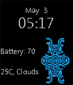{ loading=lazy width="72" } | [Shadow of the Colossus Watchface](https://apps.rebble.io/en_US/application/5546a140f17601c9380000d5) <small>Rebble App Store</small> | [Ishan Taparia](https://github.com/ITaparia/Pebble-Development/tree/SotC_WatchFace) | <small>No licence</small> | 2015-05-03 | This is a very simple watch face, made for the fans of the popular video game: Shadow of the Colossus! *Features* - Simple Digital Clock - Date Display… |
| 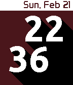{ loading=lazy width="72" } | [Shadow Time](https://apps.repebble.com/56ca9d04f8174e9645000010) | [Ben Kesselring](https://github.com/BenKesselring/Shadow_Time/) | <small>No licence</small> | 2016-02-29 | This watchface displays hours and minutes offset from one another and casting a shadow, and displays the date on a bar along the top of the screen. It is… |
| 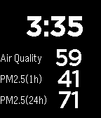{ loading=lazy width="72" } | [Shanghai China Pollution PM2.5 Air Quality Index](https://apps.rebble.io/en_US/application/539d4f4d126758204b000124) <small>Rebble App Store</small> | [Codemonkey](https://github.com/maverick2000/shanghai_pollution_pebble_watchface) | <small>Not checked yet</small> | 2014-06-15 | Displays the current Air Quality Index, PM2.5 hourly and 24 hour concentrations along with the current time. |
| 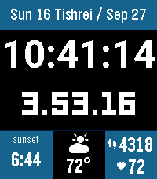{ loading=lazy width="72" } | [Shaot Zemaniot](https://apps.repebble.com/9cc1f2cb2f78476f8bcbca70) | [Josh Rosenberg](https://github.com/rosenbergj/pebble-shaot-zemaniot) | <small>Not checked yet</small> | 2026-09-30 | A highly configurable watchface showing Shaot Zemaniot, an ancient Jewish form of timekeeping. Alongside the ordinary civil time, this watchface divides the… |
| 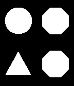{ loading=lazy width="72" } | [Shapes](https://apps.rebble.io/en_US/application/52e0123fdbbbf9518a00015d) <small>Rebble App Store</small> | [8a22a](https://github.com/8a22a/Shapes) | <small>No licence</small> | 2014-01-22 | Big time using shapes. Read the time by counting the number of the shape's sides. |
| { loading=lazy width="72" } | [Shapes](https://apps.rebble.io/en_US/application/5aeb24c5f38588775f000789) <small>Rebble App Store</small> | [b123400](https://github.com/b123400/shapes) | <small>Not checked yet</small> | 2026-06-28 | The shape's number of line indicate the current minutes divided by 5, and the background lines indicate the hour. |
| 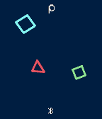{ loading=lazy width="72" } | [Shapes](https://apps.rebble.io/en_US/application/58e491216ca3871e00000587) <small>Rebble App Store</small> | [chops](https://github.com/mereed/pebbleface-emojishapes) | <small>Not checked yet</small> | 2017-06-01 | It's basically just a simple analog watch, with the hands represented by shapes. Hours are represented by the diamond (or smaller square), and minutes the… |
| 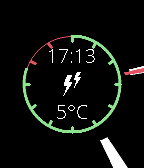{ loading=lazy width="72" } | [Shards](https://apps.repebble.com/581896d9c68d0087f800005f) | [Vadim Podlesov](https://github.com/voseldop/shards) | <small>Not checked yet</small> | 2016-11-24 | Summary: Watchface with battery meter, digital and analog time and weather. The digital time, weather conditions and current temperature is displayed in the… |
| 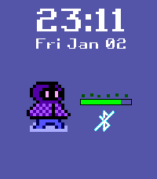{ loading=lazy width="72" } | [Shards of Grandeur Watchface](https://apps.repebble.com/69584a4b39d92d0009bb7478) | [123outerme](https://github.com/123outerme/ShardsOfGrandeurPebbleWatchface) | <small>No licence</small> | 2026-06-06 | Shows the date, time, battery level, a charging indicator on the battery bar, Bluetooth connection state, and the last heart rate reading (if supported)!… |
| 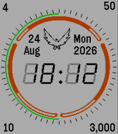{ loading=lazy width="72" } | [SHD](https://apps.repebble.com/691d860bf5dd2700093ddbbd) | [a1291762](https://github.com/a1291762/shd-pebble) | <small>Not checked yet</small> | 2026-06-04 | A watch face based on the loading animation from Tom Clancy's The Division. |
| { loading=lazy width="72" } | [Sheikah Slate - BoTW](https://apps.repebble.com/5e28ea933dd3109f151c7e0a) | [Harrison Allen](https://github.com/HarrisonAllen/SheikahSlate_PebbleWatchface) | <small>No licence</small> | 2026-01-04 | Put the power of the Sheikah on your wrist! Based on the Sheikah Slate from the Legend of Zelda: Breath of the Wild, this watchface features: -Time and Date… |
| { loading=lazy width="72" } | [Shinchan](https://apps.repebble.com/b6d8a42ffe164d959c661501) | [AirCodum](https://github.com/coredevices/pebble-watchface-agent-skill) | <small>Not checked yet</small> | 2026-05-16 | Cartoon kid funny faces watchface. Cycles through 12 silly expressions — one new face every minute. Tap for a random face. Battery indicator in the bottom bar. |
| 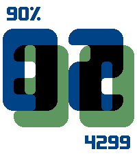{ loading=lazy width="72" } | [Shine Through](https://apps.repebble.com/37e3e88845ae4ea2a6625d25) | [soxfox42](https://github.com/soxfox42/shine-through) | <small>Not checked yet</small> | 2026-03-10 | Large digits with a neat overlap effect between the hours and minutes. Configurable colors, and options to display date, steps, or battery in the corners. |
| { loading=lazy width="72" } | [Shine Through](https://apps.rebble.io/en_US/application/692ad49949be450009b545c7) <small>Rebble App Store</small> | [soxfox42](https://github.com/soxfox42/shine-through) | <small>Not checked yet</small> | 2026-03-10 | Large digits with a neat overlap effect between the hours and minutes. Configurable colors, and options to display date, steps, or battery in the corners. |
| 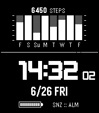{ loading=lazy width="72" } | [Shocker-GPR](https://apps.repebble.com/246fae41675540e09e468d19) | [Rafael Pereira](https://github.com/rafaelc007/shocker-gpr) | <small>Not checked yet</small> | 2026-06-29 | Watch face based on the more recent G-Shock GPR watches. - Displays time with optional seconds. - Displays a histogram of recent step activity. |
| 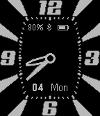{ loading=lazy width="72" } | [ShoMaurice](https://apps.repebble.com/5664345171fa343175000041) | [Szabolcs "Sam" Ban](https://github.com/ShoobyBan/PebbleShoMaurice) | <small>Not checked yet</small> | 2025-11-25 | Analog watch. Customizable colours, digital display, health (steps) integration, second handle, distinguishable minute and hour handles, day of the week… |
| 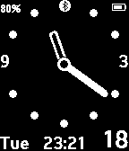{ loading=lazy width="72" } | [ShoOne](https://apps.rebble.io/en_US/application/55d35a2bb8f18df809000022) <small>Rebble App Store</small> | [Szabolcs "Sam" Ban](https://github.com/ShoobyBan/PebbleShoOne) | <small>Not checked yet</small> | 2015-08-30 | This watchface is tailored to my taste. Analog watch with no second handle, rounded and distinguishable minute and hour handles, day of the week, day of the… |
| 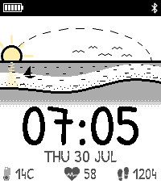{ loading=lazy width="72" } | [Shoreline](https://apps.repebble.com/6de09ae5e76b4e698057584f) | [Null Syntax](https://github.com/AKlitbo/pebble-watchfaces) | AGPL-3.0 | 2026-09-27 | - |
| { loading=lazy width="72" } | [Showtime](https://apps.repebble.com/3148c87c68c14295b5e94a7c) | [SirBraneDamuj](https://github.com/sirbranedamuj/showtime) | <small>Not checked yet</small> | 2026-04-29 | A minimalistic watch face inspired by Paradigm City's top negotiator. An AI agent was used to aid in the coding of this watchface. |
| { loading=lazy width="72" } | [Shrek Watch](https://apps.repebble.com/6a505ed550bd250009c6bd8f) | [Krang](https://codeberg.org/Krang/Shrek_Watch_for_Pebble) | <small>See source</small> | 2026-08-07 | It's Shrek! The mouth opens and closes on the minute. Supports date. Supports 12h and 24h time formats. Supports BW watches, Pebble Time 2 and Pebble Round… |
| 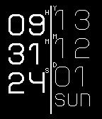{ loading=lazy width="72" } | [Side By Side](https://apps.rebble.io/en_US/application/529bf118f33e7653f000000b) <small>Rebble App Store</small> | [Ben Froman](https://github.com/Dwarf84396/side_by_side) | <small>No licence</small> | 2013-12-02 | A simple vertical watch face, displaying both time and date. |
| 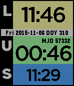{ loading=lazy width="72" } | [Sidereal Watchface](https://apps.repebble.com/563bf809d886bbd76400000d) | [Jamie Stevens](https://github.com/ste616/pebble-sidereal-watchface) | <small>Not checked yet</small> | 2025-11-25 | Shows times useful for astronomers, including the day of year, local and UTC times, sidereal time (location selectable in the app configuration) and… |
| 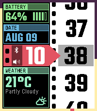{ loading=lazy width="72" } | [Sidereel](https://apps.repebble.com/f7ab7761bf5e47b98c717f68) | [Null Syntax](https://github.com/AKlitbo/pebble-watchfaces) | AGPL-3.0 | 2026-09-27 | - |
| 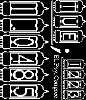{ loading=lazy width="72" } | [Sideways;Watchface](https://apps.rebble.io/en_US/application/52ba1f15ecdaae6996000010) <small>Rebble App Store</small> | [Spencer Johnson](https://bitbucket.org/Masamune_Shadow/sideways-watchface) | <small>See source</small> | 2014-01-24 | An evolution of my Sideways Watchface for 1.x, but this time Inspired by Steins;Gate & Nixie Clocks. |
| 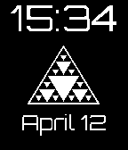{ loading=lazy width="72" } | [Sierpinski's Triangle Watchface](https://apps.repebble.com/570d5a9db4a063fc4900002e) | [Wackymonkey](https://github.com/wackymonkey2/Sierpinski-s-Triangle-Watchface.git) | <small>Not checked yet</small> | 2016-04-12 | This is a basic watch face with date. It has a picture of a Sierpinski's Triangle in the middle. |
| { loading=lazy width="72" } | [Signal](https://apps.rebble.io/en_US/application/555d12564c2222794100004b) <small>Rebble App Store</small> | [taturou](https://github.com/taturou/pebble_Signal) | <small>Not checked yet</small> | 2015-05-23 | This is a clock like a Japanese pedestrian signal. You can recognize the "mm" of "YYYY-MM-DD hh:mm:ss". When the color is red, it is even number minutes… |
| { loading=lazy width="72" } | [Signal Deck](https://apps.repebble.com/6e750c03f2d5418787ff3390) | [Liam Cordelle](https://github.com/LiamCordelle/signal-deck) | <small>Not checked yet</small> | 2026-07-23 | A configurable light/dark flight-deck watchface with weather, health gauges, world clock, and crisp pixel typography. |
| { loading=lazy width="72" } | [SiliconSampler](https://apps.rebble.io/en_US/application/5690285a056c3801d800007c) <small>Rebble App Store</small> | [Peter Wiesner](https://github.com/WiesnerPeti/SiliconSampler) | <small>Not checked yet</small> | 2016-01-08 | Almost the simplest Watchface available! You can find the time in the middle (only 24h format supported, this is part of the "design"). You can read… |
| { loading=lazy width="72" } | [Silly Walk 2](https://apps.rebble.io/en_US/application/5343d66182ca8d0e600000f5) <small>Rebble App Store</small> | [Jan Gruncl](https://github.com/JohnyGQD/pebble-silly-walk) | <small>No licence</small> | 2014-04-11 | My Pebble 2.0 port (+ further development) of dansl's original "Pebble Watchface: Silly Walk". Inspired by Monty Python's "Ministry of Silly Walks". Both… |
| { loading=lazy width="72" } | [SimpDigital](https://apps.rebble.io/en_US/application/55b29368da93af060700007d) <small>Rebble App Store</small> | [Jak](https://github.com/Keggs/SimplePebbleFace) | <small>No licence</small> | 2015-08-01 | Simple digital display, that was created using mainly the tutorial. Displays the date and weather as-well. |
| { loading=lazy width="72" } | [SimplDay](https://apps.rebble.io/en_US/application/529e829b1a6638cb57000029) <small>Rebble App Store</small> | [Bob Hauck](https://github.com/bobhwasatch/simplday.git) | <small>Not checked yet</small> | 2014-02-04 | Minor modification of the standard Simplicity face to add the day of the week. |
| { loading=lazy width="72" } | [Simple](https://apps.rebble.io/en_US/application/5833003b8c7ffffa9800018a) <small>Rebble App Store</small> | [alekoz47](https://github.com/alekoz47/simple) | <small>Not checked yet</small> | 2017-01-09 | A simple configurable analog watch face with tick marks and a date. Note: The default color scheme is white for Pebble 2HR watches. If your watch supports… |
| { loading=lazy width="72" } | [Simple](https://apps.rebble.io/en_US/application/53c041d5f3ce282d6d000004) <small>Rebble App Store</small> | [Jacob Nearon](https://cloudpebble.net/ide/project/68106#) | <small>See source</small> | 2014-07-17 | Simple and classy watch face. |
| { loading=lazy width="72" } | [Simple + sunrise/set](https://apps.rebble.io/en_US/application/52b91915fd47639dc6000049) <small>Rebble App Store</small> | [abarry](https://github.com/andybarry/simplday) | <small>Not checked yet</small> | 2014-01-10 | Simple watchface from Bob Hauck modified to show time until next sunrise or sunset based on phone's location. |
| { loading=lazy width="72" } | [Simple 2](https://apps.rebble.io/en_US/application/5800568e2cde65bfb70002d9) <small>Rebble App Store</small> | [john rodriguez](https://cloudpebble.net/ide/project/321649#) | <small>See source</small> | 2017-07-12 | simple 2 |
| { loading=lazy width="72" } | [Simple Analog](https://apps.rebble.io/en_US/application/555a3c55c2afa2329c000006) <small>Rebble App Store</small> | [Pebble](https://github.com/pebble-examples/simple-analog) | <small>Not checked yet</small> | 2015-12-14 | The classic watchface for Pebble and Pebble Steel, now available for Pebble Time and Pebble Time Steel. |
| { loading=lazy width="72" } | [Simple Analog](https://apps.rebble.io/en_US/application/52d8bc1daef8d50e88000029) <small>Rebble App Store</small> | [Pebble](https://github.com/pebble/pebble-sdk-examples/tree/master/watchfaces/simple_analog) | <small>Not checked yet</small> | 2014-01-17 | Simple Analog Example Watchface |
| { loading=lazy width="72" } | [Simple Askew](https://apps.repebble.com/69fa46f9ea28ba00099a6c61) | [EC Apps](https://github.com/eduardochiaro/simple-collection/tree/main/askew) | <small>Not checked yet</small> | 2026-05-05 | A minimalist analog watchface, just a little askew. You can change the degree in settings: 0,10,15,20,25 or 30 degrees. |
| { loading=lazy width="72" } | [Simple Binary](https://apps.repebble.com/6978ff6c047265000996d297) | [EC Apps](https://github.com/eduardochiaro/simple-collection/tree/main/binary) | <small>Not checked yet</small> | 2026-01-27 | A minimal Pebble watchface that progressively fills the screen radially based on the hour. At 00:00 the screen is completely black, gradually becoming white… |
| { loading=lazy width="72" } | [Simple Binary](https://apps.rebble.io/en_US/application/52e2d9bdb806fd5675000cb5) <small>Rebble App Store</small> | [kam800](https://github.com/kam800/pebble-simple-binary) | <small>Not checked yet</small> | 2014-01-25 | Energy saving binary clock. It ticks only once per minute to save your battery. Simple Binary displays hours in the left column and minutes in the right… |
| { loading=lazy width="72" } | [Simple Binary Clock](https://apps.rebble.io/en_US/application/555ab9b19cace258f700006e) <small>Rebble App Store</small> | [Johtull](http://pastebin.com/cDtkS8Fi) | <small>See source</small> | 2015-05-22 | Basic binary clock. Top row = hours in base 2, bottom row = minutes in base 2. Empty boxes are zeros, filled boxes are ones. 24-hour format. Colors invert… |
| { loading=lazy width="72" } | [Simple British Default](https://apps.repebble.com/56f1d34bdf91bb2e83000012) | [Fred Crowson](https://github.com/fcbsd/Pebble) | <small>Not checked yet</small> | 2016-03-22 | Simple British Default Watch with Day, Time and Date. |
| { loading=lazy width="72" } | [Simple CGM](https://apps.repebble.com/557c3091d269ce13b300001a) | [John Costik](https://github.com/hackingtype1/cgm-pebble-time-wf) | <small>Not checked yet</small> | 2019-07-24 | View CGM data. This app is not supported or endorsed by Dexcom. Simple CGM MUST NOT BE USED TO MAKE MEDICAL DECISIONS. THERE IS NO WARRANTY FOR THE PROGRAM… |
| { loading=lazy width="72" } | [Simple CGM Analog](https://apps.repebble.com/578c21b584accc314e0002bf) | [Horsetooth Software](https://github.com/tynbendad/simplecgmanalog) | <small>Not checked yet</small> | 2019-07-24 | Please send email (through pebble store contact link) if you try it & have issues or suggestions. Based nearly entirely on John Costik's SIMPLE CGM SPARK… |
| { loading=lazy width="72" } | [Simple Christmas Watchface](https://apps.rebble.io/en_US/application/56700b7ee091298495000022) <small>Rebble App Store</small> | [Dione](https://github.com/DioneJM/Christmas-Watchface-) | <small>No licence</small> | 2015-12-30 | A simple watchface that display both 24 hour and 12 hour time. |
| { loading=lazy width="72" } | [Simple Classic](https://apps.rebble.io/en_US/application/589809151985ca59010001aa) <small>Rebble App Store</small> | [Ivan Gorinov](https://github.com/igorinov/pebble_simple_clasic) | <small>Not checked yet</small> | 2017-02-20 | Color analog watch face with battery indicator. |
| { loading=lazy width="72" } | [Simple Colors](https://apps.rebble.io/en_US/application/5551874ce979af0c360000d7) <small>Rebble App Store</small> | [quillford](https://github.com/quillford/SimpleColor-Pebble) | <small>Not checked yet</small> | 2015-05-12 | This is a simple watchface that gets a random color for the time and background every minute. |
| { loading=lazy width="72" } | [Simple Digital](https://apps.repebble.com/586708512ee4312381000276) | [MainFrame](https://github.com/steel-wing/simple-digital) | <small>Not checked yet</small> | 2026-05-21 | This is a simple digital watchface. It uses cells to mimic the seven segment style of most digital watches. Check out my other watchface, Total Digital, if… |
| { loading=lazy width="72" } | [Simple Digital](https://apps.rebble.io/en_US/application/557c085d4923dd0b17000009) <small>Rebble App Store</small> | [mephissto](https://github.com/mephissto/simple-digital) | <small>Not checked yet</small> | 2015-06-15 | Simple digital watchfaces with day of the month and month. Inspired by M360 Digital Watchface. Upcoming features : * Choose date format : DD.MM or MM.DD *… |
| { loading=lazy width="72" } | [Simple Digital With Weather](https://apps.rebble.io/en_US/application/55f5bd47c155b97503000098) <small>Rebble App Store</small> | [FiftySeven](https://github.com/MattChubb/PebbleBasicWatchface) | <small>Not checked yet</small> | 2015-10-25 | A basic digital watchface with weather+battery status. |
| { loading=lazy width="72" } | [Simple Eclipse](https://apps.repebble.com/6974a40065b98f00098a7cf9) | [EC Apps](https://github.com/eduardochiaro/simple-eclipse) | <small>Not checked yet</small> | 2026-01-24 | A minimal Pebble watchface designed to look like an eclipse. |
| { loading=lazy width="72" } | [Simple Electronic Watchface](https://apps.rebble.io/en_US/application/55b89184a06a0e436e000030) <small>Rebble App Store</small> | [GrimbiXcode](https://github.com/GrimbixCode/Pebble_ElectronicWatchface) | GPL-2.0 | 2015-07-29 | Take a look at the time! ..with this simple Watchface. If you are interested in electronics, it's the nicest way to watch the time through this face. |
| { loading=lazy width="72" } | [Simple Enough](https://apps.repebble.com/6960135be386d90009527f25) | [EC Apps](https://github.com/eduardochiaro/simple-enough) | <small>Not checked yet</small> | 2026-07-23 | A minimalist analog watchface for Pebble smartwatches inspired by clean, modern clock design. |
| { loading=lazy width="72" } | [Simple F](https://apps.repebble.com/52a9641079c18f0ed9000048) | [Foxel](https://github.com/foxel/pebble-simplef) | <small>Not checked yet</small> | 2017-04-11 | Simple watchface based on simplicity. Features: * battery-efficient rendering * week day display * battery indicator * bluetooth indicator * connection… |
| { loading=lazy width="72" } | [Simple F + termopogoda.ru](https://apps.repebble.com/54affcb0a1eea169e600009f) | [Foxel](https://github.com/foxel/pebble-simple-termo) | <small>Not checked yet</small> | 2017-04-11 | Simple F with http://termopogoda.ru weather info. SHOWS ONLY TOMSK WEATHER Features: * BIG time display * 12/24-h mode * battery-efficient rendering * week… |
| { loading=lazy width="72" } | [Simple F Big](https://apps.repebble.com/5393e248553ec92366000001) | [Foxel](https://github.com/foxel/pebble-simple-big) | <small>Not checked yet</small> | 2025-09-02 | Simple watchface based on simplicity and big watch. Features: * BIG time display * 12/24-h mode * battery-efficient rendering * week day display * battery… |
| { loading=lazy width="72" } | [Simple Face](https://apps.rebble.io/en_US/application/533b17d8c45ef2bf6b00029b) <small>Rebble App Store</small> | [Dan Hart](https://github.com/mizzoudan/SimpleFace1.2-Pebble) | <small>Not checked yet</small> | 2014-04-30 | SimpleFace - By Dan Hart ==================== - Simple Time ( 24 or 12 ) - Color Invert + Vibe on disconnect. - Day of the Week - Date (MM - DD - YYYY)… |
| { loading=lazy width="72" } | [Simple Hybrid](https://apps.repebble.com/57c888c45e3c3d1854000758) | [cityhawk](https://github.com/CityHawk/mywatchface) | <small>No licence</small> | 2016-09-08 | Simple Hybrid, displaying both analog and digital versions. No tuning, no battery status, no bluetooth disconnect info (though this one pending). This… |
| { loading=lazy width="72" } | [Simple K](https://apps.rebble.io/en_US/application/5325f7878d9d0119fb000347) <small>Rebble App Store</small> | [Simple K Productions](https://github.com/pkleppner/pebble-simplek) | <small>Not checked yet</small> | 2014-03-16 | Another variant of Simplicity, derived from Foxel's Simple F. Supports both 12 and 24-hour mode, as well as display of battery and connection indicators… |
| { loading=lazy width="72" } | [Simple Purple](https://apps.rebble.io/en_US/application/67c230eeb7a02300092ba04a) <small>Rebble App Store</small> | [Flynn Duniho](https://github.com/FlynnD273/pebble-watchface) | MIT | 2025-03-02 | A simple purple (on colour displays) watchface that shows the time and battery level. |
| { loading=lazy width="72" } | [Simple Red and White](https://apps.repebble.com/56b78f41d53a49bca200002a) | [FiftySeven](https://github.com/MattChubb/PebbleBasicWatchface/tree/redwhite) | <small>Not checked yet</small> | 2016-02-07 | A simple red and white watchface. Weather, time, date are displayed diagonally, battery and bluetooth are placed at opposite corners. Different colour… |
| { loading=lazy width="72" } | [Simple Retro](https://apps.repebble.com/562c9639b5a9327f9d000065) | [willbsp](https://github.com/willbsp/Simple-Retro-Pebble) | <small>Not checked yet</small> | 2016-03-28 | Simple Retro is a simple open-source Pebble watchface that can show Bluetooth status, battery level, time and date. |
| { loading=lazy width="72" } | [Simple Round](https://apps.repebble.com/996a35fad5e243e1a7bf5eaa) | [Ali Aslam](https://github.com/camr0/SimpleRoundWatchFace) | <small>Not checked yet</small> | 2026-08-11 | Simple Round is a simple analog watchface for the Round 2. - Center info cluster: time, date, weather icon, temperature - Weather via Open-Meteo (no API key… |
| { loading=lazy width="72" } | [Simple Russian Watchface](https://apps.repebble.com/5484b0a7479e157ea00000e3) | [Master_Groosha](https://github.com/Kondra007/PebbleWatchfaceCondensed) | <small>No licence</small> | 2016-11-23 | Simple watchface for Russian users ---------- Простенькие часы для русскоговорящих пользователей. Только время и дата, ничего лишнего. |
| { loading=lazy width="72" } | [Simple Seconds](https://apps.repebble.com/5371f7f5913f77b78100003b) | [manwithpowers](https://github.com/manwithpowers/Simple-Seconds) | <small>Not checked yet</small> | 2026-04-16 | A simple, clean watch face with day/date and seconds. Shake/tap to show battery level. |
| { loading=lazy width="72" } | [Simple Square](https://apps.repebble.com/5727b71aded3576963000013) | [gogothegogo](https://github.com/gogothegogo/SimpleSquare_Pebble.git) | <small>Not checked yet</small> | 2016-05-02 | Simple watchface with square pixel-perfect font with time and date. Completely configurable. You can configure: - time and date font sizes - date on/off … |
| { loading=lazy width="72" } | [Simple Squares](https://apps.rebble.io/en_US/application/567aebc885f00fee8e000039) <small>Rebble App Store</small> | [Edwin Finch](https://edwinfinch.com/redirect/pebble-legacy-source) | <small>See source</small> | 2021-06-17 | An old classic from our original collection from 2014-2016, now free & open source! |
| { loading=lazy width="72" } | [Simple Step](https://apps.repebble.com/56d32355d4f5886aa2000022) | [clach04](https://github.com/clach04/watchface_simple_step) | <small>Not checked yet</small> | 2016-11-25 | Simple digital watch face with step count. Supports Aplite (original Pebble) by simply hiding the step counter. Offline config/settings Pebble Time and… |
| { loading=lazy width="72" } | [Simple Striped](https://apps.repebble.com/552b12499c306b05a000008e) | [Comfortably Numb](https://github.com/ygalanter/SimpleStriped) | <small>Not checked yet</small> | 2016-06-09 | - Simple watchface showing date and time in big font in striped pattern. - Thin line at the bottom is a battery indicator, length equal remaining charge … |
| { loading=lazy width="72" } | [Simple Stripes](https://apps.rebble.io/en_US/application/590e2deb6ca3871fe800064b) <small>Rebble App Store</small> | [Allen B](https://github.com/Allen-B1/simple-stripes) | <small>No licence</small> | 2018-03-25 | A simple, striped watchface perfect for everyday use. |
| { loading=lazy width="72" } | [Simple TCS](https://apps.repebble.com/58b516160dfc329c0100017e) | [VilleV](https://github.com/vviskari/SimpleTCS) | <small>Not checked yet</small> | 2018-04-21 | 100 Hearts! Wow! Thanks for your support and feedback. Lets celebrate with an animation! Calendar and forecast switch is now animated and you can schedule… |
| { loading=lazy width="72" } | [Simple Text Oh One Steps](https://apps.repebble.com/6709f1569dc240d8b4226fb4) | [Ginko72](https://github.com/Ginko72/PebbleTextHealth) | CC0-1.0 | 2026-06-01 | This face offers a slight twist on word time in a simple, graphic design. I'm a bit pedantic about word time and for 1-9 minutes past the hour, the minutes… |
| { loading=lazy width="72" } | [Simple Time](https://apps.repebble.com/5803daf79392ff68630000bf) | [Michael Kang](https://github.com/mrmichaelkang/simple-time) | <small>Not checked yet</small> | 2016-11-06 | Just a simple watch face that tells the time, date and day of week. |
| { loading=lazy width="72" } | [Simple Time, Date, and Weather](https://apps.repebble.com/55ac922477eb5ef7ab000048) | [Tim Dayley](https://github.com/tdayley/Pebble) | <small>Not checked yet</small> | 2016-04-26 | Simple time, date, and weather watchface that syncs the temperature every 5 minutes. |
| { loading=lazy width="72" } | [Simple Trio](https://apps.repebble.com/6974c01b8b7ed80009421835) | [EC Apps](https://github.com/eduardochiaro/simple-trio) | <small>Not checked yet</small> | 2026-07-23 | A minimalist analog watchface for Pebble smartwatches inspired by clean, modern clock design. |
| { loading=lazy width="72" } | [Simple Watch](https://apps.repebble.com/55fbc0c63c882806bf00003d) | [Anton Isaiev](https://github.com/detores/Pebble-SimpleWatch) | <small>Not checked yet</small> | 2016-11-13 | Simple watchface with weather based on your location and exchage rates USD/UAH. |
| { loading=lazy width="72" } | [Simple Watch - itmitica](https://apps.rebble.io/en_US/application/5a5f9efe461a8d0a97002b8f) <small>Rebble App Store</small> | [itmitica](https://github.com/itmitica/Pebble-SimpleWatch) | <small>Not checked yet</small> | 2018-01-27 | Time, date and week day, suitable for one-glance-read. And a nice wallpaper. |
| { loading=lazy width="72" } | [Simple Watch Face](https://apps.repebble.com/6999ade2f387ef000995cae5) | [Zipher](https://github.com/Zipher04/SimpleWatchFace) | <small>Not checked yet</small> | 2026-02-25 | A simpe watch face modified from the default Kickstart watchface came with pebble time. The added inforinformation are: 1. ISO date. 2. Weekday 3. Step 4… |
| { loading=lazy width="72" } | [Simple Watchface](https://apps.rebble.io/en_US/application/550abeed84ad02c80c000119) <small>Rebble App Store</small> | [Evan DeVrieze](https://github.com/devrevan/simplePebbleWatchFace) | <small>Not checked yet</small> | 2015-03-19 | An extremely simple watchface that I like to use myself. Second screenshot shows accurate colors for when it's on the watch. |
| { loading=lazy width="72" } | [Simple Weather](https://apps.rebble.io/en_US/application/52b31f92b70e1c2c77000121) <small>Rebble App Store</small> | [John Flanagan](https://github.com/tallerthenyou/simplicity-with-day) | <small>Not checked yet</small> | 2016-02-09 | Simplicity based watchface with weather and battery level. |
| { loading=lazy width="72" } | [Simple Weather F/C](https://apps.rebble.io/en_US/application/547fb63ec30d3713590000d3) <small>Rebble App Store</small> | [xstefanx](https://github.com/xstefanx/Simple_Weather_F-C) | <small>Not checked yet</small> | 2014-12-08 | Watchface that shows the temperature in both Fahrenheit and Celsius. |
| { loading=lazy width="72" } | [Simple_Analog](https://apps.rebble.io/en_US/application/67c53a04b7a02300092ba0a5) <small>Rebble App Store</small> | [GautamG](https://github.com/Gautam3767/pebble_simple_analog) | <small>No licence</small> | 2025-03-03 | Its a simple analog watch face to view time |
| { loading=lazy width="72" } | [SimpleCal](https://apps.repebble.com/569fd665a1ebd0d42c000064) | [masmddr](https://github.com/sheydenis/SimpleCal) | <small>Not checked yet</small> | 2016-03-05 | A simple watchface with a calendar and battery charge indicator. Also features a bar on the right to indicate seconds. (0,10,20,30,40,50 seconds) |
| { loading=lazy width="72" } | [SimpleDots](https://apps.rebble.io/en_US/application/58f2d48e6ca387fc52001098) <small>Rebble App Store</small> | [aocodermx](https://github.com/aocodermx/SimpleDots) | <small>Not checked yet</small> | 2017-05-01 | Minimalistic watchface to display weather icons, date, time, and the battery dots. A simple buy great way to see the battery level on your watch. Features… |
| { loading=lazy width="72" } | [SimpleFace](https://apps.rebble.io/en_US/application/54fc260fd7e692f72200003d) <small>Rebble App Store</small> | [Akwaryoum](https://github.com/Akwaryoum/Simpleface) | MIT | 2015-08-01 | English A simple configurable watchface who displays: time, date, year bluetooth connection and battery percentage. Last two can be switched off, and a… |
| { loading=lazy width="72" } | [simpleface](https://apps.rebble.io/en_US/application/567e0fb0a2dee27004000458) <small>Rebble App Store</small> | [mfinelli](https://github.com/mfinelli/simpleface) | <small>Not checked yet</small> | 2016-01-06 | A simple watchface that shows the date, time, and weather. |
| { loading=lazy width="72" } | [Simpleface](https://apps.rebble.io/en_US/application/56a8370d0b9e95b57f00000a) <small>Rebble App Store</small> | [NovaG](https://github.com/NovaGL/simpleface) | <small>Not checked yet</small> | 2016-02-14 | Simple watch face with time and date as well as Pebble Bluetooth and battery status. |
| { loading=lazy width="72" } | [SimpleStripes](https://apps.rebble.io/en_US/application/67cb63b7d2acb301fae26e28) <small>Rebble App Store</small> | [Sangelo](https://github.com/SangeloDev/pebble-simple-stripes) | <small>Not checked yet</small> | 2025-03-07 | This watchface has a simple stripe banner at the top and a minimal digital clock with a date at the bottom. Fully configurable and customizable! |
| { loading=lazy width="72" } | [SimpleTime](https://apps.rebble.io/en_US/application/55120579c496d87e9e000060) <small>Rebble App Store</small> | [Chris C.](https://github.com/cartyc/simpleTimeVertical) | <small>Not checked yet</small> | 2015-04-12 | Just a simple watchface that displays, the date/time/weather(in Celcius!). Uses your phones location service to provide weather data. Weather updates every… |
| { loading=lazy width="72" } | [simpleTime_Farenheight](https://apps.rebble.io/en_US/application/5527c66678b67bc4a7000012) <small>Rebble App Store</small> | [Chris C.](https://github.com/cartyc/simpleTimeVertical/tree/farenheight) | <small>Not checked yet</small> | 2015-04-18 | Just a simple watchface that displays, the date/time/weather(in Farenheight). Uses your phones location service to provide weather data. Weather updates… |
| { loading=lazy width="72" } | [simpleTime_Kelvin](https://apps.rebble.io/en_US/application/5527c60ae0d843430d00001b) <small>Rebble App Store</small> | [Chris C.](https://github.com/cartyc/simpleTimeVertical/tree/kelvins) | <small>Not checked yet</small> | 2015-04-12 | Just a simple watchface that displays, the date/time/weather(in kelvins!). Uses your phones location service to provide weather data. Weather updates every… |
| { loading=lazy width="72" } | [Simplex](https://apps.rebble.io/en_US/application/52e32e282645fb9137001108) <small>Rebble App Store</small> | [acymbalski](https://github.com/acymbalski/simplex) | <small>Not checked yet</small> | 2014-01-27 | A simple watchface that doesn't stray from an analog display. Vibrates twice on the hour. |
| { loading=lazy width="72" } | [Simplicity](https://apps.rebble.io/en_US/application/538e4d5147d103075a00001f) <small>Rebble App Store</small> | [Eric Sauer](https://github.com/ericmsauer/pebble_simplicity) | <small>Not checked yet</small> | 2015-02-02 | This is a watch face that keeps the information you need simple and readable. It displays: - Battery Level/Status (Charging/Discharging) - Bluetooth… |
| { loading=lazy width="72" } | [Simplicity](https://apps.rebble.io/en_US/application/555a3b03ae067ddac1000014) <small>Rebble App Store</small> | [Pebble](https://github.com/pebble-examples/simplicity) | <small>Not checked yet</small> | 2015-12-12 | The classic built-in watchface for Pebble and Pebble Steel, now available for Pebble Time, Pebble Time Steel and Pebble Time Round. |
| { loading=lazy width="72" } | [Simplicity MOD](https://apps.rebble.io/en_US/application/539dde9c3ce893855d00000e) <small>Rebble App Store</small> | [Comfortably Numb](http://github.com/ygalanter/SimplicityMod) | MIT | 2014-06-15 | Watchface based on "Simplicity", but with inverted colors and displaying day of the week. |
| { loading=lazy width="72" } | [Simplicity Time](https://apps.rebble.io/en_US/application/55a280ddc6cca79dd1000022) <small>Rebble App Store</small> | [Brennan-Macaig](https://github.com/brennan-macaig/SimpleTime) | <small>Not checked yet</small> | 2015-07-14 | Simple Time brings simplicity back to a clock. It tells you the time in big, bold lettering, and it also displays today's date in two different easy-to-read… |
| { loading=lazy width="72" } | [Simplicity with a Twist](https://apps.rebble.io/en_US/application/5387a0ff0c9cbddc870000bb) <small>Rebble App Store</small> | [Will Norvelle](https://github.com/SirAeroWN/Simplicity_with_a_Twist) | <small>Not checked yet</small> | 2014-05-29 | This is just the standard Simplicity Watchface with minor visual enhancements. The majority of code should be attributed to Pebble. |
| { loading=lazy width="72" } | [Simplicity'](https://apps.repebble.com/557d63dba404afe20200000a) | [szendo](https://github.com/szendo/pebble--simplicity) | <small>Not checked yet</small> | 2026-08-22 | Based on the Simplicity watchface. Changes: - time uses Ubuntu font (antialiased) - date uses Gothic font - added battery status and Bluetooth connection… |
| { loading=lazy width="72" } | [Simplicity2](https://apps.rebble.io/en_US/application/52a92c89c0ca93ea33000005) <small>Rebble App Store</small> | [Yaroslav Nechaev](https://github.com/Remper/Simplicity2) | <small>Not checked yet</small> | 2013-12-12 | Just a basic Simplicity watchface with day of the week and battery status information added |
| { loading=lazy width="72" } | [SimplicityPro](https://apps.rebble.io/en_US/application/533c6b6445188e7236000061) <small>Rebble App Store</small> | [HBTeicher](https://github.com/HBTeicher/SimplicityPro_2.0) | <small>No licence</small> | 2014-10-17 | The Project Management companion watchface for SMARTWATCH PRO! Modified version of SIMPLICITY by Max Bäumle and SIMPLICITY BY CM, optimization by Aaron… |
| { loading=lazy width="72" } | [Simplified](https://apps.rebble.io/en_US/application/54e8b69fcaaeb29f9d00007e) <small>Rebble App Store</small> | ["Cowboy" Ben Alman](https://github.com/cowboy/pebble-simplified-watchface) | <small>Not checked yet</small> | 2015-02-21 | A stylish watch face that conveys maximal information with minimal distraction. Simplified was inspired by the Grid Lite watch face, features the amazing… |
| { loading=lazy width="72" } | [Simplified](https://apps.rebble.io/en_US/application/541258bf77da78553c00003c) <small>Rebble App Store</small> | [Andrew Jazbec](https://github.com/AndrewJazbec/Simplified-Watchface) | <small>No licence</small> | 2014-09-12 | 12hr/24hr depending on user setting Shake to show battery |
| { loading=lazy width="72" } | [Simplified Analogue](https://apps.rebble.io/en_US/application/55b517ee46a407265f00007b) <small>Rebble App Store</small> | [Edwin Finch](https://edwinfinch.com/redirect/pebble-legacy-source) | <small>See source</small> | 2021-06-17 | An old classic from our original collection from 2014-2016, now free & open source! |
| { loading=lazy width="72" } | [Simplistic](https://apps.rebble.io/en_US/application/55050e380c9d58a1b900006c) <small>Rebble App Store</small> | [Ben Chapman-Kish](https://github.com/AwesomeBen1/Simplistic) | <small>No licence</small> | 2015-03-18 | An upgraded form of the default Simplicity watchface that shows the day of the week, and has bluetooth connection and battery status indicators, for people… |
| { loading=lazy width="72" } | [simplr](https://apps.repebble.com/56c0e78f6c7d4f066b00002d) | [Clemens](https://github.com/csiebler/pebble-simplr) | <small>Not checked yet</small> | 2016-05-21 | A simple, battery-friendly watchface for Pebble Time and Pebble Time Round. Inspired by @quangkcao's "Soso" watchface. |
| { loading=lazy width="72" } | [Simply Analog](https://apps.repebble.com/57b82c80bb85ed9aa5000943) | [AFSpeirs](https://github.com/afspeirs/SimplyAnalog) | <small>Not checked yet</small> | 2017-06-12 | A simple analog watchface Designed to not be overly complex and give you access to the information you need (time and date). |
| { loading=lazy width="72" } | [Simply Clean](https://apps.rebble.io/en_US/application/53eb961fb722c349d70000e4) <small>Rebble App Store</small> | [Edwin Finch](http://www.github.com/edwinfinch/simplyclean) | <small>No licence</small> | 2014-08-14 | Simply Clean was the first watchface I ever built. Keeping it here solely for the throwback. 🙃 |
| { loading=lazy width="72" } | [Simply Digital](https://apps.repebble.com/56f3e4233ae8cc8e3400003e) | [AFSpeirs](https://github.com/afspeirs/SimplyDigital) | <small>Not checked yet</small> | 2026-06-27 | A simple digital watchface. Designed to not be overly complex and give you access to the information you need (time and date). Features: • Bluetooth… |
| { loading=lazy width="72" } | [Simply Digital](https://apps.repebble.com/20fb37887e0f4c429abf4fa0) | [MrReSc](https://github.com/MrReSc/simply-digital) | <small>Not checked yet</small> | 2026-09-08 | A monochrome seven-segment clock with Health data and local sun times. |
| { loading=lazy width="72" } | [Simply Light](https://apps.repebble.com/5472c040c13ebf3ddf000045) | [Brian Douglass](https://github.com/bhdouglass/simply-light) | <small>Not checked yet</small> | 2026-04-15 | A simple and highly configurable watchface that is light on your battery. Options include selecting different colors for day and night, weather provider… |
| { loading=lazy width="72" } | [Simply Sheikah](https://apps.repebble.com/60147aa91342ae0272a62d2b) | [Harrison Allen](https://git.lil-oasis.com/LinkSky/SimplySheikah_PebbleWatchface) | <small>See source</small> | 2021-01-29 | An elegant, simple watchface with a taste of The Legend of Zelda: Breath of the Wild featuring the Sheikah eye symbol. Features: -Time and Date -Battery… |
| { loading=lazy width="72" } | [Simply Zulu](https://apps.repebble.com/57efe34d05e4b1020500019a) | [HXC9](https://github.com/hxc9/ZuluWatchface) | <small>Not checked yet</small> | 2017-01-24 | A simple watchface for pilots that displays both local (above) and Zulu/UTC (below) time, as well as date and battery level. The battery level is… |
| { loading=lazy width="72" } | [Sine Wave](https://apps.rebble.io/en_US/application/529aad25d17b501dcd00002b) <small>Rebble App Store</small> | [rigel314](https://github.com/rigel314/pebbleSineWatch) | <small>Not checked yet</small> | 2014-02-04 | To read: The number of nodes is the number of hours. At one o'clock, there is only half a cycle showing. The number of minutes is shown by looking at the… |
| { loading=lazy width="72" } | [SingleHanded #1 - Slow 24h Night/Day/Rain](https://apps.repebble.com/69d3225fb11d3300099f6ac7) | [fsargent](https://github.com/fsargent/pebble-slow-24h) | <small>Not checked yet</small> | 2026-04-06 | A SingleHanded 24-hour Pebble watchface for the Pebble Time Round 2 (gabbro), inspired by Slow Watches. Night and Day / Sunrise Sunset. 12h mode available… |
| { loading=lazy width="72" } | [SingleHanded #2](https://apps.repebble.com/69d340bc86d8ae0009fc9527) | [fsargent](https://github.com/fsargent/pebble-slow-24h) | <small>Not checked yet</small> | 2026-04-06 | A 24-hour one-hand Pebble watchface for round Pebble watches. One hand, one rotation per day. Can show rain. |
| { loading=lazy width="72" } | [SingleHanded #3 Tides](https://apps.repebble.com/595a78ee56dd48dcb56411ae) | [fsargent](https://github.com/fsargent/pebble-slow-24h/tree/SingleHanded_%233_Tides) | <small>Not checked yet</small> | 2026-04-07 | A 24-hour one-hand Pebble watchface for round Pebble watches with a tide display. One hand, one rotation per day. |
| { loading=lazy width="72" } | [Sisyphus](https://apps.repebble.com/67c9a27dd2acb301d72977c7) | [Tony Atkins](https://github.com/duhrer/pebble-sisyphus-watchface) | <small>Not checked yet</small> | 2025-03-13 | Sisyphus is the second hand, he climbs the mountain every minute, only to fall back below and start over. |
| { loading=lazy width="72" } | [SJSU](https://apps.rebble.io/en_US/application/54cae8189ddc3ccf5c000040) <small>Rebble App Store</small> | [Donovon Bacon](https://github.com/Donovon/PebbleWatchfaceBase) | <small>No licence</small> | 2015-01-30 | A simple SJSU/Spartan themed watchface. Font is Roboto-Regular by Google. |
| { loading=lazy width="72" } | [Skagen](https://apps.rebble.io/en_US/application/68740a7365207500093d5a9f) <small>Rebble App Store</small> | [P-ta](https://github.com/p-ta/Skagen_Pebble_Watchface.git) | <small>Not checked yet</small> | 2025-07-20 | A simple watch face like the one from the Skagen Falster series. With time, date, weather, battery, and phone battery. And Stepmeter to 10000. |
| { loading=lazy width="72" } | [Sky](https://apps.repebble.com/54acaf6132203e7e6700003d) | [Jonathan Wukitsch](https://github.com/insleep/SkyWatchface-Pebble/) | <small>Not checked yet</small> | 2016-09-05 | A simple watchface that tells time, date, day of the week, battery percentage, and whether or not Bluetooth is connected. Available in 12 and 24 hour format. |
| { loading=lazy width="72" } | [Sky-Pebble](https://apps.repebble.com/7a17454be86b4751975c4c9c) | [Evan Jacobs](https://github.com/ehjacobs/pebble-sky) | <small>Not checked yet</small> | 2026-04-06 | An analog watchface with GMT and annual calendar complications for the Pebble Round 2. |
| { loading=lazy width="72" } | [Skyarc](https://apps.repebble.com/cac3689b5691473da9e3410b) | [Chris Lewis](https://github.com/C-D-Lewis/pebble-dev) | <small>No licence</small> | 2026-05-08 | Daily weather-focused watchface with a comparatively minimal design. General weather conditions for the whole day (24H) are shown around the outside of the… |
| { loading=lazy width="72" } | [Skyarc](https://apps.rebble.io/en_US/application/69dbd14374b3f70008974ebd) <small>Rebble App Store</small> | [Chris Lewis](https://github.com/c-d-lewis/pebble-dev) | <small>Not checked yet</small> | 2026-05-08 | Daily weather at a glance - a watchface with a minimal design, with general weather conditions for the whole day shown around the outside of the main arc… |
| { loading=lazy width="72" } | [Skyfield](https://apps.rebble.io/en_US/application/6a7767bd1772b2000916c0b7) <small>Rebble App Store</small> | [Nick Touran](https://github.com/partofthething/ha_skyfield/tree/master/pebble) | <small>Not checked yet</small> | 2026-08-17 | Shows the sun, moon, planets, and some stars move across the sky. Also shows the solstice sun paths. Optional steps, battery, heart rate, and temperature in… |
| { loading=lazy width="72" } | [Slammin' Watchface](https://apps.rebble.io/en_US/application/53358036d49c3c8db100017b) <small>Rebble App Store</small> | [Jason Puglisi](https://github.com/JasonPuglisi/slammin-watchface) | MIT | 2014-05-27 | Get hype in the morning. Get slammin' in the evening. The Slammin' Watchface not only gives you the time and date, it also reminds you when it's time to get… |
| { loading=lazy width="72" } | [Slash](https://apps.rebble.io/en_US/application/6188242ac82670000a67ad54) <small>Rebble App Store</small> | [Nikki](https://github.com/not-phoeniix/slash) | <small>Not checked yet</small> | 2022-03-28 | The time with a slash through it and a ring around it too. - Customizable time, accent, and background colors - Toggleable date animation - Pride flag ring :) |
| { loading=lazy width="72" } | [Sleep Time](https://apps.repebble.com/57a5ff3022f599c6b30004a4) | [Brian Schau](https://github.com/bschau/SleepTime) | <small>Not checked yet</small> | 2016-08-06 | My son has an annoying habit of getting up early after too little sleep. Then I gave him this watchface on an old Pebble. I can set the time when day begins… |
| { loading=lazy width="72" } | [SleepyTime](https://apps.repebble.com/5723f75bf697457b4600001f) | [Zealotree](https://github.com/zealotree/Sleepy-Time) | <small>Not checked yet</small> | 2016-09-04 | Inspired by Nightface. Only show the time when you need it. Shake to view the current time and date, otherwise the watch sleeps (saving battery). |
| { loading=lazy width="72" } | [Sleestack](https://apps.repebble.com/57411d17b8bc1b640e000017) | [Alex](https://github.com/alx-andru/sleestack) | <small>Not checked yet</small> | 2016-07-18 | Simple, customizable, low power usage watchface. Match your pebble to what you're wearing every day. A simple shake of your hand unveils for 2s the battery… |
| { loading=lazy width="72" } | [Slice](https://apps.repebble.com/5835c47a00355aeb3d000013) | [David Morgan](https://github.com/Spitemare/slice) | <small>Not checked yet</small> | 2016-11-25 | Something made at the request of /u/Yohemies on reddit.com Minute hand color is configurable. |
| { loading=lazy width="72" } | [Slider](https://apps.rebble.io/en_US/application/5317ee5d0a7773bbe100023f) <small>Rebble App Store</small> | [chadheim](https://github.com/chadheim/pebble-watchface-slider) | <small>Not checked yet</small> | 2014-05-17 | Time is display by four columns of randomly ordered numbers that slide vertically into place. By popular request 12 hour and 24 hour now supported! |
| { loading=lazy width="72" } | [Slides of Cheese](https://apps.repebble.com/386336634c1041d6967facdc) | [AllesKaese](https://codeberg.org/AllesKaese/slides-of-cheese) | <small>See source</small> | 2026-09-12 | Slides of Time inspired watch-face made exactly for my use-case: An efficient watch-face without animations and less battery usage. Differences to Slides of… |
| { loading=lazy width="72" } | [Sliding LCARS Time](https://apps.rebble.io/en_US/application/53bbdd253985a83bb80001ae) <small>Rebble App Store</small> | [chops](https://github.com/mereed/pebbleface-pebbleLCARStime) | <small>Not checked yet</small> | 2015-05-07 | Animates when you tap/shake. Supports 12/24hr. Battery level & date displayed/revealed as part of the background when it animates. When no BT the bars above… |
| { loading=lazy width="72" } | [Sliding Text](https://apps.repebble.com/555a3ce1c2afa28d5800000f) | [Pebble](https://github.com/coredevices/sliding-text) | <small>Not checked yet</small> | 2026-05-03 | The classic Pebble watchface! |
| { loading=lazy width="72" } | [Sliding Text - Larger Text](https://apps.repebble.com/5a760bfcc2d74f6abb778db2) | [sdiggly](https://github.com/coredevices/sliding-text) | <small>Not checked yet</small> | 2026-07-30 | The classic Sliding Text watchface, retuned for the Pebble Time 2. Spells the time in words across three sliding rows. This build enlarges the Gotham type… |
| { loading=lazy width="72" } | [Sliding Text International](https://apps.repebble.com/02fa247b56814ced8ae0b9ba) | [Adam Boutcher](https://github.com/adamboutcher/Pebble-Sliding-Text-International-PT2) | <small>Not checked yet</small> | 2026-07-07 | A version of the original Pebble Sliding Text watchface that now supports higher resolution PebbleOS devices such as the Pebble Time 2. Unlike the original… |
| { loading=lazy width="72" } | [Sliding Text'](https://apps.repebble.com/558435680a225df7640000b0) | [szendo](https://github.com/szendo/pebble--sliding-text) | <small>Not checked yet</small> | 2026-08-22 | Based on the classic Sliding Text watchface. It uses antialiased Roboto Bold/Light fonts to display the time. |
| { loading=lazy width="72" } | [Sliding Text++](https://apps.repebble.com/58636289e09e636615000110) | [Teal Dulcet](https://github.com/tdulcet/sliding-text-plus-plus) | <small>Not checked yet</small> | 2026-07-03 | What made Pebble’s classic Sliding Text watchface iconic is that it used words to spell the time, as opposed to numbers. Sliding Text++ additionally has the… |
| { loading=lazy width="72" } | [Slipknot Barcode](https://apps.repebble.com/576429bb2946d7b5e30000ae) | [Gia90](https://github.com/Gia90/PebbleSlipknotBarcode) | <small>Other</small> | 2016-06-22 | Simple Slipknot Barcode Pebble Watchface, with time, date, battery and steps. Lower left corner digit: step count (thousands) Left 4-digit group: time Right… |
| { loading=lazy width="72" } | [SlopVibe](https://apps.repebble.com/b5328a75079a439ab6da2c46) | [slopvibe.org](https://github.com/SlopVibe-org/pebble-watchfaces) | <small>Not checked yet</small> | 2026-07-22 | SlopVibe watchface with weather, configurable iCal calendar, steps, and battery. Open-Meteo weather, custom iCal URL support (Google, Apple, Nextcloud, any… |
| { loading=lazy width="72" } | [Slot Machine](https://apps.rebble.io/en_US/application/559c557e12dc3229e5000084) <small>Rebble App Store</small> | [Edwin Finch](https://edwinfinch.com/redirect/pebble-legacy-source) | <small>See source</small> | 2021-06-17 | An old classic from our original collection from 2014-2016, now free & open source! Slot Machine is an original face which emulates the style of an actual… |
| { loading=lazy width="72" } | [Slot2 Nightscout](https://apps.rebble.io/en_US/application/543bfcf6495b343315000227) <small>Rebble App Store</small> | [Nightscout contributors](https://github.com/nightscout/cgm-pebble) | <small>Not checked yet</small> | 2015-11-23 | Display Nightscout data on your pebble watch. Support for mg/dL and mmol units. |
| { loading=lazy width="72" } | [Sloth](https://apps.repebble.com/b67c26d2118f4ffeb654ebdd) | [Emin Deniz](https://github.com/emindeniz99/pebble-signals/tree/main/faces/slothvec) | <small>Not checked yet</small> | 2026-08-06 | A hand-vectored sloth hangs from its branch and blinks down at you while the seconds quietly tick by. • Resolution-independent vector art (Pebble Draw… |
| { loading=lazy width="72" } | [Slow Watch](https://apps.repebble.com/d1c1ab1801e745f3a894690a) | [Davide Dell'Erba](https://github.com/delda/pebble-slowatch) | <small>Not checked yet</small> | 2026-10-01 | Slow Watch is a calm, single-hand 24-hour watchface for Pebble. Instead of circling the dial twice a day, its copper hand completes one full rotation every… |
| { loading=lazy width="72" } | [SlushPoolWatcher](https://apps.rebble.io/en_US/application/55ecf2804fcd1c2851000061) <small>Rebble App Store</small> | [Alice Grey](https://github.com/AliceGrey/SlushPoolWatcherPebble) | <small>No licence</small> | 2015-09-07 | A watchface to monitor your miners on the Slush pool / Bitcoincz |
| { loading=lazy width="72" } | [Smart Square](https://apps.rebble.io/en_US/application/52d6fdba333d76f2f5000019) <small>Rebble App Store</small> | [ihtnc](https://github.com/ihtnc/Pebble-SmartSquare) | <small>Not checked yet</small> | 2025-12-01 | A modified WordSquare watch face (by Hudson and Jnmattern) to support tap gestures for displaying basic info. Bluetooth = "X" at the bottom of the screen if… |
| { loading=lazy width="72" } | [Smart Square (PH)](https://apps.rebble.io/en_US/application/52e08596fae0b79fd3000061) <small>Rebble App Store</small> | [ihtnc](https://github.com/ihtnc/Pebble-SmartSquare/tree/ph_PH) | <small>Not checked yet</small> | 2025-12-01 | A modified WordSquare watch face (by Hudson and Jnmattern) to support tap gestures for displaying basic info. Bluetooth = "X" at the bottom of the screen if… |
| { loading=lazy width="72" } | [SmartFace](https://apps.rebble.io/en_US/application/55a41552c12bc1eb71000044) <small>Rebble App Store</small> | [GrakovNe](https://github.com/GrakovNe/Pebble-SmartFace) | <small>No licence</small> | 2016-01-12 | This version of smartface is deprecated! If you want to use this watchface, please, use new version. You can find it in Pebble store as "SmartFace TimeLine"… |
| { loading=lazy width="72" } | [SmartFace Timeline](https://apps.repebble.com/56a9d7fce3aa86946c00002c) | [GrakovNe](https://github.com/GrakovNe/Pebble_SmartFace_Timeline) | Apache-2.0 | 2016-03-01 | New version of stylish, smart and customizable smartface for Pebble! Now, SmartFace fully optimized for Pebble TimeLine and works on Pebble Classic, Steel… |
| { loading=lazy width="72" } | [Smooth](https://apps.repebble.com/57393fa1d8d17e4d2a00000a) | [Boris Quiroz](https://github.com/boris/clean) | <small>Not checked yet</small> | 2016-05-25 | Clean watchface, including only time and date |
| { loading=lazy width="72" } | [Snake](https://apps.rebble.io/en_US/application/59e4e5870dfc32823d00283b) <small>Rebble App Store</small> | [Jan Hoffmann](https://github.com/janh/snake-pebble) | <small>Not checked yet</small> | 2017-10-17 | With this watchface inspired by the classic game, little snakes crawl around on your watch to show you the time. Features: - Different date formats with… |
| { loading=lazy width="72" } | [Snazzy](https://apps.rebble.io/en_US/application/595a7552b67f9f814d00183a) <small>Rebble App Store</small> | [aoki](https://github.com/ringohub/pebble-snazzy) | <small>Not checked yet</small> | 2017-07-03 | Snazzy watch face 👯 |
| { loading=lazy width="72" } | [SnoopyTime](https://apps.repebble.com/55fbf4e81add711f13000069) | [Andrea Ottaviani](https://github.com/aotta/Snoopy) | <small>Not checked yet</small> | 2026-04-04 | Snoopy time facewatch... nothing more! |
| { loading=lazy width="72" } | [Snow](https://apps.rebble.io/en_US/application/52b992f1c066ca16fb000086) <small>Rebble App Store</small> | [Leo](https://github.com/leonardvandriel/pebble-snow) | <small>Not checked yet</small> | 2014-02-24 | A warm watchface for a cold winter. Shake it! |
| { loading=lazy width="72" } | [Snow Time](https://apps.rebble.io/en_US/application/54902481f785a823f30000c6) <small>Rebble App Store</small> | [TTV69](https://github.com/TTV/SnowTime) | <small>Not checked yet</small> | 2014-12-22 | Get in the Christmas spirit. A simple watchface with an animated snow shower. Hours of mesmerizing fun watching the flakes fall, one by one, building a… |
| { loading=lazy width="72" } | [Snow Time 2](https://apps.rebble.io/en_US/application/565c5124de80b6e571000065) <small>Rebble App Store</small> | [TTV69](https://github.com/TTV/SnowTime) | <small>Not checked yet</small> | 2015-12-08 | Get in the Christmas spirit. A simple watchface with an animated snow shower. Hours of mesmerizing fun watching the flakes fall, one by one, building a… |
| { loading=lazy width="72" } | [Snowy](https://apps.rebble.io/en_US/application/52da82cd889f5dc9eb00010a) <small>Rebble App Store</small> | [Jnm](https://github.com/Jnmattern/Snowy) | <small>No licence</small> | 2015-11-26 | Watch the snow gently falling! |
| { loading=lazy width="72" } | [Soccer](https://apps.rebble.io/en_US/application/5872a8eee09e6393c70006bd) <small>Rebble App Store</small> | [Vestman](https://github.com/gitvestman/PebbleGlobe) | <small>Not checked yet</small> | 2017-01-08 | Spinning football on your wrist with health metrics. The ball spins when you shake your wrist. |
| { loading=lazy width="72" } | [Solar](https://apps.rebble.io/en_US/application/55f2457fb3b7025e5e00004b) <small>Rebble App Store</small> | [Johannes Arnold](https://github.com/j0hax/Solar) | <small>Not checked yet</small> | 2015-09-11 | A minimalistic watchface that displays the time using two planets orbiting a sun. |
| { loading=lazy width="72" } | [Solar](https://apps.rebble.io/en_US/application/5466508244c39e8127000066) <small>Rebble App Store</small> | [John Oliva](https://github.com/joliva/solar) | <small>Not checked yet</small> | 2014-11-14 | Pebble Watchface displaying date and time as orbits. - The outer number ring shows the month. - The center number shows the day. - The outer circle shows… |
| { loading=lazy width="72" } | [Solar 24](https://apps.repebble.com/7c57983c73d04247b5bfb6b7) | [Derek Pomery](https://m8y.org/pebble/) | <small>Not checked yet</small> | 2026-10-05 | A 24h watch face with day/night/twilight segments customised to your location. Credits to Claude Opus 5.5 which did all the work, and to Steven Pomeroy for… |
| { loading=lazy width="72" } | [Solar watch](https://apps.rebble.io/en_US/application/555b08a2c2afa2cc1700008c) <small>Rebble App Store</small> | [Bhakterija](https://github.com/min2sia/pebble-solar-watch) | <small>Not checked yet</small> | 2017-08-10 | "If you want to catch a train - look at your watch. If you want to know the best time to work, rest and eat - look at the sun." This watchface is intended… |
| { loading=lazy width="72" } | [Solarized Statistician](https://apps.repebble.com/181f2f52c7e3427c9d603298) | [Tybbs](https://github.com/TybbsTheUnfocused/solarized_statistician) | <small>Not checked yet</small> | 2026-08-03 | Solarized Statistician treats your day like a dataset. Instead of a plain step counter, it plots today's steps as the filled area under a normal… |
| { loading=lazy width="72" } | [Solfarer](https://apps.repebble.com/0f939bb26a844658a731280c) | [Zach Burnham](https://github.com/thejambi/Solfarer-Watchface) | <small>Not checked yet</small> | 2026-08-11 | Wander the real stars. Every morning your ship starts at Sol, and every hour it hops to a nearby star - real ones, from the Hipparcos catalog: Proxima… |
| { loading=lazy width="72" } | [SoliTime](https://apps.rebble.io/en_US/application/55829887389bcc0b0f00007c) <small>Rebble App Store</small> | [Robinhuett](https://github.com/Robinhuett/SoliTime) | <small>Not checked yet</small> | 2025-11-25 | SoliTime is a minimalistic watchface based on an image from Googles presentation of project Soli. Update 1.2 - Added color configuration. You can now choose… |
| { loading=lazy width="72" } | [Solstice](https://apps.repebble.com/887baf372376490ba9ea1ba8) | [Brooman Inks](https://github.com/brooks2564/Pebble-WF-Pebble-Solstice) | <small>Not checked yet</small> | 2026-05-14 | Solstice - A Living Landscape Watchface |
| { loading=lazy width="72" } | [Solus](https://apps.rebble.io/en_US/application/55f6ca1d25b830245d000081) <small>Rebble App Store</small> | [Gapp](https://github.com/Graham-Bryan/Solus) | <small>No licence</small> | 2015-09-29 | Abstract watch face modelled on a standard analogue watch with additional daylight hours tracking. The background off the watch face tracks the sunrise and… |
| { loading=lazy width="72" } | [Solus_v2](https://apps.repebble.com/52423694fd1c4395afd81b43) | [NetNoise](https://github.com/GeoffAtLarge/pebble-solus-v2) | <small>No licence</small> | 2026-10-05 | An artistic watchface built for the Pebble Time 2 and Pebble Round 2 Animation configuration was added along with battery and memory optimizations Based on… |
| { loading=lazy width="72" } | [Solve It](https://apps.repebble.com/55688648073e045f3e000015) | [Samuel](https://github.com/samuelmr/pebble-solveit) | <small>Not checked yet</small> | 2016-10-25 | See the hours and minutes (optionally also day, month and steps walked today) presented as mathematical expressions. The difficulty level is configurable… |
| { loading=lazy width="72" } | [Son Dial](https://apps.rebble.io/en_US/application/6913a62d8a4dbb000951eb04) <small>Rebble App Store</small> | [spensei](https://github.com/MatiPendino/pebble-watchface) | <small>Not checked yet</small> | 2025-11-11 | A minimalist watch face, born from a simple wish for something Sunday-specific. It helps you keep what matters most: the time—and perhaps a little… |
| { loading=lazy width="72" } | [Sonic Animated](https://apps.rebble.io/en_US/application/530bda91a81732cffb000036) <small>Rebble App Store</small> | [Duendiyo](http://github.com/shadone/pebble-mario) | <small>No licence</small> | 2014-02-24 | the famous hedgehog ...: D based on the face originalde mario Denis, with its modified consent ... |
| { loading=lazy width="72" } | [Sonic the Hedgehog 2 - Retro Series](https://apps.repebble.com/64a4291fc8c94800c6c0a1ef) | [Harrison Allen](https://github.com/HarrisonAllen/retro-watchfaces/tree/main/SonicTheHedgehog/SonicTheHedgehog2) | <small>No licence</small> | 2023-07-04 | Sonic the Hedgehog 2 - Retro Series Take a trip back in time to 1992 with this Sonic the Hedgehog 2 watchface. Part of the Retro Series, this watchface will… |
| { loading=lazy width="72" } | [Sorcery of Watchface](https://apps.rebble.io/en_US/application/597bd041461a8d1889000604) <small>Rebble App Store</small> | [123outerme](https://github.com/TildaCubed/SorceryofUvutu/tree/PebbleWatchFace) | <small>Not checked yet</small> | 2017-09-20 | A Sorcery of Uvutu-themed watchface. Uses the TI-84+ Font, the classic Sorcery of Uvutu two-tone blue color scheme, a battery life bar, a charging… |
| { loading=lazy width="72" } | [Sorta](https://apps.rebble.io/en_US/application/55184fdbfb06aa87e2000006) <small>Rebble App Store</small> | [Jeff Squyres](https://github.com/jsquyres/pebble-sorta) | <small>Not checked yet</small> | 2015-06-06 | Sorta is a fuzzy time watchface (e.g., it shows "A little after eight fifteen in the evening in early March"). However, it shows fuzzy time slightly… |
| { loading=lazy width="72" } | [Source Sans Pro Weather](https://apps.rebble.io/en_US/application/556a866c4bebd0425500009a) <small>Rebble App Store</small> | [Sasmito Adibowo](https://github.com/adib/futura-weather-sdk2.0/tree/font/source-sans-pro) | <small>Not checked yet</small> | 2015-06-01 | Current weather with day of week and date in Adobe's Source Sans Pro. Updates the weather every 15 minutes and you can flick your wrist to force the update… |
| { loading=lazy width="72" } | [Soviet Posters](https://apps.repebble.com/55d333ef704e469e27000001) | [Lentyay](https://github.com/lentyay/soviet-watchface) | <small>Not checked yet</small> | 2016-08-31 | Soviet posters watchface. Posters changes randomly on each watchface load. |
| { loading=lazy width="72" } | [soxfox's Face](https://apps.repebble.com/68a7e04b8722670009a2381c) | [soxfox42](https://github.com/soxfox42/soxclock-pebble) | <small>Not checked yet</small> | 2025-08-22 | A simple analog watchface with meters for battery status and step tracking. |
| { loading=lazy width="72" } | [Soyface](https://apps.repebble.com/6048f84819ea461bbf0dace0) | [h3nry](https://github.com/HenryTheAddict/soyface) | <small>Other</small> | 2026-08-31 | Soylent Bottle Inspired Watchface. Me and my friend (burger ten thousand) were joking about this as an idea, i'm not going to say what but it sounded funny… |
| { loading=lazy width="72" } | [Space Digits](https://apps.rebble.io/en_US/application/537d7877daa33217dc000072) <small>Rebble App Store</small> | [Mantas Norvaiša](https://github.com/mntnorv/spacedigits) | <small>Not checked yet</small> | 2014-05-22 | Read left to right for time (19:35) and top to bottom for date (05/21). Based on concept by slayer1551: http://www.mypebblefaces.com/concepts/1/60/ Concept… |
| { loading=lazy width="72" } | [Space Time](https://apps.rebble.io/en_US/application/529a42d7e627cec9a0000116) <small>Rebble App Store</small> | [Sawyer Pangborn](http://github.com/spangborn/pebble-space-time/) | <small>No licence</small> | 2013-11-30 | A Space-Invaders style watchface. Credit to "Rhys Davies" for the original idea / artwork. Character in the top left indicates bluetooth connectivity. If he… |
| { loading=lazy width="72" } | [Space Wolves Watchface](https://apps.repebble.com/0c08a15802184de6a4cd05e8) | [Akiva](https://github.com/akivaatwood/LoganD) | <small>Not checked yet</small> | 2026-07-22 | Watchface that displays the Chapter icons for the 12 Space Wolf chapters |
| { loading=lazy width="72" } | [Spaceship Earth](https://apps.rebble.io/en_US/application/55ff1b8f4d083dbfea0000a0) <small>Rebble App Store</small> | [Thomas Stoeckert](https://github.com/thomasstoeckert/spaceshipearth) | <small>Not checked yet</small> | 2015-09-28 | My first watchface, inspired by the spaceship earth globe found in Epcot in Disney World. Features: - Time, formatted for both 12 and 24 hours - PM/AM icon… |
| { loading=lazy width="72" } | [SpaceTime](https://apps.rebble.io/en_US/application/556740d31034b0c062000033) <small>Rebble App Store</small> | [Alexander Kropochev](https://github.com/kropochev/SpaceTime) | <small>Not checked yet</small> | 2015-05-29 | I present to you the SpaceTime. In the center of the screen is the sun. Around the sun rotates the earth, which is the hour hand. Around the earth rotates… |
| { loading=lazy width="72" } | [Speedometer](https://apps.rebble.io/en_US/application/556dcfbc354a41c220000011) <small>Rebble App Store</small> | [Edwin Finch](https://edwinfinch.com/redirect/pebble-legacy-source) | <small>See source</small> | 2021-06-17 | An old classic from our original collection from 2014-2016, now free & open source! |
| { loading=lazy width="72" } | [Spike Cowboy Bebop Watch Face](https://apps.rebble.io/en_US/application/63e5862363414f0008704a6e) <small>Rebble App Store</small> | [jerroh](https://github.com/jrohall/spike_pebble_watchface/blob/master/README.md) | <small>Not checked yet</small> | 2023-02-12 | pebble time round watchface for cowboy bebop fans! |
| { loading=lazy width="72" } | [Spindle](https://apps.rebble.io/en_US/application/53de4e72af4523360f00009a) <small>Rebble App Store</small> | [Sam Carton](https://github.com/samcarton/bat_spindle) | <small>Not checked yet</small> | 2014-08-03 | Release The Tension. Watch Spindle get wound up. See Spindle get released with a satisfying burst of angular momentum. Every minute Spindle is painstakingly… |
| { loading=lazy width="72" } | [Splash!](https://apps.repebble.com/d442872e98724199a0d66e85) | [Andrej Krutak](https://github.com/andree182/pebble-watchface-splash) | <small>Not checked yet</small> | 2026-04-12 | A colorful watchface showing the time by paintablling it. |
| { loading=lazy width="72" } | [Split](https://apps.rebble.io/en_US/application/5543b146bc9d781ce300008a) <small>Rebble App Store</small> | [Jack Dalton](https://github.com/jackdalton/split) | <small>Not checked yet</small> | 2015-05-22 | A minimal watchface with hourly vibrations, split horizontally. |
| { loading=lazy width="72" } | [Split Horizon](https://apps.repebble.com/52f10cf7a0cb6abe6d002f98) | [Chris Lewis](https://github.com/C-D-Lewis/pebble-dev) | <small>No licence</small> | 2026-01-14 | The Split Horizon watch face. Configuration: - Animate markers at 15 second intervals, and the whole face each minute. - Show/hide the date. |
| { loading=lazy width="72" } | [Split Horizon: Minutes Edition](https://apps.rebble.io/en_US/application/52f10dc8af0eab7af5002d54) <small>Rebble App Store</small> | [Chris Lewis](https://github.com/C-D-Lewis/split-horizon-me) | <small>No licence</small> | 2014-02-04 | The Split Horizon: Minutes Edition watch face, now for SDK 2.0. This watchface includes the same animation as the Seconds Edition, but only on the minute… |
| { loading=lazy width="72" } | [Split Horizon: Plain Edition](https://apps.repebble.com/52f10e65af0eab7af5002d70) | [Chris Lewis](https://github.com/C-D-Lewis/split-horizon-pe) | <small>No licence</small> | 2025-08-08 | The Split Horizon: Plain Edition watchface, now for SDK 2.0. This edition has no animations at all for maximum battery life. |
| { loading=lazy width="72" } | [Spocks](https://apps.rebble.io/en_US/application/56067556e3fed40eba000042) <small>Rebble App Store</small> | [joravasal](https://github.com/joravasal/SpocksWF) | <small>Not checked yet</small> | 2015-09-28 | Spocks (short for SPinning clOCKS, not related with the character from StarTrek, although I like to think he'd enjoy the watchface!) fills your Pebble… |
| { loading=lazy width="72" } | [Spoken](https://apps.repebble.com/2be0eb38718d40fe892053f0) | [Ambient Time](https://github.com/lukeslp/pebble-spoken) | <small>Not checked yet</small> | 2026-09-04 | Time as you'd say it (in one dialect of English). |
| { loading=lazy width="72" } | [Sport](https://apps.rebble.io/en_US/application/693056b7839d6500095dd62b) <small>Rebble App Store</small> | [JustAro](https://github.com/JustAro01/sport) | <small>No licence</small> | 2025-12-03 | An port of an watchface I liked on wear os 2.0. All credits to the original creator of the watchface: https://github.com/seahorsepip/PearWatchFace. |
| { loading=lazy width="72" } | [Sports](https://apps.rebble.io/en_US/application/539b9c9edf7043397300004b) <small>Rebble App Store</small> | [Pebble](https://github.com/pebble-hacks/lukasz-projects/tree/master/sports) | <small>Not checked yet</small> | 2014-06-14 | Yahoo Sports RSS feeds on your wrist! Choose your favourite feeds from 'Settings' menu including World Soccer, MLB, NASCAR, and more! Adjust news update… |
| { loading=lazy width="72" } | [Spray revolution german](https://apps.rebble.io/en_US/application/53d4fd02dcc95d4def0001e9) <small>Rebble App Store</small> | [Paradox13](https://github.com/grep-awesome/QuickTapPlus) | <small>Not checked yet</small> | 2014-07-27 | Das ist ein MOD vom Revolution QT+,(Uhrzeitwechsel animiert) die Zahlen der Uhrzeit in Spraydosen-Spritzeffekt, Datum in runderer Form, Datum in Deutsch… |
| { loading=lazy width="72" } | [Sprinkles](https://apps.repebble.com/56340c46716fdbf1a600002c) | [Kevin Conley](https://github.com/kevincon/sprinkles) | <small>Not checked yet</small> | 2016-03-29 | An analog Homer Simpson watch face that supports every Pebble watch, from the Pebble Classic to the Pebble Time Round. Homer's eyes follow a sprinkled donut… |
| { loading=lazy width="72" } | [Sprite Scroller](https://apps.rebble.io/en_US/application/5648232eb2013f2279000040) <small>Rebble App Store</small> | [paulguy](https://github.com/paulguy/Sprite-Scroller) | <small>Not checked yet</small> | 2015-11-19 | Displays time of day as a continuously scrolling landscape made up of small sprites. The sky changes color for different times of day. Visually plain now… |
| { loading=lazy width="72" } | [SpyWatch](https://apps.rebble.io/en_US/application/52f1df25537d304dfd000f40) <small>Rebble App Store</small> | [Natalie Fearnley](https://github.com/nfearnley/SpyWatch) | <small>Not checked yet</small> | 2014-02-05 | Pebble TF2 Spy Watchface Loses invisibility energy as you move, regains it if you sit still This watchface does not show the time Thank you very much to… |
| { loading=lazy width="72" } | [Square](https://apps.repebble.com/552597c506e80c0a4b00007f) | [Turner Vink](https://github.com/turnervink/square) | <small>Not checked yet</small> | 2017-09-04 | Square is a clean looking watchface packed with tons of features! If you enjoy it, leave a heart and consider donating through the link on the settings… |
| { loading=lazy width="72" } | [Square Banner](https://apps.repebble.com/57ee7ab205e4b10205000094) | [Noiob](https://github.com/noiob/squarebanner) | <small>Not checked yet</small> | 2016-11-29 | An attempt at creating a square version of Banner (https://apps.getpebble.com/en_US/application/560c2671d96cadb52600007f). Functionality: - Vibrate on… |
| { loading=lazy width="72" } | [Square Dance C4 Flash Cards](https://apps.rebble.io/en_US/application/549739eb3b132dedb500011c) <small>Rebble App Store</small> | [cscott](https://github.com/cscott/pebble-c4) | <small>Not checked yet</small> | 2021-08-01 | A pebble watchface which displays flashcards for square dance calls at the C4 level. |
| { loading=lazy width="72" } | [Square Minimal](https://apps.repebble.com/573b2ef39f6e5060de000011) | [The Device](https://github.com/sbrenna/SquareMinimal) | <small>Not checked yet</small> | 2016-05-17 | This watchface is a redraw of the "Minimal Clean" and "Minimal Clean Revisited". |
| { loading=lazy width="72" } | [Square Time](https://apps.repebble.com/5503a4f11744589dbb00000f) | [Robert S.](https://github.com/ThePraeceps/SquareTime) | <small>Not checked yet</small> | 2016-05-27 | A simple watchface that has a seconds bar, instead of numbers, and updates every 10 seconds to save battery life. The right bar is the day of the week… |
| { loading=lazy width="72" } | [Squared 4.0](https://apps.repebble.com/52f014d342937dc4430000ee) | [lastfuture](https://github.com/lastfuture/Pebble-Time-Watchface-Squared-4.0) | <small>Not checked yet</small> | 2016-11-22 | A slick collection of squares showing you time and date. Customize colors and appearance. Choose any color combination and preview the result right away… |
| { loading=lazy width="72" } | [Squared Around](https://apps.rebble.io/en_US/application/559d7bdbfbb136b202000053) <small>Rebble App Store</small> | [Kiezel](https://www.kiezelwatchfaces.com/) | <small>Not checked yet</small> | 2015-07-08 | Kiezel Watchfaces \| Squared Around This is a paid watch-face. You can purchase this face individually for $0.99 or purchase our entire collection of 20+… |
| { loading=lazy width="72" } | [Squiggles](https://apps.repebble.com/f977e71e8caa4243804ca4e0) | [Snowfro](https://snowfro.com) | <small>Not checked yet</small> | 2026-09-11 | Procedurally render any of the 10,000 Chromie Squiggles directly on Pebble Time 2. Choose one, explore All Squiggles as a random slideshow filtered by type… |
| { loading=lazy width="72" } | [Squintless](https://apps.rebble.io/en_US/application/6a5a328955030a00092d829f) <small>Rebble App Store</small> | [Mangla & Co LLC](https://github.com/moeed80/squintless) | <small>Not checked yet</small> | 2026-07-22 | Squintless is an accessibility-first watch face for Pebble Time 2. It exists for one job: let you tell the time instantly. No date. No weather. No step… |
| { loading=lazy width="72" } | [Star Wars Characters](https://apps.rebble.io/en_US/application/58fb859d0dfc329fda001720) <small>Rebble App Store</small> | [baranyaib90](https://github.com/baranyaib90/pebble-sw-characters) | <small>Not checked yet</small> | 2017-06-19 | Simple watchface with Star Wars characters. Current characters list: Darth Vader, Luke Skywalker with green saber, Han Solo, Luke Skywalker from episode 1… |
| { loading=lazy width="72" } | [Star Wars Targeting Computer](https://apps.rebble.io/en_US/application/591bbf476ca3872934000ce5) <small>Rebble App Store</small> | [cheeseisdisgusting](https://goo.gl/xcPJdi) | <small>Not checked yet</small> | 2018-05-05 | It's no good, I can't maneuver! At least with this watchface, you'll be able to tell the time. Featuring the Star Wars Targeting Computer, this watchface… |
| { loading=lazy width="72" } | [Stardew Valley Watchface](https://apps.repebble.com/954dddca9a9c44f0ab1c3ff8) | [Loekman](https://github.com/Loekiboy/stardew_valley_pebble) | <small>Not checked yet</small> | 2026-07-05 | A watch face inspired by the Stardew Valley clock. |
| { loading=lazy width="72" } | [Starfield Power Saver](https://apps.rebble.io/en_US/application/5315eb142604411a0800026e) <small>Rebble App Store</small> | [Chris Lewis](https://github.com/C-D-Lewis/starfield) | <small>No licence</small> | 2014-03-04 | The Starfield Smooth watchface, but with a lower frame-rate to save power. Randomness still included! |
| { loading=lazy width="72" } | [Starfield Smooth](https://apps.rebble.io/en_US/application/52cd48ecc296577c6c00002f) <small>Rebble App Store</small> | [Chris Lewis](https://github.com/C-D-Lewis/starfield-smooth) | <small>No licence</small> | 2014-01-08 | A super-smooth 30FPS animated watchface with a background of randomly generated stars with a depth illusion. |
| { loading=lazy width="72" } | [Starlight](https://apps.rebble.io/en_US/application/67cdfe30d2acb303aedd4ab4) <small>Rebble App Store</small> | [81u3](https://github.com/UnintelligableGoofball/starlightwatch) | <small>Not checked yet</small> | 2025-03-09 | Cute watchface with a picture of Starlight from Mindwave. Didn't have time during the hackathon to do all I wanted, I'll keep adding things. |
| { loading=lazy width="72" } | [Starry](https://apps.repebble.com/571ee254b38a7d445b000014) | [MittuDev](https://github.com/nmittu/starry) | <small>Not checked yet</small> | 2016-04-26 | Watchface that shows you images of stars. Shows a different image every time the watchface reloads. |
| { loading=lazy width="72" } | [Starry Night](https://apps.repebble.com/68a9169543ec40999bd1124f) | [Comfortably Numb](https://github.com/ygalanter/starry-night-pebble) | <small>Not checked yet</small> | 2026-07-08 | Digital clock with time composed of star constellations. Phases of the moon in the top right corner represent battery charge Orbit around the planet in the… |
| { loading=lazy width="72" } | [Starry Night](https://apps.rebble.io/en_US/application/6a4e48049e20090009a677bb) <small>Rebble App Store</small> | [Comfortably Numb](https://github.com/ygalanter/starry-night-pebble) | <small>Not checked yet</small> | 2026-07-08 | Digital clock with time composed of star constellations. Phases of the moon in the top right corner represent battery charge Orbit around the planet in the… |
| { loading=lazy width="72" } | [Stars](https://apps.rebble.io/en_US/application/594880c90dfc327a610012af) <small>Rebble App Store</small> | [佐伯楽](https://github.com/SaekiRaku/pebble-stars) | <small>Not checked yet</small> | 2017-06-20 | A simulation of stars and the random stars will move at every second. 模拟星空的轨迹，随机出现的繁星每秒运动一次。 |
| { loading=lazy width="72" } | [Station Clock](https://apps.repebble.com/026ceb1f4d9b4e60bc5acad2) | [Comfortably Numb](https://github.com/ygalanter/Station-Clock-pebble) | <small>Not checked yet</small> | 2026-07-16 | Station Clock is a digital retro-style clock face featuring: Large time 🕒 Date 📅 Weather conditions ⛅ Temperature 🌡️ (Celsius or Fahrenheit, depending on… |
| { loading=lazy width="72" } | [Station Clock](https://apps.rebble.io/en_US/application/69e582ec65bd7b0009c58511) <small>Rebble App Store</small> | [Comfortably Numb](https://github.com/ygalanter/station-clock-pebble) | <small>Not checked yet</small> | 2026-07-16 | Station Clock is a digital retro-style clock face featuring: Large time 🕒 Date 📅 Weather conditions ⛅ Temperature 🌡️ (Celsius or Fahrenheit, depending on… |
| { loading=lazy width="72" } | [Stellartime](https://apps.rebble.io/en_US/application/539f2fd10c60a665f400000f) <small>Rebble App Store</small> | [Guillermo A. Amaral](https://github.com/gamaral/stellartime) | <small>Not checked yet</small> | 2014-06-16 | Watch the minutes fly by in space! When using this watchface you get the hour smack in the middle, with minutes flying past the screen. Also, it's very… |
| { loading=lazy width="72" } | [Stencil LCD](https://apps.repebble.com/e24c1c5a6f6e48ff92d27415) | [Sylloge](https://github.com/coredevices/pebble-watchface-agent-skill) | <small>Not checked yet</small> | 2026-06-09 | Watchface inspired by Tokyoflash's Stencil LCD Watch design. |
| { loading=lazy width="72" } | [Step Forest](https://apps.repebble.com/99ff53f1e5474a2686e66ac7) | [Øyvind Kvangardsnes](https://github.com/kvangaball/aforestofsteps) | <small>Not checked yet</small> | 2026-06-16 | A landscape with trees where you get more trees based on your step count |
| { loading=lazy width="72" } | [Step Goal](https://apps.rebble.io/en_US/application/604a1fb81342ae0161656655) <small>Rebble App Store</small> | [Avii](https://github.com/AviiNL/stepgoal) | <small>No licence</small> | 2021-03-16 | Simple watchface with a step counter and step goal. The watch vibrates as soon as the goal has been reached. The goal is configurable from the pebble phone app. |
| { loading=lazy width="72" } | [Step in Time](https://apps.repebble.com/57efaa5605e4b118850001a6) | [David Watson](https://github.com/ddwatson/Step_in_Time) | <small>Not checked yet</small> | 2017-06-05 | All: Idle and Sleep are fixed and obey the settings as I replaced the builtin app_timer functionality. This watchface is a reconstruction of the Strider… |
| { loading=lazy width="72" } | [Stepolution](https://apps.rebble.io/en_US/application/6ac37aa0b95ba2000991875a) <small>Rebble App Store</small> | [fccview labs](https://github.com/fccview/stepolution) | <small>Not checked yet</small> | 2026-10-05 | A Pokemon watchface for the Pebble Time 2. Red or Leaf walks around a real FRLG map with a Pokemon that levels up as you walk, following one tile behind you. |
| { loading=lazy width="72" } | [Stitch in Time](https://apps.rebble.io/en_US/application/54b1e99fe0f7d98005000012) <small>Rebble App Store</small> | [jpdesigns](http://i.imgur.com/AAslJWe.gif) | <small>See source</small> | 2015-01-11 | The background has black and white vertical lines while the font for the clock is made of black and white horizontal lines. The intersection of the time and… |
| { loading=lazy width="72" } | [Stone Face](https://apps.repebble.com/d8da649fb37a48a98fa557d1) | [abattech](https://github.com/abattech/pebble_face1) | <small>Not checked yet</small> | 2026-08-17 | A simple watch face with focus on large fonts |
| { loading=lazy width="72" } | [Stopwatchface](https://apps.rebble.io/en_US/application/546647ef44c39e5058000079) <small>Rebble App Store</small> | [Brendan Houle](https://github.com/bhoule/Pebble-Stopwatchface) | <small>Not checked yet</small> | 2014-11-17 | Counts minutes and seconds from the instant the watchface is selected. The current date and time are displayed below. |
| { loading=lazy width="72" } | [Straight Forecast 2](https://apps.repebble.com/72b2c8a3f46d4cc88d2c74c4) | [RockenSocken](https://github.com/RockenSocken/StraightForcast2) | <small>Not checked yet</small> | 2026-08-01 | A complete redesign of the classic StraightForecast watchface by Tim Grant, built specifically for the Pebble Time 2. Features a custom bitmap clock… |
| { loading=lazy width="72" } | [Streaming Village](https://apps.repebble.com/08dcdb573df44de99a9978ed) | [Ben Combee (@unwiredben)](https://github.com/unwiredben/streamingvillage-for-pebble) | <small>Not checked yet</small> | 2026-09-18 | It's a parallax-scrolling purple-tinged city rolling by on your wrist, with billboards showing the time passing by in the foreground. Adjusts for 12 or… |
| { loading=lazy width="72" } | [Streaming Village](https://apps.rebble.io/en_US/application/6aa32d83e4a088000a495636) <small>Rebble App Store</small> | [Ben Combee (@unwiredben)](https://github.com/unwiredben/streamingvillage-for-pebble) | <small>Not checked yet</small> | 2026-09-18 | It's a parallax-scrolling purple-tinged city rolling by on your wrist, with billboards showing the time passing by in the foreground. Adjusts for 12 or… |
| { loading=lazy width="72" } | [Streble](https://apps.rebble.io/en_US/application/5553021171c40d8b7e0000d4) <small>Rebble App Store</small> | [Michael Crinnion](https://github.com/MrCrin/Streble) | <small>Not checked yet</small> | 2015-07-23 | Use Strava? Have a Pebble? Then you need Streble (probably) Weekly goal progress for cyclists and runners (without Premium) displayed right on your watch… |
| { loading=lazy width="72" } | [Stretch](https://apps.repebble.com/c99a31383623444d98b7e777) | [Christoph Bartschat](https://github.com/cmbartschat/pebble-stretch) | <small>Not checked yet</small> | 2026-09-27 | Minimalist watchface with animated digits |
| { loading=lazy width="72" } | [Stretchy Jake](https://apps.rebble.io/en_US/application/52bd41e4fbe3f83caa000057) <small>Rebble App Store</small> | [Baycken](https://github.com/Baycken/stretchy-jake) | <small>No licence</small> | 2013-12-27 | A watch face for inspired by Jake the Dog from Adventure Time with animation and low battery notification. |
| { loading=lazy width="72" } | [Strict](https://apps.repebble.com/92633b7db4164e05b58ad66e) | [Comfortably Numb](https://github.com/ygalanter/strict-peble) | <small>Not checked yet</small> | 2026-05-21 | Strict is an analog clock with large month, date, and day of the week. Shaking watch cycles thru: - Steps taken 👟 - Calories burned 🔥 - Distance walked 🚶🏻… |
| { loading=lazy width="72" } | [Strict](https://apps.rebble.io/en_US/application/6a0cec46d579fd0009452ec6) <small>Rebble App Store</small> | [Comfortably Numb](https://github.com/ygalanter/strict-peble) | <small>Not checked yet</small> | 2026-05-21 | Strict is an analog clock with large month, date, and day of the week. Shaking watch cycles thru: - Steps taken 👟 - Calories burned 🔥 - Distance walked 🚶🏻… |
| { loading=lazy width="72" } | [Stride++](https://apps.repebble.com/5778377466202aab020001d4) | [Martin](https://gitlab.com/mestorlx/stridepp) | <small>Not checked yet</small> | 2016-10-14 | A digital watchface featuring Pebble Health activity data. Follow the progress of your step count on the outer ring. Cross the line when you've passed your… |
| { loading=lazy width="72" } | [StriderHR](https://apps.repebble.com/5800edb0d43cb3a62e000001) | [Christian Reinbacher](https://github.com/reini1305/strider-watchface) | <small>Not checked yet</small> | 2016-10-24 | This is a clone of the Pebble watchface Strider, based on the original source code. This modified version adds support for Pebble 2 and a few layout tweaks… |
| { loading=lazy width="72" } | [StripeFace](https://apps.rebble.io/en_US/application/56a373bfeaa02c8983000035) <small>Rebble App Store</small> | [Sam Fenton](https://github.com/York20/StripeFace/blob/master/main.c) | <small>Not checked yet</small> | 2016-01-23 | A simple, modern watchface for all the pebble smartwatches. |
| { loading=lazy width="72" } | [Subtilis](https://apps.rebble.io/en_US/application/569ff36d42c3a1faab000060) <small>Rebble App Store</small> | [Michael D. Adams](https://bitbucket.org/adamsmd/subtilis) | <small>See source</small> | 2016-01-21 | Subtilis is a watchface with a subtle elegance and simplicity. Power usage is minimal even though it updates with ticks every second. Screen updates involve… |
| { loading=lazy width="72" } | [Subtle Trans Time](https://apps.repebble.com/a13768d6e60542b485a3c83d) | [Perpetual Chaos](https://github.com/JuiceBoxYum/TransTime) | <small>No licence</small> | 2026-08-26 | A subtly trans watch interface with hints of Linux I made since I didn't see any available for me. Feel free to yoink, but it probably wont be updated much… |
| { loading=lazy width="72" } | [Such Time](https://apps.rebble.io/en_US/application/54167f6b9796f6619d0000a8) <small>Rebble App Store</small> | [Nicholas Currault](https://github.com/nicktendo64/such-time) | <small>Not checked yet</small> | 2015-03-28 | A watchface based on Doge, an Internet sensation. Made with CloudPebble |
| { loading=lazy width="72" } | [Sums](https://apps.rebble.io/en_US/application/568ad41c496916ec9c000072) <small>Rebble App Store</small> | [Clearer Code](https://github.com/krisajenkins/sums) | <small>Not checked yet</small> | 2016-01-25 | A fun watchface in the style of classroom arithmetic. The first line is the hour, the second the minutes, and they're added together for fun & nonsense. |
| { loading=lazy width="72" } | [Sun and Moon](https://apps.repebble.com/5797f0c322f5994a8f00001c) | [Tarbonator](https://github.com/tylercd100/pebble-watchface-sun-and-moon) | <small>Not checked yet</small> | 2016-07-28 | A watchface for pebble time and pebble round that depicts the sun and the moon's position in the sky. In order to calculate the Sun/Moon rise and set times… |
| { loading=lazy width="72" } | [Sun and Moon Rise](https://apps.rebble.io/en_US/application/555951ac9b0538e82b000066) <small>Rebble App Store</small> | [Noah Hanover](https://bitbucket.org/nhano0228/sunrise-watchface) | <small>See source</small> | 2015-05-18 | This watchface shows the time, date, battery percent, and shows the moon and sun rise/set. It changes based on the time of day, and every 6 hours, it sets… |
| { loading=lazy width="72" } | [Sun Arc](https://apps.repebble.com/80720fd9d6e14da5a247adcd) | [AdamShrugged](https://github.com/Adamshrugged/sun-arc) | MIT | 2026-10-01 | Your day at a glance: the sun travels an arc from sunrise to sunset, and the moon (in its real phase) takes over at night. • Weather: current temperature… |
| { loading=lazy width="72" } | [Sunburst](https://apps.rebble.io/en_US/application/5619ad0cf6ffc7c005000024) <small>Rebble App Store</small> | [Erin Rachael Hoffman](https://github.com/hoffm386/sunburst-watchface) | <small>Not checked yet</small> | 2015-10-11 | Sunburst is a simple, mod analog clock watchface inspired by vintage design and Aztec sun depictions. |
| { loading=lazy width="72" } | [SunDial](https://apps.rebble.io/en_US/application/603cf0d61342ae00f6aabeda) <small>Rebble App Store</small> | [mbosc](https://github.com/mbosc/SunDial) | <small>Not checked yet</small> | 2021-03-01 | An astronomical Watchface for Pebble Time and Pebble Time Round, inspired by Apple Watch Solar Dial. Sunset, Sunrise, Noon, Civil, Nautical and Astronomical… |
| { loading=lazy width="72" } | [Sunrise-set](https://apps.repebble.com/56043577c5cd6f571300009a) | [James Price](https://github.com/rockjob/PebbleSunrise-set) | <small>Not checked yet</small> | 2016-10-27 | Time, current temperature, daily maximum and minimum temperatures and the sunrise and sunset times all in one watchface. Battery meter line. Supports… |
| { loading=lazy width="72" } | [Sunset](https://apps.repebble.com/42cab49dbb4d4b26bb981ecb) | [Zoe Pfister](https://github.com/zoepfister/pebble-sunset) | <small>Not checked yet</small> | 2026-04-18 | A 24h watchface showing sunset and sunrise. |
| { loading=lazy width="72" } | [Sunset Watch](https://apps.rebble.io/en_US/application/52bdf615dc2f4f96d50000d6) <small>Rebble App Store</small> | [smognus](http://github.com/smognus/sunset-watch) | <small>No licence</small> | 2013-12-27 | This is the Sunset Watch. On launch, the watchface will automatically ask for your location from your phone. Once it knows where you are, it will determine… |
| { loading=lazy width="72" } | [Super Legible](https://apps.rebble.io/en_US/application/690677d87902190009387f04) <small>Rebble App Store</small> | [codedbydan](https://github.com/dan-hart/pebble-superlegible-watchface) | <small>Not checked yet</small> | 2025-11-01 | Super Legible - Maximum Readability for Your Pebble Experience unmatched legibility with a watch face designed for everyone. Super Legible features the… |
| { loading=lazy width="72" } | [Super Mario Bros. - Retro Series](https://apps.repebble.com/649d7db808d66406ee6dfc3b) | [Harrison Allen](https://github.com/HarrisonAllen/retro-watchfaces/tree/main/Mario/Super%20Mario%20Bros) | <small>No licence</small> | 2023-06-29 | Take a trip back in time to 1985 with this Super Mario Bros. watchface. Part of the Retro Series, this watchface walks through a small piece of the mushroom… |
| { loading=lazy width="72" } | [Super Metroid - Retro Series](https://apps.repebble.com/67cb6475b7a023020c5d6602) | [Harrison Allen](https://github.com/HarrisonAllen/retro-watchfaces/tree/main/Metroid/Super%20Metroid) | <small>No licence</small> | 2025-03-08 | Super Metroid - Retro Series Fly back to 1994 with Samus Aran with this Super Metroid watchface. Part of the Retro Series, join this bounty hunter as she… |
| { loading=lazy width="72" } | [Super Minions](https://apps.rebble.io/en_US/application/55a8e0b20dc1ce2feb000095) <small>Rebble App Store</small> | [Neon](https://github.com/sdneon/Minions) | <small>Not checked yet</small> | 2015-08-03 | Minions are small, yellow pill-like creatures who have existed since the beginning of time. Now a super breed* invades Pebble Times. The super heroes' bum… |
| { loading=lazy width="72" } | [Super Productivity Watch Face](https://apps.repebble.com/a3f6e4b8c40a44f8a743c296) | [Webstas “Webstas”](https://github.com/BigWebstas/PebbleSuperProductivityFace) | GPL-3.0 | 2026-09-10 | Super Productivity companion watchface |
| { loading=lazy width="72" } | [Super Simple](https://apps.rebble.io/en_US/application/5647661dcadadbd23900007f) <small>Rebble App Store</small> | [lastfuture](https://git.broken.graphics/alina/Pebble-Time-Watchface-Super-Simple) | <small>See source</small> | 2015-12-20 | A Super Simple watchface with only two analog hands. Configure colors, shadows and tick marks to make it entirely your own. |
| { loading=lazy width="72" } | [Super Spinny](https://apps.rebble.io/en_US/application/569594810065c3398c000002) <small>Rebble App Store</small> | [Caller](https://github.com/bcaller/pebble-superspinnywatch) | <small>Not checked yet</small> | 2016-02-13 | I love TomHol's Happy. This is a rip off which is configurable. You can change the colours, vibrate on Bluetooth disconnect, show date and weather, change… |
| { loading=lazy width="72" } | [SuperSegments](https://apps.repebble.com/c373c5be6b7a48d482aa1656) | [Ryphon](https://git.dragonfruit.dev/ryphon/supersegments) | <small>See source</small> | 2026-04-04 | Inspired by the Segment34 watch face for Garmin. I'm slowly realizing my Garmin is not going to last long enough, but I want to be able to see and use the… |
| { loading=lazy width="72" } | [Surf City Watch '26](https://apps.repebble.com/189ed6b6111c4ceb8014b7e1) | [AirDroidz](https://github.com/Airdroidz/Surfcitytime) | <small>No licence</small> | 2026-07-06 | Bring the vibrant coastal energy and world-class waves of El Salvador straight to your wrist! Surf City '26 is a custom retro pixel-art watchface designed… |
| { loading=lazy width="72" } | [Surf City Watch '26](https://apps.rebble.io/en_US/application/6a4c34f15cf4bd0009316713) <small>Rebble App Store</small> | [Airdroidz](https://github.com/Airdroidz/Surfcitytime) | <small>No licence</small> | 2026-07-06 | Bring the vibrant coastal energy and world-class waves of El Salvador straight to your wrist! Surf City '26 is a custom retro pixel-art watchface designed… |
| { loading=lazy width="72" } | [Sushi's Moon](https://apps.rebble.io/en_US/application/594e34a6b67f9fae6300142f) <small>Rebble App Store</small> | [Sushant Rao](https://github.com/sushant10/Moon_Watchface/) | <small>Not checked yet</small> | 2017-06-28 | Minimalistic Watchface called MOON. Now choose between both Fahrenheit/Celsius in the config!!!!!! Shows the local weather! Shows battery status! Français… |
| { loading=lazy width="72" } | [Suunnillee](https://apps.repebble.com/52ed4e58e2b7d722a400000a) | [Samuel](https://github.com/samuelmr/pebble-suunnillee) | <small>Not checked yet</small> | 2016-10-25 | Kellonaika niinku sä ite sen sanoisit. Fuzzy time in Finnish street language. |
| { loading=lazy width="72" } | [Swapsies](https://apps.rebble.io/en_US/application/549ae7cd2a2e79da350000db) <small>Rebble App Store</small> | [Chris Goldsmith](https://github.com/chrisg67/Swapsies) | <small>Not checked yet</small> | 2014-12-24 | For times before half past the hour the time is shown normally in black on a white background. For times after that and before the next hour the time is… |
| { loading=lazy width="72" } | [Sweat Factor](https://apps.repebble.com/9b18ecf408b74964b7d72786) | [Kris Gesling](https://github.com/krisgesling/pebble-sweat-factor) | <small>Not checked yet</small> | 2026-06-12 | A Pebble watchface for tropical climates. Where temperature is nearly meaningless. Dew point and rain timing are what you actually care about. |
| { loading=lazy width="72" } | [Sweeep](https://apps.repebble.com/7d1fc3f9a61d4646b406429b) | [Noah Kiser](https://github.com/KiserDesigns/Pebble_Sweeep) | <small>No licence</small> | 2026-05-14 | Hand shows hour, arc shows minutes. For the first half hour, the arc fills up, starting at the tip of the hand and going clockwise. At half-past, the arc is… |
| { loading=lazy width="72" } | [Sweep](https://apps.repebble.com/c3973155098047dfb77eed7d) | [Ambient Time](https://github.com/lukeslp/pebble-sweep) | <small>Not checked yet</small> | 2026-09-03 | An seconds hand that sweeps the dial changing the colors of MM:DD with big primary bold ones. |
| { loading=lazy width="72" } | [Swept Away](https://apps.repebble.com/1daacb77279040179e08d435) | [Eric Migicovsky](https://github.com/ericmigi/sweptaway) | <small>Not checked yet</small> | 2026-06-30 | A Pebble watchface inspired by Dutch artist Maarten Baas' Sweepers Clock (from his Real Time series), in which two street sweepers spend twelve hours… |
| { loading=lazy width="72" } | [Swiss German](https://apps.rebble.io/en_US/application/534aa6ed7d3f0c6c750001d9) <small>Rebble App Store</small> | [Micha Surber](https://github.com/msurber/swiss_german) | <small>Not checked yet</small> | 2014-04-13 | A watchface that displays a written time in 'Swiss German' |
| { loading=lazy width="72" } | [Swiss Railway Watch Face (Date over Day)](https://apps.repebble.com/fa268ce41bde414c87f52899) | [Steve Karmeinsky](https://github.com/stevekennedyuk/SwissRailwayWatch) | <small>Not checked yet</small> | 2026-03-02 | Based on the iconic Swiss Railway clock |
| { loading=lazy width="72" } | [Swiss Railway Watchface 2 (day next to date)](https://apps.repebble.com/78798fba27ff4decac4355cb) | [Steve Karmeinsky](https://github.com/stevekennedyuk/SwissRailwayWatch2) | <small>Not checked yet</small> | 2026-03-13 | A design based on the classic Swiss Railway Clock with day followed by date |
| { loading=lazy width="72" } | [Swiss Square](https://apps.repebble.com/5799bedf1482cd673b000152) | [Leo Lin](https://github.com/sillyleo/SwissSquare) | <small>Not checked yet</small> | 2016-10-04 | Inspired by the simple design of Official Swiss Railways Watch. Made it square, big, easier to read. It looks best with the white background. Original work… |
| { loading=lazy width="72" } | [SwissCorners](https://apps.repebble.com/95905503800f4e2a9669bb33) | [Lawrence Hon](https://github.com/lhon/SwissCorners) | <small>Not checked yet</small> | 2026-07-28 | Swiss railway watchface with configurable corner complications This project is based on Maartje Eyskens’s ModernSwiss, which brought the classic “Swiss… |
| { loading=lazy width="72" } | [Sworcery](https://apps.rebble.io/en_US/application/52b37160b06f4ba1dd00000a) <small>Rebble App Store</small> | [Keelan C](https://github.com/keelanc/sworcery) | <small>Not checked yet</small> | 2014-01-24 | An animated watchface based on the excellent game 'Sword & Sworcery' by Superbrothers and Capybara Games. There are a few animations: on app launch, every… |
| { loading=lazy width="72" } | [Sword Art Online - Alt](https://apps.rebble.io/en_US/application/52cbad31e2dd02527d00010f) <small>Rebble App Store</small> | [Plays2](https://github.com/plays2/SAO_Watchface) | <small>Not checked yet</small> | 2014-01-17 | A Sword Art Online themed watchface with time, battery %, and date. |
| { loading=lazy width="72" } | [Sword Art Online Watchface](https://apps.rebble.io/en_US/application/5353b54022d5a159d3000114) <small>Rebble App Store</small> | [Ted Presley](https://github.com/tapresle/SAOFace) | <small>Not checked yet</small> | 2014-04-20 | Just a simple Sword Art Online watch face I made for myself and figured others would like it too. Features a small Elucidator separating the time and date! |
| { loading=lazy width="72" } | [Sykerö TimeStyle](https://apps.repebble.com/66eceeb78146451aac714547) | [Sykerö Software](https://github.com/Sykero-Software/TimeStylePebble) | <small>Not checked yet</small> | 2026-08-12 | Sykerö TimeStyle is a clean, highly configurable watchface — time, date, weather and two columns of optional widgets (battery, steps, sleep, electricity… |
