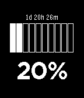
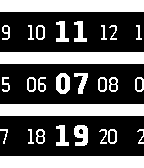
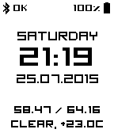
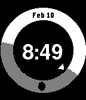
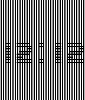

---
hide:
  - toc
---

<!-- Generated by scripts/update_app_directory.py: do not edit by hand -->
# Pebble Watchfaces: S

[← All Pebble Watchfaces](../watchfaces.md) · [A](a.md) · [B](b.md) · [C](c.md) · [D](d.md) · [E](e.md) · [F](f.md) · [G](g.md) · [H](h.md) · [I](i.md) · [J](j.md) · [K](k.md) · [L](l.md) · [M](m.md) · [N](n.md) · [O](o.md) · [P](p.md) · [Q](q.md) · [R](r.md) · **S** · [T](t.md) · [U](u.md) · [V](v.md) · [W](w.md) · [X](x.md) · [Y](y.md) · [Z](z.md) · [0–9 & other](other.md)

*322 watchfaces · Last updated 2026-10-06 · [About these lists](../about-app-lists.md)*

<h2 class="app-name" id="app-67cd0e8ed2acb302d5ba821f"><a href="https://apps.rebble.io/en_US/application/67cd0e8ed2acb302d5ba821f">S4W</a></h2>
<a class="app-source" href="https://github.com/less-ly/s4w" title="Source code" data-search-exclude>View source</a>

by <a href="https://apps.rebble.io/en_US/developer/67c9fbda899ef10009ea6864/1" title="More from this developer">m1k</a>

Not checked yet v1.0 Updated 2025-03-09 Rebble App Store

Runs on: Round 2, Time 2, Time Round, Time

Simple Solar System Simulation Watchface. Heliocentric and persistent. The simulation that runs, if you so choose, locally on your smartwatch is updated on a daily basis. With actual astronomical…

<h2 class="app-name" id="app-7bd38b308b9d4aa0b7e8b209"><a href="https://apps.repebble.com/7bd38b308b9d4aa0b7e8b209">Saint Expeditus</a></h2>
<a class="app-source" href="https://github.com/b-bayport/pebble_saint-expeditus" title="Source code" data-search-exclude>View source</a>

by <a href="https://apps.repebble.com/apps/dev/bayport_03559efbed7009e6e0cfe6de" title="More from this developer">Bayport</a>

No licence v1.0.0 Updated 2026-06-08

Runs on: Round 2, Time 2, Pebble 2 Duo, Pebble 2, Time Round, Time, Classic

Saint Expeditus. You who are a Holy warrior. You who are the Saint of the afflicted. You who are the Saint of the desperate, you who are the Saint of urgent causes, Protect me, Help me, Give me…

<h2 class="app-name" id="app-0bd92532c7a04f1fadba71a1"><a href="https://apps.repebble.com/0bd92532c7a04f1fadba71a1">Sakta</a></h2>
<a class="app-source" href="https://github.com/cfarvidson/pebble-sakta" title="Source code" data-search-exclude>View source</a>

by <a href="https://apps.repebble.com/apps/dev/carl-fredrik-arvidson_8030a3976177840c1696a0f5" title="More from this developer">Carl-Fredrik Arvidson</a>

Not checked yet v1.0.0 Updated 2026-09-24

Runs on: Time 2

24-hour watchface with a single hand for Pebble Time 2, inspired by the slow Jo 17 and slow Mo 02. One rotation per day: noon at the top, midnight at the bottom. Cream, white or black dial…

<h2 class="app-name" id="app-55ee43ca2b0b31d03c000083"><a href="https://apps.repebble.com/55ee43ca2b0b31d03c000083">Sakuya</a></h2>
<a class="app-source" href="https://github.com/kennydo/sakuya-watchface" title="Source code" data-search-exclude>View source</a>

by <a href="https://apps.repebble.com/apps/dev/kenny_550c6b9edeb0ad13ce00002d" title="More from this developer">Kenny</a>

Not checked yet v1.0 Updated 2015-09-08

Runs on: Time 2, Time

A simple watchface that shows you the time, the date, and a small calendar.

<h2 class="app-name" id="app-5656c00d7ffb06349d00005a"><a href="https://apps.repebble.com/5656c00d7ffb06349d00005a">salad fingers</a></h2>
<a class="app-source" href="https://github.com/rafagarciag/pebble-saladfingers" title="Source code" data-search-exclude>View source</a>

by <a href="https://apps.repebble.com/apps/dev/rgarcia_55b7fcf3aa7edd96a800009d" title="More from this developer">rgarcia</a>

Not checked yet v1.0 Updated 2015-11-26

Runs on: Round 2, Time 2, Pebble 2 Duo, Pebble 2, Time Round, Time, Classic

Salad fingers and his friends, also the current time, on your wrist

<h2 class="app-name" id="app-53e63c5340d3d35e2700009a"><a href="https://apps.repebble.com/53e63c5340d3d35e2700009a">Saltire</a></h2>
<a class="app-source" href="https://github.com/lvx3/pebble-saltire" title="Source code" data-search-exclude>View source</a>

by <a href="https://apps.repebble.com/apps/dev/lee-turner_53058c84b704cb5227000071" title="More from this developer">Lee Turner</a>

Not checked yet v1.0 Updated 2014-08-09

Runs on: Time 2, Pebble 2 Duo, Pebble 2, Time, Classic

Scotland&#x27;s national flag, on your wrist.

<h2 class="app-name" id="app-682ea4a4956ef60009734fa8"><a href="https://apps.rebble.io/en_US/application/682ea4a4956ef60009734fa8">Sam</a></h2>
<a class="app-source" href="https://github.com/b123400/sam" title="Source code" data-search-exclude>View source</a>

by <a href="https://apps.rebble.io/en_US/developer/52f044741ac79491190010f0/1" title="More from this developer">b123400</a>

GPL-3.0 v1.0.1 Updated 2026-06-28 Rebble App Store

Runs on: Round 2, Time 2, Pebble 2 Duo, Pebble 2, Time Round, Time, Classic

An abstract watch face. Hours is indicated by the upper shapes, the total number of edge = the current hour. e.g. triangle (3) + square(4) = 7 o&#x27;clock. Minutes is similar and the base unit is 5…

<h2 class="app-name" id="app-52e4ce3a8af579436a000259"><a href="https://apps.repebble.com/52e4ce3a8af579436a000259">sandglass</a></h2>
<a class="app-source" href="https://github.com/zinziroge/sandglass_watchface" title="Source code" data-search-exclude>View source</a>

by <a href="https://apps.repebble.com/apps/dev/zinziroge_52bd5ac5fbe3f84746000068" title="More from this developer">zinziroge</a>

Not checked yet v1.1 Updated 2014-01-26

Runs on: Time 2, Pebble 2 Duo, Pebble 2, Time, Classic

Sandglass Watchface - No time text. - Sand finish flowing down every an hour. - There is some gimmic. When you tap the Pebble, bottom sand become flat. - Sandglass rotates every an hour.

<h2 class="app-name" id="app-69d08546afd8430009d9a1ef"><a href="https://apps.rebble.io/en_US/application/69d08546afd8430009d9a1ef">Sands of Time</a></h2>
<a class="app-source" href="https://github.com/FlynnD273/pebble-sands-of-time" title="Source code" data-search-exclude>View source</a>

by <a href="https://apps.rebble.io/en_US/developer/67bd48a737d408000a74f7d7/1" title="More from this developer">Flynn Duniho</a>

No licence v1.2 Updated 2026-04-10 Rebble App Store

Runs on: Round 2, Time 2, Pebble 2 Duo, Pebble 2, Time Round, Time, Classic

Combines a sand simulator with a simple watchface.

<h2 class="app-name" id="app-53554676c55d5a399e000058"><a href="https://apps.repebble.com/53554676c55d5a399e000058">SAO2</a></h2>
<a class="app-source" href="https://github.com/tapresle/SAO2Face" title="Source code" data-search-exclude>View source</a>

by <a href="https://apps.repebble.com/apps/dev/ted-presley_53508e68dfb1642804000077" title="More from this developer">Ted Presley</a>

Not checked yet v1.2 Updated 2014-04-25

Runs on: Time 2, Pebble 2 Duo, Pebble 2, Time, Classic

My second watch face featuring artwork from Sword Art Online. Enjoy!

<h2 class="app-name" id="app-56be88abc85a7ed9b4000033"><a href="https://apps.repebble.com/56be88abc85a7ed9b4000033">Satanik</a></h2>
<a class="app-source" href="https://cloudpebble.net/ide/project/301920#" title="Source code" data-search-exclude>View source</a>

by <a href="https://apps.repebble.com/apps/dev/weaversway_55a535727c789dc73300001b" title="More from this developer">weaversway</a>

See source v1.0 Updated 2016-02-13

Runs on: Round 2, Time 2, Pebble 2 Duo, Pebble 2, Time Round, Time, Classic

Hail Satan

<h2 class="app-name" id="app-593448abb67f9f814d0009c5"><a href="https://apps.rebble.io/en_US/application/593448abb67f9f814d0009c5">Satellite Poems (On Your Wrist is the Universe)</a></h2>
<a class="app-source" href="https://github.com/zeitkunst/satpoems-watchface" title="Source code" data-search-exclude>View source</a>

by <a href="https://apps.rebble.io/en_US/developer/585045b977324b357a0004ae/1" title="More from this developer">Nicholas Knouf</a>

Not checked yet v0.1 Updated 2017-06-04 Rebble App Store

Runs on: Time 2, Pebble 2 Duo, Pebble 2, Time, Classic

(Follow | Feel | Know | Watch | Understand) the satellites above through computer-generated poetry. On Your Wrist is the Universe: Satellite Poems is a watchface that generates new poems based on…

<h2 class="app-name" id="app-557395787d6f3d41a00000d6"><a href="https://apps.repebble.com/557395787d6f3d41a00000d6">Saturn</a></h2>
<a class="app-source" href="https://github.com/gretchycat/DarkSide" title="Source code" data-search-exclude>View source</a>

by <a href="https://apps.repebble.com/apps/dev/gretchycat_52bf60060136db31fb0000d3" title="More from this developer">Gretchycat</a>

Not checked yet v3.0 Updated 2015-10-19

Runs on: Time 2, Pebble 2 Duo, Pebble 2, Time, Classic

Featuring the magnificence of our 6th planet, Saturn! Features a 2 week calendar, and when you shake or tap, see a 5 day weather forecast. Tap again for sunrise, sunset and moon phase. Tap a third…

<h2 class="app-name" id="app-5739ed4cc7050e9150000013"><a href="https://apps.repebble.com/5739ed4cc7050e9150000013">Save Time</a></h2>
<a class="app-source" href="https://github.com/nicktikhonov/pebble-save-time" title="Source code" data-search-exclude>View source</a>

by <a href="https://apps.repebble.com/apps/dev/nick-tikhonov_53092023fa74421daa0006a5" title="More from this developer">Nick Tikhonov</a>

Not checked yet v1.0 Updated 2016-05-16

Runs on: Round 2, Time 2, Pebble 2 Duo, Pebble 2, Time Round, Time, Classic

Unofficial RescueTime watchface for your Pebble Time and Time Steel. Keep track of your productivity score and total work time from your wrist!

<h2 class="app-name" id="app-67cce507d2acb302d5ba8203"><a href="https://apps.repebble.com/67cce507d2acb302d5ba8203">scallop</a></h2>
<a class="app-source" href="https://github.com/hiddej2/scallop" title="Source code" data-search-exclude>View source</a>

by <a href="https://apps.repebble.com/apps/dev/hiddej2_67ccd58b3d8dd90009b16f2a" title="More from this developer">hiddej2</a>

Not checked yet v1.1 Updated 2025-03-22

Runs on: Round 2, Time 2, Pebble 2 Duo, Pebble 2, Time Round, Time, Classic

Android Clock Scallop Widget inspired - customizable watchface. (shows the seconds - not battery life friendly!)

<h2 class="app-name" id="app-5419a9ecd7eda443fb0001dd"><a href="https://apps.repebble.com/5419a9ecd7eda443fb0001dd">Scampi Watch</a></h2>
<a class="app-source" href="https://github.com/david0932/MyPebbleFace/blob/master/main.c" title="Source code" data-search-exclude>View source</a>

by <a href="https://apps.repebble.com/apps/dev/david-wang_541248e2715369243200000c" title="More from this developer">David Wang</a>

Not checked yet v1.0 Updated 2014-09-17

Runs on: Time 2, Pebble 2 Duo, Pebble 2, Time, Classic

This is a bike team mark.

<h2 class="app-name" id="app-5348115ae311a6ddb4000076"><a href="https://apps.repebble.com/5348115ae311a6ddb4000076">Scarlett Johansson</a></h2>
<a class="app-source" href="https://github.com/thunderchild7/ScarJo" title="Source code" data-search-exclude>View source</a>

by <a href="https://apps.repebble.com/apps/dev/oliver-bowe_52cdaf6f0b54dbbe46000001" title="More from this developer">Oliver Bowe</a>

Not checked yet v1.0.1 Updated 2014-04-12

Runs on: Time 2, Pebble 2 Duo, Pebble 2, Time, Classic

Basic Scarlett Johansson watchface, digital time display, a light tap will briefly show the date, and a battery status indicator.

<h2 class="app-name" id="app-540a3b12c7980ced84000021"><a href="https://apps.repebble.com/540a3b12c7980ced84000021">School Schedule</a></h2>
<a class="app-source" href="https://github.com/rhuffy/School-Schedule/" title="Source code" data-search-exclude>View source</a>

by <a href="https://apps.repebble.com/apps/dev/rhuffy_52cb1fe8e2dd020cb1000044" title="More from this developer">RHuffy</a>

Not checked yet v1.0 Updated 2014-09-05

Runs on: Time 2, Pebble 2 Duo, Pebble 2, Time, Classic

This watchface allows you to enter in your daily schedule, and it displays how much time is remaining in the current time block. A quick glance at your Pebble will tell you exactly how much time…

<h2 class="app-name" id="app-54f07932f44e0d1c1d00005b"><a href="https://apps.repebble.com/54f07932f44e0d1c1d00005b">School Schedule for Pebble</a></h2>
<a class="app-source" href="https://github.com/Stubenhocker1399/school-schedule-for-pebble" title="Source code" data-search-exclude>View source</a>

by <a href="https://apps.repebble.com/apps/dev/stubenhocker_53832852b422c86073000076" title="More from this developer">Stubenhocker</a>

No licence v1.1 Updated 2015-02-27

Runs on: Time 2, Pebble 2 Duo, Pebble 2, Time, Classic

This watchface shows your classes for today (left side) and tomorrow (right side), changing between even and uneven weeks. It currently has no settings, so you&#x27;re required to download the source…

<h2 class="app-name" id="app-52f5396da991ccfb8b0009e4"><a href="https://apps.repebble.com/52f5396da991ccfb8b0009e4">School Time</a></h2>
<a class="app-source" href="https://github.com/Ben624/SchoolTime" title="Source code" data-search-exclude>View source</a>

by <a href="https://apps.repebble.com/apps/dev/ben624_52d175a22fb695644200003d" title="More from this developer">Ben624</a>

No licence v6.1 Updated 2015-12-21

Runs on: Round 2, Time 2, Pebble 2 Duo, Pebble 2, Time Round, Time, Classic

SchoolTime allows you to see the time left in each period. The configuration page allows you to change: - Class Names - Background Color - Bluetooth/Battery Visibility - Toggle Bluetooth Alarm…

<h2 class="app-name" id="app-54bbbc364de4630b5300002e"><a href="https://apps.repebble.com/54bbbc364de4630b5300002e">Schwitzerdütsch</a></h2>
<a class="app-source" href="https://github.com/nahakiole/schwitzerduetsch" title="Source code" data-search-exclude>View source</a>

by <a href="https://apps.repebble.com/apps/dev/robin-glauser_54b7a5546466aa13fd000031" title="More from this developer">Robin Glauser</a>

Not checked yet v1.5 Updated 2015-01-26

Runs on: Time 2, Pebble 2 Duo, Pebble 2, Time, Classic

A watchface with swiss german (bernisch) words to show the time.

<h2 class="app-name" id="app-585014b577324b357a000483"><a href="https://apps.repebble.com/585014b577324b357a000483">Schwitzerdütsch 3.0</a></h2>
<a class="app-source" href="https://github.com/nahakiole/schwitzerduetsch" title="Source code" data-search-exclude>View source</a>

by <a href="https://apps.repebble.com/apps/dev/robin-glauser_54b7a5546466aa13fd000031" title="More from this developer">Robin Glauser</a>

Not checked yet v3.0 Updated 2016-12-13

Runs on: Round 2, Time 2, Pebble 2 Duo, Pebble 2, Time Round, Time, Classic

A watchface which display the time in swissgerman (Schwitzerdütsch). New in Version 3.0 is a more accurate and precise minute timing. Instead of displaying &quot;zäh vor nüni&quot; at 8:52 it now displays…

<h2 class="app-name" id="app-5803a5e19392ff5e5b000070"><a href="https://apps.repebble.com/5803a5e19392ff5e5b000070">Scott Pilgrim Colour</a></h2>
<a class="app-source" href="https://github.com/TerttyCurlyfries/SCOTT-PILGRIM-Colour" title="Source code" data-search-exclude>View source</a>

by <a href="https://apps.repebble.com/apps/dev/stanivision-inc_52d4acb6d8d9dfc9e000002a" title="More from this developer">Stanivision Inc.</a>

No licence v1.0 Updated 2016-12-21

Runs on: Round 2, Time 2, Time Round, Time

Every pilgrim&#x27;s journey comes to an end... ------------------------------------------- Based on the hit watchface by Jon Tilton, Scott Pilgrim, SCOTT PILGRIM! Colour brings everyone&#x27;s favorite…

<h2 class="app-name" id="app-54fbc30de62469551c0000ea"><a href="https://apps.repebble.com/54fbc30de62469551c0000ea">Scrabble Two Letters</a></h2>
<a class="app-source" href="https://github.com/dantasse/scrabble_two_letters" title="Source code" data-search-exclude>View source</a>

by <a href="https://apps.repebble.com/apps/dev/dan-tasse_531b0c3f6b9bbebb750001e1" title="More from this developer">Dan Tasse</a>

Not checked yet v1.0 Updated 2015-03-09

Runs on: Time 2, Pebble 2 Duo, Pebble 2, Time, Classic

Shows two-letter words, one per minute, so you can learn them for playing word games. Contains all 105 two-letter words that are legal in the Official Scrabble Dictionary, OSPD5. (For two-letter…

<h2 class="app-name" id="app-57ebe9ca8eaf90fc03000090"><a href="https://apps.repebble.com/57ebe9ca8eaf90fc03000090">ScreepsTime</a></h2>
<a class="app-source" href="https://github.com/bthaase/ScreepsTime" title="Source code" data-search-exclude>View source</a>

by <a href="https://apps.repebble.com/apps/dev/brian-haase_57d1e5b1ffca49beb5000010" title="More from this developer">Brian Haase</a>

No licence v1.8 Updated 2016-10-07

Runs on: Round 2, Time 2, Pebble 2 Duo, Pebble 2, Time Round, Time

WARNING - This Watchface is designed specifically for use with Screeps.com, an online programming MMORTS. If you do not have a game account, this watchface is not for you. You MUST read the…

<h2 class="app-name" id="app-6ab94fee3a48fe0009c46220"><a href="https://apps.rebble.io/en_US/application/6ab94fee3a48fe0009c46220">SDF Fuzzy Text</a></h2>
<a class="app-source" href="https://github.com/utessel/SDF-Fuzzy-Text" title="Source code" data-search-exclude>View source</a>

by <a href="https://apps.rebble.io/en_US/developer/561296af1cdcfc9faa0000a4/1" title="More from this developer">Uli T</a>

Not checked yet v4.0.1 Updated 2026-10-03 Rebble App Store

Runs on: Time 2

Fuzzy Text with nice large fonts using Signed Distance Fields and animated transitions

<h2 class="app-name" id="app-68354a1892baf2000a22be0f"><a href="https://apps.repebble.com/68354a1892baf2000a22be0f">Sea Lines</a></h2>
<a class="app-source" href="https://github.com/justinjhendrick/sea-lines-pebble-watchface" title="Source code" data-search-exclude>View source</a>

by <a href="https://apps.repebble.com/apps/dev/justinjhendrick_67f68b8a23b7a90009c87db5" title="More from this developer">justinjhendrick</a>

Not checked yet v1.9.0 Updated 2026-06-06

Runs on: Round 2, Time 2, Pebble 2 Duo, Pebble 2, Time Round, Time, Classic

A colorful analog watchface inspired by the Swatch &quot;Trendy Lines At Night&quot;

<h2 class="app-name" id="app-90864dbd74a34d2890e11e99"><a href="https://apps.repebble.com/90864dbd74a34d2890e11e99">Seasonal Hours Clock</a></h2>
<a class="app-source" href="https://gitea.polonkai.eu/gergely/pebble-seasonal-clock" title="Source code" data-search-exclude>View source</a>

by <a href="https://apps.repebble.com/apps/dev/gergely-polonkai_a5e2a842b1973e6b17a8fc21" title="More from this developer">Gergely Polonkai</a>

See source v0.3.0 Updated 2026-06-19

Runs on: Round 2, Time 2, Pebble 2 Duo, Pebble 2, Time Round, Time, Classic

Watchface to display the Seasonal Hours (https://seasonalclock.org/)

<h2 class="app-name" id="app-694851d4ce101c0009b63345"><a href="https://apps.rebble.io/en_US/application/694851d4ce101c0009b63345">Seasons clock</a></h2>
<a class="app-source" href="https://github.com/only-meeps/Seasons-Clock-Pebble" title="Source code" data-search-exclude>View source</a>

by <a href="https://apps.rebble.io/en_US/developer/69483fa7eea8e40009e75373/1" title="More from this developer">Meep Apps</a>

Not checked yet v1.5 Updated 2025-12-22 Rebble App Store

Runs on: Round 2, Time 2, Pebble 2 Duo, Pebble 2, Time Round, Time, Classic

A simple clock to show the different seasons! Uses a simple Meeus algorithm that runs once a year to get the times of the different seasons! Credit to @Yadis# on discord for coming up with the idea!

<h2 class="app-name" id="app-53e53089ca9f07e53c000166"><a href="https://apps.repebble.com/53e53089ca9f07e53c000166">Second Progress</a></h2>
<a class="app-source" href="https://drive.google.com/file/d/0B8uA5rnPu1hmNnZYOFdqbkExaG8/edit?usp=sharing" title="Source code" data-search-exclude>View source</a>

by <a href="https://apps.repebble.com/apps/dev/tim-emanuel_53d97b9f8ace930a620001ad" title="More from this developer">Tim Emanuel</a>

See source v1.0.0 Updated 2014-08-08

Runs on: Time 2, Pebble 2 Duo, Pebble 2, Time, Classic

A simple face I did just to learn development, but it works so I thought I&#x27;d make it available. It&#x27;s got date, time, a progress bar for seconds, battery level and a lightning bolt when charging…

<h2 class="app-name" id="app-52f23c6ce21be4b82000138e"><a href="https://apps.repebble.com/52f23c6ce21be4b82000138e">sector</a></h2>
<a class="app-source" href="https://cloudpebble.net/ide/project/22031#" title="Source code" data-search-exclude>View source</a>

by <a href="https://apps.repebble.com/apps/dev/eric-bergelin_52cc26b045ffdd1c56000157" title="More from this developer">Eric BERGELIN</a>

See source v2.0.0 Updated 2014-02-16

Runs on: Time 2, Pebble 2 Duo, Pebble 2, Time, Classic

Plain and obvious sector watch, time is displayed by a sector between hour and minute hand. Polar or pie clock, originally way to wear time.

<h2 class="app-name" id="app-55a01d53afd08e8cd5000058"><a href="https://apps.repebble.com/55a01d53afd08e8cd5000058">segcirc</a></h2>
<a class="app-source" href="https://github.com/FSMaxB/segcirc" title="Source code" data-search-exclude>View source</a>

by <a href="https://apps.repebble.com/apps/dev/fsmaxb_54857e594fe7791e44000071" title="More from this developer">FSMaxB</a>

GPL-3.0 v0.9 Updated 2015-07-10

Runs on: Time 2, Pebble 2 Duo, Pebble 2, Time, Classic

Circular watchface inspired by studioclock. It uses the german date and weekday format. Known Bug: The digits 3 and 7 get displayed incorrectly in the date.

<h2 class="app-name" id="app-6abf42344412b30009377a5f"><a href="https://apps.rebble.io/en_US/application/6abf42344412b30009377a5f">Segment</a></h2>
<a class="app-source" href="https://github.com/cmalec/segment-watchface" title="Source code" data-search-exclude>View source</a>

by <a href="https://apps.rebble.io/en_US/developer/6aaf0376ed67e90009f5a8d9/1" title="More from this developer">cmalec</a>

Not checked yet v1.0.0 Updated 2026-10-02 Rebble App Store

Runs on: Time 2

Segment is a seven-segment digital watchface for the Pebble Time 2, in the spirit of the classic 91 Dub. The clock is a large seven-segment readout with an optional seconds row. The row above it…

<h2 class="app-name" id="app-560ae4754d43a36393000001"><a href="https://apps.repebble.com/560ae4754d43a36393000001">Segment</a></h2>
<a class="app-source" href="https://github.com/keegan-lillo/segment" title="Source code" data-search-exclude>View source</a>

by <a href="https://apps.repebble.com/apps/dev/keegan_52dc5c3119ed61877c00001b" title="More from this developer">Keegan</a>

Not checked yet v3.0 Updated 2018-02-10

Runs on: Round 2, Time 2, Pebble 2 Duo, Pebble 2, Time Round, Time, Classic

Hours are the shown as a number filling the whole display. Minutes are shown behind the hour in the middle Fully customizable colors with 6 presets ready to go. Screenshots show: - 2:14 - 4:44 …

<h2 class="app-name" id="app-52d8bbeb1acbf3738d000030"><a href="https://apps.repebble.com/52d8bbeb1acbf3738d000030">Segment Six</a></h2>
<a class="app-source" href="https://github.com/pebble/pebble-sdk-examples/tree/master/watchfaces/segment_six" title="Source code" data-search-exclude>View source</a>

by <a href="https://apps.repebble.com/apps/dev/pebble_52d8a44faef8d590d3000029" title="More from this developer">Pebble</a>

Not checked yet v2.0.0 Updated 2014-01-17

Runs on: Time 2, Pebble 2 Duo, Pebble 2, Time, Classic

Segment Six Example Watchface

<h2 class="app-name" id="app-7bd156396b3649bc9612992d"><a href="https://apps.repebble.com/7bd156396b3649bc9612992d">Segmented Info</a></h2>
<a class="app-source" href="https://github.com/clbwhazzup/the-pebble-watchface" title="Source code" data-search-exclude>View source</a>

by <a href="https://apps.repebble.com/apps/dev/clbwhazzup_4dfd3d3f6f2f98c35e1cc0c8" title="More from this developer">clbwhazzup</a>

Not checked yet v1.3 Updated 2026-09-10

Runs on: Time 2, Pebble 2 Duo, Pebble 2, Time, Classic

A Very Informative Watchface * Toggle / options for every display element (except time) * Temperature, high/low, humidity, precipitation %, conditions icon, sunrise and sunset times, served from…

<h2 class="app-name" id="app-55dd71ef4374cb4eb300000f"><a href="https://apps.repebble.com/55dd71ef4374cb4eb300000f">Segments</a></h2>
<a class="app-source" href="https://github.com/stevenschmatz/segments" title="Source code" data-search-exclude>View source</a>

by <a href="https://apps.repebble.com/apps/dev/steven-schmatz_52fecd72c7c81b6aaa00001e" title="More from this developer">Steven Schmatz</a>

Not checked yet v1.0 Updated 2015-08-26

Runs on: Time 2, Pebble 2 Duo, Pebble 2, Time, Classic

Segments is a simple watchface that counts the day down in 6 minute blocks. There are 240 of these blocks in a day – an easily number to comprehend. Better than 86,400 seconds in a day, and more…

<h2 class="app-name" id="app-549da9eb112793a2d40002e9"><a href="https://apps.repebble.com/549da9eb112793a2d40002e9">SeklerHungarianScript</a></h2>
<a class="app-source" href="https://github.com/aattila/PebbleSeklerHunSript" title="Source code" data-search-exclude>View source</a>

by <a href="https://apps.repebble.com/apps/dev/attila-antal_54731e10a3ce2ff2b4000056" title="More from this developer">Attila Antal</a>

No licence v1.1 Updated 2014-12-26

Runs on: Time 2, Pebble 2 Duo, Pebble 2, Time, Classic

Old Sekler-Hungarian script watchface.

<h2 class="app-name" id="app-57f4043e3c754a8b010000d7"><a href="https://apps.repebble.com/57f4043e3c754a8b010000d7">Selina Int</a></h2>
<a class="app-source" href="https://github.com/maxmoseley23/Selina1" title="Source code" data-search-exclude>View source</a>

by <a href="https://apps.repebble.com/apps/dev/maxwell-moseley_57afcb76bb85ed5f9b0003fc" title="More from this developer">Maxwell Moseley</a>

Not checked yet v1.7 Updated 2016-10-26

Runs on: Round 2, Time 2, Pebble 2 Duo, Pebble 2, Time Round, Time, Classic

A watchface I made for my Sister. Bare essentials only - time, date, weekday, battery, and connection state. The Watch will vibrate upon disconnection and the OK status will disappear. Languages…

<h2 class="app-name" id="app-9b7ac780780d485ba043c9d0"><a href="https://apps.repebble.com/9b7ac780780d485ba043c9d0">Sense Time</a></h2>
<a class="app-source" href="https://github.com/Moaske/PebbleSenseTime" title="Source code" data-search-exclude>View source</a>

by <a href="https://apps.repebble.com/apps/dev/moaske_3f1bf0845ffec82a2a96f91c" title="More from this developer">Moaske</a>

No licence v1.1.3 Updated 2026-08-22

Runs on: Time 2

HTC Sense watchface with that legendary Flip Clock widget of the good old days when you could find this on both Android and Windows Mobile phones 🤖🪟 (For Time2 / Emery only) ☀️ Large Flip Clock…

<h2 class="app-name" id="app-53e8dec01f0b519ff80000d0"><a href="https://apps.repebble.com/53e8dec01f0b519ff80000d0">Sensible</a></h2>
<a class="app-source" href="https://github.com/tonyb486/sensible" title="Source code" data-search-exclude>View source</a>

by <a href="https://apps.repebble.com/apps/dev/anthony-biondo_537f582671da20f0da000129" title="More from this developer">Anthony Biondo</a>

Not checked yet v1.0.0 Updated 2014-08-11

Runs on: Time 2, Pebble 2 Duo, Pebble 2, Time, Classic

A simple watchface based on Simplicity. It adds the day of the week, and icons that only appear when needed to indicate low battery or disconnected bluetooth.

<h2 class="app-name" id="app-625a9f4780fa4c5aadee223f"><a href="https://apps.repebble.com/625a9f4780fa4c5aadee223f">Serene Boater</a></h2>
<a class="app-source" href="https://github.com/coredevices/pebble-watchface-agent-skill" title="Source code" data-search-exclude>View source</a>

by <a href="https://apps.repebble.com/apps/dev/aircodum_67bc77bf37d408000a74f7d3" title="More from this developer">AirCodum</a>

Not checked yet v1.4.0 Updated 2026-04-14

Runs on: Time 2

A serene watchface featuring a boater with a straw hat rowing calmly on open water. Distant hills and trees on the horizon, shimmering water with ripples, drifting clouds, and two dolphins that…

<h2 class="app-name" id="app-9657a1fd4a6c46119e295779"><a href="https://apps.repebble.com/9657a1fd4a6c46119e295779">Serene Waterfall</a></h2>
<a class="app-source" href="https://github.com/coredevices/pebble-watchface-agent-skill" title="Source code" data-search-exclude>View source</a>

by <a href="https://apps.repebble.com/apps/dev/aircodum_67bc77bf37d408000a74f7d3" title="More from this developer">AirCodum</a>

Not checked yet v1.0.0 Updated 2026-06-27

Runs on: Time 2

A serene animated waterfall cascades through lush jungle and breaks over a mossy boulder with the time carved into it. Shows the day, date and battery, with continuously flowing water, drifting…

<h2 class="app-name" id="app-5681b745e08e4838ac00008b"><a href="https://apps.repebble.com/5681b745e08e4838ac00008b">sfclock for Pebble</a></h2>
<a class="app-source" href="https://github.com/bogdanorzea/sfclock" title="Source code" data-search-exclude>View source</a>

by <a href="https://apps.repebble.com/apps/dev/bogdan-orzea_5482eceb0748a15e57000091" title="More from this developer">Bogdan Orzea</a>

GPL-2.0 v1.9 Updated 2016-03-14

Runs on: Time 2, Time

A simple and customisable watchface that supports: - 12-H / 24-H time format; - date display; - weather information from OpenWeatherMap; - custom text display; - battery info; - hourly vibration…

<h2 class="app-name" id="app-58c2f7110dfc32a52a00081f"><a href="https://apps.rebble.io/en_US/application/58c2f7110dfc32a52a00081f">Sfera</a></h2>
<a class="app-source" href="https://github.com/dieghernan/Sfera" title="Source code" data-search-exclude>View source</a>

by <a href="https://apps.rebble.io/en_US/developer/52f15b6dc41172eebc0004dc/1" title="More from this developer">dieghernan</a>

Not checked yet v6.2 Updated 2018-03-13 Rebble App Store

Runs on: Round 2, Time Round

* Consider ♥ if you enjoy this watchface * Sfera is a highly customizable watchface that gets the most of the smartwatch capabilities: Settings - Clock Mode: Analog / Digital /Dual/ Mix watchface…

<h2 class="app-name" id="app-55fbe95c5150be7a9a00005c"><a href="https://apps.repebble.com/55fbe95c5150be7a9a00005c">SG Haze Watch</a></h2>
<a class="app-source" href="https://github.com/sausheong/sghaze" title="Source code" data-search-exclude>View source</a>

by <a href="https://apps.repebble.com/apps/dev/chang-sau-sheong_52f0214f4ae363f5c9000618" title="More from this developer">Chang Sau Sheong</a>

Not checked yet v1.3 Updated 2015-09-21

Runs on: Time 2, Pebble 2 Duo, Pebble 2, Time, Classic

Simple watchface plus real-time Singapore PSI (Pollution Standard Index) numbers as provided by NEA. Top line represents the hourly PSI numbers in the north, west, center, east and south regions…

<h2 class="app-name" id="app-554fca829d1dd78858000091"><a href="https://apps.repebble.com/554fca829d1dd78858000091">SG Steel</a></h2>
<a class="app-source" href="https://github.com/stevegroves123/Steel_words" title="Source code" data-search-exclude>View source</a>

by <a href="https://apps.repebble.com/apps/dev/stevegroves123_53785d26a434795600000045" title="More from this developer">Stevegroves123</a>

Not checked yet v1.42 Updated 2015-05-10

Runs on: Time 2, Pebble 2 Duo, Pebble 2, Time, Classic

Simple watch face created to show the time

<h2 class="app-name" id="app-55d633b089b39e1008000024"><a href="https://apps.repebble.com/55d633b089b39e1008000024">Shadow Analog</a></h2>
<a class="app-source" href="https://github.com/ygalanter/Shadow_Analog" title="Source code" data-search-exclude>View source</a>

by <a href="https://apps.repebble.com/apps/dev/comfortably-numb_52f547605101128b2200005a" title="More from this developer">Comfortably Numb</a>

Not checked yet v1.5 Updated 2016-06-10

Runs on: Round 2, Time 2, Pebble 2 Duo, Pebble 2, Time Round, Time, Classic

- Simple analog watchface with shadow effect.

<h2 class="app-name" id="app-5546a140f17601c9380000d5"><a href="https://apps.repebble.com/5546a140f17601c9380000d5">Shadow of the Colossus Watchface</a></h2>
<a class="app-source" href="https://github.com/ITaparia/Pebble-Development/tree/SotC_WatchFace" title="Source code" data-search-exclude>View source</a>

by <a href="https://apps.repebble.com/apps/dev/ishan-taparia_547eb4213688a2a318000167" title="More from this developer">Ishan Taparia</a>

No licence v1.0 Updated 2015-05-03

Runs on: Time 2, Pebble 2 Duo, Pebble 2, Time, Classic

This is a very simple watch face, made for the fans of the popular video game: Shadow of the Colossus! *Features* - Simple Digital Clock - Date Display (Month/Day) - Battery Level Indicator …

<h2 class="app-name" id="app-56ca9d04f8174e9645000010"><a href="https://apps.repebble.com/56ca9d04f8174e9645000010">Shadow Time</a></h2>
<a class="app-source" href="https://github.com/BenKesselring/Shadow_Time/" title="Source code" data-search-exclude>View source</a>

by <a href="https://apps.repebble.com/apps/dev/ben-kesselring_563ad9791db95bfbc0000024" title="More from this developer">Ben Kesselring</a>

No licence v1.03 Updated 2016-02-29

Runs on: Round 2, Time 2, Time Round, Time

This watchface displays hours and minutes offset from one another and casting a shadow, and displays the date on a bar along the top of the screen. It is based on Yuriy Galanter&#x27;s watchface, &quot;Long…

<h2 class="app-name" id="app-539d4f4d126758204b000124"><a href="https://apps.repebble.com/539d4f4d126758204b000124">Shanghai China Pollution PM2.5 Air Quality Index</a></h2>
<a class="app-source" href="https://github.com/maverick2000/shanghai_pollution_pebble_watchface" title="Source code" data-search-exclude>View source</a>

by <a href="https://apps.repebble.com/apps/dev/codemonkey_53145f75ce084fb31a000166" title="More from this developer">Codemonkey</a>

Not checked yet v1.0.0 Updated 2014-06-15

Runs on: Time 2, Pebble 2 Duo, Pebble 2, Time, Classic

Displays the current Air Quality Index, PM2.5 hourly and 24 hour concentrations along with the current time.

<h2 class="app-name" id="app-9cc1f2cb2f78476f8bcbca70"><a href="https://apps.repebble.com/9cc1f2cb2f78476f8bcbca70">Shaot Zemaniot</a></h2>
<a class="app-source" href="https://github.com/rosenbergj/pebble-shaot-zemaniot" title="Source code" data-search-exclude>View source</a>

by <a href="https://apps.repebble.com/apps/dev/josh-rosenberg_2bcc0a3741b25faf198da7b8" title="More from this developer">Josh Rosenberg</a>

Not checked yet v1.2.2 Updated 2026-09-30

Runs on: Time 2

A highly configurable watchface showing Shaot Zemaniot, an ancient Jewish form of timekeeping. Alongside the ordinary civil time, this watchface divides the daytime (sunrise to sunset, or sunset…

<h2 class="app-name" id="app-52e0123fdbbbf9518a00015d"><a href="https://apps.repebble.com/52e0123fdbbbf9518a00015d">Shapes</a></h2>
<a class="app-source" href="https://github.com/8a22a/Shapes" title="Source code" data-search-exclude>View source</a>

by <a href="https://apps.repebble.com/apps/dev/8a22a_529c6b5bf7997434c1000021" title="More from this developer">8a22a</a>

No licence v2.0 Updated 2014-01-22

Runs on: Time 2, Pebble 2 Duo, Pebble 2, Time, Classic

Big time using shapes. Read the time by counting the number of the shape&#x27;s sides.

<h2 class="app-name" id="app-5aeb24c5f38588775f000789"><a href="https://apps.rebble.io/en_US/application/5aeb24c5f38588775f000789">Shapes</a></h2>
<a class="app-source" href="https://github.com/b123400/shapes" title="Source code" data-search-exclude>View source</a>

by <a href="https://apps.rebble.io/en_US/developer/52f044741ac79491190010f0/1" title="More from this developer">b123400</a>

MIT v1.1.1 Updated 2026-06-28 Rebble App Store

Runs on: Round 2, Time 2, Pebble 2 Duo, Pebble 2, Time Round, Time, Classic

The shape&#x27;s number of line indicate the current minutes divided by 5, and the background lines indicate the hour.

<h2 class="app-name" id="app-58e491216ca3871e00000587"><a href="https://apps.rebble.io/en_US/application/58e491216ca3871e00000587">Shapes</a></h2>
<a class="app-source" href="https://github.com/mereed/pebbleface-emojishapes" title="Source code" data-search-exclude>View source</a>

by <a href="https://apps.rebble.io/en_US/developer/52d76309bd61272345000001/1" title="More from this developer">chops</a>

Not checked yet v1.1 Updated 2017-06-01 Rebble App Store

Runs on: Round 2, Time 2, Pebble 2 Duo, Pebble 2, Time Round, Time, Classic

It&#x27;s basically just a simple analog watch, with the hands represented by shapes. Hours are represented by the diamond (or smaller square), and minutes the larger square. If shown, seconds are…

<h2 class="app-name" id="app-581896d9c68d0087f800005f"><a href="https://apps.repebble.com/581896d9c68d0087f800005f">Shards</a></h2>
<a class="app-source" href="https://github.com/voseldop/shards" title="Source code" data-search-exclude>View source</a>

by <a href="https://apps.repebble.com/apps/dev/vadim-podlesov_531ae737c5f2c54076000094" title="More from this developer">Vadim Podlesov</a>

Not checked yet v1.2 Updated 2016-11-24

Runs on: Round 2, Time 2, Pebble 2 Duo, Pebble 2, Time Round, Time, Classic

Summary: Watchface with battery meter, digital and analog time and weather. The digital time, weather conditions and current temperature is displayed in the center of watchface. The circle in…

<h2 class="app-name" id="app-69584a4b39d92d0009bb7478"><a href="https://apps.repebble.com/69584a4b39d92d0009bb7478">Shards of Grandeur Watchface</a></h2>
<a class="app-source" href="https://github.com/123outerme/ShardsOfGrandeurPebbleWatchface" title="Source code" data-search-exclude>View source</a>

by <a href="https://apps.repebble.com/apps/dev/123outerme_596a2cc5b67f9f814d001e48" title="More from this developer">123outerme</a>

No licence v1.3.0 Updated 2026-06-06

Runs on: Round 2, Time 2, Pebble 2 Duo, Pebble 2, Time Round, Time, Classic

Shows the date, time, battery level, a charging indicator on the battery bar, Bluetooth connection state, and the last heart rate reading (if supported)! Additionally, the watch will vibrate if…

<h2 class="app-name" id="app-691d860bf5dd2700093ddbbd"><a href="https://apps.repebble.com/691d860bf5dd2700093ddbbd">SHD</a></h2>
<a class="app-source" href="https://github.com/a1291762/shd-pebble" title="Source code" data-search-exclude>View source</a>

by <a href="https://apps.repebble.com/apps/dev/a1291762_68f86970856ddb00087e4aad" title="More from this developer">a1291762</a>

No licence v2.4 Updated 2026-06-04

Runs on: Round 2, Time 2, Pebble 2 Duo, Pebble 2, Time Round, Time, Classic

A watch face based on the loading animation from Tom Clancy&#x27;s The Division.

<h2 class="app-name" id="app-5e28ea933dd3109f151c7e0a"><a href="https://apps.repebble.com/5e28ea933dd3109f151c7e0a">Sheikah Slate - BoTW</a></h2>
<a class="app-source" href="https://github.com/HarrisonAllen/SheikahSlate_PebbleWatchface" title="Source code" data-search-exclude>View source</a>

by <a href="https://apps.repebble.com/apps/dev/harrison-allen_5e28ea923dd3109f151c7e08" title="More from this developer">Harrison Allen</a>

No licence v2.4 Updated 2026-01-04

Runs on: Round 2, Time 2, Pebble 2 Duo, Pebble 2, Time Round, Time, Classic

Put the power of the Sheikah on your wrist! Based on the Sheikah Slate from the Legend of Zelda: Breath of the Wild, this watchface features: -Time and Date Display --Supports both 12 and 24 hour…

<h2 class="app-name" id="app-b6d8a42ffe164d959c661501"><a href="https://apps.repebble.com/b6d8a42ffe164d959c661501">Shinchan</a></h2>
<a class="app-source" href="https://github.com/coredevices/pebble-watchface-agent-skill" title="Source code" data-search-exclude>View source</a>

by <a href="https://apps.repebble.com/apps/dev/aircodum_67bc77bf37d408000a74f7d3" title="More from this developer">AirCodum</a>

Not checked yet v1.2.4 Updated 2026-05-16

Runs on: Time 2

Cartoon kid funny faces watchface. Cycles through 12 silly expressions — one new face every minute. Tap for a random face. Battery indicator in the bottom bar.

<h2 class="app-name" id="app-37e3e88845ae4ea2a6625d25"><a href="https://apps.repebble.com/37e3e88845ae4ea2a6625d25">Shine Through</a></h2>
<a class="app-source" href="https://github.com/soxfox42/shine-through" title="Source code" data-search-exclude>View source</a>

by <a href="https://apps.repebble.com/apps/dev/soxfox42_67de4c3289abe700095df699" title="More from this developer">soxfox42</a>

Not checked yet v1.3 Updated 2026-03-10

Runs on: Round 2, Time 2, Pebble 2 Duo, Pebble 2, Time Round, Time, Classic

Large digits with a neat overlap effect between the hours and minutes. Configurable colors, and options to display date, steps, or battery in the corners.

<h2 class="app-name" id="app-246fae41675540e09e468d19"><a href="https://apps.repebble.com/246fae41675540e09e468d19">Shocker-GPR</a></h2>
<a class="app-source" href="https://github.com/rafaelc007/shocker-gpr" title="Source code" data-search-exclude>View source</a>

by <a href="https://apps.repebble.com/apps/dev/rafael-pereira_dd633264db7cf077fb225583" title="More from this developer">Rafael Pereira</a>

Not checked yet v1.1.1 Updated 2026-06-29

Runs on: Time 2

Watch face based on the more recent G-Shock GPR watches. - Displays time with optional seconds. - Displays a histogram of recent step activity.

<h2 class="app-name" id="app-5664345171fa343175000041"><a href="https://apps.repebble.com/5664345171fa343175000041">ShoMaurice</a></h2>
<a class="app-source" href="https://github.com/ShoobyBan/PebbleShoMaurice" title="Source code" data-search-exclude>View source</a>

by <a href="https://apps.repebble.com/apps/dev/szabolcs-sam-ban_55ae2126f825d3aaf4000038" title="More from this developer">Szabolcs &quot;Sam&quot; Ban</a>

GPL-2.0 v4.3 Updated 2025-11-25

Runs on: Time 2, Pebble 2 Duo, Pebble 2, Time, Classic

Analog watch. Customizable colours, digital display, health (steps) integration, second handle, distinguishable minute and hour handles, day of the week, day of the month, bluetooth connection…

<h2 class="app-name" id="app-55d35a2bb8f18df809000022"><a href="https://apps.repebble.com/55d35a2bb8f18df809000022">ShoOne</a></h2>
<a class="app-source" href="https://github.com/ShoobyBan/PebbleShoOne" title="Source code" data-search-exclude>View source</a>

by <a href="https://apps.repebble.com/apps/dev/szabolcs-sam-ban_55ae2126f825d3aaf4000038" title="More from this developer">Szabolcs &quot;Sam&quot; Ban</a>

No licence v3.1 Updated 2015-08-30

Runs on: Time 2, Pebble 2 Duo, Pebble 2, Time, Classic

This watchface is tailored to my taste. Analog watch with no second handle, rounded and distinguishable minute and hour handles, day of the week, day of the month, bluetooth connection vibration…

<h2 class="app-name" id="app-6de09ae5e76b4e698057584f"><a href="https://apps.repebble.com/6de09ae5e76b4e698057584f">Shoreline</a></h2>
<a class="app-source" href="https://github.com/AKlitbo/pebble-watchfaces" title="Source code" data-search-exclude>View source</a>

by <a href="https://apps.repebble.com/apps/dev/null-syntax_089fa8f469578884846bff5a" title="More from this developer">Null Syntax</a>

AGPL-3.0 v1.3.2 Updated 2026-09-27

Runs on: Round 2, Time 2

-

<h2 class="app-name" id="app-3148c87c68c14295b5e94a7c"><a href="https://apps.repebble.com/3148c87c68c14295b5e94a7c">Showtime</a></h2>
<a class="app-source" href="https://github.com/sirbranedamuj/showtime" title="Source code" data-search-exclude>View source</a>

by <a href="https://apps.repebble.com/apps/dev/sirbranedamuj_6f3d57d8ba08046035a36ec9" title="More from this developer">SirBraneDamuj</a>

Not checked yet v1.0 Updated 2026-04-29

Runs on: Round 2, Time 2

A minimalistic watch face inspired by Paradigm City&#x27;s top negotiator. An AI agent was used to aid in the coding of this watchface.

<h2 class="app-name" id="app-6a505ed550bd250009c6bd8f"><a href="https://apps.repebble.com/6a505ed550bd250009c6bd8f">Shrek Watch</a></h2>
<a class="app-source" href="https://codeberg.org/Krang/Shrek_Watch_for_Pebble" title="Source code" data-search-exclude>View source</a>

by <a href="https://apps.repebble.com/apps/dev/krang_6a50573dc423ad0008ec935c" title="More from this developer">Krang</a>

See source v1.4.6 Updated 2026-08-07

Runs on: Round 2, Time 2, Pebble 2 Duo, Pebble 2, Time, Classic

It&#x27;s Shrek! The mouth opens and closes on the minute. Supports date. Supports 12h and 24h time formats. Supports BW watches, Pebble Time 2 and Pebble Round 2. More to come soon. Design based on…

<h2 class="app-name" id="app-529bf118f33e7653f000000b"><a href="https://apps.repebble.com/529bf118f33e7653f000000b">Side By Side</a></h2>
<a class="app-source" href="https://github.com/Dwarf84396/side_by_side" title="Source code" data-search-exclude>View source</a>

by <a href="https://apps.repebble.com/apps/dev/ben-froman_529befccf33e769ff3000007" title="More from this developer">Ben Froman</a>

No licence v1.0.0 Updated 2013-12-02

Runs on: Time 2, Pebble 2 Duo, Pebble 2, Time, Classic

A simple vertical watch face, displaying both time and date.

<h2 class="app-name" id="app-563bf809d886bbd76400000d"><a href="https://apps.repebble.com/563bf809d886bbd76400000d">Sidereal Watchface</a></h2>
<a class="app-source" href="https://github.com/ste616/pebble-sidereal-watchface" title="Source code" data-search-exclude>View source</a>

by <a href="https://apps.repebble.com/apps/dev/jamie-stevens_560c51379c52a7768a000011" title="More from this developer">Jamie Stevens</a>

Not checked yet v1.2 Updated 2025-11-25

Runs on: Round 2, Time 2, Time Round, Time

Shows times useful for astronomers, including the day of year, local and UTC times, sidereal time (location selectable in the app configuration) and modified Julian date (MJD).

<h2 class="app-name" id="app-f7ab7761bf5e47b98c717f68"><a href="https://apps.repebble.com/f7ab7761bf5e47b98c717f68">Sidereel</a></h2>
<a class="app-source" href="https://github.com/AKlitbo/pebble-watchfaces" title="Source code" data-search-exclude>View source</a>

by <a href="https://apps.repebble.com/apps/dev/null-syntax_089fa8f469578884846bff5a" title="More from this developer">Null Syntax</a>

AGPL-3.0 v1.2.3 Updated 2026-09-27

Runs on: Time 2

-

<h2 class="app-name" id="app-52ba1f15ecdaae6996000010"><a href="https://apps.repebble.com/52ba1f15ecdaae6996000010">Sideways;Watchface</a></h2>
<a class="app-source" href="https://bitbucket.org/Masamune_Shadow/sideways-watchface" title="Source code" data-search-exclude>View source</a>

by <a href="https://apps.repebble.com/apps/dev/spencer-johnson_52ac665331a5fa7c25000006" title="More from this developer">Spencer Johnson</a>

See source v2.0.7 Updated 2014-01-24

Runs on: Time 2, Pebble 2 Duo, Pebble 2, Time, Classic

An evolution of my Sideways Watchface for 2.x, but this time Inspired by Steins;Gate &amp; Nixie Clocks.

<h2 class="app-name" id="app-570d5a9db4a063fc4900002e"><a href="https://apps.repebble.com/570d5a9db4a063fc4900002e">Sierpinski&#x27;s Triangle Watchface</a></h2>
<a class="app-source" href="https://github.com/wackymonkey2/Sierpinski-s-Triangle-Watchface.git" title="Source code" data-search-exclude>View source</a>

by <a href="https://apps.repebble.com/apps/dev/wackymonkey_549c8b91dc93032b8b000896" title="More from this developer">Wackymonkey</a>

Not checked yet v1.0 Updated 2016-04-12

Runs on: Time 2, Pebble 2 Duo, Pebble 2, Time, Classic

This is a basic watch face with date. It has a picture of a Sierpinski&#x27;s Triangle in the middle.

<h2 class="app-name" id="app-555d12564c2222794100004b"><a href="https://apps.repebble.com/555d12564c2222794100004b">Signal</a></h2>
<a class="app-source" href="https://github.com/taturou/pebble_Signal" title="Source code" data-search-exclude>View source</a>

by <a href="https://apps.repebble.com/apps/dev/taturou_547d9dd836aa9b5fa40000ed" title="More from this developer">taturou</a>

Not checked yet v1.0 Updated 2015-05-23

Runs on: Time 2, Time

This is a clock like a Japanese pedestrian signal. You can recognize the &quot;mm&quot; of &quot;YYYY-MM-DD hh:mm:ss&quot;. When the color is red, it is even number minutes now. When the color is green, it is odd…

<h2 class="app-name" id="app-6e750c03f2d5418787ff3390"><a href="https://apps.repebble.com/6e750c03f2d5418787ff3390">Signal Deck</a></h2>
<a class="app-source" href="https://github.com/LiamCordelle/signal-deck" title="Source code" data-search-exclude>View source</a>

by <a href="https://apps.repebble.com/apps/dev/liam-cordelle_e31645c88f617059803cfa71" title="More from this developer">Liam Cordelle</a>

MIT v1.2.7 Updated 2026-07-23

Runs on: Time 2

A configurable light/dark flight-deck watchface with weather, health gauges, world clock, and crisp pixel typography.

<h2 class="app-name" id="app-5690285a056c3801d800007c"><a href="https://apps.repebble.com/5690285a056c3801d800007c">SiliconSampler</a></h2>
<a class="app-source" href="https://github.com/WiesnerPeti/SiliconSampler" title="Source code" data-search-exclude>View source</a>

by <a href="https://apps.repebble.com/apps/dev/peter-wiesner_5572b4f83b1d516f79000011" title="More from this developer">Peter Wiesner</a>

No licence v1.0 Updated 2016-01-08

Runs on: Round 2, Time 2, Pebble 2 Duo, Pebble 2, Time Round, Time, Classic

Almost the simplest Watchface available! You can find the time in the middle (only 24h format supported, this is part of the &quot;design&quot;). You can read different informations below the time depending…

<h2 class="app-name" id="app-5343d66182ca8d0e600000f5"><a href="https://apps.repebble.com/5343d66182ca8d0e600000f5">Silly Walk 2</a></h2>
<a class="app-source" href="https://github.com/JohnyGQD/pebble-silly-walk" title="Source code" data-search-exclude>View source</a>

by <a href="https://apps.repebble.com/apps/dev/jan-gruncl_52ea53e10cc6248ed300004b" title="More from this developer">Jan Gruncl</a>

No licence v2.2 Updated 2014-04-11

Runs on: Time 2, Pebble 2 Duo, Pebble 2, Time, Classic

My Pebble 2.0 port (+ further development) of dansl&#x27;s original &quot;Pebble Watchface: Silly Walk&quot;. Inspired by Monty Python&#x27;s &quot;Ministry of Silly Walks&quot;. Both apps are open-source. If you like this…

<h2 class="app-name" id="app-55b29368da93af060700007d"><a href="https://apps.repebble.com/55b29368da93af060700007d">SimpDigital</a></h2>
<a class="app-source" href="https://github.com/Keggs/SimplePebbleFace" title="Source code" data-search-exclude>View source</a>

by <a href="https://apps.repebble.com/apps/dev/jak_55b23723c92403c74300005b" title="More from this developer">Jak</a>

No licence v1.1 Updated 2015-08-01

Runs on: Time 2, Pebble 2 Duo, Pebble 2, Time, Classic

Simple digital display, that was created using mainly the tutorial. Displays the date and weather as-well.

<h2 class="app-name" id="app-529e829b1a6638cb57000029"><a href="https://apps.repebble.com/529e829b1a6638cb57000029">SimplDay</a></h2>
<a class="app-source" href="https://github.com/bobhwasatch/simplday.git" title="Source code" data-search-exclude>View source</a>

by <a href="https://apps.repebble.com/apps/dev/bob-hauck_529e79aa1a6638031c000015" title="More from this developer">Bob Hauck</a>

No licence v2.0.1 Updated 2014-02-04

Runs on: Time 2, Pebble 2 Duo, Pebble 2, Time, Classic

Minor modification of the standard Simplicity face to add the day of the week.

<h2 class="app-name" id="app-5833003b8c7ffffa9800018a"><a href="https://apps.rebble.io/en_US/application/5833003b8c7ffffa9800018a">Simple</a></h2>
<a class="app-source" href="https://github.com/alekoz47/simple" title="Source code" data-search-exclude>View source</a>

by <a href="https://apps.rebble.io/en_US/developer/567b3f6337e090549c000075/1" title="More from this developer">alekoz47</a>

GPL-3.0 v3.0 Updated 2017-01-09 Rebble App Store

Runs on: Round 2, Time 2, Pebble 2 Duo, Pebble 2, Time Round, Time

A simple configurable analog watch face with tick marks and a date. Note: The default color scheme is white for Pebble 2HR watches. If your watch supports color, feel free to alter this in the…

<h2 class="app-name" id="app-53c041d5f3ce282d6d000004"><a href="https://apps.repebble.com/53c041d5f3ce282d6d000004">Simple</a></h2>
<a class="app-source" href="https://cloudpebble.net/ide/project/68106#" title="Source code" data-search-exclude>View source</a>

by <a href="https://apps.repebble.com/apps/dev/jacob-nearon_52f0787961b752d99e001be3" title="More from this developer">Jacob Nearon</a>

See source v2.0 Updated 2014-07-17

Runs on: Time 2, Pebble 2 Duo, Pebble 2, Time, Classic

Simple and classy watch face.

<h2 class="app-name" id="app-52b91915fd47639dc6000049"><a href="https://apps.repebble.com/52b91915fd47639dc6000049">Simple + sunrise/set</a></h2>
<a class="app-source" href="https://github.com/andybarry/simplday" title="Source code" data-search-exclude>View source</a>

by <a href="https://apps.repebble.com/apps/dev/abarry_52b8a0d95dfb6ebaec000003" title="More from this developer">abarry</a>

No licence v1.0.3 Updated 2014-01-10

Runs on: Time 2, Pebble 2 Duo, Pebble 2, Time, Classic

Simple watchface from Bob Hauck modified to show time until next sunrise or sunset based on phone&#x27;s location.

<h2 class="app-name" id="app-5800568e2cde65bfb70002d9"><a href="https://apps.rebble.io/en_US/application/5800568e2cde65bfb70002d9">Simple 2</a></h2>
<a class="app-source" href="https://cloudpebble.net/ide/project/321649#" title="Source code" data-search-exclude>View source</a>

by <a href="https://apps.rebble.io/en_US/developer/5657e96bc7fedc25e8000047/1" title="More from this developer">john rodriguez</a>

See source v1.0 Updated 2017-07-12 Rebble App Store

Runs on: Round 2, Time 2, Pebble 2 Duo, Pebble 2, Time Round, Time, Classic

simple 2

<h2 class="app-name" id="app-52d8bc1daef8d50e88000029"><a href="https://apps.repebble.com/52d8bc1daef8d50e88000029">Simple Analog</a></h2>
<a class="app-source" href="https://github.com/pebble/pebble-sdk-examples/tree/master/watchfaces/simple_analog" title="Source code" data-search-exclude>View source</a>

by <a href="https://apps.repebble.com/apps/dev/pebble_52d8a44faef8d590d3000029" title="More from this developer">Pebble</a>

Not checked yet v1.0.0 Updated 2014-01-17

Runs on: Time 2, Pebble 2 Duo, Pebble 2, Time, Classic

Simple Analog Example Watchface

<h2 class="app-name" id="app-555a3c55c2afa2329c000006"><a href="https://apps.repebble.com/555a3c55c2afa2329c000006">Simple Analog</a></h2>
<a class="app-source" href="https://github.com/pebble-examples/simple-analog" title="Source code" data-search-exclude>View source</a>

by <a href="https://apps.repebble.com/apps/dev/pebble_52d8a44faef8d590d3000029" title="More from this developer">Pebble</a>

Not checked yet v1.2 Updated 2015-12-14

Runs on: Round 2, Time 2, Pebble 2 Duo, Pebble 2, Time Round, Time, Classic

The classic watchface for Pebble and Pebble Steel.

<h2 class="app-name" id="app-69fa46f9ea28ba00099a6c61"><a href="https://apps.repebble.com/69fa46f9ea28ba00099a6c61">Simple Askew</a></h2>
<a class="app-source" href="https://github.com/eduardochiaro/simple-collection/tree/main/askew" title="Source code" data-search-exclude>View source</a>

by <a href="https://apps.repebble.com/apps/dev/ec-apps_6818b3bd53899000082d25a4" title="More from this developer">EC Apps</a>

Not checked yet v1.1.0 Updated 2026-05-05

Runs on: Round 2, Time 2, Pebble 2 Duo, Pebble 2, Time Round, Time, Classic

A minimalist analog watchface, just a little askew. You can change the degree in settings: 0,10,15,20,25 or 30 degrees.

<h2 class="app-name" id="app-546a3a6c15309c28940000c2"><a href="https://apps.repebble.com/546a3a6c15309c28940000c2">Simple Battery Meter</a></h2>
<a class="app-source" href="http://mercurial.shangtai.net/repo/simple-battery/" title="Source code" data-search-exclude>View source</a>

by <a href="https://apps.repebble.com/apps/dev/staffan-thomen_531b2c732a95cc1a1b000410" title="More from this developer">Staffan Thomen</a>

See source v1.13 Updated 2015-11-09

Runs on: Time 2, Pebble 2 Duo, Pebble 2, Time, Classic

A simple battery meter watchface that shows the percentage and boxes representing the current battery level. Features: - Fancy start animation - Battery lifetime estimate Please note that…

<h2 class="app-name" id="app-6978ff6c047265000996d297"><a href="https://apps.repebble.com/6978ff6c047265000996d297">Simple Binary</a></h2>
<a class="app-source" href="https://github.com/eduardochiaro/simple-collection/tree/main/binary" title="Source code" data-search-exclude>View source</a>

by <a href="https://apps.repebble.com/apps/dev/ec-apps_6818b3bd53899000082d25a4" title="More from this developer">EC Apps</a>

Not checked yet v1.0 Updated 2026-01-27

Runs on: Round 2, Time 2, Pebble 2 Duo, Pebble 2, Time Round, Time, Classic

A minimal Pebble watchface that progressively fills the screen radially based on the hour. At 00:00 the screen is completely black, gradually becoming white until 12:00, then fading back to black…

<h2 class="app-name" id="app-52e2d9bdb806fd5675000cb5"><a href="https://apps.repebble.com/52e2d9bdb806fd5675000cb5">Simple Binary</a></h2>
<a class="app-source" href="https://github.com/kam800/pebble-simple-binary" title="Source code" data-search-exclude>View source</a>

by <a href="https://apps.repebble.com/apps/dev/kam800_52b20434b70e1c9cbc000039" title="More from this developer">kam800</a>

Not checked yet v1.0.0 Updated 2014-01-25

Runs on: Time 2, Pebble 2 Duo, Pebble 2, Time, Classic

Energy saving binary clock. It ticks only once per minute to save your battery. Simple Binary displays hours in the left column and minutes in the right column. Based on example Pebble watchface.

<h2 class="app-name" id="app-555ab9b19cace258f700006e"><a href="https://apps.repebble.com/555ab9b19cace258f700006e">Simple Binary Clock</a></h2>
<a class="app-source" href="http://pastebin.com/cDtkS8Fi" title="Source code" data-search-exclude>View source</a>

by <a href="https://apps.repebble.com/apps/dev/johtull_5553e2ef64e9b70277000086" title="More from this developer">Johtull</a>

See source v1.1 Updated 2015-05-22

Runs on: Time 2, Pebble 2 Duo, Pebble 2, Time, Classic

Basic binary clock. Top row = hours in base 2, bottom row = minutes in base 2. Empty boxes are zeros, filled boxes are ones. 24-hour format. Colors invert between 6pm and 6am.

<h2 class="app-name" id="app-56f1d34bdf91bb2e83000012"><a href="https://apps.repebble.com/56f1d34bdf91bb2e83000012">Simple British Default</a></h2>
<a class="app-source" href="https://github.com/fcbsd/Pebble" title="Source code" data-search-exclude>View source</a>

by <a href="https://apps.repebble.com/apps/dev/fred-crowson_56efda6bf6ee241df5000035" title="More from this developer">Fred Crowson</a>

Not checked yet v1.0 Updated 2016-03-22

Runs on: Time 2, Pebble 2 Duo, Pebble 2, Time, Classic

Simple British Default Watch with Day, Time and Date.

<h2 class="app-name" id="app-557c3091d269ce13b300001a"><a href="https://apps.repebble.com/557c3091d269ce13b300001a">Simple CGM</a></h2>
<a class="app-source" href="https://github.com/hackingtype1/cgm-pebble-time-wf" title="Source code" data-search-exclude>View source</a>

by <a href="https://apps.repebble.com/apps/dev/john-costik_52f910e662c1d7aa0d0003a6" title="More from this developer">John Costik</a>

Not checked yet v2.5 Updated 2019-07-24

Runs on: Round 2, Time 2, Pebble 2 Duo, Pebble 2, Time Round, Time, Classic

View CGM data. This app is not supported or endorsed by Dexcom. Simple CGM MUST NOT BE USED TO MAKE MEDICAL DECISIONS. THERE IS NO WARRANTY FOR THE PROGRAM, TO THE EXTENT PERMITTED BY APPLICABLE…

<h2 class="app-name" id="app-578c21b584accc314e0002bf"><a href="https://apps.repebble.com/578c21b584accc314e0002bf">Simple CGM Analog</a></h2>
<a class="app-source" href="https://github.com/tynbendad/simplecgmanalog" title="Source code" data-search-exclude>View source</a>

by <a href="https://apps.repebble.com/apps/dev/horsetooth-software_5781515d66202aae4000055f" title="More from this developer">Horsetooth Software</a>

Not checked yet v1.9 Updated 2019-07-24

Runs on: Round 2, Time 2, Pebble 2 Duo, Pebble 2, Time Round, Time, Classic

Please send email (through pebble store contact link) if you try it &amp; have issues or suggestions. Based nearly entirely on John Costik&#x27;s SIMPLE CGM SPARK watchface - all kudos to him, all blame to…

<h2 class="app-name" id="app-56700b7ee091298495000022"><a href="https://apps.repebble.com/56700b7ee091298495000022">Simple Christmas Watchface</a></h2>
<a class="app-source" href="https://github.com/DioneJM/Christmas-Watchface-" title="Source code" data-search-exclude>View source</a>

by <a href="https://apps.repebble.com/apps/dev/dione_566e8a7aee67e2a813000008" title="More from this developer">Dione</a>

No licence v1.1 Updated 2015-12-30

Runs on: Time 2, Time

A simple watchface that display both 24 hour and 12 hour time.

<h2 class="app-name" id="app-589809151985ca59010001aa"><a href="https://apps.rebble.io/en_US/application/589809151985ca59010001aa">Simple Classic</a></h2>
<a class="app-source" href="https://github.com/igorinov/pebble_simple_clasic" title="Source code" data-search-exclude>View source</a>

by <a href="https://apps.rebble.io/en_US/developer/58924f4e93254a42700009a1/1" title="More from this developer">Ivan Gorinov</a>

Not checked yet v1.2 Updated 2017-02-20 Rebble App Store

Runs on: Round 2, Time 2, Time Round, Time

Color analog watch face with battery indicator.

<h2 class="app-name" id="app-5551874ce979af0c360000d7"><a href="https://apps.repebble.com/5551874ce979af0c360000d7">Simple Colors</a></h2>
<a class="app-source" href="https://github.com/quillford/SimpleColor-Pebble" title="Source code" data-search-exclude>View source</a>

by <a href="https://apps.repebble.com/apps/dev/quillford_54977fc0754bc13c3f00005e" title="More from this developer">quillford</a>

Not checked yet v1.1 Updated 2015-05-12

Runs on: Time 2, Time

This is a simple watchface that gets a random color for the time and background every minute.

<h2 class="app-name" id="app-586708512ee4312381000276"><a href="https://apps.repebble.com/586708512ee4312381000276">Simple Digital</a></h2>
<a class="app-source" href="https://github.com/steel-wing/simple-digital" title="Source code" data-search-exclude>View source</a>

by <a href="https://apps.repebble.com/apps/dev/mainframe_586009500e3a492e70000082" title="More from this developer">MainFrame</a>

Not checked yet v2.0 Updated 2026-05-21

Runs on: Round 2, Time 2, Pebble 2 Duo, Pebble 2, Time Round, Time, Classic

This is a simple digital watchface. It uses cells to mimic the seven segment style of most digital watches. Check out my other watchface, Total Digital, if you want more customization.

<h2 class="app-name" id="app-557c085d4923dd0b17000009"><a href="https://apps.repebble.com/557c085d4923dd0b17000009">Simple Digital</a></h2>
<a class="app-source" href="https://github.com/mephissto/simple-digital" title="Source code" data-search-exclude>View source</a>

by <a href="https://apps.repebble.com/apps/dev/mephissto_5362a57dc2a5e4f05c000021" title="More from this developer">mephissto</a>

Not checked yet v1.1 Updated 2015-06-15

Runs on: Time 2, Pebble 2 Duo, Pebble 2, Time, Classic

Simple digital watchfaces with day of the month and month. Inspired by M360 Digital Watchface. Upcoming features : * Choose date format : DD.MM or MM.DD * Change colors

<h2 class="app-name" id="app-55f5bd47c155b97503000098"><a href="https://apps.repebble.com/55f5bd47c155b97503000098">Simple Digital With Weather</a></h2>
<a class="app-source" href="https://github.com/MattChubb/PebbleBasicWatchface" title="Source code" data-search-exclude>View source</a>

by <a href="https://apps.repebble.com/apps/dev/fiftyseven_539c19806efdf5e3370000eb" title="More from this developer">FiftySeven</a>

No licence v1.1 Updated 2015-10-25

Runs on: Time 2, Time

A basic digital watchface with weather+battery status.

<h2 class="app-name" id="app-6974a40065b98f00098a7cf9"><a href="https://apps.repebble.com/6974a40065b98f00098a7cf9">Simple Eclipse</a></h2>
<a class="app-source" href="https://github.com/eduardochiaro/simple-eclipse" title="Source code" data-search-exclude>View source</a>

by <a href="https://apps.repebble.com/apps/dev/ec-apps_6818b3bd53899000082d25a4" title="More from this developer">EC Apps</a>

Not checked yet v1.0 Updated 2026-01-24

Runs on: Round 2, Time 2, Pebble 2 Duo, Pebble 2, Time Round, Time, Classic

A minimal Pebble watchface designed to look like an eclipse.

<h2 class="app-name" id="app-55b89184a06a0e436e000030"><a href="https://apps.repebble.com/55b89184a06a0e436e000030">Simple Electronic Watchface</a></h2>
<a class="app-source" href="https://github.com/GrimbixCode/Pebble_ElectronicWatchface" title="Source code" data-search-exclude>View source</a>

by <a href="https://apps.repebble.com/apps/dev/grimbixcode_55b726298ddce780e600002c" title="More from this developer">GrimbiXcode</a>

GPL-2.0 v1.1 Updated 2015-07-29

Runs on: Time 2, Pebble 2 Duo, Pebble 2, Time, Classic

Take a look at the time! ..with this simple Watchface. If you are interested in electronics, it&#x27;s the nicest way to watch the time through this face.

<h2 class="app-name" id="app-6960135be386d90009527f25"><a href="https://apps.repebble.com/6960135be386d90009527f25">Simple Enough</a></h2>
<a class="app-source" href="https://github.com/eduardochiaro/simple-enough" title="Source code" data-search-exclude>View source</a>

by <a href="https://apps.repebble.com/apps/dev/ec-apps_6818b3bd53899000082d25a4" title="More from this developer">EC Apps</a>

Not checked yet v1.5.0 Updated 2026-07-23

Runs on: Round 2, Time 2, Pebble 2 Duo, Pebble 2, Time Round, Time, Classic

A minimalist analog watchface for Pebble smartwatches inspired by clean, modern clock design.

<h2 class="app-name" id="app-52a9641079c18f0ed9000048"><a href="https://apps.repebble.com/52a9641079c18f0ed9000048">Simple F</a></h2>
<a class="app-source" href="https://github.com/foxel/pebble-simplef" title="Source code" data-search-exclude>View source</a>

by <a href="https://apps.repebble.com/apps/dev/foxel_52a9613fc0ca935e83000032" title="More from this developer">Foxel</a>

Not checked yet v1.9 Updated 2017-04-11

Runs on: Time 2, Pebble 2 Duo, Pebble 2, Time, Classic

Simple watchface based on simplicity. Features: * battery-efficient rendering * week day display * battery indicator * bluetooth indicator * connection break indicator and vibe * easy colors…

<h2 class="app-name" id="app-54affcb0a1eea169e600009f"><a href="https://apps.repebble.com/54affcb0a1eea169e600009f">Simple F + termopogoda.ru</a></h2>
<a class="app-source" href="https://github.com/foxel/pebble-simple-termo" title="Source code" data-search-exclude>View source</a>

by <a href="https://apps.repebble.com/apps/dev/foxel_52a9613fc0ca935e83000032" title="More from this developer">Foxel</a>

Not checked yet v1.5 Updated 2017-04-11

Runs on: Round 2, Time 2, Pebble 2 Duo, Pebble 2, Time Round, Time, Classic

Simple F with http://termopogoda.ru weather info. SHOWS ONLY TOMSK WEATHER Features: * BIG time display * 12/24-h mode * battery-efficient rendering * week day display * battery indicator *…

<h2 class="app-name" id="app-5393e248553ec92366000001"><a href="https://apps.repebble.com/5393e248553ec92366000001">Simple F Big</a></h2>
<a class="app-source" href="https://github.com/foxel/pebble-simple-big" title="Source code" data-search-exclude>View source</a>

by <a href="https://apps.repebble.com/apps/dev/foxel_52a9613fc0ca935e83000032" title="More from this developer">Foxel</a>

Not checked yet v1.11 Updated 2025-09-02

Runs on: Round 2, Time 2, Pebble 2 Duo, Pebble 2, Time Round, Time, Classic

Simple watchface based on simplicity and big watch. Features: * BIG time display * 12/24-h mode * battery-efficient rendering * week day display * battery indicator * bluetooth indicator *…

<h2 class="app-name" id="app-533b17d8c45ef2bf6b00029b"><a href="https://apps.repebble.com/533b17d8c45ef2bf6b00029b">Simple Face</a></h2>
<a class="app-source" href="https://github.com/mizzoudan/SimpleFace1.2-Pebble" title="Source code" data-search-exclude>View source</a>

by <a href="https://apps.repebble.com/apps/dev/dan-hart_52fec0a4756d34a53a0004b6" title="More from this developer">Dan Hart</a>

Not checked yet v1.2.0 Updated 2014-04-30

Runs on: Time 2, Pebble 2 Duo, Pebble 2, Time, Classic

SimpleFace - By Dan Hart ==================== - Simple Time ( 24 or 12 ) - Color Invert + Vibe on disconnect. - Day of the Week - Date (MM - DD - YYYY) Heavily based on Futura Weather, big thanks…

<h2 class="app-name" id="app-57c888c45e3c3d1854000758"><a href="https://apps.repebble.com/57c888c45e3c3d1854000758">Simple Hybrid</a></h2>
<a class="app-source" href="https://github.com/CityHawk/mywatchface" title="Source code" data-search-exclude>View source</a>

by <a href="https://apps.repebble.com/apps/dev/cityhawk_52e93f91ad615baba400005b" title="More from this developer">cityhawk</a>

No licence v1.1 Updated 2016-09-08

Runs on: Time 2, Pebble 2 Duo, Pebble 2, Time, Classic

Simple Hybrid, displaying both analog and digital versions. No tuning, no battery status, no bluetooth disconnect info (though this one pending). This watchface is just how I dreamed about my…

<h2 class="app-name" id="app-5325f7878d9d0119fb000347"><a href="https://apps.repebble.com/5325f7878d9d0119fb000347">Simple K</a></h2>
<a class="app-source" href="https://github.com/pkleppner/pebble-simplek" title="Source code" data-search-exclude>View source</a>

by <a href="https://apps.repebble.com/apps/dev/simple-k-productions_52f03cfdbb34231cf3000e24" title="More from this developer">Simple K Productions</a>

Not checked yet v1.0 Updated 2014-03-16

Runs on: Time 2, Pebble 2 Duo, Pebble 2, Time, Classic

Another variant of Simplicity, derived from Foxel&#x27;s Simple F. Supports both 12 and 24-hour mode, as well as display of battery and connection indicators. Indicators are shown in error conditions…

<h2 class="app-name" id="app-67c230eeb7a02300092ba04a"><a href="https://apps.rebble.io/en_US/application/67c230eeb7a02300092ba04a">Simple Purple</a></h2>
<a class="app-source" href="https://github.com/FlynnD273/pebble-watchface" title="Source code" data-search-exclude>View source</a>

by <a href="https://apps.rebble.io/en_US/developer/67bd48a737d408000a74f7d7/1" title="More from this developer">Flynn Duniho</a>

MIT v1.2 Updated 2025-03-02 Rebble App Store

Runs on: Round 2, Time 2, Pebble 2 Duo, Pebble 2, Time Round, Time, Classic

A simple purple (on colour displays) watchface that shows the time and battery level.

<h2 class="app-name" id="app-56b78f41d53a49bca200002a"><a href="https://apps.repebble.com/56b78f41d53a49bca200002a">Simple Red and White</a></h2>
<a class="app-source" href="https://github.com/MattChubb/PebbleBasicWatchface/tree/redwhite" title="Source code" data-search-exclude>View source</a>

by <a href="https://apps.repebble.com/apps/dev/fiftyseven_539c19806efdf5e3370000eb" title="More from this developer">FiftySeven</a>

No licence v1.1 Updated 2016-02-07

Runs on: Time 2, Time

A simple red and white watchface. Weather, time, date are displayed diagonally, battery and bluetooth are placed at opposite corners. Different colour variants in the works, stay tuned!

<h2 class="app-name" id="app-562c9639b5a9327f9d000065"><a href="https://apps.repebble.com/562c9639b5a9327f9d000065">Simple Retro</a></h2>
<a class="app-source" href="https://github.com/willbsp/Simple-Retro-Pebble" title="Source code" data-search-exclude>View source</a>

by <a href="https://apps.repebble.com/apps/dev/willbsp_5609aa4ebcd03bd488000090" title="More from this developer">willbsp</a>

Not checked yet v2.0 Updated 2016-03-28

Runs on: Time 2, Pebble 2 Duo, Pebble 2, Time, Classic

Simple Retro is a simple open-source Pebble watchface that can show Bluetooth status, battery level, time and date.

<h2 class="app-name" id="app-996a35fad5e243e1a7bf5eaa"><a href="https://apps.repebble.com/996a35fad5e243e1a7bf5eaa">Simple Round</a></h2>
<a class="app-source" href="https://github.com/camr0/SimpleRoundWatchFace" title="Source code" data-search-exclude>View source</a>

by <a href="https://apps.repebble.com/apps/dev/ali-aslam_bcdc65fcb8fba074e9151351" title="More from this developer">Ali Aslam</a>

Not checked yet v1.4 Updated 2026-08-11

Runs on: Round 2

Simple Round is a simple analog watchface for the Round 2. - Center info cluster: time, date, weather icon, temperature - Weather via Open-Meteo (no API key required) Settings page in the Pebble…

<h2 class="app-name" id="app-5484b0a7479e157ea00000e3"><a href="https://apps.repebble.com/5484b0a7479e157ea00000e3">Simple Russian Watchface</a></h2>
<a class="app-source" href="https://github.com/Kondra007/PebbleWatchfaceCondensed" title="Source code" data-search-exclude>View source</a>

by <a href="https://apps.repebble.com/apps/dev/master-groosha_548041afa5302c2ce400001e" title="More from this developer">Master_Groosha</a>

No licence v1.3 Updated 2016-11-23

Runs on: Time 2, Pebble 2 Duo, Pebble 2, Time, Classic

Simple watchface for Russian users ---------- Простенькие часы для русскоговорящих пользователей. Только время и дата, ничего лишнего.

<h2 class="app-name" id="app-5371f7f5913f77b78100003b"><a href="https://apps.repebble.com/5371f7f5913f77b78100003b">Simple Seconds</a></h2>
<a class="app-source" href="https://github.com/manwithpowers/Simple-Seconds" title="Source code" data-search-exclude>View source</a>

by <a href="https://apps.repebble.com/apps/dev/manwithpowers_531accce7e49755caf00007b" title="More from this developer">manwithpowers</a>

Not checked yet v2.1 Updated 2026-04-16

Runs on: Round 2, Time 2, Pebble 2 Duo, Pebble 2, Time Round, Time, Classic

A simple, clean watch face with day/date and seconds. Shake/tap to show battery level.

<h2 class="app-name" id="app-5727b71aded3576963000013"><a href="https://apps.repebble.com/5727b71aded3576963000013">Simple Square</a></h2>
<a class="app-source" href="https://github.com/gogothegogo/SimpleSquare_Pebble.git" title="Source code" data-search-exclude>View source</a>

by <a href="https://apps.repebble.com/apps/dev/gogothegogo_56e335002526c72e66000023" title="More from this developer">gogothegogo</a>

Not checked yet v1.0 Updated 2016-05-02

Runs on: Time 2, Pebble 2 Duo, Pebble 2, Time, Classic

Simple watchface with square pixel-perfect font with time and date. Completely configurable. You can configure: - time and date font sizes - date on/off - time and date background color …

<h2 class="app-name" id="app-567aebc885f00fee8e000039"><a href="https://apps.rebble.io/en_US/application/567aebc885f00fee8e000039">Simple Squares</a></h2>
<a class="app-source" href="https://edwinfinch.com/redirect/pebble-legacy-source" title="Source code" data-search-exclude>View source</a>

by <a href="https://apps.rebble.io/en_US/developer/5db6f59e385af50001ba25f9/1" title="More from this developer">Edwin Finch</a>

See source v2.3-rbl Updated 2021-06-17 Rebble App Store

Runs on: Round 2, Time 2, Pebble 2 Duo, Pebble 2, Time Round, Time, Classic

An old classic from our original collection from 2014-2016, now free &amp; open source!

<h2 class="app-name" id="app-56d32355d4f5886aa2000022"><a href="https://apps.repebble.com/56d32355d4f5886aa2000022">Simple Step</a></h2>
<a class="app-source" href="https://github.com/clach04/watchface_simple_step" title="Source code" data-search-exclude>View source</a>

by <a href="https://apps.repebble.com/apps/dev/clach04_5524604a9de9550a3300007a" title="More from this developer">clach04</a>

Not checked yet v0.7 Updated 2016-11-25

Runs on: Round 2, Time 2, Pebble 2 Duo, Pebble 2, Time Round, Time, Classic

Simple digital watch face with step count. Supports Aplite (original Pebble) by simply hiding the step counter. Offline config/settings Pebble Time and Chalk support color selection. Optional…

<h2 class="app-name" id="app-552b12499c306b05a000008e"><a href="https://apps.repebble.com/552b12499c306b05a000008e">Simple Striped</a></h2>
<a class="app-source" href="https://github.com/ygalanter/SimpleStriped" title="Source code" data-search-exclude>View source</a>

by <a href="https://apps.repebble.com/apps/dev/comfortably-numb_52f547605101128b2200005a" title="More from this developer">Comfortably Numb</a>

Not checked yet v2.3 Updated 2016-06-09

Runs on: Round 2, Time 2, Pebble 2 Duo, Pebble 2, Time Round, Time, Classic

- Simple watchface showing date and time in big font in striped pattern. - Thin line at the bottom is a battery indicator, length equal remaining charge - Stripe pattern is configurable via options

<h2 class="app-name" id="app-590e2deb6ca3871fe800064b"><a href="https://apps.rebble.io/en_US/application/590e2deb6ca3871fe800064b">Simple Stripes</a></h2>
<a class="app-source" href="https://github.com/Allen-B1/simple-stripes" title="Source code" data-search-exclude>View source</a>

by <a href="https://apps.rebble.io/en_US/developer/5903fcf86ca3872934000243/1" title="More from this developer">Allen B</a>

No licence v1.3 Updated 2018-03-25 Rebble App Store

Runs on: Round 2, Time 2, Pebble 2 Duo, Pebble 2, Time Round, Time, Classic

A simple, striped watchface perfect for everyday use.

<h2 class="app-name" id="app-58b516160dfc329c0100017e"><a href="https://apps.repebble.com/58b516160dfc329c0100017e">Simple TCS</a></h2>
<a class="app-source" href="https://github.com/vviskari/SimpleTCS" title="Source code" data-search-exclude>View source</a>

by <a href="https://apps.repebble.com/apps/dev/villev_5410911c047a6dc4e000020d" title="More from this developer">VilleV</a>

Not checked yet v2.29 Updated 2018-04-21

Runs on: Time 2, Pebble 2 Duo, Pebble 2, Time, Classic

100 Hearts! Wow! Thanks for your support and feedback. Lets celebrate with an animation! Calendar and forecast switch is now animated and you can schedule the switch to happen every minute. Shows…

<h2 class="app-name" id="app-6709f1569dc240d8b4226fb4"><a href="https://apps.repebble.com/6709f1569dc240d8b4226fb4">Simple Text Oh One Steps</a></h2>
<a class="app-source" href="https://github.com/Ginko72/PebbleTextHealth" title="Source code" data-search-exclude>View source</a>

by <a href="https://apps.repebble.com/apps/dev/ginko72_52d0e60b3364778ac00000c9" title="More from this developer">Ginko72</a>

CC0-1.0 v1.8.0 Updated 2026-06-01

Runs on: Round 2, Time 2, Pebble 2 Duo, Pebble 2, Time Round, Time, Classic

This face offers a slight twist on word time in a simple, graphic design. I&#x27;m a bit pedantic about word time and for 1-9 minutes past the hour, the minutes are &quot;oh one&quot;, etc. Also, for the top of…

<h2 class="app-name" id="app-5803daf79392ff68630000bf"><a href="https://apps.repebble.com/5803daf79392ff68630000bf">Simple Time</a></h2>
<a class="app-source" href="https://github.com/mrmichaelkang/simple-time" title="Source code" data-search-exclude>View source</a>

by <a href="https://apps.repebble.com/apps/dev/michael-kang_54e5499d58f9c95019000023" title="More from this developer">Michael Kang</a>

Not checked yet v1.2 Updated 2016-11-06

Runs on: Round 2, Time 2, Pebble 2 Duo, Pebble 2, Time Round, Time, Classic

Just a simple watch face that tells the time, date and day of week.

<h2 class="app-name" id="app-55ac922477eb5ef7ab000048"><a href="https://apps.repebble.com/55ac922477eb5ef7ab000048">Simple Time, Date, and Weather</a></h2>
<a class="app-source" href="https://github.com/tdayley/Pebble" title="Source code" data-search-exclude>View source</a>

by <a href="https://apps.repebble.com/apps/dev/tim-dayley_549b929963c11ae1250000cf" title="More from this developer">Tim Dayley</a>

Not checked yet v1.3 Updated 2016-04-26

Runs on: Time 2, Pebble 2 Duo, Pebble 2, Time, Classic

Simple time, date, and weather watchface that syncs the temperature every 5 minutes.

<h2 class="app-name" id="app-6974c01b8b7ed80009421835"><a href="https://apps.repebble.com/6974c01b8b7ed80009421835">Simple Trio</a></h2>
<a class="app-source" href="https://github.com/eduardochiaro/simple-trio" title="Source code" data-search-exclude>View source</a>

by <a href="https://apps.repebble.com/apps/dev/ec-apps_6818b3bd53899000082d25a4" title="More from this developer">EC Apps</a>

Not checked yet v1.4.0 Updated 2026-07-23

Runs on: Round 2, Time 2, Pebble 2 Duo, Pebble 2, Time Round, Time, Classic

A minimalist analog watchface for Pebble smartwatches inspired by clean, modern clock design.

<h2 class="app-name" id="app-55fbc0c63c882806bf00003d"><a href="https://apps.repebble.com/55fbc0c63c882806bf00003d">Simple Watch</a></h2>
<a class="app-source" href="https://github.com/detores/Pebble-SimpleWatch" title="Source code" data-search-exclude>View source</a>

by <a href="https://apps.repebble.com/apps/dev/anton-isaiev_547ab7343fd3889309000171" title="More from this developer">Anton Isaiev</a>

Not checked yet v1.3 Updated 2016-11-13

Runs on: Time 2, Pebble 2 Duo, Pebble 2, Time, Classic

Simple watchface with weather based on your location and exchage rates USD/UAH.

<h2 class="app-name" id="app-5a5f9efe461a8d0a97002b8f"><a href="https://apps.rebble.io/en_US/application/5a5f9efe461a8d0a97002b8f">Simple Watch - itmitica</a></h2>
<a class="app-source" href="https://github.com/itmitica/Pebble-SimpleWatch" title="Source code" data-search-exclude>View source</a>

by <a href="https://apps.rebble.io/en_US/developer/5721f6ed0676425a62000009/1" title="More from this developer">itmitica</a>

Not checked yet v1.90 Updated 2018-01-27 Rebble App Store

Runs on: Time 2, Pebble 2 Duo, Pebble 2, Time, Classic

Time, date and week day, suitable for one-glance-read. And a nice wallpaper.

<h2 class="app-name" id="app-6999ade2f387ef000995cae5"><a href="https://apps.repebble.com/6999ade2f387ef000995cae5">Simple Watch Face</a></h2>
<a class="app-source" href="https://github.com/Zipher04/SimpleWatchFace" title="Source code" data-search-exclude>View source</a>

by <a href="https://apps.repebble.com/apps/dev/zipher_5f78873e17c3f000c7858898" title="More from this developer">Zipher</a>

No licence v1.2 Updated 2026-02-25

Runs on: Time 2, Time

A simpe watch face modified from the default Kickstart watchface came with pebble time. The added inforinformation are: 1. ISO date. 2. Weekday 3. Step 4. Current weather data from OpenWeatherMap…

<h2 class="app-name" id="app-550abeed84ad02c80c000119"><a href="https://apps.repebble.com/550abeed84ad02c80c000119">Simple Watchface</a></h2>
<a class="app-source" href="https://github.com/devrevan/simplePebbleWatchFace" title="Source code" data-search-exclude>View source</a>

by <a href="https://apps.repebble.com/apps/dev/evan-devrieze_536e45d78b248a38be00016e" title="More from this developer">Evan DeVrieze</a>

Not checked yet v1.1 Updated 2015-03-19

Runs on: Time 2, Pebble 2 Duo, Pebble 2, Time, Classic

An extremely simple watchface that I like to use myself. Second screenshot shows accurate colors for when it&#x27;s on the watch.

<h2 class="app-name" id="app-52b31f92b70e1c2c77000121"><a href="https://apps.repebble.com/52b31f92b70e1c2c77000121">Simple Weather</a></h2>
<a class="app-source" href="https://github.com/tallerthenyou/simplicity-with-day" title="Source code" data-search-exclude>View source</a>

by <a href="https://apps.repebble.com/apps/dev/john-flanagan_52b201b58c0815ed4900002a" title="More from this developer">John Flanagan</a>

Not checked yet v1.3 Updated 2016-02-09

Runs on: Time 2, Pebble 2 Duo, Pebble 2, Time, Classic

Simplicity based watchface with weather and battery level.

<h2 class="app-name" id="app-547fb63ec30d3713590000d3"><a href="https://apps.repebble.com/547fb63ec30d3713590000d3">Simple Weather F/C</a></h2>
<a class="app-source" href="https://github.com/xstefanx/Simple_Weather_F-C" title="Source code" data-search-exclude>View source</a>

by <a href="https://apps.repebble.com/apps/dev/xstefanx_543f17a4f683db94be00001c" title="More from this developer">xstefanx</a>

Not checked yet v1.2 Updated 2014-12-08

Runs on: Time 2, Pebble 2 Duo, Pebble 2, Time, Classic

Watchface that shows the temperature in both Fahrenheit and Celsius.

<h2 class="app-name" id="app-67c53a04b7a02300092ba0a5"><a href="https://apps.rebble.io/en_US/application/67c53a04b7a02300092ba0a5">Simple_Analog</a></h2>
<a class="app-source" href="https://github.com/Gautam3767/pebble_simple_analog" title="Source code" data-search-exclude>View source</a>

by <a href="https://apps.rebble.io/en_US/developer/67a9932faf65e00007580b90/1" title="More from this developer">GautamG</a>

No licence v1.0 Updated 2025-03-03 Rebble App Store

Runs on: Round 2, Time 2, Pebble 2 Duo, Pebble 2, Time Round, Time, Classic

Its a simple analog watch face to view time

<h2 class="app-name" id="app-569fd665a1ebd0d42c000064"><a href="https://apps.repebble.com/569fd665a1ebd0d42c000064">SimpleCal</a></h2>
<a class="app-source" href="https://github.com/sheydenis/SimpleCal" title="Source code" data-search-exclude>View source</a>

by <a href="https://apps.repebble.com/apps/dev/masmddr_54323d5d4a9ca48ba80000d5" title="More from this developer">masmddr</a>

Not checked yet v1.22 Updated 2016-03-05

Runs on: Time 2, Pebble 2 Duo, Pebble 2, Time, Classic

A simple watchface with a calendar and battery charge indicator. Also features a bar on the right to indicate seconds. (0,10,20,30,40,50 seconds)

<h2 class="app-name" id="app-58f2d48e6ca387fc52001098"><a href="https://apps.rebble.io/en_US/application/58f2d48e6ca387fc52001098">SimpleDots</a></h2>
<a class="app-source" href="https://github.com/aocodermx/SimpleDots" title="Source code" data-search-exclude>View source</a>

by <a href="https://apps.rebble.io/en_US/developer/564109d4ae3ac6afa2000084/1" title="More from this developer">aocodermx</a>

GPL-3.0 v1.2 Updated 2017-05-01 Rebble App Store

Runs on: Time 2, Pebble 2 Duo, Pebble 2, Time, Classic

Minimalistic watchface to display weather icons, date, time, and the battery dots. A simple buy great way to see the battery level on your watch. Features: * Optional Weather Icon * Optional Date…

<h2 class="app-name" id="app-54fc260fd7e692f72200003d"><a href="https://apps.repebble.com/54fc260fd7e692f72200003d">SimpleFace</a></h2>
<a class="app-source" href="https://github.com/Akwaryoum/Simpleface" title="Source code" data-search-exclude>View source</a>

by <a href="https://apps.repebble.com/apps/dev/akwaryoum_54dbb83b097dffd2400000b5" title="More from this developer">Akwaryoum</a>

MIT v2.1 Updated 2015-08-01

Runs on: Time 2, Pebble 2 Duo, Pebble 2, Time, Classic

English A simple configurable watchface who displays: time, date, year bluetooth connection and battery percentage. Last two can be switched off, and a notification can be made in case of…

<h2 class="app-name" id="app-567e0fb0a2dee27004000458"><a href="https://apps.repebble.com/567e0fb0a2dee27004000458">simpleface</a></h2>
<a class="app-source" href="https://github.com/mfinelli/simpleface" title="Source code" data-search-exclude>View source</a>

by <a href="https://apps.repebble.com/apps/dev/mfinelli_567d6912a2dee2f661000141" title="More from this developer">mfinelli</a>

Not checked yet v1.0 Updated 2016-01-06

Runs on: Round 2, Time 2, Pebble 2 Duo, Pebble 2, Time Round, Time, Classic

A simple watchface that shows the date, time, and weather.

<h2 class="app-name" id="app-56a8370d0b9e95b57f00000a"><a href="https://apps.repebble.com/56a8370d0b9e95b57f00000a">Simpleface</a></h2>
<a class="app-source" href="https://github.com/NovaGL/simpleface" title="Source code" data-search-exclude>View source</a>

by <a href="https://apps.repebble.com/apps/dev/novag_56a554a6fce0901b0600005d" title="More from this developer">NovaG</a>

No licence v3.1 Updated 2016-02-14

Runs on: Round 2, Time 2, Pebble 2 Duo, Pebble 2, Time Round, Time, Classic

Simple watch face with time and date as well as Pebble Bluetooth and battery status.

<h2 class="app-name" id="app-67cb63b7d2acb301fae26e28"><a href="https://apps.rebble.io/en_US/application/67cb63b7d2acb301fae26e28">SimpleStripes</a></h2>
<a class="app-source" href="https://github.com/SangeloDev/pebble-simple-stripes" title="Source code" data-search-exclude>View source</a>

by <a href="https://apps.rebble.io/en_US/developer/679cbcc9b7cac900097e0599/1" title="More from this developer">Sangelo</a>

MIT v1.0 Updated 2025-03-07 Rebble App Store

Runs on: Time 2, Time

This watchface has a simple stripe banner at the top and a minimal digital clock with a date at the bottom. Fully configurable and customizable!

<h2 class="app-name" id="app-55120579c496d87e9e000060"><a href="https://apps.repebble.com/55120579c496d87e9e000060">SimpleTime</a></h2>
<a class="app-source" href="https://github.com/cartyc/simpleTimeVertical" title="Source code" data-search-exclude>View source</a>

by <a href="https://apps.repebble.com/apps/dev/chris-c_531a25942559af741f00029f" title="More from this developer">Chris C.</a>

Not checked yet v1.1 Updated 2015-04-12

Runs on: Time 2, Pebble 2 Duo, Pebble 2, Time, Classic

Just a simple watchface that displays, the date/time/weather(in Celcius!). Uses your phones location service to provide weather data. Weather updates every 15 minutes.

<h2 class="app-name" id="app-5527c66678b67bc4a7000012"><a href="https://apps.repebble.com/5527c66678b67bc4a7000012">simpleTime_Farenheight</a></h2>
<a class="app-source" href="https://github.com/cartyc/simpleTimeVertical/tree/farenheight" title="Source code" data-search-exclude>View source</a>

by <a href="https://apps.repebble.com/apps/dev/chris-c_531a25942559af741f00029f" title="More from this developer">Chris C.</a>

Not checked yet v1.0 Updated 2015-04-18

Runs on: Time 2, Pebble 2 Duo, Pebble 2, Time, Classic

Just a simple watchface that displays, the date/time/weather(in Farenheight). Uses your phones location service to provide weather data. Weather updates every 15 minutes.

<h2 class="app-name" id="app-5527c60ae0d843430d00001b"><a href="https://apps.repebble.com/5527c60ae0d843430d00001b">simpleTime_Kelvin</a></h2>
<a class="app-source" href="https://github.com/cartyc/simpleTimeVertical/tree/kelvins" title="Source code" data-search-exclude>View source</a>

by <a href="https://apps.repebble.com/apps/dev/chris-c_531a25942559af741f00029f" title="More from this developer">Chris C.</a>

Not checked yet v1.0 Updated 2015-04-12

Runs on: Time 2, Pebble 2 Duo, Pebble 2, Time, Classic

Just a simple watchface that displays, the date/time/weather(in kelvins!). Uses your phones location service to provide weather data. Weather updates every 15 minutes.

<h2 class="app-name" id="app-52e32e282645fb9137001108"><a href="https://apps.repebble.com/52e32e282645fb9137001108">Simplex</a></h2>
<a class="app-source" href="https://github.com/acymbalski/simplex" title="Source code" data-search-exclude>View source</a>

by <a href="https://apps.repebble.com/apps/dev/acymbalski_52e00e3bf3bd58ee11000154" title="More from this developer">acymbalski</a>

No licence v1.0.1 Updated 2014-01-27

Runs on: Time 2, Pebble 2 Duo, Pebble 2, Time, Classic

A simple watchface that doesn&#x27;t stray from an analog display. Vibrates twice on the hour.

<h2 class="app-name" id="app-538e4d5147d103075a00001f"><a href="https://apps.repebble.com/538e4d5147d103075a00001f">Simplicity</a></h2>
<a class="app-source" href="https://github.com/ericmsauer/pebble_simplicity" title="Source code" data-search-exclude>View source</a>

by <a href="https://apps.repebble.com/apps/dev/eric-sauer_532b8853ab060abd7d000044" title="More from this developer">Eric Sauer</a>

Not checked yet v1.3 Updated 2015-02-02

Runs on: Time 2, Pebble 2 Duo, Pebble 2, Time, Classic

This is a watch face that keeps the information you need simple and readable. It displays: - Battery Level/Status (Charging/Discharging) - Bluetooth Connection (On/Off) - Time…

<h2 class="app-name" id="app-555a3b03ae067ddac1000014"><a href="https://apps.repebble.com/555a3b03ae067ddac1000014">Simplicity</a></h2>
<a class="app-source" href="https://github.com/pebble-examples/simplicity" title="Source code" data-search-exclude>View source</a>

by <a href="https://apps.repebble.com/apps/dev/pebble_52d8a44faef8d590d3000029" title="More from this developer">Pebble</a>

Not checked yet v3.2 Updated 2015-12-12

Runs on: Round 2, Time 2, Pebble 2 Duo, Pebble 2, Time Round, Time, Classic

The classic built-in watchface for Pebble and Pebble Steel.

<h2 class="app-name" id="app-539dde9c3ce893855d00000e"><a href="https://apps.repebble.com/539dde9c3ce893855d00000e">Simplicity MOD</a></h2>
<a class="app-source" href="http://github.com/ygalanter/SimplicityMod" title="Source code" data-search-exclude>View source</a>

by <a href="https://apps.repebble.com/apps/dev/comfortably-numb_52f547605101128b2200005a" title="More from this developer">Comfortably Numb</a>

MIT v1.0.0 Updated 2014-06-15

Runs on: Time 2, Pebble 2 Duo, Pebble 2, Time, Classic

Watchface based on &quot;Simplicity&quot;, but with inverted colors and displaying day of the week.

<h2 class="app-name" id="app-55a280ddc6cca79dd1000022"><a href="https://apps.repebble.com/55a280ddc6cca79dd1000022">Simplicity Time</a></h2>
<a class="app-source" href="https://github.com/brennan-macaig/SimpleTime" title="Source code" data-search-exclude>View source</a>

by <a href="https://apps.repebble.com/apps/dev/brennan-macaig_54d03817699bce3234000059" title="More from this developer">Brennan-Macaig</a>

No licence v2.1 Updated 2015-07-14

Runs on: Time 2, Pebble 2 Duo, Pebble 2, Time, Classic

Simple Time brings simplicity back to a clock. It tells you the time in big, bold lettering, and it also displays today&#x27;s date in two different easy-to-read formats. It also brings some color into…

<h2 class="app-name" id="app-5387a0ff0c9cbddc870000bb"><a href="https://apps.repebble.com/5387a0ff0c9cbddc870000bb">Simplicity with a Twist</a></h2>
<a class="app-source" href="https://github.com/SirAeroWN/Simplicity_with_a_Twist" title="Source code" data-search-exclude>View source</a>

by <a href="https://apps.repebble.com/apps/dev/will-norvelle_52f10c7c3fbdba5287002eee" title="More from this developer">Will Norvelle</a>

No licence v1.0.0 Updated 2014-05-29

Runs on: Time 2, Pebble 2 Duo, Pebble 2, Time, Classic

This is just the standard Simplicity Watchface with minor visual enhancements. The majority of code should be attributed to Pebble.

<h2 class="app-name" id="app-557d63dba404afe20200000a"><a href="https://apps.repebble.com/557d63dba404afe20200000a">Simplicity&#x27;</a></h2>
<a class="app-source" href="https://github.com/szendo/pebble--simplicity" title="Source code" data-search-exclude>View source</a>

by <a href="https://apps.repebble.com/apps/dev/szendo_5308904d8d051a758b000300" title="More from this developer">szendo</a>

Not checked yet v1.7.0 Updated 2026-08-22

Runs on: Round 2, Time 2, Time Round, Time

Based on the Simplicity watchface. Changes: - time uses Ubuntu font (antialiased) - date uses Gothic font - added battery status and Bluetooth connection indicators - day of the week above the…

<h2 class="app-name" id="app-52a92c89c0ca93ea33000005"><a href="https://apps.repebble.com/52a92c89c0ca93ea33000005">Simplicity2</a></h2>
<a class="app-source" href="https://github.com/Remper/Simplicity2" title="Source code" data-search-exclude>View source</a>

by <a href="https://apps.repebble.com/apps/dev/yaroslav-nechaev_52a92b8f79c18fbdef000007" title="More from this developer">Yaroslav Nechaev</a>

Apache-2.0 v1.0.0 Updated 2013-12-12

Runs on: Time 2, Pebble 2 Duo, Pebble 2, Time, Classic

Just a basic Simplicity watchface with day of the week and battery status information added

<h2 class="app-name" id="app-533c6b6445188e7236000061"><a href="https://apps.rebble.io/en_US/application/533c6b6445188e7236000061">SimplicityPro</a></h2>
<a class="app-source" href="https://github.com/HBTeicher/SimplicityPro_2.0" title="Source code" data-search-exclude>View source</a>

by <a href="https://apps.rebble.io/en_US/developer/52f009f13be62018d800009b/1" title="More from this developer">HBTeicher</a>

No licence v2.4 Updated 2014-10-17 Rebble App Store

Runs on: Time 2, Pebble 2 Duo, Pebble 2, Time, Classic

The Project Management companion watchface for SMARTWATCH PRO! Modified version of SIMPLICITY by Max Bäumle and SIMPLICITY BY CM, optimization by Aaron Clymer. - Time, Day, Date &amp; Weeknumber …

<h2 class="app-name" id="app-54e8b69fcaaeb29f9d00007e"><a href="https://apps.repebble.com/54e8b69fcaaeb29f9d00007e">Simplified</a></h2>
<a class="app-source" href="https://github.com/cowboy/pebble-simplified-watchface" title="Source code" data-search-exclude>View source</a>

by <a href="https://apps.repebble.com/apps/dev/cowboy-ben-alman_54de325a99d4be185d0000a3" title="More from this developer">&quot;Cowboy&quot; Ben Alman</a>

Not checked yet v1.0 Updated 2015-02-21

Runs on: Time 2, Pebble 2 Duo, Pebble 2, Time, Classic

A stylish watch face that conveys maximal information with minimal distraction. Simplified was inspired by the Grid Lite watch face, features the amazing (and free!) M+ M Type-2 font, and is based…

<h2 class="app-name" id="app-541258bf77da78553c00003c"><a href="https://apps.repebble.com/541258bf77da78553c00003c">Simplified</a></h2>
<a class="app-source" href="https://github.com/AndrewJazbec/Simplified-Watchface" title="Source code" data-search-exclude>View source</a>

by <a href="https://apps.repebble.com/apps/dev/andrew-jazbec_5381121461e8e27727000175" title="More from this developer">Andrew Jazbec</a>

No licence v1.0 Updated 2014-09-12

Runs on: Time 2, Pebble 2 Duo, Pebble 2, Time, Classic

12hr/24hr depending on user setting Shake to show battery

<h2 class="app-name" id="app-55b517ee46a407265f00007b"><a href="https://apps.rebble.io/en_US/application/55b517ee46a407265f00007b">Simplified Analogue</a></h2>
<a class="app-source" href="https://edwinfinch.com/redirect/pebble-legacy-source" title="Source code" data-search-exclude>View source</a>

by <a href="https://apps.rebble.io/en_US/developer/5db6f59e385af50001ba25f9/1" title="More from this developer">Edwin Finch</a>

See source v2.5-rbl Updated 2021-06-17 Rebble App Store

Runs on: Time 2, Pebble 2 Duo, Pebble 2, Time, Classic

An old classic from our original collection from 2014-2016, now free &amp; open source!

<h2 class="app-name" id="app-55050e380c9d58a1b900006c"><a href="https://apps.repebble.com/55050e380c9d58a1b900006c">Simplistic</a></h2>
<a class="app-source" href="https://github.com/AwesomeBen1/Simplistic" title="Source code" data-search-exclude>View source</a>

by <a href="https://apps.repebble.com/apps/dev/ben-chapman-kish_549c7f5263c11a140100085f" title="More from this developer">Ben Chapman-Kish</a>

No licence v1.01 Updated 2015-03-18

Runs on: Time 2, Pebble 2 Duo, Pebble 2, Time, Classic

An upgraded form of the default Simplicity watchface that shows the day of the week, and has bluetooth connection and battery status indicators, for people who like the look of Simplicity but want…

<h2 class="app-name" id="app-56c0e78f6c7d4f066b00002d"><a href="https://apps.repebble.com/56c0e78f6c7d4f066b00002d">simplr</a></h2>
<a class="app-source" href="https://github.com/csiebler/pebble-simplr" title="Source code" data-search-exclude>View source</a>

by <a href="https://apps.repebble.com/apps/dev/clemens_55e38d734af009011f00008e" title="More from this developer">Clemens</a>

Not checked yet v1.2 Updated 2016-05-21

Runs on: Round 2, Time 2, Time Round, Time

A simple, battery-friendly watchface for Pebble Time and Pebble Time Round. Inspired by @quangkcao&#x27;s &quot;Soso&quot; watchface.

<h2 class="app-name" id="app-57b82c80bb85ed9aa5000943"><a href="https://apps.repebble.com/57b82c80bb85ed9aa5000943">Simply Analog</a></h2>
<a class="app-source" href="https://github.com/afspeirs/SimplyAnalog" title="Source code" data-search-exclude>View source</a>

by <a href="https://apps.repebble.com/apps/dev/afspeirs_54ecb62899a35db1e50000a2" title="More from this developer">AFSpeirs</a>

MIT v0.12 Updated 2017-06-12

Runs on: Time 2, Pebble 2 Duo, Pebble 2, Time, Classic

A simple analog watchface Designed to not be overly complex and give you access to the information you need (time and date).

<h2 class="app-name" id="app-53eb961fb722c349d70000e4"><a href="https://apps.rebble.io/en_US/application/53eb961fb722c349d70000e4">Simply Clean</a></h2>
<a class="app-source" href="http://www.github.com/edwinfinch/simplyclean" title="Source code" data-search-exclude>View source</a>

by <a href="https://apps.rebble.io/en_US/developer/5db6f59e385af50001ba25f9/1" title="More from this developer">Edwin Finch</a>

No licence v1.1 Updated 2014-08-14 Rebble App Store

Runs on: Time 2, Pebble 2 Duo, Pebble 2, Time, Classic

Simply Clean was the first watchface I ever built. Keeping it here solely for the throwback. 🙃

<h2 class="app-name" id="app-56f3e4233ae8cc8e3400003e"><a href="https://apps.repebble.com/56f3e4233ae8cc8e3400003e">Simply Digital</a></h2>
<a class="app-source" href="https://github.com/afspeirs/SimplyDigital" title="Source code" data-search-exclude>View source</a>

by <a href="https://apps.repebble.com/apps/dev/afspeirs_54ecb62899a35db1e50000a2" title="More from this developer">AFSpeirs</a>

MIT v0.71 Updated 2026-06-27

Runs on: Round 2, Time 2, Pebble 2 Duo, Pebble 2, Time Round, Time, Classic

A simple digital watchface. Designed to not be overly complex and give you access to the information you need (time and date). Features: • Bluetooth disconnection alert - Will notify you when you…

<h2 class="app-name" id="app-20fb37887e0f4c429abf4fa0"><a href="https://apps.repebble.com/20fb37887e0f4c429abf4fa0">Simply Digital</a></h2>
<a class="app-source" href="https://github.com/MrReSc/simply-digital" title="Source code" data-search-exclude>View source</a>

by <a href="https://apps.repebble.com/apps/dev/mrresc_edb16e1f846c567204ba5552" title="More from this developer">MrReSc</a>

Apache-2.0 v1.0.0 Updated 2026-09-08

Runs on: Time 2

A monochrome seven-segment clock with Health data and local sun times.

<h2 class="app-name" id="app-5472c040c13ebf3ddf000045"><a href="https://apps.repebble.com/5472c040c13ebf3ddf000045">Simply Light</a></h2>
<a class="app-source" href="https://github.com/bhdouglass/simply-light" title="Source code" data-search-exclude>View source</a>

by <a href="https://apps.repebble.com/apps/dev/brian-douglass_5385e6abf60aaf4d9f0000c9" title="More from this developer">Brian Douglass</a>

GPL-3.0 v6.33 Updated 2026-04-15

Runs on: Round 2, Time 2, Pebble 2 Duo, Pebble 2, Time Round, Time, Classic

A simple and highly configurable watchface that is light on your battery. Options include selecting different colors for day and night, weather provider, air quality (aqi) or temperature and many…

<h2 class="app-name" id="app-60147aa91342ae0272a62d2b"><a href="https://apps.repebble.com/60147aa91342ae0272a62d2b">Simply Sheikah</a></h2>
<a class="app-source" href="https://git.lil-oasis.com/LinkSky/SimplySheikah_PebbleWatchface" title="Source code" data-search-exclude>View source</a>

by <a href="https://apps.repebble.com/apps/dev/harrison-allen_5e28ea923dd3109f151c7e08" title="More from this developer">Harrison Allen</a>

See source v1.0 Updated 2021-01-29

Runs on: Round 2, Time 2, Pebble 2 Duo, Pebble 2, Time Round, Time, Classic

An elegant, simple watchface with a taste of The Legend of Zelda: Breath of the Wild featuring the Sheikah eye symbol. Features: -Time and Date -Battery life indicated by the triangles at the top…

<h2 class="app-name" id="app-57efe34d05e4b1020500019a"><a href="https://apps.repebble.com/57efe34d05e4b1020500019a">Simply Zulu</a></h2>
<a class="app-source" href="https://github.com/hxc9/ZuluWatchface" title="Source code" data-search-exclude>View source</a>

by <a href="https://apps.repebble.com/apps/dev/hxc9_52f16712e21be494030005d5" title="More from this developer">HXC9</a>

Not checked yet v1.0 Updated 2017-01-24

Runs on: Round 2, Time 2, Pebble 2 Duo, Pebble 2, Time Round, Time, Classic

A simple watchface for pilots that displays both local (above) and Zulu/UTC (below) time, as well as date and battery level. The battery level is represented by the white line in the middle: it…

<h2 class="app-name" id="app-529aad25d17b501dcd00002b"><a href="https://apps.repebble.com/529aad25d17b501dcd00002b">Sine Wave</a></h2>
<a class="app-source" href="https://github.com/rigel314/pebbleSineWatch" title="Source code" data-search-exclude>View source</a>

by <a href="https://apps.repebble.com/apps/dev/rigel314_529aa0fad17b50707b00001d" title="More from this developer">rigel314</a>

Not checked yet v2.0.0 Updated 2014-02-04

Runs on: Time 2, Pebble 2 Duo, Pebble 2, Time, Classic

To read: The number of nodes is the number of hours. At one o&#x27;clock, there is only half a cycle showing. The number of minutes is shown by looking at the top end of the wave. The antinodes are 30…

<h2 class="app-name" id="app-69d3225fb11d3300099f6ac7"><a href="https://apps.repebble.com/69d3225fb11d3300099f6ac7">SingleHanded #1 - Slow 24h Night/Day/Rain</a></h2>
<a class="app-source" href="https://github.com/fsargent/pebble-slow-24h" title="Source code" data-search-exclude>View source</a>

by <a href="https://apps.repebble.com/apps/dev/fsargent_69d2beb9ad4f0800081a309d" title="More from this developer">fsargent</a>

Not checked yet v1.2 Updated 2026-04-06

Runs on: Round 2, Time Round

A SingleHanded 24-hour Pebble watchface for the Pebble Time Round 2 (gabbro), inspired by Slow Watches. Night and Day / Sunrise Sunset. 12h mode available. Shows when it&#x27;s going to rain for hours…

<h2 class="app-name" id="app-69d340bc86d8ae0009fc9527"><a href="https://apps.repebble.com/69d340bc86d8ae0009fc9527">SingleHanded #2</a></h2>
<a class="app-source" href="https://github.com/fsargent/pebble-slow-24h" title="Source code" data-search-exclude>View source</a>

by <a href="https://apps.repebble.com/apps/dev/fsargent_69d2beb9ad4f0800081a309d" title="More from this developer">fsargent</a>

Not checked yet v2.0 Updated 2026-04-06

Runs on: Round 2, Time Round

A 24-hour one-hand Pebble watchface for round Pebble watches. One hand, one rotation per day. Can show rain.

<h2 class="app-name" id="app-595a78ee56dd48dcb56411ae"><a href="https://apps.repebble.com/595a78ee56dd48dcb56411ae">SingleHanded #3 Tides</a></h2>
<a class="app-source" href="https://github.com/fsargent/pebble-slow-24h/tree/SingleHanded_%233_Tides" title="Source code" data-search-exclude>View source</a>

by <a href="https://apps.repebble.com/apps/dev/fsargent_69d2beb9ad4f0800081a309d" title="More from this developer">fsargent</a>

Not checked yet v3.0 Updated 2026-04-07

Runs on: Round 2, Time Round

A 24-hour one-hand Pebble watchface for round Pebble watches with a tide display. One hand, one rotation per day.

<h2 class="app-name" id="app-67c9a27dd2acb301d72977c7"><a href="https://apps.repebble.com/67c9a27dd2acb301d72977c7">Sisyphus</a></h2>
<a class="app-source" href="https://github.com/duhrer/pebble-sisyphus-watchface" title="Source code" data-search-exclude>View source</a>

by <a href="https://apps.repebble.com/apps/dev/tony-atkins_679bbba532bc7d0009dd4fdc" title="More from this developer">Tony Atkins</a>

Not checked yet v1.1 Updated 2025-03-13

Runs on: Round 2, Time 2, Pebble 2 Duo, Pebble 2, Time Round, Time, Classic

Sisyphus is the second hand, he climbs the mountain every minute, only to fall back below and start over.

<h2 class="app-name" id="app-54cae8189ddc3ccf5c000040"><a href="https://apps.repebble.com/54cae8189ddc3ccf5c000040">SJSU</a></h2>
<a class="app-source" href="https://github.com/Donovon/PebbleWatchfaceBase" title="Source code" data-search-exclude>View source</a>

by <a href="https://apps.repebble.com/apps/dev/donovon-bacon_53560f53ee307c359d0000bd" title="More from this developer">Donovon Bacon</a>

No licence v1.0 Updated 2015-01-30

Runs on: Time 2, Pebble 2 Duo, Pebble 2, Time, Classic

A simple SJSU/Spartan themed watchface. Font is Roboto-Regular by Google.

<h2 class="app-name" id="app-68740a7365207500093d5a9f"><a href="https://apps.rebble.io/en_US/application/68740a7365207500093d5a9f">Skagen</a></h2>
<a class="app-source" href="https://github.com/p-ta/Skagen_Pebble_Watchface.git" title="Source code" data-search-exclude>View source</a>

by <a href="https://apps.rebble.io/en_US/developer/5c73e4c559a745000118875f/1" title="More from this developer">P-ta</a>

Not checked yet v1.2 Updated 2025-07-20 Rebble App Store

Runs on: Round 2, Time 2, Time Round, Time

A simple watch face like the one from the Skagen Falster series. With time, date, weather, battery, and phone battery. And Stepmeter to 10000.

<h2 class="app-name" id="app-54acaf6132203e7e6700003d"><a href="https://apps.repebble.com/54acaf6132203e7e6700003d">Sky</a></h2>
<a class="app-source" href="https://github.com/insleep/SkyWatchface-Pebble/" title="Source code" data-search-exclude>View source</a>

by <a href="https://apps.repebble.com/apps/dev/jonathan-wukitsch_549df32c112793b38500040b" title="More from this developer">Jonathan Wukitsch</a>

Not checked yet v3.0 Updated 2016-09-05

Runs on: Round 2, Time 2, Pebble 2 Duo, Pebble 2, Time Round, Time, Classic

A simple watchface that tells time, date, day of the week, battery percentage, and whether or not Bluetooth is connected. Available in 12 and 24 hour format.

<h2 class="app-name" id="app-7a17454be86b4751975c4c9c"><a href="https://apps.repebble.com/7a17454be86b4751975c4c9c">Sky-Pebble</a></h2>
<a class="app-source" href="https://github.com/ehjacobs/pebble-sky" title="Source code" data-search-exclude>View source</a>

by <a href="https://apps.repebble.com/apps/dev/evan-jacobs_91e3a992e5b13771e9b915e0" title="More from this developer">Evan Jacobs</a>

Not checked yet v1.0 Updated 2026-04-06

Runs on: Round 2

An analog watchface with GMT and annual calendar complications for the Pebble Round 2.

<h2 class="app-name" id="app-cac3689b5691473da9e3410b"><a href="https://apps.repebble.com/cac3689b5691473da9e3410b">Skyarc</a></h2>
<a class="app-source" href="https://github.com/C-D-Lewis/pebble-dev" title="Source code" data-search-exclude>View source</a>

by <a href="https://apps.repebble.com/apps/dev/chris-lewis_5299cd30e627ce1147000099" title="More from this developer">Chris Lewis</a>

No licence v1.10.0 Updated 2026-05-08

Runs on: Round 2, Time 2, Pebble 2 Duo, Pebble 2, Time Round, Time, Classic

Daily weather-focused watchface with a comparatively minimal design. General weather conditions for the whole day (24H) are shown around the outside of the main arc, and relative temperatures…

<h2 class="app-name" id="app-6a7767bd1772b2000916c0b7"><a href="https://apps.rebble.io/en_US/application/6a7767bd1772b2000916c0b7">Skyfield</a></h2>
<a class="app-source" href="https://github.com/partofthething/ha_skyfield/tree/master/pebble" title="Source code" data-search-exclude>View source</a>

by <a href="https://apps.rebble.io/en_US/developer/6a7749febaddf70009b25be8/1" title="More from this developer">Nick Touran</a>

Not checked yet v3.0.5 Updated 2026-08-17 Rebble App Store

Runs on: Round 2, Time 2, Pebble 2 Duo, Pebble 2, Time Round, Time, Classic

Shows the sun, moon, planets, and some stars move across the sky. Also shows the solstice sun paths. Optional steps, battery, heart rate, and temperature in corners. Requires data from external…

<h2 class="app-name" id="app-53358036d49c3c8db100017b"><a href="https://apps.repebble.com/53358036d49c3c8db100017b">Slammin&#x27; Watchface</a></h2>
<a class="app-source" href="https://github.com/JasonPuglisi/slammin-watchface" title="Source code" data-search-exclude>View source</a>

by <a href="https://apps.repebble.com/apps/dev/jason-puglisi_52f02757a0cb6a3454000877" title="More from this developer">Jason Puglisi</a>

MIT v1.1.2 Updated 2014-05-27

Runs on: Time 2, Pebble 2 Duo, Pebble 2, Time, Classic

Get hype in the morning. Get slammin&#x27; in the evening. The Slammin&#x27; Watchface not only gives you the time and date, it also reminds you when it&#x27;s time to get hype and when it&#x27;s time to slam now.

<h2 class="app-name" id="app-6188242ac82670000a67ad54"><a href="https://apps.rebble.io/en_US/application/6188242ac82670000a67ad54">Slash</a></h2>
<a class="app-source" href="https://github.com/not-phoeniix/slash" title="Source code" data-search-exclude>View source</a>

by <a href="https://apps.rebble.io/en_US/developer/6050f9b61342ae00755aeb46/1" title="More from this developer">Nikki</a>

Not checked yet v1.1 Updated 2022-03-28 Rebble App Store

Runs on: Round 2, Time 2, Pebble 2 Duo, Pebble 2, Time Round, Time, Classic

The time with a slash through it and a ring around it too. - Customizable time, accent, and background colors - Toggleable date animation - Pride flag ring :)

<h2 class="app-name" id="app-57a5ff3022f599c6b30004a4"><a href="https://apps.repebble.com/57a5ff3022f599c6b30004a4">Sleep Time</a></h2>
<a class="app-source" href="https://github.com/bschau/SleepTime" title="Source code" data-search-exclude>View source</a>

by <a href="https://apps.repebble.com/apps/dev/brian-schau_52bc98fc530bf4ed75000183" title="More from this developer">Brian Schau</a>

No licence v1.2 Updated 2016-08-06

Runs on: Round 2, Time 2, Pebble 2 Duo, Pebble 2, Time Round, Time, Classic

My son has an annoying habit of getting up early after too little sleep. Then I gave him this watchface on an old Pebble. I can set the time when day begins and when night begins - different…

<h2 class="app-name" id="app-5723f75bf697457b4600001f"><a href="https://apps.repebble.com/5723f75bf697457b4600001f">SleepyTime</a></h2>
<a class="app-source" href="https://github.com/zealotree/Sleepy-Time" title="Source code" data-search-exclude>View source</a>

by <a href="https://apps.repebble.com/apps/dev/zealotree_5722b3d1db5a405aa4000023" title="More from this developer">Zealotree</a>

Not checked yet v1.9 Updated 2016-09-04

Runs on: Round 2, Time 2, Pebble 2 Duo, Pebble 2, Time Round, Time, Classic

Inspired by Nightface. Only show the time when you need it. Shake to view the current time and date, otherwise the watch sleeps (saving battery).

<h2 class="app-name" id="app-57411d17b8bc1b640e000017"><a href="https://apps.repebble.com/57411d17b8bc1b640e000017">Sleestack</a></h2>
<a class="app-source" href="https://github.com/alx-andru/sleestack" title="Source code" data-search-exclude>View source</a>

by <a href="https://apps.repebble.com/apps/dev/alex_57411cb9b8bc1bf01c00001d" title="More from this developer">Alex</a>

Apache-2.0 v1.4 Updated 2016-07-18

Runs on: Round 2, Time 2, Pebble 2 Duo, Pebble 2, Time Round, Time, Classic

Simple, customizable, low power usage watchface. Match your pebble to what you&#x27;re wearing every day. A simple shake of your hand unveils for 2s the battery charge, a customizable, second timezone…

<h2 class="app-name" id="app-5835c47a00355aeb3d000013"><a href="https://apps.repebble.com/5835c47a00355aeb3d000013">Slice</a></h2>
<a class="app-source" href="https://github.com/Spitemare/slice" title="Source code" data-search-exclude>View source</a>

by <a href="https://apps.repebble.com/apps/dev/david-morgan_564924e14f9b2989ec000014" title="More from this developer">David Morgan</a>

ISC v1.2 Updated 2016-11-25

Runs on: Round 2, Time 2, Pebble 2 Duo, Pebble 2, Time Round, Time, Classic

Something made at the request of /u/Yohemies on reddit.com Minute hand color is configurable.

<h2 class="app-name" id="app-5317ee5d0a7773bbe100023f"><a href="https://apps.repebble.com/5317ee5d0a7773bbe100023f">Slider</a></h2>
<a class="app-source" href="https://github.com/chadheim/pebble-watchface-slider" title="Source code" data-search-exclude>View source</a>

by <a href="https://apps.repebble.com/apps/dev/chadheim_52f7ec2a777f7e7c3500051d" title="More from this developer">chadheim</a>

Not checked yet v1.1 Updated 2014-05-17

Runs on: Time 2, Pebble 2 Duo, Pebble 2, Time, Classic

Time is display by four columns of randomly ordered numbers that slide vertically into place. By popular request 12 hour and 24 hour now supported!

<h2 class="app-name" id="app-52d3b4dcf659f068e0000014"><a href="https://apps.repebble.com/52d3b4dcf659f068e0000014">Sliders</a></h2>
<a class="app-source" href="http://github.com/smallstoneapps/sliders/" title="Source code" data-search-exclude>View source</a>

by <a href="https://apps.repebble.com/apps/dev/matthew-tole_5283d2a9c0b0168bf6000001" title="More from this developer">Matthew Tole</a>

MIT v2.3 Updated 2014-12-05

Runs on: Time 2, Pebble 2 Duo, Pebble 2, Time, Classic

A simple watchface for viewing the time.

<h2 class="app-name" id="app-386336634c1041d6967facdc"><a href="https://apps.repebble.com/386336634c1041d6967facdc">Slides of Cheese</a></h2>
<a class="app-source" href="https://codeberg.org/AllesKaese/slides-of-cheese" title="Source code" data-search-exclude>View source</a>

by <a href="https://apps.repebble.com/apps/dev/alleskaese_03f3b735301f95b167b4f306" title="More from this developer">AllesKaese</a>

See source v1.0.0 Updated 2026-09-12

Runs on: Round 2, Time 2, Pebble 2 Duo, Pebble 2, Time Round, Time, Classic

Slides of Time inspired watch-face made exactly for my use-case: An efficient watch-face without animations and less battery usage. Differences to Slides of Time - No startup animation: Getting…

<h2 class="app-name" id="app-53bbdd253985a83bb80001ae"><a href="https://apps.repebble.com/53bbdd253985a83bb80001ae">Sliding LCARS Time</a></h2>
<a class="app-source" href="https://github.com/mereed/pebbleface-pebbleLCARStime" title="Source code" data-search-exclude>View source</a>

by <a href="https://apps.repebble.com/apps/dev/chops_52d76309bd61272345000001" title="More from this developer">chops</a>

Not checked yet v2.1 Updated 2015-05-07

Runs on: Time 2, Pebble 2 Duo, Pebble 2, Time, Classic

Animates when you tap/shake. Supports 12/24hr. Battery level &amp; date displayed/revealed as part of the background when it animates. When no BT the bars above time and below &#x27;stardate&#x27; (year.daynum)…

<h2 class="app-name" id="app-555a3ce1c2afa28d5800000f"><a href="https://apps.repebble.com/555a3ce1c2afa28d5800000f">Sliding Text</a></h2>
<a class="app-source" href="https://github.com/coredevices/sliding-text" title="Source code" data-search-exclude>View source</a>

by <a href="https://apps.repebble.com/apps/dev/pebble_52d8a44faef8d590d3000029" title="More from this developer">Pebble</a>

Not checked yet v1.2.1 Updated 2026-05-03

Runs on: Round 2, Time 2, Pebble 2 Duo, Pebble 2, Time Round, Time, Classic

The classic Pebble watchface!

<h2 class="app-name" id="app-5a760bfcc2d74f6abb778db2"><a href="https://apps.repebble.com/5a760bfcc2d74f6abb778db2">Sliding Text - Larger Text</a></h2>
<a class="app-source" href="https://github.com/coredevices/sliding-text" title="Source code" data-search-exclude>View source</a>

by <a href="https://apps.repebble.com/apps/dev/sdiggly_18b3a774f83e893b69788cb9" title="More from this developer">sdiggly</a>

Not checked yet v1.0.0 Updated 2026-07-30

Runs on: Time 2

The classic Sliding Text watchface, retuned for the Pebble Time 2. Spells the time in words across three sliding rows. This build enlarges the Gotham type from 50px to 58px with tightened tracking…

<h2 class="app-name" id="app-02fa247b56814ced8ae0b9ba"><a href="https://apps.repebble.com/02fa247b56814ced8ae0b9ba">Sliding Text International</a></h2>
<a class="app-source" href="https://github.com/adamboutcher/Pebble-Sliding-Text-International-PT2" title="Source code" data-search-exclude>View source</a>

by <a href="https://apps.repebble.com/apps/dev/adam-boutcher_4109ee557dee33e0ebd84cfe" title="More from this developer">Adam Boutcher</a>

Other v1.0.1 Updated 2026-07-07

Runs on: Round 2, Time 2, Pebble 2 Duo, Pebble 2, Time Round, Time, Classic

A version of the original Pebble Sliding Text watchface that now supports higher resolution PebbleOS devices such as the Pebble Time 2. Unlike the original this watchface supports multiple…

<h2 class="app-name" id="app-558435680a225df7640000b0"><a href="https://apps.repebble.com/558435680a225df7640000b0">Sliding Text&#x27;</a></h2>
<a class="app-source" href="https://github.com/szendo/pebble--sliding-text" title="Source code" data-search-exclude>View source</a>

by <a href="https://apps.repebble.com/apps/dev/szendo_5308904d8d051a758b000300" title="More from this developer">szendo</a>

Not checked yet v1.6.1 Updated 2026-08-22

Runs on: Round 2, Time 2, Time Round, Time

Based on the classic Sliding Text watchface. It uses antialiased Roboto Bold/Light fonts to display the time.

<h2 class="app-name" id="app-58636289e09e636615000110"><a href="https://apps.repebble.com/58636289e09e636615000110">Sliding Text++</a></h2>
<a class="app-source" href="https://github.com/tdulcet/sliding-text-plus-plus" title="Source code" data-search-exclude>View source</a>

by <a href="https://apps.repebble.com/apps/dev/teal-dulcet_531f58574b9316c44f00032f" title="More from this developer">Teal Dulcet</a>

Not checked yet v1.1.0 Updated 2026-07-03

Runs on: Round 2, Time 2, Pebble 2 Duo, Pebble 2, Time Round, Time, Classic

What made Pebble’s classic Sliding Text watchface iconic is that it used words to spell the time, as opposed to numbers. Sliding Text++ additionally has the day of week, month and day fully…

<h2 class="app-name" id="app-576429bb2946d7b5e30000ae"><a href="https://apps.repebble.com/576429bb2946d7b5e30000ae">Slipknot Barcode</a></h2>
<a class="app-source" href="https://github.com/Gia90/PebbleSlipknotBarcode" title="Source code" data-search-exclude>View source</a>

by <a href="https://apps.repebble.com/apps/dev/gia90_55fc62f9defa9ed2da000095" title="More from this developer">Gia90</a>

Other v2.0 Updated 2016-06-22

Runs on: Time 2, Pebble 2 Duo, Pebble 2, Time, Classic

Simple Slipknot Barcode Pebble Watchface, with time, date, battery and steps. Lower left corner digit: step count (thousands) Left 4-digit group: time Right 6-digits group: date (dd MM yy) Lower…

<h2 class="app-name" id="app-b5328a75079a439ab6da2c46"><a href="https://apps.repebble.com/b5328a75079a439ab6da2c46">SlopVibe</a></h2>
<a class="app-source" href="https://github.com/SlopVibe-org/pebble-watchfaces" title="Source code" data-search-exclude>View source</a>

by <a href="https://apps.repebble.com/apps/dev/slopvibe-org_cfadaf596b28e057a24400e3" title="More from this developer">slopvibe.org</a>

No licence v1.9.0 Updated 2026-07-22

Runs on: Time 2

SlopVibe watchface with weather, configurable iCal calendar, steps, and battery. Open-Meteo weather, custom iCal URL support (Google, Apple, Nextcloud, any .ics).

<h2 class="app-name" id="app-559c557e12dc3229e5000084"><a href="https://apps.rebble.io/en_US/application/559c557e12dc3229e5000084">Slot Machine</a></h2>
<a class="app-source" href="https://edwinfinch.com/redirect/pebble-legacy-source" title="Source code" data-search-exclude>View source</a>

by <a href="https://apps.rebble.io/en_US/developer/5db6f59e385af50001ba25f9/1" title="More from this developer">Edwin Finch</a>

See source v2.8-rbl Updated 2021-06-17 Rebble App Store

Runs on: Time 2, Pebble 2 Duo, Pebble 2, Time, Classic

An old classic from our original collection from 2014-2016, now free &amp; open source! Slot Machine is an original face which emulates the style of an actual slot machine - watch the numbers of…

<h2 class="app-name" id="app-543bfcf6495b343315000227"><a href="https://apps.repebble.com/543bfcf6495b343315000227">Slot2 Nightscout</a></h2>
<a class="app-source" href="https://github.com/nightscout/cgm-pebble" title="Source code" data-search-exclude>View source</a>

by <a href="https://apps.repebble.com/apps/dev/nightscout-contributors_53810824528fbe7c5f000187" title="More from this developer">Nightscout contributors</a>

Not checked yet v7.4 Updated 2015-11-23

Runs on: Time 2, Pebble 2 Duo, Pebble 2, Time, Classic

Display Nightscout data on your pebble watch. Support for mg/dL and mmol units.

<h2 class="app-name" id="app-b67c26d2118f4ffeb654ebdd"><a href="https://apps.repebble.com/b67c26d2118f4ffeb654ebdd">Sloth</a></h2>
<a class="app-source" href="https://github.com/emindeniz99/pebble-signals/tree/main/faces/slothvec" title="Source code" data-search-exclude>View source</a>

by <a href="https://apps.repebble.com/apps/dev/emin-deniz_111e8d200cbe1cbce9341ec3" title="More from this developer">Emin Deniz</a>

Not checked yet v1.0.0 Updated 2026-08-06

Runs on: Round 2, Time 2

A hand-vectored sloth hangs from its branch and blinks down at you while the seconds quietly tick by. • Resolution-independent vector art (Pebble Draw Commands) — crisp on both round (Pebble Round…

<h2 class="app-name" id="app-d1c1ab1801e745f3a894690a"><a href="https://apps.repebble.com/d1c1ab1801e745f3a894690a">Slow Watch</a></h2>
<a class="app-source" href="https://github.com/delda/pebble-slowatch" title="Source code" data-search-exclude>View source</a>

by <a href="https://apps.repebble.com/apps/dev/davide-dell-erba_54c90ccd8359ae297b000054" title="More from this developer">Davide Dell&#x27;Erba</a>

Not checked yet v1.4.0 Updated 2026-10-01

Runs on: Round 2, Time 2, Pebble 2 Duo, Pebble 2, Time Round, Time, Classic

Slow Watch is a calm, single-hand 24-hour watchface for Pebble. Instead of circling the dial twice a day, its copper hand completes one full rotation every 24 hours. The navy dial is numbered…

<h2 class="app-name" id="app-55ecf2804fcd1c2851000061"><a href="https://apps.repebble.com/55ecf2804fcd1c2851000061">SlushPoolWatcher</a></h2>
<a class="app-source" href="https://github.com/AliceGrey/SlushPoolWatcherPebble" title="Source code" data-search-exclude>View source</a>

by <a href="https://apps.repebble.com/apps/dev/alice-grey_55dd18ce807bb33623000044" title="More from this developer">Alice Grey</a>

No licence v0.1 Updated 2015-09-07

Runs on: Time 2, Pebble 2 Duo, Pebble 2, Time, Classic

A watchface to monitor your miners on the Slush pool / Bitcoincz

<h2 class="app-name" id="app-52d6fdba333d76f2f5000019"><a href="https://apps.repebble.com/52d6fdba333d76f2f5000019">Smart Square</a></h2>
<a class="app-source" href="https://github.com/ihtnc/Pebble-SmartSquare" title="Source code" data-search-exclude>View source</a>

by <a href="https://apps.repebble.com/apps/dev/ihtnc_529a3cd3e627ce820a000106" title="More from this developer">ihtnc</a>

Not checked yet v1.0 Updated 2025-12-01

Runs on: Time 2, Pebble 2 Duo, Pebble 2, Time, Classic

A modified WordSquare watch face (by Hudson and Jnmattern) to support tap gestures for displaying basic info. Bluetooth = &quot;X&quot; at the bottom of the screen if disconnected Battery level = Squares on…

<h2 class="app-name" id="app-52e08596fae0b79fd3000061"><a href="https://apps.repebble.com/52e08596fae0b79fd3000061">Smart Square (PH)</a></h2>
<a class="app-source" href="https://github.com/ihtnc/Pebble-SmartSquare/tree/ph_PH" title="Source code" data-search-exclude>View source</a>

by <a href="https://apps.repebble.com/apps/dev/ihtnc_529a3cd3e627ce820a000106" title="More from this developer">ihtnc</a>

Not checked yet v1.0 Updated 2025-12-01

Runs on: Time 2, Pebble 2 Duo, Pebble 2, Time, Classic

A modified WordSquare watch face (by Hudson and Jnmattern) to support tap gestures for displaying basic info. Bluetooth = &quot;X&quot; at the bottom of the screen if disconnected Battery level = Squares on…

<h2 class="app-name" id="app-55a41552c12bc1eb71000044"><a href="https://apps.repebble.com/55a41552c12bc1eb71000044">SmartFace</a></h2>
<a class="app-source" href="https://github.com/GrakovNe/Pebble-SmartFace" title="Source code" data-search-exclude>View source</a>

by <a href="https://apps.repebble.com/apps/dev/grakovne_553c6ca334add0d82f00002f" title="More from this developer">GrakovNe</a>

No licence v3.5 Updated 2016-01-12

Runs on: Time 2, Pebble 2 Duo, Pebble 2, Time, Classic

This version of smartface is deprecated! If you want to use this watchface, please, use new version. You can find it in Pebble store as &quot;SmartFace TimeLine&quot; === Functional watchface with a high…

<h2 class="app-name" id="app-56a9d7fce3aa86946c00002c"><a href="https://apps.repebble.com/56a9d7fce3aa86946c00002c">SmartFace Timeline</a></h2>
<a class="app-source" href="https://github.com/GrakovNe/Pebble_SmartFace_Timeline" title="Source code" data-search-exclude>View source</a>

by <a href="https://apps.repebble.com/apps/dev/grakovne_553c6ca334add0d82f00002f" title="More from this developer">GrakovNe</a>

Apache-2.0 v1.5 Updated 2016-03-01

Runs on: Round 2, Time 2, Pebble 2 Duo, Pebble 2, Time Round, Time, Classic

New version of stylish, smart and customizable smartface for Pebble! Now, SmartFace fully optimized for Pebble TimeLine and works on Pebble Classic, Steel or Time perfectly! features: - Display…

<h2 class="app-name" id="app-57393fa1d8d17e4d2a00000a"><a href="https://apps.repebble.com/57393fa1d8d17e4d2a00000a">Smooth</a></h2>
<a class="app-source" href="https://github.com/boris/clean" title="Source code" data-search-exclude>View source</a>

by <a href="https://apps.repebble.com/apps/dev/boris-quiroz_530fedef2946f2fb83000001" title="More from this developer">Boris Quiroz</a>

No licence v1.2 Updated 2016-05-25

Runs on: Round 2, Time 2, Pebble 2 Duo, Pebble 2, Time Round, Time, Classic

Clean watchface, including only time and date

<h2 class="app-name" id="app-59e4e5870dfc32823d00283b"><a href="https://apps.rebble.io/en_US/application/59e4e5870dfc32823d00283b">Snake</a></h2>
<a class="app-source" href="https://github.com/janh/snake-pebble" title="Source code" data-search-exclude>View source</a>

by <a href="https://apps.rebble.io/en_US/developer/57dafd212d0cc80b6f0000d3/1" title="More from this developer">Jan Hoffmann</a>

Not checked yet v1.0 Updated 2017-10-17 Rebble App Store

Runs on: Round 2, Time 2, Pebble 2 Duo, Pebble 2, Time Round, Time, Classic

With this watchface inspired by the classic game, little snakes crawl around on your watch to show you the time. Features: - Different date formats with year or weekday - Shows step count, heart…

<h2 class="app-name" id="app-595a7552b67f9f814d00183a"><a href="https://apps.rebble.io/en_US/application/595a7552b67f9f814d00183a">Snazzy</a></h2>
<a class="app-source" href="https://github.com/ringohub/pebble-snazzy" title="Source code" data-search-exclude>View source</a>

by <a href="https://apps.rebble.io/en_US/developer/5666ed0c3415485e90000044/1" title="More from this developer">aoki</a>

Not checked yet v1.0 Updated 2017-07-03 Rebble App Store

Runs on: Round 2, Time 2, Pebble 2 Duo, Pebble 2, Time Round, Time, Classic

Snazzy watch face 👯

<h2 class="app-name" id="app-55fbf4e81add711f13000069"><a href="https://apps.repebble.com/55fbf4e81add711f13000069">SnoopyTime</a></h2>
<a class="app-source" href="https://github.com/aotta/Snoopy" title="Source code" data-search-exclude>View source</a>

by <a href="https://apps.repebble.com/apps/dev/andrea-ottaviani_54f6bfc5feb37e1bc000001c" title="More from this developer">Andrea Ottaviani</a>

No licence v1.7 Updated 2026-04-04

Runs on: Round 2, Time 2, Time Round, Time

Snoopy time facewatch... nothing more!

<h2 class="app-name" id="app-52b992f1c066ca16fb000086"><a href="https://apps.repebble.com/52b992f1c066ca16fb000086">Snow</a></h2>
<a class="app-source" href="https://github.com/leonardvandriel/pebble-snow" title="Source code" data-search-exclude>View source</a>

by <a href="https://apps.repebble.com/apps/dev/leo_52b98f76a1d2dfb0d0000079" title="More from this developer">Leo</a>

Not checked yet v1.0.2 Updated 2014-02-24

Runs on: Time 2, Pebble 2 Duo, Pebble 2, Time, Classic

A warm watchface for a cold winter. Shake it!

<h2 class="app-name" id="app-54902481f785a823f30000c6"><a href="https://apps.repebble.com/54902481f785a823f30000c6">Snow Time</a></h2>
<a class="app-source" href="https://github.com/TTV/SnowTime" title="Source code" data-search-exclude>View source</a>

by <a href="https://apps.repebble.com/apps/dev/ttv69_52bc7111db1360a630000154" title="More from this developer">TTV69</a>

No licence v1.7 Updated 2014-12-22

Runs on: Time 2, Pebble 2 Duo, Pebble 2, Time, Classic

Get in the Christmas spirit. A simple watchface with an animated snow shower. Hours of mesmerizing fun watching the flakes fall, one by one, building a wondrous winter scene. The snow is random so…

<h2 class="app-name" id="app-565c5124de80b6e571000065"><a href="https://apps.repebble.com/565c5124de80b6e571000065">Snow Time 2</a></h2>
<a class="app-source" href="https://github.com/TTV/SnowTime" title="Source code" data-search-exclude>View source</a>

by <a href="https://apps.repebble.com/apps/dev/ttv69_52bc7111db1360a630000154" title="More from this developer">TTV69</a>

No licence v2.6 Updated 2015-12-08

Runs on: Time 2, Time

Get in the Christmas spirit. A simple watchface with an animated snow shower. Hours of mesmerizing fun watching the flakes fall, one by one, building a wondrous winter scene. The snow is random so…

<h2 class="app-name" id="app-52da82cd889f5dc9eb00010a"><a href="https://apps.repebble.com/52da82cd889f5dc9eb00010a">Snowy</a></h2>
<a class="app-source" href="https://github.com/Jnmattern/Snowy" title="Source code" data-search-exclude>View source</a>

by <a href="https://apps.repebble.com/apps/dev/jnm_529994c0e627ce7ba1000050" title="More from this developer">Jnm</a>

No licence v1.3 Updated 2015-11-26

Runs on: Round 2, Time 2, Pebble 2 Duo, Pebble 2, Time Round, Time, Classic

Watch the snow gently falling!

<h2 class="app-name" id="app-5872a8eee09e6393c70006bd"><a href="https://apps.rebble.io/en_US/application/5872a8eee09e6393c70006bd">Soccer</a></h2>
<a class="app-source" href="https://github.com/gitvestman/PebbleGlobe" title="Source code" data-search-exclude>View source</a>

by <a href="https://apps.rebble.io/en_US/developer/553ea9dd435307fdce000089/1" title="More from this developer">Vestman</a>

Not checked yet v1.0 Updated 2017-01-08 Rebble App Store

Runs on: Round 2, Time 2, Pebble 2 Duo, Pebble 2, Time Round, Time, Classic

Spinning football on your wrist with health metrics. The ball spins when you shake your wrist.

<h2 class="app-name" id="app-52f9da3f260ca5d3ab000135"><a href="https://apps.repebble.com/52f9da3f260ca5d3ab000135">Solar</a></h2>
<a class="app-source" href="https://github.com/edpenz/solar" title="Source code" data-search-exclude>View source</a>

by <a href="https://apps.repebble.com/apps/dev/edward-peek_52f9cdb957e7c27b29000137" title="More from this developer">Edward Peek</a>

Not checked yet v1.0.0 Updated 2014-02-13

Runs on: Time 2, Pebble 2 Duo, Pebble 2, Time, Classic

Is it day? Is it night? Now -you- can find out! By utilising billions of dollars&#x27; worth of infrastructure, the Solar watch face now lets you answer this difficult question. iPhone users: You may…

<h2 class="app-name" id="app-55f2457fb3b7025e5e00004b"><a href="https://apps.repebble.com/55f2457fb3b7025e5e00004b">Solar</a></h2>
<a class="app-source" href="https://github.com/j0hax/Solar" title="Source code" data-search-exclude>View source</a>

by <a href="https://apps.repebble.com/apps/dev/johannes-arnold_55cba60d184220976c00009e" title="More from this developer">Johannes Arnold</a>

Not checked yet v1.2 Updated 2015-09-11

Runs on: Time 2, Time

A minimalistic watchface that displays the time using two planets orbiting a sun.

<h2 class="app-name" id="app-5466508244c39e8127000066"><a href="https://apps.repebble.com/5466508244c39e8127000066">Solar</a></h2>
<a class="app-source" href="https://github.com/joliva/solar" title="Source code" data-search-exclude>View source</a>

by <a href="https://apps.repebble.com/apps/dev/john-oliva_542b6a0c86d8d86fce000150" title="More from this developer">John Oliva</a>

Not checked yet v1.0 Updated 2014-11-14

Runs on: Time 2, Pebble 2 Duo, Pebble 2, Time, Classic

Pebble Watchface displaying date and time as orbits. - The outer number ring shows the month. - The center number shows the day. - The outer circle shows the hour. - The inner circle shows the…

<h2 class="app-name" id="app-7c57983c73d04247b5bfb6b7"><a href="https://apps.repebble.com/7c57983c73d04247b5bfb6b7">Solar 24</a></h2>
<a class="app-source" href="https://m8y.org/pebble/" title="Source code" data-search-exclude>View source</a>

by <a href="https://apps.repebble.com/apps/dev/derek-pomery_a3018d0553fce8ef213841de" title="More from this developer">Derek Pomery</a>

Not checked yet v1.5.2 Updated 2026-10-05

Runs on: Time 2, Pebble 2 Duo, Pebble 2

A 24h watch face with day/night/twilight segments customised to your location. Credits to Claude Opus 5.5 which did all the work, and to Steven Pomeroy for the concept described here …

<h2 class="app-name" id="app-555b08a2c2afa2cc1700008c"><a href="https://apps.repebble.com/555b08a2c2afa2cc1700008c">Solar watch</a></h2>
<a class="app-source" href="https://github.com/min2sia/pebble-solar-watch" title="Source code" data-search-exclude>View source</a>

by <a href="https://apps.repebble.com/apps/dev/bhakterija_54d4d034a71307e8ce0000a7" title="More from this developer">Bhakterija</a>

Not checked yet v1.1 Updated 2017-08-10

Runs on: Time 2, Pebble 2 Duo, Pebble 2, Time, Classic

&quot;If you want to catch a train - look at your watch. If you want to know the best time to work, rest and eat - look at the sun.&quot; This watchface is intended to help you align your daily actitvities…

<h2 class="app-name" id="app-181f2f52c7e3427c9d603298"><a href="https://apps.repebble.com/181f2f52c7e3427c9d603298">Solarized Statistician</a></h2>
<a class="app-source" href="https://github.com/TybbsTheUnfocused/solarized_statistician" title="Source code" data-search-exclude>View source</a>

by <a href="https://apps.repebble.com/apps/dev/tybbs_69dd7d76d75323000858be76" title="More from this developer">Tybbs</a>

No licence v1.0.0 Updated 2026-08-03

Runs on: Time 2, Time

Solarized Statistician treats your day like a dataset. Instead of a plain step counter, it plots today&#x27;s steps as the filled area under a normal distribution, so a glance tells you where today…

<h2 class="app-name" id="app-0f939bb26a844658a731280c"><a href="https://apps.repebble.com/0f939bb26a844658a731280c">Solfarer</a></h2>
<a class="app-source" href="https://github.com/thejambi/Solfarer-Watchface" title="Source code" data-search-exclude>View source</a>

by <a href="https://apps.repebble.com/apps/dev/zach-burnham_939ce698485e86de8b11f7ae" title="More from this developer">Zach Burnham</a>

Not checked yet v1.1.1 Updated 2026-08-11

Runs on: Round 2, Time 2, Pebble 2 Duo, Pebble 2, Time Round, Time

Wander the real stars. Every morning your ship starts at Sol, and every hour it hops to a nearby star - real ones, from the Hipparcos catalog: Proxima Centauri, Barnard&#x27;s Star, Wolf 359, Tureis…

<h2 class="app-name" id="app-55829887389bcc0b0f00007c"><a href="https://apps.repebble.com/55829887389bcc0b0f00007c">SoliTime</a></h2>
<a class="app-source" href="https://github.com/Robinhuett/SoliTime" title="Source code" data-search-exclude>View source</a>

by <a href="https://apps.repebble.com/apps/dev/robinhuett_54f42ba389900eb9a2000036" title="More from this developer">Robinhuett</a>

No licence v1.21 Updated 2025-11-25

Runs on: Time 2, Pebble 2 Duo, Pebble 2, Time, Classic

SoliTime is a minimalistic watchface based on an image from Googles presentation of project Soli. Update 1.2 - Added color configuration. You can now choose all colors independently! - Added…

<h2 class="app-name" id="app-887baf372376490ba9ea1ba8"><a href="https://apps.repebble.com/887baf372376490ba9ea1ba8">Solstice</a></h2>
<a class="app-source" href="https://github.com/brooks2564/Pebble-WF-Pebble-Solstice" title="Source code" data-search-exclude>View source</a>

by <a href="https://apps.repebble.com/apps/dev/brooman-inks_44b97418cf47663c00fb67bc" title="More from this developer">Brooman Inks</a>

No licence v2.2.2 Updated 2026-05-14

Runs on: Round 2, Time 2, Pebble 2 Duo, Pebble 2, Time Round, Time, Classic

Solstice - A Living Landscape Watchface

<h2 class="app-name" id="app-55f6ca1d25b830245d000081"><a href="https://apps.repebble.com/55f6ca1d25b830245d000081">Solus</a></h2>
<a class="app-source" href="https://github.com/Graham-Bryan/Solus" title="Source code" data-search-exclude>View source</a>

by <a href="https://apps.repebble.com/apps/dev/gapp_558811793ae5e5c38b0000cb" title="More from this developer">Gapp</a>

No licence v1.0 Updated 2015-09-29

Runs on: Time 2, Time

Abstract watch face modelled on a standard analogue watch with additional daylight hours tracking. The background off the watch face tracks the sunrise and sunset time in your area. If no…

<h2 class="app-name" id="app-52423694fd1c4395afd81b43"><a href="https://apps.repebble.com/52423694fd1c4395afd81b43">Solus_v2</a></h2>
<a class="app-source" href="https://github.com/GeoffAtLarge/pebble-solus-v2" title="Source code" data-search-exclude>View source</a>

by <a href="https://apps.repebble.com/apps/dev/netnoise_164926ef742b9ab422a9bacb" title="More from this developer">NetNoise</a>

No licence v2.2.0 Updated 2026-10-05

Runs on: Round 2, Time 2

An artistic watchface built for the Pebble Time 2 and Pebble Round 2 Animation configuration was added along with battery and memory optimizations Based on Solus by Graham-Bryan

<h2 class="app-name" id="app-55688648073e045f3e000015"><a href="https://apps.repebble.com/55688648073e045f3e000015">Solve It</a></h2>
<a class="app-source" href="https://github.com/samuelmr/pebble-solveit" title="Source code" data-search-exclude>View source</a>

by <a href="https://apps.repebble.com/apps/dev/samuel_52b1f68fcd41831af0000014" title="More from this developer">Samuel</a>

Not checked yet v2.9 Updated 2016-10-25

Runs on: Round 2, Time 2, Pebble 2 Duo, Pebble 2, Time Round, Time, Classic

See the hours and minutes (optionally also day, month and steps walked today) presented as mathematical expressions. The difficulty level is configurable. Just shake your wrist for solutions.

<h2 class="app-name" id="app-6913a62d8a4dbb000951eb04"><a href="https://apps.rebble.io/en_US/application/6913a62d8a4dbb000951eb04">Son Dial</a></h2>
<a class="app-source" href="https://github.com/MatiPendino/pebble-watchface" title="Source code" data-search-exclude>View source</a>

by <a href="https://apps.rebble.io/en_US/developer/690e3048ef7d720008888f2b/1" title="More from this developer">spensei</a>

No licence v1.0 Updated 2025-11-11 Rebble App Store

Runs on: Round 2, Time 2, Pebble 2 Duo, Pebble 2, Time Round, Time, Classic

A minimalist watch face, born from a simple wish for something Sunday-specific. It helps you keep what matters most: the time—and perhaps a little perspective. Features: - Watch face image …

<h2 class="app-name" id="app-530bda91a81732cffb000036"><a href="https://apps.repebble.com/530bda91a81732cffb000036">Sonic Animated</a></h2>
<a class="app-source" href="http://github.com/shadone/pebble-mario" title="Source code" data-search-exclude>View source</a>

by <a href="https://apps.repebble.com/apps/dev/duendiyo_52e8f2c2dcc23cb26e000011" title="More from this developer">Duendiyo</a>

No licence v2 Updated 2014-02-24

Runs on: Time 2, Pebble 2 Duo, Pebble 2, Time, Classic

the famous hedgehog ...: D based on the face originalde mario Denis, with its modified consent ...

<h2 class="app-name" id="app-64a4291fc8c94800c6c0a1ef"><a href="https://apps.repebble.com/64a4291fc8c94800c6c0a1ef">Sonic the Hedgehog 2 - Retro Series</a></h2>
<a class="app-source" href="https://github.com/HarrisonAllen/retro-watchfaces/tree/main/SonicTheHedgehog/SonicTheHedgehog2" title="Source code" data-search-exclude>View source</a>

by <a href="https://apps.repebble.com/apps/dev/harrison-allen_5e28ea923dd3109f151c7e08" title="More from this developer">Harrison Allen</a>

No licence v1.0 Updated 2023-07-04

Runs on: Round 2, Time 2, Pebble 2 Duo, Pebble 2, Time Round, Time

Sonic the Hedgehog 2 - Retro Series Take a trip back in time to 1992 with this Sonic the Hedgehog 2 watchface. Part of the Retro Series, this watchface will take you through three zones: Emerald…

<h2 class="app-name" id="app-597bd041461a8d1889000604"><a href="https://apps.rebble.io/en_US/application/597bd041461a8d1889000604">Sorcery of Watchface</a></h2>
<a class="app-source" href="https://github.com/TildaCubed/SorceryofUvutu/tree/PebbleWatchFace" title="Source code" data-search-exclude>View source</a>

by <a href="https://apps.rebble.io/en_US/developer/596a2cc5b67f9f814d001e48/1" title="More from this developer">123outerme</a>

MIT v2.3 Updated 2017-09-20 Rebble App Store

Runs on: Round 2, Time 2, Pebble 2 Duo, Pebble 2, Time Round, Time, Classic

A Sorcery of Uvutu-themed watchface. Uses the TI-84+ Font, the classic Sorcery of Uvutu two-tone blue color scheme, a battery life bar, a charging indicator, and Bluetooth (dis)connect detection.

<h2 class="app-name" id="app-55184fdbfb06aa87e2000006"><a href="https://apps.repebble.com/55184fdbfb06aa87e2000006">Sorta</a></h2>
<a class="app-source" href="https://github.com/jsquyres/pebble-sorta" title="Source code" data-search-exclude>View source</a>

by <a href="https://apps.repebble.com/apps/dev/jeff-squyres_54baa5a05efa471cae000072" title="More from this developer">Jeff Squyres</a>

Not checked yet v1.2 Updated 2015-06-06

Runs on: Time 2, Pebble 2 Duo, Pebble 2, Time, Classic

Sorta is a fuzzy time watchface (e.g., it shows &quot;A little after eight fifteen in the evening in early March&quot;). However, it shows fuzzy time slightly different than others. Also, if you shake the…

<h2 class="app-name" id="app-556a866c4bebd0425500009a"><a href="https://apps.repebble.com/556a866c4bebd0425500009a">Source Sans Pro Weather</a></h2>
<a class="app-source" href="https://github.com/adib/futura-weather-sdk2.0/tree/font/source-sans-pro" title="Source code" data-search-exclude>View source</a>

by <a href="https://apps.repebble.com/apps/dev/sasmito-adibowo_552e721e26541f24e8000019" title="More from this developer">Sasmito Adibowo</a>

No licence v2.2 Updated 2015-06-01

Runs on: Time 2, Pebble 2 Duo, Pebble 2, Time, Classic

Current weather with day of week and date in Adobe&#x27;s Source Sans Pro. Updates the weather every 15 minutes and you can flick your wrist to force the update if there&#x27;s a connection issue. Source…

<h2 class="app-name" id="app-55d333ef704e469e27000001"><a href="https://apps.repebble.com/55d333ef704e469e27000001">Soviet Posters</a></h2>
<a class="app-source" href="https://github.com/lentyay/soviet-watchface" title="Source code" data-search-exclude>View source</a>

by <a href="https://apps.repebble.com/apps/dev/lentyay_534679bcff5c0324d3000210" title="More from this developer">Lentyay</a>

Not checked yet v2.5 Updated 2016-08-31

Runs on: Round 2, Time 2, Pebble 2 Duo, Pebble 2, Time Round, Time, Classic

Soviet posters watchface. Posters changes randomly on each watchface load.

<h2 class="app-name" id="app-68a7e04b8722670009a2381c"><a href="https://apps.repebble.com/68a7e04b8722670009a2381c">soxfox&#x27;s Face</a></h2>
<a class="app-source" href="https://github.com/soxfox42/soxclock-pebble" title="Source code" data-search-exclude>View source</a>

by <a href="https://apps.repebble.com/apps/dev/soxfox42_67de4c3289abe700095df699" title="More from this developer">soxfox42</a>

Not checked yet v1.0 Updated 2025-08-22

Runs on: Round 2, Time 2, Pebble 2 Duo, Pebble 2, Time Round, Time, Classic

A simple analog watchface with meters for battery status and step tracking.

<h2 class="app-name" id="app-6048f84819ea461bbf0dace0"><a href="https://apps.repebble.com/6048f84819ea461bbf0dace0">Soyface</a></h2>
<a class="app-source" href="https://github.com/HenryTheAddict/soyface" title="Source code" data-search-exclude>View source</a>

by <a href="https://apps.repebble.com/apps/dev/h3nry_66430b30a243d294bd0df8c0" title="More from this developer">h3nry</a>

Other v1.0.1 Updated 2026-08-31

Runs on: Round 2, Time 2, Time Round, Time

Soylent Bottle Inspired Watchface. Me and my friend (burger ten thousand) were joking about this as an idea, i&#x27;m not going to say what but it sounded funny in my head to make one, plus this is my…

<h2 class="app-name" id="app-537d7877daa33217dc000072"><a href="https://apps.repebble.com/537d7877daa33217dc000072">Space Digits</a></h2>
<a class="app-source" href="https://github.com/mntnorv/spacedigits" title="Source code" data-search-exclude>View source</a>

by <a href="https://apps.repebble.com/apps/dev/mantas-norvai-a_5363b3cbc2a5e45ade0000d4" title="More from this developer">Mantas Norvaiša</a>

Not checked yet v1.0.0 Updated 2014-05-22

Runs on: Time 2, Pebble 2 Duo, Pebble 2, Time, Classic

Read left to right for time (19:35) and top to bottom for date (05/21). Based on concept by slayer1551: http://www.mypebblefaces.com/concepts/1/60/ Concept is based on the TokioFlash Kisai Space…

<h2 class="app-name" id="app-529a42d7e627cec9a0000116"><a href="https://apps.repebble.com/529a42d7e627cec9a0000116">Space Time</a></h2>
<a class="app-source" href="http://github.com/spangborn/pebble-space-time/" title="Source code" data-search-exclude>View source</a>

by <a href="https://apps.repebble.com/apps/dev/sawyer-pangborn_529a3a33129af7f5b00000cc" title="More from this developer">Sawyer Pangborn</a>

No licence v1.1.0 Updated 2013-11-30

Runs on: Time 2, Pebble 2 Duo, Pebble 2, Time, Classic

A Space-Invaders style watchface. Credit to &quot;Rhys Davies&quot; for the original idea / artwork. Character in the top left indicates bluetooth connectivity. If he goes away, you&#x27;ve lost connection. The…

<h2 class="app-name" id="app-0c08a15802184de6a4cd05e8"><a href="https://apps.repebble.com/0c08a15802184de6a4cd05e8">Space Wolves Watchface</a></h2>
<a class="app-source" href="https://github.com/akivaatwood/LoganD" title="Source code" data-search-exclude>View source</a>

by <a href="https://apps.repebble.com/apps/dev/akiva_55c12ae1282aa3bdf31c76ea" title="More from this developer">Akiva</a>

No licence v1.2 Updated 2026-07-22

Runs on: Round 2, Time 2, Pebble 2 Duo, Pebble 2, Time Round, Time, Classic

Watchface that displays the Chapter icons for the 12 Space Wolf chapters

<h2 class="app-name" id="app-55ff1b8f4d083dbfea0000a0"><a href="https://apps.repebble.com/55ff1b8f4d083dbfea0000a0">Spaceship Earth</a></h2>
<a class="app-source" href="https://github.com/thomasstoeckert/spaceshipearth" title="Source code" data-search-exclude>View source</a>

by <a href="https://apps.repebble.com/apps/dev/thomas-stoeckert_55e827430a081ae5f9000009" title="More from this developer">Thomas Stoeckert</a>

Not checked yet v1.50 Updated 2015-09-28

Runs on: Time 2, Pebble 2 Duo, Pebble 2, Time, Classic

My first watchface, inspired by the spaceship earth globe found in Epcot in Disney World. Features: - Time, formatted for both 12 and 24 hours - PM/AM icon and label - Battery level bar - Animated…

<h2 class="app-name" id="app-556740d31034b0c062000033"><a href="https://apps.repebble.com/556740d31034b0c062000033">SpaceTime</a></h2>
<a class="app-source" href="https://github.com/kropochev/SpaceTime" title="Source code" data-search-exclude>View source</a>

by <a href="https://apps.repebble.com/apps/dev/alexander-kropochev_53c4cc43e524ad62230000b4" title="More from this developer">Alexander Kropochev</a>

Not checked yet v1.0 Updated 2015-05-29

Runs on: Time 2, Pebble 2 Duo, Pebble 2, Time, Classic

I present to you the SpaceTime. In the center of the screen is the sun. Around the sun rotates the earth, which is the hour hand. Around the earth rotates, the moon and represents the minute hand…

<h2 class="app-name" id="app-556dcfbc354a41c220000011"><a href="https://apps.rebble.io/en_US/application/556dcfbc354a41c220000011">Speedometer</a></h2>
<a class="app-source" href="https://edwinfinch.com/redirect/pebble-legacy-source" title="Source code" data-search-exclude>View source</a>

by <a href="https://apps.rebble.io/en_US/developer/5db6f59e385af50001ba25f9/1" title="More from this developer">Edwin Finch</a>

See source v2.5-rbl Updated 2021-06-17 Rebble App Store

Runs on: Round 2, Time 2, Pebble 2 Duo, Pebble 2, Time Round, Time, Classic

An old classic from our original collection from 2014-2016, now free &amp; open source!

<h2 class="app-name" id="app-63e5862363414f0008704a6e"><a href="https://apps.rebble.io/en_US/application/63e5862363414f0008704a6e">Spike Cowboy Bebop Watch Face</a></h2>
<a class="app-source" href="https://github.com/jrohall/spike_pebble_watchface/blob/master/README.md" title="Source code" data-search-exclude>View source</a>

by <a href="https://apps.rebble.io/en_US/developer/63daefc81e4c55000844f045/1" title="More from this developer">jerroh</a>

Not checked yet v1.1 Updated 2023-02-12 Rebble App Store

Runs on: Round 2, Time 2, Pebble 2 Duo, Pebble 2, Time Round, Time, Classic

pebble time round watchface for cowboy bebop fans!

<h2 class="app-name" id="app-53de4e72af4523360f00009a"><a href="https://apps.repebble.com/53de4e72af4523360f00009a">Spindle</a></h2>
<a class="app-source" href="https://github.com/samcarton/bat_spindle" title="Source code" data-search-exclude>View source</a>

by <a href="https://apps.repebble.com/apps/dev/sam-carton_5362eb44e624bd3bf50000bb" title="More from this developer">Sam Carton</a>

Not checked yet v2.0.0 Updated 2014-08-03

Runs on: Time 2, Pebble 2 Duo, Pebble 2, Time, Classic

Release The Tension. Watch Spindle get wound up. See Spindle get released with a satisfying burst of angular momentum. Every minute Spindle is painstakingly wound up for your time-perusing…

<h2 class="app-name" id="app-d442872e98724199a0d66e85"><a href="https://apps.repebble.com/d442872e98724199a0d66e85">Splash!</a></h2>
<a class="app-source" href="https://github.com/andree182/pebble-watchface-splash" title="Source code" data-search-exclude>View source</a>

by <a href="https://apps.repebble.com/apps/dev/andrej-krutak_5684488b55484b8a3a00003e" title="More from this developer">Andrej Krutak</a>

No licence v1.2 Updated 2026-04-12

Runs on: Round 2, Time 2, Time Round, Time

A colorful watchface showing the time by paintablling it.

<h2 class="app-name" id="app-5543b146bc9d781ce300008a"><a href="https://apps.repebble.com/5543b146bc9d781ce300008a">Split</a></h2>
<a class="app-source" href="https://github.com/jackdalton/split" title="Source code" data-search-exclude>View source</a>

by <a href="https://apps.repebble.com/apps/dev/jack-dalton_5539664da7c657c72100004f" title="More from this developer">Jack Dalton</a>

Not checked yet v1.6 Updated 2015-05-22

Runs on: Time 2, Pebble 2 Duo, Pebble 2, Time, Classic

A minimal watchface with hourly vibrations, split horizontally.

<h2 class="app-name" id="app-52f10cf7a0cb6abe6d002f98"><a href="https://apps.repebble.com/52f10cf7a0cb6abe6d002f98">Split Horizon</a></h2>
<a class="app-source" href="https://github.com/C-D-Lewis/pebble-dev" title="Source code" data-search-exclude>View source</a>

by <a href="https://apps.repebble.com/apps/dev/chris-lewis_5299cd30e627ce1147000099" title="More from this developer">Chris Lewis</a>

No licence v1.2 Updated 2026-01-14

Runs on: Time 2, Pebble 2 Duo, Pebble 2, Time, Classic

The Split Horizon watch face. Configuration: - Animate markers at 15 second intervals, and the whole face each minute. - Show/hide the date.

<h2 class="app-name" id="app-52f10dc8af0eab7af5002d54"><a href="https://apps.repebble.com/52f10dc8af0eab7af5002d54">Split Horizon: Minutes Edition</a></h2>
<a class="app-source" href="https://github.com/C-D-Lewis/split-horizon-me" title="Source code" data-search-exclude>View source</a>

by <a href="https://apps.repebble.com/apps/dev/chris-lewis_5299cd30e627ce1147000099" title="More from this developer">Chris Lewis</a>

No licence v1.0.0 Updated 2014-02-04

Runs on: Time 2, Pebble 2 Duo, Pebble 2, Time, Classic

The Split Horizon: Minutes Edition watch face, now for SDK 2.0. This watchface includes the same animation as the Seconds Edition, but only on the minute change.

<h2 class="app-name" id="app-52f10e65af0eab7af5002d70"><a href="https://apps.repebble.com/52f10e65af0eab7af5002d70">Split Horizon: Plain Edition</a></h2>
<a class="app-source" href="https://github.com/C-D-Lewis/split-horizon-pe" title="Source code" data-search-exclude>View source</a>

by <a href="https://apps.repebble.com/apps/dev/chris-lewis_5299cd30e627ce1147000099" title="More from this developer">Chris Lewis</a>

No licence v1.2 Updated 2025-08-08

Runs on: Time 2, Pebble 2 Duo, Pebble 2, Time, Classic

The Split Horizon: Plain Edition watchface, now for SDK 2.0. This edition has no animations at all for maximum battery life.

<h2 class="app-name" id="app-56067556e3fed40eba000042"><a href="https://apps.repebble.com/56067556e3fed40eba000042">Spocks</a></h2>
<a class="app-source" href="https://github.com/joravasal/SpocksWF" title="Source code" data-search-exclude>View source</a>

by <a href="https://apps.repebble.com/apps/dev/joravasal_54f9046252794e6bd900009b" title="More from this developer">joravasal</a>

Not checked yet v1.2 Updated 2015-09-28

Runs on: Time 2, Pebble 2 Duo, Pebble 2, Time, Classic

Spocks (short for SPinning clOCKS, not related with the character from StarTrek, although I like to think he&#x27;d enjoy the watchface!) fills your Pebble screen with small analog watches that will…

<h2 class="app-name" id="app-2be0eb38718d40fe892053f0"><a href="https://apps.repebble.com/2be0eb38718d40fe892053f0">Spoken</a></h2>
<a class="app-source" href="https://github.com/lukeslp/pebble-spoken" title="Source code" data-search-exclude>View source</a>

by <a href="https://apps.repebble.com/apps/dev/ambient-time_3a9986a63073f9f293be7e14" title="More from this developer">Ambient Time</a>

Not checked yet v1.6.3 Updated 2026-09-04

Runs on: Round 2, Time 2, Pebble 2 Duo, Pebble 2, Time Round, Time

Time as you&#x27;d say it (in one dialect of English).

<h2 class="app-name" id="app-693056b7839d6500095dd62b"><a href="https://apps.rebble.io/en_US/application/693056b7839d6500095dd62b">Sport</a></h2>
<a class="app-source" href="https://github.com/JustAro01/sport" title="Source code" data-search-exclude>View source</a>

by <a href="https://apps.rebble.io/en_US/developer/65831a87c375090008b0c9a5/1" title="More from this developer">JustAro</a>

No licence v1.0 Updated 2025-12-03 Rebble App Store

Runs on: Round 2, Time 2, Pebble 2 Duo, Pebble 2, Time Round, Time, Classic

An port of an watchface I liked on wear os 2.0. All credits to the original creator of the watchface: https://github.com/seahorsepip/PearWatchFace.

<h2 class="app-name" id="app-539b9c9edf7043397300004b"><a href="https://apps.repebble.com/539b9c9edf7043397300004b">Sports</a></h2>
<a class="app-source" href="https://github.com/pebble-hacks/lukasz-projects/tree/master/sports" title="Source code" data-search-exclude>View source</a>

by <a href="https://apps.repebble.com/apps/dev/pebble_52d8a44faef8d590d3000029" title="More from this developer">Pebble</a>

Not checked yet v1.0.0 Updated 2014-06-14

Runs on: Time 2, Pebble 2 Duo, Pebble 2, Time, Classic

Yahoo Sports RSS feeds on your wrist! Choose your favourite feeds from &#x27;Settings&#x27; menu including World Soccer, MLB, NASCAR, and more! Adjust news update interval time and enjoy latest headline at…

<h2 class="app-name" id="app-53d4fd02dcc95d4def0001e9"><a href="https://apps.repebble.com/53d4fd02dcc95d4def0001e9">Spray revolution german</a></h2>
<a class="app-source" href="https://github.com/grep-awesome/QuickTapPlus" title="Source code" data-search-exclude>View source</a>

by <a href="https://apps.repebble.com/apps/dev/paradox13_531b62da6b9bbe83a0000507" title="More from this developer">Paradox13</a>

Not checked yet v2.0 Updated 2014-07-27

Runs on: Time 2, Pebble 2 Duo, Pebble 2, Time, Classic

Das ist ein MOD vom Revolution QT+,(Uhrzeitwechsel animiert) die Zahlen der Uhrzeit in Spraydosen-Spritzeffekt, Datum in runderer Form, Datum in Deutsch Schütteln zeigt, Bluetooth-Status…

<h2 class="app-name" id="app-56340c46716fdbf1a600002c"><a href="https://apps.repebble.com/56340c46716fdbf1a600002c">Sprinkles</a></h2>
<a class="app-source" href="https://github.com/kevincon/sprinkles" title="Source code" data-search-exclude>View source</a>

by <a href="https://apps.repebble.com/apps/dev/kevin-conley_52ef236f282306c38f00000d" title="More from this developer">Kevin Conley</a>

Not checked yet v1.2 Updated 2016-03-29

Runs on: Round 2, Time 2, Pebble 2 Duo, Pebble 2, Time Round, Time, Classic

An analog Homer Simpson watch face that supports every Pebble watch, from the Pebble Classic to the Pebble Time Round. Homer&#x27;s eyes follow a sprinkled donut on either the minute or seconds hand…

<h2 class="app-name" id="app-5648232eb2013f2279000040"><a href="https://apps.repebble.com/5648232eb2013f2279000040">Sprite Scroller</a></h2>
<a class="app-source" href="https://github.com/paulguy/Sprite-Scroller" title="Source code" data-search-exclude>View source</a>

by <a href="https://apps.repebble.com/apps/dev/paulguy_5589d8e092e32b62ba000016" title="More from this developer">paulguy</a>

Not checked yet v1.3 Updated 2015-11-19

Runs on: Time 2, Time

Displays time of day as a continuously scrolling landscape made up of small sprites. The sky changes color for different times of day. Visually plain now, but plans for more details and decoration…

<h2 class="app-name" id="app-52f1df25537d304dfd000f40"><a href="https://apps.repebble.com/52f1df25537d304dfd000f40">SpyWatch</a></h2>
<a class="app-source" href="https://github.com/nfearnley/SpyWatch" title="Source code" data-search-exclude>View source</a>

by <a href="https://apps.repebble.com/apps/dev/nathan-fearnley_52c5f95e9a92722dea000018" title="More from this developer">Nathan Fearnley</a>

Not checked yet v1.0.0 Updated 2014-02-05

Runs on: Time 2, Pebble 2 Duo, Pebble 2, Time, Classic

Pebble TF2 Spy Watchface Loses invisibility energy as you move, regains it if you sit still This watchface does not show the time Thank you very much to Scott Beaudry (Scottbee) who provided me…

<h2 class="app-name" id="app-552597c506e80c0a4b00007f"><a href="https://apps.repebble.com/552597c506e80c0a4b00007f">Square</a></h2>
<a class="app-source" href="https://github.com/turnervink/square" title="Source code" data-search-exclude>View source</a>

by <a href="https://apps.repebble.com/apps/dev/turner-vink_54a871aadf4908b0410000f1" title="More from this developer">Turner Vink</a>

Not checked yet v5.7 Updated 2017-09-04

Runs on: Round 2, Time 2, Pebble 2 Duo, Pebble 2, Time Round, Time, Classic

Square is a clean looking watchface packed with tons of features! If you enjoy it, leave a heart and consider donating through the link on the settings page! - Offline configuration with Clay …

<h2 class="app-name" id="app-57ee7ab205e4b10205000094"><a href="https://apps.repebble.com/57ee7ab205e4b10205000094">Square Banner</a></h2>
<a class="app-source" href="https://github.com/noiob/squarebanner" title="Source code" data-search-exclude>View source</a>

by <a href="https://apps.repebble.com/apps/dev/noiob_57743b6bba2fe5d0c60004ad" title="More from this developer">Noiob</a>

Not checked yet v1.3 Updated 2016-11-29

Runs on: Time 2, Pebble 2 Duo, Pebble 2, Time, Classic

An attempt at creating a square version of Banner (https://apps.getpebble.com/en_US/application/560c2671d96cadb52600007f). Functionality: - Vibrate on Bluetooth Disconnect (respecting quiet time!)

<h2 class="app-name" id="app-549739eb3b132dedb500011c"><a href="https://apps.repebble.com/549739eb3b132dedb500011c">Square Dance C4 Flash Cards</a></h2>
<a class="app-source" href="https://github.com/cscott/pebble-c4" title="Source code" data-search-exclude>View source</a>

by <a href="https://apps.repebble.com/apps/dev/cscott_53b76b01d773ce09420000e4" title="More from this developer">cscott</a>

Not checked yet v1.4 Updated 2021-08-01

Runs on: Time 2, Pebble 2 Duo, Pebble 2, Time, Classic

A pebble watchface which displays flashcards for square dance calls at the C4 level.

<h2 class="app-name" id="app-573b2ef39f6e5060de000011"><a href="https://apps.repebble.com/573b2ef39f6e5060de000011">Square Minimal</a></h2>
<a class="app-source" href="https://github.com/sbrenna/SquareMinimal" title="Source code" data-search-exclude>View source</a>

by <a href="https://apps.repebble.com/apps/dev/the-device_5560cc3a43928b24ec0000c4" title="More from this developer">The Device</a>

Not checked yet v1.00 Updated 2016-05-17

Runs on: Time 2, Pebble 2 Duo, Pebble 2, Time, Classic

This watchface is a redraw of the &quot;Minimal Clean&quot; and &quot;Minimal Clean Revisited&quot;.

<h2 class="app-name" id="app-5503a4f11744589dbb00000f"><a href="https://apps.repebble.com/5503a4f11744589dbb00000f">Square Time</a></h2>
<a class="app-source" href="https://github.com/ThePraeceps/SquareTime" title="Source code" data-search-exclude>View source</a>

by <a href="https://apps.repebble.com/apps/dev/robert-s_52f13d00c4117252f9000007" title="More from this developer">Robert S.</a>

No licence v2.01 Updated 2016-05-27

Runs on: Time 2, Pebble 2 Duo, Pebble 2, Time, Classic

A simple watchface that has a seconds bar, instead of numbers, and updates every 10 seconds to save battery life. The right bar is the day of the week, starting at sunday. The watch will vibrate…

<h2 class="app-name" id="app-52f014d342937dc4430000ee"><a href="https://apps.repebble.com/52f014d342937dc4430000ee">Squared 4.0</a></h2>
<a class="app-source" href="https://github.com/lastfuture/Pebble-Time-Watchface-Squared-4.0" title="Source code" data-search-exclude>View source</a>

by <a href="https://apps.repebble.com/apps/dev/lastfuture_52f00cd8e523d0248c00000d" title="More from this developer">lastfuture</a>

Not checked yet v4.15 Updated 2016-11-22

Runs on: Round 2, Time 2, Pebble 2 Duo, Pebble 2, Time Round, Time, Classic

A slick collection of squares showing you time and date. Customize colors and appearance. Choose any color combination and preview the result right away. You decide on the date format, if you want…

<h2 class="app-name" id="app-559d7bdbfbb136b202000053"><a href="https://apps.repebble.com/559d7bdbfbb136b202000053">Squared Around</a></h2>
<a class="app-source" href="https://www.kiezelwatchfaces.com/" title="Source code" data-search-exclude>View source</a>

by <a href="https://apps.repebble.com/apps/dev/kiezel_558e3fd4e3975e527b000055" title="More from this developer">Kiezel</a>

Not checked yet v1.0 Updated 2015-07-08

Runs on: Time 2, Pebble 2 Duo, Pebble 2, Time, Classic

Kiezel Watchfaces | Squared Around This is a paid watch-face. You can purchase this face individually for $0.99 or purchase our entire collection of 20+ faces for $5.99. You can purchase within…

<h2 class="app-name" id="app-f977e71e8caa4243804ca4e0"><a href="https://apps.repebble.com/f977e71e8caa4243804ca4e0">Squiggles</a></h2>
<a class="app-source" href="https://snowfro.com" title="Source code" data-search-exclude>View source</a>

by <a href="https://apps.repebble.com/apps/dev/snowfro_8471bf808a9de205c4d65033" title="More from this developer">Snowfro</a>

Not checked yet v0.7.1 Updated 2026-09-11

Runs on: Time 2

Procedurally render any of the 10,000 Chromie Squiggles directly on Pebble Time 2. Choose one, explore All Squiggles as a random slideshow filtered by type, build a Custom Playlist, or follow the…

<h2 class="app-name" id="app-6a5a328955030a00092d829f"><a href="https://apps.rebble.io/en_US/application/6a5a328955030a00092d829f">Squintless</a></h2>
<a class="app-source" href="https://github.com/moeed80/squintless" title="Source code" data-search-exclude>View source</a>

by <a href="https://apps.rebble.io/en_US/developer/6a5a2343c423ad0008ec9370/1" title="More from this developer">Mangla &amp; Co LLC</a>

Not checked yet v1.2.0 Updated 2026-07-22 Rebble App Store

Runs on: Time 2, Pebble 2 Duo, Pebble 2, Time, Classic

Squintless is an accessibility-first watch face for Pebble Time 2. It exists for one job: let you tell the time instantly. No date. No weather. No step count. No seconds. No icons. No decorative…

<h2 class="app-name" id="app-58fb859d0dfc329fda001720"><a href="https://apps.rebble.io/en_US/application/58fb859d0dfc329fda001720">Star Wars Characters</a></h2>
<a class="app-source" href="https://github.com/baranyaib90/pebble-sw-characters" title="Source code" data-search-exclude>View source</a>

by <a href="https://apps.rebble.io/en_US/developer/55172d4d41e7e0844d000035/1" title="More from this developer">baranyaib90</a>

Unlicense v1.6 Updated 2017-06-19 Rebble App Store

Runs on: Time 2, Pebble 2 Duo, Pebble 2, Time, Classic

Simple watchface with Star Wars characters. Current characters list: Darth Vader, Luke Skywalker with green saber, Han Solo, Luke Skywalker from episode 1, C3PO, Rey, Finn, Rey with staff…

<h2 class="app-name" id="app-591bbf476ca3872934000ce5"><a href="https://apps.rebble.io/en_US/application/591bbf476ca3872934000ce5">Star Wars Targeting Computer</a></h2>
<a class="app-source" href="https://goo.gl/xcPJdi" title="Source code" data-search-exclude>View source</a>

by <a href="https://apps.rebble.io/en_US/developer/55fcc1f028dd98074e000037/1" title="More from this developer">cheeseisdisgusting</a>

Not checked yet v1.8 Updated 2018-05-05 Rebble App Store

Runs on: Round 2, Time 2, Pebble 2 Duo, Pebble 2, Time Round, Time, Classic

It&#x27;s no good, I can&#x27;t maneuver! At least with this watchface, you&#x27;ll be able to tell the time. Featuring the Star Wars Targeting Computer, this watchface includes the time, date, step count (at…

<h2 class="app-name" id="app-954dddca9a9c44f0ab1c3ff8"><a href="https://apps.repebble.com/954dddca9a9c44f0ab1c3ff8">Stardew Valley Watchface</a></h2>
<a class="app-source" href="https://github.com/Loekiboy/stardew_valley_pebble" title="Source code" data-search-exclude>View source</a>

by <a href="https://apps.repebble.com/apps/dev/loekman_6380b1433ced7ec1efeb8d87" title="More from this developer">Loekman</a>

No licence v1.0.1 Updated 2026-07-05

Runs on: Time 2

A watch face inspired by the Stardew Valley clock.

<h2 class="app-name" id="app-5315eb142604411a0800026e"><a href="https://apps.repebble.com/5315eb142604411a0800026e">Starfield Power Saver</a></h2>
<a class="app-source" href="https://github.com/C-D-Lewis/starfield" title="Source code" data-search-exclude>View source</a>

by <a href="https://apps.repebble.com/apps/dev/chris-lewis_5299cd30e627ce1147000099" title="More from this developer">Chris Lewis</a>

No licence v1.0.0 Updated 2014-03-04

Runs on: Time 2, Pebble 2 Duo, Pebble 2, Time, Classic

The Starfield Smooth watchface, but with a lower frame-rate to save power. Randomness still included!

<h2 class="app-name" id="app-52cd48ecc296577c6c00002f"><a href="https://apps.repebble.com/52cd48ecc296577c6c00002f">Starfield Smooth</a></h2>
<a class="app-source" href="https://github.com/C-D-Lewis/starfield-smooth" title="Source code" data-search-exclude>View source</a>

by <a href="https://apps.repebble.com/apps/dev/chris-lewis_5299cd30e627ce1147000099" title="More from this developer">Chris Lewis</a>

No licence v1.0.0 Updated 2014-01-08

Runs on: Time 2, Pebble 2 Duo, Pebble 2, Time, Classic

A super-smooth 30FPS animated watchface with a background of randomly generated stars with a depth illusion.

<h2 class="app-name" id="app-67cdfe30d2acb303aedd4ab4"><a href="https://apps.rebble.io/en_US/application/67cdfe30d2acb303aedd4ab4">Starlight</a></h2>
<a class="app-source" href="https://github.com/UnintelligableGoofball/starlightwatch" title="Source code" data-search-exclude>View source</a>

by <a href="https://apps.rebble.io/en_US/developer/67b97db276e9a00009451270/1" title="More from this developer">81u3</a>

No licence v0.2 Updated 2025-03-09 Rebble App Store

Runs on: Time 2, Time

Cute watchface with a picture of Starlight from Mindwave. Didn&#x27;t have time during the hackathon to do all I wanted, I&#x27;ll keep adding things.

<h2 class="app-name" id="app-571ee254b38a7d445b000014"><a href="https://apps.repebble.com/571ee254b38a7d445b000014">Starry</a></h2>
<a class="app-source" href="https://github.com/nmittu/starry" title="Source code" data-search-exclude>View source</a>

by <a href="https://apps.repebble.com/apps/dev/mittudev_5659e669c1b6ceb64b000081" title="More from this developer">MittuDev</a>

Not checked yet v1.1 Updated 2016-04-26

Runs on: Round 2, Time 2, Pebble 2 Duo, Pebble 2, Time Round, Time, Classic

Watchface that shows you images of stars. Shows a different image every time the watchface reloads.

<h2 class="app-name" id="app-68a9169543ec40999bd1124f"><a href="https://apps.repebble.com/68a9169543ec40999bd1124f">Starry Night</a></h2>
<a class="app-source" href="https://github.com/ygalanter/starry-night-pebble" title="Source code" data-search-exclude>View source</a>

by <a href="https://apps.repebble.com/apps/dev/comfortably-numb_52f547605101128b2200005a" title="More from this developer">Comfortably Numb</a>

Not checked yet v1.0.0 Updated 2026-07-08

Runs on: Time 2, Pebble 2 Duo, Pebble 2, Time, Classic

Digital clock with time composed of star constellations. Phases of the moon in the top right corner represent battery charge Orbit around the planet in the bottom left corner represent fitness…

<h2 class="app-name" id="app-594880c90dfc327a610012af"><a href="https://apps.rebble.io/en_US/application/594880c90dfc327a610012af">Stars</a></h2>
<a class="app-source" href="https://github.com/SaekiRaku/pebble-stars" title="Source code" data-search-exclude>View source</a>

by <a href="https://apps.rebble.io/en_US/developer/57df171b4fac5c6d30000005/1" title="More from this developer">佐伯楽</a>

No licence v1.0 Updated 2017-06-20 Rebble App Store

Runs on: Round 2, Time Round

A simulation of stars and the random stars will move at every second. 模拟星空的轨迹，随机出现的繁星每秒运动一次。

<h2 class="app-name" id="app-026ceb1f4d9b4e60bc5acad2"><a href="https://apps.repebble.com/026ceb1f4d9b4e60bc5acad2">Station Clock</a></h2>
<a class="app-source" href="https://github.com/ygalanter/Station-Clock-pebble" title="Source code" data-search-exclude>View source</a>

by <a href="https://apps.repebble.com/apps/dev/comfortably-numb_52f547605101128b2200005a" title="More from this developer">Comfortably Numb</a>

Not checked yet v1.6.0 Updated 2026-07-16

Runs on: Time 2, Pebble 2 Duo, Pebble 2, Time, Classic

Station Clock is a digital retro-style clock face featuring: Large time 🕒 Date 📅 Weather conditions ⛅ Temperature 🌡️ (Celsius or Fahrenheit, depending on your preferences) Shake the watch to show…

<h2 class="app-name" id="app-539f2fd10c60a665f400000f"><a href="https://apps.repebble.com/539f2fd10c60a665f400000f">Stellartime</a></h2>
<a class="app-source" href="https://github.com/gamaral/stellartime" title="Source code" data-search-exclude>View source</a>

by <a href="https://apps.repebble.com/apps/dev/guillermo-a-amaral_53751f5b610861ad9400001f" title="More from this developer">Guillermo A. Amaral</a>

Not checked yet v1.0.0 Updated 2014-06-16

Runs on: Time 2, Pebble 2 Duo, Pebble 2, Time, Classic

Watch the minutes fly by in space! When using this watchface you get the hour smack in the middle, with minutes flying past the screen. Also, it&#x27;s very pretty. That&#x27;s not all! Bluetooth connection…

<h2 class="app-name" id="app-e24c1c5a6f6e48ff92d27415"><a href="https://apps.repebble.com/e24c1c5a6f6e48ff92d27415">Stencil LCD</a></h2>
<a class="app-source" href="https://github.com/coredevices/pebble-watchface-agent-skill" title="Source code" data-search-exclude>View source</a>

by <a href="https://apps.repebble.com/apps/dev/sylloge_cfdfe06c72bed0ba80cadcfb" title="More from this developer">Sylloge</a>

Not checked yet v1.0 Updated 2026-06-09

Runs on: Time 2

Watchface inspired by Tokyoflash&#x27;s Stencil LCD Watch design.

<h2 class="app-name" id="app-99ff53f1e5474a2686e66ac7"><a href="https://apps.repebble.com/99ff53f1e5474a2686e66ac7">Step Forest</a></h2>
<a class="app-source" href="https://github.com/kvangaball/aforestofsteps" title="Source code" data-search-exclude>View source</a>

by <a href="https://apps.repebble.com/apps/dev/yvind-kvangardsnes_9c8b7e90c261a8055961c2ef" title="More from this developer">Øyvind Kvangardsnes</a>

Not checked yet v0.3.3 Updated 2026-06-16

Runs on: Round 2, Time 2

A landscape with trees where you get more trees based on your step count

<h2 class="app-name" id="app-604a1fb81342ae0161656655"><a href="https://apps.rebble.io/en_US/application/604a1fb81342ae0161656655">Step Goal</a></h2>
<a class="app-source" href="https://github.com/AviiNL/stepgoal" title="Source code" data-search-exclude>View source</a>

by <a href="https://apps.rebble.io/en_US/developer/6048c8181342ae005770a0c3/1" title="More from this developer">Avii</a>

No licence v1.0 Updated 2021-03-16 Rebble App Store

Runs on: Round 2, Time 2, Pebble 2 Duo, Pebble 2, Time Round, Time, Classic

Simple watchface with a step counter and step goal. The watch vibrates as soon as the goal has been reached. The goal is configurable from the pebble phone app.

<h2 class="app-name" id="app-57efaa5605e4b118850001a6"><a href="https://apps.repebble.com/57efaa5605e4b118850001a6">Step in Time</a></h2>
<a class="app-source" href="https://github.com/ddwatson/Step_in_Time" title="Source code" data-search-exclude>View source</a>

by <a href="https://apps.repebble.com/apps/dev/david-watson_564ba91d0fa9d91476000004" title="More from this developer">David Watson</a>

Not checked yet v1.7 Updated 2017-06-05

Runs on: Time 2, Time

All: Idle and Sleep are fixed and obey the settings as I replaced the builtin app_timer functionality. This watchface is a reconstruction of the Strider watchface with some additional custom…

<h2 class="app-name" id="app-6ac37aa0b95ba2000991875a"><a href="https://apps.rebble.io/en_US/application/6ac37aa0b95ba2000991875a">Stepolution</a></h2>
<a class="app-source" href="https://github.com/fccview/stepolution" title="Source code" data-search-exclude>View source</a>

by <a href="https://apps.rebble.io/en_US/developer/6ac3761fefcf57000870107c/1" title="More from this developer">fccview labs</a>

Not checked yet v0.1.1 Updated 2026-10-05 Rebble App Store

Runs on: Time 2

A Pokemon watchface for the Pebble Time 2. Red or Leaf walks around a real FRLG map with a Pokemon that levels up as you walk, following one tile behind you.

<h2 class="app-name" id="app-54b1e99fe0f7d98005000012"><a href="https://apps.repebble.com/54b1e99fe0f7d98005000012">Stitch in Time</a></h2>
<a class="app-source" href="http://i.imgur.com/AAslJWe.gif" title="Source code" data-search-exclude>View source</a>

by <a href="https://apps.repebble.com/apps/dev/jpdesigns_531a21865af660f5fd00034f" title="More from this developer">jpdesigns</a>

See source v1.0 Updated 2015-01-11

Runs on: Time 2, Pebble 2 Duo, Pebble 2, Time, Classic

The background has black and white vertical lines while the font for the clock is made of black and white horizontal lines. The intersection of the time and the background gives a sort of &quot;stitch&quot;…

<h2 class="app-name" id="app-d8da649fb37a48a98fa557d1"><a href="https://apps.repebble.com/d8da649fb37a48a98fa557d1">Stone Face</a></h2>
<a class="app-source" href="https://github.com/abattech/pebble_face1" title="Source code" data-search-exclude>View source</a>

by <a href="https://apps.repebble.com/apps/dev/abattech_74d05b8b52e021861bbaf44d" title="More from this developer">abattech</a>

No licence v1.0.1 Updated 2026-08-17

Runs on: Round 2, Time 2

A simple watch face with focus on large fonts

<h2 class="app-name" id="app-546647ef44c39e5058000079"><a href="https://apps.repebble.com/546647ef44c39e5058000079">Stopwatchface</a></h2>
<a class="app-source" href="https://github.com/bhoule/Pebble-Stopwatchface" title="Source code" data-search-exclude>View source</a>

by <a href="https://apps.repebble.com/apps/dev/brendan-houle_542b8f8e1ba26eb5b1000008" title="More from this developer">Brendan Houle</a>

No licence v1.0 Updated 2014-11-17

Runs on: Time 2, Pebble 2 Duo, Pebble 2, Time, Classic

Counts minutes and seconds from the instant the watchface is selected. The current date and time are displayed below.

<h2 class="app-name" id="app-72b2c8a3f46d4cc88d2c74c4"><a href="https://apps.repebble.com/72b2c8a3f46d4cc88d2c74c4">Straight Forecast 2</a></h2>
<a class="app-source" href="https://github.com/RockenSocken/StraightForcast2" title="Source code" data-search-exclude>View source</a>

by <a href="https://apps.repebble.com/apps/dev/rockensocken_02d8d4c1aec6e5aa9ca3f104" title="More from this developer">RockenSocken</a>

No licence v2.0.0 Updated 2026-08-01

Runs on: Time 2

A complete redesign of the classic StraightForecast watchface by Tim Grant, built specifically for the Pebble Time 2. Features a custom bitmap clock, current weather, three-hour forecast…

<h2 class="app-name" id="app-08dcdb573df44de99a9978ed"><a href="https://apps.repebble.com/08dcdb573df44de99a9978ed">Streaming Village</a></h2>
<a class="app-source" href="https://github.com/unwiredben/streamingvillage-for-pebble" title="Source code" data-search-exclude>View source</a>

by <a href="https://apps.repebble.com/apps/dev/ben-combee-unwiredben_551338e88630986002000039" title="More from this developer">Ben Combee (@unwiredben)</a>

Not checked yet v1.3.0 Updated 2026-09-18

Runs on: Round 2, Time 2, Time Round, Time

It&#x27;s a parallax-scrolling purple-tinged city rolling by on your wrist, with billboards showing the time passing by in the foreground. Adjusts for 12 or 24-hour time display preferences, handles…

<h2 class="app-name" id="app-5553021171c40d8b7e0000d4"><a href="https://apps.repebble.com/5553021171c40d8b7e0000d4">Streble</a></h2>
<a class="app-source" href="https://github.com/MrCrin/Streble" title="Source code" data-search-exclude>View source</a>

by <a href="https://apps.repebble.com/apps/dev/michael-crinnion_5317a71ac2cb33888800018c" title="More from this developer">Michael Crinnion</a>

No licence v1.0 Updated 2015-07-23

Runs on: Time 2, Pebble 2 Duo, Pebble 2, Time, Classic

Use Strava? Have a Pebble? Then you need Streble (probably) Weekly goal progress for cyclists and runners (without Premium) displayed right on your watch face. Monthly and all-time statistics…

<h2 class="app-name" id="app-c99a31383623444d98b7e777"><a href="https://apps.repebble.com/c99a31383623444d98b7e777">Stretch</a></h2>
<a class="app-source" href="https://github.com/cmbartschat/pebble-stretch" title="Source code" data-search-exclude>View source</a>

by <a href="https://apps.repebble.com/apps/dev/christoph-bartschat_6b0fa772f962342b8f5dd140" title="More from this developer">Christoph Bartschat</a>

Not checked yet v1.1.1 Updated 2026-09-27

Runs on: Round 2, Time 2, Pebble 2 Duo, Pebble 2, Time Round, Time

Minimalist watchface with animated digits

<h2 class="app-name" id="app-52bd41e4fbe3f83caa000057"><a href="https://apps.repebble.com/52bd41e4fbe3f83caa000057">Stretchy Jake</a></h2>
<a class="app-source" href="https://github.com/Baycken/stretchy-jake" title="Source code" data-search-exclude>View source</a>

by <a href="https://apps.repebble.com/apps/dev/baycken_52bd3d60b1ce8eb834000061" title="More from this developer">Baycken</a>

No licence v1.0.0 Updated 2013-12-27

Runs on: Time 2, Pebble 2 Duo, Pebble 2, Time, Classic

A watch face for inspired by Jake the Dog from Adventure Time with animation and low battery notification.

<h2 class="app-name" id="app-92633b7db4164e05b58ad66e"><a href="https://apps.repebble.com/92633b7db4164e05b58ad66e">Strict</a></h2>
<a class="app-source" href="https://github.com/ygalanter/strict-peble" title="Source code" data-search-exclude>View source</a>

by <a href="https://apps.repebble.com/apps/dev/comfortably-numb_52f547605101128b2200005a" title="More from this developer">Comfortably Numb</a>

Not checked yet v1.1.0 Updated 2026-05-21

Runs on: Time 2

Strict is an analog clock with large month, date, and day of the week. Shaking watch cycles thru: - Steps taken 👟 - Calories burned 🔥 - Distance walked 🚶🏻 (miles or kilometers, depending on your…

<h2 class="app-name" id="app-5778377466202aab020001d4"><a href="https://apps.repebble.com/5778377466202aab020001d4">Stride++</a></h2>
<a class="app-source" href="https://gitlab.com/mestorlx/stridepp" title="Source code" data-search-exclude>View source</a>

by <a href="https://apps.repebble.com/apps/dev/martin_54e527230dc7cb506a000010" title="More from this developer">Martin</a>

Not checked yet v1.3 Updated 2016-10-14

Runs on: Round 2, Time 2, Pebble 2 Duo, Pebble 2, Time Round, Time, Classic

A digital watchface featuring Pebble Health activity data. Follow the progress of your step count on the outer ring. Cross the line when you&#x27;ve passed your current daily goal count. See your…

<h2 class="app-name" id="app-5800edb0d43cb3a62e000001"><a href="https://apps.repebble.com/5800edb0d43cb3a62e000001">StriderHR</a></h2>
<a class="app-source" href="https://github.com/reini1305/strider-watchface" title="Source code" data-search-exclude>View source</a>

by <a href="https://apps.repebble.com/apps/dev/christian-reinbacher_52d29655c44c044e9f00004f" title="More from this developer">Christian Reinbacher</a>

Not checked yet v1.8 Updated 2016-10-24

Runs on: Round 2, Time 2, Pebble 2 Duo, Pebble 2, Time Round, Time

This is a clone of the Pebble watchface Strider, based on the original source code. This modified version adds support for Pebble 2 and a few layout tweaks compared to the original.

<h2 class="app-name" id="app-56a373bfeaa02c8983000035"><a href="https://apps.repebble.com/56a373bfeaa02c8983000035">StripeFace</a></h2>
<a class="app-source" href="https://github.com/York20/StripeFace/blob/master/main.c" title="Source code" data-search-exclude>View source</a>

by <a href="https://apps.repebble.com/apps/dev/sam-fenton_55e433c067d07cc96f00000d" title="More from this developer">Sam Fenton</a>

No licence v1.3 Updated 2016-01-23

Runs on: Round 2, Time 2, Pebble 2 Duo, Pebble 2, Time Round, Time, Classic

A simple, modern watchface for all the pebble smartwatches.

<h2 class="app-name" id="app-569ff36d42c3a1faab000060"><a href="https://apps.repebble.com/569ff36d42c3a1faab000060">Subtilis</a></h2>
<a class="app-source" href="https://bitbucket.org/adamsmd/subtilis" title="Source code" data-search-exclude>View source</a>

by <a href="https://apps.repebble.com/apps/dev/michael-d-adams_5356397a230640ce89000112" title="More from this developer">Michael D. Adams</a>

See source v1.0 Updated 2016-01-21

Runs on: Time 2, Pebble 2 Duo, Pebble 2, Time, Classic

Subtilis is a watchface with a subtle elegance and simplicity. Power usage is minimal even though it updates with ticks every second. Screen updates involve only two scan lines per second. It&#x27;s…

<h2 class="app-name" id="app-a13768d6e60542b485a3c83d"><a href="https://apps.repebble.com/a13768d6e60542b485a3c83d">Subtle Trans Time</a></h2>
<a class="app-source" href="https://github.com/JuiceBoxYum/TransTime" title="Source code" data-search-exclude>View source</a>

by <a href="https://apps.repebble.com/apps/dev/perpetual-chaos_dafb87e5b9ba2725653a8e81" title="More from this developer">Perpetual Chaos</a>

No licence v1.0.1 Updated 2026-08-26

Runs on: Round 2, Time 2

A subtly trans watch interface with hints of Linux I made since I didn&#x27;t see any available for me. Feel free to yoink, but it probably wont be updated much. &lt;3 This was made with the intention of…

<h2 class="app-name" id="app-54167f6b9796f6619d0000a8"><a href="https://apps.repebble.com/54167f6b9796f6619d0000a8">Such Time</a></h2>
<a class="app-source" href="https://github.com/nicktendo64/such-time" title="Source code" data-search-exclude>View source</a>

by <a href="https://apps.repebble.com/apps/dev/nicholas-currault_52c908c66025fc11fa00003a" title="More from this developer">Nicholas Currault</a>

Not checked yet v2.0 Updated 2015-03-28

Runs on: Time 2, Pebble 2 Duo, Pebble 2, Time, Classic

A watchface based on Doge, an Internet sensation. Made with CloudPebble

<h2 class="app-name" id="app-568ad41c496916ec9c000072"><a href="https://apps.repebble.com/568ad41c496916ec9c000072">Sums</a></h2>
<a class="app-source" href="https://github.com/krisajenkins/sums" title="Source code" data-search-exclude>View source</a>

by <a href="https://apps.repebble.com/apps/dev/clearer-code_56824ee7c8a12ad96a0000c1" title="More from this developer">Clearer Code</a>

Not checked yet v2.0 Updated 2016-01-25

Runs on: Time 2, Pebble 2 Duo, Pebble 2, Time, Classic

A fun watchface in the style of classroom arithmetic. The first line is the hour, the second the minutes, and they&#x27;re added together for fun &amp; nonsense.

<h2 class="app-name" id="app-5797f0c322f5994a8f00001c"><a href="https://apps.repebble.com/5797f0c322f5994a8f00001c">Sun and Moon</a></h2>
<a class="app-source" href="https://github.com/tylercd100/pebble-watchface-sun-and-moon" title="Source code" data-search-exclude>View source</a>

by <a href="https://apps.repebble.com/apps/dev/tarbonator_538cc79da9d6be708e00014f" title="More from this developer">Tarbonator</a>

Not checked yet v1.1 Updated 2016-07-28

Runs on: Round 2, Time 2, Time Round, Time

A watchface for pebble time and pebble round that depicts the sun and the moon&#x27;s position in the sky. In order to calculate the Sun/Moon rise and set times location services will need to be…

<h2 class="app-name" id="app-555951ac9b0538e82b000066"><a href="https://apps.repebble.com/555951ac9b0538e82b000066">Sun and Moon Rise</a></h2>
<a class="app-source" href="https://bitbucket.org/nhano0228/sunrise-watchface" title="Source code" data-search-exclude>View source</a>

by <a href="https://apps.repebble.com/apps/dev/noah-hanover_54ef90192365a40c370000b5" title="More from this developer">Noah Hanover</a>

See source v1.0 Updated 2015-05-18

Runs on: Time 2, Time

This watchface shows the time, date, battery percent, and shows the moon and sun rise/set. It changes based on the time of day, and every 6 hours, it sets again. It also changes the background…

<h2 class="app-name" id="app-80720fd9d6e14da5a247adcd"><a href="https://apps.repebble.com/80720fd9d6e14da5a247adcd">Sun Arc</a></h2>
<a class="app-source" href="https://github.com/Adamshrugged/sun-arc" title="Source code" data-search-exclude>View source</a>

by <a href="https://apps.repebble.com/apps/dev/adamshrugged_832adb50b6a34a44da7ef143" title="More from this developer">AdamShrugged</a>

MIT v1.0 Updated 2026-10-01

Runs on: Time 2

Your day at a glance: the sun travels an arc from sunrise to sunset, and the moon (in its real phase) takes over at night. • Weather: current temperature, today&#x27;s high/low, and a conditions icon…

<h2 class="app-name" id="app-5619ad0cf6ffc7c005000024"><a href="https://apps.repebble.com/5619ad0cf6ffc7c005000024">Sunburst</a></h2>
<a class="app-source" href="https://github.com/hoffm386/sunburst-watchface" title="Source code" data-search-exclude>View source</a>

by <a href="https://apps.repebble.com/apps/dev/erin-rachael-hoffman_54ec1588d7de2fc37500002f" title="More from this developer">Erin Rachael Hoffman</a>

Not checked yet v1.0 Updated 2015-10-11

Runs on: Round 2, Time Round

Sunburst is a simple, mod analog clock watchface inspired by vintage design and Aztec sun depictions.

<h2 class="app-name" id="app-603cf0d61342ae00f6aabeda"><a href="https://apps.rebble.io/en_US/application/603cf0d61342ae00f6aabeda">SunDial</a></h2>
<a class="app-source" href="https://github.com/mbosc/SunDial" title="Source code" data-search-exclude>View source</a>

by <a href="https://apps.rebble.io/en_US/developer/603cf0d11342ae00f6aabed8/1" title="More from this developer">mbosc</a>

Not checked yet v1.0 Updated 2021-03-01 Rebble App Store

Runs on: Round 2, Time 2, Time Round, Time

An astronomical Watchface for Pebble Time and Pebble Time Round, inspired by Apple Watch Solar Dial. Sunset, Sunrise, Noon, Civil, Nautical and Astronomical Dawn and Dusk at a glance on your…

<h2 class="app-name" id="app-56043577c5cd6f571300009a"><a href="https://apps.repebble.com/56043577c5cd6f571300009a">Sunrise-set</a></h2>
<a class="app-source" href="https://github.com/rockjob/PebbleSunrise-set" title="Source code" data-search-exclude>View source</a>

by <a href="https://apps.repebble.com/apps/dev/james-price_55f727d18a2e8a3e64000009" title="More from this developer">James Price</a>

Not checked yet v1.10 Updated 2016-10-27

Runs on: Time 2, Pebble 2 Duo, Pebble 2, Time, Classic

Time, current temperature, daily maximum and minimum temperatures and the sunrise and sunset times all in one watchface. Battery meter line. Supports Celsius and Fahrenheit. Location by manual…

<h2 class="app-name" id="app-42cab49dbb4d4b26bb981ecb"><a href="https://apps.repebble.com/42cab49dbb4d4b26bb981ecb">Sunset</a></h2>
<a class="app-source" href="https://github.com/zoepfister/pebble-sunset" title="Source code" data-search-exclude>View source</a>

by <a href="https://apps.repebble.com/apps/dev/zoe-pfister_b170dded8f8b2f8e38632e5f" title="More from this developer">Zoe Pfister</a>

Not checked yet v1.0.1 Updated 2026-04-18

Runs on: Round 2, Time 2, Pebble 2 Duo, Time Round, Time

A 24h watchface showing sunset and sunrise.

<h2 class="app-name" id="app-52bdf615dc2f4f96d50000d6"><a href="https://apps.repebble.com/52bdf615dc2f4f96d50000d6">Sunset Watch</a></h2>
<a class="app-source" href="http://github.com/smognus/sunset-watch" title="Source code" data-search-exclude>View source</a>

by <a href="https://apps.repebble.com/apps/dev/smognus_52b50553d384d88d6200000b" title="More from this developer">smognus</a>

No licence v1.0.0 Updated 2013-12-27

Runs on: Time 2, Pebble 2 Duo, Pebble 2, Time, Classic

This is the Sunset Watch. On launch, the watchface will automatically ask for your location from your phone. Once it knows where you are, it will determine the local sunrise/sunset times and phase…

<h2 class="app-name" id="app-690677d87902190009387f04"><a href="https://apps.rebble.io/en_US/application/690677d87902190009387f04">Super Legible</a></h2>
<a class="app-source" href="https://github.com/dan-hart/pebble-superlegible-watchface" title="Source code" data-search-exclude>View source</a>

by <a href="https://apps.rebble.io/en_US/developer/675dcdbea89c5300085e5402/1" title="More from this developer">codedbydan</a>

Not checked yet v1.1 Updated 2025-11-01 Rebble App Store

Runs on: Round 2, Time 2, Pebble 2 Duo, Pebble 2, Time Round, Time, Classic

Super Legible - Maximum Readability for Your Pebble Experience unmatched legibility with a watch face designed for everyone. Super Legible features the Atkinson Hyperlegible font, created by the…

<h2 class="app-name" id="app-649d7db808d66406ee6dfc3b"><a href="https://apps.repebble.com/649d7db808d66406ee6dfc3b">Super Mario Bros. - Retro Series</a></h2>
<a class="app-source" href="https://github.com/HarrisonAllen/retro-watchfaces/tree/main/Mario/Super%20Mario%20Bros" title="Source code" data-search-exclude>View source</a>

by <a href="https://apps.repebble.com/apps/dev/harrison-allen_5e28ea923dd3109f151c7e08" title="More from this developer">Harrison Allen</a>

No licence v1.0 Updated 2023-06-29

Runs on: Round 2, Time 2, Pebble 2 Duo, Pebble 2, Time Round, Time, Classic

Take a trip back in time to 1985 with this Super Mario Bros. watchface. Part of the Retro Series, this watchface walks through a small piece of the mushroom kingdom. Mario or Luigi will take a…

<h2 class="app-name" id="app-67cb6475b7a023020c5d6602"><a href="https://apps.repebble.com/67cb6475b7a023020c5d6602">Super Metroid - Retro Series</a></h2>
<a class="app-source" href="https://github.com/HarrisonAllen/retro-watchfaces/tree/main/Metroid/Super%20Metroid" title="Source code" data-search-exclude>View source</a>

by <a href="https://apps.repebble.com/apps/dev/harrison-allen_5e28ea923dd3109f151c7e08" title="More from this developer">Harrison Allen</a>

No licence v1.2 Updated 2025-03-08

Runs on: Round 2, Time 2, Time Round, Time

Super Metroid - Retro Series Fly back to 1994 with Samus Aran with this Super Metroid watchface. Part of the Retro Series, join this bounty hunter as she navigates the interior of Zebes…

<h2 class="app-name" id="app-55a8e0b20dc1ce2feb000095"><a href="https://apps.repebble.com/55a8e0b20dc1ce2feb000095">Super Minions</a></h2>
<a class="app-source" href="https://github.com/sdneon/Minions" title="Source code" data-search-exclude>View source</a>

by <a href="https://apps.repebble.com/apps/dev/neon_5568037a1034b0abf70000a1" title="More from this developer">Neon</a>

Not checked yet v1.2 Updated 2015-08-03

Runs on: Time 2, Time

Minions are small, yellow pill-like creatures who have existed since the beginning of time. Now a super breed* invades Pebble Times. The super heroes&#x27; bum shows the current hour, and an unique…

<h2 class="app-name" id="app-a3f6e4b8c40a44f8a743c296"><a href="https://apps.repebble.com/a3f6e4b8c40a44f8a743c296">Super Productivity Watch Face</a></h2>
<a class="app-source" href="https://github.com/BigWebstas/PebbleSuperProductivityFace" title="Source code" data-search-exclude>View source</a>

by <a href="https://apps.repebble.com/apps/dev/webstas-webstas_990614069b2a89f2e0c44e8b" title="More from this developer">Webstas “Webstas”</a>

GPL-3.0 v0.1.0 Updated 2026-09-10

Runs on: Round 2, Time 2, Pebble 2 Duo, Pebble 2, Time Round, Time, Classic

Super Productivity companion watchface

<h2 class="app-name" id="app-5647661dcadadbd23900007f"><a href="https://apps.repebble.com/5647661dcadadbd23900007f">Super Simple</a></h2>
<a class="app-source" href="https://github.com/lastfuture/Pebble-Time-Watchface-Super-Simple" title="Source code" data-search-exclude>View source</a>

by <a href="https://apps.repebble.com/apps/dev/lastfuture_52f00cd8e523d0248c00000d" title="More from this developer">lastfuture</a>

Not checked yet v1.8 Updated 2015-12-20

Runs on: Round 2, Time 2, Pebble 2 Duo, Pebble 2, Time Round, Time, Classic

A Super Simple watchface with only two analog hands. Configure colors, shadows and tick marks to make it entirely your own.

<h2 class="app-name" id="app-569594810065c3398c000002"><a href="https://apps.repebble.com/569594810065c3398c000002">Super Spinny</a></h2>
<a class="app-source" href="https://github.com/bcaller/pebble-superspinnywatch" title="Source code" data-search-exclude>View source</a>

by <a href="https://apps.repebble.com/apps/dev/caller_56525a397984dec394000002" title="More from this developer">Caller</a>

MIT v1.1 Updated 2016-02-13

Runs on: Round 2, Time 2, Time Round, Time

I love TomHol&#x27;s Happy. This is a rip off which is configurable. You can change the colours, vibrate on Bluetooth disconnect, show date and weather, change font. Send me any suggestions I can add…

<h2 class="app-name" id="app-c373c5be6b7a48d482aa1656"><a href="https://apps.repebble.com/c373c5be6b7a48d482aa1656">SuperSegments</a></h2>
<a class="app-source" href="https://git.dragonfruit.dev/ryphon/supersegments" title="Source code" data-search-exclude>View source</a>

by <a href="https://apps.repebble.com/apps/dev/ryphon_5b55fe4fca1d16000148cff3" title="More from this developer">Ryphon</a>

See source v1.1.2 Updated 2026-04-04

Runs on: Round 2, Time 2

Inspired by the Segment34 watch face for Garmin. I&#x27;m slowly realizing my Garmin is not going to last long enough, but I want to be able to see and use the watch faces that I can while I can. And…

<h2 class="app-name" id="app-189ed6b6111c4ceb8014b7e1"><a href="https://apps.repebble.com/189ed6b6111c4ceb8014b7e1">Surf City Watch &#x27;26</a></h2>
<a class="app-source" href="https://github.com/Airdroidz/Surfcitytime" title="Source code" data-search-exclude>View source</a>

by <a href="https://apps.repebble.com/apps/dev/airdroidz_ab3948b10f35feb606d84146" title="More from this developer">AirDroidz</a>

No licence v1.0.0 Updated 2026-07-06

Runs on: Time 2, Time

Bring the vibrant coastal energy and world-class waves of El Salvador straight to your wrist! Surf City &#x27;26 is a custom retro pixel-art watchface designed specifically for the Pebble Time. It…

<h2 class="app-name" id="app-594e34a6b67f9fae6300142f"><a href="https://apps.rebble.io/en_US/application/594e34a6b67f9fae6300142f">Sushi&#x27;s Moon</a></h2>
<a class="app-source" href="https://github.com/sushant10/Moon_Watchface/" title="Source code" data-search-exclude>View source</a>

by <a href="https://apps.rebble.io/en_US/developer/57e28c5c87d6bbe13f00004d/1" title="More from this developer">Sushant Rao</a>

Not checked yet v2.0 Updated 2017-06-28 Rebble App Store

Runs on: Round 2, Time 2, Pebble 2 Duo, Pebble 2, Time Round, Time, Classic

Minimalistic Watchface called MOON. Now choose between both Fahrenheit/Celsius in the config!!!!!! Shows the local weather! Shows battery status! Français Minimalistic Watchface appelé MOON…

<h2 class="app-name" id="app-52ed4e58e2b7d722a400000a"><a href="https://apps.repebble.com/52ed4e58e2b7d722a400000a">Suunnillee</a></h2>
<a class="app-source" href="https://github.com/samuelmr/pebble-suunnillee" title="Source code" data-search-exclude>View source</a>

by <a href="https://apps.repebble.com/apps/dev/samuel_52b1f68fcd41831af0000014" title="More from this developer">Samuel</a>

Not checked yet v2.5 Updated 2016-10-25

Runs on: Round 2, Time 2, Pebble 2 Duo, Pebble 2, Time Round, Time, Classic

Kellonaika niinku sä ite sen sanoisit. Fuzzy time in Finnish street language.

<h2 class="app-name" id="app-549ae7cd2a2e79da350000db"><a href="https://apps.repebble.com/549ae7cd2a2e79da350000db">Swapsies</a></h2>
<a class="app-source" href="https://github.com/chrisg67/Swapsies" title="Source code" data-search-exclude>View source</a>

by <a href="https://apps.repebble.com/apps/dev/chris-goldsmith_5490cdca5842ae572400001e" title="More from this developer">Chris Goldsmith</a>

Not checked yet v1.0 Updated 2014-12-24

Runs on: Time 2, Pebble 2 Duo, Pebble 2, Time, Classic

For times before half past the hour the time is shown normally in black on a white background. For times after that and before the next hour the time is shown as a countdown to the next hour. So…

<h2 class="app-name" id="app-9b18ecf408b74964b7d72786"><a href="https://apps.repebble.com/9b18ecf408b74964b7d72786">Sweat Factor</a></h2>
<a class="app-source" href="https://github.com/krisgesling/pebble-sweat-factor" title="Source code" data-search-exclude>View source</a>

by <a href="https://apps.repebble.com/apps/dev/kris-gesling_390504aecfed84534cb9437b" title="More from this developer">Kris Gesling</a>

Not checked yet v1.2.1 Updated 2026-06-12

Runs on: Time 2

A Pebble watchface for tropical climates. Where temperature is nearly meaningless. Dew point and rain timing are what you actually care about.

<h2 class="app-name" id="app-7d1fc3f9a61d4646b406429b"><a href="https://apps.repebble.com/7d1fc3f9a61d4646b406429b">Sweeep</a></h2>
<a class="app-source" href="https://github.com/KiserDesigns/Pebble_Sweeep" title="Source code" data-search-exclude>View source</a>

by <a href="https://apps.repebble.com/apps/dev/noah-kiser_309e95d94e23b9be8fa889d9" title="More from this developer">Noah Kiser</a>

No licence v1.0.2 Updated 2026-05-14

Runs on: Round 2, Time 2, Pebble 2 Duo, Pebble 2, Time Round, Time, Classic

Hand shows hour, arc shows minutes. For the first half hour, the arc fills up, starting at the tip of the hand and going clockwise. At half-past, the arc is a full circle. For the last half of the…

<h2 class="app-name" id="app-c3973155098047dfb77eed7d"><a href="https://apps.repebble.com/c3973155098047dfb77eed7d">Sweep</a></h2>
<a class="app-source" href="https://github.com/lukeslp/pebble-sweep" title="Source code" data-search-exclude>View source</a>

by <a href="https://apps.repebble.com/apps/dev/ambient-time_3a9986a63073f9f293be7e14" title="More from this developer">Ambient Time</a>

Not checked yet v1.5.1 Updated 2026-09-03

Runs on: Round 2, Time 2, Pebble 2 Duo, Pebble 2, Time Round, Time

An seconds hand that sweeps the dial changing the colors of MM:DD with big primary bold ones.

<h2 class="app-name" id="app-1daacb77279040179e08d435"><a href="https://apps.repebble.com/1daacb77279040179e08d435">Swept Away</a></h2>
<a class="app-source" href="https://github.com/ericmigi/sweptaway" title="Source code" data-search-exclude>View source</a>

by <a href="https://apps.repebble.com/apps/dev/eric-migicovsky_cef3527f00d692f8c467ca17" title="More from this developer">Eric Migicovsky</a>

Not checked yet v1.0.0 Updated 2026-06-30

Runs on: Round 2, Time 2

A Pebble watchface inspired by Dutch artist Maarten Baas&#x27; Sweepers Clock (from his Real Time series), in which two street sweepers spend twelve hours pushing piles of rubbish into the shape of an…

<h2 class="app-name" id="app-534aa6ed7d3f0c6c750001d9"><a href="https://apps.repebble.com/534aa6ed7d3f0c6c750001d9">Swiss German</a></h2>
<a class="app-source" href="https://github.com/msurber/swiss_german" title="Source code" data-search-exclude>View source</a>

by <a href="https://apps.repebble.com/apps/dev/micha-surber_52f25a6d7247497b6400051a" title="More from this developer">Micha Surber</a>

Not checked yet v1.0.0 Updated 2014-04-13

Runs on: Time 2, Pebble 2 Duo, Pebble 2, Time, Classic

A watchface that displays a written time in &#x27;Swiss German&#x27;

<h2 class="app-name" id="app-fa268ce41bde414c87f52899"><a href="https://apps.repebble.com/fa268ce41bde414c87f52899">Swiss Railway Watch Face (Date over Day)</a></h2>
<a class="app-source" href="https://github.com/stevekennedyuk/SwissRailwayWatch" title="Source code" data-search-exclude>View source</a>

by <a href="https://apps.repebble.com/apps/dev/steve-karmeinsky_52e55acb6ff0da2ece000657" title="More from this developer">Steve Karmeinsky</a>

Not checked yet v1.2 Updated 2026-03-02

Runs on: Round 2, Time 2, Pebble 2 Duo, Pebble 2, Time Round, Time, Classic

Based on the iconic Swiss Railway clock

<h2 class="app-name" id="app-78798fba27ff4decac4355cb"><a href="https://apps.repebble.com/78798fba27ff4decac4355cb">Swiss Railway Watchface 2 (day next to date)</a></h2>
<a class="app-source" href="https://github.com/stevekennedyuk/SwissRailwayWatch2" title="Source code" data-search-exclude>View source</a>

by <a href="https://apps.repebble.com/apps/dev/steve-karmeinsky_52e55acb6ff0da2ece000657" title="More from this developer">Steve Karmeinsky</a>

Not checked yet v1.1 Updated 2026-03-13

Runs on: Round 2, Time 2, Pebble 2 Duo, Pebble 2, Time Round, Time, Classic

A design based on the classic Swiss Railway Clock with day followed by date

<h2 class="app-name" id="app-5799bedf1482cd673b000152"><a href="https://apps.repebble.com/5799bedf1482cd673b000152">Swiss Square</a></h2>
<a class="app-source" href="https://github.com/sillyleo/SwissSquare" title="Source code" data-search-exclude>View source</a>

by <a href="https://apps.repebble.com/apps/dev/leo-lin_547e76babca84b200e0000f2" title="More from this developer">Leo Lin</a>

Not checked yet v1.3 Updated 2016-10-04

Runs on: Time 2, Pebble 2 Duo, Pebble 2, Time, Classic

Inspired by the simple design of Official Swiss Railways Watch. Made it square, big, easier to read. It looks best with the white background. Original work by Johnny Lim&#x27;s Mondaine watchface.

<h2 class="app-name" id="app-95905503800f4e2a9669bb33"><a href="https://apps.repebble.com/95905503800f4e2a9669bb33">SwissCorners</a></h2>
<a class="app-source" href="https://github.com/lhon/SwissCorners" title="Source code" data-search-exclude>View source</a>

by <a href="https://apps.repebble.com/apps/dev/lawrence-hon_a158013fa933d51c1f0ab4d8" title="More from this developer">Lawrence Hon</a>

Not checked yet v1.2.0 Updated 2026-07-28

Runs on: Round 2, Time 2, Pebble 2 Duo, Pebble 2, Time Round, Time, Classic

Swiss railway watchface with configurable corner complications This project is based on Maartje Eyskens’s ModernSwiss, which brought the classic “Swiss Square” face forward for reborn Pebble…

<h2 class="app-name" id="app-52b37160b06f4ba1dd00000a"><a href="https://apps.repebble.com/52b37160b06f4ba1dd00000a">Sworcery</a></h2>
<a class="app-source" href="https://github.com/keelanc/sworcery" title="Source code" data-search-exclude>View source</a>

by <a href="https://apps.repebble.com/apps/dev/keelan-c_529eb0fc1a66380531000038" title="More from this developer">Keelan C</a>

Not checked yet v1.1.2 Updated 2014-01-24

Runs on: Time 2, Pebble 2 Duo, Pebble 2, Time, Classic

An animated watchface based on the excellent game &#x27;Sword &amp; Sworcery&#x27; by Superbrothers and Capybara Games. There are a few animations: on app launch, every 15 seconds, on the minute change, and…

<h2 class="app-name" id="app-52cbad31e2dd02527d00010f"><a href="https://apps.repebble.com/52cbad31e2dd02527d00010f">Sword Art Online - Alt</a></h2>
<a class="app-source" href="https://github.com/plays2/SAO_Watchface" title="Source code" data-search-exclude>View source</a>

by <a href="https://apps.repebble.com/apps/dev/plays2_52c872402b59ece37300000b" title="More from this developer">Plays2</a>

Not checked yet v1.3 Updated 2014-01-17

Runs on: Time 2, Pebble 2 Duo, Pebble 2, Time, Classic

A Sword Art Online themed watchface with time, battery %, and date.

<h2 class="app-name" id="app-5353b54022d5a159d3000114"><a href="https://apps.repebble.com/5353b54022d5a159d3000114">Sword Art Online Watchface</a></h2>
<a class="app-source" href="https://github.com/tapresle/SAOFace" title="Source code" data-search-exclude>View source</a>

by <a href="https://apps.repebble.com/apps/dev/ted-presley_53508e68dfb1642804000077" title="More from this developer">Ted Presley</a>

Not checked yet v1.0 Updated 2014-04-20

Runs on: Time 2, Pebble 2 Duo, Pebble 2, Time, Classic

Just a simple Sword Art Online watch face I made for myself and figured others would like it too. Features a small Elucidator separating the time and date!

<h2 class="app-name" id="app-66eceeb78146451aac714547"><a href="https://apps.repebble.com/66eceeb78146451aac714547">Sykerö TimeStyle</a></h2>
<a class="app-source" href="https://github.com/Sykero-Software/TimeStylePebble" title="Source code" data-search-exclude>View source</a>

by <a href="https://apps.repebble.com/apps/dev/syker-software_9f6c9c6e9ce88af6a0db953e" title="More from this developer">Sykerö Software</a>

GPL-3.0 v8.10.0 Updated 2026-08-12

Runs on: Time 2, Pebble 2 Duo, Pebble 2, Time

Sykerö TimeStyle is a clean, highly configurable watchface — time, date, weather and two columns of optional widgets (battery, steps, sleep, electricity price, crypto, UV and more) with fully…

