---
hide:
  - toc
---

<!-- Generated by scripts/update_app_directory.py: do not edit by hand -->
# Pebble Watchfaces: T

[← All Pebble Watchfaces](../watchfaces.md) · [A](a.md) · [B](b.md) · [C](c.md) · [D](d.md) · [E](e.md) · [F](f.md) · [G](g.md) · [H](h.md) · [I](i.md) · [J](j.md) · [K](k.md) · [L](l.md) · [M](m.md) · [N](n.md) · [O](o.md) · [P](p.md) · [Q](q.md) · [R](r.md) · [S](s.md) · **T** · [U](u.md) · [V](v.md) · [W](w.md) · [X](x.md) · [Y](y.md) · [Z](z.md) · [0–9 & other](other.md)

*254 watchfaces · Last updated 2026-10-06 · [About these lists](../about-app-lists.md)*

<h2 class="app-name" id="app-52ee524fe75bd2b3f5000014"><a href="https://apps.repebble.com/52ee524fe75bd2b3f5000014">T Time</a></h2>
<a class="app-source" href="https://github.com/thotchen/t_time" title="Source code" data-search-exclude>View source</a>

by <a href="https://apps.repebble.com/apps/dev/tony-h_52ea86ff413d61820f000053" title="More from this developer">Tony H</a>

Not checked yet v2.0.0 Updated 2014-02-02

Runs on: Time 2, Pebble 2 Duo, Pebble 2, Time, Classic

Fuzzy time clone with connection and battery notifications. Text inverts with vibe alert when bluetooth connection is dropped. Battery charge level is displayed on watchface once it drops below…

<h2 class="app-name" id="app-581c64209cbbafcd640000b6"><a href="https://apps.repebble.com/581c64209cbbafcd640000b6">T Time color</a></h2>
<a class="app-source" href="https://github.com/thotchen/t_time" title="Source code" data-search-exclude>View source</a>

by <a href="https://apps.repebble.com/apps/dev/tony-h_52ea86ff413d61820f000053" title="More from this developer">Tony H</a>

Not checked yet v1.10 Updated 2016-11-17

Runs on: Time 2, Pebble 2 Duo, Pebble 2, Time, Classic

NOW IN COLOR - Fuzzy time clone with connection and battery notifications. Text inverts with vibe alert when bluetooth connection is dropped. Battery charge level is displayed on watchface once it…

<a class="app-shot" href="https://apps.repebble.com/d7c32410f9a44590a63b85ba" data-search-exclude>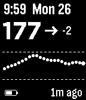</a>

<h2 class="app-name" id="app-d7c32410f9a44590a63b85ba"><a href="https://apps.repebble.com/d7c32410f9a44590a63b85ba">T1000 CGM</a></h2>
<a class="app-source" href="https://github.com/andrewchilds/t1000-pebble-cgm" title="Source code" data-search-exclude>View source</a>

by <a href="https://apps.repebble.com/apps/dev/andrewfchilds_109102dd9dbda1b7e4b51462" title="More from this developer">andrewfchilds</a>

MIT v1.4 Updated 2026-05-13

Runs on: Time 2, Pebble 2 Duo, Pebble 2, Time, Classic

A Pebble watchface that displays real-time Dexcom CGM glucose data.

<a class="app-shot" href="https://apps.repebble.com/b78e6f7edc334c6ab748a85f" data-search-exclude>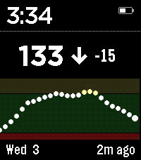</a>

<h2 class="app-name" id="app-b78e6f7edc334c6ab748a85f"><a href="https://apps.repebble.com/b78e6f7edc334c6ab748a85f">T1000 CGM Color</a></h2>
<a class="app-source" href="https://github.com/andrewchilds/t1000-color" title="Source code" data-search-exclude>View source</a>

by <a href="https://apps.repebble.com/apps/dev/andrewfchilds_109102dd9dbda1b7e4b51462" title="More from this developer">andrewfchilds</a>

MIT v1.1.2 Updated 2026-06-11

Runs on: Time 2

A watchface for the Pebble Time 2 that displays real-time Dexcom CGM glucose data and provides configurable High and Low Soon alerts. Requires a Dexcom Share login.

<a class="app-shot" href="https://apps.repebble.com/59e198bbfd404eb58da8994f" data-search-exclude>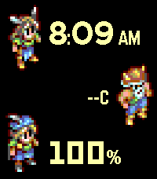</a>

<h2 class="app-name" id="app-59e198bbfd404eb58da8994f"><a href="https://apps.repebble.com/59e198bbfd404eb58da8994f">Tactics Ogre Watchface</a></h2>
<a class="app-source" href="https://github.com/shoepaladin/kiwi-cup/tree/main/pebble/tactics_ogre_classes_wf" title="Source code" data-search-exclude>View source</a>

by <a href="https://apps.repebble.com/apps/dev/sapphire-second-hand_527b6cf8aa4310a44fe95d9d" title="More from this developer">Sapphire Second-Hand</a>

Not checked yet v1.5.4 Updated 2026-08-14

Runs on: Round 2, Time 2, Time Round, Time

Your favorite Tactics Ogre classes watch you track your time, steps, temperature, battery, weather, heart rate, and more! Currently Supported: *Classes*: Archer, Barbarian, Cleric, Knight, Rune…

<h2 class="app-name" id="app-547d4aa936aa9b723a00008d"><a href="https://apps.repebble.com/547d4aa936aa9b723a00008d">Tactile</a></h2>
<a class="app-source" href="https://github.com/JustSid/Tactile" title="Source code" data-search-exclude>View source</a>

by <a href="https://apps.repebble.com/apps/dev/jgib_5465678f9c6628d09a000017" title="More from this developer">JGib</a>

No licence v1.0 Updated 2014-12-03

Runs on: Time 2, Pebble 2 Duo, Pebble 2, Time, Classic

Tactile inspired watch face. Upper group of 4 white dots indicate the hour and lower group of 4 white dots indicate the minutes (in 5 minute increments). White dot on the right indicates PM…

<a class="app-shot" href="https://apps.rebble.io/en_US/application/648dcafc741dd40198625106" data-search-exclude>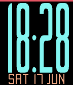</a>

<h2 class="app-name" id="app-648dcafc741dd40198625106"><a href="https://apps.rebble.io/en_US/application/648dcafc741dd40198625106">Tall Time</a></h2>
<a class="app-source" href="https://github.com/astosia/TallTime_Simple" title="Source code" data-search-exclude>View source</a>

by <a href="https://apps.rebble.io/en_US/developer/58a635d30dfc320dc60003b4/1" title="More from this developer">astosia</a>

No licence v1.6 Updated 2023-06-17 Rebble App Store

Runs on: Round 2, Time 2, Pebble 2 Duo, Pebble 2, Time Round, Time, Classic

Simple Tall Time, with Date at the bottom and battery bar at the top - Shows Quiet Time icon at bottom left when quiet time is on - Configurable colours - Vibrates on bluetooth disconnection…

<a class="app-shot" href="https://apps.repebble.com/53118426c6c18ea5af00011a" data-search-exclude>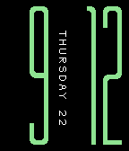</a>

<h2 class="app-name" id="app-53118426c6c18ea5af00011a"><a href="https://apps.repebble.com/53118426c6c18ea5af00011a">Taller</a></h2>
<a class="app-source" href="https://github.com/mereed/pebbleface-taller-colour" title="Source code" data-search-exclude>View source</a>

by <a href="https://apps.repebble.com/apps/dev/chops_52d76309bd61272345000001" title="More from this developer">chops</a>

Not checked yet v5.0 Updated 2017-07-02

Runs on: Round 2, Time 2, Pebble 2 Duo, Pebble 2, Time Round, Time, Classic

A very simple and readable watchface - show the day/date, flip it, or show a colon. Invert for a white background. Change the color of minute numbers or hour numbers. 12 and 24hr are supported…

<a class="app-shot" href="https://apps.repebble.com/5422714343797646020000ff" data-search-exclude>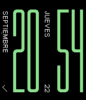</a>

<h2 class="app-name" id="app-5422714343797646020000ff"><a href="https://apps.repebble.com/5422714343797646020000ff">Taller2</a></h2>
<a class="app-source" href="http://www.github.com/mereed/pebbleface-taller2" title="Source code" data-search-exclude>View source</a>

by <a href="https://apps.repebble.com/apps/dev/chops_52d76309bd61272345000001" title="More from this developer">chops</a>

No licence v3.1 Updated 2017-03-18

Runs on: Time 2, Pebble 2 Duo, Pebble 2, Time, Classic

22 sep: new clay settings, includes access to full pebble color palette big time, with day/date at 90 degrees. uncomplicated. change hour/minute colour. optional battery bar at the top. languages…

<a class="app-shot" href="https://apps.repebble.com/c80224317250460987b9bb68" data-search-exclude>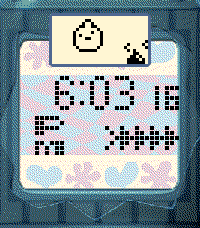</a>

<h2 class="app-name" id="app-c80224317250460987b9bb68"><a href="https://apps.repebble.com/c80224317250460987b9bb68">TamaTime</a></h2>
<a class="app-source" href="https://github.com/StefanBauwens/TamaTime" title="Source code" data-search-exclude>View source</a>

by <a href="https://apps.repebble.com/apps/dev/stefan-bauwens_599dee8a461a8d18890012bc" title="More from this developer">Stefan Bauwens</a>

No licence v1.1.0 Updated 2026-06-10

Runs on: Round 2, Time 2, Pebble 2 Duo, Pebble 2, Time Round, Time, Classic

TamaTime is a watchface which mimics the watch-screen from the original Tamagotchi. It also has optional support to be used with my other app: Tamagotchi Emulator 4 Pebble which you can get here…

<a class="app-shot" href="https://apps.repebble.com/6a7a1b2ebb2e890009f6b103" data-search-exclude>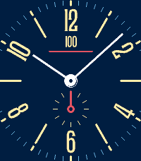</a>

<h2 class="app-name" id="app-6a7a1b2ebb2e890009f6b103"><a href="https://apps.repebble.com/6a7a1b2ebb2e890009f6b103">Tangent</a></h2>
<a class="app-source" href="https://github.com/astosia/tangent" title="Source code" data-search-exclude>View source</a>

by <a href="https://apps.repebble.com/apps/dev/astosia_58a635d30dfc320dc60003b4" title="More from this developer">astosia</a>

MIT v4.3.0 Updated 2026-09-27

Runs on: Round 2, Time 2, Pebble 2 Duo, Pebble 2, Time Round, Time, Classic

Inspired by the Tangente watch by Nomos Features: - Fully configurable colours, with presets or custom colours - Numbers or Roman Numerals on the dial - Configurable hand widths &amp; lengths - Vibe &amp;…

<a class="app-shot" href="https://apps.repebble.com/e5117a814489481197412acf" data-search-exclude>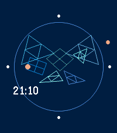</a>

<h2 class="app-name" id="app-e5117a814489481197412acf"><a href="https://apps.repebble.com/e5117a814489481197412acf">Tangram</a></h2>
<a class="app-source" href="https://github.com/synalysis/elm-pebble" title="Source code" data-search-exclude>View source</a>

by <a href="https://apps.repebble.com/apps/dev/synalysis_cc7bd1a5efe5d342dddfb4a7" title="More from this developer">Synalysis</a>

Not checked yet v1.0.6 Updated 2026-05-19

Runs on: Round 2, Time 2, Pebble 2 Duo, Pebble 2, Time Round, Time

Watchface showing changing Tangram shapes loaded online

<a class="app-shot" href="https://apps.rebble.io/en_US/application/5a60f9b5461a8d72e8002002" data-search-exclude>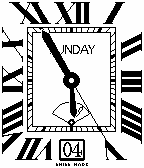</a>

<h2 class="app-name" id="app-5a60f9b5461a8d72e8002002"><a href="https://apps.rebble.io/en_US/application/5a60f9b5461a8d72e8002002">Tank Day Date</a></h2>
<a class="app-source" href="https://github.com/nickpraeger/tank" title="Source code" data-search-exclude>View source</a>

by <a href="https://apps.rebble.io/en_US/developer/588856c693254abee40004e3/1" title="More from this developer">Nick P</a>

Not checked yet v2.4 Updated 2018-02-19 Rebble App Store

Runs on: Time 2, Pebble 2 Duo, Pebble 2, Time, Classic

A classic watch face inspired by a Cartier Tank watch. Includes full day, date and second hand. Sub dial for battery charge and a bluetooth connection indicator (the I numeral changes to white…

<a class="app-shot" href="https://apps.rebble.io/en_US/application/58c837ba6ca38730e9000954" data-search-exclude>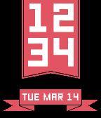</a>

<h2 class="app-name" id="app-58c837ba6ca38730e9000954"><a href="https://apps.rebble.io/en_US/application/58c837ba6ca38730e9000954">Tapestry</a></h2>
<a class="app-source" href="https://github.com/Spitemare/tapestry" title="Source code" data-search-exclude>View source</a>

by <a href="https://apps.rebble.io/en_US/developer/564924e14f9b2989ec000014/1" title="More from this developer">David Morgan</a>

MIT v1.0 Updated 2017-03-14 Rebble App Store

Runs on: Round 2, Time 2, Pebble 2 Duo, Pebble 2, Time Round, Time, Classic

Inspired by a design by /u/LlemonPls at reddit. Tapestry is a simple yet elegant watchface with a banner motif. Shake for battery and connection info. Settings: - Background and banner color …

<a class="app-shot" href="https://apps.repebble.com/58038d5cc988665c140000c2" data-search-exclude>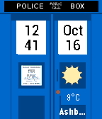</a>

<h2 class="app-name" id="app-58038d5cc988665c140000c2"><a href="https://apps.repebble.com/58038d5cc988665c140000c2">Tardis BT Weather Watch</a></h2>
<a class="app-source" href="https://github.com/gitpaddi/Tardis_BT_Weather" title="Source code" data-search-exclude>View source</a>

by <a href="https://apps.repebble.com/apps/dev/somepaddi_57daea402d0cc8673f0000dd" title="More from this developer">somepaddi</a>

Not checked yet v1.0 Updated 2016-10-16

Runs on: Time 2, Time

Tardis inspired WatchFace for Pebble. Features: - Time/Date - Vibration on BT connection loss - Weather information from openweathermap.org Time =&gt; upper left Date =&gt; upper right BT =&gt; left door…

<a class="app-shot" href="https://apps.repebble.com/559def6f541f0cc2fa00009b" data-search-exclude>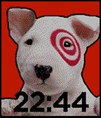</a>

<h2 class="app-name" id="app-559def6f541f0cc2fa00009b"><a href="https://apps.repebble.com/559def6f541f0cc2fa00009b">Target Bullseye Puppy</a></h2>
<a class="app-source" href="https://github.com/jamesa/bullseye-watchface" title="Source code" data-search-exclude>View source</a>

by <a href="https://apps.repebble.com/apps/dev/james-anderson_54eca408732a6864f000008c" title="More from this developer">James Anderson</a>

Not checked yet v1.0 Updated 2015-07-09

Runs on: Time 2, Pebble 2 Duo, Pebble 2, Time, Classic

Simple watchface featuring the Target mascot, Bullseye.

<a class="app-shot" href="https://apps.repebble.com/530d4af6d4317149ea00008c" data-search-exclude>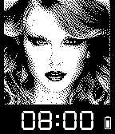</a>

<h2 class="app-name" id="app-530d4af6d4317149ea00008c"><a href="https://apps.repebble.com/530d4af6d4317149ea00008c">Taylor Swift</a></h2>
<a class="app-source" href="https://github.com/thunderchild7/TaylorSwift" title="Source code" data-search-exclude>View source</a>

by <a href="https://apps.repebble.com/apps/dev/oliver-bowe_52cdaf6f0b54dbbe46000001" title="More from this developer">Oliver Bowe</a>

Not checked yet v2.2.3 Updated 2014-04-03

Runs on: Time 2, Pebble 2 Duo, Pebble 2, Time, Classic

Simple Taylor Swift digital watch face, a sharp tap will briefly show the date.

<a class="app-shot" href="https://apps.repebble.com/52fe1d0d3085a0848d000231" data-search-exclude>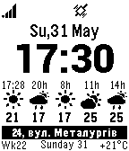</a>

<h2 class="app-name" id="app-52fe1d0d3085a0848d000231"><a href="https://apps.repebble.com/52fe1d0d3085a0848d000231">TCW (Time, Calendar, Weather)</a></h2>
<a class="app-source" href="https://github.com/alexsum/TCW" title="Source code" data-search-exclude>View source</a>

by <a href="https://apps.repebble.com/apps/dev/alexsum_52d843161acbf3934c00001b" title="More from this developer">Alexsum</a>

GPL-3.0 v2.52 Updated 2015-07-21

Runs on: Time 2, Pebble 2 Duo, Pebble 2, Time, Classic

Ru, Ua, En, Usr(lat+cyr) It shows: - two timezones - current time by two various fonts - calendar - weather in the current location or custom location: C and F, current and long-term forecasts …

<a class="app-shot" href="https://apps.repebble.com/6485ede3143b6504957bcfd5" data-search-exclude>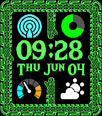</a>

<h2 class="app-name" id="app-6485ede3143b6504957bcfd5"><a href="https://apps.repebble.com/6485ede3143b6504957bcfd5">Tears of the Kingdom</a></h2>
<a class="app-source" href="https://github.com/HarrisonAllen/totk-watchface" title="Source code" data-search-exclude>View source</a>

by <a href="https://apps.repebble.com/apps/dev/harrison-allen_5e28ea923dd3109f151c7e08" title="More from this developer">Harrison Allen</a>

No licence v2.3.0 Updated 2026-06-04

Runs on: Round 2, Time 2, Pebble 2 Duo, Pebble 2, Time Round, Time, Classic

Enjoy this Legend of Zelda: Tears of the Kingdom inspired watchface! Includes current weather and is compatible with all Pebbles!

<h2 class="app-name" id="app-554547fb3bbdc6f67500009e"><a href="https://apps.repebble.com/554547fb3bbdc6f67500009e">Tech Talent South Bottom Clock</a></h2>
<a class="app-source" href="https://github.com/zkirchin/ttswatchb" title="Source code" data-search-exclude>View source</a>

by <a href="https://apps.repebble.com/apps/dev/tech-talent-south_54a316565c486f868b00011e" title="More from this developer">Tech Talent South</a>

Not checked yet v1.0 Updated 2015-05-02

Runs on: Time 2, Pebble 2 Duo, Pebble 2, Time, Classic

This is a watch face based off of the Tech Talent South Logo and is intended for use of all fans of this coding bootcamp!

<h2 class="app-name" id="app-55456977946ce250750000b9"><a href="https://apps.repebble.com/55456977946ce250750000b9">Tech Talent South Clock</a></h2>
<a class="app-source" href="https://github.com/zkirchin/ttswatchtext" title="Source code" data-search-exclude>View source</a>

by <a href="https://apps.repebble.com/apps/dev/tech-talent-south_54a316565c486f868b00011e" title="More from this developer">Tech Talent South</a>

Not checked yet v1.1 Updated 2015-05-04

Runs on: Time 2, Pebble 2 Duo, Pebble 2, Time, Classic

This is a watch face based off of the Tech Talent South Logo and is intended for use of all fans of this coding bootcamp!

<a class="app-shot" href="https://apps.repebble.com/553b05a737596167920000db" data-search-exclude>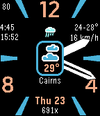</a>

<h2 class="app-name" id="app-553b05a737596167920000db"><a href="https://apps.repebble.com/553b05a737596167920000db">TechRad</a></h2>
<a class="app-source" href="https://github.com/mangolazi/TechradPebble" title="Source code" data-search-exclude>View source</a>

by <a href="https://apps.repebble.com/apps/dev/mango-lazi_54b62295a9708ae7e500002a" title="More from this developer">Mango Lazi</a>

Not checked yet v3.2 Updated 2016-09-01

Runs on: Time 2, Pebble 2 Duo, Pebble 2, Time, Classic

A clean and bold watchface inspired by the Rado Integral. Now in color! Choose white or black background, red or blue graphics elements, Celsius/Fahrenheit temperatures, steps/distance walked…

<h2 class="app-name" id="app-5582347e9e9090eb82000047"><a href="https://apps.repebble.com/5582347e9e9090eb82000047">Teddie Time</a></h2>
<a class="app-source" href="https://bitbucket.org/Masamune_Shadow/teddiewatchface" title="Source code" data-search-exclude>View source</a>

by <a href="https://apps.repebble.com/apps/dev/spencer-johnson_52ac665331a5fa7c25000006" title="More from this developer">Spencer Johnson</a>

See source v1.1 Updated 2015-06-18

Runs on: Time 2, Time

It&#x27;s a watchface starring Teddie from Persona 4. His picture and saying changes every hour, and is randomized. I hope you enjoy it and have a bear-ific day.

<h2 class="app-name" id="app-5593b2ee57dd91bb42000023"><a href="https://apps.repebble.com/5593b2ee57dd91bb42000023">Teddy Bear</a></h2>
<a class="app-source" href="https://github.com/sdneon/TeddyBear" title="Source code" data-search-exclude>View source</a>

by <a href="https://apps.repebble.com/apps/dev/neon_5568037a1034b0abf70000a1" title="More from this developer">Neon</a>

Not checked yet v1.1 Updated 2015-07-01

Runs on: Time 2, Time

Teddy bear tells the time. Teddy&#x27;s face shows the hour in numerals, and a hand points to the minutes. Backgrounds colour pairs changes on the hour. E.g. the screenshot would be 5:04 (i.e. 5…

<a class="app-shot" href="https://apps.repebble.com/54b31c54663d4f4f8daaad6d" data-search-exclude>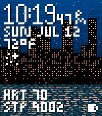</a>

<h2 class="app-name" id="app-54b31c54663d4f4f8daaad6d"><a href="https://apps.repebble.com/54b31c54663d4f4f8daaad6d">Teensy City</a></h2>
<a class="app-source" href="https://github.com/maclyn/proc-gen-city-wf-for-pebble" title="Source code" data-search-exclude>View source</a>

by <a href="https://apps.repebble.com/apps/dev/inipage-software_53a1e088d130a4d1cf000094" title="More from this developer">IniPage Software</a>

Not checked yet v0.5.1 Updated 2026-07-12

Runs on: Round 2, Time 2, Time Round, Time

A real-time procedurally generated cityscape with animated traffic and water. * Three times of day (day, night, dawn/dusk) based on your current location * Current weather indicator with…

<h2 class="app-name" id="app-55eae82309fc088aef00001a"><a href="https://apps.repebble.com/55eae82309fc088aef00001a">TEK Watch01</a></h2>
<a class="app-source" href="https://github.com/torerikk/simple_analog_pebbleface" title="Source code" data-search-exclude>View source</a>

by <a href="https://apps.repebble.com/apps/dev/tor-erik-klausen_531adebc2a95cc72b000003b" title="More from this developer">Tor-Erik Klausen</a>

Not checked yet v1.4 Updated 2016-08-30

Runs on: Time 2, Pebble 2 Duo, Pebble 2, Time

A simple analog watch face based on KS Watch Face by Chris Lewis . Configurable colors (background, clock face and stroke). Vibrates and displays a warning when disconnected.

<a class="app-shot" href="https://apps.repebble.com/550ba9621e540c275e000036" data-search-exclude>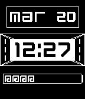</a>

<h2 class="app-name" id="app-550ba9621e540c275e000036"><a href="https://apps.repebble.com/550ba9621e540c275e000036">Tekkno</a></h2>
<a class="app-source" href="https://github.com/ftick/tekkno-watch-face" title="Source code" data-search-exclude>View source</a>

by <a href="https://apps.repebble.com/apps/dev/ftick_549f31c6fa31cd2af8000220" title="More from this developer">ftick</a>

Not checked yet v1.0 Updated 2015-03-20

Runs on: Time 2, Pebble 2 Duo, Pebble 2, Time, Classic

A simple tech watchface. Shake to toggle flashing of the &quot;:&quot;!

<a class="app-shot" href="https://apps.repebble.com/69b73856657baf00098d504e" data-search-exclude>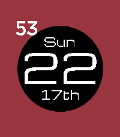</a>

<h2 class="app-name" id="app-69b73856657baf00098d504e"><a href="https://apps.repebble.com/69b73856657baf00098d504e">Telstar</a></h2>
<a class="app-source" href="https://github.com/justinjhendrick/alpine_larch_pebble_watchface" title="Source code" data-search-exclude>View source</a>

by <a href="https://apps.repebble.com/apps/dev/justinjhendrick_67f68b8a23b7a90009c87db5" title="More from this developer">justinjhendrick</a>

Not checked yet v1.2.0 Updated 2026-05-18

Runs on: Round 2, Time 2, Pebble 2 Duo, Pebble 2, Time Round, Time, Classic

A minimalist digital watchface with analog movement for the minutes. The default color scheme is perfect for the Red &amp; Black PT2! Features: * Configurable Colors * Large hour number * Minute…

<a class="app-shot" href="https://apps.rebble.io/en_US/application/584aeb1bce45dcb197000052" data-search-exclude>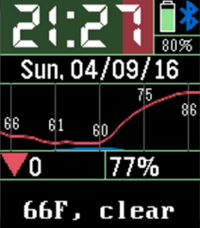</a>

<h2 class="app-name" id="app-584aeb1bce45dcb197000052"><a href="https://apps.rebble.io/en_US/application/584aeb1bce45dcb197000052">Temperature Graph</a></h2>
<a class="app-source" href="https://github.com/SnowBirdMV/TemperatureGraphWatchface/releases/tag/1.0" title="Source code" data-search-exclude>View source</a>

by <a href="https://apps.rebble.io/en_US/developer/554e5bf635b33a16c8000078/1" title="More from this developer">Matthew Vogt</a>

No licence v1.3 Updated 2016-12-14 Rebble App Store

Runs on: Time 2, Pebble 2 Duo, Pebble 2, Time, Classic

Multi function watch-face that shows a temperature and chance of precipitation graph of the next 20 hours, wind speed, current weather conditions and of course, the date and time. Currently…

<a class="app-shot" href="https://apps.repebble.com/3d9d1556511048f09d90d87a" data-search-exclude>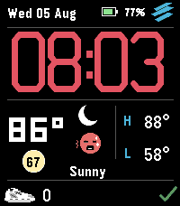</a>

<h2 class="app-name" id="app-3d9d1556511048f09d90d87a"><a href="https://apps.repebble.com/3d9d1556511048f09d90d87a">Tempest Time</a></h2>
<a class="app-source" href="https://github.com/cOd3m0nk3y/tempest-time" title="Source code" data-search-exclude>View source</a>

by <a href="https://apps.repebble.com/apps/dev/brendlfly_2e5ca228008c6fa1f17bd44a" title="More from this developer">brendlfly</a>

Not checked yet v0.8.3 Updated 2026-08-17

Runs on: Time 2

Tempest Time is a highly legible, battery-conscious weather watchface designed for Pebble Time 2. Large custom numerals keep the time prominent while current temperature, today&#x27;s high and low…

<a class="app-shot" href="https://apps.repebble.com/cfcf110c62e6483eba7ef85a" data-search-exclude>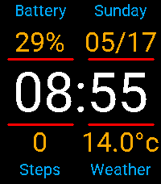</a>

<h2 class="app-name" id="app-cfcf110c62e6483eba7ef85a"><a href="https://apps.repebble.com/cfcf110c62e6483eba7ef85a">Tempilation</a></h2>
<a class="app-source" href="https://github.com/justinjhendrick/dashboard-pebble-watchface" title="Source code" data-search-exclude>View source</a>

by <a href="https://apps.repebble.com/apps/dev/justinjhendrick_67f68b8a23b7a90009c87db5" title="More from this developer">justinjhendrick</a>

Not checked yet v1.7.2 Updated 2026-09-12

Runs on: Time 2

Tempilation is a practical digital watchface with customizable colors and multiple modules to pick from. Designer: SocketMix Programmer: justinjhendrick Inspired by: Samsung Galaxy Basic Dashboard…

<a class="app-shot" href="https://apps.repebble.com/f3eecfb630754c8ab295a1a5" data-search-exclude>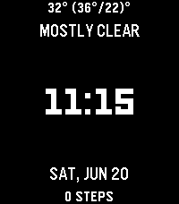</a>

<h2 class="app-name" id="app-f3eecfb630754c8ab295a1a5"><a href="https://apps.repebble.com/f3eecfb630754c8ab295a1a5">Template</a></h2>
<a class="app-source" href="https://github.com/julpel8/pebble-watchface-template" title="Source code" data-search-exclude>View source</a>

by <a href="https://apps.repebble.com/apps/dev/julpel8_4832e5dc5bcac873d9cd9ff7" title="More from this developer">julpel8</a>

Not checked yet v0.0.1 Updated 2026-06-20

Runs on: Time 2

A minimal, configurable Pebble watchface starter template — time + info lines, weather, night theme, i18n.

<a class="app-shot" href="https://apps.repebble.com/c4c305d476ce4a818874a5a1" data-search-exclude>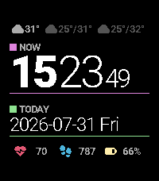</a>

<h2 class="app-name" id="app-c4c305d476ce4a818874a5a1"><a href="https://apps.repebble.com/c4c305d476ce4a818874a5a1">Tempo Roboto</a></h2>
<a class="app-source" href="https://codeberg.org/byungyoonc/roboto-pebble-watchface" title="Source code" data-search-exclude>View source</a>

by <a href="https://apps.repebble.com/apps/dev/choi-byungyoon_a120faf83b54715b45bedcca" title="More from this developer">Choi Byungyoon</a>

See source v1.1.0 Updated 2026-08-01

Runs on: Time 2

A Digital Pebble watchface using Roboto typeface.

<h2 class="app-name" id="app-565e1d8f5629c976ea00007c"><a href="https://apps.repebble.com/565e1d8f5629c976ea00007c">tempus latinum</a></h2>
<a class="app-source" href="https://github.com/nicktendo64/tempus-latinum" title="Source code" data-search-exclude>View source</a>

by <a href="https://apps.repebble.com/apps/dev/nicholas-currault_52c908c66025fc11fa00003a" title="More from this developer">Nicholas Currault</a>

Not checked yet v1.0 Updated 2015-12-01

Runs on: Time 2, Pebble 2 Duo, Pebble 2, Time, Classic

This watchface displays the current time and date in the format that Ancient Romans would have used. All numbers are in Latin/Roman Numerals, the months and days are in Latin, and dates are…

<a class="app-shot" href="https://apps.repebble.com/358196e1caf34c2688899394" data-search-exclude>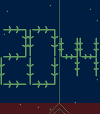</a>

<h2 class="app-name" id="app-358196e1caf34c2688899394"><a href="https://apps.repebble.com/358196e1caf34c2688899394">Tendril</a></h2>
<a class="app-source" href="https://github.com/KarlKl/Pebble-Tendril" title="Source code" data-search-exclude>View source</a>

by <a href="https://apps.repebble.com/apps/dev/karl_0e91d84045d24bb5497e1700" title="More from this developer">Karl</a>

No licence v1.0.0 Updated 2026-05-31

Runs on: Time 2, Pebble 2 Duo, Pebble 2, Time, Classic

Time is growing on you. Literally. Watch the hours and minutes sprout into shape, branch by branch, leaf by leaf. It&#x27;s a clock. It&#x27;s a forest. It&#x27;s both.

<a class="app-shot" href="https://apps.repebble.com/2280e247bce8407980bf9396" data-search-exclude>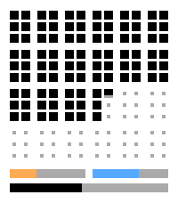</a>

<h2 class="app-name" id="app-2280e247bce8407980bf9396"><a href="https://apps.repebble.com/2280e247bce8407980bf9396">tens</a></h2>
<a class="app-source" href="https://github.com/andreavolpato/pebble-tens" title="Source code" data-search-exclude>View source</a>

by <a href="https://apps.repebble.com/apps/dev/andrea-volpato_afaa2ce09f3e6bda44986c75" title="More from this developer">Andrea Volpato</a>

GPL-3.0 v1.0.5 Updated 2026-06-23

Runs on: Time 2

keep track of the time visually, every ten pixel is a minute. every ten by ten block is ten minutes. 144 blocks in one day. keep track visually of your month (orange), year (blue) and life at the…

<a class="app-shot" href="https://apps.repebble.com/dd98ca5e0df24b95bdbdd9ff" data-search-exclude>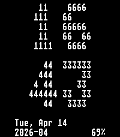</a>

<h2 class="app-name" id="app-dd98ca5e0df24b95bdbdd9ff"><a href="https://apps.repebble.com/dd98ca5e0df24b95bdbdd9ff">terlet</a></h2>
<a class="app-source" href="https://github.com/teatov/pebble-terlet" title="Source code" data-search-exclude>View source</a>

by <a href="https://apps.repebble.com/apps/dev/teatov_396c06266c2570dd8a5f9a05" title="More from this developer">Teatov</a>

Not checked yet v1.2 Updated 2026-04-16

Runs on: Round 2, Time 2, Pebble 2 Duo, Pebble 2, Time Round, Time, Classic

A simple little Pebble watchface with neat ASCII digits.

<a class="app-shot" href="https://apps.repebble.com/2719aa1bb53d41ceb10b7e14" data-search-exclude>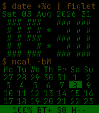</a>

<h2 class="app-name" id="app-2719aa1bb53d41ceb10b7e14"><a href="https://apps.repebble.com/2719aa1bb53d41ceb10b7e14">termd</a></h2>
<a class="app-source" href="https://gitlab.com/Xynkin/termd" title="Source code" data-search-exclude>View source</a>

by <a href="https://apps.repebble.com/apps/dev/denis-xynkin_6f6a00c01979d28614c5355a" title="More from this developer">Denis Xynkin</a>

Not checked yet v0.1.0 Updated 2026-08-31

Runs on: Time 2

A high-contrast terminal-inspired watchface featuring an ASCII-art clock, four-week calendar, battery, Bluetooth, steps, and heart rate.

<a class="app-shot" href="https://apps.repebble.com/558758d949c1d1c2f9000066" data-search-exclude>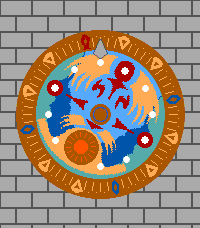</a>

<h2 class="app-name" id="app-558758d949c1d1c2f9000066"><a href="https://apps.repebble.com/558758d949c1d1c2f9000066">Termina Clock</a></h2>
<a class="app-source" href="https://gitlab.com/gumbyscout/Termina-Clock" title="Source code" data-search-exclude>View source</a>

by <a href="https://apps.repebble.com/apps/dev/mitchel-spears_5580f963617287a1810000a9" title="More from this developer">Mitchel Spears</a>

Not checked yet v3.2.1 Updated 2026-06-23

Runs on: Round 2, Time 2, Pebble 2 Duo, Pebble 2, Time Round, Time, Classic

The clocks from Majora&#x27;s Mask, for your Pebble! Behaves just like in game, with the outer ring rotating to show the minutes, and the inner ring rotating to show the hour. Configurable! - Choose…

<a class="app-shot" href="https://apps.repebble.com/56f486d4acd389cf47000021" data-search-exclude>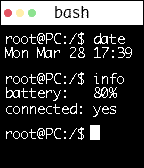</a>

<h2 class="app-name" id="app-56f486d4acd389cf47000021"><a href="https://apps.repebble.com/56f486d4acd389cf47000021">Terminal</a></h2>
<a class="app-source" href="https://github.com/AADeLucia/Pebble-Watchface-Terminal-Style.git" title="Source code" data-search-exclude>View source</a>

by <a href="https://apps.repebble.com/apps/dev/alexandra-delucia_56e35cfa2526c72e6600002e" title="More from this developer">Alexandra DeLucia</a>

No licence v1.0 Updated 2017-01-14

Runs on: Time 2, Pebble 2 Duo, Pebble 2, Time, Classic

Terminal-style watchface for Unix enthusiasts! Features: -mimics a Mac/Linux terminal -shows date, time, battery status, and connection status -animated blinking cursor

<a class="app-shot" href="https://apps.repebble.com/83a45005b95f438590f63b26" data-search-exclude>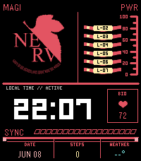</a>

<h2 class="app-name" id="app-83a45005b95f438590f63b26"><a href="https://apps.repebble.com/83a45005b95f438590f63b26">Terminal Dogma</a></h2>
<a class="app-source" href="https://github.com/AndreasThinks/pebble-watchface" title="Source code" data-search-exclude>View source</a>

by <a href="https://apps.repebble.com/apps/dev/andreas-varotsis_021ad35e7c7a1d61ceaac484" title="More from this developer">Andreas Varotsis</a>

No licence v1.0.16 Updated 2026-06-08

Runs on: Time 2

A tactical terminal-inspired Pebble Time 2 watchface with configurable format, datamodules, and Evangelion inspired status chevrons.

<a class="app-shot" href="https://apps.repebble.com/5602247f15706c9bfe000023" data-search-exclude>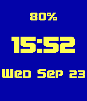</a>

<h2 class="app-name" id="app-5602247f15706c9bfe000023"><a href="https://apps.repebble.com/5602247f15706c9bfe000023">Terran Watchface</a></h2>
<a class="app-source" href="https://github.com/firekesti/TerranPebble" title="Source code" data-search-exclude>View source</a>

by <a href="https://apps.repebble.com/apps/dev/firekesti_557207fdfdb261eb76000084" title="More from this developer">firekesti</a>

Not checked yet v1.01 Updated 2015-09-23

Runs on: Time 2, Pebble 2 Duo, Pebble 2, Time, Classic

A simple watchface that uses a Terran font from Starcraft. Shows battery percentage, date, time, and will vibrate with a unique pattern when Bluetooth is disconnected, and two short buzzes when…

<a class="app-shot" href="https://apps.repebble.com/69dd9b7077602b0009e99a04" data-search-exclude>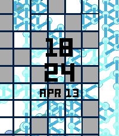</a>

<h2 class="app-name" id="app-69dd9b7077602b0009e99a04"><a href="https://apps.repebble.com/69dd9b7077602b0009e99a04">Tessera ad Infinitum</a></h2>
<a class="app-source" href="https://github.com/TybbsTheUnfocused/tessera_infinitum_watchface" title="Source code" data-search-exclude>View source</a>

by <a href="https://apps.repebble.com/apps/dev/tybbs_69dd7d76d75323000858be76" title="More from this developer">Tybbs</a>

No licence v1.0 Updated 2026-04-14

Runs on: Round 2, Time 2, Time Round, Time

Tessera ad Infinitum transforms your Pebble into a window to an ever-changing world of generative art. Every hour, a new slice of a procedurally generated canvas is fetched and displayed as your…

<a class="app-shot" href="https://apps.repebble.com/560d0013cda63289ce000061" data-search-exclude>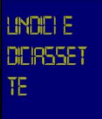</a>

<h2 class="app-name" id="app-560d0013cda63289ce000061"><a href="https://apps.repebble.com/560d0013cda63289ce000061">TESTOCOL</a></h2>
<a class="app-source" href="http://github.com/aotta/TestoCol" title="Source code" data-search-exclude>View source</a>

by <a href="https://apps.repebble.com/apps/dev/andrea-ottaviani_54f6bfc5feb37e1bc000001c" title="More from this developer">Andrea Ottaviani</a>

No licence v1.1 Updated 2015-10-01

Runs on: Time 2, Time

Orologio testuale a colori, in italiano Italian text only!

<h2 class="app-name" id="app-54f872d5d66ea86e5a000042"><a href="https://apps.repebble.com/54f872d5d66ea86e5a000042">TetrisTime</a></h2>
<a class="app-source" href="https://github.com/VFLashM/TetrisTime" title="Source code" data-search-exclude>View source</a>

by <a href="https://apps.repebble.com/apps/dev/vflashm_52f1e0df8d40be112a000018" title="More from this developer">vflashm</a>

MIT v3.2 Updated 2016-10-02

Runs on: Time 2, Pebble 2 Duo, Pebble 2, Time, Classic

Pebble watchface with digits made out of tetriminos. When time changes, old digit vanishes and new digit is reassembled out of falling tetriminos. Optionally shows date and weekday. Supports…

<a class="app-shot" href="https://apps.rebble.io/en_US/application/5852e9b4ce45dc2c6300014b" data-search-exclude>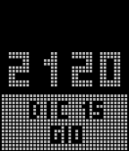</a>

<h2 class="app-name" id="app-5852e9b4ce45dc2c6300014b"><a href="https://apps.rebble.io/en_US/application/5852e9b4ce45dc2c6300014b">TetrisTime_ITA</a></h2>
<a class="app-source" href="https://github.com/VFLashM/TetrisTime" title="Source code" data-search-exclude>View source</a>

by <a href="https://apps.rebble.io/en_US/developer/584192efca3094ca290000e1/1" title="More from this developer">Nastas</a>

MIT v1.2 Updated 2016-12-16 Rebble App Store

Runs on: Time 2, Pebble 2 Duo, Pebble 2, Time, Classic

TetrisTime ora con giorni della settimana e mesi completamente in Italiano! Guarda i tetriminos cadere dall&#x27;alto formando l&#x27;ora corrente. Nelle impostazioni potete scegliere se e come visualizzare…

<a class="app-shot" href="https://apps.repebble.com/56f9230c61a0160aa700002e" data-search-exclude>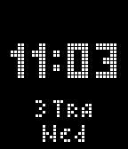</a>

<h2 class="app-name" id="app-56f9230c61a0160aa700002e"><a href="https://apps.repebble.com/56f9230c61a0160aa700002e">TetrisTime_mod</a></h2>
<a class="app-source" href="https://github.com/gogothegogo/TetrisTime" title="Source code" data-search-exclude>View source</a>

by <a href="https://apps.repebble.com/apps/dev/gogothegogo_56e335002526c72e66000023" title="More from this developer">gogothegogo</a>

Not checked yet v3.5 Updated 2016-04-02

Runs on: Round 2, Time 2, Pebble 2 Duo, Pebble 2, Time Round, Time, Classic

Completely based on VFLashM amazing TetrisTime watchface. I did few mods for my needs: -got rid of large date fonts -added option of Croatian dates and weekdays -added additional battery empty…

<a class="app-shot" href="https://apps.repebble.com/81384d8fbe4347339fd4ee8e" data-search-exclude>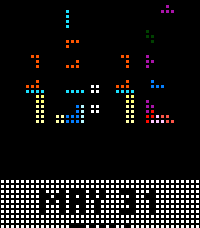</a>

<h2 class="app-name" id="app-81384d8fbe4347339fd4ee8e"><a href="https://apps.repebble.com/81384d8fbe4347339fd4ee8e">TetrisTimeBig</a></h2>
<a class="app-source" href="https://github.com/orzechowskilukasz/TetrisTimeBig" title="Source code" data-search-exclude>View source</a>

by <a href="https://apps.repebble.com/apps/dev/lukasz-orzechowski_f00ac1790eeb92a620c5bcde" title="More from this developer">Lukasz Orzechowski</a>

Not checked yet v3.9.1 Updated 2026-08-14

Runs on: Round 2, Time 2, Pebble 2 Duo, Pebble 2, Time Round, Time, Classic

A dot-matrix watch face, where dots are composed from falling tetris bricks. This is a port for Pebble Time 2 of a TetrisTime watchface originally created in 2015 by Valerii Lashmanov.

<a class="app-shot" href="https://apps.repebble.com/53972b8efd9b27e4be0000d3" data-search-exclude>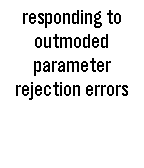</a>

<h2 class="app-name" id="app-53972b8efd9b27e4be0000d3"><a href="https://apps.repebble.com/53972b8efd9b27e4be0000d3">TeXcuse</a></h2>
<a class="app-source" href="https://github.com/codesplice/TeXcuse" title="Source code" data-search-exclude>View source</a>

by <a href="https://apps.repebble.com/apps/dev/codesplice_52f062be3be620c78000173f" title="More from this developer">codesplice</a>

Not checked yet v0.3.5 Updated 2014-06-17

Runs on: Time 2, Pebble 2 Duo, Pebble 2, Time, Classic

The standard Big Time watchface, with a secret ability. Flick your wrist to display a randomly-generated excuse overflowing with technobabble. Perfect for meetings when you need to explain that…

<a class="app-shot" href="https://apps.repebble.com/582cf21a8c7fff098b000144" data-search-exclude>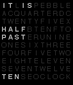</a>

<h2 class="app-name" id="app-582cf21a8c7fff098b000144"><a href="https://apps.repebble.com/582cf21a8c7fff098b000144">Text based on QLOCKTWO</a></h2>
<a class="app-source" href="http://github.com/melekzek/pebble-QLOCKTWO" title="Source code" data-search-exclude>View source</a>

by <a href="https://apps.repebble.com/apps/dev/melekzek_57e1e80016a229658300013f" title="More from this developer">melekzek</a>

No licence v0.2 Updated 2017-05-07

Runs on: Time 2, Pebble 2 Duo, Pebble 2, Time, Classic

Text watchface based on qlocktwo watch. http://qlocktwo.com/ TODO: - Add minute dots as an option. - Add some predefined default colors. - Hide and compress unused lines if there is a notification…

<h2 class="app-name" id="app-535cf64514d179a4aa000149"><a href="https://apps.repebble.com/535cf64514d179a4aa000149">Text french 24h</a></h2>
<a class="app-source" href="https://cloudpebble.net/ide/project/47466" title="Source code" data-search-exclude>View source</a>

by <a href="https://apps.repebble.com/apps/dev/martin-carufel_52d5e931fb4dff9a0f000005" title="More from this developer">Martin Carufel</a>

See source v0.1 Updated 2014-04-27

Runs on: Time 2, Pebble 2 Duo, Pebble 2, Time, Classic

Display time in french, on 24h. No vibe, no date. Says 45, 50 and 55 minutes instead of &quot;moin quart&quot;, &quot;moins dix&quot; and &quot;moins 5&quot;.

<h2 class="app-name" id="app-552f772a26541fb9610000ae"><a href="https://apps.repebble.com/552f772a26541fb9610000ae">Text time</a></h2>
<a class="app-source" href="https://github.com/ndrewv/text-watch-configurable" title="Source code" data-search-exclude>View source</a>

by <a href="https://apps.repebble.com/apps/dev/andrew-varis_545aa6c32a5698fda50000aa" title="More from this developer">Andrew Varis</a>

Not checked yet v1.5 Updated 2015-09-13

Runs on: Time 2, Pebble 2 Duo, Pebble 2, Time, Classic

A highly configurable text watch with your choice of fonts, alignment, date, background, animation speed and offset. Based off DHertz&#x27;s Words + Date watch.

<h2 class="app-name" id="app-543dbd65b4e3abd1c3000039"><a href="https://apps.repebble.com/543dbd65b4e3abd1c3000039">Text Time PT</a></h2>
<a class="app-source" href="https://github.com/Orgmir/TextTimePT.git" title="Source code" data-search-exclude>View source</a>

by <a href="https://apps.repebble.com/apps/dev/luis-ramos_54365e52705eaa8371000078" title="More from this developer">Luis Ramos</a>

MIT v0.2 Updated 2014-10-16

Runs on: Time 2, Pebble 2 Duo, Pebble 2, Time, Classic

A watchface similar to the system Text Watch, but with portuguese locale!

<a class="app-shot" href="https://apps.repebble.com/52d0d4593b9c7bd0ce0000c9" data-search-exclude>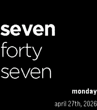</a>

<h2 class="app-name" id="app-52d0d4593b9c7bd0ce0000c9"><a href="https://apps.repebble.com/52d0d4593b9c7bd0ce0000c9">Text Watch - Customizable with Date and Weather</a></h2>
<a class="app-source" href="https://github.com/Cache4Gold/PebbleTextWatchWithDate" title="Source code" data-search-exclude>View source</a>

by <a href="https://apps.repebble.com/apps/dev/cache4gold_52d0ce2074a38e46a60000d3" title="More from this developer">Cache4Gold</a>

No licence v2.0.0 Updated 2026-05-07

Runs on: Round 2, Time 2, Pebble 2 Duo, Pebble 2, Time Round, Time, Classic

This watch face displays the time as plain English text across three lines, with two fully configurable info lines at the bottom for date, day of week, and live weather. Each of the two bottom…

<h2 class="app-name" id="app-52bf33276ecafe7e4c000094"><a href="https://apps.repebble.com/52bf33276ecafe7e4c000094">Text Watch 2</a></h2>
<a class="app-source" href="https://github.com/keelanc/text_watch_2" title="Source code" data-search-exclude>View source</a>

by <a href="https://apps.repebble.com/apps/dev/keelan-c_529eb0fc1a66380531000038" title="More from this developer">Keelan C</a>

Not checked yet v1.1.0 Updated 2014-02-05

Runs on: Time 2, Pebble 2 Duo, Pebble 2, Time, Classic

A &#x27;better&#x27; version of the default &#x27;Text Watch&#x27; watchface by Pebble Tech. Tap/shake the watch for date and weather info. Choose °C or °F from the mobile app. Added ‘o’ prefix for single-digit…

<a class="app-shot" href="https://apps.repebble.com/56ab1cfe6ca919990000000e" data-search-exclude>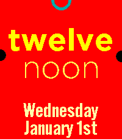</a>

<h2 class="app-name" id="app-56ab1cfe6ca919990000000e"><a href="https://apps.repebble.com/56ab1cfe6ca919990000000e">Text Watch Deluxe</a></h2>
<a class="app-source" href="https://github.com/wackyneighbor/DC_Text_Watch_Deluxe" title="Source code" data-search-exclude>View source</a>

by <a href="https://apps.repebble.com/apps/dev/dc_531cd26a46b8f200dd000450" title="More from this developer">DC</a>

Not checked yet v2.0.1 Updated 2026-07-05

Runs on: Round 2, Time 2, Pebble 2 Duo, Pebble 2, Time Round, Time, Classic

Elegant, simple, and practical, this is a variant of Pebble&#x27;s original &quot;Sliding Text&quot; watchface, with some significant enhancements such as configurable colors, text justification options, and a…

<h2 class="app-name" id="app-533dee0967bf239ad80000e6"><a href="https://apps.repebble.com/533dee0967bf239ad80000e6">Text Watch FR</a></h2>
<a class="app-source" href="https://github.com/Benji7790/pebble-textwatch-fr" title="Source code" data-search-exclude>View source</a>

by <a href="https://apps.repebble.com/apps/dev/benji7790_53207f9eef6e7721150001ad" title="More from this developer">Benji7790</a>

No licence v1.1 Updated 2015-08-05

Runs on: Time 2, Pebble 2 Duo, Pebble 2, Time, Classic

Watchface qui affiche l&#x27;heure en texte Français.

<h2 class="app-name" id="app-52d0d2ea336477aa170000bb"><a href="https://apps.rebble.io/en_US/application/52d0d2ea336477aa170000bb">Text Watch With Date</a></h2>
<a class="app-source" href="https://github.com/Saracco/PebbleTextWatchWithDate" title="Source code" data-search-exclude>View source</a>

by <a href="https://apps.rebble.io/en_US/developer/52d0ce2074a38e46a60000d3/1" title="More from this developer">Cache4Gold</a>

No licence v1.0.0 Updated 2014-01-11 Rebble App Store

Runs on: Time 2, Pebble 2 Duo, Pebble 2, Time, Classic

This is a tweak on the Text Watch, it now reads full date in a small font in the bottom right corner. There are also versions of this with (o&#x27;) and (oh) added before minutes one through nine.

<h2 class="app-name" id="app-53123b8592295d4809000426"><a href="https://apps.repebble.com/53123b8592295d4809000426">Text Watch with Date</a></h2>
<a class="app-source" href="https://github.com/ngreatorex/PebbleTextWatch" title="Source code" data-search-exclude>View source</a>

by <a href="https://apps.repebble.com/apps/dev/neil-greatorex_52da6807c3e836e63d000104" title="More from this developer">Neil Greatorex</a>

Not checked yet v1.2 Updated 2015-11-12

Runs on: Round 2, Time 2, Pebble 2 Duo, Pebble 2, Time Round, Time, Classic

This is a simple modification of the standard text watch to show the current date as well.

<h2 class="app-name" id="app-52d0d4c374a38e4e130000da"><a href="https://apps.rebble.io/en_US/application/52d0d4c374a38e4e130000da">Text Watch With Date (oh)</a></h2>
<a class="app-source" href="https://github.com/Saracco/PebbleTextWatchWithDate" title="Source code" data-search-exclude>View source</a>

by <a href="https://apps.rebble.io/en_US/developer/52d0ce2074a38e46a60000d3/1" title="More from this developer">Cache4Gold</a>

No licence v1.0.0 Updated 2014-01-11 Rebble App Store

Runs on: Time 2, Pebble 2 Duo, Pebble 2, Time, Classic

This is a tweak on the Text Watch, it now reads full date in a small font in the bottom right corner. There are also versions of this without (oh) and one with (o&#x27;) added before minutes one…

<h2 class="app-name" id="app-548c2afd5bb649ffd30000a0"><a href="https://apps.repebble.com/548c2afd5bb649ffd30000a0">Text Watch with UK-style (DMY) date</a></h2>
<a class="app-source" href="https://github.com/minkustree/PebbleTextWatchWithDate" title="Source code" data-search-exclude>View source</a>

by <a href="https://apps.repebble.com/apps/dev/andy-clark_53523da0373d3e61a1000181" title="More from this developer">Andy Clark</a>

Not checked yet v1.0 Updated 2014-12-13

Runs on: Time 2, Pebble 2 Duo, Pebble 2, Time, Classic

This variant of Text Watch with Date displays the day and date in the bottom right hand corner. The date is shown in the UK-style day-month-year format. The first ten minutes of each hour are…

<a class="app-shot" href="https://apps.rebble.io/en_US/application/58451b14ca30941def000345" data-search-exclude>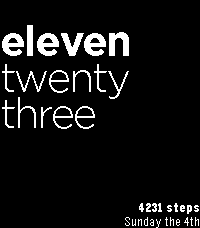</a>

<h2 class="app-name" id="app-58451b14ca30941def000345"><a href="https://apps.rebble.io/en_US/application/58451b14ca30941def000345">Text with Steps</a></h2>
<a class="app-source" href="https://github.com/afourney/sliding-text/" title="Source code" data-search-exclude>View source</a>

by <a href="https://apps.rebble.io/en_US/developer/52f00d81be23a5a42700001c/1" title="More from this developer">Adam Fourney</a>

MIT v1.1 Updated 2016-12-05 Rebble App Store

Runs on: Round 2, Time 2, Pebble 2 Duo, Pebble 2, Time Round, Time, Classic

This simple fork of Pebble&#x27;s Sliding Text watchface shows the current step count, as well as the date.

<h2 class="app-name" id="app-573b241f44ca4b6d6300000f"><a href="https://apps.repebble.com/573b241f44ca4b6d6300000f">textklockan</a></h2>
<a class="app-source" href="https://github.com/walleball/textklockan" title="Source code" data-search-exclude>View source</a>

by <a href="https://apps.repebble.com/apps/dev/walleball_558595d2e4660ad468000101" title="More from this developer">walleball</a>

Not checked yet v1.0 Updated 2016-05-18

Runs on: Round 2, Time 2, Pebble 2 Duo, Pebble 2, Time Round, Time, Classic

Text-based watchface displaying the current time in Swedish

<a class="app-shot" href="https://apps.repebble.com/56d5b06bfed12326db000015" data-search-exclude>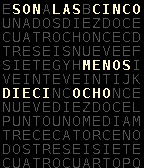</a>

<h2 class="app-name" id="app-56d5b06bfed12326db000015"><a href="https://apps.repebble.com/56d5b06bfed12326db000015">Textual</a></h2>
<a class="app-source" href="https://github.com/Inriki/Textual" title="Source code" data-search-exclude>View source</a>

by <a href="https://apps.repebble.com/apps/dev/inriki_554ca832f54ec91cf700001f" title="More from this developer">inriki</a>

No licence v1.03 Updated 2016-03-02

Runs on: Round 2, Time 2, Time Round, Time

La hora se muestra de manera textual sobre un matriz de caracteres.

<h2 class="app-name" id="app-545b4e8a53293c167e000016"><a href="https://apps.repebble.com/545b4e8a53293c167e000016">TextWatch - Hungarian</a></h2>
<a class="app-source" href="https://github.com/atomester/Pebble-TextWatchHU" title="Source code" data-search-exclude>View source</a>

by <a href="https://apps.repebble.com/apps/dev/ato-hu_5446abf13211c0ef3f000001" title="More from this developer">ato.hu</a>

No licence v1.3 Updated 2014-11-06

Runs on: Time 2, Pebble 2 Duo, Pebble 2, Time, Classic

The well-known TextWatch watchface translated to hungarian. Szöveges idő - magyarul és egy kicsit bénán. Van egy kis gond a tizeseknél és a huszasnál, de dolgozom rajta. Relax.

<a class="app-shot" href="https://apps.rebble.io/en_US/application/58a94da90dfc32d35b0002f8" data-search-exclude>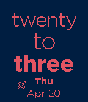</a>

<h2 class="app-name" id="app-58a94da90dfc32d35b0002f8"><a href="https://apps.rebble.io/en_US/application/58a94da90dfc32d35b0002f8">TextWatch Clima</a></h2>
<a class="app-source" href="https://github.com/dieghernan/TextWatchClima" title="Source code" data-search-exclude>View source</a>

by <a href="https://apps.rebble.io/en_US/developer/52f15b6dc41172eebc0004dc/1" title="More from this developer">dieghernan</a>

Not checked yet v7.1 Updated 2017-05-25 Rebble App Store

Runs on: Round 2, Time 2, Pebble 2 Duo, Pebble 2, Time Round, Time, Classic

* Consider ♥ if you enjoy this watchface * Add some weather to your TextWatch! This watchface brings the weather conditions straight to your wrist. Multilingual -------- - Spanish - English …

<h2 class="app-name" id="app-52ebb98e7d49766c72000025"><a href="https://apps.repebble.com/52ebb98e7d49766c72000025">TextWatch NO</a></h2>
<a class="app-source" href="https://github.com/iFlips/TextWatchNO" title="Source code" data-search-exclude>View source</a>

by <a href="https://apps.repebble.com/apps/dev/flips_52c485fab496f14847000057" title="More from this developer">Flips</a>

Not checked yet v1.0. Updated 2014-02-01

Runs on: Time 2, Pebble 2 Duo, Pebble 2, Time, Classic

A Norwegian version of TextWatch. Credits to the Pebble team for making the original watchface and Pebble forums user mmdumi for adding the source to GitHub.

<h2 class="app-name" id="app-52ee05d3e696ad71b0000003"><a href="https://apps.repebble.com/52ee05d3e696ad71b0000003">TextWatch RO</a></h2>
<a class="app-source" href="https://github.com/wearewip/PebbleTextWatch/tree/textRO" title="Source code" data-search-exclude>View source</a>

by <a href="https://apps.repebble.com/apps/dev/work-in-progress_52b200508c081514ed000025" title="More from this developer">Work In Progress</a>

Not checked yet v2.0.0 Updated 2014-02-02

Runs on: Time 2, Pebble 2 Duo, Pebble 2, Time, Classic

TextWatch watchface in Romanian language with the same animations as the first party one.

<h2 class="app-name" id="app-5470f9ed54f824d3530000ef"><a href="https://apps.repebble.com/5470f9ed54f824d3530000ef">TextWatch RO2</a></h2>
<a class="app-source" href="http://corero.byethost7.com/sources/textwatch_ro2_3.zip" title="Source code" data-search-exclude>View source</a>

by <a href="https://apps.repebble.com/apps/dev/ovidiu-a_545df03eb8caab2ea700003b" title="More from this developer">Ovidiu A.</a>

See source v1.2 Updated 2014-12-01

Runs on: Time 2, Pebble 2 Duo, Pebble 2, Time, Classic

This watchface is based on TextWatch RO, but with some fixes.

<h2 class="app-name" id="app-54dbbfc9351fb9c2bd0000d2"><a href="https://apps.repebble.com/54dbbfc9351fb9c2bd0000d2">TextWatch SE</a></h2>
<a class="app-source" href="https://github.com/dasca/Pebble_TextWatch_SE" title="Source code" data-search-exclude>View source</a>

by <a href="https://apps.repebble.com/apps/dev/olivella_54d8ba0a514b484678000085" title="More from this developer">Olivella</a>

Not checked yet v1.0 Updated 2015-02-11

Runs on: Time 2, Pebble 2 Duo, Pebble 2, Time, Classic

Simple Textwatch in Swedish

<h2 class="app-name" id="app-52db4b58e798b9c8c9000347"><a href="https://apps.repebble.com/52db4b58e798b9c8c9000347">TextWatch with Day/Date</a></h2>
<a class="app-source" href="https://github.com/stough/PebbleTextWatch" title="Source code" data-search-exclude>View source</a>

by <a href="https://apps.repebble.com/apps/dev/ginko72_52d0e60b3364778ac00000c9" title="More from this developer">Ginko72</a>

Not checked yet v3.0 Updated 2026-04-20

Runs on: Time 2, Pebble 2 Duo, Pebble 2, Time, Classic

This watch is a modification of the built in Text Watch face to add date information and to correct the time representation for times that have a spoken zero (10:02 as &quot;ten oh two&quot;). Date info…

<a class="app-shot" href="https://apps.repebble.com/52cb4b946e5f703b140000aa" data-search-exclude>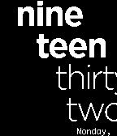</a>

<h2 class="app-name" id="app-52cb4b946e5f703b140000aa"><a href="https://apps.repebble.com/52cb4b946e5f703b140000aa">TextWatch24</a></h2>
<a class="app-source" href="https://github.com/rigel314/pebbleTextWatch24" title="Source code" data-search-exclude>View source</a>

by <a href="https://apps.repebble.com/apps/dev/rigel314_529aa0fad17b50707b00001d" title="More from this developer">rigel314</a>

Not checked yet v2.1.3 Updated 2014-03-03

Runs on: Time 2, Pebble 2 Duo, Pebble 2, Time, Classic

Displays the time like the default text watch, but in 24 hour time. Has options for showing the date and the display for a leading zero in the minutes. &quot; oh &quot; or &quot; o&#x27; &quot;. The watchface animates a…

<a class="app-shot" href="https://apps.repebble.com/5318b9e495b1eacb1000000e" data-search-exclude>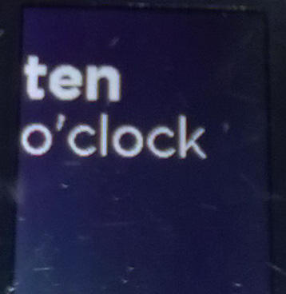</a>

<h2 class="app-name" id="app-5318b9e495b1eacb1000000e"><a href="https://apps.repebble.com/5318b9e495b1eacb1000000e">TextWatchBT</a></h2>
<a class="app-source" href="https://github.com/nazaretvaz/TextWatchBT" title="Source code" data-search-exclude>View source</a>

by <a href="https://apps.repebble.com/apps/dev/nazaret-vaz_52f06c123fbdba0ccb0019c9" title="More from this developer">Nazaret Vaz</a>

Not checked yet v2.0.0 Updated 2014-03-07

Runs on: Time 2, Pebble 2 Duo, Pebble 2, Time, Classic

TextWatch Face with Proximity. If your phone is out of Bluetooth range, it displays a message+vibrates+turns the backlight on. This is based on PebbleTextWatch by wearewip.

<h2 class="app-name" id="app-52e0ed6dd8561d962b00010f"><a href="https://apps.repebble.com/52e0ed6dd8561d962b00010f">TH10 2.0</a></h2>
<a class="app-source" href="https://github.com/Jnmattern/TH10-Date_2.0" title="Source code" data-search-exclude>View source</a>

by <a href="https://apps.repebble.com/apps/dev/jnm_529994c0e627ce7ba1000050" title="More from this developer">Jnm</a>

No licence v1.0.0 Updated 2014-01-23

Runs on: Time 2, Pebble 2 Duo, Pebble 2, Time, Classic

Analog watch with day of month inspired by the Torgoen T10 Original 1.x version by Hudson.

<a class="app-shot" href="https://apps.repebble.com/5810e678d0050280b10000e9" data-search-exclude>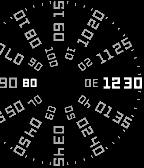</a>

<h2 class="app-name" id="app-5810e678d0050280b10000e9"><a href="https://apps.repebble.com/5810e678d0050280b10000e9">That&#x27;s No Moon</a></h2>
<a class="app-source" href="https://github.com/Spitemare/tnm" title="Source code" data-search-exclude>View source</a>

by <a href="https://apps.repebble.com/apps/dev/david-morgan_564924e14f9b2989ec000014" title="More from this developer">David Morgan</a>

ISC v1.0 Updated 2016-10-26

Runs on: Round 2, Time 2, Pebble 2 Duo, Pebble 2, Time Round, Time, Classic

...it&#x27;s a watchface. TNM displays the time in a unique, rotary fashion. It&#x27;s reminiscent of a famous, fully armed and operational battle station. Outer ring is minutes. Middle ring is hour. Inner…

<h2 class="app-name" id="app-529997b1e627ceb4e200005a"><a href="https://apps.repebble.com/529997b1e627ceb4e200005a">The 12 Doctors</a></h2>
<a class="app-source" href="https://github.com/drwrose/doctors.git" title="Source code" data-search-exclude>View source</a>

by <a href="https://apps.repebble.com/apps/dev/drwrose_52995888e627ce1aff000009" title="More from this developer">drwrose</a>

Not checked yet v4.6 Updated 2016-11-27

Runs on: Round 2, Time 2, Pebble 2 Duo, Pebble 2, Time Round, Time, Classic

12 Doctors and 12 hours: a different Doctor for each hour of the day. You can read the time by identifying the face of the Doctor for the hour, combined with the minutes displayed in the lower right.

<a class="app-shot" href="https://apps.repebble.com/696cecb7fd11fd00098d82f8" data-search-exclude>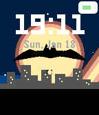</a>

<h2 class="app-name" id="app-696cecb7fd11fd00098d82f8"><a href="https://apps.repebble.com/696cecb7fd11fd00098d82f8">The Bat</a></h2>
<a class="app-source" href="https://github.com/priyankark/pebble-wf-agent-skill" title="Source code" data-search-exclude>View source</a>

by <a href="https://apps.repebble.com/apps/dev/aircodum_67bc77bf37d408000a74f7d3" title="More from this developer">AirCodum</a>

Not checked yet v1.0 Updated 2026-01-18

Runs on: Round 2, Time 2, Pebble 2 Duo, Pebble 2, Time Round, Time, Classic

Transform your Pebble into the iconic Bat Signal! Watch as the searchlight sweeps across Gotham&#x27;s night sky, illuminating the legendary bat symbol with a dramatic glow.

<a class="app-shot" href="https://apps.repebble.com/555be32a4231f4ddf300004a" data-search-exclude>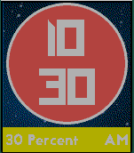</a>

<h2 class="app-name" id="app-555be32a4231f4ddf300004a"><a href="https://apps.repebble.com/555be32a4231f4ddf300004a">The Corcle Face</a></h2>
<a class="app-source" href="https://bitbucket.org/nhano0228/circle_colors" title="Source code" data-search-exclude>View source</a>

by <a href="https://apps.repebble.com/apps/dev/noah-hanover_54ef90192365a40c370000b5" title="More from this developer">Noah Hanover</a>

See source v1.0 Updated 2015-05-20

Runs on: Time 2, Time

This app shows you the time with beautiful animations and a breathtaking starry night. How could you not wonder what is the beyond without looking at this watchface?

<h2 class="app-name" id="app-5820d9c034da21cdc50000bb"><a href="https://apps.repebble.com/5820d9c034da21cdc50000bb">The Division</a></h2>
<a class="app-source" href="https://github.com/jakerusch/the_division_2" title="Source code" data-search-exclude>View source</a>

by <a href="https://apps.repebble.com/apps/dev/jakerusch_5744715f00693fd87600000b" title="More from this developer">Jakerusch</a>

Not checked yet v1.0 Updated 2016-11-08

Runs on: Time 2, Pebble 2 Duo, Pebble 2, Time, Classic

The Division watchface for APLITE, BASALT, AND DORITE. Displays day of week, month, and day of month, battery level, bluetooth connectivity, city/location and current weather in Fahrenheit.

<h2 class="app-name" id="app-5838a47d00355a8e27000515"><a href="https://apps.repebble.com/5838a47d00355a8e27000515">The Division Celsius</a></h2>
<a class="app-source" href="https://github.com/jakerusch/THE_DIVISION_2" title="Source code" data-search-exclude>View source</a>

by <a href="https://apps.repebble.com/apps/dev/jakerusch_5744715f00693fd87600000b" title="More from this developer">Jakerusch</a>

Not checked yet v1.0 Updated 2016-11-25

Runs on: Time 2, Pebble 2 Duo, Pebble 2, Time, Classic

The Division watchface for APLITE, BASALT, AND DORITE. Displays day of week, month, and day of month, battery level, bluetooth connectivity, city/location and current weather in Celsius.

<h2 class="app-name" id="app-552825b8d59149cca6000064"><a href="https://apps.repebble.com/552825b8d59149cca6000064">The Endless River</a></h2>
<a class="app-source" href="https://github.com/gretchycat/DarkSide" title="Source code" data-search-exclude>View source</a>

by <a href="https://apps.repebble.com/apps/dev/gretchycat_52bf60060136db31fb0000d3" title="More from this developer">Gretchycat</a>

Not checked yet v3.0 Updated 2015-10-19

Runs on: Time 2, Pebble 2 Duo, Pebble 2, Time, Classic

The Endless River cover art by Pink Floyd Features a 2 week calendar, and when you shake or tap, see a 5 day weather forecast. Tap again for sunrise, sunset and moon phase. Tap a third time for a…

<h2 class="app-name" id="app-62055185843fe7000aa1c638"><a href="https://apps.rebble.io/en_US/application/62055185843fe7000aa1c638">The Essence</a></h2>
<a class="app-source" href="https://github.com/zamuz/the-essence" title="Source code" data-search-exclude>View source</a>

by <a href="https://apps.rebble.io/en_US/developer/609457438a44a400535e6933/1" title="More from this developer">Gonzalo Muñoz</a>

Not checked yet v1.81 Updated 2025-04-15 Rebble App Store

Runs on: Round 2, Time 2, Pebble 2 Duo, Pebble 2, Time Round, Time, Classic

A watchface based on the Ressence watches, with customizable colors.

<h2 class="app-name" id="app-5e9be8613dd31033ee19420e"><a href="https://apps.rebble.io/en_US/application/5e9be8613dd31033ee19420e">The Green Lantern</a></h2>
<a class="app-source" href="https://github.com/pauleeeeee/the-green-lantern-pebble-watchface" title="Source code" data-search-exclude>View source</a>

by <a href="https://apps.rebble.io/en_US/developer/5e65d05a3dd3108f341c08ea/1" title="More from this developer">swansswansswansswanssosoft</a>

Not checked yet v1.0 Updated 2020-04-19 Rebble App Store

Runs on: Round 2, Time Round

The Green Lantern symbol on your wrist.

<h2 class="app-name" id="app-569f256470f3698e29000024"><a href="https://apps.repebble.com/569f256470f3698e29000024">The Hart</a></h2>
<a class="app-source" href="https://github.com/dan-hart/the-hart-pebble-watchface" title="Source code" data-search-exclude>View source</a>

by <a href="https://apps.repebble.com/apps/dev/dan-hart_52fec0a4756d34a53a0004b6" title="More from this developer">Dan Hart</a>

Not checked yet v1.9 Updated 2017-03-16

Runs on: Time 2, Pebble 2 Duo, Pebble 2, Time, Classic

PERSONAL USE - LOOK AT MY OTHER WATCH FACES FOR CUSTOMIZABILITY

<h2 class="app-name" id="app-557f67d73c562e18e7000097"><a href="https://apps.repebble.com/557f67d73c562e18e7000097">The Journalism Show</a></h2>
<a class="app-source" href="https://bitbucket.org/Masamune_Shadow/geraldobeedogwatchface" title="Source code" data-search-exclude>View source</a>

by <a href="https://apps.repebble.com/apps/dev/spencer-johnson_52ac665331a5fa7c25000006" title="More from this developer">Spencer Johnson</a>

See source v1.0 Updated 2015-06-16

Runs on: Time 2, Time

Pretty simple watchface, just tells the time. Features Geraldo Beedog from The Journalism Show (http://rockmelonsoda.com/tjs/) created by Topher Cantler (@Topherocious)

<h2 class="app-name" id="app-544f1ac4dc21b79c2d000014"><a href="https://apps.repebble.com/544f1ac4dc21b79c2d000014">The Modern Gentleman</a></h2>
<a class="app-source" href="https://github.com/dan-hart/the-modern-gentleman" title="Source code" data-search-exclude>View source</a>

by <a href="https://apps.repebble.com/apps/dev/dan-hart_52fec0a4756d34a53a0004b6" title="More from this developer">Dan Hart</a>

Not checked yet v2.0 Updated 2016-10-16

Runs on: Time 2, Pebble 2 Duo, Pebble 2, Time, Classic

TMG is a great low-power consumption option for Pebble Time! The Original MG. ============= Features: - Optimized for battery life. - Sleek, simple design. - Easy-to-read letters and numbers.

<h2 class="app-name" id="app-569421164633c80ea8000070"><a href="https://apps.repebble.com/569421164633c80ea8000070">The Modern Gentleman (Spanish)</a></h2>
<a class="app-source" href="http://www.github.com/dan-hart/the-modern-gentleman.git" title="Source code" data-search-exclude>View source</a>

by <a href="https://apps.repebble.com/apps/dev/dan-hart_52fec0a4756d34a53a0004b6" title="More from this developer">Dan Hart</a>

No licence v1.2 Updated 2016-01-11

Runs on: Round 2, Time 2, Pebble 2 Duo, Pebble 2, Time Round, Time, Classic

TMG with a Spanish Twist!

<h2 class="app-name" id="app-569c40bbd05afe633b000057"><a href="https://apps.repebble.com/569c40bbd05afe633b000057">The Modern Gentleman 2</a></h2>
<a class="app-source" href="https://github.com/dan-hart/the-modern-gentleman-2" title="Source code" data-search-exclude>View source</a>

by <a href="https://apps.repebble.com/apps/dev/dan-hart_52fec0a4756d34a53a0004b6" title="More from this developer">Dan Hart</a>

Not checked yet v1.7 Updated 2016-09-03

Runs on: Round 2, Time 2, Pebble 2 Duo, Pebble 2, Time Round, Time, Classic

The Modern Gentleman 2 ==================== - Color Customizable! - C or F Weather - MM-DD, DD-MM (with option to add year!) - Language Customizability Available with Spanish Days of the Week!

<h2 class="app-name" id="app-5688a058fd4a39a0ab000066"><a href="https://apps.repebble.com/5688a058fd4a39a0ab000066">The Nationalist</a></h2>
<a class="app-source" href="https://github.com/awhipp/patriotic-watchface-pebble-time" title="Source code" data-search-exclude>View source</a>

by <a href="https://apps.repebble.com/apps/dev/alexander-the-dev_567cbdd9209cace85800013f" title="More from this developer">Alexander the Dev</a>

No licence v1.1 Updated 2016-01-04

Runs on: Round 2, Time 2, Time Round, Time

The completely free watchface to support the country of your choice! Select the country. The watch face adjusts based on your national flag&#x27;s primary colors. Currently support exists for the…

<h2 class="app-name" id="app-55d897b132a1666693000004"><a href="https://apps.repebble.com/55d897b132a1666693000004">The Past, The Present And The Future</a></h2>
<a class="app-source" href="https://github.com/cal2195/Pebble-WatchFace---The-Past-The-Present-and-The-Future" title="Source code" data-search-exclude>View source</a>

by <a href="https://apps.repebble.com/apps/dev/cal-martin_5585bc5d493e104646000019" title="More from this developer">Cal Martin</a>

Not checked yet v1.0 Updated 2015-08-22

Runs on: Time 2, Pebble 2 Duo, Pebble 2, Time, Classic

Simple little watchface, showing the current time in bold along with the last two minutes and the next two minutes! Makes a nice little diamond shape! :)

<h2 class="app-name" id="app-542090f3d6b6c9164a0001d8"><a href="https://apps.repebble.com/542090f3d6b6c9164a0001d8">The Pebble Runner</a></h2>
<a class="app-source" href="https://github.com/FZBHackTheNorth/TheRunningMan" title="Source code" data-search-exclude>View source</a>

by <a href="https://apps.repebble.com/apps/dev/brian_541cc39c0d8e6327fb000074" title="More from this developer">Brian</a>

No licence v1.0 Updated 2014-09-22

Runs on: Time 2, Pebble 2 Duo, Pebble 2, Time, Classic

Travel the world with your trusty partner! Team: Ziying, Felix

<h2 class="app-name" id="app-3023af58454c4d53b96def0a"><a href="https://apps.repebble.com/3023af58454c4d53b96def0a">The Real Time</a></h2>
<a class="app-source" href="https://github.com/jceaser/pebble-real-time" title="Source code" data-search-exclude>View source</a>

by <a href="https://apps.repebble.com/apps/dev/thomas-cherry_e17c5c02c0004112d037771d" title="More from this developer">Thomas Cherry</a>

Not checked yet v0.1 Updated 2026-04-26

Runs on: Round 2, Time 2, Pebble 2 Duo, Pebble 2, Time Round, Time, Classic

The Government does not want you to know what time it is, they want you living in a world created by them, a world where they claim they can change the rotation of the Earth. Not any more people…

<h2 class="app-name" id="app-54fa28ca782898750100008f"><a href="https://apps.repebble.com/54fa28ca782898750100008f">The Swinging Friar</a></h2>
<a class="app-source" href="https://github.com/defeatthewheat/Swinging-Friar-Face" title="Source code" data-search-exclude>View source</a>

by <a href="https://apps.repebble.com/apps/dev/defeatthewheat_533068c743aeae77730001d8" title="More from this developer">defeatthewheat</a>

Not checked yet v1.0 Updated 2015-03-07

Runs on: Time 2, Pebble 2 Duo, Pebble 2, Time, Classic

This watchface is an homage to San Diego&#x27;s baseball mascot. The watchface is designed to look like an analog watch, where the Friar&#x27;s swinging arms act as a minute hand.

<h2 class="app-name" id="app-4c6bfe56532f4849bce026bb"><a href="https://apps.repebble.com/4c6bfe56532f4849bce026bb">The Tile</a></h2>
<a class="app-source" href="https://github.com/joerdav/the-tile" title="Source code" data-search-exclude>View source</a>

by <a href="https://apps.repebble.com/apps/dev/joerdav_0af8416e53219f018ead5233" title="More from this developer">joerdav</a>

Not checked yet v1.0.3 Updated 2026-07-22

Runs on: Time 2, Time

The watch face the internet draws. Each week the community draws 16x16 pixel-art tiles and votes head-to-head; the winning tile is crowned at Sunday midnight UTC and appears on every watch. Shows…

<h2 class="app-name" id="app-54698673ecee197750000082"><a href="https://apps.repebble.com/54698673ecee197750000082">the time is now</a></h2>
<a class="app-source" href="https://github.com/jakeatwork/thetimeisnow" title="Source code" data-search-exclude>View source</a>

by <a href="https://apps.repebble.com/apps/dev/agile-ramen-llc_546950dbecee195d8400005b" title="More from this developer">Agile Ramen LLC</a>

Not checked yet v1.0 Updated 2014-11-17

Runs on: Time 2, Pebble 2 Duo, Pebble 2, Time, Classic

The best watchface for RIGHT NOW and living in the present. Watching the clock too often? Need to zone out? This is your watchface for when you don&#x27;t want to keep track of time.

<h2 class="app-name" id="app-55915343612d76e85c00003e"><a href="https://apps.repebble.com/55915343612d76e85c00003e">The Weather Watch</a></h2>
<a class="app-source" href="https://github.com/aletsdelarosa/theWeatherWatch" title="Source code" data-search-exclude>View source</a>

by <a href="https://apps.repebble.com/apps/dev/alex-de-la-rosa_5536caed2674255e7c000006" title="More from this developer">Alex de la Rosa</a>

No licence v1.0 Updated 2015-06-29

Runs on: Time 2, Pebble 2 Duo, Pebble 2, Time, Classic

A simple watch face with weather info using openweathermap.org API. You can see and use de source code. Thanks for downloading!

<h2 class="app-name" id="app-566782ff39c4857dc4000033"><a href="https://apps.repebble.com/566782ff39c4857dc4000033">Themes</a></h2>
<a class="app-source" href="https://github.com/mereed/pebbleface-themes" title="Source code" data-search-exclude>View source</a>

by <a href="https://apps.repebble.com/apps/dev/chops_52d76309bd61272345000001" title="More from this developer">chops</a>

Not checked yet v2.0 Updated 2017-09-16

Runs on: Round 2, Time 2, Time Round, Time

jul 15: refreshed most images/themes battery only shows if below 40% slightly modified layout to see more of each image option to hide weather info ----- The layout here is very simple - just a…

<h2 class="app-name" id="app-56db6dddd86927bb08000032"><a href="https://apps.repebble.com/56db6dddd86927bb08000032">Theta</a></h2>
<a class="app-source" href="http://github.com/briwestervelt/theta_source" title="Source code" data-search-exclude>View source</a>

by <a href="https://apps.repebble.com/apps/dev/briwest_549f1c36ef9cfa34520001fb" title="More from this developer">BriWest</a>

No licence v1.2 Updated 2016-08-31

Runs on: Round 2, Time 2, Pebble 2 Duo, Pebble 2, Time Round, Time, Classic

Updated to use Pebble&#x27;s Unobstructed Area API to show timeline Quick Views! Theta is a clean and glancable watch face designed to make the most of your screen&#x27;s real estate. The angle of the inner…

<h2 class="app-name" id="app-5527e95fe0d8434b4a000032"><a href="https://apps.repebble.com/5527e95fe0d8434b4a000032">Thetis Moon</a></h2>
<a class="app-source" href="https://github.com/gretchycat/DarkSide" title="Source code" data-search-exclude>View source</a>

by <a href="https://apps.repebble.com/apps/dev/gretchycat_52bf60060136db31fb0000d3" title="More from this developer">Gretchycat</a>

Not checked yet v3.0 Updated 2015-10-19

Runs on: Time 2, Pebble 2 Duo, Pebble 2, Time, Classic

A watchface with the Thetis Moon image from Digital Blasphemy Features a 2 week calendar, and when you shake or tap, see a 5 day weather forecast. Tap again for sunrise, sunset and moon phase. Tap…

<h2 class="app-name" id="app-550ccb556caaed4e0100006d"><a href="https://apps.repebble.com/550ccb556caaed4e0100006d">Thin</a></h2>
<a class="app-source" href="https://github.com/C-D-Lewis/pebble-dev" title="Source code" data-search-exclude>View source</a>

by <a href="https://apps.repebble.com/apps/dev/chris-lewis_5299cd30e627ce1147000099" title="More from this developer">Chris Lewis</a>

No licence v1.20.0 Updated 2026-08-16

Runs on: Round 2, Time 2, Pebble 2 Duo, Pebble 2, Time Round, Time, Classic

Simple, customizable watchface with splashes of color. Shows battery level with hour markers. Use the config page to adjust which features you want from: - Show weekday/month - Show day of the…

<h2 class="app-name" id="app-56f511f8a16b34979b00003e"><a href="https://apps.repebble.com/56f511f8a16b34979b00003e">Thin Extended</a></h2>
<a class="app-source" href="https://github.com/silasg/thin-ext" title="Source code" data-search-exclude>View source</a>

by <a href="https://apps.repebble.com/apps/dev/silasg_531ac7f29091c48bd40003cc" title="More from this developer">SilasG</a>

Not checked yet v1.3 Updated 2016-08-27

Runs on: Round 2, Time 2, Pebble 2 Duo, Pebble 2, Time Round, Time, Classic

Extended the awesome Thin watchface by Chris Lewis with a light theme, additional minute markers, ability to disable all markers, energy saving options and a new config page. More to come ...

<h2 class="app-name" id="app-55fd507cf1f7ea175900005f"><a href="https://apps.repebble.com/55fd507cf1f7ea175900005f">Thin Markers</a></h2>
<a class="app-source" href="https://github.com/hw/thin" title="Source code" data-search-exclude>View source</a>

by <a href="https://apps.repebble.com/apps/dev/hockwoo-tan_52f2c3ab341bc1eadd000018" title="More from this developer">HockWoo Tan</a>

Not checked yet v0.2 Updated 2025-12-01

Runs on: Time 2, Pebble 2 Duo, Pebble 2, Time, Classic

A simple watch face based on the Thin watch face by C. Lewis, with added markers to aid more precise reading of the current time, and ability to configure the colour of watch hands and markers. **…

<h2 class="app-name" id="app-55789a4753e13cba20000061"><a href="https://apps.repebble.com/55789a4753e13cba20000061">Thin moded</a></h2>
<a class="app-source" href="https://github.com/mephissto/thin" title="Source code" data-search-exclude>View source</a>

by <a href="https://apps.repebble.com/apps/dev/mephissto_5362a57dc2a5e4f05c000021" title="More from this developer">mephissto</a>

Not checked yet v1.1 Updated 2015-06-20

Runs on: Time 2, Pebble 2 Duo, Pebble 2, Time, Classic

Based on the Thin watchface made by Chris Lewis. !! New Theme !! - Green - Red - Purple

<h2 class="app-name" id="app-55ad922da8f41e37f5000029"><a href="https://apps.repebble.com/55ad922da8f41e37f5000029">Thin-Red Hour</a></h2>
<a class="app-source" href="https://burnsoftware.wordpress.com/" title="Source code" data-search-exclude>View source</a>

by <a href="https://apps.repebble.com/apps/dev/zach-burnham_552f3680c34162df9100008f" title="More from this developer">Zach Burnham</a>

See source v0.4 Updated 2016-02-06

Runs on: Round 2, Time 2, Pebble 2 Duo, Pebble 2, Time Round, Time, Classic

I modified the Thin watchface by Chris Lewis and wanted to share my take on it. The biggest changes are the more circular shape of the watchface, the red hour hand, and the minute marks showing…

<h2 class="app-name" id="app-53fea5929bfdec7d4b00008c"><a href="https://apps.repebble.com/53fea5929bfdec7d4b00008c">Thinline</a></h2>
<a class="app-source" href="https://github.com/jphatton/pebble_thinline" title="Source code" data-search-exclude>View source</a>

by <a href="https://apps.repebble.com/apps/dev/jory-hatton_536e9c4ad87391525600011b" title="More from this developer">Jory Hatton</a>

Not checked yet v1.0 Updated 2014-08-28

Runs on: Time 2, Pebble 2 Duo, Pebble 2, Time, Classic

A minimalist watchface for pebble.

<h2 class="app-name" id="app-576e5f436c2104f46f000010"><a href="https://apps.repebble.com/576e5f436c2104f46f000010">thins</a></h2>
<a class="app-source" href="https://github.com/qwqert/Pebble_watchfaces.git" title="Source code" data-search-exclude>View source</a>

by <a href="https://apps.repebble.com/apps/dev/qwqert_563040ae4cb14285e0000029" title="More from this developer">qwqert</a>

Not checked yet v1.0 Updated 2016-06-25

Runs on: Time 2, Pebble 2 Duo, Pebble 2, Time, Classic

A simple watchface based on thin.

<h2 class="app-name" id="app-52d8b9d7aef8d50e88000026"><a href="https://apps.repebble.com/52d8b9d7aef8d50e88000026">Tic Tock Toe</a></h2>
<a class="app-source" href="https://github.com/pebble/pebble-sdk-examples/tree/master/watchfaces/tic_tock_toe" title="Source code" data-search-exclude>View source</a>

by <a href="https://apps.repebble.com/apps/dev/pebble_52d8a44faef8d590d3000029" title="More from this developer">Pebble</a>

Not checked yet v4.0.0 Updated 2014-01-17

Runs on: Time 2, Pebble 2 Duo, Pebble 2, Time, Classic

Tic Toc Toe Example Watchface

<h2 class="app-name" id="app-01d9cb793d7b4f109ad3a9cc"><a href="https://apps.repebble.com/01d9cb793d7b4f109ad3a9cc">TicDot</a></h2>
<a class="app-source" href="https://github.com/cletqui/ticdot" title="Source code" data-search-exclude>View source</a>

by <a href="https://apps.repebble.com/apps/dev/clet_d2bf7c7db293536c99c19ee0" title="More from this developer">clet</a>

Not checked yet v1.2.4 Updated 2026-08-23

Runs on: Round 2, Time 2, Time Round, Time

TicDot is a minimalist analog watchface inspired by the iconic TicToc stock face shipped with every Pebble. It keeps the clean two-hand analog design and builds on it by encoding all information…

<h2 class="app-name" id="app-5ff3bb3c1e6bb18626ced4cb"><a href="https://apps.rebble.io/en_US/application/5ff3bb3c1e6bb18626ced4cb">Ticker</a></h2>
<a class="app-source" href="https://github.com/pauleeeeee/pebble-stock-ticker" title="Source code" data-search-exclude>View source</a>

by <a href="https://apps.rebble.io/en_US/developer/5e65d05a3dd3108f341c08ea/1" title="More from this developer">swansswansswansswanssosoft</a>

Not checked yet v1.0 Updated 2021-01-05 Rebble App Store

Runs on: Time 2, Pebble 2 Duo, Pebble 2, Time, Classic

Display the current and historical price of most cryptocurrencies as well as most publicly traded stocks on the major exchanges. Unfortunately, real-time data is not currently available for stocks…

<h2 class="app-name" id="app-579574dc50c752b5c90003b4"><a href="https://apps.repebble.com/579574dc50c752b5c90003b4">Ticker 2</a></h2>
<a class="app-source" href="https://github.com/mereed/pebbleface-ticke2" title="Source code" data-search-exclude>View source</a>

by <a href="https://apps.repebble.com/apps/dev/chops_52d76309bd61272345000001" title="More from this developer">chops</a>

Not checked yet v1.1 Updated 2016-07-27

Runs on: Round 2, Time 2, Time Round, Time

27 july option to disable pattern on analog screen removed inner black circle batt charging text same colour as scroll text This came about while working on an update for my original &quot;Ticker Time&quot;…

<h2 class="app-name" id="app-6a20a3c40f88430009151b61"><a href="https://apps.repebble.com/6a20a3c40f88430009151b61">Ticker Tape Time</a></h2>
<a class="app-source" href="https://github.com/FlitneyR/sliders_time" title="Source code" data-search-exclude>View source</a>

by <a href="https://apps.repebble.com/apps/dev/robert-flitney_6a1f63b8996dd60008aa4c29" title="More from this developer">Robert Flitney</a>

No licence v1.4.1 Updated 2026-07-05

Runs on: Time 2, Pebble 2 Duo, Pebble 2, Time, Classic

See the passage of time on the scale of seconds, minutes, hours, and days. By displaying the time as multiple progress bars, Ticker Tape Time gives you an instinctive sense of the time, but still…

<h2 class="app-name" id="app-55ce53e8fb84fb752300004f"><a href="https://apps.repebble.com/55ce53e8fb84fb752300004f">Ticking Analog</a></h2>
<a class="app-source" href="https://github.com/ygalanter/Ticking_Analog" title="Source code" data-search-exclude>View source</a>

by <a href="https://apps.repebble.com/apps/dev/comfortably-numb_52f547605101128b2200005a" title="More from this developer">Comfortably Numb</a>

Not checked yet v1.0 Updated 2015-08-14

Runs on: Time 2, Pebble 2 Duo, Pebble 2, Time, Classic

At first glance this looks like classic stock analog face. But bring it to your ear and listen carefully... DISCLAMER 1: 99% code for this watchface is original Katharine Berry&#x27;s &quot;Simple Analog&quot;…

<h2 class="app-name" id="app-53cdce64cb0ffce8510000aa"><a href="https://apps.repebble.com/53cdce64cb0ffce8510000aa">TickTockBlock - Pebble Developer Challenge Edition</a></h2>
<a class="app-source" href="https://github.com/xSpiritSoulx/TickTockBlock-Final" title="Source code" data-search-exclude>View source</a>

by <a href="https://apps.repebble.com/apps/dev/paul-s_52f16cb80bbfec895a000677" title="More from this developer">Paul S.</a>

Not checked yet v1.0.0 Updated 2014-07-22

Runs on: Time 2, Pebble 2 Duo, Pebble 2, Time, Classic

A watchface featuring a moving dot and clock. Simple, yet modern. 24 Hour mode only at this time, sorry!

<h2 class="app-name" id="app-5846508000355a0a120003ec"><a href="https://apps.rebble.io/en_US/application/5846508000355a0a120003ec">Tictoc Day</a></h2>
<a class="app-source" href="https://github.com/Kieves/Pebble_TictocDay" title="Source code" data-search-exclude>View source</a>

by <a href="https://apps.rebble.io/en_US/developer/567c4d758dba1fb851000076/1" title="More from this developer">Kieves</a>

No licence v1.2 Updated 2017-07-02 Rebble App Store

Runs on: Time 2, Time

Small modification on Pebble&#x27;s Tictoc watchface. Added day of the month and weather provided by OpenWeatherMap.org. If weather is not available, the day icon is centered. App configuration made…

<h2 class="app-name" id="app-569d6826c7fdf7d47f000006"><a href="https://apps.repebble.com/569d6826c7fdf7d47f000006">TicToc for OG (2)</a></h2>
<a class="app-source" href="https://www.dropbox.com/s/whzp6brv6ix4j3l/TicToc_for_OG%20%289%29.zip?dl=0" title="Source code" data-search-exclude>View source</a>

by <a href="https://apps.repebble.com/apps/dev/will-aney_5684764b55484b11eb000069" title="More from this developer">Will Aney</a>

Not checked yet v1.0 Updated 2016-01-19

Runs on: Time 2, Pebble 2 Duo, Pebble 2, Time, Classic

Have you been longing for the TicToc watchface of the Pebble Time to come to the Original and Steel models? Well, here it is. Thanks to Martin Simoneau for the base code.

<h2 class="app-name" id="app-60803d141342ae009528070f"><a href="https://apps.rebble.io/en_US/application/60803d141342ae009528070f">TicToc+</a></h2>
<a class="app-source" href="https://github.com/not-phoeniix/tictoc_plus/" title="Source code" data-search-exclude>View source</a>

by <a href="https://apps.rebble.io/en_US/developer/6050f9b61342ae00755aeb46/1" title="More from this developer">Nikki</a>

Not checked yet v1.3 Updated 2022-03-28 Rebble App Store

Runs on: Round 2, Time 2, Pebble 2 Duo, Pebble 2, Time Round, Time, Classic

An extension of the default Pebble Time watchface TicToc, with more features and customization Features: - Almost everything is toggleable! Don&#x27;t like the date? Turn it off! - BT disconnect vibe …

<h2 class="app-name" id="app-c4d59f5a796b4726bab19355"><a href="https://apps.repebble.com/c4d59f5a796b4726bab19355">Tide</a></h2>
<a class="app-source" href="https://github.com/axe08/pebble-face-basic" title="Source code" data-search-exclude>View source</a>

by <a href="https://apps.repebble.com/apps/dev/alex-lehart_d912d4c5555e4374c745c911" title="More from this developer">Alex LeHart</a>

No licence v1.0.0 Updated 2026-07-06

Runs on: Round 2, Time 2, Pebble 2 Duo, Pebble 2, Time Round, Time, Classic

Minimal time, date, and battery over abstract, tide-like arcs. The time shows in clean technical numerals with the date below it and a four-segment battery gauge. A single Tiffany-blue accent on…

<h2 class="app-name" id="app-048b7d4f35024867bc0099e8"><a href="https://apps.repebble.com/048b7d4f35024867bc0099e8">Tide</a></h2>
<a class="app-source" href="https://github.com/cletqui/pebble-tide" title="Source code" data-search-exclude>View source</a>

by <a href="https://apps.repebble.com/apps/dev/clet_d2bf7c7db293536c99c19ee0" title="More from this developer">clet</a>

Not checked yet v1.0.0 Updated 2026-06-10

Runs on: Round 2, Time 2, Pebble 2 Duo, Pebble 2, Time Round, Time

Tide is a minimalist tide clock for Pebble. A single hand tells you everything: 12 o&#x27;clock is high water, 6 o&#x27;clock is low water — the sweep shows you exactly where you are in the tidal cycle…

<h2 class="app-name" id="app-54980fdd9fa273b3860000a3"><a href="https://apps.repebble.com/54980fdd9fa273b3860000a3">Tides</a></h2>
<a class="app-source" href="https://github.com/obitoo/PebbleTidesUK" title="Source code" data-search-exclude>View source</a>

by <a href="https://apps.repebble.com/apps/dev/owen-b_535fc8b0cabddcdb760000c1" title="More from this developer">Owen B</a>

Not checked yet v4.2 Updated 2017-01-27

Runs on: Time 2, Pebble 2 Duo, Pebble 2, Time, Classic

Latest tidal graphs on your wrist! Choose from over 4000 ports in 129 countries worldwide. UPDATE Jan 2016: Double tides: Easytide have changed the way they handle double high tides. As a…

<h2 class="app-name" id="app-680d1e0ce840b900091c26bf"><a href="https://apps.rebble.io/en_US/application/680d1e0ce840b900091c26bf">tidface</a></h2>
<a class="app-source" href="https://github.com/aliceisjustplaying/tidface" title="Source code" data-search-exclude>View source</a>

by <a href="https://apps.rebble.io/en_US/developer/6803c1b9653eea00086eee23/1" title="More from this developer">aliceisjustplaying</a>

No licence v1.1 Updated 2025-04-26 Rebble App Store

Runs on: Time 2, Pebble 2 Duo, Pebble 2, Time, Classic

a moderately useful watchface. displays the time in: - &quot;at which airport is it just past noon right now?&quot; o&#x27;clock (with an &quot;it&#x27;s 5pm somewhere&quot; option) - atproto tid - swatch internet time

<h2 class="app-name" id="app-558f113e1b7152612b0000d0"><a href="https://apps.repebble.com/558f113e1b7152612b0000d0">TileTime</a></h2>
<a class="app-source" href="https://github.com/qanqan/TileTime" title="Source code" data-search-exclude>View source</a>

by <a href="https://apps.repebble.com/apps/dev/gerald_55809731da8693a368000073" title="More from this developer">Gerald</a>

Not checked yet v2.8 Updated 2015-08-27

Runs on: Time 2, Time

This watchface is based on a design from Pieter Dhaeze. In this version there is a config screen which supports: 1. Multi language support. Dutch, English, Italian, German, French and Spanish. 2…

<h2 class="app-name" id="app-530b1afb106c78918100029d"><a href="https://apps.repebble.com/530b1afb106c78918100029d">Timberwolf</a></h2>
<a class="app-source" href="https://github.com/Raptor007/Pebble-Watchfaces/tree/master/timberwolf" title="Source code" data-search-exclude>View source</a>

by <a href="https://apps.repebble.com/apps/dev/raptor007_5306a54555bea20743000094" title="More from this developer">Raptor007</a>

No licence v2.0.0 Updated 2014-02-24

Runs on: Time 2, Pebble 2 Duo, Pebble 2, Time, Classic

For all the MechWarrior and BattleTech fans out there, here&#x27;s a watchface featuring my favorite &#x27;Mech: the Timberwolf (Mad Cat).

<h2 class="app-name" id="app-56f86ab161a016ff7f00001f"><a href="https://apps.rebble.io/en_US/application/56f86ab161a016ff7f00001f">Time &amp; Quotes</a></h2>
<a class="app-source" href="https://github.com/aocodermx/TimeAndQuotes" title="Source code" data-search-exclude>View source</a>

by <a href="https://apps.rebble.io/en_US/developer/564109d4ae3ac6afa2000084/1" title="More from this developer">aocodermx</a>

GPL-3.0 v1.2 Updated 2016-05-15 Rebble App Store

Runs on: Time 2, Pebble 2 Duo, Pebble 2, Time, Classic

Display the current time and your FAVORITE QUOTES/PHRASES from the authors you love, right in your watch. Just add your favorite quotes and the watchface will display it in a nice way. The…

<h2 class="app-name" id="app-bed9b0d8be3a4ecf8543617a"><a href="https://apps.repebble.com/bed9b0d8be3a4ecf8543617a">Time 2 All-Arounder</a></h2>
<a class="app-source" href="https://github.com/rglovinsky/pebble-time-2-watchface-all-arounder" title="Source code" data-search-exclude>View source</a>

by <a href="https://apps.repebble.com/apps/dev/ryan-glovinsky_95d4ba2ed71128e065866c7c" title="More from this developer">Ryan Glovinsky</a>

Not checked yet v1.1.0 Updated 2026-05-07

Runs on: Time 2

A clean, color-coded watchface for the Pebble Time 2 that puts everything on one screen at a glance. Time and date sit dead-center as the focal point. Battery and current temperature live in the…

<h2 class="app-name" id="app-56446283199c1f6ca1000033"><a href="https://apps.repebble.com/56446283199c1f6ca1000033">time 4391</a></h2>
<a class="app-source" href="https://github.com/AndCycle/PebbleFaceTryout" title="Source code" data-search-exclude>View source</a>

by <a href="https://apps.repebble.com/apps/dev/andcycle_5612259599362ae2e300007c" title="More from this developer">AndCycle</a>

No licence v1.2 Updated 2016-06-30

Runs on: Time 2, Time

I just write the watchface that I want, this is a work in progress, hope I will have time to finish this. Todo: configuration able to change appid for OpenWeatherMap C/F setting what should I put…

<h2 class="app-name" id="app-596fb1650dfc321335000144"><a href="https://apps.rebble.io/en_US/application/596fb1650dfc321335000144">Time and Calendar</a></h2>
<a class="app-source" href="https://github.com/UnnamedHero/pebble-watchface-time-and-calendar" title="Source code" data-search-exclude>View source</a>

by <a href="https://apps.rebble.io/en_US/developer/53b196f9cae492e6fd000022/1" title="More from this developer">Eugene Mikhaylov</a>

GPL-3.0 v0.41 Updated 2017-11-26 Rebble App Store

Runs on: Time 2, Pebble 2 Duo, Pebble 2, Time, Classic

Time-and-Calendar watchface for Pebble smartwatch. Watchface was was created as a trubute to such watchfaces as TCW (https://github.com/alexsum/TCW) and Timely…

<h2 class="app-name" id="app-587bf9e92ee4312381000861"><a href="https://apps.rebble.io/en_US/application/587bf9e92ee4312381000861">Time and Steps</a></h2>
<a class="app-source" href="https://github.com/DHKaplan/Time_And_Steps/blob/master/Time_And_Steps-V1.1.zip" title="Source code" data-search-exclude>View source</a>

by <a href="https://apps.rebble.io/en_US/developer/52acd9c431a5fa984900002e/1" title="More from this developer">WA1OUI</a>

No licence v1.0 Updated 2017-01-15 Rebble App Store

Runs on: Round 2, Time 2, Pebble 2 Duo, Pebble 2, Time Round, Time

This is a simple watchface that shows day, date and time of day with Location and Temperature. Steps walked as well as distance in miles and kilometers are also shown.

<h2 class="app-name" id="app-550f6ab5c045579b7d000085"><a href="https://apps.repebble.com/550f6ab5c045579b7d000085">Time and Temperature</a></h2>
<a class="app-source" href="https://github.com/eouw0o83hf/pebble-time-and-temperature" title="Source code" data-search-exclude>View source</a>

by <a href="https://apps.repebble.com/apps/dev/nathan-landis_549c3c51ad219e15a1000509" title="More from this developer">Nathan Landis</a>

Not checked yet v1.0 Updated 2015-03-23

Runs on: Time 2, Pebble 2 Duo, Pebble 2, Time, Classic

Gives time/date and weather conditions based on GPS-determined location, as well as a battery indicator on the top bar.

<h2 class="app-name" id="app-52ce994021e57935d7000029"><a href="https://apps.repebble.com/52ce994021e57935d7000029">Time Bars</a></h2>
<a class="app-source" href="https://github.com/BobTheMadCow/TimeBars2" title="Source code" data-search-exclude>View source</a>

by <a href="https://apps.repebble.com/apps/dev/bobthemadcow_52ce95e067e4945a42000033" title="More from this developer">BobTheMadCow</a>

No licence v4.1 Updated 2015-02-08

Runs on: Time 2, Pebble 2 Duo, Pebble 2, Time, Classic

Time, in bar format. Left bar for hours (00-23 for 24 hour mode, 1-12 in 12 hour mode). Right bar for minutes 0-59.

<h2 class="app-name" id="app-5844f40a00355af16100032a"><a href="https://apps.rebble.io/en_US/application/5844f40a00355af16100032a">Time Capsule</a></h2>
<a class="app-source" href="https://github.com/wavebeem/time-capsule" title="Source code" data-search-exclude>View source</a>

by <a href="https://apps.rebble.io/en_US/developer/54f00fa7c7813174cf00001a/1" title="More from this developer">Brian Mock</a>

Not checked yet v1.0 Updated 2016-12-05 Rebble App Store

Runs on: Time 2, Time

Big, easy to read, only the important data. Turns red when you hit 30% battery. Vibrates on the hour.

<h2 class="app-name" id="app-d37ade3467ba49b19fc01a30"><a href="https://apps.repebble.com/d37ade3467ba49b19fc01a30">Time Cube</a></h2>
<a class="app-source" href="https://ghostbin.lain.la/paste/k4r76" title="Source code" data-search-exclude>View source</a>

by <a href="https://apps.repebble.com/apps/dev/mvid_4e48a6cd3903e5ea90730727" title="More from this developer">mvid</a>

See source v1.0.3 Updated 2026-05-26

Runs on: Time 2

Time Cube was a pseudoscientific personal web page set up in 1997 by Otis Eugene &quot;Gene&quot; Ray. It was a self-published outlet for Ray&#x27;s &quot;theory of everything&quot;, also called &quot;Time Cube&quot;, which posits…

<h2 class="app-name" id="app-56170d386ddd7f6aa0000025"><a href="https://apps.repebble.com/56170d386ddd7f6aa0000025">Time Dots</a></h2>
<a class="app-source" href="https://github.com/C-D-Lewis/time-dots-appstore" title="Source code" data-search-exclude>View source</a>

by <a href="https://apps.repebble.com/apps/dev/chris-lewis_5299cd30e627ce1147000099" title="More from this developer">Chris Lewis</a>

No licence v1.6 Updated 2026-04-05

Runs on: Round 2, Time 2, Pebble 2 Duo, Pebble 2, Time Round, Time, Classic

Watchface for Pebble showing the hours and minutes as a radial bar and dots.

<h2 class="app-name" id="app-56da1944d19e60230d000035"><a href="https://apps.repebble.com/56da1944d19e60230d000035">Time for EVE</a></h2>
<a class="app-source" href="https://github.com/batstyx/time-for-eve" title="Source code" data-search-exclude>View source</a>

by <a href="https://apps.repebble.com/apps/dev/notion-planetary_56da18e0b8a67dc95a000039" title="More from this developer">Notion Planetary</a>

MIT v1.5 Updated 2017-05-25

Runs on: Round 2, Time 2, Pebble 2 Duo, Pebble 2, Time Round, Time, Classic

Time for EVE Online Keep track of: - Server Status - Market Info - Character Location

<h2 class="app-name" id="app-57dd188b2d0cc8673f00027b"><a href="https://apps.repebble.com/57dd188b2d0cc8673f00027b">Time Gear</a></h2>
<a class="app-source" href="https://github.com/theCapypara/PebbleTimeGear" title="Source code" data-search-exclude>View source</a>

by <a href="https://apps.repebble.com/apps/dev/capypara_5759dedd45e8d38733000005" title="More from this developer">Capypara</a>

Not checked yet v1.2 Updated 2026-04-07

Runs on: Round 2, Time 2, Pebble 2 Duo, Pebble 2, Time Round, Time, Classic

A watchface in the style of Pokémon Mystery Dungeon (PMD) Sky / Time / Darkness. It features Time Gears from the game and comes with three backgrounds from the game. Features (all can be…

<h2 class="app-name" id="app-52d3803dab7c334f1f000003"><a href="https://apps.repebble.com/52d3803dab7c334f1f000003">Time Goes By</a></h2>
<a class="app-source" href="https://github.com/ahawks/scrollingwatch" title="Source code" data-search-exclude>View source</a>

by <a href="https://apps.repebble.com/apps/dev/aj-hawks_52d1beae139ef11349000071" title="More from this developer">AJ Hawks</a>

No licence v1.2 Updated 2014-05-29

Runs on: Time 2, Pebble 2 Duo, Pebble 2, Time, Classic

Looks somewhat like a ruler. A line across the center of the screen indicates &#x27;now&#x27;. Time (the ruler) slides by under the ruler, with the current time being at the center line. Marker lines are…

<h2 class="app-name" id="app-56a55842fce09005ad000078"><a href="https://apps.repebble.com/56a55842fce09005ad000078">Time Graph Weather</a></h2>
<a class="app-source" href="https://github.com/Sichroteph/Time-Graph" title="Source code" data-search-exclude>View source</a>

by <a href="https://apps.repebble.com/apps/dev/christophe-jeannette_54edf0599e4ff7cbf60000a0" title="More from this developer">Christophe Jeannette</a>

No licence v5.2 Updated 2016-02-14

Runs on: Round 2, Time 2, Pebble 2 Duo, Pebble 2, Time Round, Time, Classic

This is Time Graph Weather, a representation of the next 12 hours of weather forecast at a glance. The rain is represented with the vertical lines, one raw in 1mm of expected precipitations. The…

<h2 class="app-name" id="app-54118b53bf4a28a2bd000146"><a href="https://apps.repebble.com/54118b53bf4a28a2bd000146">Time Is Limitless</a></h2>
<a class="app-source" href="https://github.com/w84death/TimeIsLimitless" title="Source code" data-search-exclude>View source</a>

by <a href="https://apps.repebble.com/apps/dev/p1x_5410171466e853e34100010f" title="More from this developer">P1X</a>

Not checked yet v3 Updated 2014-09-12

Runs on: Time 2, Pebble 2 Duo, Pebble 2, Time, Classic

This watch face do not show any time. It represents my philosophy of life that time does not matter. Dedicated to my girlfriend :) Features: - clean &amp; minimalistic look - gentle vibe every full…

<h2 class="app-name" id="app-67cb10b7d2acb301fae26e0d"><a href="https://apps.rebble.io/en_US/application/67cb10b7d2acb301fae26e0d">Time Left</a></h2>
<a class="app-source" href="https://github.com/less-ly/time_left" title="Source code" data-search-exclude>View source</a>

by <a href="https://apps.rebble.io/en_US/developer/67c9fbda899ef10009ea6864/1" title="More from this developer">m1k</a>

Not checked yet v1.0 Updated 2025-03-07 Rebble App Store

Runs on: Round 2, Time 2, Time Round, Time

in hours.

<h2 class="app-name" id="app-5788ce3884accc5dac000009"><a href="https://apps.repebble.com/5788ce3884accc5dac000009">Time Less</a></h2>
<a class="app-source" href="https://github.com/reini1305/timeless" title="Source code" data-search-exclude>View source</a>

by <a href="https://apps.repebble.com/apps/dev/christian-reinbacher_52d29655c44c044e9f00004f" title="More from this developer">Christian Reinbacher</a>

Not checked yet v1.5 Updated 2016-10-24

Runs on: Round 2, Time 2, Time Round, Time

Do you feel stressed when looking at your watch? With this watchface this won&#x27;t happen anymore. It shows the time using simple colors, one color displacing the other while the hour passes by. If…

<h2 class="app-name" id="app-57166c1ccd92a3ea1e00001a"><a href="https://apps.repebble.com/57166c1ccd92a3ea1e00001a">Time on Demand</a></h2>
<a class="app-source" href="https://github.com/boris/time-on-demand" title="Source code" data-search-exclude>View source</a>

by <a href="https://apps.repebble.com/apps/dev/boris-quiroz_530fedef2946f2fb83000001" title="More from this developer">Boris Quiroz</a>

No licence v1.2 Updated 2016-04-19

Runs on: Round 2, Time 2, Pebble 2 Duo, Pebble 2, Time Round, Time, Classic

Shake to see time and date. It will be saving battery!

<h2 class="app-name" id="app-4ec86198cccb4aea953ee4a2"><a href="https://apps.repebble.com/4ec86198cccb4aea953ee4a2">Time Panel</a></h2>
<a class="app-source" href="https://github.com/jrs8205/timepanel" title="Source code" data-search-exclude>View source</a>

by <a href="https://apps.repebble.com/apps/dev/jrs8205_dc6f8c24a8fb680254d674d7" title="More from this developer">jrs8205</a>

Not checked yet v1.0.0 Updated 2026-06-08

Runs on: Time 2

Time Panel is a clean information watchface for the Pebble Time 2. At a glance it shows everything you need: a large clock that follows your 24h/12h setting (with a small AM/PM indicator in…

<h2 class="app-name" id="app-56bd3729867cdc01e9000039"><a href="https://apps.repebble.com/56bd3729867cdc01e9000039">Time Slider</a></h2>
<a class="app-source" href="https://github.com/as-j/timeslider" title="Source code" data-search-exclude>View source</a>

by <a href="https://apps.repebble.com/apps/dev/andrew_52c15ee1cf5385b72200005b" title="More from this developer">Andrew</a>

No licence v1.8 Updated 2016-10-21

Runs on: Round 2, Time 2, Pebble 2 Duo, Pebble 2, Time Round, Time, Classic

Time with a series of horizontal sliders. Read time along the red bar. From top to bottom: 1. Battery life 2. Steps 3. Day and date 4. Hour, and 2nd timezone 5. Minutes 6. Current report temperature

<h2 class="app-name" id="app-586a7c542ee431238100037b"><a href="https://apps.rebble.io/en_US/application/586a7c542ee431238100037b">Time Square</a></h2>
<a class="app-source" href="https://github.com/stark-dev/Time-Square" title="Source code" data-search-exclude>View source</a>

by <a href="https://apps.rebble.io/en_US/developer/583d7ae300355a2f3a00056e/1" title="More from this developer">stark-dev</a>

Not checked yet v0.3 Updated 2017-03-22 Rebble App Store

Runs on: Time 2, Time

Square watchface with time, date and weekday. It also includes battery, connection and vibration info. Battery circle represents the percentage of charge remaining. When battery reaches 20% the…

<h2 class="app-name" id="app-577a753466202a86a5000393"><a href="https://apps.repebble.com/577a753466202a86a5000393">Time to Go</a></h2>
<a class="app-source" href="https://github.com/jordanschn/go-watchface" title="Source code" data-search-exclude>View source</a>

by <a href="https://apps.repebble.com/apps/dev/jordan-schneider_577a74d06c2104a3b300091e" title="More from this developer">Jordan Schneider</a>

Not checked yet v1.1 Updated 2016-07-05

Runs on: Time 2, Time

A Go/Igo/Weiqi/Baduk-inspired watchface for the Pebble Time that plays through the famous Game of the Century in 1934 (Honinbo Shusai vs. Go Seigen), which lasted over three months. On this…

<h2 class="app-name" id="app-53aba97df4dbf0352400014e"><a href="https://apps.repebble.com/53aba97df4dbf0352400014e">Time to relax</a></h2>
<a class="app-source" href="https://github.com/CallaJun/Ananyable" title="Source code" data-search-exclude>View source</a>

by <a href="https://apps.repebble.com/apps/dev/calla_53961aa12611438089000053" title="More from this developer">Calla</a>

No licence v1.0 Updated 2014-06-26

Runs on: Time 2, Pebble 2 Duo, Pebble 2, Time, Classic

Time to relax.

<h2 class="app-name" id="app-637a8d0cfdf3e30009f63964"><a href="https://apps.rebble.io/en_US/application/637a8d0cfdf3e30009f63964">Time Twist Pop</a></h2>
<a class="app-source" href="https://github.com/D0-0K/time-twist-pop" title="Source code" data-search-exclude>View source</a>

by <a href="https://apps.rebble.io/en_US/developer/60f560dc5922b50300555a25/1" title="More from this developer">Dook</a>

GPL-3.0 v2.1 Updated 2022-12-09 Rebble App Store

Runs on: Round 2, Time 2, Time Round, Time

Time Twist Pop is an simple, vibrant watchface design that aims to inject fun and colour into your day. With 24 different themes to choose from, you can easily switch up the look of the watchface…

<h2 class="app-name" id="app-56b7c014ff7746c5af00003a"><a href="https://apps.repebble.com/56b7c014ff7746c5af00003a">Timeboxed</a></h2>
<a class="app-source" href="https://github.com/lfhbento/timeboxed-watchface" title="Source code" data-search-exclude>View source</a>

by <a href="https://apps.repebble.com/apps/dev/luis-bento_565bbec27b470d0e550000c7" title="More from this developer">Luis Bento</a>

Not checked yet v5.9 Updated 2018-02-17

Runs on: Round 2, Time 2, Pebble 2 Duo, Pebble 2, Time Round, Time, Classic

Simple and clean fully customizable watchface with weather data and additional timezone. Key features: * Customize colors * Choose between 8 different fonts * Select text alignment * Display…

<h2 class="app-name" id="app-5a717e90461a8da66a00047b"><a href="https://apps.rebble.io/en_US/application/5a717e90461a8da66a00047b">TimeBurner Rave - itmitica</a></h2>
<a class="app-source" href="https://github.com/itmitica/Pebble-TimeBurnerRave" title="Source code" data-search-exclude>View source</a>

by <a href="https://apps.rebble.io/en_US/developer/5721f6ed0676425a62000009/1" title="More from this developer">itmitica</a>

Not checked yet v1.99 Updated 2018-02-03 Rebble App Store

Runs on: Time 2, Pebble 2 Duo, Pebble 2, Time, Classic

Displays time, date and weekday TimeBurner and Rave thin fonts

<h2 class="app-name" id="app-52b2ab79b70e1c6a5a0000e7"><a href="https://apps.repebble.com/52b2ab79b70e1c6a5a0000e7">Timedot</a></h2>
<a class="app-source" href="https://github.com/plan44/timedot_pebble" title="Source code" data-search-exclude>View source</a>

by <a href="https://apps.repebble.com/apps/dev/plan44-ch_52b2a87b8c0815bb5e0000d5" title="More from this developer">plan44.ch</a>

Not checked yet v2.0.0 Updated 2014-01-18

Runs on: Time 2, Pebble 2 Duo, Pebble 2, Time, Classic

This watchface shows time and date (as too many standard watchfaces don&#x27;t show the date), and reuses the wandering seconds dot from the my &quot;Ziit&quot; watchface

<h2 class="app-name" id="app-54e9092777c5299b370000bf"><a href="https://apps.repebble.com/54e9092777c5299b370000bf">Timefeld</a></h2>
<a class="app-source" href="https://github.com/josephkhawly/Timefeld" title="Source code" data-search-exclude>View source</a>

by <a href="https://apps.repebble.com/apps/dev/joseph-khawly_531e241ac89ab2d10900034c" title="More from this developer">Joseph Khawly</a>

Not checked yet v1.2 Updated 2015-09-02

Runs on: Time 2, Pebble 2 Duo, Pebble 2, Time, Classic

It&#x27;s the watchface about nothing! Inspired by the TV show Seinfeld. Whenever you shake or tap your Pebble, it will randomly display 1 of 10 classic quotes from the show. This watchface is open…

<h2 class="app-name" id="app-ceed895304554825b295d32a"><a href="https://apps.repebble.com/ceed895304554825b295d32a">TIMEGAL</a></h2>
<a class="app-source" href="https://github.com/GuruGitHubTheG/TIMEGAL" title="Source code" data-search-exclude>View source</a>

by <a href="https://apps.repebble.com/apps/dev/develarper_3e9db43ff8d760635172598e" title="More from this developer">DEVELARPER</a>

No licence v3.2.0 Updated 2026-09-06

Runs on: Round 2, Time 2, Pebble 2 Duo, Pebble 2, Time Round, Time, Classic

Enjoy a new appreciation for Taito&#x27;s 1985 classic, TIMEGAL! Have Reika spawn on your watch screen at customizable intervals! This watchface utilizes both the SEGA/MEGA-CD and arcade graphics, and…

<h2 class="app-name" id="app-562d08339e0d46216c0000a2"><a href="https://apps.repebble.com/562d08339e0d46216c0000a2">Timehop ABE</a></h2>
<a class="app-source" href="https://github.com/timehop/pebble-time-watch-face" title="Source code" data-search-exclude>View source</a>

by <a href="https://apps.repebble.com/apps/dev/timehop_54cbdda3203b30873d00001c" title="More from this developer">Timehop</a>

Not checked yet v1.0 Updated 2015-11-02

Runs on: Time 2, Time

ABE is your friend. He will accompany you throughout the day! https://twitter.com/abe http://timehop.com/about

<h2 class="app-name" id="app-58a6eb346ca3875ead00048a"><a href="https://apps.rebble.io/en_US/application/58a6eb346ca3875ead00048a">Timeless Radial</a></h2>
<a class="app-source" href="https://github.com/mereed/pebbleface-timelessradial" title="Source code" data-search-exclude>View source</a>

by <a href="https://apps.rebble.io/en_US/developer/52d76309bd61272345000001/1" title="More from this developer">chops</a>

Not checked yet v1.0 Updated 2017-02-17 Rebble App Store

Runs on: Round 2, Time Round

A PTR only watchface. Again - a simple timeless design. Configuration options include, - second hand on/off - battery icon on/off - day and/or date on/off - set colours for the hour, minute and…

<h2 class="app-name" id="app-b5a83c82762942b7904cda3b"><a href="https://apps.repebble.com/b5a83c82762942b7904cda3b">Timeline Retrograde</a></h2>
<a class="app-source" href="https://github.com/Vision9074/pebble-watchface-timeline-retrograde" title="Source code" data-search-exclude>View source</a>

by <a href="https://apps.repebble.com/apps/dev/vision9074_e7a26c7cc7610e75672e26e7" title="More from this developer">vision9074</a>

No licence v1.2.0 Updated 2026-08-15

Runs on: Time 2, Pebble 2 Duo, Pebble 2, Time, Classic

Inspired by the Xeric Timeline Retrograde Automatic watches. Has predefined color options from their watches. Supports all rectangular Pebbles!

<h2 class="app-name" id="app-52978a53bbd0862701000002"><a href="https://apps.repebble.com/52978a53bbd0862701000002">Timely</a></h2>
<a class="app-source" href="https://github.com/cynorg/PebbleTimely" title="Source code" data-search-exclude>View source</a>

by <a href="https://apps.repebble.com/apps/dev/martin-norland-cynorg_529787a17981358aa7000007" title="More from this developer">Martin Norland (@cynorg)</a>

Not checked yet v2.6 Updated 2015-10-26

Runs on: Time 2, Pebble 2 Duo, Pebble 2, Time, Classic

Watch shows date and the time on the top, and a calendar with 3 (configurable) weeks days on the bottom, and weather next time. A statusbar at the top provides the connection, charging/hourly…

<h2 class="app-name" id="app-bc78f7a29a094b3fad53cc22"><a href="https://apps.repebble.com/bc78f7a29a094b3fad53cc22">Timely 2</a></h2>
<a class="app-source" href="https://github.com/Andrew129260/Timely-2" title="Source code" data-search-exclude>View source</a>

by <a href="https://apps.repebble.com/apps/dev/andrew129260_d443835b77205f3b7e2f01c9" title="More from this developer">Andrew129260</a>

GPL-3.0 v6.0.0 Updated 2026-09-20

Runs on: Time 2, Pebble 2 Duo, Pebble 2, Time, Classic

I have kept the original spirit of the original with a few twists. 1.) I have added the ability to sync the phone battery life as a option. If you disable the feature, it will show the classic…

<h2 class="app-name" id="app-f62530e9f97649b093a50e9e"><a href="https://apps.repebble.com/f62530e9f97649b093a50e9e">Timely-Vibe</a></h2>
<a class="app-source" href="https://github.com/SlopVibe-org/timely-vibe" title="Source code" data-search-exclude>View source</a>

by <a href="https://apps.repebble.com/apps/dev/slopvibe-org_cfadaf596b28e057a24400e3" title="More from this developer">slopvibe.org</a>

GPL-3.0 v3.3.1 Updated 2026-07-22

Runs on: Time 2

Calendar watchface based on TimelyNG. Features: 3-week calendar view, configurable complication rows, weather, and custom iCal calendar feed support (Google, Apple, Nextcloud, any .ics URL)…

<h2 class="app-name" id="app-b3a47f458c9b451ca756ef82"><a href="https://apps.repebble.com/b3a47f458c9b451ca756ef82">TimelyNG</a></h2>
<a class="app-source" href="https://github.com/eldios/TimelyNG" title="Source code" data-search-exclude>View source</a>

by <a href="https://apps.repebble.com/apps/dev/emanuele-lele-calo_ba9fdf56b20b35aafdba8e6b" title="More from this developer">Emanuele &#x27;Lele&#x27; Calo</a>

Not checked yet v0.0.7 Updated 2026-07-17

Runs on: Time 2, Pebble 2 Duo, Pebble 2, Time

A calendar watchface for Pebble: date, time and weather up top, a 3-week calendar below, and fully configurable complication rows.

<h2 class="app-name" id="app-57c7304cf69d1da5a6000635"><a href="https://apps.rebble.io/en_US/application/57c7304cf69d1da5a6000635">Timemeter</a></h2>
<a class="app-source" href="https://github.com/yoosee/PebbleTimemeterWatch" title="Source code" data-search-exclude>View source</a>

by <a href="https://apps.rebble.io/en_US/developer/56fc1d81085b3d583f000043/1" title="More from this developer">yoosee</a>

Not checked yet v1.1 Updated 2017-08-28 Rebble App Store

Runs on: Round 2, Time 2, Time Round, Time

24 hours and 12 month clock.

<h2 class="app-name" id="app-f92e3432555743c5b9a59906"><a href="https://apps.repebble.com/f92e3432555743c5b9a59906">Timer Bar Visual</a></h2>
<a class="app-source" href="https://github.com/pikaring/ubiquitous-space-broccoli" title="Source code" data-search-exclude>View source</a>

by <a href="https://apps.repebble.com/apps/dev/pikaring_54f06d8a380aa6dffe00005b" title="More from this developer">pikaring</a>

Not checked yet v1.1.5 Updated 2026-05-16

Runs on: Time 2, Pebble 2 Duo, Pebble 2, Time, Classic

This watch face is inspired by KINGGIM&#x27;s visual bar timer. • Pomodoro Timer Mode: Displays work hours and break times, and the watch vibrates when switching between modes. • Work Schedule Mode…

<h2 class="app-name" id="app-52da0209876c68950a000003"><a href="https://apps.repebble.com/52da0209876c68950a000003">Times Square</a></h2>
<a class="app-source" href="https://github.com/Gazler/pebble-times-square" title="Source code" data-search-exclude>View source</a>

by <a href="https://apps.repebble.com/apps/dev/gary-rennie_52d97d48ba1d2588a800001b" title="More from this developer">Gary Rennie</a>

MIT v2.0 Updated 2015-06-03

Runs on: Time 2, Pebble 2 Duo, Pebble 2, Time, Classic

A 2.0 update of the original Times Square watch face.

<h2 class="app-name" id="app-5741d9dbd4d80647f0000011"><a href="https://apps.repebble.com/5741d9dbd4d80647f0000011">TimeSqaures</a></h2>
<a class="app-source" href="https://github.com/prashantkamdar/TimeSquares" title="Source code" data-search-exclude>View source</a>

by <a href="https://apps.repebble.com/apps/dev/prashant-kamdar_57383b318498c1b2c5000011" title="More from this developer">Prashant Kamdar</a>

Not checked yet v1.0 Updated 2016-05-22

Runs on: Time 2, Pebble 2 Duo, Pebble 2, Time, Classic

Hours 1-12 are displayed in the left most column, from the bottom to the top; each square represents an hour. Minutes are from the bottom right (second column onwards); each square represents a…

<h2 class="app-name" id="app-553530902f689ec658000015"><a href="https://apps.repebble.com/553530902f689ec658000015">Timestamp Alone</a></h2>
<a class="app-source" href="https://github.com/XWolfOverride/Timestamp" title="Source code" data-search-exclude>View source</a>

by <a href="https://apps.repebble.com/apps/dev/xwolfoverride_54469025c952a3161f00007d" title="More from this developer">XWolfOverride</a>

MIT v1.0 Updated 2015-04-20

Runs on: Time 2, Pebble 2 Duo, Pebble 2, Time, Classic

Big, clear, simply and pure unix timestamp. No distractions.

<h2 class="app-name" id="app-553533ac856f46533500000b"><a href="https://apps.repebble.com/553533ac856f46533500000b">Timestamp HEX</a></h2>
<a class="app-source" href="https://github.com/XWolfOverride/Timestamp.git" title="Source code" data-search-exclude>View source</a>

by <a href="https://apps.repebble.com/apps/dev/xwolfoverride_54469025c952a3161f00007d" title="More from this developer">XWolfOverride</a>

MIT v1.0 Updated 2015-04-20

Runs on: Time 2, Pebble 2 Duo, Pebble 2, Time, Classic

Do you like Timestamp Alone, but you play even harder? This is your solution! All date information in one single line! Too fast.

<h2 class="app-name" id="app-55a5c024f4510f794c000071"><a href="https://apps.repebble.com/55a5c024f4510f794c000071">TimeStyle</a></h2>
<a class="app-source" href="https://github.com/freakified/TimeStylePebble" title="Source code" data-search-exclude>View source</a>

by <a href="https://apps.repebble.com/apps/dev/freakified_534d74f861fcaa8033000263" title="More from this developer">Freakified</a>

Not checked yet v7.11.2 Updated 2026-06-05

Runs on: Round 2, Time 2, Pebble 2 Duo, Pebble 2, Time Round, Time, Classic

Digital. Readable. Completely customizable. *** New for 2026: Full support for Time 2 and Round 2! *** The Timeline handles the past and the future: let TimeStyle handle your present! • Time you…

<h2 class="app-name" id="app-5a48b54f0dfc32823d0041d5"><a href="https://apps.rebble.io/en_US/application/5a48b54f0dfc32823d0041d5">TimeStyle BB</a></h2>
<a class="app-source" href="https://github.com/plarus/TimeStyleBBPebble" title="Source code" data-search-exclude>View source</a>

by <a href="https://apps.rebble.io/en_US/developer/57c31d1d5e3c3de160000338/1" title="More from this developer">plarus</a>

Not checked yet v1.2 Updated 2021-02-02 Rebble App Store

Runs on: Round 2, Time 2, Pebble 2 Duo, Pebble 2, Time Round, Time, Classic

Inspired by the visual language of the Timeline found on the Pebble Time, TimeStyle BB is designed as the “present” to complement the Timeline’s “past” and “future”. Various display options: Up to…

<h2 class="app-name" id="app-2e877455cf1342c8bbc73a51"><a href="https://apps.repebble.com/2e877455cf1342c8bbc73a51">TimeStyle Seconds</a></h2>
<a class="app-source" href="https://github.com/sybenx/TimeStylePebble" title="Source code" data-search-exclude>View source</a>

by <a href="https://apps.repebble.com/apps/dev/sybenx_d4c43f7b0132a46ff8340e8e" title="More from this developer">sybenx</a>

Not checked yet v7.12.1 Updated 2026-09-22

Runs on: Round 2, Time 2, Pebble 2 Duo, Pebble 2, Time Round, Time

A fork of the TimeStyle watchface that shows seconds during the last minute of every 30-minute block (:29 and :59), stacking hours, minutes and seconds as three rows. Otherwise identical to…

<h2 class="app-name" id="app-ff9fb51545554a3197d047c4"><a href="https://apps.repebble.com/ff9fb51545554a3197d047c4">TimeStyle with battery reporting</a></h2>
<a class="app-source" href="https://github.com/caco3/TimeStylePebble" title="Source code" data-search-exclude>View source</a>

by <a href="https://apps.repebble.com/apps/dev/george-ruinelli_52c9626e6025fc7211000054" title="More from this developer">George Ruinelli</a>

Not checked yet v7.11.5 Updated 2026-06-16

Runs on: Round 2, Time 2, Pebble 2 Duo, Pebble 2, Time Round, Time, Classic

TimeStylePebble with battery reporting. This is based on https://apps.rebble.io/en_US/application/55a5c024f4510f794c000071 but extended with battery reporting to a webhook

<h2 class="app-name" id="app-55f9c3d9acde1796ce000084"><a href="https://apps.rebble.io/en_US/application/55f9c3d9acde1796ce000084">Timetable Time</a></h2>
<a class="app-source" href="https://github.com/mlb406/Timetable_Time" title="Source code" data-search-exclude>View source</a>

by <a href="https://apps.rebble.io/en_US/developer/547aefed735193e6ce00000c/1" title="More from this developer">Max Beckett</a>

Not checked yet v1.0 Updated 2015-09-16 Rebble App Store

Runs on: Time 2, Pebble 2 Duo, Pebble 2, Time, Classic

Timetable Time is a watchface designed for students. You can enter your timetable for each day, and it will pop up for the day it is. It also has a battery display and the date Features planned: …

<h2 class="app-name" id="app-57783a876c2104a3b3000773"><a href="https://apps.repebble.com/57783a876c2104a3b3000773">TimeText101</a></h2>
<a class="app-source" href="https://github.com/alexnoddings/TimeText101" title="Source code" data-search-exclude>View source</a>

by <a href="https://apps.repebble.com/apps/dev/alex-noddings_567d09fa4e7c7afc800001b1" title="More from this developer">Alex Noddings</a>

No licence v1.6 Updated 2016-07-07

Runs on: Round 2, Time 2, Pebble 2 Duo, Pebble 2, Time Round, Time, Classic

Shows the date and time as text. Shows the battery percentage in the top right, represented by a series of vertical bars. Shows an icon and vibrates if you lose connection to the Pebble app. As of…

<h2 class="app-name" id="app-7bfb5d27ba6c444cb04e646b"><a href="https://apps.repebble.com/7bfb5d27ba6c444cb04e646b">TimeTick</a></h2>
<a class="app-source" href="https://github.com/atomlabor/TimeTick-only-Watchface" title="Source code" data-search-exclude>View source</a>

by <a href="https://apps.repebble.com/apps/dev/atomlabor_5c1e0bc226259d0001915df5" title="More from this developer">atomlabor</a>

No licence v1.3.0 Updated 2026-06-03

Runs on: Time 2

TimeTick – Minimalist Precision for Pebble TimeTick is a clean, modern watchface designed for those who appreciate glanceable information without the clutter. Built with a focus on essential data…

<h2 class="app-name" id="app-5683b2711298160fd000008f"><a href="https://apps.repebble.com/5683b2711298160fd000008f">TimeWithDate</a></h2>
<a class="app-source" href="http://github.com/ezhlobo" title="Source code" data-search-exclude>View source</a>

by <a href="https://apps.repebble.com/apps/dev/eugene-zhlobo_5491a0e95842ae401f0000df" title="More from this developer">Eugene Zhlobo</a>

See source v1.0 Updated 2015-12-30

Runs on: Round 2, Time 2, Pebble 2 Duo, Pebble 2, Time Round, Time, Classic

Time with day of month and weekday.

<h2 class="app-name" id="app-68c374793bebfb0009a84e89"><a href="https://apps.rebble.io/en_US/application/68c374793bebfb0009a84e89">Timezone Traveler</a></h2>
<a class="app-source" href="https://github.com/kinncj/pebble-traveler" title="Source code" data-search-exclude>View source</a>

by <a href="https://apps.rebble.io/en_US/developer/538e5df5702ddb4e0e000025/1" title="More from this developer">kinncj</a>

Not checked yet v4.0 Updated 2025-09-13 Rebble App Store

Runs on: Round 2, Time 2, Pebble 2 Duo, Pebble 2, Time Round, Time

A clean and modern GMT watch face with simple functionality. Tap to seamlessly switch between your configured time zones. More details at http://github.com/kinncj/pebble-traveler PS: Looking for…

<h2 class="app-name" id="app-55992f97bec20eb7b5000038"><a href="https://apps.rebble.io/en_US/application/55992f97bec20eb7b5000038">Timezones</a></h2>
<a class="app-source" href="https://edwinfinch.com/redirect/pebble-legacy-source" title="Source code" data-search-exclude>View source</a>

by <a href="https://apps.rebble.io/en_US/developer/5db6f59e385af50001ba25f9/1" title="More from this developer">Edwin Finch</a>

See source v2.5-rbl Updated 2021-06-17 Rebble App Store

Runs on: Time 2, Pebble 2 Duo, Pebble 2, Time, Classic

An old classic from our original collection from 2014-2016, now free &amp; open source!

<h2 class="app-name" id="app-54ab615775975b0c74000037"><a href="https://apps.repebble.com/54ab615775975b0c74000037">Tinntime</a></h2>
<a class="app-source" href="https://github.com/tinnvec/tinntime" title="Source code" data-search-exclude>View source</a>

by <a href="https://apps.repebble.com/apps/dev/tinnvec_5317887f44e93649840000d4" title="More from this developer">tinnvec</a>

Not checked yet v1.10 Updated 2015-10-29

Runs on: Time 2, Pebble 2 Duo, Pebble 2, Time, Classic

A watchface I made for myself but thought I&#x27;d also share. Includes weather, location and battery levels.

<h2 class="app-name" id="app-5399622a798be93078000010"><a href="https://apps.repebble.com/5399622a798be93078000010">tiny doctors</a></h2>
<a class="app-source" href="https://github.com/derfreimann/tinydoctors" title="Source code" data-search-exclude>View source</a>

by <a href="https://apps.repebble.com/apps/dev/derfreimann_52dea28d81cae24943000082" title="More from this developer">derfreimann</a>

Not checked yet v2.3 Updated 2014-09-22

Runs on: Time 2, Pebble 2 Duo, Pebble 2, Time, Classic

Features cute, miniature versions of your favorite Doctor Who timelord! ✿ Update v2.3 [Sep.22] - added 1 monster, the burning T-Rex from Ep01S08 (=64 monsters in total) please visit WEBSITE for…

<h2 class="app-name" id="app-55a573a4ba679a9523000071"><a href="https://apps.repebble.com/55a573a4ba679a9523000071">Tiny Time Tracker</a></h2>
<a class="app-source" href="https://github.com/firebirdberlin/tinytimetracker" title="Source code" data-search-exclude>View source</a>

by <a href="https://apps.repebble.com/apps/dev/stefan-fruhner_54377ddb1d16a725dc00016d" title="More from this developer">Stefan Fruhner</a>

Not checked yet v1.4 Updated 2015-10-19

Runs on: Time 2, Pebble 2 Duo, Pebble 2, Time, Classic

Track your daily worktime using the companion app. How long you&#x27;re already working is shown on the watchface. The worktime is calculated by the companion app by checking the nearby WLANs in range.

<h2 class="app-name" id="app-55009e88b5bebe256900003a"><a href="https://apps.repebble.com/55009e88b5bebe256900003a">Titan</a></h2>
<a class="app-source" href="https://github.com/JorgeRionegro/Titan-PebbleTimeWatchFace" title="Source code" data-search-exclude>View source</a>

by <a href="https://apps.repebble.com/apps/dev/ukuyu_53565fdcea2f16e05600000c" title="More from this developer">uKuYu</a>

No licence v8.23 Updated 2015-10-22

Runs on: Round 2, Time 2, Pebble 2 Duo, Pebble 2, Time Round, Time, Classic

WHO WANTS A ROUND WATCH HAVING A FABULOUS SQUARE ONE WITH A BIG ROUND INSIDE? Highly configurable analog Clock with multiple configuration options. Made your own clock. - Now you can change…

<h2 class="app-name" id="app-68c721a1e9a54400093e1c64"><a href="https://apps.rebble.io/en_US/application/68c721a1e9a54400093e1c64">Titanium</a></h2>
<a class="app-source" href="https://github.com/astosia/Titanium" title="Source code" data-search-exclude>View source</a>

by <a href="https://apps.rebble.io/en_US/developer/58a635d30dfc320dc60003b4/1" title="More from this developer">astosia</a>

MIT v2.0 Updated 2026-02-08 Rebble App Store

Runs on: Round 2, Time 2, Pebble 2 Duo, Pebble 2, Time Round, Time, Classic

Analogue watchface with a shadow. Inspired by the inset dial on my favourite Skagen titanium watch Works on all pebble screen sizes, including Pebble Time 2 - Configurable colours - Optional…

<h2 class="app-name" id="app-53f7ab1a83d82b81b5000237"><a href="https://apps.repebble.com/53f7ab1a83d82b81b5000237">Tiwe</a></h2>
<a class="app-source" href="https://github.com/gregoiresage/pebble-tiwe" title="Source code" data-search-exclude>View source</a>

by <a href="https://apps.repebble.com/apps/dev/gr-goire-sage_52b216cf05c04653a9000080" title="More from this developer">Grégoire Sage</a>

Not checked yet v1.0 Updated 2014-08-22

Runs on: Time 2, Pebble 2 Duo, Pebble 2, Time, Classic

The watch has tiny white dots around the face. When you twist your wrist, the dots come together to tell you the time. Watchface inspired from TIWE watch concept by chinese product deigner Lv…

<h2 class="app-name" id="app-5611bb419af9900b3900004c"><a href="https://apps.repebble.com/5611bb419af9900b3900004c">TJHSST Schedule</a></h2>
<a class="app-source" href="https://github.com/MK2018/tjTimeFaceC" title="Source code" data-search-exclude>View source</a>

by <a href="https://apps.repebble.com/apps/dev/mk-apps_549c3f97ad219e817400051d" title="More from this developer">MK Apps</a>

No licence v0.3 Updated 2016-02-02

Runs on: Time 2, Pebble 2 Duo, Pebble 2, Time, Classic

Now with color! A watchface intended to display the daily schedule for TJHSST. In the future, expect weather integration, as well as some enhanced schedule feature. In the meantime, give it a…

<h2 class="app-name" id="app-56d91e3b1d085fc16200004d"><a href="https://apps.repebble.com/56d91e3b1d085fc16200004d">Tobi&#x27;s Dev Watchface</a></h2>
<a class="app-source" href="https://bitbucket.org/kellertobi/tobi-dev-watchface-for-pebble" title="Source code" data-search-exclude>View source</a>

by <a href="https://apps.repebble.com/apps/dev/tobias-s-keller_54f4769889900e38b600004d" title="More from this developer">Tobias S. Keller</a>

See source v1.2 Updated 2016-03-04

Runs on: Time 2, Time

Watch Intended to use by Programmers/Developers/Unix Lovers With: - &quot;Normal&quot; Time - Date with Day and Month - Seconds - Battery State - Unix Timestamp As soon as I&#x27;ve got some spare time, I will…

<h2 class="app-name" id="app-54ecd476d9c53bc88a0000d5"><a href="https://apps.repebble.com/54ecd476d9c53bc88a0000d5">TOC for Pebble</a></h2>
<a class="app-source" href="https://github.com/CupricWolf/Pebble-Toc2" title="Source code" data-search-exclude>View source</a>

by <a href="https://apps.repebble.com/apps/dev/cupricwolf_52f01a571ac794fac8000086" title="More from this developer">CupricWolf</a>

No licence v2.3 Updated 2015-02-26

Runs on: Time 2, Pebble 2 Duo, Pebble 2, Time, Classic

UPDATE 2-26-15: New version out with hourly vibration and configuration. Time is told by the the hard line between black and white. The inner disk is the hour &quot;hand&quot; and the outer ring is the…

<h2 class="app-name" id="app-529a5e75d17b500c7e000009"><a href="https://apps.repebble.com/529a5e75d17b500c7e000009">Today</a></h2>
<a class="app-source" href="https://github.com/dotar/Pebble-Today" title="Source code" data-search-exclude>View source</a>

by <a href="https://apps.repebble.com/apps/dev/dotar_528fdbd9a92e1f3bea000021" title="More from this developer">dotar</a>

Not checked yet v1.1.2 Updated 2014-01-18

Runs on: Time 2, Pebble 2 Duo, Pebble 2, Time, Classic

A quick way to view todays date, including week number. You have the option to hide the week and month on the configuration page.

<h2 class="app-name" id="app-55f3f4b2f4177df278000075"><a href="https://apps.repebble.com/55f3f4b2f4177df278000075">Todeloj</a></h2>
<a class="app-source" href="https://github.com/chuckwired/Todeloj" title="Source code" data-search-exclude>View source</a>

by <a href="https://apps.repebble.com/apps/dev/chuckwired_5396e9b9eecf9bef32000048" title="More from this developer">chuckwired</a>

Not checked yet v0.1 Updated 2015-09-12

Runs on: Time 2, Pebble 2 Duo, Pebble 2, Time, Classic

All-in-one clean display of the time, date, day and battery life! Todeloj is a Spanish mix of the word &quot;todo&quot;, meaning all, and &quot;reloj&quot; meaning clock or watch. I am frustrated not being able to…

<h2 class="app-name" id="app-580c456353c08f476c00013c"><a href="https://apps.repebble.com/580c456353c08f476c00013c">Tojo Clan</a></h2>
<a class="app-source" href="https://github.com/jyntran/pebble-tojo-clan" title="Source code" data-search-exclude>View source</a>

by <a href="https://apps.repebble.com/apps/dev/jyntran_57d0604f4a6ad94b2b0001bd" title="More from this developer">jyntran</a>

Not checked yet v1.0 Updated 2016-10-23

Runs on: Round 2, Time 2, Pebble 2 Duo, Pebble 2, Time Round, Time, Classic

Simple watchface featuring the crest of the Tojo Clan from the Yakuza (龍が如く, Ryu Ga Gotoku) games by Sega. Customization includes: - Background colour - Time font colour - Black or white crest …

<h2 class="app-name" id="app-532967bd278ba410f00002c4"><a href="https://apps.repebble.com/532967bd278ba410f00002c4">Tokei Watchface</a></h2>
<a class="app-source" href="https://github.com/robjperez/pebble_tokei" title="Source code" data-search-exclude>View source</a>

by <a href="https://apps.repebble.com/apps/dev/meron-apps_5314a39e1b1a0e123200007d" title="More from this developer">Meron Apps</a>

Not checked yet v1.1.0 Updated 2014-03-21

Runs on: Time 2, Pebble 2 Duo, Pebble 2, Time, Classic

Japanese Watch for Pebble. It shows you time and date on japanese kanji characters. Battery friendly code. Enjoy our Watchface!

<h2 class="app-name" id="app-52ba596ec41b9c22e100001f"><a href="https://apps.repebble.com/52ba596ec41b9c22e100001f">Tomz Big Time Japanese 日本語</a></h2>
<a class="app-source" href="https://github.com/nikojo/PebbleBigTimeRevolution" title="Source code" data-search-exclude>View source</a>

by <a href="https://apps.repebble.com/apps/dev/nikojo_52ba55f7f984680380000018" title="More from this developer">nikojo</a>

Not checked yet v2.8 Updated 2014-11-27

Runs on: Time 2, Pebble 2 Duo, Pebble 2, Time, Classic

時間と分は大きい数字。(Big letters) 月/日.曜日は漢字．秒。(Date, seconds) 電話との接続が切れるとスクリーンの白黒表示が逆に変わると同時にバイブレーションが生じる。再接続されると元の表示に戻る。(Vibration and inverted colors on lost connection.) バッテリー残量表示。(Battery level icon)

<h2 class="app-name" id="app-547f572e5557e73a6200003b"><a href="https://apps.repebble.com/547f572e5557e73a6200003b">Toothless Animated</a></h2>
<a class="app-source" href="https://github.com/jpalazz2/toothless-animated" title="Source code" data-search-exclude>View source</a>

by <a href="https://apps.repebble.com/apps/dev/jpalazz2_52feae9f9afd98028300048a" title="More from this developer">jpalazz2</a>

Not checked yet v2.0 Updated 2015-06-21

Runs on: Time 2, Pebble 2 Duo, Pebble 2, Time, Classic

An animated version of Toothless the dragon! Every minute Toothless blinks his eyes and looks around. Features battery level and Bluetooth status indicator.

<h2 class="app-name" id="app-469cffc8c6e14cdf8f292055"><a href="https://apps.repebble.com/469cffc8c6e14cdf8f292055">Topographic</a></h2>
<a class="app-source" href="https://github.com/sopko/topographic-pebble" title="Source code" data-search-exclude>View source</a>

by <a href="https://apps.repebble.com/apps/dev/sopko_3c81137d9a285d2e9407ccdb" title="More from this developer">Sopko</a>

Not checked yet v1.2 Updated 2026-09-21

Runs on: Time 2

Topographic pairs an uncluttered digital clock with flowing contour lines inspired by hillside maps. The landscape naturally frames the time, keeping it easy to read while giving the face a…

<h2 class="app-name" id="app-7ff77338ba8c490b8f4c8b1e"><a href="https://apps.repebble.com/7ff77338ba8c490b8f4c8b1e">topowatch</a></h2>
<a class="app-source" href="https://github.com/zdschade/Topowatch" title="Source code" data-search-exclude>View source</a>

by <a href="https://apps.repebble.com/apps/dev/knoxolotl_1cab20f2071d47c9e4c47e07" title="More from this developer">Knoxolotl</a>

Not checked yet v1.1 Updated 2026-04-10

Runs on: Round 2, Time 2, Pebble 2 Duo, Pebble 2, Time Round, Time, Classic

A watch face that shows your local topography! Pulls topography data from your coordinates (or choose your own in the settings!) and displays them behind the clock. Colors are fully customizable…

<h2 class="app-name" id="app-57ff6a521fd66bc99e000200"><a href="https://apps.repebble.com/57ff6a521fd66bc99e000200">Torn</a></h2>
<a class="app-source" href="https://github.com/GreenHex/Pebble.Torn" title="Source code" data-search-exclude>View source</a>

by <a href="https://apps.repebble.com/apps/dev/the-resetter_5415133bbcd1cf9264000081" title="More from this developer">The Resetter</a>

MIT v1.4 Updated 2016-10-19

Runs on: Time 2, Pebble 2 Duo, Pebble 2, Time, Classic

Missing screen tearing already? v1.1 - Realistic screen tearing. - Tearing refresh represents seconds. - Better battery life than v1.0. - Supports Timeline Quick View - Supports 12 and 24 hour…

<h2 class="app-name" id="app-67cc889cb7a023024b2145e2"><a href="https://apps.rebble.io/en_US/application/67cc889cb7a023024b2145e2">Total Digital</a></h2>
<a class="app-source" href="https://github.com/steel-wing/total-digital" title="Source code" data-search-exclude>View source</a>

by <a href="https://apps.rebble.io/en_US/developer/586009500e3a492e70000082/1" title="More from this developer">MainFrame</a>

Not checked yet v2.0 Updated 2025-03-08 Rebble App Store

Runs on: Round 2, Time 2, Pebble 2 Duo, Pebble 2, Time Round, Time

This is a 7-segment inspired watchface that allows full customization on not only the numbers, but the segments themselves, allowing for a ton of possibilities and personal flairs. The watchface…

<h2 class="app-name" id="app-555ee47c054d30cafc000048"><a href="https://apps.repebble.com/555ee47c054d30cafc000048">TotoroTime</a></h2>
<a class="app-source" href="http://github.com/Roystbeef/TotoroTime" title="Source code" data-search-exclude>View source</a>

by <a href="https://apps.repebble.com/apps/dev/roy-fu_53bb2498cd1207d1ce000076" title="More from this developer">Roy Fu</a>

No licence v1.0 Updated 2015-05-22

Runs on: Time 2, Time

Sometimes you want to see Totoro so bad, it hurts. It&#x27;s a pain no person should ever endure. Everyone should have access to millions of Totoro. That&#x27;s why TotoroTime was created. TotoroTime is a…

<h2 class="app-name" id="app-9766eeb388bd47fe8d57729e"><a href="https://apps.repebble.com/9766eeb388bd47fe8d57729e">Toucan Perch</a></h2>
<a class="app-source" href="https://github.com/coredevices/pebble-watchface-agent-skill" title="Source code" data-search-exclude>View source</a>

by <a href="https://apps.repebble.com/apps/dev/aircodum_67bc77bf37d408000a74f7d3" title="More from this developer">AirCodum</a>

Not checked yet v1.0.0 Updated 2026-06-13

Runs on: Time 2

A cheerful toucan perched on a jungle branch. The sky follows the time of day: bright and sunny by day, a deep starry night with a crescent moon after dark. The toucan gently bobs, blinks, and…

<h2 class="app-name" id="app-68a64f315cc7670008314346"><a href="https://apps.rebble.io/en_US/application/68a64f315cc7670008314346">Toyota</a></h2>
<a class="app-source" href="https://github.com/random360-pebble/Toyota" title="Source code" data-search-exclude>View source</a>

by <a href="https://apps.rebble.io/en_US/developer/682a9387fcffa4000710b5e2/1" title="More from this developer">random360-pebble</a>

Not checked yet v1.0 Updated 2025-08-20 Rebble App Store

Runs on: Time 2, Time

A simple watchface with Toyota logo

<h2 class="app-name" id="app-52fc55692ace7afa920000cc"><a href="https://apps.repebble.com/52fc55692ace7afa920000cc">TQM v2</a></h2>
<a class="app-source" href="http://small.cat/hat" title="Source code" data-search-exclude>View source</a>

by <a href="https://apps.repebble.com/apps/dev/duendiyo_52e8f2c2dcc23cb26e000011" title="More from this developer">Duendiyo</a>

See source v2.0.0 Updated 2014-02-14

Runs on: Time 2, Pebble 2 Duo, Pebble 2, Time, Classic

Que mas se le puede decir a la persona que amas...

<h2 class="app-name" id="app-5319c4d995b1eac1a30000b2"><a href="https://apps.repebble.com/5319c4d995b1eac1a30000b2">TR4 Watchface</a></h2>
<a class="app-source" href="https://github.com/Astro64/TR4_watchface" title="Source code" data-search-exclude>View source</a>

by <a href="https://apps.repebble.com/apps/dev/grant64_52fcbc1489c6a154bb0001c8" title="More from this developer">Grant64</a>

MIT v1.0.0 Updated 2014-03-07

Runs on: Time 2, Pebble 2 Duo, Pebble 2, Time, Classic

A simple watch face featuring the classic Triumph TR4. Clock shows seconds, updated every 5 seconds, date and battery percentage.

<h2 class="app-name" id="app-52ef5b1dc503c80b8d000028"><a href="https://apps.repebble.com/52ef5b1dc503c80b8d000028">Trace</a></h2>
<a class="app-source" href="https://github.com/xShay/pebble-trace" title="Source code" data-search-exclude>View source</a>

by <a href="https://apps.repebble.com/apps/dev/shay-kalyan_52ee157ef5ba31c897000004" title="More from this developer">Shay Kalyan</a>

Not checked yet v1.4 Updated 2016-11-30

Runs on: Time 2, Pebble 2 Duo, Pebble 2, Time, Classic

A minimalist watch face for the Pebble smart watch. The outer ring displays minutes and the inner ring indicates hours. At five minute intervals, the tracing block animates 1/12th of the way along…

<h2 class="app-name" id="app-53060d84b704cb412c000187"><a href="https://apps.repebble.com/53060d84b704cb412c000187">Trails</a></h2>
<a class="app-source" href="https://github.com/8a22a/Trails" title="Source code" data-search-exclude>View source</a>

by <a href="https://apps.repebble.com/apps/dev/8a22a_529c6b5bf7997434c1000021" title="More from this developer">8a22a</a>

No licence v2.0.0 Updated 2014-02-20

Runs on: Time 2, Pebble 2 Duo, Pebble 2, Time, Classic

The time represented by two trails. The wider inner trail is the hour and the thinner outer trail is the minutes. Imagine a circle at the end of the trail to determine the number position.

<h2 class="app-name" id="app-5357af24a54fda8a73000036"><a href="https://apps.repebble.com/5357af24a54fda8a73000036">Transfont 2.0</a></h2>
<a class="app-source" href="https://github.com/orviwan/Transfont-2.0" title="Source code" data-search-exclude>View source</a>

by <a href="https://apps.repebble.com/apps/dev/orviwan_5299c96ae627ce3692000095" title="More from this developer">orviwan</a>

Not checked yet v1.3 Updated 2014-04-30

Runs on: Time 2, Pebble 2 Duo, Pebble 2, Time, Classic

Simple watch face using the Transformers font. Needs a bit more work TBH, but someone requested it.

<h2 class="app-name" id="app-6035842a1342ae0057ecf1ab"><a href="https://apps.rebble.io/en_US/application/6035842a1342ae0057ecf1ab">Transport</a></h2>
<a class="app-source" href="https://github.com/mistyhands/pebble-transport" title="Source code" data-search-exclude>View source</a>

by <a href="https://apps.rebble.io/en_US/developer/6035842a1342ae0057ecf1aa/1" title="More from this developer">prayerie</a>

Not checked yet v1.0-rbl Updated 2021-03-01 Rebble App Store

Runs on: Time 2, Time

Watchface stylized after UK road signs.

<h2 class="app-name" id="app-3762c7ebd25c4f2e8f7dca50"><a href="https://apps.repebble.com/3762c7ebd25c4f2e8f7dca50">Travel Time</a></h2>
<a class="app-source" href="https://github.com/AdamBearWA/PebbleTravelTime" title="Source code" data-search-exclude>View source</a>

by <a href="https://apps.repebble.com/apps/dev/adambearwa_6458c140d111f6beca5eeb48" title="More from this developer">AdamBearWA</a>

No licence v1.2.0 Updated 2026-07-04

Runs on: Round 2, Time 2, Pebble 2 Duo, Pebble 2, Time Round, Time, Classic

Shows local time and heart bpm as well as the time in up to 3 other cities

<h2 class="app-name" id="app-3c9189448a434327986ef1dd"><a href="https://apps.repebble.com/3c9189448a434327986ef1dd">Travel-Local GMT</a></h2>
<a class="app-source" href="https://github.com/moayadstar/pebble-time2-dashboard" title="Source code" data-search-exclude>View source</a>

by <a href="https://apps.repebble.com/apps/dev/moayadstar_e65f65b4d4790fae3f80a69f" title="More from this developer">Moayadstar</a>

Not checked yet v1.0.23 Updated 2026-07-09

Runs on: Round 2, Time 2, Pebble 2 Duo, Pebble 2, Time Round, Time, Classic

A colorful Pebble Time 2 dashboard watchface with local time, travel time, date, live weather, heart rate, and step tracking. Includes searchable city settings, current phone location weather, and…

<h2 class="app-name" id="app-284eba70698f4ed88a0b67f4"><a href="https://apps.repebble.com/284eba70698f4ed88a0b67f4">Tread Watch</a></h2>
<a class="app-source" href="https://github.com/manaksu/Tread" title="Source code" data-search-exclude>View source</a>

by <a href="https://apps.repebble.com/apps/dev/creative-manaks_504fe850dc7e97a445b0a10d" title="More from this developer">Creative Manaks</a>

Not checked yet v1.1.9 Updated 2026-06-03

Runs on: Time 2, Time

in progress

<h2 class="app-name" id="app-583db01800355abe66000853"><a href="https://apps.rebble.io/en_US/application/583db01800355abe66000853">Tree</a></h2>
<a class="app-source" href="https://github.com/brandonb927/pebble-watchface-tree" title="Source code" data-search-exclude>View source</a>

by <a href="https://apps.rebble.io/en_US/developer/57db11efac56eaed27000106/1" title="More from this developer">brandonb927</a>

No licence v0.5 Updated 2017-04-05 Rebble App Store

Runs on: Time 2, Time

Love nature? Love the smell of the outdoors? Rock this trendy watchface while on a hike, or in your urban jungle.

<h2 class="app-name" id="app-5a81e2ba0dfc3209070000ef"><a href="https://apps.rebble.io/en_US/application/5a81e2ba0dfc3209070000ef">Tree Hide</a></h2>
<a class="app-source" href="https://github.com/itmitica/Pebble-TreeHide.git" title="Source code" data-search-exclude>View source</a>

by <a href="https://apps.rebble.io/en_US/developer/5721f6ed0676425a62000009/1" title="More from this developer">itmitica</a>

Not checked yet v1.3 Updated 2018-02-15 Rebble App Store

Runs on: Time 2, Pebble 2 Duo, Pebble 2, Time, Classic

There are two screens: screenface and watchface. Shake your wrist to bring up the watchface. The screenface will be displayed once again on the minute.

<h2 class="app-name" id="app-c61b74fbb20946fea1ced5ce"><a href="https://apps.repebble.com/c61b74fbb20946fea1ced5ce">Treeline</a></h2>
<a class="app-source" href="https://github.com/AKlitbo/pebble-watchfaces" title="Source code" data-search-exclude>View source</a>

by <a href="https://apps.repebble.com/apps/dev/null-syntax_089fa8f469578884846bff5a" title="More from this developer">Null Syntax</a>

AGPL-3.0 v1.3.2 Updated 2026-09-27

Runs on: Round 2, Time 2

-

<h2 class="app-name" id="app-52c0b2342be6d87970000004"><a href="https://apps.repebble.com/52c0b2342be6d87970000004">Trek</a></h2>
<a class="app-source" href="https://github.com/kylepotts/pebbaletrek" title="Source code" data-search-exclude>View source</a>

by <a href="https://apps.repebble.com/apps/dev/kyle-potts_52bbd3e1530bf492550000e1" title="More from this developer">Kyle Potts</a>

Not checked yet v1.0.0 Updated 2014-03-25

Runs on: Time 2, Pebble 2 Duo, Pebble 2, Time, Classic

A watchface with a simple star trek logo. Has Pebble battery information and simple date, Bluetooth connection and weather.

<h2 class="app-name" id="app-56dfbb1868994ff0fd00004b"><a href="https://apps.repebble.com/56dfbb1868994ff0fd00004b">Trek Pics</a></h2>
<a class="app-source" href="https://github.com/mereed/pebbleface-trekpics" title="Source code" data-search-exclude>View source</a>

by <a href="https://apps.repebble.com/apps/dev/chops_52d76309bd61272345000001" title="More from this developer">chops</a>

Not checked yet v1.5 Updated 2016-05-14

Runs on: Round 2, Time 2, Time Round, Time

Another watchface for the Trek fans. This is a bit simpler, though has a variety of images to display. View the time in large numbers, or set it to random (with one of the smaller date/time…

<h2 class="app-name" id="app-52cb4d8e6e5f70bf6d0000b0"><a href="https://apps.repebble.com/52cb4d8e6e5f70bf6d0000b0">Trekkie</a></h2>
<a class="app-source" href="https://github.com/remixz/trekkie" title="Source code" data-search-exclude>View source</a>

by <a href="https://apps.repebble.com/apps/dev/zach-bruggeman_52cb4995e2dd02c7e0000099" title="More from this developer">Zach Bruggeman</a>

Not checked yet v4.1 Updated 2015-02-01

Runs on: Time 2, Pebble 2 Duo, Pebble 2, Time, Classic

An LCARS-inspired Pebble watchface. Boldly going where no Pebble watchface has gone before! Displays the time, date, stardate, battery level and bluetooth status. Developed by Zach Bruggeman…

<h2 class="app-name" id="app-f6413c1d19c442cc8e6d5602"><a href="https://apps.repebble.com/f6413c1d19c442cc8e6d5602">Trekv3 TimeSteel</a></h2>
<a class="app-source" href="https://github.com/thejambi/trekv3-timesteel" title="Source code" data-search-exclude>View source</a>

by <a href="https://apps.repebble.com/apps/dev/zach-burnham_939ce698485e86de8b11f7ae" title="More from this developer">Zach Burnham</a>

Not checked yet v5.2.0 Updated 2026-07-21

Runs on: Round 2, Time 2, Pebble 2 Duo, Pebble 2, Time Round, Time, Classic

An LCARS-style watchface with a large clock, day-of-week strip, date, week number, battery meter and step count. Highly configurable: multiple colour themes, invert, 12/24h, seconds or AM/PM, week…

<h2 class="app-name" id="app-69278a5b02745c00096070b9"><a href="https://apps.rebble.io/en_US/application/69278a5b02745c00096070b9">Trekv3 with Updated Weather</a></h2>
<a class="app-source" href="https://github.com/nbeeson2/pebbleface-trekv3_5.0/tree/master" title="Source code" data-search-exclude>View source</a>

by <a href="https://apps.rebble.io/en_US/developer/692767cb1726d100087c26c0/1" title="More from this developer">Beecon</a>

Not checked yet v6.0 Updated 2025-11-26 Rebble App Store

Runs on: Round 2, Time 2, Pebble 2 Duo, Pebble 2, Time Round, Time, Classic

This is an updated version of Chops&#x27; Trekv3 watchface: https://apps.rebble.io/en_US/application/555c1924ac15b6f992000076 This updated fork fixes the weather API which broke when Yahoo shut it…

<h2 class="app-name" id="app-56bb35ee90610aa83400000f"><a href="https://apps.repebble.com/56bb35ee90610aa83400000f">TrekVolle</a></h2>
<a class="app-source" href="https://github.com/aHcVolle/TrekVolle/" title="Source code" data-search-exclude>View source</a>

by <a href="https://apps.repebble.com/apps/dev/volle_52f16c36c4117252f9000657" title="More from this developer">volle</a>

No licence v1.17 Updated 2016-11-17

Runs on: Round 2, Time 2, Pebble 2 Duo, Pebble 2, Time Round, Time, Classic

Watchface inspired by chops&#x27;s Trekv3. Features: - Time (24H) - Date (day of week &amp; date) - Day of year - Week of year - Weather information (temperature, conditions, icon, location (tap the…

<h2 class="app-name" id="app-54bab5ee5efa47af23000080"><a href="https://apps.repebble.com/54bab5ee5efa47af23000080">Trendings</a></h2>
<a class="app-source" href="https://github.com/caman/trendings" title="Source code" data-search-exclude>View source</a>

by <a href="https://apps.repebble.com/apps/dev/mart-n-chamarro_542af371250a75c07000015b" title="More from this developer">Martín Chamarro</a>

Not checked yet v1.1 Updated 2016-01-24

Runs on: Time 2, Pebble 2 Duo, Pebble 2, Time, Classic

A watchface to show Twitter trending topics in your Pebble!

<h2 class="app-name" id="app-568a6faf10817ebd9500008c"><a href="https://apps.repebble.com/568a6faf10817ebd9500008c">Tri-Angular</a></h2>
<a class="app-source" href="https://github.com/Mobilpadde/Tri-Angular" title="Source code" data-search-exclude>View source</a>

by <a href="https://apps.repebble.com/apps/dev/mobilpadde_531b31bd2a95cc1a1b00045c" title="More from this developer">Mobilpadde</a>

No licence v0.3 Updated 2016-02-23

Runs on: Round 2, Time 2, Time Round, Time

Just a pebble clone of https://www.behance.net/gallery/27469841/3ANGLE

<h2 class="app-name" id="app-577300c2ba2fe566a100040c"><a href="https://apps.repebble.com/577300c2ba2fe566a100040c">Triangles</a></h2>
<a class="app-source" href="https://github.com/drewatk/triangles" title="Source code" data-search-exclude>View source</a>

by <a href="https://apps.repebble.com/apps/dev/drewatk_57597dd706738d271e000020" title="More from this developer">drewatk</a>

Not checked yet v1.0 Updated 2016-06-28

Runs on: Round 2, Time 2, Time Round, Time

Triangles Watchface Image by Vecree.com (CC BY-SA 2.0) Robotech Font by Gustavo Paz (CC BY-SA 4.0)

<h2 class="app-name" id="app-56e5b13426fa04cbc7000023"><a href="https://apps.repebble.com/56e5b13426fa04cbc7000023">Triangulation Watchface</a></h2>
<a class="app-source" href="https://github.com/frankhucek/TriangulationWatchface" title="Source code" data-search-exclude>View source</a>

by <a href="https://apps.repebble.com/apps/dev/frankhucek_56e12e1c320b577bfd00004c" title="More from this developer">frankhucek</a>

Not checked yet v1.0 Updated 2016-03-15

Runs on: Time 2, Pebble 2 Duo, Pebble 2, Time, Classic

Triangulation watchface. More features to be added soon.

<h2 class="app-name" id="app-8f0826c001094bd8bac978b6"><a href="https://apps.repebble.com/8f0826c001094bd8bac978b6">Tribute to 3dfx</a></h2>
<a class="app-source" href="https://github.com/Ascendor/PebbleFace" title="Source code" data-search-exclude>View source</a>

by <a href="https://apps.repebble.com/apps/dev/ascendor_a22aec9f53fb80e0862d0756" title="More from this developer">Ascendor</a>

No licence v0.5.3 Updated 2026-09-15

Runs on: Time 2

An homage to 3dfx, the company that brought 3d graphics into our home PC&#x27;s in the 90&#x27;s, featuring their GPUs 3dfx Voodoo, Voodoo Banshee, Voodoo 2, Voodoo 3, Voodoo 4 and their final series Voodoo…

<h2 class="app-name" id="app-55b7fb8c8ddce797c7000091"><a href="https://apps.repebble.com/55b7fb8c8ddce797c7000091">Trichron</a></h2>
<a class="app-source" href="https://github.com/natvision25/trichron" title="Source code" data-search-exclude>View source</a>

by <a href="https://apps.repebble.com/apps/dev/natvision_556247972605a53fe70000cb" title="More from this developer">natvision</a>

Not checked yet v1.1 Updated 2015-08-05

Runs on: Time 2, Pebble 2 Duo, Pebble 2, Time, Classic

This is the Trichron watchface for Pebble. It shows you the time with a triangle based on it in the background.

<h2 class="app-name" id="app-56620a47e7a5f692eb000088"><a href="https://apps.repebble.com/56620a47e7a5f692eb000088">Triforce Time</a></h2>
<a class="app-source" href="https://github.com/natewalck/PebbleTimeTriforce" title="Source code" data-search-exclude>View source</a>

by <a href="https://apps.repebble.com/apps/dev/nate-walck_548288410a62debed8000040" title="More from this developer">Nate Walck</a>

Not checked yet v1.1 Updated 2017-05-04

Runs on: Round 2, Time 2, Pebble 2 Duo, Pebble 2, Time Round, Time, Classic

Triforce Advanced update for the Pebble and Pebble Time.

<h2 class="app-name" id="app-57c73dc4f69d1d852f000676"><a href="https://apps.repebble.com/57c73dc4f69d1d852f000676">Trinity</a></h2>
<a class="app-source" href="https://github.com/ekimsey/TrinityWatchface" title="Source code" data-search-exclude>View source</a>

by <a href="https://apps.repebble.com/apps/dev/ginger-theology_542c2b6382d3c82298000295" title="More from this developer">Ginger Theology</a>

Not checked yet v1.3 Updated 2016-10-12

Runs on: Round 2, Time 2, Pebble 2 Duo, Pebble 2, Time Round, Time, Classic

An easy-to-read watchface that displays the Trinity symbol. Features: *Color customization *Battery indicator

<h2 class="app-name" id="app-082418be8cd642a9b06da3ac"><a href="https://apps.repebble.com/082418be8cd642a9b06da3ac">TrioWay</a></h2>
<a class="app-source" href="https://github.com/gloriousCode/time-2-design" title="Source code" data-search-exclude>View source</a>

by <a href="https://apps.repebble.com/apps/dev/gloriouscode_11cfd2107e16a7ad902f758c" title="More from this developer">gloriousCode</a>

Not checked yet v1.2 Updated 2026-04-14

Runs on: Round 2, Time 2

A playful, retro-modern watch face that uses bold colour-blocked wedges, minimalist hands or numerals, and soft accent tones to make time feel both graphic and fun. Plenty of customisation! …

<h2 class="app-name" id="app-57b14bf8bb85eded8e0004ed"><a href="https://apps.repebble.com/57b14bf8bb85eded8e0004ed">Trit-Clock Plus</a></h2>
<a class="app-source" href="https://github.com/ikjl/PebbleTritClock" title="Source code" data-search-exclude>View source</a>

by <a href="https://apps.repebble.com/apps/dev/kjeil_57b13692f01b53ee0c000402" title="More from this developer">Kjeil</a>

Not checked yet v1.1 Updated 2016-08-15

Runs on: Round 2, Time 2, Pebble 2 Duo, Pebble 2, Time Round, Time, Classic

This is a balanced ternary watch face for hours and minutes. The top row is hours past noon. The bottom row is minutes past the hour. The figures are: - for -1 0 for 0 + for 1 Example of how to…

<h2 class="app-name" id="app-57b14aacf01b53329a000483"><a href="https://apps.repebble.com/57b14aacf01b53329a000483">Trit-Clock PlusS</a></h2>
<a class="app-source" href="https://github.com/ikjl/PebbleTritClock" title="Source code" data-search-exclude>View source</a>

by <a href="https://apps.repebble.com/apps/dev/kjeil_57b13692f01b53ee0c000402" title="More from this developer">Kjeil</a>

Not checked yet v1.1 Updated 2016-08-15

Runs on: Round 2, Time 2, Pebble 2 Duo, Pebble 2, Time Round, Time, Classic

This is a balanced ternary watch face for hours and minutes and seconds. The top row is hours past noon. The middle row is minutes past the hour. The bottom row is seconds past the minute. The…

<h2 class="app-name" id="app-57b143d2f01b53901a000449"><a href="https://apps.repebble.com/57b143d2f01b53901a000449">Trit-Clock R</a></h2>
<a class="app-source" href="https://github.com/ikjl/PebbleTritClock" title="Source code" data-search-exclude>View source</a>

by <a href="https://apps.repebble.com/apps/dev/kjeil_57b13692f01b53ee0c000402" title="More from this developer">Kjeil</a>

Not checked yet v1.1 Updated 2016-08-15

Runs on: Round 2, Time 2, Pebble 2 Duo, Pebble 2, Time Round, Time, Classic

This is a balanced ternary watch face for hours and minutes. The top row is hours past noon. The bottom row is minutes past the hour. The figures sets change randomly once an hour: The red symbols…

<h2 class="app-name" id="app-57b13b33bb85eddc980004d0"><a href="https://apps.repebble.com/57b13b33bb85eddc980004d0">Trit-Clock RS</a></h2>
<a class="app-source" href="https://github.com/ikjl/PebbleTritClock" title="Source code" data-search-exclude>View source</a>

by <a href="https://apps.repebble.com/apps/dev/kjeil_57b13692f01b53ee0c000402" title="More from this developer">Kjeil</a>

Not checked yet v1.4 Updated 2016-08-15

Runs on: Round 2, Time 2, Pebble 2 Duo, Pebble 2, Time Round, Time, Classic

This is a balanced ternary watch face for hours and minutes and seconds. The top row is hours past noon. The middle row is minutes past the hour. The bottom row is seconds past the minute. The…

<h2 class="app-name" id="app-53a7ae068297bed91d0000d2"><a href="https://apps.repebble.com/53a7ae068297bed91d0000d2">Tron - animated racer</a></h2>
<a class="app-source" href="https://github.com/mhungerford" title="Source code" data-search-exclude>View source</a>

by <a href="https://apps.repebble.com/apps/dev/matthew-hungerford_52bca741d438930a650001b6" title="More from this developer">Matthew Hungerford</a>

Not checked yet v1.0.0 Updated 2014-06-23

Runs on: Time 2, Pebble 2 Duo, Pebble 2, Time, Classic

Tron animated watchface. Flick your wrist to see 10 seconds of 8-bit tron animation from Pierre Manry... youtube.com/watch?v=G2DzuumNbgc

<h2 class="app-name" id="app-e243230ebd4b48c7a20bc87b"><a href="https://apps.repebble.com/e243230ebd4b48c7a20bc87b">tuiface</a></h2>
<a class="app-source" href="https://github.com/lizwin/tuiface" title="Source code" data-search-exclude>View source</a>

by <a href="https://apps.repebble.com/apps/dev/lizwin_6d0286f5e1095f5001caa51c" title="More from this developer">lizwin</a>

Not checked yet v1.1.0 Updated 2026-06-27

Runs on: Time 2

An opinionated, TUI-styled watchface. Time, date, and the data you care about, framed in dashed terminal-style windows. Text over icons, contrast over decoration, utility over hand-holding…

<h2 class="app-name" id="app-ed86adf6e0844037820656ac"><a href="https://apps.repebble.com/ed86adf6e0844037820656ac">Tulip Butterfly</a></h2>
<a class="app-source" href="https://github.com/ygalanter/tulip-butterfly-pebble" title="Source code" data-search-exclude>View source</a>

by <a href="https://apps.repebble.com/apps/dev/comfortably-numb_52f547605101128b2200005a" title="More from this developer">Comfortably Numb</a>

Not checked yet v1.0.0 Updated 2026-07-24

Runs on: Round 2, Time 2, Time Round, Time

Tulip Butterfly brings a peaceful field of tulips to your wrist, with a beautiful butterfly that gently flaps its wings over a colorful analog clock. Shake your watch to cycle through the date…

<h2 class="app-name" id="app-65dfd96c8a8c47cd8fda4985"><a href="https://apps.repebble.com/65dfd96c8a8c47cd8fda4985">Tumble</a></h2>
<a class="app-source" href="https://github.com/erlog135/tumble" title="Source code" data-search-exclude>View source</a>

by <a href="https://apps.repebble.com/apps/dev/logan-head_5c26a4f727cdec0001c0500d" title="More from this developer">Logan Head</a>

Not checked yet v1.0.0 Updated 2026-06-27

Runs on: Round 2, Time 2, Pebble 2 Duo, Pebble 2, Time Round, Time, Classic

A rugged watchface inspired by the Garmin Instinct. It features a black &amp; white theme with a historical information graph and a versatile miniature window. The current time is prominently…

<h2 class="app-name" id="app-54becbb57571fb9530000075"><a href="https://apps.repebble.com/54becbb57571fb9530000075">Tuner</a></h2>
<a class="app-source" href="https://github.com/jessemillar/Pebbling/tree/master/Tuner" title="Source code" data-search-exclude>View source</a>

by <a href="https://apps.repebble.com/apps/dev/jesse-millar_54305df1a2f622febf0001cc" title="More from this developer">Jesse Millar</a>

Not checked yet v1.2 Updated 2015-03-29

Runs on: Time 2, Pebble 2 Duo, Pebble 2, Time, Classic

Simple dials that rotate to tell the time. Reminiscent of the smooth, sweet-feeling radio tuners of yesteryear.

<h2 class="app-name" id="app-61751d9ff3f019000a8c1408"><a href="https://apps.rebble.io/en_US/application/61751d9ff3f019000a8c1408">Tunnel demo</a></h2>
<a class="app-source" href="https://github.com/jwise/pebble-demo/" title="Source code" data-search-exclude>View source</a>

by <a href="https://apps.rebble.io/en_US/developer/531aa3fb7e49755eab000f7b/1" title="More from this developer">Joshua Wise</a>

Not checked yet v1.1 Updated 2025-12-04 Rebble App Store

Runs on: Time 2, Pebble 2 Duo, Pebble 2, Time, Classic

Perhaps this ought be a watchapp, but it is what it is, and anyway, I cannot be bothered to update it now! A simple demo effect.

<h2 class="app-name" id="app-637ae769c6c24a000a815ebd"><a href="https://apps.rebble.io/en_US/application/637ae769c6c24a000a815ebd">Turbo</a></h2>
<a class="app-source" href="https://github.com/antaxiom/turbo" title="Source code" data-search-exclude>View source</a>

by <a href="https://apps.rebble.io/en_US/developer/61736105b3c0a70009424822/1" title="More from this developer">Antaxiom</a>

MIT v0.1 Updated 2022-11-21 Rebble App Store

Runs on: Round 2, Time 2, Time Round, Time

Analogue watchface inspired by car gauges. Currently only works properly on the Pebble Time Round.

<h2 class="app-name" id="app-56e1d2159219f4ad1a00001f"><a href="https://apps.repebble.com/56e1d2159219f4ad1a00001f">Turing Analog</a></h2>
<a class="app-source" href="https://github.com/RickBacci/TuringPebbleWatchFace" title="Source code" data-search-exclude>View source</a>

by <a href="https://apps.repebble.com/apps/dev/ricky-bacci_55bc59dca5c6f34ea700000d" title="More from this developer">Ricky Bacci</a>

No licence v175.0 Updated 2016-03-13

Runs on: Round 2, Time 2, Pebble 2 Duo, Pebble 2, Time Round, Time, Classic

A little love for the school I just completed. Check it out at: www.turing.io

<h2 class="app-name" id="app-532cb0ac9df246cf08000021"><a href="https://apps.repebble.com/532cb0ac9df246cf08000021">Turkish Word Clock</a></h2>
<a class="app-source" href="https://github.com/yasakbulut/pebble-word-clock-tr" title="Source code" data-search-exclude>View source</a>

by <a href="https://apps.repebble.com/apps/dev/yasa-akbulut_531cf1c7edcc180994000433" title="More from this developer">Yasa Akbulut</a>

Not checked yet v1.0 Updated 2014-03-21

Runs on: Time 2, Pebble 2 Duo, Pebble 2, Time, Classic

Turkce olarak saati gosterir. 5 dakikalik bir cozunurluge sahiptir. This is a Turkish Word Clock with a 5-minute resolution.

<h2 class="app-name" id="app-3081f89db28a48c29f20ff82"><a href="https://apps.repebble.com/3081f89db28a48c29f20ff82">Tutorial Watchface</a></h2>
<a class="app-source" href="https://github.com/JuiceBoxYum/RedTeamFace" title="Source code" data-search-exclude>View source</a>

by <a href="https://apps.repebble.com/apps/dev/perpetual-chaos_dafb87e5b9ba2725653a8e81" title="More from this developer">Perpetual Chaos</a>

No licence v1.0.0 Updated 2026-08-27

Runs on: Round 2, Time 2

A red team/nerdy watch face for pebble time 2.

<h2 class="app-name" id="app-558e766e1b7152b92d000061"><a href="https://apps.repebble.com/558e766e1b7152b92d000061">Tux O&#x27;Clock</a></h2>
<a class="app-source" href="https://github.com/micwallace/tuxoclock" title="Source code" data-search-exclude>View source</a>

by <a href="https://apps.repebble.com/apps/dev/wallaceit_531e48993b2377e15500029c" title="More from this developer">WallaceIT</a>

Not checked yet v1.0 Updated 2015-06-27

Runs on: Time 2, Pebble 2 Duo, Pebble 2, Time, Classic

A simple Tux watchface

<h2 class="app-name" id="app-552f1bbfc34162f94500007d"><a href="https://apps.repebble.com/552f1bbfc34162f94500007d">TV Time</a></h2>
<a class="app-source" href="https://github.com/ygalanter/Tv-Time" title="Source code" data-search-exclude>View source</a>

by <a href="https://apps.repebble.com/apps/dev/comfortably-numb_52f547605101128b2200005a" title="More from this developer">Comfortably Numb</a>

Not checked yet v1.5 Updated 2016-06-09

Runs on: Time 2, Pebble 2 Duo, Pebble 2, Time, Classic

- Date, time, day of the week in cartoon TV format - Grid indicates battery level (uses EffectLayer library from https://github.com/ygalanter/EffectLayer)

<h2 class="app-name" id="app-531defb33b2377ea9a00018d"><a href="https://apps.repebble.com/531defb33b2377ea9a00018d">TVO Logo Watchface</a></h2>
<a class="app-source" href="https://github.com/pmcmonagle/tvowatchface" title="Source code" data-search-exclude>View source</a>

by <a href="https://apps.repebble.com/apps/dev/paul-mcmonagle_531cae613d915ce9570001bb" title="More from this developer">Paul McMonagle</a>

Not checked yet v0.2.0 Updated 2014-03-11

Runs on: Time 2, Pebble 2 Duo, Pebble 2, Time, Classic

A very basic watchface accompanied by the TVO logo. Tapping your watch will display the show currently playing on TVO broadcast.

<h2 class="app-name" id="app-573221b582fa531249000023"><a href="https://apps.repebble.com/573221b582fa531249000023">Twatch Chalice</a></h2>
<a class="app-source" href="https://github.com/nealey/TwatchChalice" title="Source code" data-search-exclude>View source</a>

by <a href="https://apps.repebble.com/apps/dev/neale-pickett_5550deeae979af7f6f000047" title="More from this developer">Neale Pickett</a>

Not checked yet v1.5 Updated 2016-06-03

Runs on: Round 2, Time 2, Pebble 2 Duo, Pebble 2, Time Round, Time, Classic

A blocky face with the date and Bluetooth dropout notification. Inspired by Sam Jerichow&#x27;s super-cool &quot;Soto X&quot; face

<h2 class="app-name" id="app-5647d6f05064faceb4000016"><a href="https://apps.repebble.com/5647d6f05064faceb4000016">Twatch Epsilon</a></h2>
<a class="app-source" href="http://github.com/nealey/Twatch" title="Source code" data-search-exclude>View source</a>

by <a href="https://apps.repebble.com/apps/dev/neale-pickett_5550deeae979af7f6f000047" title="More from this developer">Neale Pickett</a>

No licence v1.5 Updated 2016-03-10

Runs on: Round 2, Time 2, Pebble 2 Duo, Pebble 2, Time Round, Time, Classic

Analog face, featuring the beautiful Avería serif font. All colors are configurable, so you can change from the nice default color scheme into your own personal fruit salad. If your pebble is set…

<h2 class="app-name" id="app-567daaad0bdc466e39000346"><a href="https://apps.repebble.com/567daaad0bdc466e39000346">Twatch Fonts</a></h2>
<a class="app-source" href="https://github.com/nealey/TwatchFonts" title="Source code" data-search-exclude>View source</a>

by <a href="https://apps.repebble.com/apps/dev/neale-pickett_5550deeae979af7f6f000047" title="More from this developer">Neale Pickett</a>

Not checked yet v1.6 Updated 2016-10-21

Runs on: Round 2, Time 2, Pebble 2 Duo, Pebble 2, Time Round, Time, Classic

I love well-hinted fonts. This face features a selectable collection of my favorite free fonts: Helvetica, Avería, and Ubuntu. Features selectable color themes and Bluetooth dropout notification.

<h2 class="app-name" id="app-559b3050071c85eea80000ab"><a href="https://apps.repebble.com/559b3050071c85eea80000ab">Twatch Gamma</a></h2>
<a class="app-source" href="https://github.com/nealey/Twatch" title="Source code" data-search-exclude>View source</a>

by <a href="https://apps.repebble.com/apps/dev/neale-pickett_5550deeae979af7f6f000047" title="More from this developer">Neale Pickett</a>

Not checked yet v1.0 Updated 2015-07-07

Runs on: Time 2, Pebble 2 Duo, Pebble 2, Time, Classic

My very first Analog watch face. I hate it, but some people seem to like it. Maybe you&#x27;re one of them!

<h2 class="app-name" id="app-567de93d0bdc46ec540003ff"><a href="https://apps.repebble.com/567de93d0bdc46ec540003ff">Twatch Rings</a></h2>
<a class="app-source" href="https://github.com/nealey/TwatchRings" title="Source code" data-search-exclude>View source</a>

by <a href="https://apps.repebble.com/apps/dev/neale-pickett_5550deeae979af7f6f000047" title="More from this developer">Neale Pickett</a>

Not checked yet v1.4 Updated 2016-05-10

Runs on: Round 2, Time 2, Pebble 2 Duo, Pebble 2, Time Round, Time, Classic

A clone of Pebble&#x27;s Color Rings face, with date, seconds, and vibration when you walk away from your phone.

<h2 class="app-name" id="app-573635af9ec4c104c9000021"><a href="https://apps.repebble.com/573635af9ec4c104c9000021">Twatch Toik</a></h2>
<a class="app-source" href="https://github.com/nealey/TwatchToik" title="Source code" data-search-exclude>View source</a>

by <a href="https://apps.repebble.com/apps/dev/neale-pickett_5550deeae979af7f6f000047" title="More from this developer">Neale Pickett</a>

Not checked yet v1.4 Updated 2016-05-16

Runs on: Round 2, Time 2, Pebble 2 Duo, Pebble 2, Time Round, Time, Classic

tick tock tick tock tick tock

<h2 class="app-name" id="app-52cbea986e5f7003cf000134"><a href="https://apps.repebble.com/52cbea986e5f7003cf000134">Twilight SunClock</a></h2>
<a class="app-source" href="https://github.com/ewedel/pebble-sunclock" title="Source code" data-search-exclude>View source</a>

by <a href="https://apps.repebble.com/apps/dev/ewedel_52b2503ecd4183bea30000a3" title="More from this developer">ewedel</a>

Not checked yet v3.5 Updated 2016-08-01

Runs on: Round 2, Time 2, Time Round, Time

A daily almanac for your Pebble. Displays lunar phase, sunrise and sunset times, and bands representing civil, nautical and astronomical twilight on a 24-hour watch dial. An hour hand shows the…

<h2 class="app-name" id="app-54a9f5caae94cf312800010d"><a href="https://apps.repebble.com/54a9f5caae94cf312800010d">Two</a></h2>
<a class="app-source" href="https://github.com/natewalck/PebbleFaceTwo" title="Source code" data-search-exclude>View source</a>

by <a href="https://apps.repebble.com/apps/dev/nate-walck_548288410a62debed8000040" title="More from this developer">Nate Walck</a>

Not checked yet v1.0 Updated 2015-01-05

Runs on: Time 2, Pebble 2 Duo, Pebble 2, Time, Classic

Simple watchface with a trippy pattern. Shows the date, temp outside (using GPS) and battery life.

<h2 class="app-name" id="app-67c8d4a1b7a023014ce68bfb"><a href="https://apps.rebble.io/en_US/application/67c8d4a1b7a023014ce68bfb">Two arcs</a></h2>
<a class="app-source" href="https://github.com/darnel/pebble-watchface-two-arcs" title="Source code" data-search-exclude>View source</a>

by <a href="https://apps.rebble.io/en_US/developer/587ccf5b5de85099be000237/1" title="More from this developer">darnel</a>

Not checked yet v1.0 Updated 2025-03-05 Rebble App Store

Runs on: Round 2, Time 2, Pebble 2 Duo, Pebble 2, Time Round, Time, Classic

Simple watchface. Hours are represented by inner arc, minutes are represented by outer arc, both in grayscale.

<h2 class="app-name" id="app-560c2846bc20af3407000090"><a href="https://apps.repebble.com/560c2846bc20af3407000090">Two Ticks Twice</a></h2>
<a class="app-source" href="https://github.com/DCRichards/twoTicksTwice" title="Source code" data-search-exclude>View source</a>

by <a href="https://apps.repebble.com/apps/dev/dcrichards_540831269201a7e39f00012c" title="More from this developer">DCRichards</a>

No licence v1.0 Updated 2015-09-30

Runs on: Time 2, Pebble 2 Duo, Pebble 2, Time, Classic

Two Ticks Twice is a simple and readable watchface for Pebble. It provides an easy to glance at display with current time and date as well as a bluetooth connection notifier (with vibrate…

<h2 class="app-name" id="app-69698b8bb5bbe70008631f86"><a href="https://apps.repebble.com/69698b8bb5bbe70008631f86">Type</a></h2>
<a class="app-source" href="https://github.com/alexanderteinum/pebble-type" title="Source code" data-search-exclude>View source</a>

by <a href="https://apps.repebble.com/apps/dev/alexander-teinum_6963ccc2cc35bb000808bce4" title="More from this developer">Alexander Teinum</a>

MIT v0.8 Updated 2026-03-23

Runs on: Round 2, Time 2, Pebble 2 Duo, Pebble 2, Time Round, Time, Classic

Type is an open source, minimalist watchface for Pebble, built for legibility and clean aesthetics. Features: – Inter Typography: Uses the Inter typeface for a modern, refined look. – High…

<h2 class="app-name" id="app-3e32f62748b84166aec7f5ae"><a href="https://apps.repebble.com/3e32f62748b84166aec7f5ae">TypeWriter Watch</a></h2>
<a class="app-source" href="https://github.com/manaksu/TypewriterWatch" title="Source code" data-search-exclude>View source</a>

by <a href="https://apps.repebble.com/apps/dev/creative-manaks_504fe850dc7e97a445b0a10d" title="More from this developer">Creative Manaks</a>

Not checked yet v1.40 Updated 2026-05-30

Runs on: Time 2, Time

A typewriter on your wrist. Paper grain texture, Special Elite font, and the satisfying clack of old-school letterpress — your day, time, city and date typed out exactly as it should be.

<h2 class="app-name" id="app-2118f92b4636449189dee85b"><a href="https://apps.repebble.com/2118f92b4636449189dee85b">Typical Garmin Fitness</a></h2>
<a class="app-source" href="https://github.com/hidea/garmin-watchface" title="Source code" data-search-exclude>View source</a>

by <a href="https://apps.repebble.com/apps/dev/rukari-hidea_5584ba687ecc11b67700005c" title="More from this developer">rukari / @hidea</a>

Not checked yet v1.0.1 Updated 2026-08-11

Runs on: Time 2

Garmin Fitness Face Display your Garmin Connect fitness data right on your Pebble. Perfect companion for Garmin CIRQA. Stay on top of your health and training with customizable data slots showing…

<h2 class="app-name" id="app-246967574a054baa90f691bf"><a href="https://apps.repebble.com/246967574a054baa90f691bf">Typical Outdoor</a></h2>
<a class="app-source" href="https://github.com/hidea/typical-outdoor-watchface" title="Source code" data-search-exclude>View source</a>

by <a href="https://apps.repebble.com/apps/dev/rukari-hidea_5584ba687ecc11b67700005c" title="More from this developer">rukari / @hidea</a>

Not checked yet v1.0.3 Updated 2026-07-09

Runs on: Time 2

This simple watch face displays the date, battery level, sunrise, sunset, and heart rate.

