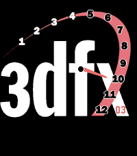
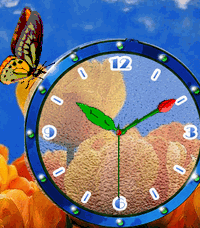
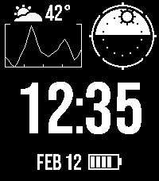

<!-- Generated by scripts/update_app_directory.py: do not edit by hand -->
# Watchfaces: T

[← About this list](../watchfaces.md) · [A](a.md) · [B](b.md) · [C](c.md) · [D](d.md) · [E](e.md) · [F](f.md) · [G](g.md) · [H](h.md) · [I](i.md) · [J](j.md) · [K](k.md) · [L](l.md) · [M](m.md) · [N](n.md) · [O](o.md) · [P](p.md) · [Q](q.md) · [R](r.md) · [S](s.md) · **T** · [U](u.md) · [V](v.md) · [W](w.md) · [X](x.md) · [Y](y.md) · [Z](z.md) · [0–9 & other](other.md)

*259 watchfaces · Last updated 2026-10-06*

| Screenshot | Name | Developer | Licence | Updated | Description |
|------------|------|-----------|---------|---------|-------------|
| { loading=lazy width="72" } | [T Time](https://apps.rebble.io/en_US/application/52ee524fe75bd2b3f5000014) <small>Rebble App Store</small> | [Tony H](https://github.com/thotchen/t_time) | <small>Not checked yet</small> | 2014-02-02 | Fuzzy time clone with connection and battery notifications. Text inverts with vibe alert when bluetooth connection is dropped. Battery charge level is… |
| { loading=lazy width="72" } | [T Time color](https://apps.repebble.com/581c64209cbbafcd640000b6) | [Tony H](https://github.com/thotchen/t_time) | <small>Not checked yet</small> | 2016-11-17 | NOW IN COLOR - Fuzzy time clone with connection and battery notifications. Text inverts with vibe alert when bluetooth connection is dropped. Battery charge… |
| { loading=lazy width="72" } | [T1000 CGM](https://apps.rebble.io/en_US/application/6972fd68ae32660009f7c242) <small>Rebble App Store</small> | [Andrew Childs](https://github.com/andrewchilds/t1000-pebble-cgm) | <small>Not checked yet</small> | 2026-01-27 | A Pebble watchface that displays real-time Dexcom CGM glucose data and provides configurable High and Low Soon alerts. |
| { loading=lazy width="72" } | [T1000 CGM](https://apps.repebble.com/d7c32410f9a44590a63b85ba) | [andrewfchilds](https://github.com/andrewchilds/t1000-pebble-cgm) | <small>Not checked yet</small> | 2026-05-13 | A Pebble watchface that displays real-time Dexcom CGM glucose data. |
| { loading=lazy width="72" } | [T1000 CGM Color](https://apps.repebble.com/b78e6f7edc334c6ab748a85f) | [andrewfchilds](https://github.com/andrewchilds/t1000-color) | <small>Not checked yet</small> | 2026-06-11 | A watchface for the Pebble Time 2 that displays real-time Dexcom CGM glucose data and provides configurable High and Low Soon alerts. Requires a Dexcom… |
| { loading=lazy width="72" } | [Tactics Ogre Watchface](https://apps.repebble.com/59e198bbfd404eb58da8994f) | [Sapphire Second-Hand](https://github.com/shoepaladin/kiwi-cup/tree/main/pebble/tactics_ogre_classes_wf) | <small>Not checked yet</small> | 2026-08-14 | Your favorite Tactics Ogre classes watch you track your time, steps, temperature, battery, weather, heart rate, and more! Currently Supported: *Classes*… |
| { loading=lazy width="72" } | [Tactile](https://apps.rebble.io/en_US/application/547d4aa936aa9b723a00008d) <small>Rebble App Store</small> | [JGib](https://github.com/JustSid/Tactile) | <small>No licence</small> | 2014-12-03 | Tactile inspired watch face. Upper group of 4 white dots indicate the hour and lower group of 4 white dots indicate the minutes (in 5 minute increments)… |
| { loading=lazy width="72" } | [Tall Time](https://apps.rebble.io/en_US/application/648dcafc741dd40198625106) <small>Rebble App Store</small> | [astosia](https://github.com/astosia/TallTime_Simple) | <small>Not checked yet</small> | 2023-06-17 | Simple Tall Time, with Date at the bottom and battery bar at the top - Shows Quiet Time icon at bottom left when quiet time is on - Configurable colours … |
| { loading=lazy width="72" } | [Taller](https://apps.repebble.com/53118426c6c18ea5af00011a) | [chops](https://github.com/mereed/pebbleface-taller-colour) | <small>Not checked yet</small> | 2017-07-02 | A very simple and readable watchface - show the day/date, flip it, or show a colon. Invert for a white background. Change the color of minute numbers or… |
| { loading=lazy width="72" } | [Taller2](https://apps.repebble.com/5422714343797646020000ff) | [chops](http://www.github.com/mereed/pebbleface-taller2) | <small>No licence</small> | 2017-03-18 | 22 sep: new clay settings, includes access to full pebble color palette big time, with day/date at 90 degrees. uncomplicated. change hour/minute colour… |
| { loading=lazy width="72" } | [TamaTime](https://apps.repebble.com/c80224317250460987b9bb68) | [Stefan Bauwens](https://github.com/StefanBauwens/TamaTime) | <small>Not checked yet</small> | 2026-06-10 | TamaTime is a watchface which mimics the watch-screen from the original Tamagotchi. It also has optional support to be used with my other app: Tamagotchi… |
| { loading=lazy width="72" } | [Tangent](https://apps.repebble.com/6a7a1b2ebb2e890009f6b103) | [astosia](https://github.com/astosia/tangent) | <small>Not checked yet</small> | 2026-09-27 | Inspired by the Tangente watch by Nomos Features: - Fully configurable colours, with presets or custom colours - Numbers or Roman Numerals on the dial … |
| { loading=lazy width="72" } | [Tangram](https://apps.repebble.com/e5117a814489481197412acf) | [Synalysis](https://github.com/synalysis/elm-pebble) | <small>Not checked yet</small> | 2026-05-19 | Watchface showing changing Tangram shapes loaded online |
| { loading=lazy width="72" } | [Tank Day Date](https://apps.rebble.io/en_US/application/5a60f9b5461a8d72e8002002) <small>Rebble App Store</small> | [Nick P](https://github.com/nickpraeger/tank) | <small>Not checked yet</small> | 2018-02-19 | A classic watch face inspired by a Cartier Tank watch. Includes full day, date and second hand. Sub dial for battery charge and a bluetooth connection… |
| { loading=lazy width="72" } | [Tapestry](https://apps.rebble.io/en_US/application/58c837ba6ca38730e9000954) <small>Rebble App Store</small> | [David Morgan](https://github.com/Spitemare/tapestry) | <small>Not checked yet</small> | 2017-03-14 | Inspired by a design by /u/LlemonPls at reddit. Tapestry is a simple yet elegant watchface with a banner motif. Shake for battery and connection info… |
| { loading=lazy width="72" } | [Tardis BT Weather Watch](https://apps.repebble.com/58038d5cc988665c140000c2) | [somepaddi](https://github.com/gitpaddi/Tardis_BT_Weather) | <small>Not checked yet</small> | 2016-10-16 | Tardis inspired WatchFace for Pebble. Features: - Time/Date - Vibration on BT connection loss - Weather information from openweathermap.org Time =&gt; upper… |
| { loading=lazy width="72" } | [Target Bullseye Puppy](https://apps.rebble.io/en_US/application/559def6f541f0cc2fa00009b) <small>Rebble App Store</small> | [James Anderson](https://github.com/jamesa/bullseye-watchface) | <small>Not checked yet</small> | 2015-07-09 | Simple watchface featuring the Target mascot, Bullseye. |
| { loading=lazy width="72" } | [Taylor Swift](https://apps.rebble.io/en_US/application/530d4af6d4317149ea00008c) <small>Rebble App Store</small> | [Oliver Bowe](https://github.com/thunderchild7/TaylorSwift) | <small>Not checked yet</small> | 2014-04-03 | Simple Taylor Swift digital watch face, a sharp tap will briefly show the date. |
| { loading=lazy width="72" } | [TCW (Time, Calendar, Weather)](https://apps.rebble.io/en_US/application/52fe1d0d3085a0848d000231) <small>Rebble App Store</small> | [Alexsum](https://github.com/alexsum/TCW) | <small>Not checked yet</small> | 2015-07-21 | Ru, Ua, En, Usr(lat+cyr) It shows: - two timezones - current time by two various fonts - calendar - weather in the current location or custom location: C… |
| { loading=lazy width="72" } | [Tears of the Kingdom](https://apps.repebble.com/6485ede3143b6504957bcfd5) | [Harrison Allen](https://github.com/HarrisonAllen/totk-watchface) | <small>No licence</small> | 2026-06-04 | Enjoy this Legend of Zelda: Tears of the Kingdom inspired watchface! Includes current weather and is compatible with all Pebbles! |
| { loading=lazy width="72" } | [Tech Talent South Bottom Clock](https://apps.rebble.io/en_US/application/554547fb3bbdc6f67500009e) <small>Rebble App Store</small> | [Tech Talent South](https://github.com/zkirchin/ttswatchb) | <small>Not checked yet</small> | 2015-05-02 | This is a watch face based off of the Tech Talent South Logo and is intended for use of all fans of this coding bootcamp! |
| { loading=lazy width="72" } | [Tech Talent South Clock](https://apps.rebble.io/en_US/application/55456977946ce250750000b9) <small>Rebble App Store</small> | [Tech Talent South](https://github.com/zkirchin/ttswatchtext) | <small>Not checked yet</small> | 2015-05-04 | This is a watch face based off of the Tech Talent South Logo and is intended for use of all fans of this coding bootcamp! |
| { loading=lazy width="72" } | [TechRad](https://apps.repebble.com/553b05a737596167920000db) | [Mango Lazi](https://github.com/mangolazi/TechradPebble) | <small>Not checked yet</small> | 2016-09-01 | A clean and bold watchface inspired by the Rado Integral. Now in color! Choose white or black background, red or blue graphics elements, Celsius/Fahrenheit… |
| { loading=lazy width="72" } | [Teddie Time](https://apps.rebble.io/en_US/application/5582347e9e9090eb82000047) <small>Rebble App Store</small> | [Spencer Johnson](https://bitbucket.org/Masamune_Shadow/teddiewatchface) | <small>See source</small> | 2015-06-18 | It's a watchface starring Teddie from Persona 4. His picture and saying changes every hour, and is randomized. I hope you enjoy it and have a bear-ific day. |
| { loading=lazy width="72" } | [Teddy Bear](https://apps.rebble.io/en_US/application/5593b2ee57dd91bb42000023) <small>Rebble App Store</small> | [Neon](https://github.com/sdneon/TeddyBear) | <small>Not checked yet</small> | 2015-07-01 | Teddy bear tells the time. Teddy's face shows the hour in numerals, and a hand points to the minutes. Backgrounds colour pairs changes on the hour. E.g. the… |
| { loading=lazy width="72" } | [Teensy City](https://apps.repebble.com/54b31c54663d4f4f8daaad6d) | [IniPage Software](https://github.com/maclyn/proc-gen-city-wf-for-pebble) | <small>Not checked yet</small> | 2026-07-12 | A real-time procedurally generated cityscape with animated traffic and water. * Three times of day (day, night, dawn/dusk) based on your current location *… |
| { loading=lazy width="72" } | [TEK Watch01](https://apps.repebble.com/55eae82309fc088aef00001a) | [Tor-Erik Klausen](https://github.com/torerikk/simple_analog_pebbleface) | <small>Not checked yet</small> | 2016-08-30 | A simple analog watch face based on KS Watch Face by Chris Lewis . Configurable colors (background, clock face and stroke). Vibrates and displays a warning… |
| { loading=lazy width="72" } | [Tekkno](https://apps.rebble.io/en_US/application/550ba9621e540c275e000036) <small>Rebble App Store</small> | [ftick](https://github.com/ftick/tekkno-watch-face) | <small>Not checked yet</small> | 2015-03-20 | A simple tech watchface. Shake to toggle flashing of the ":"! |
| { loading=lazy width="72" } | [Telstar](https://apps.repebble.com/69b73856657baf00098d504e) | [justinjhendrick](https://github.com/justinjhendrick/alpine_larch_pebble_watchface) | <small>Not checked yet</small> | 2026-05-18 | A minimalist digital watchface with analog movement for the minutes. The default color scheme is perfect for the Red & Black PT2! Features: * Configurable… |
| { loading=lazy width="72" } | [Temperature Graph](https://apps.rebble.io/en_US/application/584aeb1bce45dcb197000052) <small>Rebble App Store</small> | [Matthew Vogt](https://github.com/SnowBirdMV/TemperatureGraphWatchface/releases/tag/1.0) | <small>Not checked yet</small> | 2016-12-14 | Multi function watch-face that shows a temperature and chance of precipitation graph of the next 20 hours, wind speed, current weather conditions and of… |
| { loading=lazy width="72" } | [Tempest Time](https://apps.repebble.com/3d9d1556511048f09d90d87a) | [brendlfly](https://github.com/cOd3m0nk3y/tempest-time) | <small>Not checked yet</small> | 2026-08-17 | Tempest Time is a highly legible, battery-conscious weather watchface designed for Pebble Time 2. Large custom numerals keep the time prominent while… |
| { loading=lazy width="72" } | [Tempilation](https://apps.repebble.com/cfcf110c62e6483eba7ef85a) | [justinjhendrick](https://github.com/justinjhendrick/dashboard-pebble-watchface) | <small>Not checked yet</small> | 2026-09-12 | Tempilation is a practical digital watchface with customizable colors and multiple modules to pick from. Designer: SocketMix Programmer: justinjhendrick… |
| { loading=lazy width="72" } | [Template](https://apps.repebble.com/f3eecfb630754c8ab295a1a5) | [julpel8](https://github.com/julpel8/pebble-watchface-template) | <small>Not checked yet</small> | 2026-06-20 | A minimal, configurable Pebble watchface starter template — time + info lines, weather, night theme, i18n. |
| { loading=lazy width="72" } | [Tempo Roboto](https://apps.repebble.com/c4c305d476ce4a818874a5a1) | [Choi Byungyoon](https://codeberg.org/byungyoonc/roboto-pebble-watchface) | <small>See source</small> | 2026-08-01 | A Digital Pebble watchface using Roboto typeface. |
| { loading=lazy width="72" } | [Tempo Roboto](https://apps.rebble.io/en_US/application/6a6c49bf841ec90009cf11c2) <small>Rebble App Store</small> | [Choi Byungyoon](https://codeberg.org/byungyoonc/roboto-pebble-watchface) | <small>See source</small> | 2026-08-01 | A Digital Pebble watchface using Roboto typeface. |
| { loading=lazy width="72" } | [tempus latinum](https://apps.rebble.io/en_US/application/565e1d8f5629c976ea00007c) <small>Rebble App Store</small> | [Nicholas Currault](https://github.com/nicktendo64/tempus-latinum) | <small>Not checked yet</small> | 2015-12-01 | This watchface displays the current time and date in the format that Ancient Romans would have used. All numbers are in Latin/Roman Numerals, the months and… |
| { loading=lazy width="72" } | [Tendril](https://apps.repebble.com/358196e1caf34c2688899394) | [Karl](https://github.com/KarlKl/Pebble-Tendril) | <small>No licence</small> | 2026-05-31 | Time is growing on you. Literally. Watch the hours and minutes sprout into shape, branch by branch, leaf by leaf. It's a clock. It's a forest. It's both. |
| { loading=lazy width="72" } | [tens](https://apps.repebble.com/2280e247bce8407980bf9396) | [Andrea Volpato](https://github.com/andreavolpato/pebble-tens) | <small>Not checked yet</small> | 2026-06-23 | keep track of the time visually, every ten pixel is a minute. every ten by ten block is ten minutes. 144 blocks in one day. keep track visually of your… |
| { loading=lazy width="72" } | [terlet](https://apps.repebble.com/dd98ca5e0df24b95bdbdd9ff) | [Teatov](https://github.com/teatov/pebble-terlet) | <small>Not checked yet</small> | 2026-04-16 | A simple little Pebble watchface with neat ASCII digits. |
| { loading=lazy width="72" } | [termd](https://apps.repebble.com/2719aa1bb53d41ceb10b7e14) | [Denis Xynkin](https://gitlab.com/Xynkin/termd) | <small>Not checked yet</small> | 2026-08-31 | A high-contrast terminal-inspired watchface featuring an ASCII-art clock, four-week calendar, battery, Bluetooth, steps, and heart rate. |
| { loading=lazy width="72" } | [Termina Clock](https://apps.repebble.com/558758d949c1d1c2f9000066) | [Mitchel Spears](https://gitlab.com/gumbyscout/Termina-Clock) | <small>Not checked yet</small> | 2026-06-23 | The clocks from Majora's Mask, for your Pebble! Behaves just like in game, with the outer ring rotating to show the minutes, and the inner ring rotating to… |
| { loading=lazy width="72" } | [Terminal](https://apps.repebble.com/56f486d4acd389cf47000021) | [Alexandra DeLucia](https://github.com/AADeLucia/Pebble-Watchface-Terminal-Style.git) | <small>No licence</small> | 2017-01-14 | Terminal-style watchface for Unix enthusiasts! Features: -mimics a Mac/Linux terminal -shows date, time, battery status, and connection status -animated… |
| { loading=lazy width="72" } | [Terminal Dogma](https://apps.repebble.com/83a45005b95f438590f63b26) | [Andreas Varotsis](https://github.com/AndreasThinks/pebble-watchface) | <small>No licence</small> | 2026-06-08 | A tactical terminal-inspired Pebble Time 2 watchface with configurable format, datamodules, and Evangelion inspired status chevrons. |
| { loading=lazy width="72" } | [Terran Watchface](https://apps.rebble.io/en_US/application/5602247f15706c9bfe000023) <small>Rebble App Store</small> | [firekesti](https://github.com/firekesti/TerranPebble) | <small>Not checked yet</small> | 2015-09-23 | A simple watchface that uses a Terran font from Starcraft. Shows battery percentage, date, time, and will vibrate with a unique pattern when Bluetooth is… |
| { loading=lazy width="72" } | [Tessera ad Infinitum](https://apps.repebble.com/69dd9b7077602b0009e99a04) | [Tybbs](https://github.com/TybbsTheUnfocused/tessera_infinitum_watchface) | <small>Not checked yet</small> | 2026-04-14 | Tessera ad Infinitum transforms your Pebble into a window to an ever-changing world of generative art. Every hour, a new slice of a procedurally generated… |
| { loading=lazy width="72" } | [TESTOCOL](https://apps.rebble.io/en_US/application/560d0013cda63289ce000061) <small>Rebble App Store</small> | [Andrea Ottaviani](http://github.com/aotta/TestoCol) | <small>No licence</small> | 2015-10-01 | Orologio testuale a colori, in italiano Italian text only! |
| { loading=lazy width="72" } | [TetrisTime](https://apps.repebble.com/54f872d5d66ea86e5a000042) | [vflashm](https://github.com/VFLashM/TetrisTime) | <small>Not checked yet</small> | 2016-10-02 | Pebble watchface with digits made out of tetriminos. When time changes, old digit vanishes and new digit is reassembled out of falling tetriminos… |
| { loading=lazy width="72" } | [TetrisTime_ITA](https://apps.rebble.io/en_US/application/5852e9b4ce45dc2c6300014b) <small>Rebble App Store</small> | [Nastas](https://github.com/VFLashM/TetrisTime) | <small>Not checked yet</small> | 2016-12-16 | TetrisTime ora con giorni della settimana e mesi completamente in Italiano! Guarda i tetriminos cadere dall'alto formando l'ora corrente. Nelle impostazioni… |
| { loading=lazy width="72" } | [TetrisTime_mod](https://apps.repebble.com/56f9230c61a0160aa700002e) | [gogothegogo](https://github.com/gogothegogo/TetrisTime) | <small>Not checked yet</small> | 2016-04-02 | Completely based on VFLashM amazing TetrisTime watchface. I did few mods for my needs: -got rid of large date fonts -added option of Croatian dates and… |
| { loading=lazy width="72" } | [TetrisTimeBig](https://apps.repebble.com/81384d8fbe4347339fd4ee8e) | [Lukasz Orzechowski](https://github.com/orzechowskilukasz/TetrisTimeBig) | <small>Not checked yet</small> | 2026-08-14 | A dot-matrix watch face, where dots are composed from falling tetris bricks. This is a port for Pebble Time 2 of a TetrisTime watchface originally created… |
| { loading=lazy width="72" } | [TeXcuse](https://apps.rebble.io/en_US/application/53972b8efd9b27e4be0000d3) <small>Rebble App Store</small> | [codesplice](https://github.com/codesplice/TeXcuse) | <small>Not checked yet</small> | 2014-06-17 | The standard Big Time watchface, with a secret ability. Flick your wrist to display a randomly-generated excuse overflowing with technobabble. Perfect for… |
| { loading=lazy width="72" } | [Text based on QLOCKTWO](https://apps.repebble.com/582cf21a8c7fff098b000144) | [melekzek](http://github.com/melekzek/pebble-QLOCKTWO) | <small>No licence</small> | 2017-05-07 | Text watchface based on qlocktwo watch. http://qlocktwo.com/ TODO: - Add minute dots as an option. - Add some predefined default colors. - Hide and compress… |
| { loading=lazy width="72" } | [Text french 24h](https://apps.rebble.io/en_US/application/535cf64514d179a4aa000149) <small>Rebble App Store</small> | [Martin Carufel](https://cloudpebble.net/ide/project/47466) | <small>See source</small> | 2014-04-27 | Display time in french, on 24h. No vibe, no date. Says 45, 50 and 55 minutes instead of "moin quart", "moins dix" and "moins 5". |
| { loading=lazy width="72" } | [Text time](https://apps.rebble.io/en_US/application/552f772a26541fb9610000ae) <small>Rebble App Store</small> | [Andrew Varis](https://github.com/ndrewv/text-watch-configurable) | <small>Not checked yet</small> | 2015-09-13 | A highly configurable text watch with your choice of fonts, alignment, date, background, animation speed and offset. Based off DHertz's Words + Date watch. |
| { loading=lazy width="72" } | [Text Time PT](https://apps.rebble.io/en_US/application/543dbd65b4e3abd1c3000039) <small>Rebble App Store</small> | [Luis Ramos](https://github.com/Orgmir/TextTimePT.git) | <small>Not checked yet</small> | 2014-10-16 | A watchface similar to the system Text Watch, but with portuguese locale! |
| { loading=lazy width="72" } | [Text Watch - Customizable with Date and Weather](https://apps.repebble.com/52d0d4593b9c7bd0ce0000c9) | [Cache4Gold](https://github.com/Cache4Gold/PebbleTextWatchWithDate) | <small>No licence</small> | 2026-05-07 | This watch face displays the time as plain English text across three lines, with two fully configurable info lines at the bottom for date, day of week, and… |
| { loading=lazy width="72" } | [Text Watch 2](https://apps.rebble.io/en_US/application/52bf33276ecafe7e4c000094) <small>Rebble App Store</small> | [Keelan C](https://github.com/keelanc/text_watch_2) | <small>Not checked yet</small> | 2014-02-05 | A 'better' version of the default 'Text Watch' watchface by Pebble Tech. Tap/shake the watch for date and weather info. Choose °C or °F from the mobile app… |
| { loading=lazy width="72" } | [Text Watch Deluxe](https://apps.repebble.com/56ab1cfe6ca919990000000e) | [DC](https://github.com/wackyneighbor/DC_Text_Watch_Deluxe) | <small>Not checked yet</small> | 2026-07-05 | Elegant, simple, and practical, this is a variant of Pebble's original "Sliding Text" watchface, with some significant enhancements such as configurable… |
| { loading=lazy width="72" } | [Text Watch FR](https://apps.rebble.io/en_US/application/533dee0967bf239ad80000e6) <small>Rebble App Store</small> | [Benji7790](https://github.com/Benji7790/pebble-textwatch-fr) | <small>No licence</small> | 2015-08-05 | Watchface qui affiche l'heure en texte Français. |
| { loading=lazy width="72" } | [Text Watch With Date](https://apps.rebble.io/en_US/application/52d0d2ea336477aa170000bb) <small>Rebble App Store</small> | [Cache4Gold](https://github.com/Saracco/PebbleTextWatchWithDate) | <small>Not checked yet</small> | 2014-01-11 | This is a tweak on the Text Watch, it now reads full date in a small font in the bottom right corner. There are also versions of this with (o') and (oh)… |
| { loading=lazy width="72" } | [Text Watch with Date](https://apps.rebble.io/en_US/application/53123b8592295d4809000426) <small>Rebble App Store</small> | [Neil Greatorex](https://github.com/ngreatorex/PebbleTextWatch) | <small>Not checked yet</small> | 2015-11-12 | This is a simple modification of the standard text watch to show the current date as well. |
| { loading=lazy width="72" } | [Text Watch With Date (oh)](https://apps.rebble.io/en_US/application/52d0d4c374a38e4e130000da) <small>Rebble App Store</small> | [Cache4Gold](https://github.com/Saracco/PebbleTextWatchWithDate) | <small>Not checked yet</small> | 2014-01-11 | This is a tweak on the Text Watch, it now reads full date in a small font in the bottom right corner. There are also versions of this without (oh) and one… |
| { loading=lazy width="72" } | [Text Watch with UK-style (DMY) date](https://apps.rebble.io/en_US/application/548c2afd5bb649ffd30000a0) <small>Rebble App Store</small> | [Andy Clark](https://github.com/minkustree/PebbleTextWatchWithDate) | <small>Not checked yet</small> | 2014-12-13 | This variant of Text Watch with Date displays the day and date in the bottom right hand corner. The date is shown in the UK-style day-month-year format. The… |
| { loading=lazy width="72" } | [Text with Steps](https://apps.rebble.io/en_US/application/58451b14ca30941def000345) <small>Rebble App Store</small> | [Adam Fourney](https://github.com/afourney/sliding-text/) | <small>Not checked yet</small> | 2016-12-05 | This simple fork of Pebble's Sliding Text watchface shows the current step count, as well as the date. |
| { loading=lazy width="72" } | [textklockan](https://apps.repebble.com/573b241f44ca4b6d6300000f) | [walleball](https://github.com/walleball/textklockan) | <small>Not checked yet</small> | 2016-05-18 | Text-based watchface displaying the current time in Swedish |
| { loading=lazy width="72" } | [Textual](https://apps.repebble.com/56d5b06bfed12326db000015) | [inriki](https://github.com/Inriki/Textual) | <small>No licence</small> | 2016-03-02 | La hora se muestra de manera textual sobre un matriz de caracteres. |
| { loading=lazy width="72" } | [TextWatch - Hungarian](https://apps.rebble.io/en_US/application/545b4e8a53293c167e000016) <small>Rebble App Store</small> | [ato.hu](https://github.com/atomester/Pebble-TextWatchHU) | <small>Not checked yet</small> | 2014-11-06 | The well-known TextWatch watchface translated to hungarian. Szöveges idő - magyarul és egy kicsit bénán. Van egy kis gond a tizeseknél és a huszasnál, de… |
| { loading=lazy width="72" } | [TextWatch Clima](https://apps.rebble.io/en_US/application/58a94da90dfc32d35b0002f8) <small>Rebble App Store</small> | [dieghernan](https://github.com/dieghernan/TextWatchClima) | <small>Not checked yet</small> | 2017-05-25 | * Consider ♥ if you enjoy this watchface * Add some weather to your TextWatch! This watchface brings the weather conditions straight to your wrist… |
| { loading=lazy width="72" } | [TextWatch NO](https://apps.rebble.io/en_US/application/52ebb98e7d49766c72000025) <small>Rebble App Store</small> | [Flips](https://github.com/iFlips/TextWatchNO) | <small>Not checked yet</small> | 2014-02-01 | A Norwegian version of TextWatch. Credits to the Pebble team for making the original watchface and Pebble forums user mmdumi for adding the source to GitHub. |
| { loading=lazy width="72" } | [TextWatch RO](https://apps.rebble.io/en_US/application/52ee05d3e696ad71b0000003) <small>Rebble App Store</small> | [Work In Progress](https://github.com/wearewip/PebbleTextWatch/tree/textRO) | <small>Not checked yet</small> | 2014-02-02 | TextWatch watchface in Romanian language with the same animations as the first party one. |
| { loading=lazy width="72" } | [TextWatch RO2](https://apps.rebble.io/en_US/application/5470f9ed54f824d3530000ef) <small>Rebble App Store</small> | [Ovidiu A.](http://corero.byethost7.com/sources/textwatch_ro2_3.zip) | <small>See source</small> | 2014-12-01 | This watchface is based on TextWatch RO, but with some fixes. |
| { loading=lazy width="72" } | [TextWatch SE](https://apps.rebble.io/en_US/application/54dbbfc9351fb9c2bd0000d2) <small>Rebble App Store</small> | [Olivella](https://github.com/dasca/Pebble_TextWatch_SE) | <small>Not checked yet</small> | 2015-02-11 | Simple Textwatch in Swedish |
| { loading=lazy width="72" } | [TextWatch with Day/Date](https://apps.repebble.com/52db4b58e798b9c8c9000347) | [Ginko72](https://github.com/stough/PebbleTextWatch) | <small>Not checked yet</small> | 2026-04-20 | This watch is a modification of the built in Text Watch face to add date information and to correct the time representation for times that have a spoken… |
| { loading=lazy width="72" } | [TextWatch24](https://apps.rebble.io/en_US/application/52cb4b946e5f703b140000aa) <small>Rebble App Store</small> | [rigel314](https://github.com/rigel314/pebbleTextWatch24) | <small>Not checked yet</small> | 2014-03-03 | Displays the time like the default text watch, but in 24 hour time. Has options for showing the date and the display for a leading zero in the minutes. " oh… |
| { loading=lazy width="72" } | [TextWatchBT](https://apps.rebble.io/en_US/application/5318b9e495b1eacb1000000e) <small>Rebble App Store</small> | [Nazaret Vaz](https://github.com/nazaretvaz/TextWatchBT) | <small>Not checked yet</small> | 2014-03-07 | TextWatch Face with Proximity. If your phone is out of Bluetooth range, it displays a message+vibrates+turns the backlight on. This is based on… |
| { loading=lazy width="72" } | [TH10 2.0](https://apps.rebble.io/en_US/application/52e0ed6dd8561d962b00010f) <small>Rebble App Store</small> | [Jnm](https://github.com/Jnmattern/TH10-Date_2.0) | <small>No licence</small> | 2014-01-23 | Analog watch with day of month inspired by the Torgoen T10 Original 1.x version by Hudson. |
| { loading=lazy width="72" } | [That's No Moon](https://apps.repebble.com/5810e678d0050280b10000e9) | [David Morgan](https://github.com/Spitemare/tnm) | <small>Not checked yet</small> | 2016-10-26 | ...it's a watchface. TNM displays the time in a unique, rotary fashion. It's reminiscent of a famous, fully armed and operational battle station. Outer ring… |
| { loading=lazy width="72" } | [The 12 Doctors](https://apps.repebble.com/529997b1e627ceb4e200005a) | [drwrose](https://github.com/drwrose/doctors.git) | <small>Not checked yet</small> | 2016-11-27 | 12 Doctors and 12 hours: a different Doctor for each hour of the day. You can read the time by identifying the face of the Doctor for the hour, combined… |
| { loading=lazy width="72" } | [The Bat](https://apps.repebble.com/696cecb7fd11fd00098d82f8) | [AirCodum](https://github.com/priyankark/pebble-wf-agent-skill) | <small>Not checked yet</small> | 2026-01-18 | Transform your Pebble into the iconic Bat Signal! Watch as the searchlight sweeps across Gotham's night sky, illuminating the legendary bat symbol with a… |
| { loading=lazy width="72" } | [The Corcle Face](https://apps.rebble.io/en_US/application/555be32a4231f4ddf300004a) <small>Rebble App Store</small> | [Noah Hanover](https://bitbucket.org/nhano0228/circle_colors) | <small>See source</small> | 2015-05-20 | This app shows you the time with beautiful animations and a breathtaking starry night. How could you not wonder what is the beyond without looking at this… |
| { loading=lazy width="72" } | [The Division](https://apps.repebble.com/5820d9c034da21cdc50000bb) | [Jakerusch](https://github.com/jakerusch/the_division_2) | <small>Not checked yet</small> | 2016-11-08 | The Division watchface for APLITE, BASALT, AND DORITE. Displays day of week, month, and day of month, battery level, bluetooth connectivity, city/location… |
| { loading=lazy width="72" } | [The Division Celsius](https://apps.repebble.com/5838a47d00355a8e27000515) | [Jakerusch](https://github.com/jakerusch/THE_DIVISION_2) | <small>Not checked yet</small> | 2016-11-25 | The Division watchface for APLITE, BASALT, AND DORITE. Displays day of week, month, and day of month, battery level, bluetooth connectivity, city/location… |
| { loading=lazy width="72" } | [The Endless River](https://apps.rebble.io/en_US/application/552825b8d59149cca6000064) <small>Rebble App Store</small> | [Gretchycat](https://github.com/gretchycat/DarkSide) | <small>Not checked yet</small> | 2015-10-19 | The Endless River cover art by Pink Floyd Features a 2 week calendar, and when you shake or tap, see a 5 day weather forecast. Tap again for sunrise, sunset… |
| { loading=lazy width="72" } | [The Essence](https://apps.rebble.io/en_US/application/62055185843fe7000aa1c638) <small>Rebble App Store</small> | [Gonzalo Muñoz](https://github.com/zamuz/the-essence) | <small>Not checked yet</small> | 2025-04-15 | A watchface based on the Ressence watches, with customizable colors. |
| { loading=lazy width="72" } | [The Green Lantern](https://apps.rebble.io/en_US/application/5e9be8613dd31033ee19420e) <small>Rebble App Store</small> | [swansswansswansswanssosoft](https://github.com/pauleeeeee/the-green-lantern-pebble-watchface) | <small>Not checked yet</small> | 2020-04-19 | The Green Lantern symbol on your wrist. |
| { loading=lazy width="72" } | [The Hart](https://apps.repebble.com/569f256470f3698e29000024) | [Dan Hart](https://github.com/dan-hart/the-hart-pebble-watchface) | <small>Not checked yet</small> | 2017-03-16 | PERSONAL USE - LOOK AT MY OTHER WATCH FACES FOR CUSTOMIZABILITY |
| { loading=lazy width="72" } | [The Journalism Show](https://apps.rebble.io/en_US/application/557f67d73c562e18e7000097) <small>Rebble App Store</small> | [Spencer Johnson](https://bitbucket.org/Masamune_Shadow/geraldobeedogwatchface) | <small>See source</small> | 2015-06-16 | Pretty simple watchface, just tells the time. Features Geraldo Beedog from The Journalism Show (http://rockmelonsoda.com/tjs/) created by Topher Cantler… |
| { loading=lazy width="72" } | [The Modern Gentleman](https://apps.repebble.com/544f1ac4dc21b79c2d000014) | [Dan Hart](https://github.com/dan-hart/the-modern-gentleman) | <small>Not checked yet</small> | 2016-10-16 | TMG is a great low-power consumption option for Pebble Time! The Original MG. ============= Features: - Optimized for battery life. - Sleek, simple design… |
| { loading=lazy width="72" } | [The Modern Gentleman (Spanish)](https://apps.rebble.io/en_US/application/569421164633c80ea8000070) <small>Rebble App Store</small> | [Dan Hart](http://www.github.com/dan-hart/the-modern-gentleman.git) | <small>No licence</small> | 2016-01-11 | TMG with a Spanish Twist! |
| { loading=lazy width="72" } | [The Modern Gentleman 2](https://apps.repebble.com/569c40bbd05afe633b000057) | [Dan Hart](https://github.com/dan-hart/the-modern-gentleman-2) | <small>Not checked yet</small> | 2016-09-03 | The Modern Gentleman 2 ==================== - Color Customizable! - C or F Weather - MM-DD, DD-MM (with option to add year!) - Language Customizability… |
| { loading=lazy width="72" } | [The Nationalist](https://apps.rebble.io/en_US/application/5688a058fd4a39a0ab000066) <small>Rebble App Store</small> | [Alexander the Dev](https://github.com/awhipp/patriotic-watchface-pebble-time) | <small>Not checked yet</small> | 2016-01-04 | The completely free watchface to support the country of your choice! Select the country. The watch face adjusts based on your national flag's primary… |
| { loading=lazy width="72" } | [The Past, The Present And The Future](https://apps.rebble.io/en_US/application/55d897b132a1666693000004) <small>Rebble App Store</small> | [Cal Martin](https://github.com/cal2195/Pebble-WatchFace---The-Past-The-Present-and-The-Future) | <small>Not checked yet</small> | 2015-08-22 | Simple little watchface, showing the current time in bold along with the last two minutes and the next two minutes! Makes a nice little diamond shape! :) |
| { loading=lazy width="72" } | [The Pebble Runner](https://apps.rebble.io/en_US/application/542090f3d6b6c9164a0001d8) <small>Rebble App Store</small> | [Brian](https://github.com/FZBHackTheNorth/TheRunningMan) | <small>No licence</small> | 2014-09-22 | Travel the world with your trusty partner! Team: Ziying, Felix |
| { loading=lazy width="72" } | [The Real Time](https://apps.repebble.com/3023af58454c4d53b96def0a) | [Thomas Cherry](https://github.com/jceaser/pebble-real-time) | <small>Not checked yet</small> | 2026-04-26 | The Government does not want you to know what time it is, they want you living in a world created by them, a world where they claim they can change the… |
| { loading=lazy width="72" } | [The Swinging Friar](https://apps.rebble.io/en_US/application/54fa28ca782898750100008f) <small>Rebble App Store</small> | [defeatthewheat](https://github.com/defeatthewheat/Swinging-Friar-Face) | <small>Not checked yet</small> | 2015-03-07 | This watchface is an homage to San Diego's baseball mascot. The watchface is designed to look like an analog watch, where the Friar's swinging arms act as a… |
| { loading=lazy width="72" } | [The Tile](https://apps.repebble.com/4c6bfe56532f4849bce026bb) | [joerdav](https://github.com/joerdav/the-tile) | <small>Not checked yet</small> | 2026-07-22 | The watch face the internet draws. Each week the community draws 16x16 pixel-art tiles and votes head-to-head; the winning tile is crowned at Sunday… |
| { loading=lazy width="72" } | [the time is now](https://apps.rebble.io/en_US/application/54698673ecee197750000082) <small>Rebble App Store</small> | [Agile Ramen LLC](https://github.com/jakeatwork/thetimeisnow) | <small>Not checked yet</small> | 2014-11-17 | The best watchface for RIGHT NOW and living in the present. Watching the clock too often? Need to zone out? This is your watchface for when you don't want… |
| { loading=lazy width="72" } | [The Weather Watch](https://apps.rebble.io/en_US/application/55915343612d76e85c00003e) <small>Rebble App Store</small> | [Alex de la Rosa](https://github.com/aletsdelarosa/theWeatherWatch) | <small>Not checked yet</small> | 2015-06-29 | A simple watch face with weather info using openweathermap.org API. You can see and use de source code. Thanks for downloading! |
| { loading=lazy width="72" } | [Themes](https://apps.repebble.com/566782ff39c4857dc4000033) | [chops](https://github.com/mereed/pebbleface-themes) | <small>Not checked yet</small> | 2017-09-16 | jul 15: refreshed most images/themes battery only shows if below 40% slightly modified layout to see more of each image option to hide weather info … |
| { loading=lazy width="72" } | [Theta](https://apps.repebble.com/56db6dddd86927bb08000032) | [BriWest](http://github.com/briwestervelt/theta_source) | <small>No licence</small> | 2016-08-31 | Updated to use Pebble's Unobstructed Area API to show timeline Quick Views! Theta is a clean and glancable watch face designed to make the most of your… |
| { loading=lazy width="72" } | [Thetis Moon](https://apps.rebble.io/en_US/application/5527e95fe0d8434b4a000032) <small>Rebble App Store</small> | [Gretchycat](https://github.com/gretchycat/DarkSide) | <small>Not checked yet</small> | 2015-10-19 | A watchface with the Thetis Moon image from Digital Blasphemy Features a 2 week calendar, and when you shake or tap, see a 5 day weather forecast. Tap again… |
| { loading=lazy width="72" } | [Thin](https://apps.repebble.com/550ccb556caaed4e0100006d) | [Chris Lewis](https://github.com/C-D-Lewis/pebble-dev) | <small>No licence</small> | 2026-08-16 | Simple, customizable watchface with splashes of color. Shows battery level with hour markers. Use the config page to adjust which features you want from: … |
| { loading=lazy width="72" } | [Thin Extended](https://apps.repebble.com/56f511f8a16b34979b00003e) | [SilasG](https://github.com/silasg/thin-ext) | <small>Not checked yet</small> | 2016-08-27 | Extended the awesome Thin watchface by Chris Lewis with a light theme, additional minute markers, ability to disable all markers, energy saving options and… |
| { loading=lazy width="72" } | [Thin Markers](https://apps.rebble.io/en_US/application/55fd507cf1f7ea175900005f) <small>Rebble App Store</small> | [HockWoo Tan](https://github.com/hw/thin) | <small>Not checked yet</small> | 2025-12-01 | A simple watch face based on the Thin watch face by C. Lewis, with added markers to aid more precise reading of the current time, and ability to configure… |
| { loading=lazy width="72" } | [Thin moded](https://apps.rebble.io/en_US/application/55789a4753e13cba20000061) <small>Rebble App Store</small> | [mephissto](https://github.com/mephissto/thin) | <small>Not checked yet</small> | 2015-06-20 | Based on the Thin watchface made by Chris Lewis. !! New Theme !! - Green - Red - Purple |
| { loading=lazy width="72" } | [Thin-Red Hour](https://apps.rebble.io/en_US/application/55ad922da8f41e37f5000029) <small>Rebble App Store</small> | [Zach Burnham](https://burnsoftware.wordpress.com/) | <small>See source</small> | 2016-02-06 | I modified the Thin watchface by Chris Lewis and wanted to share my take on it. The biggest changes are the more circular shape of the watchface, the red… |
| { loading=lazy width="72" } | [Thinline](https://apps.rebble.io/en_US/application/53fea5929bfdec7d4b00008c) <small>Rebble App Store</small> | [Jory Hatton](https://github.com/jphatton/pebble_thinline) | <small>Not checked yet</small> | 2014-08-28 | A minimalist watchface for pebble. |
| { loading=lazy width="72" } | [thins](https://apps.repebble.com/576e5f436c2104f46f000010) | [qwqert](https://github.com/qwqert/Pebble_watchfaces.git) | <small>Not checked yet</small> | 2016-06-25 | A simple watchface based on thin. |
| { loading=lazy width="72" } | [Tic Tock Toe](https://apps.rebble.io/en_US/application/52d8b9d7aef8d50e88000026) <small>Rebble App Store</small> | [Pebble](https://github.com/pebble/pebble-sdk-examples/tree/master/watchfaces/tic_tock_toe) | <small>Not checked yet</small> | 2014-01-17 | Tic Toc Toe Example Watchface |
| { loading=lazy width="72" } | [TicDot](https://apps.repebble.com/01d9cb793d7b4f109ad3a9cc) | [clet](https://github.com/cletqui/ticdot) | <small>Not checked yet</small> | 2026-08-23 | TicDot is a minimalist analog watchface inspired by the iconic TicToc stock face shipped with every Pebble. It keeps the clean two-hand analog design and… |
| { loading=lazy width="72" } | [Ticker](https://apps.rebble.io/en_US/application/5ff3bb3c1e6bb18626ced4cb) <small>Rebble App Store</small> | [swansswansswansswanssosoft](https://github.com/pauleeeeee/pebble-stock-ticker) | <small>Not checked yet</small> | 2021-01-05 | Display the current and historical price of most cryptocurrencies as well as most publicly traded stocks on the major exchanges. Unfortunately, real-time… |
| { loading=lazy width="72" } | [Ticker 2](https://apps.repebble.com/579574dc50c752b5c90003b4) | [chops](https://github.com/mereed/pebbleface-ticke2) | <small>Not checked yet</small> | 2016-07-27 | 27 july option to disable pattern on analog screen removed inner black circle batt charging text same colour as scroll text This came about while working on… |
| { loading=lazy width="72" } | [Ticker Tape Time](https://apps.repebble.com/6a20a3c40f88430009151b61) | [Robert Flitney](https://github.com/FlitneyR/sliders_time) | <small>No licence</small> | 2026-07-05 | See the passage of time on the scale of seconds, minutes, hours, and days. By displaying the time as multiple progress bars, Ticker Tape Time gives you an… |
| { loading=lazy width="72" } | [Ticking Analog](https://apps.rebble.io/en_US/application/55ce53e8fb84fb752300004f) <small>Rebble App Store</small> | [Comfortably Numb](https://github.com/ygalanter/Ticking_Analog) | <small>Not checked yet</small> | 2015-08-14 | At first glance this looks like classic stock analog face. But bring it to your ear and listen carefully... DISCLAMER 1: 99% code for this watchface is… |
| { loading=lazy width="72" } | [TickTockBlock - Pebble Developer Challenge Edition](https://apps.rebble.io/en_US/application/53cdce64cb0ffce8510000aa) <small>Rebble App Store</small> | [Paul S.](https://github.com/xSpiritSoulx/TickTockBlock-Final) | <small>Not checked yet</small> | 2014-07-22 | A watchface featuring a moving dot and clock. Simple, yet modern. 24 Hour mode only at this time, sorry! |
| { loading=lazy width="72" } | [Tictoc Day](https://apps.rebble.io/en_US/application/5846508000355a0a120003ec) <small>Rebble App Store</small> | [Kieves](https://github.com/Kieves/Pebble_TictocDay) | <small>No licence</small> | 2017-07-02 | Small modification on Pebble's Tictoc watchface. Added day of the month and weather provided by OpenWeatherMap.org. If weather is not available, the day… |
| { loading=lazy width="72" } | [TicToc for OG (2)](https://apps.rebble.io/en_US/application/569d6826c7fdf7d47f000006) <small>Rebble App Store</small> | [Will Aney](https://www.dropbox.com/s/whzp6brv6ix4j3l/TicToc_for_OG%20%289%29.zip?dl=0) | <small>Not checked yet</small> | 2016-01-19 | Have you been longing for the TicToc watchface of the Pebble Time to come to the Original and Steel models? Well, here it is. Thanks to Martin Simoneau for… |
| { loading=lazy width="72" } | [TicToc+](https://apps.rebble.io/en_US/application/60803d141342ae009528070f) <small>Rebble App Store</small> | [Nikki](https://github.com/not-phoeniix/tictoc_plus/) | <small>Not checked yet</small> | 2022-03-28 | An extension of the default Pebble Time watchface TicToc, with more features and customization Features: - Almost everything is toggleable! Don't like the… |
| { loading=lazy width="72" } | [Tide](https://apps.repebble.com/c4d59f5a796b4726bab19355) | [Alex LeHart](https://github.com/axe08/pebble-face-basic) | <small>Not checked yet</small> | 2026-07-06 | Minimal time, date, and battery over abstract, tide-like arcs. The time shows in clean technical numerals with the date below it and a four-segment battery… |
| { loading=lazy width="72" } | [Tide](https://apps.repebble.com/048b7d4f35024867bc0099e8) | [clet](https://github.com/cletqui/pebble-tide) | <small>Not checked yet</small> | 2026-06-10 | Tide is a minimalist tide clock for Pebble. A single hand tells you everything: 12 o'clock is high water, 6 o'clock is low water — the sweep shows you… |
| { loading=lazy width="72" } | [Tides](https://apps.rebble.io/en_US/application/54980fdd9fa273b3860000a3) <small>Rebble App Store</small> | [Owen B](https://github.com/obitoo/PebbleTidesUK) | <small>Not checked yet</small> | 2017-01-27 | Latest tidal graphs on your wrist! Choose from over 4000 ports in 129 countries worldwide. LATEST UPDATE Jan 2017: Battery status shown in graph background… |
| { loading=lazy width="72" } | [tidface](https://apps.rebble.io/en_US/application/680d1e0ce840b900091c26bf) <small>Rebble App Store</small> | [aliceisjustplaying](https://github.com/aliceisjustplaying/tidface) | <small>Not checked yet</small> | 2025-04-26 | a moderately useful watchface. displays the time in: - "at which airport is it just past noon right now?" o'clock (with an "it's 5pm somewhere" option) … |
| { loading=lazy width="72" } | [TileTime](https://apps.rebble.io/en_US/application/558f113e1b7152612b0000d0) <small>Rebble App Store</small> | [Gerald](https://github.com/qanqan/TileTime) | <small>Not checked yet</small> | 2015-08-27 | This watchface is based on a design from Pieter Dhaeze. In this version there is a config screen which supports: 1. Multi language support. Dutch, English… |
| { loading=lazy width="72" } | [Timberwolf](https://apps.rebble.io/en_US/application/530b1afb106c78918100029d) <small>Rebble App Store</small> | [Raptor007](https://github.com/Raptor007/Pebble-Watchfaces/tree/master/timberwolf) | <small>Not checked yet</small> | 2014-02-24 | For all the MechWarrior and BattleTech fans out there, here's a watchface featuring my favorite 'Mech: the Timberwolf (Mad Cat). |
| { loading=lazy width="72" } | [Time & Quotes](https://apps.rebble.io/en_US/application/56f86ab161a016ff7f00001f) <small>Rebble App Store</small> | [aocodermx](https://github.com/aocodermx/TimeAndQuotes) | <small>Not checked yet</small> | 2016-05-15 | Display the current time and your FAVORITE QUOTES/PHRASES from the authors you love, right in your watch. Just add your favorite quotes and the watchface… |
| { loading=lazy width="72" } | [Time 2 All-Arounder](https://apps.repebble.com/bed9b0d8be3a4ecf8543617a) | [Ryan Glovinsky](https://github.com/rglovinsky/pebble-time-2-watchface-all-arounder) | <small>Not checked yet</small> | 2026-05-07 | A clean, color-coded watchface for the Pebble Time 2 that puts everything on one screen at a glance. Time and date sit dead-center as the focal point… |
| { loading=lazy width="72" } | [time 4391](https://apps.repebble.com/56446283199c1f6ca1000033) | [AndCycle](https://github.com/AndCycle/PebbleFaceTryout) | <small>No licence</small> | 2016-06-30 | I just write the watchface that I want, this is a work in progress, hope I will have time to finish this. Todo: configuration able to change appid for… |
| { loading=lazy width="72" } | [Time and Calendar](https://apps.rebble.io/en_US/application/596fb1650dfc321335000144) <small>Rebble App Store</small> | [Eugene Mikhaylov](https://github.com/UnnamedHero/pebble-watchface-time-and-calendar) | <small>Not checked yet</small> | 2017-11-26 | Time-and-Calendar watchface for Pebble smartwatch. Watchface was was created as a trubute to such watchfaces as TCW (https://github.com/alexsum/TCW) and… |
| { loading=lazy width="72" } | [Time and Steps](https://apps.rebble.io/en_US/application/587bf9e92ee4312381000861) <small>Rebble App Store</small> | [WA1OUI](https://github.com/DHKaplan/Time_And_Steps/blob/master/Time_And_Steps-V1.1.zip) | <small>No licence</small> | 2017-01-15 | This is a simple watchface that shows day, date and time of day with Location and Temperature. Steps walked as well as distance in miles and kilometers are… |
| { loading=lazy width="72" } | [Time and Temperature](https://apps.rebble.io/en_US/application/550f6ab5c045579b7d000085) <small>Rebble App Store</small> | [Nathan Landis](https://github.com/eouw0o83hf/pebble-time-and-temperature) | <small>Not checked yet</small> | 2015-03-23 | Gives time/date and weather conditions based on GPS-determined location, as well as a battery indicator on the top bar. ***THIS WATCHFACE IS NO LONGER BEING… |
| { loading=lazy width="72" } | [Time Bars](https://apps.rebble.io/en_US/application/52ce994021e57935d7000029) <small>Rebble App Store</small> | [BobTheMadCow](https://github.com/BobTheMadCow/TimeBars2) | <small>No licence</small> | 2015-02-08 | Time, in bar format. Left bar for hours (00-23 for 24 hour mode, 1-12 in 12 hour mode). Right bar for minutes 0-59. |
| { loading=lazy width="72" } | [Time Capsule](https://apps.rebble.io/en_US/application/5844f40a00355af16100032a) <small>Rebble App Store</small> | [Brian Mock](https://github.com/wavebeem/time-capsule) | <small>Not checked yet</small> | 2016-12-05 | Big, easy to read, only the important data. Turns red when you hit 30% battery. Vibrates on the hour. |
| { loading=lazy width="72" } | [Time Cube](https://apps.repebble.com/d37ade3467ba49b19fc01a30) | [mvid](https://ghostbin.lain.la/paste/k4r76) | <small>See source</small> | 2026-05-26 | Time Cube was a pseudoscientific personal web page set up in 1997 by Otis Eugene "Gene" Ray. It was a self-published outlet for Ray's "theory of… |
| { loading=lazy width="72" } | [Time Dots](https://apps.repebble.com/56170d386ddd7f6aa0000025) | [Chris Lewis](https://github.com/C-D-Lewis/time-dots-appstore) | <small>No licence</small> | 2026-04-05 | Watchface for Pebble showing the hours and minutes as a radial bar and dots. |
| { loading=lazy width="72" } | [Time for EVE](https://apps.repebble.com/56da1944d19e60230d000035) | [Notion Planetary](https://github.com/batstyx/time-for-eve) | <small>Not checked yet</small> | 2017-05-25 | Time for EVE Online Keep track of: - Server Status - Market Info - Character Location |
| { loading=lazy width="72" } | [Time Gear](https://apps.repebble.com/57dd188b2d0cc8673f00027b) | [Capypara](https://github.com/theCapypara/PebbleTimeGear) | <small>Not checked yet</small> | 2026-04-07 | A watchface in the style of Pokémon Mystery Dungeon (PMD) Sky / Time / Darkness. It features Time Gears from the game and comes with three backgrounds from… |
| { loading=lazy width="72" } | [Time Goes By](https://apps.rebble.io/en_US/application/52d3803dab7c334f1f000003) <small>Rebble App Store</small> | [AJ Hawks](https://github.com/ahawks/scrollingwatch) | <small>Not checked yet</small> | 2014-05-29 | Looks somewhat like a ruler. A line across the center of the screen indicates 'now'. Time (the ruler) slides by under the ruler, with the current time being… |
| { loading=lazy width="72" } | [Time Graph Weather](https://apps.rebble.io/en_US/application/56a55842fce09005ad000078) <small>Rebble App Store</small> | [Christophe Jeannette](https://github.com/Sichroteph/Time-Graph) | <small>Not checked yet</small> | 2016-02-14 | This is Time Graph Weather, a representation of the next 12 hours of weather forecast at a glance. The rain is represented with the vertical lines, one raw… |
| { loading=lazy width="72" } | [Time Is Limitless](https://apps.rebble.io/en_US/application/54118b53bf4a28a2bd000146) <small>Rebble App Store</small> | [P1X](https://github.com/w84death/TimeIsLimitless) | <small>Not checked yet</small> | 2014-09-12 | This watch face do not show any time. It represents my philosophy of life that time does not matter. Dedicated to my girlfriend :) Features: - clean &… |
| { loading=lazy width="72" } | [Time Left](https://apps.rebble.io/en_US/application/67cb10b7d2acb301fae26e0d) <small>Rebble App Store</small> | [m1k](https://github.com/less-ly/time_left) | <small>Not checked yet</small> | 2025-03-07 | in hours. |
| { loading=lazy width="72" } | [Time Less](https://apps.repebble.com/5788ce3884accc5dac000009) | [Christian Reinbacher](https://github.com/reini1305/timeless) | <small>Not checked yet</small> | 2016-10-24 | Do you feel stressed when looking at your watch? With this watchface this won't happen anymore. It shows the time using simple colors, one color displacing… |
| { loading=lazy width="72" } | [Time on Demand](https://apps.repebble.com/57166c1ccd92a3ea1e00001a) | [Boris Quiroz](https://github.com/boris/time-on-demand) | <small>Not checked yet</small> | 2016-04-19 | Shake to see time and date. It will be saving battery! |
| { loading=lazy width="72" } | [Time Panel](https://apps.repebble.com/4ec86198cccb4aea953ee4a2) | [jrs8205](https://github.com/jrs8205/timepanel) | <small>Not checked yet</small> | 2026-06-08 | Time Panel is a clean information watchface for the Pebble Time 2. At a glance it shows everything you need: a large clock that follows your 24h/12h setting… |
| { loading=lazy width="72" } | [Time Slider](https://apps.repebble.com/56bd3729867cdc01e9000039) | [Andrew](https://github.com/as-j/timeslider) | <small>Not checked yet</small> | 2016-10-21 | Time with a series of horizontal sliders. Read time along the red bar. From top to bottom: 1. Battery life 2. Steps 3. Day and date 4. Hour, and 2nd… |
| { loading=lazy width="72" } | [Time Square](https://apps.rebble.io/en_US/application/586a7c542ee431238100037b) <small>Rebble App Store</small> | [stark-dev](https://github.com/stark-dev/Time-Square) | <small>Not checked yet</small> | 2017-03-22 | Square watchface with time, date and weekday. It also includes battery, connection and vibration info. Battery circle represents the percentage of charge… |
| { loading=lazy width="72" } | [Time to Go](https://apps.repebble.com/577a753466202a86a5000393) | [Jordan Schneider](https://github.com/jordanschn/go-watchface) | <small>Not checked yet</small> | 2016-07-05 | A Go/Igo/Weiqi/Baduk-inspired watchface for the Pebble Time that plays through the famous Game of the Century in 1934 (Honinbo Shusai vs. Go Seigen), which… |
| { loading=lazy width="72" } | [Time to relax](https://apps.rebble.io/en_US/application/53aba97df4dbf0352400014e) <small>Rebble App Store</small> | [Calla](https://github.com/CallaJun/Ananyable) | <small>No licence</small> | 2014-06-26 | Time to relax. |
| { loading=lazy width="72" } | [Time Twist Pop](https://apps.rebble.io/en_US/application/637a8d0cfdf3e30009f63964) <small>Rebble App Store</small> | [Dook](https://github.com/D0-0K/time-twist-pop) | GPL-3.0 | 2022-12-09 | Time Twist Pop is an simple, vibrant watchface design that aims to inject fun and colour into your day. With 24 different themes to choose from, you can… |
| { loading=lazy width="72" } | [Timeboxed](https://apps.repebble.com/56b7c014ff7746c5af00003a) | [Luis Bento](https://github.com/lfhbento/timeboxed-watchface) | <small>Not checked yet</small> | 2018-02-17 | Simple and clean fully customizable watchface with weather data and additional timezone. Key features: * Customize colors * Choose between 8 different fonts… |
| { loading=lazy width="72" } | [TimeBurner Rave - itmitica](https://apps.rebble.io/en_US/application/5a717e90461a8da66a00047b) <small>Rebble App Store</small> | [itmitica](https://github.com/itmitica/Pebble-TimeBurnerRave) | <small>Not checked yet</small> | 2018-02-03 | Displays time, date and weekday TimeBurner and Rave thin fonts |
| { loading=lazy width="72" } | [Timedot](https://apps.rebble.io/en_US/application/52b2ab79b70e1c6a5a0000e7) <small>Rebble App Store</small> | [plan44.ch](https://github.com/plan44/timedot_pebble) | <small>Not checked yet</small> | 2014-01-18 | This watchface shows time and date (as too many standard watchfaces don't show the date), and reuses the wandering seconds dot from the my "Ziit" watchface |
| { loading=lazy width="72" } | [Timefeld](https://apps.rebble.io/en_US/application/54e9092777c5299b370000bf) <small>Rebble App Store</small> | [Joseph Khawly](https://github.com/josephkhawly/Timefeld) | <small>Not checked yet</small> | 2015-09-02 | It's the watchface about nothing! Inspired by the TV show Seinfeld. Whenever you shake or tap your Pebble, it will randomly display 1 of 10 classic quotes… |
| { loading=lazy width="72" } | [TIMEGAL](https://apps.repebble.com/ceed895304554825b295d32a) | [DEVELARPER](https://github.com/GuruGitHubTheG/TIMEGAL) | <small>No licence</small> | 2026-09-06 | Enjoy a new appreciation for Taito's 1985 classic, TIMEGAL! Have Reika spawn on your watch screen at customizable intervals! This watchface utilizes both… |
| { loading=lazy width="72" } | [Timehop ABE](https://apps.rebble.io/en_US/application/562d08339e0d46216c0000a2) <small>Rebble App Store</small> | [Timehop](https://github.com/timehop/pebble-time-watch-face) | <small>Not checked yet</small> | 2015-11-02 | ABE is your friend. He will accompany you throughout the day! https://twitter.com/abe http://timehop.com/about |
| { loading=lazy width="72" } | [Timeless Radial](https://apps.rebble.io/en_US/application/58a6eb346ca3875ead00048a) <small>Rebble App Store</small> | [chops](https://github.com/mereed/pebbleface-timelessradial) | <small>Not checked yet</small> | 2017-02-17 | A PTR only watchface. Again - a simple timeless design. Configuration options include, - second hand on/off - battery icon on/off - day and/or date on/off … |
| { loading=lazy width="72" } | [Timeline Retrograde](https://apps.repebble.com/b5a83c82762942b7904cda3b) | [vision9074](https://github.com/Vision9074/pebble-watchface-timeline-retrograde) | <small>Not checked yet</small> | 2026-08-15 | Inspired by the Xeric Timeline Retrograde Automatic watches. Has predefined color options from their watches. Supports all rectangular Pebbles! |
| { loading=lazy width="72" } | [Timely](https://apps.rebble.io/en_US/application/52978a53bbd0862701000002) <small>Rebble App Store</small> | [Martin Norland (@cynorg)](https://github.com/cynorg/PebbleTimely) | <small>Not checked yet</small> | 2015-10-26 | Watch shows date and the time on the top, and a calendar with 3 (configurable) weeks days on the bottom, and weather next time. A statusbar at the top… |
| { loading=lazy width="72" } | [Timely 2](https://apps.repebble.com/bc78f7a29a094b3fad53cc22) | [Andrew129260](https://github.com/Andrew129260/Timely-2) | GPL-3.0 | 2026-09-20 | I have kept the original spirit of the original with a few twists. 1.) I have added the ability to sync the phone battery life as a option. If you disable… |
| { loading=lazy width="72" } | [Timely-Vibe](https://apps.repebble.com/f62530e9f97649b093a50e9e) | [slopvibe.org](https://github.com/SlopVibe-org/timely-vibe) | <small>Not checked yet</small> | 2026-07-22 | Calendar watchface based on TimelyNG. Features: 3-week calendar view, configurable complication rows, weather, and custom iCal calendar feed support… |
| { loading=lazy width="72" } | [TimelyNG](https://apps.repebble.com/b3a47f458c9b451ca756ef82) | [Emanuele 'Lele' Calo](https://github.com/eldios/TimelyNG) | <small>Not checked yet</small> | 2026-07-17 | A calendar watchface for Pebble: date, time and weather up top, a 3-week calendar below, and fully configurable complication rows. |
| { loading=lazy width="72" } | [Timemeter](https://apps.rebble.io/en_US/application/57c7304cf69d1da5a6000635) <small>Rebble App Store</small> | [yoosee](https://github.com/yoosee/PebbleTimemeterWatch) | <small>Not checked yet</small> | 2017-08-28 | 24 hours and 12 month clock. |
| { loading=lazy width="72" } | [Timer Bar Visual](https://apps.repebble.com/f92e3432555743c5b9a59906) | [pikaring](https://github.com/pikaring/ubiquitous-space-broccoli) | <small>Not checked yet</small> | 2026-05-16 | This watch face is inspired by KINGGIM's visual bar timer. • Pomodoro Timer Mode: Displays work hours and break times, and the watch vibrates when switching… |
| { loading=lazy width="72" } | [Times Square](https://apps.rebble.io/en_US/application/52da0209876c68950a000003) <small>Rebble App Store</small> | [Gary Rennie](https://github.com/Gazler/pebble-times-square) | MIT | 2015-06-03 | A 2.0 update of the original Times Square watch face. |
| { loading=lazy width="72" } | [TimeSqaures](https://apps.repebble.com/5741d9dbd4d80647f0000011) | [Prashant Kamdar](https://github.com/prashantkamdar/TimeSquares) | <small>Not checked yet</small> | 2016-05-22 | Hours 1-12 are displayed in the left most column, from the bottom to the top; each square represents an hour. Minutes are from the bottom right (second… |
| { loading=lazy width="72" } | [Timestamp Alone](https://apps.rebble.io/en_US/application/553530902f689ec658000015) <small>Rebble App Store</small> | [XWolfOverride](https://github.com/XWolfOverride/Timestamp) | <small>Not checked yet</small> | 2015-04-20 | Big, clear, simply and pure unix timestamp. No distractions. |
| { loading=lazy width="72" } | [Timestamp HEX](https://apps.rebble.io/en_US/application/553533ac856f46533500000b) <small>Rebble App Store</small> | [XWolfOverride](https://github.com/XWolfOverride/Timestamp.git) | <small>Not checked yet</small> | 2015-04-20 | Do you like Timestamp Alone, but you play even harder? This is your solution! All date information in one single line! Too fast. |
| { loading=lazy width="72" } | [TimeStyle](https://apps.repebble.com/55a5c024f4510f794c000071) | [Freakified](https://github.com/freakified/TimeStylePebble) | <small>Not checked yet</small> | 2026-06-05 | Digital. Readable. Completely customizable. *** New for 2026: Full support for Time 2 and Round 2! *** The Timeline handles the past and the future: let… |
| { loading=lazy width="72" } | [TimeStyle BB](https://apps.rebble.io/en_US/application/5a48b54f0dfc32823d0041d5) <small>Rebble App Store</small> | [plarus](https://github.com/plarus/TimeStyleBBPebble) | <small>Not checked yet</small> | 2021-02-02 | Inspired by the visual language of the Timeline found on the Pebble Time, TimeStyle BB is designed as the “present” to complement the Timeline’s “past” and… |
| { loading=lazy width="72" } | [TimeStyle Seconds](https://apps.repebble.com/2e877455cf1342c8bbc73a51) | [sybenx](https://github.com/sybenx/TimeStylePebble) | <small>Not checked yet</small> | 2026-09-22 | A fork of the TimeStyle watchface that shows seconds during the last minute of every 30-minute block (:29 and :59), stacking hours, minutes and seconds as… |
| { loading=lazy width="72" } | [TimeStyle with battery reporting](https://apps.repebble.com/ff9fb51545554a3197d047c4) | [George Ruinelli](https://github.com/caco3/TimeStylePebble) | <small>Not checked yet</small> | 2026-06-16 | TimeStylePebble with battery reporting. This is based on https://apps.rebble.io/en_US/application/55a5c024f4510f794c000071 but extended with battery… |
| { loading=lazy width="72" } | [Timetable Time](https://apps.rebble.io/en_US/application/55f9c3d9acde1796ce000084) <small>Rebble App Store</small> | [Max Beckett](https://github.com/mlb406/Timetable_Time) | <small>Not checked yet</small> | 2015-09-16 | Timetable Time is a watchface designed for students. You can enter your timetable for each day, and it will pop up for the day it is. It also has a battery… |
| { loading=lazy width="72" } | [TimeText101](https://apps.repebble.com/57783a876c2104a3b3000773) | [Alex Noddings](https://github.com/alexnoddings/TimeText101) | <small>Not checked yet</small> | 2016-07-07 | Shows the date and time as text. Shows the battery percentage in the top right, represented by a series of vertical bars. Shows an icon and vibrates if you… |
| { loading=lazy width="72" } | [TimeTick](https://apps.repebble.com/7bfb5d27ba6c444cb04e646b) | [atomlabor](https://github.com/atomlabor/TimeTick-only-Watchface) | <small>Not checked yet</small> | 2026-06-03 | TimeTick – Minimalist Precision for Pebble TimeTick is a clean, modern watchface designed for those who appreciate glanceable information without the… |
| { loading=lazy width="72" } | [TimeWithDate](https://apps.rebble.io/en_US/application/5683b2711298160fd000008f) <small>Rebble App Store</small> | [Eugene Zhlobo](http://github.com/ezhlobo) | <small>See source</small> | 2015-12-30 | Time with day of month and weekday. |
| { loading=lazy width="72" } | [Timezone Traveler](https://apps.rebble.io/en_US/application/68c374793bebfb0009a84e89) <small>Rebble App Store</small> | [kinncj](https://github.com/kinncj/pebble-traveler) | <small>Not checked yet</small> | 2025-09-13 | A clean and modern GMT watch face with simple functionality. Tap to seamlessly switch between your configured time zones. More details at… |
| { loading=lazy width="72" } | [Timezones](https://apps.rebble.io/en_US/application/55992f97bec20eb7b5000038) <small>Rebble App Store</small> | [Edwin Finch](https://edwinfinch.com/redirect/pebble-legacy-source) | <small>See source</small> | 2021-06-17 | An old classic from our original collection from 2014-2016, now free & open source! |
| { loading=lazy width="72" } | [Tinntime](https://apps.rebble.io/en_US/application/54ab615775975b0c74000037) <small>Rebble App Store</small> | [tinnvec](https://github.com/tinnvec/tinntime) | <small>Not checked yet</small> | 2015-10-29 | A watchface I made for myself but thought I'd also share. Includes weather, location and battery levels. |
| { loading=lazy width="72" } | [tiny doctors](https://apps.rebble.io/en_US/application/5399622a798be93078000010) <small>Rebble App Store</small> | [derfreimann](https://github.com/derfreimann/tinydoctors) | <small>Not checked yet</small> | 2014-09-22 | Features cute, miniature versions of your favorite Doctor Who timelord! ✿ Update v2.3 \[Sep.22\] - added 1 monster, the burning T-Rex from Ep01S08 (=64… |
| { loading=lazy width="72" } | [Tiny Time Tracker](https://apps.rebble.io/en_US/application/55a573a4ba679a9523000071) <small>Rebble App Store</small> | [Stefan Fruhner](https://github.com/firebirdberlin/tinytimetracker) | <small>Not checked yet</small> | 2015-10-19 | Track your daily worktime using the companion app. How long you're already working is shown on the watchface. The worktime is calculated by the companion… |
| { loading=lazy width="72" } | [Titan](https://apps.rebble.io/en_US/application/55009e88b5bebe256900003a) <small>Rebble App Store</small> | [uKuYu](https://github.com/JorgeRionegro/Titan-PebbleTimeWatchFace) | <small>No licence</small> | 2015-10-22 | WHO WANTS A ROUND WATCH HAVING A FABULOUS SQUARE ONE WITH A BIG ROUND INSIDE? Highly configurable analog Clock with multiple configuration options. Made… |
| { loading=lazy width="72" } | [Titanium](https://apps.rebble.io/en_US/application/68c721a1e9a54400093e1c64) <small>Rebble App Store</small> | [astosia](https://github.com/astosia/Titanium) | <small>Not checked yet</small> | 2026-02-08 | Analogue watchface with a shadow. Inspired by the inset dial on my favourite Skagen titanium watch Works on all pebble screen sizes, including Pebble Time 2… |
| { loading=lazy width="72" } | [Tiwe](https://apps.rebble.io/en_US/application/53f7ab1a83d82b81b5000237) <small>Rebble App Store</small> | [Grégoire Sage](https://github.com/gregoiresage/pebble-tiwe) | <small>Not checked yet</small> | 2014-08-22 | The watch has tiny white dots around the face. When you twist your wrist, the dots come together to tell you the time. Watchface inspired from TIWE watch… |
| { loading=lazy width="72" } | [TJHSST Schedule](https://apps.rebble.io/en_US/application/5611bb419af9900b3900004c) <small>Rebble App Store</small> | [MK Apps](https://github.com/MK2018/tjTimeFaceC) | <small>Not checked yet</small> | 2016-02-02 | Now with color! A watchface intended to display the daily schedule for TJHSST. In the future, expect weather integration, as well as some enhanced schedule… |
| { loading=lazy width="72" } | [Tobi's Dev Watchface](https://apps.repebble.com/56d91e3b1d085fc16200004d) | [Tobias S. Keller](https://bitbucket.org/kellertobi/tobi-dev-watchface-for-pebble) | <small>See source</small> | 2016-03-04 | Watch Intended to use by Programmers/Developers/Unix Lovers With: - "Normal" Time - Date with Day and Month - Seconds - Battery State - Unix Timestamp As… |
| { loading=lazy width="72" } | [TOC for Pebble](https://apps.rebble.io/en_US/application/54ecd476d9c53bc88a0000d5) <small>Rebble App Store</small> | [CupricWolf](https://github.com/CupricWolf/Pebble-Toc2) | <small>No licence</small> | 2015-02-26 | UPDATE 2-26-15: New version out with hourly vibration and configuration. Time is told by the the hard line between black and white. The inner disk is the… |
| { loading=lazy width="72" } | [Today](https://apps.rebble.io/en_US/application/529a5e75d17b500c7e000009) <small>Rebble App Store</small> | [dotar](https://github.com/dotar/Pebble-Today) | <small>Not checked yet</small> | 2014-01-18 | A quick way to view todays date, including week number. You have the option to hide the week and month on the configuration page. |
| { loading=lazy width="72" } | [Todeloj](https://apps.rebble.io/en_US/application/55f3f4b2f4177df278000075) <small>Rebble App Store</small> | [chuckwired](https://github.com/chuckwired/Todeloj) | <small>Not checked yet</small> | 2015-09-12 | All-in-one clean display of the time, date, day and battery life! Todeloj is a Spanish mix of the word "todo", meaning all, and "reloj" meaning clock or… |
| { loading=lazy width="72" } | [Tojo Clan](https://apps.repebble.com/580c456353c08f476c00013c) | [jyntran](https://github.com/jyntran/pebble-tojo-clan) | <small>Not checked yet</small> | 2016-10-23 | Simple watchface featuring the crest of the Tojo Clan from the Yakuza (龍が如く, Ryu Ga Gotoku) games by Sega. Customization includes: - Background colour … |
| { loading=lazy width="72" } | [Tokei Watchface](https://apps.rebble.io/en_US/application/532967bd278ba410f00002c4) <small>Rebble App Store</small> | [Meron Apps](https://github.com/robjperez/pebble_tokei) | <small>Not checked yet</small> | 2014-03-21 | Japanese Watch for Pebble. It shows you time and date on japanese kanji characters. Battery friendly code. Enjoy our Watchface! |
| { loading=lazy width="72" } | [Tomz Big Time Japanese 日本語](https://apps.rebble.io/en_US/application/52ba596ec41b9c22e100001f) <small>Rebble App Store</small> | [nikojo](https://github.com/nikojo/PebbleBigTimeRevolution) | <small>Not checked yet</small> | 2014-11-27 | 時間と分は大きい数字。(Big letters) 月/日.曜日は漢字．秒。(Date, seconds) 電話との接続が切れるとスクリーンの白黒表示が逆に変わると同時にバイブレーションが生じる。再接続されると元の表示に戻る。(Vibration and inverted colors on lost… |
| { loading=lazy width="72" } | [Toothless Animated](https://apps.rebble.io/en_US/application/547f572e5557e73a6200003b) <small>Rebble App Store</small> | [jpalazz2](https://github.com/jpalazz2/toothless-animated) | <small>Not checked yet</small> | 2015-06-21 | An animated version of Toothless the dragon! Every minute Toothless blinks his eyes and looks around. Features battery level and Bluetooth status indicator. |
| { loading=lazy width="72" } | [Topographic](https://apps.repebble.com/469cffc8c6e14cdf8f292055) | [Sopko](https://github.com/sopko/topographic-pebble) | <small>Not checked yet</small> | 2026-09-21 | Topographic pairs an uncluttered digital clock with flowing contour lines inspired by hillside maps. The landscape naturally frames the time, keeping it… |
| { loading=lazy width="72" } | [topowatch](https://apps.repebble.com/7ff77338ba8c490b8f4c8b1e) | [Knoxolotl](https://github.com/zdschade/Topowatch) | <small>Not checked yet</small> | 2026-04-10 | A watch face that shows your local topography! Pulls topography data from your coordinates (or choose your own in the settings!) and displays them behind… |
| { loading=lazy width="72" } | [Torn](https://apps.repebble.com/57ff6a521fd66bc99e000200) | [The Resetter](https://github.com/GreenHex/Pebble.Torn) | MIT | 2016-10-19 | Missing screen tearing already? v1.1 - Realistic screen tearing. - Tearing refresh represents seconds. - Better battery life than v1.0. - Supports Timeline… |
| { loading=lazy width="72" } | [Total Digital](https://apps.rebble.io/en_US/application/67cc889cb7a023024b2145e2) <small>Rebble App Store</small> | [MainFrame](https://github.com/steel-wing/total-digital) | <small>Not checked yet</small> | 2025-03-08 | This is a 7-segment inspired watchface that allows full customization on not only the numbers, but the segments themselves, allowing for a ton of… |
| { loading=lazy width="72" } | [TotoroTime](https://apps.rebble.io/en_US/application/555ee47c054d30cafc000048) <small>Rebble App Store</small> | [Roy Fu](http://github.com/Roystbeef/TotoroTime) | <small>No licence</small> | 2015-05-22 | Sometimes you want to see Totoro so bad, it hurts. It's a pain no person should ever endure. Everyone should have access to millions of Totoro. That's why… |
| { loading=lazy width="72" } | [Toucan Perch](https://apps.repebble.com/9766eeb388bd47fe8d57729e) | [AirCodum](https://github.com/coredevices/pebble-watchface-agent-skill) | <small>Not checked yet</small> | 2026-06-13 | A cheerful toucan perched on a jungle branch. The sky follows the time of day: bright and sunny by day, a deep starry night with a crescent moon after dark… |
| { loading=lazy width="72" } | [Toyota](https://apps.rebble.io/en_US/application/68a64f315cc7670008314346) <small>Rebble App Store</small> | [random360-pebble](https://github.com/random360-pebble/Toyota) | <small>Not checked yet</small> | 2025-08-20 | A simple watchface with Toyota logo |
| { loading=lazy width="72" } | [TQM v2](https://apps.rebble.io/en_US/application/52fc55692ace7afa920000cc) <small>Rebble App Store</small> | [Duendiyo](http://small.cat/hat) | <small>See source</small> | 2014-02-14 | Que mas se le puede decir a la persona que amas... |
| { loading=lazy width="72" } | [TR4 Watchface](https://apps.rebble.io/en_US/application/5319c4d995b1eac1a30000b2) <small>Rebble App Store</small> | [Grant64](https://github.com/Astro64/TR4_watchface) | MIT | 2014-03-07 | A simple watch face featuring the classic Triumph TR4. Clock shows seconds, updated every 5 seconds, date and battery percentage. |
| { loading=lazy width="72" } | [Trace](https://apps.repebble.com/52ef5b1dc503c80b8d000028) | [Shay Kalyan](https://github.com/xShay/pebble-trace) | <small>Not checked yet</small> | 2016-11-30 | A minimalist watch face for the Pebble smart watch. The outer ring displays minutes and the inner ring indicates hours. At five minute intervals, the… |
| { loading=lazy width="72" } | [Trails](https://apps.rebble.io/en_US/application/53060d84b704cb412c000187) <small>Rebble App Store</small> | [8a22a](https://github.com/8a22a/Trails) | <small>No licence</small> | 2014-02-20 | The time represented by two trails. The wider inner trail is the hour and the thinner outer trail is the minutes. Imagine a circle at the end of the trail… |
| { loading=lazy width="72" } | [Transfont 2.0](https://apps.rebble.io/en_US/application/5357af24a54fda8a73000036) <small>Rebble App Store</small> | [orviwan](https://github.com/orviwan/Transfont-2.0) | <small>Not checked yet</small> | 2014-04-30 | Simple watch face using the Transformers font. Needs a bit more work TBH, but someone requested it. |
| { loading=lazy width="72" } | [Transport](https://apps.rebble.io/en_US/application/6035842a1342ae0057ecf1ab) <small>Rebble App Store</small> | [prayerie](https://github.com/mistyhands/pebble-transport) | <small>Not checked yet</small> | 2021-03-01 | Watchface stylized after UK road signs. |
| { loading=lazy width="72" } | [Travel Time](https://apps.repebble.com/3762c7ebd25c4f2e8f7dca50) | [AdamBearWA](https://github.com/AdamBearWA/PebbleTravelTime) | <small>No licence</small> | 2026-07-04 | Shows local time and heart bpm as well as the time in up to 3 other cities |
| { loading=lazy width="72" } | [Travel-Local GMT](https://apps.repebble.com/3c9189448a434327986ef1dd) | [Moayadstar](https://github.com/moayadstar/pebble-time2-dashboard) | <small>Not checked yet</small> | 2026-07-09 | A colorful Pebble Time 2 dashboard watchface with local time, travel time, date, live weather, heart rate, and step tracking. Includes searchable city… |
| { loading=lazy width="72" } | [Tread Watch](https://apps.repebble.com/284eba70698f4ed88a0b67f4) | [Creative Manaks](https://github.com/manaksu/Tread) | <small>Not checked yet</small> | 2026-06-03 | in progress |
| { loading=lazy width="72" } | [Tree](https://apps.rebble.io/en_US/application/583db01800355abe66000853) <small>Rebble App Store</small> | [brandonb927](https://github.com/brandonb927/pebble-watchface-tree) | <small>Not checked yet</small> | 2017-04-05 | Love nature? Love the smell of the outdoors? Rock this trendy watchface while on a hike, or in your urban jungle. |
| { loading=lazy width="72" } | [Tree Hide](https://apps.rebble.io/en_US/application/5a81e2ba0dfc3209070000ef) <small>Rebble App Store</small> | [itmitica](https://github.com/itmitica/Pebble-TreeHide.git) | <small>Not checked yet</small> | 2018-02-15 | There are two screens: screenface and watchface. Shake your wrist to bring up the watchface. The screenface will be displayed once again on the minute. |
| { loading=lazy width="72" } | [Treeline](https://apps.repebble.com/c61b74fbb20946fea1ced5ce) | [Null Syntax](https://github.com/AKlitbo/pebble-watchfaces) | AGPL-3.0 | 2026-09-27 | - |
|  | [Trek](https://apps.rebble.io/en_US/application/52c0b2342be6d87970000004) <small>Rebble App Store</small> | [Kyle Potts](https://github.com/kylepotts/pebbaletrek) | <small>Not checked yet</small> | 2014-03-25 | A watchface with a simple star trek logo. Has Pebble battery information and simple date, Bluetooth connection and weather. |
| { loading=lazy width="72" } | [Trek Pics](https://apps.repebble.com/56dfbb1868994ff0fd00004b) | [chops](https://github.com/mereed/pebbleface-trekpics) | <small>Not checked yet</small> | 2016-05-14 | Another watchface for the Trek fans. This is a bit simpler, though has a variety of images to display. View the time in large numbers, or set it to random… |
| { loading=lazy width="72" } | [Trekkie](https://apps.rebble.io/en_US/application/52cb4d8e6e5f70bf6d0000b0) <small>Rebble App Store</small> | [Zach Bruggeman](https://github.com/remixz/trekkie) | <small>Not checked yet</small> | 2015-02-01 | An LCARS-inspired Pebble watchface. Boldly going where no Pebble watchface has gone before! Displays the time, date, stardate, battery level and bluetooth… |
| { loading=lazy width="72" } | [Trekv3 TimeSteel](https://apps.repebble.com/f6413c1d19c442cc8e6d5602) | [Zach Burnham](https://github.com/thejambi/trekv3-timesteel) | <small>Not checked yet</small> | 2026-07-21 | An LCARS-style watchface with a large clock, day-of-week strip, date, week number, battery meter and step count. Highly configurable: multiple colour… |
| { loading=lazy width="72" } | [Trekv3 with Updated Weather](https://apps.rebble.io/en_US/application/69278a5b02745c00096070b9) <small>Rebble App Store</small> | [Beecon](https://github.com/nbeeson2/pebbleface-trekv3_5.0/tree/master) | <small>Not checked yet</small> | 2025-11-26 | This is an updated version of Chops' Trekv3 watchface: https://apps.rebble.io/en_US/application/555c1924ac15b6f992000076 This updated fork fixes the weather… |
| { loading=lazy width="72" } | [TrekVolle](https://apps.repebble.com/56bb35ee90610aa83400000f) | [volle](https://github.com/aHcVolle/TrekVolle/) | <small>Not checked yet</small> | 2016-11-17 | Watchface inspired by chops's Trekv3. Features: - Time (24H) - Date (day of week & date) - Day of year - Week of year - Weather information (temperature… |
| { loading=lazy width="72" } | [Trendings](https://apps.rebble.io/en_US/application/54bab5ee5efa47af23000080) <small>Rebble App Store</small> | [Martín Chamarro](https://github.com/caman/trendings) | <small>Not checked yet</small> | 2016-01-24 | A watchface to show Twitter trending topics in your Pebble! |
| { loading=lazy width="72" } | [Tri-Angular](https://apps.repebble.com/568a6faf10817ebd9500008c) | [Mobilpadde](https://github.com/Mobilpadde/Tri-Angular) | <small>Not checked yet</small> | 2016-02-23 | Just a pebble clone of https://www.behance.net/gallery/27469841/3ANGLE |
| { loading=lazy width="72" } | [Triangles](https://apps.repebble.com/577300c2ba2fe566a100040c) | [drewatk](https://github.com/drewatk/triangles) | <small>Not checked yet</small> | 2016-06-28 | Triangles Watchface Image by Vecree.com (CC BY-SA 2.0) Robotech Font by Gustavo Paz (CC BY-SA 4.0) |
| { loading=lazy width="72" } | [Triangulation Watchface](https://apps.repebble.com/56e5b13426fa04cbc7000023) | [frankhucek](https://github.com/frankhucek/TriangulationWatchface) | <small>Not checked yet</small> | 2016-03-15 | Triangulation watchface. More features to be added soon. |
| { loading=lazy width="72" } | [Tribute to 3dfx](https://apps.repebble.com/8f0826c001094bd8bac978b6) | [Ascendor](https://github.com/Ascendor/PebbleFace) | <small>No licence</small> | 2026-09-15 | An homage to 3dfx, the company that brought 3d graphics into our home PC's in the 90's, featuring their GPUs 3dfx Voodoo, Voodoo Banshee, Voodoo 2, Voodoo… |
| { loading=lazy width="72" } | [Tribute to 3dfx](https://apps.rebble.io/en_US/application/6aaa4dc2226a3d00093b2230) <small>Rebble App Store</small> | [Ascendor](https://github.com/Ascendor/PebbleFace) | <small>No licence</small> | 2026-09-16 | An homage to 3dfx, the company that brought 3d graphics into our home PC's in the 90's, featuring their GPUs 3dfx Voodoo, Voodoo Banshee, Voodoo 2, Voodoo… |
| { loading=lazy width="72" } | [Trichron](https://apps.rebble.io/en_US/application/55b7fb8c8ddce797c7000091) <small>Rebble App Store</small> | [natvision](https://github.com/natvision25/trichron) | <small>Not checked yet</small> | 2015-08-05 | This is the Trichron watchface for Pebble. It shows you the time with a triangle based on it in the background. |
| { loading=lazy width="72" } | [Triforce Time](https://apps.repebble.com/56620a47e7a5f692eb000088) | [Nate Walck](https://github.com/natewalck/PebbleTimeTriforce) | <small>Not checked yet</small> | 2017-05-04 | Triforce Advanced update for the Pebble and Pebble Time. |
| { loading=lazy width="72" } | [Trinity](https://apps.repebble.com/57c73dc4f69d1d852f000676) | [Ginger Theology](https://github.com/ekimsey/TrinityWatchface) | <small>Not checked yet</small> | 2016-10-12 | An easy-to-read watchface that displays the Trinity symbol. Features: *Color customization *Battery indicator |
| { loading=lazy width="72" } | [TrioWay](https://apps.repebble.com/082418be8cd642a9b06da3ac) | [gloriousCode](https://github.com/gloriousCode/time-2-design) | <small>Not checked yet</small> | 2026-04-14 | A playful, retro-modern watch face that uses bold colour-blocked wedges, minimalist hands or numerals, and soft accent tones to make time feel both graphic… |
| { loading=lazy width="72" } | [Trit-Clock Plus](https://apps.repebble.com/57b14bf8bb85eded8e0004ed) | [Kjeil](https://github.com/ikjl/PebbleTritClock) | <small>Not checked yet</small> | 2016-08-15 | This is a balanced ternary watch face for hours and minutes. The top row is hours past noon. The bottom row is minutes past the hour. The figures are: - for… |
| { loading=lazy width="72" } | [Trit-Clock PlusS](https://apps.repebble.com/57b14aacf01b53329a000483) | [Kjeil](https://github.com/ikjl/PebbleTritClock) | <small>Not checked yet</small> | 2016-08-15 | This is a balanced ternary watch face for hours and minutes and seconds. The top row is hours past noon. The middle row is minutes past the hour. The bottom… |
| { loading=lazy width="72" } | [Trit-Clock R](https://apps.repebble.com/57b143d2f01b53901a000449) | [Kjeil](https://github.com/ikjl/PebbleTritClock) | <small>Not checked yet</small> | 2016-08-15 | This is a balanced ternary watch face for hours and minutes. The top row is hours past noon. The bottom row is minutes past the hour. The figures sets… |
| { loading=lazy width="72" } | [Trit-Clock RS](https://apps.repebble.com/57b13b33bb85eddc980004d0) | [Kjeil](https://github.com/ikjl/PebbleTritClock) | <small>Not checked yet</small> | 2016-08-15 | This is a balanced ternary watch face for hours and minutes and seconds. The top row is hours past noon. The middle row is minutes past the hour. The bottom… |
| { loading=lazy width="72" } | [Tron - animated racer](https://apps.rebble.io/en_US/application/53a7ae068297bed91d0000d2) <small>Rebble App Store</small> | [Matthew Hungerford](https://github.com/mhungerford) | <small>Not checked yet</small> | 2014-06-23 | Tron animated watchface. Flick your wrist to see 10 seconds of 8-bit tron animation from Pierre Manry... youtube.com/watch?v=G2DzuumNbgc |
| { loading=lazy width="72" } | [tuiface](https://apps.repebble.com/e243230ebd4b48c7a20bc87b) | [lizwin](https://github.com/lizwin/tuiface) | <small>Not checked yet</small> | 2026-06-27 | An opinionated, TUI-styled watchface. Time, date, and the data you care about, framed in dashed terminal-style windows. Text over icons, contrast over… |
| { loading=lazy width="72" } | [Tulip Butterfly](https://apps.repebble.com/ed86adf6e0844037820656ac) | [Comfortably Numb](https://github.com/ygalanter/tulip-butterfly-pebble) | <small>Not checked yet</small> | 2026-07-24 | Tulip Butterfly brings a peaceful field of tulips to your wrist, with a beautiful butterfly that gently flaps its wings over a colorful analog clock. Shake… |
| { loading=lazy width="72" } | [Tulip Butterfly](https://apps.rebble.io/en_US/application/6a63ee6250bd25000a706dfe) <small>Rebble App Store</small> | [Comfortably Numb](https://github.com/ygalanter/tulip-butterfly-pebble) | <small>Not checked yet</small> | 2026-07-24 | Tulip Butterfly brings a peaceful field of tulips to your wrist, with a beautiful butterfly that gently flaps its wings over a colorful analog clock. Shake… |
| { loading=lazy width="72" } | [Tumble](https://apps.repebble.com/65dfd96c8a8c47cd8fda4985) | [Logan Head](https://github.com/erlog135/tumble) | <small>Not checked yet</small> | 2026-06-27 | A rugged watchface inspired by the Garmin Instinct. It features a black & white theme with a historical information graph and a versatile miniature window… |
| { loading=lazy width="72" } | [Tumble](https://apps.rebble.io/en_US/application/6a4044616b3a670009944db9) <small>Rebble App Store</small> | [Logan Head](https://github.com/erlog135/tumble) | <small>Not checked yet</small> | 2026-06-27 | A rugged watchface inspired by the Garmin Instinct. It features a black & white theme with a historical information graph and a versatile miniature window… |
| { loading=lazy width="72" } | [Tuner](https://apps.rebble.io/en_US/application/54becbb57571fb9530000075) <small>Rebble App Store</small> | [Jesse Millar](https://github.com/jessemillar/Pebbling/tree/master/Tuner) | <small>Not checked yet</small> | 2015-03-29 | Simple dials that rotate to tell the time. Reminiscent of the smooth, sweet-feeling radio tuners of yesteryear. |
| { loading=lazy width="72" } | [Tunnel demo](https://apps.rebble.io/en_US/application/61751d9ff3f019000a8c1408) <small>Rebble App Store</small> | [Joshua Wise](https://github.com/jwise/pebble-demo/) | <small>Not checked yet</small> | 2025-12-04 | Perhaps this ought be a watchapp, but it is what it is, and anyway, I cannot be bothered to update it now! A simple demo effect. |
| { loading=lazy width="72" } | [Turbo](https://apps.rebble.io/en_US/application/637ae769c6c24a000a815ebd) <small>Rebble App Store</small> | [Antaxiom](https://github.com/antaxiom/turbo) | <small>Not checked yet</small> | 2022-11-21 | Analogue watchface inspired by car gauges. Currently only works properly on the Pebble Time Round. |
| { loading=lazy width="72" } | [Turing Analog](https://apps.repebble.com/56e1d2159219f4ad1a00001f) | [Ricky Bacci](https://github.com/RickBacci/TuringPebbleWatchFace) | <small>Not checked yet</small> | 2016-03-13 | A little love for the school I just completed. Check it out at: www.turing.io |
| { loading=lazy width="72" } | [Turkish Word Clock](https://apps.rebble.io/en_US/application/532cb0ac9df246cf08000021) <small>Rebble App Store</small> | [Yasa Akbulut](https://github.com/yasakbulut/pebble-word-clock-tr) | <small>Not checked yet</small> | 2014-03-21 | Turkce olarak saati gosterir. 5 dakikalik bir cozunurluge sahiptir. This is a Turkish Word Clock with a 5-minute resolution. |
| { loading=lazy width="72" } | [Tutorial Watchface](https://apps.repebble.com/3081f89db28a48c29f20ff82) | [Perpetual Chaos](https://github.com/JuiceBoxYum/RedTeamFace) | <small>No licence</small> | 2026-08-27 | A red team/nerdy watch face for pebble time 2. |
| { loading=lazy width="72" } | [Tux O'Clock](https://apps.rebble.io/en_US/application/558e766e1b7152b92d000061) <small>Rebble App Store</small> | [WallaceIT](https://github.com/micwallace/tuxoclock) | <small>Not checked yet</small> | 2015-06-27 | A simple Tux watchface |
| { loading=lazy width="72" } | [TV Time](https://apps.repebble.com/552f1bbfc34162f94500007d) | [Comfortably Numb](https://github.com/ygalanter/Tv-Time) | <small>Not checked yet</small> | 2016-06-09 | - Date, time, day of the week in cartoon TV format - Grid indicates battery level (uses EffectLayer library from https://github.com/ygalanter/EffectLayer) |
| { loading=lazy width="72" } | [TVO Logo Watchface](https://apps.rebble.io/en_US/application/531defb33b2377ea9a00018d) <small>Rebble App Store</small> | [Paul McMonagle](https://github.com/pmcmonagle/tvowatchface) | <small>Not checked yet</small> | 2014-03-11 | A very basic watchface accompanied by the TVO logo. Tapping your watch will display the show currently playing on TVO broadcast. |
| { loading=lazy width="72" } | [Twatch Chalice](https://apps.repebble.com/573221b582fa531249000023) | [Neale Pickett](https://github.com/nealey/TwatchChalice) | <small>Not checked yet</small> | 2016-06-03 | A blocky face with the date and Bluetooth dropout notification. Inspired by Sam Jerichow's super-cool "Soto X" face |
| { loading=lazy width="72" } | [Twatch Epsilon](https://apps.repebble.com/5647d6f05064faceb4000016) | [Neale Pickett](http://github.com/nealey/Twatch) | <small>No licence</small> | 2016-03-10 | Analog face, featuring the beautiful Avería serif font. All colors are configurable, so you can change from the nice default color scheme into your own… |
| { loading=lazy width="72" } | [Twatch Fonts](https://apps.repebble.com/567daaad0bdc466e39000346) | [Neale Pickett](https://github.com/nealey/TwatchFonts) | <small>Not checked yet</small> | 2016-10-21 | I love well-hinted fonts. This face features a selectable collection of my favorite free fonts: Helvetica, Avería, and Ubuntu. Features selectable color… |
| { loading=lazy width="72" } | [Twatch Gamma](https://apps.rebble.io/en_US/application/559b3050071c85eea80000ab) <small>Rebble App Store</small> | [Neale Pickett](https://github.com/nealey/Twatch) | <small>Not checked yet</small> | 2015-07-07 | My very first Analog watch face. I hate it, but some people seem to like it. Maybe you're one of them! |
| { loading=lazy width="72" } | [Twatch Rings](https://apps.repebble.com/567de93d0bdc46ec540003ff) | [Neale Pickett](https://github.com/nealey/TwatchRings) | <small>Not checked yet</small> | 2016-05-10 | A clone of Pebble's Color Rings face, with date, seconds, and vibration when you walk away from your phone. |
| { loading=lazy width="72" } | [Twatch Toik](https://apps.repebble.com/573635af9ec4c104c9000021) | [Neale Pickett](https://github.com/nealey/TwatchToik) | <small>Not checked yet</small> | 2016-05-16 | tick tock tick tock tick tock |
| { loading=lazy width="72" } | [Twilight SunClock](https://apps.repebble.com/52cbea986e5f7003cf000134) | [ewedel](https://github.com/ewedel/pebble-sunclock) | <small>Not checked yet</small> | 2016-08-01 | A daily almanac for your Pebble. Displays lunar phase, sunrise and sunset times, and bands representing civil, nautical and astronomical twilight on a… |
| { loading=lazy width="72" } | [Two](https://apps.rebble.io/en_US/application/54a9f5caae94cf312800010d) <small>Rebble App Store</small> | [Nate Walck](https://github.com/natewalck/PebbleFaceTwo) | <small>Not checked yet</small> | 2015-01-05 | Simple watchface with a trippy pattern. Shows the date, temp outside (using GPS) and battery life. |
| { loading=lazy width="72" } | [Two arcs](https://apps.rebble.io/en_US/application/67c8d4a1b7a023014ce68bfb) <small>Rebble App Store</small> | [darnel](https://github.com/darnel/pebble-watchface-two-arcs) | <small>Not checked yet</small> | 2025-03-05 | Simple watchface. Hours are represented by inner arc, minutes are represented by outer arc, both in grayscale. |
| { loading=lazy width="72" } | [Two Ticks Twice](https://apps.rebble.io/en_US/application/560c2846bc20af3407000090) <small>Rebble App Store</small> | [DCRichards](https://github.com/DCRichards/twoTicksTwice) | <small>No licence</small> | 2015-09-30 | Two Ticks Twice is a simple and readable watchface for Pebble. It provides an easy to glance at display with current time and date as well as a bluetooth… |
| { loading=lazy width="72" } | [Type](https://apps.repebble.com/69698b8bb5bbe70008631f86) | [Alexander Teinum](https://github.com/alexanderteinum/pebble-type) | <small>Not checked yet</small> | 2026-03-23 | Type is an open source, minimalist watchface for Pebble, built for legibility and clean aesthetics. Features: – Inter Typography: Uses the Inter typeface… |
| { loading=lazy width="72" } | [TypeWriter Watch](https://apps.repebble.com/3e32f62748b84166aec7f5ae) | [Creative Manaks](https://github.com/manaksu/TypewriterWatch) | <small>Not checked yet</small> | 2026-05-30 | A typewriter on your wrist. Paper grain texture, Special Elite font, and the satisfying clack of old-school letterpress — your day, time, city and date… |
| { loading=lazy width="72" } | [Typical Garmin Fitness](https://apps.repebble.com/2118f92b4636449189dee85b) | [rukari / @hidea](https://github.com/hidea/garmin-watchface) | <small>Not checked yet</small> | 2026-08-11 | Garmin Fitness Face Display your Garmin Connect fitness data right on your Pebble. Perfect companion for Garmin CIRQA. Stay on top of your health and… |
| { loading=lazy width="72" } | [Typical Outdoor](https://apps.repebble.com/246967574a054baa90f691bf) | [rukari / @hidea](https://github.com/hidea/typical-outdoor-watchface) | <small>Not checked yet</small> | 2026-07-09 | This simple watch face displays the date, battery level, sunrise, sunset, and heart rate. |
