<!-- Generated by scripts/update_app_directory.py: do not edit by hand -->
# Watchfaces: U

[← About this list](../watchfaces.md) · [A](a.md) · [B](b.md) · [C](c.md) · [D](d.md) · [E](e.md) · [F](f.md) · [G](g.md) · [H](h.md) · [I](i.md) · [J](j.md) · [K](k.md) · [L](l.md) · [M](m.md) · [N](n.md) · [O](o.md) · [P](p.md) · [Q](q.md) · [R](r.md) · [S](s.md) · [T](t.md) · **U** · [V](v.md) · [W](w.md) · [X](x.md) · [Y](y.md) · [Z](z.md) · [0–9 & other](other.md)

*26 watchfaces · Last updated 2026-10-06*

| Screenshot | Name | Developer | Licence | Updated | Description |
|------------|------|-----------|---------|---------|-------------|
| 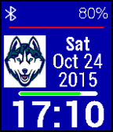{ loading=lazy width="72" } | [UCONN Logo](https://apps.rebble.io/en_US/application/5344540189b0ae14d80003b9) <small>Rebble App Store</small> | [WA1OUI](https://github.com/DHKaplan/UCONN/blob/master/UCONN-V7.2.zip) | <small>No licence</small> | 2016-10-18 | Here's the UCONN Huskies' Logo. A Bluetooth indicator (and vibration when connectivity is lost) as well as battery percentage and a battery percentage bar… |
| { loading=lazy width="72" } | [Uhrzeit als Text by n3v3r](https://apps.rebble.io/en_US/application/5351c69996ca68d67e000042) <small>Rebble App Store</small> | [n3v3r](https://github.com/n3v3r001/n3v3rstextone) | <small>Not checked yet</small> | 2025-12-01 | n3v3rs text one: Dieses Watchface zeigt die Uhrzeit als Text (Deutsch) und ist konfigurierbar! Features: * Demnächst: Anzeige des Wochentags! *… |
| 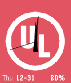{ loading=lazy width="72" } | [UL](https://apps.rebble.io/en_US/application/56856d6774e1dcc8f8000029) <small>Rebble App Store</small> | [ElliottAYoung](https://github.com/ElliottAYoung/Pebble-UL) | <small>No licence</small> | 2015-12-31 | A colorful analog watch face using the Underwriters Laboratories logo - complete with the date and remaining battery percentage. |
| { loading=lazy width="72" } | [Ulm](https://apps.repebble.com/58988a8c6d34e335f30001f4) | [The Resetter](https://github.com/GreenHex/Pebble.Anery.Q) | <small>No licence</small> | 2017-02-10 | Simple, elegant and easy-to-read watchface that consumes less power. This is a variation of Anery-SQ (which itself is based on the Notorious watchface). |
| 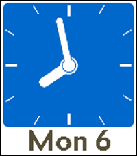{ loading=lazy width="72" } | [Ulm](https://apps.rebble.io/en_US/application/6497beda741dd4050959a9f1) <small>Rebble App Store</small> | [The Resetter](https://github.com/GreenHex/Pebble.Anery.Q) | <small>No licence</small> | 2023-06-25 | Simple, elegant and easy-to-read watchface inspired by the Notorious watchface. |
| 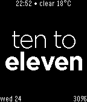{ loading=lazy width="72" } | [Ultimate Text Watch](https://apps.rebble.io/en_US/application/5485a551075d4c0154000072) <small>Rebble App Store</small> | [Ben Nguyen](https://github.com/zecoj/ultimate.text.watch) | <small>Not checked yet</small> | 2016-01-09 | ★New Name New Feature★Tell times in plain English in many ways★ Like it? Heart it! features: - tells time in plain English multiple ways: + fuzzy (ex. 12:44… |
| { loading=lazy width="72" } | [Ultra](https://apps.repebble.com/6abf59c037b3780009304810) | [EC Apps](https://github.com/eduardochiaro/ultra-watchface) | <small>Not checked yet</small> | 2026-10-04 | An analog watchface for Pebble with eight complications you choose yourself. Four gauges curve around the corners, four subdials sit inside the dial, and… |
| 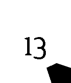{ loading=lazy width="72" } | [Uncertainty Time](https://apps.rebble.io/en_US/application/541584d8ef53049a2300005b) <small>Rebble App Store</small> | [C. Munkelt](https://github.com/CMun/UncertaintyTime) | MIT | 2014-09-28 | This watch face displays the time in a minimalistic, battery preserving fashion. The display gets refreshed only every eighth of an hour. The inner number… |
| 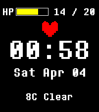{ loading=lazy width="72" } | [underface](https://apps.repebble.com/95bbad18b5df477a9b970702) | [engineerrunner](https://github.com/EngineerRunner/underface) | GPL-3.0 | 2026-04-04 | a watchface built with Alloy, inspired by undertale. features: - 7 soul colours, one for each day of the week - date and time - weather - battery (health bar) |
| 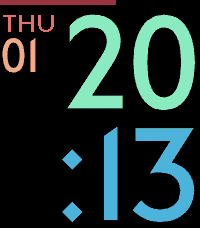{ loading=lazy width="72" } | [Underground](https://apps.rebble.io/en_US/application/67ce30a8d2acb303aedd4abe) <small>Rebble App Store</small> | [astosia](https://github.com/astosia/Underground) | <small>Not checked yet</small> | 2026-01-04 | Underground is a customizable, easy to read, large font watchface using the London Underground font. Now with optional weather! Shake or tap to show weather… |
| 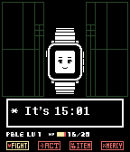{ loading=lazy width="72" } | [undertale](https://apps.rebble.io/en_US/application/564e744e86b141f0c300000f) <small>Rebble App Store</small> | [RickR](https://github.com/rickr/undertale) | <small>Not checked yet</small> | 2015-11-25 | Watchface created by Sako based on the hit RPG Undertale. Time is displayed in the dialog box. Battery remaining is displayed as HP. |
| 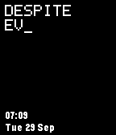{ loading=lazy width="72" } | [Undertale - Still You](https://apps.repebble.com/31982194f0bb4f248a6a44fd) | [Salim Benhamadi](https://github.com/salim-benhamadi/Pebble-Undertale) | <small>Not checked yet</small> | 2026-09-29 | Undertale's "Despite everything, it's still you." typed out in pixel letters, rewriting itself every minute. |
| { loading=lazy width="72" } | [Undertale Watchface](https://apps.repebble.com/562aa454948d06fc92000007) | [Riley Brazell](https://github.com/rileybrazell/UndertaleWatch) | <small>Not checked yet</small> | 2016-03-23 | Simple Undertale-themed watchface for Pebble Classic and Pebble Steel! Shows local time, date, and temperature in Fahrenheit! Tap/shake the watch to get a… |
| 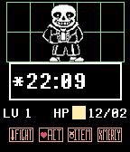{ loading=lazy width="72" } | [Undertime](https://apps.repebble.com/565fdd4a0ea7f7eaa9000008) | [Turner Vink](https://github.com/turnervink/undertime) | <small>Not checked yet</small> | 2017-01-07 | Checking the time... it fills you with DETERMINATION. A new Undertale character every hour or every time you launch the watchface. The health bar empties if… |
| 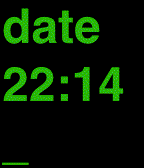{ loading=lazy width="72" } | [Unix Conole Time](https://apps.rebble.io/en_US/application/558cd08aa2deec5bc0000039) <small>Rebble App Store</small> | [JavaCowboy](https://github.com/JKCowboy/u-time) | <small>No licence</small> | 2015-06-26 | UTime (u-time) is a Pebble watchface that displays time as if commands were typed from the unix console. Others have created similar watchfaces but this one… |
| 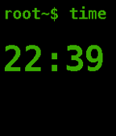{ loading=lazy width="72" } | [Unix style](https://apps.rebble.io/en_US/application/5618284f1d9c8c20f900001b) <small>Rebble App Store</small> | [Frank Prins](https://github.com/twodogwalker/PebbleFace_Ux) | <small>Not checked yet</small> | 2015-11-11 | A first playing around face, inspired by Unix interfacing. It is quite like the other you will find around here, named Terminal etc. Oh, and yes, I am aware… |
| 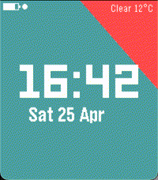{ loading=lazy width="72" } | [Upcoming Calendar Cards](https://apps.repebble.com/f5049ca6ebfd485aa8595b60) | [Sojocha](https://github.com/sbrueckl/upcoming-calendar-cards) | <small>Not checked yet</small> | 2026-04-28 | The watchface shows digital time, the next upcoming Google Calendar event as a sliding card, live weather, date, battery, and Bluetooth status. This… |
| { loading=lazy width="72" } | [Upright](https://apps.rebble.io/en_US/application/5564ab23421e8451aa00008a) <small>Rebble App Store</small> | [Jnm](https://github.com/Jnmattern/Upright) | <small>No licence</small> | 2015-05-26 | Don't bother with gravity anymore! The watch knows! Don't bend your elbow to show the time, the time rotates to be always upright! |
| 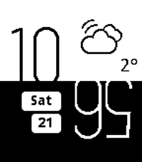{ loading=lazy width="72" } | [UpsideDown](https://apps.rebble.io/en_US/application/5634363f396cf4a5da00004c) <small>Rebble App Store</small> | [Edwin Finch](https://edwinfinch.com/redirect/pebble-legacy-source) | <small>See source</small> | 2021-06-17 | An old classic from our original collection from 2014-2016, now free & open source! |
| 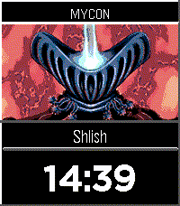{ loading=lazy width="72" } | [UQM Pilot Watchface](https://apps.rebble.io/en_US/application/6a7686ad1772b200090ffb34) <small>Rebble App Store</small> | [Daktak](https://github.com/daktak/pebble_uqm_pilot_face) | <small>Not checked yet</small> | 2026-08-08 | Watchface showing pilots from the Ur Quan Masters along with the pilots name. Configurable |
| 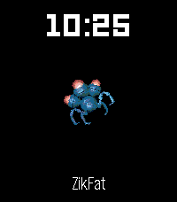{ loading=lazy width="72" } | [UQM Watchface](https://apps.rebble.io/en_US/application/5b01f9eaf385887700000bc2) <small>Rebble App Store</small> | [Daktak](https://github.com/daktak/pebble_uqm_watchface) | <small>Not checked yet</small> | 2026-06-15 | Ships from The Ur-Quan Masters as second, minute or hour hand. http://sc2.sourceforge.net/ |
| 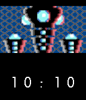{ loading=lazy width="72" } | [UQM_Pilot_Face](https://apps.repebble.com/c8134a4e1ea84e7293abb0e6) | [dabar](https://github.com/david-barrett/pebble_uqm_watchface) | <small>Not checked yet</small> | 2026-04-10 | Watchface showing pilots from the Ur Quan Masters Pilot image changes every minute |
| 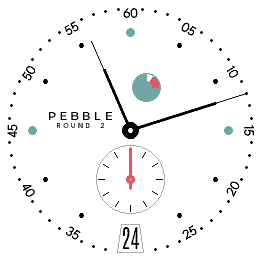{ loading=lazy width="72" } | [Urban Reserve](https://apps.repebble.com/6ca65e90a29d45c6bf7e20b6) | [Nick Winans](https://github.com/Nicell/urban-reserve-pebble) | <small>Not checked yet</small> | 2026-07-25 | A Round 2 Pebble watchface inspired by NOMOS Metro-style mechanical watch dials. Not affiliated with NOMOS Glashutte. |
| 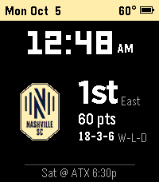{ loading=lazy width="72" } | [US Soccer Clubs](https://apps.repebble.com/2456a7484f0844c7b7266677) | [Copper Moth Software](https://coppermothsoftware.com) | <small>See source</small> | 2026-10-05 | Follow your MLS, USL Championship or USL League One club from your wrist. In the settings, pick your league, then your club, then a view: - Team: club logo… |
| 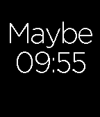{ loading=lazy width="72" } | [Useless](https://apps.rebble.io/en_US/application/56a384f34a212c04ef00003d) <small>Rebble App Store</small> | [b123400](https://github.com/b123400/useless) | <small>Not checked yet</small> | 2016-01-23 | This watchface shows pretty useless texts, but it never tells a lie. |
| 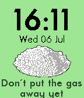{ loading=lazy width="72" } | [UTOPIA](https://apps.repebble.com/577d109366202abaab0001eb) | [Gia90](https://github.com/Gia90/PebbleUtopia) | <small>Other</small> | 2016-07-06 | UTOPIA Pebble watchface, inspired by UTOPIA TV Show. Main features: - Cool battery indicator (Chilly: 100-80%, Sand: 70-50%, Bleach: 40-30%, Spoon: 20-10%… |
