<!-- Generated by scripts/update_app_directory.py: do not edit by hand -->
# Watchfaces: V

[← About this list](../watchfaces.md) · [A](a.md) · [B](b.md) · [C](c.md) · [D](d.md) · [E](e.md) · [F](f.md) · [G](g.md) · [H](h.md) · [I](i.md) · [J](j.md) · [K](k.md) · [L](l.md) · [M](m.md) · [N](n.md) · [O](o.md) · [P](p.md) · [Q](q.md) · [R](r.md) · [S](s.md) · [T](t.md) · [U](u.md) · **V** · [W](w.md) · [X](x.md) · [Y](y.md) · [Z](z.md) · [0–9 & other](other.md)

*46 watchfaces · Last updated 2026-10-06*

| Screenshot | Name | Developer | Licence | Updated | Description |
|------------|------|-----------|---------|---------|-------------|
| { loading=lazy width="72" } | [Vacation Time](https://apps.rebble.io/en_US/application/553047687b5ea6980a00006a) <small>Rebble App Store</small> | [Turner Vink](https://github.com/turnervink/vacationtime) | <small>Not checked yet</small> | 2015-08-30 | For when the hours don't matter! See the progress through the day in 8 easy to read stages with colour-matched backgrounds. Shake to view remaining battery… |
| { loading=lazy width="72" } | [vague text with hr](https://apps.rebble.io/en_US/application/596f09ff0dfc323e110000d3) <small>Rebble App Store</small> | [melekzek](https://github.com/melekzek/pebble-text-with-hr) | <small>Not checked yet</small> | 2017-07-22 | Vague text-based watchface with hr support on pebble2. Double tap to temporarily switch to digital display for accurate time and hr. |
| 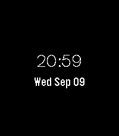{ loading=lazy width="72" } | [ValleySans Simple watchface](https://apps.repebble.com/bc1e47a42954410cb70e891b) | [Vinayla](https://github.com/vinay1017/Pebble-Font-Test) | <small>Not checked yet</small> | 2026-09-10 | Genuinely the simplest watchface made with Alloy and testing out a font called ValleySans. And testing to see if the pebble #1621 bug report is still… |
| 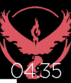{ loading=lazy width="72" } | [Valor Watchface](https://apps.repebble.com/57968736a40d829e7b00000e) | [Nikhil Gumma](https://github.com/NikhilGumma/watchface_example_asl) | <small>Not checked yet</small> | 2016-07-25 | Valor Logo from Pokemon Go with battery indicator |
| 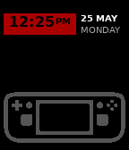{ loading=lazy width="72" } | [Valve Watchface](https://apps.repebble.com/bff9181191da49d992568e39) | [Creative Manaks](https://github.com/manaksu/ValveWatch) | <small>Not checked yet</small> | 2026-05-30 | A fan-made watchface dedicated to Valve Corporation and the Steam Deck — because great design deserves to live on your wrist too. Time is displayed in bold… |
| 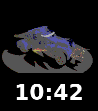{ loading=lazy width="72" } | [Van Face](https://apps.repebble.com/4ae142201d714846a1fab3d7) | [Dzmitry Malyshau](https://github.com/kvark/van-face) | <small>Not checked yet</small> | 2026-06-05 | Rotating Vangers mechos on a turntable, with the time below. Cycles through 14 vehicles (Iron Shadow to Excorps) by day, by wrist-raise/tap, or pinned via… |
| 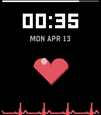{ loading=lazy width="72" } | [Vanity](https://apps.repebble.com/fd6389cb6fb74c0dbe954144) | [Brooman Inks](https://github.com/brooks2564/Pebble-Vanity) | <small>Not checked yet</small> | 2026-04-13 | Vanity Most watchfaces show you the time. Vanity shows you how many people like it. It connects to the Pebble App Store, fetches its own heart count, and… |
| 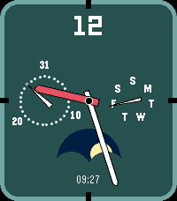{ loading=lazy width="72" } | [VANTAGE](https://apps.repebble.com/6970a55f04726500096d9975) | [atomlabor](https://github.com/atomlabor/vantage) | <small>Not checked yet</small> | 2026-02-27 | VANTAGE is a high-precision analog watchface, now completely rebuilt and optimized for the entire Pebble ecosystem (Time 2, Time, Pebble 2, and Classic)… |
| 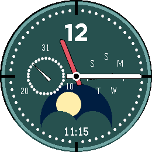{ loading=lazy width="72" } | [VANTAGE Round](https://apps.repebble.com/47f0856e24654a89b689f12a) | [atomlabor](https://github.com/atomlabor) | <small>Not checked yet</small> | 2026-02-27 | VANTAGE Round is a sophisticated, data-rich analog watchface tailored specifically for the circular displays of the Pebble Time Round (Chalk) and the… |
| 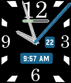{ loading=lazy width="72" } | [Variable Hands](https://apps.rebble.io/en_US/application/5621a59ea97d31cb8000001b) <small>Rebble App Store</small> | [smognus](https://github.com/smognus/variable-hands-SDK3) | <small>Not checked yet</small> | 2015-10-22 | It has always bothered me that watch hands on a rectangular watchface are a varying distance from the edge of the face. This watchface grows and shrinks the… |
| 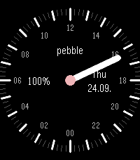{ loading=lazy width="72" } | [Varv](https://apps.repebble.com/8adb686039f747f98e0414d4) | [Carl-Fredrik Arvidson](https://github.com/cfarvidson/pebble-varv) | <small>Not checked yet</small> | 2026-09-24 | 24-hour watchface with a single long hand for Pebble Time 2. One rotation per day: noon at the top, midnight at the bottom. Black dial with quarter-hour… |
| 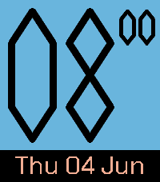{ loading=lazy width="72" } | [Varv](https://apps.repebble.com/693625b95434b00008eff112) | [justinjhendrick](https://github.com/justinjhendrick/varve-pebble-watchface) | <small>Not checked yet</small> | 2026-07-05 | A Digital watchface with analog time feeling Features: * Huge text for the hour * Minute digits move vertically * Great battery life (updates once per… |
| 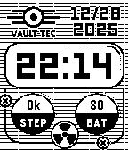{ loading=lazy width="72" } | [Vault](https://apps.repebble.com/6951762424ba4b0009dc92c5) | [David Peer](https://github.com/peerdavid/pebble-vault) | <small>Not checked yet</small> | 2025-12-28 | A fallout inspired open-source watch face which shows the date, time as well as the number of steps and the battery level. Disclaimer: This project is an… |
| { loading=lazy width="72" } | [VaultBoy](https://apps.rebble.io/en_US/application/54d8d7cf05db7b86c600008a) <small>Rebble App Store</small> | [Helco](https://github.com/Helco/VaultBoyWatchface) | <small>No licence</small> | 2015-09-22 | For your survival in the post-apocalyptic world. Inspired by the watch your character of Fallout 3 wears in the Tranquility Lane. You can now wear this… |
| 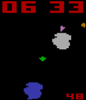{ loading=lazy width="72" } | [VCSteroids](https://apps.rebble.io/en_US/application/55899c20ef446d0ed80000e7) <small>Rebble App Store</small> | [Llamasoft](https://github.com/an-ox/vcsteroids) | <small>Not checked yet</small> | 2015-06-23 | Watchface based on the old VCS Asteroids game. |
| 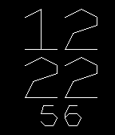{ loading=lazy width="72" } | [Vector Morph](https://apps.rebble.io/en_US/application/54e92432caaeb247b20000b9) <small>Rebble App Store</small> | [Joakim Lundborg](http://github.com/cortex/pebble-morph) | <small>No licence</small> | 2015-02-22 | Tell the time with oldschool arcade vectors. Hand-coded font with smooth animated transitions. |
| 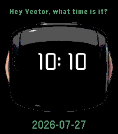{ loading=lazy width="72" } | [VectorFace](https://apps.repebble.com/7bbad80bcf3f40f7b7ba1b41) | [Unknown](https://github.com/Switch-modder/VectorFace) | <small>Not checked yet</small> | 2026-07-27 | VectorFace! A simple watchface which shows the time just like Vector does when you ask him the time. Built using https://studio.pebbleface.com/ . |
|  | [Velowatch](https://apps.repebble.com/ab41d7c9701c4dafb92c39a2) | [Velowatch](https://github.com/genko/velowatch) | <small>Not checked yet</small> | 2026-06-13 | Cycling weather watchface |
| 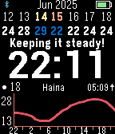{ loading=lazy width="72" } | [VeloWatch](https://apps.rebble.io/en_US/application/68e151ee7543230009e3da9d) <small>Rebble App Store</small> | [wattwelove](https://github.com/genko/velowatch) | <small>Not checked yet</small> | 2026-03-16 | Shows weather forecast (OpenWeatherMap API key required) and current training status from RiDuck. |
| 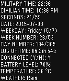{ loading=lazy width="72" } | [Verbose Watchface for Pebble](https://apps.repebble.com/5597be3a6e32ca686800001e) | [Marcello Brivio](https://github.com/marcellobrivio/Pebble-Verbose-Watchface) | <small>Not checked yet</small> | 2016-02-27 | In this watchface you won't find beautiful graphics or cool typography to please your eyes: only data, displayed with a terminal-inspired look & feel for… |
| 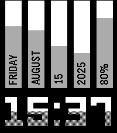{ loading=lazy width="72" } | [Vertical Health](https://apps.repebble.com/688f5e77d36b550009ece4cf) | [Comfortably Numb](https://github.com/ygalanter/Vertical-Pebble) | <small>Not checked yet</small> | 2026-07-16 | Unique watchface design, showing - day of the week - month - date - year - battery percentage in vertical columns, plus time in large digits. Progress bars… |
| { loading=lazy width="72" } | [Verticalface](https://apps.rebble.io/en_US/application/56b6d683f17b79ba4200006a) <small>Rebble App Store</small> | [NovaG](https://github.com/NovaGL/Verticalface) | <small>Not checked yet</small> | 2016-02-14 | Simple watch face with vertical hour and minutes. Customize minutes colour and ability to remove leading zero in the settings. |
| { loading=lazy width="72" } | [Vertin](https://apps.repebble.com/67d405d0f4b49d00099ff85d) | [Tony Atkins](https://github.com/duhrer/pebble-vertin-c) | <small>Not checked yet</small> | 2025-03-14 | The second hand inverts the colours as it moves. The colours are configurable, and there's an optional "night mode" you can configure to use different… |
| { loading=lazy width="72" } | [Very Fuzzy](https://apps.rebble.io/en_US/application/52a4d561c661b61d9800002b) <small>Rebble App Store</small> | [Hamish Downer](https://github.com/foobacca/very-fuzzy-pebble) | <small>Not checked yet</small> | 2013-12-08 | It's eleven ... ish. The hours are still given as numbers, but everything else is "five or so", "past four", "almost ten" etc. It's how I'd describe time… |
| 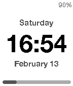{ loading=lazy width="72" } | [Very Simple Watch](https://apps.rebble.io/en_US/application/5654cf924cd9a0eea3000077) <small>Rebble App Store</small> | [Alex Gawley](https://github.com/agawley/PippaWatch) | <small>Not checked yet</small> | 2016-02-14 | Very Simple watch face. The time, day and date. Battery charge level and BT connection alert. Optionally show your step count (from Pebble Health) vs a… |
| 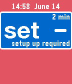{ loading=lazy width="72" } | [Vibe Spark](https://apps.repebble.com/57607b4518463b7d28000018) | [testyk8](https://github.com/Kdisimone/cgm-simple-spark) | <small>No licence</small> | 2019-07-24 | Longer vibration alerts for simple cgm |
| { loading=lazy width="72" } | [VIBES](https://apps.repebble.com/57134355a6ae41b29b000007) | [amyjchen](https://github.com/amyjchen/vibes) | <small>Not checked yet</small> | 2016-04-17 | The minutes are expressed with four vibrations, three of short and one long. The placement of the long vibration signals the minutes. The minutes are… |
| 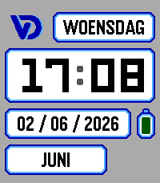{ loading=lazy width="72" } | [Vic's Watchface](https://apps.repebble.com/ebdf505fb5194e159895b743) | [Vic Demuzere](https://git.dmzr.be/sorcix/pebble-watchface) | <small>See source</small> | 2026-06-03 | Personal watchface. Shows only the information I want to see. No settings. |
| 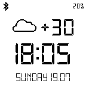{ loading=lazy width="72" } | [VIC4884](https://apps.rebble.io/en_US/application/55aa9432c380d0b04b00009c) <small>Rebble App Store</small> | [GrakovNe](http://forums.getpebble.com/discussion/10324/javascript-apps-only-allowed-in-official-appstore) | <small>See source</small> | 2015-07-24 | Simply watchface special for VIC4884 from 4pda.ru |
| 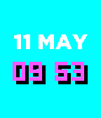{ loading=lazy width="72" } | [Vice](https://apps.rebble.io/en_US/application/554aa11eee68650e870000af) <small>Rebble App Store</small> | [leovander](https://github.com/leovander/vice) | <small>Not checked yet</small> | 2015-05-11 | Vice is inspired from the colors of Miami Vice logo and the awesome 80's. |
| { loading=lazy width="72" } | [Victor's Watch (Cosmos Laundromat)](https://apps.repebble.com/576366902946d71c0b00000d) | [Ren Gianforte](https://github.com/rengianforte/pebble-antonis) | <small>Not checked yet</small> | 2016-06-17 | This is a recreation of Victor's Watch from "Cosmos Laundromat: First Cycle". Go watch it if you haven't seen it! This watch shows hours on the left… |
| 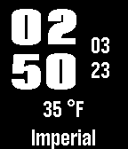{ loading=lazy width="72" } | [Vida](https://apps.rebble.io/en_US/application/532ee6bb3dfa0916ff0001d6) <small>Rebble App Store</small> | [Noah Greenberg](http://github.com/NoahDev/Vida/) | <small>No licence</small> | 2014-03-23 | Stylish, simple, yet complex. Grab the time, date, weather, and location right from your watch while still maintaining a good look. Configurable! - Color… |
| 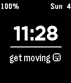{ loading=lazy width="72" } | [Vigor](https://apps.rebble.io/en_US/application/5611638c8331e9077b00000d) <small>Rebble App Store</small> | [Sam Mercier](http://github.com/samontea/vigor) | <small>No licence</small> | 2015-10-04 | Vigor is a pebble watchface that offers built in functionality for automatic activity tracking. Just start moving and vigor will track your time. |
| 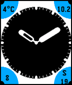{ loading=lazy width="72" } | [Vinyl](https://apps.repebble.com/56e89ef0621418c0c1000022) | [Christophe Jeannette](https://github.com/Sichroteph/Vinyl) | <small>Not checked yet</small> | 2018-02-04 | Now with forecast.io temperature ! Vinyl is an analog watchface designed to be elegant and readable. Informations : - Temperature - Battery (0-&gt;10) - Date 4… |
| 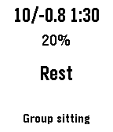{ loading=lazy width="72" } | [Vipassana](https://apps.rebble.io/en_US/application/6996ab1b36c3420009e9c780) <small>Rebble App Store</small> | [Toni Magni](https://github.com/zgypa/pebble-vipassana) | <small>Not checked yet</small> | 2026-02-19 | Vipassana - Meditation Course Watchface A minimalist watchface for students and servers attending Vipassana meditation courses (as taught by S.N. Goenka)… |
| 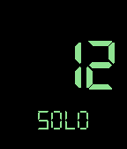{ loading=lazy width="72" } | [Virtue's Last Reward](https://apps.repebble.com/57cea0264a6ad9d300000077) | [Athene Allen](https://github.com/gnargle/VLRWatch) | <small>Not checked yet</small> | 2016-09-12 | A watchface inspired by Zero Escape: Virtue's Last Reward and this face by weaversway. https://apps.getpebble.com/en_US/application/5733bba2f68e7b31a9000002… |
| 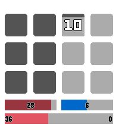{ loading=lazy width="72" } | [VITA](https://apps.repebble.com/751e82f074064ce5b5fb0c58) | [Alkali-V2](https://github.com/Alkali-V2/Pebble-Vita) | <small>No licence</small> | 2026-07-04 | Inspired by Pnooka and tens, this watch face keeps the simplicity of a 12-hour watch face while allowing the user to switch on text for important fields… |
| 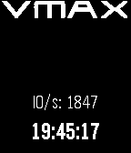{ loading=lazy width="72" } | [VMAX IO](https://apps.rebble.io/en_US/application/52dc9be5f3be1c381d000062) <small>Rebble App Store</small> | [Matt Cowger](https://github.com/mcowger/vmaxv2) | <small>Not checked yet</small> | 2014-01-20 | Shows the live IO on a EMC VMAX |
| 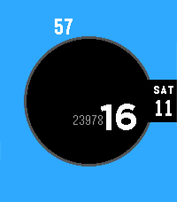{ loading=lazy width="72" } | [Void](https://apps.repebble.com/69da689d804ae2000901d42b) | [EC Apps](https://github.com/eduardochiaro/void) | <small>Not checked yet</small> | 2026-06-04 | A sleek and minimalist watch face made with Alloy that displays only the time, date, and steps (if active). The accent color can be customized. |
| 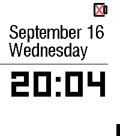{ loading=lazy width="72" } | [Void Clock](https://apps.repebble.com/8270e9a5faa948f098cb253a) | [Benjamin Burgy](https://github.com/bburgy/void-clock) | <small>Not checked yet</small> | 2026-09-18 | Born from the legacy of ClockLight (a decade in the making), Void Clock is a high-contrast minimalist watchface designed for the focused. It strips away the… |
| 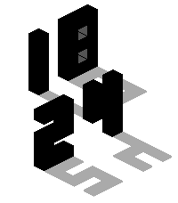{ loading=lazy width="72" } | [Void Statues](https://apps.repebble.com/68a492f024908f00096bb0b2) | [Chris Lewis](https://github.com/C-D-Lewis/pebble-dev) | <small>No licence</small> | 2026-06-14 | Isometric watchface that draws solid statues and casts grey or dithered shadows to show the time. Animates the current time on launch, and inverts colors… |
| 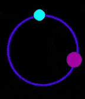{ loading=lazy width="72" } | [Vortex](https://apps.repebble.com/55a56b9af4510f3705000050) | [Comfortably Numb](http://github.com/ygalanter/vortex) | MIT | 2016-09-14 | Minimalistic analog watchface with Vortex animation on every minute. Configurable options include - Bluetooth alert buzz strength - Show Digital time - Show… |
| 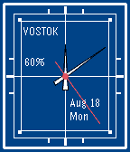{ loading=lazy width="72" } | [Vostok](https://apps.repebble.com/68a345dbf4531c0009a7a393) | [Corrivatus](https://krei.lambdacreate.com/Pebble/Vostok) | <small>Not checked yet</small> | 2025-08-18 | A minimalist analog watch face inspired by the 1960's era Vostok line of watches. |
| 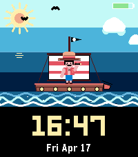{ loading=lazy width="72" } | [Voyage](https://apps.repebble.com/560a0f4be93d44fc8d7b42ff) | [AirCodum](https://github.com/coredevices/pebble-watchface-agent-skill) | <small>Not checked yet</small> | 2026-04-17 | Set sail on an animated pirate voyage — a ship bobs on the waves with a captain in his iconic straw hat. Shows time, date, and battery. |
| 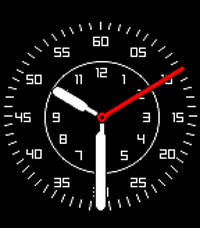{ loading=lazy width="72" } | [Vuela](https://apps.rebble.io/en_US/application/62ffabcf93b4e8000aa2cbec) <small>Rebble App Store</small> | [Gonzalo Muñoz](https://github.com/zamuz/vuela) | <small>Not checked yet</small> | 2025-08-14 | A Flieger style watchface. |
| { loading=lazy width="72" } | [VW (Unofficial)](https://apps.rebble.io/en_US/application/58070ba89392ff32cf0002ce) <small>Rebble App Store</small> | [brandonb927](https://github.com/brandonb927/pebble-watchface-vw-unofficial) | <small>Not checked yet</small> | 2017-04-05 | Are you a VW enthusiast like myself? Rock this slick looking VW watchface and impress your friends! |
