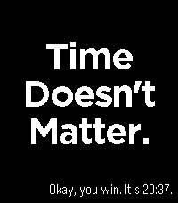
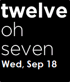

<!-- Generated by scripts/update_app_directory.py: do not edit by hand -->
# Watchfaces: W

[← About this list](../watchfaces.md) · [A](a.md) · [B](b.md) · [C](c.md) · [D](d.md) · [E](e.md) · [F](f.md) · [G](g.md) · [H](h.md) · [I](i.md) · [J](j.md) · [K](k.md) · [L](l.md) · [M](m.md) · [N](n.md) · [O](o.md) · [P](p.md) · [Q](q.md) · [R](r.md) · [S](s.md) · [T](t.md) · [U](u.md) · [V](v.md) · **W** · [X](x.md) · [Y](y.md) · [Z](z.md) · [0–9 & other](other.md)

*85 watchfaces · Last updated 2026-10-06*

| Screenshot | Name | Developer | Licence | Updated | Description |
|------------|------|-----------|---------|---------|-------------|
| { loading=lazy width="72" } | [W&L Amino Acids](https://apps.rebble.io/en_US/application/52b786db9efe58231f000006) <small>Rebble App Store</small> | [PebbLiz Technologies](https://github.com/pebble-hacks/watch_and_learn) | <small>Not checked yet</small> | 2014-01-08 | Watch & Learn Flashcards show the structures of the 20 common amino acids and their 1-letter code on the front. A flick of the wrist turns the card to the… |
| { loading=lazy width="72" } | [W800H / W96H Casio](https://apps.repebble.com/593ede1eb67f9fb68e000e1e) | [JohnEdwa](https://github.com/JohnEdwa/W800) | GPL-3.0 | 2018-02-28 | A customizable watchface inspired by the Casio W800H and W96H digital watches. Now with customizable colours! The layout consists of five customizable… |
| { loading=lazy width="72" } | [wake up_](https://apps.rebble.io/en_US/application/65ee6ce8ea09ac0433d38125) <small>Rebble App Store</small> | [lavendork](https://github.com/lavglaab/pebble-signalis-face) | <small>Not checked yet</small> | 2024-03-15 | A watch face for Pebble Time series watches, based on the title screen of the game SIGNALIS! Features: - 12 and 24 hour digital time - On-screen indicators… |
| { loading=lazy width="72" } | [Wal Ter](https://apps.repebble.com/56d4ad0a3b7516840d00002b) | [Wal Ter](https://github.com/webgiorno/wal_face) | <small>Not checked yet</small> | 2016-03-01 | Watchface officiale con lu malantrinu Wal Ter! Inglese: From the Sicilian icon Wal Ter comes a new watchface for your Pebble device! He'll steal your heart… |
| { loading=lazy width="72" } | [Wall Flip](https://apps.repebble.com/6a3d4248cd52370009862b05) | [EC Apps](https://github.com/eduardochiaro/flipwall-watchface) | <small>Not checked yet</small> | 2026-08-05 | A digital watchface based on flip clock design. Configure via the settings page. General Layout: 5 or 6 blocks. Language — translates month and weekday… |
| { loading=lazy width="72" } | [Wallpaper](https://apps.rebble.io/en_US/application/57f2398405e4b17492000129) <small>Rebble App Store</small> | [chops](https://github.com/mereed/pebbleface-wallpaper) | <small>Not checked yet</small> | 2016-12-11 | I've been working on this one for a while, so have finished it off. After a number of design iterations, i'm done. It's similar to another of my watchfaces… |
| { loading=lazy width="72" } | [Waltham Field Watch](https://apps.rebble.io/en_US/application/6a24f8dbbb366d0009322024) <small>Rebble App Store</small> | [hear](https://github.com/samhear2/Pebble-Waltham-Face-1) | <small>Not checked yet</small> | 2026-07-13 | Waltham field watchface with included date, heart rate, and battery monitor complications. |
| { loading=lazy width="72" } | [WaniKani TokeiTokei](https://apps.repebble.com/5765fc4d0cc8f55521000149) | [Darkenvy](https://github.com/darkenvy/TokeiTokei/) | <small>Not checked yet</small> | 2016-06-19 | NOTE: Must install this Japanese language pack to work! Japanese is not natively supported by Pebble. http://wh.to/pebble/index_jp.html WaniKani on your… |
| { loading=lazy width="72" } | [Wanted](https://apps.rebble.io/en_US/application/52d24acbcc1d0d0286000038) <small>Rebble App Store</small> | [Surfea Industries](https://github.com/william-k-chen/wanted-pebble-watchface) | <small>Not checked yet</small> | 2014-01-12 | Watchface styled after a "Wanted" poster. Check the Github link for the source - demonstrates custom font, image and time formatting. |
| { loading=lazy width="72" } | [Watch it Calculate](https://apps.repebble.com/57675ca63feaee1b800002f3) | [Hat](https://github.com/TheYellowHat/Watch-It-Calculate) | <small>Not checked yet</small> | 2016-06-20 | *Just in case* If you don't like the gray calculator-like background for both the time and date, check out my other apps for a different build. 'Watch It… |
| { loading=lazy width="72" } | [Watch It Calculate Minus](https://apps.repebble.com/576754903feaee4aa30002b8) | [Hat](https://github.com/TheYellowHat/Watch-It-Calculate-Minus) | <small>Not checked yet</small> | 2016-06-20 | *Just in case* If you don't like the plain background for both the time and date, check out my other apps for a different build. 'Watch It Calculate', just… |
| { loading=lazy width="72" } | [Watch it Calculate V2](https://apps.repebble.com/5769298e3feaee189f0004a7) | [Hat](https://github.com/TheYellowHat/Watch-It-Calculate-V2) | <small>Not checked yet</small> | 2016-06-21 | *Just in case* There are simpler versions of this WatchFace on the appstore called, you guessed it, 'Watch It Calculate' and 'Watch It Calculate Minus.' Go… |
| { loading=lazy width="72" } | [watch.fm - last.fm watchface](https://apps.rebble.io/en_US/application/5348549aa093cd29b2000051) <small>Rebble App Store</small> | [bitbased](http://github.com/bitbased/watch-fm) | <small>No licence</small> | 2015-06-24 | A last.fm now playing and album art watchface. Use last.fm to scrobble your now playing information from last.fm or Spotify or other apps and have it… |
| { loading=lazy width="72" } | [Watcheta](https://apps.rebble.io/en_US/application/5568e8d314bc604f05000062) <small>Rebble App Store</small> | [Vishal Ravi Shankar](https://github.com/vshl/DBZVegeta) | <small>Not checked yet</small> | 2017-03-11 | Simple watchface. Displays fan-favorite Dragonball-Z character Vegeta along with time, date and weather. |
| { loading=lazy width="72" } | [WatchFace-TR](https://apps.rebble.io/en_US/application/536fc7e2190f07bd120001b0) <small>Rebble App Store</small> | [Dogan Can Kilment](https://github.com/dogancankilment/watchface-tr) | <small>Not checked yet</small> | 2014-05-11 | -&gt; Time -&gt; GG/AA/YYYY -&gt; Day / Bluetooth Connection / Battery This watchface translated to Turkish by watchface project. -&gt; Saat -&gt; Gün/Ay/Yıl -&gt; Gün /… |
| { loading=lazy width="72" } | [Watchpebble](https://apps.repebble.com/ee99a923ebaf4cf889fef841) | [Unknown](https://github.com/cy8aer/WatchPebble) | <small>Not checked yet</small> | 2026-09-20 | A 24 hour watchface inspired by an old 24 hour WatchPeople watch. |
| { loading=lazy width="72" } | [Water](https://apps.rebble.io/en_US/application/5a87fd2e461a8de29800275d) <small>Rebble App Store</small> | [itmitica](https://github.com/itmitica/Pebble-Water.git) | <small>Not checked yet</small> | 2018-02-17 | Two screens: screenface and watchface. Default is screenface. Shake your wrist to display the watchface: date, marked weekday, time. Screenface returns to… |
| { loading=lazy width="72" } | [Waterfall](https://apps.repebble.com/2fb642c7af3d47de99c28fe7) | [kjubybot](https://github.com/kjubybot/pebble-waterfall) | <small>Not checked yet</small> | 2026-06-12 | A minimalist Pebble watchface with a per-column waterfall animation. |
| { loading=lazy width="72" } | [watsface](https://apps.rebble.io/en_US/application/5b2bf021fbaf9ae33400044d) <small>Rebble App Store</small> | [Dark](https://github.com/lukefor/watsface) | <small>Not checked yet</small> | 2021-11-21 | Works as is shown in the screenshots, with no configuration. Font is Oswald from Google Fonts. Displays charging status, vibrates on disconnect, all that… |
| { loading=lazy width="72" } | [Wave](https://apps.repebble.com/56059ab092c56c56c3000089) | [Dmitry Dodzin](https://github.com/DmitryDodzin/PebbleWave) | <small>No licence</small> | 2016-06-11 | A Simple Clock with a wave in the background |
| { loading=lazy width="72" } | [Wdustride](https://apps.rebble.io/en_US/application/69b64dd51645ed000a4fb1fd) <small>Rebble App Store</small> | [homecafe](https://github.com/pebble-examples/health-watchface) | <small>Not checked yet</small> | 2026-04-09 | weather dust stride app dust shows - G(ood), N(ormal), B(ad), V(ery Bad) |
| { loading=lazy width="72" } | [We Are Here Now](https://apps.rebble.io/en_US/application/540b06e8d7709073b100014c) <small>Rebble App Store</small> | [Lukas Vermeer](http://github.com/lukasvermeer/thetimeisnow) | <small>No licence</small> | 2014-09-08 | Simple Pebble watchface intended to encourage mindfulness of the present by discretely punctuating the constant passage of time. Pebble will vibrate a… |
| { loading=lazy width="72" } | [Weather Ball](https://apps.rebble.io/en_US/application/551d91875b2cb490c5000065) <small>Rebble App Store</small> | [Mathew Reiss](http://www.github.com/MathewReiss/weather_ball) | <small>No licence</small> | 2015-05-27 | Weather Ball shows you the weather, in the simplest way possible, using color. Instead of icons or text, the weather is shown by setting the four digits of… |
| { loading=lazy width="72" } | [Weather Face](https://apps.rebble.io/en_US/application/52ba053d7a3fe9f7ae000007) <small>Rebble App Store</small> | [Tory Gaurnier](https://github.com/tgaurnier/WeatherFace) | <small>Not checked yet</small> | 2013-12-29 | A simple weather watch face, shows location and weather. Uses Open Weather Map for data. Built with SDK 2.0, and is configurable via Android or iOS Pebble app. |
| { loading=lazy width="72" } | [Weather Glance](https://apps.repebble.com/9492f2777b5f422e90454147) | [Manapart](https://github.com/ManApart/manapart-watchface) | <small>Not checked yet</small> | 2026-10-03 | Designed to be glancable for time, or inspected for more information. Includes both date/day names and a full date for those forgetful of the day/month. … |
| { loading=lazy width="72" } | [Weather My Way](https://apps.repebble.com/53630f55ce68f72efc00011f) | [Jared Biehler](https://github.com/jaredbiehler/weather-my-way) | <small>Not checked yet</small> | 2016-03-14 | Weather Underground current conditions and hourly forecasts* wrapped in a Futura Weather design. - Configurable weather data services (Weather Underground… |
| { loading=lazy width="72" } | [Weather My Way edited by Zeduaz](https://apps.rebble.io/en_US/application/54a7c92de8b7f5f267000044) <small>Rebble App Store</small> | [Zeduaz](https://github.com/Zeduaz/weather-my-way) | <small>Not checked yet</small> | 2015-06-14 | Another weather watchface with weather forecast. Edited watchface Weather My Way. Location services on your phone must be enabled and always on because… |
| { loading=lazy width="72" } | [Weather My Way edited by Zeduaz - INVERTED](https://apps.rebble.io/en_US/application/557dca65d8339ae151000059) <small>Rebble App Store</small> | [Zeduaz](https://github.com/Zeduaz/weather-my-way) | <small>Not checked yet</small> | 2015-06-14 | Another weather watchface with weather forecast. Edited watchface Weather My Way - INVERTED. Location services on your phone must be enabled and always on… |
| { loading=lazy width="72" } | [Weather Soon](https://apps.repebble.com/e6c6572df8cc48d5b8b042e8) | [Radiant Sundial](https://github.com/aidankierans/WeatherSoon) | <small>Not checked yet</small> | 2026-09-11 | An easy display of current and hourly weather, including UV index. |
| { loading=lazy width="72" } | [Weather Watch](https://apps.rebble.io/en_US/application/550f3186e0b81d4f1a000044) <small>Rebble App Store</small> | [Mark Bush](https://github.com/markbush/weather-watch) | <small>Not checked yet</small> | 2015-10-31 | Simple watchface with date and weather info. The hands are discreet on the outside so don't obscure the information being displayed. Options are available… |
| { loading=lazy width="72" } | [Weather+](https://apps.rebble.io/en_US/application/543448c932035c992b000019) <small>Rebble App Store</small> | [Dogan](https://github.com/wdoganowski/weather-face-plus.git) | <small>Not checked yet</small> | 2014-11-28 | Time & weather in one classy watch face. No companion app needed. See the current temperature in °C or °F, sky, as well as the battery level and bluetooth… |
| { loading=lazy width="72" } | [WeatherFace](https://apps.rebble.io/en_US/application/56206ff2768e7a4b4e00002c) <small>Rebble App Store</small> | [ktagjp](https://github.com/ktagjp/WeatherFace/) | <small>Not checked yet</small> | 2015-12-28 | Based on Jared Biehler's WEATHER MY WAY, a bit modified like... add vibration on Bluetooth disconnection and some colorized flavor. - Configurable weather… |
| { loading=lazy width="72" } | [Weathers Time](https://apps.repebble.com/57d2c150ffca491fd200006b) | [AwesomeInRed](https://github.com/edward88/pebbletime-weatherstime) | <small>Not checked yet</small> | 2016-11-03 | Watchface features: - Simple, clean and easy to read display - Location based weather info - Multiple choice source for weather data - Battery level display… |
| { loading=lazy width="72" } | [WeatherStep](https://apps.repebble.com/56cb08dba0d6408f78000025) | [redlynr](http://github.com/redlynr/Weatherstep) | <small>Other</small> | 2019-07-24 | Choices of weather provider = Open Weather or Weather Underground if you have your own API key. Every time a weather update is made, a timeline pin will be… |
| { loading=lazy width="72" } | [WeatherStep - Lite](https://apps.repebble.com/56faa800d83b44cc0400004c) | [redlynr](https://github.com/redlynr/WeatherStep-Lite) | <small>Not checked yet</small> | 2019-07-24 | Choices of weather provider = Open Weather, Yahoo Weather, and Weather Underground if you have your own API key. Every time a weather update is made, a… |
| { loading=lazy width="72" } | [Web Services Shutdown Countdown](https://apps.rebble.io/en_US/application/5b220db9f38588be6b001117) <small>Rebble App Store</small> | [SphinxyScale](https://github.com/sensi277/pebbleWebServicesCountdown) | <small>Not checked yet</small> | 2018-06-14 | Counts down the amount of time to the Pebble Web Services shutdown. Based on https://github.com/kernel-sanders/Time-Until-Pebble |
| { loading=lazy width="72" } | [WEBFISHING](https://apps.repebble.com/67c6beb7d2acb30009a3c809) | [nubbybubby](https://github.com/nubbybubby/webfishing-watchface) | <small>Not checked yet</small> | 2026-05-14 | A WEBFISHING themed watchface. (I am not affiliated with lamedeveloper lol) |
| { loading=lazy width="72" } | [webOS Clock](https://apps.repebble.com/5822be1ae7785be14b000102) | [The Resetter](https://github.com/GreenHex/Pebble.webOS.Clock) | MIT | 2017-01-15 | The much loved webOS analogue clock for your Pebble. Hour markers and date are in the webOS "Prelude" typeface. Shake watch for seconds display. Source is… |
| { loading=lazy width="72" } | [Weekface](https://apps.repebble.com/86b944d8971e4df2a392dfad) | [Bil Arikan](https://github.com/bilarikan/pebble-watchface-weekface) | <small>Not checked yet</small> | 2026-08-19 | Weekface is a clean, information-dense watchface built around how days, weeks, and quarters structure your year. TOP TO BOTTOM • Status bar : battery… |
| { loading=lazy width="72" } | [WeeklyRing](https://apps.repebble.com/582482ccb62cef78520000ad) | [Maxwell Moseley](https://github.com/maxmoseley23/DailyRing1/tree/weekly-ring) | <small>Not checked yet</small> | 2016-11-10 | See a full week pass with WeeklyRing! A full 7-day week is expressed as a circle starting on Sunday, while the hours, minutes, day of week, and date is… |
| { loading=lazy width="72" } | [weezeface](https://apps.rebble.io/en_US/application/6377c82fc6c24a000a815e53) <small>Rebble App Store</small> | [John Spahr](https://github.com/johnspahr/weezeface) | <small>Not checked yet</small> | 2022-11-18 | The world’s first Weezer watchface for Pebble! Switches between the blue and red album covers depending on your BT connection status. This project was… |
| { loading=lazy width="72" } | [Welcome to Twin Peaks](https://apps.repebble.com/03a7c81cfce647e7b2391cd0) | [Knfn](https://github.com/knucklesfan/pebble-watchfaces) | <small>Not checked yet</small> | 2026-09-30 | It is happening again... Step Counter, Date/Time, Weather, and Battery. A damn fine watchface. Art originally drawn by… |
| { loading=lazy width="72" } | [Well Rounded](https://apps.repebble.com/571132cf46e6404f36000007) | [David Morgan](https://github.com/Spitemare/well-rounded) | <small>Not checked yet</small> | 2016-04-19 | Make it yours! Well Rounded is an analog watchface with lots of configuration. Colors, ticks, second hand, complications. Want to know your battery level?… |
| { loading=lazy width="72" } | [wellew](https://apps.repebble.com/98336cbe9af04444be2f8673) | [tc5206](https://github.com/tc5206/pebble_wellew) | <small>Not checked yet</small> | 2026-06-06 | ### Description A minimalist digital watchface inspired by the SKAGEN Mellem. It features a crisp time display right at the center of the screen, framed by… |
| { loading=lazy width="72" } | [WERK](https://apps.repebble.com/142005d2b414482abae6266b) | [bithamer](https://gitlab.com/richard.penshorn/werk) | <small>Not checked yet</small> | 2026-06-08 | A drag queen Pride party watchface. A giant drag wig fills the screen, the time is your makeup, and rainbow pride stripes sweep across every time you flick… |
| { loading=lazy width="72" } | [What 3 Words](https://apps.rebble.io/en_US/application/63671421c6c24a000a815e48) <small>Rebble App Store</small> | [Javier Rizzo](https://github.com/JavierRizzoA/Pebble-What3Words) | GPL-3.0 | 2022-11-06 | A watchface that displays your location in What 3 Words format (https://what3words.com/). It also has support for weather if you add an OpenWeatherMap API… |
| { loading=lazy width="72" } | [What If...](https://apps.rebble.io/en_US/application/567f6613ca3ddd664f000182) <small>Rebble App Store</small> | [laier](https://github.com/laierr/Pebble-What-If) | <small>Not checked yet</small> | 2015-12-27 | Simple watchface to ask really deep questions. |
| { loading=lazy width="72" } | [What Time?](https://apps.repebble.com/54681ab6b6104c1ca42f6e31) | [Sloth8497](https://github.com/ping840907/what-time) | <small>Not checked yet</small> | 2026-08-17 | What Time? — The Reluctant Watchface Why do you even need to know the time? This watchface is designed to ask exactly that. At first glance, it refuses to… |
| { loading=lazy width="72" } | [What Time?](https://apps.rebble.io/en_US/application/6a05c58ac130af0009c92bae) <small>Rebble App Store</small> | [Sloth8497](https://github.com/ping840907/what-time) | <small>Not checked yet</small> | 2026-08-17 | What Time? — The Reluctant Watchface Why do you even need to know the time? This watchface is designed to ask exactly that. At first glance, it refuses to… |
| { loading=lazy width="72" } | [whatcolorisit](https://apps.rebble.io/en_US/application/56675c40753a4c4785000020) <small>Rebble App Store</small> | [vanita5](https://github.com/vanita5/pebble-whatcolorisit) | <small>Not checked yet</small> | 2015-12-08 | Display the current time converted to an RGB color. |
| { loading=lazy width="72" } | [Wheel of Fortuna](https://apps.rebble.io/en_US/application/5470aa8232fb2d119700009a) <small>Rebble App Store</small> | [Antonio Asaro](https://github.com/antonioasaro/Antonio-Wheel_Of_Fortuna) | <small>Not checked yet</small> | 2014-11-25 | Random category & words every 5 mins, from everyone's favourite show. :) Also, basic time, date, battery status & bluetooth connection (w/ vibration if… |
| { loading=lazy width="72" } | [Where In The World Pix Style](https://apps.repebble.com/605c300924b745c7b28036e1) | [MaxDViper](https://github.com/MaxDViper/Where_In_The_World_Watchface) | <small>Not checked yet</small> | 2026-05-22 | Inspired by the "pebble-day-night-pix" Watchface by David Gianforte with a pixelized version of a world map and the "Time Traveler" App by Freakified. This… |
| { loading=lazy width="72" } | [Where In Utah](https://apps.repebble.com/9258e58695ce4442aa5c1ccb) | [MaxDViper](https://github.com/MaxDViper/Where_In_Utah_Watchface) | <small>Not checked yet</small> | 2026-08-26 | If you saw the World Map Watchfaces and wanted something more zoomed into your location, this series of watchfaces are for you. Open for requests for future… |
| { loading=lazy width="72" } | [WhereIsHere](https://apps.rebble.io/en_US/application/55cdf56d23c1bbc345000008) <small>Rebble App Store</small> | [Fumikazu Fujiwara](https://github.com/freddiefujiwara/WhereIsHere) | <small>Not checked yet</small> | 2015-08-14 | You can see quickly about current location. |
| { loading=lazy width="72" } | [White Lotus](https://apps.repebble.com/b69c746732c14b8bbc1bbb5a) | [Brian Barrow](https://github.com/briancbarrow/lotus-watchface) | <small>Not checked yet</small> | 2026-08-31 | White Lotus symbol watchface from the ATLA universe. |
| { loading=lazy width="72" } | [Whiteboard](https://apps.rebble.io/en_US/application/52b5da08d2b97a3efd000020) <small>Rebble App Store</small> | [Roger Leblanc](https://github.com/RodgerLeblanc/Whiteboard) | <small>Not checked yet</small> | 2014-02-02 | Simple whiteboard watchface that changes to a blackboard if bluetooth connection is lost. Comes with Quick Tap Plus installed : shake your wrist to see your… |
| { loading=lazy width="72" } | [WhoStopWatch](https://apps.rebble.io/en_US/application/55371aae1fa0b379fc000028) <small>Rebble App Store</small> | [Don Pollitz](https://github.com/chaos2007/doctorWhoStopWatch) | <small>Not checked yet</small> | 2015-04-22 | This is a Doctor Who watch face that functions as a stopwatch. When the face is selected, it begins a timer. I made this really for me so that I could have… |
| { loading=lazy width="72" } | [WhoWatch](https://apps.rebble.io/en_US/application/553718f0166e9ce5fe000046) <small>Rebble App Store</small> | [Don Pollitz](https://github.com/chaos2007/doctorWhoTime) | <small>Not checked yet</small> | 2015-04-22 | A simple watchface for those who like Doctor Who. |
| { loading=lazy width="72" } | [WhoWatchInverted](https://apps.rebble.io/en_US/application/5538f5bbeace6f4547000080) <small>Rebble App Store</small> | [Don Pollitz](https://github.com/chaos2007/whoWatchInverted) | <small>Not checked yet</small> | 2015-04-23 | A request was made for a version of the WhoWatch with inverted color. I'm currently looking into having one watchface with configurable settings. Until… |
| { loading=lazy width="72" } | [WidgetFace](https://apps.repebble.com/551e75518c1827a9c900000f) | [chops](http://github.com/mereed/pebbleface-widgetface) | <small>No licence</small> | 2016-02-18 | The idea here originally came from the clock widgets on many phones. Here I've used the 'SliderLayer' library by Yuriy Galanter… |
| { loading=lazy width="72" } | [Wimbledon - The Championship](https://apps.repebble.com/5712b228a5bd9024f2000023) | [Andrew Tam](http://github.com/ahndrewtam/WimbledonWatchface) | <small>No licence</small> | 2016-04-18 | Wimbledon themed watchface for Pebble Time. Update History: v1.1: - Reduced font size due to certain times not being displayed properly. v1.0: - Initial Release |
| { loading=lazy width="72" } | [Windows 98](https://apps.rebble.io/en_US/application/5851d646ce45dcbc7a0000d9) <small>Rebble App Store</small> | [Averso](https://github.com/Averso/Windows98Face) | <small>No licence</small> | 2017-01-25 | Go retro with my watchface! Iconic operation system Windows 98 on your Pebble! Icons on taskbar represent bluetooth connection and quiet time. Recycle bin… |
| { loading=lazy width="72" } | [Wine O'Clock](https://apps.rebble.io/en_US/application/53ea6f0b9664bf4148000158) <small>Rebble App Store</small> | [TJ Hunter](https://github.com/Hypnopompia/pebble-wineOClock) | MIT | 2014-08-12 | A simple watch face that only shows the text "Wine O'Clock" and never changes. |
| { loading=lazy width="72" } | [Winter](https://apps.repebble.com/69218c65f5dd27000979ece0) | [David Peer](https://github.com/peerdavid/pebble-winter/) | <small>Not checked yet</small> | 2025-11-27 | An open-source watchface for the winter and christmas season inlcuding animations for snowflakes and a smoking chimne. And, of couse, I included some cute… |
| { loading=lazy width="72" } | [Witching Hour](https://apps.repebble.com/68faf1b725e7530009b78af2) | [Harrison Allen](https://github.com/HarrisonAllen/witching-hour) | <small>No licence</small> | 2025-10-28 | A cozy animated, live weather watchface for the Halloween season. Features: * Live weather via Open Meteo (witch changes outfits + accessories… |
| { loading=lazy width="72" } | [Wobble](https://apps.repebble.com/692e2f67e6f4940009ff1b26) | [Logan Head](https://github.com/erlog135/wobble) | <small>Not checked yet</small> | 2026-03-26 | A watchface inspired by the JellyCar game series. It has large numerals that shift gelatinously when the time changes, or when you shake your watch. This… |
| { loading=lazy width="72" } | [Woodstock](https://apps.repebble.com/570b4e12235d5a6cbd000017) | [chops](http://github.com/mereed/pebbleface-woodstock) | <small>No licence</small> | 2016-04-11 | A very simple watchface - so no settings/flicks/vibes etc, created for a user request. Every minute woodstock gets up and goes for a fly across the screen… |
| { loading=lazy width="72" } | [Woopface](https://apps.rebble.io/en_US/application/557dd8d8d8339a4655000061) <small>Rebble App Store</small> | [Gabriel Dalay](https://github.com/jebrial/woopface) | <small>Not checked yet</small> | 2015-06-14 | Cat face with a trending hashtag |
| { loading=lazy width="72" } | [Woozy](https://apps.rebble.io/en_US/application/6497ceac741dd4050959a9f6) <small>Rebble App Store</small> | [The Resetter](https://github.com/GreenHex/Pebble.Woozy) | MIT | 2023-06-25 | Is the watch drunk? |
| { loading=lazy width="72" } | [Word Clock](https://apps.repebble.com/b77f1449d5a84104a86fba6d) | [Davide Dell'Erba](https://github.com/delda/pebble-qlocktwo) | <small>Not checked yet</small> | 2026-09-29 | Instead of showing digits, it displays the time in words by illuminating words within a grid of letters. It’s a modern and stylish clock. Personalise your… |
| { loading=lazy width="72" } | [Word of the Lord](https://apps.repebble.com/690a5829736c520009381b8e) | [Click_Calick_Click](https://github.com/ClickCalickClick/word-of-the-lord) | <small>No licence</small> | 2025-11-04 | A comprehensive Christian Daily Gospel watchface for Pebble smartwatches that displays the time, date, weather, and daily scripture readings. Stay connected… |
| { loading=lazy width="72" } | [Words + Date + Day (of the week) 2](https://apps.rebble.io/en_US/application/529a1981e627ce3b260000d1) <small>Rebble App Store</small> | [Marckus](https://github.com/Marckus/Words_Date_Day2) | <small>Not checked yet</small> | 2014-01-20 | Like Text Watch with animations and 'oh', the date, and day of the week in a smaller font at the bottom. This version has been updated to work with the 2.0… |
| { loading=lazy width="72" } | [Work / Not Work](https://apps.repebble.com/2498bd8fb81f496ebbb3f90b) | [dotJustin](https://github.com/dot-Justin/Pebble-WF-Work-Not-Work) | <small>Not checked yet</small> | 2026-06-07 | The legendary WORK / NOT WORK watch from Bikini Bottom. Propeller hands sweep a red WORK wedge and a green NOT WORK zone. Set your own work hours and days… |
| { loading=lazy width="72" } | [Workaday](https://apps.repebble.com/57c73bc35e3c3de356000034) | [David Morgan](https://github.com/Spitemare/workaday) | <small>Not checked yet</small> | 2017-03-09 | Workaday is a simple and functional watchface. It includes all the complications you would expect: * Date * Time * Battery level * Connection indicator *… |
| { loading=lazy width="72" } | [World Time: 9-5](https://apps.rebble.io/en_US/application/541781d497ecd489f0000020) <small>Rebble App Store</small> | [Nicholas Currault](https://github.com/nicktendo64/World-Time) | <small>Not checked yet</small> | 2015-07-04 | This app, based on http://xkcd.com/1335/, shows where in the world it's business hours. It is only available on color watches because the older watches'… |
| { loading=lazy width="72" } | [World-Face](https://apps.repebble.com/57d5356ea789e1fa5500046c) | [Matt C](https://github.com/mattcarus/pebble-world-face) | <small>Not checked yet</small> | 2016-09-11 | Created in response to community request: https://www.reddit.com/r/pebble/comments/523mbs/request_watchface/ |
| { loading=lazy width="72" } | [Worldwide](https://apps.rebble.io/en_US/application/55029a5c7ed24ad87a0000a4) <small>Rebble App Store</small> | [Max Sandholm](https://github.com/vurp0/Worldwide) | <small>Not checked yet</small> | 2015-05-02 | This is a novelty timezone-independent watchface. The line on the world map shows where it is midnight(not taking into account Daylight Savings time). Now… |
| { loading=lazy width="72" } | [Wortuhr](https://apps.rebble.io/en_US/application/6ab377e4cf733a0009d76732) <small>Rebble App Store</small> | [Moritz Mair](https://github.com/moritzmair/wortuhr) | <small>Not checked yet</small> | 2026-09-23 | The time in words – a QLOCKTWO-style word clock in English or German. A word clock in the style of QLOCKTWO, in English or German. Instead of digits, the… |
| { loading=lazy width="72" } | [Wrapped](https://apps.rebble.io/en_US/application/5571bfe2fdb261eb7600003d) <small>Rebble App Store</small> | [Spitzkopf](https://github.com/Spitzkopf/WrapWatchface) | <small>Not checked yet</small> | 2015-06-05 | Each element of the watchface is displayed in a 2 color row. Row elements changed with a nifty little slide-in-slide-out effect. |
| { loading=lazy width="72" } | [Wrist Rocket](https://apps.repebble.com/67bb8c49691e55000aa48cd8) | [lamasters](https://github.com/lamasters/wrist-rocket) | <small>Not checked yet</small> | 2025-09-24 | Wrist Rocket gives you a countdown to the next rocket that will be launched into space! See when it will be launched and what type of rocket it is. Support… |
| { loading=lazy width="72" } | [Wums Cool Watchface](https://apps.repebble.com/57ac50fbbb85ed5f9b000198) | [Wummeke](https://github.com/WumsWatchFace/WUMs-Cool) | <small>Not checked yet</small> | 2016-10-26 | Simple Watchface with battery meter. The thin line shows the battery level. The date format and color of the battery level meter are configurable. |
| { loading=lazy width="72" } | [Wunder ForeCal](https://apps.repebble.com/56f97f933f944df121000009) | [clreinki](https://github.com/clreinki/forecal) | <small>Not checked yet</small> | 2016-04-03 | This watchface is a forked version of ForeCal by SeaPea Software - instead of using Yahoo Weather, this version uses the Wunderground API! Note that FREE… |
| { loading=lazy width="72" } | [Wunder Weather](https://apps.repebble.com/57464e56e8666d30f5000022) | [ibrokemy.computer](https://github.com/ibrokemycomputer/wunderweather) | <small>Not checked yet</small> | 2025-11-25 | This is the free version of Wunder Weather. Features a minimal vertical battery meter, Wunderground weather (I find it to be more accurate than OpenWeather)… |
| { loading=lazy width="72" } | [Wunder Weather: Donate](https://apps.repebble.com/574661d496f915e89f000020) | [ibrokemy.computer](https://github.com/ibrokemycomputer/wunderweather) | <small>Not checked yet</small> | 2025-11-25 | ***FREE for the first 10 people to install it. Simply use the discount code "TRYITOUT" at checkout. Please let me know if you have any problems with using… |
| { loading=lazy width="72" } | [Wyrd Loom](https://apps.repebble.com/f4e0bd13e8b14f2b8728ff22) | [oliben10](https://github.com/oliverano95/WyrdLoom) | <small>Not checked yet</small> | 2026-09-06 | Initial release |
