---
hide:
  - toc
---

<!-- Generated by scripts/update_app_directory.py: do not edit by hand -->
# Pebble Watchfaces: W

[← All Pebble Watchfaces](../watchfaces.md) · [A](a.md) · [B](b.md) · [C](c.md) · [D](d.md) · [E](e.md) · [F](f.md) · [G](g.md) · [H](h.md) · [I](i.md) · [J](j.md) · [K](k.md) · [L](l.md) · [M](m.md) · [N](n.md) · [O](o.md) · [P](p.md) · [Q](q.md) · [R](r.md) · [S](s.md) · [T](t.md) · [U](u.md) · [V](v.md) · **W** · [X](x.md) · [Y](y.md) · [Z](z.md) · [0–9 & other](other.md)

*84 watchfaces · Last updated 2026-10-06 · [About these lists](../about-app-lists.md)*

<h2 class="app-name" id="app-52b786db9efe58231f000006"><a href="https://apps.repebble.com/52b786db9efe58231f000006">W&amp;L Amino Acids</a></h2>
<a class="app-source" href="https://github.com/pebble-hacks/watch_and_learn" title="Source code" data-search-exclude>View source</a>

by <a href="https://apps.repebble.com/apps/dev/pebbliz-technologies_52b776ad9efe582fb2000002" title="More from this developer">PebbLiz Technologies</a>

Not checked yet v1.0.0 Updated 2014-01-08

Runs on: Time 2, Pebble 2 Duo, Pebble 2, Time, Classic

Watch &amp; Learn Flashcards show the structures of the 20 common amino acids and their 1-letter code on the front. A flick of the wrist turns the card to the back, showing the name, 3-letter code…

<a class="app-shot" href="https://apps.repebble.com/593ede1eb67f9fb68e000e1e" data-search-exclude>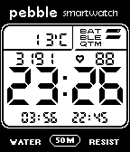</a>

<h2 class="app-name" id="app-593ede1eb67f9fb68e000e1e"><a href="https://apps.repebble.com/593ede1eb67f9fb68e000e1e">W800H / W96H Casio</a></h2>
<a class="app-source" href="https://github.com/JohnEdwa/W800" title="Source code" data-search-exclude>View source</a>

by <a href="https://apps.repebble.com/apps/dev/johnedwa_582cfaa636ac5aec3900037e" title="More from this developer">JohnEdwa</a>

GPL-3.0 v0.10 Updated 2018-02-28

Runs on: Round 2, Time 2, Pebble 2 Duo, Pebble 2, Time Round, Time, Classic

A customizable watchface inspired by the Casio W800H and W96H digital watches. Now with customizable colours! The layout consists of five customizable slots, which can also optionally show…

<a class="app-shot" href="https://apps.rebble.io/en_US/application/65ee6ce8ea09ac0433d38125" data-search-exclude>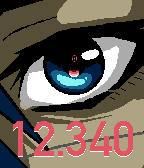</a>

<h2 class="app-name" id="app-65ee6ce8ea09ac0433d38125"><a href="https://apps.rebble.io/en_US/application/65ee6ce8ea09ac0433d38125">wake up_</a></h2>
<a class="app-source" href="https://github.com/lavglaab/pebble-signalis-face" title="Source code" data-search-exclude>View source</a>

by <a href="https://apps.rebble.io/en_US/developer/5dcf62c7c393f5706985a9cb/1" title="More from this developer">lavendork</a>

Not checked yet v1.4 Updated 2024-03-15 Rebble App Store

Runs on: Round 2, Time 2, Time Round, Time

A watch face for Pebble Time series watches, based on the title screen of the game SIGNALIS! Features: - 12 and 24 hour digital time - On-screen indicators for low battery, bluetooth disconnected…

<h2 class="app-name" id="app-56d4ad0a3b7516840d00002b"><a href="https://apps.repebble.com/56d4ad0a3b7516840d00002b">Wal Ter</a></h2>
<a class="app-source" href="https://github.com/webgiorno/wal_face" title="Source code" data-search-exclude>View source</a>

by <a href="https://apps.repebble.com/apps/dev/wal-ter_56d4a8ffb5716c8ab000001c" title="More from this developer">Wal Ter</a>

Not checked yet v1.1 Updated 2016-03-01

Runs on: Round 2, Time 2, Pebble 2 Duo, Pebble 2, Time Round, Time, Classic

Watchface officiale con lu malantrinu Wal Ter! Inglese: From the Sicilian icon Wal Ter comes a new watchface for your Pebble device! He&#x27;ll steal your heart, your oranges, and perhaps your battery…

<a class="app-shot" href="https://apps.repebble.com/6a3d4248cd52370009862b05" data-search-exclude>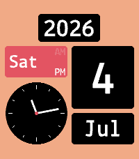</a>

<h2 class="app-name" id="app-6a3d4248cd52370009862b05"><a href="https://apps.repebble.com/6a3d4248cd52370009862b05">Wall Flip</a></h2>
<a class="app-source" href="https://github.com/eduardochiaro/flipwall-watchface" title="Source code" data-search-exclude>View source</a>

by <a href="https://apps.repebble.com/apps/dev/ec-apps_6818b3bd53899000082d25a4" title="More from this developer">EC Apps</a>

Not checked yet v3.3.0 Updated 2026-08-05

Runs on: Round 2, Time 2, Pebble 2 Duo, Pebble 2, Time Round, Time, Classic

A digital watchface based on flip clock design. Configure via the settings page. General Layout: 5 or 6 blocks. Language — translates month and weekday names. 10 Latin-script languages: English…

<a class="app-shot" href="https://apps.rebble.io/en_US/application/57f2398405e4b17492000129" data-search-exclude>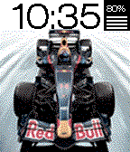</a>

<h2 class="app-name" id="app-57f2398405e4b17492000129"><a href="https://apps.rebble.io/en_US/application/57f2398405e4b17492000129">Wallpaper</a></h2>
<a class="app-source" href="https://github.com/mereed/pebbleface-wallpaper" title="Source code" data-search-exclude>View source</a>

by <a href="https://apps.rebble.io/en_US/developer/52d76309bd61272345000001/1" title="More from this developer">chops</a>

Not checked yet v1.3 Updated 2016-12-11 Rebble App Store

Runs on: Round 2, Time 2, Pebble 2 Duo, Pebble 2, Time Round, Time, Classic

I&#x27;ve been working on this one for a while, so have finished it off. After a number of design iterations, i&#x27;m done. It&#x27;s similar to another of my watchfaces (Themes), but, here there&#x27;s no weather…

<a class="app-shot" href="https://apps.rebble.io/en_US/application/6a24f8dbbb366d0009322024" data-search-exclude>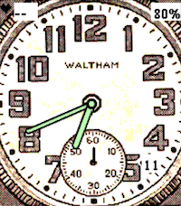</a>

<h2 class="app-name" id="app-6a24f8dbbb366d0009322024"><a href="https://apps.rebble.io/en_US/application/6a24f8dbbb366d0009322024">Waltham Field Watch</a></h2>
<a class="app-source" href="https://github.com/samhear2/Pebble-Waltham-Face-1" title="Source code" data-search-exclude>View source</a>

by <a href="https://apps.rebble.io/en_US/developer/62853a4be55622000a9f06cd/1" title="More from this developer">hear</a>

Not checked yet v1.0.10 Updated 2026-07-13 Rebble App Store

Runs on: Time 2

Waltham field watchface with included date, heart rate, and battery monitor complications.

<a class="app-shot" href="https://apps.repebble.com/5765fc4d0cc8f55521000149" data-search-exclude>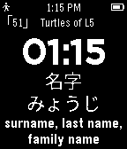</a>

<h2 class="app-name" id="app-5765fc4d0cc8f55521000149"><a href="https://apps.repebble.com/5765fc4d0cc8f55521000149">WaniKani TokeiTokei</a></h2>
<a class="app-source" href="https://github.com/darkenvy/TokeiTokei/" title="Source code" data-search-exclude>View source</a>

by <a href="https://apps.repebble.com/apps/dev/darkenvy_554ba2255fa04f8b99000056" title="More from this developer">Darkenvy</a>

Not checked yet v3.5 Updated 2016-06-19

Runs on: Round 2, Time 2, Pebble 2 Duo, Pebble 2, Time Round, Time, Classic

NOTE: Must install this Japanese language pack to work! Japanese is not natively supported by Pebble. http://wh.to/pebble/index_jp.html WaniKani on your Pebble watch! Immerse yourself not only…

<h2 class="app-name" id="app-52d24acbcc1d0d0286000038"><a href="https://apps.repebble.com/52d24acbcc1d0d0286000038">Wanted</a></h2>
<a class="app-source" href="https://github.com/william-k-chen/wanted-pebble-watchface" title="Source code" data-search-exclude>View source</a>

by <a href="https://apps.repebble.com/apps/dev/surfea-industries_52d244b297e543946e000040" title="More from this developer">Surfea Industries</a>

Not checked yet v1.0.0 Updated 2014-01-12

Runs on: Time 2, Pebble 2 Duo, Pebble 2, Time, Classic

Watchface styled after a &quot;Wanted&quot; poster. Check the Github link for the source - demonstrates custom font, image and time formatting.

<a class="app-shot" href="https://apps.repebble.com/57675ca63feaee1b800002f3" data-search-exclude>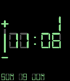</a>

<h2 class="app-name" id="app-57675ca63feaee1b800002f3"><a href="https://apps.repebble.com/57675ca63feaee1b800002f3">Watch it Calculate</a></h2>
<a class="app-source" href="https://github.com/TheYellowHat/Watch-It-Calculate" title="Source code" data-search-exclude>View source</a>

by <a href="https://apps.repebble.com/apps/dev/hat_5765431e0cc8f54d250000a4" title="More from this developer">Hat</a>

MIT v1.0 Updated 2016-06-20

Runs on: Round 2, Time 2, Pebble 2 Duo, Pebble 2, Time Round, Time, Classic

*Just in case* If you don&#x27;t like the gray calculator-like background for both the time and date, check out my other apps for a different build. &#x27;Watch It Calculate Minus&#x27;. It might suit your…

<a class="app-shot" href="https://apps.repebble.com/576754903feaee4aa30002b8" data-search-exclude>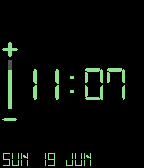</a>

<h2 class="app-name" id="app-576754903feaee4aa30002b8"><a href="https://apps.repebble.com/576754903feaee4aa30002b8">Watch It Calculate Minus</a></h2>
<a class="app-source" href="https://github.com/TheYellowHat/Watch-It-Calculate-Minus" title="Source code" data-search-exclude>View source</a>

by <a href="https://apps.repebble.com/apps/dev/hat_5765431e0cc8f54d250000a4" title="More from this developer">Hat</a>

MIT v1.0 Updated 2016-06-20

Runs on: Round 2, Time 2, Pebble 2 Duo, Pebble 2, Time Round, Time, Classic

*Just in case* If you don&#x27;t like the plain background for both the time and date, check out my other apps for a different build. &#x27;Watch It Calculate&#x27;, just like mama used to make. It might suit…

<a class="app-shot" href="https://apps.repebble.com/5769298e3feaee189f0004a7" data-search-exclude>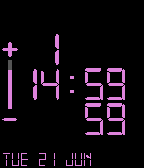</a>

<h2 class="app-name" id="app-5769298e3feaee189f0004a7"><a href="https://apps.repebble.com/5769298e3feaee189f0004a7">Watch it Calculate V2</a></h2>
<a class="app-source" href="https://github.com/TheYellowHat/Watch-It-Calculate-V2" title="Source code" data-search-exclude>View source</a>

by <a href="https://apps.repebble.com/apps/dev/hat_5765431e0cc8f54d250000a4" title="More from this developer">Hat</a>

No licence v1.0 Updated 2016-06-21

Runs on: Round 2, Time 2, Pebble 2 Duo, Pebble 2, Time Round, Time, Classic

*Just in case* There are simpler versions of this WatchFace on the appstore called, you guessed it, &#x27;Watch It Calculate&#x27; and &#x27;Watch It Calculate Minus.&#x27; Go ahead and check them out. A simple yet…

<a class="app-shot" href="https://apps.repebble.com/5348549aa093cd29b2000051" data-search-exclude>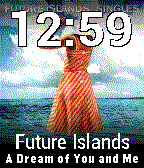</a>

<h2 class="app-name" id="app-5348549aa093cd29b2000051"><a href="https://apps.repebble.com/5348549aa093cd29b2000051">watch.fm - last.fm watchface</a></h2>
<a class="app-source" href="http://github.com/bitbased/watch-fm" title="Source code" data-search-exclude>View source</a>

by <a href="https://apps.repebble.com/apps/dev/bitbased_534366a923d923b50c00052a" title="More from this developer">bitbased</a>

No licence v2.0 Updated 2015-06-24

Runs on: Time 2, Pebble 2 Duo, Pebble 2, Time, Classic

A last.fm now playing and album art watchface. Use last.fm to scrobble your now playing information from last.fm or Spotify or other apps and have it display on your watch. It will show last.fm…

<a class="app-shot" href="https://apps.repebble.com/5568e8d314bc604f05000062" data-search-exclude>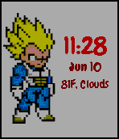</a>

<h2 class="app-name" id="app-5568e8d314bc604f05000062"><a href="https://apps.repebble.com/5568e8d314bc604f05000062">Watcheta</a></h2>
<a class="app-source" href="https://github.com/vshl/DBZVegeta" title="Source code" data-search-exclude>View source</a>

by <a href="https://apps.repebble.com/apps/dev/vishal-ravishankar_531a01512e2e011d5f000136" title="More from this developer">Vishal Ravishankar</a>

Not checked yet v1.3 Updated 2017-03-11

Runs on: Time 2, Pebble 2 Duo, Pebble 2, Time, Classic

Simple watchface. Displays fan-favorite Dragonball-Z character Vegeta along with time, date and weather.

<a class="app-shot" href="https://apps.repebble.com/536fc7e2190f07bd120001b0" data-search-exclude>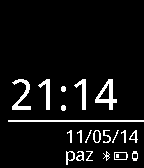</a>

<h2 class="app-name" id="app-536fc7e2190f07bd120001b0"><a href="https://apps.repebble.com/536fc7e2190f07bd120001b0">WatchFace-TR</a></h2>
<a class="app-source" href="https://github.com/dogancankilment/watchface-tr" title="Source code" data-search-exclude>View source</a>

by <a href="https://apps.repebble.com/apps/dev/dogan-can-kilment_536fc4e16ce5fc7ba00000fe" title="More from this developer">Dogan Can Kilment</a>

Not checked yet v1.0 Updated 2014-05-11

Runs on: Time 2, Pebble 2 Duo, Pebble 2, Time, Classic

-&gt; Time -&gt; GG/AA/YYYY -&gt; Day / Bluetooth Connection / Battery This watchface translated to Turkish by watchface project. -&gt; Saat -&gt; Gün/Ay/Yıl -&gt; Gün / Bluetooth Bağlantısı / Pil

<a class="app-shot" href="https://apps.repebble.com/ee99a923ebaf4cf889fef841" data-search-exclude>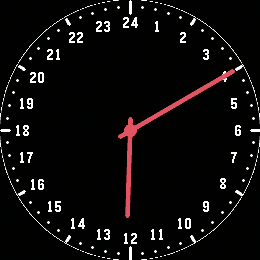</a>

<h2 class="app-name" id="app-ee99a923ebaf4cf889fef841"><a href="https://apps.repebble.com/ee99a923ebaf4cf889fef841">Watchpebble</a></h2>
<a class="app-source" href="https://github.com/cy8aer/WatchPebble" title="Source code" data-search-exclude>View source</a>

by <a href="https://apps.repebble.com/apps/dev/unknown_2ebba66a03204551ec2015dc" title="More from this developer">Unknown</a>

Not checked yet v1.0.0 Updated 2026-09-20

Runs on: Round 2

A 24 hour watchface inspired by an old 24 hour WatchPeople watch.

<h2 class="app-name" id="app-5a87fd2e461a8de29800275d"><a href="https://apps.rebble.io/en_US/application/5a87fd2e461a8de29800275d">Water</a></h2>
<a class="app-source" href="https://github.com/itmitica/Pebble-Water.git" title="Source code" data-search-exclude>View source</a>

by <a href="https://apps.rebble.io/en_US/developer/5721f6ed0676425a62000009/1" title="More from this developer">itmitica</a>

Not checked yet v1.0 Updated 2018-02-17 Rebble App Store

Runs on: Time 2, Pebble 2 Duo, Pebble 2, Time, Classic

Two screens: screenface and watchface. Default is screenface. Shake your wrist to display the watchface: date, marked weekday, time. Screenface returns to display on the minute.

<a class="app-shot" href="https://apps.repebble.com/2fb642c7af3d47de99c28fe7" data-search-exclude>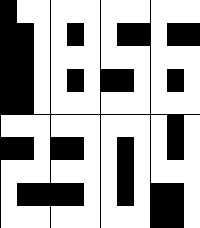</a>

<h2 class="app-name" id="app-2fb642c7af3d47de99c28fe7"><a href="https://apps.repebble.com/2fb642c7af3d47de99c28fe7">Waterfall</a></h2>
<a class="app-source" href="https://github.com/kjubybot/pebble-waterfall" title="Source code" data-search-exclude>View source</a>

by <a href="https://apps.repebble.com/apps/dev/kjubybot_b222b256f3a41353525c40a9" title="More from this developer">kjubybot</a>

Not checked yet v1.4.2 Updated 2026-06-12

Runs on: Time 2, Time

A minimalist Pebble watchface with a per-column waterfall animation.

<a class="app-shot" href="https://apps.rebble.io/en_US/application/5b2bf021fbaf9ae33400044d" data-search-exclude>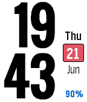</a>

<h2 class="app-name" id="app-5b2bf021fbaf9ae33400044d"><a href="https://apps.rebble.io/en_US/application/5b2bf021fbaf9ae33400044d">watsface</a></h2>
<a class="app-source" href="https://github.com/lukefor/watsface" title="Source code" data-search-exclude>View source</a>

by <a href="https://apps.rebble.io/en_US/developer/56003ed5d3ea40832d00006d/1" title="More from this developer">Dark</a>

Not checked yet v1.1 Updated 2021-11-21 Rebble App Store

Runs on: Time 2, Time

Works as is shown in the screenshots, with no configuration. Font is Oswald from Google Fonts. Displays charging status, vibrates on disconnect, all that good stuff. Developed with battery life as…

<a class="app-shot" href="https://apps.repebble.com/56059ab092c56c56c3000089" data-search-exclude>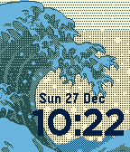</a>

<h2 class="app-name" id="app-56059ab092c56c56c3000089"><a href="https://apps.repebble.com/56059ab092c56c56c3000089">Wave</a></h2>
<a class="app-source" href="https://github.com/DmitryDodzin/PebbleWave" title="Source code" data-search-exclude>View source</a>

by <a href="https://apps.repebble.com/apps/dev/dmitry-dodzin_5501357517aaa97c2d0000c0" title="More from this developer">Dmitry Dodzin</a>

No licence v0.9 Updated 2016-06-11

Runs on: Round 2, Time 2, Pebble 2 Duo, Pebble 2, Time Round, Time, Classic

A Simple Clock with a wave in the background

<a class="app-shot" href="https://apps.rebble.io/en_US/application/69b64dd51645ed000a4fb1fd" data-search-exclude>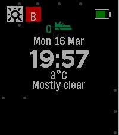</a>

<h2 class="app-name" id="app-69b64dd51645ed000a4fb1fd"><a href="https://apps.rebble.io/en_US/application/69b64dd51645ed000a4fb1fd">Wdustride</a></h2>
<a class="app-source" href="https://github.com/pebble-examples/health-watchface" title="Source code" data-search-exclude>View source</a>

by <a href="https://apps.rebble.io/en_US/developer/5b2619b8fbaf9a5d3900037d/1" title="More from this developer">homecafe</a>

Not checked yet v1.7 Updated 2026-04-09 Rebble App Store

Runs on: Round 2, Time 2, Pebble 2 Duo, Pebble 2, Time Round, Time, Classic

weather dust stride app dust shows - G(ood), N(ormal), B(ad), V(ery Bad)

<h2 class="app-name" id="app-540b06e8d7709073b100014c"><a href="https://apps.repebble.com/540b06e8d7709073b100014c">We Are Here Now</a></h2>
<a class="app-source" href="http://github.com/lukasvermeer/thetimeisnow" title="Source code" data-search-exclude>View source</a>

by <a href="https://apps.repebble.com/apps/dev/lukas-vermeer_53e9f49d91ca97967a00000c" title="More from this developer">Lukas Vermeer</a>

No licence v1.2 Updated 2014-09-08

Runs on: Time 2, Pebble 2 Duo, Pebble 2, Time, Classic

Simple Pebble watchface intended to encourage mindfulness of the present by discretely punctuating the constant passage of time. Pebble will vibrate a unique pattern every five minutes to improve…

<a class="app-shot" href="https://apps.repebble.com/551d91875b2cb490c5000065" data-search-exclude>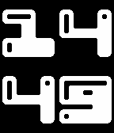</a>

<h2 class="app-name" id="app-551d91875b2cb490c5000065"><a href="https://apps.repebble.com/551d91875b2cb490c5000065">Weather Ball</a></h2>
<a class="app-source" href="http://www.github.com/MathewReiss/weather_ball" title="Source code" data-search-exclude>View source</a>

by <a href="https://apps.repebble.com/apps/dev/mathew-reiss_52f02483af0eab7af50006d3" title="More from this developer">Mathew Reiss</a>

No licence v1.4 Updated 2015-05-27

Runs on: Time 2, Time

Weather Ball shows you the weather, in the simplest way possible, using color. Instead of icons or text, the weather is shown by setting the four digits of time to an easily recognizable pattern…

<a class="app-shot" href="https://apps.repebble.com/52ba053d7a3fe9f7ae000007" data-search-exclude>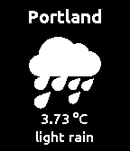</a>

<h2 class="app-name" id="app-52ba053d7a3fe9f7ae000007"><a href="https://apps.repebble.com/52ba053d7a3fe9f7ae000007">Weather Face</a></h2>
<a class="app-source" href="https://github.com/tgaurnier/WeatherFace" title="Source code" data-search-exclude>View source</a>

by <a href="https://apps.repebble.com/apps/dev/tory-gaurnier_52b8d10bfd4763023e000018" title="More from this developer">Tory Gaurnier</a>

Not checked yet v1.0.7 Updated 2013-12-29

Runs on: Time 2, Pebble 2 Duo, Pebble 2, Time, Classic

A simple weather watch face, shows location and weather. Uses Open Weather Map for data. Built with SDK 2.0, and is configurable via Android or iOS Pebble app.

<a class="app-shot" href="https://apps.repebble.com/9492f2777b5f422e90454147" data-search-exclude>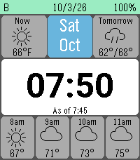</a>

<h2 class="app-name" id="app-9492f2777b5f422e90454147"><a href="https://apps.repebble.com/9492f2777b5f422e90454147">Weather Glance</a></h2>
<a class="app-source" href="https://github.com/ManApart/manapart-watchface" title="Source code" data-search-exclude>View source</a>

by <a href="https://apps.repebble.com/apps/dev/manapart_22c084cbc96fe0b713c630c1" title="More from this developer">Manapart</a>

No licence v1.0.1 Updated 2026-10-03

Runs on: Time 2

Designed to be glancable for time, or inspected for more information. Includes both date/day names and a full date for those forgetful of the day/month. - Weather from Open-Meteo, no API Key…

<a class="app-shot" href="https://apps.repebble.com/53630f55ce68f72efc00011f" data-search-exclude>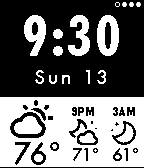</a>

<h2 class="app-name" id="app-53630f55ce68f72efc00011f"><a href="https://apps.repebble.com/53630f55ce68f72efc00011f">Weather My Way</a></h2>
<a class="app-source" href="https://github.com/jaredbiehler/weather-my-way" title="Source code" data-search-exclude>View source</a>

by <a href="https://apps.repebble.com/apps/dev/jared-biehler_531f646301be406e7b0003b4" title="More from this developer">Jared Biehler</a>

Not checked yet v1.3 Updated 2016-03-14

Runs on: Time 2, Pebble 2 Duo, Pebble 2, Time, Classic

Weather Underground current conditions and hourly forecasts* wrapped in a Futura Weather design. - Configurable weather data services (Weather Underground, Open Weather API) - Updates every 15…

<a class="app-shot" href="https://apps.repebble.com/54a7c92de8b7f5f267000044" data-search-exclude>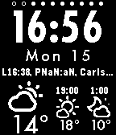</a>

<h2 class="app-name" id="app-54a7c92de8b7f5f267000044"><a href="https://apps.repebble.com/54a7c92de8b7f5f267000044">Weather My Way edited by Zeduaz</a></h2>
<a class="app-source" href="https://github.com/Zeduaz/weather-my-way" title="Source code" data-search-exclude>View source</a>

by <a href="https://apps.repebble.com/apps/dev/zeduaz_5481eab7bdba69dcaf000031" title="More from this developer">Zeduaz</a>

No licence v1.3 Updated 2015-06-14

Runs on: Time 2, Pebble 2 Duo, Pebble 2, Time, Classic

Another weather watchface with weather forecast. Edited watchface Weather My Way. Location services on your phone must be enabled and always on because location is automatically determined…

<a class="app-shot" href="https://apps.repebble.com/557dca65d8339ae151000059" data-search-exclude>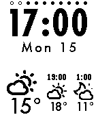</a>

<h2 class="app-name" id="app-557dca65d8339ae151000059"><a href="https://apps.repebble.com/557dca65d8339ae151000059">Weather My Way edited by Zeduaz - INVERTED</a></h2>
<a class="app-source" href="https://github.com/Zeduaz/weather-my-way" title="Source code" data-search-exclude>View source</a>

by <a href="https://apps.repebble.com/apps/dev/zeduaz_5481eab7bdba69dcaf000031" title="More from this developer">Zeduaz</a>

No licence v1.0 Updated 2015-06-14

Runs on: Time 2, Pebble 2 Duo, Pebble 2, Time, Classic

Another weather watchface with weather forecast. Edited watchface Weather My Way - INVERTED. Location services on your phone must be enabled and always on because location is automatically…

<a class="app-shot" href="https://apps.repebble.com/e6c6572df8cc48d5b8b042e8" data-search-exclude>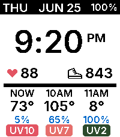</a>

<h2 class="app-name" id="app-e6c6572df8cc48d5b8b042e8"><a href="https://apps.repebble.com/e6c6572df8cc48d5b8b042e8">Weather Soon</a></h2>
<a class="app-source" href="https://github.com/aidankierans/WeatherSoon" title="Source code" data-search-exclude>View source</a>

by <a href="https://apps.repebble.com/apps/dev/radiant-sundial_f357582fc5ad05ef48b1f6d2" title="More from this developer">Radiant Sundial</a>

MIT v1.1.0 Updated 2026-09-11

Runs on: Time 2

An easy display of current and hourly weather, including UV index.

<a class="app-shot" href="https://apps.repebble.com/550f3186e0b81d4f1a000044" data-search-exclude>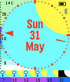</a>

<h2 class="app-name" id="app-550f3186e0b81d4f1a000044"><a href="https://apps.repebble.com/550f3186e0b81d4f1a000044">Weather Watch</a></h2>
<a class="app-source" href="https://github.com/markbush/weather-watch" title="Source code" data-search-exclude>View source</a>

by <a href="https://apps.repebble.com/apps/dev/mark-bush_52f2b53327122e3ad3000090" title="More from this developer">Mark Bush</a>

Not checked yet v3.2 Updated 2015-10-31

Runs on: Time 2, Pebble 2 Duo, Pebble 2, Time, Classic

Simple watchface with date and weather info. The hands are discreet on the outside so don&#x27;t obscure the information being displayed. Options are available for temperature units, whether to show…

<a class="app-shot" href="https://apps.repebble.com/543448c932035c992b000019" data-search-exclude>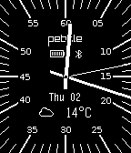</a>

<h2 class="app-name" id="app-543448c932035c992b000019"><a href="https://apps.repebble.com/543448c932035c992b000019">Weather+</a></h2>
<a class="app-source" href="https://github.com/wdoganowski/weather-face-plus.git" title="Source code" data-search-exclude>View source</a>

by <a href="https://apps.repebble.com/apps/dev/dogan_52f4bfc6f260e6bca50005bd" title="More from this developer">Dogan</a>

Not checked yet v1.4 Updated 2014-11-28

Runs on: Time 2, Pebble 2 Duo, Pebble 2, Time, Classic

Time &amp; weather in one classy watch face. No companion app needed. See the current temperature in °C or °F, sky, as well as the battery level and bluetooth status. Shake for detailed weather info…

<a class="app-shot" href="https://apps.repebble.com/56206ff2768e7a4b4e00002c" data-search-exclude>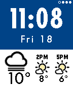</a>

<h2 class="app-name" id="app-56206ff2768e7a4b4e00002c"><a href="https://apps.repebble.com/56206ff2768e7a4b4e00002c">WeatherFace</a></h2>
<a class="app-source" href="https://github.com/ktagjp/WeatherFace/" title="Source code" data-search-exclude>View source</a>

by <a href="https://apps.repebble.com/apps/dev/ktagjp_55b4ca9746a407cd74000038" title="More from this developer">ktagjp</a>

Not checked yet v1.1 Updated 2015-12-28

Runs on: Time 2, Time

Based on Jared Biehler&#x27;s WEATHER MY WAY, a bit modified like... add vibration on Bluetooth disconnection and some colorized flavor. - Configurable weather data services (YAHOO!, Open Weather…

<a class="app-shot" href="https://apps.repebble.com/57d2c150ffca491fd200006b" data-search-exclude>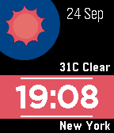</a>

<h2 class="app-name" id="app-57d2c150ffca491fd200006b"><a href="https://apps.repebble.com/57d2c150ffca491fd200006b">Weathers Time</a></h2>
<a class="app-source" href="https://github.com/edward88/pebbletime-weatherstime" title="Source code" data-search-exclude>View source</a>

by <a href="https://apps.repebble.com/apps/dev/awesomeinred_573c6d97c1f35a222900000f" title="More from this developer">AwesomeInRed</a>

Not checked yet v2.13 Updated 2016-11-03

Runs on: Round 2, Time 2, Time Round, Time

Watchface features: - Simple, clean and easy to read display - Location based weather info - Multiple choice source for weather data - Battery level display - Customizable colours - Date format…

<a class="app-shot" href="https://apps.repebble.com/56cb08dba0d6408f78000025" data-search-exclude>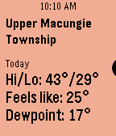</a>

<h2 class="app-name" id="app-56cb08dba0d6408f78000025"><a href="https://apps.repebble.com/56cb08dba0d6408f78000025">WeatherStep</a></h2>
<a class="app-source" href="http://github.com/redlynr/Weatherstep" title="Source code" data-search-exclude>View source</a>

by <a href="https://apps.repebble.com/apps/dev/redlynr_53152170b52806dd5f00034a" title="More from this developer">redlynr</a>

Other v5.52 Updated 2019-07-24

Runs on: Round 2, Time 2, Time Round, Time

Choices of weather provider = Open Weather or Weather Underground if you have your own API key. Every time a weather update is made, a timeline pin will be created containing weather details…

<a class="app-shot" href="https://apps.repebble.com/56faa800d83b44cc0400004c" data-search-exclude>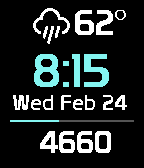</a>

<h2 class="app-name" id="app-56faa800d83b44cc0400004c"><a href="https://apps.repebble.com/56faa800d83b44cc0400004c">WeatherStep - Lite</a></h2>
<a class="app-source" href="https://github.com/redlynr/WeatherStep-Lite" title="Source code" data-search-exclude>View source</a>

by <a href="https://apps.repebble.com/apps/dev/redlynr_53152170b52806dd5f00034a" title="More from this developer">redlynr</a>

Not checked yet v5.12 Updated 2019-07-24

Runs on: Round 2, Time 2, Pebble 2 Duo, Pebble 2, Time Round, Time, Classic

Choices of weather provider = Open Weather, Yahoo Weather, and Weather Underground if you have your own API key. Every time a weather update is made, a timeline pin will be created containing…

<a class="app-shot" href="https://apps.rebble.io/en_US/application/5b220db9f38588be6b001117" data-search-exclude>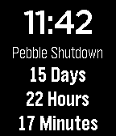</a>

<h2 class="app-name" id="app-5b220db9f38588be6b001117"><a href="https://apps.rebble.io/en_US/application/5b220db9f38588be6b001117">Web Services Shutdown Countdown</a></h2>
<a class="app-source" href="https://github.com/sensi277/pebbleWebServicesCountdown" title="Source code" data-search-exclude>View source</a>

by <a href="https://apps.rebble.io/en_US/developer/598af13e0dfc3275e2000b5a/1" title="More from this developer">SphinxyScale</a>

Not checked yet v1.0 Updated 2018-06-14 Rebble App Store

Runs on: Time 2, Pebble 2 Duo, Pebble 2, Time, Classic

Counts down the amount of time to the Pebble Web Services shutdown. Based on https://github.com/kernel-sanders/Time-Until-Pebble

<a class="app-shot" href="https://apps.repebble.com/67c6beb7d2acb30009a3c809" data-search-exclude>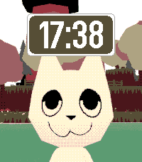</a>

<h2 class="app-name" id="app-67c6beb7d2acb30009a3c809"><a href="https://apps.repebble.com/67c6beb7d2acb30009a3c809">WEBFISHING</a></h2>
<a class="app-source" href="https://github.com/nubbybubby/webfishing-watchface" title="Source code" data-search-exclude>View source</a>

by <a href="https://apps.repebble.com/apps/dev/nubbybubby_67a84b8e89529e00099b3a79" title="More from this developer">nubbybubby</a>

Not checked yet v1.1 Updated 2026-05-14

Runs on: Round 2, Time 2, Pebble 2 Duo, Pebble 2, Time Round, Time, Classic

A WEBFISHING themed watchface. (I am not affiliated with lamedeveloper lol)

<a class="app-shot" href="https://apps.repebble.com/5822be1ae7785be14b000102" data-search-exclude>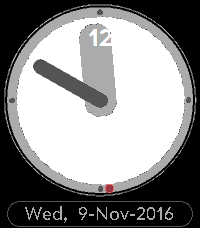</a>

<h2 class="app-name" id="app-5822be1ae7785be14b000102"><a href="https://apps.repebble.com/5822be1ae7785be14b000102">webOS Clock</a></h2>
<a class="app-source" href="https://github.com/GreenHex/Pebble.webOS.Clock" title="Source code" data-search-exclude>View source</a>

by <a href="https://apps.repebble.com/apps/dev/the-resetter_5415133bbcd1cf9264000081" title="More from this developer">The Resetter</a>

MIT v1.5 Updated 2017-01-15

Runs on: Time 2, Time

The much loved webOS analogue clock for your Pebble. Hour markers and date are in the webOS &quot;Prelude&quot; typeface. Shake watch for seconds display. Source is in GitHub.

<a class="app-shot" href="https://apps.repebble.com/86b944d8971e4df2a392dfad" data-search-exclude>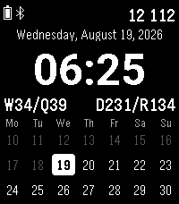</a>

<h2 class="app-name" id="app-86b944d8971e4df2a392dfad"><a href="https://apps.repebble.com/86b944d8971e4df2a392dfad">Weekface</a></h2>
<a class="app-source" href="https://github.com/bilarikan/pebble-watchface-weekface" title="Source code" data-search-exclude>View source</a>

by <a href="https://apps.repebble.com/apps/dev/bil-arikan_dc67d08e6e7dcd07797a8bd8" title="More from this developer">Bil Arikan</a>

MIT v1.1.0 Updated 2026-08-19

Runs on: Time 2

Weekface is a clean, information-dense watchface built around how days, weeks, and quarters structure your year. TOP TO BOTTOM • Status bar : battery, Bluetooth (shown when connected), and today&#x27;s…

<a class="app-shot" href="https://apps.repebble.com/582482ccb62cef78520000ad" data-search-exclude>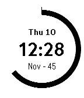</a>

<h2 class="app-name" id="app-582482ccb62cef78520000ad"><a href="https://apps.repebble.com/582482ccb62cef78520000ad">WeeklyRing</a></h2>
<a class="app-source" href="https://github.com/maxmoseley23/DailyRing1/tree/weekly-ring" title="Source code" data-search-exclude>View source</a>

by <a href="https://apps.repebble.com/apps/dev/maxwell-moseley_57afcb76bb85ed5f9b0003fc" title="More from this developer">Maxwell Moseley</a>

Not checked yet v1.0 Updated 2016-11-10

Runs on: Round 2, Time 2, Pebble 2 Duo, Pebble 2, Time Round, Time, Classic

See a full week pass with WeeklyRing! A full 7-day week is expressed as a circle starting on Sunday, while the hours, minutes, day of week, and date is expressed digitally. After 6PM, the dark…

<a class="app-shot" href="https://apps.rebble.io/en_US/application/6377c82fc6c24a000a815e53" data-search-exclude>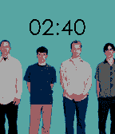</a>

<h2 class="app-name" id="app-6377c82fc6c24a000a815e53"><a href="https://apps.rebble.io/en_US/application/6377c82fc6c24a000a815e53">weezeface</a></h2>
<a class="app-source" href="https://github.com/johnspahr/weezeface" title="Source code" data-search-exclude>View source</a>

by <a href="https://apps.rebble.io/en_US/developer/609801a58324660009e8a4db/1" title="More from this developer">John Spahr</a>

Not checked yet v1.0 Updated 2022-11-18 Rebble App Store

Runs on: Round 2, Time 2, Pebble 2 Duo, Pebble 2, Time Round, Time, Classic

The world’s first Weezer watchface for Pebble! Switches between the blue and red album covers depending on your BT connection status. This project was submitted for Rebble’s first hackathon! Be…

<a class="app-shot" href="https://apps.repebble.com/03a7c81cfce647e7b2391cd0" data-search-exclude>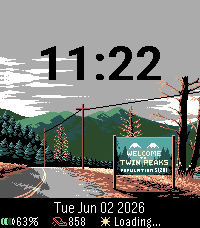</a>

<h2 class="app-name" id="app-03a7c81cfce647e7b2391cd0"><a href="https://apps.repebble.com/03a7c81cfce647e7b2391cd0">Welcome to Twin Peaks</a></h2>
<a class="app-source" href="https://github.com/knucklesfan/pebble-watchfaces" title="Source code" data-search-exclude>View source</a>

by <a href="https://apps.repebble.com/apps/dev/knfn_0db81fab88481ed6a3fe7381" title="More from this developer">Knfn</a>

Not checked yet v4.0.0 Updated 2026-09-30

Runs on: Time 2

It is happening again... Step Counter, Date/Time, Weather, and Battery. A damn fine watchface. Art originally drawn by https://www.deviantart.com/bbrunomoraes/art/Twin-Peaks-1-2-673906909! Damn…

<a class="app-shot" href="https://apps.repebble.com/571132cf46e6404f36000007" data-search-exclude>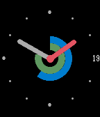</a>

<h2 class="app-name" id="app-571132cf46e6404f36000007"><a href="https://apps.repebble.com/571132cf46e6404f36000007">Well Rounded</a></h2>
<a class="app-source" href="https://github.com/Spitemare/well-rounded" title="Source code" data-search-exclude>View source</a>

by <a href="https://apps.repebble.com/apps/dev/david-morgan_564924e14f9b2989ec000014" title="More from this developer">David Morgan</a>

MIT v1.2 Updated 2016-04-19

Runs on: Round 2, Time 2, Pebble 2 Duo, Pebble 2, Time Round, Time, Classic

Make it yours! Well Rounded is an analog watchface with lots of configuration. Colors, ticks, second hand, complications. Want to know your battery level? Inner ring. Want to see if how your daily…

<a class="app-shot" href="https://apps.repebble.com/98336cbe9af04444be2f8673" data-search-exclude>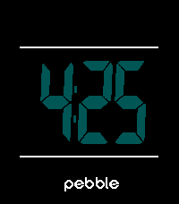</a>

<h2 class="app-name" id="app-98336cbe9af04444be2f8673"><a href="https://apps.repebble.com/98336cbe9af04444be2f8673">wellew</a></h2>
<a class="app-source" href="https://github.com/tc5206/pebble_wellew" title="Source code" data-search-exclude>View source</a>

by <a href="https://apps.repebble.com/apps/dev/tc5206_f10b6e35701081a6841ded3d" title="More from this developer">tc5206</a>

Not checked yet v2.0 Updated 2026-06-06

Runs on: Round 2, Time 2, Pebble 2 Duo, Pebble 2, Time Round, Time, Classic

### Description A minimalist digital watchface inspired by the SKAGEN Mellem. It features a crisp time display right at the center of the screen, framed by dynamic top and bottom bars that…

<a class="app-shot" href="https://apps.repebble.com/142005d2b414482abae6266b" data-search-exclude>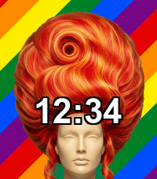</a>

<h2 class="app-name" id="app-142005d2b414482abae6266b"><a href="https://apps.repebble.com/142005d2b414482abae6266b">WERK</a></h2>
<a class="app-source" href="https://gitlab.com/richard.penshorn/werk" title="Source code" data-search-exclude>View source</a>

by <a href="https://apps.repebble.com/apps/dev/bithamer_b84059528b189162e7c07623" title="More from this developer">bithamer</a>

Not checked yet v1.0.4 Updated 2026-06-08

Runs on: Time 2

A drag queen Pride party watchface. A giant drag wig fills the screen, the time is your makeup, and rainbow pride stripes sweep across every time you flick your wrist - with a collection of 15…

<a class="app-shot" href="https://apps.rebble.io/en_US/application/63671421c6c24a000a815e48" data-search-exclude>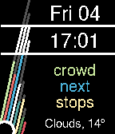</a>

<h2 class="app-name" id="app-63671421c6c24a000a815e48"><a href="https://apps.rebble.io/en_US/application/63671421c6c24a000a815e48">What 3 Words</a></h2>
<a class="app-source" href="https://github.com/JavierRizzoA/Pebble-What3Words" title="Source code" data-search-exclude>View source</a>

by <a href="https://apps.rebble.io/en_US/developer/55f51b85eb030e3836000054/1" title="More from this developer">Javier Rizzo</a>

GPL-3.0 v1.3 Updated 2022-11-06 Rebble App Store

Runs on: Time 2, Pebble 2 Duo, Pebble 2, Time, Classic

A watchface that displays your location in What 3 Words format (https://what3words.com/). It also has support for weather if you add an OpenWeatherMap API key. Thanks to /u/arminsson, who…

<h2 class="app-name" id="app-567f6613ca3ddd664f000182"><a href="https://apps.repebble.com/567f6613ca3ddd664f000182">What If...</a></h2>
<a class="app-source" href="https://github.com/laierr/Pebble-What-If" title="Source code" data-search-exclude>View source</a>

by <a href="https://apps.repebble.com/apps/dev/laier_56788100519db740aa000060" title="More from this developer">laier</a>

Not checked yet v1.06 Updated 2015-12-27

Runs on: Time 2, Pebble 2 Duo, Pebble 2, Time, Classic

Simple watchface to ask really deep questions.

<h2 class="app-name" id="app-54681ab6b6104c1ca42f6e31"><a href="https://apps.repebble.com/54681ab6b6104c1ca42f6e31">What Time?</a></h2>
<a class="app-source" href="https://github.com/ping840907/what-time" title="Source code" data-search-exclude>View source</a>

by <a href="https://apps.repebble.com/apps/dev/sloth8497_68c4a750647ef000080f0b2d" title="More from this developer">Sloth8497</a>

Not checked yet v1.0.3 Updated 2026-08-17

Runs on: Round 2, Time 2, Pebble 2 Duo, Pebble 2, Time Round, Time, Classic

What Time? — The Reluctant Watchface Why do you even need to know the time? This watchface is designed to ask exactly that. At first glance, it refuses to give you numbers. Instead, it greets your…

<a class="app-shot" href="https://apps.repebble.com/56675c40753a4c4785000020" data-search-exclude>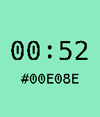</a>

<h2 class="app-name" id="app-56675c40753a4c4785000020"><a href="https://apps.repebble.com/56675c40753a4c4785000020">whatcolorisit</a></h2>
<a class="app-source" href="https://github.com/vanita5/pebble-whatcolorisit" title="Source code" data-search-exclude>View source</a>

by <a href="https://apps.repebble.com/apps/dev/vanita5_5660ff3b15c22b8b73000090" title="More from this developer">vanita5</a>

Not checked yet v1.0 Updated 2015-12-08

Runs on: Round 2, Time 2, Time Round, Time

Display the current time converted to an RGB color.

<a class="app-shot" href="https://apps.repebble.com/5470aa8232fb2d119700009a" data-search-exclude>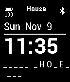</a>

<h2 class="app-name" id="app-5470aa8232fb2d119700009a"><a href="https://apps.repebble.com/5470aa8232fb2d119700009a">Wheel of Fortuna</a></h2>
<a class="app-source" href="https://github.com/antonioasaro/Antonio-Wheel_Of_Fortuna" title="Source code" data-search-exclude>View source</a>

by <a href="https://apps.repebble.com/apps/dev/antonio-asaro_52cd5e150799b0643b00003c" title="More from this developer">Antonio Asaro</a>

No licence v1.31 Updated 2014-11-25

Runs on: Time 2, Pebble 2 Duo, Pebble 2, Time, Classic

Random category &amp; words every 5 mins, from everyone&#x27;s favourite show. :) Also, basic time, date, battery status &amp; bluetooth connection (w/ vibration if connection is lost).

<a class="app-shot" href="https://apps.repebble.com/605c300924b745c7b28036e1" data-search-exclude>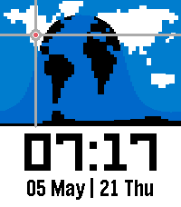</a>

<h2 class="app-name" id="app-605c300924b745c7b28036e1"><a href="https://apps.repebble.com/605c300924b745c7b28036e1">Where In The World Pix Style</a></h2>
<a class="app-source" href="https://github.com/MaxDViper/Where_In_The_World_Watchface" title="Source code" data-search-exclude>View source</a>

by <a href="https://apps.repebble.com/apps/dev/maxdviper_e52f453653c79ea144c77df3" title="More from this developer">MaxDViper</a>

MIT v2.0 Updated 2026-05-22

Runs on: Time 2, Pebble 2 Duo, Pebble 2, Time, Classic

Inspired by the &quot;pebble-day-night-pix&quot; Watchface by David Gianforte with a pixelized version of a world map and the &quot;Time Traveler&quot; App by Freakified. This watchface is the result of finding a…

<a class="app-shot" href="https://apps.repebble.com/9258e58695ce4442aa5c1ccb" data-search-exclude>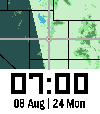</a>

<h2 class="app-name" id="app-9258e58695ce4442aa5c1ccb"><a href="https://apps.repebble.com/9258e58695ce4442aa5c1ccb">Where In Utah</a></h2>
<a class="app-source" href="https://github.com/MaxDViper/Where_In_Utah_Watchface" title="Source code" data-search-exclude>View source</a>

by <a href="https://apps.repebble.com/apps/dev/maxdviper_e52f453653c79ea144c77df3" title="More from this developer">MaxDViper</a>

No licence v2.0.0 Updated 2026-08-26

Runs on: Time 2, Pebble 2 Duo, Pebble 2, Time, Classic

If you saw the World Map Watchfaces and wanted something more zoomed into your location, this series of watchfaces are for you. Open for requests for future areas. I may or may not be able to…

<a class="app-shot" href="https://apps.repebble.com/55cdf56d23c1bbc345000008" data-search-exclude>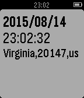</a>

<h2 class="app-name" id="app-55cdf56d23c1bbc345000008"><a href="https://apps.repebble.com/55cdf56d23c1bbc345000008">WhereIsHere</a></h2>
<a class="app-source" href="https://github.com/freddiefujiwara/WhereIsHere" title="Source code" data-search-exclude>View source</a>

by <a href="https://apps.repebble.com/apps/dev/fumikazu-fujiwara_55b0ec1d6e310efcd000007e" title="More from this developer">Fumikazu Fujiwara</a>

Not checked yet v1.0 Updated 2015-08-14

Runs on: Time 2, Pebble 2 Duo, Pebble 2, Time, Classic

You can see quickly about current location.

<a class="app-shot" href="https://apps.repebble.com/b69c746732c14b8bbc1bbb5a" data-search-exclude>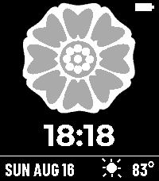</a>

<h2 class="app-name" id="app-b69c746732c14b8bbc1bbb5a"><a href="https://apps.repebble.com/b69c746732c14b8bbc1bbb5a">White Lotus</a></h2>
<a class="app-source" href="https://github.com/briancbarrow/lotus-watchface" title="Source code" data-search-exclude>View source</a>

by <a href="https://apps.repebble.com/apps/dev/brian-barrow_f274760627a9ea167ea488f3" title="More from this developer">Brian Barrow</a>

No licence v1.1.0 Updated 2026-08-31

Runs on: Time 2

White Lotus symbol watchface from the ATLA universe.

<a class="app-shot" href="https://apps.repebble.com/52b5da08d2b97a3efd000020" data-search-exclude>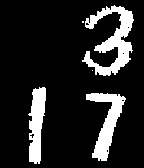</a>

<h2 class="app-name" id="app-52b5da08d2b97a3efd000020"><a href="https://apps.repebble.com/52b5da08d2b97a3efd000020">Whiteboard</a></h2>
<a class="app-source" href="https://github.com/RodgerLeblanc/Whiteboard" title="Source code" data-search-exclude>View source</a>

by <a href="https://apps.repebble.com/apps/dev/roger-leblanc_52b59af6d2b97a3c0a000016" title="More from this developer">Roger Leblanc</a>

No licence v2.7 Updated 2014-02-02

Runs on: Time 2, Pebble 2 Duo, Pebble 2, Time, Classic

Simple whiteboard watchface that changes to a blackboard if bluetooth connection is lost. Comes with Quick Tap Plus installed : shake your wrist to see your Pebble&#x27;s battery life!

<a class="app-shot" href="https://apps.repebble.com/55371aae1fa0b379fc000028" data-search-exclude>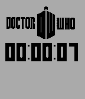</a>

<h2 class="app-name" id="app-55371aae1fa0b379fc000028"><a href="https://apps.repebble.com/55371aae1fa0b379fc000028">WhoStopWatch</a></h2>
<a class="app-source" href="https://github.com/chaos2007/doctorWhoStopWatch" title="Source code" data-search-exclude>View source</a>

by <a href="https://apps.repebble.com/apps/dev/don-pollitz_549c30a3ad219e5ece00026f" title="More from this developer">Don Pollitz</a>

Not checked yet v1.0 Updated 2015-04-22

Runs on: Time 2, Pebble 2 Duo, Pebble 2, Time, Classic

This is a Doctor Who watch face that functions as a stopwatch. When the face is selected, it begins a timer. I made this really for me so that I could have quick access to a stopwatch.

<a class="app-shot" href="https://apps.repebble.com/553718f0166e9ce5fe000046" data-search-exclude>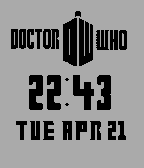</a>

<h2 class="app-name" id="app-553718f0166e9ce5fe000046"><a href="https://apps.repebble.com/553718f0166e9ce5fe000046">WhoWatch</a></h2>
<a class="app-source" href="https://github.com/chaos2007/doctorWhoTime" title="Source code" data-search-exclude>View source</a>

by <a href="https://apps.repebble.com/apps/dev/don-pollitz_549c30a3ad219e5ece00026f" title="More from this developer">Don Pollitz</a>

Not checked yet v1.0 Updated 2015-04-22

Runs on: Time 2, Pebble 2 Duo, Pebble 2, Time, Classic

A simple watchface for those who like Doctor Who.

<h2 class="app-name" id="app-5538f5bbeace6f4547000080"><a href="https://apps.repebble.com/5538f5bbeace6f4547000080">WhoWatchInverted</a></h2>
<a class="app-source" href="https://github.com/chaos2007/whoWatchInverted" title="Source code" data-search-exclude>View source</a>

by <a href="https://apps.repebble.com/apps/dev/don-pollitz_549c30a3ad219e5ece00026f" title="More from this developer">Don Pollitz</a>

Not checked yet v1.0 Updated 2015-04-23

Runs on: Time 2, Pebble 2 Duo, Pebble 2, Time, Classic

A request was made for a version of the WhoWatch with inverted color. I&#x27;m currently looking into having one watchface with configurable settings. Until then, here it is.

<h2 class="app-name" id="app-551e75518c1827a9c900000f"><a href="https://apps.repebble.com/551e75518c1827a9c900000f">WidgetFace</a></h2>
<a class="app-source" href="http://github.com/mereed/pebbleface-widgetface" title="Source code" data-search-exclude>View source</a>

by <a href="https://apps.repebble.com/apps/dev/chops_52d76309bd61272345000001" title="More from this developer">chops</a>

No licence v2.1 Updated 2016-02-18

Runs on: Time 2, Pebble 2 Duo, Pebble 2, Time, Classic

The idea here originally came from the clock widgets on many phones. Here I&#x27;ve used the &#x27;SliderLayer&#x27; library by Yuriy Galanter (http://codecorner.galanter.net/2015/03/27/sliderlayer-for-pebble/)…

<h2 class="app-name" id="app-5712b228a5bd9024f2000023"><a href="https://apps.repebble.com/5712b228a5bd9024f2000023">Wimbledon - The Championship</a></h2>
<a class="app-source" href="http://github.com/ahndrewtam/WimbledonWatchface" title="Source code" data-search-exclude>View source</a>

by <a href="https://apps.repebble.com/apps/dev/andrew-tam_541db22fd8805206b200007d" title="More from this developer">Andrew Tam</a>

No licence v1.0 Updated 2016-04-18

Runs on: Time 2, Pebble 2 Duo, Pebble 2, Time, Classic

Wimbledon themed watchface for Pebble Time. Update History: v1.1: - Reduced font size due to certain times not being displayed properly. v1.0: - Initial Release

<h2 class="app-name" id="app-5851d646ce45dcbc7a0000d9"><a href="https://apps.rebble.io/en_US/application/5851d646ce45dcbc7a0000d9">Windows 98</a></h2>
<a class="app-source" href="https://github.com/Averso/Windows98Face" title="Source code" data-search-exclude>View source</a>

by <a href="https://apps.rebble.io/en_US/developer/5812f6ad46041fb22f00005e/1" title="More from this developer">Averso</a>

No licence v1.6 Updated 2017-01-25 Rebble App Store

Runs on: Time 2, Pebble 2 Duo, Pebble 2, Time, Classic

Go retro with my watchface! Iconic operation system Windows 98 on your Pebble! Icons on taskbar represent bluetooth connection and quiet time. Recycle bin will change to full when battery level…

<h2 class="app-name" id="app-53ea6f0b9664bf4148000158"><a href="https://apps.repebble.com/53ea6f0b9664bf4148000158">Wine O&#x27;Clock</a></h2>
<a class="app-source" href="https://github.com/Hypnopompia/pebble-wineOClock" title="Source code" data-search-exclude>View source</a>

by <a href="https://apps.repebble.com/apps/dev/tj-hunter_531a19549091c45874000005" title="More from this developer">TJ Hunter</a>

MIT v1.0.0 Updated 2014-08-12

Runs on: Time 2, Pebble 2 Duo, Pebble 2, Time, Classic

A simple watch face that only shows the text &quot;Wine O&#x27;Clock&quot; and never changes.

<h2 class="app-name" id="app-69218c65f5dd27000979ece0"><a href="https://apps.repebble.com/69218c65f5dd27000979ece0">Winter</a></h2>
<a class="app-source" href="https://github.com/peerdavid/pebble-winter/" title="Source code" data-search-exclude>View source</a>

by <a href="https://apps.repebble.com/apps/dev/david-peer_68fb6df5d3c6e4000885b8f5" title="More from this developer">David Peer</a>

Not checked yet v1.2 Updated 2025-11-27

Runs on: Time 2, Pebble 2 Duo, Pebble 2, Time, Classic

An open-source watchface for the winter and christmas season inlcuding animations for snowflakes and a smoking chimne. And, of couse, I included some cute cats and rabbits. Flick to trigger the…

<h2 class="app-name" id="app-68faf1b725e7530009b78af2"><a href="https://apps.repebble.com/68faf1b725e7530009b78af2">Witching Hour</a></h2>
<a class="app-source" href="https://github.com/HarrisonAllen/witching-hour" title="Source code" data-search-exclude>View source</a>

by <a href="https://apps.repebble.com/apps/dev/harrison-allen_5e28ea923dd3109f151c7e08" title="More from this developer">Harrison Allen</a>

No licence v1.7 Updated 2025-10-28

Runs on: Round 2, Time 2, Pebble 2 Duo, Pebble 2, Time Round, Time, Classic

A cozy animated, live weather watchface for the Halloween season. Features: * Live weather via Open Meteo (witch changes outfits + accessories (customizable), clouds/weather conditions appear) *…

<h2 class="app-name" id="app-692e2f67e6f4940009ff1b26"><a href="https://apps.repebble.com/692e2f67e6f4940009ff1b26">Wobble</a></h2>
<a class="app-source" href="https://github.com/erlog135/wobble" title="Source code" data-search-exclude>View source</a>

by <a href="https://apps.repebble.com/apps/dev/logan-head_5c26a4f727cdec0001c0500d" title="More from this developer">Logan Head</a>

Not checked yet v1.1 Updated 2026-03-26

Runs on: Round 2, Time 2, Pebble 2 Duo, Pebble 2, Time Round, Time, Classic

A watchface inspired by the JellyCar game series. It has large numerals that shift gelatinously when the time changes, or when you shake your watch. This watchface also features a battery power…

<h2 class="app-name" id="app-570b4e12235d5a6cbd000017"><a href="https://apps.repebble.com/570b4e12235d5a6cbd000017">Woodstock</a></h2>
<a class="app-source" href="http://github.com/mereed/pebbleface-woodstock" title="Source code" data-search-exclude>View source</a>

by <a href="https://apps.repebble.com/apps/dev/chops_52d76309bd61272345000001" title="More from this developer">chops</a>

No licence v1.0 Updated 2016-04-11

Runs on: Round 2, Time 2, Time Round, Time

A very simple watchface - so no settings/flicks/vibes etc, created for a user request. Every minute woodstock gets up and goes for a fly across the screen (with some trippy colours), then sits and…

<h2 class="app-name" id="app-557dd8d8d8339a4655000061"><a href="https://apps.repebble.com/557dd8d8d8339a4655000061">Woopface</a></h2>
<a class="app-source" href="https://github.com/jebrial/woopface" title="Source code" data-search-exclude>View source</a>

by <a href="https://apps.repebble.com/apps/dev/gabriel-dalay_557dd869d8339ab46f00007e" title="More from this developer">Gabriel Dalay</a>

Not checked yet v0.1 Updated 2015-06-14

Runs on: Time 2, Pebble 2 Duo, Pebble 2, Time, Classic

Cat face with a trending hashtag

<h2 class="app-name" id="app-6497ceac741dd4050959a9f6"><a href="https://apps.rebble.io/en_US/application/6497ceac741dd4050959a9f6">Woozy</a></h2>
<a class="app-source" href="https://github.com/GreenHex/Pebble.Woozy" title="Source code" data-search-exclude>View source</a>

by <a href="https://apps.rebble.io/en_US/developer/5b3b1836712710000164e3ca/1" title="More from this developer">The Resetter</a>

MIT v1.29 Updated 2023-06-25 Rebble App Store

Runs on: Time 2, Pebble 2 Duo, Pebble 2, Time, Classic

Is the watch drunk?

<h2 class="app-name" id="app-b77f1449d5a84104a86fba6d"><a href="https://apps.repebble.com/b77f1449d5a84104a86fba6d">Word Clock</a></h2>
<a class="app-source" href="https://github.com/delda/pebble-qlocktwo" title="Source code" data-search-exclude>View source</a>

by <a href="https://apps.repebble.com/apps/dev/davide-dell-erba_54c90ccd8359ae297b000054" title="More from this developer">Davide Dell&#x27;Erba</a>

Not checked yet v1.3.5 Updated 2026-09-29

Runs on: Time 2, Pebble 2 Duo, Pebble 2, Time, Classic

Instead of showing digits, it displays the time in words by illuminating words within a grid of letters. It’s a modern and stylish clock. Personalise your watchface directly from the settings: …

<h2 class="app-name" id="app-690a5829736c520009381b8e"><a href="https://apps.repebble.com/690a5829736c520009381b8e">Word of the Lord</a></h2>
<a class="app-source" href="https://github.com/ClickCalickClick/word-of-the-lord" title="Source code" data-search-exclude>View source</a>

by <a href="https://apps.repebble.com/apps/dev/click-calick-click_5c6cdab636abd90001909eef" title="More from this developer">Click_Calick_Click</a>

No licence v1.0 Updated 2025-11-04

Runs on: Time 2, Pebble 2 Duo, Pebble 2, Time, Classic

A comprehensive Christian Daily Gospel watchface for Pebble smartwatches that displays the time, date, weather, and daily scripture readings. Stay connected to your faith throughout the day with…

<h2 class="app-name" id="app-529a1981e627ce3b260000d1"><a href="https://apps.repebble.com/529a1981e627ce3b260000d1">Words + Date + Day (of the week) 2</a></h2>
<a class="app-source" href="https://github.com/Marckus/Words_Date_Day2" title="Source code" data-search-exclude>View source</a>

by <a href="https://apps.repebble.com/apps/dev/marckus_529a124ee627ceb7110000d0" title="More from this developer">Marckus</a>

No licence v1.0.2 Updated 2014-01-20

Runs on: Time 2, Pebble 2 Duo, Pebble 2, Time, Classic

Like Text Watch with animations and &#x27;oh&#x27;, the date, and day of the week in a smaller font at the bottom. This version has been updated to work with the 2.0 SDK. Based entirely off of…

<h2 class="app-name" id="app-2498bd8fb81f496ebbb3f90b"><a href="https://apps.repebble.com/2498bd8fb81f496ebbb3f90b">Work / Not Work</a></h2>
<a class="app-source" href="https://github.com/dot-Justin/Pebble-WF-Work-Not-Work" title="Source code" data-search-exclude>View source</a>

by <a href="https://apps.repebble.com/apps/dev/dotjustin_4b6299c72480e7810068a64a" title="More from this developer">dotJustin</a>

Not checked yet v1.0.2 Updated 2026-06-07

Runs on: Time 2

The legendary WORK / NOT WORK watch from Bikini Bottom. Propeller hands sweep a red WORK wedge and a green NOT WORK zone. Set your own work hours and days; on days off the whole dial goes green…

<h2 class="app-name" id="app-57c73bc35e3c3de356000034"><a href="https://apps.repebble.com/57c73bc35e3c3de356000034">Workaday</a></h2>
<a class="app-source" href="https://github.com/Spitemare/workaday" title="Source code" data-search-exclude>View source</a>

by <a href="https://apps.repebble.com/apps/dev/david-morgan_564924e14f9b2989ec000014" title="More from this developer">David Morgan</a>

MIT v2.2 Updated 2017-03-09

Runs on: Time 2, Pebble 2 Duo, Pebble 2, Time, Classic

Workaday is a simple and functional watchface. It includes all the complications you would expect: * Date * Time * Battery level * Connection indicator * Weather * Step count Workaday strives to…

<h2 class="app-name" id="app-541781d497ecd489f0000020"><a href="https://apps.repebble.com/541781d497ecd489f0000020">World Time: 9-5</a></h2>
<a class="app-source" href="https://github.com/nicktendo64/World-Time" title="Source code" data-search-exclude>View source</a>

by <a href="https://apps.repebble.com/apps/dev/nicholas-currault_52c908c66025fc11fa00003a" title="More from this developer">Nicholas Currault</a>

Not checked yet v1.0 Updated 2015-07-04

Runs on: Time 2, Time

This app, based on http://xkcd.com/1335/, shows where in the world it&#x27;s business hours. It is only available on color watches because the older watches&#x27; operating systems only know local time.

<h2 class="app-name" id="app-57d5356ea789e1fa5500046c"><a href="https://apps.repebble.com/57d5356ea789e1fa5500046c">World-Face</a></h2>
<a class="app-source" href="https://github.com/mattcarus/pebble-world-face" title="Source code" data-search-exclude>View source</a>

by <a href="https://apps.repebble.com/apps/dev/matt-c_547a68a831fedbe18e0000a9" title="More from this developer">Matt C</a>

Not checked yet v1.1 Updated 2016-09-11

Runs on: Round 2, Time 2, Time Round, Time

Created in response to community request: https://www.reddit.com/r/pebble/comments/523mbs/request_watchface/

<h2 class="app-name" id="app-55029a5c7ed24ad87a0000a4"><a href="https://apps.repebble.com/55029a5c7ed24ad87a0000a4">Worldwide</a></h2>
<a class="app-source" href="https://github.com/vurp0/Worldwide" title="Source code" data-search-exclude>View source</a>

by <a href="https://apps.repebble.com/apps/dev/max-sandholm_52f20960c41172fca7000e20" title="More from this developer">Max Sandholm</a>

Not checked yet v2.0 Updated 2015-05-02

Runs on: Time 2, Pebble 2 Duo, Pebble 2, Time, Classic

This is a novelty timezone-independent watchface. The line on the world map shows where it is midnight(not taking into account Daylight Savings time). Now in color!

<h2 class="app-name" id="app-6ab377e4cf733a0009d76732"><a href="https://apps.rebble.io/en_US/application/6ab377e4cf733a0009d76732">Wortuhr</a></h2>
<a class="app-source" href="https://github.com/moritzmair/wortuhr" title="Source code" data-search-exclude>View source</a>

by <a href="https://apps.rebble.io/en_US/developer/6ab370f843575a0009d93842/1" title="More from this developer">Moritz Mair</a>

Not checked yet v1.0.0 Updated 2026-09-23 Rebble App Store

Runs on: Time 2, Pebble 2 Duo, Pebble 2, Time, Classic

The time in words – a QLOCKTWO-style word clock in English or German. A word clock in the style of QLOCKTWO, in English or German. Instead of digits, the watchface lights up the words in a letter…

<h2 class="app-name" id="app-5571bfe2fdb261eb7600003d"><a href="https://apps.repebble.com/5571bfe2fdb261eb7600003d">Wrapped</a></h2>
<a class="app-source" href="https://github.com/Spitzkopf/WrapWatchface" title="Source code" data-search-exclude>View source</a>

by <a href="https://apps.repebble.com/apps/dev/spitzkopf_54a56dff5d5a9130d700009e" title="More from this developer">Spitzkopf</a>

No licence v1.0 Updated 2015-06-05

Runs on: Time 2, Pebble 2 Duo, Pebble 2, Time, Classic

Each element of the watchface is displayed in a 2 color row. Row elements changed with a nifty little slide-in-slide-out effect.

<h2 class="app-name" id="app-67bb8c49691e55000aa48cd8"><a href="https://apps.repebble.com/67bb8c49691e55000aa48cd8">Wrist Rocket</a></h2>
<a class="app-source" href="https://github.com/lamasters/wrist-rocket" title="Source code" data-search-exclude>View source</a>

by <a href="https://apps.repebble.com/apps/dev/lamasters_5ca7f156835c6200017635d5" title="More from this developer">lamasters</a>

Not checked yet v1.22 Updated 2025-09-24

Runs on: Round 2, Time 2, Pebble 2 Duo, Pebble 2, Time Round, Time, Classic

Wrist Rocket gives you a countdown to the next rocket that will be launched into space! See when it will be launched and what type of rocket it is. Support my work https://ko-fi.com/lamasters

<h2 class="app-name" id="app-57ac50fbbb85ed5f9b000198"><a href="https://apps.repebble.com/57ac50fbbb85ed5f9b000198">Wums Cool Watchface</a></h2>
<a class="app-source" href="https://github.com/WumsWatchFace/WUMs-Cool" title="Source code" data-search-exclude>View source</a>

by <a href="https://apps.repebble.com/apps/dev/wummeke_5497211b5970d62abc00012f" title="More from this developer">Wummeke</a>

No licence v2.2 Updated 2016-10-26

Runs on: Round 2, Time 2, Pebble 2 Duo, Pebble 2, Time Round, Time, Classic

Simple Watchface with battery meter. The thin line shows the battery level. The date format and color of the battery level meter are configurable.

<h2 class="app-name" id="app-56f97f933f944df121000009"><a href="https://apps.repebble.com/56f97f933f944df121000009">Wunder ForeCal</a></h2>
<a class="app-source" href="https://github.com/clreinki/forecal" title="Source code" data-search-exclude>View source</a>

by <a href="https://apps.repebble.com/apps/dev/clreinki_5572c8837d6f3db94c00001a" title="More from this developer">clreinki</a>

Not checked yet v1.03 Updated 2016-04-03

Runs on: Round 2, Time 2, Pebble 2 Duo, Pebble 2, Time Round, Time, Classic

This watchface is a forked version of ForeCal by SeaPea Software - instead of using Yahoo Weather, this version uses the Wunderground API! Note that FREE registration with Wunderground.com is…

<h2 class="app-name" id="app-57464e56e8666d30f5000022"><a href="https://apps.repebble.com/57464e56e8666d30f5000022">Wunder Weather</a></h2>
<a class="app-source" href="https://github.com/ibrokemycomputer/wunderweather" title="Source code" data-search-exclude>View source</a>

by <a href="https://apps.repebble.com/apps/dev/ibrokemy-computer_5456d42334f53e473b000007" title="More from this developer">ibrokemy.computer</a>

Not checked yet v1.2 Updated 2025-11-25

Runs on: Time 2, Pebble 2 Duo, Pebble 2, Time, Classic

This is the free version of Wunder Weather. Features a minimal vertical battery meter, Wunderground weather (I find it to be more accurate than OpenWeather) with PDC icons, time and date. Settings…

<h2 class="app-name" id="app-574661d496f915e89f000020"><a href="https://apps.repebble.com/574661d496f915e89f000020">Wunder Weather: Donate</a></h2>
<a class="app-source" href="https://github.com/ibrokemycomputer/wunderweather" title="Source code" data-search-exclude>View source</a>

by <a href="https://apps.repebble.com/apps/dev/ibrokemy-computer_5456d42334f53e473b000007" title="More from this developer">ibrokemy.computer</a>

Not checked yet v1.2 Updated 2025-11-25

Runs on: Time 2, Pebble 2 Duo, Pebble 2, Time, Classic

***FREE for the first 10 people to install it. Simply use the discount code &quot;TRYITOUT&quot; at checkout. Please let me know if you have any problems with using the new KiezelPay feature.*** This is the…

<h2 class="app-name" id="app-f4e0bd13e8b14f2b8728ff22"><a href="https://apps.repebble.com/f4e0bd13e8b14f2b8728ff22">Wyrd Loom</a></h2>
<a class="app-source" href="https://github.com/oliverano95/WyrdLoom" title="Source code" data-search-exclude>View source</a>

by <a href="https://apps.repebble.com/apps/dev/oliben10_3f84a76582738ea27551ffa7" title="More from this developer">oliben10</a>

Not checked yet v1.3.0 Updated 2026-09-06

Runs on: Round 2, Time 2, Pebble 2 Duo, Pebble 2, Time Round, Time, Classic

Initial release

