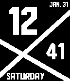
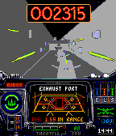
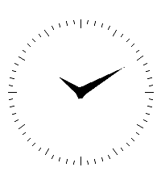
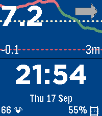
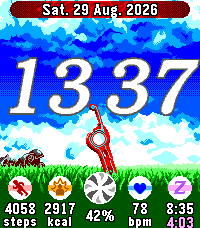
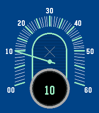
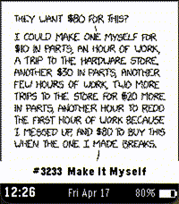

<!-- Generated by scripts/update_app_directory.py: do not edit by hand -->
# Watchfaces: X

[← About this list](../watchfaces.md) · [A](a.md) · [B](b.md) · [C](c.md) · [D](d.md) · [E](e.md) · [F](f.md) · [G](g.md) · [H](h.md) · [I](i.md) · [J](j.md) · [K](k.md) · [L](l.md) · [M](m.md) · [N](n.md) · [O](o.md) · [P](p.md) · [Q](q.md) · [R](r.md) · [S](s.md) · [T](t.md) · [U](u.md) · [V](v.md) · [W](w.md) · **X** · [Y](y.md) · [Z](z.md) · [0–9 & other](other.md)

*11 watchfaces · Last updated 2026-10-06*

| Screenshot | Name | Developer | Licence | Updated | Description |
|------------|------|-----------|---------|---------|-------------|
| { loading=lazy width="72" } | [X-Factor](https://apps.rebble.io/en_US/application/54cc6b410a912f389e00007c) <small>Rebble App Store</small> | [Jeremy Ketterer](https://github.com/Jaeman1999/xfactor) | <small>No licence</small> | 2015-04-20 | Simple watchface with a jagged design. Displays time in 12h format, month, date, and day of the week. |
| { loading=lazy width="72" } | [X-wing](https://apps.rebble.io/en_US/application/55c2f6b2740436377400007d) <small>Rebble App Store</small> | [Milo Price](https://github.com/miloprice/pebble-xwing) | <small>Not checked yet</small> | 2015-08-27 | Relive the climactic Trench Run from Star Wars! This watchface features imagery from the final assault on the Death Star from the 1993 X-wing DOS game by… |
| { loading=lazy width="72" } | [xclock](https://apps.rebble.io/en_US/application/692bf93b63df8c000980a4c0) <small>Rebble App Store</small> | [kjy00302](https://github.com/kjy00302/pebble-xclock) | <small>Not checked yet</small> | 2026-07-17 | The classic analog clock for X windows system, ported to Pebble watchface. |
| { loading=lazy width="72" } | [xDrip Framework Demo Watch Face](https://apps.repebble.com/8e71e4d1e67a4f9d8e27fa0e) | [JStevensogT1D](https://github.com/jstevensog/xDrip-Pebble-E/) | <small>Not checked yet</small> | 2026-10-01 | This is a demonstration version of a watch face designed to operate with the xDrip experimental Type 1 Diabetes management phone app. Note that currently… |
| { loading=lazy width="72" } | [Xenoblade Chronicles](https://apps.repebble.com/254e66f253cd44edaf11e5d2) | [MK73DS](https://github.com/MK73DS/xenoblade_watchface) | <small>Not checked yet</small> | 2026-09-05 | ~~ Xenoblade Chronicles watchface for Pebble Time 2 ~~ A Pebble watchface for the Pebble Time 2 only, featuring a beautiful theme from the video game… |
| { loading=lazy width="72" } | [Xenoblade Chronicles](https://apps.rebble.io/en_US/application/6a930cc5c1e6480009d9d37d) <small>Rebble App Store</small> | [MK73DS](https://github.com/MK73DS/xenoblade_watchface) | <small>Not checked yet</small> | 2026-09-01 | ~~ Xenoblade Chronicles watchface for Pebble Time 2 ~~ A Pebble watchface for the Pebble Time 2 only, featuring a beautiful theme from the video game… |
| { loading=lazy width="72" } | [Xeric Jump Hour](https://apps.repebble.com/8d0aa31ae4834764be9292b9) | [Shapeepo](https://github.com/shapeepo/xeric-jump-hour) | <small>Not checked yet</small> | 2026-04-30 | Based on Xeric Retroscope Jump Hour (designed with help from claude code, wip) |
| { loading=lazy width="72" } | [XEVI NUMBER](https://apps.rebble.io/en_US/application/5567f5e4dd469916f300009d) <small>Rebble App Store</small> | [taturou](https://github.com/taturou/pebble_Xevious) | <small>Not checked yet</small> | 2015-05-29 | The Xevious number clock. |
| { loading=lazy width="72" } | [XKCD Daily](https://apps.repebble.com/b68b8fba9a664893a9d16a25) | [AirCodum](https://github.com/coredevices/pebble-watchface-agent-skill) | <small>Not checked yet</small> | 2026-04-17 | The current XKCD comic, refreshed hourly. Shake your watch to reveal the alt-text caption - the hover-text joke behind each comic. |
| { loading=lazy width="72" } | [XO](https://apps.rebble.io/en_US/application/5497633d83524456ec000039) <small>Rebble App Store</small> | [cscott](https://github.com/cscott/pebble-xo) | <small>Not checked yet</small> | 2015-06-24 | A simple watchface displaying the One Laptop per Child/Sugar "XO man". |
| { loading=lazy width="72" } | [XTERN](https://apps.rebble.io/en_US/application/53a59b119580ed5b6300014e) <small>Rebble App Store</small> | [Vidia](https://github.com/vidia/xtern) | <small>Not checked yet</small> | 2014-06-21 | Xtern, the ultimate tech internship experience. Xtern is an initiative of IndyX which gathers talented interns to work at Indianapolis, IN's fastest growing… |
