---
hide:
  - toc
---

<!-- Generated by scripts/update_app_directory.py: do not edit by hand -->
# Pebble Watchfaces: Y

[← All Pebble Watchfaces](../watchfaces.md) · [A](a.md) · [B](b.md) · [C](c.md) · [D](d.md) · [E](e.md) · [F](f.md) · [G](g.md) · [H](h.md) · [I](i.md) · [J](j.md) · [K](k.md) · [L](l.md) · [M](m.md) · [N](n.md) · [O](o.md) · [P](p.md) · [Q](q.md) · [R](r.md) · [S](s.md) · [T](t.md) · [U](u.md) · [V](v.md) · [W](w.md) · [X](x.md) · **Y** · [Z](z.md) · [0–9 & other](other.md)

*16 watchfaces · Last updated 2026-10-06 · [About these lists](../about-app-lists.md)*

<h2 class="app-name" id="app-707ebcb9433f49b8b2e2515f"><a href="https://apps.repebble.com/707ebcb9433f49b8b2e2515f">YaForecasWatch2</a></h2>
<a class="app-source" href="https://github.com/Dreamkeeper/YaForecasWatch2" title="Source code" data-search-exclude>View source</a>

by <a href="https://apps.repebble.com/apps/dev/dreamkeeper_9860df6abfdaeba4fa867442" title="More from this developer">Dreamkeeper</a>

GPL-3.0 v1.34.14 Updated 2026-08-18

Runs on: Time 2, Pebble 2 Duo, Pebble 2, Time, Classic

YaForecasWatch2 keeps the compact calendar and forecast layout of ForecasWatch2 while adding better support for users outside the original Weather Underground/OpenWeatherMap flow. New in this…

<a class="app-shot" href="https://apps.repebble.com/55e8170f0a081a59b4000005" data-search-exclude>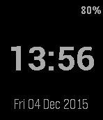</a>

<h2 class="app-name" id="app-55e8170f0a081a59b4000005"><a href="https://apps.repebble.com/55e8170f0a081a59b4000005">YASWF (Yet Another Simple WatchFace)</a></h2>
<a class="app-source" href="https://github.com/aboudou/Pebble_YASWF" title="Source code" data-search-exclude>View source</a>

by <a href="https://apps.repebble.com/apps/dev/arnaud-boudou_54cd0d4a66e305ca40000002" title="More from this developer">Arnaud Boudou</a>

BSD-2-Clause v1.3 Updated 2025-11-25

Runs on: Round 2, Time 2, Pebble 2 Duo, Pebble 2, Time Round, Time, Classic

YASWF (Yet Another Simple WatchFace) is watchface displaying essential informations in a convenient manner : hour, date, battery level, charging status, bluetooth disconnection. This watchface…

<h2 class="app-name" id="app-569f365ab1ee3588bc000039"><a href="https://apps.repebble.com/569f365ab1ee3588bc000039">YAWF</a></h2>
<a class="app-source" href="https://github.com/phm3/YAWF" title="Source code" data-search-exclude>View source</a>

by <a href="https://apps.repebble.com/apps/dev/greg_568fc8e0056c3837c0000061" title="More from this developer">Greg</a>

Not checked yet v0.1 Updated 2016-01-20

Runs on: Time 2, Time

My personal watchface inspired by DINTime and TimeStyle and own experience. Meant for low light level conditions. Green bar (battery indicator) turns red when battery drops below 20% (orange when…

<a class="app-shot" href="https://apps.repebble.com/56250097851cda8fa100005e" data-search-exclude>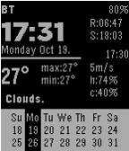</a>

<h2 class="app-name" id="app-56250097851cda8fa100005e"><a href="https://apps.repebble.com/56250097851cda8fa100005e">YAWWc</a></h2>
<a class="app-source" href="https://github.com/sheydenis/YAWWv1" title="Source code" data-search-exclude>View source</a>

by <a href="https://apps.repebble.com/apps/dev/masmddr_54323d5d4a9ca48ba80000d5" title="More from this developer">masmddr</a>

Not checked yet v1.4 Updated 2016-06-24

Runs on: Time 2, Pebble 2 Duo, Pebble 2, Time, Classic

Yet another weather watchface (Celsius). Shows time and weather information such as: Sunrise and sunset times at the top right (R: and S: respectively). Wind speed, humidity and cloudiness at the…

<a class="app-shot" href="https://apps.repebble.com/54fc2c05d7e692eccf000051" data-search-exclude>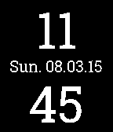</a>

<h2 class="app-name" id="app-54fc2c05d7e692eccf000051"><a href="https://apps.repebble.com/54fc2c05d7e692eccf000051">Yeah! Clock for Pebble</a></h2>
<a class="app-source" href="http://github.com/flashback2k14/yeahclockforpebble" title="Source code" data-search-exclude>View source</a>

by <a href="https://apps.repebble.com/apps/dev/yeah-dev_531a3a5205c740cd0f000723" title="More from this developer">Yeah!Dev</a>

No licence v1.3 Updated 2015-10-19

Runs on: Time 2, Pebble 2 Duo, Pebble 2, Time, Classic

Yeah! Clock for Pebble is a nice, simple and customisable Watchface. Custom Options: - show / hide the Date and Weather Informations - invert the Colors - more options planned I&#x27;ve decided to port…

<a class="app-shot" href="https://apps.repebble.com/d58b889bab2c41cdb5a1b267" data-search-exclude>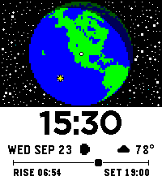</a>

<h2 class="app-name" id="app-d58b889bab2c41cdb5a1b267"><a href="https://apps.repebble.com/d58b889bab2c41cdb5a1b267">Yearlight</a></h2>
<a class="app-source" href="https://github.com/alechudson/yearlight" title="Source code" data-search-exclude>View source</a>

by <a href="https://apps.repebble.com/apps/dev/alec-hudson_4462b3475108118213285c80" title="More from this developer">Alec Hudson</a>

Other v1.0.8 Updated 2026-09-25

Runs on: Time 2

Watch sunlight move across the Earth, centred on where you are. ★ A year of stars The sky around the globe fills with one star for every day of the year. On January 1st there&#x27;s a single star; by…

<a class="app-shot" href="https://apps.repebble.com/872cc49a3c5c4e359d9f9e2c" data-search-exclude>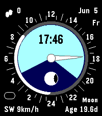</a>

<h2 class="app-name" id="app-872cc49a3c5c4e359d9f9e2c"><a href="https://apps.repebble.com/872cc49a3c5c4e359d9f9e2c">Yes Watch</a></h2>
<a class="app-source" href="https://github.com/synalysis/yes-watch" title="Source code" data-search-exclude>View source</a>

by <a href="https://apps.repebble.com/apps/dev/synalysis_cc7bd1a5efe5d342dddfb4a7" title="More from this developer">Synalysis</a>

Not checked yet v1.3.1 Updated 2026-06-27

Runs on: Round 2, Time 2, Pebble 2 Duo, Pebble 2, Time Round, Time

The watchface resembles the Yes Watch and has features like sun rise / sun set, moon rise / moon set, moon phase, 24 h hand, and, of course, the time. The computations are done on the phone in…

<a class="app-shot" href="https://apps.repebble.com/55745fc2b5cd567462000048" data-search-exclude>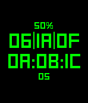</a>

<h2 class="app-name" id="app-55745fc2b5cd567462000048"><a href="https://apps.repebble.com/55745fc2b5cd567462000048">Yet Another Hex Clock</a></h2>
<a class="app-source" href="https://github.com/redus/hex_clock" title="Source code" data-search-exclude>View source</a>

by <a href="https://apps.repebble.com/apps/dev/redus_55745ebeb5cd5603cc000042" title="More from this developer">redus</a>

Not checked yet v1.4 Updated 2015-10-29

Runs on: Time 2, Pebble 2 Duo, Pebble 2, Time, Classic

Yet another hex clock! With terminal color scheme! How original. 이제 16진수로 시간을 보세요! 컴공생답게요!

<a class="app-shot" href="https://apps.repebble.com/57553f4f103a34bcd5000023" data-search-exclude>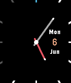</a>

<h2 class="app-name" id="app-57553f4f103a34bcd5000023"><a href="https://apps.repebble.com/57553f4f103a34bcd5000023">Yet Another Thin</a></h2>
<a class="app-source" href="https://github.com/xeric/YAThin" title="Source code" data-search-exclude>View source</a>

by <a href="https://apps.repebble.com/apps/dev/xeric_5725992d6122504557000001" title="More from this developer">xeric</a>

Not checked yet v2.0 Updated 2016-06-06

Runs on: Round 2, Time 2, Pebble 2 Duo, Pebble 2, Time Round, Time, Classic

Yet Another Thin is developed and improved based on open source Watchface &#x27;Thin&#x27;, and add some small changes on it, includes: cross center hands, Bluetooth indicator(12 clock marker), red hour…

<a class="app-shot" href="https://apps.rebble.io/en_US/application/58a98fdb6ca387b01a0005a8" data-search-exclude>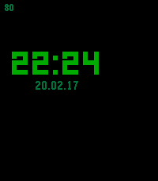</a>

<h2 class="app-name" id="app-58a98fdb6ca387b01a0005a8"><a href="https://apps.rebble.io/en_US/application/58a98fdb6ca387b01a0005a8">Yet Another Watchface</a></h2>
<a class="app-source" href="https://github.com/Avamander/YetAnotherWatchFace" title="Source code" data-search-exclude>View source</a>

by <a href="https://apps.rebble.io/en_US/developer/58776d32e09e63748e000788/1" title="More from this developer">Avamander</a>

GPL-3.0 v1.2 Updated 2017-02-20 Rebble App Store

Runs on: Round 2, Time 2, Pebble 2 Duo, Pebble 2, Time Round, Time, Classic

Really minimal watchface that&#x27;s just designed to be simple, no configuration, no slowdowns, no nothing else. It just shows the battery status, date, time and if the bluetooth connection has…

<a class="app-shot" href="https://apps.repebble.com/c19449a613724a308fdd08dd" data-search-exclude>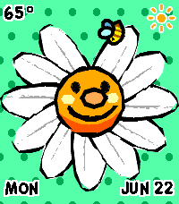</a>

<h2 class="app-name" id="app-c19449a613724a308fdd08dd"><a href="https://apps.repebble.com/c19449a613724a308fdd08dd">Yoshi Flower!</a></h2>
<a class="app-source" href="https://github.com/Freilan/PebbleFace" title="Source code" data-search-exclude>View source</a>

by <a href="https://apps.repebble.com/apps/dev/sleepypossum_b6fbf5b78bf2353d73016df2" title="More from this developer">SleepyPossum</a>

No licence v1.0.1 Updated 2026-06-22

Runs on: Round 2, Time 2

A customizable, animated Yoshi&#x27;s Story Flower! During AM, the flower grows one petal per hour, until it&#x27;s in full bloom at noon. At PM, it loses one petal per hour, until it&#x27;s barren at midnight…

<a class="app-shot" href="https://apps.repebble.com/58172e1e46041f64b00002b7" data-search-exclude>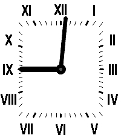</a>

<h2 class="app-name" id="app-58172e1e46041f64b00002b7"><a href="https://apps.repebble.com/58172e1e46041f64b00002b7">Your Style</a></h2>
<a class="app-source" href="https://github.com/ProggroP/YourStyle" title="Source code" data-search-exclude>View source</a>

by <a href="https://apps.repebble.com/apps/dev/kieselleger_56f70d3fe58879cfd4000013" title="More from this developer">Kieselleger</a>

No licence v2.3.1 Updated 2026-08-19

Runs on: Round 2, Time 2, Pebble 2 Duo, Pebble 2, Time Round, Time

Configure your watchface as you like it. All possible colors for your model can be applied to the watchface elements. Hide hour and minute marks, enable seconds if you like that. Fullscreen option…

<h2 class="app-name" id="app-547b9c31fb0797aeb3000082"><a href="https://apps.repebble.com/547b9c31fb0797aeb3000082">YouWatch</a></h2>
<a class="app-source" href="https://github.com/SantiMA10/YouWatch" title="Source code" data-search-exclude>View source</a>

by <a href="https://apps.repebble.com/apps/dev/santima10_52f009e84ae363ecd40000be" title="More from this developer">SantiMA10</a>

No licence v2.0 Updated 2016-04-29

Runs on: Time 2, Pebble 2 Duo, Pebble 2, Time, Classic

Do you have a YouTube channel? With this watchface you know from your Pebble how many subscribers do you have.

<a class="app-shot" href="https://apps.repebble.com/55ec4b014fcd1ccc6200000d" data-search-exclude>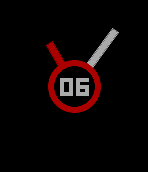</a>

<h2 class="app-name" id="app-55ec4b014fcd1ccc6200000d"><a href="https://apps.repebble.com/55ec4b014fcd1ccc6200000d">YU1</a></h2>
<a class="app-source" href="https://github.com/youkoseki/pebble-yu1/" title="Source code" data-search-exclude>View source</a>

by <a href="https://apps.repebble.com/apps/dev/yu-koseki_5347f2b842b3b214da000001" title="More from this developer">Yu Koseki</a>

Not checked yet v1.3 Updated 2015-09-07

Runs on: Time 2, Time

Simple red and white clock featuring big digital minute

<a class="app-shot" href="https://apps.repebble.com/91a9cfaa6c714c3c8983b57b" data-search-exclude>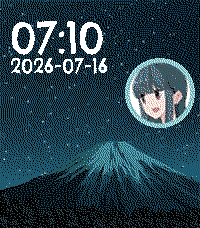</a>

<h2 class="app-name" id="app-91a9cfaa6c714c3c8983b57b"><a href="https://apps.repebble.com/91a9cfaa6c714c3c8983b57b">Yuru Camp Mount Fuji</a></h2>
<a class="app-source" href="https://github.com/chriseilander/YuruCampFujiWatchFace" title="Source code" data-search-exclude>View source</a>

by <a href="https://apps.repebble.com/apps/dev/chris-eilander-nl_546da3e6e2a84b10b200006a" title="More from this developer">Chris Eilander.nl</a>

Not checked yet v1.1.1 Updated 2026-07-23

Runs on: Round 2, Time 2, Pebble 2 Duo, Pebble 2, Time Round, Time, Classic

Laid-Back Camping with the Yuru Camp Mount Fuji watchface. A watchface with a beautiful night sky view of mount Fuji straight from the Anime. Accompanied with the face of your favorite camper…

<a class="app-shot" href="https://apps.repebble.com/51262fd5158c429e987e1728" data-search-exclude>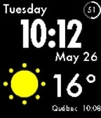</a>

<h2 class="app-name" id="app-51262fd5158c429e987e1728"><a href="https://apps.repebble.com/51262fd5158c429e987e1728">YWeather2</a></h2>
<a class="app-source" href="https://github.com/stanelie/Yahoo--Weather" title="Source code" data-search-exclude>View source</a>

by <a href="https://apps.repebble.com/apps/dev/stanelie_1aec201dd678e31f567dc929" title="More from this developer">stanelie</a>

Not checked yet v3.7 Updated 2026-06-07

Runs on: Round 2, Time 2, Pebble 2 Duo, Pebble 2, Time Round, Time, Classic

Update of the original YWeather app by David Rodríguez Rincón

