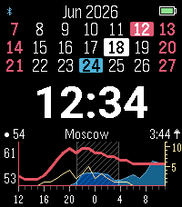
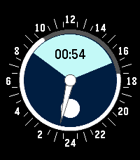
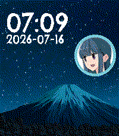

<!-- Generated by scripts/update_app_directory.py: do not edit by hand -->
# Watchfaces: Y

[← About this list](../watchfaces.md) · [A](a.md) · [B](b.md) · [C](c.md) · [D](d.md) · [E](e.md) · [F](f.md) · [G](g.md) · [H](h.md) · [I](i.md) · [J](j.md) · [K](k.md) · [L](l.md) · [M](m.md) · [N](n.md) · [O](o.md) · [P](p.md) · [Q](q.md) · [R](r.md) · [S](s.md) · [T](t.md) · [U](u.md) · [V](v.md) · [W](w.md) · [X](x.md) · **Y** · [Z](z.md) · [0–9 & other](other.md)

*19 watchfaces · Last updated 2026-10-06*

| Screenshot | Name | Developer | Licence | Updated | Description |
|------------|------|-----------|---------|---------|-------------|
| { loading=lazy width="72" } | [YaForecasWatch2](https://apps.repebble.com/707ebcb9433f49b8b2e2515f) | [Dreamkeeper](https://github.com/Dreamkeeper/YaForecasWatch2) | GPL-3.0 | 2026-08-18 | YaForecasWatch2 keeps the compact calendar and forecast layout of ForecasWatch2 while adding better support for users outside the original Weather… |
| { loading=lazy width="72" } | [YaForecasWatch2](https://apps.rebble.io/en_US/application/6a36b704e033950009088011) <small>Rebble App Store</small> | [Dreamkeeper](https://github.com/Dreamkeeper/YaForecasWatch2) | GPL-3.0 | 2026-08-18 | YaForecasWatch2 keeps the compact calendar and forecast layout of ForecasWatch2 while adding better support for users outside the original Weather… |
| { loading=lazy width="72" } | [YASWF (Yet Another Simple WatchFace)](https://apps.repebble.com/55e8170f0a081a59b4000005) | [Arnaud Boudou](https://github.com/aboudou/Pebble_YASWF) | <small>Not checked yet</small> | 2025-11-25 | YASWF (Yet Another Simple WatchFace) is watchface displaying essential informations in a convenient manner : hour, date, battery level, charging status… |
| { loading=lazy width="72" } | [YAWF](https://apps.rebble.io/en_US/application/569f365ab1ee3588bc000039) <small>Rebble App Store</small> | [Greg](https://github.com/phm3/YAWF) | <small>Not checked yet</small> | 2016-01-20 | My personal watchface inspired by DINTime and TimeStyle and own experience. Meant for low light level conditions. Green bar (battery indicator) turns red… |
| { loading=lazy width="72" } | [YAWWc](https://apps.repebble.com/56250097851cda8fa100005e) | [masmddr](https://github.com/sheydenis/YAWWv1) | <small>Not checked yet</small> | 2016-06-24 | Yet another weather watchface (Celsius). Shows time and weather information such as: Sunrise and sunset times at the top right (R: and S: respectively)… |
| { loading=lazy width="72" } | [Yeah! Clock for Pebble](https://apps.rebble.io/en_US/application/54fc2c05d7e692eccf000051) <small>Rebble App Store</small> | [Yeah!Dev](http://github.com/flashback2k14/yeahclockforpebble) | <small>No licence</small> | 2015-10-19 | Yeah! Clock for Pebble is a nice, simple and customisable Watchface. Custom Options: - show / hide the Date and Weather Informations - invert the Colors … |
| { loading=lazy width="72" } | [Yearlight](https://apps.repebble.com/d58b889bab2c41cdb5a1b267) | [Alec Hudson](https://github.com/alechudson/yearlight) | <small>Not checked yet</small> | 2026-09-25 | Watch sunlight move across the Earth, centred on where you are. ★ A year of stars The sky around the globe fills with one star for every day of the year. On… |
| { loading=lazy width="72" } | [Yes Watch](https://apps.repebble.com/872cc49a3c5c4e359d9f9e2c) | [Synalysis](https://github.com/synalysis/yes-watch) | <small>Not checked yet</small> | 2026-06-27 | The watchface resembles the Yes Watch and has features like sun rise / sun set, moon rise / moon set, moon phase, 24 h hand, and, of course, the time. The… |
| { loading=lazy width="72" } | [Yes Watch](https://apps.rebble.io/en_US/application/695d9e71d060620009a5b760) <small>Rebble App Store</small> | [Synalysis](https://github.com/synalysis/yes-watch) | <small>Not checked yet</small> | 2026-01-06 | The watchface resembles the Yes Watch and has features like sun rise / sun set, moon rise / moon set, moon phase, 24 h hand, and, of course, the time. The… |
| { loading=lazy width="72" } | [Yet Another Hex Clock](https://apps.rebble.io/en_US/application/55745fc2b5cd567462000048) <small>Rebble App Store</small> | [redus](https://github.com/redus/hex_clock) | <small>Not checked yet</small> | 2015-10-29 | Yet another hex clock! With terminal color scheme! How original. 이제 16진수로 시간을 보세요! 컴공생답게요! |
| { loading=lazy width="72" } | [Yet Another Thin](https://apps.repebble.com/57553f4f103a34bcd5000023) | [xeric](https://github.com/xeric/YAThin) | <small>Not checked yet</small> | 2016-06-06 | Yet Another Thin is developed and improved based on open source Watchface 'Thin', and add some small changes on it, includes: cross center hands, Bluetooth… |
| { loading=lazy width="72" } | [Yet Another Watchface](https://apps.rebble.io/en_US/application/58a98fdb6ca387b01a0005a8) <small>Rebble App Store</small> | [Avamander](https://github.com/Avamander/YetAnotherWatchFace) | GPL-3.0 | 2017-02-20 | Really minimal watchface that's just designed to be simple, no configuration, no slowdowns, no nothing else. It just shows the battery status, date, time… |
| { loading=lazy width="72" } | [Yoshi Flower!](https://apps.repebble.com/c19449a613724a308fdd08dd) | [SleepyPossum](https://github.com/Freilan/PebbleFace) | <small>No licence</small> | 2026-06-22 | A customizable, animated Yoshi's Story Flower! During AM, the flower grows one petal per hour, until it's in full bloom at noon. At PM, it loses one petal… |
| { loading=lazy width="72" } | [Your Style](https://apps.repebble.com/58172e1e46041f64b00002b7) | [Kieselleger](https://github.com/ProggroP/YourStyle) | <small>Not checked yet</small> | 2026-08-19 | Configure your watchface as you like it. All possible colors for your model can be applied to the watchface elements. Hide hour and minute marks, enable… |
| { loading=lazy width="72" } | [YouWatch](https://apps.repebble.com/547b9c31fb0797aeb3000082) | [SantiMA10](https://github.com/SantiMA10/YouWatch) | <small>Not checked yet</small> | 2016-04-29 | Do you have a YouTube channel? With this watchface you know from your Pebble how many subscribers do you have. |
| { loading=lazy width="72" } | [YU1](https://apps.rebble.io/en_US/application/55ec4b014fcd1ccc6200000d) <small>Rebble App Store</small> | [Yu Koseki](https://github.com/youkoseki/pebble-yu1/) | <small>Not checked yet</small> | 2015-09-07 | Simple red and white clock featuring big digital minute |
| { loading=lazy width="72" } | [Yuru Camp Mount Fuji](https://apps.repebble.com/91a9cfaa6c714c3c8983b57b) | [Chris Eilander.nl](https://github.com/chriseilander/YuruCampFujiWatchFace) | <small>Not checked yet</small> | 2026-07-23 | Laid-Back Camping with the Yuru Camp Mount Fuji watchface. A watchface with a beautiful night sky view of mount Fuji straight from the Anime. Accompanied… |
| { loading=lazy width="72" } | [Yuru Camp Mount Fuji](https://apps.rebble.io/en_US/application/6a60921f06f0dc0009b58694) <small>Rebble App Store</small> | [Chris Eilander.nl](https://github.com/chriseilander/YuruCampFujiWatchFace) | <small>Not checked yet</small> | 2026-07-23 | Laid-Back Camping with the Yuru Camp Mount Fuji watchface. A watchface with a beautiful night sky view of mount Fuji straight from the Anime. Accompanied… |
| { loading=lazy width="72" } | [YWeather2](https://apps.repebble.com/51262fd5158c429e987e1728) | [stanelie](https://github.com/stanelie/Yahoo--Weather) | <small>Not checked yet</small> | 2026-06-07 | Update of the original YWeather app by David Rodríguez Rincón |
