---
hide:
  - toc
---

<!-- Generated by scripts/update_app_directory.py: do not edit by hand -->
# Pebble Watchfaces: Z

[← All Pebble Watchfaces](../watchfaces.md) · [A](a.md) · [B](b.md) · [C](c.md) · [D](d.md) · [E](e.md) · [F](f.md) · [G](g.md) · [H](h.md) · [I](i.md) · [J](j.md) · [K](k.md) · [L](l.md) · [M](m.md) · [N](n.md) · [O](o.md) · [P](p.md) · [Q](q.md) · [R](r.md) · [S](s.md) · [T](t.md) · [U](u.md) · [V](v.md) · [W](w.md) · [X](x.md) · [Y](y.md) · **Z** · [0–9 & other](other.md)

*21 watchfaces · Last updated 2026-10-06 · [About these lists](../about-app-lists.md)*

<a class="app-shot" href="https://apps.repebble.com/5779c4cd6c2104d5f80007f3" data-search-exclude>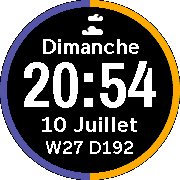</a>

<h2 class="app-name" id="app-5779c4cd6c2104d5f80007f3"><a href="https://apps.repebble.com/5779c4cd6c2104d5f80007f3">Z Sleep</a></h2>
<a class="app-source" href="https://github.com/zealotree/Sleepy-Time/tree/z-sleep" title="Source code" data-search-exclude>View source</a>

by <a href="https://apps.repebble.com/apps/dev/zealotree_5722b3d1db5a405aa4000023" title="More from this developer">Zealotree</a>

Not checked yet v1.05 Updated 2016-07-05

Runs on: Round 2, Time Round

Z Sleep Even the most zealous people need rest. So does your pebble. It preserves the battery life by only displaying and updating the time when the pebble is flicked. Features: - Shake to Update…

<a class="app-shot" href="https://apps.rebble.io/en_US/application/6a84702699fcd7000930016a" data-search-exclude>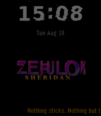</a>

<h2 class="app-name" id="app-6a84702699fcd7000930016a"><a href="https://apps.rebble.io/en_US/application/6a84702699fcd7000930016a">Zebulon Sheridan</a></h2>
<a class="app-source" href="https://github.com/zebulon-sheridan/zebulon-sheridan-watchface" title="Source code" data-search-exclude>View source</a>

by <a href="https://apps.rebble.io/en_US/developer/6a8469892167150008eaec24/1" title="More from this developer">zebulon-sheridan</a>

Not checked yet v1.1.0 Updated 2026-08-18 Rebble App Store

Runs on: Round 2, Time 2, Pebble 2 Duo, Pebble 2, Time Round, Time, Classic

time is an illusion life but an echo

<a class="app-shot" href="https://apps.repebble.com/54c3925876a15567d2000012" data-search-exclude>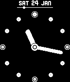</a>

<h2 class="app-name" id="app-54c3925876a15567d2000012"><a href="https://apps.repebble.com/54c3925876a15567d2000012">Zen Dotz</a></h2>
<a class="app-source" href="https://github.com/zecoj/zen.dotz" title="Source code" data-search-exclude>View source</a>

by <a href="https://apps.repebble.com/apps/dev/ben-nguyen_5481875759fcc2e9ef000148" title="More from this developer">Ben Nguyen</a>

Not checked yet v1.1 Updated 2015-01-24

Runs on: Time 2, Pebble 2 Duo, Pebble 2, Time, Classic

Simple &amp; subtle analogue watch with bold hands and dots. Aimed to be easy to see at a quick glance. Features: - Month &amp; date - Battery slider (dot moves from right to left, shows remaining…

<a class="app-shot" href="https://apps.repebble.com/54b8c439ffc3fd1a31000012" data-search-exclude>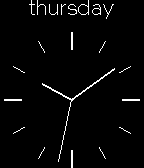</a>

<h2 class="app-name" id="app-54b8c439ffc3fd1a31000012"><a href="https://apps.repebble.com/54b8c439ffc3fd1a31000012">Zen for Steel</a></h2>
<a class="app-source" href="https://github.com/RichardGG/ZenForSteel" title="Source code" data-search-exclude>View source</a>

by <a href="https://apps.repebble.com/apps/dev/richardgg_52f050253be620a1910000b6" title="More from this developer">RichardGG</a>

No licence v1.1 Updated 2015-01-21

Runs on: Time 2, Pebble 2 Duo, Pebble 2, Time, Classic

Designed for Pebble Steel. This watchface brings symmetry to the Pebble Steel. Carefully designed for the physical appearance of the Steel. The watchface is perfectly centered on the glass face…

<h2 class="app-name" id="app-5abf41ee461a8d6af400030c"><a href="https://apps.rebble.io/en_US/application/5abf41ee461a8d6af400030c">Zen Time</a></h2>
<a class="app-source" href="https://github.com/stosem/pebble-wf-ZenTime" title="Source code" data-search-exclude>View source</a>

by <a href="https://apps.rebble.io/en_US/developer/5a2a0e690dfc329d17001135/1" title="More from this developer">stosem</a>

Not checked yet v1.1 Updated 2018-04-05 Rebble App Store

Runs on: Round 2, Time 2, Pebble 2 Duo, Pebble 2, Time Round, Time, Classic

Zen time is eternal NOW. But you can also read approximate mental time by detecting position of zen-circle (hour) and dot around this circle (minute). In screenshots it is a 11:00, 6:45, 3:30. To…

<a class="app-shot" href="https://apps.repebble.com/5733bba2f68e7b31a9000002" data-search-exclude>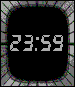</a>

<h2 class="app-name" id="app-5733bba2f68e7b31a9000002"><a href="https://apps.repebble.com/5733bba2f68e7b31a9000002">Zero Escape</a></h2>
<a class="app-source" href="https://github.com/offoxsmind/zeroescape" title="Source code" data-search-exclude>View source</a>

by <a href="https://apps.repebble.com/apps/dev/weaversway_55a535727c789dc73300001b" title="More from this developer">weaversway</a>

Not checked yet v1.2 Updated 2016-09-05

Runs on: Round 2, Time 2, Time Round, Time

Zero Hour watch face with colors that change on the hour. Displays the hour on the main watch face, and then a shake of the wrist will show the full time.

<a class="app-shot" href="https://apps.rebble.io/en_US/application/692644f5703cec0009a280fd" data-search-exclude>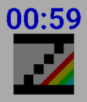</a>

<h2 class="app-name" id="app-692644f5703cec0009a280fd"><a href="https://apps.rebble.io/en_US/application/692644f5703cec0009a280fd">ZEsarUX emulator watchface</a></h2>
<a class="app-source" href="https://github.com/chernandezba/zesarux-pebble-watchface" title="Source code" data-search-exclude>View source</a>

by <a href="https://apps.rebble.io/en_US/developer/52f00e048f27d1d3940000ce/1" title="More from this developer">chernandezba</a>

Not checked yet v1.7.1 Updated 2026-06-03 Rebble App Store

Runs on: Round 2, Time 2, Pebble 2 Duo, Pebble 2, Time Round, Time, Classic

Simple ZEsarUX emulator watchface Color stripes can be animated every minute, chosen on settings. When tapping Pebble, the number of ZEsarUX yesterday users will be shown

<h2 class="app-name" id="app-cdfec388a4a74aa89c27e51b"><a href="https://apps.repebble.com/cdfec388a4a74aa89c27e51b">zesarux-watchface</a></h2>
<a class="app-source" href="https://github.com/chernandezba/zesarux-pebble-watchface" title="Source code" data-search-exclude>View source</a>

by <a href="https://apps.repebble.com/apps/dev/cesar-hernandez_caddaac1097dcb3aed14d135" title="More from this developer">Cesar Hernandez</a>

Not checked yet v1.7.1 Updated 2026-06-03

Runs on: Round 2, Time 2, Pebble 2 Duo, Pebble 2, Time Round, Time, Classic

Simple ZEsarUX emulator watchface Color stripes can be animated every minute, chosen on settings. When tapping Pebble, the number of ZEsarUX yesterday users will be shown

<a class="app-shot" href="https://apps.repebble.com/5789066184accc2867000032" data-search-exclude>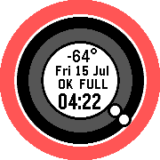</a>

<h2 class="app-name" id="app-5789066184accc2867000032"><a href="https://apps.repebble.com/5789066184accc2867000032">ZFACECLOCK</a></h2>
<a class="app-source" href="https://github.com/zealotree/ZFACECLOCK" title="Source code" data-search-exclude>View source</a>

by <a href="https://apps.repebble.com/apps/dev/zealotree_5722b3d1db5a405aa4000023" title="More from this developer">Zealotree</a>

Not checked yet v1.3 Updated 2016-07-15

Runs on: Round 2, Time Round

Inspired by AOFACECLOCK1st by Akemori Oda The same design with the following additions: - New Colours every time the watchface is launched and every time the Day changes (was every minute) - Added…

<a class="app-shot" href="https://apps.repebble.com/68ee48a13e917c00090b923c" data-search-exclude>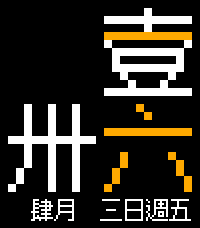</a>

<h2 class="app-name" id="app-68ee48a13e917c00090b923c"><a href="https://apps.repebble.com/68ee48a13e917c00090b923c">zh-TW_Pixel</a></h2>
<a class="app-source" href="https://github.com/ping840907/zh-TW_Pixel" title="Source code" data-search-exclude>View source</a>

by <a href="https://apps.repebble.com/apps/dev/sloth8497_68c4a750647ef000080f0b2d" title="More from this developer">Sloth8497</a>

Not checked yet v2.0.2 Updated 2026-06-06

Runs on: Time 2, Pebble 2 Duo, Pebble 2, Time, Classic

A pixel-style pebble watch face with a full Chinese display, striking a balance between colloquialism and literary sense. In order to accommodate the Chinese way of reading time and the aesthetics…

<a class="app-shot" href="https://apps.repebble.com/52b2a9c28c081503ed0000d6" data-search-exclude>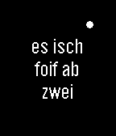</a>

<h2 class="app-name" id="app-52b2a9c28c081503ed0000d6"><a href="https://apps.repebble.com/52b2a9c28c081503ed0000d6">Ziit</a></h2>
<a class="app-source" href="https://github.com/plan44/ziit_pebble" title="Source code" data-search-exclude>View source</a>

by <a href="https://apps.repebble.com/apps/dev/plan44-ch_52b2a87b8c0815bb5e0000d5" title="More from this developer">plan44.ch</a>

Not checked yet v2.2 Updated 2015-10-24

Runs on: Round 2, Time 2, Pebble 2 Duo, Pebble 2, Time Round, Time, Classic

Swiss German text clock

<h2 class="app-name" id="app-0c8a208dd4e546db9731a735"><a href="https://apps.repebble.com/0c8a208dd4e546db9731a735">Ziit</a></h2>
<a class="app-source" href="https://github.com/abonhote/ziit" title="Source code" data-search-exclude>View source</a>

by <a href="https://apps.repebble.com/apps/dev/sapphire-tick-tocker_468fadf7948d6de2b430ef75" title="More from this developer">Sapphire Tick-Tocker</a>

Apache-2.0 v0.4 Updated 2026-05-04

Runs on: Round 2, Time 2, Pebble 2 Duo, Pebble 2, Time Round, Time, Classic

Schweizerdeutsches Textzifferblatt - swiss german text face

<h2 class="app-name" id="app-52f29c665dbf7e5bcb0000be"><a href="https://apps.repebble.com/52f29c665dbf7e5bcb0000be">Zingy Animated</a></h2>
<a class="app-source" href="https://github.com/rhortal/ZingyAnimated" title="Source code" data-search-exclude>View source</a>

by <a href="https://apps.repebble.com/apps/dev/roberto-hortal_52f104cf61b752a90d002d7b" title="More from this developer">Roberto Hortal</a>

Not checked yet v1.0.0 Updated 2014-02-05

Runs on: Time 2, Pebble 2 Duo, Pebble 2, Time, Classic

Animated watchface featuring Zingy dancing on your screen

<a class="app-shot" href="https://apps.repebble.com/57c5d5795e3c3db485000516" data-search-exclude>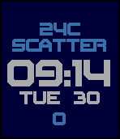</a>

<h2 class="app-name" id="app-57c5d5795e3c3db485000516"><a href="https://apps.repebble.com/57c5d5795e3c3db485000516">Zirconia</a></h2>
<a class="app-source" href="https://github.com/yoosee/PebbleZirconiaWatch" title="Source code" data-search-exclude>View source</a>

by <a href="https://apps.repebble.com/apps/dev/yoosee_56fc1d81085b3d583f000043" title="More from this developer">yoosee</a>

Not checked yet v1.2 Updated 2018-02-09

Runs on: Round 2, Time 2, Pebble 2 Duo, Pebble 2, Time Round, Time

Digital Watchface with Time, Date, Current temperature, Weather condition and Health Steps, Bluetooth disconnect indicator. All colors are configurable. Your Pebble has to be updated to v4.0…

<a class="app-shot" href="https://apps.repebble.com/a1c61f1227144535accbf53c" data-search-exclude>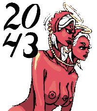</a>

<h2 class="app-name" id="app-a1c61f1227144535accbf53c"><a href="https://apps.repebble.com/a1c61f1227144535accbf53c">Zodiac: Gemini</a></h2>
<a class="app-source" href="https://github.com/meded90/pebble-time-2-pixel-faces/tree/main/zodiac-gemini" title="Source code" data-search-exclude>View source</a>

by <a href="https://apps.repebble.com/apps/dev/analog-tick-tocker_eb6b6dc4dbd64c7c7ea32a94" title="More from this developer">Analog Tick-Tocker</a>

Not checked yet v1.4.0 Updated 2026-08-24

Runs on: Time 2

Zodiac: Gemini pairs a vivid twin portrait with large, rounded black numerals designed for the 200×228 Pebble Time 2 display. Hours and minutes are stacked in the upper-left corner without a frame…

<a class="app-shot" href="https://apps.repebble.com/52fd607249e544cf9a000477" data-search-exclude>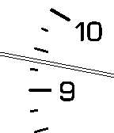</a>

<h2 class="app-name" id="app-52fd607249e544cf9a000477"><a href="https://apps.repebble.com/52fd607249e544cf9a000477">Zoooom (hop-picker)</a></h2>
<a class="app-source" href="http://hop-picker.tumblr.com/" title="Source code" data-search-exclude>View source</a>

by <a href="https://apps.repebble.com/apps/dev/p10n-net_529a2241e627ce90540000d8" title="More from this developer">p10n.net</a>

See source v1.0.2 Updated 2014-02-19

Runs on: Time 2, Pebble 2 Duo, Pebble 2, Time, Classic

In cooperation with the original creator Konstantin Pulyarkin alias hop-picker ( http://hop-picker.tumblr.c ), I created a Pebble version of his amazing watch design. It is so elegant due to…

<a class="app-shot" href="https://apps.rebble.io/en_US/application/692159cb7cdf9d000985e1bd" data-search-exclude>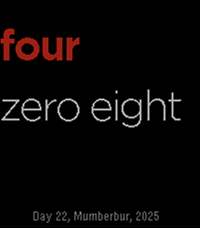</a>

<h2 class="app-name" id="app-692159cb7cdf9d000985e1bd"><a href="https://apps.rebble.io/en_US/application/692159cb7cdf9d000985e1bd">Zork Face</a></h2>
<a class="app-source" href="https://drpunchman.com/index.php?❤=BLOG&amp;★=CLOUD_PEBBLE" title="Source code" data-search-exclude>View source</a>

by <a href="https://apps.rebble.io/en_US/developer/5b9559b9ba301a00014b86f2/1" title="More from this developer">DrPunchman</a>

See source v1.0 Updated 2025-11-22 Rebble App Store

Runs on: Time 2, Pebble 2 Duo, Pebble 2, Time, Classic

It is a text watch face that has holidays based off the Zork calendar just to be difficult.

<a class="app-shot" href="https://apps.repebble.com/5776a81d66202abc7f0000c7" data-search-exclude>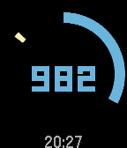</a>

<h2 class="app-name" id="app-5776a81d66202abc7f0000c7"><a href="https://apps.repebble.com/5776a81d66202abc7f0000c7">ZSteps</a></h2>
<a class="app-source" href="https://github.com/pebble-examples/strider-watchface" title="Source code" data-search-exclude>View source</a>

by <a href="https://apps.repebble.com/apps/dev/zszen_57586deacbd52b0d51000004" title="More from this developer">zszen</a>

Not checked yet v1.3 Updated 2016-07-04

Runs on: Round 2, Time 2, Pebble 2 Duo, Pebble 2, Time Round, Time, Classic

I modify by example app &quot;strider-watchface&quot; And change it to watchface.

<a class="app-shot" href="https://apps.repebble.com/57cd6e04f69d1d636000026c" data-search-exclude>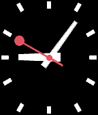</a>

<h2 class="app-name" id="app-57cd6e04f69d1d636000026c"><a href="https://apps.repebble.com/57cd6e04f69d1d636000026c">ZSwissSquare</a></h2>
<a class="app-source" href="https://github.com/zszen/pebble_zswisssquare" title="Source code" data-search-exclude>View source</a>

by <a href="https://apps.repebble.com/apps/dev/zszen_57586deacbd52b0d51000004" title="More from this developer">zszen</a>

Not checked yet v1.3 Updated 2016-10-25

Runs on: Time 2, Pebble 2 Duo, Pebble 2, Time, Classic

This watchface base on &quot;SwissSquare&quot;. The author ask me for support the local setting function. So I deal it. It may lose some function like vibes.

<a class="app-shot" href="https://apps.repebble.com/57586e4ccbd52b9732000001" data-search-exclude>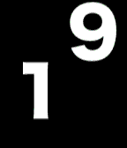</a>

<h2 class="app-name" id="app-57586e4ccbd52b9732000001"><a href="https://apps.repebble.com/57586e4ccbd52b9732000001">ZWatch</a></h2>
<a class="app-source" href="https://github.com/zszen/PebbleFace_ZSimpleTime" title="Source code" data-search-exclude>View source</a>

by <a href="https://apps.repebble.com/apps/dev/zszen_57586deacbd52b0d51000004" title="More from this developer">zszen</a>

Not checked yet v4.3 Updated 2016-12-23

Runs on: Round 2, Time 2, Pebble 2 Duo, Pebble 2, Time Round, Time, Classic

simple clock display. this number is hour display only. battery save. first number position is hour in one day percentage. second number position is minute turn around. v3.8 add always highlight…

<a class="app-shot" href="https://apps.rebble.io/en_US/application/584de168ce45dc2706000242" data-search-exclude>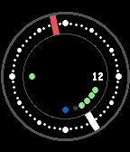</a>

<h2 class="app-name" id="app-584de168ce45dc2706000242"><a href="https://apps.rebble.io/en_US/application/584de168ce45dc2706000242">ZWF</a></h2>
<a class="app-source" href="https://github.com/stark-dev/ZWF" title="Source code" data-search-exclude>View source</a>

by <a href="https://apps.rebble.io/en_US/developer/583d7ae300355a2f3a00056e/1" title="More from this developer">stark-dev</a>

Not checked yet v0.5 Updated 2016-12-14 Rebble App Store

Runs on: Round 2, Time 2, Time Round, Time

Simple watchface. Shows date, bluetooth status, quiet mode and battery level. Hours: white; Minutes: red; Bluetooth dot is blue when connected, red when disconnected. The leftmost dot is red when…

